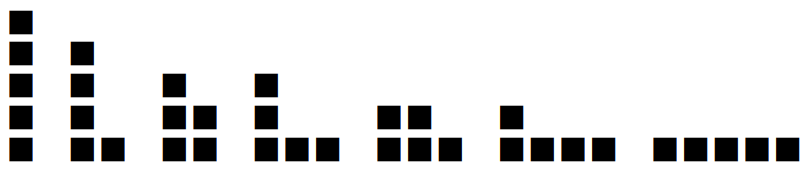

---
id: dc_ALLv10004
title: "04. [재귀함수 - 3] 정사각형 쌓기"
platform: "doingcoding"
is_scraped: true
time_limit: "1s"
memory_limit: "128MB"
tags: [doingcoding, scraped]
source_url: "http://edu.doingcoding.com/problem/ALLv10004"
---

# [ALLv10004번] 04. [재귀함수 - 3] 정사각형 쌓기

## 1. 문제 설명
같은 크기의 정사각형이 n개 있다. 이 정사각형들을 몇 개의 열로 나누어 쌓아 배치하려고 한다. 이때, 어떤 열에 쌓인 정사각형의 개수는 그 바로 오른쪽 열에 쌓인 개수보다 작아서는 안 된다. 예를 들어 n = 5이면 가능한 배치는 7가지이며, 각 배치는 왼쪽부터 각 열의 높이를 나열한 수열로 나타낼 수 있다.



(5),         (4, 1),             (3, 2),            (3, 1, 1),               (2, 2, 1),             (2, 1, 1, 1),                  (1, 1, 1, 1, 1).

n을 입력했을 때, 가능한 모든 배치를 사전식(lexicographical) 순서로 모두 출력하는 프로그램을 작성하라. 여기서 n ≤ 30으로 한다.

사전식 순서: 두 수열 (a1, a2, …, as), (b1, b2, …, bt)에 대하여, a1 > b1이면 첫 번째 수열이 두 번째 수열보다 앞선다. 또는 어떤 i > 1에 대하여 a1 = b1, …, a(i−1) = b(i−1)이고 ai > bi이면, 첫 번째 수열이 두 번째 수열보다 앞선다.

---

## 2. 입출력 설명

* **입력:**
한 줄에 정수 n이 주어진다.

* **출력:**
가능한 모든 배치를 위의 사전식 순서로 출력한다. 각 배치는 한 줄에 하나씩 출력하며, 한 배치 (a1, …, as)는 공백으로 구분하여 a1 a2 … as 형태로 출력한다.

---

## 3. 예시

### 예시 입력 1
```text
5
```

### 예시 출력 1
```text
5
4 1
3 2
3 1 1
2 2 1
2 1 1 1
1 1 1 1 1
```

---

## 4. 힌트
(힌트가 없습니다.)

---

<!-- ANSWER_START -->
## [정답 및 해설 (Ground Truth)]

### 모범 코드 (Python)
**(백준 크롤러에서는 정답 코드를 긁어올 수 없으므로, 선생님께서 아래에 직접 보충해 주세요)**

```python
A, B = map(int, input().split())
print(A + B)
```
<!-- ANSWER_END -->
