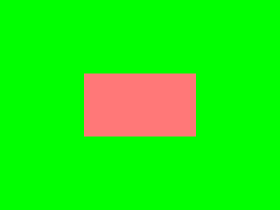
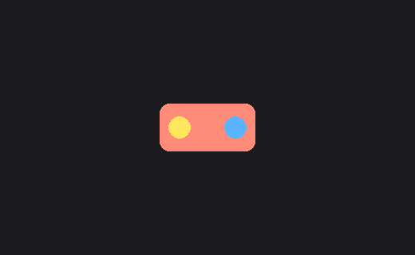

# Pygame Round01 문제 검수 원본

이 문서는 1주차 문제지를 검수하기 위한 원본 문서이다.
학생에게는 별도의 문제 파일을 제공하지 않고,
제시된 코드를 직접 작성하게 하는 구성을 기준으로 한다.

이번 버전의 핵심 원칙은 아래와 같다.

- 문항 형식은 `코드 입력형 + 빈칸형 + 복수정답 객관식형`만 사용한다.
- 자연어 자유서술형 정답은 최대한 제거한다.
- 자동채점이 가능해야 한다.
- 1주차 핵심 개념을 실제로 이해했는지 확인해야 한다.

내부 제작 기준 자료:

- `source/md_1회차_파이썬으로_게임만들기.md`
- `problem_map_round01.json`
- `problems/problem01.py`
- `problems/problem02.py`
- `problems/problem03.py`
- `problems/problem04.py`
- `problems/problem05.py`
- `problems/problem06.py`

---

## 재구성 원칙

6개 대문항은 1주차 핵심 개념 축에 맞춘다.

1. 창 생성과 화면 색
2. 이벤트 큐와 정상 종료
3. 화면 갱신과 FPS
4. 좌표와 도형 그리기
5. 이미지 출력과 회전 중심
6. 마우스 입력과 그림판 규칙

제외 또는 후순위:

- `모듈`, `__name__ == '__main__'`
- `font`, `rotozoom`
- `polygon`, `lines`

이 항목들은 1주차 내용에 포함되지만
1주차 검수용 핵심 6축에서는 우선순위를 낮춘다.

---

## 작성 규칙

소문항은 반드시 아래 순서를 유지한다.

1. 난이도
2. 형식
3. 출제 의도
4. 문제
5. 정답
6. 해설
7. 부분 정답 기준
8. 실제 실행 확인 결과
9. 검수 체크

형식 규칙:

- `코드 입력형`: 정답이 코드 한 줄 또는 짧은 블록
- `빈칸형`: 정답이 함수명, 상수, 숫자, 코드 조각
- `복수정답 객관식형`: 정답이 정해진 선택 조합

---

## 1번. 창 생성과 화면 색

제작 기준 코드:

- `problems/problem01.py`

확인 개념:

- `pygame.init()`
- `pygame.display.set_mode((가로, 세로))`
- `SURFACE.fill((R, G, B))`

코드 설명:

이 프로그램은 `pygame` 창을 만들고,
화면을 특정 색으로 채운 뒤
사각형 하나를 그리는 코드이다.
창 크기, 배경색, 도형 위치를 함께 확인할 수 있다.

제시 코드:

```python
import sys
import pygame
from pygame.locals import QUIT

pygame.init()
SURFACE = pygame.display.set_mode((400, 300))
pygame.display.set_caption("round01 problem01")


def main():
    while True:
        for event in pygame.event.get():
            if event.type == QUIT:
                pygame.quit()
                sys.exit()

        # BLOCK_A_START
        # 문제 1.1: 왜 실행 오류가 나는지 찾고 고치세요.
        SURFACE.fill((255, 255))

        # 문제 1.2: 사각형이 화면 중앙에 오도록 좌표를 수정하세요.
        pygame.draw.rect(SURFACE, (255, 120, 120), (0, 0, 160, 90))
        # BLOCK_A_END
        pygame.display.update()


if __name__ == "__main__":
    main()
```

참고 이미지:

아래 이미지는 코드가 `올바르게 수정되어 정상 작동할 경우`를
기준으로 한 참고 화면이다.



### 1.1

난이도:

- 하

형식:

- 코드 입력형

출제 의도:

- `fill()`의 RGB 형식 오류를 잡게 한다.

문제:

제시된 코드의 실행 오류를 고치기 위해
`fill()` 한 줄을 올바르게 다시 쓰시오.

정답:

```python
SURFACE.fill((255, 255, 255))
```

해설:

- `fill()`에는 RGB 3개 값이 들어간다.
- `(255, 255)`는 값 개수가 부족하다.

부분 정답 기준:

- `SURFACE.fill(...)` 형태를 유지하면 부분 정답
- RGB 3개 값이면 정답

실제 실행 확인 결과:

- 제시 코드 기준으로 `SURFACE.fill((255, 255))`에서 오류가 난다.

검수 체크:

- 정답이 한 줄로 고정되는지 확인

### 1.2

난이도:

- 하

형식:

- 코드 입력형

출제 의도:

- 좌표와 위치 이동의 관계를 직접 수정하게 한다.

문제:

창 크기가 `(400, 300)`이고,
사각형 크기가 `(160, 90)`일 때
사각형이 화면 중앙에 오도록
`draw.rect` 한 줄을 다시 쓰시오.

정답:

```python
pygame.draw.rect(SURFACE, (255, 120, 120), (120, 105, 160, 90))
```

해설:

- 중앙 좌표는 `(200, 150)`이고
  사각형의 왼쪽 위는 `(120, 105)`가 된다.

부분 정답 기준:

- x, y 둘 중 하나만 맞으면 부분 정답
- `(120, 105, 160, 90)`이면 정답

실제 실행 확인 결과:

- 1.1 수정 후 사각형은 `(0, 0)`에 표시된다.

검수 체크:

- 계산 또는 좌표 이해가 필요한 문항인지 확인

### 1.3

난이도:

- 하

형식:

- 빈칸형

출제 의도:

- `set_mode` 숫자의 의미를 묻게 한다.

문제:

창의 가로 길이를 `600`,
세로 길이를 `400`으로 바꾸려면
빈칸에 들어갈 숫자를 순서대로 쓰시오.

```python
SURFACE = pygame.display.set_mode((____, ____))
```

정답:

- `600, 400`

해설:

- 앞 숫자는 가로, 뒤 숫자는 세로다.

부분 정답 기준:

- 하나만 맞으면 부분 정답
- 둘 다 맞으면 정답

실제 실행 확인 결과:

- 제시 코드에서 바로 확인할 수 있다.

검수 체크:

- 단순 베끼기보다 숫자의 의미를 이해해야 맞출 수 있는지 확인

### 1.4

형식:

- 복수정답 객관식형

문제:

제시 코드의 `BLOCK_A_START`와 `BLOCK_A_END` 사이를
아래 코드로 바꾸시오.

```python
SURFACE.fill((0, 255, 0))
pygame.draw.rect(SURFACE, (255, 120, 120), (120, 105, 160, 90))
```

실행 후 옳은 것을 모두 고른 것은?

- ㄱ. 배경색이 초록색으로 바뀐다.
- ㄴ. 사각형은 화면 중앙 근처에 보인다.
- ㄷ. `fill()` 실행 오류가 계속 발생한다.
- ㄹ. 창 크기가 자동으로 `(600, 400)`이 된다.

정답:

- `ㄱ, ㄴ`

---

## 2번. 이벤트 큐와 정상 종료

제작 기준 코드:

- `problems/problem03.py`

확인 개념:

- `for event in pygame.event.get():`
- `if event.type == QUIT:`
- `pygame.quit()`
- `sys.exit()`

코드 설명:

이 프로그램은 창을 띄우고 원 하나를 그리지만,
종료 버튼을 눌렀을 때
정상적으로 닫히지 않는 상태의 코드이다.
이벤트 처리와 프로그램 종료를 함께 확인할 수 있다.

제시 코드:

```python
import sys
import pygame
from pygame.locals import QUIT

pygame.init()
SURFACE = pygame.display.set_mode((400, 300))
pygame.display.set_caption("round01 problem03")


def main():
    while True:
        # BLOCK_A_START
        SURFACE.fill((20, 20, 20))
        pygame.draw.circle(SURFACE, (255, 210, 80), (200, 150), 60)

        # 문제 3.1, 3.2: X 버튼으로 창이 닫히도록 고치세요.
        if False:
            pygame.quit()
            sys.exit()
        # BLOCK_A_END

        pygame.display.update()


if __name__ == "__main__":
    main()
```

### 2.1

난이도:

- 중

형식:

- 복수정답 객관식형

출제 의도:

- 종료가 안 되는 이유를 이벤트 큐 개념과 연결하게 한다.

문제:

제시된 프로그램에서 창이 닫히지 않는 이유로 옳은 것을 모두 고른 것은?

- ㄱ. `pygame.event.get()`으로 이벤트를 읽는 코드가 없다.
- ㄴ. `if False:`는 실행되지 않는다.
- ㄷ. `pygame.display.update()`가 없어서 종료되지 않는다.
- ㄹ. `SURFACE.fill()`의 색상값이 잘못되었다.

정답:

- `ㄱ, ㄴ`

해설:

- 종료가 안 되는 핵심은 이벤트를 읽지 않는 것과
  `if False:` 블록이 실행되지 않는 것이다.

부분 정답 기준:

- `ㄱ`만 고르면 부분 정답
- `ㄱ, ㄴ`이면 정답

실제 실행 확인 결과:

- 제시 코드 기준으로 창은 열리지만 정상 종료되지 않는다.

검수 체크:

- 찍기로 맞히기 어렵도록 선택지가 적절한지 확인

### 2.2

난이도:

- 중

형식:

- 코드 입력형

출제 의도:

- 종료 처리의 기본 블록을 복구하게 한다.

문제:

`X` 버튼을 눌렀을 때 프로그램이 종료되도록
정답 블록을 쓰시오.

정답:

```python
for event in pygame.event.get():
    if event.type == QUIT:
        pygame.quit()
        sys.exit()
```

해설:

- 종료 처리의 핵심 블록이다.

부분 정답 기준:

- `for event in pygame.event.get():`가 있으면 부분 정답
- 전체 블록이 맞으면 정답

실제 실행 확인 결과:

- 제시 코드에는 이 블록이 빠져 있다.

검수 체크:

- 정답 블록이 종료 처리 개념과 정확히 연결되는지 확인

### 2.3

난이도:

- 하

형식:

- 빈칸형

출제 의도:

- `QUIT` 상수의 의미를 확인한다.

문제:

빈칸에 들어갈 상수를 쓰시오.

```python
if event.type == ______:
```

정답:

- `QUIT`

해설:

- `QUIT`는 사용자가 종료 버튼을 눌렀는지 확인할 때 쓰는 값이다.

부분 정답 기준:

- 없음. `QUIT`만 정답 처리

실제 실행 확인 결과:

- 제시 코드에서도 `QUIT`를 사용해야 정상 종료를 처리할 수 있다.

검수 체크:

- 용어와 실제 역할이 연결되는지 확인

### 2.4

형식:

- 복수정답 객관식형

문제:

제시 코드의 `BLOCK_A_START`와 `BLOCK_A_END` 사이를
아래 코드로 바꾸시오.

```python
SURFACE.fill((20, 20, 20))
pygame.draw.circle(SURFACE, (255, 210, 80), (200, 150), 60)

for event in pygame.event.get():
    if event.type == QUIT:
        pygame.quit()
        sys.exit()
```

실행 후 옳은 것을 모두 고른 것은?

- ㄱ. 창이 정상적으로 열린다.
- ㄴ. X 버튼으로 창을 닫을 수 있다.
- ㄷ. 원은 더 이상 보이지 않는다.
- ㄹ. `pygame.display.update()`가 없어도 화면이 잘 보인다.

정답:

- `ㄱ, ㄴ`

---

## 3번. 화면 갱신과 FPS

제작 기준 코드:

- `problems/problem04.py`

확인 개념:

- `pygame.display.update()`
- `pygame.time.Clock()`
- `FPSCLOCK.tick(n)`

코드 설명:

이 프로그램은 색이 계속 바뀌는 배경과
가로로 움직이는 사각형을 보여 주는 코드이다.
화면 갱신과 FPS 제한의 역할을 함께 확인할 수 있다.

제시 코드:

```python
import sys
import pygame
from pygame.locals import QUIT

pygame.init()
SURFACE = pygame.display.set_mode((500, 240))
pygame.display.set_caption("round01 problem04")
FPSCLOCK = pygame.time.Clock()


def main():
    xpos = 0
    color_value = 0

    while True:
        for event in pygame.event.get():
            if event.type == QUIT:
                pygame.quit()
                sys.exit()

        # BLOCK_A_START
        xpos += 4
        if xpos > 540:
            xpos = -40

        color_value += 3
        if color_value > 255:
            color_value = 0

        SURFACE.fill((color_value, 100, 255 - color_value))
        pygame.draw.rect(SURFACE, (50, 120, 255), (xpos, 120, 40, 40))
        # BLOCK_A_END

        # 문제 4.1: 화면 변화가 보이도록 빠진 한 줄을 넣으세요.
        # 문제 4.2, 4.3: tick 값을 바꿔 움직임을 비교하세요.
        FPSCLOCK.tick(60)


if __name__ == "__main__":
    main()
```

### 3.1

난이도:

- 중

형식:

- 코드 입력형

출제 의도:

- 화면 갱신 명령이 빠졌을 때의 문제를 이해하게 한다.

문제:

색 값과 좌표는 바뀌는데 화면은 바뀌지 않는다.
필요한 한 줄을 쓰시오.

정답:

```python
pygame.display.update()
```

해설:

- 내부 값은 바뀌어도 화면 반영 명령이 없으면 보이지 않는다.

부분 정답 기준:

- 없음. 정답 한 줄 일치만 정답 처리

실제 실행 확인 결과:

- 제시 코드에는 `update()`가 빠져 있다.

검수 체크:

- 화면 갱신 개념과 직접 연결되는지 확인

### 3.2

난이도:

- 하

형식:

- 복수정답 객관식형

출제 의도:

- FPS가 높을수록 더 부드럽게 보일 수 있음을 확인한다.

문제:

다음 중 `tick(1)`보다 `tick(60)`에 더 가까운 설명을
모두 고른 것은?

- ㄱ. 더 자연스럽게 움직인다.
- ㄴ. 1초에 더 많은 프레임을 보여줄 수 있다.
- ㄷ. 화면 변화가 거의 멈춘 것처럼 보인다.
- ㄹ. 더 부드럽게 보일 수 있다.

정답:

- `ㄱ, ㄴ, ㄹ`

해설:

- FPS가 높을수록 더 부드럽게 보일 수 있다.

부분 정답 기준:

- `ㄱ, ㄴ` 또는 `ㄱ, ㄹ`이면 부분 정답
- `ㄱ, ㄴ, ㄹ`이면 정답

실제 실행 확인 결과:

- `update()` 복구 후 비교하면 `tick(60)`이 더 자연스럽다.

검수 체크:

- 찍기 방지가 되는 조합인지 확인

### 3.3

난이도:

- 중

형식:

- 빈칸형

출제 의도:

- `tick()`의 수치를 정확히 묻게 한다.

문제:

FPS를 30으로 제한하려면
빈칸에 들어갈 숫자를 쓰시오.

```python
FPSCLOCK.tick(____)
```

정답:

- `30`

해설:

- `tick(n)`은 FPS 제한 수치를 넣는 코드다.

부분 정답 기준:

- 없음. `30`만 정답 처리

실제 실행 확인 결과:

- 제시 코드 기준으로 `FPSCLOCK.tick(60)`을 사용한다.

검수 체크:

- 단순 암기가 아니라 FPS 의미를 이해한 학생이 맞출 수 있는지 확인

### 3.4

형식:

- 복수정답 객관식형

문제:

제시 코드의 `BLOCK_A_START`와 `BLOCK_A_END` 사이를
아래 코드로 바꾸시오.

```python
xpos += 2
if xpos > 540:
    xpos = -40

color_value += 10
if color_value > 255:
    color_value = 0

SURFACE.fill((color_value, 100, 255 - color_value))
pygame.draw.rect(SURFACE, (50, 120, 255), (xpos, 120, 40, 40))
```

그리고 `pygame.display.update()`를 `FPSCLOCK.tick(60)` 위에 추가하시오.
실행 후 옳은 것을 모두 고른 것은?

- ㄱ. 사각형은 이전보다 느리게 움직인다.
- ㄴ. 배경색은 더 빠르게 바뀐다.
- ㄷ. 화면 변화가 전혀 보이지 않는다.
- ㄹ. 사각형 크기는 그대로다.

정답:

- `ㄱ, ㄴ, ㄹ`

---

## 4번. 좌표와 도형 그리기

제작 기준 코드:

- `problems/problem02.py`

확인 개념:

- `pygame.draw.rect`
- `pygame.draw.circle`
- 좌표 체계
- 선 굵기

코드 설명:

이 프로그램은 같은 화면에 사각형과 원을 그려서,
도형의 좌표와 그리기 순서에 따라
화면 결과가 어떻게 달라지는지 확인하는 코드이다.
좌표, 도형, 선 굵기 개념을 함께 확인할 수 있다.

제시 코드:

```python
import sys
import pygame
from pygame.locals import QUIT

pygame.init()
SURFACE = pygame.display.set_mode((500, 350))
pygame.display.set_caption("round01 problem02")


def main():
    while True:
        for event in pygame.event.get():
            if event.type == QUIT:
                pygame.quit()
                sys.exit()

        # BLOCK_A_START
        SURFACE.fill((245, 245, 245))
        pygame.draw.rect(SURFACE, (255, 120, 120), (140, 90, 170, 130))
        pygame.draw.circle(SURFACE, (80, 140, 255), (250, 170), 85)
        # BLOCK_A_END
        pygame.display.update()


if __name__ == "__main__":
    main()
```

참고 이미지:

아래 이미지는 코드가 `올바르게 수정되어 정상 작동할 경우`를
기준으로 한 참고 화면이다.


### 4.1

난이도:

- 하

형식:

- 빈칸형

출제 의도:

- 사각형 인자의 순서를 정확히 묻게 한다.

문제:

아래 빈칸에 들어갈 말을 순서대로 쓰시오.

`(140, 90, 170, 130)`의 의미:
`____, ____, ____, ____`

정답:

- `x좌표, y좌표, 가로길이, 세로길이`

해설:

- 사각형 인자는
  왼쪽 위 꼭짓점 x, y, 가로, 세로 순서로 설명한다.

부분 정답 기준:

- 좌표 2개와 크기 2개를 구분하면 부분 정답
- 순서를 정확히 쓰면 정답

실제 실행 확인 결과:

- 제시 코드의 사각형 인자와 바로 대응된다.

검수 체크:

- 순서 암기가 아니라 개념 이해가 필요한지 확인

### 4.2

난이도:

- 하

형식:

- 빈칸형

출제 의도:

- draw 순서와 화면 앞뒤 관계를 연결한다.

문제:

제시된 코드에서 더 앞에 보이는 도형 이름을 쓰시오.

정답:

- `원`

해설:

- 원이 사각형보다 나중에 그려져 앞에 보인다.

부분 정답 기준:

- 없음. `원`만 정답 처리

실제 실행 확인 결과:

- 제시 코드 기준으로 원이 더 앞에 보인다.

검수 체크:

- 시각 관찰이 draw 순서 개념과 연결되는지 확인

### 4.3

난이도:

- 중

형식:

- 복수정답 객관식형

출제 의도:

- 선 굵기 개념을 이해했는지 확인한다.

문제:

도형의 선 굵기 설명과 일치하는 것을 모두 고른 것은?

- ㄱ. 마지막 인수를 생략하면 내부가 채워진다.
- ㄴ. 마지막 인수에 `0`이 아닌 값을 넣으면 선만 그릴 수 있다.
- ㄷ. 선 굵기 값은 색상값보다 먼저 써야 한다.
- ㄹ. `3`은 선 굵기 값으로 사용할 수 있다.

정답:

- `ㄱ, ㄴ, ㄹ`

해설:

- 마지막 인수가 `0`이면 채우기,
  `0`이 아닌 값이면 선만 그리는 상태라고 설명한다.

부분 정답 기준:

- `ㄱ, ㄴ` 또는 `ㄱ, ㄹ`이면 부분 정답
- `ㄱ, ㄴ, ㄹ`이면 정답

실제 실행 확인 결과:

- 제시 코드에는 선 굵기 예제가 직접 없어서
  이후 코드 동기화가 필요하다.

검수 체크:

- 코드와 문항의 직접 대응을 이후 보완해야 하는 항목으로 표시

### 4.4

형식:

- 복수정답 객관식형

문제:

제시 코드의 `BLOCK_A_START`와 `BLOCK_A_END` 사이를
아래 코드로 바꾸시오.

```python
SURFACE.fill((245, 245, 245))
pygame.draw.circle(SURFACE, (80, 140, 255), (250, 170), 85)
pygame.draw.rect(SURFACE, (255, 120, 120), (140, 90, 170, 130))
```

실행 후 옳은 것을 모두 고른 것은?

- ㄱ. 사각형이 원보다 앞에 보인다.
- ㄴ. 도형 종류는 이전과 같다.
- ㄷ. 원이 완전히 사라진다.
- ㄹ. 배경색은 바뀌지 않는다.

정답:

- `ㄱ, ㄴ, ㄹ`

---

## 5번. 이미지 출력과 회전 중심

제작 기준 코드:

- `problems/problem05.py`

확인 개념:

- `pygame.image.load`
- `SURFACE.blit`
- `pygame.transform.rotate`
- `get_rect()`
- `center`

코드 설명:

이 프로그램은 하나의 스프라이트를 계속 회전시키는 코드이다.
현재는 회전한 이미지를 `(0, 0)`에 바로 그리기 때문에
중심을 기준으로 도는 것처럼 보이지 않는다.
이미지 출력, 회전, 중심 좌표 개념을 함께 확인할 수 있다.

제시 코드:

```python
import sys
import pygame
from pygame.locals import QUIT

pygame.init()
SURFACE = pygame.display.set_mode((520, 320))
pygame.display.set_caption("round01 problem05")
FPSCLOCK = pygame.time.Clock()


def make_sprite():
    sprite = pygame.Surface((140, 80), pygame.SRCALPHA)
    pygame.draw.rect(sprite, (255, 140, 120), (10, 10, 120, 60), border_radius=12)
    pygame.draw.circle(sprite, (255, 230, 90), (35, 40), 14)
    pygame.draw.circle(sprite, (90, 180, 255), (105, 40), 14)
    return sprite


def main():
    sprite = make_sprite()
    theta = 0

    while True:
        for event in pygame.event.get():
            if event.type == QUIT:
                pygame.quit()
                sys.exit()

        # BLOCK_A_START
        theta += 3
        SURFACE.fill((25, 25, 30))
        rotated = pygame.transform.rotate(sprite, theta)
        SURFACE.blit(rotated, (0, 0))
        # BLOCK_A_END
        pygame.display.update()
        FPSCLOCK.tick(60)


if __name__ == "__main__":
    main()
```

참고 이미지:

아래 이미지는 코드가 `올바르게 수정되어 정상 작동할 경우`를
기준으로 한 참고 화면이다.



### 5.1

난이도:

- 중

형식:

- 빈칸형

출제 의도:

- 현재 회전 문제의 기준 좌표를 정확히 보게 한다.

문제:

현재 회전 이미지가 기준으로 삼고 있는 좌표를 쓰시오.

정답:

- `(0, 0)`

해설:

- 제시 코드는 `SURFACE.blit(rotated, (0, 0))`을 사용한다.

부분 정답 기준:

- 없음. `(0, 0)`만 정답 처리

실제 실행 확인 결과:

- 제시 코드는 회전 이미지를 `(0, 0)`에 출력한다.

검수 체크:

- 회전 중심 개념과 직접 연결되는지 확인

### 5.2

난이도:

- 중상

형식:

- 코드 입력형

출제 의도:

- 회전 후 새 rect를 잡아야 한다는 점을 이해하게 한다.

문제:

회전한 이미지의 중심을 `(260, 160)`으로 맞추는
정답 두 줄을 쓰시오.

정답:

```python
rotated_rect = rotated.get_rect(center=(260, 160))
SURFACE.blit(rotated, rotated_rect)
```

해설:

- 회전된 이미지에 맞는 새 rect를 만들고
  그 중심을 설정한 뒤 `blit`한다고 설명한다.

부분 정답 기준:

- `get_rect(center=(260, 160))`를 쓰면 부분 정답
- 두 줄 모두 맞으면 정답

실제 실행 확인 결과:

- 제시 코드는 중심 보정 전 상태다.

검수 체크:

- 회전 중심 개념을 이해한 학생만 풀 수 있는지 확인

### 5.3

난이도:

- 하

형식:

- 빈칸형

출제 의도:

- 이미지 출력 함수 이름을 묻게 한다.

문제:

이미지를 화면에 출력할 때 사용하는 함수 이름을 쓰시오.

정답:

- `blit`

해설:

- `SURFACE.blit(...)`는
  이미지 출력 방식을 설명한다.

부분 정답 기준:

- 없음. `blit`만 정답 처리

실제 실행 확인 결과:

- 제시 코드도 회전 이미지를 `blit`으로 출력한다.

검수 체크:

- 용어와 실제 코드 문맥이 연결되는지 확인

### 5.4

형식:

- 복수정답 객관식형

문제:

제시 코드의 `BLOCK_A_START`와 `BLOCK_A_END` 사이를
아래 코드로 바꾸시오.

```python
theta += 1
SURFACE.fill((25, 25, 30))
rotated = pygame.transform.rotate(sprite, theta)
rotated_rect = rotated.get_rect(center=(260, 160))
SURFACE.blit(rotated, rotated_rect)
```

실행 후 옳은 것을 모두 고른 것은?

- ㄱ. 회전 속도가 이전보다 느려진다.
- ㄴ. 이미지가 화면 가운데를 기준으로 도는 것처럼 보인다.
- ㄷ. 이미지가 계속 `(0, 0)` 기준으로만 돈다.
- ㄹ. 배경색은 그대로다.

정답:

- `ㄱ, ㄴ, ㄹ`

---

## 6번. 마우스 입력과 그림판 규칙

제작 기준 코드:

- `problems/problem06.py`

확인 개념:

- `MOUSEMOTION`
- `event.pos`
- 좌표 리스트 저장
- 클릭할 때만 그리도록 수정

코드 설명:

이 프로그램은 마우스가 지나간 위치를 저장해
화면에 점을 찍는 간단한 그림판 코드이다.
현재는 클릭하지 않아도 점이 계속 찍히도록 되어 있어서,
입력 규칙과 마우스 좌표 처리를 함께 확인할 수 있다.

제시 코드:

```python
import sys
import pygame
from pygame.locals import QUIT, MOUSEMOTION

pygame.init()
SURFACE = pygame.display.set_mode((600, 420))
pygame.display.set_caption("round01 problem06")
FPSCLOCK = pygame.time.Clock()


def main():
    mouse_positions = []

    while True:
        for event in pygame.event.get():
            if event.type == QUIT:
                pygame.quit()
                sys.exit()
            # BLOCK_A_START
            elif event.type == MOUSEMOTION:
                # 문제 6.2: 클릭한 상태에서만 점이 그려지도록 고치세요.
                mouse_positions.append(event.pos)
            # BLOCK_A_END

        SURFACE.fill((255, 255, 255))

        # BLOCK_B_START
        for pos in mouse_positions:
            pygame.draw.circle(SURFACE, (20, 20, 20), pos, 5)
        # BLOCK_B_END

        pygame.display.update()
        FPSCLOCK.tick(60)


if __name__ == "__main__":
    main()
```

참고 이미지:

아래 이미지는 코드가 `올바르게 수정되어 정상 작동할 경우`를
기준으로 한 참고 화면이다.


### 6.1

난이도:

- 하

형식:

- 빈칸형

출제 의도:

- 마우스 움직임 이벤트 이름을 정확히 묻게 한다.

문제:

마우스를 움직일 때마다 좌표를 리스트에 넣게 만드는
이벤트 타입 이름을 쓰시오.

정답:

- `MOUSEMOTION`

해설:

- 그림판 코드의 핵심은
  `elif event.type == MOUSEMOTION:`이다.

부분 정답 기준:

- 없음. `MOUSEMOTION`만 정답 처리

실제 실행 확인 결과:

- 제시 코드는 `MOUSEMOTION`으로 좌표를 저장한다.

검수 체크:

- 이벤트 이름과 역할이 연결되는지 확인

### 6.2

난이도:

- 중

형식:

- 코드 입력형

출제 의도:

- 클릭 상태 조건을 직접 추가하게 한다.

문제:

마우스를 클릭한 상태에서만 점이 그려지도록
정답 한 줄을 쓰시오.

정답:

```python
elif event.type == MOUSEMOTION and event.buttons[0]:
    mouse_positions.append(event.pos)
```

해설:

- 클릭한 상태에서만 그리도록 조건을 추가해야 한다.

부분 정답 기준:

- `event.buttons[0]`까지 쓰면 부분 정답
- 전체 한 줄이 맞으면 정답

실제 실행 확인 결과:

- 제시 코드는 아직 클릭 조건이 없는 상태다.

검수 체크:

- 입력 조건의 의미를 이해한 학생만 풀 수 있는지 확인

### 6.3

난이도:

- 하

형식:

- 코드 입력형

출제 의도:

- 리스트에 저장된 좌표를 다시 점으로 그리는 줄을 확인한다.

문제:

리스트에 저장된 좌표 `pos`에
검은 점을 찍는 정답 한 줄을 쓰시오.

정답:

```python
pygame.draw.circle(SURFACE, (0, 0, 0), pos, 5)
```

해설:

- 그림판 출력의 핵심 줄이다.

부분 정답 기준:

- `draw.circle` 형태를 유지하면 부분 정답
- 색상, 위치, 반지름까지 맞으면 정답

실제 실행 확인 결과:

- 제시 코드는 거의 같은 구조를 사용한다.

검수 체크:

- 좌표 저장과 출력 흐름을 이해한 학생만 재구성할 수 있는지 확인

### 6.4

형식:

- 복수정답 객관식형

문제:

제시 코드의 `BLOCK_A_START`와 `BLOCK_A_END` 사이를
아래 코드로 바꾸시오.

```python
elif event.type == MOUSEMOTION and event.buttons[0]:
    mouse_positions.append(event.pos)
```

그리고 `BLOCK_B_START`와 `BLOCK_B_END` 사이를
아래 코드로 바꾸시오.

```python
for pos in mouse_positions:
    pygame.draw.circle(SURFACE, (255, 80, 80), pos, 8)
```

실행 후 옳은 것을 모두 고른 것은?

- ㄱ. 마우스를 움직이기만 하면 점이 찍힌다.
- ㄴ. 클릭한 상태에서 움직일 때만 점이 찍힌다.
- ㄷ. 점 색은 빨간색 계열로 바뀐다.
- ㄹ. 점 크기는 이전보다 커진다.

정답:

- `ㄴ, ㄷ, ㄹ`

---

## 총평

현재 6대문항은 1주차 핵심 축에 맞춰 재구성되었다.

문항 형식은 모두 아래 셋으로 제한했다.

- 코드 입력형
- 빈칸형
- 복수정답 객관식형

따라서 다음 장점이 있다.

- 자동채점 구조를 만들기 쉽다.
- 자연어 표현 차이 문제를 줄일 수 있다.
- 개념 이해 여부를 직접 검증할 수 있다.

다음 단계 권장 순서:

1. 이 검수 원본 확정
2. `problem*.py`를 이 문항 구조에 맞게 다시 동기화
3. `problem_map_round01.json` 갱신
4. 웹용 JSON 생성

---
