# 파이썬 설정

파이썬에서 한글을 사용하려고 하면 오류가 발생할 때가 있습니다. 그럴 때는 아래 사진을 따라 설정 을 바꿔주면 됩니다.

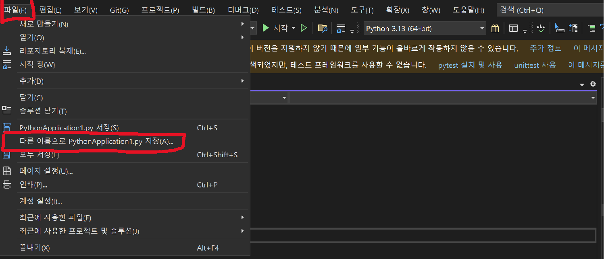

###### 오른쪽 아래 저장 옆 화살표 클릭

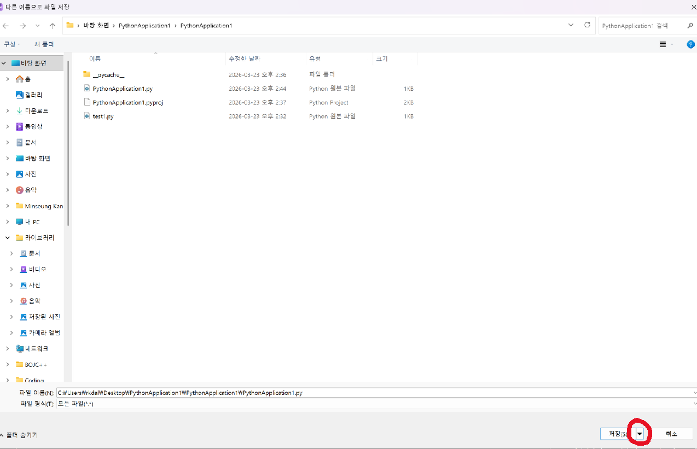

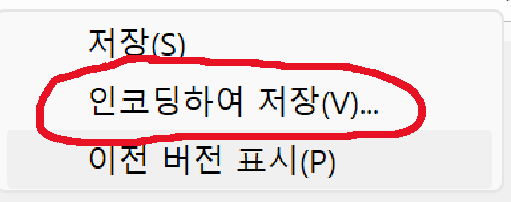

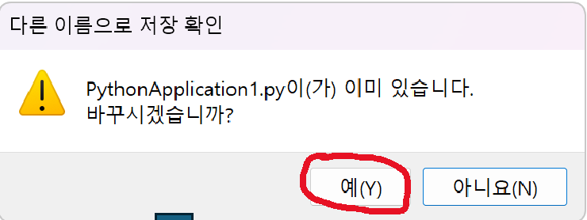

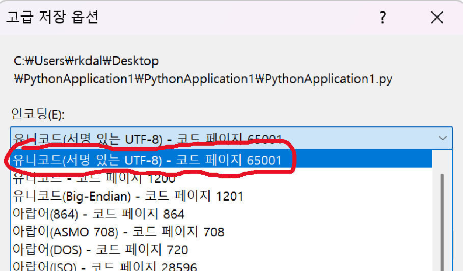

# 모듈이란?

- 다른 파일에 있는 코드를 가져다 쓰는 것

###### Visual studio 화면 위쪽에 검색이라고 되어 있는 부분을 클릭하고 솔루션 탐색기 라고 검색하고 클릭해봅시다

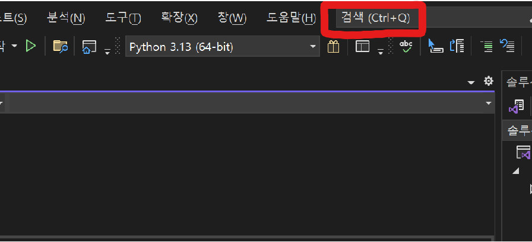

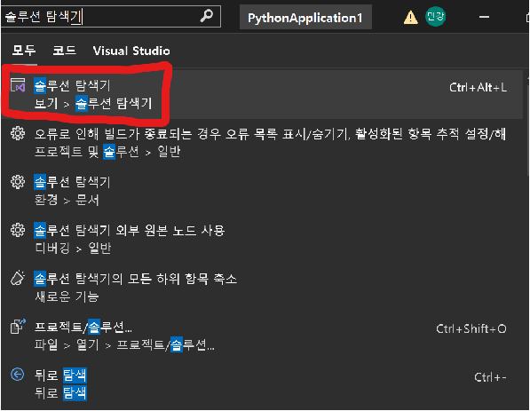

그럼 아래와 같이 솔루션 탐색기가 화면에 나오게 됩니다. 여기서 PythonApplication1이라고 되어있는 부분을 우클릭하고 아래 사진에서

빨간색으로 표시된 부분을 눌러봅시다

(PythonApplication1이 아닌 다른 이름으로 되어있을 수도 있습니다.)

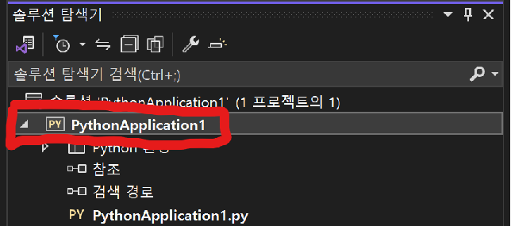

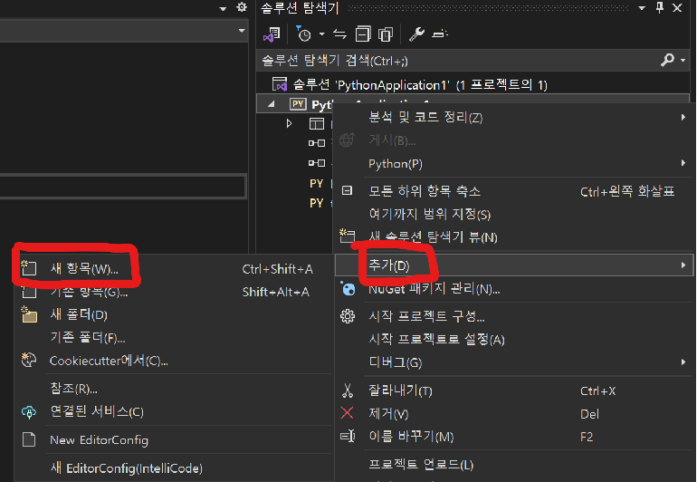

이런 화면이 나오면 Python클래스를 선택하고 이름을 설정해서 추가를 눌러줍시다. 이름은 아무렇게나 작성해도 되는데 여기서는 test1.py로 하겠습니다.

(뒤에 .py는 꼭 붙여야 합니다.)

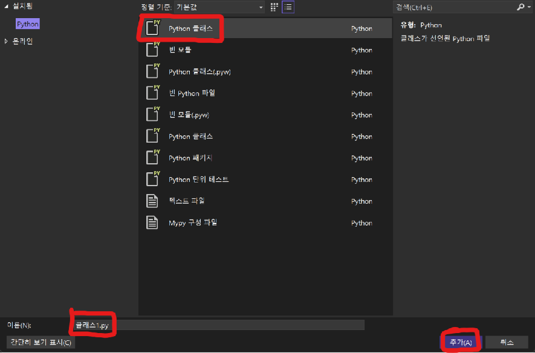

###### 그럼 솔루션 탐색기에 새로운 파이썬 파일이 하나 추가됩니다. 더블클릭하면 해당 파일이 열리고 거기서 파이썬 코드를 작성할 수 있습니다.

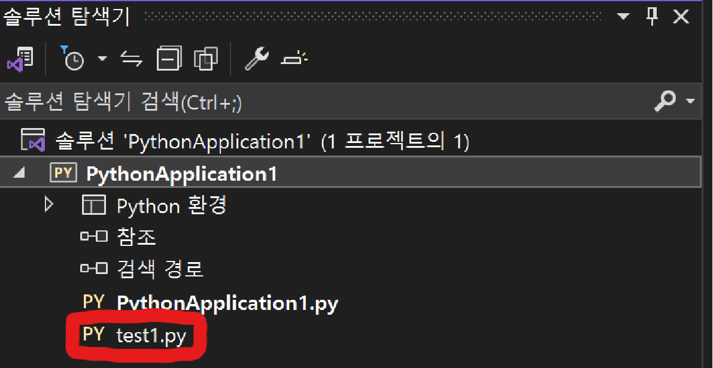

test1.py에서 다음과 같이 함수를 만든 뒤 PythonApplication1.py에서 오른쪽 사진처럼 코드를 작성하면 test1.py에 있는 함수, 즉 다른 파일에 있는 코드 사용이 가능합니다. 이런걸 모듈이라 부릅니다.

정확히는 PythonApplication1.py 입장에서 봤을 때 test1.py가 모듈입니다.

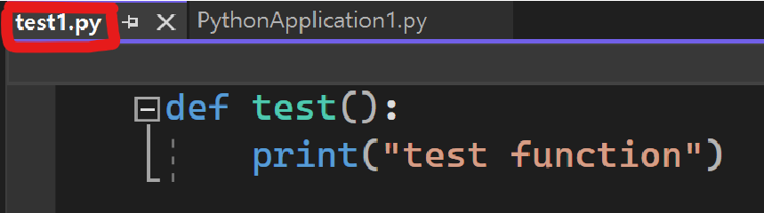

test1에 있는 코드를 쓰겠다는 뜻입니다

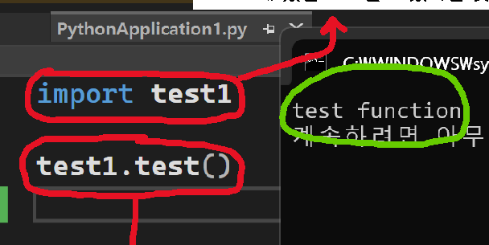

test1에 있는 test()라는 함수를 사용한다는 뜻입니다.

###### 아래와 같은 방식으로도 사용이 가능합니다.

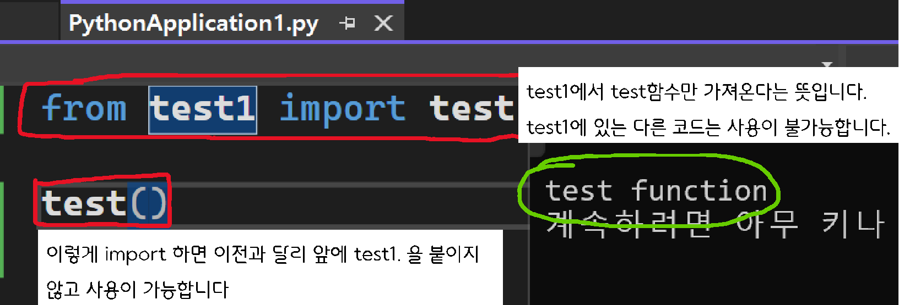

test1에서 test함수만 가져온다는 뜻입니다.

test1에 있는 다른 코드는 사용이 불가능합니다.

이렇게 import 하면 이전과 달리 앞에 test1. 을 붙이지 않고 사용이 가능합니다

#### 파이썬으로 게임을 만들다보면

다양한 모듈을 사용하게 됩니다. 물론 직접 만들 필요는 없습니다. 파이썬에서 기본적으로 제공해주는 모 듈이나 간단하게 설치만 하면 바로 가져다 쓸 수 있는 모듈들을 사용합니다.

아~ 모듈이라는건 이런거구나를 이해했으면 다음으로 넘어갑시다.

#### 모듈의 문제점

모듈은 코드를 보기 편하게 만들어 줍니다. 하나의 파일 안에 코드를 다 집어넣는게 아니라

여러 파일에 나누어 넣다보니 훨씬 보기 편합니다.

그래서 보통 개발을 하게 되면 모듈 파일 여러 개와 모듈을 import해서 코드를 실제로 실행할 메인 파일 하나로 이루어지게 됩니다. 그런데 처음에는 모듈로만 쓰려고 했던 파일을 메인으로 사용하 고 싶어질 수도 있습니다. 이 때 어떤 문제가 생길까요?

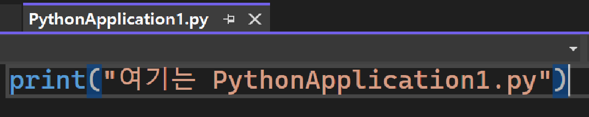

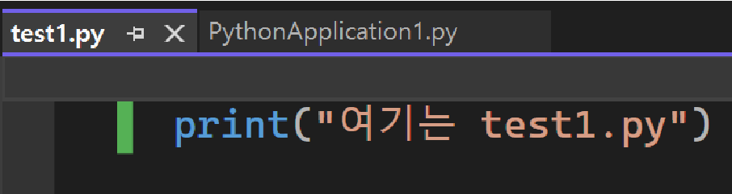

실행 버튼을 누르면 PythonApplication1.py와 test1.py 두 개의 파일 중 어떤 파일이 실제로 실행되는지 확인해 봅시다. 실행을 하면 두 개의 파일 중 어떤 것이 실행되는지 구분할 수 있도록 위와 같이 print문을

작성하고 실행해봅시다.

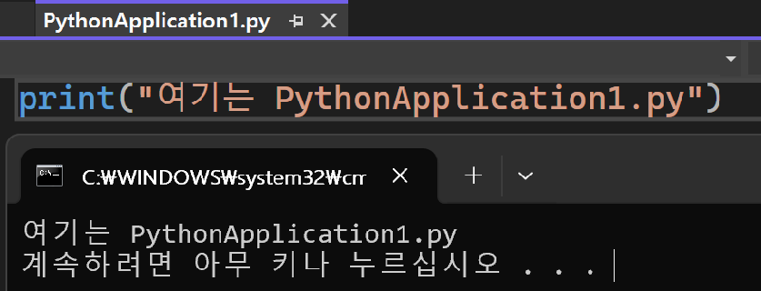

###### PythonApplication1.py가 실행됩니다. test1.py는 실행되지 않습니다 PythonApplication1.py가 현재 메인파일로 설정되서 그렇습니다.

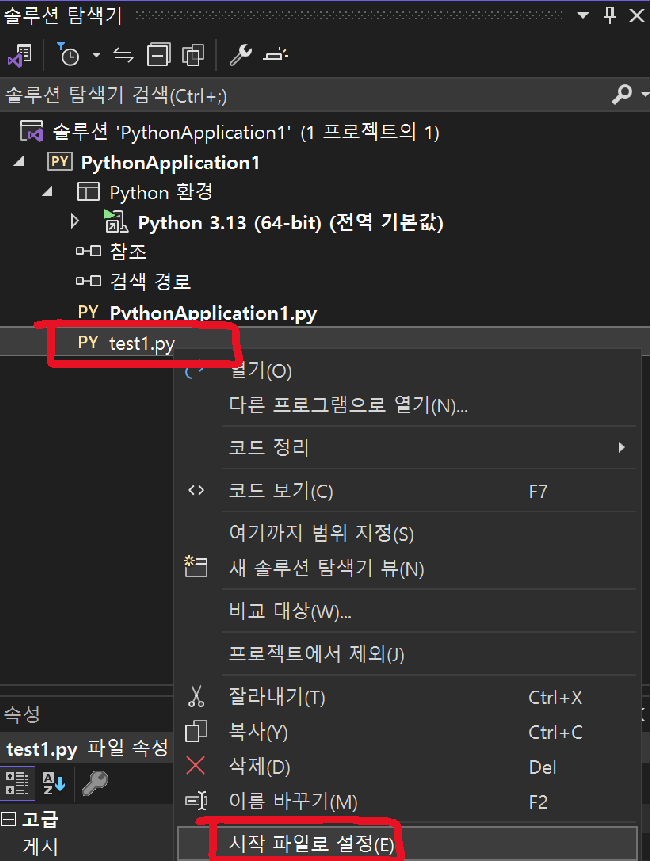

메인파일을 바꾸려면 솔루션 탐색기에서 메인파일로 설정

하고 싶은 파일을 우클릭 하고 시작 파일로 설정을 눌러주 면 됩니다.

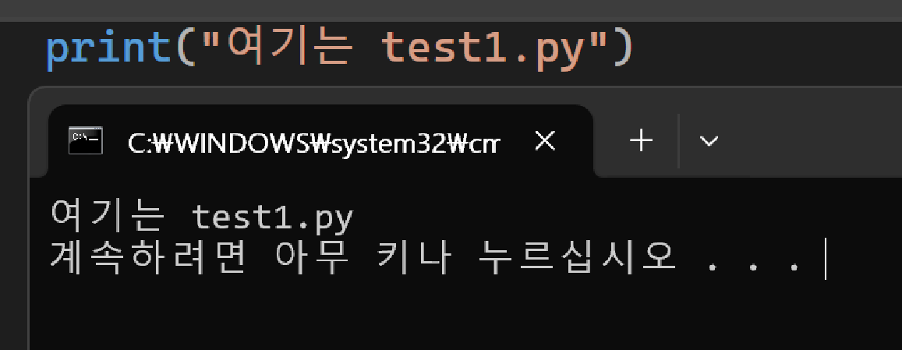

###### 실행해보면 메인파일이 test1.py로 바뀐걸 확인할 수 있습니다.

###### PythonApplication1.py를 원래 메인 파일로 사용하다가 test1.py를 메인 파일로 사용해야하는 상황이라고 해봅시다. PythonApplication1.py에는 실제 실행하는 코드가 대부분일 거고 반대로 test1.py에는 실행코드 는 없고 변수와 함수만 있는 상태였을 겁니다.

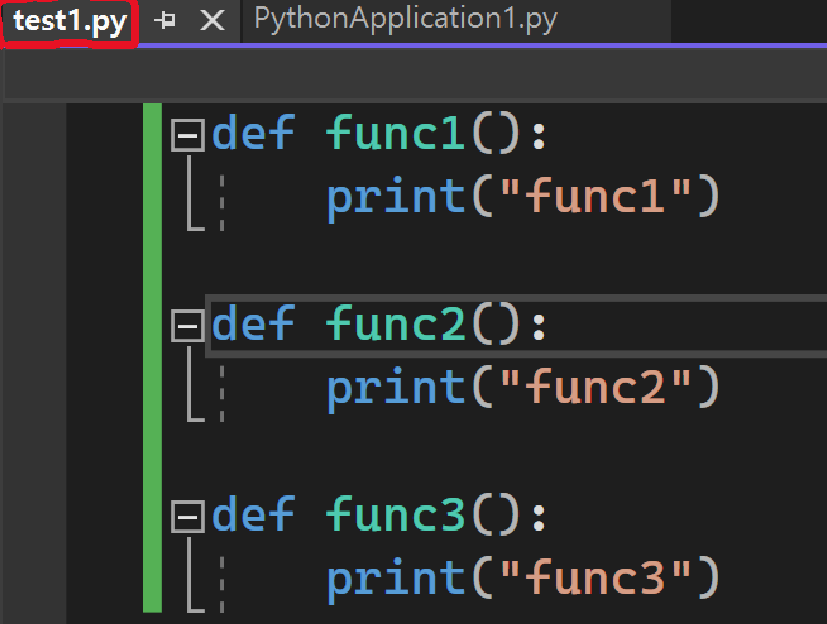

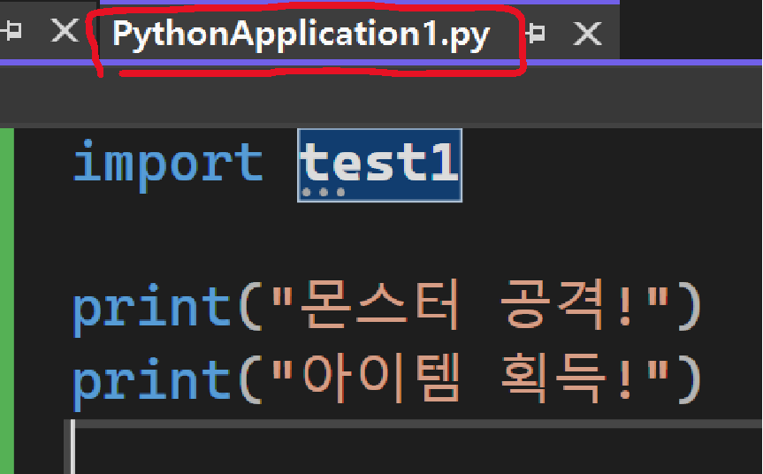

여기서 메인 파일을 test1.py로 바꾸고 PythonApplication1을 import하면 어떻게 될까요?

test1.py에는 실행 코드가 하나도 없는데도 출력 결과가 나오게 됩니다. PythonApplication1을 import 하면서 거기에 있던 print 코드가 실행된겁니다.

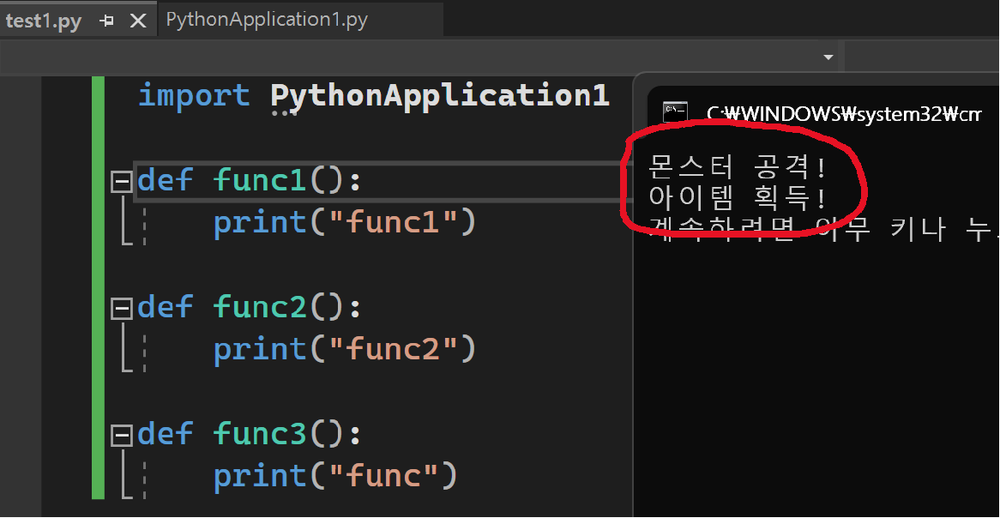

의도적으로 이렇게 사용할 수도 있겠지만 보통은 이렇게 사용하지 않습니다. 이런 경우를 막으려면 어떻게 해야 할까요? 원래 메인 파일로 사용했던 곳으로 가서 실행 코드를 하나하나 다 찾아가며 지워야 될까요? 너무 귀찮

을겁니다. 나중에 다시 필요해지면 지웠던걸 또 다시 써야할 수도 있습니다.

그래서 아래와 같은 방식을 사용합니다.

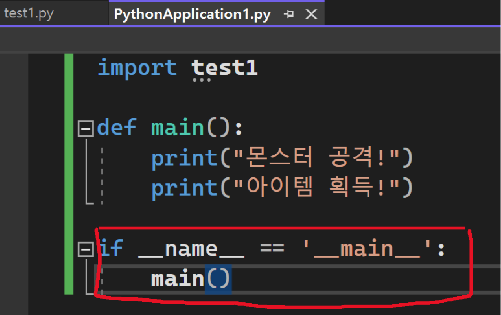

__name__ 이라는 변수는 이 파일이 메인 파일로 설정되어있을 때 ‘__main__’ 이라 는 값을 가지게 됩니다. 즉 여기 if문은 이 파일을 메인 파일로 설정했을 때만 실행되

게 됩니다. 반대로 다른 파일에서 이 파일을

모듈로 불러오는 경우에는 실행되지 않게 됩 니다.

###### test1.py가 메인 파일인 상태에서 PythonApplication1.py의 코드를 앞 페이지처럼 작성하고 실행해봅시다. 이제는 PythonApplication1에 있던 print 코드가 실행되지 않습니다.

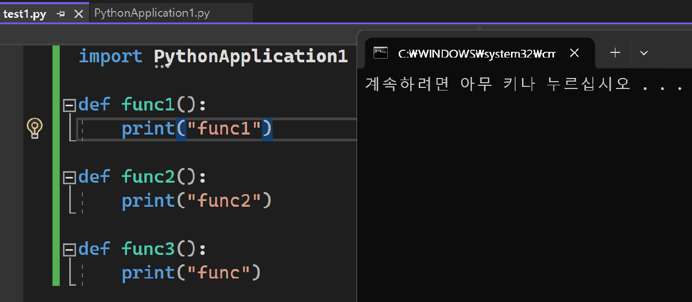

이야기가 길었지만 결론은 간단합니다.

###### if __name__ == ‘__main__’ 이라고 되어있는 부분은 이 파일이 메인 파일일 때만 실행된다.

이것만 기억하면 됩니다.

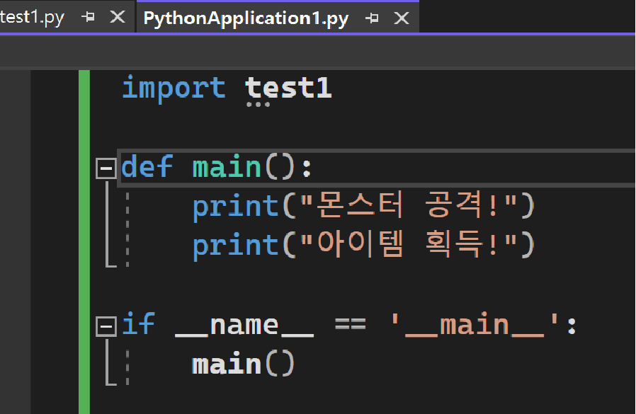

pygame은 우리가 파이썬으로 게임을 만들 때 사용하게될 모듈 입니다. 기존에 작성했던 코드를 다 지우고 import pygame 이라고 작성한 뒤 실행을 해봅시다.

실행을 했는데 아래와 같이 나온다면 pygame이 이미 설치 됐다는 뜻입니다.

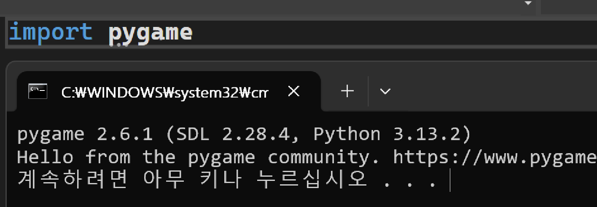

오류가 발생한다면 pygame을 설치해줘야 합니다.

윈도우 키와 R키를 같이 누르면 아래와 같은 창이 하나 나타납니다. 여기에 cmd라고 치고 확인을 눌러봅시다

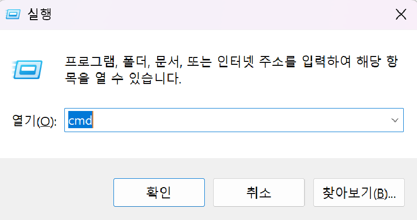

설치가 완료되면 다시 visual studio로 돌아와서 import pygame 코드가 오류없이 실행되는지 확인해봅시다.

오류가 발생하지 않는다면 잘 설치가 된 겁니다.

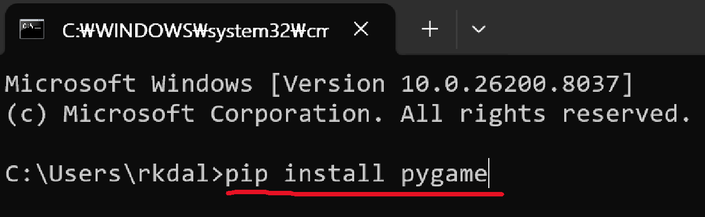

설치가 완료되면 다시 visual studio로 돌아와서 import pygame 코드가 오류없이 실행되는지 확인해봅시다.

오류가 발생하지 않는다면 잘 설치가 된 겁니다.

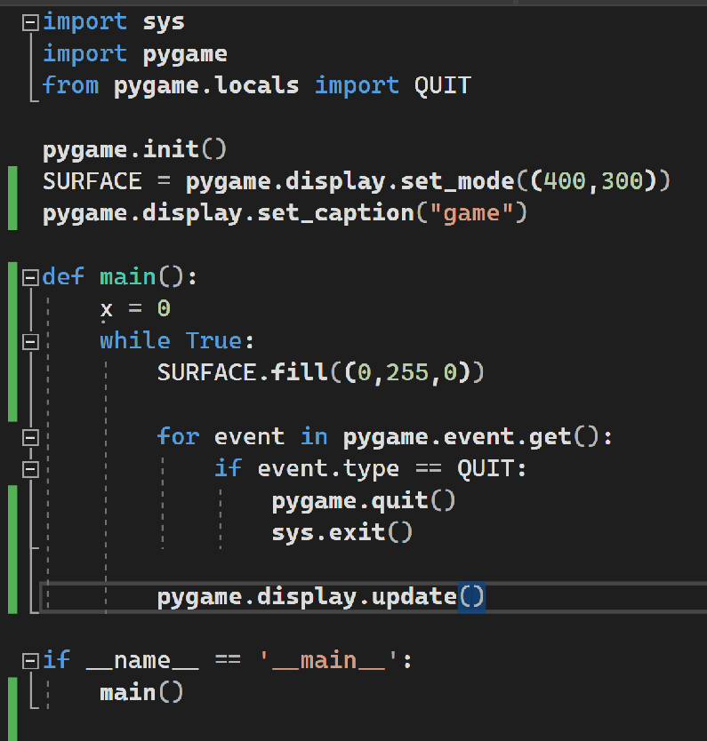

게임 화면만 만드는 아주 간단한 코드입니다. 코드를 따라서 작성하면 되는데 무작정 따라하고 실행 하고 끝이 아니라 작성하고 나서 코드의 의미를 스스로 생각해보고 수정도 하고 실행도 해보며 각 코드의 의미 를 알아봅시다.

본인만의 게임을 만들거나 기존의 게임을 수정할 때 도 움이 될 겁니다.

예를 들면 이렇게 생각해 볼 수 있습니다.

SURFACE는 그냥 변수이름이겠고 display는 모니터? 화면? 그런 뜻이겠지? 그럼 이 코드는

게임 화면을 가로 400 세로 300의 크기로 만드는건가?

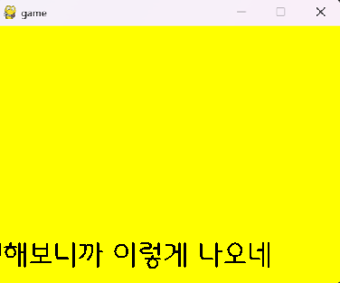

실행해보니까 이렇게 나오네

그럼 (400,300)을 (100,300)으로 바꿔볼까?

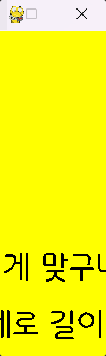

처음 생각했던게 맞구나 앞에 있는게 가로 길이고 뒤에 있는게 세로 길이가 맞네

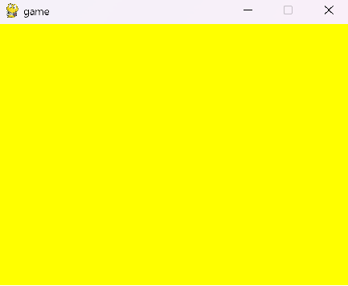

예를 들면 이렇게 생각해 볼 수 있습니다.

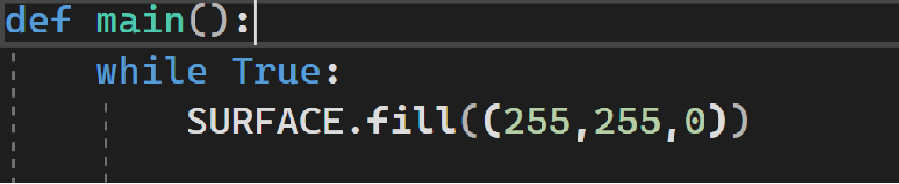

SURFACE는 위에서 게임 화면을 집어넣은 변수니까 SURFCAE.fill은 화면을 뭔가로 채운다는 뜻이겠네. 보통 색을 RGB(Red, Green, Blue)로 표현하니까 빨강과 초록을 섞은 노란색이 나왔구나.

그럼 (0,255,0) 이라고 하면 초록색 화면이 되겠네?

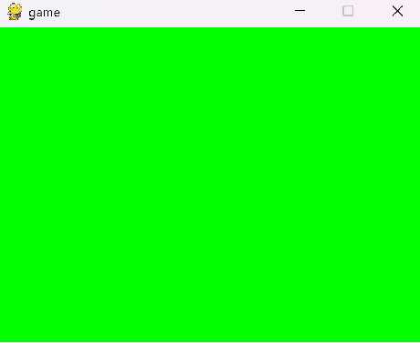

맞네

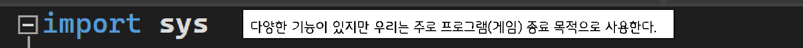

|다양한 기능이 있지만 우리는 주로 프로그램(게임) 종료 목적으로 사용한다.|
|---|

|게임을 만드는데 필요한 기능들이 있는 모듈|
|---|

사용자가 게임을 종료하려는지 확인할 때 쓰는 변수 QUIT

|pygame이 내 컴퓨터의 모니터, 스피커 등을 사용할 수 있게 하는 코드 pygame으로 게임을 만들 때 항상 적어준다고 보면 된다.|
|---|

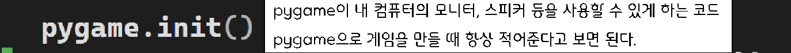

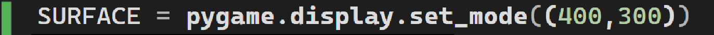

|위에서 나왔던대로 게임 화면의 크기를 400, 300으로 설정하는 코드|
|---|

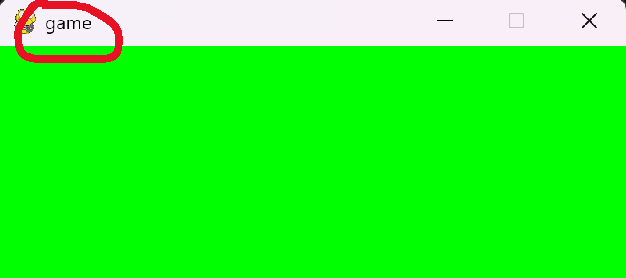

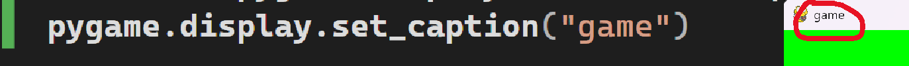

|게임 창의 이름을 “game”으로 설정하는 코드|
|---|

|이 파일이 메인 파일일 때만 실행되도록 하기 위함. 아래 쪽에 if __name__ == ‘__main__’:  main() 이라고 된 걸 볼 수 있다.|
|---|

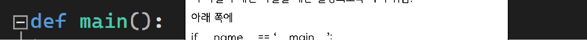

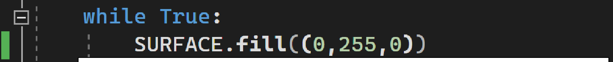

|위에서 나왔던대로 화면을 원하는 색으로 채우는 코드  while True 라는 무한 반복문 안에 있는 이유는  1. 게임화면은 결국 동영상 화면인 셈인데 동영상은 사실 이미지 여러 개를 빠르게 보여주는 것과 같다. 매 프레임 마다 새롭게 화면을 그려줘야 해서 반복문에 넣어야 한다. 2. 게임 프로그램이 종료될 때 까지 무한히 화면을 그려줘야 한다. |
|---|

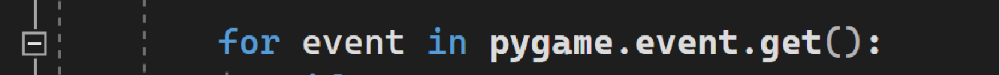

pygame에는 ‘이벤트 큐’ 라는게 있습니다. ‘큐’ 라는 곳에 사용자가 누른 키보드, 마우스 클릭 같은

정보가 순서대로 저장됩니다. 그것들을 순서대로 실행하기 위한 반복문 입니다. pygame.event.get()는 이벤트 큐의 내용을 가져오는 코드입니다.

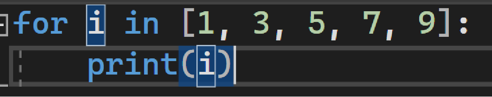

이 코드를 실행하면 변수 i에 1, 3, 5, 7, 9가 순서대로 들어가며 반복문이 실행되죠?

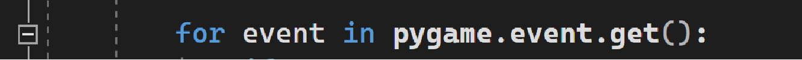

플레이어가 좌클릭, 우클릭, W를 순서대로 눌렀다고 하면 위 코드는 아래 코드처럼 된다고 생각하면 됩니다.

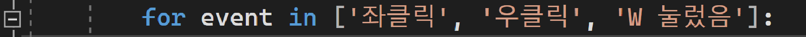

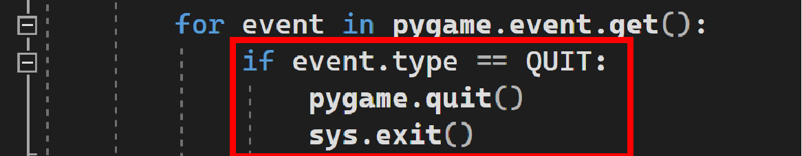

| | |
|---|---|
| | |

|event의 타입이 QUIT라면, 즉 플레이어가 게임 종료버튼(오른쪽 위 X버튼)을 눌렀다면 pygame.quit() = pygame 기능 종료 sys.exit() = 프로그램 완전 종료|
|---|

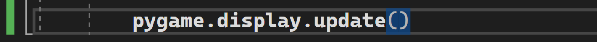

|화면의 변경사항을 적용하는 코드  다음 페이지의 예제를 보면 이해할 수 있습니다.|
|---|

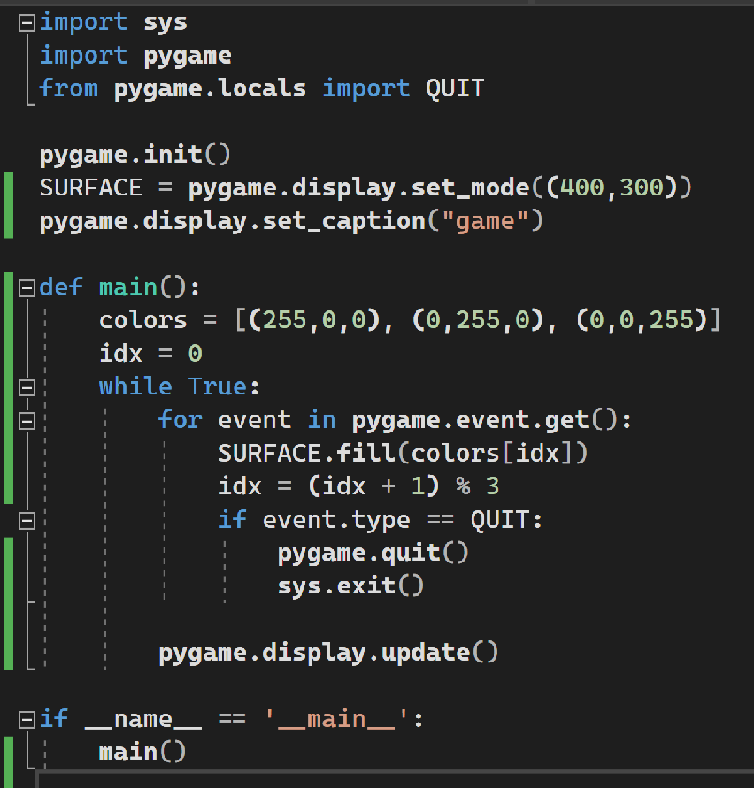

|코드를 일부 수정했습니다. event가 발생할 때마다 화면의 색이 바뀌는 코드입니다.  실행해보면 마우스를 움직일 때마다, 클릭할 때마다, 클릭 을 뗄 때마다,  키보드를 누를 때, 뗄 때, 누르고 있는 동안, 색이 계속 바  뀌는걸 확인할 수 있습니다. (이런 것들이 전부 이벤트 큐에 들어가게 됩니다)  그런데 여기서 pygame.display.update()를 빼면? 화면이 전혀 변하지 않습니다.|
|---|

#### FPS 제한

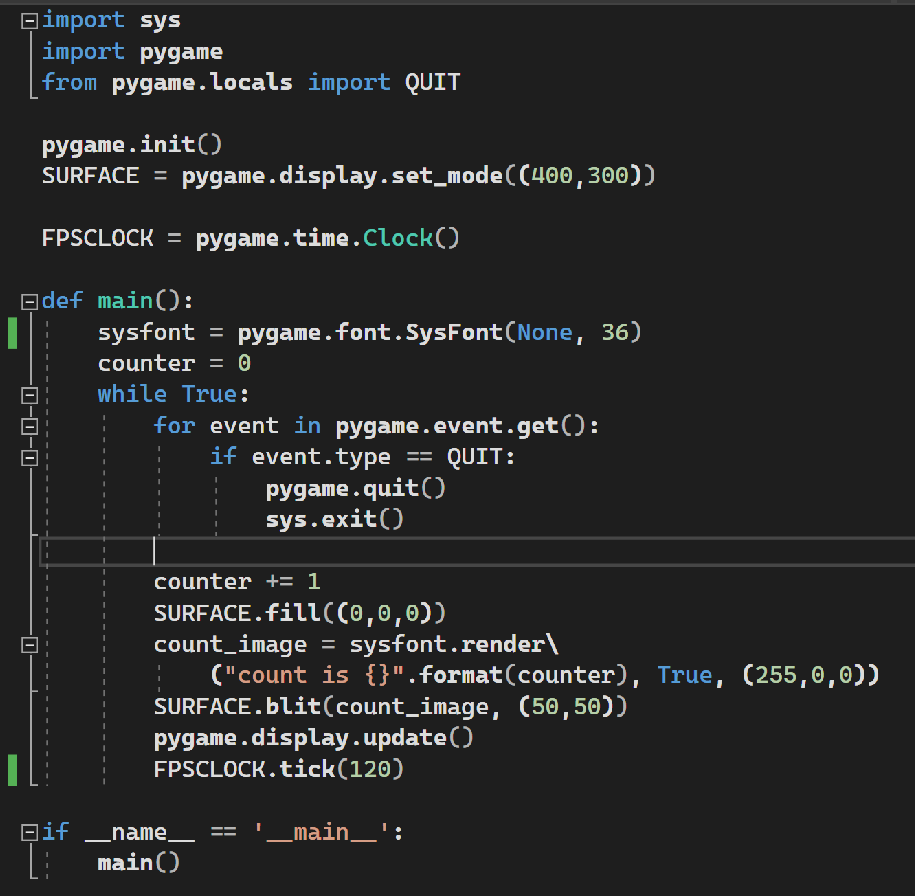

FPS를 높게 설정하면 컴퓨터 성능에 따라 렉이 걸릴 수 있습니다. 이번에는 FPS를 제한하는 코드를 작성해

봅시다.

위에서 봤던 코드는 넘어가고 처음 등장한 코드만 짚어

봅시다.

#### 참고) FPS란?

Frame Per Second의 약자입니다.

Frame = 사진 한 장. 즉 FPS는 1초에 사진 몇 장을 보여주는지를 말합니다.

30FPS는 1초에 30개의 사진, 60FPS는 1초에 60개의 사진입니다. 앞에서 게임 화면은 동영상 화면과도 같다고 했습니다. 움직이는 것처럼 보이는게 사실은 여러 개의

사진을 연속으로 보여주는겁니다.

FPS가 높을수록 화면이 더 부드럽게 보이겠지만 그 만큼 컴퓨터에게 높은 사양이 요구됩니다.

FPS를 높게 설정하면 오히려 렉이 걸릴 수 있어 제한하는 경우가 많습니다.

|Pygame.time.Clock()은 시간관련 기능을 가진 객체입니다.  객체가 무엇인지는 뒤에 나오고 시간 관련 기능이다라고 이해  하면 됩니다.|
|---|

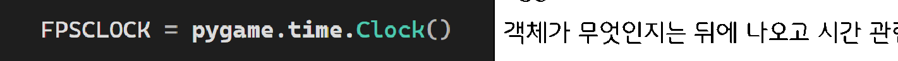

|글자 폰트를 설정하여 sysfont라는 변수에 넣고 있습니다. None은 폰트를 설정하지 않겠다 = 기본 폰트를 사용하겠다는 뜻입니다.  36은 글자의 크기 입니다.|
|---|

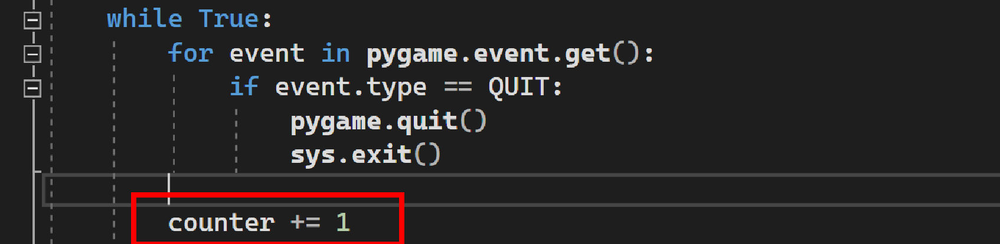

| |
|---|

|무한 반복문 안에서 counter의 값을 1씩 증가시킵니다. 반복문은 결국 프레임당 한 번 실행되므로 counter는 프레임마다 1씩 커지게 됩니다. 60FPS라면 counter의 값은 1초에 60씩 증가하게 될겁니다.|
|---|

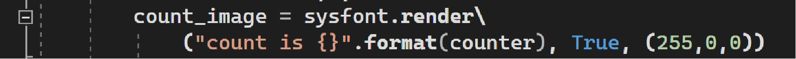

|sysfont.render 뒤에 \는 한 줄 아래로 내리겠다는 뜻입니다.  원래 하나의 코드는 한 줄에 쓰지만 이렇게 한 줄의 코드가 너무 길어질 때에는 \을 쓰고 그 아래줄에 이어서 작성 이 가능합니다.  render는 화면에 나타낸다는 뜻입니다. 위에서 정한 폰트인 sysfont로 화면에 글자를 나타내겠다는 뜻입니다.  “count is {}”.format(counter)는 counter is 라는 글자는 그대로 화면에 나오게 되고  counter 변수의 값이 {}이 있는 자리에 들어가서 나오게 됩니다.  True는 안티앨리어싱을 켜겠다는 건데 글자를 좀 더 부드럽게 보이게 한다는 뜻입니다.  (255,0,0)은 색깔입니다.|
|---|

|SURFACE = 우리가 만든 게임 화면 blit = 이미지를 그리는 함수 count_image는 위에서 만든 글자 이미지 (50,50)은 위치  즉 이 코드는 화면 (50,50) 위치에 count_image를 그려주는 코드입니다.  pygame에서는 텍스트를 텍스트 그대로 출력하는게 불가능하고 텍스트를 이미지로 바꿔 그 이미지를 출력하는 방식입니다.|
|---|

|FPS를 120으로 제한하는 코드. 이 코드를 작성하면 120FPS를 넘지 못하게 됩니다. 이 코드를 실행하면 counter의 값이 1초에 120 증가하는걸 확인할 수 있습니다.  FPSCLOCK.tick(1) 이라고 하면 1초에 1씩 증가합니다.|
|---|

화면에 뭔가를 그릴려면 좌표를 알아야겠죠.

- 바로 앞에서 글자 이미지를 나타내는 좌표에 대한 이야기가 나왔지만 한 번 더 짚고 가자면

컴퓨터에서 좌표는 왼쪽 제일 위가 (0,0) 오른쪽으로 갈수록 x좌표의 값이 증가하고

- 아래로 내려갈수록 y좌표의 값이 증가합니다.

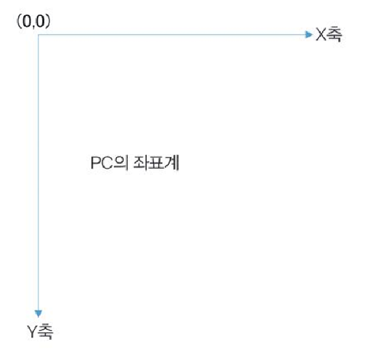

import sys import pygame from pygame.locals import QUIT, Rect

pygame.init() SURFACE = pygame.display.set_mode((400,300))

def main(): while True: for event in pygame.event.get():

if event.type == QUIT: pygame.quit() sys.exit()

SURFACE.fill((255,255,255)) pygame.draw.rect(SURFACE, (255,0,0), (10,20,100,50)) pygame.draw.rect(SURFACE, (255,0,0), (150,10,100,30), 3) pygame.draw.rect(SURFACE, (0,255,0), ((100, 80), (80,50)))

- rect0 = Rect(200, 60, 140, 180) pygame.draw.rect(SURFACE, (0,0,255), rect0)
- rect1 = Rect((30,160), (100,50)) pygame.draw.rect(SURFACE, (255,255,0), rect1) pygame.display.update()

if __name__ == '__main__': main()

|직사각형을 그린다 SURFACE라는 게임 창에. 색깔은 이걸로  앞에서부터 순서대로 직사각형의 왼쪽 위 꼭짓점 x좌표, y좌표, 가로, 세로 길이  |
|---|

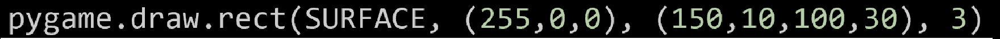

|위랑 똑같은데 마지막에 3은 선의 굵기입니다. 위에선 굵기를 생략했는데 생략하면 0을 쓴 것과 같고 그러면 사각형 내부를 전부 색으로 채우게 됩니다. 0이 아닌 다른 걸 쓰면 내부를 채우지 않고 사각형의 선만 그려진 상태가 됩니다.|
|---|

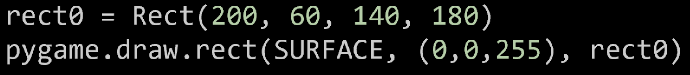

|이런 방식으로도 가능합니다.  Rect()라는 객체를 미리 만들고(사각형을 의미하는 변수를 만들었다 생각하면 됩니다) pygame.draw.rect 함수 안에 넣어줄 수 있습니다.  앞 페이지와 마찬가지로 Rect(왼쪽 위 꼭짓점 x좌표, 왼쪽 위 꼭짓점 y좌표, 가로길이, 세로길이) 순서입니다.|
|---|

### pygame.draw.circle(SURFACE, (255,0,0), (50,50), 20, 3)

|원 그리기|
|---|

|중심좌표 반지름 선 굵기(생략하면 0)|
|---|

##### pygame.draw.ellipse(SURFACE, (255,0,0), (50,50,100,50))

|직사각형과 같은 방식으로 적어줍니다 pygame에서 타원은 직사각형의 모퉁이 를 잘라낸 것으로 표현합니다. (50,50,100,50)인 직사각형의 모퉁이를 잘라낸 타원이 그려집니다|
|---|

|타원 그리기|
|---|

### pygame.draw.line(SURFACE, (255,0,0), (10, 10), (10, 80), 10)

|선 그리기|
|---|

|시작좌표 끝좌표 선 굵기(생략하면 0)  |
|---|

여러 도형을 그리는 함수가 있지만 형태가 다 비슷합니다.

import sys

import pygame from pygame.locals import QUIT

pygame.init() SURFACE = pygame.display.set_mode((400,300))

def main(): while True: for event in pygame.event.get():

if event.type == QUIT: pygame.quit() sys.exit()

SURFACE.fill((255,255,255))

- for x in range(0,401,25): pygame.draw.line(SURFACE, (0,0,0), (x,0), (x,300))
- for y in range(0,301,25): pygame.draw.line(SURFACE, (0,0,0), (0,y), (400,y))

pygame.display.update() if __name__ == '__main__':

main()

이런식으로 코드를 작성해서 바둑판 모양을 만들 어 볼 수 있습니다.

선 굵기

선 여러 개를 한 번에 그리는 방법도 있습니다.

pygame.draw.lines(SURFACE, (255,0,0), True, point_list, 5)

Point_list에 있는 첫 번째 점과 마지막 점을 이을 것

점의 좌표 여러 개가 들어있는 리스트입니다. 이 리스트에 있는 점들을 선으로 이어줍니다.

인지를 결정하는 부분 입니다. True로 하면 첫번째 점과 마지막 점을 이어줍니다.

리스트는 아래와 같은 형태로 만들어 주면 됩니다.

False로 하면 첫번째 점과 마지막 점은 잇지 않습니다. point_list = [(10, 30), (20, 50), (30, 40)]

import sys

import pygame

from pygame.locals import QUIT import random

pygame.init() SURFACE = pygame.display.set_mode((400,300)) FPSCLOCK = pygame.time.Clock() def main():

while True: for event in pygame.event.get():

if event.type == QUIT: pygame.quit() sys.exit()

SURFACE.fill((255,255,255)) point_list = [] for _ in range(5):

xpos = random.randint(0,400) ypos = random.randint(0,300) point_list.append((xpos,ypos))

pygame.draw.lines(SURFACE, (255,0,0), True, point_list, 5)

pygame.display.update()

FPSCLOCK.tick(50) if __name__ == '__main__': main()

매 프레임마다 선 여러 개를 그리는 코드입니다.

point_list = []

for _ in range(5):

xpos = random.randint(0,400) ypos = random.randint(0,300) point_list.append((xpos,ypos))

pygame.draw.lines(SURFACE, (255,0,0), True, point_list, 5) pygame.display.update() FPSCLOCK.tick(50)

random.randint(0, 400)은 0이상 400이하의 랜덤한 숫자를 반환하는 코드입니다.

매 프레임마다 randint를 이용하여 랜덤한 5개의 점을 point_list에 넣고

그렇게 만들어진 5개의 점을 선으로 이어서 매 프레임마다 출력하는 코드입니다.

FPSCLOCK.tick()의 값을 바꿔가며 속도를 조절해 볼 수 있습니다.

pyagme.draw.lines는 선만 그려주고 내부를 색으로 채워주지는 않습니다. 내부를 색으로 채우고 싶을 때 사용하는 pygame.draw.polygon 이 있습니다.

##### pygame.draw.polygon(SURFACE, (255,0,0), point_list)

lines에 사용했던 코드에 lines를 polygon으로 바꾸기만 해서 실행해볼 수 있습니다.

이번에는 외부에 있는 이미지 파일을 가져와서 화면에 띄우는 법을 알아봅시다.

우선 이미지를 구해봅시다. 인터넷에 검색해서 마음에 드는 이미지를 다운로드 받습니다. png나 jpg 파일이 가장 무난합니다.

다운을 받았으면 그 이미지를 우리가 실행하는 파일이 있는 폴더로 옮겨야 합니다.

## 이미지 파일 가져오기

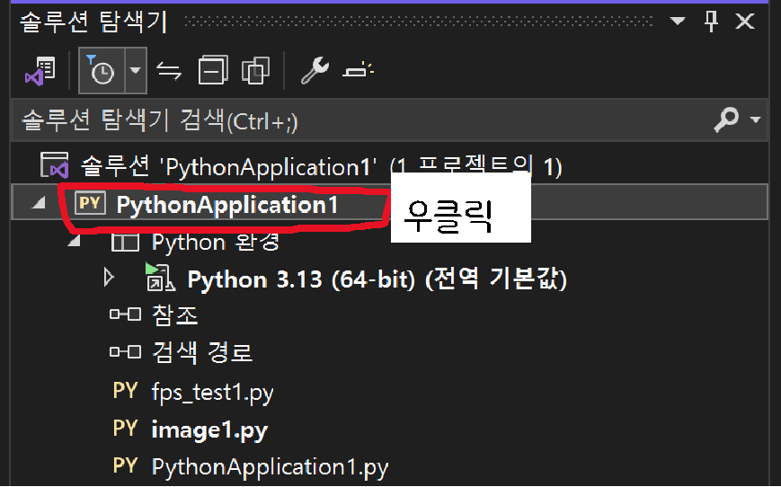

우클릭

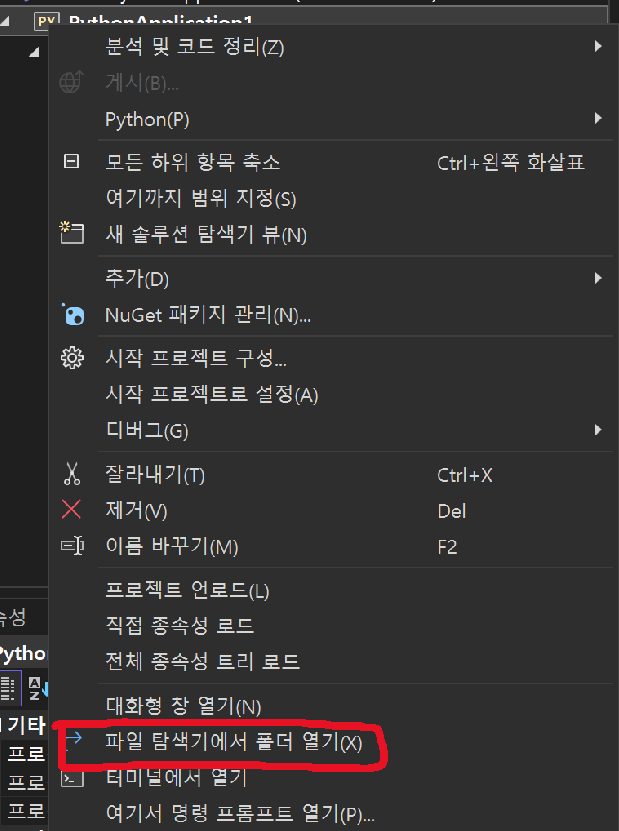

이 폴더에 다운받은 이미지를 저장합니다.

import sys import pygame from pygame.locals import QUIT

pygame.init() SURFACE = pygame.display.set_mode((600,300)) pygame.display.set_caption("game")

def main():

jjangu = pygame.image.load("짱구.png") manggu = pygame.image.load("맹구.png") while True:

for event in pygame.event.get():

if event.type == QUIT: pygame.quit() sys.exit()

SURFACE.blit(jjangu, (0,0)) SURFACE.blit(manggu, (300,0))

pygame.display.update()

if __name__ == '__main__':

main()

다운받은 이미지를 화면에 띄우는 코드입니다.

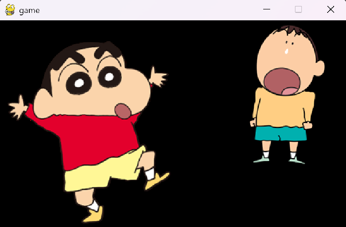

jjangu = pygame.image.load("짱구.png") manggu = pygame.image.load("맹구.png")

while True:

SURFACE.blit(jjangu, (0,0)) SURFACE.blit(manggu, (300,0))

(0,0)과 (300,0)은 이미지의 왼쪽 위 꼭짓점의 위치입니다.

SURFACE의 크기보다 이미지가 크면 이미지가 잘릴 수 있습니다.

이미지의 일부만 나오게 할 수도 있습니다.

SURFACE.blit(jjangu, (0,0), Rect(0,0,259,140))

이 영역에 해당하는 부분만 화면에 나옵니다

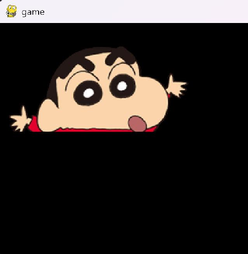

게임을 만들 때 여러 개의 이미지가 필요할 수 있는데 이미지 파일 을 전부 따로 두고 하나씩 불러 오는 것보다 이미지들을 하나로 묶어

놓고 하나의 이미지를 잘라서 쓰는게 더 효과적입니다.

import sys import pygame

from pygame.locals import QUIT, Rect

이미지를 회전 시키는 것도 가능합니다.

pygame.init() SURFACE = pygame.display.set_mode((500,300)) pygame.display.set_caption("game") FPSCLOCK = pygame.time.Clock() def main():

jjangu = pygame.image.load("짱구.png")

theta = 30 while True:

for event in pygame.event.get():

if event.type == QUIT: pygame.quit() sys.exit()

SURFACE.fill((0,0,0))

theta += 30 jjangu_rotate = pygame.transform.rotate(jjangu, theta) SURFACE.blit(jjangu_rotate, (0,0)) FPSCLOCK.tick(5) pygame.display.update()

왼쪽 코드를 작성해봅시다

###### 핵심 코드는 이 부분 입니다. theta는 회전 시킬 각도 값을 가지고 있는 변수입니다.

if __name__ == '__main__': main()

###### 그런데 코드를 실행해보면 한 가지 문제가 있습니다. 사진이 왼쪽 꼭짓점을 기준으로 회전해서 돌다가 화면 밖으로 나가버립니다.

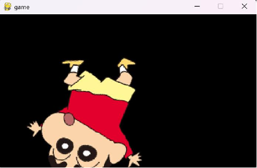

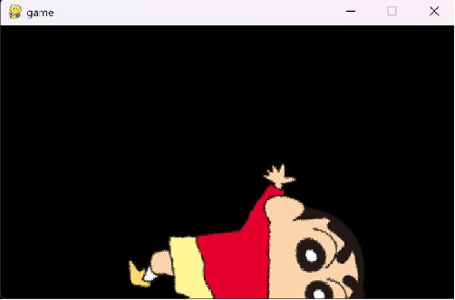

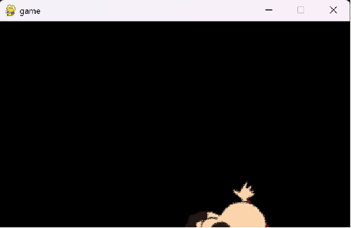

SURFACE = pygame.display.set_mode((500, 300))

pygame.display.set_caption("game")

FPSCLOCK = pygame.time.Clock()

def main(): jjangu = pygame.image.load("짱구.png") theta = 30

while True:

for event in pygame.event.get():

if event.type == QUIT: pygame.quit() sys.exit()

SURFACE.fill((0, 0, 0)) theta += 2

|jjangu_rotate = pygame.transform.rotate(jjangu, theta)  cen = jjangu_rotate.get_rect() cen.center = (200,150) SURFACE.blit(jjangu_rotate, cen)|
|---|

FPSCLOCK.tick(60) pygame.display.update()

if __name__ == '__main__':

회전시킨 사진의 중심 좌표를 설정하여 중심을 기준으로 회전 하도록 할 수 있습니다.

jjangu_rotate = pygame.transform.rotate(jjangu, theta) cen = jjangu_rotate.get_rect() # 회전된 이미지와 똑같은 형태의 직사각형 생성 cen.center = (200,150) # 그 직사각형의 중심을 설정 SURFACE.blit(jjangu_rotate, cen) # 그렇게 만들어진 직사각형이 위치의 역할을 함

###### 이렇게 하면 이미지가 중심을 기준으로 회전하는 모습을 확인할 수 있습니다

SURFACE = pygame.display.set_mode((400, 300))

pygame.display.set_caption("game")

FPSCLOCK = pygame.time.Clock()

def main(): theta = 0 scale = 1 sysfont = pygame.font.SysFont(None,72) message = sysfont.render("Hello", True,(0,255,255))

while True:

for event in pygame.event.get():

if event.type == QUIT: pygame.quit() sys.exit()

theta += 5 SURFACE.fill((0, 0, 0)) scale = (theta % 360) / 180

msg = pygame.transform.rotozoom(message, theta, scale)

rect = msg.get_rect() rect.center = (200,150) SURFACE.blit(msg, rect)

pygame.display.update() FPSCLOCK.tick(60)

if __name__ == '__main__':

글자를 회전시키면서 동시에 크기도 변경하는 코드입

니다.

scale = (theta % 360) / 180

msg = pygame.transform.rotozoom(message, theta, scale) rect = msg.get_rect() rect.center = (200,150) SURFACE.blit(msg, rect)

위에서 만든 mesasge라는 텍스트를 theta 만큼 회전시키고 scale의 크기로 설정합니다

scale = (theta % 360) / 180

msg = pygame.transform.rotozoom(message, theta, scale)

rect = msg.get_rect() rect.center = (200,150) SURFACE.blit(msg, rect)

theta(회전각)이 5씩 계속 커집니다. 이에 따라 글자가 회전합니다.

theta % 360은 0~359의 값을 가집니다. 그걸 180으로 나누면 scale은 0~2(정확히는 2보다 조금 작은 값)의 값을 가지게 됩니다.

즉 이 코드에서 글자의 크기는 0에서 시작해서 최대 2배까지 증가합니다.

그리고 theta가 360 이상이 되면 theta % 360은 다시 0부터 시작해 2까지 증가합니다

그래서 이 코드는 글자가 최대 크기가 된 뒤 다시 크기 0부터 시작하게 됩니다

글자의 크기가 최대가 된 뒤 바로 크기 0이 되는게 아니라 조금씩 크기를 줄이려면 어떻게 해야할까요?

조금 뒤에서 배울 삼각함수를 이용해서 할 수 있습니다.

## 그림 그리기

import sys import pygame from pygame.locals import QUIT, MOUSEMOTION

pygame.init() SURFACE = pygame.display.set_mode((400,300)) pygame.display.set_caption("game") def main():

mousepos = [] while True:

SURFACE.fill((255,255,255))

for event in pygame.event.get():

if event.type == QUIT: pygame.quit() sys.exit()

elif event.type == MOUSEMOTION: mousepos.append(event.pos)

for pos in mousepos:

pygame.draw.circle(SURFACE, (0,0,0), pos, 5)

pygame.display.update()

if __name__ == '__main__':

main()

이번에는 그림판 같은 프로그램을 만들어 봅시다

|마우스의 움직임을 감지하기위한 변수(정확히는 상수)|
|---|

from pygame.locals import QUIT, MOUSEMOTION

def main():

mousepos = [] while True:

마우스 커서의 움직임(위치 좌표)를 저장할 리스트

for event in pygame.event.get():

|마우스가 움직이는 이벤트가 발생했다면|
|---|

|elif event.type == MOUSEMOTION: mousepos.append(event.pos)|
|---|

|이벤트가 발생한 곳의 위치, 즉 마우스가 움직일 때 마다 마우스의 위치 좌표를 mousepos 리스트에 넣는 코드|
|---|

for pos in mousepos: pygame.draw.circle(SURFACE, (0,0,0), pos, 5)

|그 위치에 원(점)을 그리겠다|
|---|

|mousepos에 있는 값(좌표)들을 하나씩 가져와서|
|---|

###### 실행해보면 문제가 있다는 걸 알 수 있습니다. 우리가 원하는건 마우스를 클릭한 상태에서 마우스를 움직였 을 때 그림이 그려지는건데 현재 이 코드는 클릭을 하지 않아도 계속 그림이 그려집니다. 코드를 일부 수정해서 클릭을 했을 때만 그림이 그려지도록 해봅시다.

###### 실행해보면 문제가 있다는 걸 알 수 있습니다. 우리가 원하는건 마우스를 클릭한 상태에서 마우스를 움직였 을 때 그림이 그려지는건데 현재 이 코드는 클릭을 하지 않아도 계속 그림이 그려집니다. 코드를 일부 수정해서 클릭을 했을 때만 그림이 그려지도록 해봅시다.

