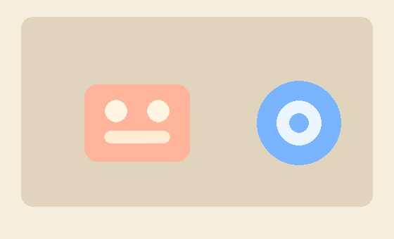
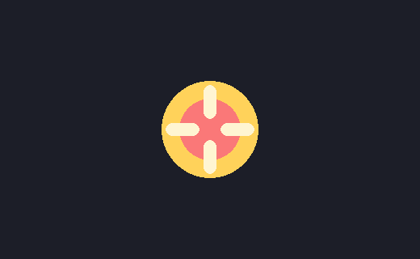
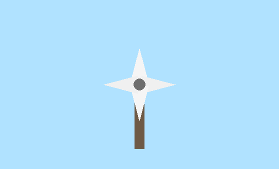

# Pygame Week02 문제 검수 원본

> 이 문서는 `week02` 웹 노출 구조에 맞춰 정리된 검수 원본입니다.
> 원본 제작 문맥과 코드 캡션에는 `round01` 표기가 남아 있을 수 있지만,
> 현재 웹/인덱스 기준 운영 루트는 `practice/data/content/pygame/week02/`입니다.

이 문서는 `모듈 02 · 이미지 출력과 회전 중심` 문제지를 검수하기 위한 원본 문서이다.
학생에게는 별도의 문제 파일을 제공하지 않고,
제시된 코드를 직접 작성하게 하는 구성을 기준으로 한다.

`week02`는 `round01`의 기존 5번 문항을
모듈 02 독립 세트로 확장한 검수 원본이다.
핵심은 `이미지를 어떻게 출력하는지`, `회전 결과가 왜 어색한지`,
`중심 보정이 화면 결과를 어떻게 바꾸는지`, `각도 증가량과 방향이 결과를 어떻게 바꾸는지`를
서로 다른 프로젝트 안에서 읽고 수정하는 데 있다.

이 문서는 공통 원칙 문서인
`../pygame_문제_제작_운영원칙.md`를 따른다.
이 문서에는 모듈 02 세부 문항과 검수 내용을 중심으로 기록한다.

내부 제작 기준 자료:

- `../source/md_1회차_파이썬으로_게임만들기.md`
- `problems/problem01.py`
- `problems/problem02.py`
- `problems/problem03.py`
- `problems/problem04.py`
- `reference_images/problem01_correct.png`
- `reference_images/problem02_correct.gif`
- `reference_images/problem03_correct.png`
- `reference_images/problem04_correct.gif`

---

## 재구성 원칙

현재 `week02` 검수 범위는 아래 4개 대문항으로 고정한다.

1. 스티커 보드 이미지 출력
2. 스피너 배지 회전 위치
3. 회전 로고 중심 복구
4. 풍차 날개 속도와 방향

운영 목표:

- `SURFACE.blit(...)`의 좌표와 출력 순서가 화면 결과를 어떻게 바꾸는지 확인하게 한다.
- 회전 이미지가 `(0, 0)`에 바로 출력될 때 왜 어색해 보이는지 설명하게 한다.
- `rect.center` 수정이 중심 보정에 어떻게 쓰이는지 확인하게 한다.
- 각도 증가량과 방향 변화가 같은 프로젝트 안에서 어떤 차이를 만드는지 해석하게 한다.

제외 또는 후순위:

- 중앙 배치 좌표 계산을 길게 요구하는 문항
- `rotozoom`
- 외부 이미지 자산 로딩 심화
- 다중 스프라이트 관리 심화
- 텍스트 회전과 크기 변경

이 항목들은 이후 확장 응용에서 별도로 다룬다.

---

## 작성 규칙

소문항은 반드시 아래 순서를 유지한다.

1. 난이도
2. 형식
3. 출제 의도
4. 문제
5. 정답
6. 해설
7. 부분 정답 기준
8. 실제 실행 확인 결과
9. 검수 체크

형식 규칙:

- `코드 입력형`: 정답이 코드 한 줄 또는 짧은 블록
- `빈칸형`: 정답이 함수명, 상수, 숫자, 코드 조각
- `복수정답 객관식형`: 정답이 정해진 선택 조합

모든 대문항은 `누적풀이`를 기준으로 설계한다.
뒤 문항은 앞 문항의 수정 결과를 이어받는 것을 기본으로 한다.

---

## 1번. 스티커 보드 이미지 출력

제작 기준 코드:

- `problems/problem01.py`

확인 개념:

- `SURFACE.blit`
- `(x, y)` 좌표
- 이미지 겹침 순서
- 화면 밖으로 일부 잘리는 상태

코드 설명:

이 프로그램은 게시판 배경 위에
두 장의 스티커 이미지를 붙여 보여 주는 코드이다.
현재는 파란 스티커가 화면 오른쪽 바깥으로 일부 잘려 있고,
두 스티커가 겹치는 부분에서는 나중에 그린 스티커가 더 앞에 보인다.
이미지 출력 좌표와 겹침 순서를 함께 확인한다.

제시 코드:

```python
import sys
import pygame
from pygame.locals import QUIT

pygame.init()
SURFACE = pygame.display.set_mode((560, 340))
pygame.display.set_caption("week02 problem01")

# COPYABLE_START: make_salmon_sticker | 연어색 스티커 생성 | asset
def make_salmon_sticker():
    sticker = pygame.Surface((150, 110), pygame.SRCALPHA)
    pygame.draw.rect(sticker, (255, 180, 155), (0, 0, 150, 110), border_radius=18)
    pygame.draw.circle(sticker, (255, 245, 225), (45, 38), 16)
    pygame.draw.circle(sticker, (255, 245, 225), (105, 38), 16)
    pygame.draw.rect(sticker, (255, 235, 210), (28, 66, 94, 18), border_radius=9)
    return sticker
# COPYABLE_END: make_salmon_sticker


# COPYABLE_START: make_blue_sticker | 파란 스티커 생성 | asset
def make_blue_sticker():
    sticker = pygame.Surface((130, 130), pygame.SRCALPHA)
    pygame.draw.circle(sticker, (120, 180, 255), (65, 65), 60)
    pygame.draw.circle(sticker, (235, 245, 255), (65, 65), 32)
    pygame.draw.circle(sticker, (120, 180, 255), (65, 65), 14)
    return sticker
# COPYABLE_END: make_blue_sticker


def main():
    salmon_sticker = make_salmon_sticker()
    blue_sticker = make_blue_sticker()

    while True:
        for event in pygame.event.get():
            if event.type == QUIT:
                pygame.quit()
                sys.exit()

        # BLOCK_A_START
        SURFACE.fill((245, 238, 220))
        pygame.draw.rect(SURFACE, (225, 212, 188), (30, 24, 500, 270), border_radius=16)
        SURFACE.blit(salmon_sticker, (120, 120))
        # 문제 1.1, 1.2: 파란 스티커가 잘리지 않도록 고치세요.
        SURFACE.blit(blue_sticker, (470, 110))
        # BLOCK_A_END

        pygame.display.update()


if __name__ == "__main__":
    main()
```

참고 이미지:

아래 이미지는 코드가 `올바르게 수정되어 정상 작동할 경우`를
기준으로 한 참고 화면이다.



### 1.1

난이도:

- 하

형식:

- 복수정답 객관식형

출제 의도:

- 화면 밖으로 일부 잘리는 이미지의 현재 기준 좌표를 직접 읽게 한다.

문제:

현재 파란 스티커가 기준으로 삼고 있는 좌표로 알맞은 것을 고른 것은?

- ㄱ. `(120, 120)`
- ㄴ. `(360, 110)`
- ㄷ. `(470, 110)`
- ㄹ. `(560, 340)`

정답:

- `ㄷ`

해설:

- 제시 코드는 `SURFACE.blit(blue_sticker, (470, 110))`을 사용한다.
- 화면 가로가 `560`이므로 스티커 일부가 오른쪽 밖으로 잘릴 수 있다.

부분 정답 기준:

- 없음. `ㄷ`만 정답 처리

실제 실행 확인 결과:

- 파란 스티커는 오른쪽 끝에서 일부 잘린 상태로 보인다.

검수 체크:

- 좌표 읽기 문항이 이미지 출력과 직접 연결되는지 확인

### 1.2

난이도:

- 중

형식:

- 코드 입력형

출제 의도:

- 이미지가 화면 안쪽에 오도록 `blit` 한 줄을 고치게 한다.

문제:

파란 스티커가 화면 안쪽에 완전히 보이도록
`blit` 한 줄을 다시 쓰시오.

정답:

```python
SURFACE.blit(blue_sticker, (360, 110))
```

해설:

- 파란 스티커 가로 크기와 화면 가로 크기를 함께 보면
  `(360, 110)` 정도로 옮겨야 화면 안쪽에 안정적으로 들어온다.

부분 정답 기준:

- 없음. 아래 한 줄만 정답 처리
- `SURFACE.blit(blue_sticker, (360, 110))`

실제 실행 확인 결과:

- 파란 스티커를 `(360, 110)`으로 옮기면 화면 안쪽에서 완전히 보인다.

검수 체크:

- 중앙 배치 계산이 아니라 화면 밖 잘림 복구 문항으로 기능하는지 확인

### 1.3

난이도:

- 하

형식:

- 복수정답 객관식형

출제 의도:

- 겹침 순서와 화면 앞뒤 관계를 연결하게 한다.

문제:

두 스티커가 겹치는 부분에서
더 앞에 보이는 대상을 고른 것은?

- ㄱ. 연어색 스티커
- ㄴ. 파란 스티커
- ㄷ. 게시판 배경
- ㄹ. 둘 다 완전히 같은 앞뒤 순서로 보인다

정답:

- `ㄴ`

해설:

- `blue_sticker`가 `salmon_sticker`보다 나중에 그려져 앞에 보인다.

부분 정답 기준:

- 없음. `ㄴ`만 정답 처리

실제 실행 확인 결과:

- 겹치는 영역에서는 파란 스티커가 위쪽에 보인다.

검수 체크:

- draw 순서와 시각 결과가 직접 연결되는지 확인

### 1.4

난이도:

- 중

형식:

- 복수정답 객관식형

출제 의도:

- 좌표 수정 후 결과를 종합 판단하게 한다.

문제:

1.2를 반영한 상태라고 가정한다.
실행 후 옳은 것을 모두 고른 것은?

- ㄱ. 파란 스티커가 화면 안쪽에 완전히 보인다.
- ㄴ. 파란 스티커는 여전히 연어색 스티커보다 앞에 보인다.
- ㄷ. 배경 게시판이 자동으로 사라진다.
- ㄹ. 두 스티커가 모두 보인다.

정답:

- `ㄱ, ㄴ, ㄹ`

해설:

- 바뀌는 것은 파란 스티커의 출력 위치뿐이다.
- 그리는 순서와 배경 코드는 그대로이므로 앞뒤 관계와 게시판 배경은 유지된다.

부분 정답 기준:

- `ㄱ, ㄴ` 또는 `ㄱ, ㄹ`이면 부분 정답
- `ㄱ, ㄴ, ㄹ`이면 정답

실제 실행 확인 결과:

- 수정 후 두 스티커가 모두 보이고, 파란 스티커는 여전히 앞쪽에 겹쳐 보인다.

검수 체크:

- 결과 예측 문항이 위치 수정과 draw 순서만 묻는지 확인

---

## 2번. 스피너 배지 회전 위치

제작 기준 코드:

- `problems/problem02.py`

확인 개념:

- `pygame.transform.rotate`
- `SURFACE.blit(rotated, (0, 0))`
- 회전 이미지 출력 기준
- 새 rect 필요성

코드 설명:

이 프로그램은 배지 이미지를
로딩 스피너처럼 계속 회전시키는 코드이다.
현재는 회전한 이미지를 `(0, 0)`에 바로 그리기 때문에
왼쪽 위 기준으로 흔들리는 것처럼 보인다.
회전 결과가 왜 어색한지와 새 rect가 왜 필요한지 확인한다.

제시 코드:

```python
import sys
import pygame
from pygame.locals import QUIT

pygame.init()
SURFACE = pygame.display.set_mode((520, 320))
pygame.display.set_caption("week02 problem02")
FPSCLOCK = pygame.time.Clock()

# COPYABLE_START: make_badge | 스피너 배지 생성 | asset
def make_badge():
    badge = pygame.Surface((140, 140), pygame.SRCALPHA)
    pygame.draw.circle(badge, (255, 210, 90), (70, 70), 60)
    pygame.draw.circle(badge, (250, 120, 120), (70, 70), 38)
    pygame.draw.rect(badge, (255, 245, 210), (62, 15, 16, 42), border_radius=8)
    pygame.draw.rect(badge, (255, 245, 210), (62, 83, 16, 42), border_radius=8)
    pygame.draw.rect(badge, (255, 245, 210), (15, 62, 42, 16), border_radius=8)
    pygame.draw.rect(badge, (255, 245, 210), (83, 62, 42, 16), border_radius=8)
    return badge
# COPYABLE_END: make_badge


def main():
    badge = make_badge()
    theta = 0

    while True:
        for event in pygame.event.get():
            if event.type == QUIT:
                pygame.quit()
                sys.exit()

        # BLOCK_A_START
        theta += 3
        SURFACE.fill((28, 30, 40))
        rotated = pygame.transform.rotate(badge, theta)
        # 문제 2.2: 현재 출력 기준 좌표를 확인하세요.
        SURFACE.blit(rotated, (0, 0))
        # BLOCK_A_END

        pygame.display.update()
        FPSCLOCK.tick(60)


if __name__ == "__main__":
    main()
```

참고 이미지:

아래 이미지는 코드가 `올바르게 수정되어 정상 작동할 경우`를
기준으로 한 참고 화면이다.



### 2.1

난이도:

- 중

형식:

- 복수정답 객관식형

출제 의도:

- 회전 결과가 어색한 이유를 위치 보정 관점에서 읽게 한다.

문제:

제시된 코드에서 회전 결과가 어색하게 보이는 이유로
옳은 것을 모두 고른 것은?

- ㄱ. 회전된 배지를 `(0, 0)`에 바로 출력한다.
- ㄴ. 회전 결과에 맞는 새 rect를 잡지 않았다.
- ㄷ. `pygame.display.update()`가 없어서 회전이 안 된다.
- ㄹ. `theta` 값이 양수라서 회전이 어색하다.

정답:

- `ㄱ, ㄴ`

해설:

- 핵심 문제는 회전된 배지를 그대로 `(0, 0)`에 출력하는 것과
  회전 결과에 맞는 위치 rect가 없는 것이다.
- `update()`는 이미 존재하므로 회전 자체는 보인다.

부분 정답 기준:

- `ㄱ`만 고르면 부분 정답
- `ㄱ, ㄴ`이면 정답

실제 실행 확인 결과:

- 배지는 화면 왼쪽 위를 기준으로 흔들리듯 회전한다.

검수 체크:

- 회전 문제의 원인이 중심 보정과 연결되는지 확인

### 2.2

난이도:

- 하

형식:

- 복수정답 객관식형

출제 의도:

- 현재 출력 기준 좌표를 정확히 확인하게 한다.

문제:

회전된 배지가 기준으로 삼고 있는 현재 출력 좌표로 알맞은 것을 고른 것은?

- ㄱ. `(0, 0)`
- ㄴ. `(140, 140)`
- ㄷ. `(260, 160)`
- ㄹ. `(520, 320)`

정답:

- `ㄱ`

해설:

- 제시 코드는 `SURFACE.blit(rotated, (0, 0))`을 사용한다.

부분 정답 기준:

- 없음. `ㄱ`만 정답 처리

실제 실행 확인 결과:

- 회전된 배지도 `(0, 0)` 기준으로 출력된다.

검수 체크:

- 2.1과 2.2의 논리 연결이 자연스러운지 확인

### 2.3

난이도:

- 하

형식:

- 복수정답 객관식형

출제 의도:

- 새 rect가 왜 필요한지 결과 중심으로 확인하게 한다.

문제:

회전된 배지에 맞는 새 rect가 없으면
배지가 화면 어느 기준으로 흔들리는 것처럼 보일 수 있는가?

- ㄱ. 화면 왼쪽 위
- ㄴ. 화면 오른쪽 아래
- ㄷ. 화면 정가운데
- ㄹ. 마우스 위치

정답:

- `ㄱ`

해설:

- 회전 결과물의 크기와 위치를 새 rect로 잡지 않으면
  화면 왼쪽 위를 기준으로 도는 것처럼 보이기 쉽다.

부분 정답 기준:

- 없음. `ㄱ`만 정답 처리

실제 실행 확인 결과:

- 중심 보정이 없는 상태에서는 화면 중심 회전처럼 보이지 않는다.

검수 체크:

- 원인 설명이 결과 해석과 직접 연결되는지 확인

### 2.4

난이도:

- 중

형식:

- 복수정답 객관식형

출제 의도:

- 현재 코드 실행 결과를 예측하게 한다.

문제:

현재 제시 코드 상태로 실행했을 때
옳은 것을 모두 고른 것은?

- ㄱ. 배지는 계속 회전한다.
- ㄴ. 배지가 화면 가운데를 기준으로 안정적으로 돈다.
- ㄷ. 배지가 `(0, 0)` 근처를 기준으로 흔들리는 것처럼 보일 수 있다.
- ㄹ. 배경색은 그대로 유지된다.

정답:

- `ㄱ, ㄷ, ㄹ`

해설:

- 회전 자체는 계속되지만 중심 보정이 없어 화면 가운데 기준 회전처럼 안정적으로 보이지 않는다.
- 배경색을 바꾸는 코드는 없으므로 기존과 같다.

부분 정답 기준:

- `ㄱ, ㄷ` 또는 `ㄱ, ㄹ`이면 부분 정답
- `ㄱ, ㄷ, ㄹ`이면 정답

실제 실행 확인 결과:

- 회전은 보이지만 왼쪽 위 기준으로 흔들리는 것처럼 보이고 배경색은 그대로다.

검수 체크:

- 결과 예측 문항이 회전 원인 이해와 직접 연결되는지 확인

---

## 3번. 회전 로고 중심 복구

제작 기준 코드:

- `problems/problem03.py`

확인 개념:

- `get_rect()`
- `rect.center`
- 창 중심 좌표 계산
- 잘못된 중심값이 만드는 결과

코드 설명:

이 프로그램은 회전하는 로고 카드를
화면 가운데에 두고 싶지만,
현재는 중심 좌표가 잘못되어 왼쪽 위로 치우친 상태의 코드이다.
이미 만든 rect의 중심 좌표를 올바르게 고치는 흐름을 확인한다.

제시 코드:

```python
import sys
import pygame
from pygame.locals import QUIT

pygame.init()
SURFACE = pygame.display.set_mode((520, 320))
pygame.display.set_caption("week02 problem03")
FPSCLOCK = pygame.time.Clock()

# COPYABLE_START: make_logo_card | 로고 카드 생성 | asset
def make_logo_card():
    card = pygame.Surface((170, 110), pygame.SRCALPHA)
    pygame.draw.rect(card, (86, 122, 255), (0, 0, 170, 110), border_radius=22)
    pygame.draw.polygon(card, (245, 245, 255), [(84, 20), (128, 55), (84, 90), (40, 55)])
    pygame.draw.circle(card, (255, 214, 90), (84, 55), 12)
    return card
# COPYABLE_END: make_logo_card


def main():
    logo_card = make_logo_card()
    theta = 0

    while True:
        for event in pygame.event.get():
            if event.type == QUIT:
                pygame.quit()
                sys.exit()

        theta += 3
        SURFACE.fill((20, 36, 62))
        rotated = pygame.transform.rotate(logo_card, theta)

        # BLOCK_A_START
        rotated_rect = rotated.get_rect()
        # 문제 3.1, 3.3: 중심 좌표를 올바르게 고치세요.
        rotated_rect.center = (180, 120)
        SURFACE.blit(rotated, rotated_rect)
        # BLOCK_A_END

        pygame.display.update()
        FPSCLOCK.tick(60)


if __name__ == "__main__":
    main()
```

참고 이미지:

아래 이미지는 코드가 `올바르게 수정되어 정상 작동할 경우`를
기준으로 한 참고 화면이다.


### 3.1

난이도:

- 중

형식:

- 복수정답 객관식형

출제 의도:

- 창 중심 좌표를 숫자로 직접 계산하게 한다.

문제:

창 중앙 좌표로 알맞은 것을 고른 것은?

- ㄱ. `(180, 120)`
- ㄴ. `(260, 160)`
- ㄷ. `(320, 260)`
- ㄹ. `(520, 320)`

정답:

- `ㄴ`

해설:

- 창 크기 `(520, 320)` 기준 중심 좌표는 `(260, 160)`이다.
- `rect.center`는 로고 카드의 중심 위치를 뜻한다.

부분 정답 기준:

- 없음. `ㄴ`만 정답 처리

실제 실행 확인 결과:

- 제시 코드의 `(180, 120)`은 화면 중앙보다 왼쪽 위로 치우친 값이다.

검수 체크:

- 중심 좌표 계산이 창 크기와 일치하는지 확인

### 3.2

난이도:

- 중

형식:

- 복수정답 객관식형

출제 의도:

- 잘못된 중심값이 화면 결과를 어떻게 바꾸는지 비교하게 한다.

문제:

제시된 코드에 대한 설명으로
옳은 것을 모두 고른 것은?

- ㄱ. `rotated_rect.center = (180, 120)` 때문에 로고 카드가 중앙보다 왼쪽 위에 보일 수 있다.
- ㄴ. `rotated_rect.center` 값을 바꾸면 로고 카드의 회전 위치가 달라질 수 있다.
- ㄷ. 중심 좌표를 잘못 줘도 결과는 완전히 같다.
- ㄹ. 배경색은 중심 좌표와 상관없이 그대로다.

정답:

- `ㄱ, ㄴ, ㄹ`

해설:

- 중심 좌표는 회전 결과물의 위치를 결정한다.
- 배경색은 별도 코드이므로 중심 좌표와 무관하다.

부분 정답 기준:

- `ㄱ, ㄴ` 또는 `ㄱ, ㄹ`이면 부분 정답
- `ㄱ, ㄴ, ㄹ`이면 정답

실제 실행 확인 결과:

- 잘못된 중심값을 쓰면 로고 카드가 중앙보다 치우쳐 보인다.

검수 체크:

- 중심값 차이와 결과 차이가 직접 연결되는지 확인

### 3.3

난이도:

- 중

형식:

- 코드 입력형

출제 의도:

- 잘못된 중심 좌표를 한 줄로 바로잡게 한다.

문제:

제시 코드에서 회전 로고를 화면 중앙에 오도록 만들기 위해
`center`를 설정하는 한 줄을 다시 쓰시오.

정답:

```python
rotated_rect.center = (260, 160)
```

해설:

- 이미 만든 rect의 중심 좌표를 올바르게 고치면
  로고 카드가 화면 가운데 기준으로 보정된다.

부분 정답 기준:

- 없음. 아래 한 줄만 정답 처리
- `rotated_rect.center = (260, 160)`

실제 실행 확인 결과:

- 중심 좌표를 바로잡으면 로고 카드가 화면 중앙으로 이동한다.

검수 체크:

- 코드 입력형이 한 줄로 고정되는지 확인

### 3.4

난이도:

- 중

형식:

- 복수정답 객관식형

출제 의도:

- 중심 좌표 수정 후 결과를 종합 판단하게 한다.

문제:

3.3을 반영한 상태라고 가정한다.
실행 후 옳은 것을 모두 고른 것은?

- ㄱ. 로고 카드가 이전보다 화면 중앙에 더 가깝게 보인다.
- ㄴ. 회전 자체는 그대로 유지된다.
- ㄷ. 배경색은 그대로다.
- ㄹ. 로고 카드가 자동으로 두 개로 늘어난다.

정답:

- `ㄱ, ㄴ, ㄷ`

해설:

- 중심 좌표만 바로잡았으므로 회전 자체와 배경색은 유지되고,
  위치만 더 자연스럽게 보정된다.

부분 정답 기준:

- `ㄱ, ㄴ` 또는 `ㄱ, ㄷ`이면 부분 정답
- `ㄱ, ㄴ, ㄷ`이면 정답

실제 실행 확인 결과:

- 로고 카드는 화면 가운데 기준으로 더 자연스럽게 회전한다.

검수 체크:

- 결과 비교가 중심 좌표 수정에만 초점을 두는지 확인

---

## 4번. 풍차 날개 속도와 방향

제작 기준 코드:

- `problems/problem04.py`

확인 개념:

- `theta += n`
- 회전 속도 변화
- 회전 방향 변화
- 중심 보정 유지

코드 설명:

이 프로그램은 풍차 중심에 맞춰
날개가 회전하는 코드이다.
현재는 중심 보정이 정상인 상태에서
`theta` 증가량만 바꾸어 속도와 방향을 비교한다.
숫자 하나가 결과를 어떻게 바꾸는지 해석하는 데 초점을 둔다.

제시 코드:

```python
import sys
import pygame
from pygame.locals import QUIT

pygame.init()
SURFACE = pygame.display.set_mode((560, 340))
pygame.display.set_caption("week02 problem04")
FPSCLOCK = pygame.time.Clock()

# COPYABLE_START: make_blades | 풍차 날개 생성 | asset
def make_blades():
    blades = pygame.Surface((180, 180), pygame.SRCALPHA)
    pygame.draw.polygon(blades, (245, 245, 245), [(90, 18), (108, 86), (72, 86)])
    pygame.draw.polygon(blades, (240, 240, 240), [(162, 90), (94, 108), (94, 72)])
    pygame.draw.polygon(blades, (245, 245, 245), [(90, 162), (108, 94), (72, 94)])
    pygame.draw.polygon(blades, (240, 240, 240), [(18, 90), (86, 108), (86, 72)])
    pygame.draw.circle(blades, (110, 110, 110), (90, 90), 12)
    return blades
# COPYABLE_END: make_blades


def main():
    blades = make_blades()
    theta = 3

    while True:
        for event in pygame.event.get():
            if event.type == QUIT:
                pygame.quit()
                sys.exit()

        # BLOCK_A_START
        # 문제 4.1, 4.3: 속도와 방향을 비교하세요.
        theta += 3
        SURFACE.fill((176, 226, 255))
        pygame.draw.rect(SURFACE, (110, 90, 70), (270, 150, 20, 150))
        rotated = pygame.transform.rotate(blades, theta)
        rotated_rect = rotated.get_rect(center=(280, 170))
        SURFACE.blit(rotated, rotated_rect)
        # BLOCK_A_END

        pygame.display.update()
        FPSCLOCK.tick(60)


if __name__ == "__main__":
    main()
```

참고 이미지:

아래 이미지는 코드가 `올바르게 수정되어 정상 작동할 경우`를
기준으로 한 참고 화면이다.



### 4.1

난이도:

- 하

형식:

- 빈칸형

출제 의도:

- 회전 속도를 숫자 하나로 조절한다는 점을 확인하게 한다.

문제:

현재보다 더 느리게 회전하도록 하려면
아래 빈칸에 들어갈 숫자를 쓰시오.

```python
theta += ____
```

정답:

- `1`

해설:

- 각도 증가량이 작을수록 한 프레임마다 회전하는 양이 줄어든다.

부분 정답 기준:

- 없음. `1`만 정답 처리

실제 실행 확인 결과:

- `theta += 1`로 바꾸면 기존 `theta += 3`보다 더 천천히 회전한다.

검수 체크:

- 숫자 하나 변경으로 속도만 달라지는 구조인지 확인

### 4.2

난이도:

- 중

형식:

- 복수정답 객관식형

출제 의도:

- 회전 속도만 바뀌었을 때의 결과를 분리해서 읽게 한다.

문제:

`theta += 8`로 바꾼 상태라고 가정한다.
실행 후 옳은 것을 모두 고른 것은?

- ㄱ. 이전보다 더 빠르게 회전한다.
- ㄴ. 풍차 중심은 그대로 유지된다.
- ㄷ. 하늘색 배경은 그대로다.
- ㄹ. 날개가 자동으로 두 세트로 늘어난다.

정답:

- `ㄱ, ㄴ, ㄷ`

해설:

- 각도 증가량만 커졌으므로 회전 속도만 빨라진다.
- 중심 보정과 배경 코드는 그대로라서 그 결과도 유지된다.

부분 정답 기준:

- `ㄱ, ㄴ` 또는 `ㄱ, ㄷ`이면 부분 정답
- `ㄱ, ㄴ, ㄷ`이면 정답

실제 실행 확인 결과:

- 풍차 중심은 그대로고 날개 회전만 빨라진다.

검수 체크:

- 속도 변화와 다른 요소 변화를 혼동하지 않게 설계되었는지 확인

### 4.3

난이도:

- 중

형식:

- 복수정답 객관식형

출제 의도:

- 회전 방향은 증가량의 부호로도 바뀔 수 있다는 점을 확인하게 한다.

문제:

기존과 비슷한 속도 감각을 유지하면서
반대 방향으로 회전하게 하려면 어떤 값을 넣어야 하는가?

- ㄱ. `1`
- ㄴ. `-1`
- ㄷ. `3`
- ㄹ. `-3`

정답:

- `ㄹ`

해설:

- 증가량의 부호가 바뀌면 회전 방향도 반대로 바뀔 수 있다.
- 크기를 그대로 두면 속도 감각은 비슷하고 방향만 반대가 된다.

부분 정답 기준:

- 없음. `ㄹ`만 정답 처리

실제 실행 확인 결과:

- `theta += -3`으로 바꾸면 기존과 반대 방향으로 회전한다.

검수 체크:

- 속도와 방향을 함께 묻더라도 정답이 하나로 고정되는지 확인

### 4.4

난이도:

- 중

형식:

- 복수정답 객관식형

출제 의도:

- 속도 변화와 방향 변화 중 무엇이 바뀌고 무엇이 유지되는지 종합 판단하게 한다.

문제:

`theta += -3`으로 바꾸고
`rotated_rect = rotated.get_rect(center=(280, 170))`를 그대로 유지한 상태라고 가정한다.
실행 후 옳은 것을 모두 고른 것은?

- ㄱ. 회전 방향이 기존과 반대로 바뀐다.
- ㄴ. 풍차 중심은 그대로 유지된다.
- ㄷ. 하늘색 배경은 그대로다.
- ㄹ. 날개가 다시 화면 왼쪽 위 기준으로 돌아간다.

정답:

- `ㄱ, ㄴ, ㄷ`

해설:

- 방향은 바뀌지만 중심 보정 코드와 배경 코드는 그대로이므로 그 결과도 유지된다.
- 왼쪽 위 기준으로 되돌리는 코드는 없다.

부분 정답 기준:

- `ㄱ, ㄴ` 또는 `ㄱ, ㄷ`이면 부분 정답
- `ㄱ, ㄴ, ㄷ`이면 정답

실제 실행 확인 결과:

- 반대 방향으로 회전하지만 중심은 유지되고 배경색도 그대로다.

검수 체크:

- 속도와 방향, 중심 보정이 명확히 분리되어 읽히는지 확인

---

## 총평

현재 `week02`는 모듈 02 핵심 축에 맞춰 아래 4개 대문항으로 재구성되었다.

- 스티커 보드 이미지 출력
- 스피너 배지 회전 위치
- 회전 로고 중심 복구
- 풍차 날개 속도와 방향

문항 형식은 모두 아래 셋으로 제한했다.

- 코드 입력형
- 빈칸형
- 복수정답 객관식형

따라서 다음 장점이 있다.

- 4개 대문항이 서로 다른 프로젝트 맥락을 가진다.
- `week01`의 도형 좌표 문제를 직접 반복하지 않는다.
- 이미지 출력, 회전 원인, 중심 복구, 속도/방향 비교를 분리해 읽게 할 수 있다.
- 커리큘럼의 모듈 02 범위를 유지하면서도 프로젝트 구분감이 살아난다.

다음 단계 권장 순서:

1. 이 검수 원본 확정
2. 대문항별 기준 코드와 `problem01.py`~`problem04.py` 동기화 여부 점검
3. 필요 시 참고 PNG/GIF 추가 보강
4. 웹용 JSON 생성

---
