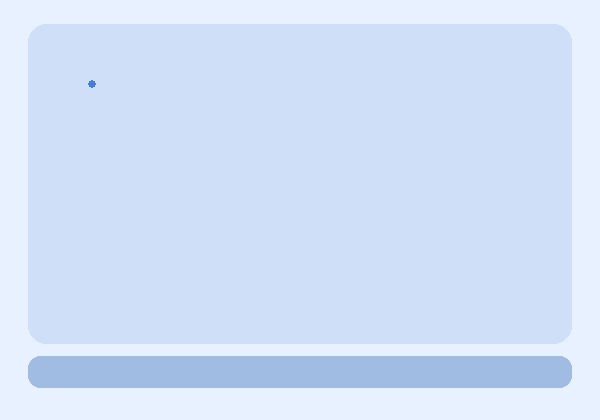
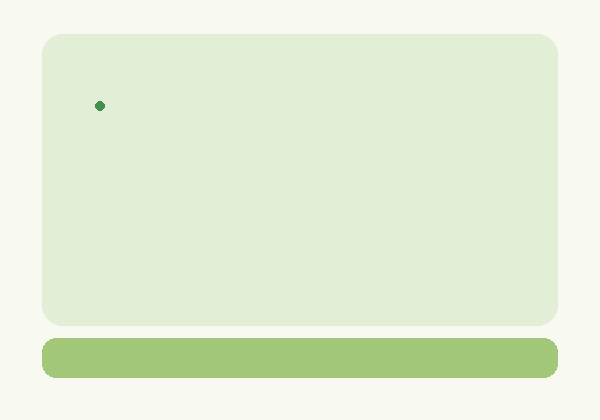
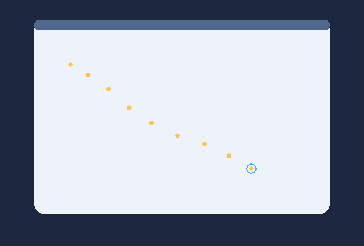
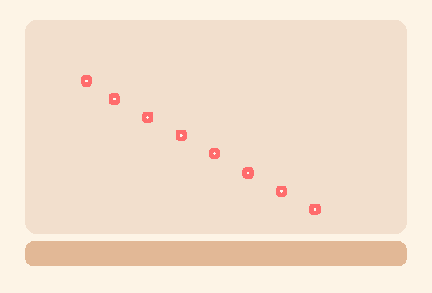

# Pygame Week03 문제 검수 원본

> 이 문서는 `week03` 웹 노출 구조에 맞춰 정리된 검수 원본입니다.
> 원본 제작 문맥과 코드 캡션에는 `round01` 표기가 남아 있을 수 있지만,
> 현재 웹/인덱스 기준 운영 루트는 `practice/data/content/pygame/week03/`입니다.

이 문서는 `모듈 03 · 마우스 입력과 그림판 규칙` 문제지를 검수하기 위한 원본 문서이다.
학생에게는 별도의 문제 파일을 제공하지 않고,
제시된 코드를 직접 작성하게 하는 구성을 기준으로 한다.

`week03`는 `round01`의 기존 6번 문항을
모듈 03 독립 세트로 재구성한 검수 원본이다.
핵심은 `MOUSEMOTION`, 클릭 상태 조건, `event.pos`, 반복 출력이
서로 다른 프로젝트에서 어떻게 작동하는지를 읽고 수정하는 데 있다.

이 문서는 공통 원칙 문서인
`../pygame_문제_제작_운영원칙.md`를 따른다.
이 문서에는 모듈 03 세부 문항과 검수 내용을 중심으로 기록한다.

내부 제작 기준 자료:

- `../source/md_1회차_파이썬으로_게임만들기.md`
- `problems/problem01.py`
- `problems/problem02.py`
- `problems/problem03.py`
- `problems/problem04.py`
- `reference_images/problem01_correct.gif`
- `reference_images/problem02_correct.gif`
- `reference_images/problem03_correct.png`
- `reference_images/problem04_correct.png`

---

## 재구성 원칙

현재 `week03` 검수 범위는 아래 4개 대문항으로 고정한다.

1. 호버 트래커 보드
2. 클릭 드로잉 패드
3. 드래그 상태 기록 캔버스
4. 스탬프 패턴 보드

운영 목표:

- `MOUSEMOTION` 이벤트와 역할을 연결하게 한다.
- 클릭 상태 조건이 입력 규칙을 어떻게 바꾸는지 읽게 한다.
- `event.pos` 저장과 반복 출력의 데이터 흐름을 설명하게 한다.
- 출력 스타일 변화와 입력 규칙 변화를 구분해서 해석하게 한다.

제외 또는 후순위:

- 드래그 외 입력 장치
- 다중 브러시 기능
- 지우개, 레이어, 저장 기능
- 키보드 상태 전환

이 항목들은 이후 확장 응용에서 별도로 다룬다.

---

## 작성 규칙

소문항은 반드시 아래 순서를 유지한다.

1. 난이도
2. 형식
3. 출제 의도
4. 문제
5. 정답
6. 해설
7. 부분 정답 기준
8. 실제 실행 확인 결과
9. 검수 체크

형식 규칙:

- `코드 입력형`: 정답이 코드 한 줄 또는 짧은 블록
- `빈칸형`: 정답이 함수명, 상수, 숫자, 코드 조각
- `복수정답 객관식형`: 정답이 정해진 선택 조합

모든 대문항은 `누적풀이`를 기준으로 설계한다.
뒤 문항은 앞 문항의 수정 결과를 이어받는 것을 기본으로 한다.

---

## 1번. 호버 트래커 보드

제작 기준 코드:

- `problems/problem01.py`

확인 개념:

- `MOUSEMOTION`
- `event.type`
- `event.pos`
- 움직임만으로 남는 경로

코드 설명:

이 프로그램은 마우스를 움직일 때마다
연한 파란 보드 위에 작은 파란 점을 남기는 호버 트래커 코드이다.
클릭 조건은 아직 없고,
움직임 이벤트를 읽는 순간 경로가 생긴다는 점을 먼저 확인한다.

제시 코드:

```python
import sys
import pygame
from pygame.locals import MOUSEMOTION, QUIT

pygame.init()
SURFACE = pygame.display.set_mode((600, 420))
pygame.display.set_caption("week03 problem01")
FPSCLOCK = pygame.time.Clock()


def main():
    hover_points = []

    while True:
        for event in pygame.event.get():
            if event.type == QUIT:
                pygame.quit()
                sys.exit()

            # BLOCK_A_START
            # 문제 1.3: 이벤트 조건 한 줄을 완성하세요.
            elif event.type == MOUSEMOTION:
                hover_points.append(event.pos)
            # BLOCK_A_END

        SURFACE.fill((232, 241, 255))
        pygame.draw.rect(SURFACE, (207, 223, 247), (28, 24, 544, 320), border_radius=18)
        pygame.draw.rect(SURFACE, (160, 188, 227), (28, 356, 544, 32), border_radius=12)

        for point in hover_points:
            pygame.draw.circle(SURFACE, (70, 126, 214), point, 4)

        pygame.display.update()
        FPSCLOCK.tick(60)


if __name__ == "__main__":
    main()
```

참고 이미지:

아래 이미지는 코드가 `올바르게 수정되어 정상 작동할 경우`를
기준으로 한 참고 화면이다.



### 1.1

난이도:

- 하

형식:

- 복수정답 객관식형

출제 의도:

- 마우스 움직임 이벤트 이름을 선택형으로 고정한다.

문제:

마우스를 움직일 때 발생하는 이벤트 타입으로 알맞은 것을 고른 것은?

- ㄱ. `MOUSEMOTION`
- ㄴ. `KEYDOWN`
- ㄷ. `MOUSEBUTTONUP`
- ㄹ. `VIDEORESIZE`

정답:

- `ㄱ`

해설:

- 마우스를 움직일 때마다 `MOUSEMOTION` 이벤트가 발생한다.

부분 정답 기준:

- 없음. `ㄱ`만 정답 처리

실제 실행 확인 결과:

- 제시 코드는 `MOUSEMOTION` 이벤트를 읽을 때 점을 남긴다.

검수 체크:

- 이벤트 이름과 역할이 직접 연결되는지 확인

### 1.2

난이도:

- 중

형식:

- 복수정답 객관식형

출제 의도:

- 현재 코드가 왜 경로를 남기는지 입력과 출력 흐름으로 설명하게 한다.

문제:

제시된 코드에서 마우스를 움직일 때 점이 남는 이유로
옳은 것을 모두 고른 것은?

- ㄱ. `event.type == MOUSEMOTION` 조건이 있다.
- ㄴ. `event.pos`가 리스트에 저장된다.
- ㄷ. 클릭 조건이 반드시 있어야만 저장된다.
- ㄹ. 저장된 좌표를 아래 반복문이 다시 그린다.

정답:

- `ㄱ, ㄴ, ㄹ`

해설:

- 현재 구조는 `MOUSEMOTION` 이벤트를 읽고,
  `event.pos`를 저장한 뒤,
  아래 반복문에서 다시 점을 출력하는 흐름이다.
- 클릭 조건은 아직 필수가 아니다.

부분 정답 기준:

- `ㄱ, ㄴ` 또는 `ㄴ, ㄹ`이면 부분 정답
- `ㄱ, ㄴ, ㄹ`이면 정답

실제 실행 확인 결과:

- 움직이기만 해도 파란 점이 경로를 따라 남는다.

검수 체크:

- 원인 설명이 이벤트와 출력 흐름에 직접 닿는지 확인

### 1.3

난이도:

- 중

형식:

- 코드 입력형

출제 의도:

- 이벤트 조건 한 줄을 코드로 정확히 복구하게 한다.

문제:

마우스를 움직일 때만 좌표를 저장하도록
이벤트 조건 한 줄을 다시 쓰시오.

정답:

```python
elif event.type == MOUSEMOTION:
```

해설:

- 이 줄이 있어야 움직임 이벤트가 발생할 때만 좌표를 저장한다.

부분 정답 기준:

- 없음. 아래 한 줄만 정답 처리
- `elif event.type == MOUSEMOTION:`

실제 실행 확인 결과:

- 조건이 정확해야 호버 경로가 정상적으로 남는다.

검수 체크:

- 코드 입력형이 한 줄로 고정되는지 확인

### 1.4

난이도:

- 중

형식:

- 복수정답 객관식형

출제 의도:

- 이벤트만 읽는 현재 구조의 실행 결과를 예측하게 한다.

문제:

현재 제시 코드 상태로 실행했을 때
옳은 것을 모두 고른 것은?

- ㄱ. 마우스를 움직이면 점이 계속 남는다.
- ㄴ. 클릭하지 않으면 점이 절대 찍히지 않는다.
- ㄷ. 움직인 경로를 따라 점이 남을 수 있다.
- ㄹ. 점 색은 파란색 계열이다.

정답:

- `ㄱ, ㄷ, ㄹ`

해설:

- 클릭 조건이 없으므로 움직이기만 해도 점이 남는다.
- 현재 출력 색은 `(70, 126, 214)`이므로 파란색 계열이다.

부분 정답 기준:

- `ㄱ, ㄷ` 또는 `ㄱ, ㄹ`이면 부분 정답
- `ㄱ, ㄷ, ㄹ`이면 정답

실제 실행 확인 결과:

- 클릭 없이도 움직인 경로를 따라 파란 점이 계속 남는다.

검수 체크:

- 결과 예측 문항이 입력 이벤트 읽기와 직접 연결되는지 확인

---

## 2번. 클릭 드로잉 패드

제작 기준 코드:

- `problems/problem02.py`

확인 개념:

- `event.buttons[0]`
- 클릭한 상태에서만 그리기
- 조건 하나가 입력 규칙을 바꾸는 방식

코드 설명:

이 프로그램은 연한 초록 패드 위에 점을 찍는 드로잉 코드이다.
핵심은 `MOUSEMOTION`만으로는 입력이 너무 넓고,
클릭 상태 조건을 추가해야 원하는 규칙이 된다는 점을 확인하는 것이다.

제시 코드:

```python
import sys
import pygame
from pygame.locals import MOUSEMOTION, QUIT

pygame.init()
SURFACE = pygame.display.set_mode((600, 420))
pygame.display.set_caption("week03 problem02")
FPSCLOCK = pygame.time.Clock()


def main():
    click_points = []

    while True:
        for event in pygame.event.get():
            if event.type == QUIT:
                pygame.quit()
                sys.exit()

            # BLOCK_A_START
            # 문제 2.2, 2.3: 클릭 상태 조건을 반영하세요.
            elif event.type == MOUSEMOTION:
                click_points.append(event.pos)
            # BLOCK_A_END

        SURFACE.fill((248, 250, 242))
        pygame.draw.rect(SURFACE, (227, 238, 214), (42, 34, 516, 292), border_radius=20)
        pygame.draw.rect(SURFACE, (163, 199, 121), (42, 338, 516, 40), border_radius=14)

        for point in click_points:
            pygame.draw.circle(SURFACE, (68, 143, 78), point, 5)

        pygame.display.update()
        FPSCLOCK.tick(60)


if __name__ == "__main__":
    main()
```

참고 이미지:

아래 이미지는 코드가 `올바르게 수정되어 정상 작동할 경우`를
기준으로 한 참고 화면이다.



### 2.1

난이도:

- 중

형식:

- 복수정답 객관식형

출제 의도:

- 클릭 조건이 없을 때의 문제를 먼저 발견하게 한다.

문제:

제시된 코드의 입력 규칙 문제로
옳은 것을 모두 고른 것은?

- ㄱ. 클릭하지 않아도 점이 찍힌다.
- ㄴ. 마우스를 움직일 때마다 좌표가 저장된다.
- ㄷ. 점을 찍으려면 반드시 키보드 입력이 필요하다.
- ㄹ. 클릭 상태를 검사하는 조건이 없다.

정답:

- `ㄱ, ㄴ, ㄹ`

해설:

- 현재 코드는 `MOUSEMOTION`만 검사하므로
  클릭 여부와 상관없이 좌표를 저장한다.
- 키보드 입력은 전혀 사용하지 않는다.

부분 정답 기준:

- `ㄱ, ㄴ` 또는 `ㄱ, ㄹ`이면 부분 정답
- `ㄱ, ㄴ, ㄹ`이면 정답

실제 실행 확인 결과:

- 움직이기만 해도 초록 점이 남는 문제가 보인다.

검수 체크:

- 문제 원인이 조건 하나의 부재로 읽히는지 확인

### 2.2

난이도:

- 중

형식:

- 복수정답 객관식형

출제 의도:

- 클릭 상태를 검사하는 핵심 조각을 보기형으로 고정한다.

문제:

마우스를 클릭한 상태에서만 점이 그려지도록 하려면
조건 자리에 들어갈 값으로 알맞은 것을 고른 것은?

- ㄱ. `event.buttons[0]`
- ㄴ. `event.pos`
- ㄷ. `mouse_positions[0]`
- ㄹ. `pygame.quit()`

정답:

- `ㄱ`

해설:

- `event.buttons[0]`은 왼쪽 버튼이 눌린 상태인지 확인하는 데 사용한다.

부분 정답 기준:

- 없음. `ㄱ`만 정답 처리

실제 실행 확인 결과:

- 클릭 조건을 추가하면 움직이기만 할 때는 점이 남지 않는다.

검수 체크:

- 조건식이 하나로 고정되는지 확인

### 2.3

난이도:

- 중

형식:

- 코드 입력형

출제 의도:

- 이벤트 타입과 클릭 조건을 한 줄로 함께 복구하게 한다.

문제:

클릭한 상태에서만 좌표를 저장하도록
정답 한 줄을 쓰시오.

정답:

```python
elif event.type == MOUSEMOTION and event.buttons[0]:
```

해설:

- 이벤트 종류와 클릭 상태가 모두 맞아야 원하는 입력 규칙이 된다.

부분 정답 기준:

- 없음. 아래 한 줄만 정답 처리
- `elif event.type == MOUSEMOTION and event.buttons[0]:`

실제 실행 확인 결과:

- 두 조건을 함께 써야 클릭 상태에서만 초록 점이 찍힌다.

검수 체크:

- 코드 입력형이 한 줄로 고정되는지 확인

### 2.4

난이도:

- 중

형식:

- 복수정답 객관식형

출제 의도:

- 클릭 조건 추가 후 결과를 종합 판단하게 한다.

문제:

2.3을 반영한 상태라고 가정한다.
실행 후 옳은 것을 모두 고른 것은?

- ㄱ. 클릭한 상태에서 움직일 때만 점이 찍힌다.
- ㄴ. 움직이기만 해서는 점이 찍히지 않는다.
- ㄷ. 점이 자동으로 빨간색으로 바뀐다.
- ㄹ. 입력 규칙이 이전보다 더 좁아진다.

정답:

- `ㄱ, ㄴ, ㄹ`

해설:

- 클릭 조건이 추가되면 입력이 허용되는 상황이 줄어든다.
- 색상은 출력 코드가 그대로이므로 자동으로 바뀌지 않는다.

부분 정답 기준:

- `ㄱ, ㄴ` 또는 `ㄱ, ㄹ`이면 부분 정답
- `ㄱ, ㄴ, ㄹ`이면 정답

실제 실행 확인 결과:

- 클릭 상태가 아닌 경우에는 더 이상 점이 찍히지 않는다.

검수 체크:

- 수정 후 동작 설명이 코드와 정확히 대응되는지 확인

---

## 3번. 드래그 상태 기록 캔버스

제작 기준 코드:

- `problems/problem03.py`

확인 개념:

- `MOUSEBUTTONDOWN`, `MOUSEBUTTONUP`
- `is_drawing`
- `event.pos`
- 좌표 리스트 저장
- 저장된 값과 실제 화면 결과의 연결

코드 설명:

이 프로그램은 마우스 왼쪽 버튼이 눌린 상태를
`is_drawing` 변수로 따로 기억한 뒤,
그 상태에서 움직인 좌표만 기록 캔버스 위에 남긴다.
핵심은 클릭 상태를 버튼 이벤트로 관리하고,
`event.pos`를 저장해 두면 나중 반복 출력에서 다시 사용할 수 있다는 점을 읽는 것이다.

제시 코드:

```python
import sys
import pygame
from pygame.locals import MOUSEBUTTONDOWN, MOUSEBUTTONUP, MOUSEMOTION, QUIT

pygame.init()
SURFACE = pygame.display.set_mode((620, 420))
pygame.display.set_caption("week03 problem03")
FPSCLOCK = pygame.time.Clock()


def main():
    trail_points = []
    is_drawing = False

    while True:
        for event in pygame.event.get():
            if event.type == QUIT:
                pygame.quit()
                sys.exit()
            elif event.type == MOUSEBUTTONDOWN:
                is_drawing = True
            elif event.type == MOUSEBUTTONUP:
                is_drawing = False
            elif event.type == MOUSEMOTION and is_drawing:
                # BLOCK_A_START
                # 문제 3.3: 좌표 저장 줄을 완성하세요.
                trail_points.append(event.pos)
                # BLOCK_A_END

        SURFACE.fill((28, 39, 64))
        pygame.draw.rect(SURFACE, (238, 242, 250), (58, 34, 504, 332), border_radius=18)
        pygame.draw.rect(SURFACE, (80, 104, 142), (58, 34, 504, 18), border_radius=8)

        for point in trail_points:
            pygame.draw.circle(SURFACE, (255, 196, 79), point, 4)

        if trail_points:
            pygame.draw.circle(SURFACE, (77, 170, 255), trail_points[-1], 9, 2)

        pygame.display.update()
        FPSCLOCK.tick(60)


if __name__ == "__main__":
    main()
```

참고 이미지:

아래 이미지는 코드가 `올바르게 수정되어 정상 작동할 경우`를
기준으로 한 참고 화면이다.



### 3.1

난이도:

- 하

형식:

- 복수정답 객관식형

출제 의도:

- `is_drawing` 상태 변수의 역할을 선택형으로 고정한다.

문제:

이 코드에서 `is_drawing`의 역할로 알맞은 것을 고른 것은?

- ㄱ. 마우스 버튼이 눌린 드래그 상태인지 기억한다.
- ㄴ. 현재 창 크기를 저장한다.
- ㄷ. 마지막 점의 색상을 자동으로 고른다.
- ㄹ. `QUIT` 이벤트를 대신 처리한다.

정답:

- `ㄱ`

해설:

- `is_drawing`은 버튼을 누른 상태와 뗀 상태를 따로 기억해
  드래그 중일 때만 좌표를 저장하게 만든다.

부분 정답 기준:

- 없음. `ㄱ`만 정답 처리

실제 실행 확인 결과:

- 제시 코드는 버튼 상태를 `is_drawing`으로 관리한 뒤,
  드래그 중일 때만 좌표를 저장한다.

검수 체크:

- 상태 변수의 역할이 분명하게 설명되는지 확인

### 3.2

난이도:

- 중

형식:

- 복수정답 객관식형

출제 의도:

- 버튼 이벤트, 상태 변수, 좌표 저장의 연결을 흐름으로 검증한다.

문제:

이 프로그램의 입력 처리 흐름에 대한 설명으로
옳은 것을 모두 고른 것은?

- ㄱ. `MOUSEBUTTONDOWN`이 발생하면 드래그 시작 상태로 바뀔 수 있다.
- ㄴ. `MOUSEBUTTONUP`이 발생하면 좌표 저장을 멈추게 할 수 있다.
- ㄷ. `event.pos`를 저장하면 나중에 점 출력 위치로 다시 사용할 수 있다.
- ㄹ. 버튼 상태를 따로 기억할 필요는 전혀 없다.

정답:

- `ㄱ, ㄴ, ㄷ`

해설:

- 이 구조는 버튼을 누름/뗌 이벤트로 상태를 바꾸고,
  드래그 중일 때만 `event.pos`를 저장해 반복 출력에 사용한다.
- 상태 변수를 따로 두지 않으면 버튼 이벤트 기반 제어가 어렵다.

부분 정답 기준:

- `ㄱ, ㄴ` 또는 `ㄱ, ㄷ`이면 부분 정답
- `ㄱ, ㄴ, ㄷ`이면 정답

실제 실행 확인 결과:

- 버튼을 누른 상태로 움직인 좌표만 기록 캔버스에 남길 수 있다.

검수 체크:

- 버튼 이벤트와 상태 변수, 좌표 저장이 하나의 흐름으로 설명되는지 확인

### 3.3

난이도:

- 중

형식:

- 코드 입력형

출제 의도:

- 좌표 저장 핵심 줄을 한 줄로 정확히 복구하게 한다.

문제:

드래그 중인 마우스 좌표를 리스트에 저장하는
정답 한 줄을 쓰시오.

정답:

```python
trail_points.append(event.pos)
```

해설:

- 이 줄이 있어야 움직인 좌표가 저장되고,
  나중 반복 출력에서 다시 사용된다.

부분 정답 기준:

- 없음. 아래 한 줄만 정답 처리
- `trail_points.append(event.pos)`

실제 실행 확인 결과:

- 이 줄이 있어야 경로를 따라 노란 점이 남는다.

검수 체크:

- 코드 입력형이 한 줄로 고정되는지 확인

### 3.4

난이도:

- 중

형식:

- 복수정답 객관식형

출제 의도:

- 좌표 저장이 정상일 때의 결과를 예측하게 한다.

문제:

3.3을 반영한 상태라고 가정한다.
실행 후 옳은 것을 모두 고른 것은?

- ㄱ. 클릭한 상태로 움직이면 경로를 따라 점이 남는다.
- ㄴ. 저장된 좌표 수가 늘어나면 출력되는 점 수도 늘어날 수 있다.
- ㄷ. 저장된 좌표는 반복 출력과 연결되지 않는다.
- ㄹ. 마지막 저장 좌표에는 큰 테두리 표시가 남을 수 있다.

정답:

- `ㄱ, ㄴ, ㄹ`

해설:

- 좌표를 저장해 두고 반복문에서 다시 출력하므로
  점 개수와 위치가 저장 결과와 연결된다.
- 마지막 좌표는 별도 테두리로 강조된다.

부분 정답 기준:

- `ㄱ, ㄴ` 또는 `ㄱ, ㄹ`이면 부분 정답
- `ㄱ, ㄴ, ㄹ`이면 정답

실제 실행 확인 결과:

- 좌표 저장이 정상일 때만 기록 캔버스 경로가 자연스럽게 남는다.

검수 체크:

- 저장과 출력의 데이터 흐름이 문항에서 분명한지 확인

---

## 4번. 스탬프 패턴 보드

제작 기준 코드:

- `problems/problem04.py`

확인 개념:

- `MOUSEBUTTONDOWN`, `MOUSEBUTTONUP`
- `is_stamping`
- `for stamp in stamp_points:`
- `pygame.draw.rect(...)`
- 반복 출력과 도장 패턴

코드 설명:

이 프로그램은 버튼 상태를 `is_stamping`으로 따로 기억하고,
드래그 중 저장된 좌표마다 빨간 사각형 도장을 반복 출력한다.
핵심은 입력 규칙이 맞아도
반복 출력 도형이 바뀌면 결과 화면이 완전히 달라진다는 점을 읽는 것이다.

제시 코드:

```python
import sys
import pygame
from pygame.locals import MOUSEBUTTONDOWN, MOUSEBUTTONUP, MOUSEMOTION, QUIT

pygame.init()
SURFACE = pygame.display.set_mode((620, 420))
pygame.display.set_caption("week03 problem04")
FPSCLOCK = pygame.time.Clock()


def main():
    stamp_points = []
    is_stamping = False

    while True:
        for event in pygame.event.get():
            if event.type == QUIT:
                pygame.quit()
                sys.exit()
            elif event.type == MOUSEBUTTONDOWN:
                is_stamping = True
            elif event.type == MOUSEBUTTONUP:
                is_stamping = False
            elif event.type == MOUSEMOTION and is_stamping:
                stamp_points.append(event.pos)

        SURFACE.fill((253, 244, 230))
        pygame.draw.rect(SURFACE, (242, 223, 205), (36, 28, 548, 308), border_radius=18)
        pygame.draw.rect(SURFACE, (226, 184, 150), (36, 346, 548, 36), border_radius=12)

        # BLOCK_B_START
        # 문제 4.2: 저장된 좌표에 빨간 사각형 도장을 찍는 줄을 완성하세요.
        for stamp in stamp_points:
            pygame.draw.rect(SURFACE, (255, 108, 108), (stamp[0] - 8, stamp[1] - 8, 16, 16), border_radius=4)
            pygame.draw.rect(SURFACE, (255, 245, 238), (stamp[0] - 2, stamp[1] - 2, 4, 4), border_radius=2)
        # BLOCK_B_END

        pygame.display.update()
        FPSCLOCK.tick(60)


if __name__ == "__main__":
    main()
```

참고 이미지:

아래 이미지는 코드가 `올바르게 수정되어 정상 작동할 경우`를
기준으로 한 참고 화면이다.



### 4.1

난이도:

- 하

형식:

- 복수정답 객관식형

출제 의도:

- 반복문 변수 역할을 선택형으로 고정한다.

문제:

반복문에서 저장된 좌표를 하나씩 꺼내 담는 변수로 알맞은 것을 고른 것은?

- ㄱ. `stamp`
- ㄴ. `event`
- ㄷ. `QUIT`
- ㄹ. `FPSCLOCK`

정답:

- `ㄱ`

해설:

- 반복문은 저장된 좌표를 하나씩 꺼내 `stamp`에 담아 사각형 도장을 그린다.

부분 정답 기준:

- 없음. `ㄱ`만 정답 처리

실제 실행 확인 결과:

- 반복문 변수 `stamp`가 있어야 각 좌표에 도장을 찍을 수 있다.

검수 체크:

- 반복 출력 흐름과 변수 역할이 연결되는지 확인

### 4.2

난이도:

- 하

형식:

- 코드 입력형

출제 의도:

- 저장된 좌표에 빨간 사각형 도장을 찍는 핵심 출력 줄을 다시 쓰게 한다.

문제:

저장된 좌표 `stamp`에
빨간 사각형 도장을 찍는 정답 한 줄을 쓰시오.

정답:

```python
pygame.draw.rect(SURFACE, (255, 108, 108), (stamp[0] - 8, stamp[1] - 8, 16, 16), border_radius=4)
```

해설:

- 반복 출력의 핵심은 저장된 좌표를 기준으로
  사각형 도장 위치를 계산해 넣는 것이다.
- 색상과 크기를 고정하면 한 줄 정답으로 채점할 수 있다.

부분 정답 기준:

- 없음. 아래 한 줄만 정답 처리
- `pygame.draw.rect(SURFACE, (255, 108, 108), (stamp[0] - 8, stamp[1] - 8, 16, 16), border_radius=4)`

실제 실행 확인 결과:

- 저장된 좌표 `stamp`에 빨간 사각형 도장이 반복해서 그려진다.

검수 체크:

- 코드 입력형이 한 줄로 고정되는지 확인

### 4.3

난이도:

- 중

형식:

- 복수정답 객관식형

출제 의도:

- 출력 스타일 변경 결과를 예측하게 한다.

문제:

반복 출력 줄을 아래처럼 바꿨다고 가정한다.

```python
pygame.draw.rect(SURFACE, (255, 108, 108), (stamp[0] - 8, stamp[1] - 8, 16, 16), border_radius=4)
```

실행 후 옳은 것을 모두 고른 것은?

- ㄱ. 출력 도형은 사각형 도장 형태가 된다.
- ㄴ. 빨간색 계열 도장이 저장 좌표마다 반복 출력된다.
- ㄷ. 좌표 저장 규칙도 자동으로 바뀐다.
- ㄹ. 여전히 저장된 좌표 위치를 기준으로 도장이 찍힌다.

정답:

- `ㄱ, ㄴ, ㄹ`

해설:

- 반복 출력 도형과 색상은 바뀌지만,
  저장 좌표를 따라 출력한다는 구조 자체는 유지된다.
- 좌표 저장 규칙은 입력 코드가 담당하므로 자동으로 바뀌지 않는다.

부분 정답 기준:

- `ㄱ, ㄴ` 또는 `ㄱ, ㄹ`이면 부분 정답
- `ㄱ, ㄴ, ㄹ`이면 정답

실제 실행 확인 결과:

- 빨간 사각형 도장이 같은 좌표 경로를 따라 남는다.

검수 체크:

- 입력 규칙과 출력 스타일이 분리되어 설명되는지 확인

### 4.4

난이도:

- 중

형식:

- 복수정답 객관식형

출제 의도:

- 입력 규칙과 출력 규칙을 함께 반영한 종합 결과를 판단하게 한다.

문제:

아래 두 조건을 모두 반영한 상태라고 가정한다.

1. `elif event.type == MOUSEMOTION and is_stamping:`
2. `pygame.draw.rect(SURFACE, (255, 108, 108), (stamp[0] - 8, stamp[1] - 8, 16, 16), border_radius=4)`

실행 후 옳은 것을 모두 고른 것은?

- ㄱ. 클릭한 상태에서 움직일 때만 빨간 도장이 남는다.
- ㄴ. 움직이기만 해도 도장이 계속 남는다.
- ㄷ. 저장된 좌표 경로를 따라 도장이 남는다.
- ㄹ. 출력 스타일이 사각형 도장 형태로 바뀌었다.

정답:

- `ㄱ, ㄷ, ㄹ`

해설:

- 입력 조건이 클릭 상태로 제한되고,
  출력 스타일은 빨간 사각형 도장 형태로 바뀐다.
- 좌표 저장 자체는 유지되므로 경로를 따라 도장이 남는다.

부분 정답 기준:

- `ㄱ, ㄷ` 또는 `ㄱ, ㄹ`이면 부분 정답
- `ㄱ, ㄷ, ㄹ`이면 정답

실제 실행 확인 결과:

- 클릭한 상태에서만 빨간 도장이 경로를 따라 남는다.

검수 체크:

- 종합 문항이 입력 규칙과 출력 규칙을 함께 설명하는지 확인

---

## 총평

현재 `week03`은 모듈 03 핵심 축에 맞춰 아래 4개 독립 프로젝트로 재구성되었다.

- 호버 트래커 보드
- 클릭 드로잉 패드
- 드래그 상태 기록 캔버스
- 스탬프 패턴 보드

문항 형식은 모두 아래 셋으로 제한했다.

- 코드 입력형
- 빈칸형
- 복수정답 객관식형

따라서 다음 장점이 있다.

- 하나의 공통 그림판 데모 변형이 아니라, 독립적인 4개 프로젝트를 다루게 된다.
- `MOUSEMOTION`, 클릭 조건, 좌표 저장, 반복 출력의 역할을 서로 다른 화면 목적 안에서 읽게 할 수 있다.
- 입력 규칙과 출력 규칙을 분리해 해석하게 할 수 있다.
- 자동채점 구조로 옮기기 쉬운 정답 형식을 유지할 수 있다.

다음 단계 권장 순서:

1. 이 검수 원본 확정
2. 대문항별 기준 코드와 `problem01.py`~`problem04.py` 동기화 여부 점검
3. 필요 시 참고 PNG/GIF 추가 보강
4. 웹용 JSON 생성

---
