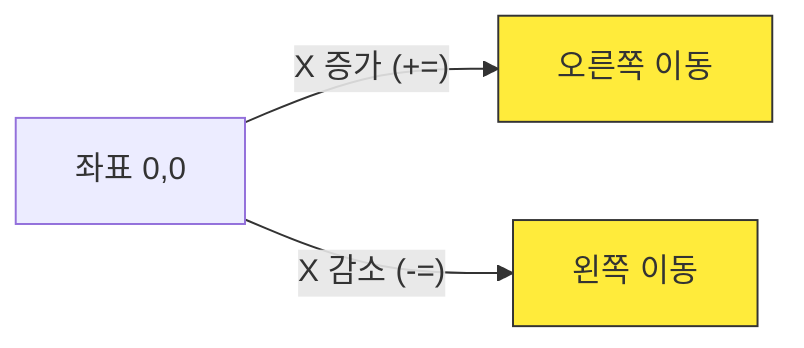
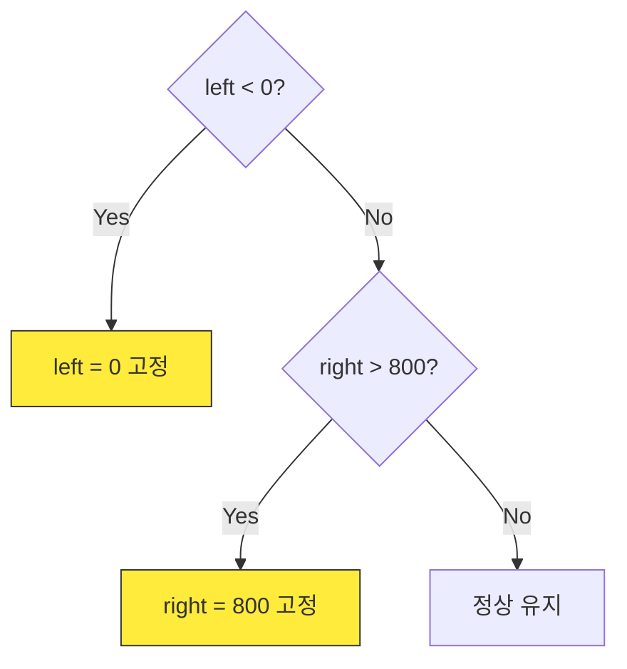

# 1차시. 우주선 좌우 이동하기
> **학습 목표:** 컴퓨터의 좌표계를 이해하고, 화살표 키를 눌러 우주선을 화면 안에서 움직이게 만듭니다.

---

## 1. 컴퓨터의 좌표계와 이동
컴퓨터 화면은 우리가 수학 시간에 배운 그래프와 조금 다릅니다. 기준점이 어디인지, 숫자가 어떻게 변하는지 아는 것이 중요합니다.

### 1.1. (0,0)은 어디일까요?
컴퓨터 화면의 **왼쪽 맨 위**가 항상 `(0,0)`입니다. 
*   **X (가로):** 오른쪽으로 갈수록 커집니다. (`+=`)
*   **Y (세로):** 아래로 갈수록 커집니다. (`+=`)



### 📝 Checkpoint 1: 좌표계 이해하기
> **Q. 우주선을 '왼쪽'으로 움직이게 하려면 X 좌표에 어떤 연산을 해야 할까요?**
> 1) `+=` (더하기)
> 2) `-=` (빼기)
> 3) `*=` (곱하기)
>
> **[문제 ID: mcq-01-01]**

---

## 2. 화살표 키와 우주선 연결
파이썬의 `keys[...]` 장부를 사용하면 현재 어떤 키가 눌렸는지 알 수 있습니다.

```python
# [A] 왼쪽 화살표 키가 눌렸는지 확인
if keys[pygame.K_LEFT]:
    ship_rect.x -= speed  # X 좌표 감소
```

### 💻 실습 미션 1: 우주선 움직이기
`step1_student.py` 파일의 `move_ship()` 함수를 완성하세요.
*   **Mission:** 왼쪽 화살표(`K_LEFT`)와 오른쪽 화살표(`K_RIGHT`)를 눌렀을 때 우주선이 해당 방향으로 움직여야 합니다.
*   **[문제 ID: code-01-01]**

---

## 3. 화면 이탈 버그 막기 (Boundary)
이동만 구현하면 우주선이 화면 밖으로 영영 사라지는 '탈주 사건'이 발생합니다. 이를 막기 위한 방어벽이 필요합니다.

### 3.1. 테두리 센서 활용
`ship_rect`는 사각형의 테두리 위치를 알려주는 똑똑한 센서들을 가지고 있습니다.
*   `ship_rect.left`: 우주선의 왼쪽 끝선
*   `ship_rect.right`: 우주선의 오른쪽 끝선



### 📝 Checkpoint 2: 경계 조건 판단
> **Q. 우주선이 오른쪽 벽(800)을 뚫고 나가는 것을 막으려면 어떤 센서를 확인해야 할까요?**
> 1) `ship_rect.x`
> 2) `ship_rect.left`
> 3) `ship_rect.right`
>
> **[문제 ID: mcq-01-02]**

---

### 💻 실습 미션 2: 방어벽 완성하기
`if` 조건문을 사용하여 우주선이 0보다 작아지거나 800보다 커지지 않게 고정하는 코드를 완성하세요.
*   **[문제 ID: code-01-02]**

---

## 🏆 1차시 완료 체크리스트
- [ ] 우주선이 좌우로 부드럽게 움직이나요?
- [ ] 왼쪽 끝(0)에 닿으면 더 이상 나가지 않나요?
- [ ] 오른쪽 끝(800)에 닿으면 멈추나요?

> **다음 단계:** 성공했다면 2차시 **[운석 낙하]** 스테이지로 이동하세요!
