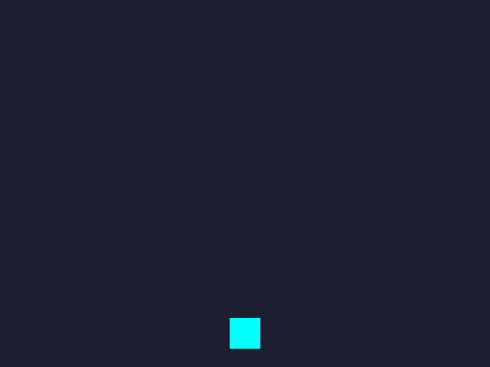
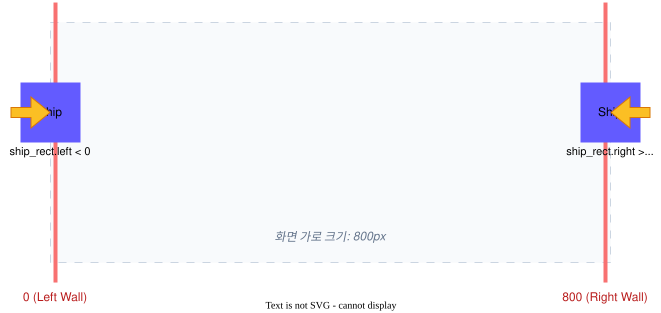
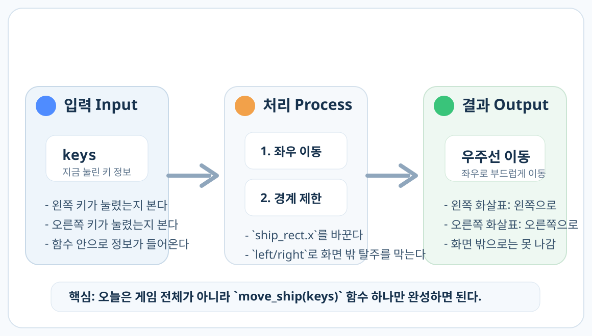

# 1차시. 우주선 좌우 이동하기

---

# 목차

- **1.1. 실습 준비와 좌표계**
  - 파일 구조 확인 및 화면 좌표 이해
- **1.2. 우주선 첫 시동 걸기 (Move)**
  - 화살표 키 입력과 좌표 이동 로직
- **1.3. 화면 이탈 버그 막기 (Boundary)**
  - if 조건문을 이용한 경계 제한 처리
- **1.4. 게임 엔진 작동 원리**
  - 무한 반복 루프와 애니메이션의 마법



---


# 1.1. 실습 파일 구조 확인

- **학생 작업 구역:** 우리가 코드를 채울 `move_ship(keys)` 함수입니다.
- **게임 엔진 구역:** 배경을 지우고, 캐릭터를 그려주는 '심장'입니다. (절대 수정 금지!)

<div class="code-window">

```python
import pygame
import sys

# =========================================================
# 🧑‍💻 [학생 작업 구역] 1차시: 우주선 좌우 이동하기
# =========================================================


def move_ship(keys):
    """
    키보드 입력에 따라 우주선을 좌우로 움직입니다.
    화면 밖으로 나가지 않도록 제한합니다.
    """
    global ship_rect

    speed = 5

    # TODO: [1] 왼쪽(pygame.K_LEFT) 화살표 키를 누르면 왼쪽으로 speed만큼 이동하게 작성하세요.
    pass

    # TODO: [2] 오른쪽(pygame.K_RIGHT) 화살표 키를 누르면 오른쪽으로 speed만큼 이동하게 작성하세요.
    pass

    # TODO: [3] 우주선이 화면 밖으로 나가지 않게 제한해보세요.
    # 힌트: 화면 가로 크기는 800, ship_rect.left 와 ship_rect.right 를 활용하세요.
    pass


# =========================================================
# ⚙️ [게임 엔진 구역] 건드리지 마세요!
# =========================================================

# --- 초기화 ---
pygame.init()
WIDTH, HEIGHT = 800, 600
screen = pygame.display.set_mode((WIDTH, HEIGHT))
pygame.display.set_caption("우주선 운석 피하기 - 학생 실습본")
clock = pygame.time.Clock()

# --- 게임 상태 변수 ---
ship_color = (0, 255, 255)
ship_rect = pygame.Rect(WIDTH // 2 - 25, HEIGHT - 80, 50, 50)


def draw_ship(surface):
    pygame.draw.rect(surface, ship_color, ship_rect)


def main():
    running = True
    while running:
        for event in pygame.event.get():
            if event.type == pygame.QUIT:
                running = False

        keys = pygame.key.get_pressed()
        move_ship(keys)

        screen.fill((30, 30, 50))
        draw_ship(screen)

        pygame.display.flip()
        clock.tick(60)

    pygame.quit()
    sys.exit()


if __name__ == "__main__":
    main()
```

</div>

---

# 컴퓨터의 좌표계 (X, Y)

- **(0,0):** 화면의 **왼쪽 위**가 기준점입니다.
- **X축 (가로):** 오른쪽으로 갈수록 숫자가 커집니다. `+=`
- **Y축 (세로):** 아래로 갈수록 숫자가 커집니다. `+=`

> [!NOTE]
> Pygame은 캐릭터를 직사각형(`Rect`)으로 다룹니다. 따라서 코딩할 때 `ship_rect.x`와 `ship_rect.left`는 **모두 우주선의 가장 왼쪽 테두리 위치**를 가리키는 같은 의미의 변수입니다.


---

# 1.2. 우주선 첫 시동 걸기 (Move)

- `keys[...]`: 현재 어떤 키가 눌렸는지 확인하는 '장부'입니다.
- `pygame.K_LEFT`: 왼쪽 화살표 키의 이름표입니다.
- **논리:** "만약 왼쪽 키가 눌렸다면, X 좌표를 줄여라(`-=`)!"

---

### 📝 Checkpoint 1: 방향과 좌표의 관계

<div class="theory-mcq-card">
  <h3>오른쪽 방향키를 눌렀을 때, 우주선을 오른쪽으로 이동시키는 올바른 코드는 무엇일까요?</h3>
  <div class="mcq-options">
    <div class="mcq-option" data-correct="false" data-hint="x 좌표를 빼면 왼쪽으로 이동하게 됩니다.">
      <code>ship_rect.x -= speed</code>
    </div>
    <div class="mcq-option" data-correct="true">
      <code>ship_rect.x += speed</code>
    </div>
    <div class="mcq-option" data-correct="false" data-hint="y 좌표를 더하면 아래쪽으로 이동하게 됩니다.">
      <code>ship_rect.y += speed</code>
    </div>
  </div>
  <div class="mcq-hint"></div>
</div>

---

### 💻 실습 미션 1: 우주선 움직이기

왼쪽과 오른쪽 방향키 입력을 인식하여 우주선을 이동시켜 보세요.

<div class="code-window">

```python
def move_ship(keys):
    global ship_rect
    speed = 5

    # [1] 왼쪽(pygame.K_LEFT) 화살표 키를 누르면 왼쪽으로 speed만큼 이동
    if keys[pygame.K_LEFT]:
        ship_rect.x -= speed

    # [2] 오른쪽(pygame.K_RIGHT) 화살표 키를 누르면 오른쪽으로 speed만큼 이동
    if keys[pygame.K_RIGHT]:
        ship_rect.x += speed
```

</div>

---

# 1.3. 화면 이탈 버그 막기 (Boundary)

- 컴퓨터는 우리가 "멈춰!"라고 말하기 전까지 좌표를 무한히 증가시킵니다.
- **경계 조건:** X가 0보다 작아지거나, 800보다 커지는 순간을 감시해야 합니다.
- `ship_rect.left`와 `ship_rect.right` 테두리 센서를 사용합니다.



---

### 📝 Checkpoint 2: 방어벽 조건 이해

<div class="theory-mcq-card">
  <h3><code>if ship_rect.right > 800:</code> 조건문 안에서 우주선의 위치를 고정하는 올바른 코드는 무엇일까요?</h3>
  <div class="mcq-options">
    <div class="mcq-option" data-correct="false" data-hint="left를 800으로 고정하면 우주선 몸체가 화면 밖으로 나가버립니다.">
      <code>ship_rect.left = 800</code>
    </div>
    <div class="mcq-option" data-correct="false" data-hint="right를 0으로 고정하면 우주선이 갑자기 왼쪽 끝으로 순간이동합니다.">
      <code>ship_rect.right = 0</code>
    </div>
    <div class="mcq-option" data-correct="true">
      <code>ship_rect.right = 800</code>
    </div>
  </div>
  <div class="mcq-hint"></div>
</div>

---

### 💻 실습 미션 2: 방어벽 완성하기

우주선이 화면 왼쪽과 오른쪽 끝을 넘어가지 않도록 경계 제한 로직을 완성하세요.

<div class="code-window">

```python
def move_ship(keys):
    # (이동 로직 생략...)
    
    # [3] 왼쪽 벽(0)을 넘어가면 0으로 고정
    if ship_rect.left < 0:
        ship_rect.left = 0
        
    # [4] 오른쪽 벽(800)을 넘어가면 800으로 고정
    if ship_rect.right > 800:
        ship_rect.right = 800
```

</div>

---

# 1.4. 게임 엔진 작동 원리

- **무한 반복:** 엔진이 `while` 루프 안에서 우리가 만든 함수를 초당 60번씩 부릅니다.
- **조금씩 이동:** 한 번 부를 때마다 5px씩 이동합니다.
- **결과:** 우리 눈에는 아주 부드러운 움직임으로 보입니다! (60 FPS)



---

# 1차시 완성 체크리스트

<div class="callout tip">

- [ ] 화살표 키를 누를 때 우주선이 반응하나요?
- [ ] 왼쪽 벽(0)을 뚫고 지나가지 않나요?
- [ ] 오른쪽 벽(800)을 뚫고 지나가지 않나요?
- [ ] `speed` 숫자를 바꿨을 때 속도가 변하나요?

</div>

---

# 다음 시간에는...

**2차시: 운석 낙하와 리스트 관리**
하늘에서 쏟아지는 운석을 만들고 리스트로 관리하는 법을 배웁니다.