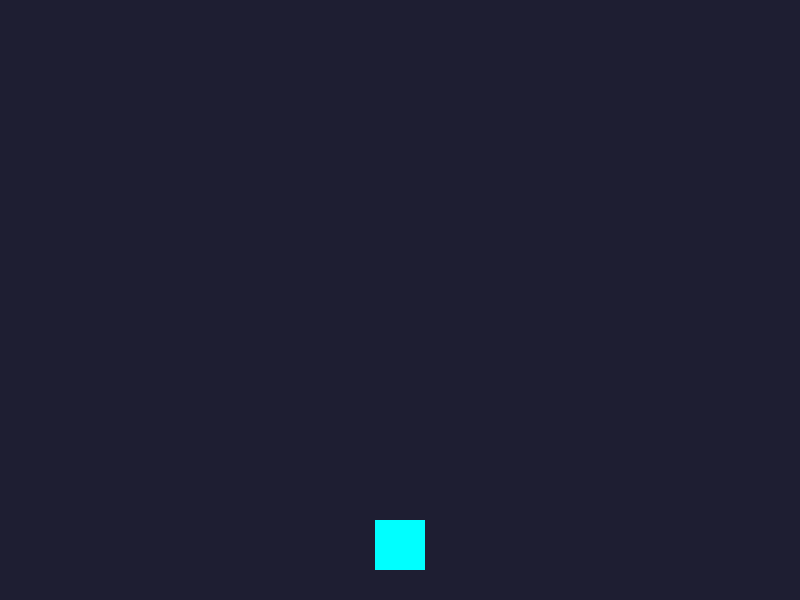
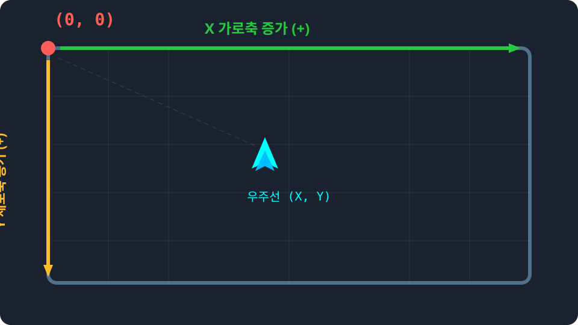
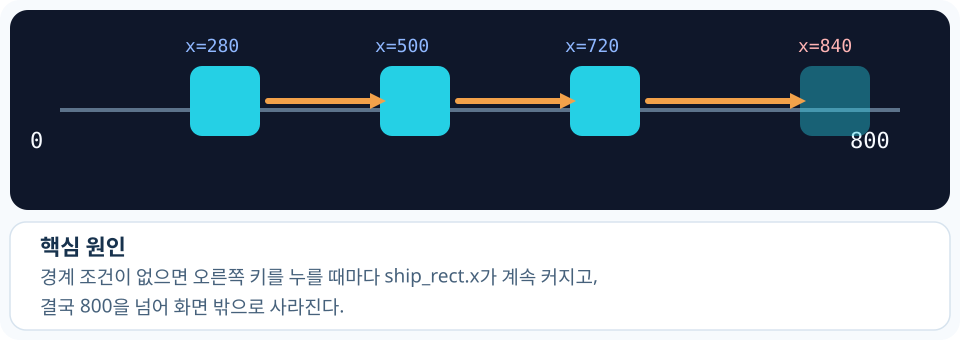
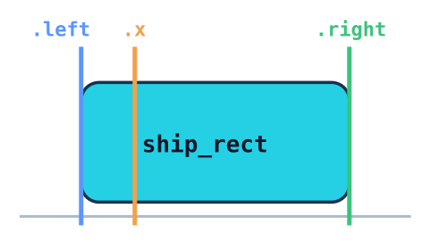
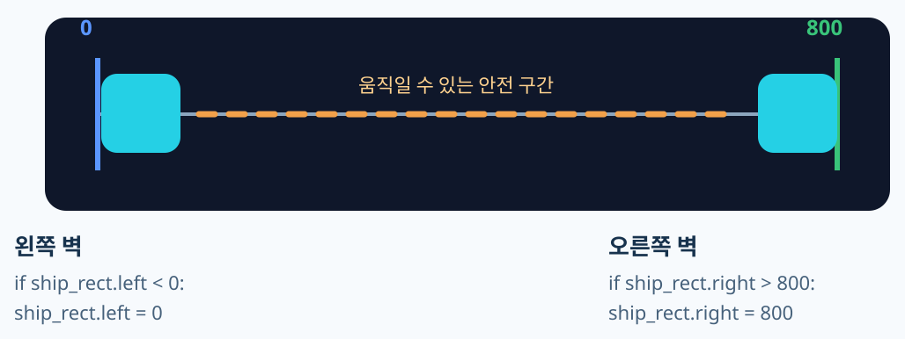
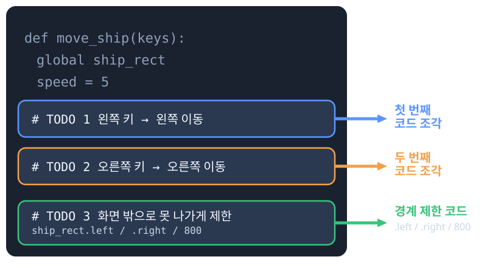

<!-- _class: slide-title -->

# 우주선 운석 피하기 게임

<p>1차시: 우주선 좌우 이동하기</p>

---

<!-- _class: slide-section -->
<h1>목차</h1>

**■ 1회차 수업 전체 지도**

<div class = "slide-2column ratio-55">

<div>

- **0. 실습 준비**
  - 0.1. 실습 파일 구조 확인
  - 0.2. 엔진 시동 걸기 (실행)
- **1.1. 우주선 첫 시동 걸기**
  - 1.1.1. 오늘 만들 완성된 모습
  - 1.1.2. 컴퓨터의 좌표계

</div>

<div>

- **1.2. 화면 이탈 버그 막기**
  - 1.2.1. 나의 아바타: ship_rect
  - 1.2.2. 우주선 방어벽 치기

- **1.3. 게임 엔진 작동 원리**
  - 1.3.1. 하나의 함수로 조립된 코드
  - 1.3.2. 애니메이션의 마법
  - 1.3.3. 코드 깊게 들여다보기

</div>
</div>

<br/>

이번 시간에는 **파일의 구조를 먼저 파악하고, 우주선을 좌우로 직접 움직이며 버그를 수정**해 봅니다.

---

<!-- _class: slide-part -->

# 0. 실습 준비

---

<!-- _class: slide-section -->
<h1>0.1. 실습 파일 구조 확인</h1>

**■ 우리가 코드를 작성할 구역을 찾아봅시다**

에디터에서 `step1_student.py` 파일을 열어보세요. 코드는 크게 두 구역으로 나뉩니다.

<div class="code-window">

```python
# [1] 학생 작업 구역 (수업 시간에 우리가 채울 곳!)
def move_ship(keys):
    # ... 여기에 코드를 짭니다 ...

# [2] 게임 엔진 구역 (절대 건드리지 마세요!)
# 엔진은 1초에 60번씩 우리가 짠 코드를 불러와 실행합니다.
```

</div>

<div class="callout tip">
<b>약속 하나!</b><br/>
선생님이 "엔진 구역으로 오세요"라고 하기 전까지는 <b>[학생 작업 구역]</b> 안에서만 안전하게 코딩합니다.
</div>

---

<!-- _class: slide-section -->
<h1>0.2. 엔진 시동 걸기 (실행)</h1>

**■ 아무것도 안 짰는데 실행이 될까요?**

상단의 **[Run]** 버튼(세모 아이콘)이나 **F5** 키를 눌러 게임을 실행해 보세요.

<div class = "slide-2column ratio-64">

<div>

- **검은 화면**이 뜨고 가운데 **청록색 사각형**이 보이나요?
- 아직 키보드를 눌러도 움직이지 않는 것이 정상입니다.
- **창을 닫으면** 엔진이 멈추고 다시 코딩할 준비가 됩니다.

> **준비 완료!** 이제 이 사각형을 진짜 우주선처럼 움직이게 만들어 봅시다.

</div>

<div>



<p style="text-align: center; font-size: 0.7em;">(현재는 사각형으로 보입니다!)</p>

</div>
</div>

---

<!-- _class: slide-part -->

# 1.1. 우주선 첫 시동 걸기

---

<!-- _class: slide-section -->
<h1>1.1.1. 오늘 만들 완성된 모습</h1>

**■ 좌우로 부드럽게 움직이는 우주선**

오늘 우리는 이 게임의 첫 번째 핵심 기능을 만듭니다.
**우주선을 좌우로 움직이고, 화면 밖으로 탈주하지 않게** 만드는 것이 목표입니다.

<br/>

<div class = "slide-2column ratio-64">

<div>

**오늘 우리가 배울 핵심 개념**

1. 모니터 속 컴퓨터의 **상대 좌표계** (일반 수학과 다름!)
2. 초당 60번 눌리는 키보드 감지하기
3. 조건문(`if`)을 이용해 보이지 않는 방어벽 치기

</div>

<div>


</div>
</div>

---

<!-- _class: slide-section -->
<h1>1.1.2. 컴퓨터의 특이한 X, Y 좌표계</h1>

**■ (0,0)은 어디에 있을까?**

일반적인 수학 그래프는 가운데나 왼쪽 아래가 `(0,0)`입니다.
하지만 화면(모니터)에서는 항상 **왼쪽 맨 위가 (0,0)** 입니다!

<div class = "slide-2column ratio-64">

<div>

- **X (가로축)**: 오른쪽으로 갈수록 커집니다 <b>(`+=`)</b>
- **Y (세로축)**: 아래로 갈수록 커집니다 <b>(`+=`)</b>

> 오늘은 **좌우 이동**만 할 거니까 **X축**만 집중해서 봅니다!
>
> - 우주선이 왼쪽으로 갈 땐: `ship_rect.x -= speed`
> - 우주선이 오른쪽으로 갈 땐: `ship_rect.x += speed`

</div>

<div>



</div>
</div>

---

<!-- _class: slide-section -->
<h1>1.1.3. 화살표 키와 우주선 연결하기</h1>

**■ 키보드를 누르면 우주선을 움직여보자!**

파이썬이 키보드의 방향키 스위치를 인식하는 방법은 정해져 있습니다.
파일의 빈칸(TODO)을 찾아 다음과 같이 **좌우 이동** 코드를 채워봅시다.

<div class = "slide-2column ratio-64">

<div>

<div class="code-window">

```python
# [1] 왼쪽 화살표 누르면 왼쪽으로 가기
if keys[pygame.K_LEFT]:
    ship_rect.x -= speed

# [2] 오른쪽 화살표 누르면 오른쪽으로 가기
if keys[pygame.K_RIGHT]:
    ship_rect.x += speed
```

</div>

</div>

<div>

<div class="callout warn">
<b>[오타 주의 구간]</b><br/>
파이썬은 대소문자를 엄격하게 구분합니다!<br/>
<code>K_LEFT</code>, <code>K_RIGHT</code>는 무조건 <b>대문자</b>입니다.
</div>

<div class="callout tip">
<b><code>keys[...]</code>의 대괄호는 왜 쓸까요?</b><br/>
<code>keys</code>는 수많은 키보드 스위치 상태를 적어둔 <b>장부</b>입니다.<br/>
대괄호 <code>[ ]</code>를 쓰면 그 장부에서 <b>왼쪽 방향키 상태만 콕 찝어</b> 가져오겠다는 뜻입니다!
</div>

</div>
</div>

---

<!-- _class: slide-section -->
<h1>중간 점검 미션 (탈주 사건!)</h1>

**■ 지금 당장 실행해서 우주선을 움직여 보세요**

1. <b>실행</b>해서 우주선이 왼쪽, 오른쪽으로 잘 이동하는지 확인합니다.
2. 하지만 화살표를 꾹 누르고 있으면 우주선이 결국 **화면 밖으로 나갑니다.**

<div class="callout warn">
<b>탈주 시나리오</b><br/>
<code>ship_rect.x</code>에 계속 <code>+= speed</code>가 더해지지만, 멈추라는 대화가 없으니 좌표가 800을 넘어서 1000도, 2000도 계속 커집니다!<br/>
우주선은 화면 밖으로 증발해 버립니다.
</div>

<div class="callout tip">
<b>"선생님, 우주선이 도망갔어요!" 라며 당황하지 마세요!</b><br/>
이건 버그(Bug)입니다. 그리고 이 버그를 <b>직접 발견하고 고치는 것</b>이 오늘 1차시의 가장 중요한 학습 목표입니다!
</div>

---

<!-- _class: slide-part -->

# 1.2. 화면 이탈 버그 막기

---

<!-- _class: slide-section -->
<h1>Q. 왜 화면 밖으로 나갈까?</h1>

**■ 기준선을 정해주지 않으면 X좌표는 계속 증감합니다**

컴퓨터는 우리가 멈추라고 말해주기 전까지, 오른쪽 화살표를 누를 때마다 <code>X</code>좌표를 계속 증가시킵니다.
그래서 화면의 가장 왼쪽 **0**과 가장 오른쪽 **800**이라는 단단한 기준선 방어벽이 필요합니다.



---

<!-- _class: slide-section -->
<h1>1.2.1. 나의 아바타 테두리: ship_rect</h1>

**■ 사각형(Rect)이 가진 마법의 속성들**

탈주를 막으려면 내 우주선의 끝부분을 알아야 합니다.
`ship_rect`는 자기 자신의 **가장자리 위치**를 전부 기록하고 있습니다.

<div class = "slide-2column ratio-64">

<div>

- <b>우주선 전체를 좌우로 움직일 때 (기준 위치)</b><br/>`ship_rect.x`
- <b>우주선의 맨 왼쪽 테두리 선을 확인할 때</b><br/>`ship_rect.left`
- <b>우주선의 맨 오른쪽 테두리 선을 확인할 때</b><br/>`ship_rect.right`

</div>

<div>



</div>
</div>

---

<!-- _class: slide-section -->
<h1>Q. 왜 `left`와 `right`를 쓸까?</h1>

**■ 경계선에 닿는 순간 정확히 멈추게 하려면 테두리를 기준으로 봐야 합니다**

이동할 땐 `.x`를 쓰고, 방어벽 충돌을 계산할 땐 `.left`, `.right` 테두리 센서를 쓰면 아주 편하게 코딩할 수 있습니다!



<div class="callout ok">
<b><code>.x</code> 대신 <code>.left</code>와 <code>.right</code>를 벽에 쓰는 비밀</b><br/>
우주선의 기본 위치인 <code>ship_rect.x</code>는 '왼쪽 끝점' 하나만 의미합니다.
따라서 오른쪽 벽에 부딪히는 걸 막으려면 <code>x + 우주선길이(50) &gt; 800</code> 처럼 복잡하게 계산해야 하지만,
<code>.right</code> 속성을 쓰면 <b>오른쪽 튀어나온 테두리 경계선</b>을 파이썬이 알아서 계산해주어 훨씬 똑똑하고 오차 없이 멈출 수 있습니다!
</div>

---

<!-- _class: slide-section -->
<h1>1.2.2. 우주선 방어벽 치기 (TODO 3)</h1>

**■ if 조건문으로 논리적인 한계선 긋기**

0보다 작아지면 0으로 튕겨내고, 800보다 커지면 800으로 고정합니다.
이 코드를 마저 넣으면 우주선이 밖으로 탈주하지 않는 완벽한 상태가 됩니다!

<div class="code-window">

```python
# [3] 화면 밖으로 나가는 것 막기!
# 왼쪽 끝이 0을 돌파했다면? 강제로 0에 묶어놓자!
if ship_rect.left < 0:
    ship_rect.left = 0

# 오른쪽 끝이 800을 돌파했다면? 강제로 800에 묶어놓자!
if ship_rect.right > 800:
    ship_rect.right = 800
```

</div>

---

<!-- _class: slide-part -->

# 1.3. 게임 엔진 작동 원리

---

<!-- _class: slide-section -->
<h1>1.3.1. 하나의 함수로 조립된 코드</h1>

**■ move_ship() 함수 완성 모델**

우리가 따로따로 작성했던 3개의 부품(TODO)이 합쳐져 드디어 게임의 가장 중요한 **`move_ship(keys)` 전체 엔진**이 완성되었습니다!

<div class = "slide-2column ratio-46">

<div>

<div class="code-window">

```python
def move_ship(keys):
    global ship_rect
    speed = 5

    # 우리가 짠 TODO [1] & [2]
    if keys[pygame.K_LEFT]:
        ship_rect.x -= speed
    if keys[pygame.K_RIGHT]:
        ship_rect.x += speed

    # 우리가 짠 TODO [3]
    if ship_rect.left < 0:
        ship_rect.left = 0
    if ship_rect.right > 800:
        ship_rect.right = 800
```

</div>

</div>

<div>



<br/>

<div class="callout tip">
처음부터 이 거대한 함수를 그냥 받아 적은 것이 아니라,
<b>작은 부품을 하나씩 조립해서 직접 완성해낸 것</b>입니다!
</div>

</div>
</div>

---

<!-- _class: slide-section -->
<h1>1.3.2. 애니메이션의 마법</h1>

**■ 왜 한 번만 눌렀는데 미끄러지듯 이동할까?**

<div class = "slide-2column ratio-64">

<div>

- **플립북의 원리:** 게임은 초당 60번 화면을 지우고 다시 그립니다. (**60 FPS**)
- **무한 반복:** 엔진이 `move_ship()` 함수를 1초에 60번씩 몰래 호출합니다.
- **결과:** 속도가 5라면, 우리 눈에는 **1초 만에 300칸(5 \* 60)** 을 이동하는 마법이 일어납니다!

<div class="callout ok">
<b>애니메이션의 마법 공식</b><br/>
<code>조금 이동(5px)</code> + <code>무한 반복(60번)</code> = <b>부드러운 움직임!</b>
</div>

</div>

<div>


<p style="text-align: center; font-size: 0.7em;">[게임 루프: 엔진이 함수를 계속 불러주는 원리]</p>

</div>
</div>

---

<!-- _class: slide-section -->
<h1>1.3.3. 코드 깊게 들여다보기</h1>

**■ 우리가 쓴 코드 속에 숨겨진 뜻**

<div class = "slide-2column ratio-46">

<div>

<div class="code-window">

```python
def move_ship(keys):
    global ship_rect # [A]
    speed = 5        # [B]
    # ... (이동 코드) ...
```

</div>

</div>

<div>

</div>
<div class="callout tip">
<b>실습 미션: speed 값을 바꾸어 보세요!</b><br/>
<code>speed = 3</code>(느릿느릿) vs <code>speed = 15</code>(번개!) <br/>
취향에 맞게 직접 수정하고 실행해 보세요!
</div>

</div>
</div>

**[A] `global ship_rect`**
바깥 세상(Main)에 준비된 내 아바타(우주선)를 이 함수 안으로 **'빌려오기'** 위한 주문입니다.

**[B] `speed = 5`**
숫자를 **'이름표(변수)'**에 담아두면, 나중에 숫자 하나만 바꿔도 모든 이동 속도가 한꺼번에 변합니다!

---

<!-- _class: slide-section -->
<h1>완성 체크리스트</h1>

**■ 이제 내 함수가 정말 완성되었는지 스스로 확인해 봅시다**

- [ ] 왼쪽 화살표를 누르면 우주선이 왼쪽으로 이동한다
- [ ] 오른쪽 화살표를 누르면 우주선이 오른쪽으로 이동한다
- [ ] 왼쪽 끝이 0보다 작아지지 않는다
- [ ] 오른쪽 끝이 800보다 커지지 않는다
- [ ] `move_ship()` 안의 TODO 3개가 모두 채워져 사라졌다

<div class="callout ok">
<b>여기까지 되면 1차시 성공!</b><br/>
정답 코드를 외운 것이 아니라,
<b>입력 → 이동 → 경계 제한</b>의 흐름으로 직접 함수를 완성한 것입니다.
</div>

---

<!-- _class: slide-part -->

# 우주선 운석 피하기 게임

<p>2차시: 운석 생성과 낙하</p>
