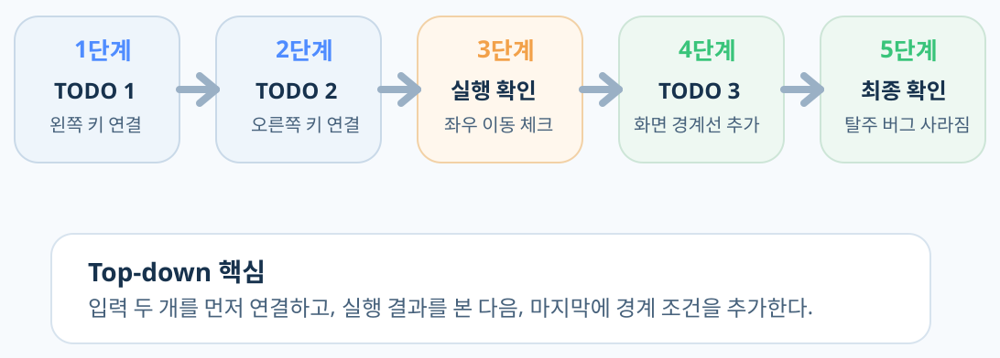
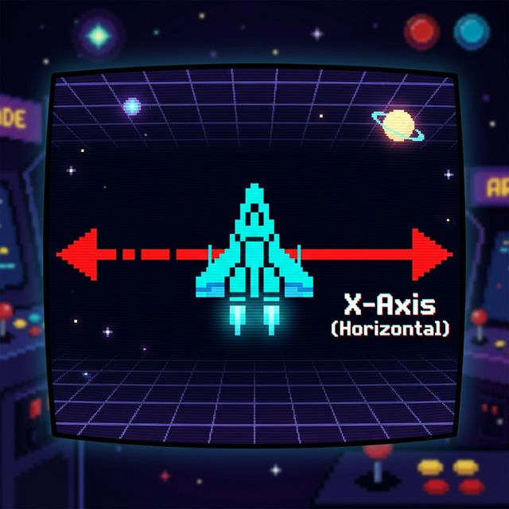
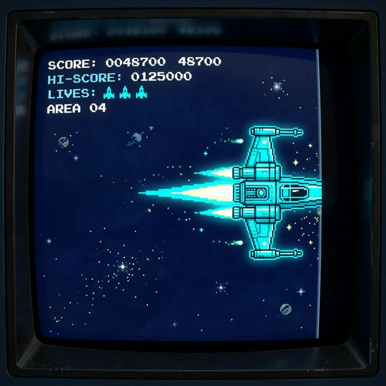

<!-- _class: slide-title -->

# 우주선 운석 피하기 게임

<p>1차시: 우주선 좌우 이동하기</p>

---

<!-- _class: slide-section -->
<h1>목차</h1>

**■ 1회차 수업 전체 지도**

<div class = "slide-2column ratio-55">

<div>

- **1. 오늘 만들 게임과 핵심 목표**
  - 1.1 완성 화면 보기
  - 1.2 오늘 수정할 코드 뼈대 보기

- **2. 우주선을 움직이는 원리**
  - 2.1 화면 좌표계 이해하기
  - 2.2 키보드 입력 연결하기

</div>

<div>

- **3. 화면 밖으로 못 나가게 막기**
  - 3.1 버그 확인하기
  - 3.2 `ship_rect.left/right` 이해하기
  - 3.3 방어벽 코드 완성하기

</div>
</div>

<br/>

이번 시간에는 **우주선을 좌우로 움직이고, 화면 밖으로 못 나가게 막는 것**까지 완성합니다.

---

<!-- _class: slide-section -->
<h1>새로운 프로젝트: 우주선 운석 피하기</h1>

**■ 오늘은 이 게임의 첫 번째 핵심 기능을 만듭니다**

오늘 우리가 직접 완성할 함수는 **`move_ship(keys)`** 입니다.
이 함수 하나만 완성하면 우주선이 **좌우로 움직이고, 화면 밖으로 탈주하지 않게** 됩니다.

이 프로젝트는 앞으로 여러 차시에 걸쳐 확장되지만,
오늘은 그중에서도 **우주선을 좌우로 움직이는 기능 하나**에만 집중합니다.

선생님이 복잡한 "엔진"은 미리 다 만들어 두었습니다.
여러분이 할 일은 **핵심 부품(함수) 하나씩만 꽂아 넣는 것**입니다!

---

<!-- _class: slide-part -->

1. 오늘 만들 게임과 핵심 목표

---

<!-- _class: slide-section -->
<h1>오늘 완성할 함수 한눈에 보기</h1>

**■ `move_ship(keys)`는 정확히 무슨 일을 할까?**


<div class="callout tip">
<b>오늘의 산출물</b><br/>
이번 시간에는 거대한 게임 전체를 만드는 것이 아니라,
<b>`move_ship(keys)` 함수 하나를 완성하는 것</b>이 목표입니다.
</div>

---

<!-- _class: slide-section -->
<h1>오늘 만들 완성된 모습</h1>

**■ 좌우로 부드럽게 움직이는 우주선**

<div class = "slide-2column ratio-64">

<div>

**오늘 우리가 배울 핵심 개념**

1. 모니터 속 컴퓨터의 **상대 좌표계** (일반 수학과 다름!)
2. 초당 60번 눌리는 키보드 감지하기
3. 조건문(`if`)을 이용해 보이지 않는 방어벽 치기

</div>

<div>


</div>
</div>

---

<!-- _class: slide-section -->
<h1>1. 우리가 오늘 만질 블럭 (코드 분석)</h1>

**■ move_ship() 함수 분해하기**

`step1_student.py` 파일의 윗부분을 보면 아래와 같은 뼈대가 미리 준비되어 있습니다. 전체를 직접 치는 게 아닙니다!
우리가 직접 채울 곳은 **정확히 3곳(TODO 1, TODO 2, TODO 3)** 뿐입니다.

<div class = "slide-2column ratio-55">

<div>

```python
def move_ship(keys):
    # 내 우주선을 가져오겠다고 선언
    global ship_rect

    # 이동 속도를 5로 세팅
    speed = 5

    # TODO: [1] 왼쪽 화살표 누르면?
    # TODO: [2] 오른쪽 화살표 누르면?
    # TODO: [3] 화면 밖으로 나가는 것 막기!
```

</div>

<div>


</div>
</div>

---

<!-- _class: slide-section -->
<h1>TODO 조립 순서</h1>

**■ 오늘은 위에서 아래로, 한 칸씩만 조립합니다**



---

<!-- _class: slide-part -->

2. 우주선을 움직이는 원리

---

<!-- _class: slide-section -->
<h1>2. 컴퓨터의 특이한 X, Y 좌표계</h1>

**■ (0,0)은 어디에 있을까?**

일반적인 수학 그래프는 가운데나 왼쪽 아래가 `(0,0)`입니다.
하지만 화면(모니터)에서는 항상 **왼쪽 맨 위가 (0,0)** 입니다!

<div class = "slide-2column ratio-55">

<div>

- **X (가로축)**: 오른쪽으로 갈수록 커집니다 <b>(`+=`)</b>
- **Y (세로축)**: 아래로 갈수록 커집니다 <b>(`+=`)</b>

> 오늘은 **좌우 이동**만 할 거니까 **X축**만 집중해서 봅니다!
>
> - 우주선이 왼쪽으로 갈 땐: `X -= speed`
> - 우주선이 오른쪽으로 갈 땐: `X += speed`

</div>

<div>



</div>
</div>

---

<!-- _class: slide-section -->
<h1>3. 마법의 키보드 연결 (TODO 1, 2)</h1>

**■ 화살표 키와 우주선 연결하기**

자, 이제 파일의 빈칸(TODO)을 찾아 다음과 같이 채워봅시다!

<div class = "slide-2column ratio-64">

<div>

```python
# [1] 왼쪽 화살표 누르면 왼쪽으로 가기
if keys[pygame.K_LEFT]:
    ship_rect.x -= speed

# [2] 오른쪽 화살표 누르면 오른쪽으로 가기
if keys[pygame.K_RIGHT]:
    ship_rect.x += speed
```

</div>

<div>

<div class="callout warn">
<b>[오타 주의 구간]</b><br/>
파이썬은 대소문자를 엄격하게 구분합니다!<br/>
<code>K_LEFT</code>, <code>K_RIGHT</code>는 무조건 <b>대문자</b>입니다.
</div>

</div>
</div>

---

<!-- _class: slide-section -->
<h1>중간 점검 미션</h1>

**■ 지금은 설명이 아니라 직접 실행해서 확인하는 시간입니다**

1. <b>실행</b>해서 우주선이 좌우로 움직이는지 확인합니다.
2. 왼쪽과 오른쪽 화살표가 각각 제대로 연결됐는지 봅니다.
3. <code>speed = 5</code> 를 <code>50</code>으로 바꿔보고 왜 더 빨라지는지 생각해 봅니다.

---

<!-- _class: slide-section -->
<h1>4. 게임이 움직이는 원리 (Flipbook)</h1>

**■ 왜 한 개만 눌렀는데 미끄러지듯 갈까?**

게임은 사실 **엄청나게 빠른 플립북(연속 그림)** 과 같습니다.
우리의 우주선 게임은 **초당 60번(60 FPS)** 화면을 지우고 다시 그립니다.

<div class = "slide-2column ratio-55">

<div>

<code>speed</code>를 조절하면 느낌이 확 달라지는 이유는 무엇일까요?

선생님이 밑에 숨겨놓은 엔진이 <code>move_ship()</code> 함수를 1초에 60번씩 몰래 불러오기 때문입니다.

즉, 속도가 5라면 <b>1초 만에 300칸(5 \* 60)을 부드럽게 이동하는 마법</b>이 일어납니다!

</div>

<div>

<div class="callout">
<b>애니메이션의 원리</b><br/>
초당 60번 좌표를 조금씩 바꾸고 다시 그리면,
우리 눈에는 우주선이 <b>자연스럽게 미끄러지듯 이동하는 것</b>처럼 보입니다.
</div>

</div>
</div>

---

<!-- _class: slide-part -->

3. 화면 밖으로 못 나가게 막기

---

<!-- _class: slide-section -->
<h1>5. 버그(Bug) 발생! 우주선 탈주 사건</h1>

**■ "선생님, 우주선이 도망갔어요!"**



화살표를 꾹 누르고 있으면 우주선이 화면 밖으로 나가버립니다.
왜 이런 일이 생길까요?

---

<!-- _class: slide-section -->
<h1>왜 화면 밖으로 나갈까?</h1>

**■ 기준선을 정해주지 않으면 X좌표는 계속 커집니다**

컴퓨터는 우리가 멈추라고 말해주기 전까지, 오른쪽 화살표를 누를 때마다 <code>X</code>좌표를 계속 증가시킵니다.
그래서 화면의 가장 왼쪽 **0**과 가장 오른쪽 **800**이라는 기준선이 필요합니다.


---

<!-- _class: slide-section -->
<h1>6. 나의 아바타: ship_rect</h1>

**■ 사각형(Rect)이 가진 마법의 속성들**

탈주를 막으려면 내 우주선의 끝부분을 알아야 합니다.
`ship_rect`는 자기 자신의 **가장자리 위치**를 전부 기록하고 있습니다.

<div class = "slide-2column ratio-55">

<div>

- <b>우주선의 맨 왼쪽 테두리 선</b>이 알고 싶으면?<br/>`ship_rect.left`
- <b>우주선의 맨 오른쪽 테두리 선</b>이 알고 싶으면?<br/>`ship_rect.right`

방어벽에 우주선의 끝부분이 닿았는지 계산할 때 이 속성들이 아주 정교한 기준이 됩니다.

</div>

<div>


</div>
</div>

---

<!-- _class: slide-section -->
<h1>7. 우주선 방어벽 치기 (TODO 3)</h1>

**■ if 조건문으로 논리적인 한계선 긋기**

0보다 작아지면 0으로 튕겨내고, 800보다 커지면 800으로 고정합니다.
이 코드를 넣으면 **`move_ship()` 함수의 마지막 퍼즐 조각**이 완성됩니다.

```python
# [3] 화면 밖으로 나가는 것 막기!
# 왼쪽 끝이 0을 돌파했다면? 강제로 0에 묶어놓자!
if ship_rect.left < 0:
    ship_rect.left = 0

# 오른쪽 끝이 800을 돌파했다면? 강제로 800에 묶어놓자!
if ship_rect.right > 800:
    ship_rect.right = 800
```

---

<!-- _class: slide-section -->
<h1>왜 `left`와 `right`를 쓸까?</h1>

**■ 경계선에 닿는 순간 정확히 멈추게 하려면 테두리를 기준으로 봐야 합니다**


<div class="callout ok">
<b><code>left</code>와 <code>right</code> 사용의 비밀</b><br/>
그냥 <code>ship_rect.x</code>를 쓰지 않고 <code>.left</code>와 <code>.right</code>를 쓰는 이유는,
중심점이 아니라 <b>바깥쪽 테두리 경계선</b>이 벽에 닿는 순간 정확히 멈추게 하기 위해서입니다.
</div>

---

<!-- _class: slide-section -->
<h1>완성 체크리스트</h1>

**■ 이제 내 함수가 정말 완성되었는지 스스로 확인해 봅시다**

- [ ] 왼쪽 화살표를 누르면 우주선이 왼쪽으로 이동한다
- [ ] 오른쪽 화살표를 누르면 우주선이 오른쪽으로 이동한다
- [ ] 왼쪽 끝이 0보다 작아지지 않는다
- [ ] 오른쪽 끝이 800보다 커지지 않는다
- [ ] `move_ship()` 안의 TODO 3개가 모두 사라졌다

<div class="callout ok">
<b>여기까지 되면 성공!</b><br/>
정답 코드를 외운 것이 아니라,
<b>입력 → 이동 → 경계 제한</b>의 흐름으로 직접 함수를 완성한 것입니다.
</div>

---

<!-- _class: slide-part -->

지금 바로 시작하세요!
<br/>
<span style="font-size: 0.5em; color: #666;">`step1_student.py`를 열어 3개의 TODO를 채워봅시다.</span>

<div style="font-size: 0.4em; color: #6e8798; margin-top:20px;">
도움이 필요할 땐 손을 번쩍 들어주세요
</div>
