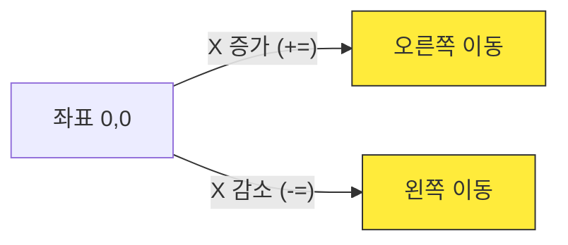
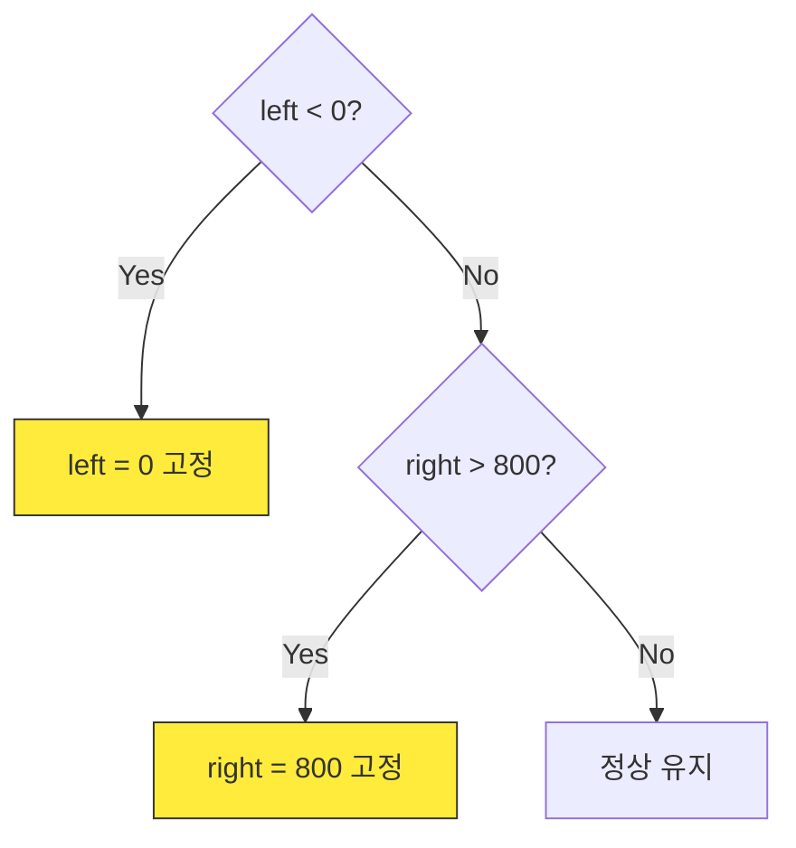

<!-- _class: slide-title -->

# 1차시. 우주선 좌우 이동하기
## 내 손으로 직접 만드는 게임의 첫 걸음

---

<!-- _class: slide-section -->

# 1.0. 목차
<div class="slide-2column ratio-64">
<div>

- **1.1. 실습 준비와 좌표계**
  - 파일 구조 확인 및 화면 좌표 이해
- **1.2. 우주선 첫 시동 걸기 (Move)**
  - 화살표 키 입력과 좌표 이동 로직
- **1.3. 화면 이탈 버그 막기 (Boundary)**
  - if 조건문을 이용한 경계 제한 처리
- **1.4. 게임 엔진 작동 원리**
  - 무한 반복 루프와 애니메이션의 마법

</div>
<div>

<!-- 오늘 완성할 모습 미리보기 -->


</div>
</div>

---

<!-- _class: slide-part -->

# 1.1. 실습 준비와 좌표계

---

<!-- _class: slide-section -->

# 1.1.1. 실습 파일 구조 확인
<div class="slide-2column ratio-55">
<div>

- **학생 작업 구역:** 우리가 코드를 채울 `move_ship(keys)` 함수입니다.
- **게임 엔진 구역:** 배경을 지우고, 캐릭터를 그려주는 '심장'입니다. (절대 수정 금지!)
- **약속:** 선생님이 말하기 전까지는 학생 구역 안에서만 코딩합니다.

</div>
<div>

<div class="code-window">

```python
# [1] 학생 작업 구역
def move_ship(keys):
    # TODO: 여기에 코딩합니다!
    pass

# [2] 게임 엔진 구역
# 건드리지 마세요! (초당 60번 실행 중)
```

</div>
</div>
</div>

---

<!-- _class: slide-section -->

# 1.1.2. 컴퓨터의 좌표계 (X, Y)
<div class="slide-2column ratio-55">
<div>

- **(0,0):** 화면의 **왼쪽 위**가 기준점입니다.
- **X축 (가로):** 오른쪽으로 갈수록 숫자가 커집니다. `+=`
- **Y축 (세로):** 아래로 갈수록 숫자가 커집니다. `+=`
- **이동 원리:** `x` 값을 조금씩 바꾸면 우리 눈에는 움직이는 것처럼 보입니다.

</div>
<div>



</div>
</div>

---

<!-- _class: slide-part -->

# 1.2. 우주선 첫 시동 걸기 (Move)

---

<!-- _class: slide-section -->

# 1.2.1. 화살표 키 인식하기
<div class="slide-2column ratio-55">
<div>

- `keys[...]`: 현재 어떤 키가 눌렸는지 확인하는 '장부'입니다. [A]
- `pygame.K_LEFT`: 왼쪽 화살표 키의 이름표입니다. [B]
- **논리:** "만약 왼쪽 키가 눌렸다면, X 좌표를 줄여라!"

</div>
<div>

<div class="code-window">

```python
def move_ship(keys):
    # [A] 장부에서 [B] 키 상태 확인
    if keys[pygame.K_LEFT]:
        ship_rect.x -= speed
        
    if keys[pygame.K_RIGHT]:
        ship_rect.x += speed
```

</div>
</div>
</div>

---

<!-- _class: slide-section -->

# 1.2.2. [Mission] 우주선 움직이기
<div class="slide-2column ratio-46">
<div>

- `step1_student.py`의 `move_ship` 함수를 조립하세요.
- **Logic Hole:** 오른쪽으로 가려면 X를 어떻게 해야 할까요?
- **힌트:** `K_RIGHT`와 `+=`

</div>
<div>

<div class="code-window">

```python
def move_ship(keys):
    global ship_rect
    speed = 5
    
    # TODO: [A] 왼쪽 이동 로직
    if keys[pygame.K_LEFT]:
        ship_rect.x -= speed
        
    # TODO: [B] 오른쪽 이동 로직
    if keys[pygame.K_???]:
        ship_rect.x ??? speed
```

</div>
</div>
</div>

---

<!-- _class: slide-part -->

# 1.3. 화면 이탈 버그 막기 (Boundary)

---

<!-- _class: slide-section -->

# 1.3.1. 왜 화면 밖으로 나갈까요?
<div class="slide-2column ratio-64">
<div>

- 컴퓨터는 우리가 "멈춰!"라고 말하기 전까지 좌표를 무한히 증가시킵니다.
- **경계 조건:** X가 0보다 작아지거나, 800보다 커지는 순간을 감시해야 합니다.
- `ship_rect.left`와 `ship_rect.right` 테두리 센서를 사용합니다.

</div>
<div>

<!-- 경계선 감시 이미지 -->


</div>
</div>

---

<!-- _class: slide-section -->

# 1.3.2. 방어벽 로직 (if 조건문)
<div class="slide-2column ratio-55">
<div>

- **Check:** 왼쪽 테두리가 0을 넘었는지 확인합니다. [A]
- **Fix:** 넘었다면 강제로 0에 고정시킵니다. [B]
- 이 과정을 통해 우주선이 화면에 갇히게 됩니다.

</div>
<div>



</div>
</div>

---

<!-- _class: slide-section -->

# 1.3.3. [Mission] 방어벽 완성하기
<div class="slide-2column ratio-46">
<div>

- 화면 오른쪽 끝(800)을 넘지 못하게 막는 코드를 완성하세요.
- **Logic Hole:** 오른쪽 벽의 기준은 무엇일까요?
- **힌트:** `ship_rect.right`

</div>
<div>

<div class="code-window">

```python
def move_ship(keys):
    # ... 이동 코드 생략 ...
    
    # [A] 왼쪽 방어벽
    if ship_rect.left < 0:
        ship_rect.left = 0
        
    # [B] 오른쪽 방어벽
    if ship_rect.??? > 800:
        ship_rect.right = ???
```

</div>
</div>
</div>

---

<!-- _class: slide-part -->

# 1.4. 게임 엔진 작동 원리

---

<!-- _class: slide-section -->

# 1.4.1. 애니메이션의 마법
<div class="slide-2column ratio-55">
<div>

- **무한 반복:** 엔진이 `while` 루프 안에서 우리가 만든 함수를 초당 60번씩 부릅니다.
- **조금씩 이동:** 한 번 부를 때마다 5px씩 이동합니다.
- **결과:** 우리 눈에는 아주 부드러운 움직임으로 보입니다! (60 FPS)

</div>
<div>

<!-- 플립북 원리 비유 이미지 -->


</div>
</div>

---

<!-- _class: slide-section -->

# 1.5. 1차시 완성 체크리스트
<div class="callout tip">

- [ ] 화살표 키를 누를 때 우주선이 반응하나요?
- [ ] 왼쪽 벽(0)을 뚫고 지나가지 않나요?
- [ ] 오른쪽 벽(800)을 뚫고 지나가지 않나요?
- [ ] `speed` 숫자를 바꿨을 때 속도가 변하나요?

</div>

<div class="slide-2column ratio-64">
<div>

### 다음 시간에는...
**2차시: 운석 낙하와 리스트 관리**
하늘에서 쏟아지는 운석을 만들고 리스트로 관리하는 법을 배웁니다.

</div>
<div>

<!-- 2차시 예고 이미지 -->


</div>
</div>
