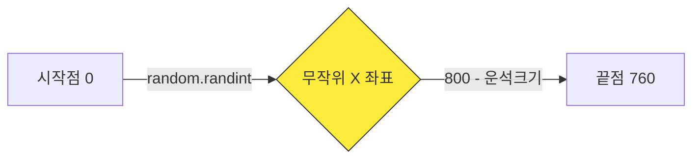
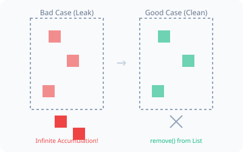

# 2차시. 운석 낙하와 리스트 관리
> **학습 목표:** `random` 함수와 `List`를 활용하여 수많은 운석이 쏟아지는 게임의 핵심 로직을 완성합니다.

---

## 1. 운석 공장 가동하기 (Spawn)
우주선이 움직이는 것만으로는 게임이 완성되지 않습니다. 이제 하늘에서 무작위로 쏟아지는 운석을 만들어 봅시다.

### 1.1. 무작위 X 좌표 결정
운석은 매번 다른 위치에서 나타나야 합니다. 파이썬의 `random.randint(a, b)` 함수는 `a`와 `b` 사이의 정수를 무작위로 골라줍니다.



### 📝 Checkpoint 1: 무작위 함수 이해하기
> **Q. 운석의 크기가 40일 때, 운석이 화면 오른쪽 벽(800)을 뚫고 나가지 않게 하려면 `random.randint`의 최대값은 얼마여야 할까요?**
> 1) 800
> 2) 760
> 3) 40
>
> **[문제 ID: mcq-02-01]**

---

### 1.2. 운석 사각형(Rect) 제작과 보관
결정된 X 좌표를 바탕으로 운석의 모양(`Rect`)을 만들고, 이를 `meteors`라는 리스트(창고)에 보관합니다.

```python
# [A] 무작위 X 좌표 결정
random_x = random.randint(0, 760)

# [B] 운석 사각형 생성 (y=-40에서 시작하여 위에서 나타남)
new_meteor = pygame.Rect(random_x, -40, 40, 40)

# [C] 리스트에 추가 (append)
meteors.append(new_meteor)
```

### 💻 실습 미션 1: 운석 생성 함수 완성
`step2_student.py` 파일의 `spawn_meteor()` 함수 안에 있는 `pass`를 지우고, 위의 로직을 직접 구현해 보세요. 
*   **Mission:** 운석이 리스트에 성공적으로 추가되어 화면에 나타나게 하세요.
*   **[문제 ID: code-02-01]**

---

## 2. 무한 낙하와 메모리 청소 (Update)
리스트에 운석을 넣었다면, 이제 이 운석들을 아래로 움직이고 화면 밖으로 나간 것들은 지워줘야 합니다.

### 2.1. 왜 삭제해야 할까요? (메모리 관리)
화면 아래로 사라진 운석도 컴퓨터는 계속해서 위치를 계산합니다. 삭제하지 않으면 수만 개의 운석이 쌓여 게임이 점점 느려집니다.



```mermaid
graph TD
    A[운석 리스트 순회] --> B[Y 좌표 증가]
    B --> C{화면 밖(Y > 600)?}
    C -- Yes --> D[meteors.remove 삭제]
    C -- No --> E[계속 유지]
    style D fill:#f44336,color:#fff
```

### 📝 Checkpoint 2: 안전한 리스트 삭제
> **Q. 리스트를 한 바퀴 돌면서(for문) 항목을 삭제할 때, 순서가 꼬이지 않게 하려면 리스트의 복사본을 사용해야 합니다. 이때 사용하는 기호는 무엇일까요?**
> 1) `meteors[]`
> 2) `meteors[:]`
> 3) `meteors.copy`
>
> **[문제 ID: mcq-02-02]**

---

### 💻 실습 미션 2: 낙하 및 삭제 로직 구현
`update_meteors()` 함수를 완성하세요. 
1. `for m in meteors[:]`를 사용하여 모든 운석을 꺼냅니다.
2. `m.y += 7`을 사용하여 아래로 떨어뜨립니다.
3. `if m.y > 600:` 이라면 리스트에서 제거(`remove`) 하세요.

*   **[문제 ID: code-02-02]**

---

## 🏆 2차시 완료 체크리스트
- [ ] `random.randint`를 사용하여 운석 위치가 매번 달라지나요?
- [ ] `meteors.append`로 운석이 리스트에 잘 들어가나요?
- [ ] 화면 밖으로 나간 운석이 `remove` 되어 리스트에서 사라지나요?

> **다음 단계:** 모든 미션을 완료했다면 3차시 **[충돌 판정]** 스테이지로 이동하세요!
