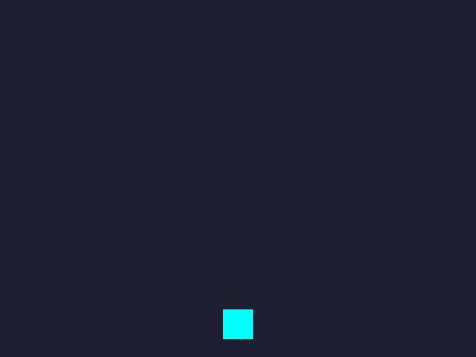
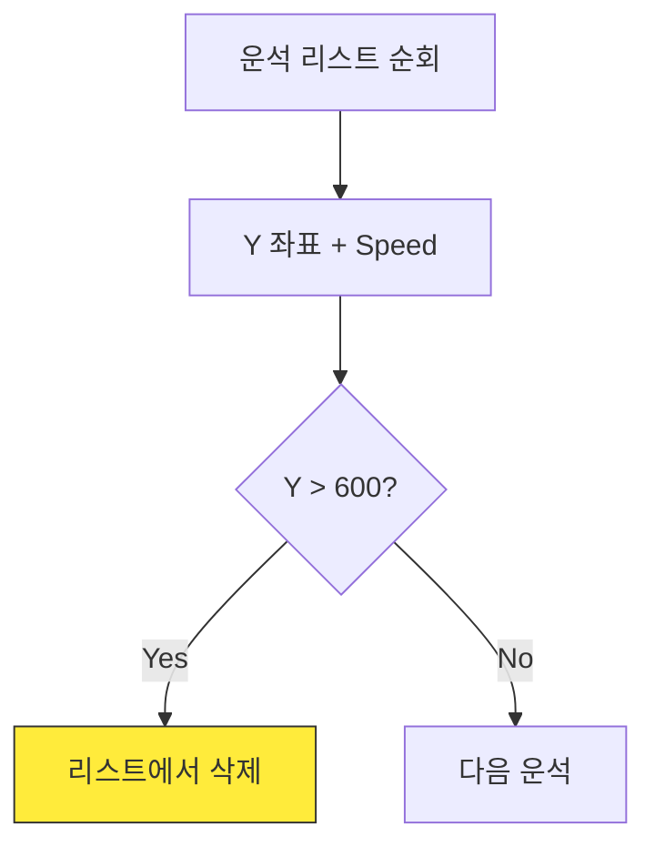

# 2차시. 운석 낙하와 리스트 관리

## 하늘에서 쏟아지는 운석을 피하라!

---

# 목차

- **2.1. 운석 공장 가동하기 (Spawn)**
  - 무작위 위치 설정 및 리스트 추가
- **2.2. 무한 낙하와 메모리 청소 (Update)**
  - 다중 객체 이동 및 화면 밖 삭제
- **2.3. 엔진의 심장: 타이머 (Engine)**
  - 주기적인 이벤트 발생 원리 이해

<!--  -->



---

# 실습 파일 구조

```python
import pygame
import sys
import random

# =========================================================
# 🧑‍💻 [학생 작업 구역] 1차시 코드 (완성) + 2차시: 운석 생성과 낙하
# =========================================================

# --- 1차시 완성 코드 ---
def move_ship(keys):
    global ship_rect
    speed = 5
    if keys[pygame.K_LEFT]:
        ship_rect.x -= speed
    if keys[pygame.K_RIGHT]:
        ship_rect.x += speed
    if ship_rect.left < 0:
        ship_rect.left = 0
    if ship_rect.right > 800:
        ship_rect.right = 800

# --- 2차시 작업 목표 ---
def spawn_meteor():
    """
    화면 맨 위(y=0)의 임의의 위치(x)에 운석을 새롭게 생성합니다.
    """
    global meteors
    
    meteor_size = 40
    
    # TODO: [1] 제일 위쪽에서 화면 가로 길이(800) 안의 임의의 위치(random_x)를 골라보세요.
    # 힌트: random.randint(0, 800 - meteor_size) 를 사용하세요.
    pass
    
    # TODO: [2] 골라진 x 위치와 y 좌표(-meteor_size 시작)로 새로운 운석 사각형(pygame.Rect)을 만드세요.
    pass
    
    # TODO: [3] 만든 운석 사각형을 meteors 리스트에 추가(append) 하세요!
    pass

def update_meteors():
    """
    모든 운석을 아래로 떨어뜨립니다.
    화면 밑으로 벗어난 운석은 리스트에서 제거합니다.
    """
    global meteors
    meteor_speed = 7
    
    # TODO: [4] meteors 리스트에 있는 모든 운석(사각형)의 y 좌표를 meteor_speed 만큼 증가시켜 아래로 이동하세요.
    # 힌트: for문을 사용하세요.
    pass
        
    # TODO: [5] 화면 밖(y좌표가 600 초과)으로 벗어난 운석은 삭제해야 컴퓨터가 느려지지 않습니다!
    # (선생님의 설명에 따라, 안전하게 지우는 방법을 작성해보세요)
    pass


# =========================================================
# ⚙️ [게임 엔진 구역] 건드리지 마세요!
# =========================================================

pygame.init()
WIDTH, HEIGHT = 800, 600
screen = pygame.display.set_mode((WIDTH, HEIGHT))
pygame.display.set_caption("우주선 운석 피하기 - 학생 실습본 (2차시)")
clock = pygame.time.Clock()

ship_color = (0, 255, 255)
ship_rect = pygame.Rect(WIDTH // 2 - 25, HEIGHT - 80, 50, 50)

# 운석 상태 관리 변수
meteor_color = (255, 100, 100) # 붉은색
meteors = []

# 운석 생성 타이머 (커스텀 이벤트 활용)
SPAWN_METEOR_EVENT = pygame.USEREVENT + 1
pygame.time.set_timer(SPAWN_METEOR_EVENT, 600) # 0.6초마다 이벤트 발생

def draw_ship(surface):
    pygame.draw.rect(surface, ship_color, ship_rect)

def draw_meteors(surface):
    for m in meteors:
        pygame.draw.rect(surface, meteor_color, m)

def main():
    running = True
    while running:
        for event in pygame.event.get():
            if event.type == pygame.QUIT:
                running = False
            # 정해진 시간(0.6초)마다 이벤트가 발생하면 학생이 만든 함수 호출
            if event.type == SPAWN_METEOR_EVENT:
                spawn_meteor()
                
        keys = pygame.key.get_pressed()
        
        # 1차시 함수 호출
        move_ship(keys)
        
        # 2차시 학생 작성 함수(업데이트) 호출
        update_meteors()
        
        # 화면 그리기
        screen.fill((30, 30, 50))
        draw_ship(screen)
        draw_meteors(screen)
        
        pygame.display.flip()
        clock.tick(60)

    pygame.quit()
    sys.exit()

if __name__ == "__main__":
    main()

```

---

# 운석 공장 가동하기 (Spawn)

---

# 운석을 만드는 원리

- **무작위 위치:** `random.randint`를 사용하여 매번 다른 X 좌표를 고릅니다.
- **사각형 제작:** `pygame.Rect`를 사용하여 운석의 크기와 위치를 정의합니다.
- **창고 보관:** 생성한 운석을 `meteors` 리스트에 보관합니다.


---

# [Mission] 운석 공장 조립하기

- `step2_student.py` 파일의 `spawn_meteor()` 함수를 완성해야 합니다.
- **Logic Hole:** 운석의 크기가 40일 때, 운석이 화면 우측 끝(800)을 뚫고 나가지 않게 하려면 X의 최대값은 얼마여야 할까요?

<div class="code-window">

```python
def spawn_meteor():
    global meteors
    meteor_size = 40

    # [A] 무작위 X 좌표 결정
    random_x = random.randint(0, 760)

    # [B] 운석 사각형 생성
    new_m = pygame.Rect(random_x, -meteor_size, meteor_size, meteor_size)

    # [C] 리스트에 추가
    meteors.append(new_m)
```

</div>

<div class="theory-mcq-card">
  <h3>화면 너비가 800이고 운석 크기가 40일 때, <code>random.randint(0, ?)</code>에 들어갈 올바른 최대값은 무엇일까요?</h3>
  <div class="mcq-options">
    <div class="mcq-option" data-correct="false" data-hint="800으로 설정하면, 운석의 x좌표가 800이 되어 오른쪽 화면 밖에서 나타날 수 있습니다.">
      <code>800</code>
    </div>
    <div class="mcq-option" data-correct="true">
      <code>760</code>
    </div>
    <div class="mcq-option" data-correct="false" data-hint="40은 운석의 크기입니다. 오른쪽 끝에서 나타나려면 화면 너비에서 크기를 빼야 합니다.">
      <code>40</code>
    </div>
  </div>
  <div class="mcq-hint"></div>
</div>

---


# 무한 낙하와 메모리 청소 (Update)

---

# 운석 처리 프로세스

- **Update:** 모든 운석의 Y 좌표를 증가시켜 낙하시킵니다.
- **Check:** 화면 끝(600)을 넘었는지 확인합니다.
- **Remove:** 넘었다면 목록에서 지워 메모리를 절약합니다.



---

# 리스트 순회와 삭제

- `for m in meteors:`를 사용하여 모든 운석을 하나씩 꺼냅니다. [A]
- 각 운석의 `y` 값을 증가시켜 아래로 떨어뜨립니다. (1차시에서 배웠듯 Y축은 아래로 갈수록 값이 증가합니다.) [B]
- 바닥(600)을 통과하면 목록에서 제거합니다. [C]

<div class="code-window">

```python
def update_meteors():
    # [A] 모든 운석 꺼내기
    # 안전한 삭제를 위해 복사본[:] 사용
    for m in meteors[:]:
        m.y += 7 # [B] 이동 (아래로)

        # [C] 화면 밖으로 나가면 삭제
        if m.y > 600:
            meteors.remove(m)
```

</div>

<div class="theory-mcq-card">
  <h3><code>for m in meteors[:]:</code>와 같이 리스트 뒤에 <code>[:]</code>를 붙여 복사본을 만드는 이유는 무엇일까요?</h3>
  <div class="mcq-options">
    <div class="mcq-option" data-correct="false" data-hint="속도와는 무관합니다. 오히려 복사본을 만들면 메모리를 아주 약간 더 사용합니다.">
      <span>운석이 떨어지는 속도를 높이기 위해서</span>
    </div>
    <div class="mcq-option" data-correct="true">
      <span>순회 도중 요소를 삭제할 때, 리스트의 순서가 꼬이는(Index 오류) 것을 방지하기 위해서</span>
    </div>
    <div class="mcq-option" data-correct="false" data-hint="리스트의 모든 요소를 순회하는 것은 [:]가 없어도 가능합니다. 핵심은 '삭제' 시의 안전성입니다.">
      <span>리스트 안의 모든 운석을 빠짐없이 이동시키기 위해서</span>
    </div>
  </div>
  <div class="mcq-hint"></div>
</div>

---


# 엔진의 심장: 타이머 (Engine)

---

# 0.6초마다 뛰는 심장

- 매 프레임(1/60초)마다 운석을 만들면 화면이 운석으로 가득 찹니다.
- **타이머 이벤트:** 우리가 정한 시간 간격으로 신호를 보냅니다.
- 엔진 구역에 이미 설정된 `set_timer`가 `spawn_meteor`를 호출합니다.

<div class="code-window">

```python
# [엔진 구역] 600ms(0.6초)마다 이벤트 신호
pygame.time.set_timer(SPAWN_METEOR_EVENT, 600)

# [Main Loop] 신호가 오면 함수 실행
if event.type == SPAWN_METEOR_EVENT:
    spawn_meteor()
```

</div>

<div class="callout ok">
이 구역은 이미 완성되어 있습니다. 여러분이 만든 함수가 엔진에 의해 어떻게 실행되는지 확인해보세요!
</div>

---

# 2차시 완성 체크리스트

<div class="callout tip">

- [ ] `random.randint`를 사용하여 운석이 제각각 다른 곳에서 나오나요?
- [ ] 운석이 아래로 부드럽게 떨어지나요?
- [ ] 화면 밖으로 나간 운석이 리스트에서 정상적으로 제거되나요?
- [ ] 우주선과 운석이 겹쳐도 아직은 죽지 않습니다. (3차시 예고!)

</div>

### 다음 시간에는...

**3차시: 충돌 판정과 게임 오버**
운석에 부딪히면 게임이 멈추고 "Game Over"를 띄우는 법을 배웁니다.
