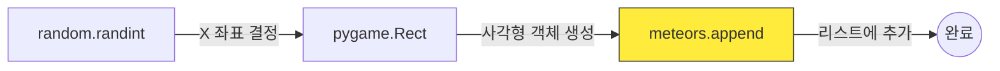
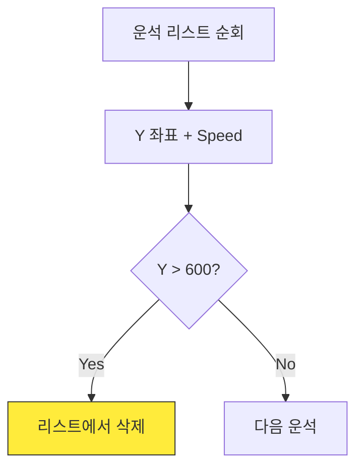

<!-- _class: slide-title -->

# 2차시. 운석 낙하와 리스트 관리

## 하늘에서 쏟아지는 운석을 피하라!

---

<!-- _class: slide-section -->

# 2.0. 목차

- **2.1. 운석 공장 가동하기 (Spawn)**
  - 무작위 위치 설정 및 리스트 추가
- **2.2. 무한 낙하와 메모리 청소 (Update)**
  - 다중 객체 이동 및 화면 밖 삭제
- **2.3. 엔진의 심장: 타이머 (Engine)**
  - 주기적인 이벤트 발생 원리 이해


---

<!-- _class: slide-part -->

# 2.1. 운석 공장 가동하기 (Spawn)

---

<!-- _class: slide-section -->

# 2.1.1. 운석을 만드는 원리

- **무작위 위치:** `random.randint`를 사용하여 매번 다른 X 좌표를 고릅니다.
- **사각형 제작:** `pygame.Rect`를 사용하여 운석의 크기와 위치를 정의합니다.
- **창고 보관:** 생성한 운석을 `meteors` 리스트에 보관합니다.



---

<!-- _class: slide-section -->

# 2.1.2. [Mission] 운석 공장 조립하기

- `step2_student.py` 파일의 `spawn_meteor()` 함수를 완성하세요.
- **Logic Hole:** 운석이 화면 밖으로 나가지 않게 하려면 X의 최대값은 얼마여야 할까요?
- **힌트:** `random.randint(0, ???)`

<div class="code-window">

```python
def spawn_meteor():
    global meteors
    meteor_size = 40

    # TODO: [A] 무작위 X 좌표 결정
    random_x = random.randint(0, ???)

    # TODO: [B] 운석 사각형 생성
    new_m = pygame.Rect(random_x, -meteor_size, 40, 40)

    # TODO: [C] 리스트에 추가
    meteors.append(???)
```

</div>

---

<!-- _class: slide-part -->

# 2.2. 무한 낙하와 메모리 청소 (Update)

---

<!-- _class: slide-section -->

# 2.2.1. 운석 처리 프로세스

- **Update:** 모든 운석의 Y 좌표를 증가시켜 낙하시킵니다.
- **Check:** 화면 끝(600)을 넘었는지 확인합니다.
- **Remove:** 넘었다면 목록에서 지워 메모리를 절약합니다.



---

<!-- _class: slide-section -->

# 2.2.2. 리스트 순회와 삭제

- `for m in meteors:`를 사용하여 모든 운석을 하나씩 꺼냅니다. [A]
- 각 운석의 `y` 값을 증가시켜 아래로 떨어뜨립니다. [B]
- 바닥(600)을 통과하면 목록에서 제거합니다. [C]

<div class="code-window">

```python
def update_meteors():
    # [A] 모든 운석 꺼내기
    # 안전한 삭제를 위해 복사본[:] 사용
    for m in meteors[:]:
        m.y += 7 # [B] 이동

        # [C] 화면 밖으로 나가면 삭제
        if m.y > 600:
            meteors.remove(m)
```

</div>

<div class="callout tip">
복사본(`meteors[:]`)을 사용하는 이유는 리스트를 순회하는 도중에 항목을 삭제해도 순서가 꼬이지 않게 하기 위해서입니다.
</div>

---

<!-- _class: slide-part -->

# 2.3. 엔진의 심장: 타이머 (Engine)

---

<!-- _class: slide-section -->

# 2.3.1. 0.6초마다 뛰는 심장

- 매 프레임(1/60초)마다 운석을 만들면 화면이 운석으로 가득 찹니다.
- **타이머 이벤트:** 우리가 정한 시간 간격으로 신호를 보냅니다.
- 엔진 구역에 이미 설정된 `set_timer`가 `spawn_meteor`를 호출합니다.

<div class="code-window">

```python
# [엔진 구역] 600ms(0.6초)마다 이벤트 신호
pygame.time.set_timer(SPAWN_METEOR_EVENT, 600)

# [Main Loop] 신호가 오면 함수 실행
if event.type == SPAWN_METEOR_EVENT:
    spawn_meteor()
```

</div>

<div class="callout ok">
이 구역은 이미 완성되어 있습니다. 여러분이 만든 함수가 엔진에 의해 어떻게 실행되는지 확인해보세요!
</div>

---

<!-- _class: slide-section -->

# 2.4. 2차시 완성 체크리스트

<div class="callout tip">

- [ ] `random.randint`를 사용하여 운석이 제각각 다른 곳에서 나오나요?
- [ ] 운석이 아래로 부드럽게 떨어지나요?
- [ ] 화면 밖으로 나간 운석이 리스트에서 정상적으로 제거되나요?
- [ ] 우주선과 운석이 겹쳐도 아직은 죽지 않습니다. (3차시 예고!)

</div>

### 다음 시간에는...

**3차시: 충돌 판정과 게임 오버**
운석에 부딪히면 게임이 멈추고 "Game Over"를 띄우는 법을 배웁니다.
