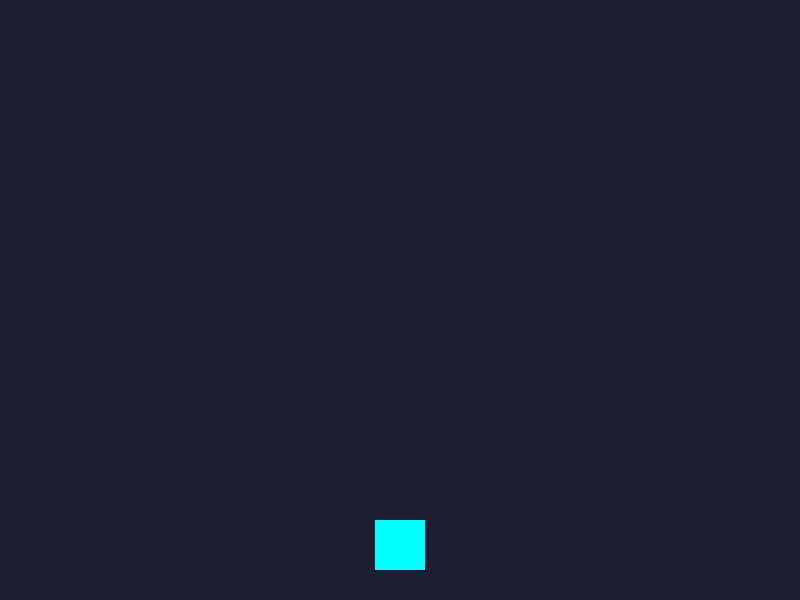
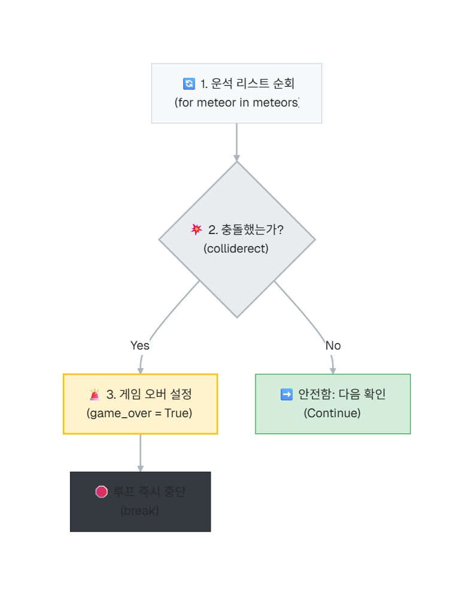
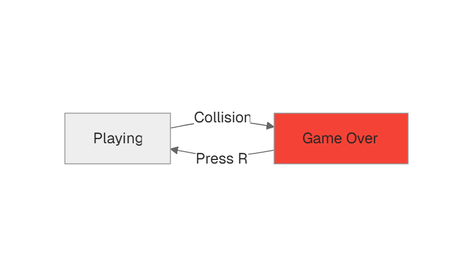

# 3차시. 충돌 판정과 게임 오버

---

# 목차

- **3.1. 충돌의 순간 (Collision)**
  - `colliderect`를 이용한 사각형 충돌 판정
- **3.2. 게임 오버와 재시작 (Restart)**
  - 게임 상태 제어와 초기화 로직
- **3.3. 3차시 완료 체크리스트**



---

# 실습 파일 구조

<div class="code-window">

```python
import pygame
import sys
import random

# =========================================================
# 🧑‍💻 [학생 작업 구역] 1~2차시 유지 + 3차시: 충돌과 재시작
# =========================================================

# --- 1차시: 우주선 이동 ---
def move_ship(keys):
    global ship_rect
    speed = 5
    if keys[pygame.K_LEFT]:
        ship_rect.x -= speed
    if keys[pygame.K_RIGHT]:
        ship_rect.x += speed
    if ship_rect.left < 0:
        ship_rect.left = 0
    if ship_rect.right > 800:
        ship_rect.right = 800

# --- 2차시: 운석 생성과 낙하 ---
def spawn_meteor():
    global meteors
    meteor_size = 40
    random_x = random.randint(0, 800 - meteor_size)
    new_meteor = pygame.Rect(random_x, -meteor_size, meteor_size, meteor_size)
    meteors.append(new_meteor)

def update_meteors():
    global meteors
    meteor_speed = 7
    # 안전한 삭제를 위해 복사본[:]을 순회합니다.
    for meteor in meteors[:]:
        meteor.y += meteor_speed
        if meteor.top > 600:
            meteors.remove(meteor)

# --- 3차시 작업 목표: 충돌 검사와 재시작 ---
def check_collision():
    """
    우주선과 운석이 부딪혔는지 검사합니다.
    """
    global game_over
    
    # TODO: [1] meteors 리스트에 있는 모든 운석을 하나씩 확인해야 합니다. (for문 사용)
    pass
        
    # TODO: [2] 우주선(ship_rect)이 운석(meteor)과 부딪혔는지 확인하세요.
    # 힌트: 사각형끼리 부딪혔는지 확인하는 마법의 명령어 -> ship_rect.colliderect(운석변수)
    pass
        
    # TODO: [3] 만약 부딪혔다면, game_over 변수를 True 로 바꾸고 검사를 중단(break) 하세요!
    pass

def check_restart(keys):
    """
    게임 오버 상태일 때 R 키를 누르면 게임을 다시 시작합니다.
    """
    global game_over, meteors, ship_rect
    
    # TODO: [4] 키보드 'R'(pygame.K_r) 키를 눌렀는지 확인하세요.
    pass

    # TODO: [5] R 키를 눌렀다면 아래 3가지를 초기화 하세요.
    # - game_over를 다시 False 로 바꿉니다.
    # - 떨어지던 운석들을 모두 없애야 합니다. (meteors 리스트 비우기: meteors.clear() )
    # - 우주선의 x좌표(ship_rect.x)도 파괴되기 전의 위치(예를들면 정중앙 375)로 돌려놓으세요.
    pass


# =========================================================
# ⚙️ [게임 엔진 구역] 건드리지 마세요!
# =========================================================

pygame.init()
WIDTH, HEIGHT = 800, 600
screen = pygame.display.set_mode((WIDTH, HEIGHT))
pygame.display.set_caption("우주선 운석 피하기 - 학생 실습본 (3차시)")
clock = pygame.time.Clock()

# --- 상태 변수 ---
ship_color = (0, 255, 255)
ship_rect = pygame.Rect(WIDTH // 2 - 25, HEIGHT - 80, 50, 50)
meteor_color = (255, 100, 100)
meteors = []
game_over = False  # 3차시 엔진에 추가됨

SPAWN_METEOR_EVENT = pygame.USEREVENT + 1
pygame.time.set_timer(SPAWN_METEOR_EVENT, 600)

# --- 텍스트 폰트 설정 (초보자 배려: 기본 폰트 사용) ---
font_large = pygame.font.SysFont(None, 72)
font_small = pygame.font.SysFont(None, 36)

def draw_ship(surface):
    pygame.draw.rect(surface, ship_color, ship_rect)

def draw_meteors(surface):
    for m in meteors:
        pygame.draw.rect(surface, meteor_color, m)

def draw_game_over(surface):
    # 게임 오버 문자 렌더링
    text_over = font_large.render("GAME OVER", True, (255, 50, 50))
    text_restart = font_small.render("Press 'R' to Restart", True, (200, 200, 200))
    
    over_rect = text_over.get_rect(center=(WIDTH // 2, HEIGHT // 2 - 30))
    restart_rect = text_restart.get_rect(center=(WIDTH // 2, HEIGHT // 2 + 30))
    
    surface.blit(text_over, over_rect)
    surface.blit(text_restart, restart_rect)

def main():
    running = True
    while running:
        for event in pygame.event.get():
            if event.type == pygame.QUIT:
                running = False
            
            # 게임 오버가 아닐 때만 운석 생성 타이머 작동
            if not game_over and event.type == SPAWN_METEOR_EVENT:
                spawn_meteor()
                
        keys = pygame.key.get_pressed()
        
        # --- 논리 업데이트 구역 ---
        if not game_over:
            move_ship(keys)
            update_meteors()
            check_collision() # 3차시에 만든 충돌 검사
        else:
            check_restart(keys) # 게임 오버일 때만 재시작 검사
            
        # --- 화면 그리기 구역 ---
        screen.fill((30, 30, 50))
        draw_ship(screen)
        draw_meteors(screen)
        
        if game_over:
            draw_game_over(screen)
        
        pygame.display.flip()
        clock.tick(60)

    pygame.quit()
    sys.exit()

if __name__ == "__main__":
    main()
```

</div>

---

# 3.1. 충돌의 순간 (Collision)

게임에서 가장 중요한 것은 캐릭터가 장애물에 부딪혔는지 알아내는 것입니다.

### 사각형끼리 부딪혔을까?

Pygame의 사각형(`Rect`)은 서로 겹쳤는지 확인하는 `colliderect()` 기능을 가지고 있습니다.
*   `A.colliderect(B)`: 사각형 A와 B가 서로 조금이라도 **겹쳐있다면 `True`**, **그렇지 않다면 `False`**를 돌려줍니다.

> [!NOTE]
> **왜 `check_collision()` 내부에 `global game_over`가 필요할까요?**
> 함수 내부에서 외부 전역 변수 `game_over`의 상태(값)를 `True`로 직접 **변경(재할당)**해야 하므로 `global game_over` 선언이 필요합니다. 단순히 읽기만 할 때는 없어도 되지만, 값을 수정할 때는 꼭 명시해 주어야 합니다.



---

### 📝 Checkpoint 1: 충돌 함수 이해

<div class="theory-mcq-card">
  <h3>사각형 A와 사각형 B가 충돌했는지 확인할 때 사용하는 올바른 명령어는?</h3>
  <div class="mcq-options">
    <div class="mcq-option" data-correct="false" data-hint="Pygame에 hit()이라는 명령어는 존재하지 않습니다.">
      <code>A.hit(B)</code>
    </div>
    <div class="mcq-option" data-correct="true">
      <code>A.colliderect(B)</code>
    </div>
    <div class="mcq-option" data-correct="false" data-hint="Pygame에서는 colliderect를 사용하여 겹침을 판단합니다.">
      <code>A.overlap(B)</code>
    </div>
  </div>
  <div class="mcq-hint"></div>
</div>

---

### 💻 실습 미션 1: 충돌 검사 로직 구현

`check_collision()` 함수를 완성하세요. 모든 운석을 조사하여 우주선과 부딪히는 순간 `game_over`를 `True`로 바꾸고 루프를 탈출(`break`)하는 로직을 작성해야 합니다.

<div class="code-window">

```python
def check_collision():
    global game_over
    
    # [A] meteors 리스트에 있는 모든 운석을 하나씩 확인 (for문 사용)
    for meteor in meteors:
        # [B] 우주선(ship_rect)이 운석(meteor)과 부딪혔는지 확인
        if ship_rect.colliderect(meteor):
            # [C] 부딪혔다면, game_over를 True로 바꾸고 break로 탈출!
            game_over = True
            break
```

</div>

---

# 3.2. 게임 오버와 재시작 (Restart)

부딪히는 것만으로는 부족합니다. 게임을 다시 시작할 수 있는 장치가 필요합니다.

### 게임의 두 가지 상태

`game_over` 변수의 값에 따라 게임은 전혀 다른 모습이 됩니다.
*   **True:** 모든 움직임 정지, "GAME OVER" 표시.
*   **False:** 우주선 이동, 운석 낙하 중.

> [!NOTE]
> **재시작 초기화 좌표 `375`는 어디서 나왔을까요?**
> 화면 가로 크기(800)의 정중앙은 `400`입니다. 우주선의 가로 크기가 `50`이므로, 우주선 사각형의 왼쪽 좌표(`ship_rect.x`)가 `400 - 25 = 375`가 되어야 우주선이 화면 정중앙에 완벽하게 정렬됩니다.
>
> **왜 여러 개의 `global` 변수가 필요한가요?**
> `check_restart()` 함수 내부에서 `game_over` 상태를 정상(`False`)으로 변경하고, `meteors` 리스트를 비우며, `ship_rect` 좌표를 초기화하는 등 전역 상태 변수들을 직접 수정해야 하므로 `global game_over, meteors, ship_rect` 선언이 필요합니다.



---

### 📝 Checkpoint 2: 상태 전환 이해

<div class="theory-mcq-card">
  <h3>게임 오버 상태에서 'R' 키를 눌러 다시 시작하려고 합니다. 이때 <code>game_over</code> 변수는 어떤 값으로 바뀌어야 할까요?</h3>
  <div class="mcq-options">
    <div class="mcq-option" data-correct="false" data-hint="True로 유지하면 계속 게임 오버 상태가 됩니다.">
      <code>True</code>
    </div>
    <div class="mcq-option" data-correct="true">
      <code>False</code>
    </div>
    <div class="mcq-option" data-correct="false" data-hint="None이 아니라 명확한 불리언 값을 가져야 합니다.">
      <code>None</code>
    </div>
  </div>
  <div class="mcq-hint"></div>
</div>

---

### 💻 실습 미션 2: 다시 시작하기 기능 완성

`check_restart()` 함수를 완성하세요. 게임 오버 상태에서 특정 키를 눌렀을 때 게임을 초기화하는 과정입니다.

<div class="code-window">

```python
def check_restart(keys):
    global game_over, meteors, ship_rect
    
    # [A] 키보드 'R'(pygame.K_r) 키를 눌렀는지 확인
    if keys[pygame.K_r]:
        # [B] 게임 상태와 리스트, 위치를 초기화
        game_over = False
        meteors.clear()
        ship_rect.x = 375  # 화면 중앙 근처로 복구
```

</div>

---

### 💻 실습 미션 3: 충돌 및 재시작 함수 호출하기

우리가 만든 `check_collision()`과 `check_restart()` 함수가 게임에 연동되도록 **메인 루프(Main Loop)**의 논리 업데이트 구역에 직접 호출해 주어야 합니다.

1. **충돌 검사 호출:** 게임 진행 중(`if not game_over:`)일 때 매 프레임마다 `check_collision()`을 호출합니다.
2. **재시작 검사 호출:** 게임 오버 상태(`else:`)일 때 매 프레임마다 키 입력을 감시하도록 `check_restart(keys)`를 호출합니다.

<div class="code-window">

```python
# [Main Loop] 논리 업데이트 구역 예시
running = True
while running:
    # (이벤트 처리 구역 생략...)
    
    keys = pygame.key.get_pressed()
    
    # --- 논리 업데이트 구역 ---
    if not game_over:
        move_ship(keys)
        update_meteors()
        check_collision()   # <--- [호출] 매 프레임마다 충돌 검사 실행!
    else:
        check_restart(keys) # <--- [호출] 게임 오버일 때만 재시작 검사 실행!
```

</div>

---

# 3차시 완료 체크리스트

<div class="callout tip">

- [ ] 운석에 부딪히면 화면에 "GAME OVER"가 뜨나요?
- [ ] 게임 오버 상태에서 운석이 더 이상 만들어지지 않나요?
- [ ] 'R' 키를 누르면 모든 것이 초기화되어 다시 시작되나요?

</div>

> **다음 단계:** 성공했다면 4차시 **[점수와 난이도]** 스테이지로 이동하세요!
