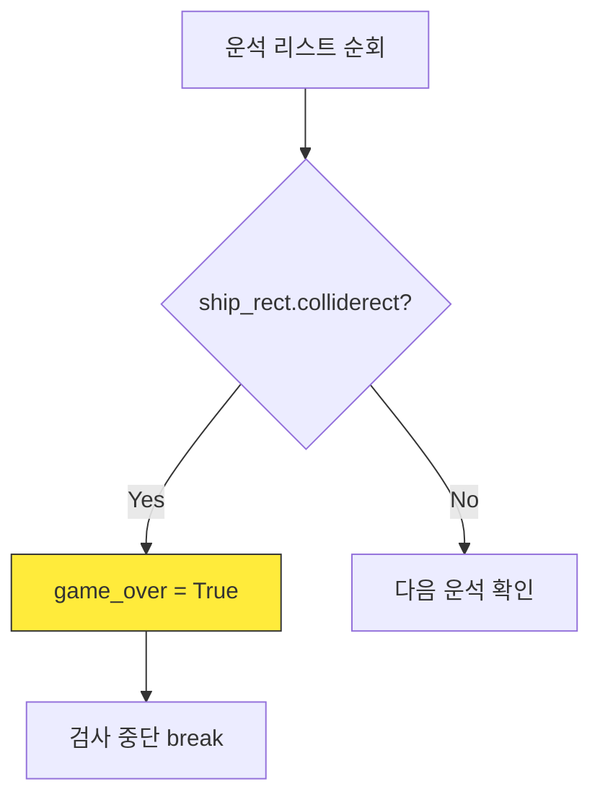
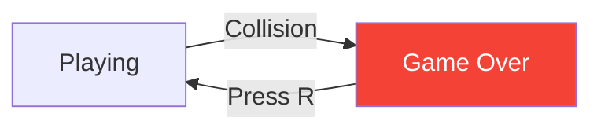

# 3차시. 충돌 판정과 게임 오버
> **학습 목표:** 우주선과 운석의 충돌을 감지하고, 게임 오버 상태를 제어하는 방법을 배웁니다.

---

## 1. 충돌의 순간 (Collision)
게임에서 가장 중요한 것은 캐릭터가 장애물에 부딪혔는지 알아내는 것입니다.

### 1.1. 사각형끼리 부딪혔을까?
Pygame의 사각형(`Rect`)은 서로 겹쳤는지 확인하는 `colliderect()` 기능을 가지고 있습니다.

### 📝 Checkpoint 1: 충돌 함수 이해
> **Q. 사각형 A와 사각형 B가 충돌했는지 확인할 때 사용하는 올바른 명령어는?**
> 1) `A.hit(B)`
> 2) `A.colliderect(B)`
> 3) `A.overlap(B)`
>
> **[문제 ID: mcq-03-01]**

---

### 💻 실습 미션 1: 충돌 검사 로직 구현
`check_collision()` 함수를 완성하세요.
*   **Mission:** 모든 운석을 조사하여 우주선과 부딪히는 순간 `game_over`를 `True`로 바꾸고 루프를 탈출(`break`)하세요.
*   **[문제 ID: code-03-01]**

---

## 2. 게임 오버와 재시작 (Restart)
부딪히는 것만으로는 부족합니다. 게임을 다시 시작할 수 있는 장치가 필요합니다.

### 2.1. 게임의 두 가지 상태
`game_over` 변수의 값에 따라 게임은 전혀 다른 모습이 됩니다.
*   **True:** 모든 움직임 정지, "GAME OVER" 표시.
*   **False:** 우주선 이동, 운석 낙하 중.

### 📝 Checkpoint 2: 상태 전환 이해
> **Q. 게임 오버 상태에서 'R' 키를 눌러 다시 시작하려고 합니다. 이때 `game_over` 변수는 어떤 값으로 바뀌어야 할까요?**
> 1) `True`
> 2) `False`
> 3) `None`
>
> **[문제 ID: mcq-03-02]**

---

### 💻 실습 미션 2: 다시 시작하기 기능 완성
`check_restart()` 함수를 완성하세요.
1. 'R' 키를 눌렀는지 확인합니다.
2. `game_over`를 `False`로 바꿉니다.
3. `meteors.clear()`를 호출하여 운석들을 모두 없앱니다.
4. 우주선의 위치를 중앙으로 돌려놓습니다.

*   **[문제 ID: code-03-02]**

---

## 🏆 3차시 완료 체크리스트
- [ ] 운석에 부딪히면 화면에 "GAME OVER"가 뜨나요?
- [ ] 게임 오버 상태에서 운석이 더 이상 만들어지지 않나요?
- [ ] 'R' 키를 누르면 모든 것이 초기화되어 다시 시작되나요?

> **다음 단계:** 성공했다면 4차시 **[점수와 난이도]** 스테이지로 이동하세요!
