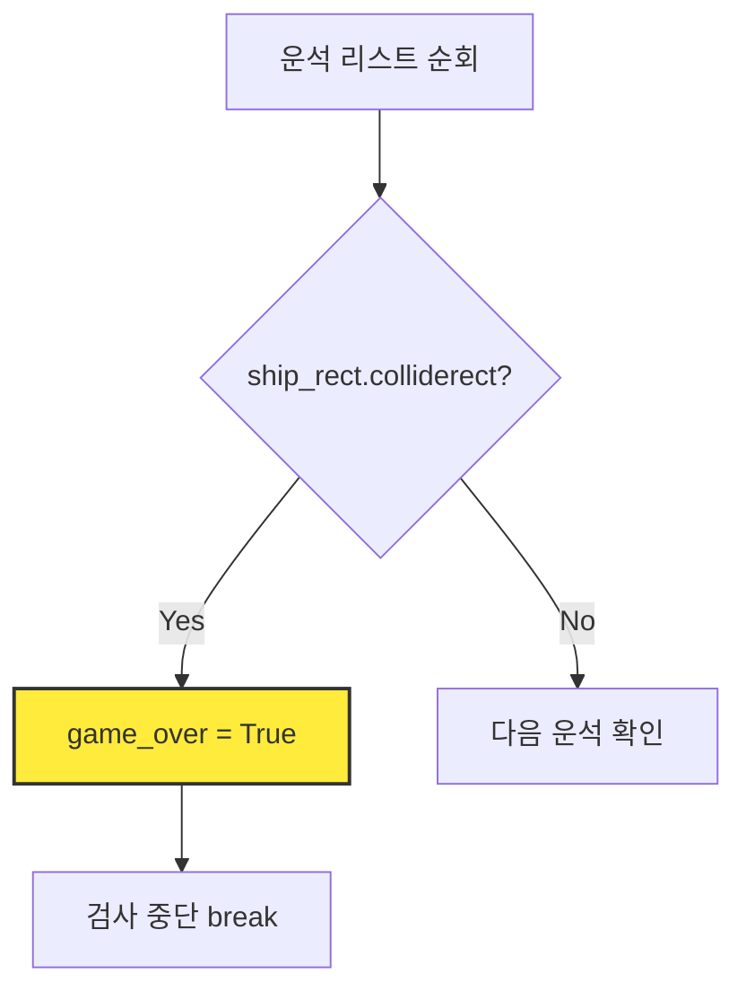
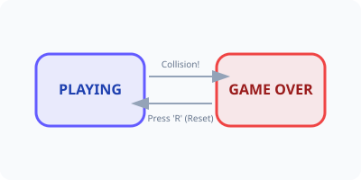

<!-- _class: slide-title -->

# 3차시. 충돌 판정과 게임 오버
## 콰쾅! 운석에 부딪히면 어떻게 될까요?

---

<!-- _class: slide-section -->

# 3.0. 목차
<div class="slide-2column ratio-64">
<div>

- **3.1. 충돌의 순간 (Collision)**
  - `colliderect`를 활용한 물리적 접촉 감지
- **3.2. 게임 오버와 상태 전이 (State)**
  - `game_over` 변수를 이용한 흐름 제어
- **3.3. 다시 시작하기 (Restart)**
  - 리스트 비우기와 위치 초기화 로직
- **3.4. 텍스트와 폰트 (UI)**
  - "GAME OVER" 문자를 화면에 띄우는 법

</div>
<div>

<!-- 게임 오버 결과물 미리보기 -->


</div>
</div>

---

<!-- _class: slide-part -->

# 3.1. 충돌의 순간 (Collision)

---

<!-- _class: slide-section -->

# 3.1.1. 사각형끼리 부딪혔을까?
<div class="slide-2column ratio-55">
<div>

- **`colliderect()`**: 두 사각형(Rect)이 겹쳤는지 확인하는 마법의 명령어입니다. [A]
- **논리:** "만약(if) 우주선이 운석과 부딪혔다면?"
- **결과:** 부딪히는 순간 `True`(참)를 반환합니다.

</div>
<div>



</div>
</div>

---

<!-- _class: slide-section -->
# 3.1.2. [Mission] 충돌 검사 조립하기
<div class="slide-2column ratio-46">
<div>

- `step3_student.py`의 `check_collision()` 함수를 완성하세요.
- **Logic Hole:** 부딪힌 순간 검사를 계속해야 할까요, 멈춰야 할까요?
- **힌트:** `break`를 사용하여 루프를 탈출하세요.

</div>
<div>

<div class="code-window">

```python
def check_collision():
    global game_over
    for m in meteors:
        # [A] 우주선과 운석(m)의 충돌 확인
        if ship_rect.colliderect(???):
            # [B] 게임 상태 변경
            game_over = ???
            break
```

</div>
</div>
</div>

---

<!-- _class: slide-part -->

# 3.2. 게임 오버와 상태 전이 (State)

---

<!-- _class: slide-section -->

# 3.2.1. 게임의 두 가지 상태
<div class="slide-2column ratio-64">
<div>

- **Playing (진행 중):** 운석이 생성되고, 움직이고, 충돌을 검사합니다.
- **Game Over (멈춤):** 모든 움직임이 멈추고 화면에 글자만 띄웁니다.
- **해결책:** `if not game_over:` 조건문을 사용하여 코드를 두 그룹으로 나눕니다.

</div>
<div>

<!-- 상태 전이 비유 이미지 -->


</div>
</div>

---

<!-- _class: slide-section -->

# 3.2.2. [Mission] 다시 시작하기 (Restart)
<div class="slide-2column ratio-46">
<div>

- 'R' 키를 누르면 게임을 초기 상태로 되돌립니다.
- **Logic Hole:** 다시 시작하려면 쌓여있던 운석들은 어떻게 해야 할까요?
- **힌트:** `meteors.clear()`

</div>
<div>

<div class="code-window">

```python
def check_restart(keys):
    global game_over, meteors, ship_rect
    # [A] R 키를 눌렀는지 확인
    if keys[pygame.K_r]:
        # [B] 모든 상태 초기화
        game_over = False
        meteors.???() # 운석 비우기
        ship_rect.x = 375 # 위치 복구
```

</div>
</div>
</div>

---

<!-- _class: slide-part -->

# 3.3. 텍스트와 폰트 (UI)

---

<!-- _class: slide-section -->

# 3.3.1. 화면에 글자 띄우기
<div class="slide-2column ratio-55">
<div>

- **Render:** 폰트로 글자 이미지를 만듭니다. [A]
- **Blit:** 만들어진 글자 이미지를 화면에 '도장' 찍듯 그립니다. [B]
- **Rect Center:** 화면 정중앙 좌표를 쉽게 계산하여 배치합니다.

</div>
<div>

<div class="code-window">

```python
# [A] 폰트 객체로 글자 이미지 생성
text = font.render("GAME OVER", True, (255,0,0))

# [B] 화면 정중앙에 그리기
screen.blit(text, text_rect)
```

</div>

<div class="callout tip">
이 부분은 [엔진 구역]에 이미 구현되어 있습니다. 궁금한 친구들은 <code>draw_game_over</code> 함수를 구경해 보세요!
</div>

</div>
</div>

---

<!-- _class: slide-section -->

# 3.4. 3차시 완성 체크리스트
<div class="callout tip">

- [ ] 운석에 부딪히는 순간 "GAME OVER" 글자가 보이나요?
- [ ] 게임 오버가 되었을 때 운석들이 더 이상 떨어지지 않나요?
- [ ] 'R' 키를 누르면 우주선이 중앙으로 돌아오고 다시 시작되나요?
- [ ] 재시작 시 화면에 남아있던 운석들이 모두 사라지나요?

</div>

<div class="slide-2column ratio-64">
<div>

### 다음 시간에는...
**4차시: 점수와 난이도 조절**
얼마나 오래 버텼는지 점수를 계산하고, 시간이 지날수록 운석이 더 빨리 쏟아지게 만듭니다.

</div>
<div>

<!-- 4차시 예고 이미지 -->


</div>
</div>
