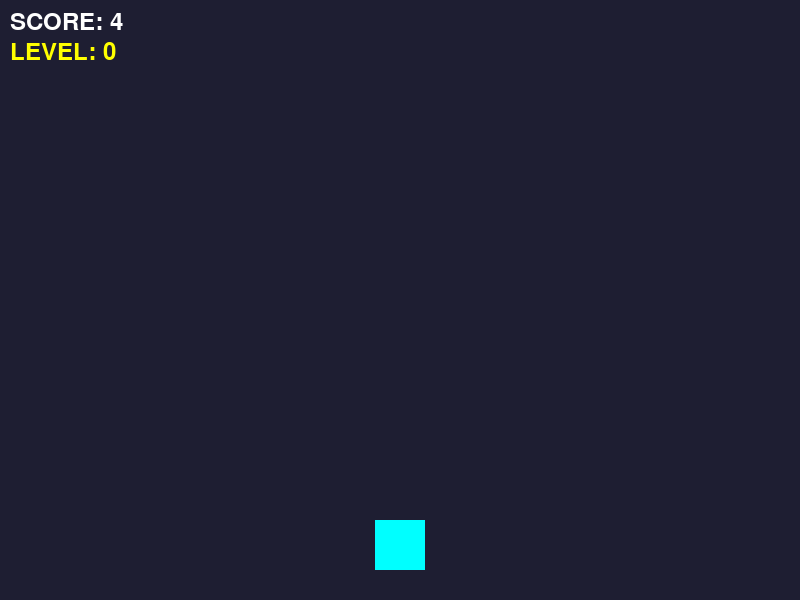

# 4차시. 점수와 난이도 조절

---

# 목차

- **4.1. 점수 올리기 (Score)**
  - 누적 연산자(`+=`)를 활용한 점수 시스템
- **4.2. 난이도의 마법 (Difficulty)**
  - 몫 연산자(`//`)를 이용한 레벨업 로직
- **4.3. 4차시 완료 체크리스트**



---

# 실습 파일 구조

<div class="code-window">

```python
import pygame
import sys
import random

# =========================================================
# 🧑‍💻 [학생 작업 구역] 1~3차시 유지 + 4차시: 점수와 난이도
# =========================================================

# --- 1차시: 우주선 이동 ---
def move_ship(keys):
    global ship_rect
    speed = 5
    if keys[pygame.K_LEFT]:
        ship_rect.x -= speed
    if keys[pygame.K_RIGHT]:
        ship_rect.x += speed
    if ship_rect.left < 0:
        ship_rect.left = 0
    if ship_rect.right > 800:
        ship_rect.right = 800

# --- 2차시: 운석 생성과 낙하 (+ 4차시 난이도 반영) ---
def spawn_meteor():
    global meteors
    meteor_size = 40
    random_x = random.randint(0, 800 - meteor_size)
    new_meteor = pygame.Rect(random_x, -meteor_size, meteor_size, meteor_size)
    meteors.append(new_meteor)

def update_meteors():
    global meteors
    # [4차시] 기존 속도(7)에 난이도(difficulty) 값을 더해줍니다!
    meteor_speed = 7 + difficulty
    
    for meteor in meteors:
        meteor.y += meteor_speed
    meteors = [m for m in meteors if m.top < 600]

# --- 3차시: 충돌 검사와 재시작 (+ 4차시 점수 초기화 반영) ---
def check_collision():
    global game_over
    for meteor in meteors:
        if ship_rect.colliderect(meteor):
            game_over = True
            break

def check_restart(keys):
    global game_over, meteors, ship_rect, score, difficulty
    if keys[pygame.K_r]:
        game_over = False
        meteors.clear()
        ship_rect.x = 400 - 25
        # [4차시] 다시 시작할 때 점수와 난이도도 0으로 초기화합니다.
        score = 0
        difficulty = 0

# --- 4차시 작업 목표: 점수와 난이도 증가 ---
def update_score():
    """
    살아남은 시간만큼 점수를 올리고, 점수에 따라 난이도를 올립니다.
    """
    global score, difficulty
    
    # TODO: [1] 점수(score)를 1점씩 올리세요. (누적 연산자 += 사용)
    pass
    
    # TODO: [2] 300점이 오를 때마다 난이도(레벨)가 1씩 오르게 하세요. (몫 연산자 // 사용)
    pass


# =========================================================
# ⚙️ [게임 엔진 구역] 건드리지 마세요!
# =========================================================

pygame.init()
WIDTH, HEIGHT = 800, 600
screen = pygame.display.set_mode((WIDTH, HEIGHT))
pygame.display.set_caption("우주선 운석 피하기 - 학생 실습본 (4차시)")
clock = pygame.time.Clock()

# --- 상태 변수 ---
ship_color = (0, 255, 255)
ship_rect = pygame.Rect(WIDTH // 2 - 25, HEIGHT - 80, 50, 50)
meteor_color = (255, 100, 100)
meteors = []
game_over = False

# 4차시 엔진 상태 변수
score = 0
difficulty = 0

SPAWN_METEOR_EVENT = pygame.USEREVENT + 1
pygame.time.set_timer(SPAWN_METEOR_EVENT, 600)

font_small = pygame.font.SysFont(None, 36)

def draw_hud(surface):
    # 화면에 점수와 레벨 표시
    score_text = font_small.render(f"SCORE: {score}", True, (255, 255, 255))
    level_text = font_small.render(f"LEVEL: {difficulty}", True, (255, 255, 0))
    surface.blit(score_text, (10, 10))
    surface.blit(level_text, (10, 40))

def main():
    running = True
    while running:
        for event in pygame.event.get():
            if event.type == pygame.QUIT:
                running = False
            if not game_over and event.type == SPAWN_METEOR_EVENT:
                spawn_meteor()
                
        keys = pygame.key.get_pressed()
        
        if not game_over:
            move_ship(keys)
            update_meteors()
            check_collision()
            update_score() # 4차시 함수 호출
        else:
            check_restart(keys)
            
        screen.fill((30, 30, 50))
        # 그리기 로직 (생략/엔진 내부)
        draw_hud(screen)
        # ...
        pygame.display.flip()
        clock.tick(60)
    pygame.quit()

if __name__ == "__main__":
    main()
```

</div>

---

# 4.1. 점수 올리기 (Score)

게임을 계속할 동기를 부여하기 위해 점수판을 만들어 봅시다.

### 누적 연산자의 활용

파이썬의 `+=` 기호를 사용하면 기존 점수에 새로운 점수를 계속해서 더할 수 있습니다. 한 번 함수가 실행될 때마다 1점씩 쌓이게 됩니다.

---

### 📝 Checkpoint 1: 연산자 선택

<div class="theory-mcq-card">
  <h3>기존의 점수값에 1을 '누적'하여 저장하고 싶을 때 사용하는 올바른 기호는?</h3>
  <div class="mcq-options">
    <div class="mcq-option" data-correct="false" data-hint="단순 대입 연산자로, 기존 값을 지우고 새로 덮어씁니다.">
      <code>=</code>
    </div>
    <div class="mcq-option" data-correct="false" data-hint="두 값이 같은지 비교하는 비교 연산자입니다.">
      <code>==</code>
    </div>
    <div class="mcq-option" data-correct="true">
      <code>+=</code>
    </div>
  </div>
  <div class="mcq-hint"></div>
</div>

---

### 💻 실습 미션 1: 점수 누적 로직 구현

`update_score()` 함수를 완성하세요. 함수가 호출될 때마다 `score` 변수의 값을 1씩 올려주세요.

<div class="code-window">

```python
def update_score():
    global score, difficulty
    
    # [A] 기존 score에 1을 더해 다시 score에 저장합니다.
    score += 1
```

</div>

---

# 4.2. 난이도의 마법 (Difficulty)

점수가 아무리 높아져도 난이도가 그대로라면 게임이 지루해집니다.

### 300점마다 레벨업!

몫을 구하는 연산자 `//`를 사용하면 일정 점수 구간마다 레벨을 1씩 올릴 수 있습니다. 예를 들어 450점일 때는 `450 // 300`의 결과인 1레벨이 됩니다.


---

### 📝 Checkpoint 2: 몫 연산자 활용

<div class="theory-mcq-card">
  <h3>현재 점수가 950점일 때, <code>score // 300</code>의 결과값(난이도)은 얼마일까요?</h3>
  <div class="mcq-options">
    <div class="mcq-option" data-correct="true">
      <code>3</code>
    </div>
    <div class="mcq-option" data-correct="false" data-hint="// 연산자는 소수점을 버리고 정수 몫만 남깁니다.">
      <code>3.16</code>
    </div>
    <div class="mcq-option" data-correct="false" data-hint="몫은 3이며, 나머지는 50입니다.">
      <code>4</code>
    </div>
  </div>
  <div class="mcq-hint"></div>
</div>

---

### 💻 실습 미션 2: 난이도 조절 공식 완성

점수 구간에 따라 난이도가 오르도록 `update_score()` 함수를 마무리하세요.

<div class="code-window">

```python
def update_score():
    global score, difficulty
    
    score += 1
    
    # [B] 점수를 300으로 나눈 '몫'을 difficulty(난이도)에 대입합니다.
    difficulty = score // 300
```

</div>

---

# 4.3. 4차시 완료 체크리스트

<div class="callout tip">

- [ ] 화면에 SCORE와 LEVEL이 실시간으로 표시되나요?
- [ ] 시간이 지날수록 점수가 1점씩 척척 올라가나요?
- [ ] LEVEL이 오를 때마다 운석이 눈에 띄게 빨라지나요?

</div>

> **다음 단계:** 성공했다면 마지막 5차시 **[나만의 우주선 확장]** 스테이지로 이동하세요!
