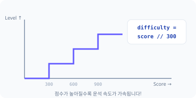
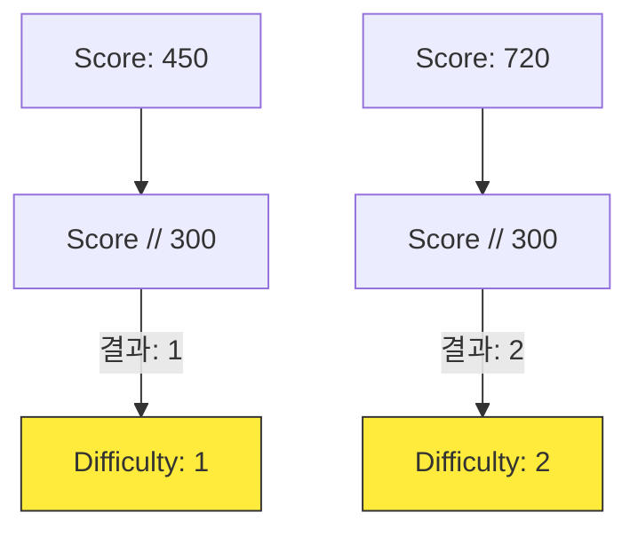

# 4차시. 점수와 난이도 조절
> **학습 목표:** 살아남은 시간에 따라 점수를 올리고, 점수가 높아질수록 게임이 더 매워지는(난이도 상승) 로직을 완성합니다.

---

## 1. 점수 올리기 (Score)
게임을 계속할 동기를 부여하기 위해 점수판을 만들어 봅시다.

### 1.1. 누적 연산자의 활용
파이썬의 `+=` 기호를 사용하면 기존 점수에 새로운 점수를 계속해서 더할 수 있습니다.

```python
# 점수(score)를 1점씩 증가시키기
score += 1
```

### 📝 Checkpoint 1: 연산자 선택
> **Q. 기존의 점수값에 1을 '누적'하여 저장하고 싶을 때 사용하는 올바른 기호는?**
> 1) `=`
> 2) `==`
> 3) `+=`
>
> **[문제 ID: mcq-04-01]**

---

### 💻 실습 미션 1: 점수 누적 로직 구현
`update_score()` 함수를 완성하세요.
*   **Mission:** 함수가 호출될 때마다 `score` 변수의 값을 1씩 올려주세요.
*   **[문제 ID: code-04-01]**

---

## 2. 난이도의 마법 (Difficulty)
점수가 아무리 높아져도 난이도가 그대로라면 게임이 지루해집니다.

### 2.1. 300점마다 레벨업!
몫을 구하는 연산자 `//`를 사용하면 일정 점수 구간마다 레벨을 1씩 올릴 수 있습니다.





### 📝 Checkpoint 2: 몫 연산자 활용
> **Q. 현재 점수가 950점일 때, `score // 300`의 결과값(난이도)은 얼마일까요?**
> 1) 3
> 2) 3.16
> 3) 4
>
> **[문제 ID: mcq-04-02]**

---

### 💻 실습 미션 2: 난이도 조절 공식 완성
점수 구간에 따라 난이도가 오르도록 `update_score()` 함수를 마무리하세요.
*   **Mission:** `difficulty = score // 300` 로직을 구현하세요.
*   **[문제 ID: code-04-02]**

---

## 🏆 4차시 완료 체크리스트
- [ ] 화면에 SCORE와 LEVEL이 실시간으로 표시되나요?
- [ ] 시간이 지날수록 점수가 1점씩 척척 올라가나요?
- [ ] LEVEL이 오를 때마다 운석이 눈에 띄게 빨라지나요?

> **다음 단계:** 성공했다면 마지막 5차시 **[나만의 우주선 확장]** 스테이지로 이동하세요!
