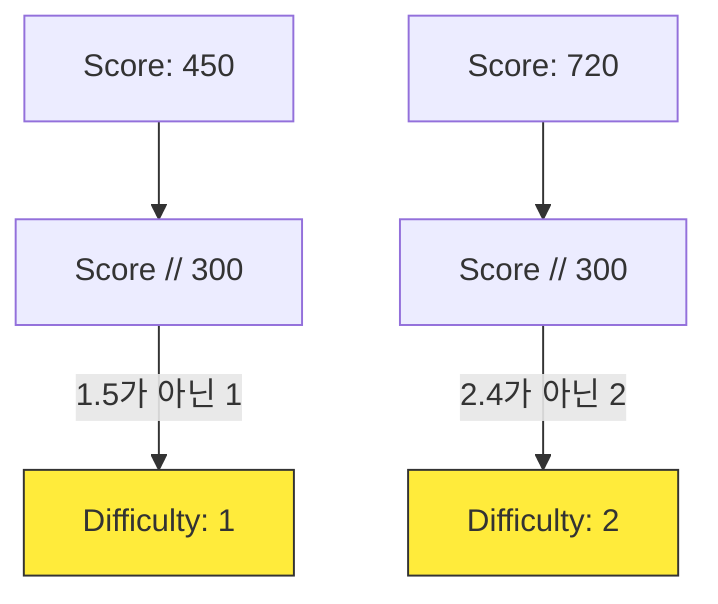

<!-- _class: slide-title -->

# 4차시. 점수와 난이도 조절

## 오래 버틸수록 더 짜릿해지는 게임!

---

<!-- _class: slide-section -->

# 4.0. 목차

- **4.1. 점수 올리기 (Score)**
  - 살아남은 시간에 따른 자동 점수 누적
- **4.2. 점수에 따른 난이도 (Difficulty)**
  - `//`(몫) 연산자를 이용한 레벨 상승
- **4.3. 매운맛 운석 (Speed)**
  - 난이도에 비례하여 빨라지는 운석 속도
- **4.4. HUD: 정보 표시 (UI)**
  - 화면 구석에 점수와 레벨 띄우기


---

<!-- _class: slide-part -->

# 4.1. 점수 올리기 (Score)

---

<!-- _class: slide-section -->

# 4.1.1. 누적 연산자의 활용

- **`+=` (더하기 대입)**: 기존 값에 새로운 값을 더해서 저장합니다. [A]
- 게임 루프는 초당 60번 실행되므로, 1초 생존 시 약 60점이 오릅니다.
- **논리:** "이 함수가 불릴 때마다 `score`를 1씩 증가시킨다!"

<div class="code-window">

```python
def update_score():
    global score
    # [A] 현재 점수에 1을 더해 누적하기
    score += 1
```

</div>

<div class="callout tip">
숫자를 매번 직접 고쳐 쓰는 게 아니라, 컴퓨터가 <b>계속해서 더해가도록</b> 시키는 것이 포인트입니다.
</div>

---

<!-- _class: slide-part -->

# 4.2. 점수에 따른 난이도 (Difficulty)

---

<!-- _class: slide-section -->

# 4.2.1. 300점마다 레벨업!

- **`//` (몫 구하기)**: 나눗셈 후 소수점을 떼고 정수 부분(몫)만 가져옵니다. [A]
- **논리:** 300점이면 Level 1, 600점이면 Level 2...
- 점수가 아무리 높아져도 계단식으로 레벨이 상승하게 됩니다.



---

<!-- _class: slide-section -->

# 4.2.2. [Mission] 점수와 난이도 조립

- `step4_student.py`의 `update_score()` 함수를 완성하세요.
- **Logic Hole:** 난이도를 올리기 위해 300으로 나눠야 할 기호는 무엇인가요?
- **힌트:** `score // ???`

<div class="code-window">

```python
def update_score():
    global score, difficulty
    # [A] 생존 점수 1점씩 누적
    score += ???

    # [B] 300점 구간마다 난이도 계산
    difficulty = score ??? 300
```

</div>

---

<!-- _class: slide-part -->

# 4.3. 매운맛 운석 (Speed)

---

<!-- _class: slide-section -->

# 4.3.1. 빨라지는 운석

- **변수 활용:** 기본 속도(7)에 현재 난이도를 더해줍니다. [A]
- 난이도가 0이면 속도는 7, 난이도가 5이면 속도는 12가 됩니다.
- **결과:** 시간이 지날수록 피하기가 점점 더 힘들어집니다!

<div class="code-window">

```python
def update_meteors():
    # [A] 기본 속도 + 난이도 레벨
    meteor_speed = 7 + difficulty

    for meteor in meteors:
        meteor.y += meteor_speed
```

</div>

<div class="callout warn">
<b>난이도 폭주 주의!</b><br/>
나누는 숫자(300)가 너무 작으면 난이도가 너무 빨리 올라서 게임이 순식간에 불가능해질 수 있습니다.
</div>

---

<!-- _class: slide-part -->

# 4.4. HUD: 정보 표시 (UI)

---

<!-- _class: slide-section -->

# 4.4.1. 점수판 만들기

- **HUD (Head-Up Display):** 게임 화면 위에 정보를 실시간으로 띄워줍니다.
- 점수(`score`)와 레벨(`difficulty`) 변수를 문장으로 만들어 화면 구석에 그립니다.
- **F-String:** 파이썬에서 변수를 문장 속에 쏙 넣는 편리한 방법입니다. [A]

<div class="code-window">

```python
# [A] f"문장 {변수}" 형식 사용
score_text = font.render(f"SCORE: {score}", True, (255,255,255))

# 왼쪽 상단 (10, 10) 좌표에 도장 찍기
screen.blit(score_text, (10, 10))
```

</div>

---

<!-- _class: slide-section -->

# 4.5. 4차시 완성 체크리스트

<div class="callout tip">

- [ ] 화면 상단에 SCORE와 LEVEL이 실시간으로 변하나요?
- [ ] 시간이 지날수록 운석이 눈에 띄게 빨라지나요?
- [ ] 게임 오버 후 'R' 키를 누르면 SCORE와 LEVEL이 0으로 돌아가나요?
- [ ] 너무 어렵거나 너무 쉽다면 300점 단위를 수정해 보세요!

</div>

### 다음 시간에는...

**5차시: 나만의 우주선 꾸미기**
사각형 대신 실제 우주선과 운석 이미지(Image)를 넣고, 배경 음악과 효과음(Sound)을 더해 게임을 완성합니다!
