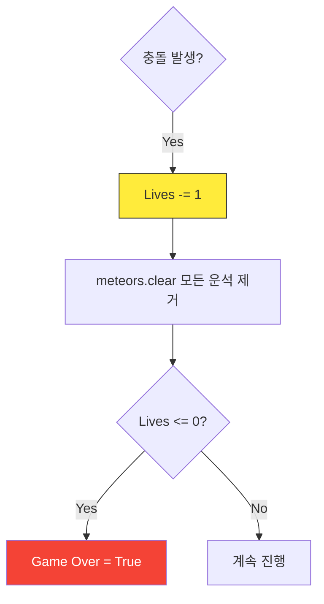

# 5차시. 나만의 우주선 확장하기
> **학습 목표:** 운석의 크기를 다양하게 만들고, 여러 번 기회를 얻을 수 있는 '목숨(Lives)' 시스템을 추가하여 게임을 최종 완성합니다.

---

## 1. 운석의 다양성 (Random Size)
모든 운석의 크기가 똑같으면 예측하기 쉽습니다. 이제 크기가 제각각인 운석을 만들어 봅시다.

### 1.1. 크기 랜덤화 로직
`random.randint(min, max)`를 사용하여 가로, 세로 길이를 매번 다르게 결정합니다.

```python
# 20~80 사이의 무작위 크기 결정
meteor_size = random.randint(20, 80)

# 결정된 크기로 사각형 만들기
new_m = pygame.Rect(random_x, y, meteor_size, meteor_size)
```

### 📝 Checkpoint 1: 범위 함수 활용
> **Q. 운석의 크기를 최소 10에서 최대 150 사이로 만들고 싶을 때, 올바른 코드는 무엇일까요?**
> 1) `random.randint(10, 150)`
> 2) `random.choice(10, 150)`
> 3) `random.range(10, 150)`
>
> **[문제 ID: mcq-05-01]**

---

### 💻 실습 미션 1: 운석 크기 가변화
`spawn_meteor()` 함수를 수정하여 운석이 무작위 크기로 나타나게 만드세요.
*   **Mission:** 작은 운석부터 대왕 운석까지 다양하게 쏟아지게 하세요.
*   **[문제 ID: code-05-01]**

---

## 2. 목숨 시스템 (Lives)
한 번 부딪히면 끝나는 냉혹한 세계에서 벗어나, 여러 번의 기회를 줍시다.

### 2.1. 생명력 감소와 안전 처리
부딪혔을 때 바로 게임 오버를 시키는 대신, 목숨을 1 깎고 주변의 위험 요소(운석)를 잠시 제거해 줍니다.



### 📝 Checkpoint 2: 로직의 이유
> **Q. 충돌 직후 `meteors.clear()`를 사용하여 리스트를 비워주는 이유는 무엇일까요?**
> 1) 점수를 초기화하기 위해서
> 2) 겹쳐있던 다른 운석에 연속으로 맞아 목숨이 한꺼번에 사라지는 것을 막으려고
> 3) 게임을 더 어렵게 만들기 위해서
>
> **[문제 ID: mcq-05-02]**

---

### 💻 실습 미션 2: 목숨 시스템 구현
`check_collision()` 함수를 업그레이드하세요.
1. 충돌 시 `lives`를 1 감소시킵니다.
2. `meteors.clear()`로 화면의 운석을 청소합니다.
3. `lives`가 0 이하가 될 때만 `game_over`를 `True`로 바꿉니다.

*   **[문제 ID: code-05-02]**

---

## 🏆 최종 릴리즈 체크리스트
- [ ] 운석의 크기가 제각각 다르게 나오나요?
- [ ] 부딪혔을 때 목숨이 깎이고 화면이 한 번 깨끗해지나요?
- [ ] 목숨 3개를 모두 잃어야만 "GAME OVER"가 뜨나요?
- [ ] 'R' 키를 눌렀을 때 목숨까지 3개로 다시 채워지나요?


### 🎉 축하합니다!
여러분은 이제 기초적인 게임 엔진의 원리를 이해하고 직접 확장 기능까지 구현해낸 멋진 파이썬 게임 개발자입니다!
