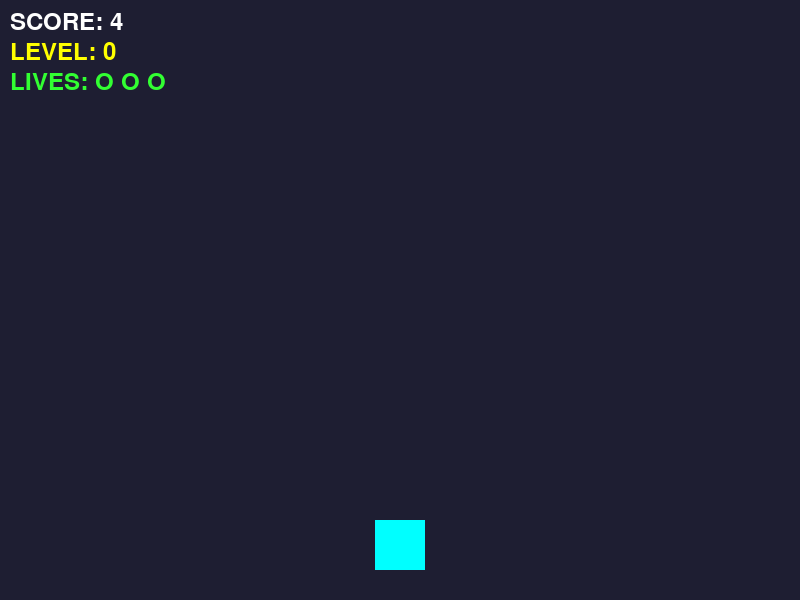
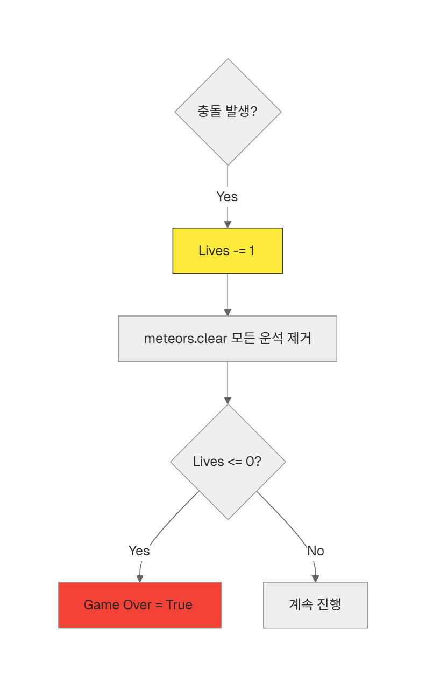

# 5차시. 나만의 우주선 확장하기

---

# 목차

- **5.1. 운석의 다양성 (Random Size)**
  - `random.randint`를 활용한 가변 크기 운석 생성
- **5.2. 목숨 시스템 (Lives)**
  - 다중 기회 부여 및 충돌 후 안전 처리 로직
- **5.3. 최종 릴리즈 체크리스트**



---

# 실습 파일 구조

<div class="code-window">

```python
import pygame
import sys
import random

# =========================================================
# 🧑‍💻 [학생 작업 구역] 1~4차시 유지 + 5차시: 선택형 확장 기능
# =========================================================

# --- 1차시: 우주선 이동 ---
def move_ship(keys):
    global ship_rect
    speed = 5
    if keys[pygame.K_LEFT]:
        ship_rect.x -= speed
    if keys[pygame.K_RIGHT]:
        ship_rect.x += speed
    if ship_rect.left < 0:
        ship_rect.left = 0
    if ship_rect.right > 800:
        ship_rect.right = 800

# --- 2차시 & [확장 1] 운석 크기 랜덤 ---
def spawn_meteor():
    global meteors
    
    # TODO: [1] 운석 크기(meteor_size)를 20~80 사이의 무작위 숫자로 결정하세요.
    pass
    
    # TODO: [2] 위에서 결정된 크기를 사용하여 새로운 운석 사각형(Rect)을 만드세요.
    # 힌트: random.randint(0, 800 - meteor_size) 로 x좌표를 결정해야 합니다.
    pass
    
    # meteors.append(new_meteor) # 리스트 추가

def update_meteors():
    global meteors
    meteor_speed = 7 + difficulty
    
    # 안전한 삭제를 위해 복사본[:]을 순회합니다.
    for meteor in meteors[:]:
        meteor.y += meteor_speed
        if meteor.top > 600:
            meteors.remove(meteor)

# --- 3차시 & [확장 2] 목숨(Lives) 시스템 ---
def check_collision():
    global game_over, lives
    for meteor in meteors:
        if ship_rect.colliderect(meteor):
            # TODO: [3] 바로 죽지 않고 목숨(lives)을 1개 줄이세요.
            pass
            
            # TODO: [4] 부딪힌 직후 화면의 모든 운석을 비워주세요. (meteors.clear)
            pass
            
            # TODO: [5] 목숨이 0 이하라면 진짜로 게임 오버(game_over = True) 처리하세요.
            pass
            break

def check_restart(keys):
    global game_over, meteors, ship_rect, score, difficulty, lives
    if keys[pygame.K_r]:
        game_over = False
        meteors.clear()
        ship_rect.x = 400 - 25
        score = 0
        difficulty = 0
        # TODO: [6] 다시 시작할 때 목숨을 3개로 복구하세요.
        pass

# --- 4차시 점수/난이도 ---
def update_score():
    global score, difficulty
    score += 1
    difficulty = score // 300


# =========================================================
# ⚙️ [게임 엔진 구역] 건드리지 마세요!
# =========================================================

pygame.init()
WIDTH, HEIGHT = 800, 600
screen = pygame.display.set_mode((WIDTH, HEIGHT))
pygame.display.set_caption("우주선 운석 피하기 - 학생 실습본 (5차시)")
clock = pygame.time.Clock()

ship_rect = pygame.Rect(WIDTH // 2 - 25, HEIGHT - 80, 50, 50)
meteors = []

# 엔진 상태 변수
game_over = False
score = 0
difficulty = 0
lives = 3 # 목숨 기본값

def draw_hud(surface):
    # 화면에 점수, 레벨, 목숨(O 표시) 출력
    pass

def main():
    # 메인 루프 (생략)
    pass
```

</div>

---

# 5.1. 운석의 다양성 (Random Size)

모든 운석의 크기가 똑같으면 예측하기 쉽습니다. 이제 크기가 제각각인 운석을 만들어 봅시다.

### 크기 랜덤화 로직

`random.randint(min, max)`를 사용하여 가로, 세로 길이를 매번 다르게 결정합니다. 결정된 크기는 우측 경계 계산 시에도 반영되어야 합니다.

---

### 📝 Checkpoint 1: 범위 함수 활용

<div class="theory-mcq-card">
  <h3>운석의 크기를 최소 10에서 최대 150 사이로 만들고 싶을 때, 올바른 코드는 무엇일까요?</h3>
  <div class="mcq-options">
    <div class="mcq-option" data-correct="true">
      <code>random.randint(10, 150)</code>
    </div>
    <div class="mcq-option" data-correct="false" data-hint="choice는 목록 중 하나를 고를 때 사용합니다.">
      <code>random.choice(10, 150)</code>
    </div>
    <div class="mcq-option" data-correct="false" data-hint="파이썬 기본 라이브러리에 random.range라는 함수는 존재하지 않습니다.">
      <code>random.range(10, 150)</code>
    </div>
  </div>
  <div class="mcq-hint"></div>
</div>

---

### 💻 실습 미션 1: 운석 크기 가변화

`spawn_meteor()` 함수를 수정하여 운석이 무작위 크기로 나타나게 만드세요. 작은 운석부터 대왕 운석까지 다양하게 쏟아지게 구현합니다.

<div class="code-window">

```python
def spawn_meteor():
    global meteors
    
    # [A] 20~80 사이의 무작위 크기 결정
    meteor_size = random.randint(20, 80)
    
    # [B] 결정된 크기에 맞춰 x좌표 범위 계산 후 사각형 생성
    random_x = random.randint(0, 800 - meteor_size)
    new_meteor = pygame.Rect(random_x, -meteor_size, meteor_size, meteor_size)
    
    meteors.append(new_meteor)
```

</div>

---

# 5.2. 목숨 시스템 (Lives)

한 번 부딪히면 끝나는 냉혹한 세계에서 벗어나, 여러 번의 기회를 줍시다.

### 생명력 감소와 안전 처리

부딪혔을 때 바로 게임 오버를 시키는 대신, 목숨을 1 깎고 주변의 위험 요소(운석)를 잠시 제거해 줍니다. 그래야 겹쳐있는 운석에 연속으로 맞는 억울한 상황을 방지할 수 있습니다.

> [!NOTE]
> **5차시의 전역 변수 변경과 `global` 선언 총정리**
> *   `spawn_meteor()`: `meteors` 리스트를 수정하기 위해 `global meteors` 선언이 쓰입니다. (리스트 내부 요소 추가)
> *   `check_collision()`: `lives` 목숨을 줄이고, 리스트를 비우며(`meteors.clear()`), 상황에 따라 `game_over = True`로 바꾸므로 `global game_over, lives` 선언이 반드시 들어갑니다.
> *   `check_restart()`: 재시작 시 게임 상태, 운석 리스트, 우주선 사각형 좌표, 점수, 난이도, 목숨까지 한꺼번에 초기화하므로 모든 전역 변수를 선언(`global game_over, meteors, ship_rect, score, difficulty, lives`)해야 정상 작동합니다.



---

### 📝 Checkpoint 2: 로직의 이유

<div class="theory-mcq-card">
  <h3>충돌 직후 <code>meteors.clear()</code>를 사용하여 리스트를 비워주는 이유는 무엇일까요?</h3>
  <div class="mcq-options">
    <div class="mcq-option" data-correct="false" data-hint="점수(score)는 Lives와 별개의 변수입니다.">
      <span>점수를 초기화하기 위해서</span>
    </div>
    <div class="mcq-option" data-correct="true">
      <span>겹쳐있던 다른 운석에 연속으로 맞아 목숨이 한꺼번에 사라지는 것을 막으려고</span>
    </div>
    <div class="mcq-option" data-correct="false" data-hint="운석이 사라지면 일시적으로 게임이 쉬워지므로 오답입니다.">
      <span>게임을 더 어렵게 만들기 위해서</span>
    </div>
  </div>
  <div class="mcq-hint"></div>
</div>

---

### 💻 실습 미션 2: 목숨 시스템 구현

`check_collision()` 함수를 업그레이드하세요. 목숨이 남아있다면 계속 도전할 수 있는 기회를 제공합니다.

<div class="code-window">

```python
def check_collision():
    global game_over, lives
    for meteor in meteors:
        if ship_rect.colliderect(meteor):
            # [A] 목숨 1 감소 및 운석 청소
            lives -= 1
            meteors.clear() 
            
            # [B] 목숨이 다했을 때만 게임 종료
            if lives <= 0:
                game_over = True
            break
```

</div>

---

# 5.3. 최종 릴리즈 체크리스트

<div class="callout tip">

- [ ] 운석의 크기가 제각각 다르게 나오나요?
- [ ] 부딪혔을 때 목숨이 깎이고 화면이 한 번 깨끗해지나요?
- [ ] 목숨 3개를 모두 잃어야만 "GAME OVER"가 뜨나요?
- [ ] 'R' 키를 눌렀을 때 목숨까지 3개로 다시 채워지나요?

</div>


### 🎉 축하합니다!
여러분은 이제 기초적인 게임 엔진의 원리를 이해하고 직접 확장 기능까지 구현해낸 멋진 파이썬 게임 개발자입니다!
