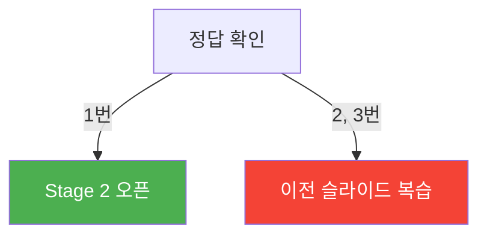

<!-- _class: slide-title -->

# 5차시. 나만의 우주선 확장하기
## 스테이지를 클리어하고 게임을 완성하라!

---

<!-- _class: slide-section -->

# 5.0. 오늘의 스테이지 지도
<div class="slide-2column ratio-64">
<div>

- **Stage 1: 운석의 다양성 (Random Size)**
  - 크기가 제각각인 운석 만들기
- **Stage 2: 목숨 시스템 (Lives)**
  - 부딪혀도 다시 기회를 얻는 법
- **Stage 3: 최종 릴리즈 (Final Reset)**
  - 모든 변수를 초기화하여 게임 완성

</div>
<div>

<div class="callout warn">
<b>스테이지 게이트 주의!</b><br/>
각 단계 끝에 있는 <b>[Gate Quiz]</b>를 통과해야만 다음 스테이지로 진입할 수 있습니다.
</div>

</div>
</div>

---

<!-- _class: slide-part -->

# Stage 1. 운석의 다양성 (Random Size)

---

<!-- _class: slide-section -->

# 5.1.1. 크기가 다른 운석들
<div class="slide-2column ratio-55">
<div>

- **`random.randint(min, max)`**: 고정된 숫자 대신 범위 안의 무작위 숫자를 생성합니다. [A]
- **변수 활용:** 생성된 `meteor_size`를 `pygame.Rect`의 너비와 높이에 똑같이 넣어줍니다. [B]
- **결과:** 작은 운석은 피하기 쉽고, 큰 운석은 피하기 어려워집니다!

</div>
<div>

<div class="code-window">

```python
def spawn_meteor():
    # [A] 20~80 사이의 무작위 크기 결정
    meteor_size = random.randint(20, 80)
    
    # [B] 결정된 크기로 사각형 만들기
    new_m = pygame.Rect(x, y, meteor_size, meteor_size)
```

</div>
</div>
</div>

---

<!-- _class: slide-section -->

# 🚩 [Gate 1] 이해 확인 퀴즈
<div class="callout ok">
<b>Q. 운석의 크기를 10에서 100 사이로 만들고 싶다면?</b>
</div>

<div class="slide-2column ratio-55">
<div>

1. `random.randint(10, 100)`
2. `random.choice([10, 100])`
3. `random.uniform(10, 100)`

<br/>

> **통과 조건:** 정답 번호를 선생님께 말씀드리고 다음 슬라이드로 이동하세요!

</div>
<div>



</div>
</div>

---

<!-- _class: slide-part -->

# Stage 2. 목숨 시스템 (Lives)

---

<!-- _class: slide-section -->

# 5.2.1. 부딪혀도 괜찮아!
<div class="slide-2column ratio-55">
<div>

- **기존:** 충돌 즉시 `game_over = True` (종료)
- **변경:** 충돌 시 `lives -= 1` (목숨 1 감소) [A]
- **예외 처리:** 부딪힌 직후 바로 또 부딪히지 않게 운석 리스트를 비워줍니다. [B]
- **종료 조건:** 목숨이 0 이하가 될 때만 게임 오버! [C]

</div>
<div>

<div class="code-window">

```python
def check_collision():
    for m in meteors:
        if ship_rect.colliderect(m):
            lives -= 1 # [A] 목숨 깎기
            meteors.clear() # [B] 운석 청소
            
            if lives <= 0: # [C] 마지막 기회
                game_over = True
            break
```

</div>
</div>
</div>

---

<!-- _class: slide-section -->

# 🚩 [Gate 2] 로직 분석 퀴즈
<div class="callout ok">
<b>Q. 충돌 시 `meteors.clear()`를 하는 이유는 무엇일까요?</b>
</div>

<div class="slide-2column ratio-55">
<div>

1. 점수를 더 많이 얻기 위해서
2. 겹쳐있는 운석에 연속으로 맞아 목숨이 순식간에 사라지는 것을 막으려고
3. 운석의 색깔을 바꾸기 위해서

<br/>

> **통과 조건:** "왜 이 코드가 필요한가?"를 친구에게 설명하고 다음 장으로 가세요!

</div>
<div>

<div class="callout tip">
<b>Hint</b><br/>
우주선이 잠시 '무적'이 되는 시간이 없기 때문에, 주변의 위험 요소를 강제로 제거해주는 것입니다.
</div>

</div>
</div>

---

<!-- _class: slide-part -->

# Stage 3. 최종 릴리즈 (Final Reset)

---

<!-- _class: slide-section -->

# 5.3.1. 완벽한 게임 리셋
<div class="slide-2column ratio-55">
<div>

- 게임을 다시 시작할 때는 **모든 것**이 처음 상태로 돌아가야 합니다.
- **초기화 목록:**
  1. `game_over` = False
  2. `meteors` 리스트 비우기
  3. `score` & `difficulty` = 0
  4. `lives` = 3 (다시 채우기!) [A]

</div>
<div>

<div class="code-window">

```python
def check_restart(keys):
    if keys[pygame.K_r]:
        game_over = False
        meteors.clear()
        score = 0
        difficulty = 0
        lives = 3 # [A] 목숨 충전!
```

</div>
</div>
</div>

---

<!-- _class: slide-section -->

# 🏆 [Final Mission] 나만의 게임 완성
<div class="callout tip">

- [ ] Stage 1~3의 모든 TODO를 해결했나요?
- [ ] 나만의 운석 크기 범위를 정했나요? (예: 50~150 대왕 운석)
- [ ] 목숨이 0이 될 때까지 게임이 멈추지 않고 이어지나요?
- [ ] 'R' 키를 눌렀을 때 모든 점수와 목숨이 정상적으로 돌아오나요?

</div>

<div class="slide-2column ratio-64">
<div>

### 축하합니다!
**우주선 운석 피하기 게임 완성!**
이제 여러분은 파이썬과 Pygame을 활용해 기초적인 게임 엔진의 원리를 이해하고 직접 구현해낸 게임 제작자입니다.

</div>
<div>

<!-- 게임 완성 축하 이미지 -->


</div>
</div>
