# 2차시. 디자인 기초 다지기 - 텍스트와 요소

## 디자인의 재료 다루기: 텍스트

텍스트는 디자인의 구조와 메시지를 결정하는 핵심 요소입니다. 텍스트 메뉴와 글꼴 패널을 활용해 글꼴 선택, 간격 조절, 스타일링까지 텍스트 편집의 기본기를 익힙니다.

이미지와 요소가 디자인의 분위기를 만든다면, 텍스트는 메시지 그 자체를 전달하는 재료입니다. 같은 문장을 쓰더라도, 글꼴 · 크기 · 정렬 · 간격을 어떻게 조합하느냐에 따라 전혀 다른 인상을 주게 됩니다. 또한 텍스트는 전체 디자인의 내용 흐름을 잡아 주는 뼈대와 같은 역할을 하므로, 이미지보다 텍스트를 배치하는 것이 바람직한 순서입니다.

텍스트는 디자인의 문장과 글자 스타일을 담당하며 제목, 설명, 캡션, 버튼 문구까지 모두 해당됩니다. 텍스트의 분위기를 전달해 주는 폰트를 선택할 때에도 너무 많은 종류의 폰트를 사용하면 디자인이 산만해지므로, 필요한 만큼만 사용해 조화롭게 디자인하는 것이 중요합니다.

이번 레슨에서는 캔바에서 텍스트를 다룰 때 거치게 되는 흐름, 즉 텍스트를 추가하고(사이드 패널/빠른 작업) ➔ 스타일을 정하고(에디터 툴 바 · 편집 패널) ➔ 레이아웃을 정리하는(플로팅 툴 바, 에디터 툴 바의 정렬 기능) 과정을 따라가며 살펴봅니다.

### 텍스트 추가하기: 사이드 패널과 빠른 작업

**텍스트 메뉴 둘러보기**
우선 사이드 패널의 텍스트 메뉴부터 살펴볼게요. 텍스트 작업의 출발점이 되는 곳으로, 미리 구성된 다양한 텍스트 스타일을 제공하여 디자인의 기본 구조를 잡는 데 유용합니다. 텍스트 메뉴는 프레젠테이션과 같이 처음부터 텍스트의 위계와 구조를 잡아야 하는 디자인 작업에 특히 유리합니다.

| 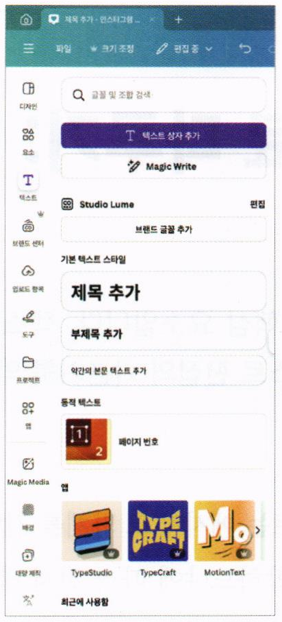 | 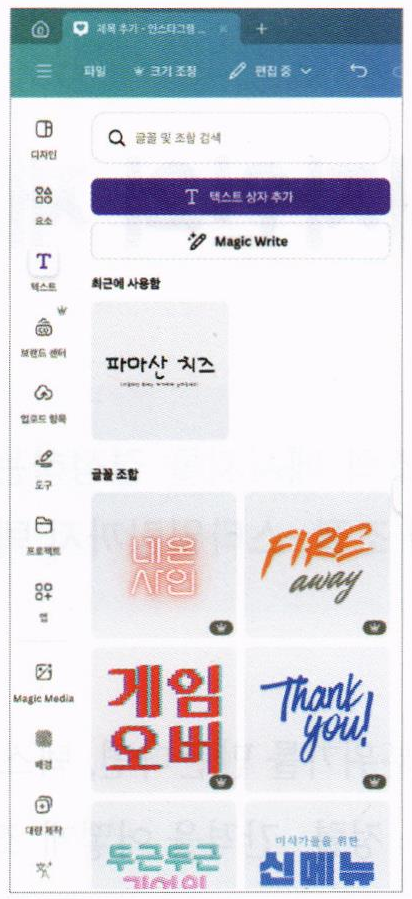 |
| :-------------------------------------------------: | :-------------------------------------------------: |

텍스트 메뉴에서 할 수 있는 주요 기능은 다음과 같습니다.

- **글꼴 조합 및 검색**: 텍스트 패널 상단에 있는 검색창을 통해 원하는 글꼴의 이름이나 특정 스타일(예: 손글씨, 고딕 등)을 검색하여 빠르게 찾을 수 있는 기능입니다.
- **텍스트 상자 추가**: 스타일이 반영되지 않은 기본 텍스트입니다.
- **Magic Write**: 캔바의 AI 기반 글쓰기 도구입니다. 간단한 키워드나 문장을 입력하면 AI가 내용을 이어 쓰거나, 요약하고, 새로운 아이디어를 제안해 줍니다.
- **브랜드 글꼴 추가**: 브랜드 키트에 미리 정해 둔 제목, 부제, 본문 구조를 클릭으로 바로 페이지에 추가해 디자인의 일관성을 유지할 수 있습니다.
- **기본 텍스트 스타일**: 다음의 세 가지 기본 구조의 스타일 중에 원하는 형식을 선택하여 페이지에 추가할 수 있습니다.
- **제목 추가**: 가장 큰 크기로, 눈에 확 들어오는 한 줄 텍스트입니다.
- **부제목 추가**: 제목을 보완하는 짧은 설명에 적합합니다.
- **약간의 본문 텍스트 추가**: 상세 설명이나 문장 중심의 텍스트에 사용합니다.

- **동적 텍스트**: 콘텐츠에 맞춰 자동으로 생성되는 텍스트를 넣는 기능입니다. 대표적으로 현재 디자인의 각 페이지에 번호를 자동으로 매겨 주는 페이지 번호 기능이 있습니다. 페이지 순서가 바뀌거나 페이지가 추가/삭제되면 번호도 자동으로 업데이트되어 편리합니다.
- **앱**: 텍스트와 관련된 다양한 캔바 내부 기능이나 외부 서비스를 사용할 수 있는 메뉴입니다. 무료 앱과 유료 앱이 있으며 기본 텍스트 도구 외에 추가적인 기능이 필요할 때 활용하면 디자인의 표현력을 크게 확장할 수 있습니다.

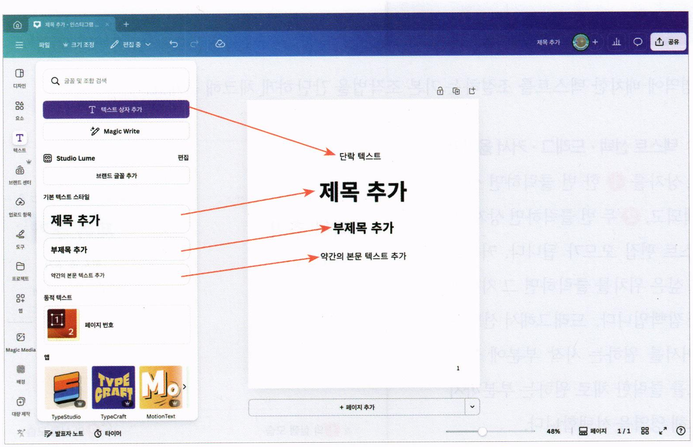

- **최근에 사용함**: 사용자가 최근에 선택했던 폰트나 텍스트 스타일이 기록되어 있어 이전에 썼던 스타일을 다시 찾을 필요 없이 바로 꺼내 쓸 수 있습니다.
- **글꼴 조합**: 미리 짝지어 놓은 ‘제목+본문’ 등의 폰트 세트입니다. 어떤 폰트끼리 어울릴지 고민할 필요 없이, 클릭 한 번으로 감각적인 타이포그래피를 적용할 수 있습니다.

**텍스트 넣기: 어떤 텍스트 구조로 시작할까?**
텍스트 작업의 출발점은 두 가지입니다. 하나는 기본 텍스트 스타일을 활용하는 것이고, 다른 하나는 [텍스트 상자 추가]를 활용하는 것입니다. 구조부터 잡을 것인지 아니면 바로 써 내려갈 것인지에 따라 선택하면 됩니다.
소셜 미디어 디자인처럼 짧은 카피 위주인 경우라면, 바로 텍스트 상자를 추가해 디자인을 시작해도 됩니다. 하지만, 프레젠테이션 디자인처럼 처음부터 기본 구조가 필요한 경우라면, 각 내용에 맞는 크기의 텍스트 스타일(제목 · 부제 · 본문)을 불러와 배치하는 편이 더 유리합니다.

**사이드 패널에서 텍스트 스타일 고르기**
에디터 - 사이드 패널 - [텍스트] 메뉴를 열면, 미리 구성된 텍스트 스타일들을 볼 수 있습니다. [텍스트 상자 추가] 또는 [기본 텍스트 스타일] 중에 원하는 스타일을 클릭해 페이지에 추가하면, 크기와 두께, 기본 정렬이 이미 세팅된 상태에서 작업을 시작할 수 있습니다. 특히 시리즈로 만드는 카드뉴스나 피드라면, [브랜드 글꼴 추가]를 클릭해 제목/부제/본문 구조를 한 번 정해 두고 계속 재사용하는 것이 디자인 일관성을 지키는 데 큰 도움이 됩니다.

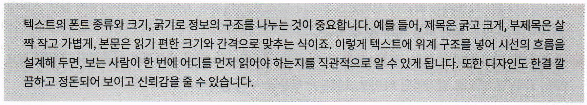

> **참고**
> 텍스트의 폰트 종류와 크기, 굵기로 정보의 구조를 나누는 것이 중요합니다. 예를 들어, 제목은 굵고 크게, 부제목은 살짝 작고 가볍게, 본문은 읽기 편한 크기와 간격으로 맞추는 식이죠. 이렇게 텍스트에 위계 구조를 넣어 시선의 흐름을 설계해 두면, 보는 사람이 한 번에 어디를 먼저 읽어야 하는지를 직관적으로 알 수 있게 됩니다. 또한 디자인도 한결 깔끔하고 정돈되어 보이고 신뢰감을 줄 수 있습니다.

**빠른 작업이나 단축키로 텍스트 상자 추가하기**
텍스트 상자를 더 빠르게 추가할 수 있는 방법도 있습니다. 페이지를 선택한 상태에서 `/` 키를 누르면, 나타나는 빠른 작업 추천 동작 목록에서 텍스트를 선택하면 됩니다. 또한 페이지를 선택한 상태에서 `T`를 누르면 바로 텍스트 상자가 생깁니다. 이 방법을 사용하면, 굳이 사이드 패널로 마우스를 옮기지 않고도 현재 위치에 바로 텍스트 상자를 추가할 수 있어, 작업 리듬이 끊기지 않습니다. 특히 글을 많이 다루는 디자인에서 키보드 위주로 작업할 때 유용합니다.

### 텍스트 기본 조작법 익히기

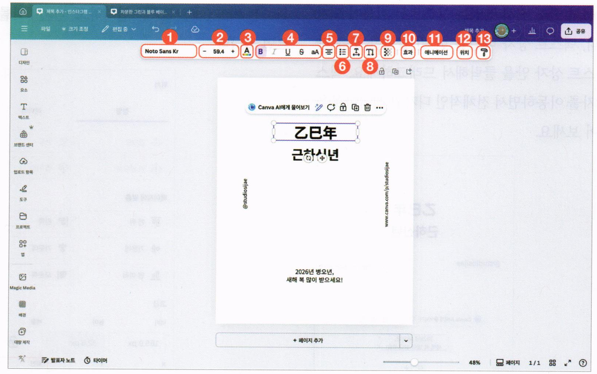

작업 영역에 배치한 텍스트를 조절하는 기본 조작법을 간단하게 체크해 볼게요.

**1. 텍스트 선택 · 드래그 · 커서 옮기기**
텍스트 상자를 한 번 클릭하면 상자가 선택되고, 두 번 클릭하면 상자 안의 텍스트 편집 모드가 됩니다. 커서를 옮기고 싶은 위치를 클릭하면 그 지점에 커서가 깜빡입니다. 드래그해서 선택하려면 커서를 원하는 시작 부분에 놓고 마우스를 클릭한 채로 원하는 부분까지 드래그해 영역을 선택합니다.

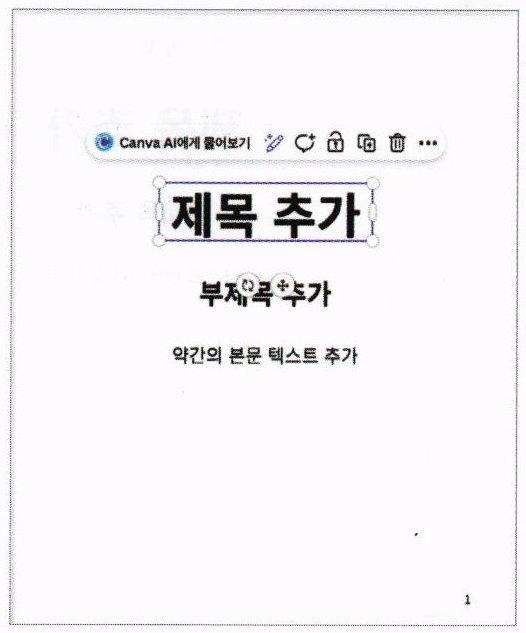

**2. 텍스트 내용 수정하기**
수정할 텍스트 상자를 더블 클릭합니다. 기존에 입력된 내용은 Backspace/Delete 키로 지우고, 새 텍스트를 입력합니다.

**3. 텍스트 상자 크기 조절하기**
네 모서리와 변에 조절 핸들이 나타납니다. [모서리] 핸들을 드래그하면 텍스트 상자의 크기 및 텍스트 크기를 조절할 수 있습니다.

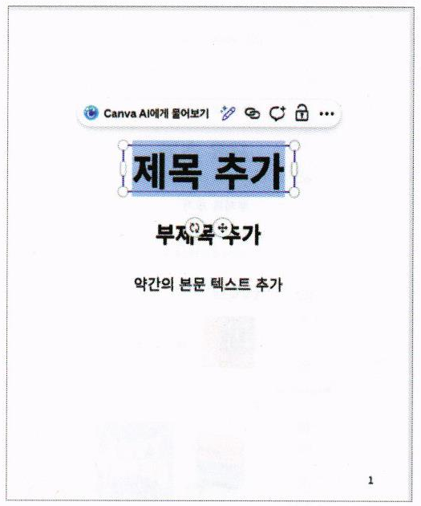

**4. 텍스트 상자 이동하기**
텍스트 상자 안(조절 핸들이 아닌 부분)을 클릭한 채로 원하는 위치로 드래그하면 텍스트 상자가 이동합니다. 이때, 텍스트 상자 안에 커서가 있는 상태로는 이동이 되지 않으니, 텍스트 상자 바깥을 한 번 클릭한 후에 다시 텍스트 상자 안을 클릭해서 드래그하세요. 텍스트 상자를 이동하면서 전체적인 디자인 레이아웃을 만들어 보세요.

**5. 텍스트 상자 회전하기**
[회전] 핸들을 드래그해 회전하거나, 더 정확한 각도로 회전하기 원한다면 에디터 툴 바 - [위치] - 고급 - 회전에 원하는 각도(예: -90)를 입력하고 Enter 키를 누르면 됩니다.

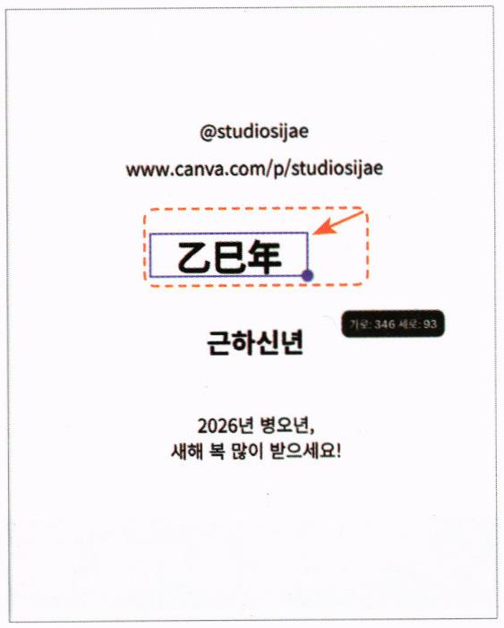

**6. 텍스트 상자 편집 끝내기**
편집을 마쳤다면, 작업 영역의 빈 공간을 한 번 클릭하면 편집 모드가 해제됩니다. 다른 요소를 바로 선택해서 계속 작업할 수 있어요.

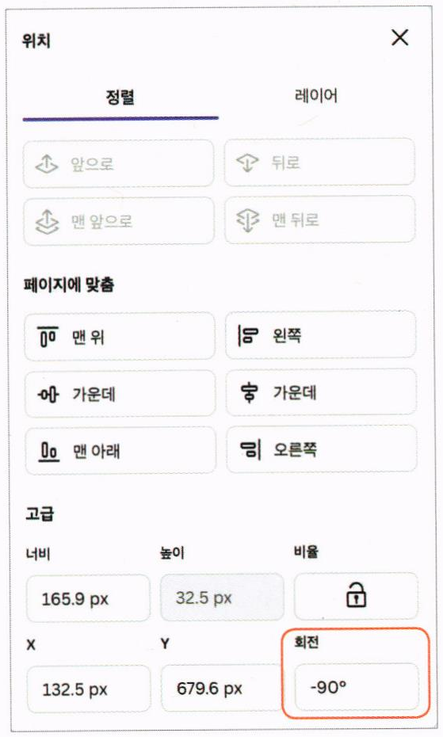

### 텍스트 스타일 잡기: 에디터 툴 바와 편집 패널

**에디터 툴 바 둘러보기**
텍스트 상자를 선택하면, 작업 영역 상단에 텍스트를 위한 메뉴 구성의 에디터 툴 바가 나타납니다. 각 메뉴를 선택해 텍스트에 대한 세부 설정을 할 수 있어요.

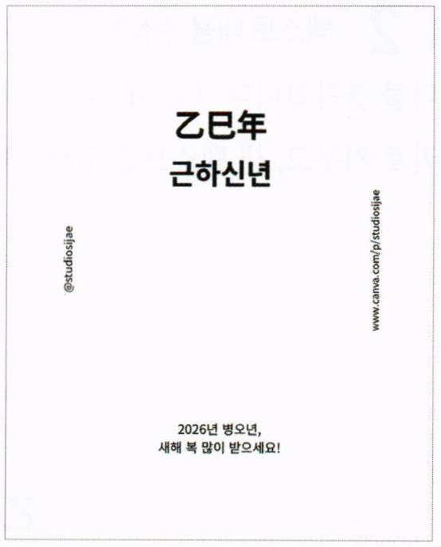

여기서 조정할 수 있는 대표적인 항목은 다음과 같습니다.

- **글꼴**: 현재 선택한 텍스트 박스에 사용할 폰트(서체)를 고르는 메뉴예요. 목록에서 폰트를 바꾸면, 선택된 텍스트 전체가 그 폰트 스타일로 바뀝니다.
- **글꼴 크기**: 텍스트의 사이즈(크기)를 조절하는 메뉴예요. 숫자를 직접 입력하거나, 드롭다운에서 크기를 선택해서 제목은 크게, 본문은 작게 등 위계를 줄 수 있어요.
- **텍스트 색상**: 텍스트의 색을 바꾸는 기능입니다. 브랜드 컬러, 최근 사용 색, 기본 색, 그리고 그라데이션까지 골라서 강조하고 싶은 텍스트를 더 눈에 띄게 만들 수 있어요.
- **굵게/기울임꼴/밑줄/취소선/대문자**: 모두 강조용 서식이에요. 키워드, 중요한 문장, 수정되었음을 보여 줘야 하는 문장 등에 적용해서 정보의 중요도와 의미를 쉽게 나타낼 수 있어요.
- **정렬**: 왼쪽 · 가운데 · 오른쪽 · 양쪽 정렬 버튼으로 텍스트가 텍스트 박스 안에서 어떤 방향으로 정렬될지를 정하는 메뉴예요.
- **목록**: 글을 리스트 형태(불릿, 번호)로 설정하는 메뉴입니다. 정보나 단계, 특징 등을 한눈에 보기 좋게 정리할 때 사용해요.
- **고급 설정**: 메뉴를 클릭하면 나타나는 옵션 창에서 행간(줄 간격)과 자간(글자 간격)을 조절할 수 있습니다. 텍스트가 답답해 보일 때는 간격을 넓히고, 한 줄에 내용을 많이 담고 싶을 땐 줄이거나 해서 가독성과 분위기를 동시에 조정할 수 있어요.
- **세로 텍스트**: 텍스트를 가로가 아닌 세로 방향으로 배치해 주는 기능입니다. 특히 한국어나 일본어처럼 세로 레이아웃이 어울리는 디자인에 활용하면 좋아요.
- **투명도**: 텍스트에 투명도를 주는 메뉴예요. 슬라이더를 움직여 값을 낮출수록 배경이 더 많이 비쳐 보이기 때문에, 부드러운 워터마크 느낌이나 배경과 자연스럽게 어우러지는 텍스트를 만들 때 활용할 수 있어요.
- **효과**: 텍스트에 그림자, 네온, 배경, 아웃라인 등 비주얼 효과를 넣는 메뉴입니다. 스타일 슬라이더로 강도, 색상, 방향, 투명도 등을 조절해서 텍스트를 더 입체적이거나 화려하게 만들 수 있어요.
- **애니메이션**: 텍스트에 움직임(애니메이션)을 넣어 주는 메뉴입니다. 텍스트가 슬라이드 인, 페이드 인, 타이핑 효과 등으로 등장하게 만들 수 있어요.
- **위치**: 작업 영역 안에서 텍스트 박스의 위치를 정렬하고 레이어 순서를 조정하는 메뉴예요.
- **스타일 복사**: 복사하고 싶은 스타일의 텍스트 상자를 선택한 후, 스타일 복사 메뉴를 클릭하고 다른 텍스트에 클릭하면 똑같이 적용할 수 있어요.

**편집 패널 둘러보기**
텍스트 에디터 툴 바의 일부 메뉴를 선택하면 작업 영역 왼쪽에 편집 패널이 열립니다. 이 패널에서는 글자의 모양, 색, 효과 등을 보다 세밀하게 조정해 텍스트의 스타일을 자유롭게 연출할 수 있습니다.

**1. 글꼴 패널**
에디터 툴 바에서 [글꼴]을 선택하면 열리는 패널로, 목록에서 원하는 폰트를 선택해 폰트를 바꿀 수 있습니다.

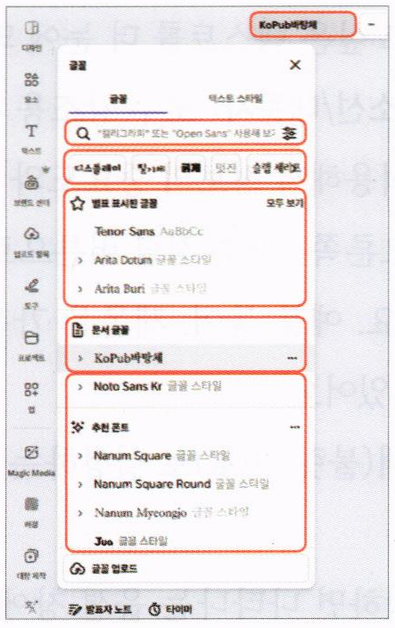
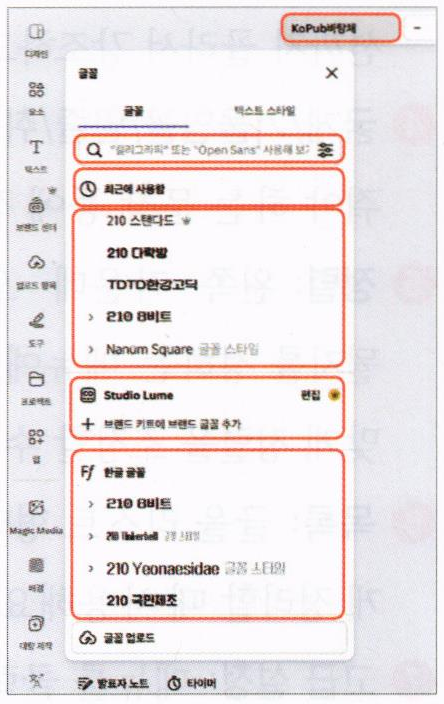

- **글꼴 검색 바 및 필터**: 폰트를 이름이나 스타일 키워드로 검색할 수 있고, 언어/가격 등으로 검색 결과를 선택해서 볼 수 있습니다.
- **빠른 추천**: 스타일 별로 폰트를 정리해 둔 영역으로 원하는 키워드를 클릭하면 선택한 스타일의 폰트 목록을 볼 수 있습니다.
- **별표 표시된 글꼴**: 별표로 즐겨찾기 해둔 폰트들이 모여 있는 영역입니다.

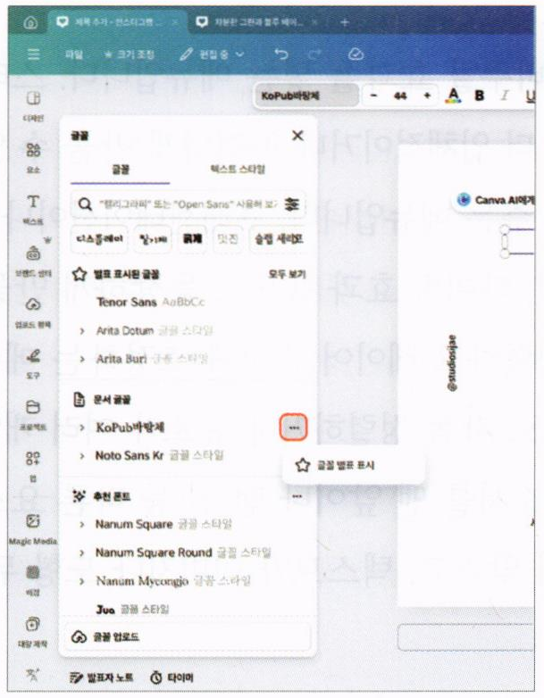
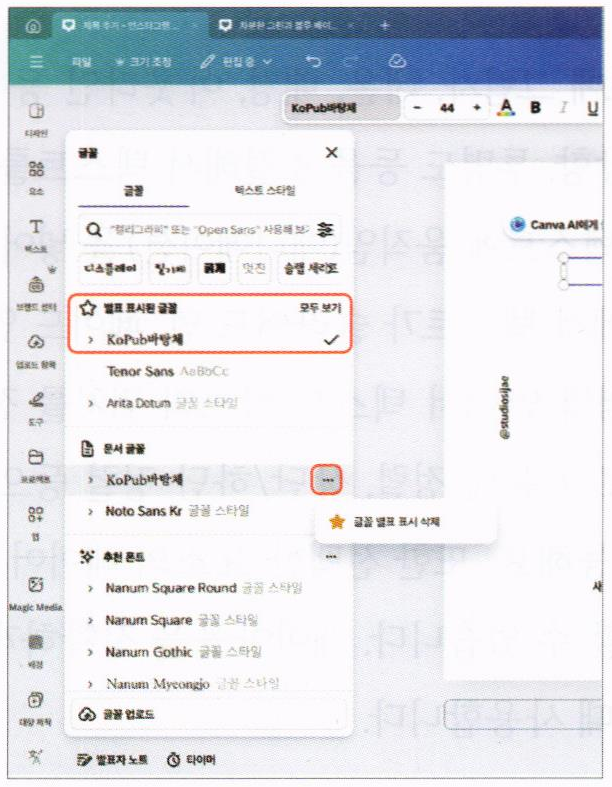

- **문서 글꼴**: 현재 페이지에 사용된 폰트 목록이 표시되는 영역입니다.
- **추천 폰트**: 디자인에 어울리는 폰트를 자동 추천해 주는 영역입니다.
- **최근에 사용함**: 최근에 사용한 폰트들이 표시되는 영역입니다.
- **브랜드 글꼴**: 등록된 브랜드 키트가 있다면 이 영역에 표시됩니다.
- **폰트 목록**: 사용자가 기본 설정해 둔 언어의 폰트가 우선적으로 표시되고 아래로 스크롤하면 영문 폰트가 나타납니다.
- **글꼴 업로드**: 가지고 있는 폰트 파일(OTF, TTF, WOFF)을 캔바에 업로드해서 사용할 수 있는 기능입니다.

> **참고: 텍스트가 안 보일 때 폰트 호환성과 언어 설정**
> 텍스트가 제대로 표시되지 않고 박스로 보이는 경우, 지원하지 않는 폰트일 가능성이 큽니다.
>
> 1. 에디터 툴 바 - 글꼴 - 글꼴 패널 - 문서 글꼴 목록에서 한국어를 지원하지 않는 폰트가 있는지 확인합니다.
> 2. 폰트 검색 바의 오른쪽 필터에서 언어 - 글꼴 언어 선택에서 한국어를 선택해 폰트를 다시 설정합니다.

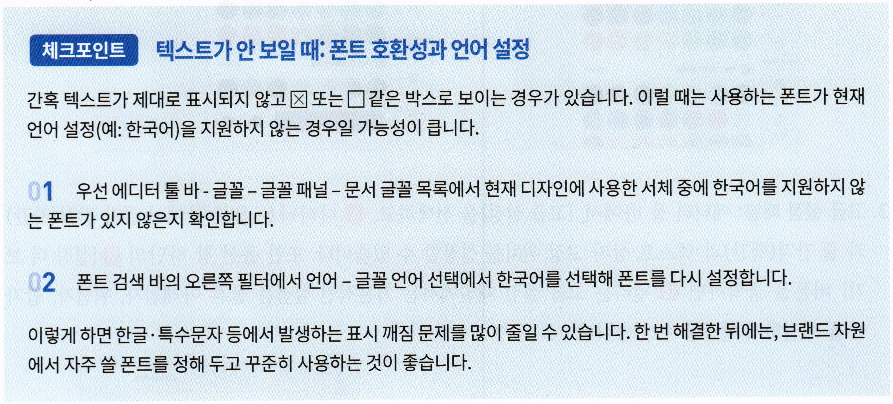

**2. 텍스트 색상 패널**
에디터 툴 바에서 [텍스트]를 선택하면 열리는 패널로 폰트의 색상을 변경하고, 단색뿐 아니라 그라데이션 등 다양한 색 조합을 적용할 수 있습니다. 패널에 표시된 색상 중에 마음에 드는 색상을 클릭하거나, 새로운 색상 추가([+] 아이콘)를 클릭해 스포이드로 원하는 색상을 추출할 수도 있습니다.

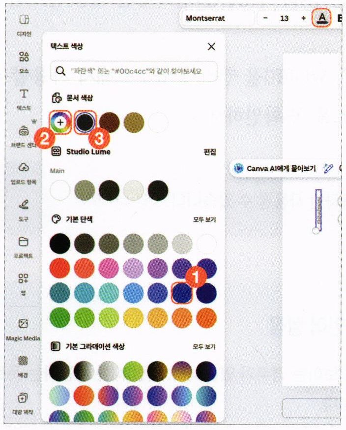

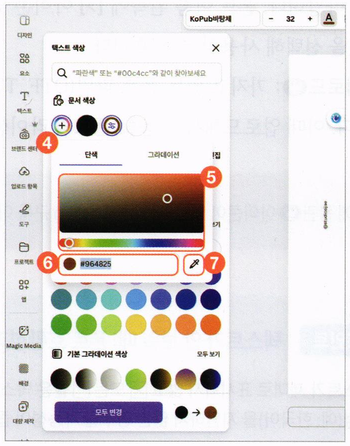

**3. 고급 설정 패널**
에디터 툴 바에서 [고급 설정]을 선택하고, 나타나는 옵션 창에서 글자 간격(자간)과 줄 간격(행간)과 텍스트 상자 고정 위치를 설정할 수 있습니다.

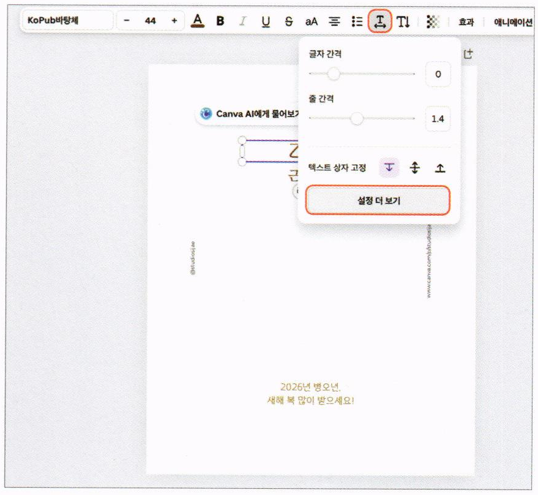

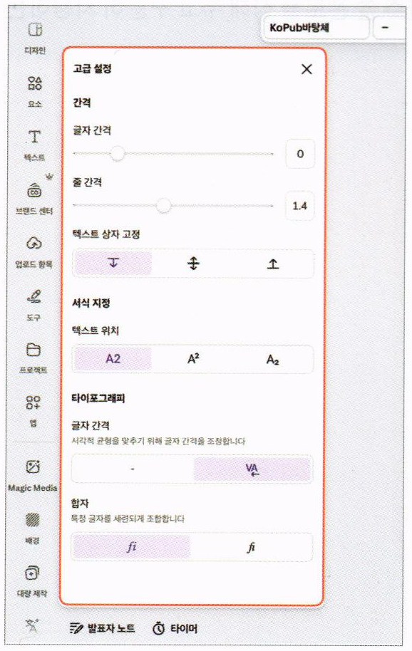

**4. 효과 패널**
에디터 툴 바에서 [효과]를 선택하면 열리는 패널로 그림자, 네온, 배경, 테두리 등 텍스트에 다양한 시각 효과를 적용해 강조할 수 있습니다.

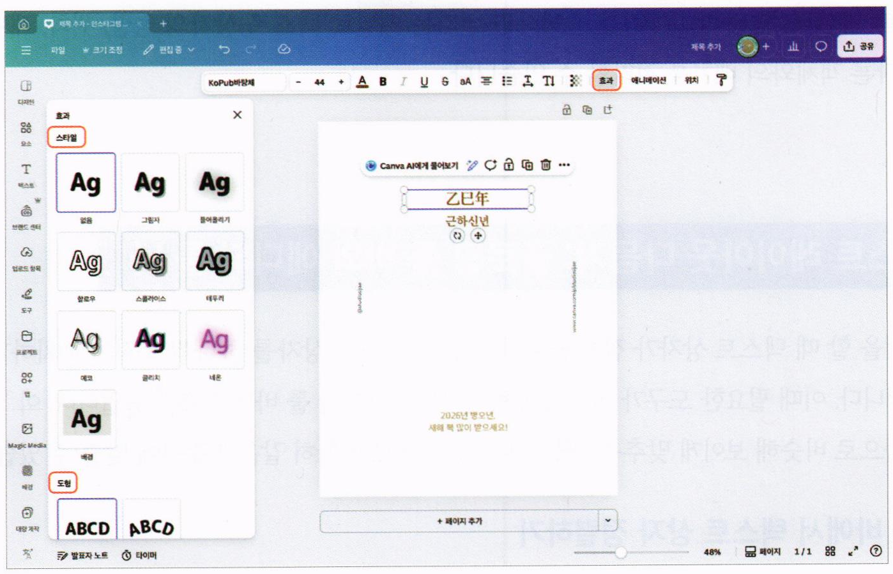

> **테두리 효과로 폰트 굵기 조절하기**
> 원하는 굵기 옵션이 없는 폰트의 경우, 디자인에 사용하는 데 제한적이어서 아쉽지요. 이럴 때는 효과 패널에서 테두리 기능을 활용해 보세요. [두께] 슬라이드를 좌우로 움직이거나 설정 칸에 수치를 입력해 폰트에 테두리가 생기면서 글자가 더 굵어지는 효과를 줄 수 있습니다.

**5. 애니메이션 패널 / 6. 위치 패널**
에디터 툴 바에서 [애니메이션] 또는 [위치]를 선택하면 열리는 패널입니다. 텍스트가 등장할 때의 움직임을 설정하거나, 텍스트 상자의 정렬, 위치, 레이어 순서를 조정할 수 있습니다.

### 텍스트 레이아웃 다듬기: 플로팅 툴 바와 에디터 툴 바

**플로팅 툴 바에서 텍스트 상자 정렬하기**
두 개 이상 텍스트 상자를 선택하고, 플로팅 툴 바 - [...] (더보기) - [요소 정렬]을 클릭하면 선택한 텍스트 상자들을 한 번에 원하는 옵션으로 정렬할 수 있습니다.

**플로팅 툴 바에서 텍스트 상자 간격 맞추기**
세 개 이상의 텍스트 상자를 선택한 다음, 플로팅 툴 바 - [...] (더보기) - [고르게 띄우기]에서 원하는 옵션(예: 수직으로)을 선택합니다. 선택된 텍스트 상자들이 자동으로 일정한 간격으로 배치됩니다.

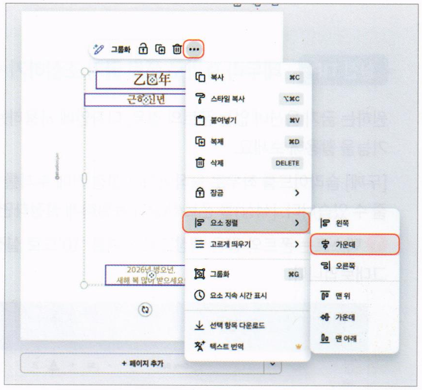

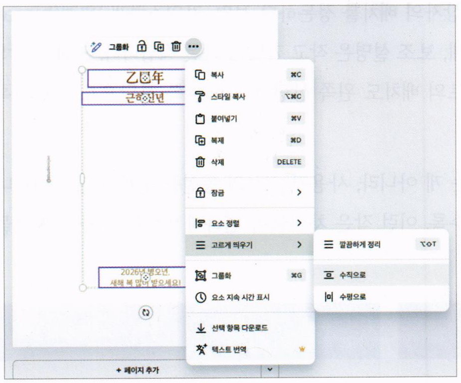

**에디터 툴 바에서 텍스트 상자 정렬, 간격 맞추기**
여러 개의 텍스트 상자를 선택한 다음, 에디터 툴 바 - 위치를 클릭해 [위치] 패널을 엽니다. [요소 정렬]과 [고르게 띄우기]에서 원하는 옵션(예: 왼쪽, 수직으로)을 선택합니다.

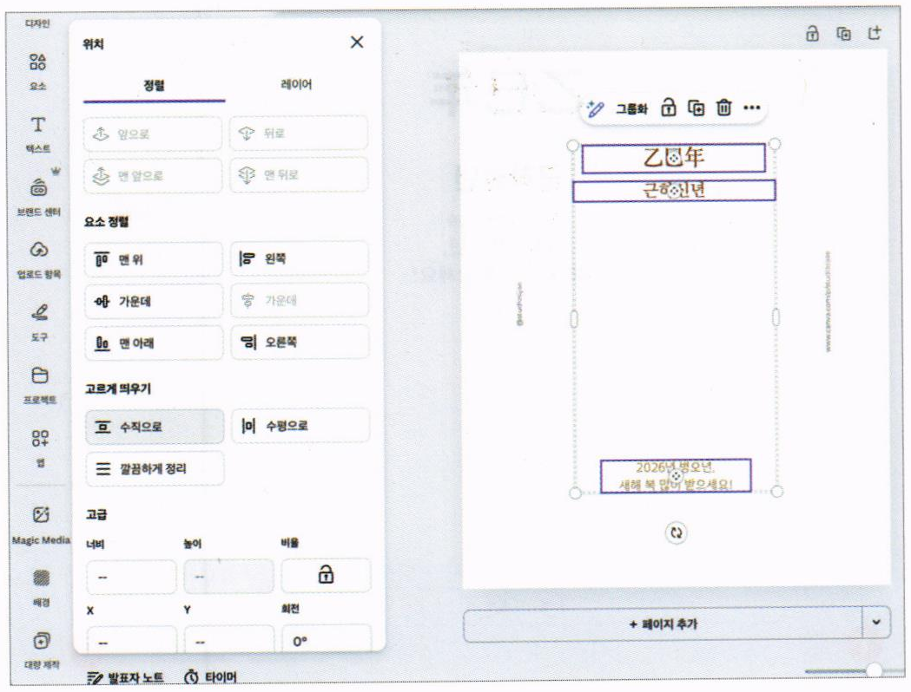

### 텍스트 작업의 중요 포인트는 위계 만들기

텍스트 편집 작업 초기의 모습과 레이아웃 정리까지 마친 결과 모습을 비교해 볼게요. 텍스트 구성만으로도 전체적인 메시지와 디자인의 흐름이 한눈에 들어오죠? 정보의 중요도에 따라 텍스트의 크기 · 굵기 · 색상 · 간격을 조정하고 배치를 정돈하다 보면, 자연스럽게 ‘위계(hierarchy)’가 만들어집니다.

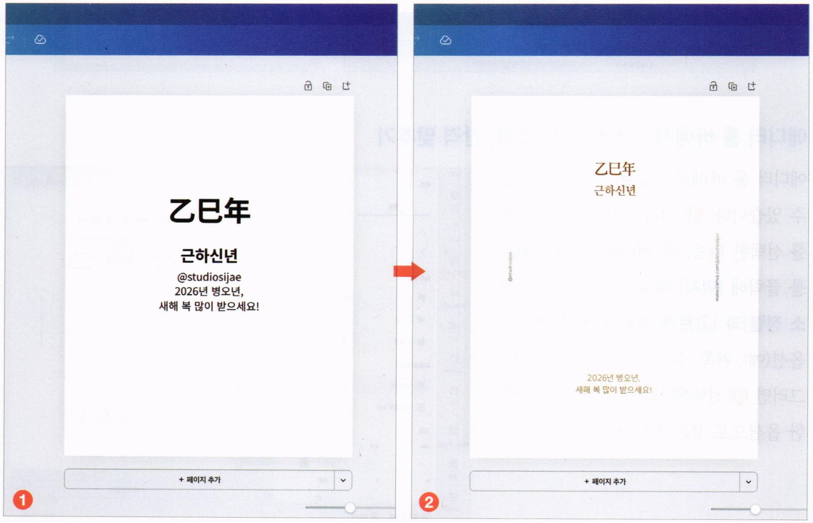

이번 레슨에서 다룬 텍스트 편집 작업의 흐름을 다시 한 번 정리하면 다음과 같습니다.

1. 사이드 패널의 [텍스트] 메뉴 또는 빠른 작업, 또는 단축키 T로 텍스트 상자를 추가합니다.
2. 에디터 툴 바와 편집 패널에서 글꼴, 크기, 굵기, 색상을 조정해 텍스트의 위계와 톤을 잡습니다.
3. 정렬 및 위치 기능으로 텍스트 상자들을 정리해 정돈된 레이아웃을 만듭니다.

---

## 디자인의 재료 둘러보기: 요소

사진·그래픽·도형 같은 요소는 디자인의 분위기를 만들고 스토리를 시각적으로 전달합니다. 요소 검색부터 배치까지 기본기를 익히고, 색감과 밝기 보정 등 편집 패널을 활용해 디자인의 완성도를 높이는 방법을 배워 봅니다.

### 요소 추가하기: 사이드 패널의 요소 메뉴

요소 작업의 출발점은 에디터 사이드 패널의 요소 메뉴입니다. 검색 바가 있어서 키워드를 입력해 원하는 스타일의 아이콘이나 일러스트를 바로 찾을 수 있습니다.

**요소 메뉴 둘러보기**
에디터 사이드 패널에서 [요소] 메뉴를 클릭해 패널을 열어 활용합니다. 모든 요소는 드래그 앤 드롭으로 간단하게 작업 영역 페이지에 추가할 수 있습니다.

- **검색 바**: 원하는 요소를 직접 키워드로 찾아 다양한 검색 결과 중에 선택할 수 있습니다.
- **필터**: 검색 결과들을 카테고리별로 선택해서 볼 수 있고, 색상, 비율, 유무료 등의 필터로 정확하게 걸러 낼 수 있습니다.
- **이미지 및 코드 생성**: 자연어 프롬프트를 입력하면 Canva AI가 이미지나 코드를 생성해 줍니다.
- **최근에 사용함**: 최근에 사용한 요소들이 표시되는 영역입니다.
- **카테고리 둘러보기**: 도형, 그래픽, 3D, 동영상 등 캔바가 제공하는 다양한 요소 카테고리가 표시됩니다.
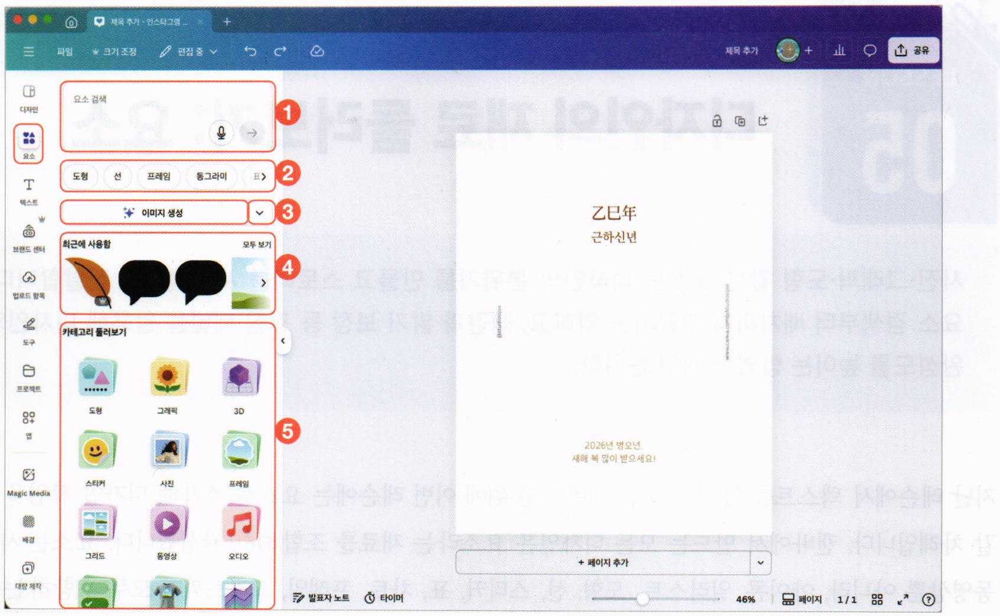

**요소의 종류 알아보기**

| 카테고리   | 설명                                                                                                                    |
| ---------- | ----------------------------------------------------------------------------------------------------------------------- |
| **도형**   | 사각형, 원, 삼각형 같은 기본 도형과 선 요소입니다. 배경 박스, 버튼, 강조 박스 등 레이아웃을 잡을 때 가장 많이 쓰입니다. |
| **그래픽** | 일러스트, 아이콘, 장식 같은 각종 그래픽 요소들이 모여 있습니다.                                                         |
| **3D**     | 입체감을 주는 3D 오브젝트 요소들이 있는 영역이에요.                                                                     |
| **스티커** | 움직이는 GIF 스타일이나 귀여운 그림 느낌의 장식용 요소들입니다.                                                         |
| **사진**   | 다양한 스톡 사진들이 모여 있는 카테고리입니다.                                                                          |
| **프레임** | 액자 같이 안이 비어 있는 틀에 사진이나 동영상을 쏙 끼워 사용할 수 있는 요소입니다.                                      |
| **그리드** | 열/행 구조로 나뉘어 있는 레이아웃 틀이에요. 여러 이미지를 깔끔하게 정렬하고 싶을 때 사용합니다.                         |
| **동영상** | 스톡 영상 클립들을 모아 둔 카테고리입니다.                                                                              |
| **오디오** | 배경 음악, 효과음 등 소리 요소들을 모아 둔 카테고리입니다.                                                              |
| **양식**   | 입력 필드, 버튼, 체크박스 등 폼 형태의 요소들이 모여 있는 카테고리입니다.                                               |
| **목업**   | 기기(핸드폰, 노트북 등), 책, 포스터 등에 디자인을 합성해 보여 줄 수 있는 목업용 요소들입니다.                           |
| **차트**   | 막대 그래프, 원 그래프 등 데이터를 시각화해 주는 요소들의 카테고리예요.                                                 |
| **시트**   | 스프레드 시트처럼 셀로 구성된 시트 형태의 디자인들을 모아 둔 카테고리예요.                                              |
| **표**     | 줄과 칸이 있는 기본적인 표 요소들이 모여 있는 카테고리입니다.                                                           |

> **요소 저작권 확인하기**
> 캔바의 모든 요소에는 저작권이 적용됩니다. 무료 요소는 상업적 사용이 가능하지만, 단독 추출 및 재배포는 금지됩니다. Pro(유료) 요소는 구독자는 자유롭게 사용 가능하며 무료 사용자는 라이선스 결제 후 사용 가능합니다.
>
> - **디자인에 포함된 상태로 활용하기**: 요소를 조합해 디자인으로 판매하거나 홍보하는 것은 허용됩니다.
> - **원본 파일 자체의 재판매 금지**: 다운로드해 그대로 재판매하는 행위는 엄격히 금지됩니다.
> - **요소 패널에서 확인하기**: [요소] 패널에서 요소 썸네일 위에 마우스를 올리고 `[...]` - `[i](정보)`를 클릭하면 간편 라이선스 이용약관을 확인할 수 있습니다.
> - **작업 페이지에서 확인하기**: 이미 페이지에 올린 요소는 선택한 뒤 플로팅 툴 바의 `[...]` - `[i](정보)`를 눌러 동일하게 확인할 수 있습니다.

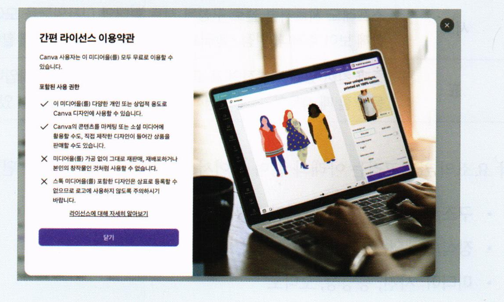

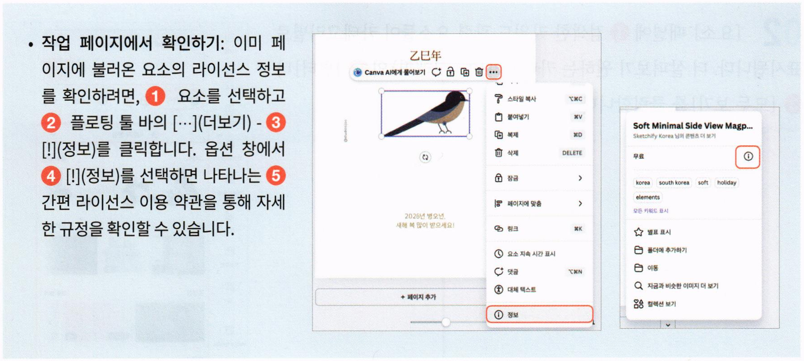

**요소 검색하고 선택해 배치하기**
검색 바에 원하는 키워드를 입력하거나 필터 적용을 통해 필요한 요소를 검색할 수 있습니다. 추상적인 단어로 검색하면 폭넓은 결과가 나오고, 구체적인 표현과 키워드로 검색하면 보다 정확한 검색 결과를 얻을 수 있습니다.

1. [요소] 패널의 검색 바에 원하는 키워드(예: `soft minimal side view magpie`)를 입력합니다. 이때 검색 바 아래에 추천 키워드가 함께 나타납니다.
2. `Enter` 키를 누르거나 검색 버튼을 눌러 결과를 확인합니다. 검색 결과는 그래픽, 사진, 동영상처럼 카테고리별로 표시됩니다.
3. 원하는 요소를 클릭하거나 드래그 앤 드롭해 작업 페이지에 배치합니다.

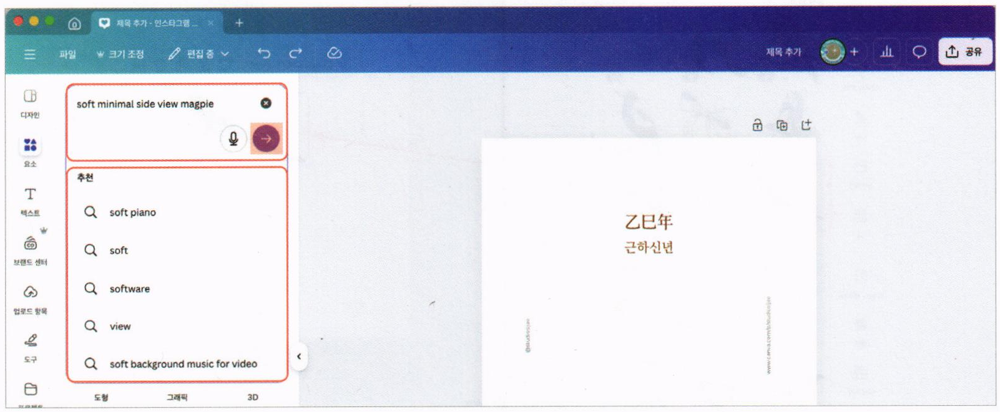

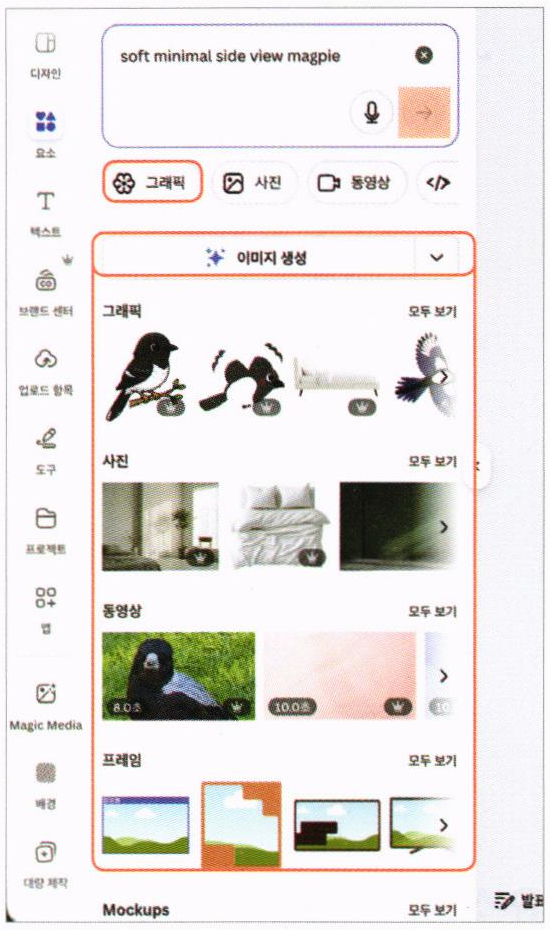

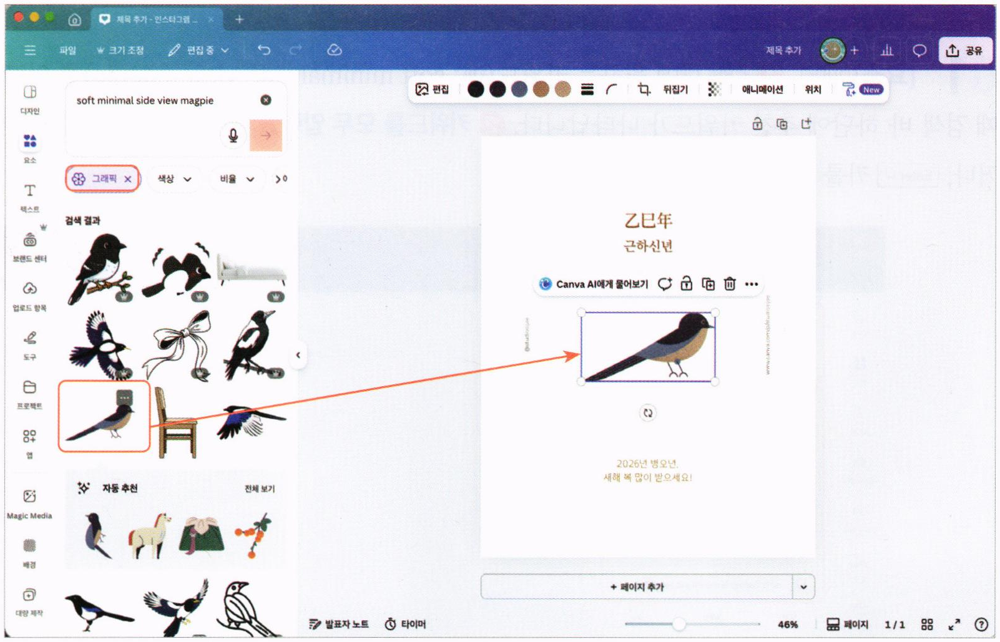

**요소 검색 필터 활용하기**
더 살펴보고 싶은 카테고리의 [필터] 또는 [모두 보기]를 클릭하면 원하는 결과만 더 좁혀 볼 수 있습니다. 색상, 비율, 애니메이션 유무, 투명 배경 여부, 무료/유료 여부 같은 조건을 함께 사용하면 더 정확하게 찾을 수 있습니다.

### 요소 다듬기: 에디터 툴 바와 편집 패널

에디터 툴 바의 특정 메뉴를 클릭하면 에디터 화면 왼쪽에 세부적인 보정과 조정이 가능한 편집 패널이 열립니다.

**에디터 툴 바 둘러보기**

1. **도형 에디터 툴 바**: 편집, 색상, 스트로크 스타일, 모서리 둥글게 만들기, 글꼴, 정렬 등. 도형 안에 텍스트를 넣을 수 있기 때문에 텍스트 관련 메뉴가 포함됩니다.
2. **사진 에디터 툴 바**: 편집, 배경 제거, 지우개, 자르기, 뒤집기, 투명도 등.
3. **그래픽 에디터 툴 바**: 벡터 기반 그래픽은 클릭만으로 색상 변경이 가능하며, 아트 스타일 복사 기능도 지원합니다.
4. **동영상 에디터 툴 바**: 편집, 다듬기, 배경 제거, 재생 속도 등 영상에 특화된 도구가 포함됩니다.

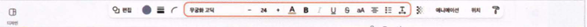

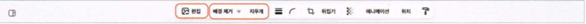

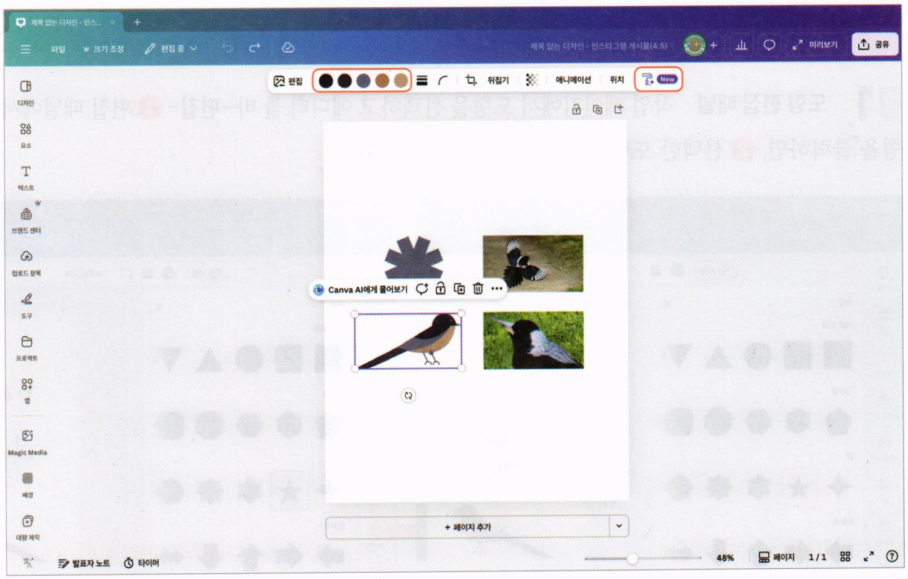

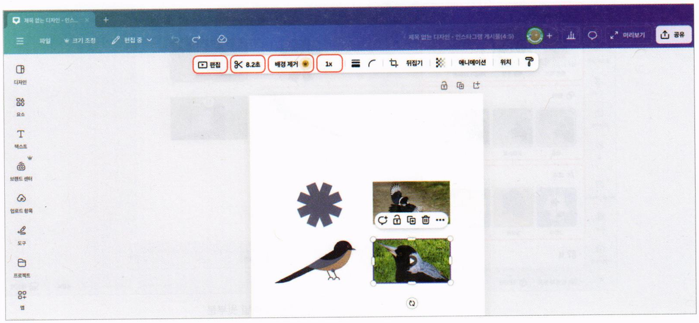

**요소 편집 패널 둘러보기**
선택한 요소에 대한 옵션을 세부적으로 편집하고 조정하는 공간입니다.

**1. 도형 편집 패널**
도형을 선택하고 편집 패널을 열면 원하는 도형 옵션으로 형태를 바로 변경할 수 있습니다.

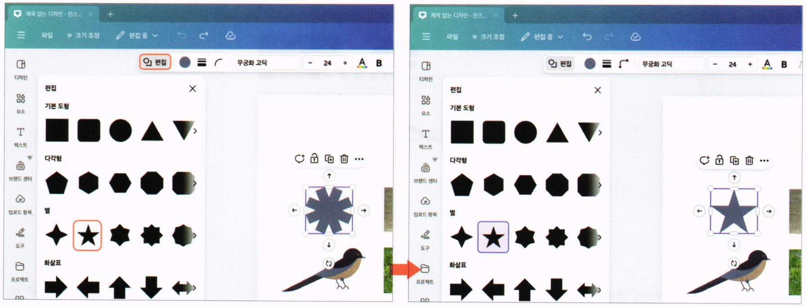

**2. 이미지 편집 패널**
사진(이미지)을 선택한 후 에디터 툴 바 - [편집] - 이미지 패널을 열어 작업합니다.

1. 편집할 사진을 선택하고 [편집]을 클릭해 이미지 패널을 엽니다.
2. [조정]에서 밝기, 대비, 채도 등을 다듬고, 필요하다면 [Magic Studio]에서 배경 제거, Magic Eraser, Magic Grab 같은 AI 기능을 사용합니다.
3. [필터], [fx 효과], [앱]을 차례로 살펴보며 디자인 분위기에 맞는 색감과 효과를 적용합니다.

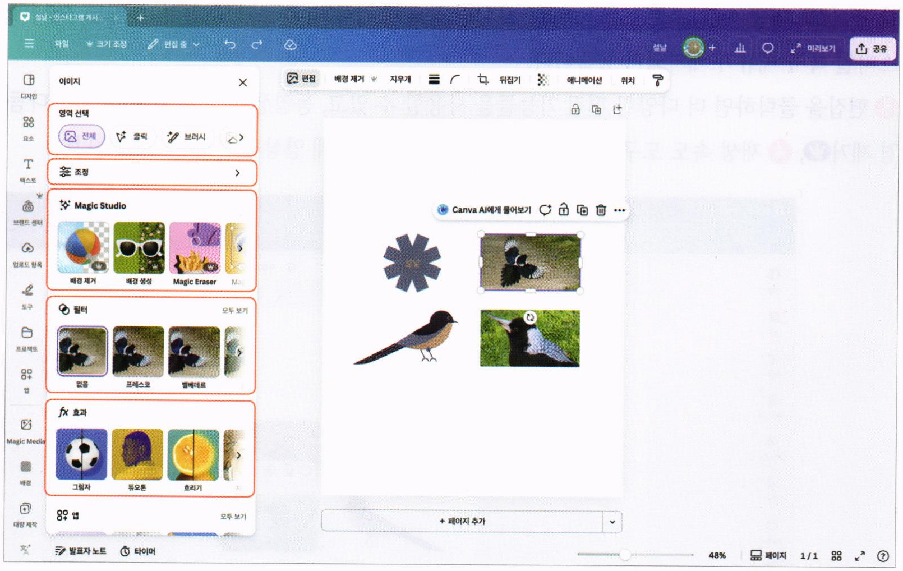

- **조정 패널**: 사진의 밝기, 대비, 채도 등을 조정합니다.
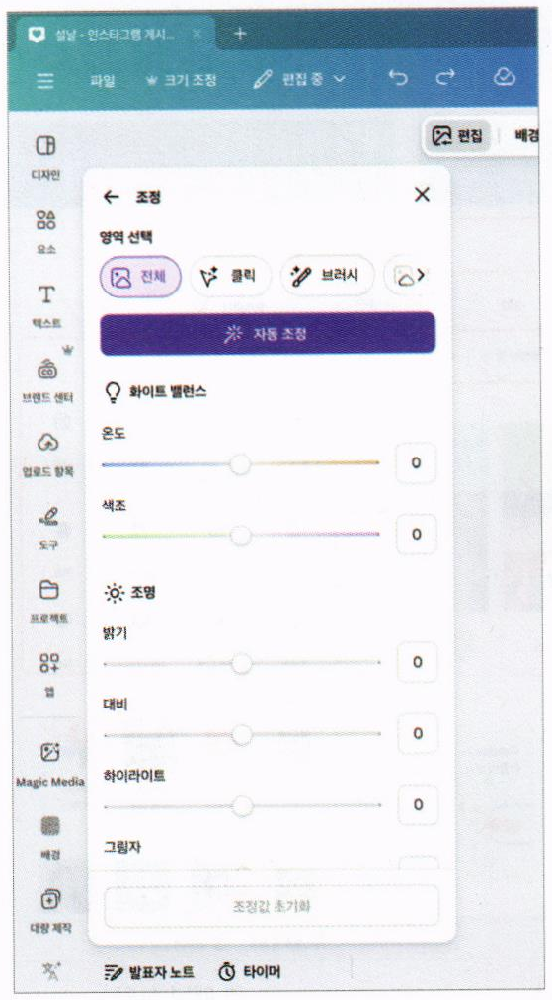

- **Magic Studio**: AI를 활용해 배경 제거, 배경 생성, Magic Eraser, Magic Grab, 텍스트 추출, Magic Edit, Magic Expand 등을 수행합니다.
- **필터 / fx 효과 / 앱**: 다양한 색감 및 특수 효과를 주거나 캔바 외부 확장 도구를 활용합니다.
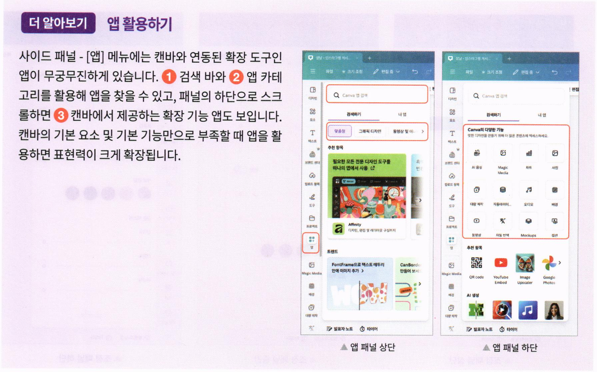
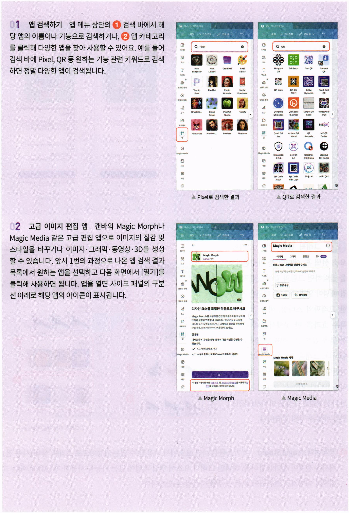
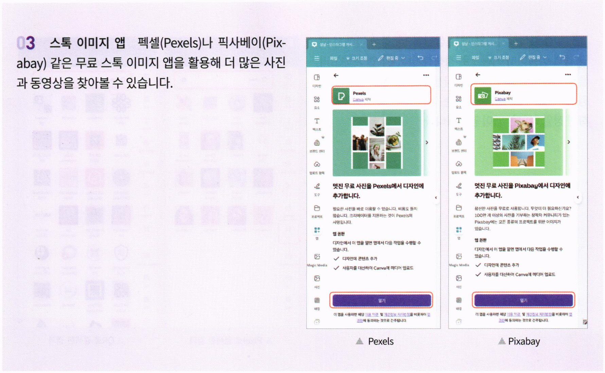

**3. 그래픽 편집 패널**
그래픽 요소 선택 후 편집 패널을 열면, 스타일, 색감, 특수 효과를 다룰 수 있습니다. 사용 전/후에 따라 지원 도구가 달라지며, AI를 활용한 '스타일 매칭' 도 적용할 수 있습니다.
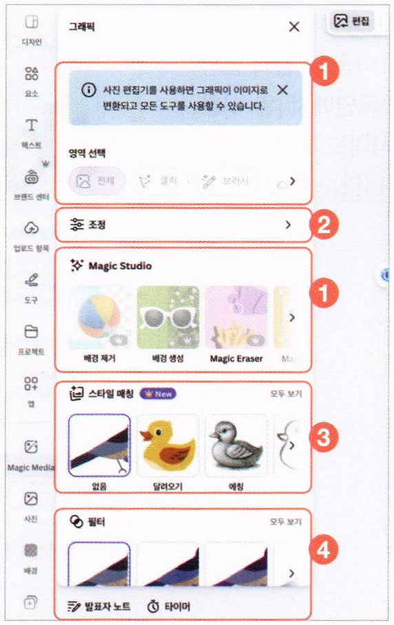

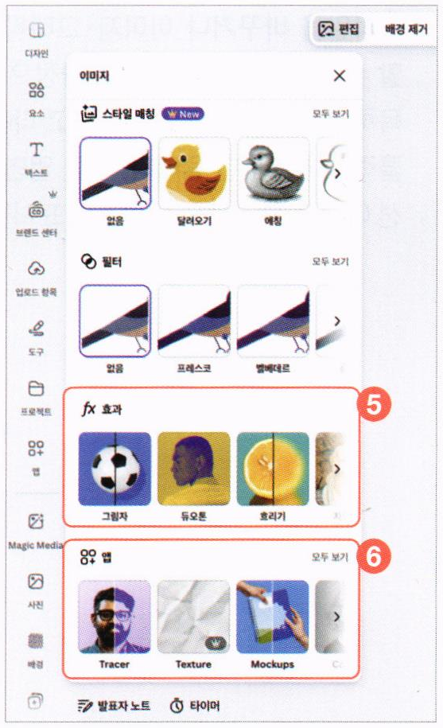

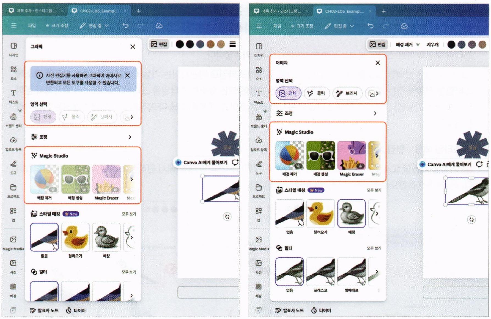

**4. 동영상 편집 패널**
동영상 특화 효과(어안 렌즈, 빛샘 등) 및 재생 속도, 자동 재생 여부를 설정합니다.

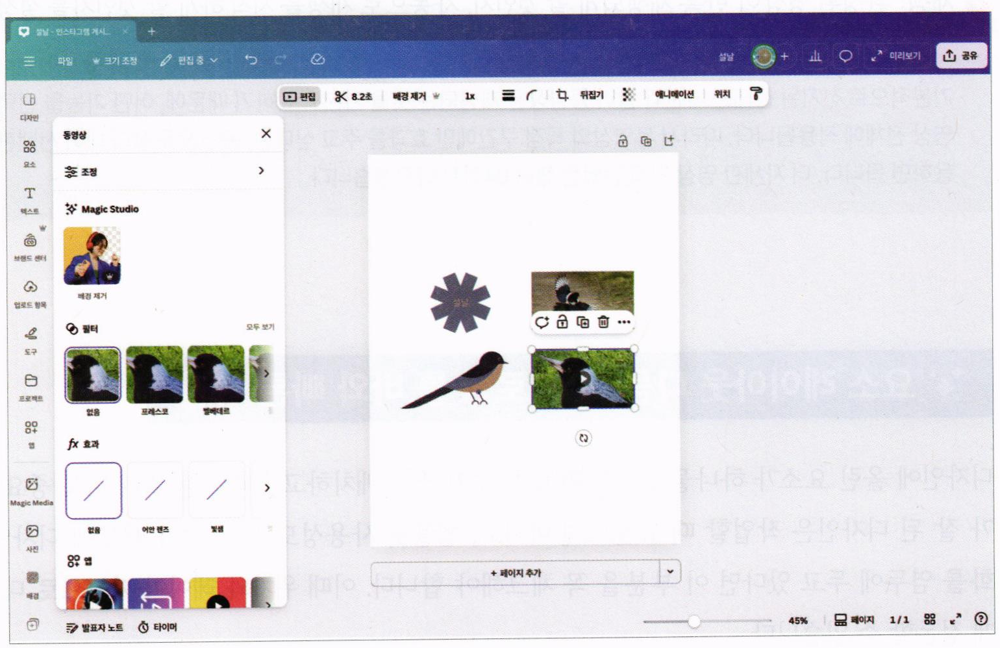

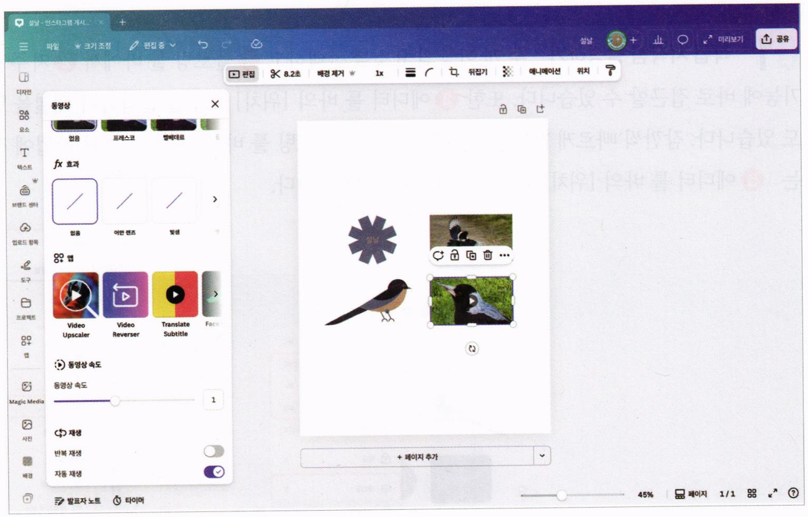

### 요소 레이아웃 다듬기: 플로팅 툴 바와 빠른 작업

디자인에 올린 요소가 하나둘 늘어나면 이를 보기 좋게 배치하고 정리하는 일이 더욱 중요해집니다.

1. **정렬 및 배치**: 여러 요소를 선택하고 플로팅 툴 바나 에디터 툴 바의 [위치] 도구를 활용해 가운데, 상하좌우 정렬 및 고르게 띄우기를 수행합니다.

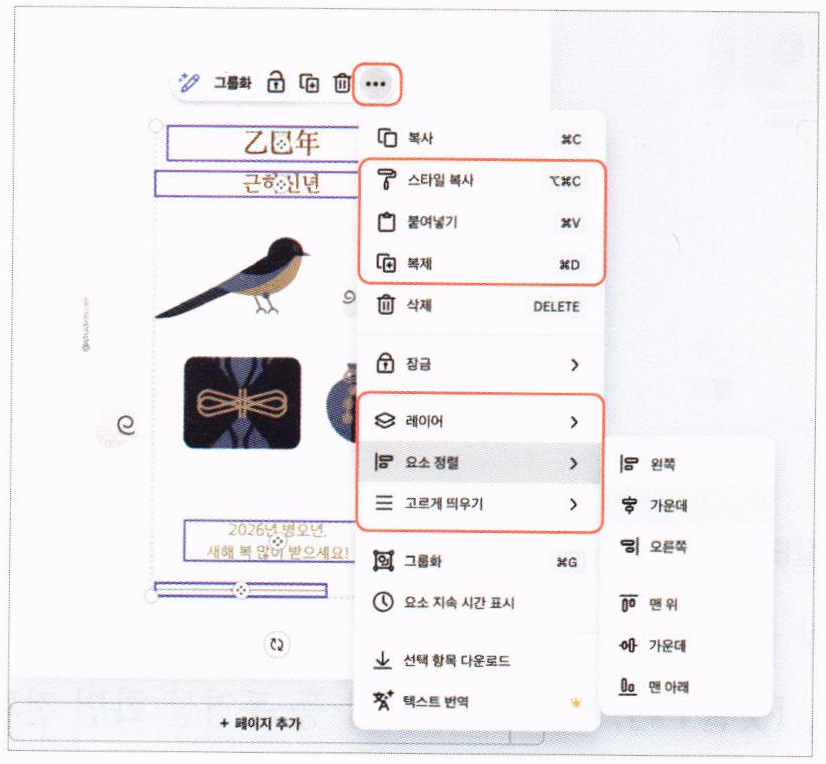

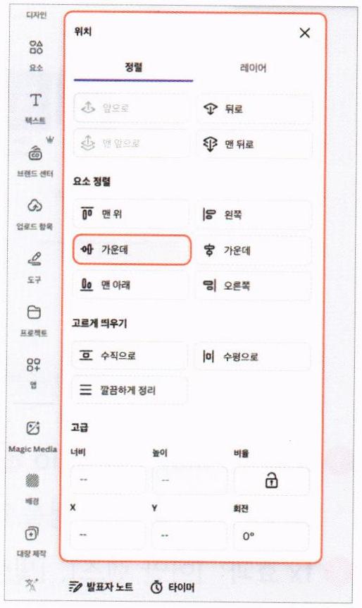

2. **배치 정돈**: 디자인의 통일성을 위해 컬렉션 요소를 모으거나, 시선을 끌 수 있는 레이아웃으로 묶어 배치합니다.

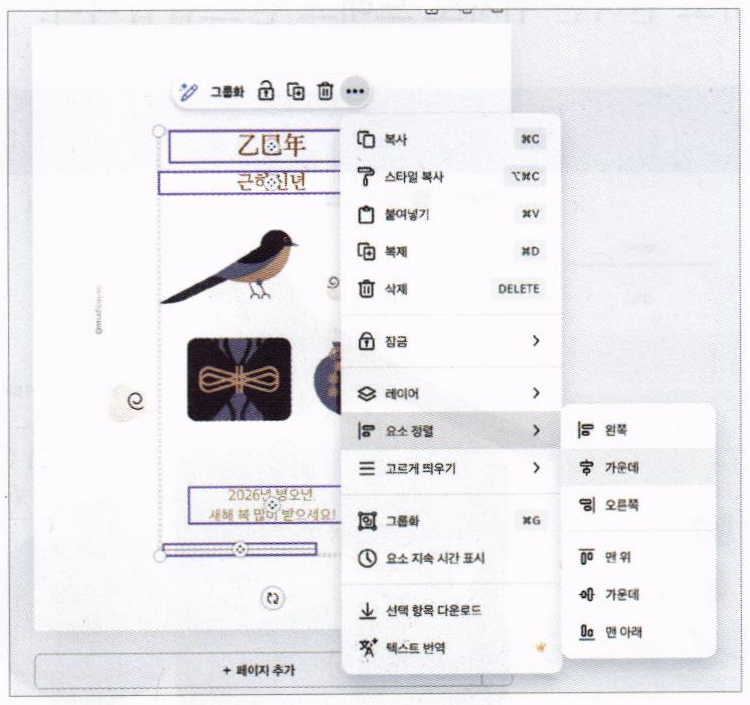

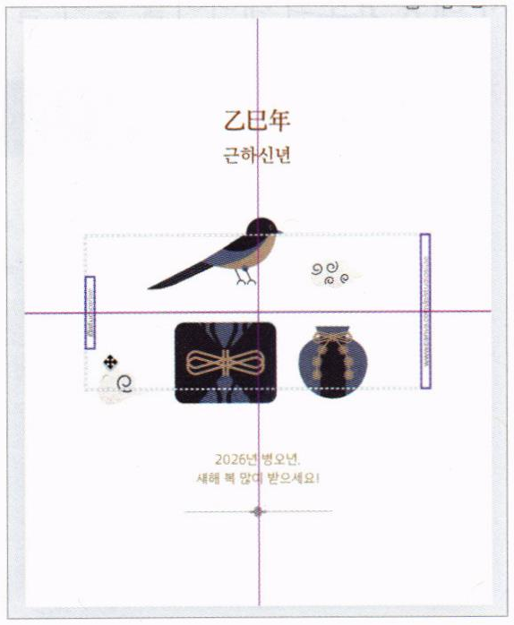

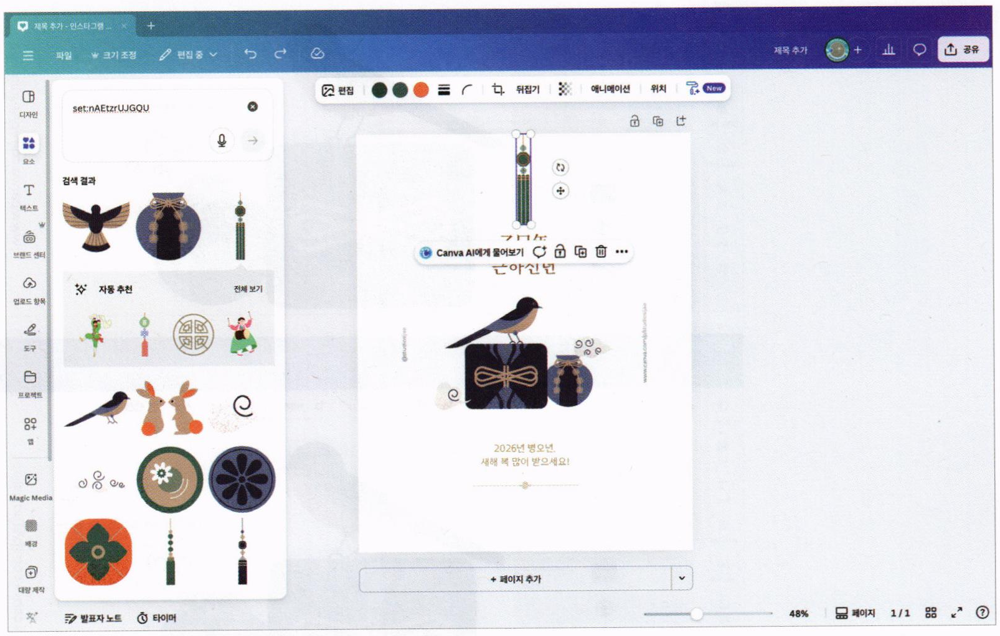

3. **요소 레이어 정리하기**: 2개 이상의 요소가 겹쳐 있을 때, 마우스 우클릭 - [레이어] 탭에서 맨 뒤/앞으로 보내기 등 순서를 조정할 수 있습니다.


4. **그룹 기능**: 여러 요소를 한 덩어리로 묶어 크기 조절이나 이동을 한 번에 처리합니다. 플로팅 툴 바나 `Ctrl`+`G` (Mac은 `Cmd`+`G`)를 활용합니다.


### 요소 업로드해서 사용하기

직접 촬영한 사진이나 다운로드한 그래픽 요소도 JPG, PNG, SVG, MP4 형식으로 캔바에 업로드해 사용할 수 있습니다.

1. **사이드 패널 [업로드 항목] 활용**: [업로드 항목] 패널을 열고 파일을 드래그 앤 드롭하거나, 업로드 버튼을 눌러 내 컴퓨터에서 파일을 불러옵니다.
2. **페이지에 바로 드래그 앤 드롭하기**: 작업 중인 페이지에 파일을 바로 끌어다 놓아도 업로드됩니다.
3. **업로드 후 배치하기**: 업로드가 끝난 파일은 항목 패널에서 바로 클릭하거나 드래그해 페이지에 추가합니다.


---

## 배경과 색상으로 스타일링하기

배경과 색상만 바꿔도 디자인의 분위기는 완전히 달라집니다. 단색·그라데이션·사진으로 배경을 만드는 방법과 스타일 적용 및 색상 팔레트 기능까지 통일감 있는 디자인 스타일링의 핵심 방법을 익혀봅니다.

### 배경으로 스타일링하기: 색상 배경, 이미지 영상 그래픽 배경

**색상으로 배경 채우기**
작업 페이지의 빈 공간을 클릭하고, 에디터 툴 바의 [배경 색상]을 선택해 색상 패널을 엽니다. 브랜드 키트, 기본 단색, 기본 그라데이션에서 원하는 색을 고르거나, 색상명 또는 HEX 코드를 입력해 원하는 배경색을 직접 추가할 수 있습니다.

1. 작업 페이지의 빈 공간을 클릭하고 [배경 색상]을 눌러 색상 패널을 엽니다.
2. [문서 색상], [브랜드 키트], [기본 단색], [기본 그라데이션 색상]에서 원하는 색을 선택합니다.
3. 검색 바에 색상명이나 HEX 코드를 입력해 더 정확하게 찾을 수 있습니다.
4. [새로운 색상 추가]를 눌러 단색 또는 그라데이션 색상을 직접 만들어 추가할 수도 있습니다.


**영상 • 이미지를 배경으로 사용하기**

1. [요소] 또는 [업로드]에서 이미지나 영상을 페이지에 배치합니다.
2. 플로팅 툴 바 - [...] (더보기) - [이미지를 배경으로 설정]을 선택합니다.
3. 이미지를 더블 클릭해 자르기 모드로 들어가 배경의 위치와 크기를 알맞게 자르고 조절합니다.
4. 배치를 마쳤다면 페이지 바깥을 클릭하거나 `Enter` 키를 눌러 자르기 모드를 종료합니다.


**그래픽 요소를 배경으로 사용하기**

1. 사이드 패널의 [요소] 메뉴에서 그래픽 요소를 선택해 추가합니다.
2. 모서리 조절 핸들을 드래그해 캔버스를 꽉 채웁니다.
3. 우클릭 - [레이어] - [맨 뒤로 보내기]를 통해 배경처럼 씁니다.


### 도형 요소를 중간 배경으로 활용하기

배경 이미지가 너무 복잡하여 텍스트 가독성이 떨어질 때 직사각형 도형을 삽입해 중간 배경으로 활용합니다.

1. [요소] 메뉴에서 [도형] - [기본 도형]의 직사각형을 페이지에 추가합니다.
2. 모서리 조절 핸들을 드래그해 텍스트와 그래픽 요소를 덮을 수 있는 크기로 키웁니다.
3. 새로 만든 도형과 배경 패턴 요소를 함께 선택한 뒤, 마우스 우클릭 - [레이어] - [맨 뒤로 보내기]를 눌러 가장 뒤 레이어에 배치합니다.
4. 사각형을 복제해 선 도형으로 만들고, [색상 없음], [스트로크 스타일], [스트로크 색상]을 차례로 설정해 화면을 정돈합니다.
5. 마지막으로 전체 레이어 순서를 정리해 텍스트가 더 또렷하게 읽히도록 맞춥니다.


### 전체 톤 스타일링하기: 스타일 적용 기능

**템플릿 스타일 적용하기**
색 작업은 처음부터 개별 요소마다 하나씩 변경하는 것보다, 먼저 전체적인 톤을 세팅한 뒤 세부적인 수정을 더해 가는 편이 훨씬 수월합니다.

1. 디자인 메뉴의 검색 바에 `Earthy`, `Warm`, `Organic`, `Natural`처럼 원하는 분위기의 키워드를 입력해 템플릿을 찾습니다.
2. 색상 구성이 마음에 드는 템플릿에 마우스를 올리고 `[...]`(더보기)를 클릭합니다.
3. [색상만 적용]을 선택하면 템플릿의 색상 구성이 현재 디자인에 적용됩니다.
4. 색상 셔플 기능을 눌러 원하는 조합이 나올 때까지 바꿔 볼 수 있습니다.


**스타일 탭 활용하기**
디자인 메뉴의 [스타일] 탭을 열면, 색상 팔레트와 글꼴 조합 세트를 한 번에 적용하고 셔플할 수 있습니다. [스타일] 검색, 최근 사용 스타일, 색상 팔레트, 글꼴 세트를 함께 살펴보며 전체 구성이 마음에 드는 방향을 먼저 정해 두면 이후 세부 조정이 훨씬 빨라집니다.


**스마트하게 다듬기: 색상 추출 및 스타일 복사 기능**
색상 패널의 [사진 색상] 추출하기를 활용하면 사진에 쓰인 주요 색상을 분석해 자동으로 컬러 팔레트를 구성해 줍니다.

1. [요소] 메뉴에서 디자인 콘셉트에 어울리는 색감을 가진 사진을 페이지에 추가합니다.
2. 색상을 바꿀 요소를 선택한 뒤, 에디터 툴 바의 [색상]을 클릭해 색상 패널을 엽니다.
3. [사진 색상]에서 자동으로 추출된 컬러 팔레트를 확인하고, 원하는 색을 클릭해 요소나 배경 색상에 적용합니다.
4. 배경 색감이나 패턴이 너무 강하면 [투명도] 슬라이더를 조절해 대비를 낮춰 줍니다.


**스타일 복사와 스포이드로 마무리하기**
한 요소의 색상과 스타일을 다른 요소에도 빠르게 적용하면 전체 통일감을 더 쉽게 맞출 수 있습니다.

1. 기준이 될 요소를 선택하고 에디터 툴 바 - [스타일 복사] - [기본 스타일로 복사하기]를 클릭합니다.
2. 페인트 롤러 아이콘이 나타나면 같은 스타일을 적용할 요소를 클릭합니다.
3. 더 세밀한 색상 조정이 필요하면 [새로운 색상 추가] - [스포이드]를 눌러 화면 안의 원하는 색을 직접 추출합니다.


### 전체 디자인의 색상 밸런스 체크하기

1. 디자인을 전체적으로 둘러보며 색상을 더 수정해야 할 곳이 있는지 확인합니다. 배경색을 좀 더 생동감 있으면서도 은은한 색으로 바꾸거나, 작은 텍스트 색도 더 자연스럽게 맞춰 줍니다.
2. 색상 추출용으로 사용했던 사진이 있다면 페이지에서 삭제해 색상 편집 작업을 마무리합니다.


