# 5차시. 실전 디자인 2 - 기업형 디자인과 자산 관리

## 강사를 위한 상세페이지 디자인

단순히 예쁜 디자인이 아니라, 고객의 심리를 관통하여 결제 버튼까지 이끄는 상세페이지는 어떻게 만들까요? 이번 레슨에서는 강사 개인이 브랜드가 되도록 돕는 강의 상세페이지 템플릿 실습을 통해 완독률을 높이고 전환을 이끌어 내는 디자인 레이아웃과 콘텐츠 구성 전략을 배웁니다.

### 실습 리스트

- 실습 01 인트로 이미지 섹션
- 실습 02 추천 대상 및 강의 차별점 섹션
- 실습 03 한눈에 들어오는 커리큘럼 안내 섹션
- 실습 04 전문성을 강조한 강사 프로필 섹션
- 실습 05 신뢰를 더하는 수강 후기 섹션
- 실습 06 구성 및 가격 안내 섹션

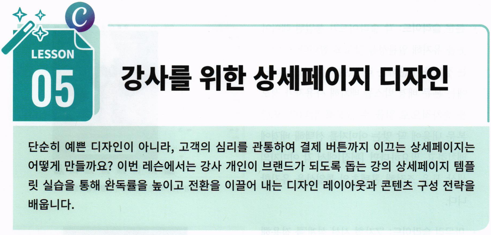

| 구분             | 실습 항목                         | 디자인 포인트 |
| ---------------- | --------------------------------- | ------------- |
| **메인 및 강점** | 실습 01 강의 메인 이미지 섹션  |

 실습 02 추천 대상 및 강의 차별점 섹션 | 첫 화면에서 시선을 사로잡는 비주얼과 강의의 핵심 가치를 담은 헤드라인으로 구성해 예비 수강생의 클릭률과 체류 시간을 높입니다. |
| **커리큘럼 및 정보** | 실습 03 커리큘럼 안내 섹션 

 실습 06 구성 및 가격 안내 섹션 | 정보의 위계를 명확히 구분하여 가독성을 높이고, 수강생이 학습 경로와 비용을 직관적으로 파악할 수 있도록 표와 아이콘을 활용합니다. |
| **신뢰** | 실습 04 강사 프로필 섹션 

 실습 05 수강 후기 섹션 | 강사의 이력을 전문성이 돋보이게 시각화하고, 수강생의 리뷰를 전략적으로 배치하여 강의에 대한 사회적 증거와 신뢰도를 확보합니다. |

강사라는 직업은 강의 내용만큼이나 ‘강의하는 사람’에 대한 신뢰가 중요해요. 이번 레슨에서는 지식 전달자로서의 신뢰감을 극대화하고, 교육의 효과를 시각적으로 증명하는 고전환(High-conversion) 상세페이지를 제작합니다.

상세페이지는 ‘디자인의 시스템화'를 연습하기 좋은 시작점입니다. 강사는 직업 특성상 인스타그램 홍보물부터 워크북, 블로그, 리플렛까지 정말 다양한 포맷의 홍보물 디자인이 필요합니다. 이때 채널마다 디자인이 제각각이라면 브랜드의 힘은 분산될 수밖에 없습니다. 그래서 강사의 프로필, 이야기, 콘텐츠를 하나의 스타일 규칙으로 묶는 시스템 설계가 중요합니다. 이렇게 정립한 규칙은 어떤 플랫폼으로든 유연하게 확장할 수 있는 든든한 기초가 됩니다.

특히 이번 레슨은 마케팅 강사뿐만 아니라 코칭, 컨설팅, 라이프스타일, 비즈니스 등 ‘나 자신이라는 브랜드로 강의하는 사람’을 염두에 두고 설계했습니다. 잘 짜인 ‘강사용 상세페이지 세트’는 이름과 컬러만 바꾸면 수많은 지식 창업자에게 즉시 적용이 가능합니다. 이번 레슨에서 배운 노하우는 곧 템플릿 마켓에서의 높은 재사용성과 판매 경쟁력으로 이어져, 여러분의 디자인 수익화에도 큰 자산이 될 것입니다.

### 디자인 기획 및 의도

- **페르소나**: 온·오프라인 강의를 병행하며 신뢰감을 주어야 하는 전문 강사 및 지식 창업자
- **컨셉**: 열정적인 전문가(Passionate Professional)
- **톤앤매너**: 강렬한 컬러로 에너지를 주되, 정돈된 레이아웃으로 스마트한 느낌 전달
- **목표**: 강사의 팬덤 구축 및 강의 판매 전환율 극대화

### 디자인 시스템

- **컬러**: 브라이트 레드(#ff5151), 쿨 핑크(#e36ccc), 블랙(#000000) 등
- **폰트**: Black Han Sans, Jaso Sans, Noto Sans Kr, Open Sans, 윤고딕, 210오늘은

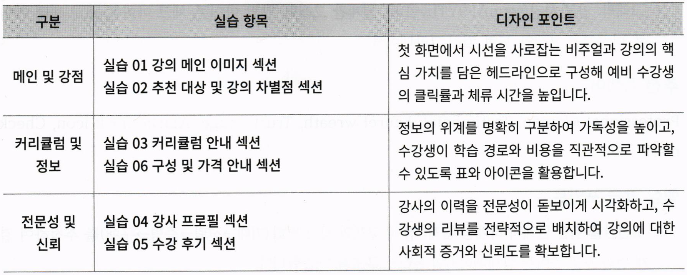

- **그래픽**: 인물 사진(set:nAF9YTbyyD8), 월계관 그래픽, 알람 아이콘, 체크 아이콘, 로고 형태 아이콘, 마름모꼴 프레임, 도형, 컬러 그라데이션

### 추천 검색어

> Professional Woman, Testimonial, Laurel wreath, Trust badge, Alarm clock icon, Check mark

### 핵심 학습 포인트

- **고전환을 위한 단계적 마케팅 설계**: 잠재 고객의 심리 변화(기대 ➔ 신뢰 ➔ 증명 ➔ 구매)를 추적하여 결제 전환율을 높이는 상세페이지의 논리적 구조를 학습합니다.
- **디자인의 모듈화와 시스템 구축**: 강사의 프로필, 컬러, 폰트 규칙을 시스템화하여 인스타그램, 유튜브, 블로그 등 멀티 채널로 확장할 수 있는 토대를 마련합니다.
- **시각적 위계와 가독성 설계**: 강렬한 타이포그래피와 누끼(배경 제거) 인물 컷을 활용해 모바일 환경에서도 시선을 압도하고 정보를 명확히 전달하는 레이아웃 기법을 습득합니다.
- **사회적 증명의 시각화 기술**: 단순 텍스트 후기를 말풍선 UI와 하이라이트 효과를 통해 생동감 있는 ‘리얼 후기’로 재구성하여 신뢰도를 높이는 방법을 배웁니다.

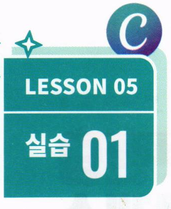

### 시선을 압도하는 첫인상을 보여 주는 디자인: 인트로 이미지 섹션

**작업 사이즈** | 상세페이지 (860 X 1100px)
**디자인 포인트** |

- 독보적인 존재감이 드러나는 시그니처 비주얼
- 흑백으로 보정한 인물 사진 사용으로 대비감 부여
- 핵심 성과를 직관적으로 보여 주는 그래픽 요소

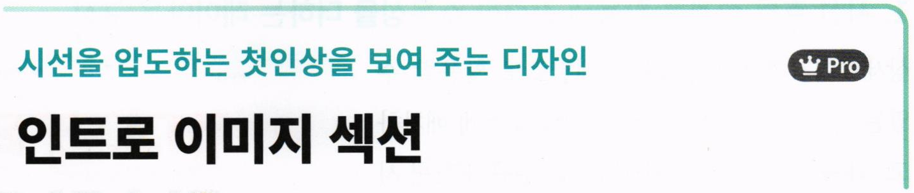

**1. 시선 흐름 설계를 활용해 강력한 주목성을 더하는 레이아웃 구성**
상세페이지의 첫인상이자 섬네일로도 활용할 수 있는 섹션입니다. 인물 사진을 우측에 크게 배치하고, 좌측 상단에 굵은 헤드라인을 두는 ‘F자형 시선 설계’를 적용했습니다. 인물 사진이 제목 텍스트와 살짝 연결되어 있어 사용자의 시선도 자연스럽게 강의 제목에 머물게 됩니다.

**2. 호기심과 기대감을 증폭시키는 내용 구성과 시각 요소**
‘나만의 이력을 특별한 브랜드로!’와 같은 결과 중심 카피를 제목 바로 아래에 배치합니다. 핵심 성과인 누적 수강생 수, 만족도를 상징하는 월계관 배지(검색어: Laurel Wreath)와 별점은 강의의 권위를 직관적으로 보여 주는 시각적 장치입니다. 강사의 사진 앞에 사인(Signature) 텍스트를 포인트로 넣어 전문성을 더합니다.

**3. 세련된 사진으로 완성해 주는 듀오톤 보정과 fx 효과**
원본인 컬러 사진의 색상 때문에 타이틀이 묻힌다면, 인물을 무채색 톤(채도 -100 설정)으로 보정해 보세요. 사진의 채도를 낮추고 명암 대비를 높이면 훨씬 차분하고 전문적인 느낌을 주며, 메인 컬러인 비비드한 핑크 텍스트를 더욱 돋보이게 만드는 효과가 있습니다. 또한 그림자 효과로 입체감을 더해 줍니다.

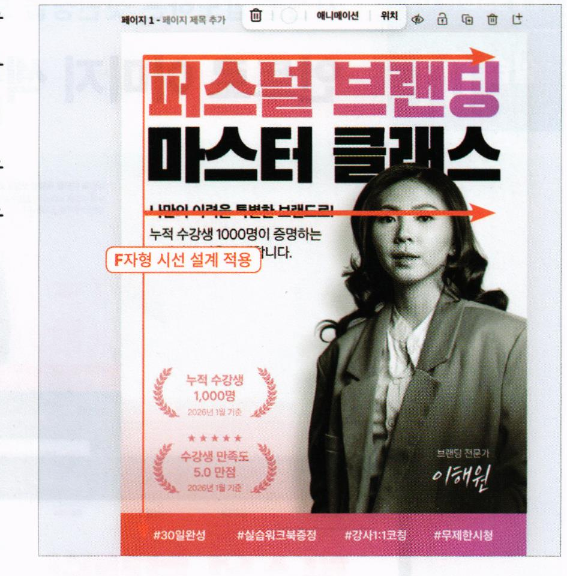

1. **에디터 툴 바 - [배경 제거]**: 컬러 사진을 원클릭으로 간단하게 듀오톤으로 보정하는 방법은 [편집] - [fx 효과] - [듀오톤] - [맞춤화]에서도 가능합니다. [조정] 기능과 [fx 효과] 중 원하는 방법으로 선택해 보정하면 됩니다.
2. **[편집] - [조정] - [대비/하이라이트/그림자/화이트/채도] 조정**
3. **[편집] - [fx 효과] - [그림자]**

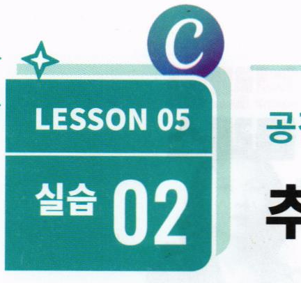

### 공감 포인트와 해결책을 시각화하는 디자인: 추천 대상 및 강의 차별점 섹션

**작업 사이즈** | 상세페이지 (860 X 1100px)
**디자인 포인트** |

- 고대비 배색을 활용한 시선 집중
- 효과적인 화면 분할로 주목성과 안정감 확보
- 아이콘을 활용한 직관적 정보 전달

이번 섹션의 핵심은 고객의 의심을 확신으로 바꾸는 ‘강력한 증거’를 제시하는 것입니다. 구매 전 심리적 저항선을 제거하기 위해 수강생의 고충이나 고민(페인 포인트, Pain Point)을 정확히 짚어 주는 구성으로 완성합니다. ‘이건 바로 내 이야기야!’라는 공감을 이끌어 내어, 잠재 고객이 이탈 없이 다음 내용을 계속 읽게 만드는 강력한 견인 역할을 해줍니다.

**1. 고대비 레이아웃으로 메시지 강조하기**
메시지의 주목도를 높이기 위해 블랙 배경 위에 화이트 카드 섹션을 배치하여 시각적 대비감을 극대화합니다. 각 문구는 둥근 모서리 사각형 박스 안에 배치해 정돈된 안정감을 주며, 자칫 딱딱해 보일 수 있는 리스트형 정보를 부드럽고 친근하게 전달합니다. 특히 체크 아이콘(Check Icon Flat)을 그라데이션 원형(#ff5151~#e36ccc)에 배치해 사용자가 현재 겪는 문제점을 시각적으로 하나하나 짚어 주어 직관적인 정보 전달과 함께 가독성을 높여 줍니다.

- 원형 도형에는 #ff5151~#e36ccc 그라데이션을 적용하고, 방향을 조정해 시선이 자연스럽게 흐르도록 설정해 보세요.
- 체크 아이콘을 그라데이션 원형 배지 위에 올려 각 항목 앞에 반복 배치하면, 같은 정보 구조가 한눈에 읽히도록 정리할 수 있습니다.

**2. 해결책을 제시해 공감을 이끌어 내는 내용 구성하기**
이 섹션의 구성은 잠재 수강생의 고민이나 문제점을 파고들어 깊은 공감을 이끌어 내는 과정입니다. 상단에서 고객의 페인 포인트를 건드렸다면, 하단에는 ‘마스터 클래스만의 포인트’ 3가지를 아이콘과 함께 배치합니다. 문제 제기 후 즉시 이 강의가 왜 유일한 해결책인지를 논리적으로 제시하면, 고객은 자연스럽게 강의의 가치를 수용하고 다음 단계인 커리큘럼 섹션으로 넘어가게 됩니다.

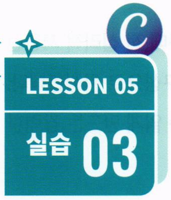

### 프로그램 설계가 한눈에 들어오는 디자인: 커리큘럼 안내 섹션

**작업 사이즈** | 상세페이지 (860 X 1100px)
**디자인 포인트** |

- 수직형 로드맵을 활용한 성장 서사 시각화
- 둥근 바 태그와 넘버링을 통한 시각적 위계 설정
- 충분한 여백 확보를 통한 정보 가독성 확보
- 포인트 컬러를 활용한 핵심 키워드 강조

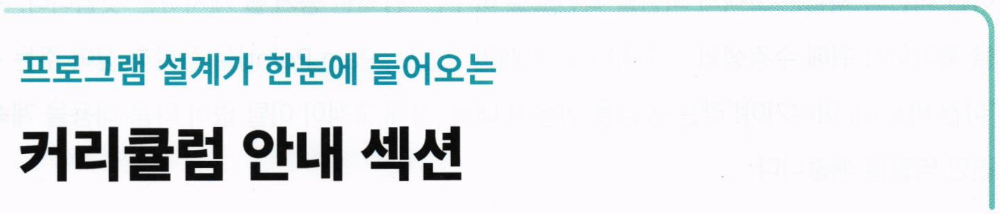

이 섹션은 강의의 실무적 가치를 증명하는 단계별 프로세스를 보여 주는 공간입니다. 단순히 목차를 나열하는 것이 아니라, ‘발견 ➔ 설계 ➔ 구축’으로 이어지는 체계적인 시스템임을 강조해 강의의 전문성을 입증합니다. 제공되는 커리큘럼을 3단계 액션 로드맵 구성으로 제시하여, 수강생의 막연한 기대감을 실행할 수 있겠다는 확신으로 바꾸고 강의에 대한 체계성을 신뢰하게 만드는 것이 이번 실습의 목표입니다.

**1. 수직형 로드맵과 캡슐 태그로 시각적 위계 잡기**
학습자의 변화 과정을 한눈에 보여 주기 위해 3단계 로드맵을 수직형 구조로 배치하여 탄탄한 ‘성장 서사’를 시각화합니다. 각 단계의 시작점에는 메인 컬러로 둥근 바 형태의 태그(SELF-DISCOVERY, BRANDING, GROWTH)와 넘버링을 배치해 각 단계의 구성을 명확하게 보여 줍니다.

**2. 성과 중심의 내용 구조 설계하기**
커리큘럼을 구성할 때는 단순한 이론 나열이 아니라 ‘학습 내용 ➔ 결과물(Output)’의 구조로 구성하는 게 좋습니다. 커리큘럼의 각 챕터 마지막에 ‘결과물: 나만의 핵심 가치 정의서’나 ‘브랜드 슬로건 가이드’와 같이 수강 후 실제로 손에 쥐게 될 구체적인 성과물을 명시해 보세요. 수강생이 얻게 될 실질적인 이득을 시각적으로 확인시켜 주는 것이 결제 전환으로 이끌어 주는 핵심 노하우입니다.

**3. 모듈형 디자인을 활용해 다양한 템플릿으로 확장하기**
이번 실습에서 제작한 커리큘럼 섹션은 그 자체로 완결성이 높은 모듈형 구조를 가지고 있습니다. 덕분에 크기 조정 기능을 활용하여 변경된 비율에 맞춰 디자인을 약간 조정하면 제안서나 강의 소개용 PPT, 오프라인 브로슈어의 핵심 페이지로도 즉시 활용할 수 있습니다. 한 번의 작업으로 블로그 상세페이지부터 공식 제안서까지 아우르는 멀티 채널 템플릿 세트로 완성해 보세요.

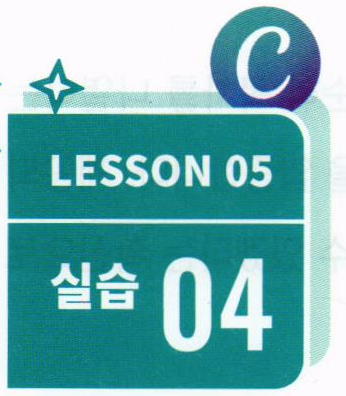

### 신뢰를 완성하는 스토리텔링 디자인: 강사 프로필 섹션

**작업 사이즈** | 상세페이지 (860 X 1100px)
**디자인 포인트** |

- 아치형 도형과 프레임을 활용한 인물 집중도 향상
- 주요 고객사 로고 배지를 통한 시각적 신뢰도 확보
- 그라데이션 텍스트를 활용한 세련된 포인트 강조
- 가독성을 고려한 경력 리스트와 스토리텔링의 분리

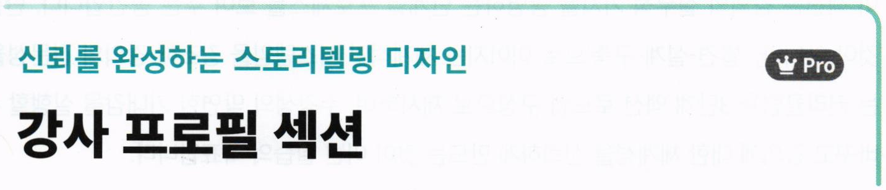

이번 섹션은 강사의 전문성과 가치관을 한눈에 보여 주어 결과로 증명하는 ‘실전 전략가’의 페르소나를 구축하는 데 목적이 있습니다. 단순히 이력을 나열하는 것에 그치지 않고, 전문가로서의 권위와 인간적인 공감을 조화롭게 배치하여 강사의 진정성을 전달해야 합니다. 신뢰할 수 있는 데이터와 진솔한 메시지가 결합될 때, 수강생은 비로소 이 강의를 믿고 따라올 준비를 마치게 됩니다.

**1. 아치형 프레임과 로고 리스트로 전문가의 전문성과 권위를 표현하는 레이아웃**
프로필 이미지는 아치 모양의 도형과 프레임을 활용해 배치해 보세요. 아치형 레이아웃은 시각적으로 부드러우면서도 주목도가 높아, 복잡한 텍스트 사이에서 인물을 돋보이게 만들어 줍니다. 또한 프로필의 아랫면을 사선으로 디자인해 프로필 바로 아래에 배치한 본문 텍스트로 시선이 자연스럽게 이어지게 합니다. 여기에 강사의 경력을 뒷받침하는 주요 고객사나 협력사의 로고 리스트를 나란히 배치하면, 구구절절 설명하지 않아도 강사의 전문성과 신뢰 지표를 시각적으로 즉각 증명할 수 있습니다.

**2. 심리적 거리감을 좁히는 담백한 경력과 공감형 스토리텔링으로 내용 구성하기**
경력 사항은 불필요한 수식어 없이 담백하게 작성하여 전문성에 대한 객관적 신뢰도를 높여 주세요. 반면 하단 메시지 영역은 강사의 인간적인 면모가 드러나는 진솔한 이야기를 담는 것이 좋습니다. 특히 "저 또한 평범한 스펙에서 시작했습니다"와 같은 공감형 카피는 수강생으로 하여금 ‘나도 할 수 있다’는 희망을 주며, 강사와 수강생 사이의 심리적 거리감을 좁혀 강력한 설득 도구가 됩니다.

**3. 디자인의 완성도를 높이는 그라데이션 텍스트 포인트**
디자인에 세련된 디테일을 더하고 싶다면, 강조하고 싶은 핵심 카피에 그라데이션 컬러(#ff5151~#e36ccc)를 적용해 보세요. 앞서 도형을 만들 때 사용했던 것과 동일한 톤앤매너의 그라데이션을 텍스트에 입히면, 화려한 서체를 사용하지 않고도 충분한 존재감을 드러낼 수 있습니다.

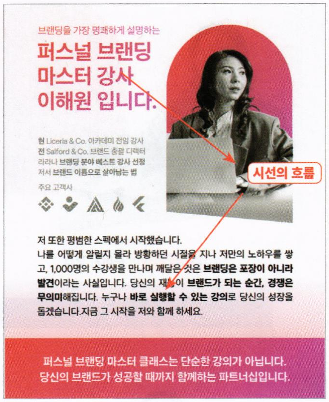

**4. 유니크하고 감각적인 프로필 이미지 만들기**

완성된 결과만 보면 만드는 과정을 한눈에 파악하기 어렵기 때문에, 준비된 이미지와 프레임, 아치형 도형의 레이어 순서를 나누어 차근차근 조립하듯 배치하는 것이 좋습니다.

1. 배경 제거한 이미지를 준비합니다.
2. 배경 제거한 이미지를 하나 더 복사해 마름모꼴 프레임 안에 넣고, 사진의 하단 부분이 보이도록 위치를 조정합니다.
3. 프레임에 들어간 이미지 위에 배경 제거한 원본 이미지를 따로 올려, 두 이미지가 겹쳐 보이도록 배치합니다. 이때 원본 이미지가 프레임 안으로 자동 삽입되지 않도록 위치를 보면서 올려 주는 것이 중요합니다.
4. 프레임 이미지와 원본 이미지를 그룹화한 뒤, 메인 컬러 그라데이션을 적용한 아치형 도형 위에 올립니다.
5. 마지막으로 조절점을 드래그해 두 이미지의 폭과 높이가 자연스럽게 맞물리도록 정리하면 유니크한 프로필 이미지가 완성됩니다. 완성본과 레이어 구조를 번갈아 확인하면서 폭과 높이를 맞추면 더 안정적으로 정리할 수 있습니다.

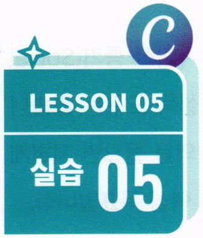

### 사회적 증명을 시각화하는 디자인: 수강 후기 섹션

**작업 사이즈** | 상세페이지 (860 X 1100px)
**디자인 포인트** |

- 실제 메시지 앱을 모티브로 한 말풍선 UI
- 가독성을 높이는 핵심 키워드 하이라이트
- 신뢰도를 더하는 별점(Rating) 배치
- 직업군을 기재해 잠재 고객 페르소나와 일치화

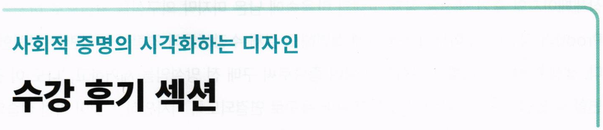

상세페이지의 후기 섹션은 잠재 고객의 마음속에 남은 마지막 의구심을 확신으로 바꾸는 사회적 증거(Social Proof)의 장입니다. 아무리 훌륭하게 설명해도 실제 수강생들이 경험한 변화만큼 강력한 설득 도구는 없습니다. 생생한 성공 사례를 시각화하여 보여 줌으로써 구매 전 망설임을 제거하고, ‘나도 이 강의를 들으면 저렇게 변할 수 있겠다’는 기대감이 실질적인 구매 욕구로 연결되도록 디자인하는 것이 이번 실습의 핵심 목표입니다.

**1. 대화 창 레이아웃으로 리얼리티와 친근함을 더한 레이아웃**
정형화된 사각형 박스 대신 실제 메시지 앱을 연상시키는 말풍선 요소를 활용해 보세요. 익숙한 대화 창 형태의 디자인은 고객에게 리듬감과 실제감을 전달하며, 마치 지인의 추천을 듣는 듯한 친근하고 신뢰감 가는 인상을 줍니다. 특히 말풍선의 꼬리 방향이나 배치에 변주를 주면 지루함을 덜고 페이지 전체에 생동감을 불어넣는 세련된 상세페이지를 완성할 수 있습니다.

**2. 핵심 성과 하이라이트와 직업군 명시로 공감대 형성하기**
내용을 보는 순간 긍정적인 메시지를 파악할 수 있도록 전략적인 편집이 필요합니다. 후기 내용 중 ‘3일 만에’, ‘첫 수익 창출’처럼 가장 중요한 핵심 포인트에만 도형을 배치해 하이라이트 효과를 주어 시선을 집중시켜 보세요. 또한 후기 작성자의 직업군(디자이너, 강사, 프리랜서 등)을 명확히 명시하면, 잠재 고객이 본인의 상황과 동일시하게 되어 훨씬 강력한 구매 동기를 느끼게 됩니다.

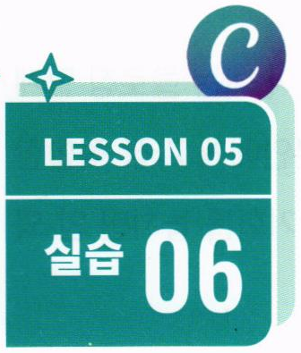

### 명확한 학습 로드맵을 제시하고 행동을 유도하는 디자인: 구성 및 가격 안내 섹션

**작업 사이즈** | 상세페이지 (860 X 1100px)
**디자인 포인트** |

- 패키지별 등급과 할인가의 명확한 시각적 대비
- 학습 성향에 따른 맞춤형 선택지 가이드 제공
- 긴박감을 조성하는 카운트다운 타이머 요소 배치
- 불릿 포인트를 활용한 핵심 혜택의 간결한 도식화

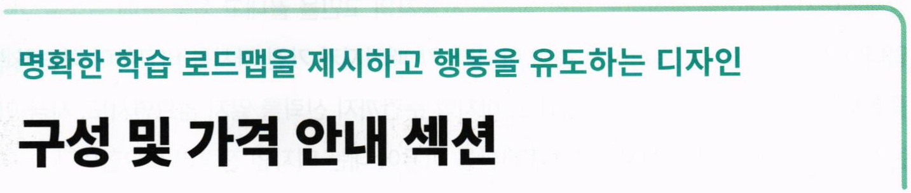

상세페이지의 대미를 장식하는 이번 섹션은 사용자의 고민을 끝내고 최종 구매 결정을 이끌어 내는 클로징 단계입니다. 단순히 가격을 통보하는 것이 아니라, 각 패키지가 가진 가치를 비교하여 학습자 본인에게 가장 적합한 플랜을 선택하도록 돕는 것이 핵심이죠. 마지막 순간까지 신뢰를 잃지 않으면서도, 지금 이 기회를 놓치면 안 되는 명확한 구매 명분을 제시하여 결제 전환을 이끌어 내는 디자인 전략이 필요합니다.

**1. 앵커링 효과와 타임 오버 디자인으로 명확한 의사 결정 돕기**

- 상위 패키지의 혜택을 한눈에 비교할 수 있도록 가격 비교 테이블 형식으로 레이아웃을 구성합니다. 이는 수강생이 자신에게 가장 필요한 플랜을 스스로 판단할 수 있도록 돕는 ‘앵커링 효과’를 줍니다.
- 하단 영역에는 모집 마감일을 명확히 고지하는 ‘카운트다운 타이머’ 디자인을 배치해 보세요. 이는 혜택이 적용되는 시간 제한을 안내함으로써, 수강생이 구매 결정을 미루지 않고 적절한 시기에 판단할 수 있도록 돕는 유용한 시각적 장치가 됩니다.

**2. 메인 상품 강조와 혜택 중심의 간결한 내용 구성**
판매 주력 상품이나 메인 상품(예: B코스)에 ‘BEST’ 혹은 ‘추천’ 배지를 배치해 강조합니다. 각 패키지 설명 란에는 ‘평생 소장권’, ‘실전 워크북 증정’, ‘1:1 과제 피드백’ 등 수강생이 실질적으로 얻게 될 이득(Benefit)을 불릿 포인트로 간결하게 정리하는 것이 좋습니다. 학습자가 복잡한 고민 없이 본인의 필요에 맞는 플랜을 단번에 파악할 수 있도록 배려하는 것이 결제 전환으로 가는 핵심 포인트입니다.

**3. 판매율을 높이는 상세페이지 템플릿 마케팅 아이디어**

- **다크 모드와 화이트 모드 동시 제공**: 전문성이 돋보이는 블랙 테마와 대중적이고 깔끔한 화이트 테마를 세트로 구성해 보세요. 사용자의 취향에 맞는 선택지를 제공하면 템플릿의 구매 가치가 훨씬 높아집니다.
- **독창적인 체크리스트 아이콘 세트**: 강사들이 가장 선호하는 요소인 ‘체크리스트’를 본인만의 독특한 스타일로 제작하여 배치하세요. 작은 그래픽 요소의 차별화가 곧 템플릿의 경쟁력이 됩니다.

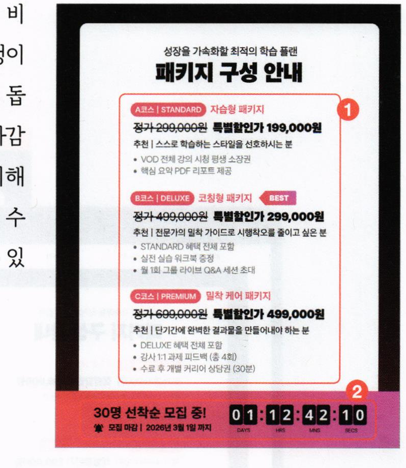

- **디바이스 목업으로 실체감 강조**: 수강생이 받게 될 PDF 리포트나 워크북을 태블릿이나 랩탑 목업 안에 담아 보여 주세요. 결과물의 실체를 시각적으로 확인시켜 주면 강의의 실무적 가치가 더욱 크게 전달됩니다.

---

### 신뢰감을 더하는 홈페이지형 블로그 템플릿 제작하기

블로그는 잠재 고객을 이끄는 강력한 브랜딩 채널이기에 이번 챕터에 등장한 다양한 업종에서 자주 활용되고 있습니다. 캔바를 활용해 신뢰감을 주는 멋진 홈페이지형 블로그 템플릿을 제작하여 판매하는 것도 좋은 아이디어입니다.

**1. 홈페이지형 블로그란?**

- **신뢰도 상승**: 블로그에 접속 즉시 핵심 메시지와 브랜드 정체성이 노출되어 전문성을 즉각적으로 전달합니다.
- **전환율 상승**: [상담 신청], [포트폴리오], [스토어 바로가기] 등 주요 메뉴로 연결되는 위젯을 배치해 고객의 행동을 이끕니다.

**2. 캔바로 준비하는 블로그 브랜딩 요소**
블로그 하나를 세팅할 때도 캔바의 다양한 기능을 활용하면 일관된 브랜드 경험을 제공할 수 있습니다.

- **블로그 타이틀 & 모바일 스킨**: 브랜드의 얼굴이 되는 상단 이미지를 제작할 수 있습니다. 사진의 배경이 부족할 때에는 Magic Expand 기능을 활용하여 주변 배경을 자연스럽게 확장하여 와이드 배너에 최적화된 구도를 만듭니다. 또한 사이즈 변경 기능으로 제작한 PC용 스킨을 클릭 한 번으로 모바일 최적화 사이즈로 즉시 변환할 수 있습니다.
- **위젯 버튼**: 캔바의 도형과 아이콘 요소를 활용해 SNS 채널이나 블로그 게시판 카테고리의 버튼을 디자인할 수 있습니다.
- **포스트 섬네일 & 게시글 하단 배너**: 통일된 디자인의 섬네일로 가독성을 높이고, 본문 하단에는 ‘이웃추가’나 ‘채널 연결’을 돕는 배너를 배치합니다.

**3. 제작 및 설정 실전 팁**

- **시각적 통일성 지키기**: 브랜드 컨셉에 맞춰 요소의 컬러와 폰트를 일관성있게 사용해 디자인합니다.
- **투명 위젯 활용하기**: 타이틀 디자인의 버튼이 실제로 클릭되게 하려면 블로그 레이아웃 설정에서 투명 위젯을 각 버튼 위치에 맞춰 먼저 배치한 뒤 링크 좌표를 연결해야 합니다.
- **공식 가이드 확인**: 상세한 위젯 등록법과 설정 경로의 최신 정보는 네이버 블로그 고객센터를 참고하는 것이 가장 정확합니다.

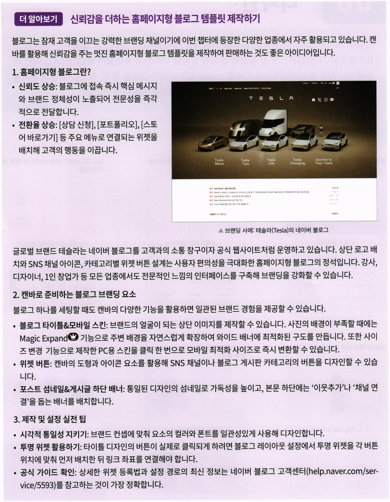

---

## 기업을 위한 프레젠테이션 디자인

기업용 프레젠테이션은 단순히 정보를 나열하는 것이 아니라, 상대방을 설득하는 비주얼 스토리텔링의 과정입니다. 또한 정보의 논리적 흐름을 디자인에 녹아들게 해야 합니다. 이번 레슨에서는 실무 프레젠테이션에서 바로 쓰이는 6가지 핵심 모듈을 통해, 텍스트 위주의 문서를 매력적인 비주얼 전략서로 탈바꿈시키는 디자인 워크플로우를 익혀 봅니다.

### 실습 리스트

- 실습 01 표지와 목차 모듈
- 실습 02 브랜드 미션과 문제 제기 모듈
- 실습 03 브랜드 성과 데이터 및 제품 라인업 모듈
- 실습 04 핵심 기술 및 시장 반응 모듈
- 실습 05 브랜드 운영 전략 및 시장 확대 전략 모듈
- 실습 06 팀원 및 클로징 모듈

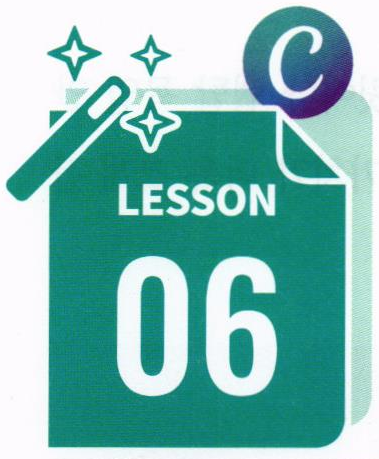

| 구분               | 실습 항목                    | 디자인 포인트 |
| ------------------ | ---------------------------- | ------------- |
| **브랜딩 및 서론** | 실습 01 표지와 목차 모듈  |

 실습 02 브랜드 미션과 문제 제기 모듈 | 기업의 아이덴티티가 담긴 컬러와 폰트를 일관되게 적용하고, 해결해야 할 핵심 문제를 임팩트 있게 시각화하여 몰입감을 조성합니다. |
| **성과 및 제품** | 실습 03 브랜드 성과 데이터 및 제품 라인업 모듈 

 실습 04 핵심 기술 및 시장 반응 모듈 | 복잡한 수치와 데이터는 차트와 인포그래픽으로 단순화하여 가시성을 높이고, 제품의 기술적 우위를 한눈에 비교할 수 있도록 그래픽을 활용해 정렬합니다. |
| **전략 및 팀** | 실습 05 시장 반응 및 운영 전략 모듈 

 실습 06 팀원 및 클로징 모듈 | 비즈니스의 지속 가능성과 확장성을 보여 줄 수 있도록 단계별 로드맵을 체계적으로 구조화하며, 신뢰감을 주는 레이아웃으로 발표를 마무리합니다. |

**승인과 투자를 부르는 브랜드 운영 전략 및 사업 계획서 만들기**
회사에서 가장 많이 쓰지만 가장 어려운 것이 바로 프레젠테이션입니다. 특히 투자 유치를 위한 IR 자료나 파트너십 제안서는 디자인 한 끗 차이로 기업의 신뢰도가 결정됩니다. 이번 레슨에서는 기업에서 선호하는 감각적이고 전문적인 스타일로 12페이지 분량의 브랜드 운영 전략 및 사업 계획서를 만들어 봅니다.

이번 레슨에서 완성할 프레젠테이션은 기업용 디자인의 ‘기준점’이 됩니다. 여기서 확립된 비주얼 가이드를 바탕으로 SNS, 카드뉴스, 광고 배너, 랜딩 페이지까지 확장해 제작한다면 여러분은 단순한 템플릿 제작자를 넘어 기업의 통합 브랜딩을 담당하는 마케팅 실무 파트너로 인정받게 될 것입니다. 전체 프레젠테이션의 흐름을 한 세트로 설계해 본 경험은 비즈니스를 시각화하는 전략가로 성장시켜 주는 발판이 될 거예요.

### 디자인 기획 및 의도

- **페르소나**: 투자자 및 협력사에게 비즈니스 확신을 주어야 하는 중소기업 및 스타트업
- **컨셉**: 은은하게 빛나는 색감과 절제된 여백의 조화, 루미너스 미니멀리즘(Luminous Minimalist)
- **톤앤무드**: 소프트 라벤더 컬러로 섬세함과 우아함을 유지하되, 정돈된 그리드 레이아웃으로 전문적인 신뢰감 전달
- **목표**: 브랜드의 비전과 재무적 성과를 시각화하여 투자 유치 및 비즈니스 확장 파트너십 체결

### 디자인 시스템

- **컬러**: 소프트 라벤더(#a570f4, #b492e6 등), 딥 그레이(#333333), 아이보리(#fafafa) 등
- **폰트**: Now, Jaso Sans, The Seasons
- **그래픽**: 아치형 프레임, 기하학적인 그라데이션 이미지, 아이콘, 도형

### 핵심 학습 포인트

- **비즈니스 데이터의 시각적 언어화**: 매출 성장률이나 고객 만족도 같은 정량적 지표를 단순 숫자가 아닌, 직관적인 ‘성과 시나리오’로 변환하는 기법을 익힙니다.
- **지속 가능한 브랜드 아이덴티티 설계**: 반복되는 그래픽 모티프와 메인 컬러 팔레트를 슬라이드 전체에 일관되게 배치하여, 12장의 문서를 하나의 ‘브랜드 패키지’로 완성하는 법을 배웁니다.
- **전략적 정보 위계(Hierarchy) 구축**: 핵심 메시지와 부연 설명의 크기 대비를 극대화하여, 투자자나 결정권자의 시선이 가장 중요한 수치에 먼저 머물도록 유도하는 ‘시선 설계 노하우’를 습득합니다.
- **프레임과 요소를 활용한 감도 높은 레이아웃**: 브랜드 컨셉에 어울리는 프레임과 구조화된 도형 박스를 적재적소에 배치하여, 텍스트 위주의 지루한 문서를 세련된 ‘비주얼 전략서’로 탈바꿈시키는 레이아웃 감각을 키웁니다.
- **리듬감을 부여하는 프레젠테이션 연출**: 정적인 슬라이드에 애니메이션을 더해 정보 전달의 강약을 조절하고, 청중의 몰입도를 끝까지 유지하는 다이내믹 스토리텔링 기술을 적용합니다.

### 추천 검색어

> Geometric, Glassmorphism, Minimalist, vision, mission, company values

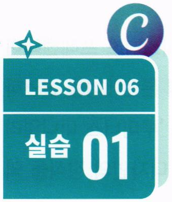

### 프레젠테이션의 첫인상을 결정짓는 프롤로그 디자인: 표지와 목차 모듈

**작업 사이즈** | 프레젠테이션 (1920 X 1080px, 16:9)
**디자인 포인트** |

- 여백과 서체의 대비를 활용한 시각적 압도감
- 그리드 시스템 기반의 정보 구조화
- 브랜드 정체성을 상징하는 그래픽 모티프

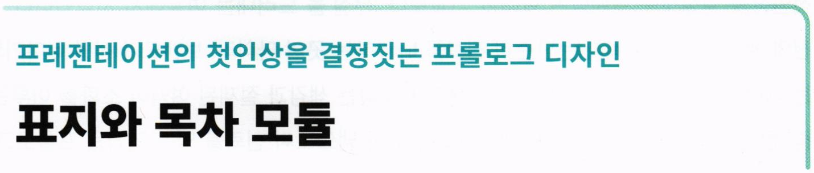

첫인상을 결정짓는 브랜딩은 화려한 기교보다 ‘본질’을 드러내는 여유에서 시작됩니다. 비즈니스 프레젠테이션의 얼굴인 표지와 목차는 단순히 정보를 나열하는 곳이 아니라, 브랜드가 전할 이야기의 톤앤매너를 선언하는 페이지입니다. 이번 실습에서는 은은하게 빛나는 색감과 절제된 여백이 조화를 이루는 ‘루미너스 미니멀리즘’ 컨셉을 바탕으로, 텍스트를 채우기보다 비워 냄으로써 신뢰를 얻는 기업용 프롤로그 디자인의 정석을 익혀 봅니다.

**1. 시각적 위계와 질서를 가진 레이아웃으로 신뢰가는 첫인상 구축**

- 표지 슬라이드는 텍스트 요소를 최소화하고 브랜드명을 하단에 과감하게 배치하여 상단의 넓은 여백이 주는 고급스러움을 극대화합니다. 배경의 곡선 그래픽과 브랜드 명의 직선적인 정렬이 조화를 이루도록 설계하세요.
- 목차 슬라이드는 목차를 3X3 그리드(Grid)로 정렬함으로써 정보를 질서있게 노출합니다. 또한 각 항목 사이의 충분한 간격은 정보의 가시성을 높이는 핵심 요소입니다. 정돈된 레이아웃을 통해 고객은 프레젠테이션의 논리적인 체계를 직관적으로 느끼게 되어 신뢰감이 높아집니다.

**2. 정돈된 분위기와 여유로 전달하는 전문성**

- **텍스트 크기의 변주**: 고객은 정돈된 레이아웃에서 전문성을 직감적으로 느끼게 됩니다. 폰트 크기 배치에 과감한 대비를 주어 별도의 장식 없이도 정보의 중요도를 명확히 전달해 세련된 분위기를 연출합니다.
- **애니메이션과 인사이트**: 프레젠테이션에서는 ‘여유’로 신뢰감을 줄 수 있습니다. 텍스트가 순차적으로 떠오르는 은은한 [애니메이션] - [나타내기/들어갈 때]를 적용해 발표자가 목차를 설명하는 동안 청중이 내용에 점진적으로 몰입하도록 유도합니다.

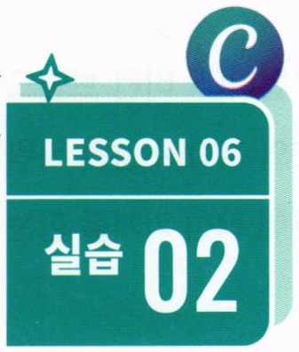

### 신뢰감과 설득력을 더하는 디자인: 브랜드 미션과 시장 분석 모듈

**작업 사이즈** | 프레젠테이션 (1920 X 1080px, 16:9)
**디자인 포인트** |

- 기하학적 도형을 활용한 철학의 시각화
- 구분선과 아이콘을 이용한 정보의 구조화
- 키워드 중심의 전략적 데이터 요약

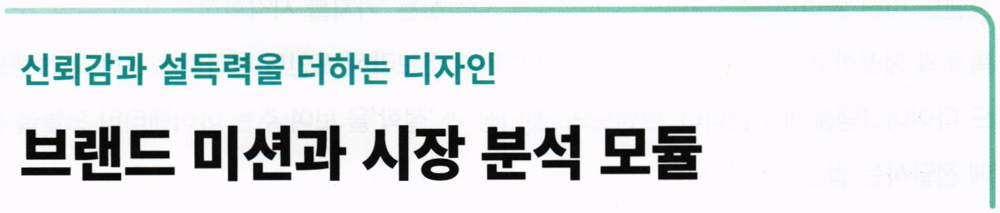

브랜드 미션 슬라이드는 브랜드의 첫인상을 결정짓는 ‘가치를 시각화하는 비전 설정’ 구간입니다. 비건 브랜드 특유의 깨끗하고 부드러운 무드를 유지하기 위해 연보라색 포인트 컬러를 활용하고, 브랜드의 철학이 담긴 키워드 다이어그램을 배치합니다. 브랜드의 ‘첫인상’과 ‘철학’을 보여 주는 아이덴티티 모듈을 통해 핵심 가치를 한눈에 전달하는 법을 익혀 봅니다.

이어지는 시장 분석 슬라이드에서는 복잡한 정보를 효과적으로 요약해 전달하는 역량이 필요합니다. 현재 뷰티 시장의 문제점과 브랜드의 성장 가능성을 인포그래픽 위주로 구성하여, 이 사업이 왜 필요한지 논리적으로 증명해야 합니다. 시장의 페인 포인트(Pain Point)를 짚어 주고 해결책으로서의 기회를 시각화하는 훈련은 설득력 있는 제안서의 핵심입니다.

**1. 도형과 선으로 설계된 논리적 구조의 레이아웃**

- 브랜드 미션 슬라이드는 좌측에 그라데이션 원형에 브랜드 미션을 배치해 강조합니다. 그리고 중앙 텍스트(예: 3대 핵심 가치)를 기준으로 선으로 우측의 도형으로 연결되어 브랜드 미션에서 파생되는 3대 핵심 가치를 표현합니다.
- 시장 분석 슬라이드는 텍스트 양이 많으므로 체크 박스 아이콘(Check mark)과 수직 구분선을 사용해 구역을 명확히 나눕니다. 상단에는 핵심 문제점과 데이터를 배치하고, 하단에는 3가지 시장 기회를 병렬로 구성하여 정보의 위계를 잡아 줍니다.

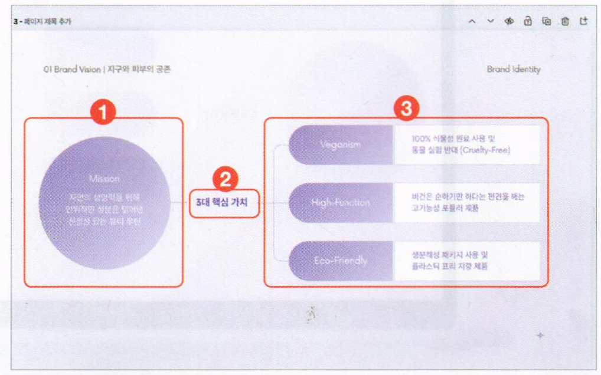

- [선 시작]과 [선 끝] 메뉴에서 선의 끝 모양을 설정하면, 브랜드 미션에서 파생되는 흐름을 더 명확하게 보여 줄 수 있습니다.
- [선 유형] - [꺾인 선]을 선택한 뒤 조절 핸들을 드래그해 선이 꺾이는 지점을 잡으면, 다이어그램 구조를 더 정돈되게 만들 수 있습니다.

**2. 추상을 실체로 바꾸는 인포그래픽 전략으로 내용 구성하기**

- **다이어그램과 애니메이션 활용**: 브랜드의 비전처럼 눈에 보이지 않는 가치는 텍스트를 그룹화하여 한눈에 들어오는 다이어그램으로 표현하는 것이 좋습니다. 부드러운 [애니메이션] - [떠오르기] 또는 [블록 쓸기] 효과를 주어 요소들이 순차적으로 나타나게 구성하면 정보의 연결성이 더욱 돋보입니다. 이때 주의할 점은 애니메이션은 너무 많이 사용하기보다 강조하고 싶은 부분에만 포인트로 사용하는 것이 좋습니다. 또한 [들어갈 때]로 설정하면 화면이 매끄럽게 전환되는 느낌이 듭니다.

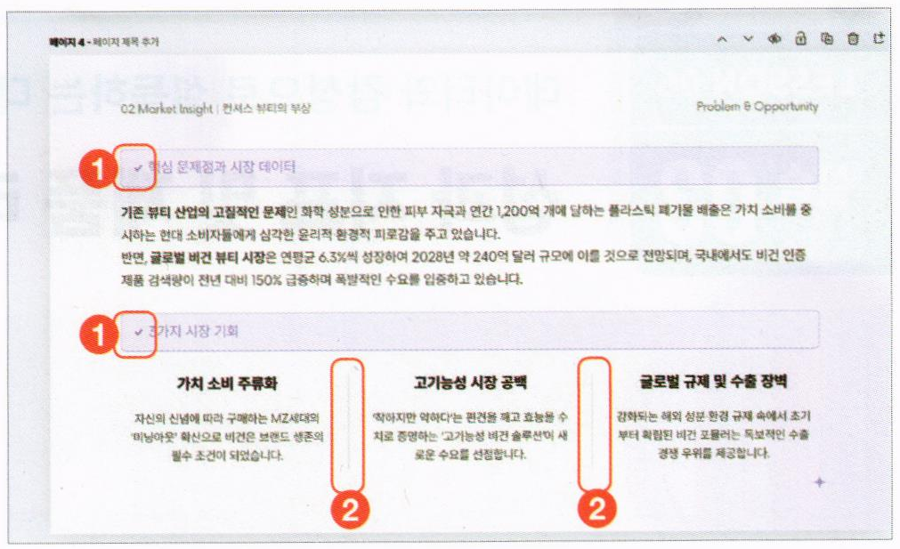

- **데이터의 키워드 요약으로 가독성 확보**: 복잡한 시장 데이터는 긴 문장보다 ‘3가지 키워드’로 요약하여 배치할 때 설득력이 높아집니다. 시선을 끄는 키워드 3가지를 강조하고, 자세한 내용은 아래에 이어서 배치해 가독성을 높여줍니다.

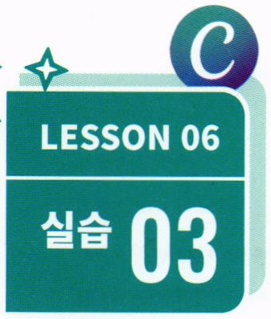

### 데이터와 감성으로 설득하는 디자인: 성과 지표 및 제품 라인업 모듈

**작업 사이즈** | 프레젠테이션 (1920 X 1080px, 16:9)
**디자인 포인트** |

- 데이터 잉크 최소화 기법을 적용해 수치 강조
- 매거진 스타일의 프레임 레이아웃 활용
- 이미지 깊이감을 더하는 텍스트 오버레이

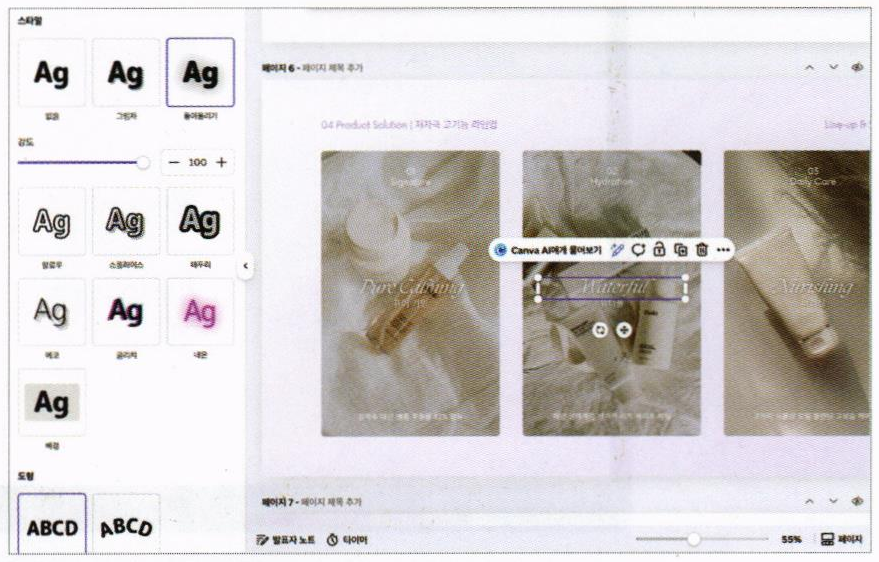

**1. 성장을 증명하는 숫자와 시선을 사로잡는 이미지**

- **성과 지표 슬라이드**: 차트와 수치가 등장하는 슬라이드에서는 신뢰가 핵심입니다. 배경 격자를 간소화하고 우상향하는 선 그래프를 사용해 직관성을 높이세요. 매출 성장률(+35%)이나 재구매율(+32%) 같은 수치 정보는 숫자의 크기를 과감하게 키워 시각적 강조점(Visual Focal Point)을 명확히 해야 압도적인 성장성을 증명할 수 있습니다.
- **제품 라인업 슬라이드**: 뷰티 브랜드는 이미지가 생명인 만큼 격자형 레이아웃이나 프레임을 활용해 제품 사진을 매거진처럼 세련되게 배치합니다. 감성적인 무드 컷을 전체 배경으로 쓰고 그 위에 텍스트 박스를 [효과] - [들어올리기] 효과를 주어 배치합니다. 이로써 이미지와 정보가 자연스럽게 어우러지며 깊이감 있는 디자인이 완성됩니다. 각 제품의 특징은 3~4가지 핵심 키워드로 요약해 한눈에 들어오게 구성하세요.

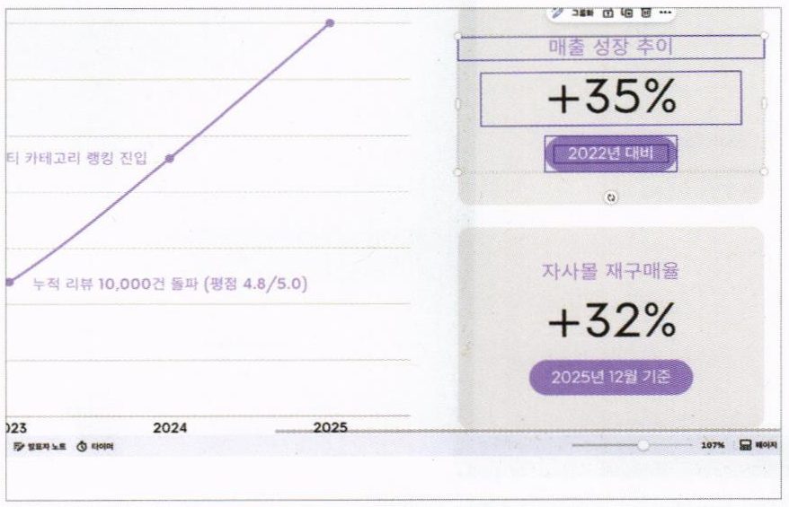

**2. 차트를 활용한 핵심 정보 시각화**

- **핵심 정보만 남기는 ‘데이터 잉크’ 전략**: 차트에서 강조할 지점에 마커(누적 리뷰 10,000건 돌파 등)를 배치해 핵심 정보(데이터 잉크)만 간략하게 표시해 줍니다. 에디터 툴 바의 [편집, 색상, 여백, 다듬기, 선 두께, 마커]에서 각 항목을 조정해 원하는 대로 차트를 편집할 수 있습니다.
- **사용자 친화적인 데이터 시각화**: 차트와 숫자 데이터(+35%, +32% 등)에 사용하는 컬러나 폰트에서 브랜드 일관성을 유지해 제안서의 전문적인 비즈니스 톤앤매너를 확립해 줍니다.

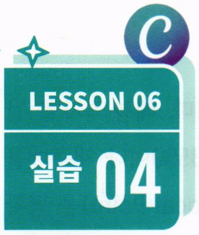

### 전문성을 입증하는 인포그래픽 디자인: 핵심 기술 및 시장 반응 모듈

**작업 사이즈** | 프레젠테이션 (1920 X 1080px, 16:9)
**디자인 포인트** |

- 수직 노드 다이어그램을 활용한 정보 시각화
- 말풍선 UI와 별점 요소를 통한 신뢰도 강화
- 수치 지표와 텍스트 리뷰의 전략적 구획화

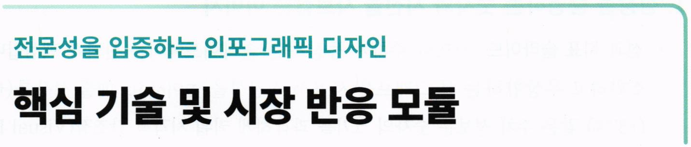

**1. 노드와 말풍선 UI로 구현하는 직관적 레이아웃**

- 핵심 기술 슬라이드는 중앙에 수직으로 연결되는 노드(Node, 교점) 구성으로 배치하여 보유 기술들이 한눈에 파악되도록 디자인합니다. 각 도형 부분마다 지시선과 설명 텍스트를 배치하면 정보의 흐름이 명확하게 보여 청중의 이해도를 높여 줍니다. 또한 화면 양쪽에 컬러감과 이미지를 그라데이션과 투명 효과를 주어 배치함으로써 시선을 중앙으로 모아줍니다.
- 시장 반응 슬라이드는 좌측에는 고객 만족도 수치 지표를, 우측에는 고객 리뷰를 나란히 배치해 브랜드에 대한 시장의 긍정적인 반응을 시각적으로 보여 줍니다. 특히 고객 리뷰에는 말풍선 UI를 활용하여 실제 고객의 목소리가 들리는 듯한 생동감을 부여합니다.

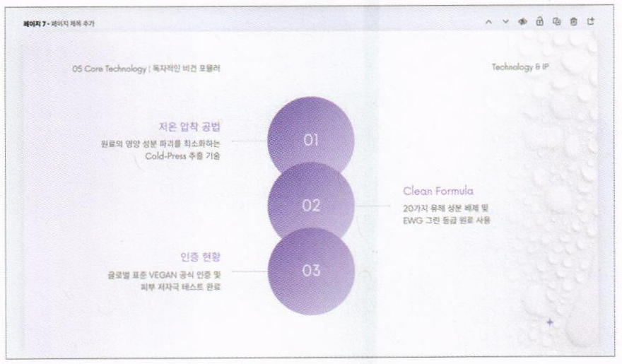

**2. 배경이 비치지 않는 그라데이션 노드 만들기**
투명도가 있는 도형 밑에 동일한 모양의 흰색 도형을 배치하면 배경색이 그대로 드러나는 걸 방지할 수 있습니다. 또한 이 둘을 그룹화해 두면 디자인 편집 시 이동하기 더 편리합니다.

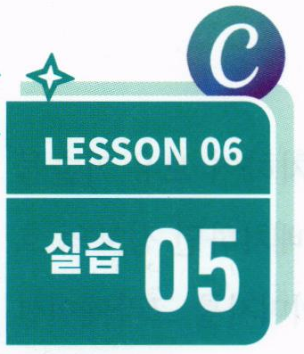

### 비즈니스의 미래를 설계하는 전략 로드맵 디자인: 브랜드 운영 전략 및 시장 확대 전략 모듈

**작업 사이즈** | 프레젠테이션 (1920 X 1080px, 16:9)
**디자인 포인트** |

- 단계별 컬러 명도 대비를 통한 시간 흐름의 시각화
- 원형 다이어그램과 화살표를 활용한 유기적 흐름도 구성
- 3단 그리드 시스템 기반의 마케팅 채널 균형 배분
- 직관적인 아이콘을 결합한 비즈니스 로드맵 설계

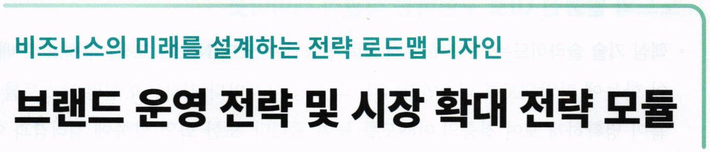

전략 슬라이드는 브랜드 운영의 전문성이 가장 강력하게 느껴져야 하는 구간입니다. 기업 고객은 단순히 화려한 디자인이 아니라 '실행 가능한 미래 가치’를 원하기 때문에, 브랜드의 전략을 효과적으로 시각화해야 합니다.

**1. 전략 진행 과정과 목표 달성 단계를 직관적으로 시각화한 레이아웃**

- 브랜드 운영 전략 슬라이드에는 콘텐츠, 캠페인, 커뮤니티 등 각 채널별 마케팅 방안을 3단 구성으로 배치합니다. 또한 원형 다이어그램과 화살표 요소를 활용하여 개별 전략이 어떻게 목표 달성으로 수렴되는지를 유기적인 흐름으로 보여 줍니다.
- 시장 확대 전략 슬라이드에는 단계별로 명도와 채도가 점진적으로 높아지는 컬러 블록을 활용합니다. 이는 단순한 색상 변화를 넘어 사업 규모의 확장과 시간의 흐름을 시각적으로 암시하여 청중에게 비즈니스 성장 로드맵을 명확히 각인시킵니다.

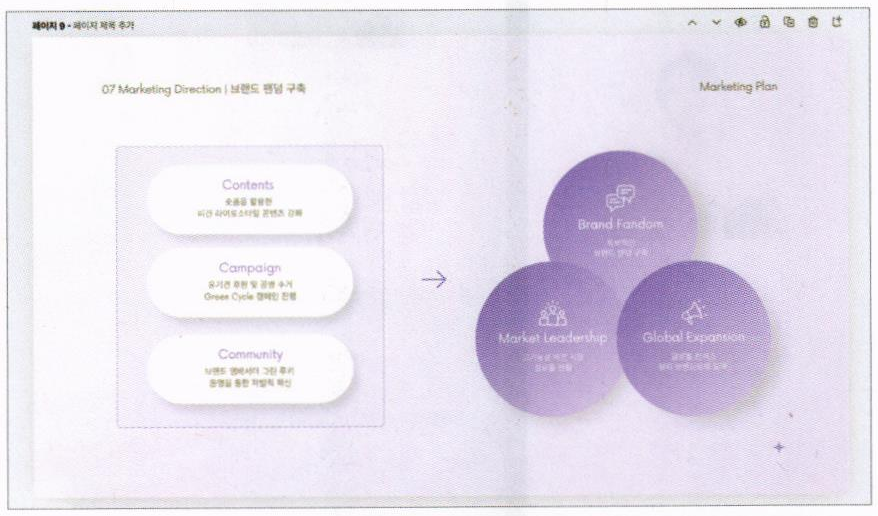

**2. 효과적인 시각화 장치, 아이콘 요소와 애니메이션 기능**
운영 전략과 각 단계(Phase)별 핵심 목표를 아이콘(set:nAFBrlpsa08)과 함께 배치하여 텍스트의 가독성을 높여 주세요. 또한 애니메이션을 활용해 전략들이 순차적으로 나타나도록 하여, 브랜드가 시장 점유율을 확대해 나가는 과정을 역동적으로 보여 줍니다.

- [애니메이션] - [프레젠테이션 설정] - [클릭 시 표시] 토글을 켜면, 발표 흐름에 맞춰 요소가 클릭할 때마다 순서대로 나타나게 할 수 있습니다.
- [클릭하여 정렬]에서 표시 순서를 바꿔 두면 발표자의 설명 순서와 화면 전개를 자연스럽게 맞출 수 있습니다.

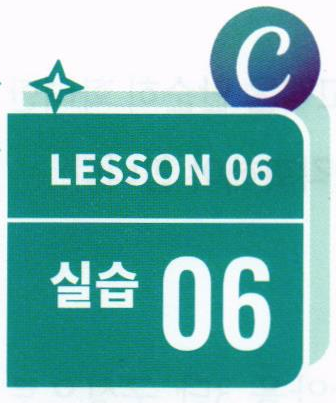

### 신뢰를 완성하는 소개와 마무리 디자인: 팀원 및 클로징 모듈

**작업 사이즈** | 프레젠테이션 (1920 X 1080px, 16:9)
**디자인 포인트** |

- 아치형 프레임을 활용한 인물 사진의 시각적 통일성
- 세리프체 타이포그래피를 활용한 감성적인 클로징
- 정보의 구획화를 통한 비즈니스 연락처 가독성 확보
- 사용자 친화적인 프레임 요소를 통한 수정 용이성 극대화

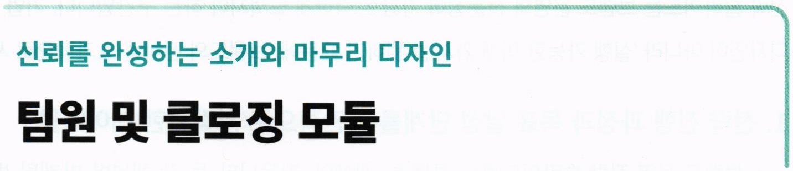

팀 소개와 클로징 슬라이드는 브랜드의 전문성을 완성하고 청중의 신뢰를 확정 짓는 구간입니다. 마지막 한 장까지 톤앤매너를 유지하며 완성도 높게 마무리하는 전략적 디자인 노하우를 알아볼게요.

**1. 시선의 집중과 깔끔한 여운을 남기는 레이아웃 구조**

- 팀 프로필 슬라이드는 인물 사진을 아치형 프레임에 배치하여 뷰티 브랜드 특유의 부드럽고 세련된 이미지를 전달합니다. 배경을 단순화하고 인물의 시선이 중앙을 향하는 사진을 사용해 청중들이 브랜드의 핵심 인력에게 자연스럽게 집중할 수 있는 구조를 만듭니다.
- 클로징 슬라이드에서는 감사인사 문구를 우아한 세리프체에 [기울임꼴]을 사용하여 중앙에 배치해 여운을 남깁니다. 또한 표지와 동일한 배경 이미지를 반투명하게 배치해 일관성을 갖춥니다. 마지막으로 웹사이트, 이메일, 소셜 채널 등 연락처 정보를 좌측 하단에 일목요연하게 정렬하여 한눈에 들어오게 합니다.

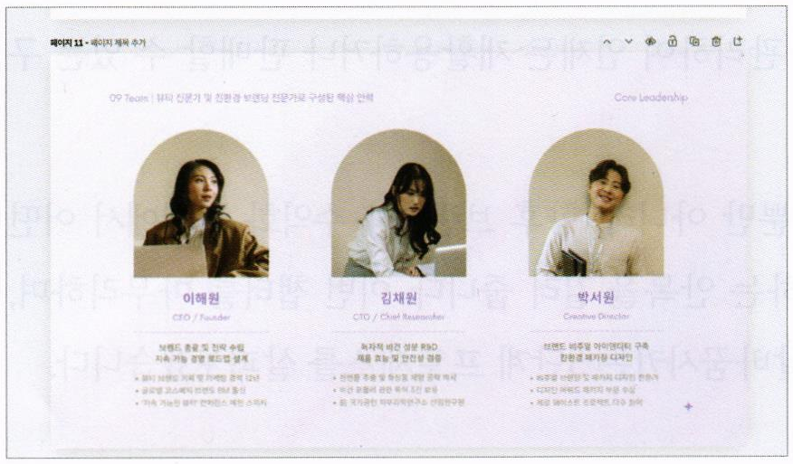

프레젠테이션 디자인은 상단 메뉴 - [프레젠테이션] - [전체 화면 프레젠테이션]으로 실행해 마지막 흐름을 꼭 확인해 보세요. 전체 페이지 전환이 자연스러운지, 애니메이션이 의도한 순서대로 작동하는지까지 검수하면 완성도를 높일 수 있습니다.

---

## 디자인 자산 관리와 상품화 노하우

디자인의 완성은 제작이 아닌 정리에서 결정됩니다. 정성껏 만든 작업물을 습작으로 남겨 두지 마세요. 단계별 프로세스를 살펴보며 디자인 결과물을 수익과 직결되는 나만의 강력한 비즈니스 무기로 전환하는 법을 익혀 봅니다.

이번 레슨은 나의 디자인들을 수익화가 가능한 ‘자산’으로 구축하는 단계입니다. 프로 디자이너는 디자인을 만드는 데서 멈추지 않고, 결과물을 체계적으로 관리하여 언제든 재활용하거나 판매할 수 있는 구조를 설계합니다.

체계적인 관리 구조와 습관은 작업 효율을 높여 줄 뿐만 아니라, 향후 브랜딩과 수익화 과정에서 어떤 디자인이 시장에서 가치를 인정받을 수 있는지 판단하는 안목을 길러 줍니다. 이번 챕터를 마무리하며, 여러분의 노력이 담긴 작업물들을 프로의 자산으로 탈바꿈시키는 5단계 프로세스를 살펴보겠습니다.

### 1단계: 시리즈로 디자인 응용 및 확장하기

하나의 잘 만들어진 디자인(키 비주얼)을 다양한 채널과 포맷으로 확장하는 연습은 수익화의 핵심입니다. 고객은 단일 게시물이 아닌, 통일감 있는 ‘패키지’를 원하기 때문입니다.

1. **키 비주얼(Key Visual) 확립**: 메인 컬러, 폰트, 버튼 스타일 등 브랜드의 중심이 되는 요소를 하나로 정의합니다. 이 기준이 명확해야 모든 포맷에서 일관성이 유지됩니다.
2. **다중 포맷 확장 전략 예시**:

- **인스타그램 세트**: 피드 게시물(정보 전달)을 스토리(이벤트/참여)와 릴스 커버로 변주합니다.
- **마케팅 배너**: 핵심 슬로건과 행동 유도 버튼(CTA) 중심으로 정보를 압축하여 배너와 팝업으로 만듭니다.
- **피치 덱 표지 & 유튜브 섬네일**: 동일한 키 비주얼을 유지한 채 채널별 비율에 맞춰 요소의 위치만 재배치합니다.
- **비즈니스 패키지**: 홈페이지형 블로그, 유튜브 채널 아트 등 다양한 구성으로 비즈니스 패키지를 완성해 보세요.

3. **크기 조정 후 디테일 보정하는 습관**: 크기 조정 기능을 사용한 뒤에는 반드시 텍스트 간격이나 요소의 배치를 점검하고 조정하세요. 이 ‘마지막 한 끗’이 디자인의 완성도를 좌우합니다.

**수익화 관점의 인사이트 | 사용자 친화적 설계가 곧 경쟁력**
지속 가능한 수익을 위해서는 구매자가 사용하기 편해야 합니다. 특히 ‘누구나 쉽게 수정할 수 있는가’가 핵심입니다.

- 사진 영역은 반드시 ‘프레임’ 요소로 배치하세요. 구매자가 사진을 드래그 앤 드롭하는 것만으로 디자인 레이아웃을 해치지 않고 즉시 교체할 수 있어야 상품 가치가 높아집니다.
- 외부 유료 폰트나 복잡한 효과 대신 캔바의 기본 폰트와 기능을 최대한 활용하세요. 구매자가 텍스트만 바꿔도 원본의 세련미가 그대로 유지될 때 비로소 시장에서 ‘팔리는 템플릿’이 됩니다.

### 2단계: 파일명과 폴더 구조 체계화하기

파일이 쌓일수록 원하는 자료를 빠르게 찾는 능력이 생산성을 결정합니다. 따라서 직관적인 폴더 규칙을 만들어 관리하는 것이 좋습니다. 또한 시리즈로 반복 제작하는 디자인은 한 폴더 안에 모아 두거나 파일명에 공통 접두사를 붙여 검색이 쉽게 만들어 둡니다.

- **폴더 분류 규칙 예시**: `[번호_업종/페르소나]` - `[포맷명_버전]` 순으로 정리합니다.
- **적용 예시**: `[01_베이커리카페]` 폴더를 만들고, 그 안에 `[SNS_홍보]`, `[인쇄-포스터]`, `[상세페이지 3종]` 등으로 나누어 정리하면 나중에 외주 작업 요청이나 템플릿 업데이트 시 대응 속도가 압도적으로 빨라집니다.

캔바의 프로젝트와 폴더 기능은 단순 보관함이 아니라, ‘나중에 포트폴리오를 어떻게 보여 줄지, 어떤 템플릿을 어떻게 묶어서 팔지’까지 미리 설계하는 도구입니다.

- **브랜드 & 클라이언트 폴더**: 브랜드별 · 고객별로 하위 폴더를 만들어 정리합니다.
- **판매용 템플릿 폴더**: 플랫폼별 · 용도별로 하위 폴더를 나눕니다.
- **콘텐츠 & 마케팅 폴더**: 인스타그램/블로그/뉴스레터 콘텐츠를 모아 둡니다.
- **연습 & 실험실 폴더**: 새로운 색 조합, 레이아웃, AI 기능 실험 등을 자유롭게 시도합니다.

### 3단계: 템플릿 링크 생성과 파일명 설정하기

디자인을 상품으로 전달할 때는 캔바의 링크 기능을 정확히 이해하고, 구매자의 캔바 워크 스페이스에 내 디자인이 어떻게 저장될지를 세심하게 고려해야 합니다.

1. **템플릿 링크(Template Link) 활용**: 원본 파일을 직접 공유하면 타인이 내용을 수정했을 때 내 원본까지 바뀔 위험이 있습니다. 반드시 [공유] - [더 보기] - [템플릿 링크]를 생성하여 전달합니다. 구매자가 받은 템플릿 링크를 클릭하면 '사본’으로 열어 작업할 수 있습니다.
2. **구매자를 배려한 제목 짓기**: 템플릿 링크를 통해 디자인을 가져가면 구매자의 캔바 홈 화면에도 내가 설정한 파일 제목 그대로 저장됩니다. 완성형이 아닌 파일 제목은 전문성이 떨어져 보이고 관리가 힘듭니다.

- **안 좋은 예시**: `[최종_수정_인스타_01]`, `[copy_of_작업물]`
- **좋은 예시**: `[브랜드명_감성 카페 인스타그램 템플릿 10종_v1]`
  제목 앞에 자신의 브랜드명이나 프로젝트명을 붙여 주세요. 구매자가 나중에 수많은 템플릿 사이에서도 여러분의 상품을 쉽게 찾을 수 있어 브랜드 각인 효과와 재구매율을 높이는데 큰 도움이 됩니다.

### 4단계: 돋보이는 상품 이미지 만들기

상품 페이지에 디자인이 실제 비즈니스에 적용된 모습을 보여 주면 고객의 구매 결정을 촉진할 수 있습니다.

- **자연스럽고 명확한 이미지**: 깨끗한 배경에 템플릿 섬네일을 배치하고 자연스러운 그림자 효과를 주어 완성한 이미지는 디자인의 전문성을 더욱 돋보이게 합니다.
- **목업을 활용한 이미지**: 캔바의 [앱] 메뉴에서 목업 앱을 검색해 활용해 보세요. 스마트폰이나 노트북 화면 속에 내 디자인이 삽입된 이미지를 단 몇 초 만에 완성할 수 있습니다.

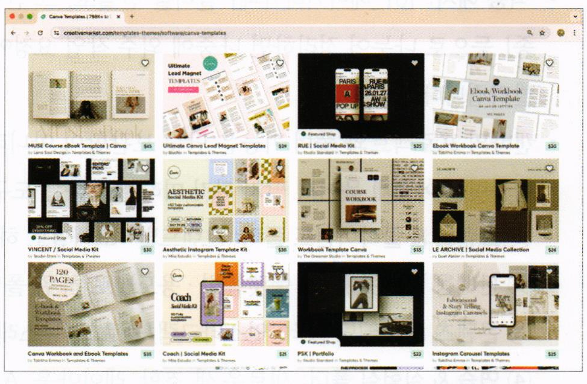

### 5단계: 상품 등록 전 마지막 점검하기

마지막까지 꼼꼼한 검수가 아마추어와 프로를 가릅니다. 특히 텍스트 깨짐 현상은 상품 신뢰도에 치명적이므로 반드시 확인해야 합니다.

1. **라이선스 및 저작권 확인**: 라이선스 및 저작권은 백번을 강조해도 부족한 중요 포인트이니 꼭 기억하세요. 사용된 폰트와 이미지가 상업적 이용에 문제가 없는지 재확인합니다. 특히 유료(Pro) 요소를 사용했다면, 구매자가 추가 비용을 지불하거나 캔바 Pro 구독자여야 한다고 상품 상세페이지에 명시해야 합니다.
2. **불필요한 레이어 및 요소 정리**: 작업 중에 투명도를 조절해 가려둔 개체, 페이지 밖으로 밀어 놓은 요소들을 정리합니다. 레이어 구성이 깔끔해야 구매자가 템플릿을 사용할 때 혼란을 겪지 않습니다. 특히 텍스트 레이어는 디자인 요소들 사이에 묻히면 클릭이 어려워지기 때문에, 항상 가장 위쪽에 배치해 두는 게 좋습니다.
3. **편집 제한 요소 해제 (잠금·숨김·그룹화)**: 작업 효율을 위해 설정했던 기능들을 구매자 입장에서 사용하기 편리하게 모두 정리해야 합니다.

- **숨김 · 잠금 해제**: 배경이나 특정 요소를 잠가 두었다면 모두 해제하세요. 구매자가 요소를 선택하거나 이동할 수 없어 당황할 수 있습니다. 숨김 처리된 페이지가 없는지도 꼭 체크합니다.
- **그룹화 최적화**: 너무 촘촘하게 묶인 그룹은 편집을 방해합니다. 꼭 필요한 묶음이 아니라면 그룹을 해제하거나, 직관적인 단위로만 묶어 두세요.

4. **플레이스 홀더(Placeholder) 최적화**: ‘홍길동’, ‘010-0000-0000’처럼 특정 개인의 정보가 담긴 샘플 데이터는 지우고, 구매자가 자신의 정보를 입력할 자리임을 직관적으로 알 수 있게 수정해 두세요. 구매자가 자신의 정보로 즉시 교체하기 쉽도록 명확한 가이드 텍스트(예: Your Brand)로 기재해 두는 것이 좋습니다.
5. **텍스트 깨짐(口 口현상) 주의**: 외부 서식 충돌로 글자가 사각형으로 깨질 수 있습니다. 100% 확대하여 검수하고, 모든 텍스트가 의도한 폰트로 올바르게 출력되는지 확인하세요.
6. **최종 검수 3계명**:

- **화면 확대 검수**: 작업 화면을 확대해 폰트 깨짐이나 오타가 없는지 꼼꼼히 훑어봅니다.
- **다운로드 파일 확인**: 직접 PDF나 이미지로 저장해 큰 화면에서 최종 결과물의 해상도를 점검합니다.
- **외부 링크 테스트**: ‘시크릿 모드’나 다른 계정으로 접속해 템플릿 링크가 정상적으로 작동하는지 최종 테스트합니다.

7. **고객 가이드 준비**:

- **고객 가이드 첨부하기**: 캔바가 익숙하지 않은 구매자가 당황하지 않도록 ‘폰트 변경법’, ‘사진 교체법’ 등 기초 사용법을 담은 1페이지 분량의 간이 가이드 파일(PDF)을 함께 제공하세요. 이는 고객 응대 시간을 획기적으로 줄여 줄 뿐만 아니라 상품의 사용성을 강화해 높은 평점을 얻는 비결입니다.
- **재구매를 부르는 브랜딩 장치 추가하기**: 가이드 하단이나 마지막 페이지에 내 브랜드를 각인시키는 문구와 소통 채널을 반드시 기재하세요.
- **SNS 링크 및 QR 코드**: 인스타그램, 블로그, 혹은 포트폴리오 사이트 링크를 넣어 구매자가 내 다른 작업물도 구경할 수 있게 유도하세요.
- **감사 메시지와 혜택**: ‘여러분의 비즈니스를 응원합니다’와 같은 따뜻한 한마디와 함께, 리뷰 작성 시 추가 템플릿 증정이나 재구매 할인 쿠폰 안내를 덧붙이면 자연스럽게 재방문을 촉진할 수 있습니다.

여기까지 모든 과정을 마치고 나면 여러분의 캔바 워크스페이스는 단순한 연습장이 아닌 수익을 만들어 내는 ‘디자인 자산 창고’로 변신합니다. 체계적으로 정리된 결과물들은 여러분의 전문성을 증명하는 강력한 포트폴리오가 되어 줄 거예요.

---

### CHAPTER 04 완주를 축하합니다!

이번 챕터를 통해 여러분은 단순히 기능을 익히는 단계를 넘어, 실제 비즈니스 현장에서 쓰이는 6가지 업종별 디자인 프로젝트 프로세스를 완벽하게 경험했습니다. 여기까지 달려 온 여러분의 워크스페이스에 쌓인 실습 결과물들은 여러분이 흘린 노력의 증거이자, 프로 디자이너로 거듭나기 위한 소중한 ‘연습장’입니다. 또한 여기서 꼭 기억해야 할 점이 있습니다. 책의 예제를 그대로 판매하거나 포트폴리오로 사용하는 것은 저작권을 위반하는 행위이므로 금물입니다. 이번 챕터의 진짜 목적은 예제를 복제하는 것이 아니라, 그 속에 담긴 ‘디자인 원리와 비즈니스 로직’을 여러분의 것으로 만드는 것임을 꼭 기억하세요.

이제 실습으로 다져진 기초 위에 여러분만의 독창적인 아이디어와 스타일을 더해 보세요. 컬러 하나, 폰트 하나를 바꿀 때마다 여러분의 감각은 한 뼘 더 성장할 것입니다. 그렇게 재탄생한 디자인만이 비로소 여러분의 진정한 자산이자, 앞으로 마주할 수익화의 길에서 가장 강력한 무기가 될 것입니다.

### CHAPTER 04 완주 체크리스트

챕터 04에서 배운 내용을 간단하게 확인해 볼까요?

- 디자인 기획의 3가지 핵심 질문을 토대로 기획 의도를 논리적으로 설명할 수 있어요.
- 폰트 라이선스, 인쇄 재단 물림 등 실무에서 반드시 지켜야 할 체크 포인트를 숙지했어요.
- 실습 예제를 나만의 컨셉과 컬러로 변형하여 새로운 시리즈로 확장해 보았어요.
- 템플릿 링크 생성과 플레이스 홀더 설정 등 구매자 친화적인 자산 관리 프로세스를 익혔어요.

---

### CHAPTER 05 예고 | 디자인 수익화 시작하기

지금까지 배운 내용이 시장이 원하는 디자인을 ‘만드는 역량’을 기르는 과정이었다면, 이어지는 챕터에서는 여러분이 직접 디자인한 독창적인 결과물들을 시장에 내놓고 현금화하는 구체적인 전략을 다룹니다. 템플릿 판매부터 외주 디자인 서비스, POD 굿즈 제작, 그리고 캔바 강의까지. 여러분의 성향과 목표에 맞는 최적의 파이프라인을 구축하고, 신뢰받는 디자이너로서 지속 가능한 성장을 이루는 실전 노하우를 아낌없이 공개합니다. 여러분의 디자인이 누군가의 문제를 해결하고, 나만의 고유한 브랜드로 성장하는 즐거운 여정을 시작해 봅시다.

그럼, CHAPTER 05 디자인 수익화 시작하기에서 만나요!

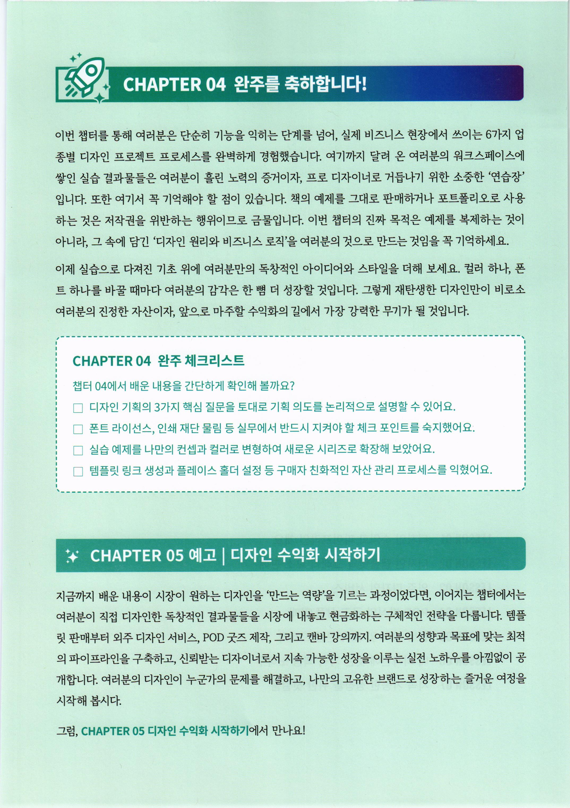
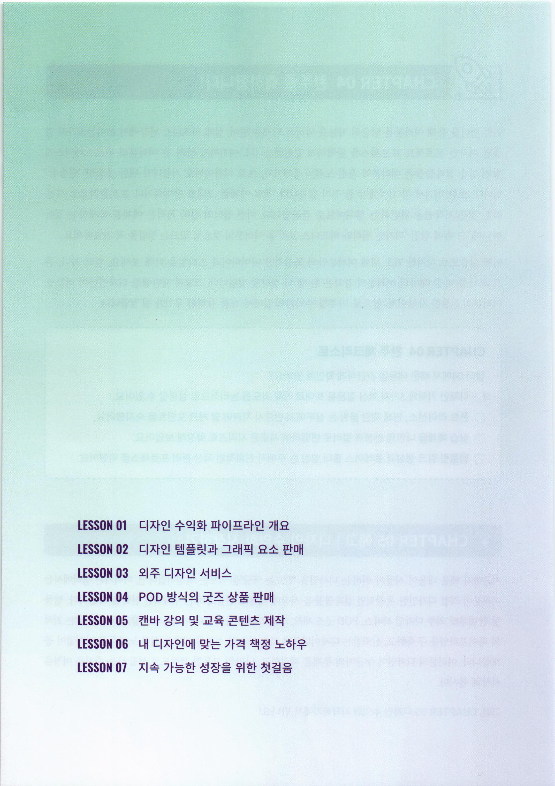

---

# CHAPTER 05 디자인 수익화 시작하기

**내가 만든 디자인을 세상에 내놓는 첫걸음**
내 디자인이 세상과 교환되는 방식을 이해하고, 지속 가능한 수익 구조를 현실적으로 그려 볼게요.

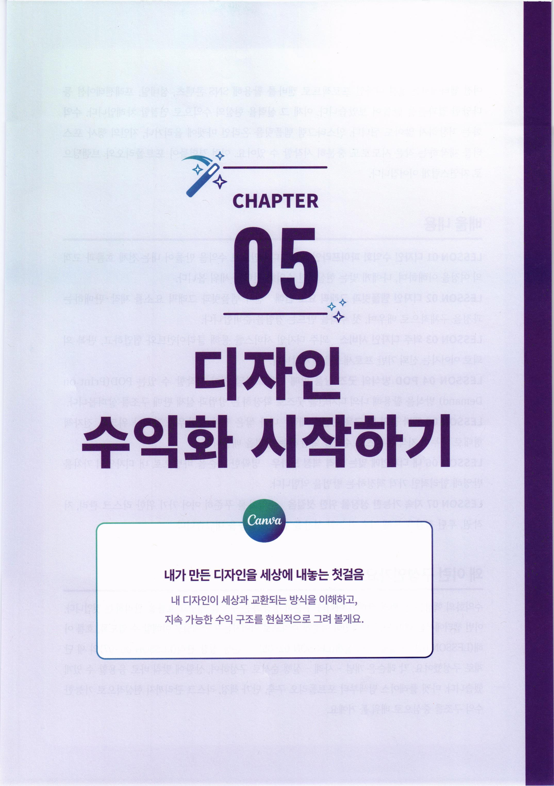

이전 챕터에서는 실전 디자인 프로젝트로 캔바를 활용해 SNS 콘텐츠, 섬네일, 프레젠테이션 등 다양한 결과물을 만들어 보았습니다. 이제 그 실력을 현실의 수익으로 연결할 차례입니다. 수익화는 거창하지 않아도 됩니다. 인스타그램 템플릿을 온라인 마켓에 올리거나, 지인의 행사 포스터를 제작하는 작은 시도로도 충분히 시작할 수 있어요. 이런 경험들이 포트폴리오와 브랜딩으로 자연스럽게 이어집니다.

### 배울 내용

- **LESSON 01 디자인 수익화 파이프라인 개요**: 디자인으로 수익을 만들어 내는 전체 흐름과 고객의 여정을 이해하며, 나에게 맞는 현실적인 수익화 전략을 세워 봅니다.
- **LESSON 02 디자인 템플릿과 그래픽 요소 판매**: 캔바 템플릿과 그래픽 요소를 제작·판매하는 과정을 구체적으로 배우며, 첫 수익을 만드는 경험을 준비합니다.
- **LESSON 03 외주 디자인 서비스**: 외주 디자인 서비스를 통해 클라이언트와 협업하고, 반복 의뢰로 이어지는 신뢰 기반 프로세스를 설계합니다.
- **LESSON 04 POD 방식의 굿즈 상품 판매**: 재고 부담 없이 시작할 수 있는 POD(Print on Demand) 방식을 활용해 나의 디자인을 굿즈로 확장하는 방법과 실제 판매 구조를 살펴봅니다.
- **LESSON 05 캔바 강의 및 교육 콘텐츠 제작**: 내가 쌓은 캔바 노하우를 강의나 워크북, 전자책 형태로 나누며 지식 콘텐츠로 수익을 확장하는 방법을 배웁니다.
- **LESSON 06 내 디자인에 맞는 가격 책정 노하우**: 명확한 기준을 바탕으로 내 디자인의 가치를 반영해 합리적인 가격 책정하는 방법을 익힙니다.
- **LESSON 07 지속 가능한 성장을 위한 첫걸음**: 수익화를 꾸준히 이어 가기 위한 리스크 관리, 저작권, 루틴 점검을 통해 지속 가능한 성장을 위한 첫걸음을 내딛습니다.

### 왜 이런 구성인가요?

수익화의 핵심은 한 번의 판매가 아니라 꾸준히 성장하는 구조를 세우고 흐름을 관리하는 것입니다. 이번 챕터에서는 내가 만든 디자인이 어떻게 수익으로 이어지는지 단계별로 이해할 수 있도록, 흐름 이해(LESSON 01) ➔ 실행 루트 설계(LESSON 02~05) ➔ 운영·성장 관리(LESSON 06~07)의 세 단계로 구성했어요. 각 레슨은 개념 - 사례 - 실행 순서로 구성하여, 상황에 맞춰 바로 응용할 수 있게 했습니다. 마켓 플레이스 탐색부터 포트폴리오 구축, 단가 책정, 리스크 관리까지 현실적으로 가능한 수익 구조를 중심으로 배워 볼 거예요.

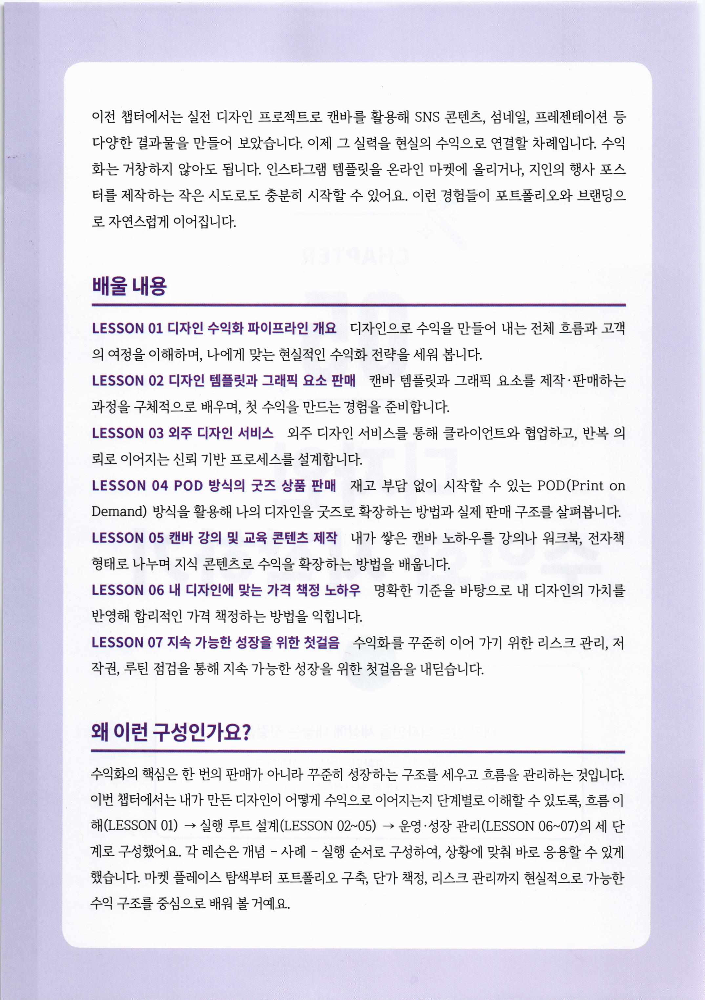

---

## 디자인 수익화 파이프라인 개요

디자인 수익화는 ‘무엇을 팔까’ 외에 ‘어떻게 흘러가는가’를 이해하는 것도 중요해요. 캔바 생태계를 중심으로 네 가지 수익 루트와 세일즈 퍼널 구조를 살펴보며, 내 디자인이 돈으로 연결되는 전체 그림을 그려 봅니다.

### 디자인 수익화, 어떻게 시작할까?

디자인 수익화는 단순히 디자인을 팔아서 돈을 버는 일이 아닙니다. 지속 가능한 수익을 만들려면 콘텐츠 비즈니스의 흐름을 이해해야 해요. 건물을 지을 때 기초 공사가 중요하듯, 수익화에도 단계와 순서가 있습니다. 보통은 완벽한 작품을 만들어야 팔 수 있다고 생각하지만, 실제로는 작게 시작해 시장의 반응을 관찰하고, 피드백을 반영하며 개선해 나가는 과정이 훨씬 효과적이에요.

이 과정에서 중요한 것은 ‘무엇을 팔까’보다 ‘어떻게 흘러가는가’입니다. 상품이 세상에 도달해 수익으로 이어지는 과정을 세일즈 퍼널(Sales Funnel)이라고 부릅니다. 고객은 나의 상품(디자인 및 서비스)을 발견 ➔ 관심 ➔ 구매 ➔ 재방문/추천의 순서로 경험하죠.

이 여정을 이해하면, 단순 판매자가 아니라 콘텐츠와 관계를 설계하는 디자이너가 될 수 있습니다. 수익화는 완성의 결과가 아니라, 시도-반응-개선의 반복 구조예요. 그 구조를 설계하는 순간부터, 당신의 디자인은 하나의 상품이 됩니다.

### 세일즈 퍼널과 수익화 단계의 연결

고객의 여정(세일즈 퍼널)과 나의 여정(수익화 단계)은 서로 맞물린 구조예요. 수익화 단계로 퍼널을 설계하면, 고객은 이 퍼널의 여정을 경험하며 내 브랜드를 인식하게 됩니다. 내 상품(디자인 및 서비스)이 고객에게 발견되고, 신뢰와 재구매로 이어지는 과정을 다음 표로 살펴볼게요.

| 고객의 여정 (세일즈 퍼널)     | 고객의 여정 내용             | 나의 여정 (수익화 단계)                            | 연결 포인트                                              |
| ----------------------------- | ---------------------------- | -------------------------------------------------- | -------------------------------------------------------- |
| **1. 발견(Discovery)**        | 고객이 내 상품을 처음 발견   | 입문 · 실험 단계 - 포트폴리오를 만들고 공개하기    | 고객에게 보일 첫 진입점을 만드는 과정                    |
| **2. 관심(Interest)**         | 고객이 내 상품에 호감을 느낌 | 탐색 · 판매 단계 - 노출과 반응 관찰하기            | 반응을 보고 수요가 어디에 있는지 학습                    |
| **3. 구매(Conversion)**       | 고객이 실제 구매 · 의뢰를 함 | 성장 · 브랜드화 단계 - 상품화와 브랜드 체계 만들기 | 고객이 ‘이 사람의 상품을 신뢰할 수 있다’고 판단하는 구간 |
| **4. 재방문/추천(Retention)** | 고객이 재구매하거나 추천     | 안정 · 자동화 단계 - 수익 구조 다각화하기          | 신뢰를 기반으로 장기적 수익 구조 완성                    |

한 문장으로 정리하자면 나의 수익화 단계는 퍼널을 설계하는 과정이고, 고객의 여정은 그 퍼널 안에서 움직이는 발자취입니다.

### 디자인 수익화의 4단계 여정

앞서 살펴본 퍼널 구조가 고객과 나의 여정을 보여 줬다면, 이제는 내가 이 퍼널을 어떻게 설계하여 성장할지 봐야겠죠. 디자인 수익화의 흐름은 실험 ➔ 판매 ➔ 브랜드화 ➔ 자동화, 즉 입문 - 탐색 - 성장 - 안정의 네 단계로 이어집니다. 각 단계는 일회적 결과가 아니라, 시장과의 대화 속에서 계속 순환하며 발전하는 과정이에요.

**1단계. 입문 · 실험 - 포트폴리오 만들고 공개하기**
이 단계의 목표는 ‘보이는 나를 만드는 것’이에요. 아직은 판매보다 보여 주는 연습이 먼저예요. 나만의 스타일이 담긴 디자인을 SNS나 웹사이트에 꾸준히 올리며 반응을 관찰해 보세요. 좋아요, 저장, 댓글 같은 작은 데이터들을 살펴보는 것이 바로 시장 조사입니다. 누군가 내 작업을 기억하기 시작할 때, 다음 단계로 넘어갈 준비가 된 거예요.

- **핵심 질문**:
- 나는 어떤 스타일의 디자인을 가장 잘 만드는가?
- 사람들은 내 디자인 중 어떤 것을 가장 좋아하는가?
- 내가 즐겁게 계속 만들 수 있는 디자인은 무엇인가?

**2단계. 탐색 · 판매 - 노출과 반응 관찰하기**
이제 반응을 관찰하며 시장 언어를 배우는 시기입니다. 포트폴리오가 어느 정도 쌓였다면 디지털 마켓에 템플릿을 올리거나, 무료 리소스로 배포해 실제 사용자의 피드백을 확인해 보세요. 완벽한 상품을 만들려 하기보다 빠른 시도와 데이터 수집이 핵심이에요. 이 단계의 목적은 판매보다 무엇이 통하는가를 배우는 것입니다. 실패도 중요한 자산이라는 것을 기억하세요. 반응이 없다는 것도 하나의 데이터이니까요.

- **핵심 질문**:
- 내 디자인을 실제로 돈을 내고 사는 사람이 있는가?
- 사람들은 어떤 부분을 가장 마음에 들어 하는가?
- 어떤 플랫폼에서 내 상품이 가장 잘 팔리는가?

**3단계. 성장 · 브랜드화 - 상품화와 브랜드 체계 만들기**
이 단계의 핵심은 반복되는 수요를 구조로 전환하는 것이에요. 시장의 반응이 좋은 상품을 중심으로 라인업을 만들고, 시리즈 · 패키지 · 정가 구독 같은 구조로 발전시켜 보세요. ‘이 사람의 상품은 믿고 산다’는 인식을 만드는 것이 중요합니다. 브랜드 계정을 운영하고, 일관된 시각 언어를 유지하세요. 고객은 이제 제품이 아니라 나의 감각과 신뢰를 구매하게 됩니다.

- **핵심 질문**:
- 내 상품의 핵심 가치는 무엇일까? (속도, 감각, 친근함 등)
- 내 상품에 단골 고객이 생기는 이유는 무엇일까?
- 나만의 차별화 포인트는 무엇인가?

**4단계. 안정 - 수익 구조 다각화하기**
이 시점의 목표는 시간을 투입하지 않아도 수익이 흐르는 구조를 만드는 것입니다. 이제 여러 수익 채널을 조합해 안정적인 시스템을 구축해 보세요. 캔바 템플릿, POD(인쇄 주문형 상품), 온라인 강의 등 다양한 루트를 활용하면 하나의 수익원이 줄어도 전체 수입은 유지됩니다. 자동화의 핵심은 내가 쉬어도 수익이 작동하는 구조를 만드는 거예요. 한 번 만든 템플릿이 꾸준히 팔리고, 녹화한 강의가 지속적으로 판매되는 시스템을 목표로 합니다.

- **핵심 질문**:
- 어떤 수익원이 가장 안정적인가?
- 시간 대비 수익이 가장 높은 채널은 어디인가?
- 내가 쉬는 동안에도 수익이 발생하도록 시스템을 만들 수 있을까?

> 완벽주의는 버리고 일단 시작해 보세요. 처음에는 ‘완벽한 상품’을 만들기보다 작게 시작해서 반응을 관찰하는 것이 중요합니다. 시장과 고객의 피드백이 다음 디자인 방향을 알려 줍니다. 실패는 배움의 기회예요. 첫 템플릿이 안 팔려도, 첫 제안이 거절당해도 괜찮습니다. 그 경험이 다음 시도를 더 나아지게 만들어 줄 테니까요.

### 디자인 수익화의 4가지 방법

이제 구체적으로 어떤 형태로 수익을 낼 수 있는지도 살펴볼까요? 나의 디자인 실력을 수익으로 연결하는 방법은 생각보다 다양해요. 각자의 성향과 목표에 따라 선택할 수 있는 주요 경로를 살펴볼게요.

| 수익화 유형                 | 특징                                                                                     |
| --------------------------- | ---------------------------------------------------------------------------------------- |
| **디지털 디자인 상품 판매** | 완성된 디자인 파일 자체를 상품으로 판매하는 방식(예: 캔바 템플릿, 그래픽 요소)           |
| **디자인 서비스 제공**      | 클라이언트의 요청에 따라 디자인 작업을 대행해 주는 방식(예: 로고, 명함, 상세페이지 제작) |
| **디자인 실물 상품 판매**   | 디자인을 실물 상품에 인쇄하여 제작 판매하는 방식(예: 머그컵, 배지, 패브릭 상품 등 굿즈)  |
| **교육 콘텐츠 판매**        | 디자인 노하우를 강의나 워크숍으로 만들어 판매하는 방식(예: 온라인 강의, 코칭, 전자책)    |

### 나에게 맞는 수익화 방법 찾기

다음 질문을 통해 나에게 가장 자연스러운 수익화 방법을 선택해 보세요.

- 정해진 시간 안에 작업하는 게 좋은가요, 자유롭게 하고 싶나요?
- 사람들과 소통하며 일하는 게 좋은가요, 혼자 몰입하는 게 좋은가요?
- 빠른 수익이 목표인가요, 장기적 자산을 쌓는 게 목표인가요?

당장 하나를 완벽히 정하지 않아도 괜찮아요, 작은 선택이 쌓여 나만의 수익 구조가 만들어집니다. 디자인 수익화의 핵심은 단순히 ‘팔기 위한 디자인’이 아니라 ‘살아 움직이는 구조’를 설계하는 일이에요. 내 상품이 세상과 교환되는 방식을 이해하고, 그 안에서 나만의 리듬으로 실험을 이어 가 보세요.

---

## 디자인 템플릿과 그래픽 요소 판매

한 번 만든 디자인이 오래 일하게 만드는 방법, 템플릿 판매입니다. 캔바를 활용해 개인 상점 · 마켓 플랫폼에서도 판매가 가능하며, 국내외 디지털 마켓을 통해 현실적인 첫 수익을 만들어 볼 수 있습니다.

### 수익을 만드는 가장 현실적인 시작점, 템플릿 판매

캔바 템플릿은 온라인 마켓에서 가장 인기 있는 디지털 상품 중 하나예요. 많은 사용자가 디자인에 투자할 시간은 부족하지만, 브랜드나 콘텐츠를 꾸며야 하죠. 그래서 완성된 템플릿을 구입해 바로 수정 · 활용하는 수요가 꾸준합니다. 사용자는 템플릿으로 자신의 브랜드를 빠르게 표현하고, 디자이너는 그 과정에서 지속적인 수익을 얻게 됩니다.

가장 큰 장점은 한 번 만들어 두면 계속 팔린다는 점이에요. 오늘 만든 템플릿이 몇 달 뒤에도 판매될 수 있죠. 처음에는 5~10개 정도의 소규모 템플릿 세트부터 시작해 시장 반응을 보며 구성과 스타일을 다듬어 보세요. 피드백이 쌓일수록 잘 팔리는 디자인의 패턴을 직접 익히게 됩니다.

### 무엇을 팔 수 있을까?

캔바로 제작 가능한 템플릿이라면 대부분 상품이 될 수 있습니다. 특히 사용 목적이 명확한 실용 디자인일수록 판매 가능성이 높아요. 잊지 말아야 할 점은 템플릿은 단순히 예쁜 디자인 파일이 아니라 ‘바로 사용할 수 있는 시스템’이어야 한다는 것이에요. 템플릿의 본질은 사용자 친화성이에요. 화려함보다 ‘누구나 쉽게 수정할 수 있는 구조’의 템플릿이 잘 팔립니다.

| 구분                   | 판매 가능한 유형                  | 예시                               |
| ---------------------- | --------------------------------- | ---------------------------------- |
| **콘텐츠 템플릿**      | SNS 포스트, 카드뉴스, 섬네일      | 인스타그램 피드 30종 세트          |
| **브랜딩 템플릿**      | 로고, 명함, 제안서, 브랜드 키트   | 스타트업 브랜딩 키트               |
| **비즈니스 문서**      | 리포트, 견적서, 프레젠테이션      | 마케팅 보고서 템플릿               |
| **이벤트·생활 디자인** | 초대장, 플래너, 캘린더, 교회 주보 | 결혼식 초대장(청첩장), 감성 플래너 |

### 어디서 팔 수 있을까?

템플릿 같은 디지털 디자인 상품은 국내 · 해외의 다양한 온라인 판매 플랫폼에 입점해서 판매할 수 있습니다. 국내 플랫폼과 해외 플랫폼은 각자의 장단점을 가지고 있어요. 처음이라면 국내 마켓에서 운영 방식을 익히고, 점차 영어 설명을 추가해 해외 시장으로 확장하는 걸 추천합니다.

**국내 플랫폼**
고객 응대 정산이 빠르고 원화 결제라 진입 부담이 적습니다. 대신 수수료가 높고 시장 규모가 해외보다 상대적으로 작을 수 있어요.

| 플랫폼                  | 특징                                                                    |
| ----------------------- | ----------------------------------------------------------------------- |
| **크몽**                | 국내 최대 재능 마켓. 수수료(약 20%)가 있지만 첫 판매에 유리             |
| **탈잉**                | 강의 콘텐츠 중심이지만 워크시트 · 플래너 등 판매 가능. 사업자 등록 필수 |
| **숨고**                | 마켓을 통해 디자인 템플릿이나 굿즈 등 판매 가능                         |
| **네이버 스마트스토어** | 나만의 상점을 운영하며 PDF · ZIP 템플릿 판매 가능                       |
| **아이디어스**          | 감성형 디자인 시장. 초대장, 스티커 등 개인 브랜딩에 적합                |

**해외 플랫폼**
해외 플랫폼은 국내에 비해 시장이 크고 단가가 높은 편이라는 장점이 있어요. 대신 영어로 상품 설명을 구성해야 하고, 세금 및 저작권 규정을 꼼꼼하게 숙지해야 합니다.

| 플랫폼                                 | 특징                                               |
| -------------------------------------- | -------------------------------------------------- |
| **엣시(Etsy)**                         | 디지털 프린터블 초대장, 플래너 등 실용 디자인 강세 |
| **크리에이티브 마켓(Creative Market)** | 고품질 디자인 중심. 단가가 높지만 경쟁 치열        |
| **검로드(Gumroad)**                    | 수수료 낮음. 직접 판매 페이지 제작 가능            |

**캔바 크리에이터 프로그램**
캔바에는 ‘캔바 크리에이터(Canva Creator)’라는 공식 프로그램이 있습니다. 이 프로그램에 지원해 캔바의 승인을 받아 캔바 크리에이터로 선정되면, 내 디자인을 캔바 플랫폼에 업로드하고 전 세계 사용자에게 공개할 수 있어요. 내가 만든 템플릿이나 그래픽 요소가 사용될 때마다 로열티 수익이 자동 분배되는 구조로, 클라이언트의 요구나 마감 일정에 얽매이지 않고 창작 활동에만 집중할 수 있습니다. 업로드된 디자인은 24시간 전 세계에서 활용되므로, 말 그대로 ‘자는 동안에도 수익이 발생하는 구조’를 경험할 수 있죠. 또한 캔바 크리에이터 전용 커뮤니티에 참여해 협업 · 성장 · 교류의 기회도 얻을 수 있습니다.

2026년 2월 현재, 한국에서는 신규 모집이 중단되어 있는 상태지만, 언제든 재개될 가능성이 있습니다. 지금은 포트폴리오를 쌓으며 캔바 크리에이터로 준비하는 시기라고 생각해 보세요. 프로그램이 다시 열리면, 미리 만들어 둔 템플릿 포트폴리오가 가장 큰 자산이 될 거예요. 지원 창구는 여전히 열려 있으므로, 웹 포트폴리오를 정리해 지원서를 미리 제출해 두는 것도 좋습니다. 언제 캔바 크리에이터 프로그램이 재개되어 온보딩 알림 메일이 도착할지 모르니까요.

아래 QR 코드를 통해 공식 웹페이지에 방문해 보세요. 캔바 크리에이터 프로그램 안내와 지원서 제출 가이드라인을 확인한 뒤, 지원하기 페이지에서 ‘디자이너(Designer)’ 항목을 선택해 지원서를 작성해 제출하면 됩니다.

- **캔바 크리에이터 프로그램 정보**: `https://www.canva.com/ko_kr/help/canva-creators-program/`
- **지원서 제출 가이드**: `https://www.canva.com/design/DAGVqwizVi4/...` (원문 참조)
- **캔바 크리에이터 지원하기**: `https://www.canva.com/creators/apply`

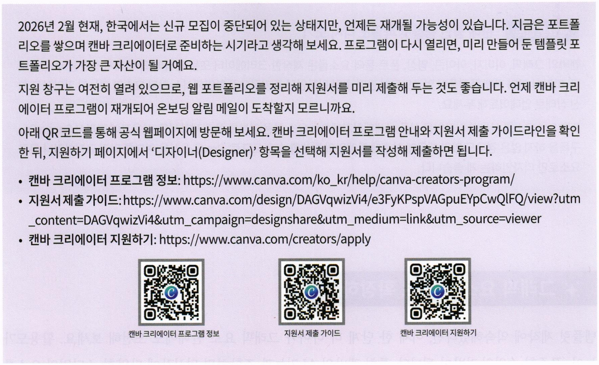

### 잘 팔리는 템플릿의 조건

인기 있는 디자인 템플릿에는 공통점이 있습니다. 무작정 예쁘기만 한 디자인보다는 실무에서 바로 쓸 수 있는 실용성이 중요해요.

1. **실무에 최적화된 디자인**: 너무 복잡하거나 개성이 강한 디자인은 오히려 범용성이 떨어집니다. 누군가의 업무나 일상에서 즉시 쓰일 수 있어야 해요.
2. **깔끔하고 가독성 좋은 디자인**: 정보가 명확하게 보이고 가독성이 좋은 레이아웃으로 디자인하세요.
3. **유연한 구조의 디자인**: 사용자가 자신의 용도에 맞게 템플릿의 색상, 폰트, 이미지를 쉽게 변경할 수 있도록 편집이 간편하도록 만들어야 만족도가 높습니다.
4. **차별화된 스타일**: 남들과 다른 나만의 감성이나 전문성을 담아 브랜딩하세요.
5. **시리즈 구성**: 업종이나 용도별로 연속성이 있는 템플릿을 세트화하면 신뢰도와 재구매율이 높아집니다.

> **판매 중인 템플릿 파일도 다시 보기**
> 캔바의 그래픽, 이미지, 아이콘, 영상, 폰트 등의 요소들은 제작한 크리에이터 또는 캔바에 의해 게시 중단될 수 있습니다. 따라서 이미 판매 플랫폼에 업로드되어 판매 중인 디자인도 주기적으로 확인해서 누락된 요소가 없는지 확인하고 최신 상태로 업데이트해 두세요.
> 또한 Pro 요소를 사용한 디자인은 상품 상세페이지에 Pro 요소 사용 여부를 꼭 기재하세요. 사용자에 따라서 Canva Pro 구독을 하지 않은 경우도 있기 때문에 차후에 클레임이 발생할 수 있으므로, Pro 요소 사용 여부를 미리 고지하거나 무료 요소로만 디자인하는 게 좋습니다.

### 그래픽 요소 판매로 확장하기

템플릿 제작에 익숙해졌다면, 이제 한 단계 더 나아가 그래픽 요소 판매에도 도전해 보세요. 활용도가 높아, 꾸준한 수익의 기반이 됩니다. 특히 캔바의 AI 기능과 조합하면 단시간에 다양한 스타일의 요소를 제작할 수 있어요.

**판매 가능한 그래픽 요소 유형**
그래픽 요소는 디자인의 재료 역할을 하기 때문에 꾸준히 팔리는 롱테일 상품으로 성장할 가능성이 높아요.

| 구분                | 설명                            | 예시                          |
| ------------------- | ------------------------------- | ----------------------------- |
| **아이콘 세트**     | 라인형, 컬러형 등 콘셉트별 묶음 | SNS 아이콘, 비즈니스 아이콘   |
| **패턴·배경**       | 반복 가능한 패턴, 질감 이미지   | 파스텔 패턴, 텍스처 배경      |
| **일러스트·스티커** | 감정 표현, 콘셉트형 삽화        | 고양이 스티커, 식물 삽화      |
| **사진·목업**       | 연출용 배경, 제품 이미지        | 명함 목업, 포스터 배경 이미지 |

**어디서 판매할 수 있을까?**
그래픽 요소 판매는 ‘나의 디자인 감각을 작게 쪼개서 꾸준히 수익화하는 일’이에요. 작은 아이콘 하나, 패턴 한 장이 당신의 브랜드 자산이 될 수 있어요.

| 플랫폼                                                                    | 특징                                                                                                                                                     |
| ------------------------------------------------------------------------- | -------------------------------------------------------------------------------------------------------------------------------------------------------- |
| **프린트리**                                                              | 국내 POD(Print On Demand) 플랫폼. 직접 만든 패턴을 원단이나 상품에 인쇄해 판매 가능. 캔바에서 만든 패턴 이미지를 등록하면, 구매 시 수수료를 받을 수 있음 |
| **미리캔버스 · 어도비 스톡 · 툴디**                                       | 직접 드로잉하거나 캔바 AI로 만든 이미지를 상업용으로 재가공해 판매 가능. 품질과 저작권 가이드를 꼼꼼히 확인해야 함                                       |
| **디자인 번들(Design Bundles) · 크리에이티브 패브리카(Creative Fabrica)** | 폰트, 템플릿, 그래픽 요소 등 디자인 번들 상품 전문 마켓플레이스. 여러 요소를 묶어 할인 판매하거나 시즌별 패키지로 구성해 수익을 높일 수 있음             |

**그래픽 요소 제작 및 판매 팁**

- 상업용 폰트 · 이미지를 포함하지 않고 저작권을 정확히 지켜야 해요.
- 배경을 투명으로 설정하고 PNG, SVG로 저장하면 활용도가 높아집니다.
- 색상 톤을 통일하여 일관성을 유지하면 완성도가 높아 보입니다.
- 파일명은 체계적으로 정리해 재활용하기 쉽게 하세요.

디자인 템플릿과 그래픽 요소 판매는 ‘한 번 만들어 둔 작업물로 여러 번 일하게 하는 구조’예요. 누군가에게는 단순한 파일이지만, 다른 누군가에게는 시간을 절약해 주는 해결책이 됩니다. 완벽한 상품보다 중요한 건, 꾸준히 만들고 업데이트하는 습관이에요. 처음엔 한두 개의 템플릿으로 시작하더라도 괜찮습니다. 그 과정에서 쌓이는 경험이 곧 당신의 브랜드가 되고, 언젠가 ‘내 디자인이 스스로 일하는 구조’를 직접 보게 될 거예요.
