# 6차시. 브랜드 정체성과 비주얼 시스템 구축

## 브랜딩, 디자이너의 생존 전략

브랜딩은 성공한 후에 하는 게 아니라, 성공하기 위해 하는 겁니다. 특히 혼자 일하는 1인 디자이너에게는 더욱 절실해요. 이 레슨을 마치면 ‘나에게 브랜딩이 왜 필요한가?’라는 질문에 스스로 답할 수 있을 거예요.

### 브랜드와 브랜딩, 뭐가 다를까?

브랜드(brand)와 브랜딩(branding), 이 둘은 비슷하게 들리지만 다른 개념입니다.

* **브랜드(brand)**는 결과입니다. 사람들의 마음속에 형성된 이미지, 느낌, 신뢰의 총합입니다. "애플" 하면 떠오르는 미니멀함, “나이키" 하면 느껴지는 도전정신, 그게 바로 브랜드예요.
* **브랜딩(branding)**은 과정입니다. 그 이미지를 의도적으로 만들고 관리하는 모든 활동이죠. 로고를 만들고, 색을 정하고, 스토리를 전하고, 일관되게 보여 주는 것. 브랜딩을 통해 브랜드가 만들어지는 거예요.

쉽게 말하면, 브랜드는 ‘나는 누구인가’이고, 브랜딩은 ‘나를 어떻게 보여 줄 것인가'예요. 결국 브랜딩은 자기 인식과 표현 전략이 결합된 창의적 과정인 것이죠.

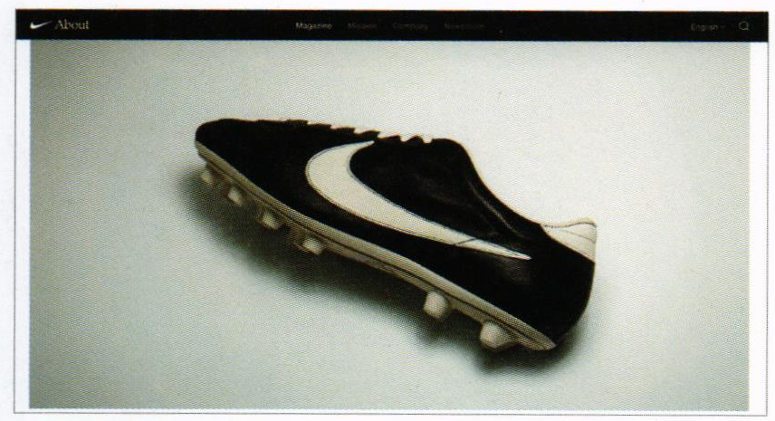
▲ 나이키의 브랜드와 브랜딩 1 *

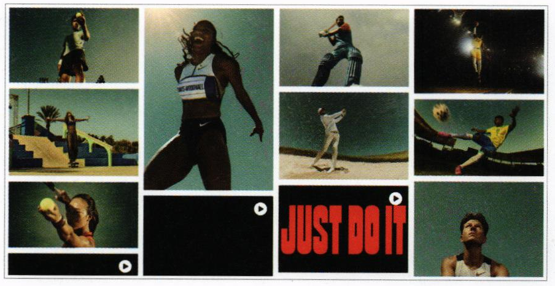
▲ 나이키의 브랜드와 브랜딩 2 * *

* . * * 이미지 출처: [www.nike.com](https://www.nike.com)

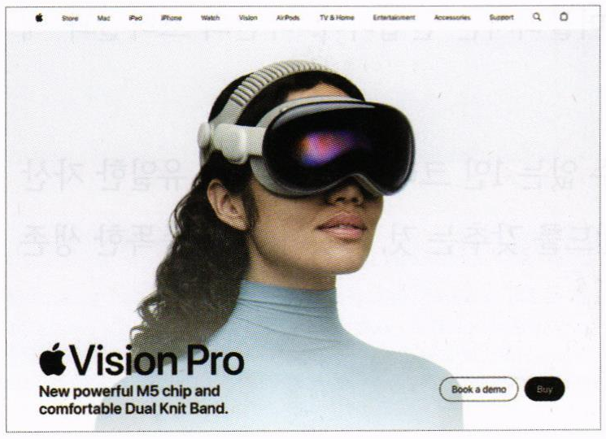
▲ 애플의 브랜드와 브랜딩 1 *

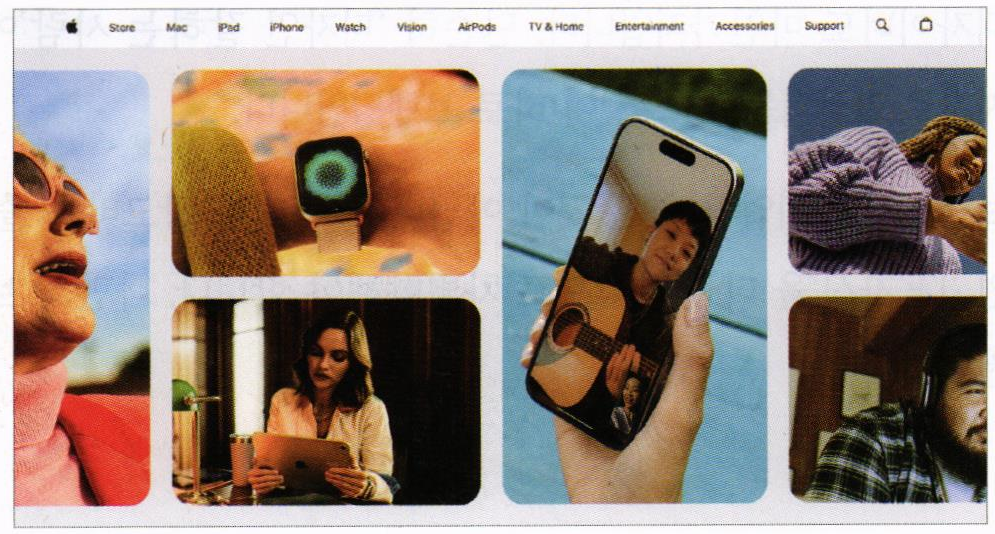
▲ 애플의 브랜드와 브랜딩 2 **

### 브랜딩은 '로고’가 아닌 ‘인식'

브랜딩의 본질은 로고나 색상을 넘어 ‘어떻게 기억될 것인가’라는 인식의 문제입니다. 즉, 수많은 브랜드 사이에서 내 브랜드를 각인시키는 차별화 전략이자, 고객이 나를 선택하게 만드는 강력한 힘입니다.

스타벅스를 떠올려 보세요. 수많은 카페 중 우리가 스타벅스를 기억하는 이유는 무엇일까요? 초록색 로고, 특유의 분위기, 그리고 스타벅스만의 ‘경험'이 다른 곳과 확실히 다르기 때문입니다.

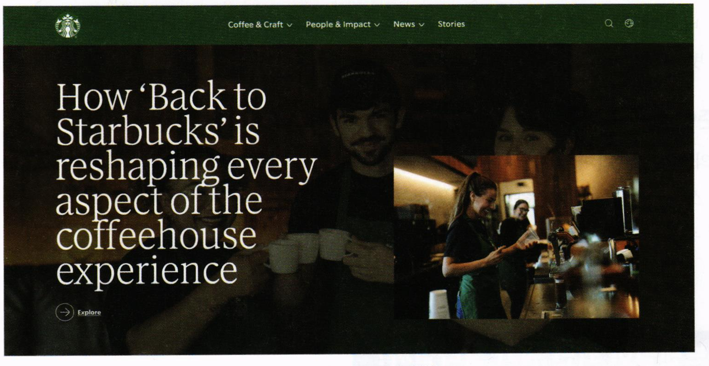
▲ 스타벅스의 브랜드 차별화 ***
*** 이미지 출처: [www.starbucks.com](https://www.starbucks.com)

디자이너도 마찬가지입니다. 단순히 ‘디자인 잘하는 사람’에 머물러서는 안됩니다. 나만의 스타일과 메시지로 기억되는 것, 그것이 바로 브랜딩입니다.

브랜딩은 대기업만 하는 것이 아닙니다. 막대한 광고비를 쓸 수 없는 1인 크리에이터일수록, 유일한 자산인 ‘나 자신’을 더 전략적으로 차별화해야 합니다. 나만의 브랜드를 갖추는 것, 그것이 가장 똑똑한 생존 전략입니다.

### 브랜딩 없이 시작한다면?

브랜딩이라는 명확한 기준 없이 무작정 시작하면 다음과 같은 한계에 부딪힙니다.

**1. 실력이 좋아도 기억되지 않는다**
열심히 작업물을 올려도 연락이 오지 않는다면, 고객의 머릿속에 다른 디자이너와 구분되어 ‘각인'되지 않았기 때문입니다. 시장에는 이미 디자인 잘하는 사람이 넘쳐납니다. 차별화된 인상을 남기지 못하면 선택의 순간에 결코 떠오를 수 없습니다.

**2. 가격으로만 평가받는다**
나만의 브랜드 가치가 모호하면 고객은 ‘가격'이라는 잣대로만 나를 판단합니다. 수많은 작업자 사이에서 견적 비교 대상이 되고, 결국 더 싼 곳으로 떠나는 고객을 잡지 못하게 됩니다. 브랜딩은 저가 경쟁의 늪에서 벗어나 내 가치를 제대로 인정받게 해주는 유일한 무기입니다.

**3. 기준이 없어 쉽게 지치고 흔들린다**
자기만의 브랜드 철학이 없으면 트렌드가 바뀔 때마다, 혹은 다른 사람의 성과를 볼 때마다 불안해집니다. “이 스타일이 맞나?” 고민하며 방향을 잃고 표류하다 결국 지쳐서 포기하게 됩니다. 브랜딩은 나답게 오래 갈 수 있도록 중심을 잡아 주는 나침반과 같습니다.

### 브랜딩이 되면 뭐가 달라질까?

앞에서 브랜딩의 개념과 필요성에 대해서 알아봤는데요. 그렇다면 브랜딩이 되어 있으면 뭐가 달라질까요?

**1. 고객이 먼저 찾아온다**
브랜딩이 없으면 끊임없이 고객을 찾아다니며 영업하고 자신을 증명해야 합니다. 하지만 나만의 차별화된 스타일이 구축되어 있다면 고객이 먼저 나를 발견하고 찾아옵니다.
예를 들어, 미니멀한 디자인을 선호하는 고객이 일관된 포트폴리오를 유지해 온 나를 발견한다면 "바로 이 사람이다!”라고 확신하며 연락하게 됩니다. 이렇게 찾아온 고객은 이미 내 스타일의 팬이기에 별도의 설득 과정이 필요 없습니다.
광고나 영업 없이도 내 브랜드의 명확한 색깔만으로 고객을 끌어당기는 힘, 이것이 바로 인바운드 마케팅(Inbound Marketing)이자 지속 가능한 비즈니스의 시작입니다.

**2. 가격이 아닌 가치로 선택받는다**
브랜딩이 없는 디자이너는 가격 흥정에 매달려야 하지만, 자신만의 색깔이 뚜렷한 디자이너는 ‘대체 불가능한 가치’를 제안하며 선택받습니다.
고객이 ‘‘반드시 이 사람이어야 한다"고 느끼는 순간, 가격은 더이상 1순위 고려 대상이 아닙니다. 고객은 차별화된 스타일에 기꺼이 정당한 비용을 지불합니다. 결국 높은 수익을 올리는 것은 결과일 뿐, 본질은 가격 비교의 늪에서 벗어나 나만의 가치로 인정받는 데 있습니다. 흔한 상품은 가격으로 비교당하지만, 고유한 브랜드는 가격을 넘어 가치로 평가받고 선택됩니다.

**3. 지속 가능한 성장이 가능하다**
브랜딩의 진정한 가치는 일회성 프로젝트를 넘어 지속 가능한 성장을 가능하게 한다는 점에 있습니다. 단순한 의뢰인은 작업이 끝나면 떠나지만, 브랜딩이 견고하면 고객은 내 브랜드의 ‘팬'이 됩니다. 팬이 된 고객은 나의 다음 작업을 기대하며 자발적으로 입소문을 내고, 새로운 프로젝트가 생길 때마다 나를 다시 찾습니다.
이러한 팬덤은 새로운 고객을 불러오고, 그들이 다시 팬이 되는 선순환 구조를 만듭니다. 나만의 고유한 스타일과 가치가 확실하다면 의뢰가 끊이지 않는 안정적인 수익 구조를 구축할 수 있습니다. 이것이 바로 브랜딩이 만드는 장기적이고 강력한 비즈니스의 힘입니다.

### 브랜딩, 지금 시작해야 하는 이유

브랜딩은 하루아침에 완성되지 않습니다. 사람들이 내 브랜드를 인식하고 신뢰를 쌓기까지는 절대적인 시간이 필요합니다. 지금 시작한다면 6개월 후에는 나를 기억하는 사람이 생기고, 1년 후에는 든든한 팬이 생길 것입니다. 하지만 지금 시작하지 않는다면 1년 후에도 여전히 ‘수많은 디자이너 중 한 명’으로 남게 됩니다.

또한, 브랜딩은 초기 방향 설정이 핵심입니다. 처음부터 일관된 메시지와 스타일로 포트폴리오를 쌓아가면 시간이 흐를수록 브랜드의 가치는 복리로 커집니다. 반면 방향 없이 작업물을 늘리다 나중에 브랜딩을 하려면, 뒤섞인 작업들을 정리하느라 훨씬 더 많은 비용과 시간을 소모하게 됩니다.

매일 새로운 디자이너가 쏟아지는 시장에서 지금 바로 나만의 포지션을 선점하세요. 완벽한 로고나 색상보다 중요한 것은 ‘나만의 생각과 가치’를 일관되게 쌓아가는 것입니다. 그것이 바로 시간이 지날수록 강력해지는 디자이너의 생존력입니다.

> **시작이 어려운 당신에게**
> 1. **완벽보다 ‘나다운 반복'이 우선입니다.**
> 완벽한 콘셉트를 찾기보다 내가 꾸준히 지속할 수 있는 톤앤매너를 정해 보세요. 브랜딩은 완성된 결과물이 아니라 최적의 방향을 찾아가는 과정입니다.
> 2. **남의 정답이 아닌 나의 자산을 믿으세요.**
> 타인의 브랜딩은 참고일 뿐입니다. 누구도 복제할 수 없는 나만의 경험과 취향이 가장 강력한 차별화 무기임을 기억하세요.
> 3. **작은 일관성부터 시스템화하세요.**
> 작은 일관성들이 모여 비로소 하나의 브랜드가 됩니다.
> 
> 
> * 모든 채널의 프로필 이미지 통일하기
> * 나만의 일관된 인사말 사용하기
> * 피드의 핵심 색감 톤 유지하기
> 
> 

---

## 나만의 브랜드 정체성 찾고 정리하기

레슨 01에서 우리는 브랜딩이 단순한 감각의 문제가 아니라 시스템으로 관리되는 과정이라는 걸 살펴봤어요. 이제 그 시스템의 중심인 나의 브랜드 정체성을 구체적으로 정의해 볼 차례입니다. 브랜딩의 출발점은 ‘나는 누구인가?'에 대한 답이에요. 이번 레슨에서는 브랜드의 철학과 미션, 말투와 분위기를 정리해 캔바의 브랜드 가이드라인의 ‘소개'와 ‘보이스’ 항목에 들어갈 초안을 만들어 볼 거예요.

### 브랜드 정체성은 왜 중요할까?

브랜딩은 ‘나는 누구인가?'라는 정체성을 찾는 질문에서 시작됩니다. 브랜드 정체성이 모호하면 방향을 잃기 쉽고, 결국 지치게 됩니다. 예를 들어 ‘로고, 포스터, 웹 디자인 다 가능해요.’라고 말하는 디자이너보다 ‘감성과 메시지를 시각화하는 브랜드 디자이너예요.’라고 말하는 디자이너가 훨씬 신뢰를 줍니다.

> "Everything for everyone is nothing for anyone."
> 모두를 위한 것은 결국 누구를 위한 것도 아니다.

내가 누구인지 발견하고 내 브랜드의 정체성을 정의한다는 것은 내 일을 어떻게 바라보고, 어떤 가치를 전하고 싶은지를 명확히 하는 일입니다. 이 기준이 생기면, 단순히 ‘디자인을 만들어 주는 사람’을 넘어 ‘브랜드를 함께 설계하는 파트너'로 성장할 수 있습니다. 한마디로 브랜드 정체성은 내 브랜드가 오래도록 단단하게 살아남을 수 있게 해주는 뿌리와도 같습니다.

### 글로 쓰는 브랜드의 나침반, 브랜드 선언문

브랜드 선언문은 ‘나는 누구이고, 누구를 위해, 어떤 가치를 전하는 사람인가?'를 한 문장으로 정리한 것입니다. 이 문장은 브랜드의 방향성을 알려주는 나침반 역할을 합니다. 디자인을 하거나, 고객과 소통하거나, 새로운 시도를 할 때마다 ‘이게 정말 나다운 것인가?'를 점검하게 도와줍니다.

또한 이 선언문은 ‘나다움’이 담긴 말로 정리된 브랜드 철학이기에 이후에 브랜드 비주얼 시스템을 구축할 때 로고·컬러·폰트 선택에서 의미와 메시지의 기준이 됩니다.
예를 들어, 선언문에서 느껴지는 분위기를 기반으로 톤에 맞는 폰트를 선택할 수 있고, 선언문에서 핵심 문장이나 말의 리듬, 어조 키워드를 추출해 브랜드 보이스로 삼을 수 있죠.

### 브랜드 선언문을 완성하는 4단계

브랜드 선언문은 한 번에 뚝딱 만들어지지 않습니다. ① 탐색 ➔ ② 압축 ➔ ③ 구체화 ➔ ④ 완성의 4단계를 거치며 완성됩니다. 형식보다는 진정성이 중요합니다. 완벽한 문장보다 ‘이게 나답다'고 느껴지는 문장을 완성하는 게 목표예요. 각 단계의 핵심 질문에 답하다 보면, 내가 어떤 사람이며 어떤 가치를 전달하고자 하는지 자연스럽게 드러납니다.

**1단계. 탐색하기 - 나는 어떤 디자이너인가?**
먼저 스스로에게 물어보세요.

* 디자인할 때 언제 가장 즐거운가?
* 사람들이 나를 찾는 이유는 무엇인가?
* 내가 디자인에서 가장 중요하게 여기는 원칙은?

이 질문들을 통해 내가 추구하는 가치와 표현의 패턴을 발견할 수 있습니다. 정답보다 반복해서 나타나는 스타일과 방향성을 찾아보세요. 그것이 바로 ‘나다움’의 씨앗이에요.

**2단계. 압축하기 - 나를 표현하는 키워드 3개 찾기**
탐색 결과에서 나타나는 공통된 감각과 인상을 세 단어로 정리해 보세요. 이 단어들은 앞으로 브랜드의 스타일, 말투, 색을 결정하는 기준이 됩니다.

* **예:** 따뜻한 / 명료한 / 신뢰감 있는

**3단계. 구체화하기 - 나는 누구와 일하는가?**
이제 나의 디자인이 진짜 닿아야 할 사람을 상상해 봅니다. 그 사람이 바로 나의 핵심 고객이에요.

* 어떤 사람과 일할 때 가장 즐거웠나요?
* 그 사람이 나와 일하면 어떤 변화를 경험할까요?

핵심 고객을 구체적으로 떠올릴수록, 나의 메시지와 브랜드의 방향이 명확해집니다.

**4단계. 정리하기 - 한 문장으로 정의하기**
이제 지금까지의 답을 한 문장으로 압축합니다.

* 나는 **[핵심 고객]**을 위한 **[스타일 키워드]** 디자이너입니다.
* **[차별화 포인트]** 때문에 고객들은 나를 선택합니다.

이 문장은 브랜드의 슬로건이자, 앞으로의 모든 디자인 의사 결정 기준이 됩니다.

다음은 위의 4단계 과정을 실제 선언문으로 정리한 예시입니다. 자신의 답변을 넣어 자연스럽게 변주해 보세요. 또한 브랜드 선언문을 작성할 때에는 이렇게 해보세요.

* 꾸미는 표현보다 본질에 집중합니다.
* 키워드 3개는 문장 속 형용사로 자연스럽게 녹여 보세요.
* 완벽하게 쓰려 하지 말고, 나중에 계속 다듬어도 됩니다.
* 말할 때 자연스러운 문장이 가장 강력한 브랜드 언어입니다.

| 단계 | 핵심 질문 | 예시 |
| --- | --- | --- |
| **1단계. 탐색하기** | 나는 어떤 디자이너인가? | '고객의 이야기를 듣고 정리하는 걸 좋아해요.' '복잡한 걸 명확하게 만드는 게 제 강점이에요.' |
| **2단계. 압축하기** | 나를 표현하는 3가지 키워드 | 따뜻한 · 명료한 · 신뢰감 있는 |
| **3단계. 구체화하기** | 나는 누구와 일하는가? | 처음 브랜드를 만드는 1인 창업자. 나만의 브랜드를 만들고 싶지만 어디서 시작할지 모르는 사람 |
| **4단계. 정리하기** | 한 문장으로 정의하기 | 나는 처음 브랜드를 만드는 사람을 위한 따뜻하고 명료한 디자이너입니다. 고객의 이야기를 정리해 시각화하기 때문에 나를 선택합니다. |

브랜드 선언문 실습안의 각 칸에 나만의 답을 넣어 브랜드 선언문을 완성해 보세요.

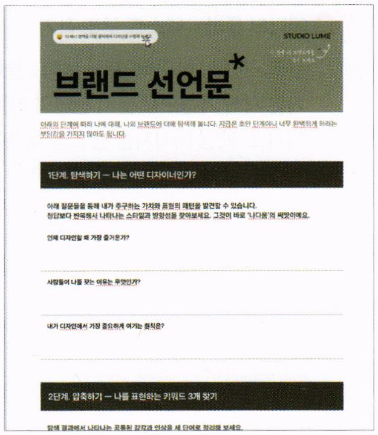
▲ 나만의 브랜드 선언문 작성

> **Docs 기능 간단히 짚어 보기**
> 캔바 Docs는 문서를 더 명확하고 보기 좋게 정리할 수 있는 비주얼 문서 도구입니다. 아래 기능 몇 가지만 알아 두어도 가독성 좋고 일관된 브랜드 문서를 쉽게 완성할 수 있습니다.
> **문서 작성에 도움이 되는 핵심 기능**
> * **[Magic Write] - 문장 초안 만들기 & 다듬기**
> 브랜드 핵심 문장, 설명 문구, 가이드라인 표기 등을 빠르게 정리할 때 유용합니다. "좀 더 명확하게", "친근한 어조로", "짧게 요약해줘" 같은 프롬프트를 활용해 문장을 다듬어 보세요. `/` 키를 누르거나 `+` 아이콘을 클릭하면 빠른 작업 창이 열리고, 드롭다운 메뉴에서 [Magic Write]를 클릭해 시작하세요.
> * **[Magic Switch] - 다양한 형식으로 자동 변환**
> 가이드라인 문서를 프레젠테이션, 블로그, 웹페이지 등으로 즉시 변환할 수 있어요. 브랜드 소개 자료나 고객 제안서 제작에도 활용 가능합니다. [Magic Switch] - [변환]을 선택 후 사용해 보세요.
> * **에디터 툴바 - 텍스트 구조 잡기**
> 글꼴, 정렬, 하이라이트, 단락, 들여쓰기, 내어쓰기 등 기본 서식 기능으로 문서 전체의 리듬과 정보 구조가 선명해져요. 핵심 메시지를 강조할 때 특히 유용합니다.
> 
> 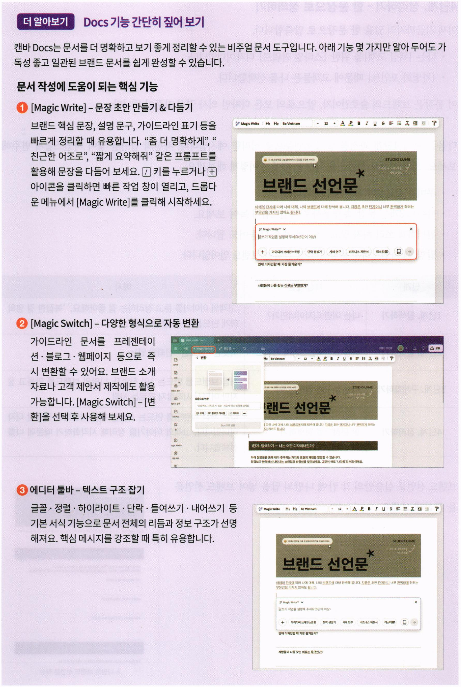
> * **빠른 작업 - 필수 블록을 즉시 삽입**
> Magic Write 기능부터 텍스트 스타일(굵게, 하이라이트, 들여쓰기), 인용문, 구분선, 리스트, 체크리스트, 표, 차트, 디자인 블록 삽입 등 자주 쓰는 편집 기능을 바로 실행할 수 있어 편리합니다. 가이드라인의 구성 요소를 깔끔하게 구분하는 데 적합합니다. `/` 키를 누르거나 `+` 아이콘을 클릭하면 빠른 작업 창이 열립니다.
> * **브랜드 센터 연동 - 시각적 통일성 유지의 핵심**
> 브랜드 로고, 색상, 글꼴 등 주요 브랜드 자산을 작업 영역에 불러와 바로 사용할 수 있어요. 브랜드 정체성을 시각과 언어로 일관되게 표현할 수 있게 도와주는 요긴한 기능이에요.
> 
> 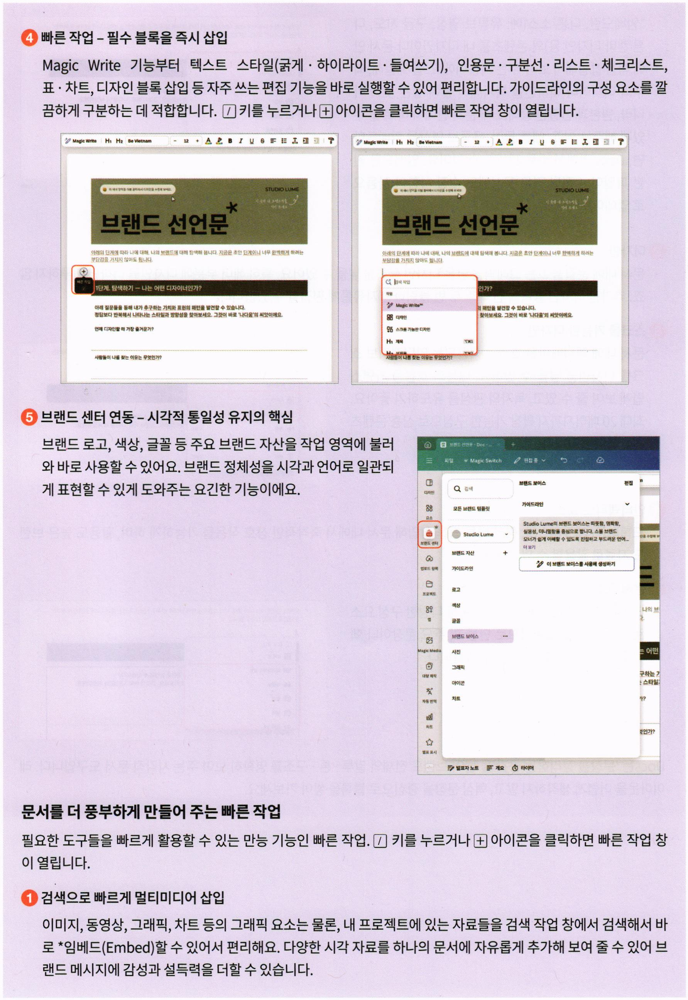
> 
> **문서를 더 풍부하게 만들어 주는 빠른 작업**
> 필요한 도구들을 빠르게 활용할 수 있는 만능 기능인 빠른 작업. `/` 키를 누르거나 `+` 아이콘을 클릭하면 빠른 작업 창이 열립니다.
> * **검색으로 빠르게 멀티미디어 삽입**
> 이미지, 동영상, 그래픽, 차트 등의 그래픽 요소는 물론, 내 프로젝트에 있는 자료들을 검색 작업 창에서 검색해서 바로 임베드할 수 있어서 편리해요. 다양한 시각 자료를 하나의 문서에 자유롭게 추가해 보여 줄 수 있어 브랜드 메시지에 감성과 설득력을 더할 수 있습니다.
> *(임베드란, 다른 소스의 콘텐츠를 내 디자인이나 문서 안에 직접 삽입해서 보여 주는 기능이에요. 외부의 미디어나 디자인을 복사해서 붙여 넣는 것이 아니라, 원본과 연결된 상태로 내 문서 안에서 바로 볼 수 있게 해주는 거죠. 원본 파일이 수정될 경우 문서에도 수정 사항이 자동으로 업데이트돼요.)*
> * **디자인**
> 문서 내에 눈길을 끄는 그래픽을 담은 디자인 블록을 넣을 수 있어요. 특히 헤더 부분에 디자인을 더하면 지루하지 않죠. 추가한 디자인 블록을 선택 후 두 번 클릭하면 자유롭게 편집할 수 있습니다.
> * **스크롤 가능한 디자인**
> 문서 내에 애니메이션 효과가 적용되는 인터랙티브 스크롤 디자인을 넣을 수 있어요. 내용의 흐름을 자연스럽게 보여 줄 수 있고, 독자의 관심을 유도하기 좋아요. 최대 20페이지까지 확장 가능한 구성으로 심층 콘텐츠 제작에 유용합니다.
> * **인터랙티브 요소**
> 드롭다운, 체크리스트, 링크 버튼 등을 삽입해 문서 내에서 즉각적인 상호 작용을 가능하게 하며, 활용도 높은 브랜드 자료로 활용할 수 있습니다.
> * **문서 요소**
> 하이라이트 블록, 날짜, 인용문, 표 등 다양한 구성 요소로 문서 구조를 체계적으로 만들고, 주요 문장이나 핵심 키워드를 돋보이게 해 줄 수 있습니다.
> 
> 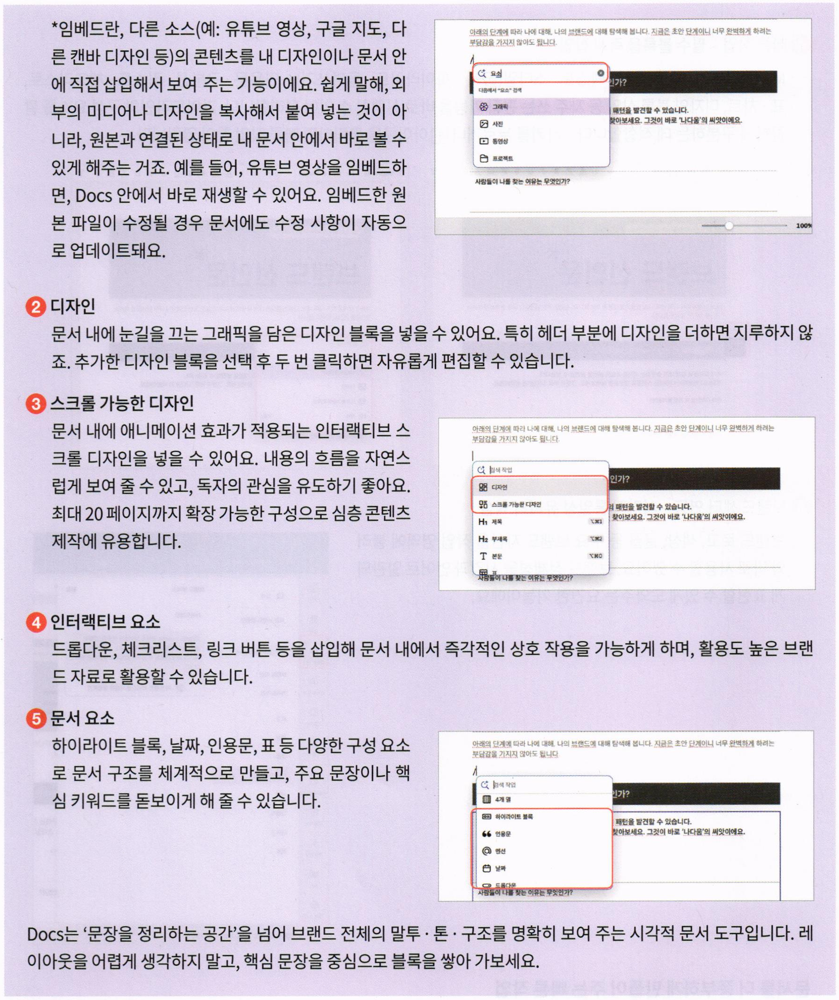
> 
> Docs는 ‘문장을 정리하는 공간’을 넘어 브랜드 전체의 말투·톤·구조를 명확히 보여 주는 시각적 문서 도구입니다. 레이아웃을 어렵게 생각하지 말고, 핵심 문장을 중심으로 블록을 쌓아 가보세요.

### 브랜드의 스타일 가이드, 브랜드 무드보드

브랜드 선언문에 정의한 나의 정체성을 시각적으로 구현해 볼 시간입니다. 브랜드 무드보드는 나의 철학, 취향, 라이프스타일을 이미지·색상·폰트로 정리한 보드입니다. 선언문이 브랜드의 언어라면, 무드보드는 그 언어를 눈에 보이게 해주는 시각적인 지도예요. 무드보드는 비주얼 시스템에서 색·형태·질감의 시각적 기준이 됩니다.

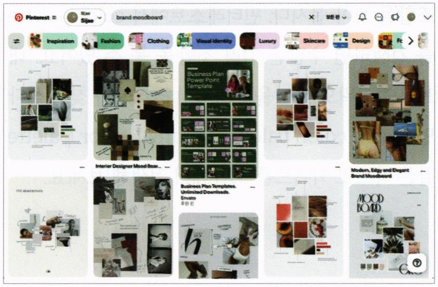
▲ 검색어 ‘brand moodboard’의 검색 결과

### 브랜드 무드보드의 핵심 요소

무드보드를 만들 때에는 아래 3가지 요소를 중심으로 수집합니다. 이 핵심 요소가 모두 모이면, 나의 브랜드가 어떤 느낌인지 자연스럽게 드러납니다.

**1. 컨셉 이미지: 브랜드의 인상을 표현하는 사진**
내 브랜드 키워드를 시각적으로 표현해 주는 사진들을 찾아 봅시다. 그래픽 디자인 영역에만 국한하지 말고 여러 카테고리의 이미지들을 두루 살펴보세요. 영화의 한 장면, 감각적인 인테리어, 아름다운 자연 풍경, 오래된 고전 소설 책 등 다양한 이미지에서 영감을 받을 수 있어요. 그리고 내 브랜드에 어울리는 질감과 패턴도 찾아 보세요. 거친 종이 질감, 부드러운 패브릭, 손그림 질감, 기하학 패턴 등 끌리는 질감과 패턴을 모아 두면 이후에 그래픽 모티브로 발전시킬 수 있습니다.

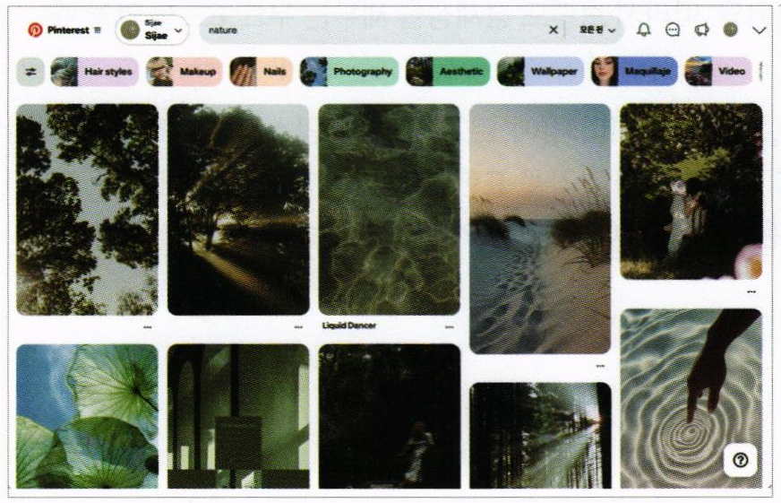
▲ 검색어 ‘nature’의 검색 결과 *

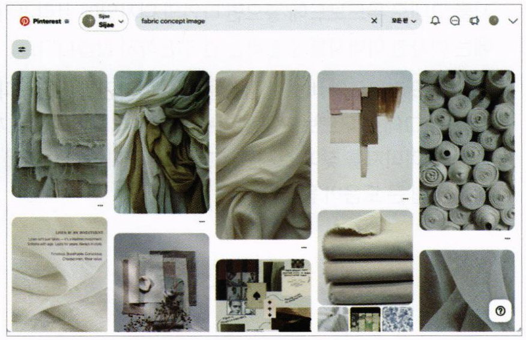
▲ 검색어 ‘fabric concept image’의 검색 결과 **

**2. 컬러 조합: 내 브랜드의 색상 팔레트**
내 브랜드를 잘 보여 줄 수 있는 단일 컬러나 컬러 조합을 모아 봅시다. 핀터레스트에서 color palette를 검색하면 수많은 컬러 조합을 볼 수 있어요. 내 브랜드 키워드와 어울리는 컬러 팔레트를 찾고 싶다면 warm color palette, minimal color palette 같은 식으로 키워드를 조합해서 검색해 보세요.

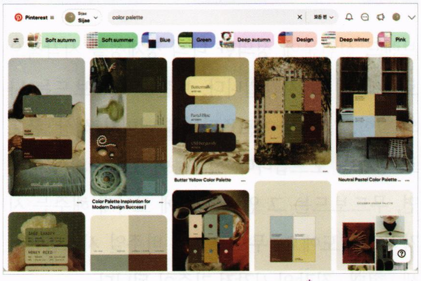
▲ 검색어 'color palette’의 검색 결과

**3. 폰트 스타일: 브랜드의 어조와 어울리는 타이포그래피**
마음에 드는 타이포그래피 이미지를 수집해 봅시다. 정확한 폰트 이름을 몰라도 괜찮습니다. 내 브랜드의 분위기를 담은 타이포그래피 이미지를 모아도 충분해요. 손글씨 느낌인지, 깔끔한 고딕체인지, 클래식한 명조체인지 등 선택한 폰트의 성격이 곧 브랜드 보이스가 됩니다.

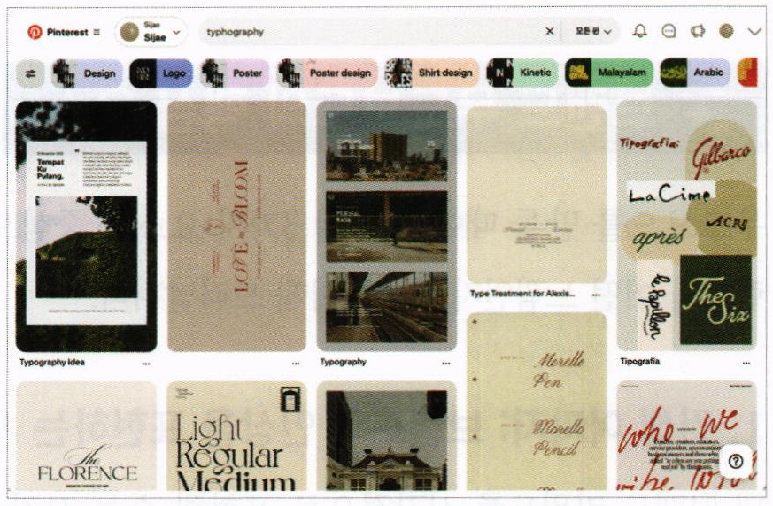
▲ 검색어 ‘typography’의 검색 결과 **

> **무드보드에 디자인 이미지를 수집하지 않는 이유**
> 좋아하는 로고, 포스터, 웹사이트 등 끌리는 그래픽 디자인에서도 충분히 영감을 받을 수 있습니다. 하지만 디자인 이미지를 그대로 무드보드에 넣으면 타인의 디자인에 끌려가기 쉬워요. 따라서 브랜드 정체성을 세우는 무드보드를 만들 때에는 디자인 이미지를 수집하는 건 추천하지 않습니다.
> 내 브랜드 키워드와 비슷한 감성을 가진 디자인을 발견했다면, 그 디자인 이미지(예: 로고, 포스터, 인스타그램 게시물 디자인)를 그대로 무드보드에 넣기보다는 그 디자인에서 느껴지는 분위기나 감각을 표현할 수 있는 자연물, 인테리어, 제품 등의 이미지를 찾아 보세요. 그러면 누군가에게 영향을 받은 정체성이 아닌, 원본으로서의 내 브랜드 정체성을 찾는 데에 훨씬 큰 도움이 됩니다.

### 브랜드 무드보드를 완성하는 4단계

무드보드는 단순히 예쁘고 감성적인 이미지 모음이 아니라, 나의 브랜드 정체성을 눈에 보이게 만드는 시각적 지도이자 스타일 가이드입니다. 캔바 검색 창에서 ‘무드보드 화이트 보드’로 검색해 마음에 드는 템플릿으로 작업을 시작하면 훨씬 수월할 거예요. 자료 웹사이트에 있는 실습안 템플릿도 사용해 보세요.

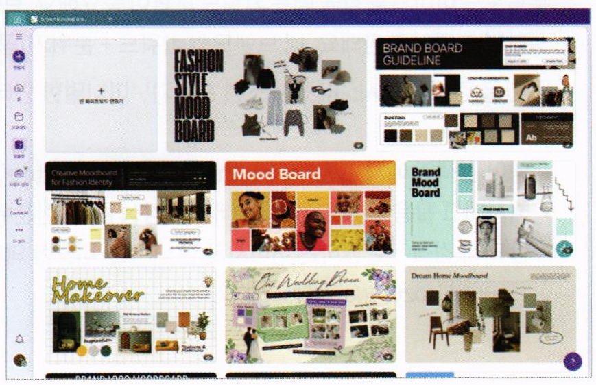
▲ 검색어 ‘brand moodboard', 카테고리 ‘화이트보드’의 검색 결과

**1단계. 영감 이미지 모으기**
SNS, 이미지 소스 사이트 또는 캔바에서 내 브랜드 키워드로 이미지를 검색해 모아 보세요.

* 컨셉 이미지(분위기/질감/패턴)를 15~20장 모아 보세요.
* 컬러 조합을 4~6개 모아 보세요.
* 폰트 스타일을 3~5개 모아 보세요.

처음부터 너무 완벽한 이미지를 찾으려 하지 않아도 됩니다. 처음에는 좋다는 느낌만으로도 충분합니다. 화이트보드에 비슷한 이미지끼리 자유롭게 배치하며 감각의 흐름을 만들어 보세요.

> **효과적인 이미지 탐색 노하우**
> **이미지 자료는 어디서 찾을까?**
> 1. **핀터레스트(Pinterest)**: 영감을 얻기 좋은 대표 플랫폼입니다. 내 브랜드 키워드를 중심으로 검색해 마음에 드는 이미지를 폴더에 저장하세요. 핀터레스트는 내가 저장한 이미지를 기반으로 비슷한 이미지를 자동 추천해 줘서 탐색이 편리합니다.
> 2. **인스타그램(Instagram)**: 해시태그를 활용하면 감각적인 이미지를 손쉽게 찾을 수 있습니다. 특히 스타일이 좋은 인플루언서의 UGC 게시물은 트렌드와 감성을 동시에 파악하기에 좋습니다.
> 3. **언스플래시(Unsplash) / 펙셀(Pexels)**: 무료로 고화질 사진을 찾을 수 있는 사이트입니다. 자연, 인테리어, 질감 등 브랜드 무드보드에 활용하기 좋은 이미지가 많고, 캔바의 요소 탭에서도 검색해서 바로 불러올 수 있어 별도의 다운로드 과정이 필요 없습니다.
> 
> 
> **이미지 검색 노하우**
> 무드보드 이미지를 찾을 때는 키워드 조합이 중요해요. 브랜드 키워드만 검색하면 너무 추상적이고, 구체적인 사물만 검색하면 느낌이 제한돼요. 내 브랜드의 키워드 + 분위기/공간/소재를 조합해서 검색해 보세요.
> * **한글 검색어 예시**: ‘따뜻한 조명 분위기', ‘미니멀한 인테리어', ‘자연스럽게 반짝이는 물의 질감’, ‘베이지톤의 린넨 패브릭'
> * **영어 검색어 예시**: ‘warm aesthetic', 'earthy texture', 'cozy interior', 'minimal space'
> * **해시태그 활용 (Instagram)**: #베이지감성 #따뜻한분위기 #미니멀인테리어 #colorpalette #moodboard
> * 한 가지 검색어로 원하는 이미지가 안 나오면, 비슷한 의미의 다른 단어로 바꿔서 검색해 보세요. ‘따뜻한' 대신 ‘아늑한', ‘포근한', ‘Cozy’, ‘Warm' 등으로요.
> 
> 

**2단계. 공통점 찾아내기**
화이트보드에 모은 이미지를 전체적으로 살펴보며 반복되는 컬러, 형태, 분위기를 관찰해 봅니다.

* **관찰 포인트**
* 어떤 색이 자주 보이는가?
* 둥근 형태 vs 각진 형태 중 어떤 게 많은가?
* 따뜻함, 차가움 등 분위기는 어떠한가?
* 여백이 많은가, 가득 차 있는가?

캔바의 스티커 메모 기능을 활용해 발견한 공통점을 이미지 옆에 바로 기록해 두세요.

* **예:** 베이지톤+브라운톤 반복, 손글씨 폰트, 둥근 형태와 여백 많은 레이아웃

**3단계. 핵심 이미지로 정리하기**
이제 가장 나다운 분위기를 보여 주는 이미지 10~15개만 남깁니다. 예쁘지만 나와 맞지 않거나, 중복되는 이미지는 과감히 삭제합니다. 너무 많은 이미지는 오히려 방향을 흐립니다. 핵심만 남긴 무드보드가 훨씬 명확하고 사용하기 쉬워요.

* **정리 기준**
* 2단계에서 찾은 공통 요소와 일치하는가?
* 브랜드 키워드를 잘 표현하는가?
* 보았을 때 ‘나의 감정’이 느껴지는가?

**4단계. 무드보드 점검하기**
이제 마지막 단계입니다. 무드보드에 정리한 이미지들이 브랜드 정체성 선언문에 정리한 단어, 문장과 자연스럽게 어우러지는지 찬찬히 살펴보세요.

* 선언문의 문장과 무드보드의 이미지에서 같은 톤과 스타일이 느껴지는가?
* 내 브랜드 키워드와 무드보드의 시각 요소가 자연스럽게 연결되는가?

이 두 질문에 "YES"라고 답할 수 있다면, 내 브랜드는 비로소 막연함을 벗고 이미지로 구체화된 거예요.
이렇게 완성된 무드보드는 나의 브랜드 스타일을 시각적으로 한눈에 보여 주는 지도가 됩니다. ‘이 스타일이 내 브랜드에 맞을까?' 고민될 때마다 무드보드가 방향을 잡아 줄 거예요.

*(선언문과 무드보드는 지금 상태로 완성본이 아니라 진행 중인 기록이자 탐색의 도구예요. 지금은 부담 가지지 말고 초안 버전으로 작성하고, 다음 레슨에서 비주얼 시스템과 브랜드 키트를 완성할 때 보완해도 됩니다.)*

> **화이트보드 기능 간단히 짚어 보기**
> 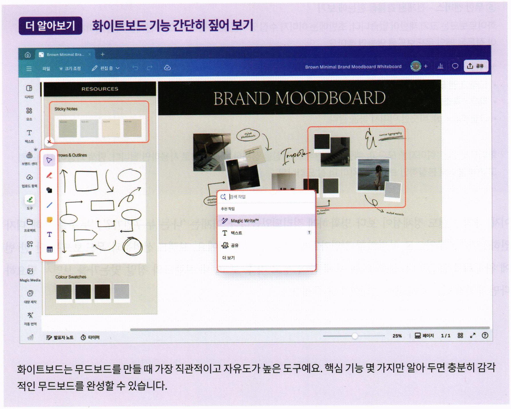
> 화이트보드는 무드보드를 만들 때 가장 직관적이고 자유도가 높은 도구예요. 핵심 기능 몇 가지만 알아 두면 충분히 감각적인 무드보드를 완성할 수 있습니다.
> 
> 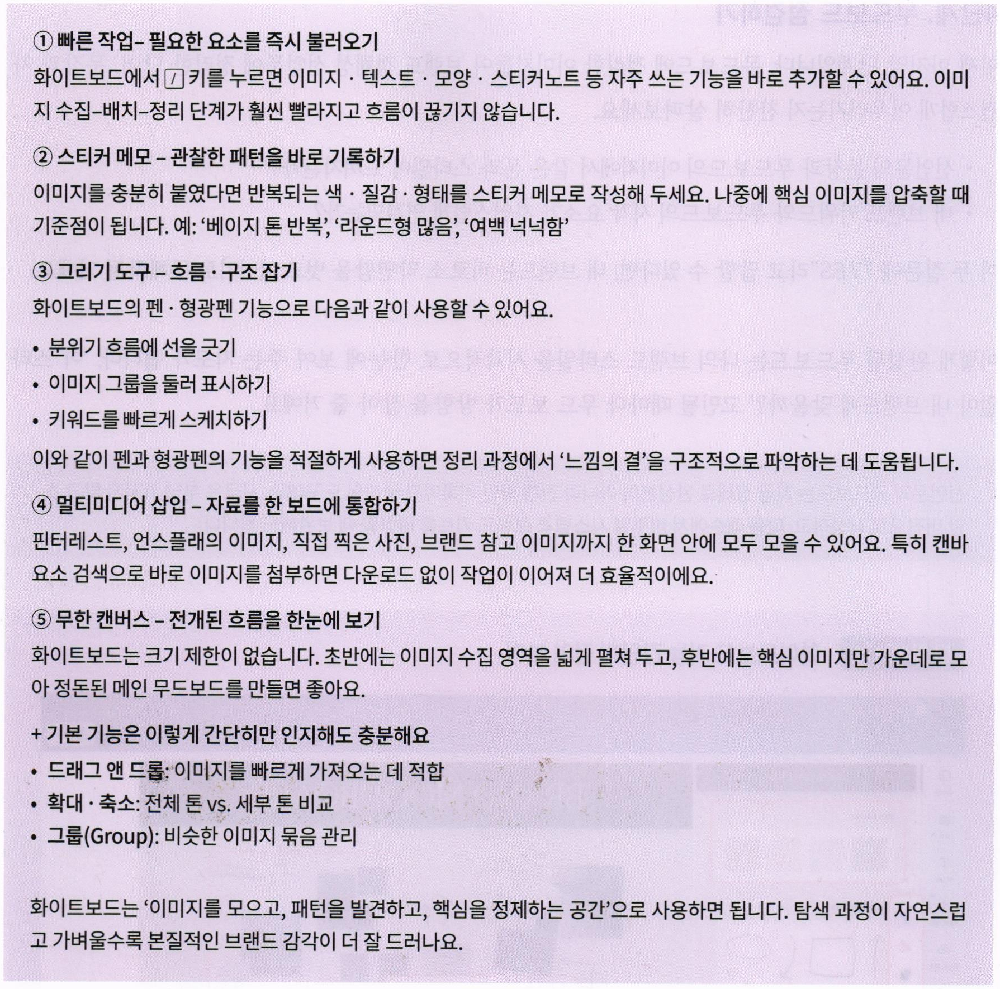
> * **빠른 작업 - 필요한 요소를 즉시 불러오기**: 화이트보드에서 `/` 키를 누르면 이미지, 텍스트, 모양, 스티커 노트 등 자주 쓰는 기능을 바로 추가할 수 있어요. 이미지 수집-배치-정리 단계가 훨씬 빨라지고 흐름이 끊기지 않습니다.
> * **스티커 메모 - 관찰한 패턴을 바로 기록하기**: 이미지를 충분히 붙였다면 반복되는 색, 질감, 형태를 스티커 메모로 작성해 두세요. 나중에 핵심 이미지를 압축할 때 기준점이 됩니다. (예: ‘베이지 톤 반복', ‘라운드형 많음', ‘여백 넉넉함')
> * **그리기 도구 - 흐름·구조 잡기**: 화이트보드의 펜, 형광펜 기능으로 다음과 같이 사용할 수 있어요.
> * 분위기 흐름에 선을 긋기
> * 이미지 그룹을 둘러 표시하기
> * 키워드를 빠르게 스케치하기
> 이와 같이 펜과 형광펜의 기능을 적절하게 사용하면 정리 과정에서 ‘느낌의 결'을 구조적으로 파악하는 데 도움됩니다.
> 
> 
> * **멀티미디어 삽입 - 자료를 한 보드에 통합하기**: 핀터레스트, 언스플래시의 이미지, 직접 찍은 사진, 브랜드 참고 이미지까지 한 화면 안에 모두 모을 수 있어요. 특히 캔바 요소 검색으로 바로 이미지를 첨부하면 다운로드 없이 작업이 이어져 더 효율적이에요.
> * **무한 캔버스 - 전개된 흐름을 한눈에 보기**: 화이트보드는 크기 제한이 없습니다. 초반에는 이미지 수집 영역을 넓게 펼쳐 두고, 후반에는 핵심 이미지만 가운데로 모아 정돈된 메인 무드보드를 만들면 좋아요.
> * **기본 기능은 이렇게 간단히만 인지해도 충분해요.**
> * 드래그 앤 드롭: 이미지를 빠르게 가져오는 데 적합
> * 확대·축소: 전체 톤 vs. 세부 톤 비교
> * 그룹(Group): 비슷한 이미지 묶음 관리
> 
> 
> 
> 
> 화이트보드는 ‘이미지를 모으고, 패턴을 발견하고, 핵심을 정제하는 공간'으로 사용하면 됩니다. 탐색 과정이 자연스럽고 가벼울수록 본질적인 브랜드 감각이 더 잘 드러나요.

이제 나의 브랜드 정체성이 보다 명확하게 정리되었습니다. 이제는 ‘나는 누구인가?', ‘누구를 위해 디자인하는가?', ‘무엇으로 차별화할 것인가?'에 답할 수 있을 거예요. 브랜드 선언문과 무드보드는 단 한 번에 완성되지 않습니다. 눈에 띄는 곳에 붙여 두고 자주 보고, 내 브랜드와 정말 맞는가를 보면서 필요하다면 주기적으로 수정해서 업데이트해 주세요.

---

## 일관성 있는 브랜드 비주얼 시스템 만들기

이번 레슨에서는 정체성 선언문과 무드보드를 토대로 브랜드의 시각적 체계를 만들 차례입니다. 브랜드의 철학과 분위기를 시각적으로 일관되게 정리하기 위해 캔바의 브랜드 센터를 활용해 브랜드 비주얼 시스템을 구축해 봅니다.

> 이 레슨에서 다루는 브랜드 센터는 유료(Canva Pro) 기능이에요. 무료 사용자는 30일 무료 체험을 통해 브랜드 센터의 모든 기능을 사용해 볼 수 있습니다. 무료 체험이 종료된 이후에도 계속 사용하려면 Pro로 업그레이드해야 해요. 단, 브랜드 시스템을 이해하고 구성하는 과정 자체는 무료 버전에서도 충분히 연습할 수 있으니 걱정하지 않아도 됩니다.

### 비주얼 아이덴티티와 비주얼 시스템 이해하기

**비주얼 아이덴티티(Visual Identity)**
비주얼 아이덴티티는 브랜드의 철학과 태도를 시각적으로 드러내는 표현 언어입니다. 로고, 컬러, 폰트, 이미지 등 시각적으로 브랜드를 표현하는 모든 요소를 말해요. 즉, 브랜드가 세상에 어떻게 보이고 싶은가를 구체적인 형태로 담은 것이죠.

**비주얼 시스템(Visual System)**
비주얼 시스템은 비주얼 아이덴티티 요소들이 일관성 있게 사용될 수 있도록 정리한 규칙과 구조를 의미해요. 느낌에 따라 매번 스타일이 달라지지 않고, 정해 둔 기준으로 브랜드가 일관된 인상을 꾸준하게 재현하도록 돕는 시스템이에요.

* **비주얼 아이덴티티**: 브랜드의 시각적 자산들
* **비주얼 시스템**: 이 자산들을 일관되게 유지시켜 주는 구조

**캔바 브랜드 센터, 비주얼 시스템을 관리해 주는 파트너**
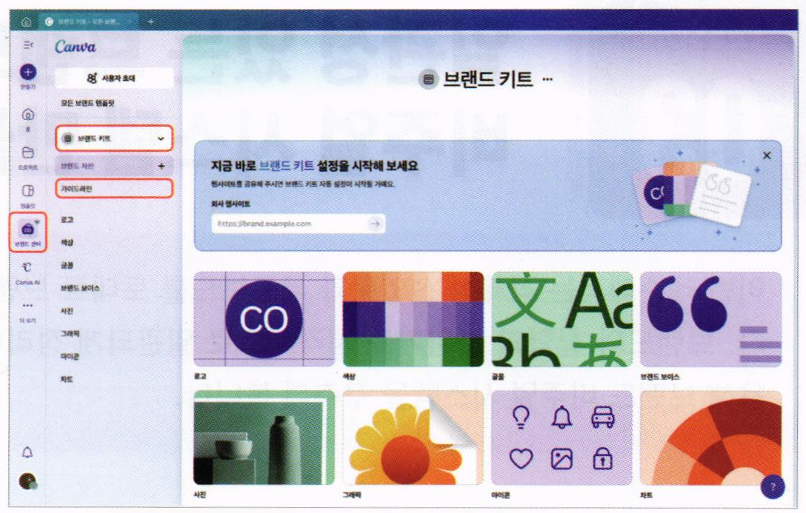

캔바의 브랜드 센터는 비주얼 아이덴티티, 비주얼 시스템과 아주 밀접하게 연결되어 있어요.

* **브랜드 센터**: 브랜드 자산(로고, 컬러, 폰트, 이미지 등)과 브랜드 템플릿, 가이드라인을 한 곳에서 볼 수 있는 공간이에요.
* **브랜드 키트**: 브랜드별로 선택해 브랜드의 비주얼 아이덴티티 요소(로고, 컬러 팔레트, 폰트, 이미지 등)를 업로드하고 정리할 수 있습니다.
* **브랜드 가이드라인**: 브랜드의 톤앤매너, 사용 규칙, Dos & Don'ts 등 브랜드가 일관되게 보이고 들릴 수 있도록 안내하는 설명을 추가할 수 있어요.

이렇게 브랜드 센터를 통해 내 브랜드의 스타일을 구조를 갖춰 쉽게 정리하고 시각적 일관성을 유지할 수 있습니다. 시각적 일관성은 고객에게 내 브랜드에 대한 기억을 강화하고 신뢰를 쌓을 수 있게 해줍니다.

### 비주얼 시스템의 핵심 요소

선언문은 브랜드의 철학을 담은 문서이고, 무드보드는 브랜드의 분위기를 시각화한 지도예요. 선언문(언어의 기준)과 무드보드(시각의 기준)에서 키워드·색·형태·질감을 추출해 6가지 요소로 정리합니다. 이 정리는 이후 캔바 브랜드 센터에 비주얼 시스템을 구축하는 데 토대가 됩니다.

| 핵심 요소 | 설명 | 추출 기준 |
| --- | --- | --- |
| **로고** | 브랜드의 얼굴. 텍스트·심볼형 로고를 등록해 어디서나 동일한 인상 유지 | 브랜드명, 핵심 메시지를 바탕으로 워드마크 제작 |
| **컬러 팔레트** | 브랜드를 대표하는 주조색·보조색·포인트 색 구성 | 무드보드에서 가장 자주 반복된 톤 추출 |
| **폰트** | 제목·본문·캡션 등 텍스트 계층 구조 세팅 | 선언문의 분위기나 보이스에서 느껴지는 톤에 맞는 폰트 선택 |
| **브랜드 보이스** | 브랜드의 말투·표현 방식·커뮤니케이션 톤 정리 | 선언문에서 추출한 핵심 문장, 말의 리듬, 어조 키워드 |
| **이미지 스타일** | 사진이나 일러스트의 톤과 분위기 설정 | 무드보드의 대표 이미지 톤 |
| **그래픽 요소** | 반복적으로 사용하는 시각적 장식과 시각화 방식 | 무드보드에서 반복된 형태·선 스타일·패턴·차트 색감 등 시각적 리듬 |

한 번에 완벽하게 완성할 필요는 없습니다. 시스템은 처음부터 완성되는 것이 아니라 기존 자료 속에서 패턴을 발견하고 정제하는 과정이에요. 선언문(언어의 기준)과 무드보드(시각의 기준)를 나란히 두고 반복되는 요소들을 찾아보세요.

**핵심 요소 추출 예시**

* ‘진정성 있는 따뜻한' 브랜드 선언문이라면 ➔ 보이스: 부드럽고 공감형 문체 / 폰트: 둥근 산세리프 / 색상: 베이지·브라운 톤 / 사진: 자연광 / 그래픽: 라운드형 패턴
* ‘명료하고 미니멀한 전문가형' 브랜드라면 ➔ 보이스: 단정하고 명확한 톤 / 폰트: 세리프 / 색상: 모노톤 / 그래픽: 선형 아이콘, 얇은 차트

### 캔바 브랜드 센터에 비주얼 시스템 구축하기

이제 브랜드 비주얼 시스템을 실제로 구현할 차례입니다. 캔바의 브랜드 센터는 브랜드의 모든 시각 자산을 관리하고, 일관성을 유지하도록 돕는 허브이자 시스템이에요.
로고, 색상, 폰트뿐 아니라 브랜드 스토리, 템플릿, 가이드라인까지 한 곳에서 관리할 수 있습니다. 또한 캔바 에디터 화면에서 정리된 브랜드 자산을 바로 불러와서 사용할 수 있으니 정말 편리해요. 이 공간을 잘 세팅해 두면, 누가 작업하더라도 언제든 일관된 브랜드 인상을 유지할 수 있죠.

**브랜드 센터의 구성 개요**

| 구분 | 핵심 기능 | 주요 역할 |
| --- | --- | --- |
| **브랜드 센터** | 브랜드 전체 자산 관리 허브 | 브랜드별 운영·전환 |
| **모든 브랜드 템플릿** | 템플릿 모음 공간 | 디자인 일관성 유지 |
| **브랜드 키트** | 로고·컬러·폰트·보이스·관리 | 시각 언어 기준 세팅 |
| **브랜드 자산** | 이미지·그래픽·차트·아이콘 | 시각 자료 중앙 관리 |
| **가이드라인** | 브랜드 문서·철학·스타일 | 브랜드북 완성 및 공유 |

**캔바 브랜드 센터 둘러보기**
이제 실제 캔바 화면에서 각 메뉴의 위치와 사용 흐름을 짚어 볼게요.

**1. 브랜드 센터**: 브랜드 관련 자산을 모두 관리하는 핵심 허브예요. 브랜드 키트, 템플릿, 자산, 가이드라인을 한 곳에서 확인하고 관리할 수 있습니다. 캔바 홈 화면은 물론, 에디터 화면에서도 바로 접근할 수 있어요.

**2. 모든 브랜드 템플릿**: 브랜드별로 만든 디자인 템플릿을 모아 두는 공간입니다. 자주 제작하는 디자인 포맷을 브랜드 템플릿으로 저장해 두면 누가 작업하더라도 규격과 톤이 자동으로 맞춰집니다. 여러 브랜드 키트를 운영 중이라면 드롭다운 메뉴에서 원하는 브랜드를 선택해 모아 볼 수 있고, 폴더나 태그를 활용하면 더 체계적으로 정리할 수 있습니다. 홈 화면은 물론 에디터 화면의 [공유] 옵션에서도 브랜드 템플릿으로 저장할 수 있어요.

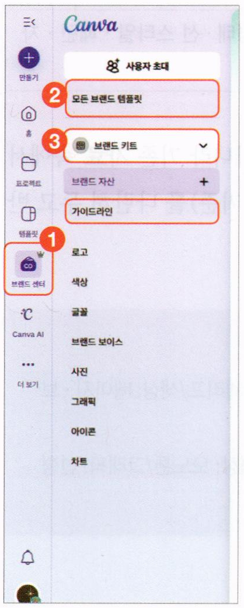
▲ 자주 사용하는 콘텐츠 포맷(예: 인스타그램 카드뉴스, 섬네일)을 브랜드 템플릿으로 저장해두세요. 브랜드 템플릿은 디자인의 기준점이 됩니다.

**3. 브랜드 키트**: [브랜드] 탭에서 브랜드별로 브랜드 키트를 만들고 관리할 수 있습니다. 드롭다운 메뉴를 통해 여러 브랜드 키트 간에 쉽게 전환하여 각 브랜드와 관련된 모든 자산(브랜드 키트, 브랜드 템플릿 등)을 한눈에 볼 수 있어요. 또한 브랜드 관리 기능으로 협업 시 팀원들의 브랜드 색상·폰트·로고 변경 권한을 제한해 일관성을 유지할 수 있습니다.

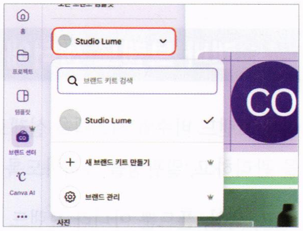
▲ 브랜드 키트 세부 화면

> **브랜드 키트 연결해 Canva AI로 디자인 생성하기**
> Canva AI 창에서 브랜드 키트를 연결해 프롬프트를 입력해 브랜드 스타일이 반영된 디자인을 빠르게 생성할 수 있습니다. 새로운 채팅 창이 열리면서 Canva AI가 디자인을 생성해 줍니다.
> 1. 검색 창 상단의 [Canva AI]를 선택하고, 프롬프트를 입력한 후, [+] 버튼을 클릭합니다.
> 2. 드롭다운 메뉴에서 [브랜드 키트 적용]을 클릭하고, 원하는 브랜드 키트를 선택해 연결합니다.
> 
> 
> 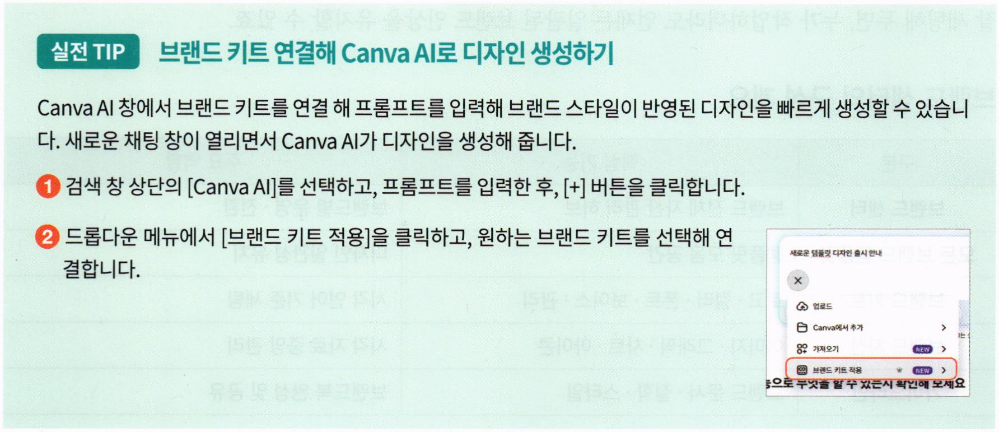
> 3. 검색창 하단에서 원하는 디자인 포맷을 선택하고, [제출하기] 버튼을 클릭합니다.
> 
> 
> 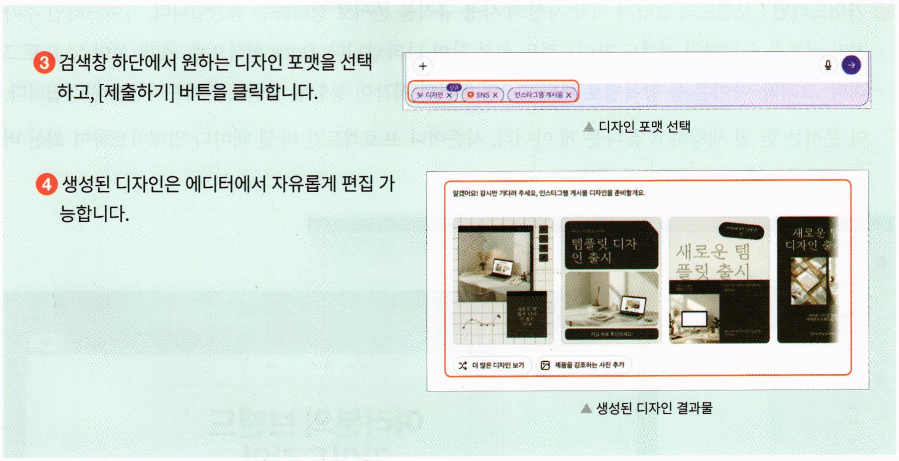
> 4. 생성된 디자인은 에디터에서 자유롭게 편집 가능합니다.
> 
> 
> 
> ▲ 생성된 디자인 결과물

**4. 브랜드 자산**: 이미지, 그래픽, 차트, 아이콘 등 브랜드의 시각 자료를 관리하는 메뉴예요. 카테고리별로 브랜드 자산을 정리하고 가이드라인 항목에 간단한 설명을 덧붙여 두면, 필요할 때 빠르게 찾아 바로 적용할 수 있습니다.
또한 브랜드 자산에는 브랜드 키트 빌더에 웹사이트 주소를 입력하면, 캔바가 로고, 색상, 폰트, 브랜드 보이스 등 브랜드 자산을 자동으로 추출해 줘서 브랜드 키트를 빠르게 세팅할 수 있어요. 브랜드 자산을 한 번에 모아 정리할 때 사용하기 좋은 자동화 기능이에요. 초보 단계에서는 타 브랜드 분석용으로, 나의 브랜드 자산이 쌓인 뒤에는 빠르게 정리할 때 활용하기 유용합니다.

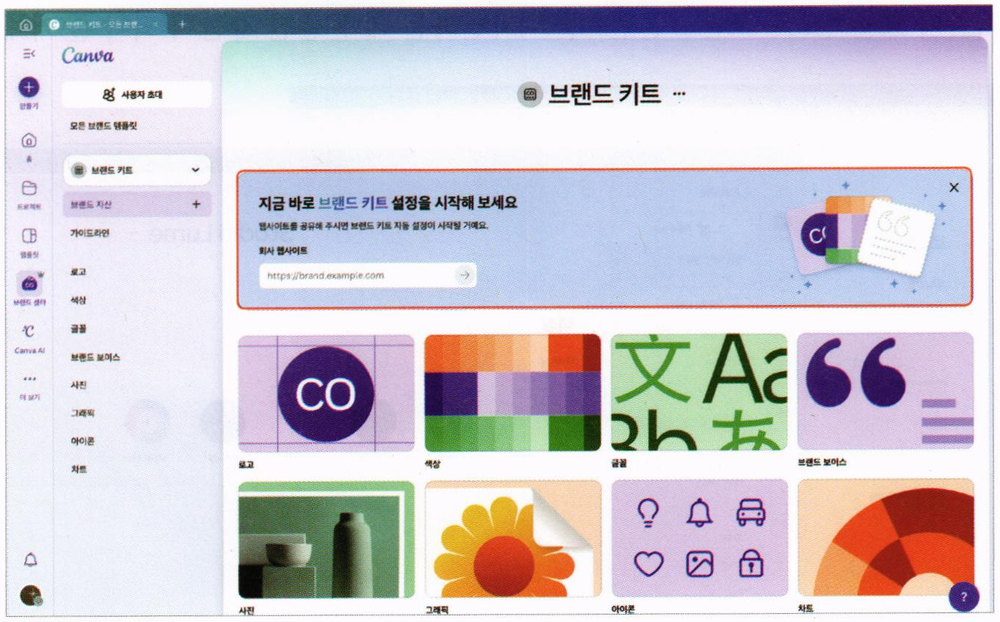
▲ 브랜드 키트 빌더 부분

**5. 가이드라인**: 브랜드의 철학과 시각 자산의 사용 규칙을 문서로 정리하는 공간입니다. 가이드라인 추가하기 버튼을 클릭하면 브랜드 가이드라인 설정 창이 나타납니다. Docs 형식으로, 소개·보이스·포토그래피·그래픽·아이콘 등 항목별로 채워 넣으면 언어와 시각이 통합된 브랜드 가이드라인이 완성됩니다. 이 문서는 한 번 세팅하고 끝나는 게 아니라, 시즌이나 프로젝트가 바뀔 때마다 업데이트하며 최신 버전으로 유지하는 것이 중요합니다.

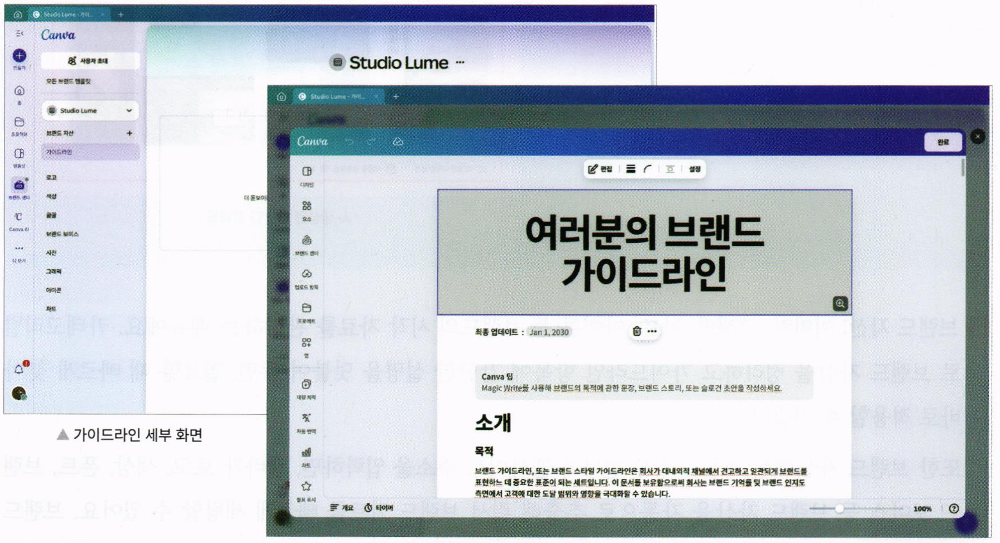
▲ 가이드라인 세부 화면

레슨 03에서 만든 비주얼 시스템의 핵심 요소를 브랜드 센터에 꼭 업데이트해 두세요. 브랜드의 시각적 일관성을 유지하며 효율적으로 브랜드 콘텐츠를 디자인하는 데 든든한 자산이 되어 줄 거예요.

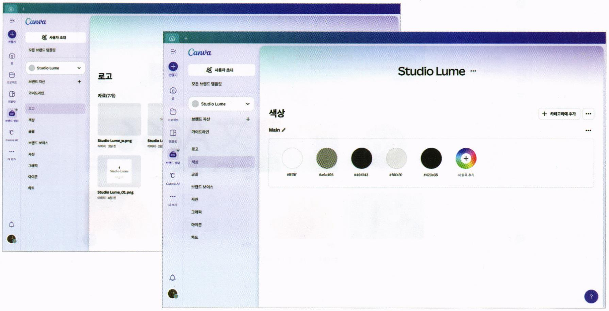
▲ 로고와 색상 정하기

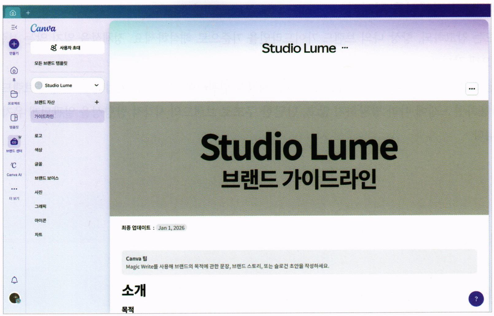
▲ 실습용 가상의 브랜드 내용으로 세팅된 브랜드 센터

### 브랜드 비주얼을 일관되게 유지하는 노하우

비주얼 시스템을 만들었다고 끝이 아니에요. 실제로 사용하면서 유지하는 게 중요합니다. 꾸준히 사용하며 유지·보완하는 과정이 진짜 브랜딩입니다.

**1. 지속적인 습관으로 만들기**
새 디자인을 시작할 때마다 캔바에 등록해 둔 브랜드 가이드라인을 먼저 확인하세요. 처음엔 낯설지만 몇 번 반복하면 금세 익숙해지고, 3개월이면 자연스럽게 습관이 자리잡습니다.

**2. 체크리스트로 확인하기**
디자인을 완성한 뒤에도 브랜드 가이드라인을 기준으로 컬러·폰트·로고를 일관되게 사용했는지 체크하세요. 간단한 체크 습관만으로도 시각적 일관성이 눈에 띄게 달라집니다.

**3. 주기적으로 비주얼 시스템 업데이트하기**
실제로 사용하면서 과하거나 모호한 규칙이 있다면 한 번에 하나씩 조정하고, 6개월마다 전체 점검 시간을 가지세요. 단, 브랜드의 핵심 톤과 컬러는 유지하도록 합니다.

**4. 트렌드보다 정체성을 지키기**
트렌드는 참고하되, 항상 나의 브랜드 가이드라인을 기준으로 해석하세요. 정체성을 잃지 않는 브랜드가 결국 오래갑니다.

브랜딩의 본질은 단순히 예쁜 디자인이 아니라 시각적 일관성을 유지하는 것입니다. 캔바의 브랜드 센터를 활용하면 느낌에 따라 방황하지 않고, 단단한 구조로 브랜드의 시각적 방향성을 일관되게 유지할 수 있습니다.
