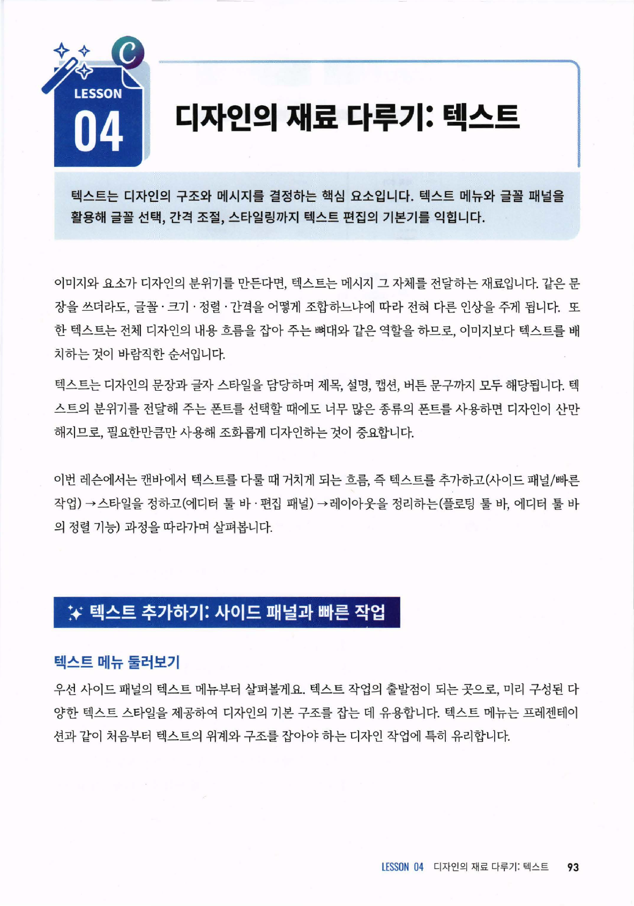

###### 디자인의 재료 다루기: 텍스트

디자인의 구조와 메시지를 요소입니다.

###### 선택, 간격 조절, 스타일링까지 텍스트 편집의 기본기를 익힙니다.

이미지와 요소가 디자인의 분위기를 만든다면, 텍스트는 메시지 그 자체를 전달하는 재료입니다. 같은 문

장을 쓰더라도, 글꼴 · 크기 · 정렬 · 간격을 어떻게 조합하느냐에 따라 전혀 다른 인상을 주게 됩니다. 또 한 텍스트는 전체 디자인의 내용 흐름을 잡아 주는 뼈대와 같은 역할을 하므로, 이미지보다 텍스트를 배 치하는것이 바람직한순서입니다.

텍스트는 디자인의 문장과 글자 스타일을 담당하며 제목, 설명, 캡션, 버튼 문구까지 모두 해당됩니다. 텍 스트의 분위기를 전달해 주는 폰트를 선택할 때에도 너무 많은 종류의 폰트를 사용하면 디자안이 산만 해지므로, 필요한만큼만 사용해 조화롭게 디자인하는 것이 중요합니다.

이번 레슨에서는 캔바에서 텍스트를 다룰 때 거치게 되는 흐름, 즉 텍스트를 추가하고(사이드 패널/빠른 작업) 一스타일을 정하고(에디터 툴 바 · 편집 패널) 一레이아웃을 정리하는(플로팅 툴 바, 에디터 툴 바

의 정렬 기능) 과정을 따라가며 살펴봅니댜

###### 텍스트 |

###### 텍스트매뉴둘러보기

우선 사이드 패널의 텍스트 메뉴부터 살펴볼게요. 텍스트 작업의 출발점이 되는 곳으로, 미리 구성된 다

양한 텍스트 스타일을 제공하여 디자인의 기본 구조를 잡는 데 유용합니다. 텍스트 메뉴는 프레젠테이

션과 같이 처음부터 텍스트의 위계와 구조를 잡아야 하는 디자인 작업에 특히 유리합니다.

LESSON 디자인의 재료 다루기: 텍스트 93

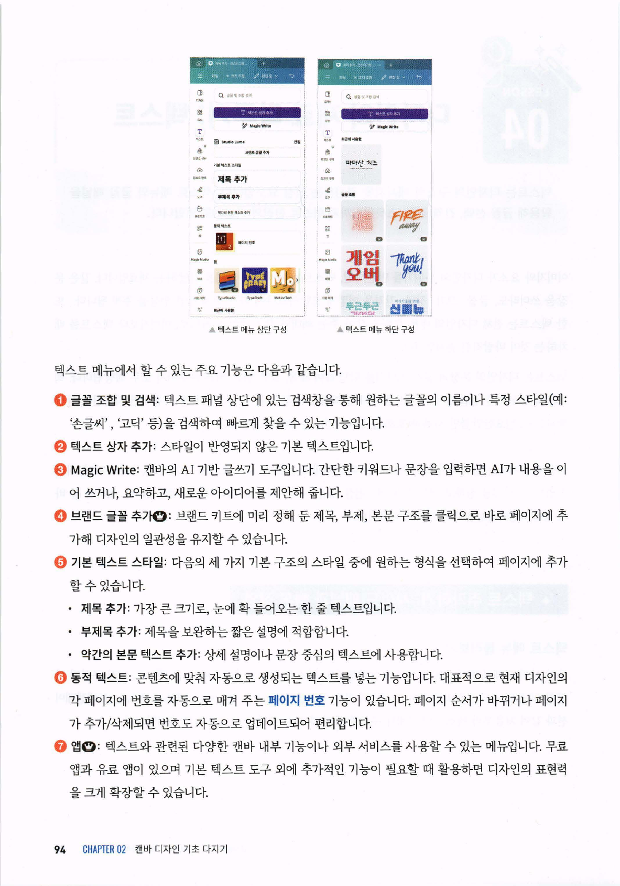

-Gl

-。

Q 꼬`"••세

Q •률 1츠.G빼

”崎던

q차입

###### ·

않

” .,,

,.,M.., 荀

山솔 w*·

......‘ liiil'"""°""m•브止i••기

T

T

·2·

••

`소. •.......

......‘。

l[t0tAt... .. 리즈

o ',．玉떠

###### ···"

....嶋 제특주가

4

4

多

을•••

###### fl

”

‘’

~"·기

###### ..e.

....

###### t

e,

.....嶋"”

怨.

틀••스鳳

8?

°

탈

`囚먼•

e

언

卞門

”M""•.. •

"..”

###### •..

###### )

###### 、다... 십.‘j

。

。

~"' 三」

.... wn기rmn

...라

2' ．건""

L一

~ 텍스트메뉴하단 구성

~ 텍스트 메뉴상단구성

텍스트 메뉴에서 할 수 있는 주요 기능은 다음과 같습니다.

O 글꼴 조합 및 검색: 텍스트 패널 상단에 있는 검색창을 통해 원하는 글꼴의 이름이나 특정 스타일(예:

온글씨' , ‘고딕' 등)을 검색하여 빠르게 찾을 수 있는 기능입니다.

O 텍스트 상자 주가: 스타일이 반영되지 않은 기본 텍스트입니다.

E) Magic Write: 캔바의 AI 기반 글쓰기 도구입니다. 간단한 키워드나 문장을 입력하면 AI가 내용을 이

어 쓰거나, 요약하고, 새로운 아이디어를 제안해 줍니다.

O 브랜드 글꼴 주가C》: 브랜드 키트에 미리 정해 둔 제목, 부제, 본문 구조를 클릭으로 바로 페이지에 추

가해 디자인의 일관성을 유지할 수 있습니댜

O 기본 텍스트 스타일: 다움의 세 가지 기본 구조의 스타일 중에 원하는 형식을 선택하여 페이지에 추가

할수있습니다.

|제목 추| 가장 큰 크기로, 눈에 확 들어오는 한 줄 텍스트입니다.|
|---|---|

부제목 주가: 제목을 보완하는 짧은 설명에 적합합니댜

약간의 본문 텍스트 주가: 상세 설명이나 문장 중심의 텍스트에 사용합니다.

O 동적 텍스트: 콘텐츠에 맞춰 자동으로 생성되는 텍스트를 넣는 기능입니다. 대표적으로 현재 디자인의

각 페이지에 번호를 자동으로 매겨 주는 페이지 기능이 있습니다. 페이지 순서가 바뀌거나 페이지 가 추가/삭제되면 번호도 자동으로 업데이트되어 편리합니다.

O 앱O: 텍스트와 관련된 다양한 캔바 내부 기능이나 외부 서비스를 사용할 수 있는 메뉴입니다. 무료

앱과 유료 앱이 있으며 기본 텍스트 도구 외에 추가적 인 기능이 필요할 때 활용하면 디자인의 표현력

올크게 확장할수 있습니댜

94 02 캔바 디자인 기조 다지기

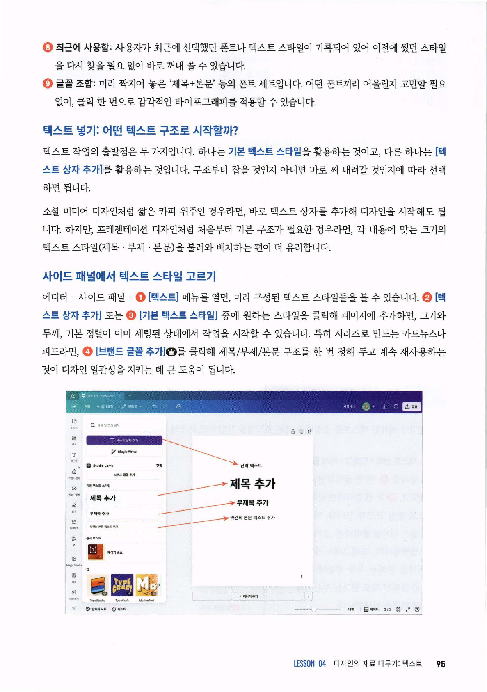

O 죄근에 사용함: 사용자가 최근에 선택했던 폰트나 텍스트 스타일이 기록되어 있어 이전에 썼던 스타일

을다시 찾을필요없이 바로꺼내 쓸수있습니다.

O 글꼴 조합: 미리 짝지어 놓은 ‘제목+본문’ 등의 폰트 세트입니댜 어떤 폰트끼리 어울릴지 고민할 필요

없이, 클릭 한 번으로 감각적인 타이포그래피를 적용할 수 있습니다.

###### 텍스트 넣기: 텍스트 구조로 시작할까?

텍스트 작업의 출발점은 두 가지입니다. 하나는 스타일을 활용하는 것이고, 다른 하나는 [텍 스트 상자 주가]를 활용하는 것입니다. 구조부터 잡을 것인지 아니면 바로 써 내려갈 것인지에 따라 선택

하면됩니댜

소셜 미디어 디자안처럼 짧은 카피 위주인 경우라면, 바로 텍스트 상자를 추가해 디자인을 시작해도 됩

니다. 하지만, 프레젠테이션 디자인처럼 처음부터 기본 구조가 필요한 경우라면, 각 내용에 맞는 크기의 텍스트 스타일(제목 · 부제 · 본문)을 불러와 배치하는 편이 더 유리합니다.

###### 사이드 패널에서 텍스트 스타일 고르기

에디터 - 사이드 패널 - O [텍스트] 메뉴를 열면, 미리 구성된 텍스트 스타일들을 볼 수 있습니다. O [텍 스트 상자 주가] 또는 O [기본 텍스트 스타일] 중에 원하는 스타일을 클릭해 페이지에 추가하면, 크기와

두께, 기본 정렬이 이미 세팅된 상태에서 작업을 시작할 수 있습니다. 특히 시리즈로 만드는 카드뉴스나

피드라면, O [브랜드 글꼴 추가]CH: 클릭해 제목/부제/본문 구조를 한 번 정해 두고 계속 재사용하는

것이 디자인 일관성을 지키는 데 큰 도움이 됩니다.

###### 죠:：二:"v 0 1 " '|

###### 때

Q "`,"겁색

###### a e

디자?’

路

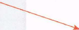

.,, M..Icwrit.

T

편집 단락익스트

'II {:) Studio Lume

®

브뺀글후가

••도솁며

###### 一一一一一재목주가

11@ ..스皇스타혈

。

I 업"‘.. 재목주가

###### 一부제특주가

도구 ...특후가

###### "..

一약간의른문텍스트주가

e

“간빼른틀＂스...가

8? " ..프

###### @ •

빼어지번호

M헬....

###### ..

• 曰 요

엽

###### ....。

." 1ii1~ 1/1 88 ," ®

w'"nao T"며>"' U나·T"'

훈. "' 릴m'노 O 的.,

LESSON 04 디자인의 재료 다루기: 텍스트 95

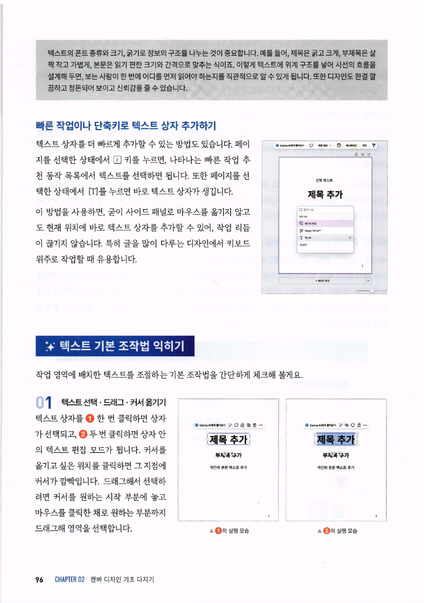

나누는

###### 상자

0-,....,....,.,, 0 ....

###### 텍스트 상자를 더 빠르게 추가할 수 있는 방법도 있습니다. 페이

###### "· T

a 언 C

지를 선택한 상태에서 띠 키를 누르면, 나타나는 빠른 작업 추 천 동작 목록에서 텍스트를 선택하면 됩니다. 또한 페이지를 선

단힉텍스皇

택한 상태에서 [T] 를 누르면 바로 텍스트 상자가 생깁니다.

###### 재목주가

###### ....°

Q k*".,,

###### 이 방법을 사용하면, 굳이 사이드 패널로 마우스를 옮기지 않고

` 1 ••

도 현재 위치에 바로 텍스트 상자를 추가할 수 있어, 작업 리듬 이 끊기지 않습니다. 특히 글을 많이 다루는 디자인에서 키보드

./ M""m..

l

T •포

어떠

위주로 작업할 때 유용합니다.

.．어지"

| |

작업 영역에 배치한 텍스트를 조절하는 기본 조작법을 간단하게 체크해 볼게요.

###### 1 텍스트선택·드래그·커서옮기기

###### 텍스트 상자를 한 번 클릭하면 상자 가선택되고, 두번클릭하면상자안

~"""901VI·,, o a ® 0 ···

~""m1이"' •;,> q, O al ···

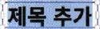

###### { :

의 텍스트 편집 모드가 됩니다. 커서를

###### 부적욕꾸가

옮기고싶은위치를클릭하면그지점에

익간의른문혀스트주가

악간의븐문릴스트주가

커서가 깜빡입니댜 드래그해서 선택하

l__

###### 려면 커서를 원하는 시작 부분에 놓고

마우스를 클릭한 채로 원하는 부분까지

드래그해 영역을선택합니다.

.... 의실행모습

###### ~ 의실행모습

96 CHAPTER 02 캔바 디자인 기조 다지기

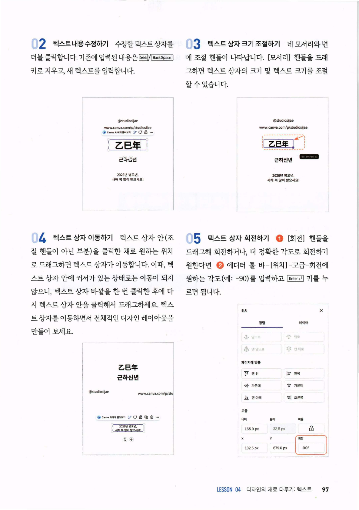

###### 2 텍스트내용수정하기 수정할텍스트상자를

###### 3 텍스트상자크기조절하기 네모서리와변

###### 더블클릭합니댜 기존에 입력된 내용은~/~니

에 조절 핸들이 나타납니댜 [모서 리] 핸들을 드래

키로 지우고, 새 텍스트를 입력합니다.

그하면 텍스트 상자의 크기 및 텍스트 크기를 조절 할수있습니댜

@studiosijae www.canva.com/p/studiosijae

@studiosijae www.canva.com/0/studiosiiae

-

c.n.•...,,IIOIVI ·lf O iii ...

··

k"':

口 —1 !

###### : :

###### ----------------

###### 근2t스년

근하신년

2026년 병오년, 새해특많이받으세요!

2026년 병오년 , 새해복많이받으세요!

_j

###### 5 텍스트 상자 회전하기 O [회전] 핸들을

###### 4 텍스트 상자 이동하기 텍스트 상자 안(조

###### 절 핸들이 아닌 부분)을 클릭한 채로 원하는 위치

드래그해 회전하거나, 더 정확한 각도로 회전하기

원한다면 O 에디터 툴 바-［위치]－고급-회전에

로 드래그하면 텍스트 상자가 이동합니다. 이때, 텍 스트 상자 안에 커서가 있는 상태로는 이동이 되지 않으니, 텍스트 상자 바깥을 한 번 클릭한 후에 다

원하는 각도(예: －90)를 입력하고 돈도기 키를 누

###### 르면됩니댜

시 텍스트 상자 안을 클릭해서 드래그하세요술 텍스 트상자를이동하면서 전체적인디자인레이아웃을 만들어보세요. T9t3

###### x -

위치

대이어

정1l

令 향

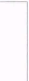

뻬이지에 맞출

乙巳年

o• 멘위

|릉 왼쪽

근하신년

야 가은데 송 가은데

@studiosijae www.canva.com/p/stu

虹 뎬아래 염| 오른쪽

고급

c:.nvaAl<l~IOl"11 ;? 0 ID ~ 9 ...

너비 높이 비‘

' 2026년 'II오년, ’

165.9 px 32.5 px II)

’ 시뻬 " "0l 만으세유! ,

y

679.6px 二

C> +

132.5 px

L_

LESSON 04 디자인의 재료 다루기: 텍스트 97

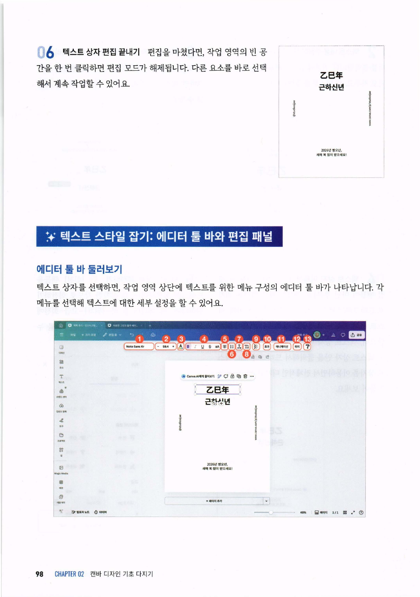

###### 6 텍스트상자편집 끝내기 편집을마쳤다면, 작업 영역의 빈 공

간을 한 번 클릭하면 편집 모드가 해제됩니댜 다른 요소를 바로 선택 해서계속작업할수있어요

乙巳年

근하신년

gEi

Fm

q

d

p

홍

5

업.

랄 ES

.....

2026년 'II오년,

으세요’

###### | |

###### 에디터툴바둘러보기

###### 텍스트 상자를 선택하면, 작업 영역 상단에 텍스트를 위한 메뉴 구성의 에디터 툴 바가 나타납니다. 각 메뉴를 선택해 텍스트에 대한 세부 설정을 할 수 있어요.

q

e

認

T Om"mtlOllVI •/ c a ® @ ...

‘

: :

근장산년

......

:-

。

.--uI l-i--

pe8II

땀

i

4

S 구

0

g

舒

###### l--

. 새뻬틀많이 받으세요!

e

•

###### ....。 ♦

우’ 7"nU O 印回 ." liil 亭m l/l 認 ." ®

98 CHAPTER 02 캔바 디자인 가조 다지기

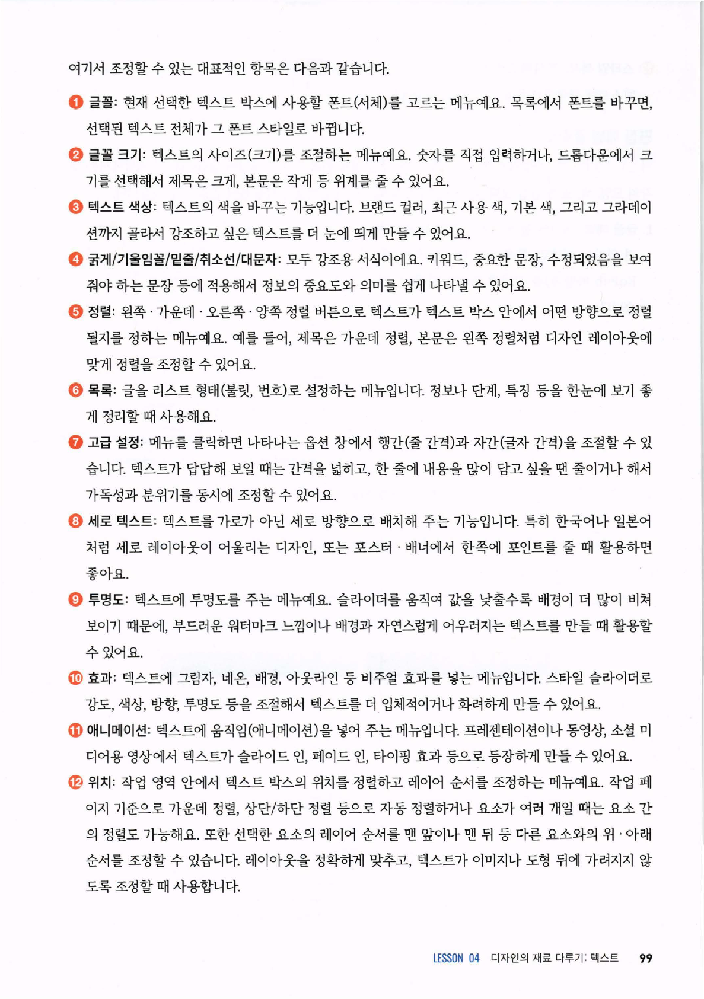

여기서 조정할 수 있는 대표적인 항목은 다움과 같습니다.

###### O 글꼴 현재 선택한 텍스트 박스에 사용할 폰트(서체)를 고르는 메뉴예요. 목록에서 폰트를 바꾸면,

선택된 텍스트 전체가 그 폰트 스타일로 바뀝니다.

###### O 글꼴 크기: 텍스트의 사이즈(크기)를 조절하는 메뉴예요. 숫자를 직접 입력하거나, 드롭다운에서 크

기를 선택해서 제목은 크게, 본문은 작게 등 위계를 줄 수 있어요.

###### O 텍스트 색상: 텍스트의 색을 바꾸는 기능입니다. 브랜드 컬러, 최근 사용 색, 기본 색, 그리고 그라데이

션까지 골라서 강조하고 싶은 텍스트를 더 눈에 띄게 만들 수 있어요.

O 굵게/기울임꼴/밑줄/쥐소선/대문자: 모두 강조용 서식이에요. 키워드, 중요한 문장, 수정되었음을 보여

줘야 하는 문장 등에 적용해서 정보의 중요도와 의미를 쉽게 나타낼 수 있어요.

###### O 정렬 왼쪽 ·가운데 ·오른쪽 ·양쪽 정렬 버튼으로 텍스트가 텍스트 박스 안에서 어떤 방향으로 정렬

###### 될지를 정하는 메뉴예요. 예를 들어, 제목은 가운데 정렬, 본문은 왼쪽 정렬처럼 디자인 레이아웃에

맞게 정렬을 조정할 수 있어요.

###### O 목록: 글을 리스트 형태(불릿, 번호)로 설정하는 메뉴입니댜 정보나 단계, 특징 등을 한눈에 보기 좋

게정리할때사용해요.

###### O 고급 설장 메뉴를 클릭하면 나타나는 옵션 창에서 행간(줄 간격)과 자간(글자 간격)을 조절할 수 있

습니다. 텍스트가 답답해 보일 때는 간격을 넓히고, 한 줄에 내용을 많이 담고 싶을 땐 줄이거나 해서 가독성과 분위기를 동시에 조정할 수 있어요.

###### O 세로 텍스트: 텍스트를가로가 아닌 세로 방향으로 배치해 주는 기능입니다. 특히 한국어나 일본어

###### 처럼 세로 레이아웃이 어울리는 디자인, 또는 포스터 · 배너에서 한쪽에 포인트를 줄 때 활용하면

좋아요.

###### O 투명도: 텍스트에 투명도를 주는 메뉴예요. 슬라이더를 움직여 값을 낮출수록 배경이 더 많이 비쳐

###### 보이기 때문에, 부드러운 워터마크 느낌이나 배경과 자연스럽게 어우러지는 텍스트룰 만들 때 활용할

수있어요.

###### @ 효과: 텍스트에 그림자, 네온, 배경, 아웃라인 등 비주얼 효과를 넣는 메뉴입니댜 스타일 슬라이더로

강도, 색상, 방향, 투명도 등을 조절해서 텍스트를 더 입체적이거나 화려하게 만들 수 있어요.

###### O 애니메이션: 텍스트에 움직임(애니메이션)을 넣어 주는 메뉴입니다. 프레젠테이션이나 동영상, 소셜 미

디어용 영상에서 텍스트가 슬라이드 인, 페이드 인, 타이핑 효과 등으로 등장하게 만들 수 있어요.

###### @ 위치: 작업 영역 안에서 텍스트 박스의 위치를 정렬하고 레이어 순서를 조정하는 메뉴예요. 작업 페

이지 기준으로 가운데 정렬, 상단/하단 정렬 등으로 자동 정렬하거나 요소가 여러 개일 때는 요소 간 의 정렬도 가능해요. 또한 선택한 요소의 레이어 순서를 맨 앞이나 맨 뒤 등 다른 요소와의 위 · 아래 순서를 조정할 수 있습니댜 레이아웃을 정확하게 맞추고, 텍스트가 이미지나 도형 뒤에 가려지지 않

도록 조정할 때 사용합니다.

04 디자인의 재료 다루기: 텍스트 99

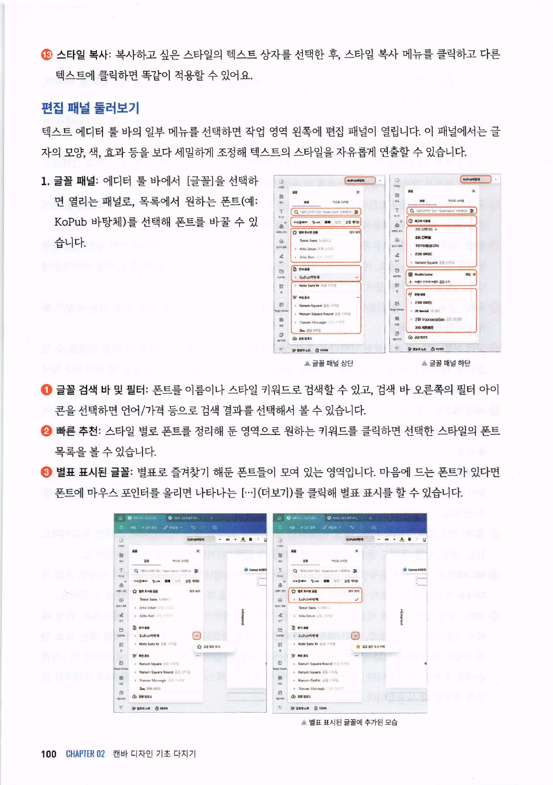

###### @ 스타일 복사: 복사하고 싶은 스타일의 텍스트 상자를 선택한 후, 스타일 복사 메뉴를 클릭하고 다른

텍스트에 클릭하면 똑같이 적용할 수 있어요.

###### 편집패널둘러보기

텍스트 에디터 툴 바의 일부 메뉴를 선택하면 작업 영역 왼쪽에 편집 패널이 열립니댜 이 패널에서는 글

###### 자의 모양, 색, 효과 등을 보다 세밀하게 조정해 텍스트의 스타일을 자유롭게 연출할 수 있습니다.

###### ..

###### ( I -

&g

- 1. 글꼴 패널 에디터 툴 바에서 [글꼴]을 선택하 면 열리는 패널로, 목록에서 원하는 폰트(예:

###### E 」 2

••

X

X

엽

Ill!

H

빽스

`소

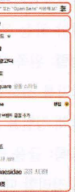

T ～、 4 ..노 l

KoPub 바탕체)를 선택해 폰트를 바꿀 수 있 |:• (어～ 일•… " 요산 "

e· 느

-~ 1* ......"

###### :..1 ..,~

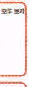

' .. 스뺀다드 •

습니댜 " |I ,-.一..,,,...

. ..

.. 느

e, ·--

: 1 • eIO.."'

###### 냐II'/. I,•=..._._.,.

; (~:흡--..m뻬:..••.,,

嵐

“""

1--e |，'`-도N"`"＇도`"e..... .

###### :' ·:......

###### I....- 1 . ..- ,.,

..• |•2lOY_ V,r..

###### 紅二7

###### 。.....

210

대” o···ll

。

빼”

`. ,,....꼬

1· .......-----

~ 글꼴패널 상단 ... 글꼴패널 하단

O 글꼴 검색 바 및 필탸 폰트를 이름이나 스타일 키워드로 검색할 수 있고, 검색 바 오른쪽의 필터 아이

콘을 선택하면 언어/가격 등으로 검색 결과를 선택해서 볼 수 있습니다.

O 빠른 추천: 스타일 별로 폰트를 정리해 둔 영역으로 원하는 키워드를 클릭하면 선택한 스타일의 폰트

목록을볼수있습니다.

O 별표 표시된 글꼴: 별표로 즐겨찾기 해둔 폰트들이 모여 있는 영역입니다. 마음에 드는 폰트가 있다면

폰트에 마우스 포인터를 올리면 나타나는 […] （더보기)를 클릭해 별표 표시를 할 수 있습니댜

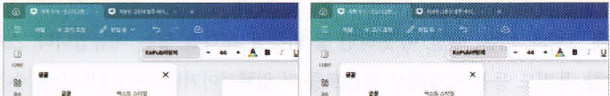

~- T Q--,`.`t0도•땐•三훌

###### " ........ " ff ·스스

T Q ,"도’`.. 臺

###### .. ......" 一門

`o.` ~I“” 알•- .. 도! "-

...,,

빼소

•

•

###### ..:)

......빼 알". .. .` ”嶋

- .. ~......”

。 `"....

O »

--

."" ``"....

‘.. ·^-

4.. •峰""~

»NO

US-

-－-－－－－.

--.

e (t f"H

###### o

B •서"

###### II'/. ''...-.....山正 멜

討. ,,...MSK,. •

- . ...따서..嶋

. ......**빨빼

###### *

0 II•틀...

###### 。 .--·-

c; . .......`느pm

' " ' ＂"""오`"`

###### •.. ,' ""UG

’ .......

• » N"""Mr"

뻬

때。." 。..mm

.

표 He,,.

,.__,.,"며i

...` OH...

。

`. ，，"기" °¢

r 白.""u @-

-

... 별표 표시된 글꼴에 주가된 모습

100 CHAPTER 02 캔바 디자인 기조 다지기

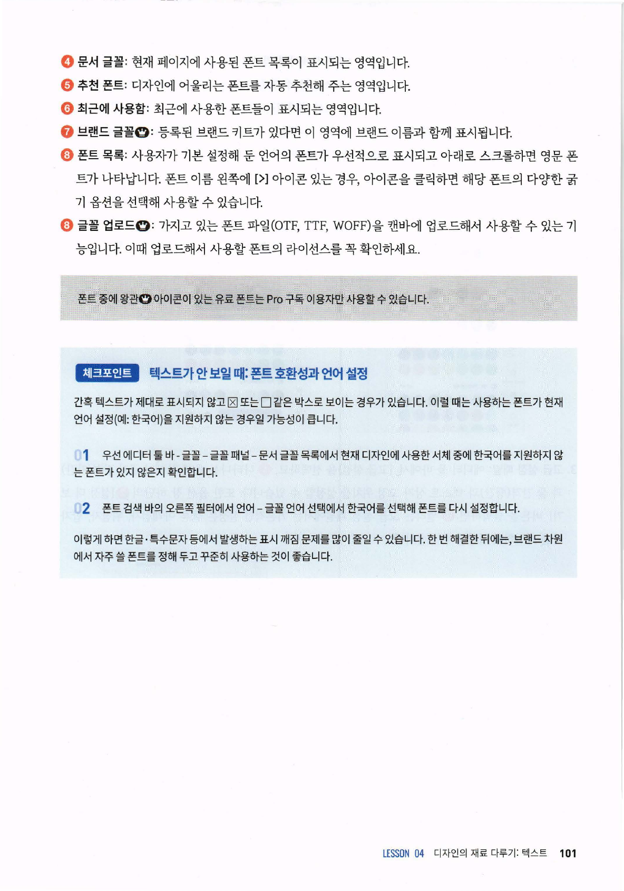

###### O 문서 글꼴 현재 페이지에 사용된 폰트 목록이 표시되는 영역입니다.

O 주천 폰트: 디자인에 어울리는 폰트를 자동 추천해 주는 영역입니다. O 최근에 사용함: 최근에 사용한 폰트들이 표시되는 영역입니댜 O 브랜드 글꼴o: 등록된 브랜드 키트가 있다면 이 영역에 브랜드 이름과 함께 표시됩니다. O 폰트 목록: 사용자가 기본 설정해 둔 언어의 폰트가 우선적으로 표시되고 아래로 스크롤하면 영문 폰

트가 나타납니다. 폰트 이름 왼쪽에 [>] 아이콘 있는 경우, 아이콘을 클릭하면 해당 폰트의 다양한 굵 기 옵션을 선택해 사용할 수 있습니다.

O 글꼴 업로드o: 가지고 있는 폰트 파일(OTF, TTF, WOFF)을 캔바에 업로드해서 사용할 수 있는 7

능입니다. 이때 업로드해서 사용할 폰트의 라이선스를 꼭 확인하세요.

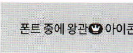

간혹-텍스트가제대로표시되지않고因또는曰 박스로보이는경우가 때는

언어 지원하지 않는 가능성이 큽니다.

- 1 우선 에디터 툴 바- -글꼴패널-문서 사용한서제중에 않

는 폰트가 있지

- 2

바의 - 글꼴 다시

발생하는표시 줄일 수 번 에서 자주 쓸 두고 꾸준히 것이 좋습니다.

LESSON 04 디자인의 재료 다루기: 텍스트 101

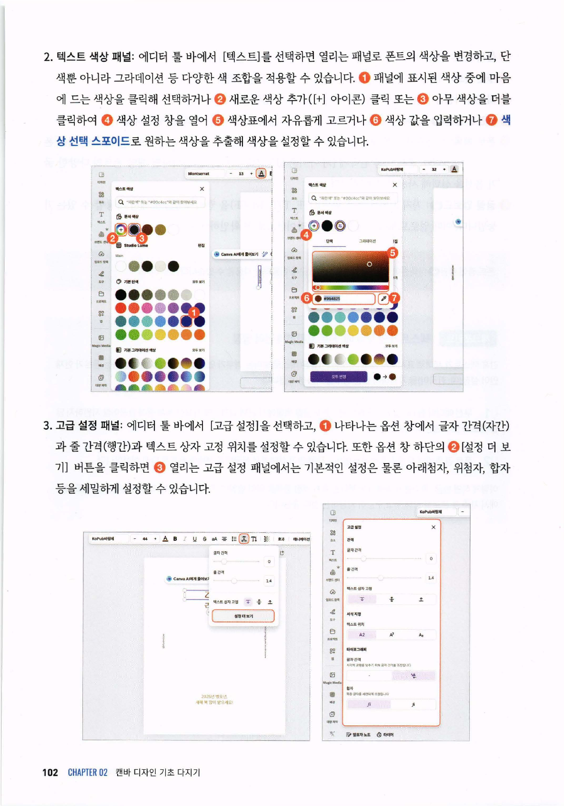

###### 2. 텍스트 색상 패널: 에디터 툴 바에서 [텍스트]를 선택하면 열리는 패널로 폰트의 색상을 변경하고, 단

색뿐 아니라 그라데이션 등 다양한 색 조합을 적용할 수 있습니다. O 패널에 표시된 색상 중에 마음

에 드는 색상을 클릭해 선택하거나 O 새로운 색상 추가([+] 아이콘) 클릭 또는 O 아무 색상을 더불 클릭하여 O 색상 설정 창을 열어 O 색상표에서 자유롭게 고르거나 O 색상 값을 입력하거나 O 색

로 원하는 색상을 추출해 색상을 설정할 수 있습니다.

口

~,넬•

l~

3t

__t - " ♦ EI

끄 + 스

3Q8

s '

X

X

않

·색상

}•`•

g F g g A 요

Tg@tGi

a

; 曲 5

Q ·따"． 또는."O<-OCC...i/01 .........

Ti 3

•

Q0

。

5

蟲

.s

-g

'S

그라대.,신

•

현집

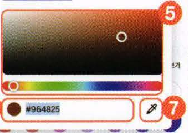

0m""'게aOl!VI '"

_r

쓰 g

4s

•••••••••••••••

ll

1-·f2j....···r...·r'I·····•

"''른만

요••기

.

....e

e

｀

ll.. ~ ,,,

••

怨·

8?

I"嶋Z"""g •••D••

.i,II!고四어선색상

•‘C.••

• ”

O-

갸고口어선안t

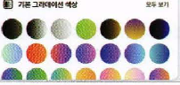

.....

! :..

-- •➔•

###### 3. 고급 설정 패널: 에디터 툴 바에서 [고급 설정]을 선택하고, 0 나타나는 옵션 창에서 글자 간격(자간)과 줄 간격(행간)과 텍스트 상자 고정 위치를 설정할 수 있습니다. 또한 옵션 창 하단의 O[설정 더 보

기] 버튼을 클릭하면 O 열리는 고급 설정 패널에서는 기본적인 설정은 물론 아래첨자, 위첨자, 합자

등을 세밀하게 설정할 수 있습니다.

댜

"R止내랄`'

f

X

認 a

고급쉘정

홍

"'Pu따’, " • 스 B I µ 6 러 字 떄검Tl

효 1신

###### 간려

g

###### T

글자 11걱

嶋

®* I ·간적

·간격

L4

c"W• 쩌께틀어"'

모...

L‘

###### .......

.:

뻬실지고월

。

근

h 운

오

###### Z

오

r| 2

4 "

.[

서식지뺄

###### ....e!

`뛰치

.＇_

A2

A2

A’

鬱·결

T

...,‘

租"

다어V7제미

시라••••••가••．지U··조......

i1지긴직

硏)

떤

###### 5조•i

헐지

.g0

궐지I g

•

202<;년뺑오년

fi

Ji

세때 빼 \'lOI'i!으세요

g g

x• 강맡m"로 O 印l이

###### 102 CHAPTER 02 캔바디자인 기조 다지기

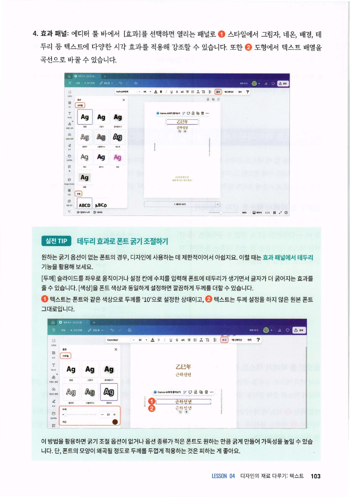

- 4. 효과 패널 에디터 툴 바에서 [효과]를 선택하면 열리는 패널로O 스타일에서 그림자, 네온, 배경, 테 두리 등 텍스트에 다양한 시각 효과를 적용해 강조할 수 있습니다. 또한 O 도형에서 텍스트 배열을

곡선으로 바꿀 수 있습니다.

###### ... X

iil 0 C

: E9

; ; ^9 ^9

###### ~"....釣~＇ .,,。 alQ!i ···

.. 』 ITII"'

·

*.K..

-.. 隔 翰 礎

###### ’' +

。

###### 4 ." 禪 서,.,

"'

e Ag

“` &l

###### 察 떼홑 • ..

"-".•.. ..

e

••• @

###### 오 L』 p.SCo

."“

" liil..... ,I1 엷 .» G)

~· Y•~u \!>QOCal

###### 테두리 효과로폰트굵기 조절하기

원하는 옵션이 없는 폰트의 경우, 디자인에 사용하는 데 아쉽지요. 이럴 때는 효과 패널에서

두께] 슬라이드를 좌우로 움직이거나 칸에 수지를 입력해 폰트에 테두리가 생기면서 글자가 더 굵어지는 효과를 수 . 색상과 두께를 수 있습니다.

O텍스트는폰트와같은색상으로두께를‘10'으로설정한상태이고,e텍스트는두께설정을하지 않은원본폰트

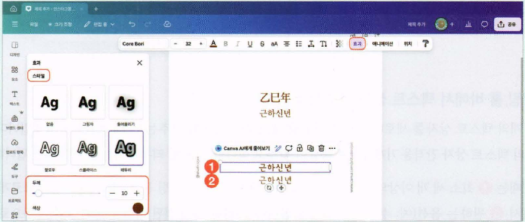

""s m X

###### : GD

I `춥T* Ag Ag Ag

乙巳年

근하신

###### `. 1

###### 8

보

......4 韓~

~"""齡lmI / c a ® @ ...

。

IA@

....

나: .-.~1

li

—.·“"L.스

·료후

') +

宗

이 활용하면 굵기 옵션이 없거나 옵션 종류가 적은 폰트도 원하는 굵게 가독성을 높일 수 있습

니다 단, 폰트의 모양이 왜곡될 정도로 두께를 두껍게 적용하는 피하는 게 좋아요.

LESSON 04 디자인의 재료 다루기: 텍스트 103

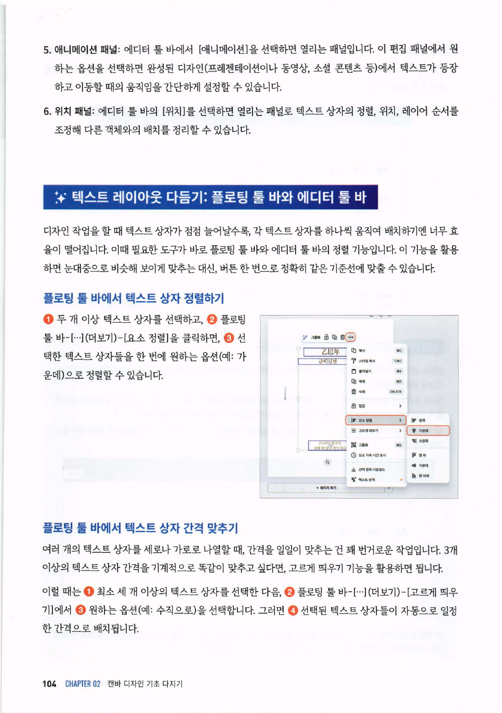

- 5. 애니메이션 패날 에디터 툴 바에서 [애니메이션]을 선택하면 열리는 패널입니다. 이 편집 패널에서 원 하는 옵션을 선택하면 완성된 디자인(프레젠테이션이나 동영상, 소셜 콘텐츠 등)에서 텍스트가 등장 하고 이동할 때의 움직임을 간단하게 설정할 수 있습니다.
- 6. 위치 패널 에디터 툴 바의 [위치]를 선택하면 열리는 패널로 텍스트 상자의 정렬, 위치, 레이어 순서를 조정해 다른 객체와의 배치를 정리할 수 있습니다.

###### | |

디자인 작업을 할 때 텍스트 상자가 점점 늘어날수록, 각 텍스트 상자를 하나씩 움직여 배치하기엔 너무 효

율이 떨어집니다. 이때 필요한 도구가 바로 플로팅 툴 바와 에디터 툴 바의 정렬 기능입니다. 이 기능을 활용

하면 눈대중으로 비슷해 보이게 맞추는 대신, 버튼 한 번으로 정확히 같은 기준선에 맞출 수 있습니다.

###### 텍스트 상자 정렬하기

O 두 개 이상 텍스트 상자를 선택하고, O 플로팅

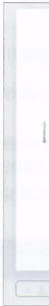

툴 바-[…］（더보기)-［요소 정렬]을 클릭하면, 0 선

/ :,... " 학

| 乙 0 ..사

###### "C

택한 텍스트 상자들을 한 번에 원하는 옵션(예: 가 운데)으로 정렬할 수 있습니다.

l 근바· 7 스맥빼서

###### `翼C

O 硏WI ®며

翼V

翼D

맵 식뻬 ”"''

###### [ °“

###### ,.,.필.

니 II'll롤

###### >( * ~:

三 고르게띄우기

| 翼 그.If *c 'Il

® 오쩌시간1 下 뺀”

tl

土

.I!.

핫빽식I !!'!

♦

텍스트 상자

여러 개의 텍스트 상자를 세로나 가로로 나열할 때, 간격을 일일이 맞추는 건 꽤 번거로운 작업입니다. 3개 이상의 텍스트 상자 간격을 기계적으로 똑같이 맞추고 싶다면, 고르게 띄우기 기능을 활용하면 됩니다.

이럴 때는 O 최소 세 개 이상의 텍스트 상자를 선택한 다음, O 플로팅 툴 바-[…］ （더보기)-［고르게 띄우 기]에서 O 원하는 옵션(예: 수직으로)을 선택합니댜 그러면 O 선택된 텍스트 상자들이 자동으로 일정

한 간격으로 배치됩니다.

104 캔바 디자인 기조 다지가

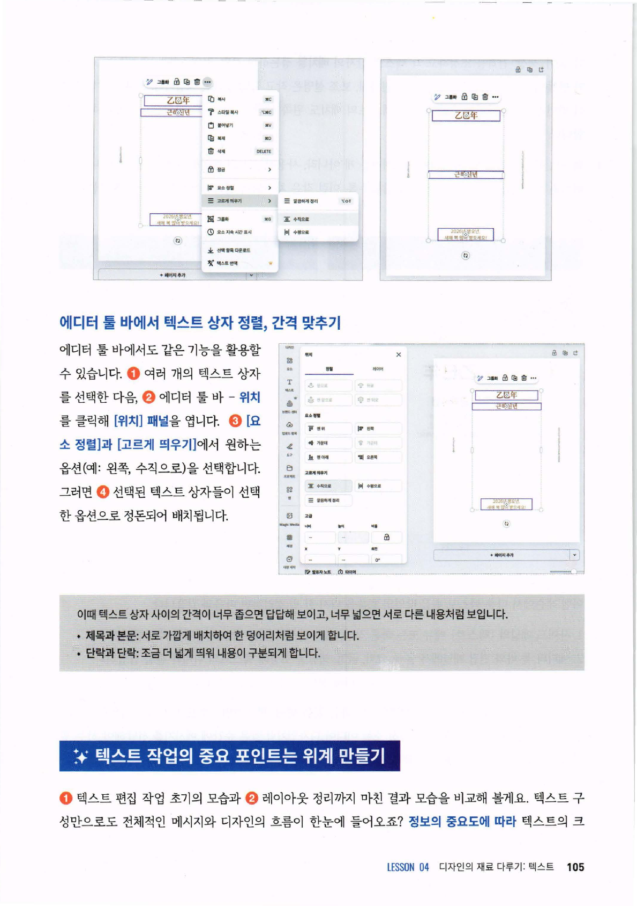

###### a © C

· ::,.. alre1iil •..

/ 그" iil Ce B ···

| 0 ·서

· C

븐 T 삭며·서

X翼C

###### °“WI

翼V

re ""

.。

떠

DELrn

###### ID ••

1:- 오렬`’

###### .. 互

三

륄롭게휠러 tOT

| ．； 따,••

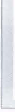

###### 1°1 안'2J1 | 서모 ;9 |

O 포XI*虫E

C>

* 신···다릅m

t)

찻 오스번이

###### 텍스트 상자 정렬, 간격 맞주기

에디터 툴 바에서도 같은 기능을 활용할

a © C

X

”倉

認

###### ••

수 있습니다. O 여러 개의 텍스트 상자

”

嶋어°’

·:,? 그•• iii la tm •••

T

& 달 I '?

`포

###### .....‘

###### l| :'포L1넌 \

를선택한다움, O 에디터 툴바 - 위치

• . @

를 클릭해 패널을 엽니다. O

요소"

."o" -.. ""

r 던록

###### ..4

소 [고르게 에서 원하는

예’ 가을"

떠 오른틀

뇨 “아

###### .....e,

옵션(예 : 왼쪽, 수직으로)을 선택합니다.

고"”mI

그러면 O 선택된 텍스트 상자들이 선택

怨·

고: ""

e·"e-g7

I c ;！ : |

三 •볼＂개를리

|

꼬

한 옵션으로 정돈되어 배치됩니다.

###### ... ...

###### L

###### "

###### ..

a

♦ ·어지"

~ i g

t

0·

一

이때 보이고, 너무 다른 내용처럼 보입니다.

- • 한 보이게 합니다.
- • 더

###### | |

O 텍스트 편집 작업 초기의 모습과 O 레이아웃 정리까지 마친 결과 모습을 비교해 볼게요. 텍스트 구

성만으로도 전체적인 메시지와 디자인의 흐름이 한눈에 들어오죠? 정보의 따라 텍스트의 크

SSON 디자인의 재료 다루기: 텍스트 105

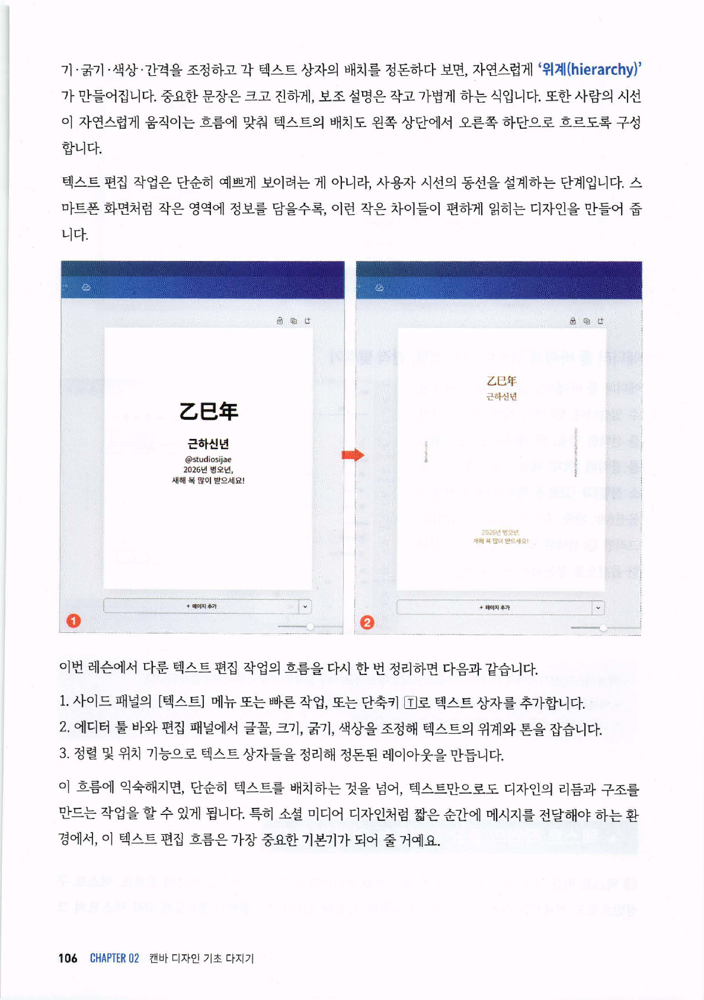

###### 기굵기 · 색상간격을 조정하고 각 텍스트 상자의 배치를 정돈하다 보면, 자연스럽게 ‘위계(hierarchy)'

- 가 만들어집니다. 중요한 문장은 크고 진하게, 보조 설명은 작고 가볍게 하는 식입니다. 또한 사람의 시선 이 자연스럽게 움직이는 흐름에 맞춰 텍스트의 배치도 왼쪽 상단에서 오른쪽 하단으로 흐르도록 구성 합니다.

텍스트 편집 작업은 단순히 예쁘게 보이려는 게 아니라, 사용자 시선의 동선을 설계하는 단계입니다. 스

마트폰 화면처럼 작은 영역에 정보를 담을수록, 이런 작은 차이들이 편하게 읽히는 디자인을 만들어 줍 니댜

a @ 巳

乙巳年

근하산년

乙巳年

근하신년

@studiosijae

2026년 병오년, 새해 복 많이 받으세요!

명오년 섀혜틀압이닫으세ll’

+ + 빼0

。

'- ..

이번 레슨에서 다룬 텍스트 편집 작업의 흐름을 다시 한 번 정리하면 다음과 같습니다.

- 1. 사이드 패널의 [텍스트] 메뉴 또는 빠른 작업, 또는 단축키 띠로 텍스트 상자를 추가합니댜
- 2. 에디터 툴 바와 편집 패널에서 글꼴, 크기, 굵기, 색상을 조정해 텍스트의 위계와 톤을 잡습니다.
- 3. 정렬 및 위치 기능으로 텍스트 상자들을 정리해 정돈된 레이아웃을 만듭니다.

이 흐름에 익숙해지면, 단순히 텍스트를 배치하는 것을 넘어, 텍스트만으로도 디자인의 리듬과 구조를

###### 만드는 작업을 할 수 있게 됩니댜 특히 소셜 미디어 디자인처럼 짧은 순간에 메시지를 전달해야 하는 환

경에서, 이 텍스트 편집 흐름은 가장 중요한 기본기가 되어 줄 거예요.

106 02 캔바 디자인 기조 다지기

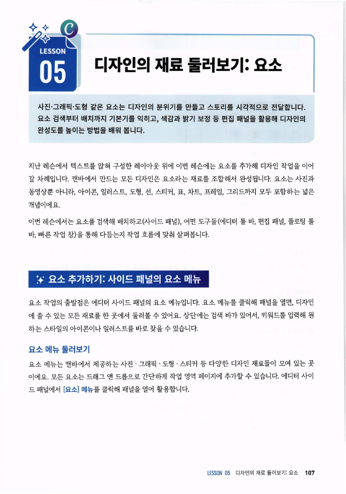

###### 디자인의 재료 툴러보기: 요소

사진·그래 픽 ·도형 요소는 디자 분위기 만들고 스토리룔 시각적으로 요소 검색부터 배지까지 기본기 익히고,

높이는 봅니다.

지난 레슨에서 텍스트를 앉혀 구성한 레이아웃 위에 이번 레슨에는 요소를 추가해 디자인 작업을 이어 갈 차례입니댜 캔바에서 만드는 모든 디자인은 요소라는 재료를 조합해서 완성됩니다. 요소는 사진과 동영상뿐 아니라, 아이콘, 일러스트, 도형, 선, 스티커, 표, 차트, 프레임, 그리드까지 모두 포함하는 넓은

개념이에요.

이번 레슨에서는 요소를 검색해 배치하고(사이드 패널)， 어떤 도구들(에디터 툴 바, 편집 패널, 플로팅 툴 바, 빠른 작업 창)을 통해 다듬는지 작업 흐름에 맞춰 살펴봅니다.

###### | 메 |

요소 작업의 출발점은 에디터 사이드 패널의 요소 메뉴입니다. 요소 메뉴를 클릭해 패널을 열면, 디자인 에 쓸 수 있는 모든 재료를 한 곳에서 둘러볼 수 있어요. 상단에는 검색 바가 있어서, 키워드를 입력해 원

- 하는 스타일의 아이콘이나 일러스트를 바로 찾을 수 있습니다.

###### 요소매뉴둘러보기

요소 메뉴는 캔바에서 제공하는 사진 · 그래픽 · 도형 · 스티커 등 다양한 디자인 재료들이 모여 있는 곳

###### 이에요. 모든 요소는 드래그 앤 드롭으로 간단하게 작업 영역 페이지에 추가할 수 있습니다. 에디터 사이

###### 드 패널에서 메뉴를 클릭해 패널을 열어 활용합니다.

LESSON 05 디자인의 재료 둘러보기: 요소 107

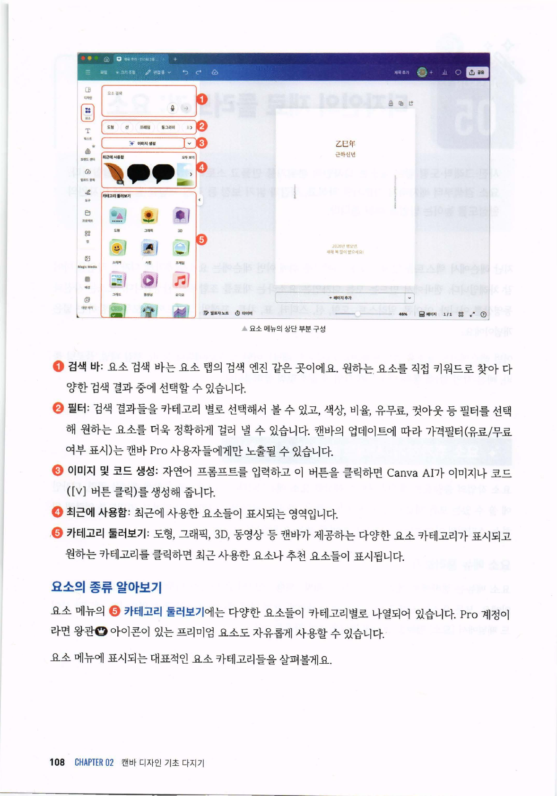

p

I + C I

:[""

n

iil ia ct

T [ 도혈 선 므대입 틀펙 JO

...* ( ' O!OI지생성 E

鬪"

I Ill

근

###### ..

4

.!VI

##### ll`E) •• -1그•츠•' ~l01

~,

혈

....“”" 스 시e! .....

@

••• - l n!

###### 그러드 ... .q.

。 지

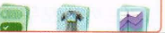

...

.... liiJ II01지 1/1 gg •• 0

子밑鳳지노. 。 다어머

요소 메뉴의 상단 부분 구성

O 검색 바: 요소 검색 바는 요소 탭의 검색 엔진 같은 곳이에요. 원하는 요소를 직접 키워드로 찾아 다

양한 검색 결과 중에 선택할 수 있습니다.

O 필터: 검색 결과들을 카테고리 별로 선택해서 볼 수 있고, 색상, 비율, 유무료, 컷아웃 등 필터를 선택

해 원하는 요소를 더욱 정확하게 걸러 낼 수 있습니다. 캔바의 업데이트에 따라 가격필터(유료/무료

여부 표시)는 캔바 Pro 사용자들에게만 노출될 수 있습니다.

O 이미지 및 코드 생성: 자연어 프롬프트를 입력하고 이 버튼을 클릭하면 Canva AI가 이미지나 코드

([Y] 버튼클릭)를생성해 줍니다.

O 죄근에 사용함: 최근에 사용한 요소들이 표시되는 영역입니다. O 카테고리 둘러보기: 도형, 그래픽, 3D, 동영상 등 캔바가 제공하는 다양한 요소 카테고리가 표시되고

원하는 카테고리를 클릭하면 최근 사용한 요소나 추천 요소들이 표시됩니다.

요소의종류알아보기

요소 메뉴의 O 카테고리 둘러보기에는 다양한 요소들이 카테고리별로 나열되어 있습니다. Pro 계정이

라면 왕관O 아이콘이 있는 프리미엄 요소도 자유롭게 사용할 수 있습니댜

요소 메뉴에 표시되는 대표적인 요소 카테고리들을 살펴볼게요.

108 캔바 디자인 기조 다지기

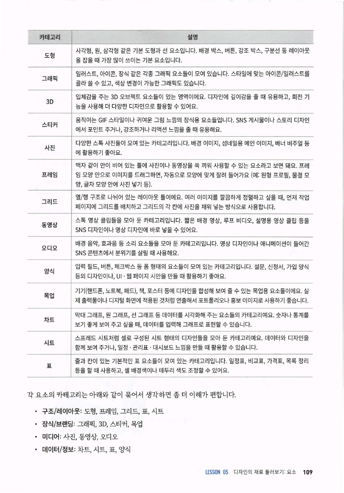

|I| |
|---|---|
|도형|사각형, 원, 삼각형 같은 기본 도형과 선 요소입니다. 배경 박스, 버튼, 강조 박스, 구분선 등 레이아웃 을 잡을 때 가장 많이 쓰이는 기본 요소입니다.|
|그래픽|일러스트, 아이콘, 장식 같은 각종 그래픽 요소들이 모여 있습니다. 스타일에 맞는 아이콘/일러스트를  골라 쓸 수 있고, 색상 변경이 가능한 그래픽도 있습니다.|
|3D|입제감을 주는 3D 오브젝트 요소들이 있는 영역이에요. 디자인에 깊이감을 줄 때 유용하고, 회전 기  능을 사용해 더 다양한 디자인으로 활용할 수 있어요.|
|스티커|움직이는 GIF 스타일이나 귀여운 그림 느낌의 장식용 요소들입니다. SNS 게시물이나 스토리 디자인 에서 포인트 주거나, 강조하거나 리액션 느낌을 쥴 때 유용해요.|
|사진|다양한 스톡 사진들이 모여 있는 카테고리입니다. 배경 이미지, 섬네일용 메인 이미지, 배너 비주얼 등  에활용하기좋아요.|
|프레임|액자 같이 안이 비어 있는 틀에 사진이나 동영상을 쏙 끼워 사용할 수 있는 요소라고 보면 돼요. 프레  임 모양 안으로 이미지를 드래그하면, 자동으로 모양에 맞게 잘려 들어가요 (예: 원형 프로필, 물결 모 양, 글자 모양 안에 사진 넣기 등).|
|그리드|열/행 구조로 나뉘어 있는 레이아웃 틀이에요. 여러 이미지를 깔끔하게 정렬하고 싶을 때, 먼저 작업  페이지에 그리드를 배지하고 그리드의 각 칸에 사진을 채워 넣는 방식으로 사용합니다.|
|동영상|스톡 영상 클립둘을 모아 둔 카테고리입니다. 짧은 배경 영상, 루프 비디오, 설명용 영상 클립 등을  SNS 디자인이나 영상 디자인에 바로 넣을 수 있어요.|
|오디오|배경 음악, 효과음 등 소리 요소들을 모아 둔 카테고리입니다. 영상 디자인이나 애니메이션이 들어간  SNS 콘텐츠에서 분위기를 살릴 때 사용해요.|
|Oot시-,|입력 필드, 버튼, 제크박스 등 폼 형태의 요소들이 모여 있는 카테고리입니다. 설문, 신정서, 가입 양식  등의 디자인이나, UI · 웹 페이지 시안을 만들 때 활용하기 좋아요.|
|목업|기기(핸드폰, 노트북, 패드)， 잭, 포스터 등에 디자인을 합성해 보여 쥴 수 있는 목업용 요소들이에요. 실  제 출력물이나 디지털 화면에 적용된 것처럼 연출해서 포트폴리오나 홍보 이미지로 사용하기 좋습니다.|
|자트|막대 그래프, 원 그래프, 선 그래프 등 데이터를 시각화해 주는 요소들의 카테고리예요. 숫자나 통계를  보기 좋게 보여 주고 싶을 때, 데이터를 입력해 그래프로 표현할 수 있습니다.|
|시트|스프레드 시트처럼 셀로 구성된 시트 형태의 디자인들을 모아 둔 카테고리예요. 데이터와 디자인을 함께 보여 주거나, 일정 · 관리표 · 대시보드 느낌을 만들 때 활용할 수 있습니다.|
|표|줄과 칸이 있는 기본적인 표 요소둘이 모여 있는 카테고리입니다. 일정표, 비교표, 가격표, 목록 정리  등을 할 때 사용하고, 셀 배경색이나 테두리 색도 조정할 수 있어요.|

각 요소의 카테고리는 아래와 같이 묶어서 생각하면 좀 더 이해가 편합니다.

- • 구조/레이아웃: 도형, 프레임, 그리드, 표, 시트
- • 장식/브랜당 그래픽, 3D, 스티커, 목업
- • 미디야 사진, 동영상, 오디오
- • 데이터/정보: 차트, 시트, 표, 양식

LESSON 05 디자인의 재료 둘러보기 : 요소 109

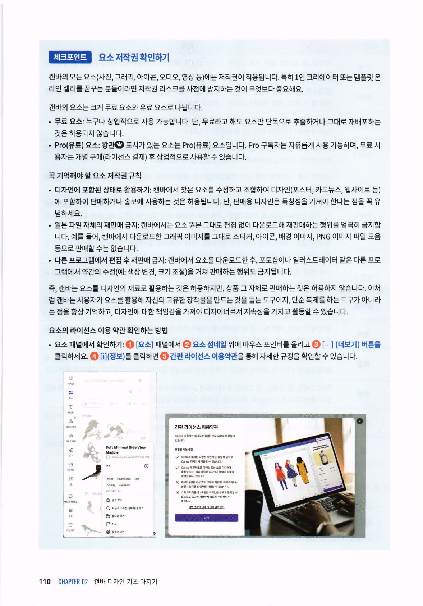

###### 요소저작권확인하기

캔바의모든요소(사진,그래픽,아이콘,오디오,영상등)에는저작권이적용됩니다.특히 1인크리에이터또는템플릿온

라인 셀러를 꿈꾸는 분들이라면 저작권 리스크를 사전에 방지하는 것이 무엇보다중요해요.

캔바의 요소는 크게 무료 요소와 유료 요소로 나뉠니다.

- • 무료 요소: 누구나 상업적으로 사용 가능합니다. 단, 무료라고 해도 요소만 단독으로 주줄하거나 그대로 재배포하는 것은 허용되지 않습니다.
- • Pro(유료) 요소: 표시가 있는 요소는 Pro(유료) 요소입니다. Pro 구독자는 자유롭게 사용 가능하며, 무료 사 용자는 개별 구매(라이선스 결제) 후 상업적으로 사용할 수 있습니다.

꼭 기억해야 할 요소 저작권 규칙

- • 디자인에 상태로 활용하기: 캔바에서 잦은 요소를 수정하고 조합하여 디자인(포스터, 카드뉴스, 웹사이트 등) 에 포함하여 판매하거나 사용하는 것은 허용됩니다. 단, 디자인은 독장성을 가져야 한다는 점을 꼭 유 념하세요.
- • 원본 파일 자제의 재판매 금지: 캔바에서는 요소 원본 그대로 편집 없이 다운로드해 재판매하는 행위를 엄격히 금지합 니다. 예를 들어, 캔바에서 다운로드한 그래픽 이미지를 그대로 스티커, 아이콘, 배경 이미지, PNG 이미지 파일 모음 등으로 판매할 수는 없습니다.
- • 다른 프로그램에서 후 금지: 캔바에서 요소를 다운로드한 후, 포토샵이나 일러스트레이터 같은 다른 프로 그램에서 약간의 수정(예: 색상 변경, 크기 조절)을 거쳐 판매하는 행위도 금지됩니다.

즉, 캔바는 요소률 디자인의 재료로 활용하는 것은 허용하지만, 상품 그 자제로 판매하는 것은 허용하지 않습니다. 이저

사용자가 요소를 활용해 자신의 고유한 장작물을 만드는 돕는 도구이지, 단순 하는 도구가 아니라

는 항상 기억하고, 디자인에 대한 책임감을 가져야 디자이너로서 지속성을 가지고 수 있습니다.

요소의 라이선스 이용 약관 확인하는 방법

• 요소패널에서확인하기: [요소1 패널에서 위에마우스포인터를올리고 8 [···

클릭하세요.O[i]（정보)를클릭하면G간편 율통해 자세한규정을확인할수 있습니다.

따

###### ..

u..

T

••‘,..,

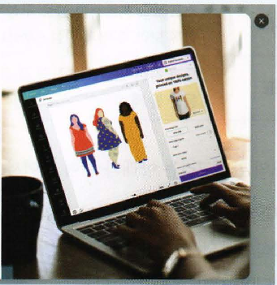

###### 간편라이선스이용악관

Cmm 아 다다어.Ill.... 무ll어" ..

###### M..,,,.

4

Soft inimalSide View

###### ”틴사권단

>."` ‘’L,"

V' 다탈한 >It) 또는"""

eg

c"떠디자안빼서•• ．”며

v, cmv"""며짜""mr回데

" C) `x.. """'""" "m

"“·도리己峰"언디자어·어""

舒

......도므e니q

X 이CIOiii■""머그대"..........",...

_, ....』나,

튼언의 것때 서• .

X 스"tlOI"＇포털단마函"""..

e;

•고데 ••의터시기

습 혈묘 IIAI

버립니다.

M... " ...

•

a. 지급적비숫언어OI지q .기

려이시스메 대뻬 지세터 촬어별기

e ·ct에"'

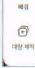

p 신고

#

認털`"＇’

,.尸

110 CHAPTER 02 캔바 디자인 기조 다지기

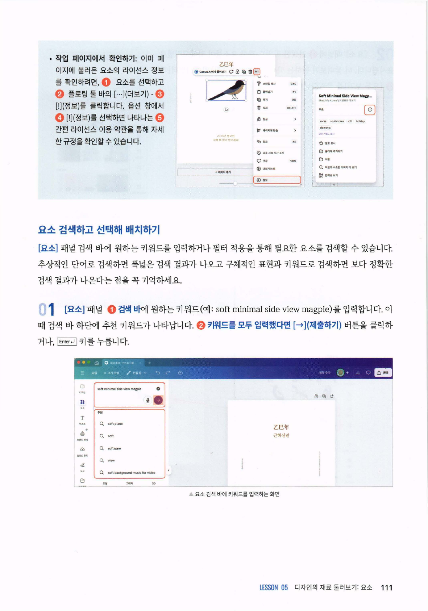

• 작업 페이지에서 : 이미 페

om."...mI c a © eO

이지에 불러온 요소의 라이선스 정보

를 O 요소를 선택하고 O 바의 […]（더보기) -O

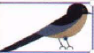

T 색혈빼서

###### °...w,,

t •c

SoIt MInIm·I SId• Vl•w M•‘ p.~

" ..."••••,'""'

©…

翼O

[！］（정보)를 클릭합니다. 옵션 장에서

ou."'

###### ” 巳

@ ....

###### ’’

O [！］（정보)를 선택하면 나타나는

O m

###### m"‘ "m""' "h hdmw

자세

이J.』"

ii' ....쩌혈•

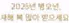

’ "크

.

(0"—l

白 ···시

E’ 止..."＇기 e' "틀

O m: 민며3 ' C 댓글

`."

Q 땔"'"＇야미지아"

O 미""

• ""지•가

헐．신鍾기

요소 검색하고 배지하기

[요소] 패널 검색 바에 원하는 키워드를 입력하거나 필터 적용을 통해 필요한 요소를 검색할 수 있습니다.

추상적인 단어로 검색하면 폭넓은 검색 결과가 나오고 구체적인 표현과 키워드로 검색하면 보다 정확한

검색 결과가 나온다는 점을 꼭 기억하세요.

###### 1 [요소]패널 O검색바에 원하는키워드(예:softminimalsideviewmagpie)를입력합니댜 이

때 검색 바 하단에 추천 키워드가 나타납니다. O 모두 버튼을 클릭하

###### 거나, 돈―긴 키를누릅니댜

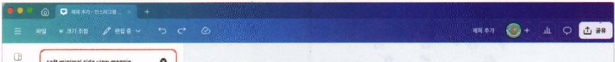

softminimalside버.w-• 。

a @ c

9 . -'

|‘ ”ft

乙巳年

근하산년

- • • < ...

o ..ftw"

- ••도 •• L,C`.J

쓰

요구 l Q soft....,,...,.musicfot,.,..

###### ,.,. ..

e,

드.

요소 검색 바에 키워드를 입력하는 화면

LESSON 05 디자인의 재료 둘러보기: 요소 111

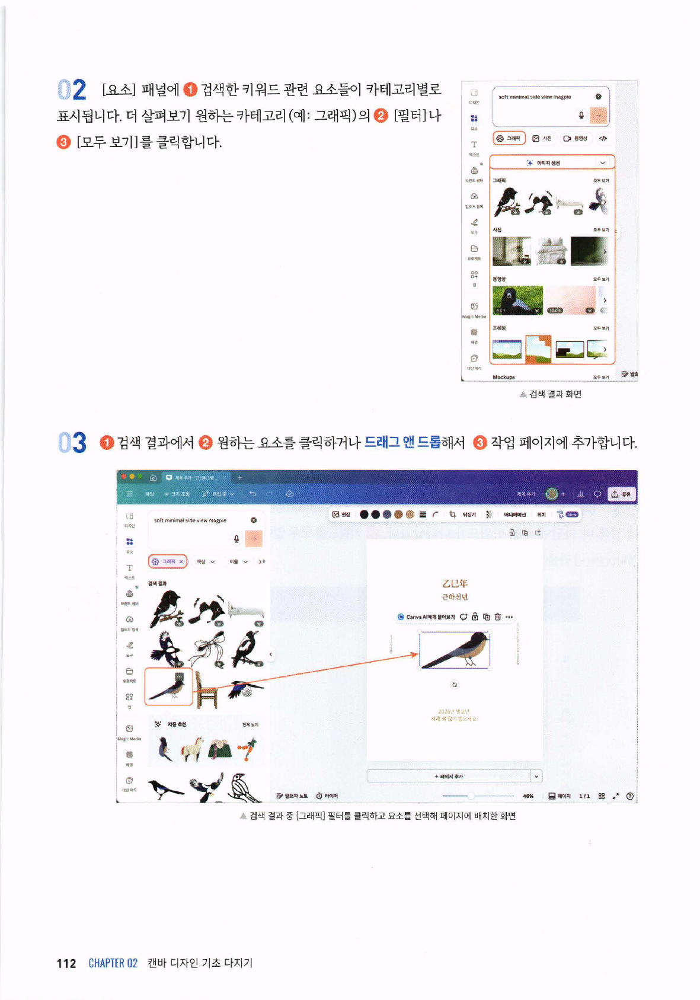

###### softminIm이…"viewm_:<\

2 [부] 패널에O검색한키워드관련요소들이 카테고리별로

Ut

""

표시됩니다. 더 살펴보기 원하는카테고리(예: 그래픽)의 [필터]나

0 [모두보기]를클릭합니댜

T e 때 D "ti <1>

###### *

:.

金

".c... 그데빼

###### k자 : ·0'

。

업量••

., 서

쓰

·투모기

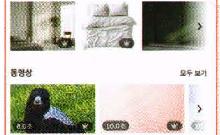

e,

###### ..`.

g?

•

@

뻔*”...

###### ·; ll□~ □.:J도···기

어

l Moclcups 모”"＇ 尹미

... 검색결과화면

###### 3 0검색결과에서 0원하는요소를클릭하거나드래그앤드롭해서 O작업페이지에 추가합니댜

softmini때1.-.v;•wm,gpi• 0

###### a © 巳

:; 9

·오 G구리 색실 V ttll v )0

###### .,.T

*

乙巳年

군 2n ;

근하신넌

c,nv,AI대게駒mI 0 a ® @ ...

";"" I...

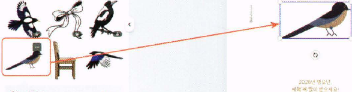

e

”豊`.

C)

8?

• ’ 자틀.e 여量기

硏

M이*”....

(f'I, " 구

•

뻬틀

...o... `Y요

7 랄m노. 。印 ".. 1ii1 ....囚 1/1 gg ,翼 ®

검색 결과 증 [그래픽] 필터를 클릭하고 요소를 선택해 페이지에 배지한 화면

###### 112 CHAPTER 02 캔바 디자인 기초 다지기

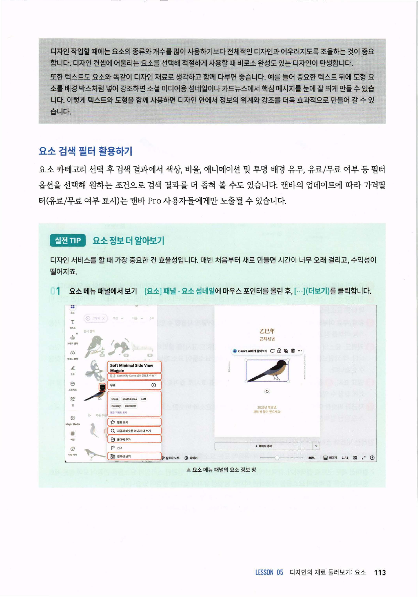

디자인 개수를

합니다. 어울리는 요소를 선택해 때 탄생합니다.

똑같이 생각하고 뒤에 요

넣어 소셜 핵심 띄게 수

이렇게 갈 수 있 습니다.

###### 요소검색필터활용하기

요소 카테고리 선택 후 검색 결과에서 색상, 비율, 애니메이션 및 투명 배경 유무, 유료/무료 여부 등 필터 옵션을 선택해 원하는 조건으로 검색 결과를 더 좁혀 볼 수도 있습니다. 캔바의 업데이트에 따라 가격필

터(유료/무료 여부 표시)는 캔바 Pro 사용자들에게만 노출될 수 있습니다.

###### 요소정보더알아보기

디자인 서비스를 할 가장 효율성입니다. 처음부터 새로 너무 오래 걸리고, 수익성이

떨어지죠.

- 1 요소메뉴 보기 -요소 에 마우스포인터를 올린 후, [·.·](더보기)를클릭합니다.

# 0 )I,

T

乙

송..,

근하신년

먀 ..

Canv.""齡lmI 0 a ® 펩 •••

4 & 戶굶己孟alSideVi-

혈"..

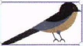

M.cI.

\ ~ lu 。

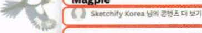

”

·법@~ :.:=\

C)

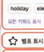

2026년

m:지급과바숫현이여지더보기

• ’

”"""

###### ..

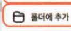

+빼o

..인. `뇨,.,1

“` 1ii1 ...t,i 1/1 器 «翼 ®J

###### LII"꼬 O~

... 매뉴 패널의 요소 창

LESSON 디자인의 재료 둘러보기: 요소 113

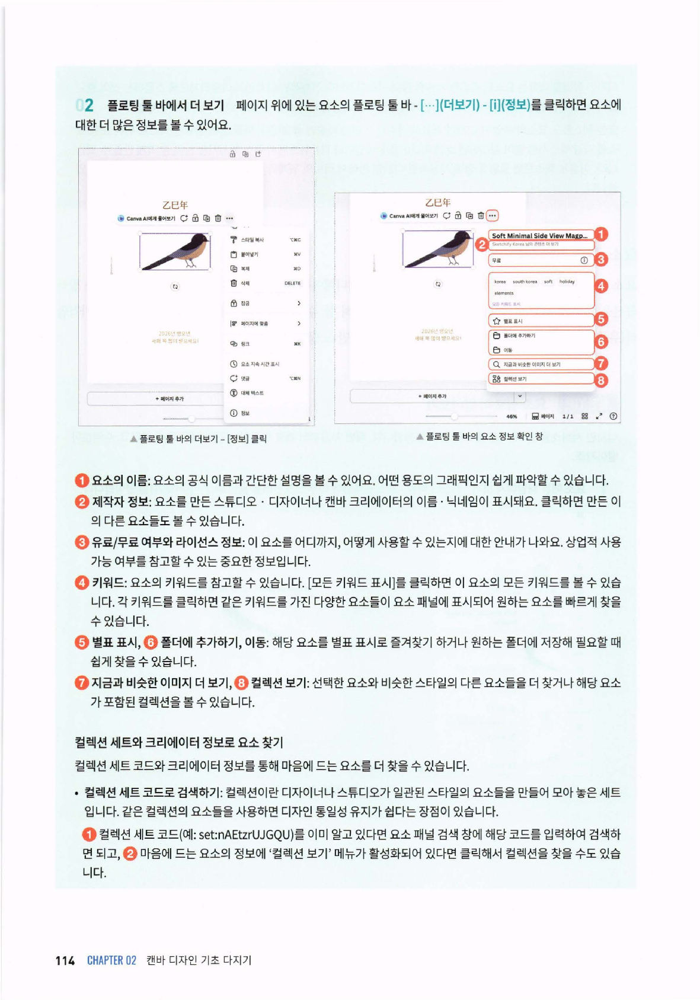

7

- 2 플로팅 툴 바에서 더 보기 페이지 위에 있는요소의 플로팅 툴 바-[…］（더보기) - ［i]（정보) 클릭하면 요소에

대한더 많은정보를볼수있어요.

a © C

'- 乙巳年

乙巳年

Canv"'.."어~I 0 8 ® 맵

"m.""Fl!VI C ID ~ ® .•.

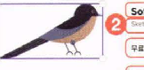

SoRMinIm.,-Sid~_View M•A~--

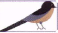

T 적'II．사

됴<. ,''".... ”,.,""

`翼C

(i)::E>

° “WI

###### C) I…IOUt11korfl …~』y

@ m C) @ 석빼

O

D•u:''

d어Tmts

© 집글

( 合 뺄표묘•I

靈 [e1tt1에"'＂'’ p

IP ..OI지에헐•

연》 밍크

已 어들

® 요소지·시간m』 C 엿글 ` mN

Q 祖"'*현.,.,지

°

( 踏 멀曲보기

® 따~므

•빼어지..,,

•빼지후가

(j) 집보

###### .... liil l!Ol'I 1 / 1 gg •' {!)

~ 플로팅 틀 바의 더보기 - [정보] 클릭 플로팅 툴바의 요소정보 확인 장

요소의 이름: 요소의 공식 이름과 간단한 설명을 볼 수 있어요. 어떤 용도의 그래픽인지 쉽게 파악할수 있습니다.

O제작자정보: 요소를 만든 스튜디오 · 디자이너나 캔바크리에이터의 이름·닉네임이 표시돼요. 클릭하면 만든 이

의 다른요소들도볼수있습니다.

유료/무료여부와라이선스정보:이요소를어디까지,어떻게사용할 수있는지에대한안내가 나와요, 상업적사용

가능 여부를 잠고할 수 있는 중요한 정보입니다.

O 키워드: 요소의 키워드를 잠고할수 있습니다. [모든 키워드 표시]를클릭하면 이 요소의 모든 키워드를 볼 수 있습

니댜 각 키워드를 클릭하면 키워드를 가진 요소들이 요소 패널에 표시되어 원하는 요소를 빠르게 잦을 수있습니댜

O 별표표시,0 폴더에 주가하기, 이동: 해당요소를 별표표시로 즐겨잦기 하거나원하는폴더에 저장해 필요할 때

쉽게잦을수있습니다.

O지금과 비슷한이미지 더 보기,G>컬렉션 보기:선택한요소와 비슷한스타일의 다른요소들을 더 잦거나해당요소

가 포함된 컬렉션을 볼 수 있습니다.

세트와 크리에이터 정보로 요소 찾기

컬렉션 세트 코드와 크리에이터 정보를 통해 마음에 드는 요소를 더 찾을 수 있습니다.

• 컬렉션 세트코드로검색하기: 컬렉션이란 디자이너나스튜디오가일관된 스타일의 요소들을 만들어 모아놓은세트

입니다. 같은 요소들을 사용하면 디자인 통일성 유지가 쉽다는 장점이 있습니다.

O컬렉션 세트코드(예:set:nAEtzrUJGQU)를이미 알고있다면요소패널 검색 창에 해당코드를 입력하여 검색하

면되고,e)마음에드는요소의 정보에컬렉션보기'메뉴가활성화되어 있다면클릭해서 컬렉션을잦을수도있습

니댜

114 CHAPTER 02 캔바 디자인 기조 다지기

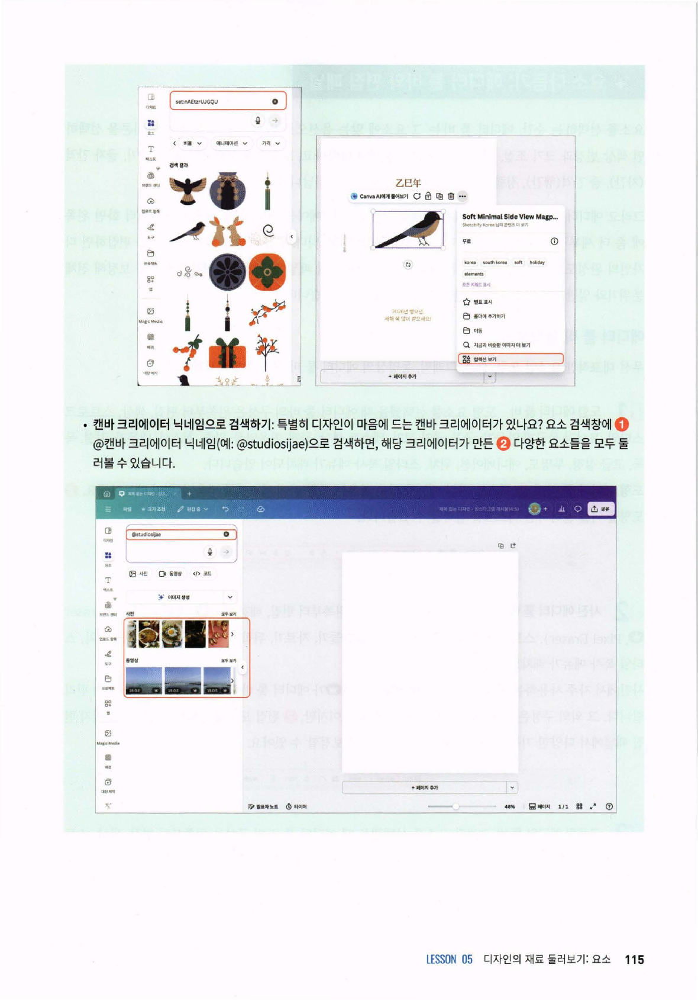

:一[ ·_UJGQu o ]

:: 9

••.:。·••ll!ft. i

“

( UI1 .., 예OIOI선 V 가격 v

T

•

낱 겁뻬 결과

乙巳年

"m.""配묘I c a ® @ ...

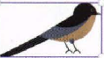

Soft Minimal SideVltw Mqp_

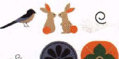

& g e

Q ,

s"어山 ••l 른뺀S 이•“

:”"~`.

무· 0

”·OO·

m x'°'...." m

')

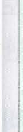

모,,"'c.^

..』Luuu

-:...... i i 广

台 뺄묘훌시

e, .더에후가하기 e, 。Iii

,o,.년엽오년

;,cg,

\어릴빼” 구"구`—

Q 지급>t•~l!•I이지더VI

& ”"lV

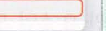

。

~"t - } 큐 l

• 빼지"

• 캔바크리에이터 닉네임으로검색하기: 특별히 디자인이 마음에 드는캔바크리에이터가있나요?요소검색창에O

@캔바크리에이터닉네임(예:＠studiosijae)으로검색하면,해당크리에이터가만든e>다양한요소들을모두둘

러볼수있습니다.

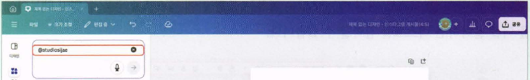

"..

:: L Q

® C

@ 사건 C' "상 <／，포

T

· ’~이때샐볼

“

###### ....

蟲

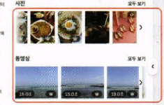

。

.., ••

4

도구

e,

”••

".."""

。

•..

###### ....0

L~

강탈m노 O 印I더 "% liil ...,지 l / l 誌 «» ®

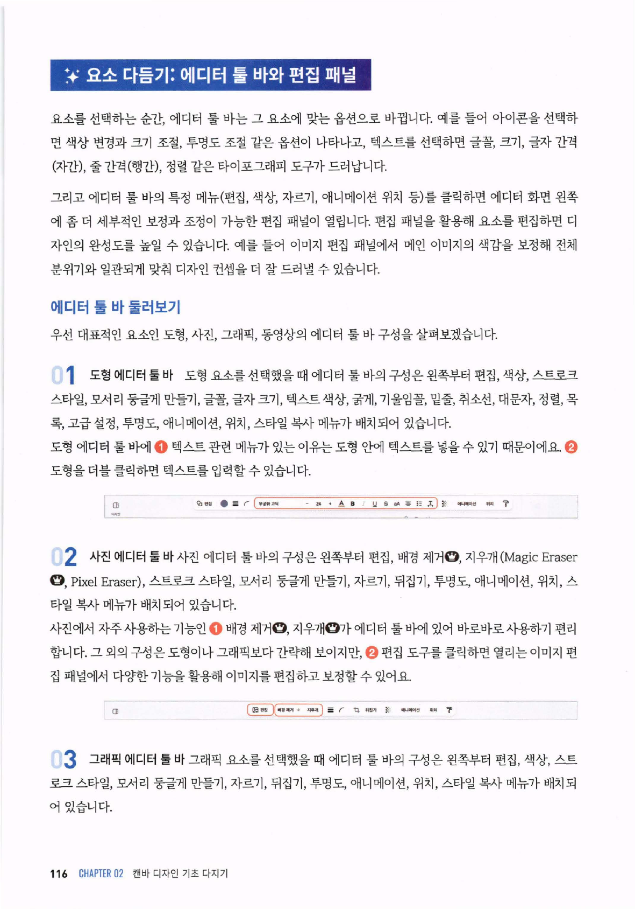

###### |

###### 요소를 선택하는 순간, 에디터 툴 바는 그 요소에 맞는 옵션으로 바뀝니다. 예를 들어 아이콘을 선택하

면 색상 변경과 크기 조절, 투명도 조절 같은 옵션이 나타나고, 텍스트를 선택하면 글꼴, 크기, 글자 간격 (자간)， 줄 간격 (행간)， 정렬 같은 타이포그래피 도구가 드러납니다.

그리고 에디터 툴 바의 특정 메뉴(편집, 색상, 자르기, 애니메이션 위치 등)를 클릭하면 에디터 화면 왼쪽 에 좀 더 세부적인 보정과 조정이 가능한 편집 패널이 열립니다. 편집 패널을 활용해 요소를 편집하면 디 자인의 완성도를 높일 수 있습니댜 예를 들어 이미지 편집 패널에서 메인 이미지의 색감을 보정해 전체

분위기와 일관되게 맞춰 디자인 컨셉을 더 잘 드러낼 수 있습니다.

###### 에디터툴바둘러보기

우선 대표적인 요소인 도형, 사진, 그래픽, 동영상의 에디터 툴 바 구성을 살펴보겠습니다.

###### 1 도형에디터툴바 도형 요소를선택했을때에디터 툴바의구성은왼쪽부터 편집,색상,스트로크

스타일, 모서리 둥글게 만들기, 글꼴, 글자크기, 텍스트색상, 굵게, 기울임꼴, 밑줄, 취소선, 대문자, 정렬, 목

록,고급설정, 투명도, 애니메이션, 위치, 스타일 복사메뉴가배치되어 있습니다.

도형 에디터 툴바에O 텍스트관련 메뉴가있는이유는도형 안에 텍스트를넣을수있기 때문이에요.e

도형을더블클릭하면텍스트를입력할수있습니다.

안턴G ;a; r (우"적 - ,. . B u s 따 字 :三 !.)것 몌'"d ”

0

CB t

###### 2 사진에디터툴바사진 에디터 툴바의구성은왼쪽부터 편집, 배경 제거o,지우개(MagicEraser

###### 0, Pixel Eraser), ~ 근 구 스타일, 모서리 둥글게 만들기, 자르기, 뒤집기, 투명도, 애니메이션, 위치, 스

타일복사메뉴가배치되어 있습니다.

사진에서 자주사용하는기능인 배경 제거o, 지우개C’가에디터 툴바에 있어 바로바로사용하기 편리

###### 합니댜그외의 구성은도형이나그래픽보다간략해 보이지만, 0 편집 도구를클릭하면 열리는이미지 편

집 패널에서 다양한 기능을 활용해 이미지를 편집하고 보정할 수 있어요솔

CB @ "~I날 짜 =r u 血깁기 § "'"`기t! mu T

###### 3 그래픽 에디터 툴 바그래픽 요소를선택했을 때 에디터 툴바의 구성은왼쪽부터 편집, 색상, 스트

로크 스타일, 모서리 둥글게 만들기, 자르기, 뒤집기, 투명도, 애니메이션, 위치, 스타일 복사 메뉴가 배치되

- 어 있습니다.

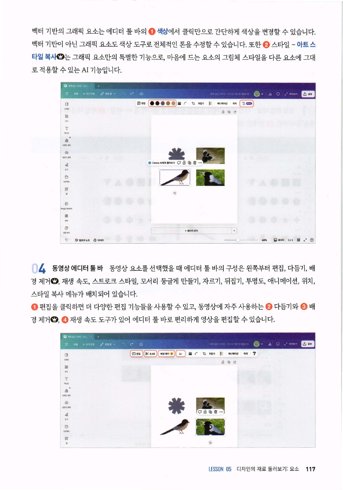

벡터 기반의그래픽 요소는에디터 툴바의 O 색상에서 클릭만으로간단하게 색상을변경할수있습니다. 벡터 기반이 아닌그래픽 요소도색상도구로전체적인 톤을수정할수있습니다.또한 스타일 - 아트스

###### 타일 복사CE근 그래픽 요소만의 특별한 기능으로, 마음에 드는 요소의 그림체 스타일을 다른 요소에 그대

로적용할수있는 AI 기능입니댜

"L%Eov 。 土 ••,,k'jV' "'i

CBg @미(•• ••);; r : 面l 것 ~'10l신 曲

었 a @ e

T

g@a

*

.-.

e5 *

5

er

.--'"

•”

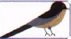

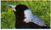

終

CI

”"k".”.g

e

+

q ...

| 다 "IIm포 O 磁門 " 달齡l지 1/1 認 重 ®

###### 4 동영상에디터툴바 동영상요소를선택했을때 에디터 툴바의 구성은왼쪽부터 편집, 다듬기, 배

경 제거o, 재생 속도, 人드무구스타일, 모서리 둥글게 만들기, 자르기, 뒤집기, 투명도, 애니메이션, 위치, 스타일복사메뉴가배치되어 있습니다.

###### 편집을클릭하면 더 다양한편집 기능들을사용할수있고, 동영상에 자주사용하는 다듬기와 0 배

경 제거0, 재생 속도도구가있어 에디터 툴바로편리하계 영상을편집할수있습니다.

###### 圖z:；/마

CBg :; r ti. 취깁?I 沒 뻬～신 "~ 'i"

겁" a ® C

T

.”‘..

•

###### .....。

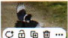

4

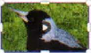

·구

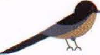

E,

”••

怨

Cl

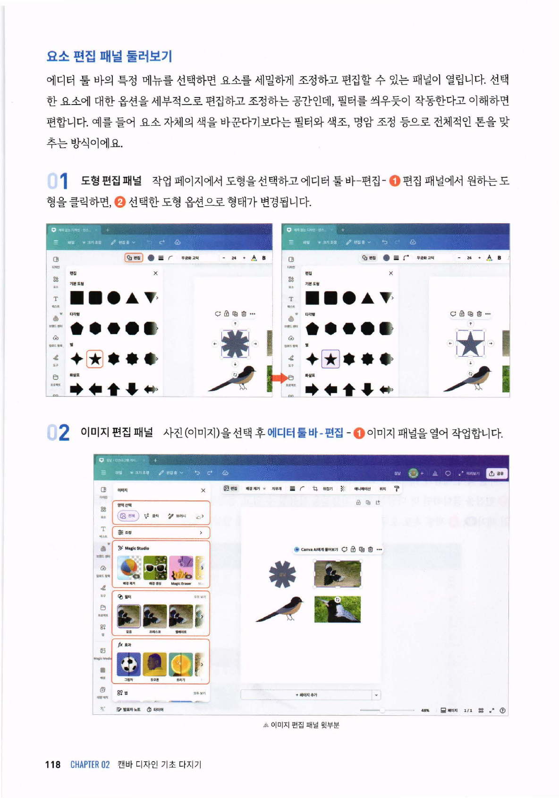

###### 요소편집패널둘러보기

에디터 툴 바의 특정 메뉴를 선택하면 요소를 세밀하게 조정하고 편집할 수 있는 패널이 열립니다. 선택

한 요소에 대한 옵션을 세부적으로 편집하고 조정하는 공간인데, 필터를 씌우듯이 작동한다고 이해하면

편합니댜 예를 들어 요소 자체의 색을 바꾼다기보다는 필터와 색조, 명암 조정 등으로 전체적인 톤을 맞

추는방식이에요.

1 도형편집패널 작업 페이지에서도형을선택하고에디터 툴바-편집-0편집 패널에서 원하는도

형을클릭하면, 선택한도형 옵션으로형태가변경됩니다.

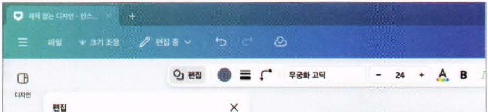

,

.......> .2,T.....

G) • ; r •궁빼고딕 - " + ~ B

디자`'

認.. ’'I!...

..........

X

,1톤도.

I`T스오

蟲날 다각. oa © 펩 ••• ®., 다

C mls l!!l •••

## 닙t ’

.....。 .

~·~··

...... .

••『.. ..

###### : 令 •• 三 궤t

。

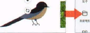

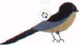

e, "ll

..,皇

二二빠4· 會 틀 臼)

빠*會_틀

2 이미지편집패널 사진(이미지)을선택후에디터툴바-편집-O이미지패널을열어 작업합니댜

###### ”疆도 설날 ,+ Oc디

###### 戶

x IE" " ..,, * 짜 "' r 1:+ "심기 효 ~~신 뛰지 "'j'

0 어미지

u..

a @ c

.y..... c)]

*

認

###### ur

###### •횔

3

###### 5T3

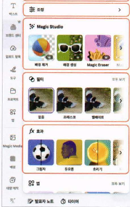

><

s.`

蟲

°"""釣mI o a @ @...

너lo

t

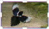

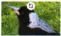

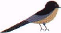

었엽 ..,.,,

·...,지후기

7冒1P1노. 印 ” liil亨지 1/1 認 •• o

’

~ 이미지 편집 패널 윗부분

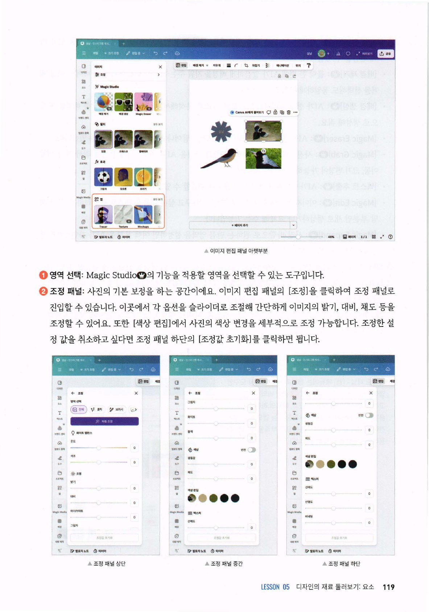

“노/륀밉．=

x @" "C* ...,. =r u "기 곳 `~臼 曲 T

“

a ® 巳

엷

” ,_"""

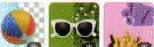

T

* ....,,_＿도"" ""- ` ®Om."~'lot,.,10 m

";.. ‘ *

`오·

~ t!!J •••

"『..

。II이 ••••

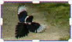

。

e 헐• 틀 -·

••

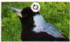

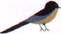

"" hm

舒

e• “그... 흔&·..,,

.g

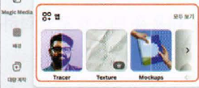

###### :— 7·고꼬 0~

。

♦ ....지”

###### "` 1/1 認 •• o

이마지 편집 패널 아랫부분

O영역 선택: Magic Studi에3의 기능을 적용할 영역을 선택할 수 있는 도구입니다.

0 조정 패널 사진의 기본 보정을 하는 공간이에요. 이미지 편집 패널의 [조정]을 클릭하여 조정 패널로

진입할 수 있습니댜 이곳에서 각 옵션을 슬라이더로 조절해 간단하게 이미지의 밝기, 대비, 재도 등을

조정할 수 있어요. 또한 [색상 편집]에서 사진의 색상 변경을 세부적으로 조정 가능합니다. 조정한 설 정 값을 취소하고 싶다면 조정 패널 하단의 [조정값 초기화]를 클릭하면 됩니댜

###### , |

###### 1"뇨:,＋"“V |

###### ”뇨;…··V , c' o |

e f

###### e 현집 빼

언던집 빼혈

빼걸

###### CB

q서입

q샤턴

###### 誌.. 。

입.. 讐`선

+· 조를

e 쪼륄 X

e 로.

X

X

.* 그릴지

T @ 난 •~ ·'/ ..러시

.T O뻬실

o >

###### ....

T

###### .

11ot•

`

###### ..... ·텍

·구.,....

* 셀"

龜*

蟲

蟲

###### I..... 嶋도

..... Q ...... 먼스 0 표

###### ."..

.....

..... 。떠

G

。

- 0

###### .. - 0

던던

4 ..

4 셀mt

조

4 빼살던밑

重구

e, -:{>,u e ti£

e

.... z`

·•``8? "''

던 ••••

8?

J

斜 떠도

대"'

###### -- tfOIi!f01•

선도

Ej

Z

.“”

따"～ 효 ..스

###### •...

###### •

.＇내일

• ""드

;:

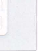

그릴지

빼•

..... ,"'.,'"

。

。

諱i

..뻬•

已

,. 꼬 印

貫 갑."노· 0"

###### ... 조정패널상단 쇼 조정패널중간 ... 조정패널하단

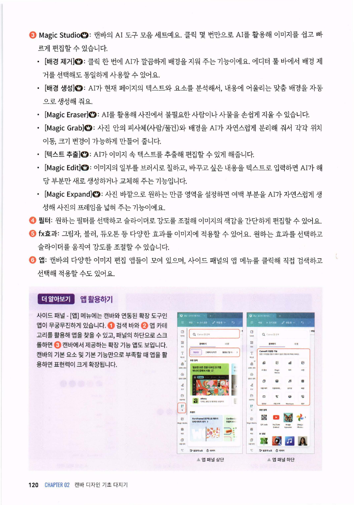

###### E) Magic Studio@: 캔바의 AI 도구 모음 세트예요. 클릭 몇 번만으로 AI를 활용해 이미지를 쉽고 빠

르게편집할수있습니댜

[배경 제거)O: 클릭 한 번에 AI가 깔끔하게 배경을 지워 주는 기능이에요. 에디터 툴 바에서 배경 제

거를 선택해도 동일하게 사용할 수 있어요.

[배경 생성)0: AI가 현재 페이지의 텍스트와 요소를 분석해서, 내용에 어울리는 맞춤 배경을 자동

으로생성해줘요. [Magic Eraser)O: AI를 활용해 사진에서 불필요한 사람이나 사물을 손쉽게 지울 수 있습니다. [Magic Grab]O: 사진 안의 피사체(사람/물건)와 배경을 AI가 자연스럽게 분리해 줘서 각각 위치

이동 크기 변경이 가능하게 만들어 줍니댜

[텍스트 주줄]O: AI가 이미지 속 텍스트를 추출해 편집할 수 있게 해줍니다. [Magic Edit]O: 이미지의 일부를 브러시로 칠하고, 바꾸고 싶은 내용을 텍스트로 입력하면 AI가 해

당 부분만 새로 생성하거나 교체해 주는 기능입니다.

[Magic Expand)O: 사진 바깥으로 원하는 만큼 영역을 설정하면 여백 부분을 AI가 자연스럽게 생

성해 사진의 프레임을 넓혀 주는 기능이에요.

O 필탸 원하는 필터를선택하고 슬라이더로강도를조절해 이미지의 색감을간단하게 편집할 수 있어요.

- 0 fx효과: 그림자, 블러, 듀오톤 등 다양한 효과를 이미지에 적용할 수 있어요. 원하는 효과를 선택하고

슬라이더를 움직여 강도를 조절할 수 있습니다.

O 엡 캔바의 다양한 이미지 편집 앱들이 모여 있으며, 사이드 패널의 앱 메뉴를 클릭해 직접 검색하고

선택해 적용할 수도 있어요.

사이드-패널-［앱] 캔바와 확장도구인

###### |

###### ,I

앱이 무궁무진하게 있습니다 검색 바와 앱 카테

###### Cll:aTi‘{ei

고리를 활용해 수 있고, 하단으로 스크

Q

••

롤하면 캔바에서 제공하는확장기능앱도보입니다.

S-i

내`'

·嶋.,,

.：；;느..”

...,'

###### ~" >)

c'"”"?",,.

그••q

캔바의 기본 요소 및 기본 기능만으로 부족할 때 앱을 활 표현력이 크게 확장됩니다.

••-·..기........퀘`｀,.뻬·

###### ...

###### ..

e

끓

쉘

....r...1 _ ,

n

###### •

Iii

。

쓰

"2

###### q ...

기'"＂＇

뻬•

묘•

###### ........

e,

‘

T

멀

。

###### I ""

.."

###### L ti

D

###### --e

###### _

.1l5

o-,.

-g."0t,

###### -·

....,, 스톨"...

c"＇．，』

>

i

.어 •

°“'...

###### •..

I

’W•ttT

|항

. )

”"

。

”멸--”끄 。 t

이

_

` "."" °印

엡패널상단

120 CHAPTER 02 캔바 디자인기조 다지기

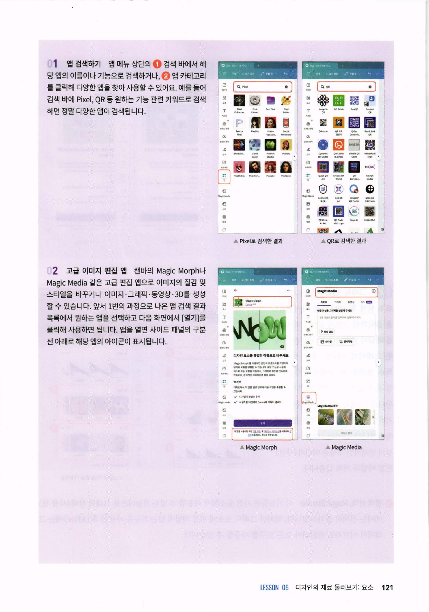

# -

1 검색하기 앱 메뉴상단의 검색 바에서 해

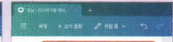

###### 』

당 앱의 , 앱

CB

니 | 2 rQ야 O1

###### ”

®

를 클릭해 다양한 잦아 사용할 수 있어요. 검색 바에 Pixel, QR 등 원하는 기능 키워드로 검색 하면 정말 다양한 앱이 검색됩니다.

-

###### .:.•· 1: ! 온

葛

-l

a

###### ~- 1 1 T ~ ...... ~.. ~

l

T

i

•- II • 00 00

g ; ..：내칩 國

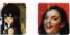

·

.E

.g

畵i-

g

e-4

".’'"'- '"-', 。”".. .... - - ..

’`

.. o, 내 • ..

I ...4.. 0 回 己 國

u 。

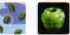

一

< 2.' 國=■었＝ 근■.. —«Ml?": I

li.

"

『“'".,‘’l

0

문

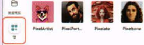

I :.: ......~ "~../: .......... .....,

5

·

1B @ ® Q @

ee

〔.. ...,..”回.....글..*'""..-.......

"".... CJLl0 ..... nm潭 ,,J,

i

^ 닿글_^一.._.~

- f ·" c

. t

ga

..

e

t

않

a

T_

촐

- g 0

... --

A. Pixel로 검색한 결과

~

# -

- 2 고급 이미지 엡 캔바의 Magic Morph나

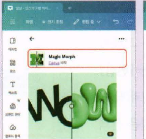

Magic Media 같은 고급 앱으로 이미지의 질감 및 스타일을 ·

2,.

###### H—

"

이

업aT;

g

t 1 1

" e

“” 5

할 수 있습니다. 앞서 나온 앱 검색 결과

g }

I f

목록에서 다음 화면에서

..

0i4"0i85.

됩니다. 구분 선 .

o.....

u......

e 따

"

q자언요스틀••”"'틀으로바꾸세요

- 4
- 5 0a

`.. '．그嶋빼빼틀 선을""•• I

....C «

###### "..

••따•-아·•I·

.. •

曺미다.......,.

uj

었

:_pu fc

I-- J 서1••~...c.....- ···

}

0 ✓ 따m텍터""

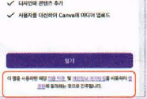

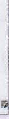

l g

e

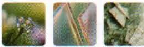

"•..

’`

A Magic Morph .&. Magic Media

LESSON 05 디자인의 재료 둘러보가: 요소 121

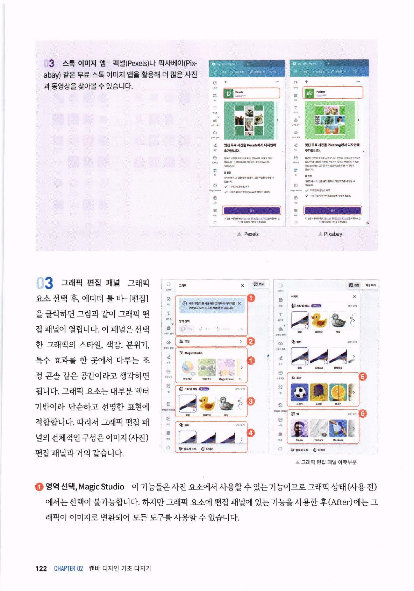

- 3 스톡 앱 픽사베이(Pix­

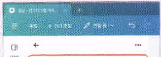

abay) 무료 스톡 더 사진 과 수 있습니다.

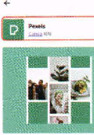

] 「기말Z

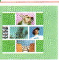

..T

Tg

·

`"•‘땐`’

蟲

o

。

1 4 멋진무…진을Pbiabau'I시 다지인데 `` 후가합니다. e, 止'".....모씨'말따' "되q••마"＇’

으 멋진 무료 Pexets<｀시 디지언에 " .

e ..............｀’뼈"止

###### . ....

••따 크."＇. 지"야E것01 m

u~ lOOI｀데 서단1 기......자 업는

『....,...묘 ....”른0어지가

사·냐라

'm나어 .,,....令

‘‘

:' 따따

--`/사자.-C-.....

q빼서어~......서마8껍 • 뺄촬•

었·

~ ✓ 떠.,,•..,,

G 였

®."J서•••다선紹국0~예빽꾸일"

-·- ✓ ,......년."

0

•

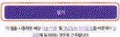

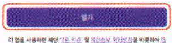

~ ··- ...E•en

4 Pexe s A Pixabay

###### 3 그래픽 편집 패널 그래픽

느 그빼빼 X @먀t 甲빼거 이편 "지

.. 스리털빼훨0 ....,,

어아지 X

요소 선택 후, 에디터 툴 바- ［편집]

I 않“

O 산마,,,.... 그 떠어지量 X

器

도구틀 수 .

을클릭하면 그림과같이 그래픽 편

T

###### 조`‘.. ’ 已一`빨 & t>

###### ·, “

e뢸티 ....,,

집 패널이 열립니다. 이 패널은 선택

###### G.> :Zi조푈 >O

달혀요기 "

靈

###### III업";.·.·e ~.. A

한 그래픽의 스타일, 색감, 분위기, 특수 효과를 한 곳에서 다루는 조

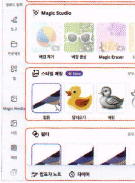

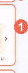

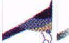

_.;b "怨..

.嶋 _ .

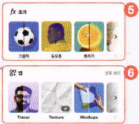

정 콘솔 같은공간이라고생각하면 됩니다. 그래픽 요소는 대부분 벡터 기반이라 단순하고 선명한 표현에

」 ·

>-J ....

--l.....

Ei

g

적합합니댜 따라서 그래픽 편집 패 널의 전체적인 구성 은 이미지(사진)

”mI\ I ...

###### •빼.

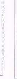

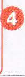

F U 0 타어어

편집 패널과거의같습니다.

그래픽 편집 패널 아랫부분

###### 영역 선택,MagicStudio 이 기능들은 사진 요소에서 사용할수 있는 가능이므로 그래픽 상태(사용 전)

###### 에서 는 선택이 불가능합니댜 하지만 그래픽 요소에 편집 패널에 있는 기능을 사용한후(After) 에는그 래픽이 이미지로 변환되어 모든도구를 사용할수 있습니다.

122 CHAPTER 02 캔바 디자인 기조 다지기

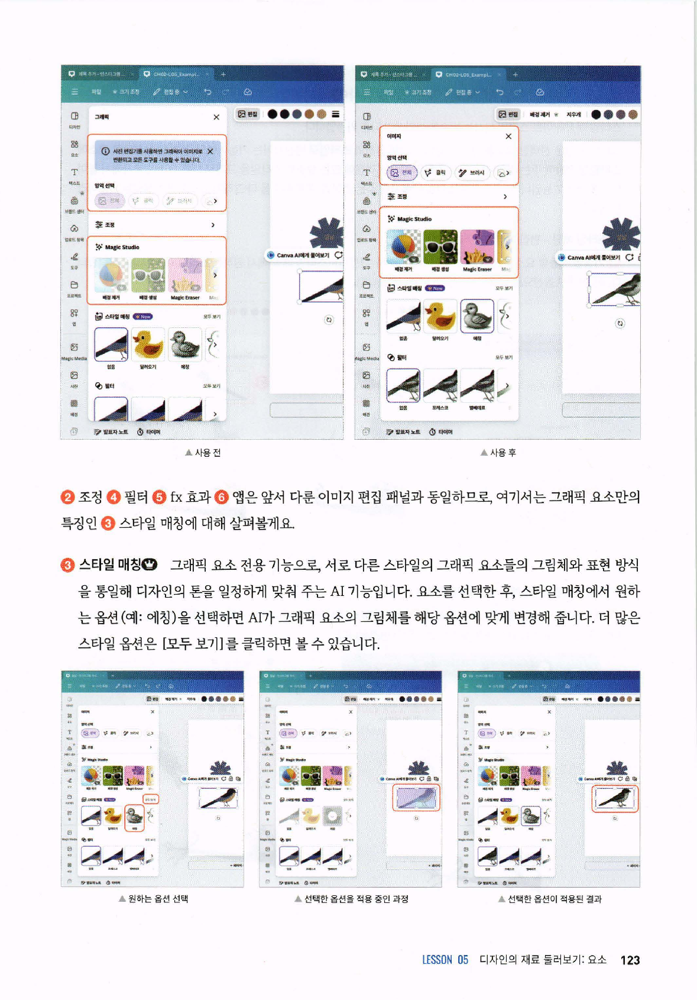

###### |L'II, "0:0; ] |

CB :ui픽 X ••• • • 타 | (]

###### @詞 빼겅C .., 지9JI •

q

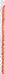

아어지 X

... O 짜 X

認

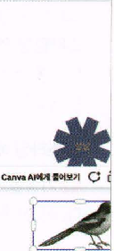

路

” ’ 영역선빽

모른 수 .

T l @ 던 를리 ＃ 막시 학

T

I 영덕신빼

###### v .# h,.

~*I r

효조11

"S 솁U

,MkSm曲

o 조조뺄

###### ......

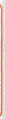

###### ‘ l도專거 빼볼쉘쉘 l냐M헬k ..

업

}뻔l<Studlo

& g

<:anV>At'l>tlOl!VI Q

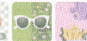

###### e도구 오루"'

###### E)

@쓰마’ emo

...." I ..혈~l 빼결" momc M

끄”

8? .

###### I

###### A?댜넓

8?

업스떼빼횔 .."기

Cl •

( )

###### IMCM.... 一스·

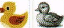

얼홑 달려오거

.@M..,. 。뢸터 모두,.,,

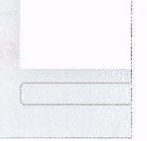

’昌

없l1 달오1 빼칠

겨一一#

曲 e 뢸티

모루모기

사선

###### •

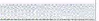

###### : [~~ )

업률

빼겁

m 규 노므 OEf01이

쭙 강 탈파노트 E/0l머

.... 사용전

^ 사용후

- 0 조정 O 필터 0 fx효과O 앱은 앞서 다룬 이미지 편집 패널과 동일하므로, 여기서는그래픽 요소만의

특징인 스타일 매칭에 대해 살펴볼게요.

O 스타일 매칭O 그래픽 요소 전용 기능으로, 서로 다른 스타일의 그래픽 요소들의 그림체와 표현 방식

을 통일해 디자인의 톤을 일정하게 맞춰 주는 AI 기능입니다· 요소를 선택한 후, 스타일 매칭에서 원하 는옵션(예: 에칭)을선택하면 AI가그래픽 요소의 그림체를해당옵션에 맞게 변경해 줍니다. 더 많은 스타일옵션은 [모두보기]를클릭하면볼수있습니다.

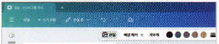

I

....,. - • • • 蠶

..이 . - . . . . . ..

###### ....

###### ....

論

諱

###### -‘ 擊••

T @ ….. ,.,... o>

T 'i' .. 小~ °’

; 습 ….. ,,- 0’

###### `‘ ...

###### ~:‘ ....,.._....

###### - 2一*

###### ,..__

율~""""*mc/jj딸

。 ’ " -

### : ]

a

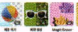

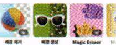

“`" ~ 「틀l『,

.""

.•- iii"..-

읗

lY

Q ti

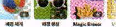

4

Ggy i

안

"- °-.._

- 0gR.e?

.

- 1

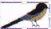

e,

。

? 4&얻t

###### - "dY"

? ;石 겁 다 `’

###### - - ··

###### 。 - - -

4

4 i

e

.

###### : ~ AA >

-- q,.. ""

-- 'l>.. ""

###### .•"i : ~ AA;

l • - …-·

i

」

, ,.""i 0-

| ’ ,.,...고 O""'

Q

훈 ,.,...M 0-

.... 원하는옵션선택 쇼 선택한 옵션을 적용 중인 과정

~ 선택한 옵션이 적용된 결과

###### LESSON 05 디자인의 재료 둘러보기: 요소 123

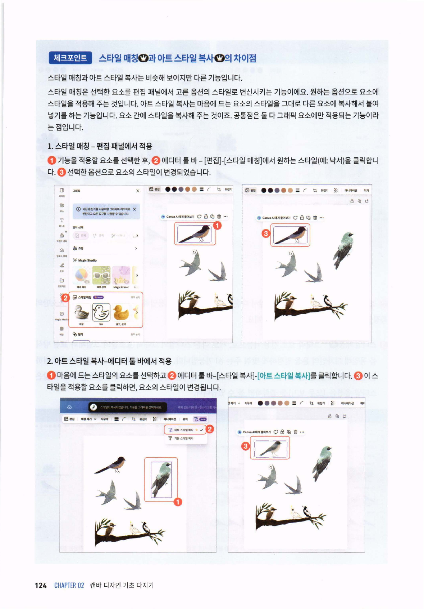

###### - 스타일매칭0과아트스타일복사O의자이점

스타일 매징과 아트 스타일 복사는 바슷해 보이지만 다른 기능입 니다.

스타일 매징은 선택한 요소를 편집 패널에서 고른 옵션의 스타일로 변신시키는 기능이에요. 원하는 옵션으로 요소에 적용해 주는 것입니다. 아트 스타일 복사는 마음에 드는 요소의 스타일을 그대로 다른 요소에 복사해서 붙여 넣기를 하는 기능입니다. 요소 간에 스타일을 복사해 주는 것이죠. 공통점은 둘 다 그래픽 요소에만 적용되는 기능이라

는점입니댜

- 1. 스타일 매칭 - 편집 패널에서 적용

O기능을 적용할요소를 후,O에디터 툴 바- 편집]-［스타일 매징]에서 원하는스타일(예: 낙서)을클릭합니

댜 선택한옵션으로요소의스타일이변경되었습니다

a X @른밉 ••• • • =r 다 뒤집기 • • • =r n 튀김기 ; 예니대어니― 휘

q

a c

認 (D |

서신 :,레틱어ot0|지• x

도구. 촬 수 .

T 8 ~n'"mIIOImI o a @ @ … 80m"＇"硏'"＇ c a ® @ …

>

.,.

혈핵선"

~I~ ]

a,• /

••c.u

。 去조를

.”.. 4J 4

,.M..kStudlo

.,4 ,I.,.}

....e ...

"" ... MG

끊포”" O 언"'I!’,

: t L a '\ :<

>

예. 낙서 ·드."

0 틸러 21(,,.,1

‘ ` 」

- 2. 아트 복사-에디터 툴 바에서 적용

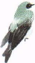

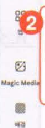

마음에 드는스타일의 요소를선택하고 에디터 툴 바-[스타일복사]-[아트스타일 복사]를클릭합니다. 이 스

타일을 적용할 요소를 클릭하면, 요소의 스타일이 변경됩니다.

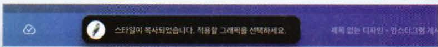

"거 • 呼" • • • • ;;; r ti 튀밑＇I ::: 빼여어선 때

@ 4

a @ c

@" "~' * 呼 =r n “리기 ;:;. -기신 "지 TC

( ? Of·스미．시 ✓

E)

'7' ,1른스Q1I마’

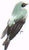

4

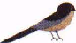

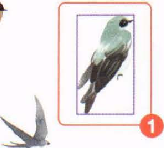

.& <

'노~＼

124 02 캔바 디자인 기조 다지기

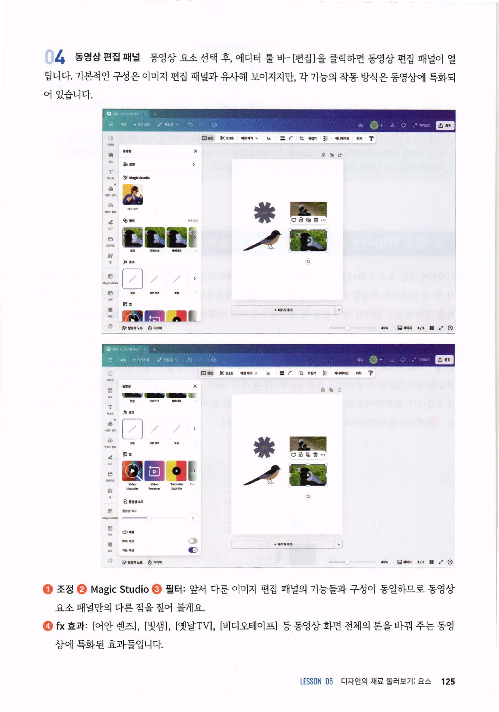

###### 4

동영상편집패널

동영상 요소 선택 후, 에디터 툴 바- ［편집]을 클릭하면 동영상 편집 패널이 열

###### 립니댜 기본적인 구성은 이미지 편집 패널과 유사해 보이지지만, 각 기능의 작동 방식은 동영상에 특화되

어있습니댜

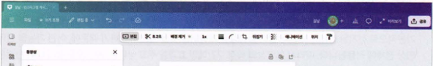

*

T

`스.

###### -·"‘e

###### 7"

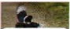

••雙,

C al rs 9 ···

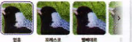

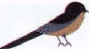

- e
- f 怨·

효조.

~--

...,.

0 ...

,0 l "

OO

- g

-

c,

/ /

###### .... ..

탑 11

.g

♦ 빼아리

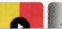

###### "빼

C

..,.

尹•"... 。印

liil*口 1/1 • o

·

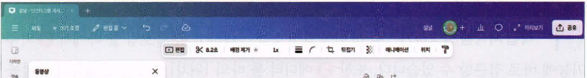

- -3 :

a

- T

~‘

一요

...,

..

4 3-

꾼엽

e

- U

·뻬^·

/

••'II

/

X

•

l

靈

-

a e

舒

:;)•“"

- -C.....··II"

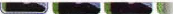

###### fxu曰

"

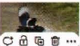

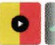

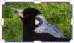

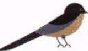

。

g.”

e

o"

뺀•자생

###### «

• • 어지..,,

지t 꽤쉘

iii1* l/1 腐 •• o

’

“`

컵雷""皇 O 印""

O 조정 f) Magic Studio E) 필터: 앞서 다룬 이미지 편집 패널의 기능들과 구성이 동일하므로 동영상

요소 패널만의 다른 점을 짚어 볼게요.

O fx 효과: ［어안 렌즈], ［빛샘], ［옛날TV], ［비디오테이프] 등 동영상 화면 전체의 톤을 바꿔 주는 동영

상에 특화된 효과들입니다.

LESSON 05 디자인의 재료 둘러보기: 요소 125

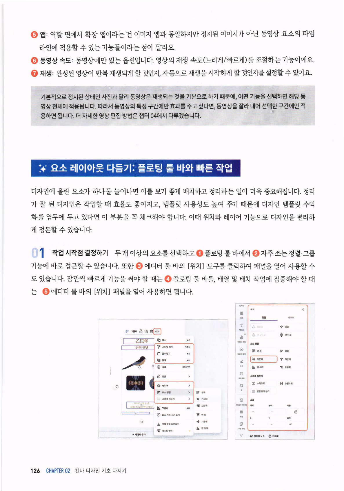

O 엡 역할 면에서 확장 앱이라는 건 어미지 앱과 동일하지만 정지된 이미지가 아닌 동영상 요소의 타임

라인에 적용할 수 있는 기능둘이라는 점이 달라요. O 동영상 속도: 동영상에만 있는 옵션입니댜 영상의 재생 속도(느리게/빠르게)를 조절하는 기능이에요. O 재생: 완성된 영상이 반복 재생되게 할것인지, 자동으로 재생을시작하게 할것인지를설정할수있어요.

기본적으로 사진과 하기 영상 전체에 싶다면, 적

됩니다. 더

###### | :_.: |

디자인에 올린 요소가 하나둘 늘어나면 이를 보기 좋게 배치하고 정리하는 일이 더욱 중요해집니다. 정리

- 가 잘 된 디자인은 작업할 때 효율도 좋아지고, 템플릿 사용성도 높여 주기 때문에 디자인 템플릿 수익 화를 염두에 두고 있다면 이 부분을 꼭 체크해야 합니다. 이때 위치와 레이어 기능으로 디자인을 편리하 게 정돈할수있습니댜

###### 1

두개 이상의 요소를선택하고 O 플로팅 툴바에서 자주쓰는정렬·그룹

작업시작점결정하기

기능에 바로 접근할 수 있습니댜 또한O 에디터 툴 바의 [위치] 도구를 클릭하여 패널을 열어 사용할 수

도 있습니댜 잠깐씩 빠르게 기능을써야할때는 O 플로팅 툴바를, 배열 및 배치 작업에 집중해야 할 때

###### 에디터 툴바의 [위치] 패널을열어 사용하면 됩니다.

g8OOa

”*l X

렬,

빼아어

T & ? 뒤.

,:i, :,.•• ”

嶋스.

###### .”‘... 요소••

량 연어.

o ..사

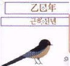

· C

G> I =,. 뺀뤼 |讐 현록

T 스타얼嶋시

UC

••도••

"..?I

& (* 가e떼 ~ ,,은데

® 틀鳩 @ 석빼

oa£T•

" .It 뺀야’ ` | 오"

###### e,

©m

고"의무기

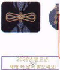

m ..

Q

수이으. 뻐 수를오.

8?

-硏).”

0 대回

•

r 현·

三 ·8터게륄리

l零

* ,i"

적

三 고皇게빼우기

..,

..,.

i T

•

빼

a

뺄1 오른닥

l!i1 그...

I • • '

. G

o m:지＊시간llAI

I ••,. I

ji 뺀”

•

###### 빠 ’""'

###### .....

Cl

b

。

土 선텍""＇＂"

느 뺀아데

'I.• ..,,..,..

,;·

+ 빼어지事가

尹 탈凰자노g 0 아어머

###### 126 CHAPTER 02 캔바 디자인 기조 다지기

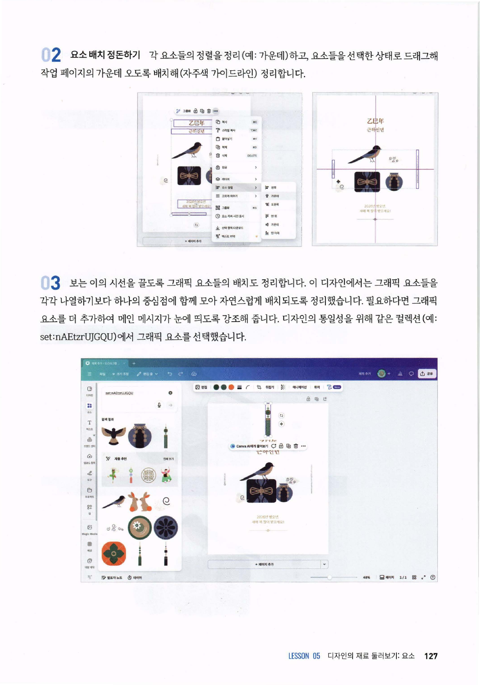

###### 2 요소배치정돈하기 각요소들의정렬을정리(예:가운데)하고,요소들을선택한상태로드래그해

작업 폐이지의 가운데 오도록 배치해(자주색 가이드라인) 정리합니다.

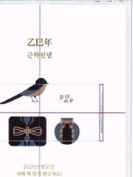

/ 꼬•alca® ···

o .... 翼C

T 프壇… t c

0 讐기

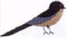

@ ...

9 回 삭빼 0(UT

d0m

Q

- 0 - *

| Q

l.. " " ) 눕 휩·

三 고 !!I흘기 ) 술 가"

| S L; 1 1!1 그••

려 오른.

= ·= °“띠nmm』 ji뺀”

t>

빼 가탄‘

土 여 할· ：

.!!. •이.

'Ii. 빼""

••어지"

###### 3 보는이의 시선을끌도록그래픽 요소들의 배치도 정리합니댜 이 디자인에서는그래픽 요소들을

각각나열하기보다하나의 중심점에 함께 모아자연스럽게 배치되도록 정리했습니다. 필요하다면 그래픽

요소를더 추가하여 메인 메시지가눈에 띄도록강조해 줍니다. 디자인의 통일성을위해 같은컬렉션(예:

set:nAEtzrUJGQU) 에서 그래픽 요소를 선택했습니댜

1" : l m|

@ 현밑 • • ;; r 다 위밉기 곳 `~신 曲 ? C

CB

••<nAEU<UJGQU 。

###### a @ c

다

###### -._I

:: 9

U +

겁색렬과

T

###### ~‘••뺑«.... 宁• i

...,m,r

~"配l oa©@ …

r인년

G t· 련嶋.,,

...••I

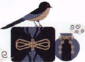

.;•A"‘

, .,.e. 4 i 鑄 ’

e

. Q

1묘년염오언 세혜빼 5 른느

• ~ ....

Ci

..• i i

--

。

+빼어지후기

.... !iiiIIOl'I 1/1 認 •• 니

...이

?털타노‘ °印

LESSON 05 디자인의 재료 둘러보가: 요소 127

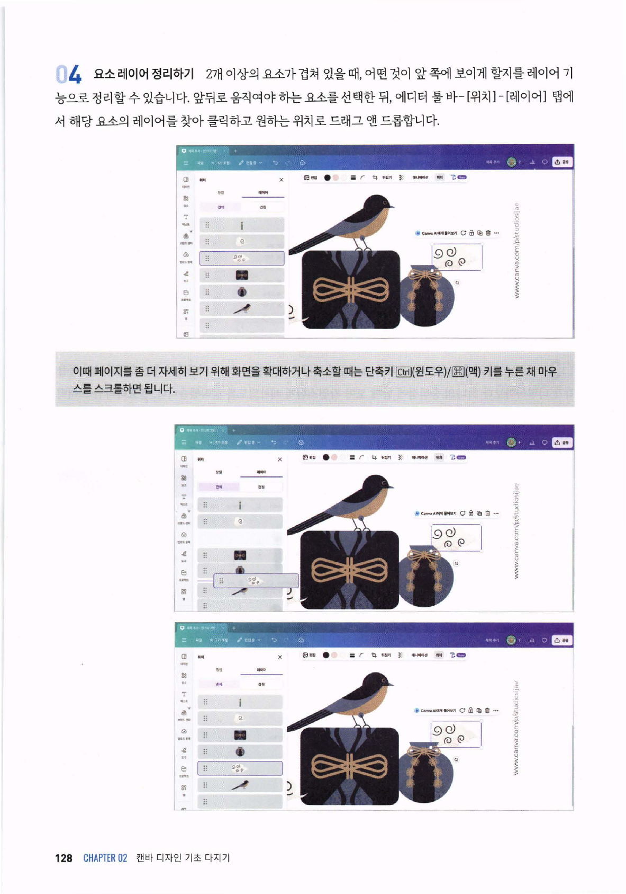

###### 4

요소레이어정리하기 2개이상의요소가겹쳐 있을때,어떤것이 앞쪽에보이게할지를레이어 기 능으로정리할수있습니댜 앞뒤로움직여야하는요소를선택한뒤, 에디터 툴바-[위치]-［레이어] 탭에

: 0 빼, 0·lm

- 서 해당요소의 레이어를찾아클릭하고원하는위치로드래그앤드롭합니다.

"서 X E·· • = rt+ ..기;• ..".... 曲 ?-

Cllg

###### -

”

않

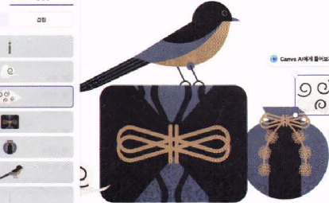

3T5.

은

###### ••

己

risa

.-g

pnis/

~"硏 C& 여 O···

###### e

－

d/E8e>Ce3·

e-4

o•__..2

###### 땡(-) I

....

... .

90,

"

I

’’

euu?

—

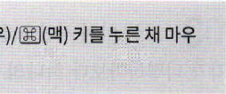

이때 페이지를 좀 더 자세히 채

됩니다.

0 “타 0 mi

###### ..

x ..

I>!•밉 • =r 1:l. ."''

2

, 曲 T m

X

•

••

潟

###### aT3·®i

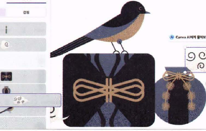

acr

겁.

론빼

-s0lpmsI

e cmm^.....,"1 0 III ~ GI …

- d>E OU.
- e>CeU.I

요

헬(..:> I

4"0I

"a.v :0 뻬" 1 m|

훈

-

e... • "' r~•.,, x .'"mt! "' TC

2

###### X

"^

”

엷"T5.

빼어•

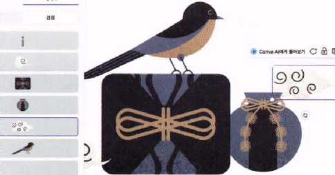

aPS0K)n1^IalEO-

••

핀꽤

###### 오요

"'-"""'"""" C ol ~ GI ••·

할~ I

U ·eAueU

4

....

..

"

N5VNL.

..

enu

..

院·

128 CHAPTER 02 캔바 디자인 기조 다지기

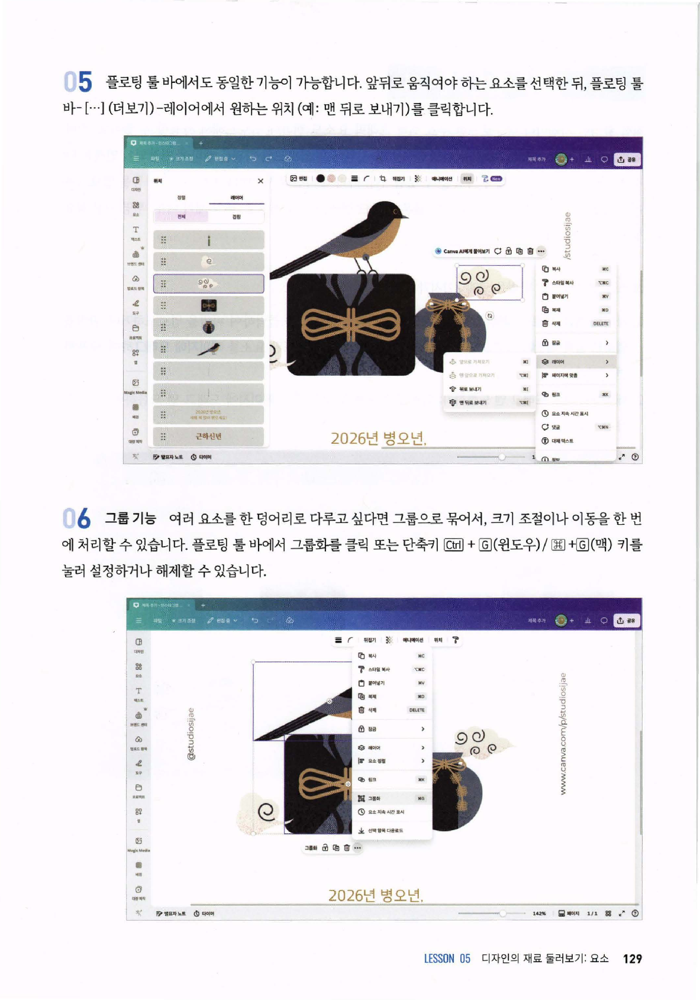

###### 5

플로팅 툴바에서도동일한기능이 가능합니다. 앞뒤로움직여야하는요소를선택한뒤, 플로팅 툴

바-[…］ （더보기)－레이어에서 원하는위치 (예: 맨 뒤로보내기)를클릭합니다.

으 0 | m1

@I!!잡 • ;ii;r n "1171

&

CB g

”

T ©O

"

X

###### ••

입

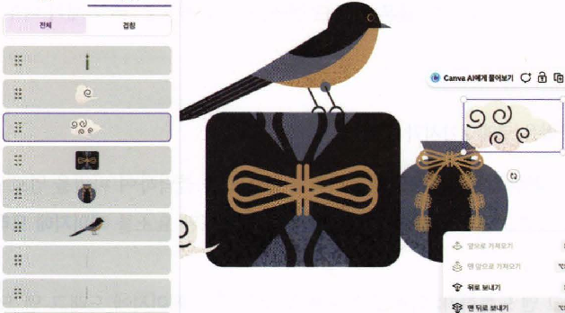

a

옮

"‘

f1so1pn1s/

던..

T

..‘

`

~"IIOIm o a @ @ ...

g75gggg

.....。

翼

..

###### `.C

서

c 8E

널기

###### .v

4 "

.。

0(UTE

e!

z

)-

m..

i'.D llil

院·

|--Ci.g

0 -

떠

눕 寧바자뺄•

###### `미

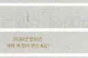

翼I

역 릴크

`러

O 오지*虫 m

....。

C 댓글

`翼N

2026년 병오년,

.· 。

따心

,.

7·m,.. 。印

.J

l (i) 김O

6

여러 요소를한덩어리로다루고싶다면 그룹으로묶어서 , 크기 조절이나이동을한번 에 처리할수있습니다.플로팅 툴바에서 그룹화를클릭 또는단축키 臣궐 + 固(윈도우)／ 選] 팔갑(맥) 키를

그룹기능

눌러 설정하거나해제할수있습니다.

| + f o+1m

x

###### T

CB g

;;; r "fVI

.U빼여신 "외

°,.`작혈·시

器 a

。...w,,

`"C

aefiso1pnlS/

###### ..

T

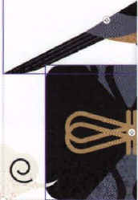

던 ”

••"‘..

빼•

aeris

@ ..,.

ou."'

d/Eo::,

0=pnis©

0 m

.....。

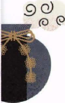

·eAue::,

o -

4 "

###### `털

『 요소불를

·MMM

e,

""

l!il 끄”

衍·

O 포지Cmm

--g

土 선.혈빼 다표

::,Ill III [s lw •••

•빼.

###### 1....°

병오년,

l ?· 강•~,.. ~.....,

....지 1/1 認 •• o

:

1‘2

LESSON 05 디자인의 재료 둘러보기: 요소 129

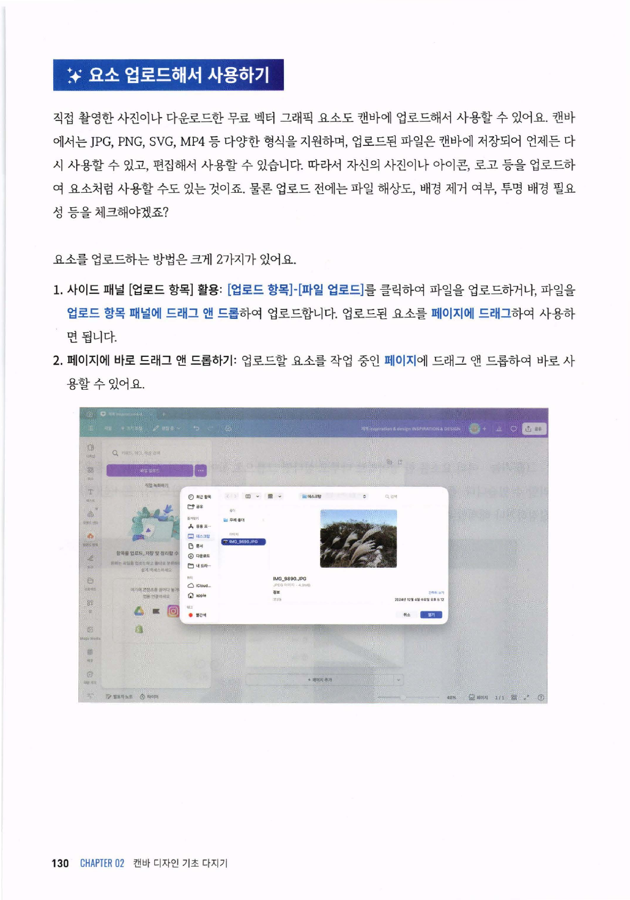

#### I |

직접 촬영한 사진이나 다운로드한 무료 벡터 그래픽 요소도 캔바에 업로드해서 사용할 수 있어요. 캔바

###### 에서는 JPG, PNG, SVG, MP4 등 다양한 형식을 지원하며, 업로드된 파일은 캔바에 저장되어 언제든 다 시 사용할 수 있고, 편집해서 사용할 수 있습니댜 따라서 자신의 사진이나 아이콘, 로고 등을 업로드하

여 요소처럼 사용할 수도 있는 것이죠. 물론 업로드 전에는 파일 해상도, 배경 제거 여부, 투명 배경 필요 성 등을체크해야겠죠?

요소를 업로드하는 방법은 크게 2가지가 있어요.

- 1. 사이드 패널 [업로드 항목] 활용: 를 클릭하여 파일을 업로드하거나, 파일을 업로드 항목 패널에 드래그 앤 하여 업로드합니다. 업로드된 요소를 드래그하여 사용하 면됩니댜
- 2. 페이지에 바로 드래그 앤 드롭하기: 업로드할 요소를 작업 중인 에 드래그 앤 드롭하여 바로 사 용할수있어요.

尸 _

질Z`鶴획기 •

Q

°..,.. 11D • ■ • ,"스크랄 : o.a빼

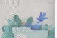

l:l'글• .,,

·기'’ ..m·더

###### •• 서 =포털A ··鳳

v·'를-EII,.l;·-

# SMG_890.JPG”

Cl •』

할"업뚜.지장및낍떼수1 O Q`"

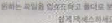

E! 내모t·

###### 어가데론"츠;I"를김따· O~ 펼量

‘ U •간색

m 0 -

,., 년?,.."... ....,'

“소 .口.

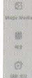

* 빼어지후가

7 일1지고: O”서머 ‘m 닳 빼0\시 1/1 .” ®

###### 130 CHAPTER 02 캔바 디자인 기조 다지기

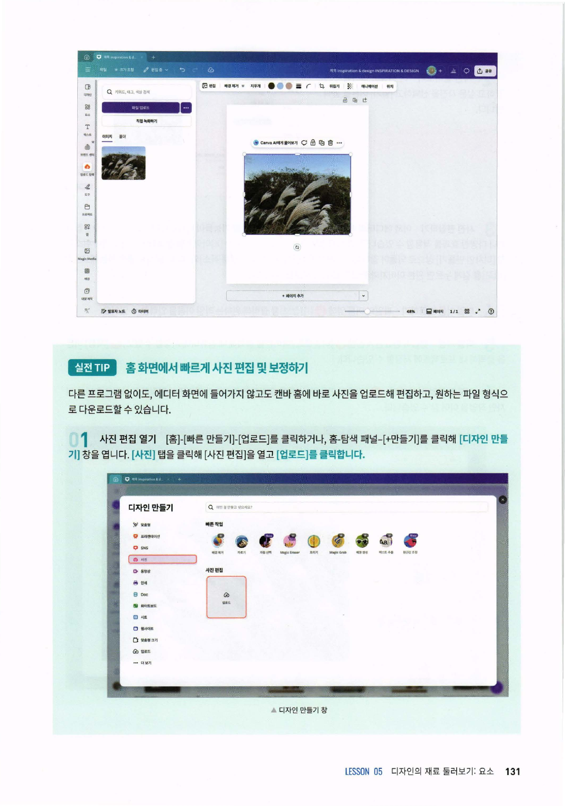

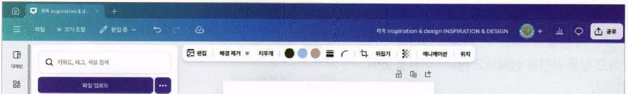

•

認

a

###### T3

혀접..鶴"기

~w"'..게tlotmI c a ® 맵 •••

어이저 틀더

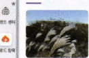

..e..

a,

-.

••c ..

으

e

~'

~ ,,&

###### •

')

@

###### •

”"k"

。

###### 广맡m포 O~

• 빼어지후기

” liiil~지 1/1 器 «» (j)

###### 홀화면에서 빠르게 사진 편집 및 보정하기

다른 프로그램 캔바 바로 파일 로다운로드할수있습니다.

- 1 사진편집 열기 [홈]-［빠른만들기]-［업로드]를클릭하거나,홍탐색 패널-[＋만들기]를클릭해 [디자인 만둘

기] 엽니다. ［사진] 클릭해 [사진 열고

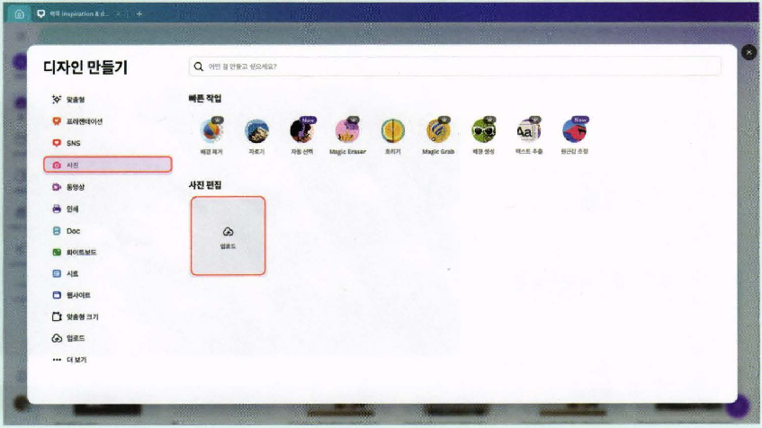

디자인만들기

###### Q 며터 설 만1고 실'"＇

###### ‘ :

, 賢..

"'른칙업

묘뻬훈"'신

사진편밉二

0 SNS

...머 빠" ".. _""" .嶋기 "땔k‘- •••• `스... 雙근촬••

사민

°' 틀열싱

邑 던빼

8 0oc

圈, .이료보드

0 ....

,시

°“·크기

O 업또

... "뵤?I

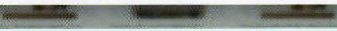

디자인만들기창

###### LESSON 05 디자인의 재료 둘러보기: 요소 131

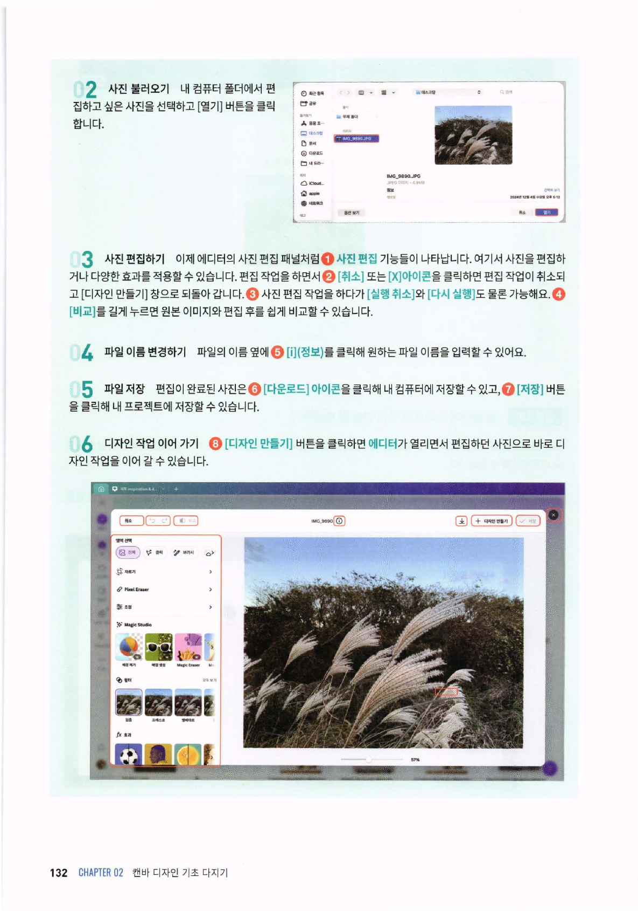

- 2 사진불러오기 내 컴퓨터 폴더에서 편

11D • ■ • `결색

###### I E'°""""

집하고 싶은 사진을 선택하고 [열기] 버튼을 클릭 합니다.

‘

....q

國

^" ..

D ...

o""그

EF』 다

hi

IMG」..”

0 0·

.m

툴브

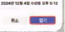

—

L

###### ”

- 3 사진편집하기 이제에디터의사진편집패널저럼O사진편집 기능듈이 나타납니댜여기서사진을편집하

거나다양한효과를적용할수있습니다.편집 작업을하면서O 또는[X]아이콘을클릭하면편집 작업이쥐소되

고 [디자인 만들기] 장으로 되돌아 갑니다. 사진 편집 작업을 하다가 [실행 쥐소]와 [다시 실행]도 물론 가능해요.

를 길게 누르면 원본 이미지와 편집 후를 쉽게 비교할 수 있습니다.

- 4 파일이름변경하기 파일의 이름옆에 를클릭해원하는파일이름을입력할수있어요.
- 5 파일저장 편집이완료된사진은O[다운로드]아이콘을클릭해내컴퓨터에저장할수있고,O[저장]버튼

을 클릭해 내 프로젝트에 저장할수 있습니다.

- 6 디자인작업 이어가기 O[디자인만둘기] 버튼을클릭하면에디터가열리면서편집하던사진으로바로디

자인 작업율 이어 갈 수 있습니다.

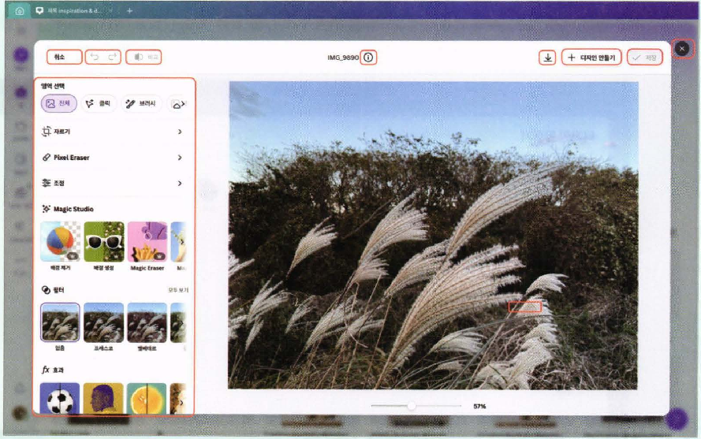

132 02 캔바 디자인 기조 다지기

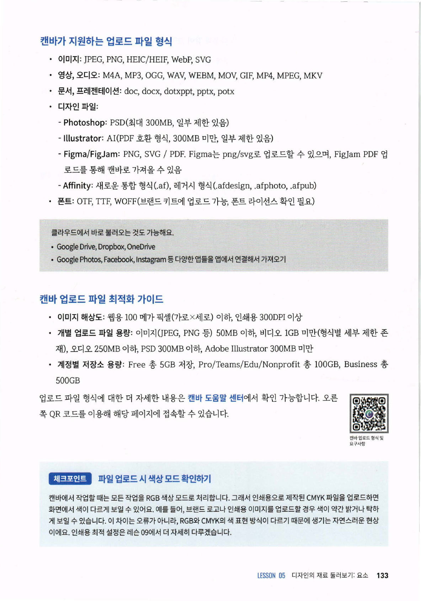

캔바가 지원하는 업로드 형식

- • 이미쟈 JPEG, PNG, HEIC/HEIF, WebP, SVG
- • 영상, 오디오: M4A, MP3, OGG, WAV, WEBM, MOV, GIF, MP4, MPEG, MKV
- • 문서, 프레젠테이션: doc, docx, dotxppt, pptx, potx
- • 디자인파알

- - Photoshop: PSD(최대 300MB, 일부 제한 있음)
- - Illustrator: AI(PDF 호환 형식, 300MB 미만, 일부 제한 있음)
- - Figma/FigJam: PNG, SVG / PDF. Figrna는 png/svg로 업로드할 수 있으며, FigJarn PDF 업 로드를 통해 캔바로 가져올 수 있음
- - Affinity: 새로운 통합 형식 (.af), 레거시 형식 (.afdesign, .afphoto, .afpub)

- • 폰트: OTF, TTF, WOFF(브랜드 키트에 업로드 가능, 폰트 라이선스 확인 필요)

.

최적화 가이드

- • 이미지 해상도: 웹용 100 메가 픽셀(가로X세로) 이하; 인쇄용 300DPI 이상
- • 개별 업로드 파일 용량: 이미지(JPEG, PNG 등) 50MB 이하, 비디오 1GB 미만(형식별 세부 제한 존 재)， 오디오 250MB 이하, PSD 300MB 이하, Adobe Illustrator 300MB 미만
- • 계정별 저장소 용량: Free 총 5GB 저장, Pro/Teams/Edu/Nonprofit 총 100GB, Business 총 500GB

업로드 파일 형식에 대한 더 자세한 내용은 에서 확인 가능합니다. 오른 쪽 QR 코드를 이용해 해당 페이지에 접속할 수 있습니다.

캔바업로드형식잊 요구AI항

파일 업로드시 색상모드확인하기

캔바에서 작업할 때는 모든 작업을 RGB 색상 모드로 저리합니다. 그래서 인쇄용으로 제작된 CMYK 파일을 업로드하면

화면에서 색이 다르게 보일 수 있어요. 들어, 브랜드 이마지를 경우 색이 약간 밝거나 탁하

게 보일 수 있습니다 이 자이는 오류가 아니라, CMYK의 색 표현 방식이 다르기 때문에 생기는 자연스러운 이에요 인쇄용 죄적 설정은 레슨 09에서 더 자세히 다루겠습니다.

LESSON 05 디자인의 재료 둘러보기: 요소 133

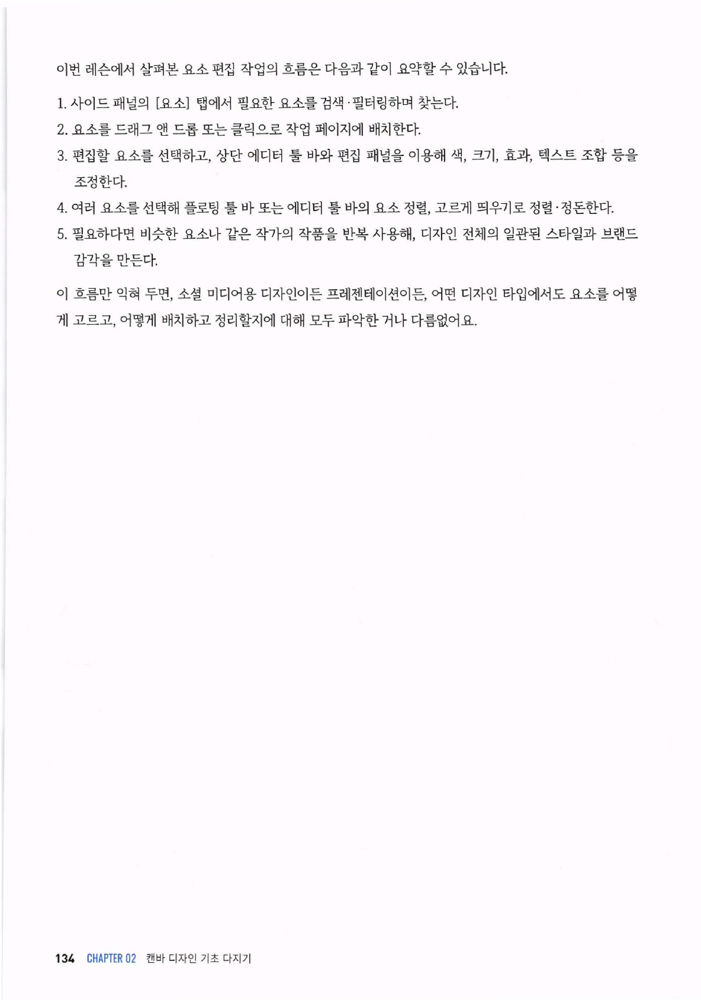

###### 이번 레슨에서 살펴본 요소 편집 작업의 흐름은 다움과 같이 요약할 수 있습니다.

- 1. 사이드패널의 [요소] 탭에서 필요한요소를검색·필터링하며 찾는다.
- 2. 요소를 드래그 앤 드롭 또는 클릭으로 작업 페이지에 배치한댜
- 3. 편집할 요소를 선택하고, 상단 에디터 툴 바와 편집 패널을 이용해 색, 크기, 효과, 텍스트 조합 등을 조정한댜
- 4. 여러 요소를 선택해 플로팅 툴 바 또는 에디터 툴 바의 요소 정렬, 고르게 띄우기로 정렬 ·정돈한다.
- 5. 필요하다면 비슷한 요소나 같은 작가의 작품을 반복 사용해, 디자인 전체의 일관된 스타일과 브랜드 감각을만든댜

이 흐름만 익혀 두면, 소셜 미디어용 디자인이든 프레젠테이션이든, 어떤 디자인 타입에서도 요소를 어떻

게 고르고, 어떻게 배치하고 정리할지에 대해 모두 파악한 거나 다름없어요.

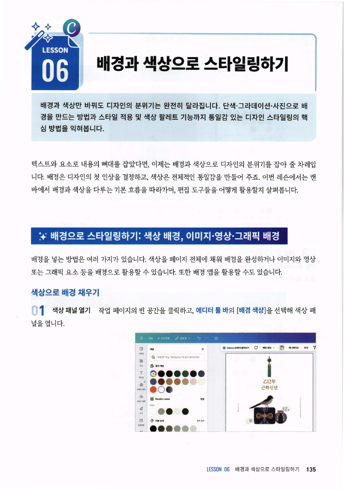

###### 빼경과 스타일링하기

배경과 색상만 바꿔도 디자인의 분위기는 완전히 . 단색·그라데이션·사진으로 경을 만드는 방법과 스타일 색상 팔레트 기능까지 있는 디자인 스타일링의 핵

심 .

텍스트와 요소로 내용의 뼈대를 잡았다면, 이제는 배경과 색상으로 디자인의 분위기를 잡아 줄 차례입 니댜 배경은 디자인의 첫 인상을 결정하고, 색상은 전체적인 통일감을 만들어 주죠. 이번 레슨에서는 캔

바에서 배경과 색상을 다루는 기본 흐름을 따라가며, 편집 도구들을 어떻게 활용할지 살펴봅니다.

###### | :~ 배경, 이미 |

배경을 넣는 방법은 여러 가지가 있습니댜 색상을 폐이지 전체에 채워 배경을 완성하거나 이미지와 영상 또는 그래픽 요소 등을 배경으로 활용할 수 있습니다. 또한 배경 앱을 활용할 수도 있습니다.

###### 1 색상패널열기 작업 페이지의 빈 공간을클릭하고, 에디터툴바의 [배경색상]을선택해 색상패

널을엽니댜

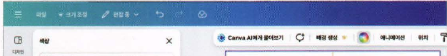

-•_I

Q ...,, ' - 000<4«:....,.,•••

..dT~..••O•••o•••••••••

認

.. 0 툴서..‘

`

乙l.!年

###### .....

。

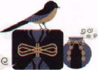

El 0,II!•由'• • ""'

몹 St너loLu...

4" U

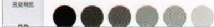

###### LESSON 06 배경과 색상으로 스타일링하기 135

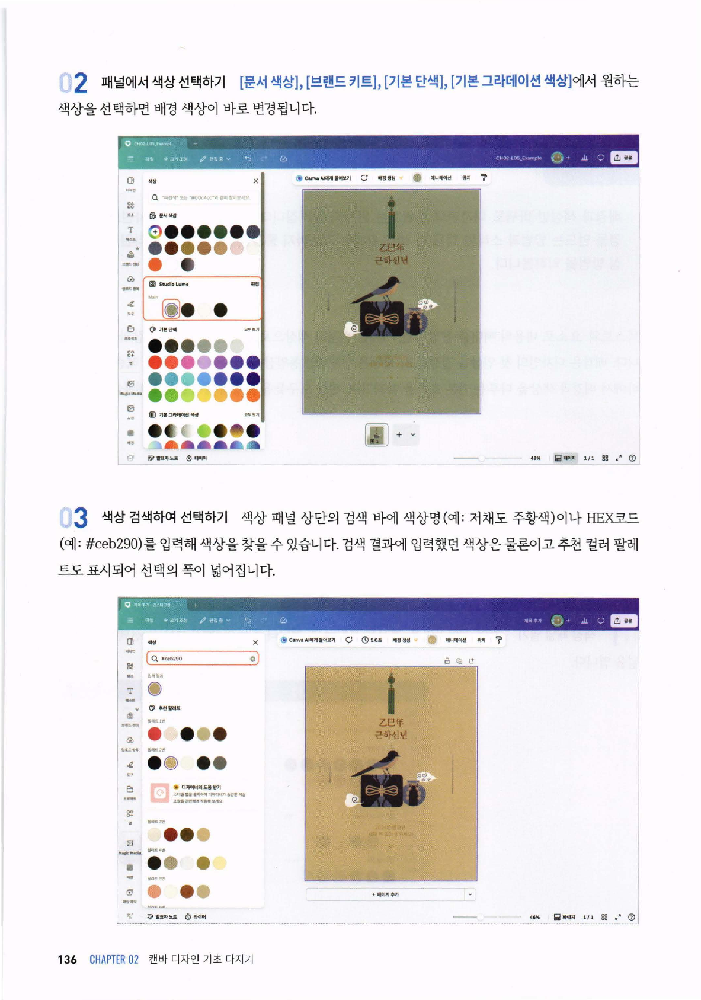

###### 2 패널에서색상선택하기 [문서색상],［브랜드키트],［기본단색],［기븐그라데이션색상]에서 원하는

색상을선택하면 배경 색상이 바로변경됩니다.

도.Y CHO2,mf,."'pl, 1mI

u° "'

"nv" "',.EmI O "" • 예니...1선 위시 ?

...!_.0.••·...··.·

X

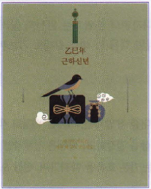

Q ~ 00<4,:C-.,l/01"츠 ’노

葛

.. 8E이

....

”를' ..

턴밉

•~•• ~ tudloI.um•

;••••.•.•••.•

iJ• •

4

"..

0 0 ,1튼던빼 따.,,

없

--e ••"r....c••

13

I]>I톤그따駒신뻬실 ...,,

때

固 + v

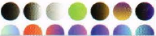

뻬•

7 털"꼬 O 印IO ••" liil IIOI지 1/1 誌 .» ®

###### 3 색상검색하여 선택하기 색상 패널 상단의 검색 바에 색상명(예: 저채도 주황색)이나 HEX코드

(예: ＃ceb290)를입력해 색상을찾을수있습니다.검색 결과에 입력했던 색상은물론이고추천 컬러 팔레

트도표시되어 선택의 폭이 넓어집니다.

忍 e ,날 1mI

x OJ "nv.""配"'l O 0·" ""

`신 떠 T

미ti

###### -•_I

q

[_Q.”고

a © C

겁예 ••

###### ...T •

###### ..,..

~ (? •t1 •這皇 龜

.t,.. .(I) ••

•...”嶋

###### 年

G) • • • •

..... ••• R

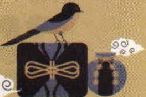

....el

...............스···익"""작아따.언C뻬일

디자아너의도1뺄기

- • .빼.,.

I_.-@ .....•

- •..•.....••

###### ....(,1 • •

,;· ;';,일""로 O 印I머 46" liil~ l 器 "처)」

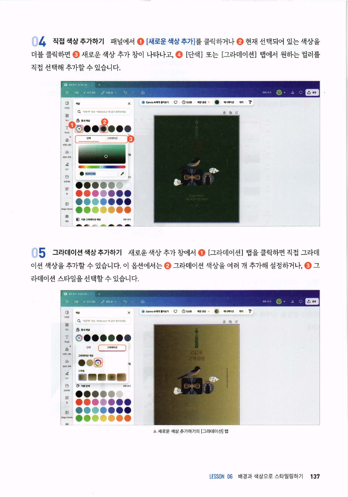

###### 4 직접 색상주가하기 패널에서 O [새로운색상주가]를클릭하거나O현재 선택되어 있는색상을

더블 클릭하면 O 새로운 색상 추가 창이 나타나고, O [단색] 또는 [그라데이션] 탭에서 원하는 컬러를

직접 선택해 추가할수있습니다.

G 쓰 - I

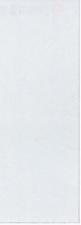

~""게的mI C 0·9.a "" ' • `e 硏 T

”

。

X

” Q ......,

If ·00c‘( "‘’O뺑

a e

器

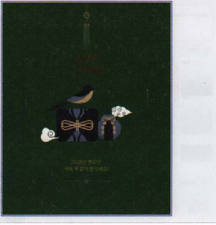

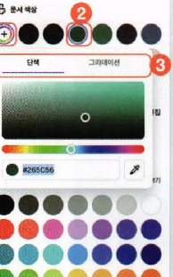

라》E‘•

‘ [

"색 그려대어t!

.”...

。 ,~

~~..•••.•••..

.,4

#

".. -

。

미

怨

13 •

--•.. 1) ".,,

-

###### 5 그라데이션색상주가하기 새로운색상추가창에서 O [그라데이션] 탭을클릭하면 직접 그라데

###### 이션 색상을추가할수있습니다. 이 옵션에서는 그라데이션 색상을여러 개 추가해 설정하거나, 그

###### 라데이션 스타일을선택할수있습니다.

+ 』‘, • \ * 一 rY

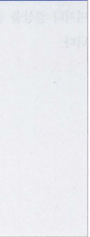

X "nv"＇""配묘I 0 O ...홑 빼률쉘싱

`신 硏 ?

.,삶

.:.‘0••티 [····과”M ]

q

iil @ e

Q .따" '£E·00<•cc...E Er

認

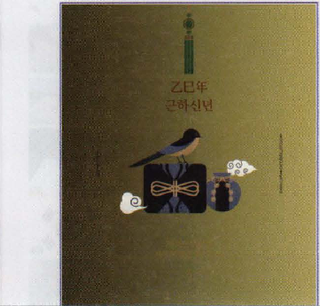

.. 6E唄

.요4 •-.•@

嶋..

Ill

;..••.••...•

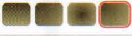

"

0 0 ,＇I!떠 ..."'

m ..

--•······

舒

13 ••

~ 새로운 색상 주가하기의 [그라데이션] 탭

###### L 06 배경과 색상으로 스타일링하기 137

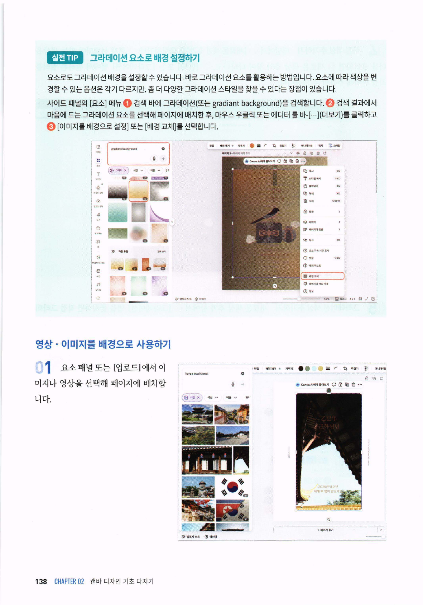

###### 그라데이션요소로 배경

요소로도그라데이션배경을설정할수있습니다.바로그라데이션요소를활용하는방법입니다· 요소에따라색상을변 경할수있는옵션은각기 다르지만,좀더 다양한그라데이션스타일을잦을수있다는장점이 있습니다.

사이드 패널의 메뉴 O 검색 바에 그라데이션(또는 gradiant background)욜 검색합니댜 검색 결과에서

마음에 드는 그라데이션 요소를 선택해 페이지에 후, 마우스 우클릭 또는 에디터 툴 바-[…］（더보기)를 클릭하고

O [이미지를배경으로설정]또는 [배경 교제]를선택합니다.

广三T@畑二\v 먀V)•

" ...C * 팬" • :i:ii r 1:+ 엮S기 l:: -어선 硏 ? 색

`口뻬• •가 v o a ® l!I t!

。

###### ...‘。..

으

"

e

g~.

g

。

....,,

###### c"-

}‘ 자틀"

i

O g

n g

o o _o

7릴m'"‘ 0·,..,, .m ...미 1/l 認 •• 。

r

영상 • 이미지를 배경으로 사용하기

1 _B_±패널또는 [업로드]에서 이

!현깁 빼경"'기 • 지" • • =r u 취e,1 r, "4,..,1,

###### 二

。

a @ e 9 을～따서"齡imI O iii ® @ …

미지나 영상을 선택해 페이지에 배치합 니댜

@ 뻬살 V

뻬 I V ...

”

•

冒"身`

. 델 `.%

S

。

( )

* 빼어지후가

###### 규발표자꼬 OEIOIO

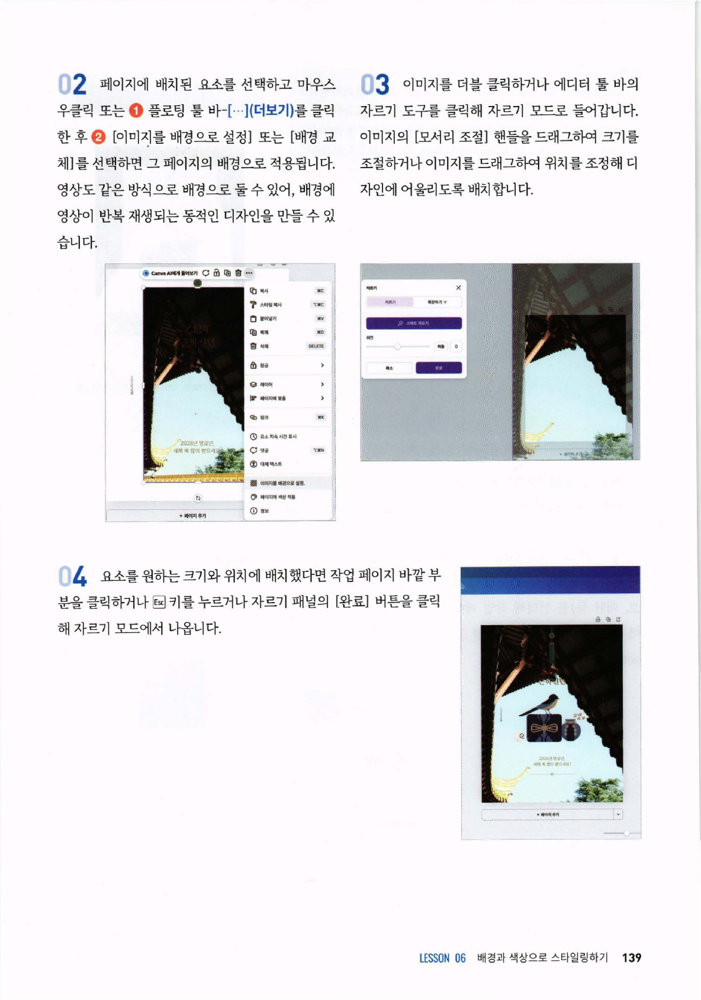

2 페이지예 배치된 요소를 선택하고 마우스

###### 3 이미지를 더블클릭하거나 에디터 툴 바의

우클릭 또는 O 플로팅 툴 바- …]（더보기)를클릭 한 후O [이미지를 배경으로 설정] 또는 [배경 교

자르기 도구를 클릭해 자르기 모드로 들어갑니다. 이미지의 [모서리 조절] 핸들을드래그하여 크기를 조절하거나이미지를드래그하여 위치를조정해 디 자인에어울리도록배치합니다.

체]를 선택하면 그 폐이지의 배경으로 적용됩니다. 영상도 같은 방식으로 배경으로 둘 수 있어, 배경에 영상이 반복재생되는동적인 디자인을만들수있 습니댜

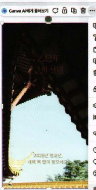

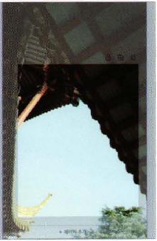

###### 1- 시量기

·-·

o?""`'.... "t: I

X

「.

O 尸"'

翼V

© 틀嶋 翼O

B ..빼 oac

,.. 0

###### °“ )I

9 •야어

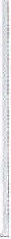

###### II' ...'저"II•

Q •크

.를

°”따포 1

0 댓글 T*N

®따오

###### •

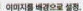

t> o-어미,

+ 0·ll

###### 4 묘를원하는크기와위치에배치했다면작업페이지바깥부

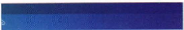

###### 분을클릭하거나 터 키를누르거나자르기 패널의 [완료] 버튼을클릭

a ® I!

해 자르기 모드에서 나옵니다.

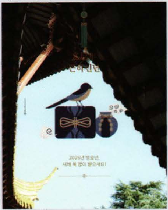

·-·가

l

###### 06 배경과 색상으로 스타일링하기 139

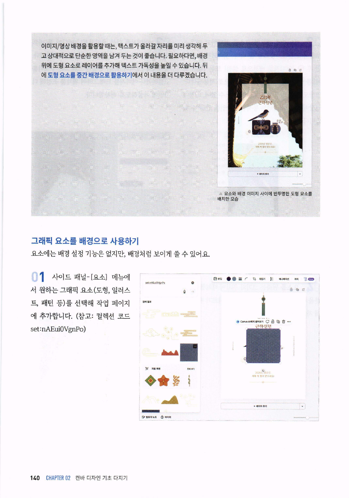

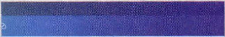

수

@ ® C

.

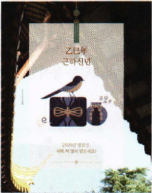

C ，

.... ,

###### .`

••

도형

###### 그래픽 요소를 배경으로 사용하기

요소에는 배경 설정 기능은 없지만, 배경처 럼 보이게 쓸 수 있어요.

1 사이드 패널-［요소] 메뉴에

@던밉 • • =r ti ,.~,1 1': 빼니D101선 "지 ? -

."nAEu'ov.'“

a @ 巳

서 원하는 그래픽 요소(도형, 일러스 9 트, 패턴 등)를 선택해 작업 페이지

i

겁빼겉과

에 추가합니댜 (참고: 컬렉션 코드

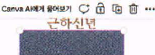

###### set:nAEuiOVgnPo)

골드:

###### 鼻

•

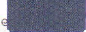

}• 자틀*천 ...”

C)

♦* 훔 i

-강 노•O

+빼어지"

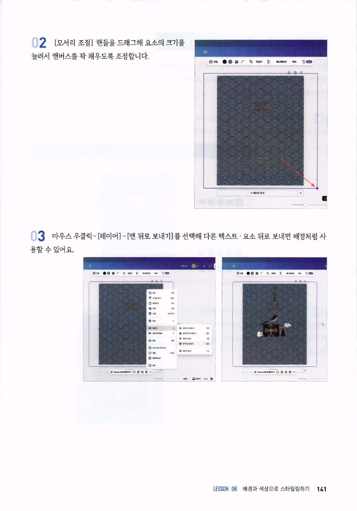

###### 2

[모서리 조절] 핸들을드래그해 요소의 크기를 늘려서 캔버스를꽉채우도록조정합니다.

8

巳른접 • • =r n 由접기

” t @o

3

\

——•

3

마우스우클릭―[레이어]_[맨 뒤로보내기]를선택해 다른텍스트·요소뒤로보내면 배경처럼 사 용할수있어요.

###### 던•• • • 蠶 r n ..,, 3: Tnm^ "' T....

###### ::I_'

###### gi

###### >

,、

。

> ..’...~

, &, ......,,

넬기

빼

###### 。...........

량•""며

T띠

o-.,,

O.. `m

°..-

o ..

~""尸 0 a ® S ···

r s-" "' ”

LESSON 06 배경과 색상으로 스타일링하기 141

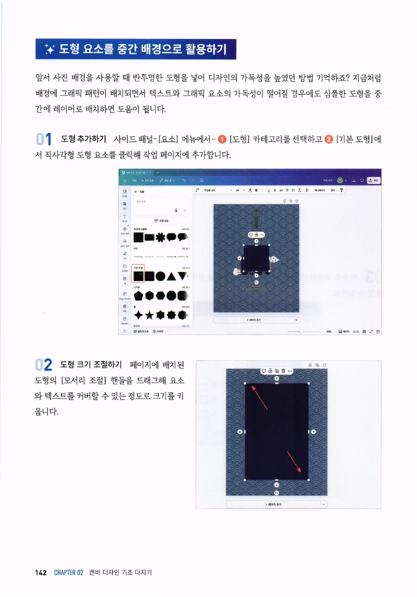

###### | 활 |

앞서 사진 배경을 사용할 때 반투명한 도형을 넣어 디자인의 가독성을 높였던 방법 기억하죠? 지금처럼

배경에 그래픽 패턴이 배치되면서 텍스트와 그래픽 요소의 가독성이 떨어질 경우에도 심플한 도형을 중

간에 레이어로 배치하면 도움이 됩니댜

###### 1 도형주가하기 사이드패널-［요소] 메뉴에서-O [도형] 카테고리를선택하고O [기본도형]에

서 직사각형 도형 요소를클릭해 작업 폐이지에 추가합니다.

| + 」, 一 - |

...Cll.. +- "'

r ••鶴고딕 - .. • A • u s .. ,. ;근 고 3: `"꼬 띠 T

a © 巳

요소 g`

n

" ”

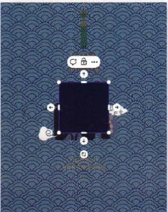

.. :····.. ·...,,

‘ ".......

'51 .....

4

., ―-·-·-― 一一

- -~·-다라. ••i7..""'
- -언........ • ""'

; 令*••• *빼어지"

` ,........ oq"' - 딜印 1/1 II •• ©

###### 2 도형 크기 조절하기 페이지예 배치된

a e

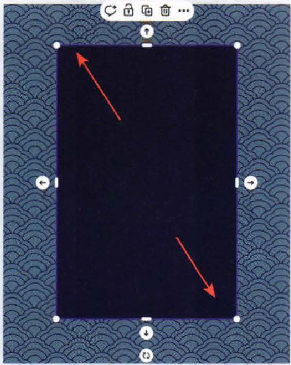

도형의 [모서리 조절] 핸들을 드래그해 요소 와 텍스트를 커버할 수 있는 정도로 크기를 키

웁니댜

L__

♦ · ..가

###### 142 CHAPTER 02 캔바 디자인 기조 다지기

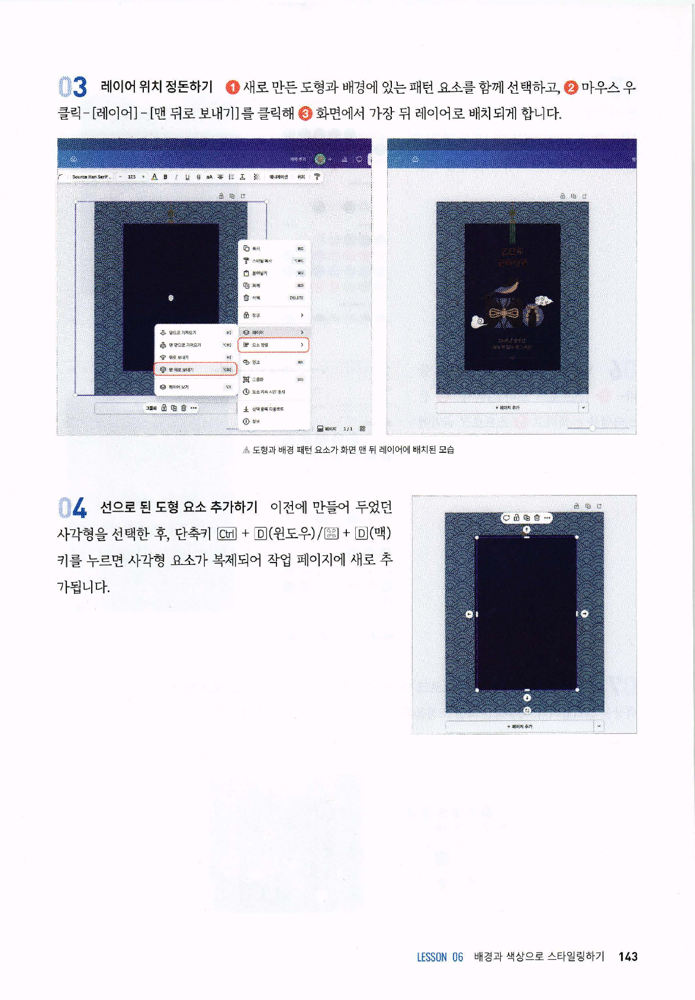

###### 03 레이어위치정돈하기 O새로만든도형과배경에있는패턴요소를함께선택하고,0마우스우

클릭-［레이어]-［맨 뒤로보내기]를클릭해 0 화면에서 가장뒤 레이어로배치되게 합니다.

|0 ,\ \ i | --- ----—·------—--____ 대1

r 요~H""마- - v5 • 스 B I U 5 아 든 ！三 .!. 곳' 야門어선 현치 T

t

a @ c a 屯 C

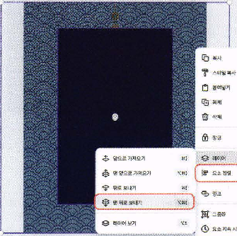

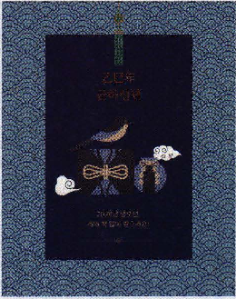

翼I e ·0回 > `"l ( I롱 요소정렬 >

###### .,

역 •크

###### '"'

###### 回 기틀•

®요지C4U 막

###### o •• I

그1회 a@ ＠… 土 선""·프

• 빼지"

liil寧~ 111 Ij

~ 도형과 배경 패턴 요소가 화면 맨 뒤 레이어에 배지된 모습

###### 4 선으로된 도형요소주가하기 이전에 만들어 두었던

###### a @ 巳

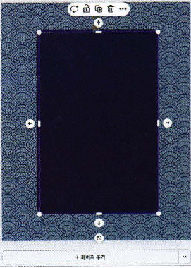

사각형을 선택한 후, 단축키 回챕 + 園(윈도우)／區] + 園(맥)

###### 키를 누르면 사각형 요소가 복제되어 작업 폐이지에 새로 추

가됩니다.

LESSON 06 배경과 색상으로 스타일링하기 143

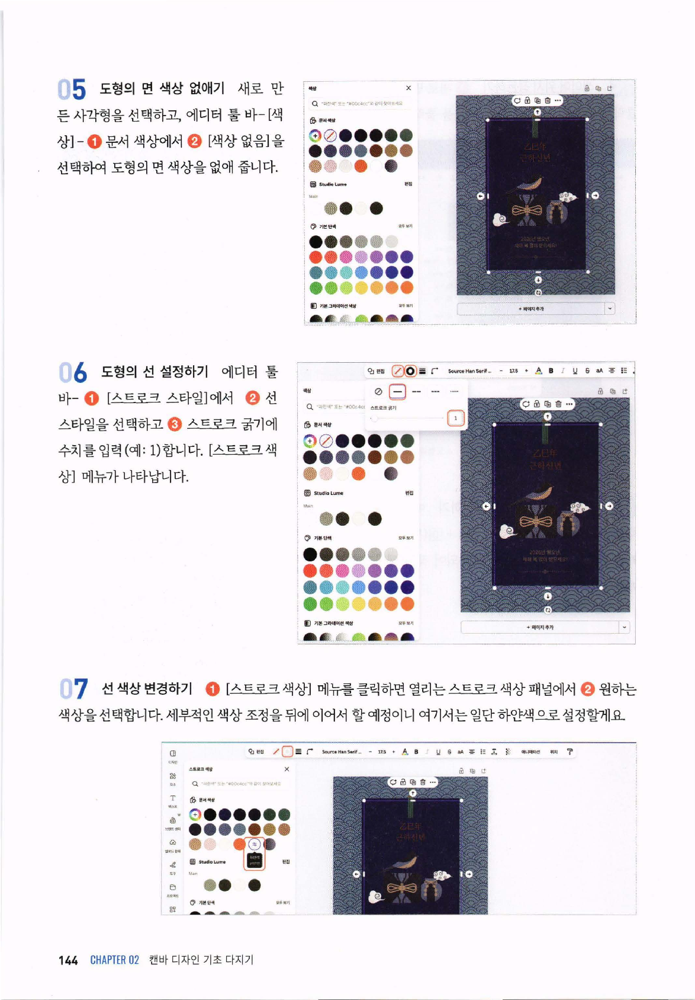

5 도형의 면 색상 없애기 새로 만 ;

###### a 단 C

X

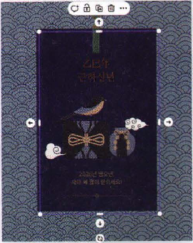

Q .도: 그4 ., 00c.t··‘구,.;, "'

I

.•0••0.....••··.••.••·

8,...,

든사각형을선택하고, 에디터 툴바-[색

상]- 문서 색상에서 O [색상없음]을

선택하여 도형의 면 색상을 없애 줍니다.

O,l븐터•• • .,,.,,

固 s....나" "

.•••.•••-••••.••..•••

IJ 기른그다”선"'

·C 보기

♦

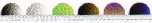

~

6 도형의 선 설정하기 에디터 툴

안론집 e =r

요』~mn요止_ - m + 소 B _ !.I S 러 字

###### " O O --

a ® C

- 바- [~무구 스타일]에서 O 선

# ••:J0,••-\····.••.••·

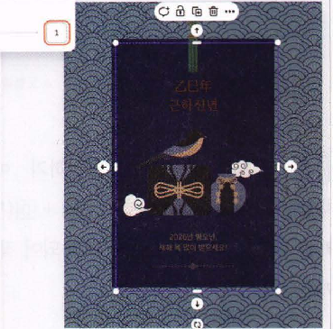

Q ·야한서 죠` ••00c4cc 스툴.....,,

스타일을선택하고 AE 쿠구굵기에

°“어

수치를입력(예: l) 합니댜 [~쿠구 색

상] 메뉴가나타납니댜

1:1 Studio냐me 면깁

0,II!터•• • ··"' •••••• •••r,.,••••••• •••

###### 二

.鳳:f ‘ • ••廳

IJ 기른그平的신..성 모."' + 빼아지•가

###### 7 선색상변경하기 O [스트로크색상] 메뉴를클릭하면열리는스트로크색상패널에서 0 원하는

색상을 선택합니댜 세부적인 색상 조정을 뒤에 이어서 할 예정이니 여기서는 일단 하얀색으로 설정할게요-

Ol 인·g / 0 =r ~~mo~- - l?.s * 소 B I.I S .. ::: ：근 :r. ;: …曲 ＂서 ?

^..빼뻬•

。

X a ® e

~ 0. " 'o.cc

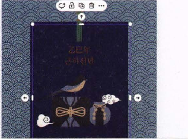

&,,.0••····

T If> 툴서야

.....•••••••

`

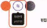

mO.. •

4 園 s'"~I.um•

###### "..

e • ••

------

O 기틀:

144 캔바 디자인 기조 다지기

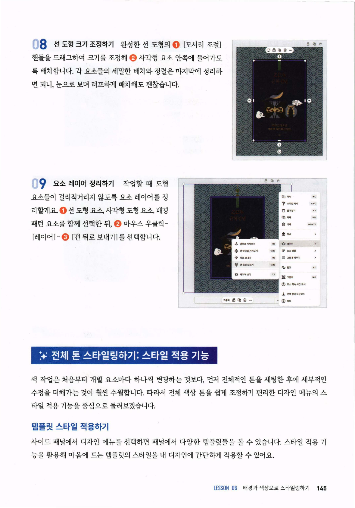

###### 8 선 도형 크기 조정하기 완성한 선 도형의 O [모서리 조절]

a ® C

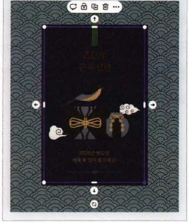

핸들을 드래그하여 크기를 조정해 사각형 요소 안쪽에 들어가도

록 배치합니댜 각 요소들의 세밀한 배치와 정렬은 마지막에 정리하 면 되니, 눈으로 보며 러프하게 배치해도 괜찮습니다.

###### 9 요소 레이어 정리하기 작업할 때 도형

a © U

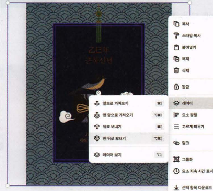

요소들이 걸리적거리지 않도록 요소tll이어를 정 리할게요. 선 도형 요소,사각형 도형 요소, 배경 패턴 요소를 함께 선택한 뒤, 0 마우스 우클릭­

C

* O

[레이어 ]- [맨 뒤로보내기]를선택합니다.

그.. rn le ® •·· • 0 륄뵤

|

색 작업은 처음부터 개별 요소마다 하나씩 변경하는 것보다, 먼저 전체적인 톤을 세팅한 후에 세부적인

수정을 더해가는 것이 훨씬 수월합니다. 따라서 전체 색상 톤을 쉽게 조정하기 편리한 디자인 메뉴의 스

- 타일 적용 기능을 중심으로 둘러보겠습니댜

###### 템플릿스타일적용하기

###### 사이드 패널에서 디자인 메뉴를 선택하면 패널에서 다양한 템플릿들을 볼 수 있습니다. 스타일 적용 기 능을 활용해 마음에 드는 템플릿의 스타일을 내 디자인에 간단하게 적용할 수 있어요.

LESSON 06 배경과 색상으로 스타일링하기 145

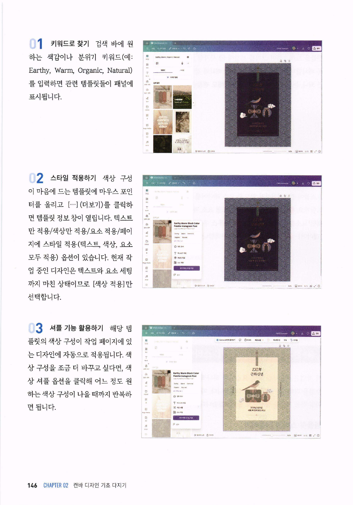

- 1

－一0 庄

- 2
- 3

날드t;..* . l러

키워드로찾기

검색 바에 원

·

색감이나

키워드(예 :

분위7]

『

“ *C-· 0

a .. e

###### ...

?T"

e 9

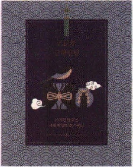

Earthy, Warm, Organic, Natural)

###### .......

··5

．

ioi4"ei

를 입력하면 관련 템플릿들이 패널에

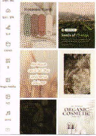

표시됩니다.

已

, ...“ °”"'

” ‘"" 'n 蠶 ‘• ®

스타일 적용하기

색상 구성

###### :넌;』

畵

;:~‘{e~4"0fU

이 마음에 드는 템플릿에 마우스 포인

a • C

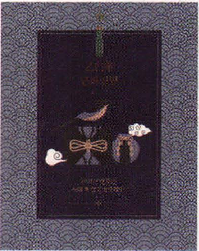

[…] （더보기)를 클릭하

터를올리고

면 템플릿 정보 창이 열립니다. 텍스트

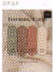

oamw"".....C

....-`-·

”止묘"""

, -~' ”

###### 만 적용/색상만 적용/요소 적용/페이

지에 스타일 적용(텍스트, 색상, 요소

°”"

###### --

T 빼른..

모두 적용) 옵션이 있습니다. 현재 작 업 중인 디자인은 텍스트와 요소 세팅 까지 마친 상태이므로 [색상 적용]만 선택합니댜

o- ••

g

입 m··

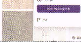

18

빼

n

“ 딜｀며 U’ ”‘· o

,,···느• O m"'

誕麟髮?0 @n. 、· 1m1

셔플기능활용하기 해당템 플릿의 색상 구성이 작업 페이지에 있

`”曲 .. -r,...

獻

옮"~""..."' C 0 " ""

t

a .. c

11aT"2°~4

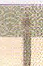

는 디자인에 자동으로 적용됩니다. 색

*…s,.....,타,...W…"여..~~R

###### 상 구성을 조금 더 바꾸고 싶다면, 색

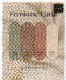

근하

.... --

상셔플옵션을 클릭해 어느 정도 원

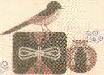

--

"

u, 一 --一

은肥

하는색상구성이 나올때까지 반복하 면됩니댜

O ···사 T 뺄•••

0t0

x .....

. 通 뻬

•p"

입 h•·

『 n

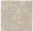

" ...” °"".

“ 딜* ·,' ” ··o

146 02 캔바디자인 기조 다지기

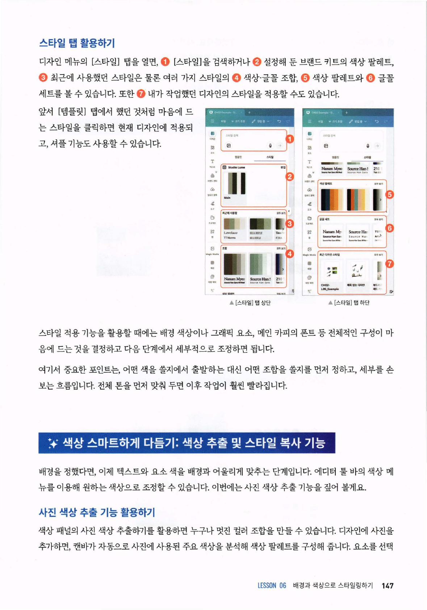

###### 스타일탭활용하기

디자인 메뉴의 [스타일] 탭을열면,O [스타일]을검색하거나e 설정해 둔브랜드키트의 색상팔레트, O 최근에 사용했던 스타일은 물론 여러 가지 스타일의 O 색상·글꼴 조합, O 색상 팔레트와 O 글꼴 세트를 볼 수 있습니댜 또한O 내가 작업했던 디자인의 스타일을 적용할 수도 있습니다.

앞서 [템플릿] 탭에서 했던 것처럼 마음에 드 는 스타일을 클릭하면 현재 디자인에 적용되 고, 셔플 기능도 사용할 수 있습니다.

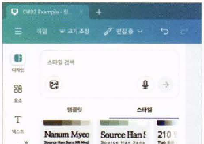

..

‘

###### ..

認 e 9

C

엽

..닷 스막혈

讐틀밋 스

T

T

i

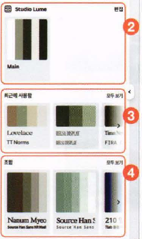

-,t,...、' .........-----

M)'CI) Sourcellan! 210

w

蟲

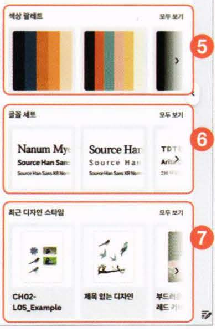

。

`"..

11.ll"

4

4

‘구

됴구

###### .."

e,

###### 0 ("꼬

었

를 튼 '0•'""

.........g 鵬근디지언스미

.. ·- ;니/

"-•••

•

###### ....

z

....。

。 "』 a

C ·

###### L ,. _,__

LOI_.."다’h

터 앙

~ [스타일] 탭 상단

소 [스타일] 탭하단

스타일 적용 기능을 활용할 때에는 배경 색상이나 그래픽 요소, 메인 카피의 폰트 등 전체적인 구성이 마

음에 드는 것을 결정하고 다음 단계에서 세부적으로 조정하면 됩니댜

###### 여기서 중요한 포인트는, 어떤 색을 쓸지에서 출발하는 대신 어떤 조합을 쓸지를 먼저 정하고, 세부를 손

보는 흐름입니댜 전체 톤을 먼저 맞춰 두면 이후 작업이 훨씬 빨라집니다.

###### 및 l

배경을 정했다면, 이제 텍스트와 요소 색을 배경과 어울리게 맞추는 단계입니다. 에디터 툴 바의 색상 메 뉴를 이용해 원하는 색상으로 조정할 수 있습니댜 이번에는 사진 색상 추출 기능을 짚어 볼게요.

###### 사진 색상 추출 기능 활용하기

###### 색상 패널의 사진 색상 추출하기를 활용하면 누구나 멋진 컬러 조합을 만들 수 있습니다. 디자인에 사진을 추가하면, 캔바가 자동으로 사진에 사용된 주요 색상을 분석해 색상 팔레트를 구성해 줍니다. 요소를 선택

LESSON 배경과 색상으로 스타일링하기 147

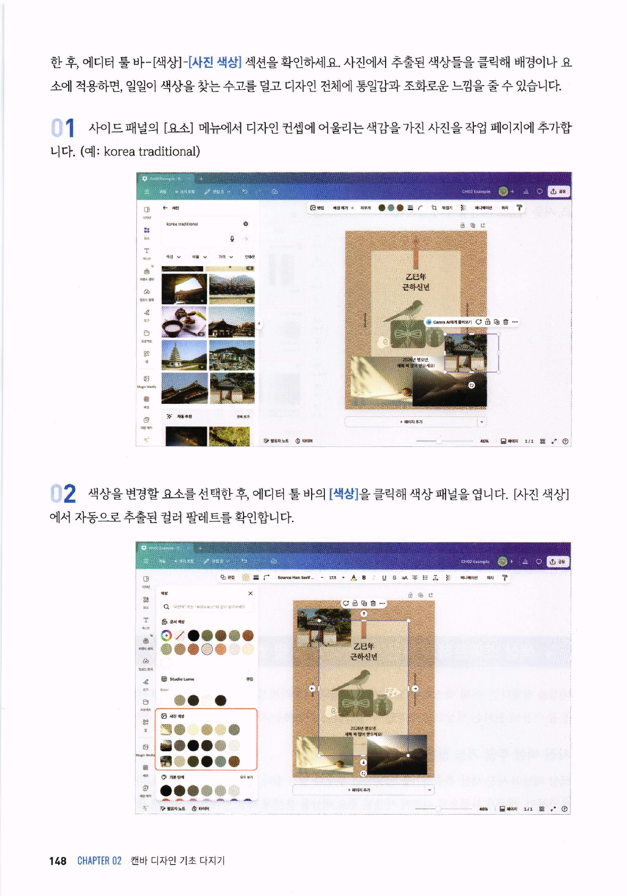

한후, 에디터 툴바-［색상] -［사진 색상] 섹션을확인하세요. 사진에서 추출된 색상들을클릭해 배경이나요

소에 적용하면, 일일이 색상을 찾는 수고를 덜고 디자인 전체에 통일감과 조화로운 느낌을 줄 수 있습니다.

###### 1

사이드패널의 [요소] 메뉴에서 디자인 컨셉에 어울리는색감을가진 사진을작업 폐이지에 추가합

니댜 (예 : korea traditional)

1" ... 1 m|

###### @현t! 빼겹빼기* 지" •••=r b 워O1

x

T

<- 서던

"

..＂＇미d

Cll

"""

a © C

UUb

。

:;

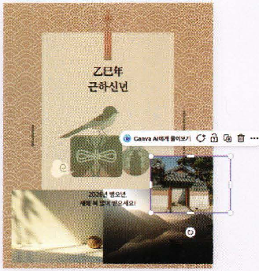

<

‘

.T 빼성v 빼흩 v

."‘.. _

go

가 V

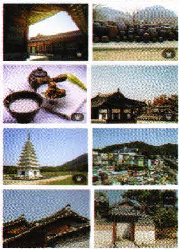

。

열"..

4

됴구

E3

m ..

怨`

--•..

e

###### ,....... 론빼"

....。

••어지"

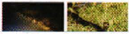

`.

컵•"＇포 O1 ” liil寧떠 l/l 認 •• ®

###### 2

색상을변경할요소를선택한후, 에디터 툴바의 [색상]을 클릭해 색상패널을엽니 다. [사진 색상]

에서 자동으로 추출된 컬러 팔레트롤 확인합니다.

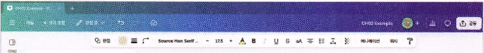

.... X a © C

..... •®~0•/·•·o·•··

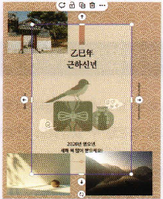

Q •10<•

T 11'>..,....,

`스

열"..

4 웁 ..............

•

·접

###### I....:e ..... • •

톤I;;c,,,톤•던뻬••••••••••.."' •••••

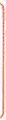

® 서• ...,

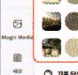

###### *""""

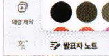

"` 다..,지 l11 88 .^ ®|

글 글 - 기-

才•파노 O "

148 캔바디자인 기조 다지기

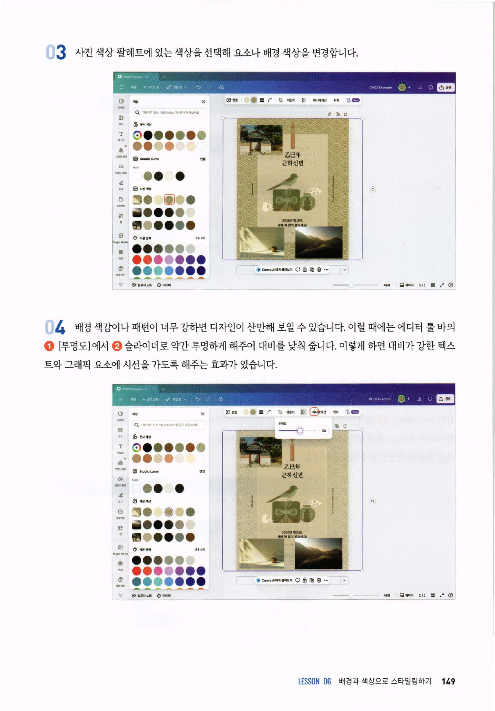

###### 03 사진 색상팔레트에 있는색상을선택해 요소나배경 색상을변경합니댜

&:;':.＇먼 •," 0 1m

@던밉 .. r t+ ~밀기 죠. 무~＇. 畑 ? c

[Jj 어

.:.0••····

X

c

Q .........e ."Ctc... " ....,..

iil ® C

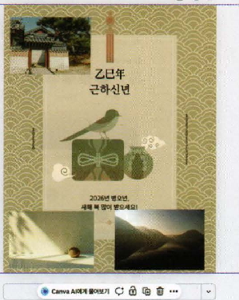

.. 0·"ti

....‘"•"..•^•

.....° "•• •

lo냐~

턴•

.~......

”

4

•• 1B ...,..,

요 •

•....•.•.••.

.;'........

뺑•••••

g 0

기른던. • • .,,

~""""U o a © O ..• ,v

..` 닳寧 1/1 腐 .» ®

- - ----

之. 印

'

###### 4 배경 색감이나패턴이 너무강하면디자인이 산만해 보일수있습니댜이럴때에는에디터 툴바의

O [투명도]에서 슬라이더로약간투명하게해주어 대비를낮춰줍니다. 이렇게하면대비가강한텍스

트와그래픽 요소에 시선을가도록해주는효과가있습니다.

IE: + 5 f0,.~ aj '

...Gl "

X IE~• =a r ~ ".기 엇 G沖선 曲 " -

! 0••····

a. ·-·...·•00<•.=.....船••• ”‘

C

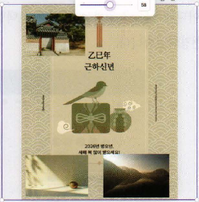

않

.. 6E··

••‘•St떠DU•^~• 른접

.....o4 ....•• •

~.......

.-.....

” O 땔"

"

"e.. 3• 」.••

e (?,,른언 ...,,

·-....

- • •••••
- •• •••••••

###### - 닳...,지\

!.. -. . . _......--

---- 0 al le 9 ... •

x· 7뵐표지노皇 0"

LESSON 06 배경과 색상으로 스타일링하가 149

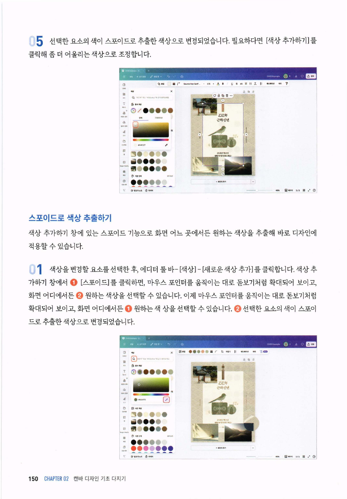

###### 5

###### 선택한요소의 색이 스포이드로추출한색상으로변경되었습니다. 필요하다면 [색상추가하기]를

클릭해 좀더 어울리는색상으로조정합니다.

###### `C

X

...·.· 0/·····

.,、'..........

: ..Q

T ii, ....

" '"'"U1

###### .....。

4

”

,

e!

···‘”.

~-0,II릴•.•••••••'~••.."'

###### -"•

e

••,.""--•-°-••---

뻬

~' 'n 霧 •• (!)

`·

###### 스포이드로 주출하기

색상 추가하기 창에 있는 스포이드 기능으로 화면 어느 곳에서든 원하는 색상을 추출해 바로 디자인에

적용할수있습니다.

###### 1

색상을 변경할요소를선택한후, 에디터 툴바-[색상] - ［새로운 색상 추가]를클릭합니다. 색상 추

가하기 창에서 O [스포이드]를 클릭하면, 마우스 포인터를 움직이는 대로 돋보기처럼 확대되어 보이고,

화면 어디에서든 원하는 색상을 선택할 수 있습니다. 이제 마우스포인터를움직이는 대로돋보기처럼

확대되어 보이고, 화면 어디에서든 0 원하는색 상을 선택할 수 있습니다. O 선택한 요소의 색이 스포이

드로 추출한 색상으로 변경되었습니다.

###### , 이,.,.～다· 1 m|

..'

Ill ...

###### .”.... Te,

:.0••····

II @

a <II C

• a, ....

- -뺀‘
- -·..

4

..•e!

舒

x

•-

-0”

lr.!H •• • • • =! r ~ """ l

1B .....

_a, •• •

- -- ••••

C·

1

닌

A`

·

" 뻔 • • • •

• o m"" ""

###### .."

오” ••- -•• ••-•-••--

###### 딜"'서 "' ” .. (i)

，，．m'므 0 ·四0'

150 CHAPTER 02 캔바디자인 기조다지기

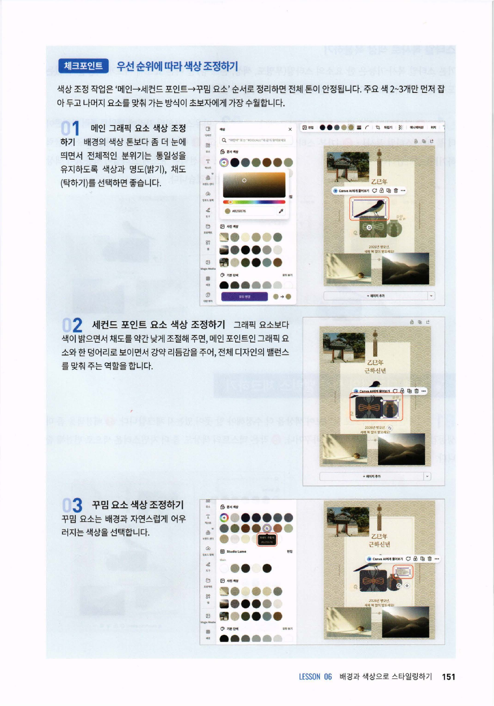

###### 우선순위에따라색상조정하기

색상 작업은 ‘메안➔세컨드 포인트➔꾸밈 요소' 순서로 정리하면 전제 안정됩니다. 주요 색 2~3개만 먼저 잡 아 두고 나머지 요소를 가는 방식이 수월합니다.

1 그래픽 색상 CB 때 X 퍄• • • =r n 위일가 *: 데_땔 위니

.:. 0••····

q

S ""mv , a C

하기 색상톤보다좀 더 눈에 Q 기r

띄면서 전제적인 분위기는 .. O:"‘

i

유지하도록 명도(밝기), 채도

(탁하기)를선택하면좋습니댜 ......

W

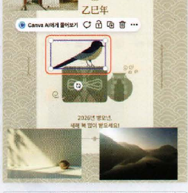

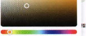

###### .....。

4 ••.,..,. .,

‘’

••“ 언• •••

e, 。 써"'

••••

82

-ca....뻔^••••

- • O 기른.... ..""
- ••。 •••••

• ➔ •

. ..... *기

...빼

- 2 세컨드포인트요소 색상조정하기 그래픽 요소보다 a © C

색이 재도를약간낮게조절해주면,메인 그래픽 요 -‘1 소와 한 보이면서 강약 리듬감을 주어, 전제 밸런스 를 주는 합니다.

,

• ~,lJ•••

♦ 嶋이띠 •n

- 3 꾸밈 요소색상조정하기

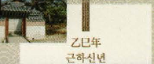

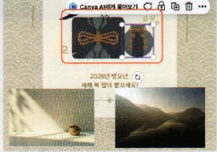

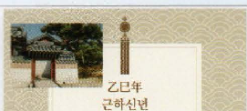

" 0Um...,

꾸밈 요소는 배경과 자연스럽게 어우

‘T ••••..•••

:;..... ：t"dl밑

~""어.,, o ai ~ i;; ...

! • ••

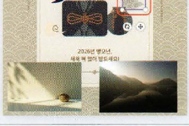

e e 사건"

Q

"" • • •

••••

:g4·--••······..

" '

”뻬麟

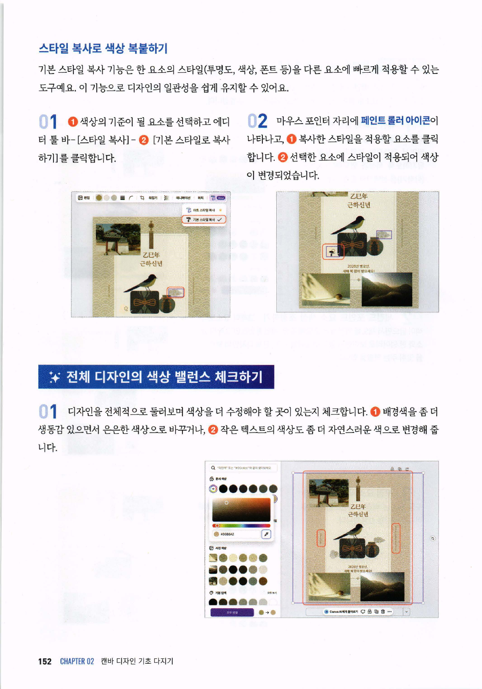

###### 스타일 복사로 색상 복붙하기

기본 스타일 복사 기능은 한 요소의 스타일(투명도, 색상, 폰트 등)을 다른 요소에 빠르게 적용할 수 있는 도구예요. 이 기능으로 디자인의 일관성을 쉽게 유지할 수 있어요.

###### 1 0색상의기준이될요소를선택하고에디 n2 마우스포인터자리에페인트롤러아이콘이

- 터 툴 바- ［스타일 복사]- O [기본 스타일로 복사 나타나고, O복사한스타일을 적용할 요소를 클릭

하기]를클릭합니다. 합니댜 0 선택한요소에스타일이 적용되어 색상

이 변경되었습니다.

@턴밉 • aa r ti .ie,1 죠. 에니떼01선 위치 -

g•-

? Of·스".사

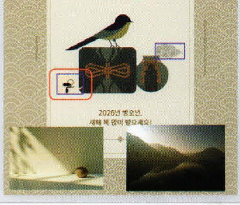

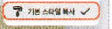

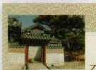

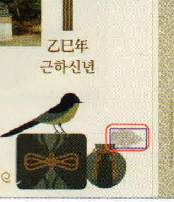

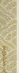

###### | |

###### 1 디자인을전체적으로둘러보며 색상을더 수정해야할곳이 있는지 체크합니댜0배경색을좀더

생동감있으면서 은은한색상으로 바꾸거나, O 작은 텍스트의 색상도좀 더 자연스러운 색으로 변경해 줍

니댜

0••····D

###### •_I

Q ,軍t.,F."&&C··어""'세g

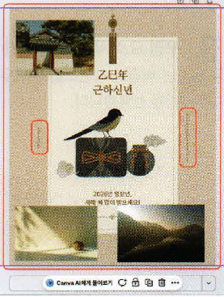

0"...,

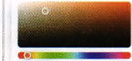

,.

@

• •D386A2

C>

~•••••••••••••

@때..,

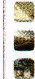

###### •••••

0 기른던뻬 ••"'

-- •➔•

152 CHAPTER 02 캔바 디자인 기조 다지기

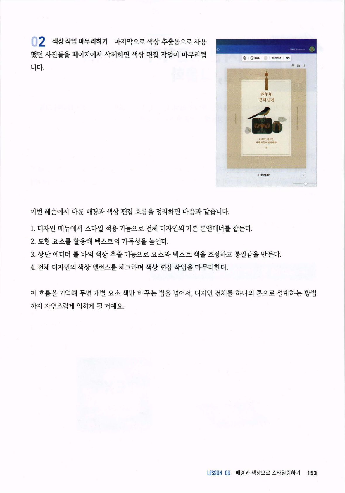

###### 2 색상작업마무리하기 마지막으로색상추출용으로사용

'..

했던 사진들을 페이지에서 삭제하면 색상 편집 작업이 마무리됩

g o". ｀＂마' "'

a 딸 C

니댜

丙午 5t

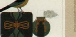

X2Q 뺄오년

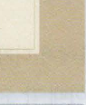

,

+

♦ ...,지”

이번 레슨에서 다룬 배경과 색상 편집 흐름을 정리하면 다음과 같습니댜

- 1. 디자인 메뉴에서 스타일 적용 기능으로 전체 디자인의 기본 톤앤매너를 잡는다.
- 2. 도형 요소를 활용해 텍스트의 가독성을 높인다.
- 3. 상단 에디터 툴 바의 색상 추출 기능으로 요소와 텍스트 색을 조정하고 통일감을 만든다.
- 4. 전체 디자인의 색상 밸런스를 체크하며 색상 편집 작업을 마무리한다.

이 흐름을 기억해 두면 개별 요소 색만 바꾸는 법을 넘어서, 디자인 전체를 하나의 톤으로 설계하는 방법

까지 자연스럽게 익히게 될 거예요.

