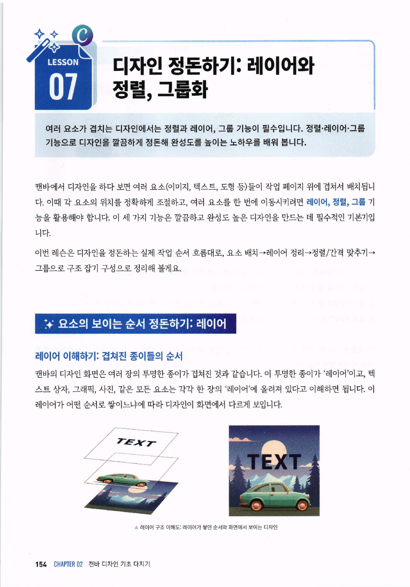

###### 디자인 정돈하기: 레이어와 정렬,그룹화

###### 여러 요소가 레이어, 기능이 필수입니다.

봅니다.

캔바에서 디자인을 하다 보면 여러 요소(이미지, 텍스트, 도형 등)들이 작업 페이지 위에 겹쳐서 배치됩니 댜 이때 각 요소의 위치를 정확하계 조절하고, 여러 요소를 한 번에 이동시키려면 정렬, 그룹 기 능을 활용해야 합니다. 이 세 가지 기능은 깔끔하고 완성도 높은 디자인을 만드는 데 필수적인 기본기입

니다.

이번 레슨은 디자인을 정돈하는 실제 작업 순서 흐름대로, 요소 배치一레이어 정리一정렬/간격 맞추기一

그룹으로 구조 잡기 구성으로 정리해 볼게요.

###### |

###### 레이어 이해하기: 겹쳐진 종이틀의 순서

캔바의 디자인 화면은 여러 장의 투명한 종이가 겹쳐진 것과 같습니다. 이 투명한 종이가 ‘레이어’이고, 텍 스트 상자, 그래픽, 사진, 같은 모든 요소는 각각 한 장의 ‘레이어’에 올려져 있다고 이해하면 됩니다. 이

레이어가 어떤 순서로 쌓이느냐에 따라 디자인이 화면에서 다르게 보입니다.

###### rExr

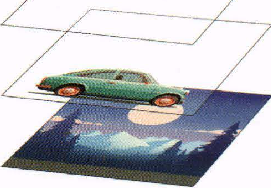

레이어 구조 이해도: 레이어가 쌓인 순서와 화면에서 보이는 디자인

###### 154 CHAPTER 02 캔바 디자인 기조 다지기

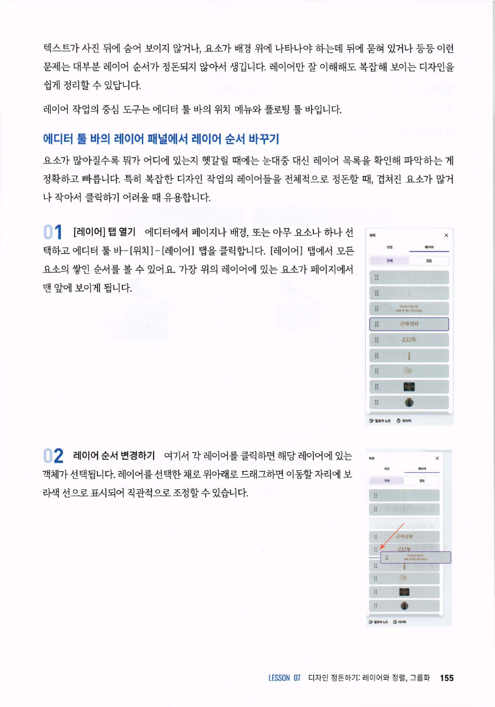

텍스트가 사진 뒤에 숨어 보이지 않거나, 요소가 배경 위에 나타나야 하는데 뒤에 묻혀 있거나 등등 이런

###### 문제는 대부분 레이어 순서가 정돈되지 않아서 생깁니다. 레이어만 잘 이해해도 복잡해 보이는 디자인을

쉽게 정리할 수 있답니다.

레이어 작업의 중심 도구는 에디터 툴 바의 위치 메뉴와 플로팅 툴 바입니다.

###### 에디터 툴 바의 레이어 패널에서 레이어 순서 바꾸기

###### 요소가 많아질수록 뭐가 어디에 있는지 헷갈릴 때에는 눈대중 대신 레이어 목록을 확인해 파악하는 게

정확하고 빠릅니다. 특히 복잡한 디자인 작업의 레이어들을 전체적으로 정돈할 때, 겹쳐진 요소가 많거

- 나 작아서 클릭하기 어려울 때 유용합니다.

1 [레이어]탭열기 에디터에서 페이지나배경, 또는아무요소나하나선 "외

택하고에디터 툴바-［위치] - ［레이어] 탭을클릭합니다. [레이어] 탭에서 모든

요소의 쌓인 순서를 볼 수 있어요· 가장 위의 레이어에 있는 요소가 페이지에서

맨앞에보이게됩니다.

2 레이어순서변경하기 여기서각레이어를클릭하면해당레이어에있는

객체가 선택됩니다. 레이어를 선택한 채로 위아래로 드래그하면 이동할 자리에 보

- 라색 선으로표시되어 직관적으로조정할수 있습니다.

x

필혈 빼어어 e.. 겁밑

嶋• ...뻬g

l

###### ■

;,.. 0"

” -

떠 X

먼~ • •

###### /년

###### 王...,;:

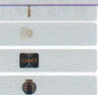

·“ 노.

###### LESSON 07 디자인 정돈하기: 레이어와 정렬, 그룹화 155

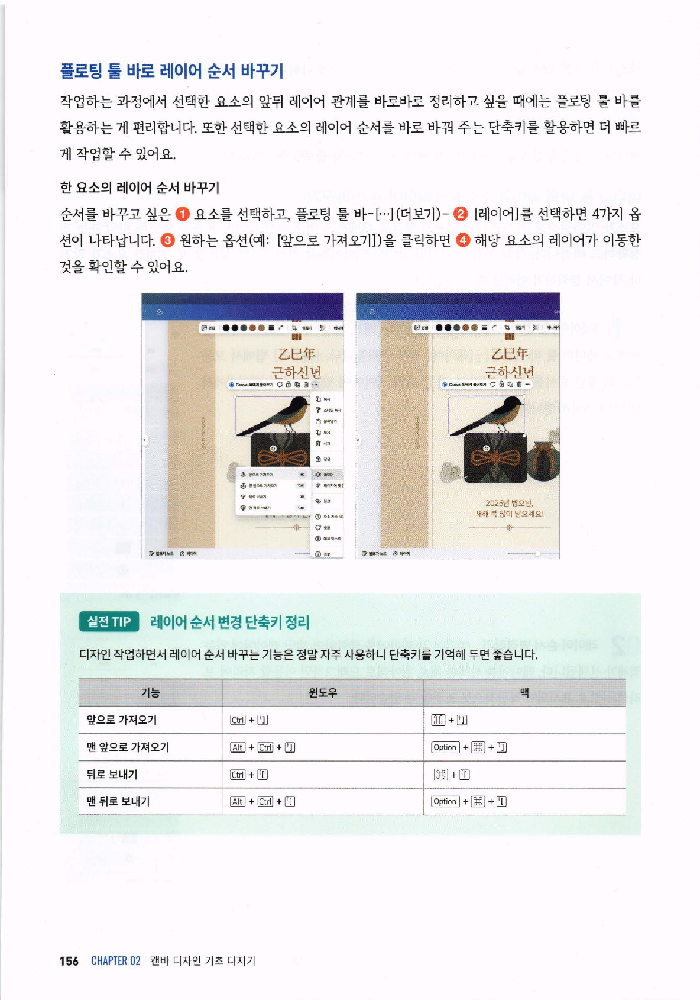

###### 플로팅 툴 바로 레이어 순서 바꾸기

작업하는 과정에서 선택한 요소의 앞뒤 레이어 관계를 바로바로 정리하고 싶을 때에는 플로팅 툴 바를 활용하는 게 편리합니댜 또한 선택한 요소의 레이어 순서를 바로 바꿔 주는 단축키를 활용하면 더 빠르

게 작업할수있어요.

한 요소의 레이어 순서 바꾸기

순서를 바꾸고 싶은 O 요소를 선택하고, 플로팅 툴 바-[…］（더보기)-e [레이어]를 선택하면 4가지 옵

션이 나타납니다. O 원하는 옵션(예: ［앞으로 가져오기]）을 클릭하면 O 해당 요소의 레이어가 이동한

것을확인할수있어요.

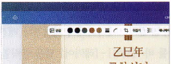

###### 乙巳年

乙巳年

' c a © © ···

~"釣口 ca©O ...

0 1

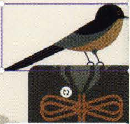

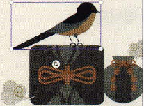

T 작일모

。 ...,기

© "

8 삭.

l!l ••

&~. ...가빼요 • I

......""' " ' ir -•

숭• ••...,,

이 밀크

. 새해복

'i) • ..;뵤..,, ,.,

을 0,.

"~" ' - • `_. 0 ..현

옹

® 며...

I """· 0.... _

— 요 ..

꼬 O

레이어 순서 변경 단축키 정리

###### 디자인 작업하면서 레이어 바꾸는 기능은 자주 사용하니 좋습니다.

| | | |
|---|---|---|
|앞으로가져오기|回 + 虹l|選 + 回|
|맨앞으로가져오기|因0 + 臣깅 + 四|匠표리 + 選] ＋ 띠|
|뒤로보내기|回 + 띠|選] + 띠|
|맨뒤로보내기|固 + 回깁 + 띠|@둡리 + 卽 + 卽|

###### I

156 02 캔바 디자인 기조 다지기

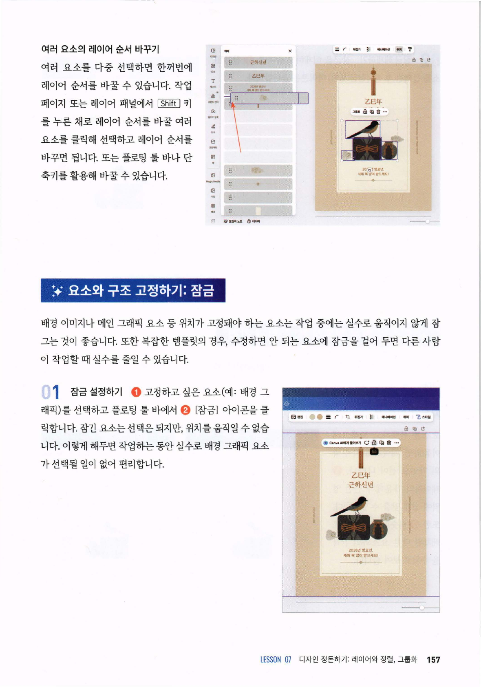

# 여러 요소를다중선택하면한꺼번에 ....~ :: 군하신년 I;’ r「....\꼬··-

여러 요소의 레이어 순서 바꾸기 o 떠 X ail r ""기 3: - ... 7'

레이어 순서를 바꿀 수 있습니다. 작업 ·?. ;.:. .,....乙．,...”I.• 1

###### 페이지 또는 레이어 패널에서 固西巨l :... , " 1 1 포9...

를 누른 채로 레이어 순서를 바꿀 여러 ...4..

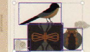

`4

요소를 클릭해 선택하고 레이어 순서를 e,

바꾸면 됩니다. 또는 플로팅 툴 바나 단 ?

국*키르己 화크요0 케° 바꿀 수 있습니다. ~ :.:. r. ·.· .."20·,, 3!

"．龜·- ..

e

###### ..• ..

’ 7·"'노. 。中

###### I |

배경 이미지나 메인 그래픽 요소 등 위치가 고정돼야 하는 요소는 작업 중에는 실수로 움직이지 않게 잠

그는 것이 좋습니다. 또한 복잡한 템플릿의 경우, 수정하면 안 되는 요소에 잠금을 걸어 두면 다른 사람 이 작업할 때 실수를 줄일 수 있습니다.

- 1 잠금 설정하기 O 고정하고 싶은요소(예: 배경 그

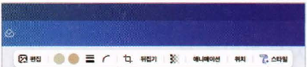

래픽)를 선택하고 플로팅 툴 바에서 O [잠금] 아이콘을 클

###### a e

릭합니댜잠긴요소.는선택은되지만,위치를움직일수없습 니댜 이렇게 해두면 작업하는동안실수로 배경 그래픽 요소

- 가 선택될 일이 없어 편리합니다.

Ill

예卜

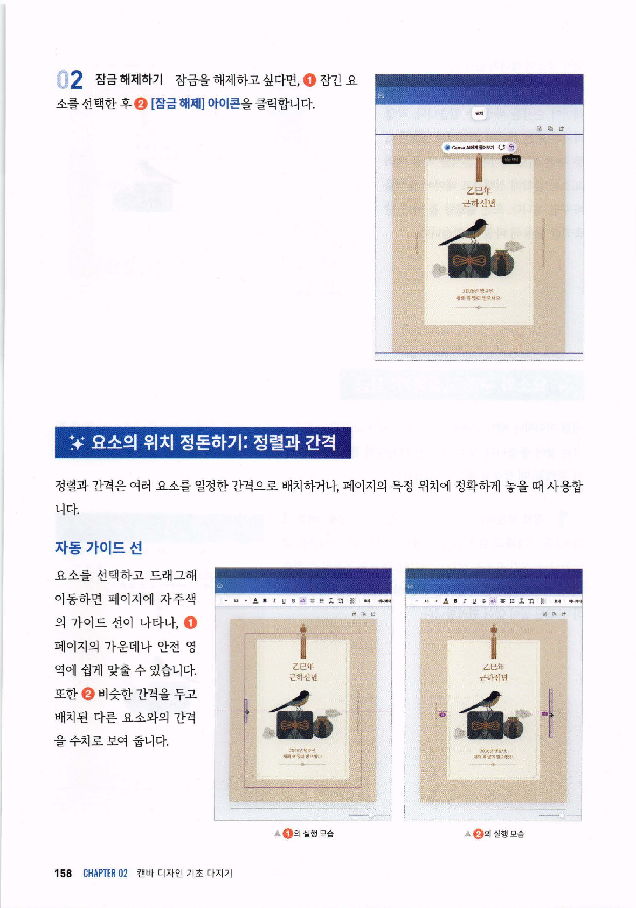

###### 2 잠금해제하기 잠금을해제하고싶다면,O잠긴 요

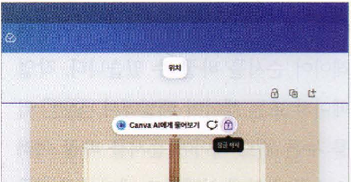

###### 소를선택한후 [잠금해재]아이콘을클릭합니다.

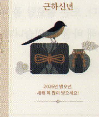

을

###### |

정렬과 간격은 여러 요소를 일정한 간격으로 배치하거나, 페이지의 특정 위치에 정확하게 놓을 때 사용합

니다.

###### 자동가이드선

요소를 선택하고 드래그해 이동하면 페이지에 자주색

###### ‘d

a 언 C

iil Q!J I!

의 가이드 선이 나타나, O

―

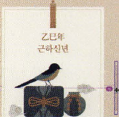

페이지의 가운데나 안전 영

－巳

年묘

乙

역에 쉽게 맞출 수 있습니다.

tA

-}0

또한 O 비슷한간격을두고

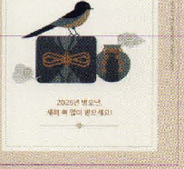

배치된 다른 요소와의 간격

。

을수치로보여 줍니댜

###### 새 닫0세R‘

궤k

~ 의실행모습 ~ 의실행모습

158 CHAPTER 02 캔바 디자인 기조 다지기

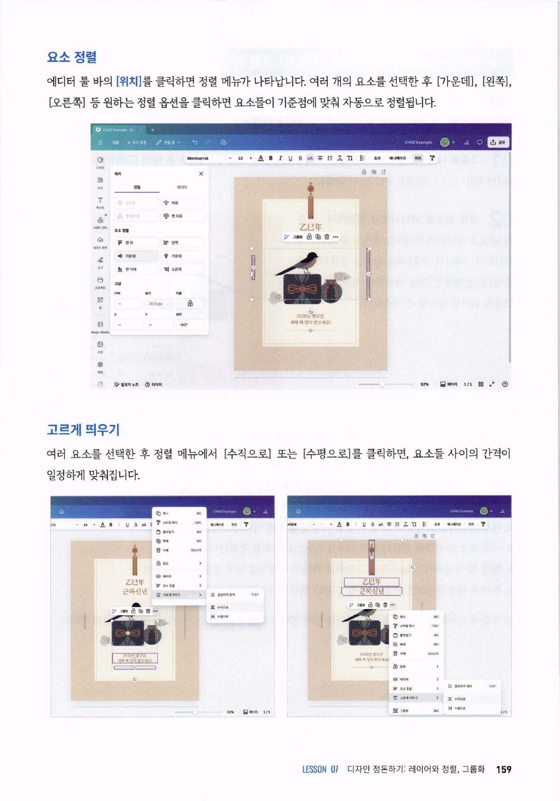

###### 요소정렬

에디터 툴 바의 를 클릭하면 정렬 메뉴가 나타납니다. 여러 개의 요소를 선택한 후 [가운데], ［왼쪽] ,

[오른쪽] 등 원하는 정렬 옵션을 클릭하면 요소들이 기준점에 맞춰 자동으로 정렬됩니다.

###### 1도.-·\，，륀? CHO'"~ 0令 一 " m1

e g

- ll ♦ 스 B l !J S aA :.. ;근 J. n ~' " ｀”꾜 硏 T

x

a 언 C

"치

認

m 혈혈 嶋아어

-II

###### T

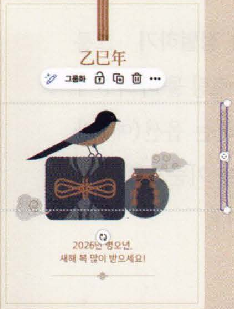

순탄

" .. 요소"

량 ""量

年

乙

巳

숨

五 a

@

8

/

。

Ir 륀.

下 뺀”

‘

술 가

.. 가운대

" .!,_ 른<>l'I 떠 오타

###### ....

e!

고급

.., 빽1

..

니

205p" a

8?

--®g ·90·

@

.”

^ 子"m'노 O 印回

S2` 닳 "°I지 1/1 •• (i)

###### 고르게띄우기

여러 요소를 선택한 후 정렬 메뉴에서 [수직으로] 또는 [수평으로]를 클릭하면, 요소들 사이의 간격이

일정하게맞춰집니다.

| 」

###### B US라=;근.!,n 8 m `-· .. 1'

...,,. • 소

’틱 - ... A • US&Al T ” ....

빼내me ml ,.

- o ....."
- o ... s... "'

###### a o c

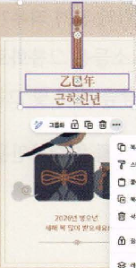

0 ••

<)

0-

冒 ....

근하

;,,,■•iil--'88···

> 三

三고""＇’

고: ．니..

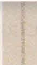

lo( ••••

0~

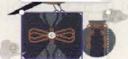

T 쩌.., wc

o ..,.,기

© •嶋

白 4,

|

(il ••

=❖=

"

0 마

......

###### .. 요...

,..,,.무가

> I ••.. lo! .....

l!il ,••

.... 딜印1지 1/ 1

l/1

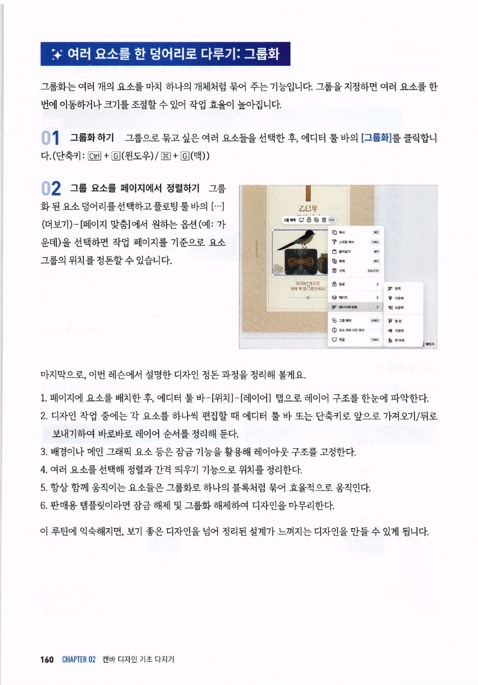

###### I

그룹화는 여러 개의 요소를 마치 하나의 개체처럼 묶어 주는 기능입니다. 그룹을 지정하면 여러 요소를 한

번에 이동하거나 크기를 조절할 수 있어 작업 효율이 높아집니다.

###### 1 그룹화하기 그룹으로묶고싶은여러 요소들을선택한후, 에디터 툴바의 [그룹화]를클릭합니

다. (단축키 : [gill + 固(윈도우)/ ~ + 固(맥))

###### 2 그룹 요소를 페이지에서 정렬하기 그룹

화된요소덩어리를선택하고플로팅툴바의 […]

그틀빼빼 c a G 던 ..

- - `

###### (더보기) - ［페이지 맞춤]에서 원하는 옵션(예: 가

IQ .서 翼C

T 스타일빼서

운데)을 선택하면 작업 폐이지를 기준으로 요소

0 FWI .v © "

그룹의위치를정돈할수있습니다.

翼O

@ 식꽤

O 같급

###### 8t’

Ii' 현빼

€ 레어어 ) * 자I!~

뺀

l零 " . ) -:1 오른쪽

안 그롤..,. 。翼G ji 옌튀

@ 오쩌속시간파 .. 가"

O 뎃글 `” k I!"" J...IX

마지막으로, 이번 레슨에서 설명한 디자인 정돈 과정을 정리해 볼게요.

l. 페이지에 요소를 배치한 후, 에디터 툴 바-[위치]-［레이어] 탭으로 레이어 구조를 한눈에 파악한댜

- 2. 디자인 작업 중에는 각 요소를 하나씩 편집할 때 에디터 툴 바 또는 단축키로 앞으로 가져오기/뒤로 보내기하여 바로바로 레이어 순서를 정리해 둔다.
- 3. 배경이나 메인 그래픽 요소 등은 잠금 기능을 활용해 레이아웃 구조를 고정한다.
- 4. 여러 요소를 선택해 정렬과 간격 띄우기 기능으로 위치를 정리한다.
- 5. 항상 함께 움직이는 요소들은 그룹화로 하나의 블록처럼 묶어 효율적으로 움직인다.
- 6. 판매용 템플릿이라면 잠금 해제 및 그룹화 해제하여 디자인을 마무리한다.

이 루틴에 익숙해지면, 보기 좋은 디자인을 넘어 정리된 설계가 느껴지는 디자인을 만들 수 있게 됩니다.

160 CHAPTER 02 캔바 디자인 기조 다지기

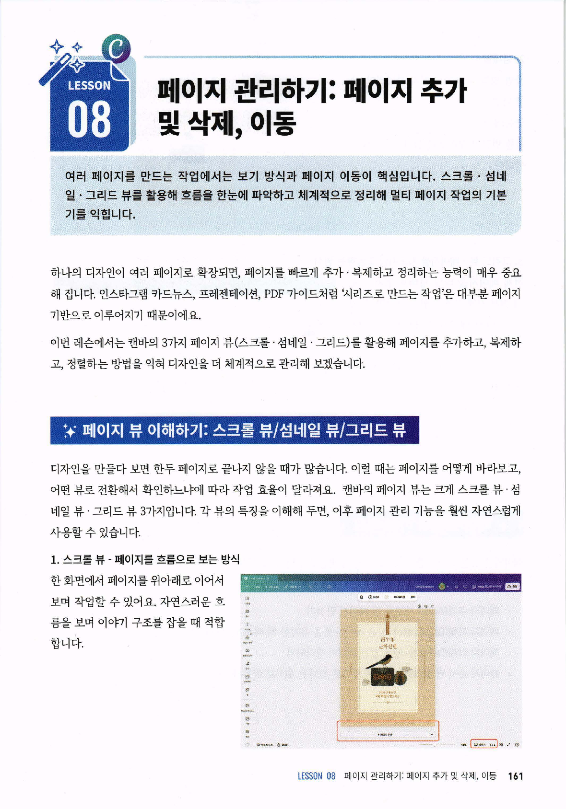

페이지 관리하기: 페이지 주가

###### 및삭재, 01등

•

·

하나의 디자인이 여러 페이지로 확장되면, 페이지를 빠르게 추가 · 복제하고 정리하는 능력이 매우 중요 해 집니다. 인스타그램 카드뉴스, 프레젠테이션, PDF 가이드처럼 ‘시리즈로 만드는 작업’은 대부분 페이지

기반으로 이루어지기 때문이에요.

###### 이번 레슨에서는 캔바의 3가지 페이지 뷰(스크롤 · 섬네일 · 그리드)를 활용해 페이지를 추가하고, 복제하

고, 정렬하는 방법을 익혀 디자인을 더 체계적으로 관리해 보겠습니다.

###### | |

디자인을 만들다 보면 한두 페이지로 끝나지 않을 때가 많습니다. 이럴 때는 페이지를 어떻게 바라보고,

어떤 뷰로 전환해서 확인하느냐에 따라 작업 효율이 달라져요. 캔바의 페이지 뷰는 크게 스크롤 뷰 · 섬 네일 뷰 · 그리드 뷰 3가지입니다. 각 뷰의 특징을 이해해 두면, 이후 페이지 관리 기능을 훨씬 자연스럽게

사용할 수 있습니댜

- 1. 스크롤 뷰 - 페이지를 흐름으로 보는 방식 한화면에서 페이지를위아래로 이어서 보며 작업할 수 있어요. 자연스러 운 흐 름을 보며 이야기 구조를 잡을 때 적합 합니다.

###### ? --— ·`. 느 u.""널 m|

e-

o o... `"" ..

###### i

a .. c

誌

T

빼스.

讐麟‘S

Gi

g

4

"eg

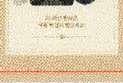

院

###### --

ei

솔

국.-

O

`

###### ~ 7."모 O .... 다 G도그" .· (i)

08 페이지 관리하기: 페이지 주가 및 삭제, 이동 161

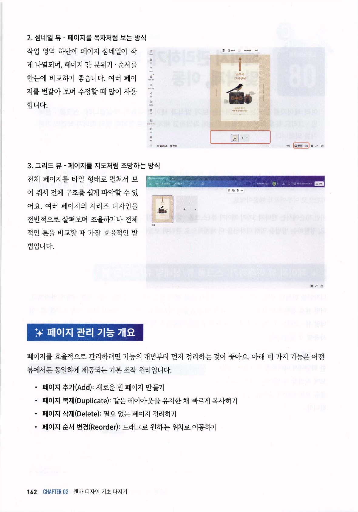

- 2. 섬네일 뷰 - 페이지를 목자처럼 보는 방식 작업 영역 하단에 페이지 섬네일이 작 게 나열되며, 페이지 간 분위기 · 순서를 한눈에 비교하기 좋습니다. 여러 페이 지를 번갈아 보며 수정할 때 많이 사용 합니댜

C-5 。-

e-aaT5·

오

0i4"el?eT;

－

• (l)...

·

년

“.lJ

『-．’

午

i

內전

+ ~

- 고) 蠶 .. 。

- 3. 그리드 뷰 - 페이지를 지도처럼 조망하는 방식 전체 페이지를 타일 형태로 펼쳐서 보 여 줘서 전체 구조를 쉽게 파악할 수 있 어요. 여러 페이지의 시리즈 디자인을 전반적으로 살펴보며 조율하거나 전체 적인 톤을 비교할 때 가장 효율적인 방 법입니다.

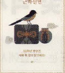

###### B

...v ., 0 _;r:'. . ~ ' |

tt ~ ...

릅

+

••• (i)

###### | il 개 I

페이지를 효율적으로 관리하려면 기능의 개념부터 먼저 정리하는 것이 좋아요솔 아래 네 가지 기능은 어떤 뷰에서든동일하계제공되는기본조작원리입니다.

- • 페이지 주가(Add): 새로운 빈 페이지 만들기
- • 페이지 복제(Duplicate)： 같은 레이아웃을 유지한 채 빠르게 복사하기
- • 페이지 삭제(Delete)： 필요 없는 페이지 정리하기
- • 페이지 순서 변경(Reorder)： 드래그로 원하는 위치로 이동하기

162 CHAPTER 02 캔바 디자인 기조 다지기

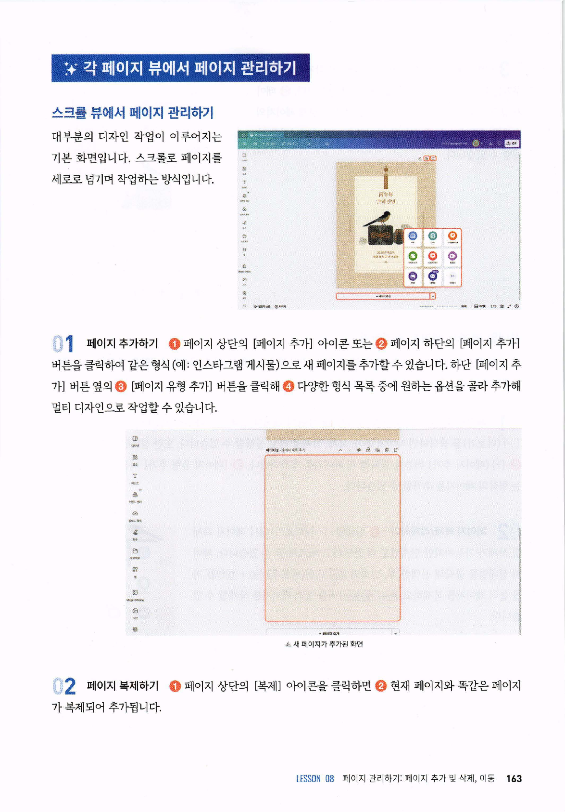

###### | |

###### 스크롤 뷰에서 페이지 관리하기

| ' O c e

대부분의 디자인 작업이 이루어지는

2aaT-·:i4a0g?o-ot.

기본 화면입니댜 스크롤로 페이지를

미

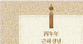

세로로넘기며 작업하는방식입니다.

.a-

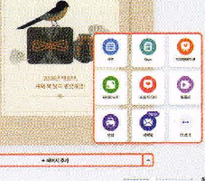

:

”~·5 5 。l

” 딜-" "' " ‘.o

1 페이지주가하기 0 페이지 상단의 [페이지 추가] 아이콘또는0 페이지 하단의 [페이지 추가]

버튼을클릭하여 같은형식 (예: 인스타그램 게시물)으로새 페이지를추가할수있습니다.하단 [페이지 추

가] 버튼 옆의O [페이지 유형 추가] 버튼을클릭해 O 다양한형식 목록중에 원하는옵션을골라추가해

멀티 디자인으로작업할수있습니다.

###### 288

...,지2·빼어지...후가 o a ® e c

~Tg:

요 Gi£g2

察업

언

"...""U

®

서린

• •.""'..,,

쇼 새 페이 지 가주가된 화면

- 2 페이지 복제하기 O폐이지 상단의 [복제] 아이콘을클릭하면O현재 페이지와똑같은폐이지

가복제되어 추가됩니다.

LESSON 08 페이지 관리하기: 페이지 주가 잊 삭제, 이동 163

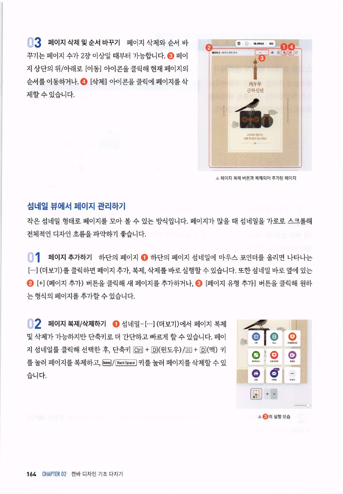

###### 3 페이지 삭제 및 순서 바꾸기 폐이지 삭제와순서 바

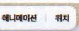

맵

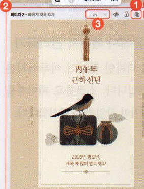

꾸기는 폐이지 수가 2장 이상일 때부터 가능합니다. O 폐이

d

i

지 상단의 위/아래로 [이동] 아이콘을클릭해 현재 페이지의

순서를 이동하거나. O [삭제] 아이콘을클릭에 페이지를삭

제할수있습니댜

1

+

.... 페이지 복제 버튼과 복제되어 주가된 페이지

###### 섬네일 관리하기

작은 섬네일 형태로 페이지를 모아 볼 수 있는 방식입니다. 페이지가 많을 때 섬네일을 가로로 스크롤해

전체적인 디자인 흐름을파악하기 좋습니다.

###### 1 페이지 주가하기 하단의 폐이지 O하단의 폐이지 섬네일에 마우스 포인터를올리면 나타나는

[…] （더보기)를클릭하면 페이지 추가, 복제, 삭제를바로실행할수 있습니다. 또한섬네일 바로 옆에 있는

O [+] (페이지 추가) 버튼을 클릭해 새 페이지를 추가하거나, O [페이지 유형 추가] 버튼을 클릭해 원하

는형식의 페이지를추가할수있습니다.

###### 2 페이지복제/삭제하기 O섬네일-[…］（더보기)에서 페이지 복제

궁0 으

및 삭제가가능하지만 단축키로 더 간단하고빠르게 할수 있습니다. 페이 지 섬네일를 클릭해 선택한 후, 단축키 回댑 + 園(윈도우)／運] + 園(맥) 키

O I~ °

를눌러 페이지를복제하고E크/ _ 心_니키를눌러 폐이지를삭제할수있

""" 仁 이볼寧曰 ""

###### O G

연嶋 ... 더"

습니댜

] + ^

... 의실행 모습

164 CHAPTER 02 캔바 디자인 기조 다지기

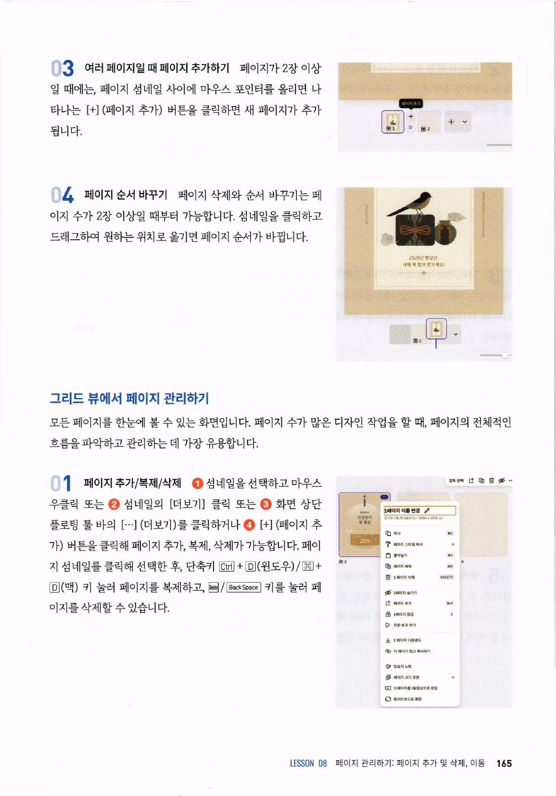

###### 3 여러페이지일때페이지주가하기 페이지가2장이상

###### -

일 때에는, 페이지 섬네일 사이에 마우스 포인터를 올리면 나

타나는 [+] （페이지 추가) 버튼을 클릭하면 새 페이지가 추가

###### +

>

###### m-

m-2

됩니댜

I

###### 4 페이지 순서 바꾸기 페이지 삭제와순서 바꾸기는폐

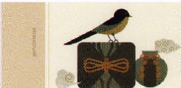

이지 수가 2장 이상일 때부터 가능합니다. 섬네일을 클릭하고

드래그하여 원하는위치로옮기면폐이지 순서가바뀝니다.

.

쉘

###### 曰2 :

###### 그리드 뷰에서 페이지 관리하기

모든 페이지를 한눈에 볼 수 있는 화면입니다. 페이지 수가 많은 디자인 작업을 할 때, 페이지의 전체적인 흐름을 파악하고 관리하는 데 가장 유용합니다.

’-[언스"그.心'I,.S1·mm·l3"# ＂

###### 1 페이지주가/복제/삭제 O섬네일을선택하고마우스

###### 모두선택 巳 © 回 多 .,

우클릭 또는 O 섬네일의 [더보기] 클릭 또는 O 화면 상단

플로팅 툴바의 […] （더보기)를클릭하거나 [+] （페이지 추

첫할인

Co .시 翼C

宁 ..OI지스타일틀시 ..

###### 。...w,, 翼V

가) 버튼을클릭해 페이지 추가,복제,삭제가가능합니다.페이 지 섬네일를클릭해 선택한후, 단축키 回뎀 +園(윈도우)／選]+ 園(맥) 키 눌러 페이지를 복제하고, ~/ |~죠-디 키를 눌러 폐

8 2

@ 寧서지"꽤

“°

@ l 印'지" OEU丁

多 며어지숄기기

巳 印|지후가 翼a

이지를삭제할수있습니다.

e l""'지질글

- D) 진른宣괴후가

_,I,_ 1 ...,지다은ll.!i

역》 어 ..어지 입크 .서혀기

컵 발표지노皇

tlil 빼01지크기조핍 ..

- E (1빼어지.｝를열상으量현리

。 11ot山표'-"•강

###### LESSON 08 페이지 관리하기: 페이지 주가 및 삭제, 이동 165

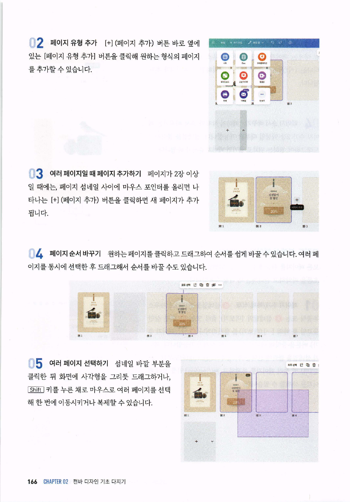

###### 2 페이지 유형 주가 [+]（페이지 추가) 버튼 바로 옆에

있는 [페이지 유형 추가] 버튼을클릭해 원하는형식의 페이지 를추가할수있습니다.

I - 1. ---- 1

O.. 0 |o

므A "“"" ·I' ...

O G1".

ti. 언嶋 .... "" 9 3

+

###### 3 여러 페이지일 때페이지주가하기 페이지가2장이상

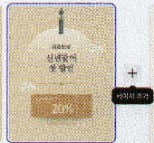

일 때에는, 페이지 섬네일 사이에 마우스 포인터를 올리면 나

구아신`

타나는 [+] （폐이지 추가) 버튼을 클릭하면 새 페이지가 추가 됩니다.

i!l l 1,12 OO 3

###### 4 페이지순서바꾸기 원하는폐이지를클릭하고드래그하여순서를쉽게바꿀수있습니댜여러페

이지를동시에 선택한후드래그해서 순서를바꿀수도있습니다.

모R선택 tt le ® sll ··•

i

스-

6 1 El 3 l!l 5 El 6 1,17

###### 5 여러 페이지 선택하기 섬네일 바깥 부분을

모두선택 巳 ® 四 ,

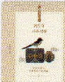

클릭한 뒤 화면에 사각형을 그리듯 드래그하거나,

麟키를누른채로마우스로여러 페이지를선택 해 한번에 이동시키거나복제할수있습니다.

El l 92 93 S4

+

166 CHAPTER 02 캔바 디자인 기조 다지기

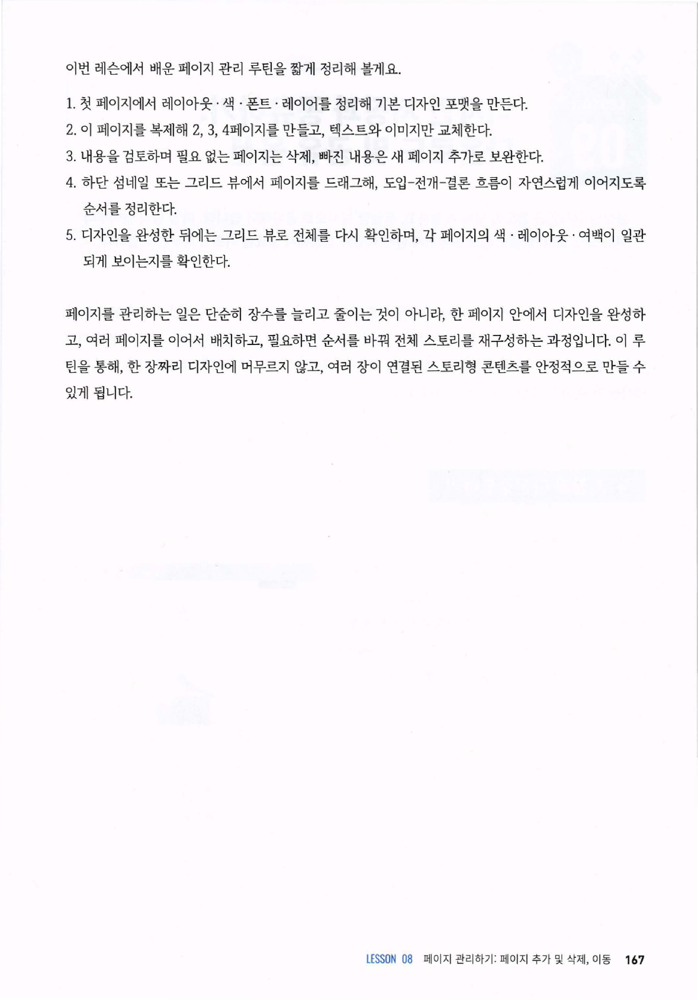

###### 이번 레슨에서 배운 페이지 관리 루틴을 짧게 정리해 볼게요.

- 1. 첫 페이지에서 레이아웃 · 색 · 폰트 · 레이어를 정리해 기본 디자인 포맷을 만든다.
- 2. 이 페이지를 복제해 2, 3, 4페이지를 만들고, 텍스트와 이미지만 교체한다.
- 3. 내용을 검토하며 필요 없는 페이지는 삭제, 빠진 내용은 새 폐이지 추가로 보완한다.
- 4. 하단 섬네일 또는 그리드 뷰에서 페이지를 드래그해, 도입—전개_결론 흐름이 자연스럽게 이어지도록 순서를정리한다.
- 5. 디자인을 완성한 뒤에는 그리드 뷰로 전체를 다시 확인하며, 각 페이지의 색 · 레이아웃 · 여백이 일관 되게 보이는지를 확인한다.

###### 페이지를 관리하는 일은 단순히 장수를 늘리고 줄이는 것이 아니라, 한 페이지 안에서 디자인을 완성하

고, 여러 페이지를 이어서 배치하고, 필요하면 순서를 바꿔 전체 스토리를 재구성하는 과정입니다. 이 루

틴을 통해, 한 장짜리 디자인에 머무르지 않고, 여러 장이 연결된 스토리형 콘텐츠를 안정적으로 만들 수 있게됩니다.

페이지 관리하기: 페이지 주가 잊 삭제, 이동 167

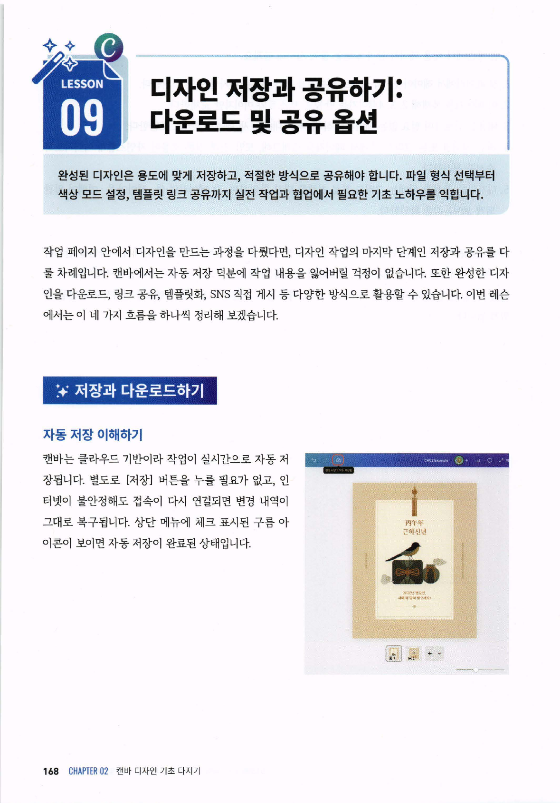

디자인 저장과 공유하기:

###### 다운로드및공유옵션

###### 완성된 디자인은 색상 모드 설정, 작업과

작업 페이지 안에서 디자인을 만드는 과정을 다뤘다면, 디자인 작업의 마지막 단계인 저장과 공유를 다

룰 차례입니다. 캔바에서는 자동 저장 덕분에 작업 내용을 잃어버릴 걱정이 없습니다. 또한 완성한 디자 인을 다운로드, 링크 공유, 템플릿화, SNS 직접 게시 등 다양한 방식으로 활용할 수 있습니댜 이번 레슨 에서는 이 네 가지 흐름을 하나씩 정리해 보겠습니댜

|

자동저장이해하기

캔바는 클라우드 기반이라 작업이 실시간으로 자동 저 장됩니댜 별도로 [저장] 버튼을 누를 필요가 없고, 인

터넷이 불안정해도 접속이 다시 연결되면 변경 내역이

丙근

年

午

A,.년

그대로 복구됩니다. 상단 메뉴에 체크 표시된 구름 아

t

40

이콘이 보이면 자동 저장이 완료된 상태입니다.

###### ..

###### : s; + v

168 CHAPTER 02 캔바 디자인 기조 다지기

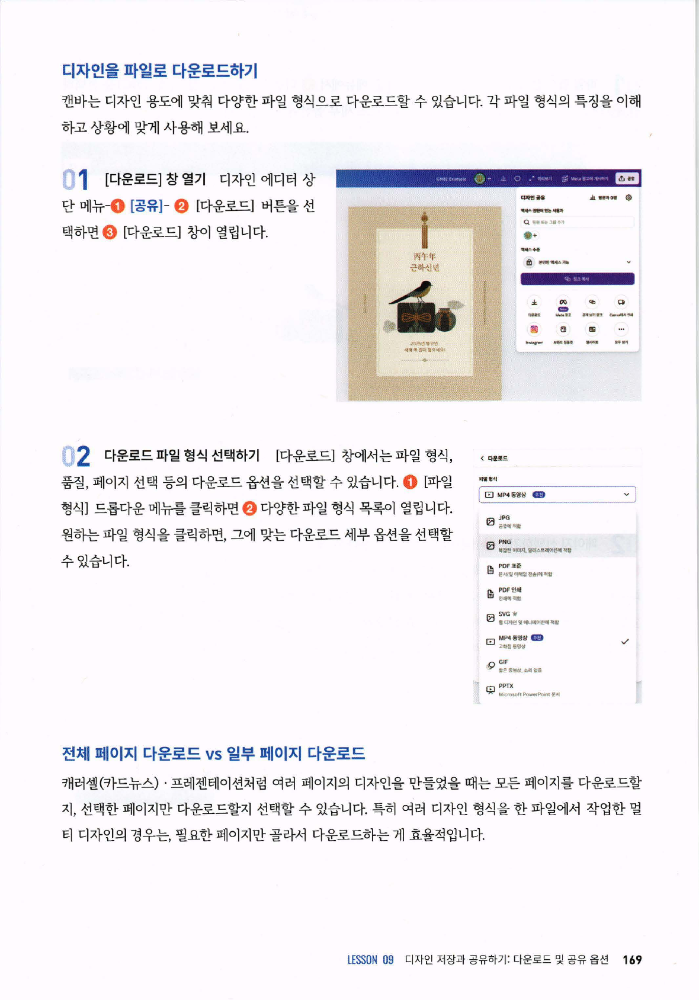

###### 디자인을 파일로 다운로드하기

캔바는 디자인 용도에 맞춰 다양한 파일 형식으로 다운로드할 수 있습니다. 각 파일 형식의 특징을 이해

하고 상황에 맞게 사용해 보세요.

| ,…,••~· .. ..•’ 여,

###### 1 [다운로드]장열기 디자인 에디터 상

단 메뉴-0 [공유]- O [다운로드] 버튼을 선

디를 쇼."" ®

###### •+

Q 1t1,1: :1

택하면 O [다운로드] 창이 열립니다.

###### `...

###### O m"`"`

근·하신년

.... ......e 고 홑꽤mm c"＇ 현뻬

土 oo 。 。

...,,

Gi !!ii

###### ..

"""". ．鬱;. ..".

뺄?년

2 다운로드파일형식선택하기 [다운로드] 창에서는파일형식,

《 皇

품질, 폐이지 선택 등의 다운로드 옵션을 선택할 수 있습니다. O [파일

###### 圈MP4등영싱 "' 냐

형식] 드롭다운메뉴를클릭하면 다양한파일형식 목록이 열립니다.

@ JPG

원하는 파일 형식을 클릭하면, 그에 맞는 다운로드 세부 옵션을 선택할

@

당 ..이선예 ..雷

수있습니댜

B PDFll준

문'll'll 아빼열건....,u

PDF

B

연떠젝ti

@ SVG*

II 디지연몇예-•II

E] MP4 등영싱

J

고

© GIF

. 소러없휼

店 PPTXM,ac,oft.._Poont

룬서

전체 페이지 다운로드 vs 일부 페이지 다운로드

캐러셀(카드뉴스) · 프레젠테이션처럼 여러 페이지의 디자인을 만들었을 때는 모든 페이지를 다운로드할 지, 선택한 페이지만 다운로드할지 선택할 수 있습니댜 특히 여러 디자인 형식을 한 파일에서 작업한 멀 티 디자인의 경우는, 필요한 페이지만 골라서 다운로드하는 게 효율적입니다.

LESSON 09 디자인 저장과 공유하기: 다운로드 잊 공유 옵션 169

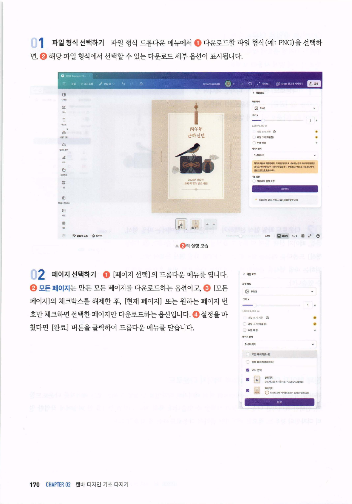

- 1 파일형식선택하7 파일 형식 드롭다운메뉴에서 O다운로드할파일 형식(예:PNG)을선택하

면, 해당파일형식에서 선택할수있는다운로드세부옵션이 표시됩니다.

順콘,;:를+ (HO2[Mm머e ••eu1·' Mct``s.,Ai`'"’

CJl g

< 다흩ll.5.

認

a

•

T

....

..®*,..

I •

'F年

。

··‘ ..쓰-

"

E

..”

8?

•

Ei

M嶋k "．"

>026년뺄오년 'Ill!

•

.....

(B PNG

크1 翼

""0·' ",.

갑릴` " °

”크111>11릴)

·멸빼를

·어서성

1-2빼아지

"""'..어빼."이 ·의......내.............

g .. '••잃지.-··‘IM"'...다”."

,,..q.국1글,．세..

다....

프리다혈 'l wi100 가툴

@

g.”- O2 +

0 ..,. liil...凶 1/2 88 ,•

®

~ O의 실행 모습

- 2 페이지선택하기 O [페이지 선택]의드롭다운메뉴를엽니댜

< 다을로드

###### O 모든 페이지는 만든 모든 폐이지를 다운로드하는 옵션이고, O [모든

파일혈‘

izl PNG

페이지]의 체크박스를 해제한 후, [현재 페이지] 또는 원하는 폐이지 번

크기 x

###### *

I.0")·I.3"’

호만체크하면선택한페이지만다운로드하는옵션입니다. 설정을마

-＊＊

여'ii 크. ，，한 O

파얼크기(지흘릴I

쳤다면 [완료] 버튼을클릭하여 드롭다운메뉴를닫습니다.

날

###### •Ill 빼겅

어지선..

1-2빼01"1

모

현재 빼01x111..0 지1

O 모두 선택

00

- 1 연스힉 .게서 l·5 )• IO"1JXD眞
- 2빼어지 언^다그.心,.S) • IOl0·따

‘

###### 170 CHAPTER 02 캔바 디자인 기조 다지기

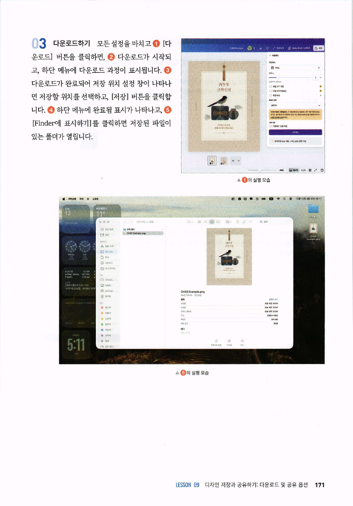

3 다운로드하기 모든설정을마치고O [다

[ —---— ． 나 • m|

운로드] 버튼을 클릭하면, O 다운로드가 시작되

<아."

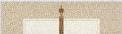

0 mG

고, 하단메뉴에 다운로드과정이 표시됩니다. O

니..•••.,,기.••,..,

다운로드가 완료되어 저장 위치 설정 창이 나타나 면저장할위치를선택하고, [저장] 버튼을클릭합

-o......

니댜 O 하단 메뉴에 완료됨 표시가 나타나고, 0

..기시

.......．"『U 촐..

R....,

幻*오*n·IL•_1 11요.q••요.,...

[Finder에 표시하기] 를 클릭하면 저 장된 파일이

###### ’q.”····

蒲••

,.,.., 년

시嶋 팔

궤F

있는폴더가열립니다.

.""”사...........가·

+ V

... -m l/. 認 .» o

... 의실행 모습

###### C. • ® 。 - ... 0. 龜

• 론집 촬

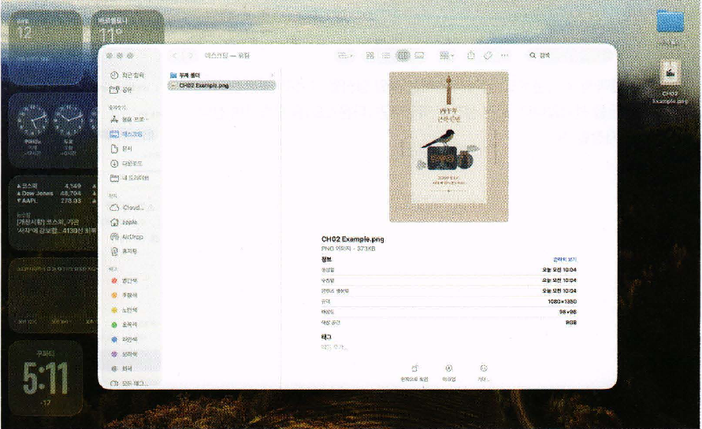

###### 노` Iii’ A < .. Q 겁섹

&

一 로g O 配할롤 ■ Ml<i

E읽 ."빌 =

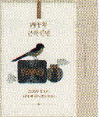

I,..”

A "m

...

('.l .서 O 먀표

###### ”"gml·

ex軒d•png

PNG 어미지 · 37퍄

###### ...•••

월보

....기

••요•·던’...

．딘,... ••..,0:..

- • • 간색

~활색

- • 뇨e덱
- • &...

. ...색

- • • 라닉

###### ...표

###### H·.....`'"

른언^ ...

세입를간

配x,

테그

。 e

###### •0의실행 모습

09 디자인 저장과 공유하기: 다운로드 및 공유 옵션 171

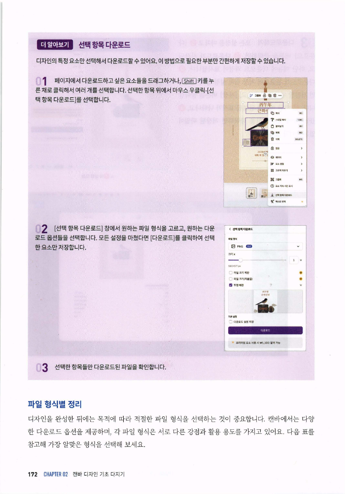

###### 선택항목다운로드

수 필요한 .

1 페이지에서다운로드하고싶은요소들을드래그하거나, 교디키를누

른 재로 선택합니다. 마우스 [선

택

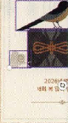

- 2 [선택항목다운로드] 장에서원하는파일형식율고르고,원하는다운

선택

‘

·;I' 그•• a© 맵 ...

1 1

1 t ·시

T 포...서 ｀翼C

°""~,,

屯 " "

@ " "m

© m

때빼맘2026):명 €' .,.I01

l.. 요소률1

꼬＂빼무기

S2

國 그.. .G O 포지..屯!"

*신..11롤며또

핫 C틀린`’

( 선빽할윽 C/운로드

빼일 혈4

j8 PNG C9

크기 x

1 .,

590•5np,

니 파일크가재한

乙 피일크기1자를질) O •명배경 *'

內T

근빼신년

슬

기른실링

0 머뚜설정지정

프리이얼 요소시용 시 Wl,100 절악 가등

- 3 선택한 드된파일을

###### 파일형식별정리

디자인을 완성한 뒤에는 목적에 따라 적절한 파일 형식을 선택하는 것이 중요합니다. 캔바에서는 다양 한 다운로드 옵션을 제공하며 각 파일 형식은 서로 다른 강점과 활용 용도를 가지고 있어요. 다음 표를 참고해 가장 알맞은 형식을 선택해 보세요.

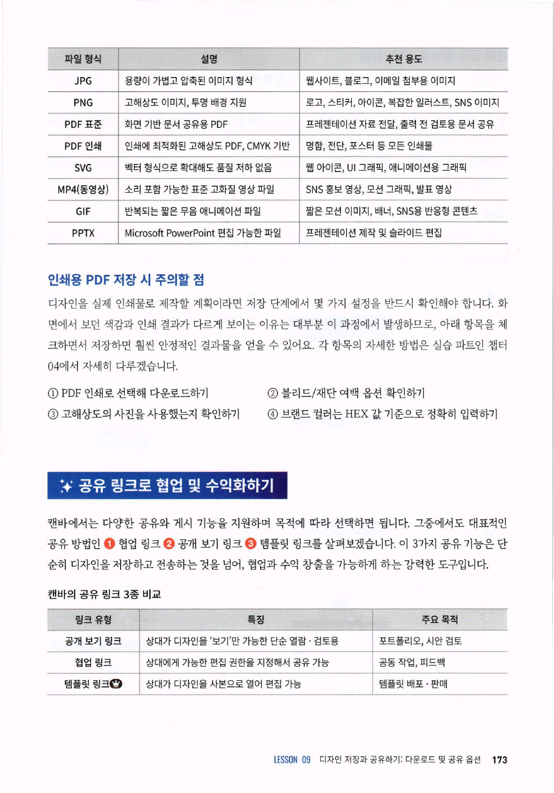

| | | |
|---|---|---|
|JPG|용량이 가볍고 압축된 이미지 형식|웹사이트, 블로그, 이메일 점부용 이미지|
|PNG|고해상도 이미지, 투명 배경 지원|로고, 스티커, 아이콘, 복잡한 일러스트, SNS 이미지|
|PDF 표준|화면 기반 문서 공유용 PDF|프레젠테이션 자료 전달, 출력 전 검토용 문서 공유|
|PDF 인쇄|인쇄에 죄적화된 고해상도 PDF, CMYK 기반|명함, 전단, 포스터 등 모든 인쇄물|
|SVG|벡터형식으로확대해도품질저하없음|웹 아이콘, UI 그래픽, 애니메이션용 그래픽|
|MP4(동영상)|소리 포함 가능한 표준 고화질 영상 파일|SNS 홍보 영상, 모션 그래픽, 발표 영상|
|GIF|반복되는 짧은 무음 애니메이션 파일|짧은 모션 이미지, 배너, SNS용 반응형 콘텐츠|
|PPTX|Microsoft PowerPoint 편집 가능한 파일|프레젠테이션 제작 및 슬라이드 편집|

###### I

###### PDF 저장 시 주의할

디자인을 실제 인쇄물로 제작할 계획이라면 저장 단계에서 몇 가지 설정을 반드시 확인해야 합니다. 화 면에서 보던 색감과 인쇄 결과가 다르게 보이는 이유는 대부분 이 과정에서 발생하므로) 아래 항목을 체 크하면서 저장하면 훨씬 안정적인 결과물을 얻을 수 있어요. 각 항목의 자세한 방법은 실습 파트인 챕터

04에서 자세히 다루겠습니다. ® PDF 인쇄로 선택해 다운로드하기 @ 블리드/재단 여백 옵션 확인하기 © 고해상도의 사진을 사용했는지 확인하기 ® 브랜드컬러는 HEX 값기준으로정확히 입력하기

###### | 협업 및 |

캔바에서는 다양한 공유와 게시 기능을 지원하며 목적에 따라 선택하면 됩니댜 그중에서도 대표적인

###### 공유 방법인 O 협업 링크O 공개 보기 링크O 템플릿 링크를 살펴보겠습니다. 이 3가지 공유 기능은 단

###### 순히 디자인을 저장하고 전송하는 것을 넘어, 협업과 수익 창출을 가능하게 하는 강력한 도구입니다.

캔바의 공유 링크 3종 비교

|I| | |
|---|---|---|
|공개보기 링크|상대가 디자인을 ‘보기’만 가능한 단순 열람 · 검토용|포트폴리오,시안검토|
|협업링크|상대에게 가능한 편집 권한욜 지정해서 공유 가능|공동작업, 피드백|
|템플릿링크0|상대가 디자인을 사본으로 열어 편집 가능|템플릿배포·판매|

###### I

LESSON 디자인 저장과 공유하기: 다운로드 및 공유 옵션 173

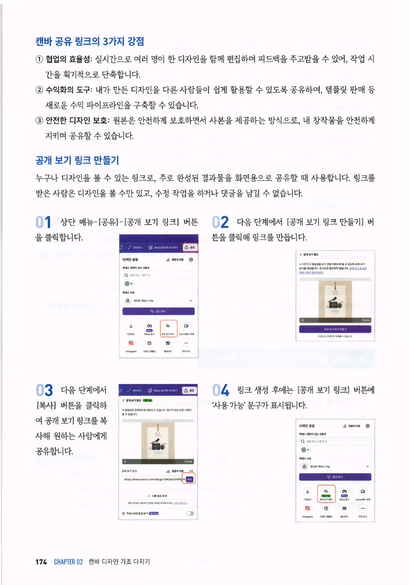

###### 캔바 3가지

###### ® 협업의 효율성: 실시간으로 여러 명이 한 디자인을 함께 편집하며 피드백을 주고받을 수 있어, 작업 시

간을 획기적으로 단축합니다.

® 수익화의 도구: 내가 만든 디자인을 다른 사람들이 쉽게 활용할 수 있도록 공유하여, 템플릿 판매 등

새로운 수익 파이프라인을 구축할 수 있습니다.

® 안전한 디자인 보호: 원본은 안전하게 보호하면서 사본을 제공하는 방식으로, 내 창작물을 안전하게

지키며 공유할 수 있습니다.

###### 공개보기 링크만들기

누구나 디자인을 볼 수 있는 링크로, 주로 완성된 결과물을 화면용으로 공유할 때 사용합니다. 링크를

###### 받은 사람은 디자인을 볼 수만 있고, 수정 작업을 하거나 댓글을 남길 수 없습니다.

###### 2 다음단계에서 [공개 보기 링크만들기] 버

###### 1 상단 메뉴-［공유]-［공개 보기 링크] 버튼

•디자언골유 .JJ.”벼때®

을클릭합니댜

튼을클릭해 링크를 만듭니다.

###### f ("""

###### 뉴 • 른미이 IVI 런을 버전으르 . 수 었드·톨게" ·크1 ...,할나다 鳳그 습니리 규제 ' t 내

` 건현어 할는땐과

###### .+

Q

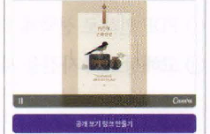

###### ` "

O 曰..,`C처,

###### oo:尸

土

Uc"·그 C"W학·서론뻬

""

어••는.... •• • 었I니

h 르톤••밋 .ta ...

@ 태 l!lil

二」

###### 4 링크 생성 후에는 [공개 보기 링크] 버튼에

###### 3 다음단계에서

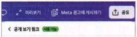

‘사용가능' 문구가 표시됩니댜

###### [복사] 버튼을 클릭하

. 살@ 리오量 •오고 였·냐다 크가였는 모른 사.Ol

었·니Q.

i

###### 여공개 보기 링크를복

I

.JJ. .P'O ®

###### 술

_O튼""｀C껴

디지글

사해 원하는 사람에게

`세스 건한어 었는 사틀자

###### •+

Q 일••’ 1· 亭가

공유합니다.

`..를

글게.,,털크 .ill. . ...01I •••

###### 一·_＿＿硏V

:.. 납념二..

* 다틀릴크"

...... JI미기0"야·--

圈

Gi

·

###### i

°`다”빨기‘m »'

•

J

_ ．릎s .”

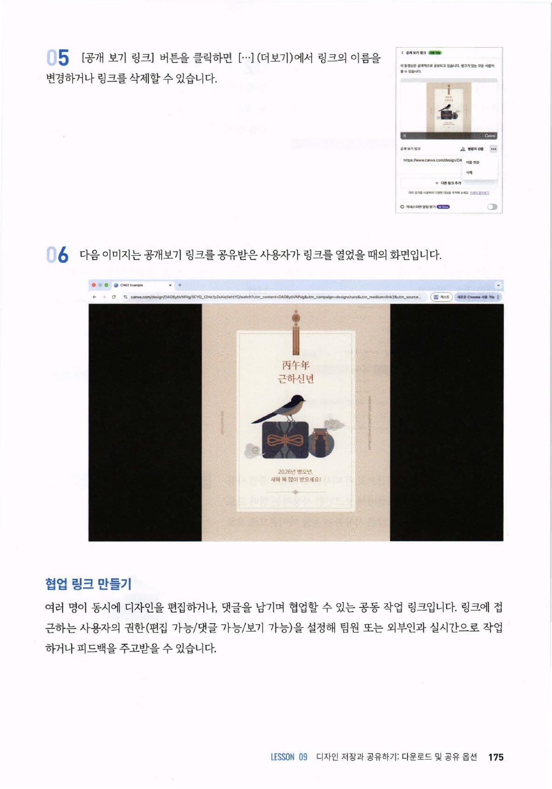

###### 5 [공개 보기 링크] 버튼을클릭하면 […]（더보기)에서 링크의 이름을

(흘,.,,.크

터 .”른 틀재를오.를•현고안.냐디 를크기 였는 오른 사"

·수"

변경하거나링크를삭제할수있습니다.

c

·제嵐기.크 山 •틀자0뺄 …

mp`^"m.一처 어1 면.

식.

`q.크"

사1...q"q • 事"`｀요 나-f'ImI기

0 .....，"'"•기0= D

###### 06 다음이미지는공개보기 링크를공유받은사용자가링크를열었을때의화면입니댜

,_12H<1p........,.,-O/wotd>Mm..<On1ent,0"-'"'-'•

om- X +

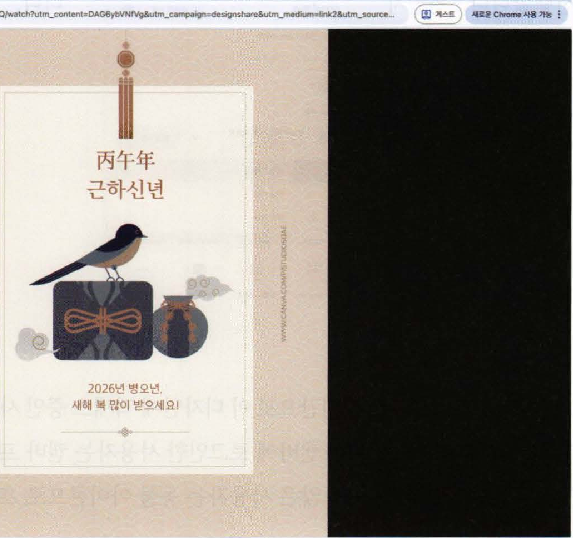

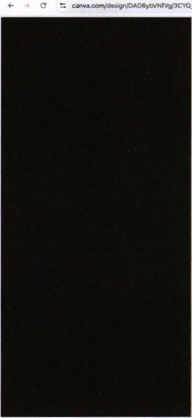

새해

술·e

협업링크만들기

###### 여러 명이 동시에 디자인을 편집하거나, 댓글을 남기며 협업할 수 있는 공동 작업 링크입니다. 링크에 접

###### 근하는 사용자의 권한(편집 가능/댓글 가능/보기 가능)을 설정해 팀원 또는 외부인과 실시간으로 작업 하거나 피드백을 주고받을 수 있습니댜

LESSON 09 디자인 저장과 공유하기: 다운로드 잊 공유 옵션 175

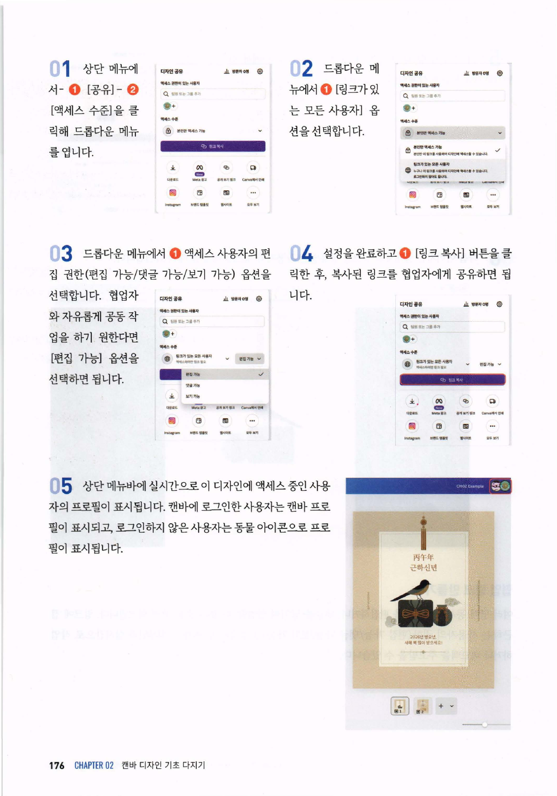

###### 2

1 상단 메뉴에

드롭다운메 뉴에서 [링크가있 는모든사용자]

®

®

.JJ.•mo

止 ·m여

디자인골유

서- O [공유]- O

H• ,••기

Q 11, .는 1•

옵 Q

###### • +

+

[액세스 수준]을 클 릭해 드롭다운 메뉴 를엽니댜

빼스 수를

머

© 른언연어스演

션을선택합니댜

O 븐인단`"＇｀ © ...

스가

`/

.”탄어촬,....""'이따업빼｀峰스• • ．＊후•.

###### ,

8 0 i

릴크가

@ ......""땔...

###### 土

。

###### C

야...

."""....,

.개 m·크

다4-』 ·,'"'.

g

@

.....

.......

연

區

區

..um

h峰.... .틀•••

a••기

. 皇••기

###### 3

4 설정을완료하고 [링크복사] 버튼을클

드롭다운 메뉴에서 O 액세스 사용자의 편

릭한 후, 복사된 링크를 협업자에게 공유하면 됩

집 권한(편집 가능/댓글 가능/보기 가능) 옵션을

® 니댜

선택합니댜 협업자

디

.ilL 떨틀어'

.ill. 탈．지예 ®

嶋셰스권한어었1! 사자

와자유롭게공동작 업을하기 원한다면

###### •+

Q I/뺑m는기."'

Q 릴ilm. ...,,

###### +

스 수를

- flll'llt

@ 털功있

[편집 가능] 옵션을

가 V

@

`嶋스 ¥

른륄가. V

V'

선택하면됩니댜

엿글가를

少

土.

oo 0 i

도기기.

。

••m·3 .

""

M«••고

.게m·· C·`..거a•

아틀"

태

l!lil

....,,

@

•."" ,...,,

··k

“ "'드···

......”

""嶋'"＇,

###### 5

###### | L··야: l

상단 메뉴바에 실시간으로 이 디자인에 액세스 중인 사용 자의프로필이표시됩니다.캔바에로그인한사용자는캔바프로 필이 표시되고, 로그인하지 않은사용자는동물아이콘으로프로

필이표시됩니다.

..'I!!오세요’

###### l!lz +

176 CHAPTER 02 캔바디자인 기조 다지기

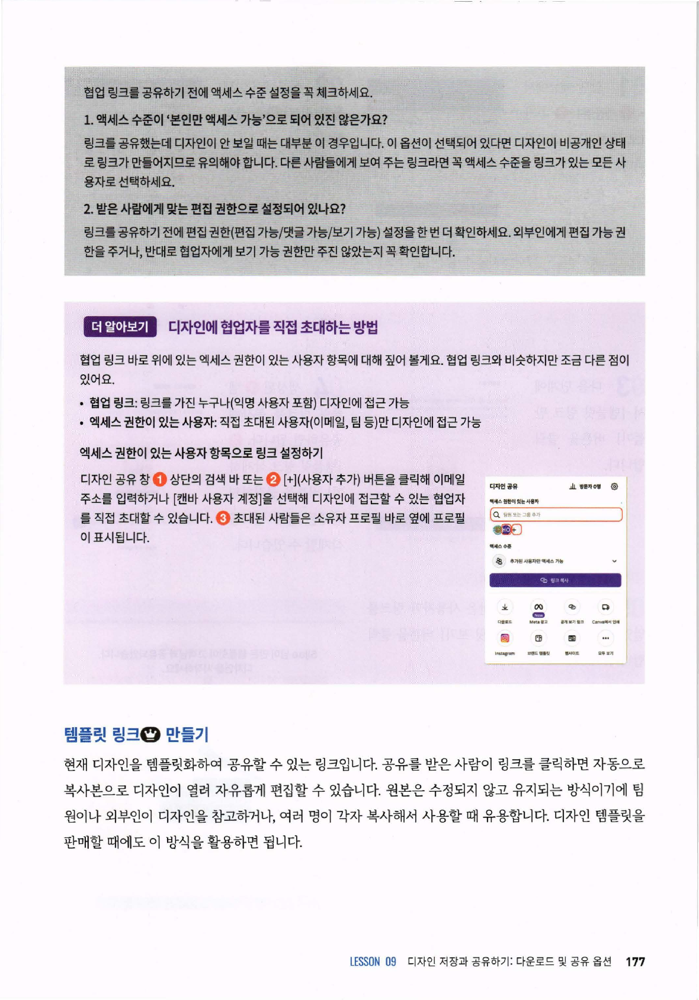

협업 링크롤 공유하기 전에 액세스 수준 꼭

- 1. 엑세스 수준이 되어 링크 디자인이 안 보일 때는 이 이 상태 로 링크가 다른 주는 사
- 2. 사탑에게

롤 가능 권

주거나, 보기 꼭

- 디자인에협업자를 방법

바로 있는 볼게요.

.

- • 협업 링크를 가진 누구나(익 디자인에 가능
- • 엑세스 있는 : 팀 가능

엑세스 권한이

디자인 공유장 바또는 [＋］（사용자주가) 이메일

디자인골뮤 .JJ.”다때 ®

_屯事油땔沼'어스껴

주소를 입력하거나 [캔바 사용자 계정]을 디자인에 수 협업자

“시권단어있는땐지

를 직접 수 있습니다.0 조대된 사람들은 소유자프로필 바로

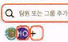

.

`수를

土 OO , 0

c

O를" ""鳳.. ”.,,．크 O l ••기...

땐 !Iii

k .. . "." ....... 묘..기

템플릿링크O 만들기

현재 디자인을 템플릿화하여 공유할 수 있는 링크입니다. 공유를 받은 사람이 링크를 클릭하면 자동으로

복사본으로 디자인이 열려 자유롭게 편집할 수 있습니다. 원본은 수정되지 않고 유지되는 방식이기에 팀

원이나 외부인이 디자인을 참고하거나, 여러 명이 각자 복사해서 사용할 때 유용합니다. 디자인 템플릿을

판매할 때에도 이 방식을 활용하면 됩니댜

LESSON 09 디자인 저장과 공유하기: 다운로드 및 공유 옵션 177

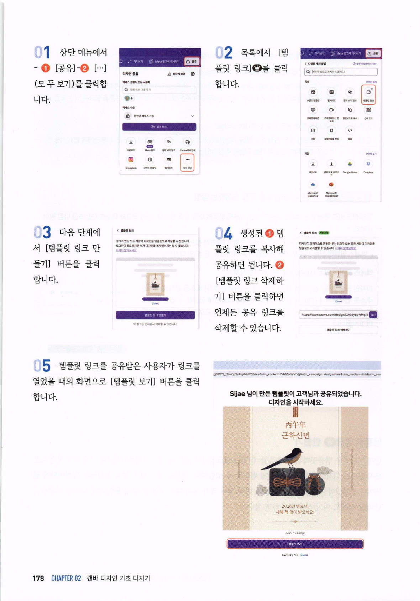

•디자연공유

01 상단메뉴에서

###### 2 목록에서 [템

###### 山 " l

( 0"油m 0 도..,...십,,.,

- O [공유] €> […]

플릿 링크]CE를 클릭

l 阮""A..시...요’

## :... :: ...:..:

###### .di..E'O'I ®

_©탸"~C가.

궁흙 ....,.,,

(모두보기)를클릭합 니댜

합니댜

Q 틸 寧

###### • +

`"

l;;J D lb

••U,'"'L, .릴.도••서 야..

헥

e g «I>

.. g

土 oo 。 。

cm

。 ”터』.고 mmm C`시던

.~"@ 태 .: Cd

자랄 건 m

土

-··엿

야.......q.. 0 ..... C 나...

s

###### •

U七 U노.』"

G따k ,U-.,리

###### 3 다음단계에

###### 4 생성된O템

<

(뺄 II크

륄크가였는오른사활어디자인틀텔•혓오量사율촬수었e니다.

디어 골유틸대국, 있는S!I!;

릴요.. 누기 디자인••시.tnt 혈 수

서 [템플릿 링크 만 들기] 버튼을 합니댜

플릿 링크를 복사해

.. 었출'-lC!，자세터휴어렇세9

클릭

###### 공유하면됩니댜

_

[템플릿 링크삭제하 기] 버튼을클릭하면

술.

-

c

언제든 공유 링크를

###### ht呼~w.～一DAG6沖VNWEO

어 언鳴른지 식...... ，，e니디

삭제할수있습니댜

뺄.'I!

5 템플릿 링크를 공유받은 사용자가 링크를

열었을 때의 화면으로 [템플릿 보기] 버튼을 클릭

Sijae 님이 만든 템플릿이 고객님과 공유되었습니다. 디자인을시작하세요.

합니댜

###### 丙午年

[—1080•1350p, l

令

q사연라싱도구:G파넋

###### 178 CHAPTER 02 캔바 디자인 기조 다지가

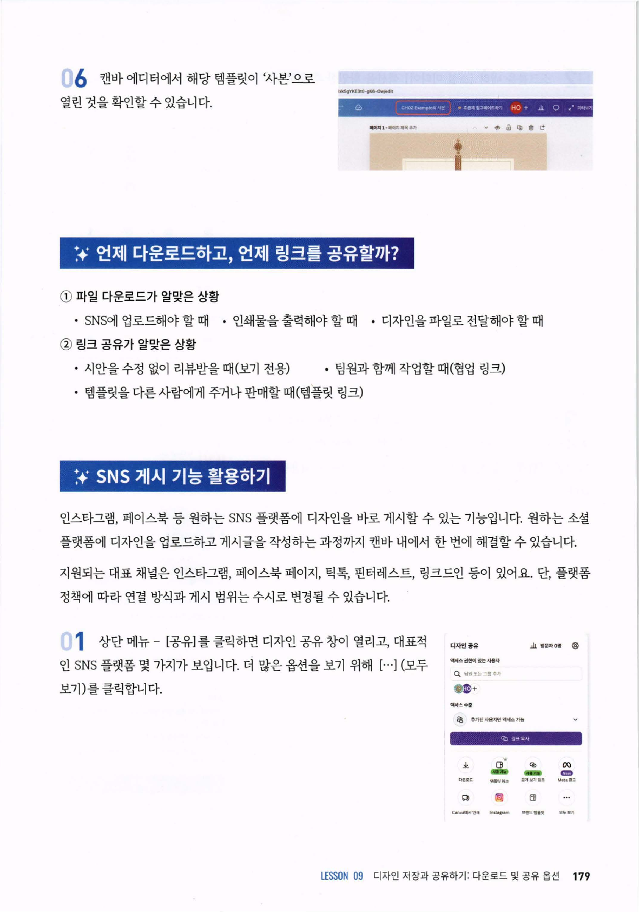

###### 6 캔바에디터에서 해당템플릿이 ‘사본’으로

열린것을확인할수있습니다. ~~ . 급뺄업＇心야?: 쓰 ,,"''I

지J• •. v o a ® e e

###### |

® 파일 다운로드가 알맞은 상황

###### • SNS에 업로드해야 할 때 • 인쇄물을 출력해야 할 때 • 디자인을 파일로 전달해야 할 때

###### ® 링크 공유가 알맞은 상황

- • 시안을수정 없이 리뷰받을때(보기 전용) • 팀원과 함께 작업할 때(협업 링크)
- • 템플릿을다른사람에게주거나판매할때(템플릿링크)

###### | 냐NS |

인스타그램, 페이스북 등 원하는 SNS 플랫폼에 디자인을 바로 게시할 수 있는 기능입니다. 원하는 소셜

플랫폼에 디자인을 업로드하고 게시글을 작성하는 과정까지 캔바 내에서 한 번에 해결할 수 있습니다.

지원되는 대표 채널은 인스타그램, 페이스북 페이지, 틱톡, 핀터레스트, 링크드인 등이 있어요. 단, 플랫폼 정책에 따라 연결 방식과 게시 범위는 수시로 변경될 수 있습니다.

###### 1 상단메뉴- ［공유]를클릭하면 디자인 공유창이 열리고, 대표적

디자인공유 .ill. I/PIO뺄 ®

_/8'1-.>I된땔지던핵세스까’

인 SNS 플랫폼 몇 가지가 보입니다. 더 많은 옵션을 보기 위해 […] （모두

빽셰스 권한어있는 뗄지

Q 입원또는그룹"'

`0 +

보기) 를 클릭합니다.

핵세스 수준

土. 머(]W -역 cog)

다뜨 힛밀크 골게보기털크 MO(••고

。 @ 연

c"UR" '..”

오‘”

브딘••첫

디자인 저장과 공유하기: 다운로드 및 공유 옵션 179

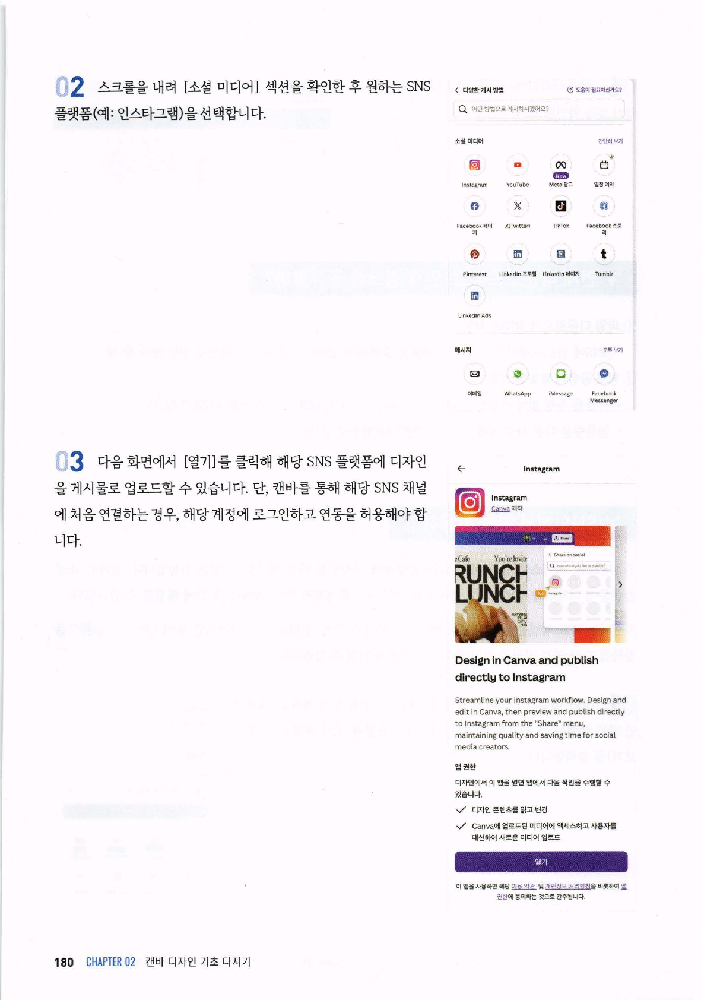

###### 2 ~녁Ht내려 [소셜 미디어] 섹션을확인한후원하는SNS

< ® 도율이

###### Q 어떤방법으로게시하사겼어요?

플랫폼(예: 인스타그램)을선택합니다.

소실 미디어 간단히보기

a oo 은*

GO

lnstag『am YouTube Meta 광고 일정예약

0 x 떠 @

Facebook 테이 XfTwitter) Tiklok Facebook스트 지 리

###### 1111 oo t

Pinterost Unkedln프로필 Unkedln빼어지 Tumbtr

###### E

###### UnkedlnAds

메시지 모두보기

四 。 。

01대일 WhatsApp ;Message Facebook Messenger

###### 3 다음화면에서 [열기]를클릭해 해당SNS 플랫폼에 디자인

€ lnstagram

을 게시물로 업로드할 수 있습니다. 단, 캔바를 통해 해당 SNS 채널

lnstagram

###### 에처음연결하는경우, 해당계정에로그인하고연동을허용해야합

” C』」,s"""rI.,

니댜

모

Q

’

Design In Canva and publish directly to lnstagram

Streamline your lnstagram workflow. Design and edit in Canva, then preview and publish directly to lnstagram from the "Share" menu, maintaining quality and saving time for social media creators

엡권한

디자인에서 이 엡욜 열면 앱에서 다음 작업을 수행할 수

있습니다

`/ 디자인 콘텐츠를 고 변경

-이업을사용하면혜당이욥악관및개인점보치리방침을비롯하여였

✓ Canva에 업로드된 미디어에 액세스하고 사용자 대신하여 새로운 미디어 업로드

겁브에 동의하는

###### 180 CHAPTER 02 캔바 디자인 기조 다지기

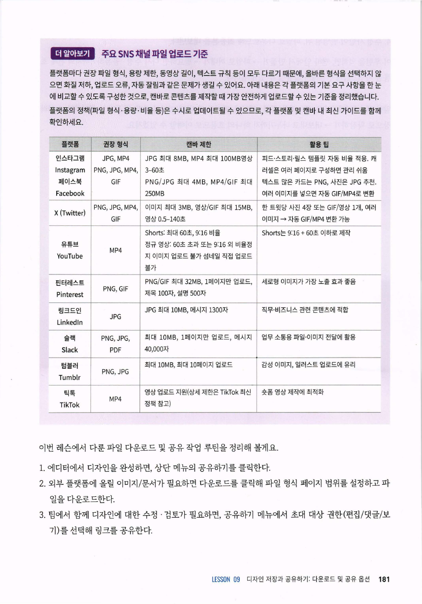

###### 주요

플랫폼마다 형식, 제한, 길이, 규칙 등이 모두 다르기 때문에, 형식을 선택하지 않 으면 화질 저하, 업로드 오류, 자동 잘림과 문제가 수 있어요. 아래 각 기본 요구 한 눈 에 수 것으로, 때 가장 수 있는 정리했습니다.

플랫폼의 형식 ·용량· 바율 수시로 업데이트될 수 있으므로, 각 잊 캔바 내 죄신 가이드를 함께

| | | | |
|---|---|---|---|
|인스타그램  lnstagram  페이스북  Facebook|JPG, MP4 PNG, JPG, MP4, GIF|JPG 조1 대 8MB, MP4 죄대 100MB영상  3-60조  PNG/JPG 조1 대 4MB, MP4/ GIF 조1 대 250MB|피드·스토라릴스 템플릿 자동 비율 적용. 캐 러셀은 여러 페이지로 구성하면 관리 쉬움 텍스트 많은 카드는 PNG, 사진은 JPG 주전.  여러 이마지를 넣으면 자동 GIF/MP4로 변환|
|X (Twitter)|PNG, JPG, MP4, GIF|이미지 죄대 3MB, 영상/GIF 죄대 15MB,  영상 0.5-140조|한 트윗당 사진 4장 또는 GIF/영상 1개, 여러 이미지 ➔ 자동 GIF/MP4 변환 가능|
|유튜브  YouTube|MP4|Shorts: 죄대 60조, 9:16 비율  정규 영상: 60조 조과 또는 9:16 외 비율정 지 이미지 업로드볼가섬네일 직접 업로드 불가|Shorts는 9:15 +60조 이하로 제작|
|핀터레스트  Pinterest|PNG, GIF|PNG/GIF 최대 32MB, 1페이지만 업로드,  제목 100자, 설명 500자|세로형 이미지가가장노줄효과좋음|
|링크드인  LinkedIn|JPG|JPG 최대 10MB, 메시지 1300자|직무·비즈니스 관련 콘텐츠에 적합|
|슬랙  Slack|PNG, JPG, PDF|최대 10MB, 1페이지만 업로드, 메시지 40,000자|업무 소통용 파일·이미지 전달에 활용|
|텀블러  Tumblr|PNG, JPG|죄대 10MB, 초1대 10페이지 업로드|감성 이미지, 일러스트 업로드에 유리|
|틱톡  TikTok|MP4|영상 업로드 지원(상세 제한은 TikTok 죄신  정책잠고)|숏폼영상제작에죄적화|

이번 레슨에서 다룬 파일 다운로드 및 공유 작업 루틴을 정리해 볼게요.

- 1. 에디터에서 디자인을 완성하면, 상단 메뉴의 공유하기를 클릭한댜
- 2. 외부 플랫폼에 올릴 이미지/문서가 필요하면 다운로드를 클릭해 파일 형식 페이지 범위를 설정하고 파 일을다운로드한다.
- 3. 팀에서 함께 디자인에 대한 수정 ·검토가 필요하면, 공유하기 메뉴에서 초대 대상 권한(편집/댓글/보

###### 기)를 선택해 링크를 공유한다.

09 디자인 저장과 공유하기 : 다운로드 잊 공유 옵션 181

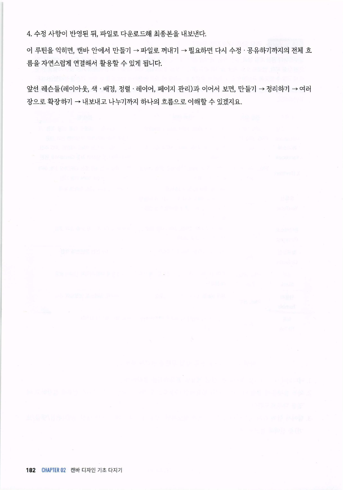

- 4. 수정 사항이 반영된 뒤, 파일로 다운로드해 최종본을 내보낸다.

###### 이 루틴을 익히면, 캔바 안에서 만들기 一 파일로 꺼내기 一 필요하면 다시 수정 · 공유하기까지의 전체 흐

름을 자연스럽게 연결해서 활용할 수 있게 됩니다.

###### 앞선 레슨들(레이아웃, 색 · 배경, 정렬 · 레이어, 페이지 관리)과 이어서 보면, 만들기 一 정리하기 一 여러

###### 장으로 확장하기 一 내보내고 나누기까지 하나의 흐름으로 이해할 수 있겠지요.

182 CHAPTER 02 캔바 디자인 가조 다지기

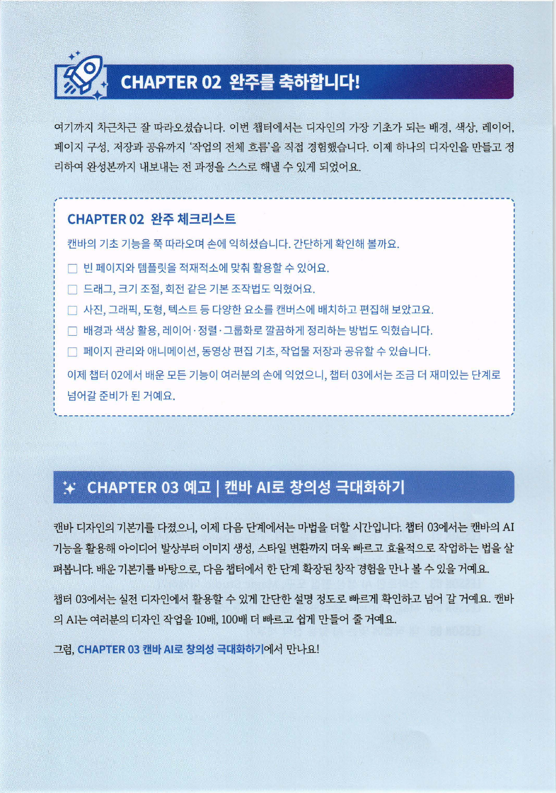

###### , 를 ]

잘 . 가장 되는 배경 , 색 , 레이어 , 페이지 구성, ‘ '을 경험했습니다. 이제 하나의 정

리하여 완성본까지 수 되었어요.

,

###### `

- - - - - - - - - - - - - - - - - - - - - - ••· - - - ••· - •·· - ·- - - - - - •·- - - - - - - - - - - - ••· - - - ••· - - - - - - - ••· - - - •·• - - - - - ··,- - - - - - - - - - -

CHAPTER02 완주 체크리스트

기능을 쭉 손에 익히셨습니다. 볼까요.

口 빈 페이지와 템플릿을 적재적소에 맞줘 활용할 수 있어요.

曰 드래그, 크기 조절, 회전 같은 기본 조작법도 익혔어요. 曰 사진, 그래픽, 도형, 텍스트 등 다양한 캔버스에 배지하고 편집해 보았고요. 曰 배경과색상활용,레이어·정렬·그룹화로깔끔하게정리하는방법도익혔습니다. 口 페이지 관리와 애니메이션, 동영상 편집 기조, 작업물 저장과 공유할 수 있습니다.

이제 챕터 02에서 배운 모든 기능이 여러분의 손에 익었으니, 챕터 03에서는 조금 더 재미있는 단계로 넘어갈 준비가 된 거예요.

- --------------------------------

`

’

| ]

이제 마법을 더할 시간입니다. 챕터 03에서는 AI

아이디어 이미지 변환까지 더욱 빠르고 효율적으로 살 다음 챕터에서 한 단계 확장된 창작 만나 볼 수 있을거예요.

수 넘어 캔바 10배, 더 만들어 줄 거예요.

에서

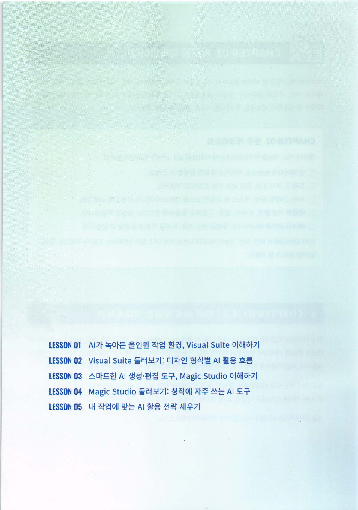

- LESSON 01 가 환경, Visual Suite
- LESSON 02 Visual Suite 둘러보기: 형식별 Al 스마트한 Al 도구, Magic Studio 이해하기 Magic Studio 둘러보기: 창작에 자주 쓰는 Al 도구

LESSON 05 Al 세우기

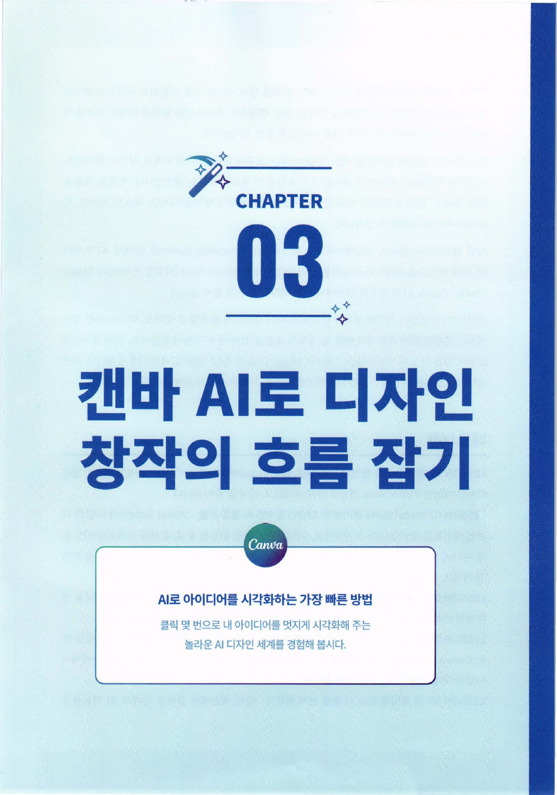

/'-

2 수

CHAPTER

###### ?

수

### 캔바 Al로디자인

###### 아이디어롤 시각화하는 가장 빠른

클릭 번으로 내 아이디어를 멋지게 시각화해 주는 놀라운 Al 디자인 세계를 봅시다.

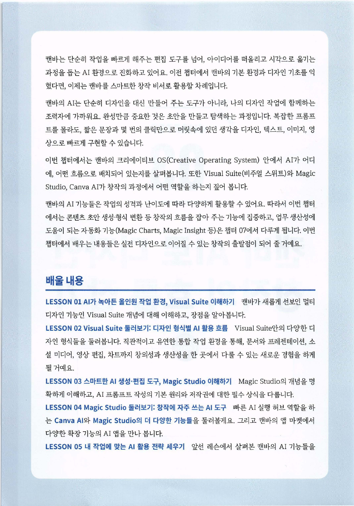

캔바는 단순히 작업을 빠르게 해주는 편집 도구를 넘어, 아이디어를 떠올리고 시각으로 옮기는

과정을 돕는 AI 환경으로 진화하고 있어요. 이전 챕터에서 캔바의 기본 환경과 디자인 기초를 익 혔다면, 이제는 캔바를 스마트한 창작 비서로 활용할 차례입니댜

###### 캔바의 AI는 단순히 디자인을 대신 만들어 주는 도구가 아니라, 나의 디자인 작업에 함께하는

조력자에 가까워요. 완성만큼 중요한 것은 초안을 만들고 탐색하는 과정입니댜 복잡한 프롬프 트를 몰라도, 짧은 문장과 몇 번의 클릭만으로 머릿속에 있던 생각을 디자인, 텍스트, 이미지, 영

상으로 빠르게 구현할 수 있습니다.

이번 챕터에서는 캔바의 크리에이티브 OS(Creative Operating System) 안에서 AI가 어디 에, 어떤 흐름으로 배치되어 있는지를 살펴봅니다. 또한 Visual Suite(비주얼 스위트)와 Magic Studio, Canva AI가 창작의 과정에서 어떤 역할을 하는지 짚어 봅니다.

캔바의 AI 기능들은 작업의 성격과 난이도에 따라 다양하게 활용할 수 있어요. 따라서 이번 챕터 에서는 콘텐츠 초안 생성형식 변환 등 창작의 흐름을 잡아 주는 기능에 집중하고, 업무 생산성에

도움이 되는 자동화 기능(Magic Charts, Magic Insight 등)은 챕터 07에서 다루게 됩니다. 이번

챕터에서 배우는 내용들은 실전 디자인으로 이어질 수 있는 창작의 출발점이 되어 줄 거예요.

###### 배울내용

- 01 Al가 Visual Suite 캔바가 새롭게 선보인 멀티

디자인 기능인 Visual Suite 개념에 대해 이해하고, 장점을 알아봅니다.

- 02 Visual Suite Al Visual Suite안의 다양한 디

자인 형식들을 둘러봅니다. 직관적이고 유연한 통합 작업 환경을 통해, 문서와 프레젠테이션, 소 셜 미디어, 영상 편집, 차트까지 창의성과 생산성을 한 곳에서 다룰 수 있는 새로운 경험을 하게 될거예요.

스마트한 시 도구, Magic Studio Magic Studio의 개념을 명 확하게 이해하고, AI 프롬프트 작성의 기본 원리와 저작권에 대한 필수 상식을 다룹니다.

Al 빠른 시 실행 허브 역할을 하

는 Canva 와 Magic Studio의 더 을 둘러볼게요. 그리고 캔바의 앱 마켓에서 다양한 확장 기능의 AI 앱올 만나 봅니다. LESSON 05 내 작업에 Al 전략 세우기 앞선 레슨에서 살펴본 캔바의 AI 기능들을

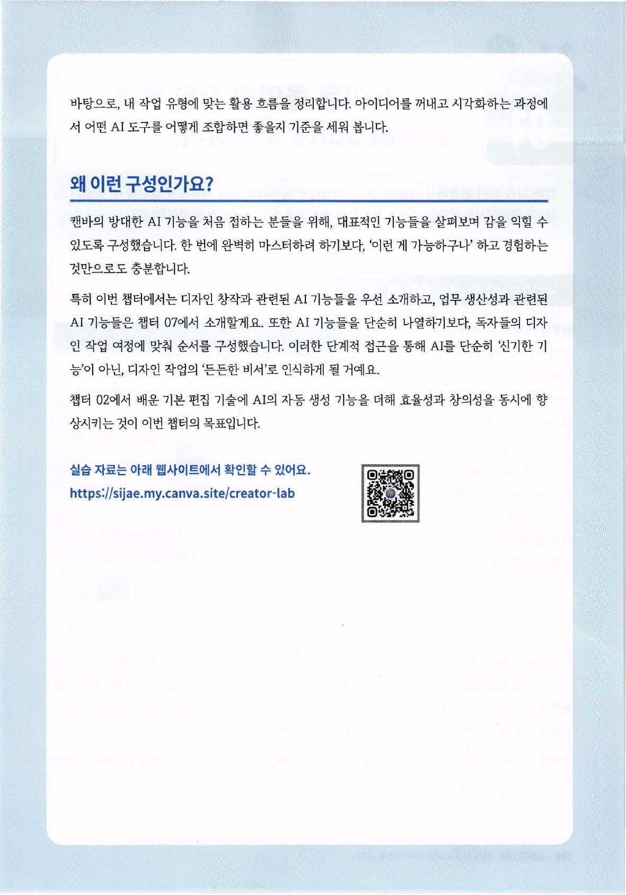

바탕으로, 내 작업 유형에 맞는 활용 흐름을 정리합니다. 아이디어를 꺼내고 시각화하는 과정에

서 어떤 AI 도구를 어떻게 조합하면 좋을지 기준을 세워 봅니댜

캔바의 방대한 AI 기능을 처음 접하는 분들을 위해, 대표적인 기능들을 살펴보며 감을 익힐 수 있도록 구성했습니다. 한 번에 완벽히 마스터하려 하기보다, ‘이런 게 가능하구나' 하고 경험하는

###### 것만으로도 충분합니다.

특히 이번 챕터에서는 디자인 창작과 관련된 AI 기능들을 우선 소개하고, 업무 생산성과 AI 기능들은 챕터 07에서 소개할게요. 또한 AI 기능들을 단순히 나열하기보다, 독자들의 디자

인 작업 여정에 맞춰 순서를 구성했습니다. 이러한 단계적 접근을 통해 AI를 단순히 ‘신기한 기

능'이 아닌, 디자인 작업의 ‘든든한 비서’로 인식하게 될 거예요. 챕터 02에서 배운 기본 편집 기술에 AI의 자동 생성 기능을 더해 효율성과 창의성을 동시에 향 상시키는 것이 이번 챕터의 목표입니다.

아래 수 있어요.

###### https://sijae.my.canva.site/creator-lab

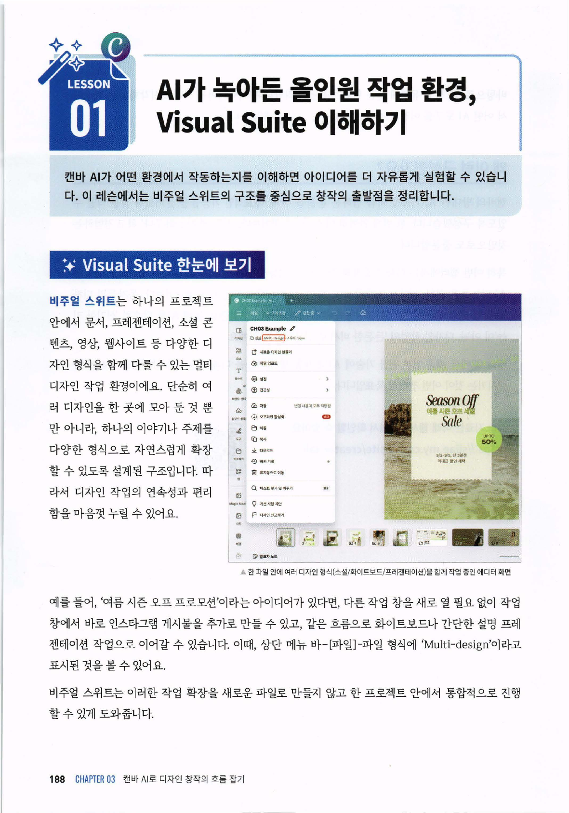

Al가 녹아든 을인원 작업 환경,

Visual Suite 이해하기

Al가 더 수 있습니

다. 이 스위트의 장작의

l 한눈에

-----------------------------

1" 。 |

비주얼 는 하나의 프로젝트 안에서 문서, 프레젠테이션, 소셜 콘

Ol CH03 Example ,f

야 e,,., ·“모

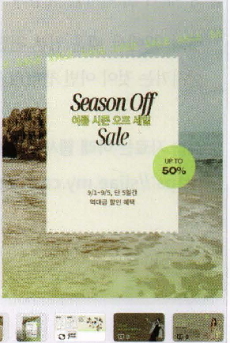

텐츠, 영상, 웹사이트 등 다양한 디

器 I.! ..를은따由"'’

- 자인 형식을함께 다룰수있는멀티 디자인 작업 환경이에요. 단순히 여
- 러 디자인을 한 곳에 모아 둔 것 뿐 만 아니라, 하나의 이야기나 주제를 다양한 형식으로 자연스럽게 확장 할 수 있도록 설계된 구조입니다. 따 라서 디자인 작업의 연속성과 편리 함을 마음껏 누릴 수 있어요.

° “업으

T

- ® 설월

###### .....,

<ffi* ® 터

###### 쿡$

O 저찰

뻔겅 내물., 모두 저싱뵐

.-.

。

c

.L:

• .. ....

El 01를

4

” t ..시

....e 土며모드

..

9/1 딘 511건

O 버전기..

怨. 四.,,.요어들

Q 텍"'I'll바꾸기

e

.” ~- ，꿈

Q “신사할戒

® P =신고혀기

때

m.,, 。’-' ” 012

’ 7'IIm나토

... 한 파일 안에 여러 디자인 형식(소셜/화이트보드/프레젠테이션)을 함께 작업 중인 에디터 화면

예를 들어, ‘여름 시즌 오프 프로모션’이라는 아이디어가 있다면, 다른 작업 창을 새로 열 필요 없이 작업 창에서 바로 인스타그램 계시물을 추가로 만들 수 있고, 같은 흐름으로 화이트보드나 간단한 설명 프레

젠테이션 작업으로 이어갈 수 있습니댜 이때, 상단 메뉴 바-［파일] －파일 형식에 ‘Multi-design’이라고 표시된것을볼수있어요.

비주얼 스위트는 이러한 작업 확장을 새로운 파일로 만들지 않고 한 프로젝트 안에서 통합적으로 진행

할수있게도와줍니댜

188 캔바 Al로 디자인 장작의 흐름 잡기

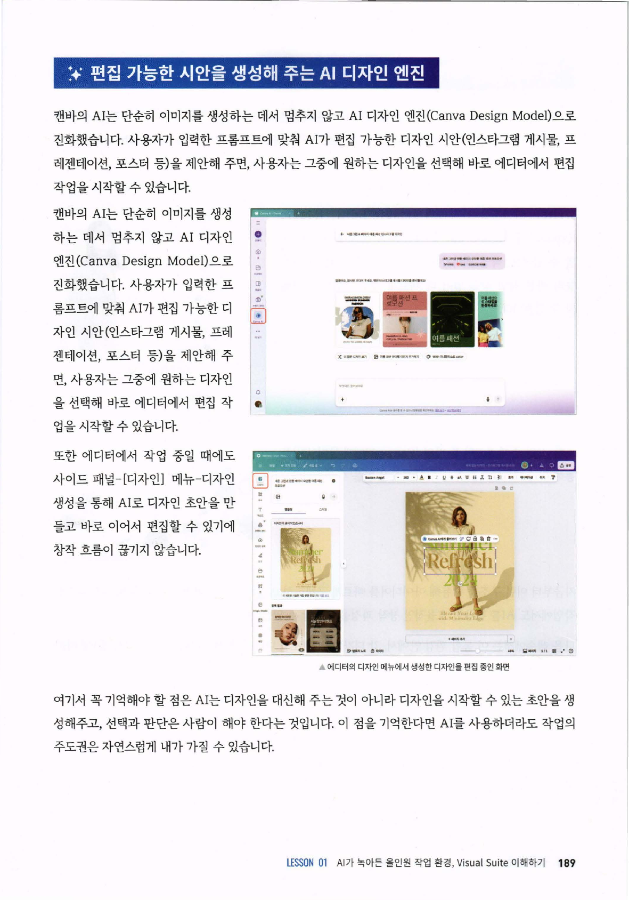

###### | 디자인 |

캔바의 AI는 단순히 이미지를 생성하는 데서 멈추지 않고 AI 디자인 엔진(Canva Design Model)으로 진화했습니다. 사용자가 입력한 프롬프트에 맞춰 AI가 편집 가능한 디자인 시안(인스타그램 게시물, 프

레젠테이션, 포스터 등)을 제안해 주면, 사용자는 그중에 원하는 디자인을 선택해 바로 에디터에서 편집

작업을 시작할 수 있습니다.

캔바의 AI는 단순히 이미지를 생성

###### +빼．그••-....__,.....

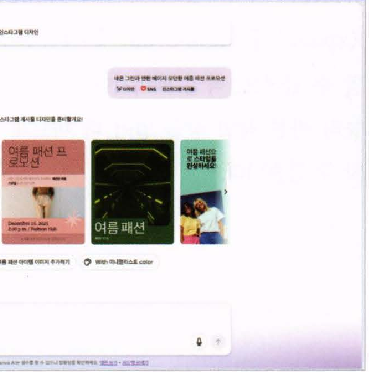

###### 하는 데서 멈추지 않고 AI 디자인 |;

@'

###### .._.._."...,量."

엔진 (Canva Design Model)으로

._ ,_

e

••꼬-- ·뻬홑..던“嶋그.4`．".EI.....`"'

진화했습니댜 사용자가 입력한 프 .오

###### 롬프트에 맞춰 AI가편집 가능한 디 巳

$.

=-루

자인 시안(인스타그램 게시물, 프레

X...c""" 1B....__...기 o-T,....._

젠테이션, 포스터 등)을 제안해 주

면, 사용자는 그중에 원하는 디자인

0

+

을 선택해 바로 에디터에서 편집 작 •

업을시작할수있습니댜

.. e m|

또한 에디터에서 작업 중일 때에도

.” e

사이드 패널-[디자인] 메뉴-디자인 ] :::..--..* O

-- - ~ • A • u • .. ~ " 1. n r .. ."" " T

###### ‘“

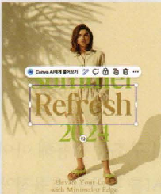

.. ---

생성을 통해 AI로 디자인 초안을 만 들고 바로 이어서 편집할 수 있기에

###### .”

T-

###### -"4

。

창작 흐름이 끊기지 않습니댜

" e-m·

###### ·-

1B ....

1B ..., ,"

•

” ‘"" ”· • ·· o

,,..... c!>-

에디터의 디자인 메뉴에서 생성한 디자인을 편집 증인 화면

여기서 꼭 기억해야 할 점은 AI는 디자인을 대신해 주는 것이 아니라 디자인을 시작할 수 있는 초안을 생 성해주고, 선택과 판단은 사람이 해야 한다는 것입니댜 이 점울 기억한다면 AI를 사용하더라도 작업의 주도권은 자연스럽게 내가 가질 수 있습니다.

01 Al가 녹아든 을인원 작업 환경, Visual Suite 이해하기 189

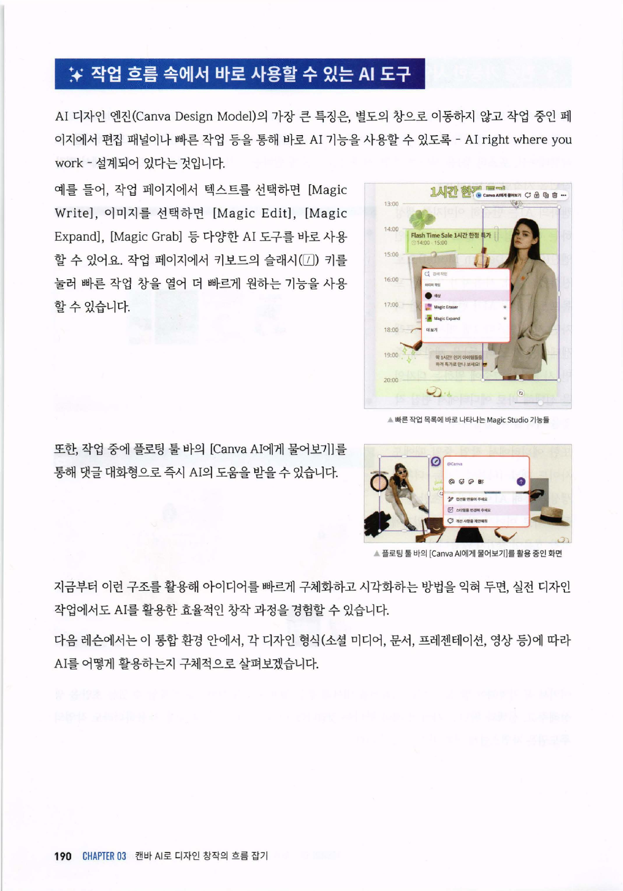

###### A1 도 |

AI 디자인 엔진(Canva Design Model)의 가장 큰 특징은, 별도의 창으로 이동하지 않고 작업 중인 페 이지에서 편집 패널이나 빠른 작업 등을 통해 바로 AI 기능을 사용할 수 있도록 - AI right where you work- 설계되어 있다는것입니댜

예를 들어, 작업 페이지에서 텍스트를 선택하면 [Magic Write] , 이미지를 선택하면 [Magic Edit], [Magic Expand], [Magic Grab] 등 다양한 AI 도구를 바로 사용 할 수 있어요. 작업 페이지에서 키보드의 슬래시 ([I]) 키를

f= ..l’

~""配u c a © O ···

- 13:00

`수

- 14:00
- 15:00

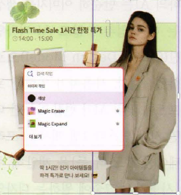

16;00

눌러 빠른 작업 창을 열어 더 빠르게 원하는 기능을 사용

할수있습니다.

- 17:00
- 18:00

19.00

20:00

。

...빠른 작업 목록에 바로 나타나는 MagicStudio 기능들

또한, 작업 중에 플로텅 툴 바의 [Canva AI에게 물어보기]를

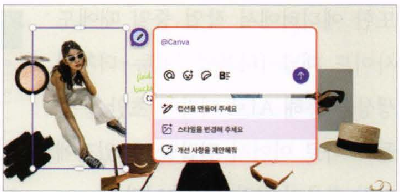

통해 댓글 대화형으로 즉시 AI의 도움을 받을 수 있습니다.

###### ........,.턴....,,.,...,..."-

G e sF

풀로팅 툴 바의 [Canva AI에게 울어보기]를 활용 중인 화면

지금부터 이런 구조를 활용해 아이디어를 빠르게 구체화하고 시각화하는 방법을 익혀 두면, 실전 디자인 작업에서도 AI를 활용한 효율적인 창작 과정을 경험할 수 있습니다.

- 다음 레슨에서는 이 통합 환경 안에서, 각 디자인 형식 (소셜 미디어, 문서, 프레젠테이션, 영상 등)에 따라 AI를 어떻게 활용하는지 구체적으로 살펴보겠습니다.

190 CHAPTER 03 캔바 Al로 디자인 장작의 흐름 잡기

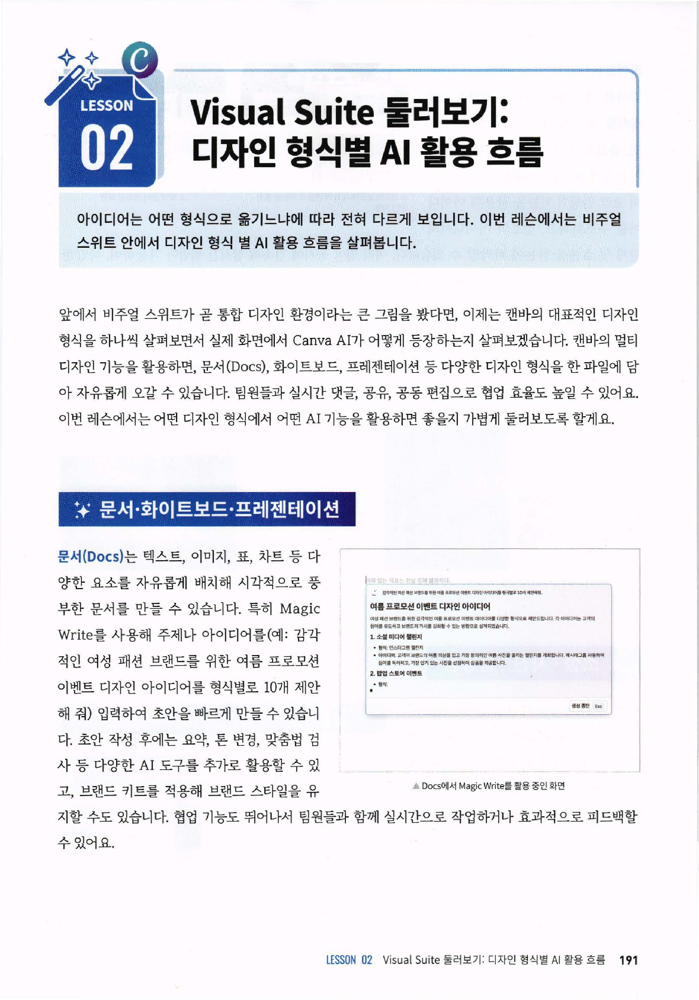

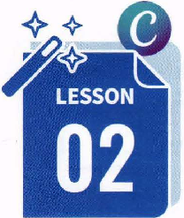

Visual Suite 틀러보기:

디자인 형식별 Al 활용 흐률

아이디어는 어떤 옮기느냐에 따라 전혀 다르게 보입니다. 이번

안에서 형식 활용

앞에서 비주얼 스위트가 곧 통합 디자인 환경이라는 큰 그림을 봤다면, 이제는 캔바의 대표적인 디자인

형식을 하나씩 살펴보면서 실제 화면에서 Canva AI가 어떻게 등장하는지 살펴보겠습니다. 캔바의 멀티

디자인 기능을 활용하면, 문서 (Docs), 화이트보드, 프레젠테이션 등 다양한 디자인 형식을 한 파일에 담

- 아 자유롭게 오갈 수 있습니다. 팀원들과 실시간 댓글, 공유, 공동 편집으로 협업 효율도 높일 수 있어요. 이번 레슨에서는 어떤 디자인 형식에서 어떤 AI 기능을 활용하면 좋을지 가볍게 둘러보도록 할게요.

###### |

###### 문서 (Docs)는 텍스트, 이미지, 표, 차트 등 다

一 같라혀업이•••브!!El”던아1로量오선어뺀．q자인아여마기......皇l0·-·

양한 요소를 자유롭게 배치해 시각적으로 풍 부한 문서를 만들 수 있습니댜 특히 Magic Write를 사용해 주제나 아이디어를(예 : 감각

여름 프로모션 디자인 아이디어

이실 빼신 "던깁긱픽언 어. 프．모신 01면量 아어다거. 다한 혈여오畵 . 리 아어미어는 9도＂고 보른택 가차. 깅볼촬 었는 탑曺오료 쉘계되었습니다.

###### 1. 소설미디어웰린지

- • 혈식 언스타그뺑 틀린지
- • 아이tlOt: 고젝01 이· 의심을 기징 어를 게써핥니q. 살여. 특허허고, 가집 언가 있는 서민틀 살ff .

###### 적인 여성 패션 브랜드를 위한 여름 프로모션

###### 2 맙스토어 01뺀트

이벤트 디자인 아이디어를 형식별로 10개 제안

•

생설 룹단 "

해 줘) 입력하여 초안을빠르게 만들수 있습니

- 다. 초안 작성 후에는 요약, 톤 변경, 맞춤법 검
- 사 등 다양한 AI 도구를 추가로 활용할 수 있 고, 브렌드 키트를 적용해 브랜드 스타일을 유

.4. Docs에서 Magic Write를 활용 중인 화면

지할 수도 있습니다. 협업 기능도 뛰어나서 팀원들과 함께 실시간으로 작업하거나 효과적으로 피드백할

수있어요.

LESSON 02 Visua Suite 둘러보기: 디자인 형식별 A| 활용 흐름 191

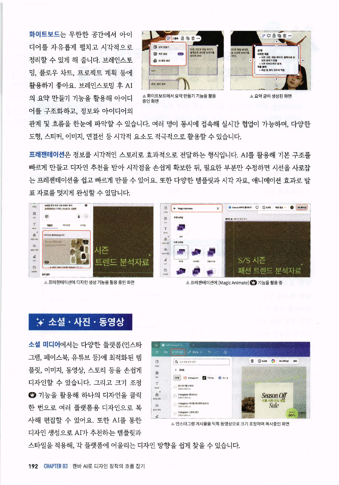

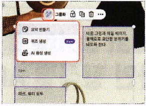

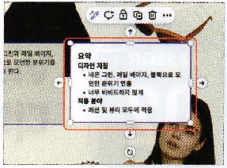

화이트보드는 무한한 공간에서 아이

디어를 자유롭게 펼치고 시각적으로

정리할 수 있게 해 줍니댜 브레인스토 밍, 플로우 차트, 프로젝트 계획 등에 활용하기 좋아요. 브레인스토밍 후 AI 의 요약 만들기 기능을 활용해 아이디

^화이트보드에서요약만들기 기능을활용

....요약 글이 생성된화면

중인화면

- 어를 구조화하고, 정보와 아이디어의

###### 관계 및 흐름을 한눈에 파악할 수 있습니다. 여러 명이 동시에 접속해 실시간 협업이 가능하며, 다양한

도형, 스티커, 이미지, 연결선 등 시각적 요소도 적극적으로 활용할 수 있습니다.

###### 프레젠테이션은 정보를 시각적인 스토리로 효과적으로 전달하는 형식입니다. AI를 활용해 기본 구조를

빠르게 만들고 디자인 추천을 받아 시작점을 손쉽게 확보한 뒤, 필요한 부분만 수정하면 시선을 사로잡

###### 는 프레젠테이션을 쉽고 빠르게 만들 수 있어요. 또한 다양한 템플릿과 시각 자료, 애니메이션 효과로 발

표 자료를 멋지계 완성할 수 있답니댜

g

2 [.. M포“때..

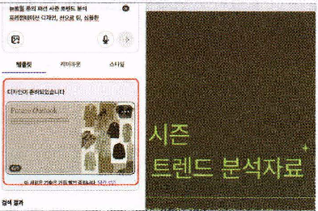

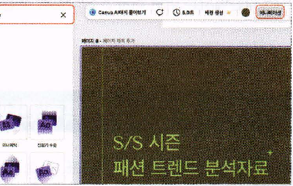

-·짜..,.,， o o1,0• ··嶋쉘

니

。

",.틸 룹외 嶋신 시른 료 ．여

선.. 턴,

캠

<

a

li'l

➔

••펙

路

###### T ••`

”

대야가

T

###### ......‘

빼석

‘

·스.

”

.. ..

一... -

###### G:

。

업" ..

업mm

4

•

4

###### ....

요구

e,

e

m"

겉색 률적

...프레젠테이션에 [Magic Animate]0 기능을활용증

~ 프레젠테이션에 디자인 생성 기능을 활용 중인 화면

###### | |

###### ®m·?• . • +

미디어에서는 다양한 플랫폼(인스타

# v

그렐 페이스북, 유튜브 등)에 최적화된 템 플릿, 이미지, 동영상, 스토리 등을 손쉽게

(]j 10 학1표•"＇l l ` 四 0·.O홑

色효‘신할기

< SNS

었

떠""ot (} F><)

@,""..,.m

디자인할 수 있습니다. 그리고 크기 조정

C 엽스티,0"k,.,.그1스&l..

O 기능을 활용해 하나의 디자인을 클릭

0 '＂m·m를과:SI

###### '..,...

K兄0·l"'»

IM<,a,,m,.,_,I예니에아신(4SI

。

한 번으로 여러 플랫폼용 디자인으로 복 사해 편집할 수 있어요. 또한 AI를 통한

....TO

,.,...,.m 스할바홑고

4 一' u"°‘1xm

^인스타그랭게시물을틱톡동영상으로크기 조정하여 복사중인화면

디자인 생성으로 AI가 추천하는 템플릿과

스타일을 적용해, 각 플랫폼에 어울리는 디자인 방향을 쉽게 찾을 수 있습니다.

192 CHAPTER 03 캔바 A 로 디자인 장작의 흐름 잡기

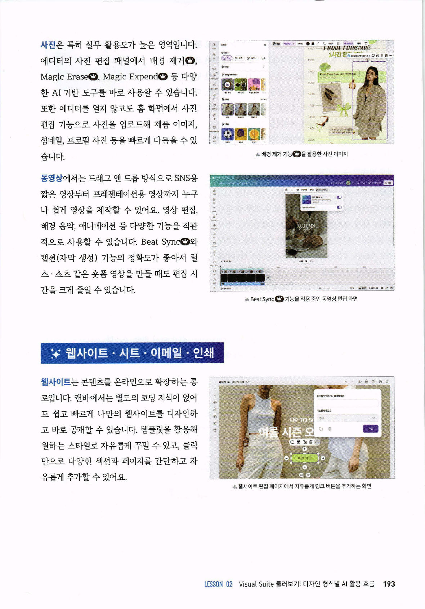

e" ...... ..튈 • li r a " t .. ,.

###### -a, ....-

사진은 특히 실무 활용도가 높은 영역입니다. 에디터의 사진 편집 패널에서 배경 제거 0,

;,-..

S도;:..,.,,。 aoo

” @ V·· …~

.....c.*··,~-

스'

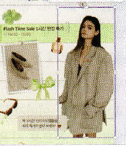

1l1)0

###### ’

T

nOO

Magic EraseO, Magic Expend() 등 다양 한 AI 기반 도구를 바로 사용할 수 있습니댜

F叫nme노 1시간

3 ,

###### ‘ ... ....

--L .

1500

깁

###### ’

。

,.OO

-Ea "OO et -

" 0 ..

..•.

e,

또한 에디터를 열지 않고도 홈 화면에서 사진 편집 기능으로 사진을 업로드해 제품 이미지,

、

1'.’oooo

駐

o.

~g

간g EZ

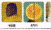

t

i

###### 섬네일, 프로필 사진 등을 빠르게 다듬을 수 있

... 배경 제거 기능《，을 활용한 사진 이마지

습니다.

z'... "? . •. ·一•_.',

동영상에서는 드래그 앤 드롭 방식으로 SNS용

eg

흡

« «

짧은 영상부터 프레젠테이션용 영상까지 누구

鷄

aT3·~@~>tetg.e"e"nt

나 쉽게 영상을 제작할 수 있어요. 영상 편집,

배경 음악, 애니메이션 등 다양한 기능을 직관

적으로 사용할 수 있습니다. Beat SyncO와

릭

<~~.』

··

캡션(자막 생성) 기능의 정확도가 좋아서

u

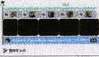

스·쇼츠같은숏폼영상을만들때도편집 시

nl"

끄 덜... ”""' ... o

간을 크게 줄일 수 있습니다.

.ot. Beat SyncO 기능을 적용 중인 동영상 편집 화면

###### I • |

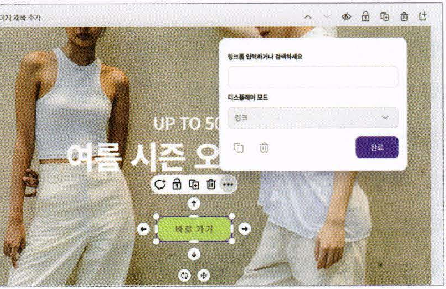

는 콘텐츠를 온라인으로 확장하는 통

心 @ 떤 O U

14• 빼OI시 鴻률 추가

로입니다. 캔바에서는 별도의 코딩 지식이 없어 도 쉽고 빠르게 나만의 웹사이트를 디자인하

###### ..

·크

###### 고 바로 공개할 수 있습니다. 템플릿을 활용해

원하는 스타일로 자유롭게 꾸밀 수 있고, 클릭 만으로 다양한 섹션과 페이지를 간단하고 자

유롭게 추가할 수 있어요.

~ 웹사이트 편집 페이지에서 자유롭게 링크 버튼을 주가하는 화면

###### 02 Visual Suite 둘러보기: 디자인 형식별 Al 활용 흐름 193

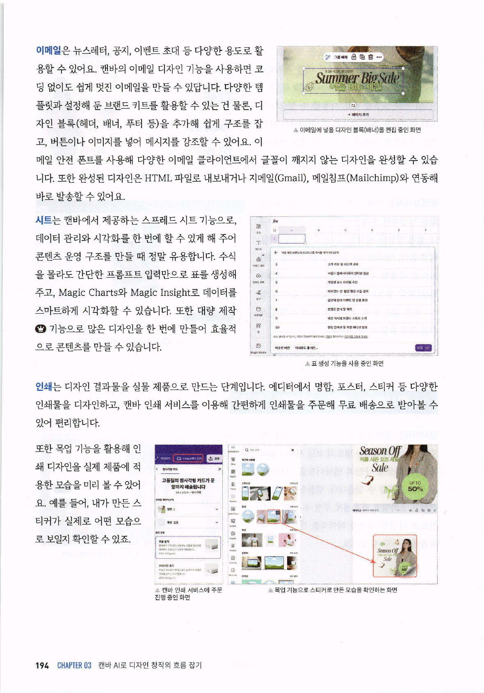

이메일은 뉴스레터, 공지, 이벤트 초대 등 다양한 용도로 활 용할 수 있어요. 캔바의 이메일 디자인 기능을 사용하면 코

딩 없이도 쉽게 멋진 이메일을 만들 수 있답니다. 다양한 템

###### 플릿과 설정해 둔 브렌드 키트를 활용할 수 있는 건 물론, 디

- 자인 블록(헤더, 배너, 푸터 등)을 추가해 쉽게 구조를 잡 ~ 이메일에 넣을 디자인 블록(배너)을 편집 중인 화면

고, 버튼이나 이미지를 넣어 메시지를 강조할 수 있어요. 이 메일 안전 폰트를 사용해 다양한 이메일 클라이언트에서 글꼴이 깨지지 않는 디자인을 완성할 수 있습

니다. 또한 완성된 디자인은 HTML 파일로 내보내거나 지메일(Gmail), 메일침프(Mailchimp)와 연동해

바로발송할수있어요.

는 캔바에서 제공하는 스프레드 시트 기능으로,

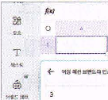

데이터 관리와시각화를한번에 할수있게 해 주어 콘텐츠 운영 구조를 만들 때 정말 유용합니다. 수식

`

e 여......,덱언석네그·면야떼右떠

.. 공유

4567891

울 몰라도 간단한 프롬프트 입력만으로 표를 생성해 주고, Magic Charts와 Magic Insight로 데이터를

브론드엽빼나더쩌연C"' 혈싱

。

·프..

“렬릴수아어뗄후천

쓰 8

비혀언드 싼 촬영 현강 오숄 공기

릴료“ 합어 아뺀皇 열 픕필

e

스마트하게 시각화할 수 있습니다. 또한 대량 제작

토현드룬석몇대측

ll..

빼여사역브뎬드스로리소

00o+

O 기능으로 많은 디자인을 한 번에 만들어 효율적 으로 콘텐츠를 만들 수 있습니댜

。

흡 멀..선 몇 ｀뺄 에다신 雷묘

엽

”·볼수••었으나이......사鏞. . .......u" 口"＇`.......

"f"＂민 어대__C 를지연.”

소 표생성기능을사용중인화면

인쇄는 디자인 결과물을 실물 제품으로 만드는 단계입니다. 에디터에서 명함, 포스터, 스티커 등 다양한 인쇄물을 디자인하고, 캔바 인쇄 서비스를 이용해 간편하게 인쇄물을 주문해 무료 배송으로 받아볼 수

# - I:;, -

있어 편리합니다.

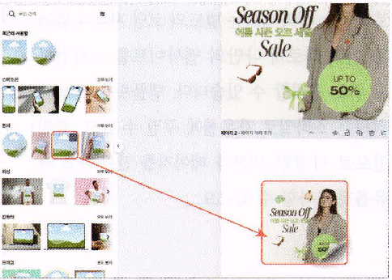

또한 목업 기능을 활용해 인

쇄 디자인을 실제 제품에 적 용한모습을미리 볼수있어 요. 예를들어, 내가만든스 티커가 실제로 어떤 모습으

###### H

|..... '"'km·E?. -요

###### 납

###### gi`

###### .,..

- -·Lo

olaI

oi

- - ...

g"

".

‘ a .. C

m 1

###### ....

·편"

．

., ....,.nL?......

로 보일지 확인할 수 있죠.

G..,`-T •

..•지

i

따贊 • • .할빼 막zg"＇

###### ―」戶··”

표라••

C2,· 성".,．연오'U를E

연일,널r는 ”""

a10이.지

^ 목업 기능으로스티커로만든모습을확인하는화면

캔바인쇄 서비스에 주문

진행 중인화연

194 CHAPTER 03 캔바 Al로 디자인 장작의 흐름 잡기

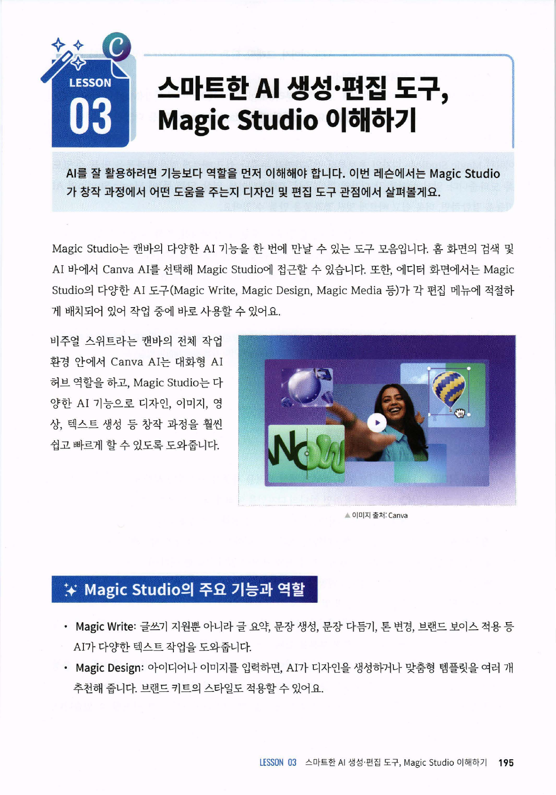

스마트한 Al 생상편집 도구,

###### Magic Studio 이해하기

###### 잘 가 과정에서 주는지

Magic Studio는 캔바의 다양한 AI 기능을 한 번에 만날 수 있는 도구 모음입니다. 홈 화면의 검색 및 AI 바에서 Canva AI를 선택해 Magic Studio에 접근할 수 있습니다. 또한, 에디터 화면에서는 Magic Studio의 다양한 AI 도구(Magic Write, Magic Design, Magic Media 등)가 각 편집 메뉴에 적절하 게 배치되어 있어 작업 중에 바로사용할수있어요.

비주얼 스위트라는 캔바의 전체 작업

환경 안에서 Canva AI는 대화형 AI 허브 역할을 하고, Magic Studio는 다 양한 AI 기능으로 디자인, 이미지, 영

상, 텍스트 생성 등 창작 과정을 훨씬 쉽고 빠르게 할 수 있도록 도와줍니다.

이미지 줄처: Canva

| |

###### Magic Write: 글쓰기 지원뿐 아니라 글 요약, 문장 생성, 문장 다듬기, 톤 변경, 브랜드 보이스 적용 등

AI가 다양한 텍스트 작업을 도와줍니다.

Magic Design: 아이디어나 이미지를 입력하면, AI가 디자인을 생성하거나 맞춤형 템플릿을 여러 개 추천해 줍니댜 브랜드 키트의 스타일도 적용할 수 있어요.

03 스마트한 Al 생성편집 도구, Magic Studio 이해하기 195

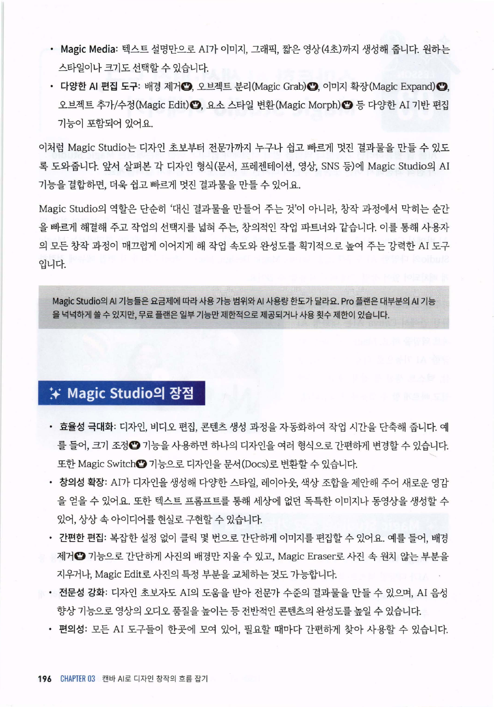

- • Magic Media: 텍스트 설명만으로 AI가 이미지, 그래픽, 짧은 영상(4초)까지 생성해 줍니다. 원하는 스타일이나 크기도 선택할 수 있습니다.
- • 다양한 Al 편집 도구: 배경 제거o, 오브젝트 분리 (Magic Grab)O, 이미지 확장(Magic Expand)O, 오브젝트 추가/수정 (Magic Edit)0, 요소 스타일 변환(Magic Morph)O 등 다양한 AI 기반 편집 기능이 포함되어 있어요.

이처럼 Magic Studio는 디자인 초보부터 전문가까지 누구나 쉽고 빠르게 멋진 결과물을 만들 수 있도 록 도와줍니다. 앞서 살펴본 각 디자인 형식 (문서, 프레젠테이션, 영상, SNS 등)에 Magic Studio의 AI

기능을 결합하면, 더욱 쉽고 빠르게 멋진 결과물을 만들 수 있어요.

Magic Studio의 역할은 단순히 ‘대신 결과물을 만들어 주는 것’이 아니라, 창작 과정에서 막히는 순간

을 빠르게 해결해 주고 작업의 선택지를 넓혀 주는, 창의적인 작업 파트너와 같습니다. 이를 통해 사용자

의 모든 창작 과정이 매끄럽게 이어지게 해 작업 속도와 완성도를 획기적으로 높여 주는 강력한 AI 도구

입니다.

Al 따라 사용 Al Al

을 넉넉하게 쓸 수 있지만, 횟수

###### | |

- • 효율성 극대화: 디자인, 비디오 편집, 콘텐츠 생성 과정을 자동화하여 작업 시간을 단축해 줍니다. 예 를 들어, 크기 조정O 기능을 사용하면 하나의 디자인을 여러 형식으로 간편하게 변경할 수 있습니다. 또한 Magic Switch() 기능으로 디자인을 문서 (Docs)로 변환할 수 있습니다.
- • 장의성 확장: AI가 디자인을 생성해 다양한 스타일, 레이아웃, 색상 조합을 제안해 주어 새로운 영감 을 얻을 수 있어요. 또한 텍스트 프롬프트를 통해 세상에 없던 독특한 이미지나 동영상을 생성할 수 있어, 상상 속 아이디어를 현실로 구현할 수 있습니다.
- • 간편한 편집: 복잡한 설정 없이 클릭 몇 번으로 간단하게 이미지를 편집할 수 있어요. 예를 들어, 배경 제거O 기능으로 간단하게 사진의 배경만 지울 수 있고, Magic Eraser로 사진 속 원치 않는 부분을 지우거나, Magic Edit로 사진의 특정 부분을 교체하는 것도 가능합니다.
- • 전문성 강화: 디자인 초보자도 AI의 도움을 받아 전문가 수준의 결과물을 만들 수 있으며, AI 음성 향상기능으로 영상의 오디오품질을높이는등 전반적인 콘텐츠의 완성도를높일 수 있습니다.
- • 편의성: 모든 AI 도구들이 한곳에 모여 있어, 필요할 때마다 간편하게 찾아 사용할 수 있습니다.

196 CHAPTER 03 캔바 Al로 디자인 장작의 흐름 잡기

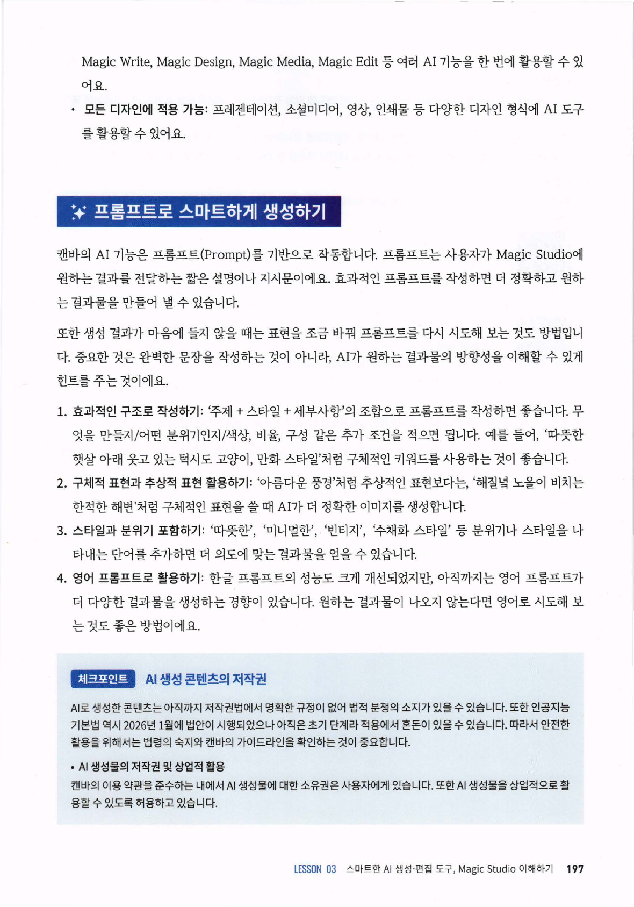

###### Magic Write, Magic Design, Magic Media, Magic Edit 등 여러 AI 기능을 한 번에 활용할 수 있

어요.

모든 디자인에 적용 가능: 프레젠테이션, 소셜미디어, 영상, 인쇄물 등 다양한 디자인 형식에 AI 도구 를활용할수있어요.

캔바의 AI 기능은 프롬프트(Prompt)를 기반으로 작동합니다. 프롬프트는 사용자가 Magic Studio에 원하는 결과를 전달하는 짧은 설명이나 지시문이에요. 효과적인 프롬프트를 작성하면 더 정확하고 원하

는결과물을만들어 낼수있습니다.

또한 생성 결과가 마음에 들지 않을 때는 표현을 조금 바꿔 프롬프트를 다시 시도해 보는 것도 방법입니

###### 다. 중요한 것은 완벽한 문장을 작성하는 것이 아니라, AI가 원하는 결과물의 방향성을 이해할 수 있게

힌트를주는것이에요.

- 1. 효과적인 구조로 작성하기: ‘주제 + 스타일 + 세부사항'의 조합으로 프롬프트를 작성하면 좋습니다. 무 엇을 만들지/어떤 분위기인지/색상, 비율, 구성 같은 추가 조건을 적으면 됩니다. 예를 들어, ‘따뜻한 햇살 아래 웃고 있는 턱시도 고양이, 만화 스타일'처럼 구체적인 키워드를 사용하는 것이 좋습니다.
- 2. 구제적 표현과 주상적 표현 활용하기: ‘아름다운 풍경'처럼 추상적인 표현보다는, ‘해질녘 노을이 비치는 한적한 해변처럼 구체적인 표현을 쓸 때 AI가 더 정확한 이미지를 생성합니댜
- 3. 스타일과 분위기 포함하기: ‘따뜻한', ‘미니멀한', ‘빈티지’, ‘수채화 스타일’ 등 분위기나 스타일을 나 타내는 단어를 추가하면 더 의도에 맞는 결과물을 얻을 수 있습니다.
- 4. 영어 프롬프트로 활용하기: 한글 프롬프트의 성능도 크게 개선되었지만, 아직까지는 영어 프롬프트가 더 다양한 결과물을 생성하는 경향이 있습니다. 원하는 결과물이 나오지 않는다면 영어로 시도해 보 는것도 좋은방법이에요.

- Al 저작권

Al로 생성한 콘텐츠는 아직까지 규정이 없어 법적 소지가 수 있습니다. 인공지능

역시 2026년 1월에 법안이 시행되었으나 아직은 조기 단계라 적용에서 혼돈이 있을 수 있습니다. 따라서 안전한 활용을 위해서는 법령의 숙지와 캔바의 가이드라인을 확인하는 것이 중요합니다.

- • Al 저작권 상업적 캔바의 이용 약관을 준수하는 내에서 Al 생성물에 대한 소유권은 사용자에게 있습니다. 또한 Al 상업적으로 활

수 허용하고 있습니다.

스마트한 Al 생성편집 도구, Magic Studio 이해하기 197

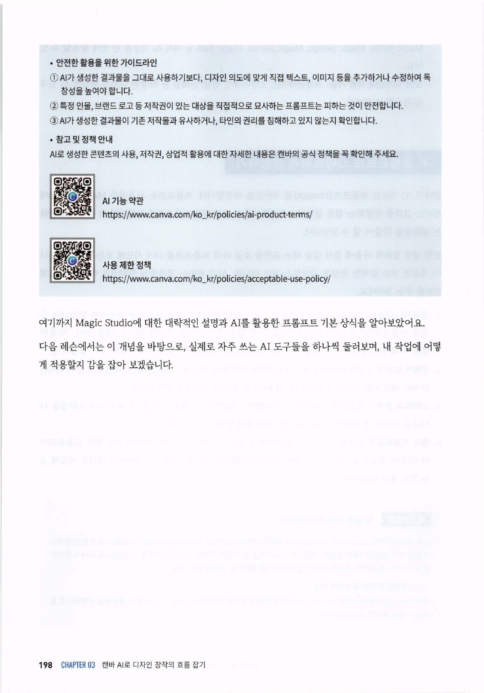

- • 안전한활용을위한가이드라인 ® AI가 그대로 사용하기보다, 디자인 맞게 직접 텍스트, 이미지 등율 독

창성을높여야합니다. ® 특정인물,브랜드로고등저작권이있는대상을직접적으로묘사하는프롬프트는피하는것이안전합니댜

®AI가 생성한 결과물이 기존 저작물과유사하거나, 타인의 권리를 짐해하고 있지 않는지 확인합니다.

• 잠고및정책안내

Al로 콘텐츠의 사용, 저작권, 상업적 활용에 대한 자세한 내용은 캔바의 공식 정책을 꼭 확인해 주세요.

Al 기능약관

https://www.canva.com/ko_kr/policies/ai-product-terms/

사용제한정책

https://www.canva.com/ko_kr/policies/acceptable-use-policy/

여기까지 Magic Studio에 대한 대략적인 설명과 AI를 활용한 프롬프트 기본 상식을 알아보았어요. 다움 레슨에서는 이 개념을 바탕으로, 실제로 자주 쓰는 AI 도구들을 하나씩 둘러보며, 내 작업에 어떻 게 적용할지 감을 잡아 보겠습니다.

198 03 캔바 A|로 디자인 장작의 흐름 잡기

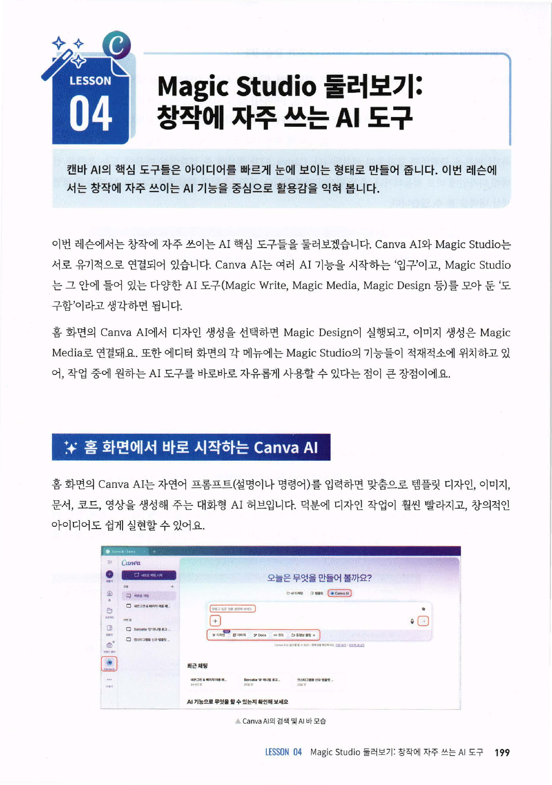

###### Magic Studio 틀러보기:

###### 창작에 자주 쓰는 Al 도구

캔바 Al의 핵심 보이는 이번

장작에 자주 쓰이는 Al

어번 레슨에서는 창작에 자주 쓰이는 AI 핵심 도구들을 둘러보겠습니다. Canva AI와 Magic Studio는 서로 유기적으로 연결되어 있습니댜 Canva AI는 여러 AI 기능을 시작하는 ‘입구’이고, Magic Studio 는 그 안에 들어 있는 다양한 AI 도구(Magic Write, Magic Media, Magic Design 등)를 모아 둔 ‘도

구함'이라고 생각하면 됩니댜

홈 화면의 Canva AI에서 디자인 생성을 선택하면 Magic Design이 실행되고, 이미지 생성은 Magic Media로 연결돼요. 또한 에디터 화면의 각 메뉴에는 Magic Studio의 기능들이 적재적소에 위치하고 있 어, 작업 중에 원하는 AI 도구를 바로바로 자유롭게 사용할 수 있다는 점이 큰 장점이예요.

###### | |

홈 화면의 Canva AI는 자연어 프롬프트(설명이나 명령어)를 입력하면 맞춤으로 템플릿 디자인, 이미지, 문서, 코드, 영상을 생성해 주는 대화형 AI 허브입니다. 덕분에 디자인 작업이 훨씬 빨라지고, 창의적인

아이디어도 쉽게 실현할 수 있어요.

,_

1 + |

Z( m"l

.. +

@. 세·틀11 야죠 0•“

e) O 내g3f.!'*m"＇I` ( 느 M".""M ] *

###### .... ....

###### (O

Ii ..CB. □ ”" _

~· O 언스따그.. _

,..m면_ 7Do<, .,.를 3 틀혈실 •

.`......' ......嶋4•• ·마터I1기

:

최근채팅

나은그린••야시""._ 尉xC"'......... ”스티,••신,..모-

'"'론 X""q '"'

Al 무엇을 할수 있는지 확인혜 보세요

CanvaAI의 검색 및 Al 바모습

04 Magic Studio 둘러보기: 장작에 자주 쓰는 A| 도구 199

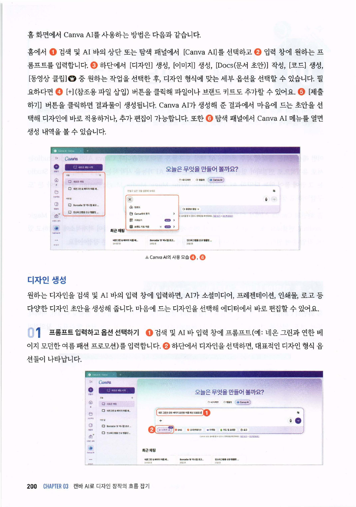

홈 화면에서 Canva AI를 사용하는 방법은 다움과 같습니다.

홈에서 O 검색 및 AI 바의 상단 또는 탐색 패널에서 [Canva AI]를 선택하고 O 입력 창에 원하는 프 롬프트를 입력합니다. O 하단에서 [디자인] 생성, ［이미지] 생성, [Docs(문서 초안)] 작성, [코드] 생성,

[동영상 클립]O 중 원하는 작업을 선택한 후, 디자인 형식에 맞는 세부 옵션을 선택할 수 있습니다. 필

요하다면 O [+] （참조용 파일 삽입) 버튼을 클릭해 파일이나 브랜드 키트도 추가할 수 있어요. O [제출

하기] 버튼을 클릭하면 결과물이 생성됩니댜 Canva AI가 생성해 준 결과에서 마음에 드는 초안을 선

택해 디자인에 바로 적용하거나, 추가 편집이 가능합니다. 또한O 탐색 패널에서 Canva AI 메뉴를 열면

생성 내역을 볼 수 있습니댜

###### .."

무 e내다때 0··릿

O

요• +

###### ® O

세量룬빼뢸

###### •

###### .... ....

e) O

~t,,- ?.

c *

...CB o요..., -

###### X

G 업.

°‘혈살1립 ..

c;i· O 인적그,울신규뺄．밋_

e om떠서"'

I는일 • ........... 묘-"'I •픽며1내거

CID ) * CID )

었 가져"'' 피""빼‘

••& ...

,'"

###### ,...,. .... 던

내그린• 빼어지 ..... ..""신.....411U... 언스그••신a혈틀릿.-

.A.CanvaAI의 사용모습 , 0

###### 디자인생성

원하는 디자인을 검색 및 AI 바의 입력 창에 입력하면, AI가 소셜미디어, 프레젠테이션, 인쇄물, 로고 등

다양한 디자인 초안을 생성해 줍니댜 마음에 드는 디자인을 선택해 에디터에서 바로 편집할 수 있어요.

###### 1 프롬프트입력하고옵션선택하기 O검색 및 AI바입력 창에프롬프트(예: 네온그린과연한베

###### 이지 모던한여름패션 프로모션)를입력합니다. 하단에서 디자인을선택하면, 대표적인 디자인형식 옵

·¢--

션들이나타납니다.

三《 GmkL

###### o"n ■國區"'.. +

###### .

e..다’ ”" ’’

® 。 세

••"

###### ....e

O 며그턴‘*니지어.빼_

네른그른려안현"""'母여1一 *

###### ao+ s" °.......신 뺄터 ·n..."떨 Om 41 0

어

(] 0 Borall• 'B' 어니멀 量고-

###### ."

@* □ 언식냐그1울신규 뗄I힛도’

'""^는.....입어』........."＂'기..,뻬m·I

.., ..

###### 최근채밍

내e그먼 ."""'....- ."다~····"'＂모 인그..신규....-

'..... ,... 23혈던

###### 200 CHAPTER 03 캔바 Al로 디자인 장작의 흐름 잡기

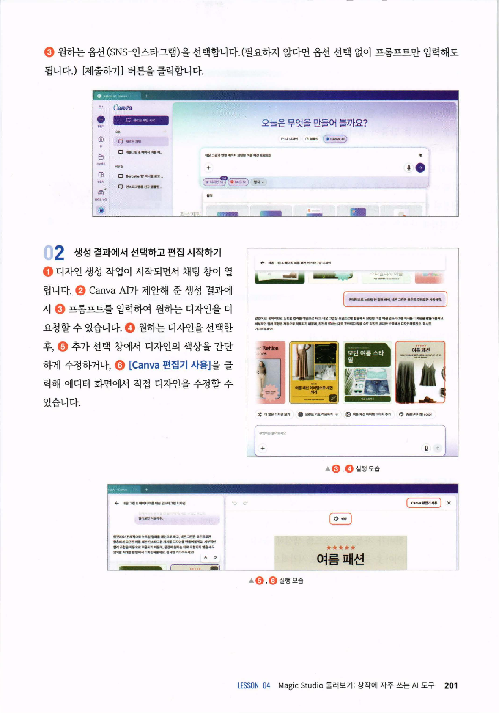

- 0 원하는 옵션 (SNS-인스타그램)을 선택합니다.（필요하지 않다면 옵션 선택 없이 프롬프트만 입력해도

됩니댜) ［제출하기] 버튼을클릭합니댜

·

m"

三(

###### 0 ■틀""＇

”가

•• +

+ 9.

@ O 1111 e내짜 ”" 555)

e .. .....

.... .... 내은그른젝연현．다지모던를.....e···H *

... CJ...냐..，，'"·교-

·쇠 v

###### ...

O 언스그••신규• • 릿-

@*

###### 2 생성결과에서선택하고편집시작하기

+· ••신연스..

O 디자인 생성 작업이 시작되면서 채팅 창이 열

###### L -`

뇨느l^ v,

립니댜 f) Canva AI가 제안해 준 생성 결과에

###### [ 핀…..""""그~..!!ll…!!-·)

서 O 프롬프트를 입력하여 원하는 디자인을 더

'I쩌me嶋．으量"•• 마오1!어Ill!! \!!1011개요 峰 ·혀 조.른 지.211 혀8mI I!천터 ..현되지 霞를 令도었지른 總花 던퀄빼 디nI개요탑시현 기여...요j

요청할 수 있습니댜 0 원하는 디자인을 선택한

_

후, O 추가 선택 창에서 디자인의 색상을 간단

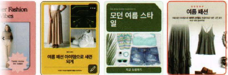

하게 수정하거나, 0 [Canva 사용]을 클

릭해 에디터 화면에서 직접 디자인을 수정할 수 있습니다.

x q11은mm"＇ 뛸"t!S""'...기* ® 어•...,떠”이"" °”m..니"""'

.....

+ Q 수

~ , 0 실행 모습

."-,,,, ^ ----+ ----------

- "IP1 .... ) x

.. ..은그현• 빼어지이 선언스리그 다자연 5 e

###### E

밑려量연 '1114'1

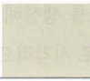

·간어요! 전嶋뻬으...皇• 혈러. 빼고, 른그린은..

...빼언스 e.... . 흑연

....211 빼 ...도

였지 q차업 .

0 ,

###### • , 실행 모습

LESSON 04 Magic Studio 둘러보기: 창작에 자주 쓰는 Al 도구 201

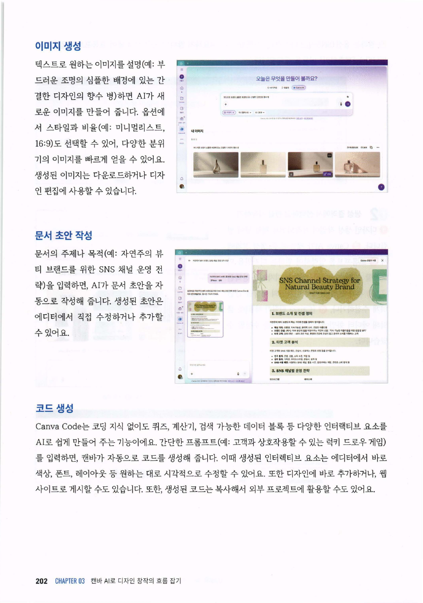

텍스트로원하는이미지를설명(예: 부

###### --

0 m e

-

###### 9 ••

드러운 조명의 심플한 배경에 있는 간 결한 디자인의 향수 병)하면 AI가 새

.넥... ,... ·-·

. 2CB

.,••鼻.....嶋····..........

+

로운 이미지를 만들어 줍니다. 옵션에

• 翼` T壇 - 。”,．

-".....

"'

人1 스타일과 비율(예: 미니멀리스트, 16:9)도 선택할 수 있어, 다양한 분위

0101지

0-"~ 。•• Ill •.•

0·

기의 이미지를 빠르게 얻을 수 있어요.

생성된 이미지는 다운로드하거나 디자 인 편집에 사용할 수 있습니댜

###### •

###### 문서조안작성

문서의 주제나 목적(예: 자연주의 뷰

e .... . q . ....""....

-··"... x

티 브랜드를 위한 SNS 채널 운영 전

m·

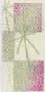

###### 。.

'"'u...........""...

*- •

략)을 입력하면, AI가 문서 초안을 자 동으로작성해

빠‘'"｀．..._.

e

L1 ·-·-...........C O I

.Gl..

줍니다. 생성된 초안은 직접 수정하거나 추가할

-~o•

###### ......................

L

에디터에서 수있어요.

·•• .....- . " .._n_ .......m·L"던."빼-－·.......고......가··".n11..고빼e""

- 2.

·킷고뻬 .른일서e··ke..,•H •“佑

..,,.,..............

- •...學,n!• ..,.....,'"" •••
- • ....... . ，.，.이t ...... . 서 는 자..........

- 3. SNS 운영 전락 때U_.•

0·

Canva Code는 코딩 지식 없이도 퀴즈, 계산기, 검색 가능한 데이터 블록 등 다양한 인터랙티브 요소를 AI로 쉽게 만들어 주는 기능이에요. 간단한 프롬프트(예: 고객과 상호작용할 수 있는 럭키 드로우 게임) 를 입력하면, 캔바가 자동으로 코드를 생성해 줍니다. 이때 생성된 인터렉티브 요소는 에디터에서 바로 색상, 폰트, 레이아웃 등 원하는 대로 시각적으로 수정할 수 있어요. 또한 디자인에 바로 추가하거나, 웹 사이트로 게시할 수도 있습니댜 또한, 생성된 코드는 복사해서 외부 프로젝트에 활용할 수도 있어요.

202 CHAPTER 03 캔바 Al로 디자인 장작의 흐름 잡기

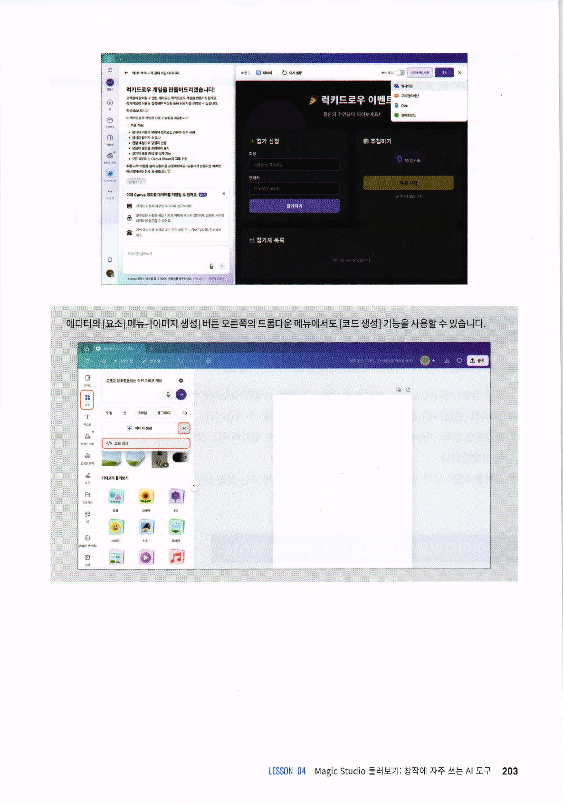

###### m.

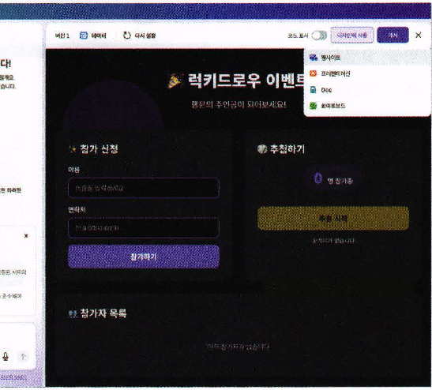

쩐

=- +- 빽리"． 고••어사일마야rnt

고.,.....입는....는•n도를무가••던....,,._

리 니

®‘

·기자1이어••"".., g•••신... .

eg

....할＇H ，，

어터＂드••""e머’,••••a합니더

푸• 기.

- • 현｀씨 .....U튼••기신.

•

•

- •달‘ 게볼시

@낱 • •가지 ""•

. ....."'eC·갑"＇예지.지.

• • - ~ 혀 일.......嵐••, 일••,,.훨타협 麟려혈

각. r

,"

.,빼 Omm코드를',0ki. OS

텝 언.t시"""..鼠'혜홉'"g

a ... ..~••, ...라도"""

근•••어2

솔 .R~-····""··••또는,,.,펙j•••떠

。 •.,의•• .기

n

0·흑. A• 빽쉬,’` •

.

###### |

(]

고라리 상息적.S횟논 리미 드홀우 게임 。

”

@ e

더 90

· '.+'0101지생성

도혈 선 프업 E >

T

®*

·함-", ( </) )

。

.見••

‘ 카따고리틀러보가

g~ -

도구

~l ~,-1

m ..e .... I • '- 1

드. 그•• 30

g

색머 시. 量빼혈

” u.아·

###### @ 툐I 0 1 n1

LESSON 04 Magic Studio 둘러보기: 장작에 자주 쓰는 Al 도구 203

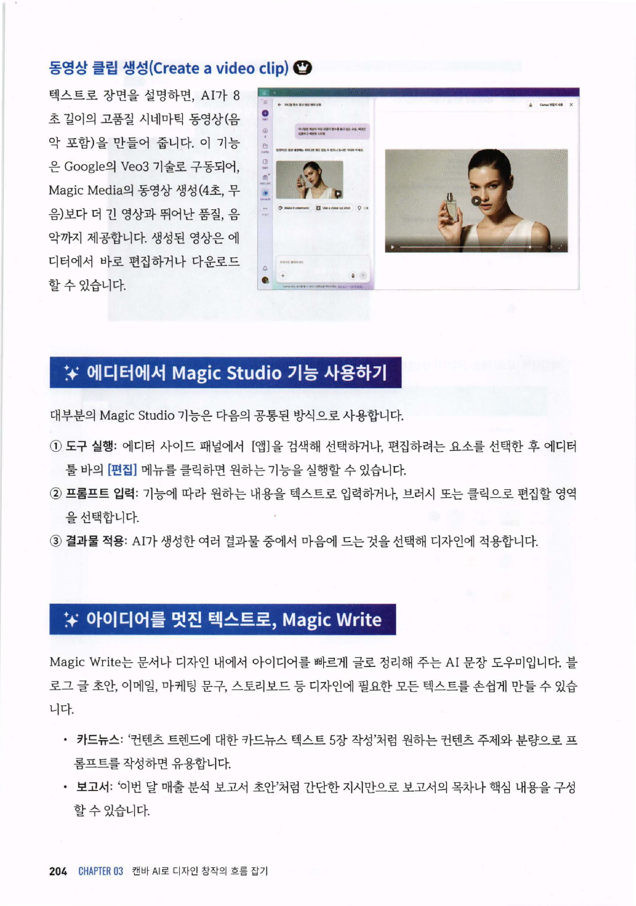

###### 동영상 클립 생성(Create a video clip) 0

###### •

###### ................

텍스트로 장면을 설명하면, AI가 8

쇼 0-" ... x

초 길이의 고품질 시네마틱 동영상(음

......,2-···.........고電E.._

악 포함)을 만들어 줍니댜 이 기능

.." .........,1L·...‘........기暴

e,

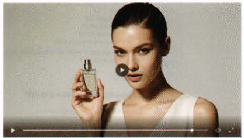

I]

은 Google의 Veo3 기술로 구동되어, Magic Media의 동영상 생성 (4초, 무

###### ... <>-•- Cl-•-- 9 >

움)보다 더 긴 영상과 뛰어난 품질, 음

악까지 제공합니다. 생성된 영상은 에 디터에서 바로 편집하거나 다운로드

C·

+

할수있습니다.

###### | |

대부분의 Magic Studio 기능은 다음의 공통된 방식으로 사용합니댜

® 도구 실행: 에디터 사이드 패널에서 [앱]을 검색해 선택하거나, 편집하려는 요소를 선택한 후 에디터

툴 바의 메뉴를 클릭하면 원하는 기능을 실행할 수 있습니다.

® 프롬프트 입력: 기능에 따라 원하는 내용을 텍스트로 입력하거나, 브러시 또는 클릭으로 편집할 영역

울선택합니다.

® 결과물 적용: AI가 생성한 여러 결과물 중에서 마음에 드는 것을 선택해 디자인에 적용합니다.

###### :-f 를 Magic I

Magic Write는 문서나 디자인 내에서 아이디어를 빠르게 글로 정리해 주는 AI 문장 도우미입니다. 블

###### 로그 글 초안, 이메일, 마케팅 문구, 스토리보드 등 디자인에 필요한 모든 텍스트를 손쉽게 만들 수 있습

니댜

- • 카드뉴스: ‘컨텐츠 트렌드에 대한 카드뉴스 텍스트 5장 작성'처럼 원하는 컨텐츠 주제와 분량으로 프 롬프트를 작성하면 유용합니댜
- • 보고서: ‘이번 달매출분석 보고서 초안'처럼 간단한지시만으로보고서의 목차나핵심 내용을구성 할수있습니다.

204 CHAPTER 03 캔바 Al로 디자인 장작의 흐름 잡기

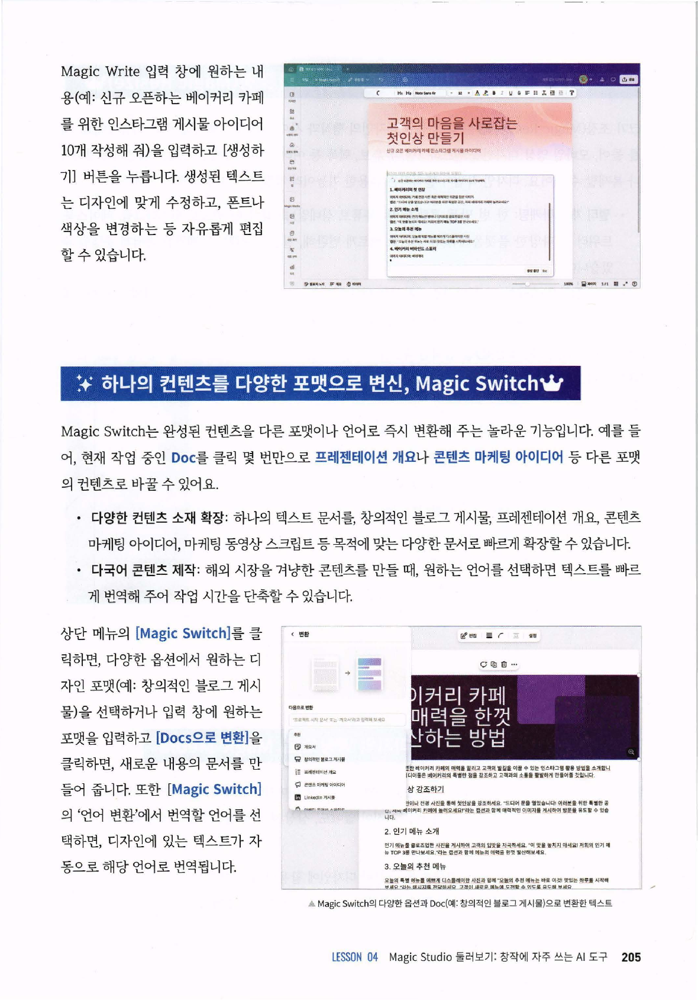

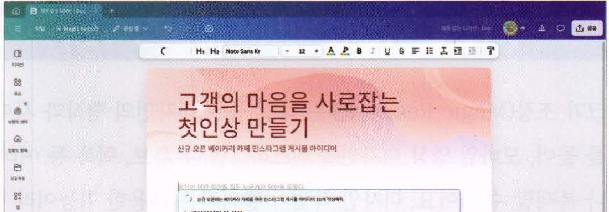

Magic Write 입력 창에 원하는 내

용(예: 신규오픈하는베이커리 카페

를 위한 인스타그램 게시물 아이디어

10개 작성해 줘)을 입력하고 [생성하

신규 빼이커리키빼 게서를OIOIao

’...-.........下.N-"｀...

I - 노 一 -

기] 버튼을 누릅니다. 생성된 텍스트 는 디자인에 맞게 수정하고, 폰트나

L

'L ＿a

###### 뉴;-

••--..--··........ ，'"＇,_.行*

###### ....ff`...--".."""C4”...,

2 엽기 ....소

••••--·.......

###### 색상을 변경하는 등 자유롭게 편집

###### ··

。

-""'"' ............"-'’'"...

릴O» 嶋量""t....nm [..._

4

할수있습니다.

"＂며＂미7m·-L ’

빼”`’

|‘- ,,'"~-

" .. ”

"m 딜-" "1 露 •• 。

###### | Magi |

###### Magic Switch는 완성된 컨텐츠올 다른 포맷이나 언어로 즉시 변환해 주는 놀라운 기능입니다. 예를 들

어, 현재 작업 중인 를 클릭 몇 번만으로 개요나 아이디어 등 다른 포맷 의 컨텐츠로 바꿀 수 있어요.

다양한 컨텐츠 소재 확장: 하나의 텍스트 문서를, 창의적인 블로그 게시물; 프레젠테이션 개요, 콘텐츠

###### 마케팅 아이디어, 마케팅 동영상 스크립트 등 목적에 맞는 다양한 문서로 빠르게 확장할 수 있습니다.

다국어 콘텐츠 제작: 해외 시장을 겨냥한 콘텐츠를 만들 때, 원하는 언어를 선택하면 텍스트를 빠르 게 번역해 주어 작업 시간을 단축할 수 있습니다.

연따 =r ..

상단 메뉴의 [Magic Switch]를 클 릭하면, 다양한 옵션에서 원하는 디 자인 포맷(예: 창의적인 블로그 게시 물)을 선택하거나 입력 창에 원하는 포맷을 입력하고 [Docs으로 을

( 변환

###### ➔ 트

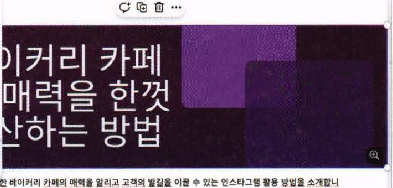

다2.11 면활

###### ..

•I.』·^ 또느게요•괴고압·-~....

0 게오서

’U•灣언.墨그자시.

l른~"'．m서^=.,.

클릭하면, 새로운 내용의 문서를 만

튼힌 데이커리 ’"'외 데혀를 릴리고 고디의 발길를 01를 수 있는 언스타그릴 촬응 소게합니

I三 m빼던어01선不

'디어를은 베이커리외 昌｀한 절‘ 강조하고 고객과의 스틀을 Ill터게 I'!1어를

O 른면츠’"'밀 中口어

들어 줍니댜 또한 [Magic Switch]

###### 상강조하기

園 Un"'In~•

던이나 전경 사진을 틀뻬 첫I'!싱I 강조텨세요. E드디어 툰1'I었e니댜 여러튼을 튀힌 ·뺄한 공

"· 시.. 데이커리 키뻬에 ·러오세Rr라는 g선과 형뻬 때력적인 밍은을 유도· 수 있e

의 ‘언어 변환'에서 번역할 언어 를 선 택하면, 디자인에 있는 텍스트가 자 동으로 해당 언어로 번역됩니다.

니다.

###### 2. 인기 메뉴 소개

인기 대뉴••로즈업한 시진을 게시하여 고 자국하세요. ·01맛. 저희의 인기 뻬 뉴 TOP 만나보세요.•라는 g션과 혈째 매력을 현껏 II신데보세요

###### 3. 오늘의 주전 메뉴

오量외 ·뺄 빼뉴를 대!!게 II뻬 ·오틀외 후신 바皇 어것! 뺏있는 허阜틀 시라뻬

.!1R:라노 시지. Q ,러OIA"므s_빼..에 C저11순,l5-．GC· ·세P

.6. Magic Switch의 다양한 옵션과 Doc(예: 창의적인 블로그 게시울)으로 변환한 텍스트

Magic Studio 둘러보기: 장작에 자주 쓰는 Al 도구 205

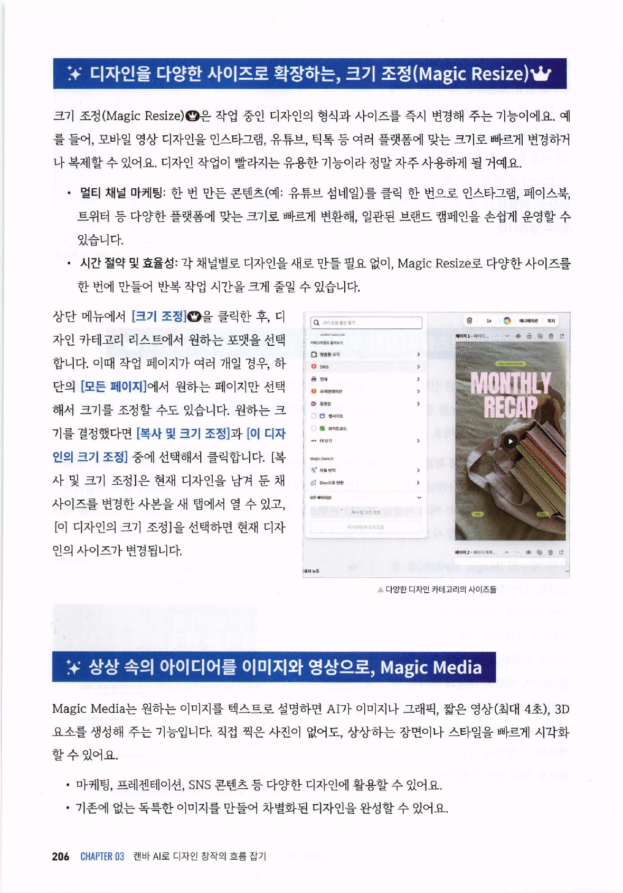

크기 조정 (Magic Resize)~즌 작업 중인 디자인의 형식과 사이즈를 즉시 변경해 주는 기능이에요. 예

를 들어, 모바일 영상 디자인을 인스타그램, 유튜브, 틱독 등 여러 플랫폼에 맞는 크기로 B바르게 변경하거

- 나 복제할 수 있어요. 디자인 작업이 빨라지는 유용한 기능이라 정말 자주 사용하게 될 거예요.

멀티 채널 마케탕 한 번 만든 콘텐츠(예: 유튜브 섬네일)를 클릭 한 번으로 인스타그램, 페이스북,

트위터 등 다양한 플랫폼에 맞는 크기로 빠르게 변환해, 일관된 브렌드 캠페인을 손쉽게 운영할 수

있습니댜

시간 절약 및 효율성: 각 채널별로 디자인을 새로 만들 필요 없이, Magic Resize로 다양한 사이즈를 한 번에 만들어 반복 작업 시간을 크게 줄일 수 있습니다.

상단 메뉴에서 [크기 CHt 클릭한 후, 디

- 자인 카테고리 리스트에서 원하는 포맷을 선택 합니댜 이때 작업 페이지가 여러 개일 경우, 하 단의 [모든 페이지]에서 원하는 페이지만 선택 해서 크기를 조정할 수도 있습니다. 원하는 크 기를 결정했다면 및 크기 조정]과 [이 디자

@

_...T··4."a"...

三"

###### L C 대뻑신 따지 ‘

V O iil 0 0 C

·때 1·

°“혈371

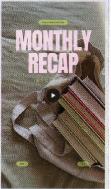

SNS

8 연쇄

0 포대

0·

一 O 혈뺀量

Iii lfOl!C보드

”• 더보

중에 선택해서 클릭합니다. [복

”"＊S여Ch

'I:.. 자틀연역

- 사 및 크기 조정]은 현재 디자인을 남겨 둔 채 사이즈를 변경한 사본을 새 탭에서 열 수 있고,

0:: Do"끄mI!

·른 ,.,,.lm

###### . ., 2·

[이 디자인의 크기 조정]을 선택하면 현재 디자

인의 사이즈가 변경됩니다.

0 ® O 巳

2· 빼µ...

I·巧프

###### 二

다양한 디자인 카테고리의 사이즈들

###### 이미지와영상으로, |

Magic Media는 원하는 이미지를 텍스트로 설명하면 AI가 이미지나 그래픽, 짧은 영상(최대 4초), 3D

요소를 생성해 주는 기능입니댜 직접 찍은 사진이 없어도, 상상하는 장면이나 스타일을 빠르게 시각화

할수있어요.

- • 마케팅, 프레젠테이션, SNS 콘텐츠 등 다양한 디자인에 활용할 수 있어요.
- • 기존에 없는 독특한 이미지를 만들어 차별화된 디자인을 완성할 수 있어요.

206 CHAPTER 03 캔바 Al로 디자인 장작의 흐름 잡기

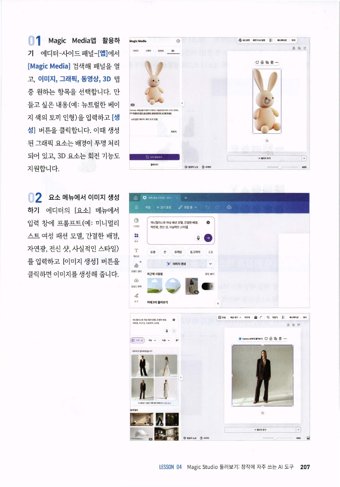

###### 1 Magic Media앱 활용하 u"leM""

。

@301R! Ill!다시.. 父 ·圈기선 ""

iil 0 C

...지 그빼· ‘볼실 X

기 에디터-사이드패널- 에서

oa ® e ···

[Magic Media] 검색해 패널을 열

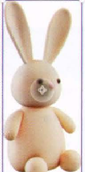

고, 이미지, 그래픽, 30 탭

중 원하는 항목을 선택합니댜 만

들고 싶은 내용(예: 뉴트럴한 베이 IO

U.........뻬 따•S시야mn......,...일.....터p,."

지색의토끼인형)을입력하고 [생 성] 버튼을 클릭합니댜 이때 생성

.................인.

###### `

지

###### 0

된그래픽 요소는배경이 투명 처리 되어 있고, 3D 요소는 회전 기능도 지원합니댜

• 빼미지 .n

...가기

4"

,;.""토 O ....

###### 2 요소메뉴에서 이미지 생성

###### I

- 하기 에디터의 [요소] 메뉴에서 입력 창에 프롬프트(예: 미니멀리 스트 여성 패션 모델, 간결한 배경, 자연광, 전신 샷, 사실적인 스타일) 를 입력하고 [이미지 생성] 버튼을 클릭하면 이미지를생성해 줍니다.

###### e g

이니얼리스트어싱 빼신모일 간결한 뻬겅, 0

###### ...

平’라 전신 싯, 땐적인 스타입

###### 90

소

T

도형 선 프따임 들그라이 묘 》

빽

*'

' OIDl지생싱

춥l

.를C 쉔

오두 보기

。

업量드 ".

&

" 'kE리 틀러보기

@m, ••.,, * ..... =r h 硏m 8 _ ....

빠내를 틀이설........건...... o

a @ c

자 ”신섯,시.,.언 스타혈

C

~"'게....,, 。 iii ~ a •··

G 뻬일 V 뻬IV 硏

야기

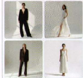

터 " •• ....묘 어,.,

겁색혈•

###### ’’

.....지"

7·量지노. 。” .... a

###### LESSON 04 Magic Studio 둘러보기: 장작에 자주 쓰는 Al 도구 207

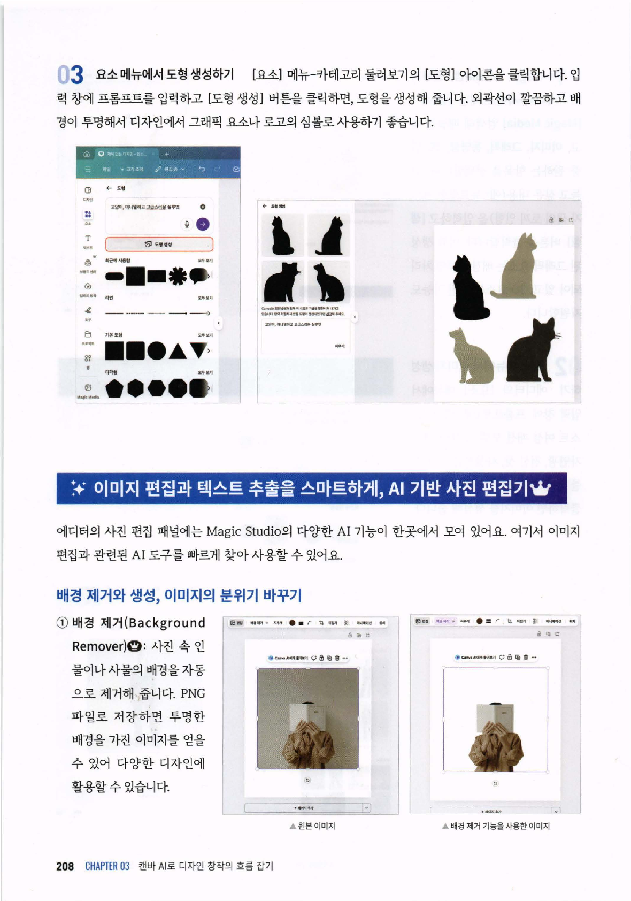

3 요소메뉴에서도형생성하기 [요소] 메뉴-카테고리 둘러보기의 [도형] 아이콘을클릭합니댜입

력 창에 프롬프트를 입력하고 [도형 생성] 버튼을 클릭하면, 도형을 생성해 줍니다. 외곽선이 깔끔하고 배

경이 투명해서 디자인에서 그래픽 요소나로고의 심볼로사용하기 좋습니다.

`i ‘ ——

0. "

4'

‘、

(]g e " "" a

고달, 더니혈빼고 살.옛

n

a © C

) 5

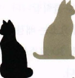

5) 도."

###### .:..:~---·

i_t

、

"드•• 'It!

오• .,,

###### ‘됴구

###### .-·~.. , ,)

|」

###### ....

e

기븐도11 으.""

###### ■■•~~》

...,,

租

다

오•도기

g_

###### | :-+: A1 편집 |

에디터의 사진 편집 패널에는 Magic Studio의 다양한 AI 기능이 한곳에서 모여 있어요. 여기서 이미지 편집과 관련된 AI 도구를 빠르게 찾아 사용할 수 있어요.

二a11tC

###### 생성, 이미지의 바꾸기

언.. ....,,•따 : r t. ••• l: - ..

언" """• 따~ • : r ~ ."" 효 `~" ..

® 배경 제거(Background Remover)(): 사진 속 인

###### a`C

~"-ciilll!lS ···

.

###### 물이나사물의 배경을자동

으로 제거해 줍니댜 PNG

파일로 저장하면 투명한 배경을 가진 이미지를 얻을

수 있어 다양한 디자인에

。

활용할수있습니다.

。

###### ·...... 노

.+.원본이미지 ^배경제거 기능을사용한이미지

208 CHAPTER 03 캔바 Al로 디자인 장작의 흐름 잡기

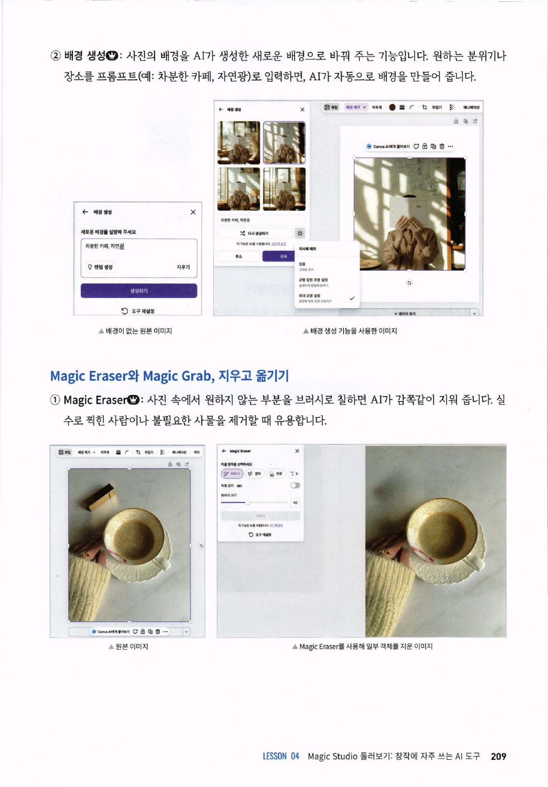

® 배경 생성O: 사진의 배경을 AI가 생성한 새로운 배경으로 바꿔 주는 기능입니다. 원하는 분위기나

장소를 프롬프트(예: 차분한 카페, 자연광)로 입력하면, AI가 자동으로 배경을 만들어 줍니다.

###### •= r n 튀틸기

>

e x @마릴

빼경빼거 * 지"

###### a c |

혜d

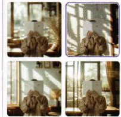

###### ~w."'＂尸,.,1 0 m~ G ···

€ 배경생성 X

-

서틀인키`자를

쌌

새토운 주세요

X 다시"빼기

`

,........묘 헉｀규류

차툰한카페, 자연길

- O도구재설정

힐I 편 •n

Q 민업생성 지우?I

()

·제-··'

획이조

........,...,

V '

♦ | v '

•

~ 배경생성기능을사용한이 미지

^ 배경이없는원본이미지

Magic Eraser와 Magic Grab, 지우고 옮기기

CD Magic Eraser(): 사진 속에서 원하지 않는 부분을 브러시로 칠하면 AI가 감쪽같이 지워 줍니다. 실

수로 찍힌 사람이나 불필요한 사물을 제거할 때 유용합니다.

*

###### ,;:-...,..,=---x

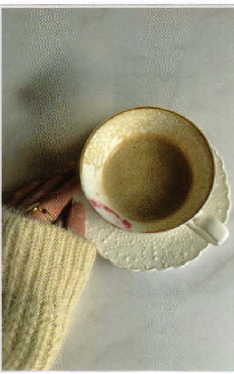

.....아8 나

빼볼`거 W 지.,, iiii r a 따y,

###### e’

a o c

지. ....

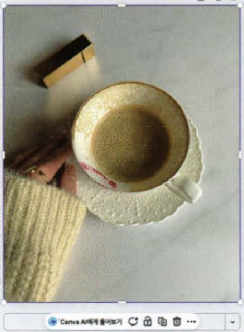

@곤) V ·리

0 건•

....지 ..

·려시크기

40

"',......j.C도円'....

로구 타

’’

...원본이미지 .t. Magic Eraser를 사용해 일부 객체를 지운 이미지

04 Magic Studio 둘러보기: 장작에 자주 쓰는 Al 도구 209

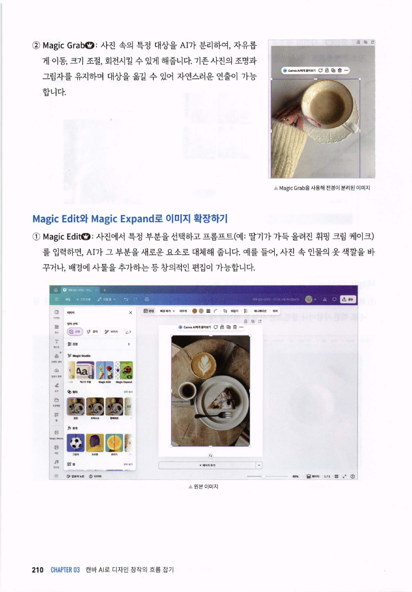

CID- ~- 1!

@ Magic GrabO: 사진 속의 특정 대상을 AI가 분리하여, 자유롭 계 이동 크기 조절, 회전시킬 수 있게 해줍니다. 기존 사진의 조명과

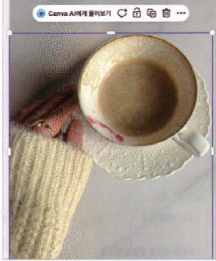

###### 그림자를 유지하며 대상을 옮길 수 있어 자연스러운 연출이 가능

합니다.

Magic Grab을 사용해 전경이 분리된 이미지

###### Magic Edit와 Magic Expand로 이미지 확장하기

G) Magic Edit(): 사진에서 특정 부분을 선택하고 프롬프트(예: 딸기가 가득 올려진 휘핑 크림 케이크) 를 입력하면, AI가 그 부분을 새로운 요소로 대체해 줍니댜 예를 들어, 사진 속 인물의 옷 색깔을 바 꾸거나, 배경에 사물을 추가하는 등 창의적인 편집이 가능합니다.

| O 1 m|

@" "C* 지" • • =r 다 위립기 X `신 硏

###### x

(ll 磁.q

a C

q*

~"""齡모기 c a © @ ...

빨핵선.

... ) 던 •틱 '/l!려시 o )

器

.:~--

…T 主쪼혈

.....

4 .. ｀포.. "'... " ...... ” e 롤터

모• .,,

e,

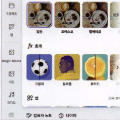

###### m··

###### - .요. ..,. "

꾼`’ 요." ·빼어지"

7II鳳지막 Oq .... liil...i지 1/1 認 .” ®

~ 원본이미지

210 캔바 Al로 디자인 장작의 흐름 잡기

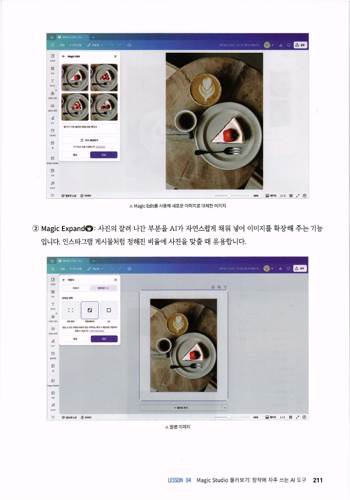

0 1 m|

qOl +- - .... X

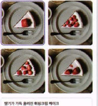

器

T 3

###### ...@

###### .....

쓰"

e

m ..

X q시"..기

怨`

“소

Ei

###### ”"."O

g

n g

尹 ."＇피, 악뻔 .... Iii! ...1.q 1/ 1 •• ®

Magic Edit를 사용해 새로운 이미지로 대제한 이 미지

@ Magic Expand(): 사진의 잘려 나간 부분을 AI가 자연스럽게 채워 넣어 이미지를 확장해 주는 기능

입니다. 인스타그램 게시물처럼 정해진 비율에 사진을 맞출 때 유용합니댜

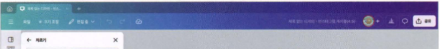

###### .* a o c

###### ..않

###### ....‘ :: G 。

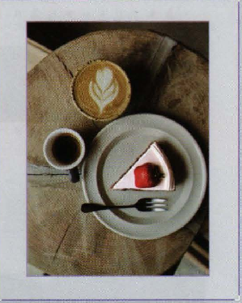

뻔 빼

T

`.

..... 어지 m

·글.......릅빼．이靈는이mIt·`시뻬硏`.“”지

。

·量드••

###### ＂소 -

4

도구

###### "..

e

舒

Ci

"`*“•••

8g1

###### l;· “”꼬 0印I어

♦

###### . "% 1ii1 印치 1/ l gg . " ®

~ 원본 이미지

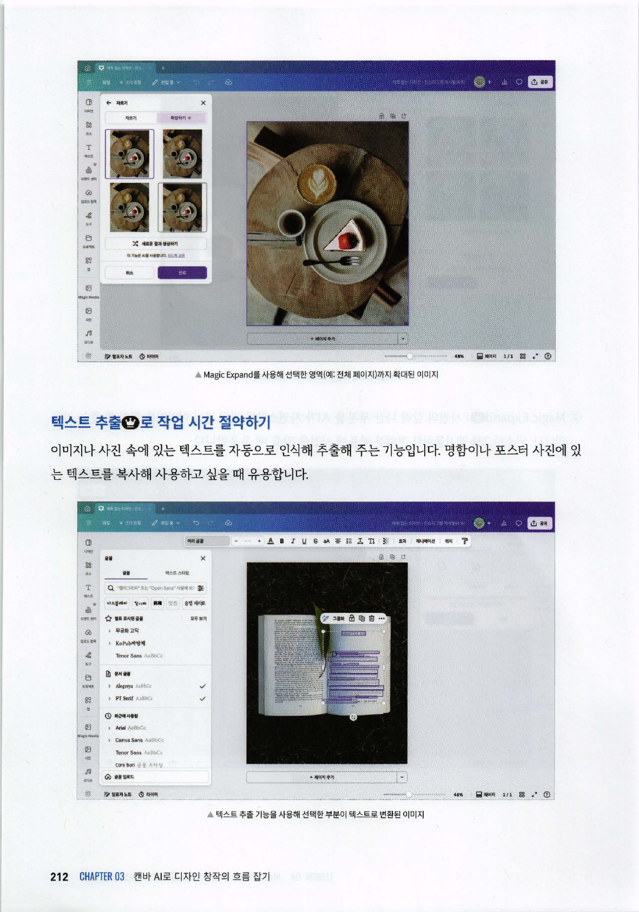

I;o;.. ~ =

(] + 지"

X

확"'I.. a C

”빡현

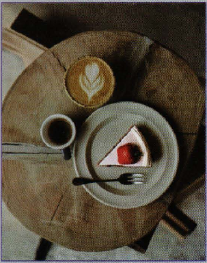

認

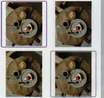

”

T

.....`‘

###### .....G:i

4 "

~ -

###### ....e!

X 峰홑

怨뗄

혈기"“1사‘`모 -.빽‘’

I g

"래k”••

e g

n g

.。 .... 1/1 認 ." ®

• Magic Expand를 사용해 선택한 영역(예: 전제 페이지)까지 확대된 이미지

###### 로 작업 시간 절약하기

###### 이미지나 사진 속에 있는 텍스트를 자동으로 인식해 추출해 주는 기능입니다. 명함이나 포스터 사진에 있 는 텍스트를 복사해 사용하고 싶을 때 유용합니다.

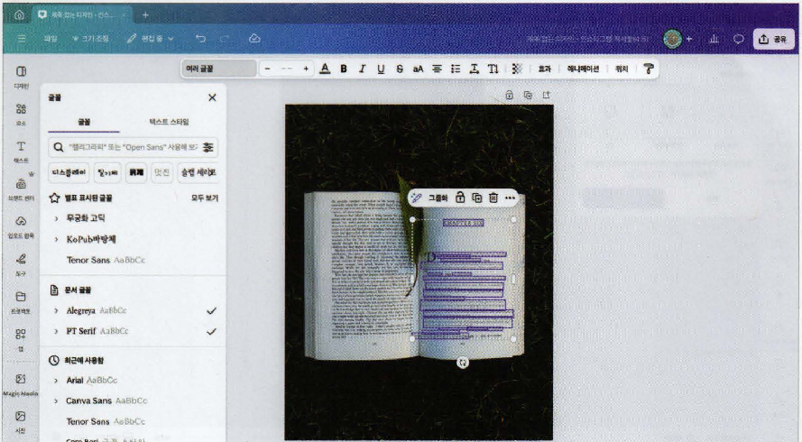

g00

a

＂스마일

T

Q ._ • ·o..-,s.,.-사 "-

###### ..........`‘。

,．리 일.,.. m 낫츠 t'II...묘

白"""" 모투~

» 무궁타고디

>

4 g

ns.

###### e B""

".. > Alet..,.. '· ' ✓

8? ' PT幻f A나江 ✓

옐

1--g ,>can"홑^^·BHrSns^.ibCc

o·간""

@ Tenor Sons A.a&기 :(.

땔

CoreBor1 ｀스 입

n

_ ’"'「 －――下!

O 머"'또

·리

"` iii1 1/1 gg •• (!)

지

~ 텍스트 주줄 기능을 사용해 선택한 부분이 텍스트로 변환된 이미지

212 캔바 A|로 디자인 장작의 흐름 잡기

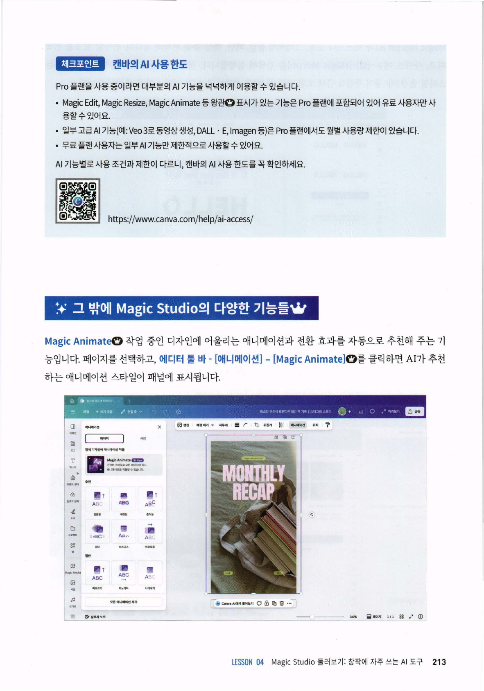

- Al

Pro 사용 중이라면 대부분의 A| 기능을 넉넉하게 수 있습니다.

- • Magic Edit, Magic Resize, Magic Animate 등 표시가 있는 기능은 Pro 사용자만 사 용할수있어요.
- • 일부고급Al 기능(예:Veo3로동영상생성,DALL · E,Imagen Pro 플랜에서도월별사용량제한이 있습니다.
- • 일부A| 사용할 수 있어요. Al 사용 조건과 다르니, 캔바의 Al 사용 꼭

https://www.canva.com/help/ai-access/

###### | :_.: 밖에 Magie |

Magic AnimateO 작업 중인 디자인에 어울리는 애니메이션과 전환 효과를 자동으로 추천해 주는 기 능입니다. 페이지를 선택하고, 에디터 툴 바 - ［ - [Magic Animate]~문 클릭하면 AI가 추천

하는 애니메이션 스타일이 패널에 표시됩니다.

1 N,＇＇어·0·,•.,. {·뉴 』 니 ••" 'I

x 구·

CB:aT3*©i

x @턴릴

뻬...거 .. 지우', 글 r 다 血밉기

###### [ …)

- - 떠 &L+

서

q자언에 나빼여신 빼.

M....Nt•

.'”..스"·연••••·••.".·어 시

*

###### AeG

###### .....

T

F

ABC

Ar

4 "

..,.

‘•·

()

·거.

e,

"..

m ..

• ARr

AB

###### ...

院·

수

###### 푈

曺만

e

###### `

###### ..一..,

- T

.嶋K 由a

gg

###### AP

ABC

빼..,

나

n g 모른 빼거 ~"^＇데配lmI 0 a ® @ ...

컵*료지노. 3% liil1101치 1/1 諒 •• ®

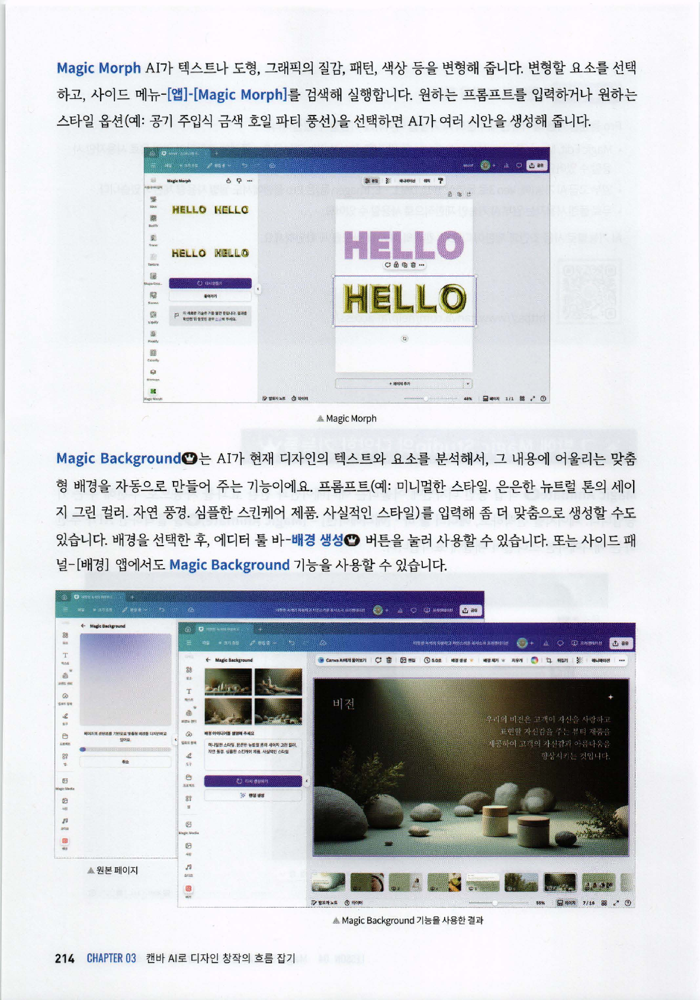

###### Magic Morph AI가 텍스트나 도형, 그래픽의 질감, 패턴, 색상 등을 변형해 줍니댜 변형할 요소를 선택

하고, 사이드 메뉴-［ ]-［Magic Morph]를 검색해 실행합니댜 원하는 프롬프트를 입력하거나 원하는 스타일 옵션(예: 공기 주입식 금색 호일 파티 풍선)을 선택하면 AI가 여러 시안을 생성해 줍니다.

##### I",,,•m-- ' k' o m|

스 ? ... § ..""'d .. 'I'

a 딸 C

###### •-

HELL!)

KELLC

###### 。

###### HE

l-Jr.

·-

£

H 詩Ell.L©

l·g0-ot0_DIO-

###### ..."'

p .......•嶋••""..""`"'..

~. • 후

###### "

··어..

"

-

7·m끄 "' II •• (!)

• Magic Morph

Magic O는 AI가 현재 디자인의 텍스트와 요소를 분석해서, 그 내용에 어울리는 맞춤

형 배경을 자동으로 만들어 주는 기능이에요. 프롬프트(예: 미니멀한 스타일. 은은한 뉴트럴 톤의 세이

지 그린 컬러. 자연 풍경. 심플한 스킨케어 제품. 사실적인 스타일)를 입력해 좀 더 맞춤으로 생성할 수도

있습니다. 배경을 선택한 후, 에디터 툴 바- O 버튼을 눌러 사용할 수 있습니다. 또는 사이드 패

널-［배경] 앱에서도 Magic Background 기능을 사용할 수 있습니다.

###### | ~. , ·」 • ._

###### a"Tg+-""

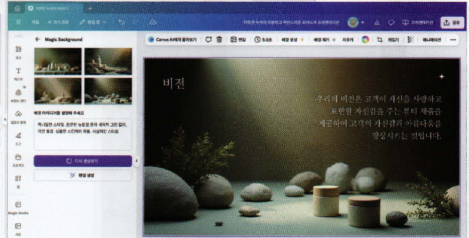

鷄

••

UTi.

t0i4"0i?

###### 龜i0i&"요?

’

빼1 이

빼미’ .튼 ,_. ... ......

었

###### •

=미 ee• ••• • 혈러

지e•• •••스-••서 적혈

} -

«소

e

Ogng

:~ 륄혈쉘설

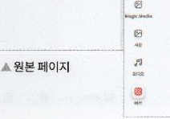

.

갑 .a.M(!)"'"agicBackground기능을사용한결과 '"-프.」

·

214

캔 바 Al 로 디 자인 장작의 흐름 잡기

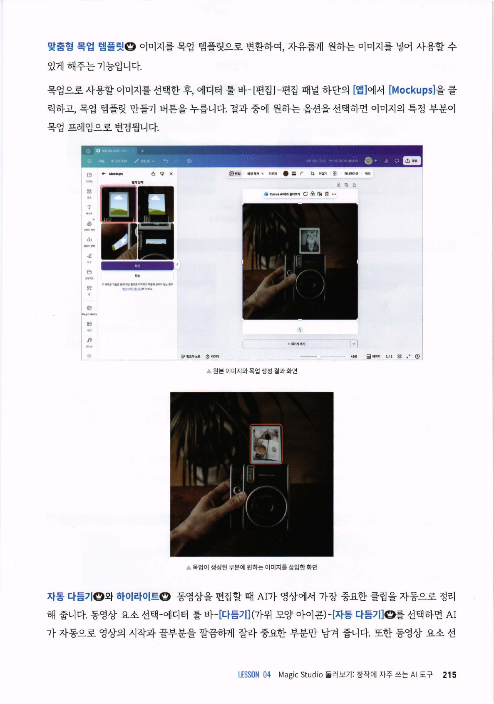

이미지롤 목업 템플릿으로 변환하여, 자유롭게 원하는 이미지를 넣어 사용할 수 있게 해주는 기능입니다.

###### 목업으로사용할이미지를선택한후, 에디터 툴바-［편집]－편집 패널 하단의 에서 을클

###### 릭하고, 목업 템플릿 만들기 버튼을 누릅니다. 결과 중에 원하는 옵션을 선택하면 이미지의 특정 부분이

목업 프레임으로 변경됩니댜

낱도:"～." 0 " '|

###### .....Gi ..M- 0 ? x

@른릴 "m• 따.. =r q ""기 %· - ...

.. ”-선.

a o e

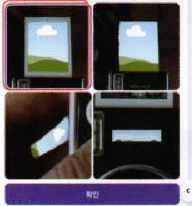

###### ~""".....,, 。 m~ t1ll •••

T

蟲·

’른' ·

###### .....。

4

###### .... “소

e,

OI嶋""em峰 .....印•E.,

8'/ ..- 11.::.•.....

###### -e....

###### O

때

"

n

• .기

..,. liil 빼OI지 1/1 88 .鼻 ®

” 털m"노. 。 印

원본이미지와목업 생성 결과화면

옥업이 생성된 부분에 원하는 이미지를 삽입한 화연

자동 다듬기O와 하이라이트O 동영상을 편집할 때 AI가 영상에서 가장 중요한 클립을 자동으로 정리

###### 해 줍니다. 동영상 요소 선택-에디터 툴 바-［다듬기]（가위 모양 아이콘)- 다듬기]CH충 선택하면 AI

- 가 자동으로 영상의 시작과 끝부분을 깔끔하게 잘라 중요한 부분만 남겨 줍니다. 또한 동영상 요소 선

LESSON 04 Magic Studio 둘러보기: 장작에 자주 쓰는 Al 도구 215

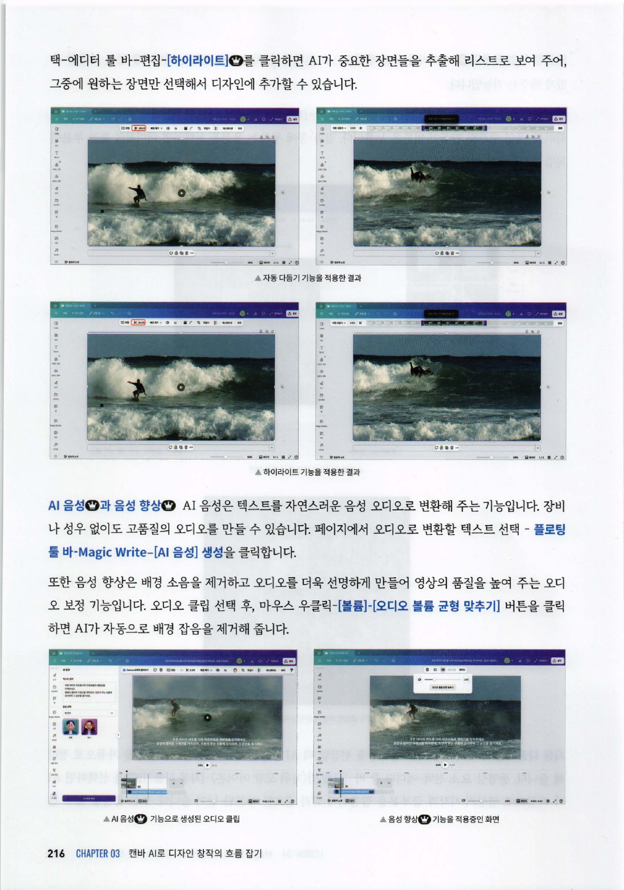

택-에디터 툴 바_편집_ 클릭하면 AI가 중요한 장면들을 추출해 리스트로 보여 주어, 그중에 원하는 장면만 선택해서 디자인에 추가할 수 있습니다.

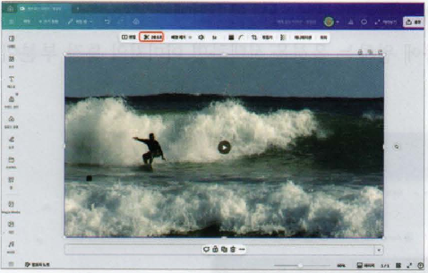

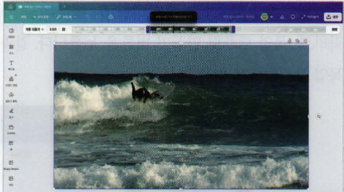

•

Tg.ie5

.-

·i

壘

~4s0[O.

‘ "e-

••

＂－

Ltiti.n-

II.

·-u

-.,_"'.,'..

··”

＂－

oa •• -

- o- "' ._..

...자동 다듬기 기능을 적용한 결과

###### m|

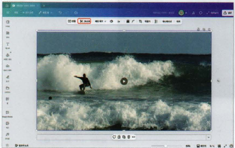

o-·aTt·

”

e-·-T"

###### .

.• iai4"e-

ie~4"e-

###### ..

"

###### _ _

·0l0"2

"~o-n-

·-

°‘...-

,· 2

- '" • ,• II>

^ 하이라이트기능을적용한결과

Al 과 0 AI 음성은 텍스트를 자연스러운 음성 오디오로 변환해 주는 기능입니다. 장비

- 나 성우 없이도 고품질의 오디오를 만들 수 있습니다. 페이지에서 오디오로 변환할 텍스트 선택 바-Magic Write-[AI 을 클릭합니다.

또한 음성 향상은 배경 소음을 제거하고 오디오를 더욱 선명하게 만들어 영상의 품질을 높여 주는 오디 오 보정 기능입니다. 오디오 클립 선택 후, 마우스 우클릭- 버튼을 클릭

- 하면 AI가 자동으로 배경 잡음을 제거해 줍니다.

###### 广._-: ,_ ... . .. m|

|..

‘ .”

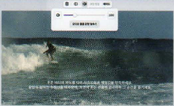

‘"e-

덟

###### -o鬱 =-----------

"

, ,.,

. ""

'0to-

>----.e -

"

i

###### -•“

-·-·tTi

도二드론드도격훈

..•

뺄

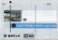

- 1- ·-"··

•• ‘i

·t

'3

e ”

- a- _,u, ■ .• CD

- ‘-'-_,"' " '. o

AAI음성 기능으로생성된오디오클립 ^응성향상《，기능을적용중인화면

캔바 Al로 디자인 장작의 흐름 잡기

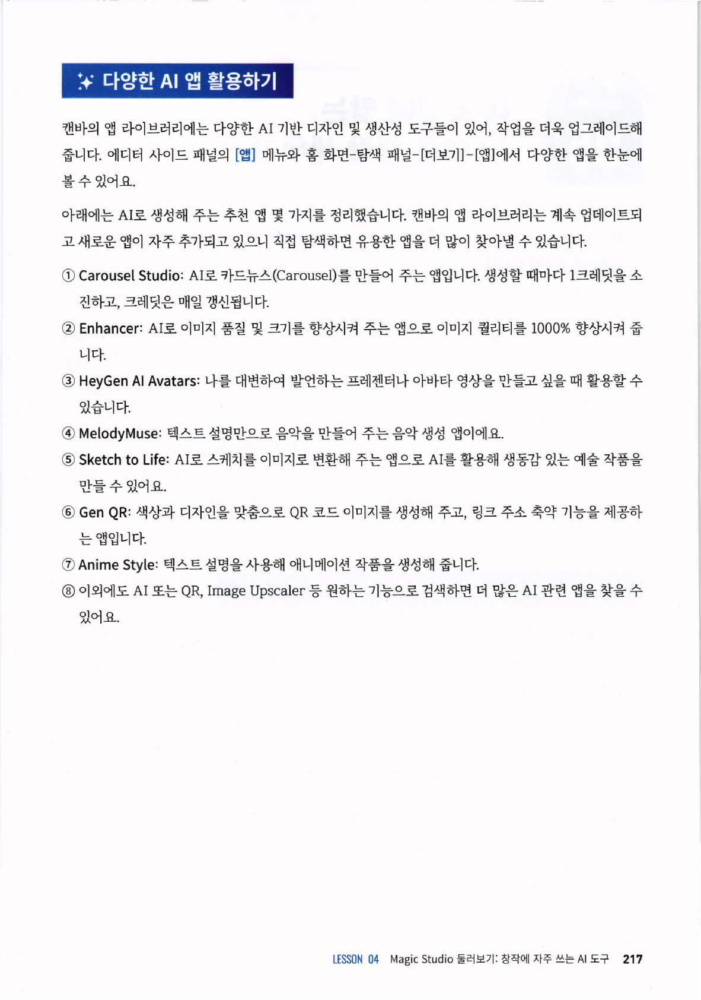

###### | 앱

캔바의 앱 라이브러리에는 다양한 AI 기반 디자인 및 생산성 도구들이 있어, 작업을 더욱 업그레이드해

줍니다. 에디터 사이드 패널의 [ 메뉴와 홈 화면-탐색 패널-［더보기]_[앱]에서 다양한 앱울 한눈에

볼수있어요.

아래에는 AI로 생성해 주는 추천 앱 몇 가지를 정리했습니댜 캔바의 앱 라이브러리는 계속 업데이트되

###### 고 새로운 앱이 자주 추가되고 있으니 직접 탐색하면 유용한 앱을 더 많이 찾아낼 수 있습니다.

G) Carousel Studio: AI로 카드뉴스(Carousel)를 만들어 주는 앱입니다. 생성할 때마다 1크레딧을 소

###### 진하고, 크레딧은 매일 갱신됩니다.

@ Enhancer: AI로 이미지 품질 및 크기를 향상시켜 주는 앱으로 이미지 퀄리티를 1000% 향상시켜 줍

니다.

@ HeyGen Al Avatars: 나를 대변하여 발언하는 프레젠터나 아바타 영상을 만들고 싶을 때 활용할 수

있습니다. @ MelodyMuse: 텍스트 설명만으로 음악을 만들어 주는 음악 생성 앱이에요. @ Sketch to Life: AI로 스케치를 이미지로 변환해 주는 앱으로 AI를 활용해 생동감 있는 예술 작품을

만들수있어요.

###### ® Gen QR: 색상과 디자인을 맞춤으로 QR 코드 이미지를 생성해 주고, 링크 주소 축약 기능을 제공하

는앱입니댜 (i) Anime Style: 텍스트 설명을 사용해 애니메이션 작품을 생성해 줍니다. ® 이외에도 AI 또는 QR, Image Upscaler 등 원하는기능으로검색하면 더 많은 AI 관련 앱을 찾을 수

있어요.

LESSON 04 Magic Studio 둘러보기: 장작에 자주 쓰는 A| 도구 217

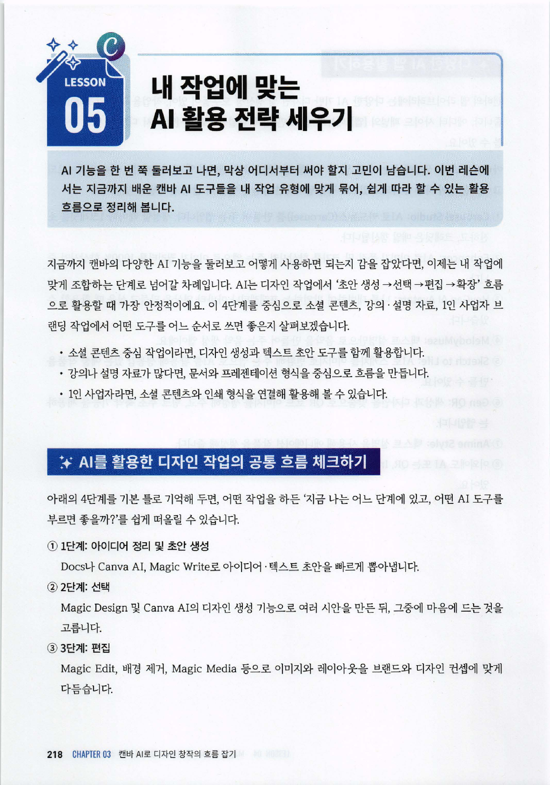

###### 내작업에맞는 Al

###### Al 쭉 들러보고 나면, 막상 어디서부터 써야 고민이 남습니다. 이번 서는 Al 작업 묶어, 할 수

지금까지 캔바의 다양한 AI 기능을 둘러보고 어떻게 사용하면 되는지 감을 잡았다면, 이제는 내 작업에

맞게 조합하는 단계로 넘어갈 차례입니댜 AI는 디자인 작업에서 ‘초안 생성 一선택 一편집 一확장’ 흐름

으로 활용할 때 가장 안정적이에요. 이 4단계를 중심으로 소셜 콘텐츠, 강의 · 설명 자료, 1인 사업자 브 랜딩 작업에서 어떤 도구를 어느 순서로 쓰면 좋은지 살펴보겠습니다.

- • 소셜 콘텐츠 중심 작업이라면, 디자인 생성과 텍스트 초안 도구를 함께 활용합니다.
- • 강의나 설명 자료가 많다면, 문서와 프레젠테이션 형식을 중심으로 흐름을 만듭니다.
- • 1인 사업자라면, 소셜 콘텐츠와 인쇄 형식을 연결해 활용해 볼 수 있습니다.

###### I |

아래의 4단계를 기본 틀로 기억해 두면, 어떤 작업을 하든 ‘지금 나는 어느 단계에 있고, 어떤 AI 도구를 부르면 좋을까?'를 쉽게 떠올릴 수 있습니다. ® 1단계: 아이디어 정리 및 초안 생성

Docs나 Canva AI, Magic Write로 아이디어 택스트 초안을 빠르게 뽑아냅니다. @ 2단계: 선택

Magic Design 및 Canva AI의 디자인 생성 기능으로 여러 시안을 만든 뒤, 그중에 마음에 드는 것을

고릅니댜

- ® 3단계: 편집 Magic Edit, 배경 제거, Magic Media 등으로 이미지와 레이아웃을 브랜드와 디자인 컨셉에 맞게 다듬습니댜

218 캔바 Al로 디자인 장작의 흐 잡기

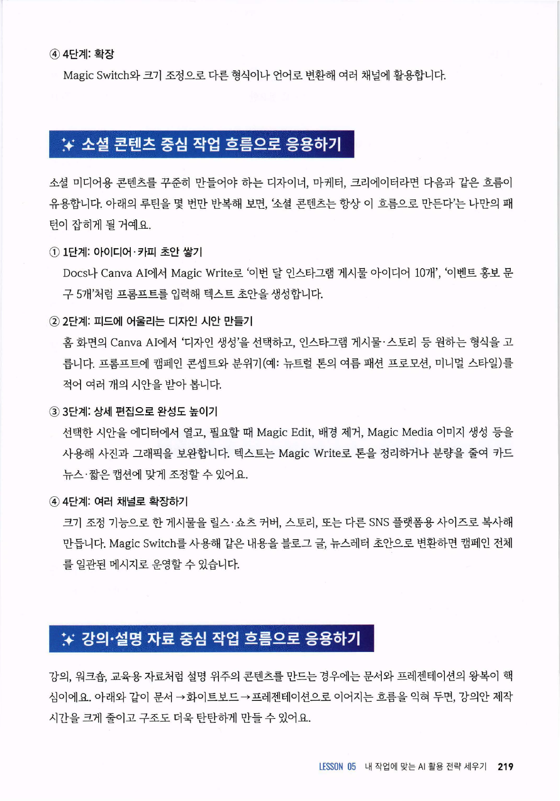

- ® 4단계:확장 Magic Switch와 크기 조정으로 다른 형식이나 언어로 변환해 여러 채널에 활용합니다.

###### |

소셜 미디어용 콘텐츠를 꾸준히 만들어야 하는 디자이너, 마케터, 크리에이터라면 다음과 같은 흐름이

유용합니댜 아래의 루틴을 몇 번만 반복해 보면, ‘소셜 콘텐츠는 항상 이 흐름으로 만든다'는 나만의 패 턴이 잡히게 될거예요.

® 1단계: 아이디아 카피 초안 쌓기

Docs나 Canva AI에서 Magic Write로 ‘이번 달 인스타그램 게시물 아이디어 10개', ‘이벤트 홍보 문

구 5개 '처럼 프롬프트를 입력해 텍스트 초안을 생성합니다.

@ 2단계: 피드에 어울리는 디자인 시안 만들기

홈 화면의 Canva AI에서 ‘디자인 생성’을 선택하고, 인스타그램 게시물 · 스토리 등 원하는 형식을 고

###### 릅니다. 프롬프트에 캠페인 콘셉트와 분위기(예: 뉴트럴 톤의 여름 패션 프로모션, 미니멀 스타일)를

적어 여러 개의 시안을 받아 봅니다.

- ® 3단계: 상세 편집으로 완성도 높이기 선택한 시안을 에디터에서 열고, 필요할 때 Magic Edit, 배경 제거, Magic Media 이미지 생성 등을 사용해 사진과 그래픽을 보완합니다. 텍스트는 Magic Write로 톤을 정리하거나 분량을 줄여 카드 뉴스 · 짧은캡션에 맞게 조정할수있어요.
- ® 4단계: 여러 채널로 확장하기 크기 조정 기능으로 한 게시물을 릴스 · 쇼츠 커버, 스토리, 또는 다른 SNS 플랫폼용 사이즈로 복사해 만듭니댜 Magic Switch를 사용해 같은 내용을 블로그 글, 뉴스레터 초안으로 변환하면 캠페인 전체 를 일관된 메시지로 운영할 수 있습니댜

###### I

강의, 워크숍, 교육용 자료처럼 설명 위주의 콘텐츠를 만드는 경우에는 문서와 프레젠테이션의 왕복이 핵 심이에요. 아래와 같이 문서 一화이트보드 一프레젠테이션으로 이어지는 흐름을 익혀 두면, 강의안 제작

시간을 크게 줄이고 구조도 더욱 탄탄하계 만들 수 있어요.

LESSON 05 내 작업에 맞는 A| 활용 전략 세우기 219

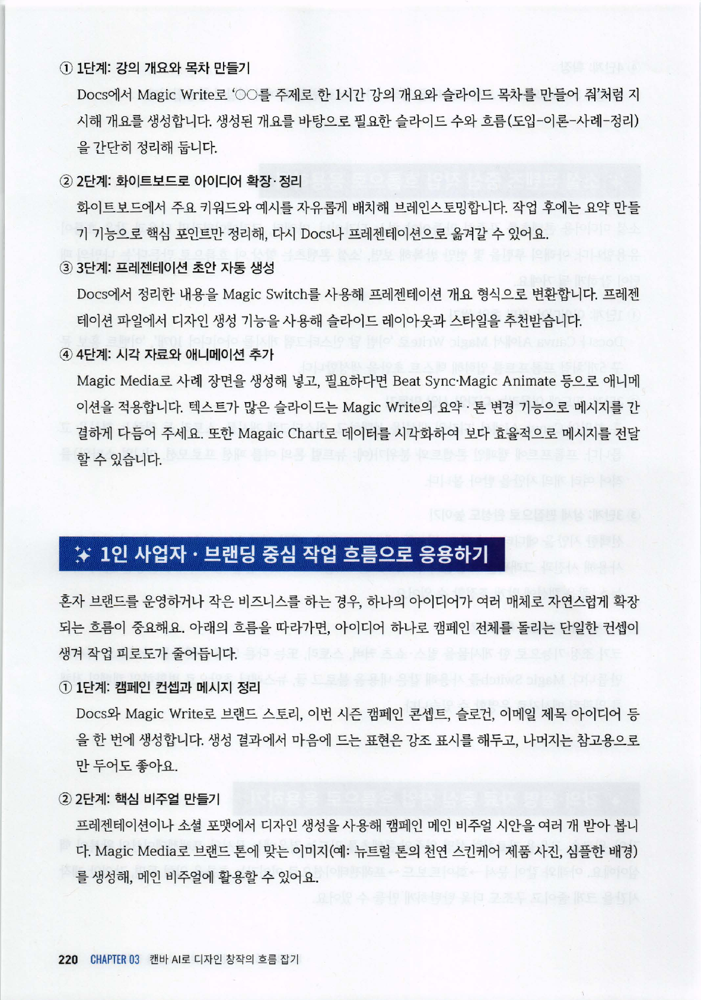

® 1단계: 강의 개요와 목차 만들기

Docs에서 Magic Write로 ‘00를 주제로 한 1시간 강의 개요와 슬라이드 목차를 만들어 줘'처럼 지

시해 개요를 생성합니다. 생성된 개요를 바탕으로 필요한 슬라이드 수와 흐름(도입_이론—사례_정리)

울간단히 정리해둡니댜

@ 2단계: 화이트보드로 아이디어 확장· 정리

화이트보드에서 주요 키워드와 예시를 자유롭게 배치해 브레인스토밍합니다. 작업 후에는 요약 만들

기 기능으로 핵심 포인트만 정리해, 다시 Docs나 프레젠테이션으로 옮겨갈 수 있어요. ® 3단계: 프레젠테이션 초안 자동 생성

Docs에서 정리한 내용을 Magic Switch를 사용해 프레젠테이션 개요 형식으로 변환합니다. 프레젠

###### 테이션 파일에서 디자인 생성 기능을 사용해 슬라이드 레이아웃과 스타일을 추천받습니다.

® 4단계: 시각 자료와 애니매이션 추가

Magic Media로 사례 장면을 생성해 넣고, 필요하다면 Beat Sync·Magic Animate 등으로 애니메 이션을 적용합니다. 텍스트가 많은 슬라이드는 Magic Write의 요약 · 톤 변경 기능으로 메시지를 간 결하게 다듬어 주세요. 또한 Magaic Chart로 데이터를 시각화하여 보다 효율적으로 메시지를 전달 할수있습니다.

###### | I

###### 혼자 브랜드를 운영하거나 작은 비즈니스를 하는 경우, 하나의 아이디어가 여러 매체로 자연스럽게 확장

되는 흐름이 중요해요. 아래의 흐름을 따라가면, 아이디어 하나로 캠페인 전체를 둘리는 단일한 컨셉이 생겨 작업 피로도가 줄어듭니다.

® 1단계: 캠페인 컨셉과 메시지 정리

Docs와 Magic Write로 브랜드 스토리, 이번 시즌 캠페인 콘셉트, 슬로건, 이메일 제목 아이디어 등

###### 을 한 번에 생성합니댜 생성 결과에서 마음에 드는 표현은 강조 표시를 해두고, 나머지는 참고용으로

만두어도좋아요.

@ 2단계: 핵심 비주얼 만들기

프레젠테이션이나 소셜 포맷에서 디자인 생성을 사용해 캠페인 메인 비주얼 시안을 여러 개 받아 봅니 다. Magic Media로 브랜드 톤에 맞는 이미지(예 : 뉴트럴 톤의 천연 스킨케어 제품 사진, 심플한 배경)

를 생성해, 메인 비주얼에 활용할 수 있어요.

220 캔바 Al로 디자인 창작의 흐름 잡기

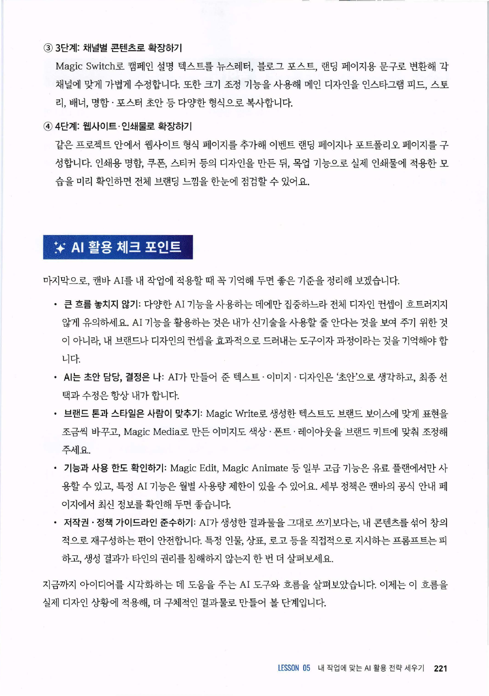

- ® 3단계: 채널별 콘텐츠로 확장하기 Magic Switch로 캠페인 설명 텍스트를 뉴스레터, 블로그 포스트, 렌딩 페이지용 문구로 변환해 각 채널에 맞게 가볍게 수정합니다. 또한 크기 조정 기능을 사용해 메인 디자인을 인스타그램 피드, 스토 리, 배너, 명함 · 포스터 초안 등 다양한 형식으로 복사합니다.
- ® 4단계: 웹사이트· 인쇄물로 확장하기 같은 프로젝트 안에서 웹사이트 형식 페이지를 추가해 이벤트 랜딩 폐이지나 포트폴리오 페이지를 구 성합니다. 인쇄용 명함, 쿠폰, 스티커 등의 디자인을 만든 뒤, 목업 기능으로 실제 인쇄물에 적용한 모 습을미리 확인하면 전체 브랜딩 느낌을한눈에 점검할수있어요.

###### | I

마지막으로, 캔바 AI를 내 작업에 적용할 때 꼭 기억해 두면 좋은 기준을 정리해 보겠습니다.

큰 흐름 놓치지 않기: 다양한 AI 기능을 사용하는 데에만 집중하느라 전체 디자인 컨셉이 흐트러지지 않게 유의하세요. AI 기능을 활용하는 것은 내가 신기술을 사용할 줄 안다는 것을 보여 주기 위한 것

이 아니라, 내 브랜드나디자인의 컨셉을효과적으로드러내는도구이자과정이라는것을기억해야 합

니다.

• Al는 조안 담당, 결정은 나: AI가 만들어 준 텍스트 · 이미지 · 디자인은 ‘초안'으로 생각하고, 최종 선

택과 수정은 항상 내가 합니다.

브랜드 톤과 스타일은 사람이 맞주기: Magic Write로 생성한 텍스트도 브렌드 보이스에 맞게 표현을 조금씩 바꾸고, Magic Media로 만든 이미지도 색상 ·폰트 · 레이아웃을 브렌드 키트에 맞춰 조정해

주세요.

기능과 사용 한도 확인하기: Magic Edit, Magic Animate 등 일부 고급 기능은 유료 플랜에서만 사

용할 수 있고, 특정 AI 기능은 월별 사용량 제한이 있을 수 있어요. 세부 정책은 캔바의 공식 안내 페 이지에서 최신 정보를 확인해 두면 좋습니다.

저작권 · 정책 가이드라인 준수하기: AI가 생성한 결과물을 그대로 쓰기보다는, 내 콘텐츠를 섞어 창의

적으로 재구성하는 편이 안전합니댜 특정 인물, 상표, 로고 등을 직접적으로 지시하는 프롬프트는 피

하고, 생성 결과가 타인의 권리를 침해하지 않는지 한 번 더 살펴보세요.

지금까지 아이디어를 시각화하는 데 도움을 주는 AI 도구와 흐름을 살펴보았습니댜 이제는 이 흐름을

실제 디자인 상황에 적용해, 더 구체적인 결과물로 만들어 볼 단계입니다.

05 내 작업에 맞는 Al 활용 전략 세우기 221

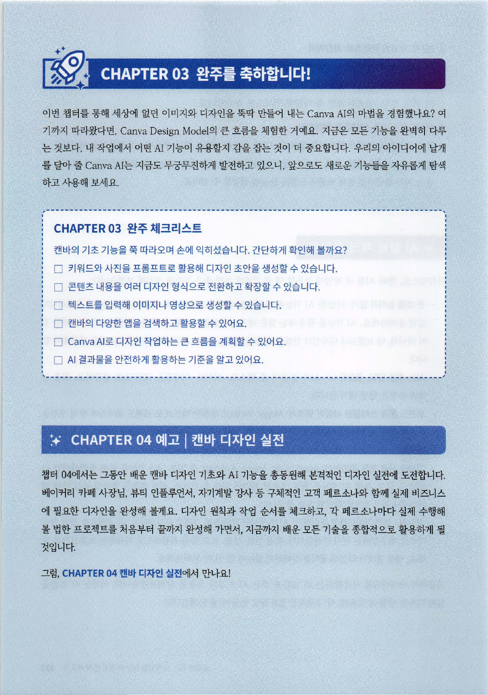

내

,

---··

###### `

CHAPTER 03 완주 체크리스트

기조

曰 .

###### 口 수 있습니다.

曰

O 수 .

口 수 .

口 Al 기준을 .

,

-··

`

###### 에

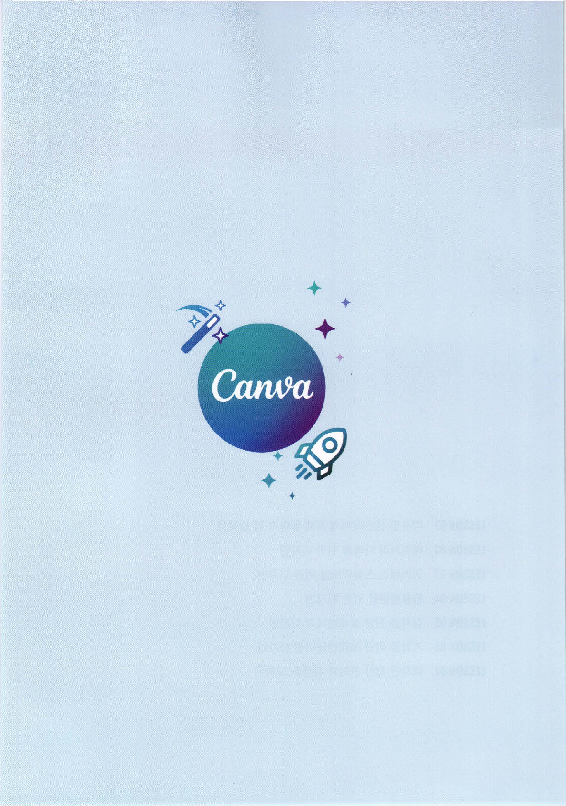

###### 令

令

令

###### 令

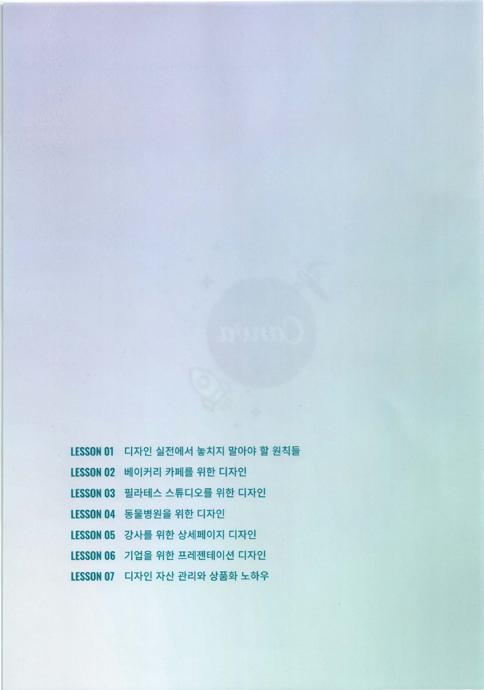

- LESSON 01 말아야
- LESSON 02 카페를 위한 디자인 필라테스 스튜디오를 디자인

- LESSON 04 디자인
- LESSON 05
- LESSON 06 프레젠테이션 디자인 디자인 자산 상품화 노하우

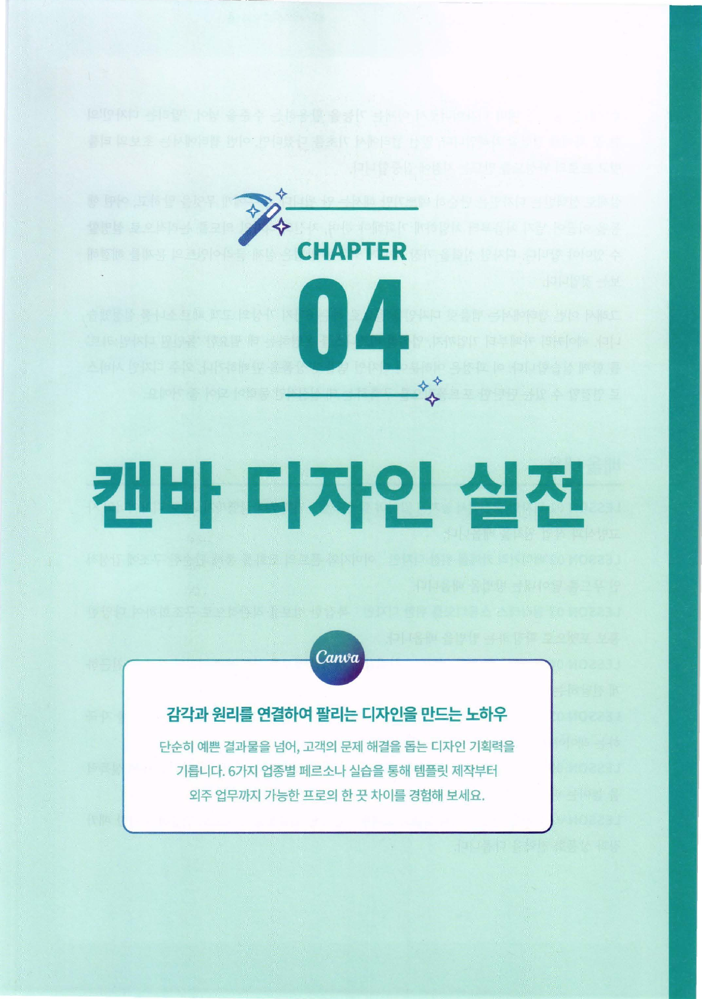

2 수

###### /젊-

###### 었

v

#### 캔바디자인실전

###### 연결하여 팔리는 만드는 노하우

단순히 넘어, 고객의 문제 해결을 돕는 디자인 기획력을 기릅니다. 6가지 실습을

외주 업무까지 가능한 프로의 한 끗 자이를 경험해 보세요.

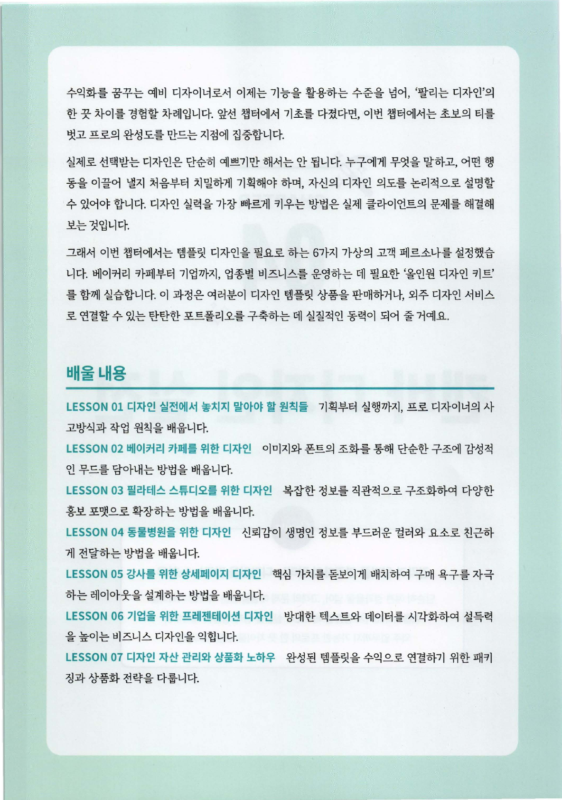

수익화를 꿈꾸는 예비 디자이너로서 이제는 기능을 활용하는 수준을 넘어, ‘팔리는 디자인’의 한 끗 차이를 경험할 차례입니다. 앞선 챕터에서 기초를 다졌다면, 이번 챕터에서는 초보의 티를 벗고 프로의 완성도를 만드는 지점에 집중합니다.

실제로 선택받는 디자인은 단순히 예쁘기만 해서는 안 됩니다. 누구에게 무엇을 말하고, 어떤 행

동을 이끌어 낼지 처음부터 치밀하게 기획해야 하며, 자신의 디자인 의도를 논리적으로 설명할

수 있어야 합니다. 디자인 실력을 가장 빠르게 키우는 방법은 실제 클라이언트의 문제를 해결해 보는것입니다.

그래서 이번 챕터에서는 템플릿 디자인을 필요로 하는 6가지 가상의 고객 페르소나를 설정했습

니다. 베이커리 카페부터 기업까지, 업종별 비즈니스를 운영하는 데 필요한 ‘올인원 디자인 키트’

를 함께 실습합니다. 이 과정은 여러분이 디자인 템플릿 상품을 판매하거나, 외주 디자인 서비스

로 연결할 수 있는 탄탄한 포트폴리오를 구축하는 데 실질적인 동력이 되어 줄 거예요.

###### 배울내용

- LESSON 01 디자인 놓치지 할 기획부터 실행까지, 프로 디자이너의 사 고방식과 작업 원칙을 배웁니다.
- LESSON 02 베이커리 이미지와 폰트의 조화를 통해 단순한 구조에 감성적 인 무드를 담아내는 방법을 배웁니다.
- LESSON 03 스튜디오를 디자인 복잡한 정보를 직관적으로 구조화하여 다양한 홍보 포맷으로 확장하는 방법을 배웁니댜
- LESSON 04 디자인 신뢰감이 생명인 정보를 부드러운 컬러와 요소로 친근하 게 전달하는 방법을 배웁니다.
- LESSON 05 강사를 상세페이지 핵심 가치를 돋보이게 배치하여 구매 욕구를 자극 하는 레이아웃을 설계하는 방법을 배웁니다.
- LESSON 06 방대한 텍스트와 데이터를 시각화하여 설득력 을 높이는 비즈니스 디자인을 익힙니다.
- LESSON 07 디자인 자산 완성된 템플릿을 수익으로 연결하기 위한 패키 징과 상품화 전략을 다룹니댜

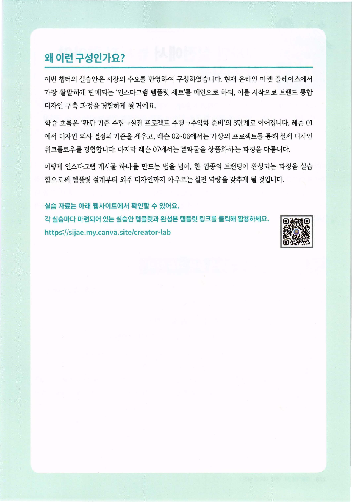

###### 왜이런구성인가요?

이번 챕터의 실습안은 시장의 수요를 반영하여 구성하였습니다. 현재 온라인 마켓 플레이스에서

가장 활발하게 판매되는 ‘인스타그램 템플릿 세트’를 메인으로 하되, 이룰 시작으로 브랜드 통합

###### 디자인 구축 과정을 경험하게 될 거예요.

학습 흐름은 ‘판단 기준 수립一실전 프로젝트 수행一수익화 준비'의 3단계로 이어집니다. 레슨 01 에서 디자인 의사 결정의 기준을 세우고, 레슨 02~06에서는 가상의 프로젝트를 통해 실제 디자인

워크플로우를 경험합니다. 마지막 레슨 07에서는 결과물을 상품화하는 과정을 다룹니다.

이렇게 인스타그램 게시물 하나를 만드는 법을 넘어, 한 업종의 브랜딩이 완성되는 과정을 실습 함으로써 템플릿 설계부터 외주 디자인까지 아우르는 실전 역량을 갖추게 될 것입니다.

실습 아래 수 있어요.

각 있는 활용하세요.

###### https://sijae.my.canva.site/creator-lab

