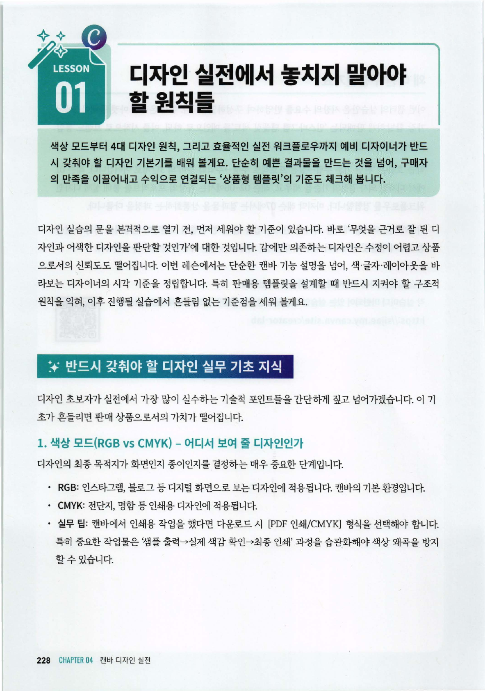

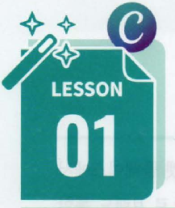

###### 색상 모드부터 4대 원칙, 실전

시 넘어,

###### 의 수익으로 ‘상품형


디자인 실습의 문을 본격적으로 열기 전, 먼저 세워야 할 기준이 있습니다. 바로 ‘무엇을 근거로 잘 된 디 자인과 어색한 디자인을 판단할 것인가’에 대한 것입니다. 감에만 의존하는 디자인은 수정이 어렵고 상품

으로서의 신뢰도도 떨어집니다. 이번 레슨에서는 단순한 캔바 기능 설명을 넘어, 색·글자러l이아웃을 바 라보는 디자이너의 시각 기준을 정립합니다. 특히 판매용 템플릿을 설계할 때 반드시 지켜야 할 구조적

원칙을 익혀, 이후 진행될 실습에서 흔들림 없는 기준점을 세워 볼게요.

###### |

###### 디자인 초보자가 실전에서 가장 많이 실수하는 기술적 포인트들을 간단하게 짚고 넘어가겠습니다. 이 기

초가 흔들리면 판매 상품으로서의 가치가 떨어집니다.

###### 1. vs CMYK) -

디자인의 최종 목적지가 화면인지 종이인지를 결정하는 매우 중요한 단계입니다.

- • RGB: 인스타그램, 블로그 등 디지털 화면으로 보는 디자인에 적용됩니다. 캔바의 기본 환경입니다.
- • CMYK: 전단지, 명함 등 인쇄용 디자인에 적용됩니다.
- • 실무 탑 캔바에서 인쇄용 작업을 했다면 다운로드 시 [PDF 인쇄/CMYK] 형식을 선택해야 합니다. 특히 중요한 작업물은 ‘샘플 출력一실제 색감 확인一최종 인쇄’ 과정을 습관화해야 색상 왜곡을 방지 할 수있습니다.


###### 228 CHAPTER 04 캔바 디자인 실전

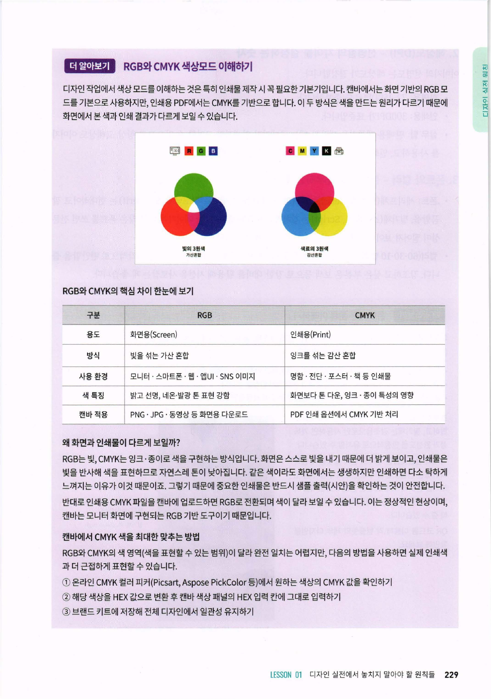

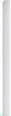

###### RGB와CMYK색상모드이해하기

-w

「아

rK

격`＿

디자인 작업에서 기반의 모 드를 기본으로 사용하지만, 인쇄용 CMYK를 기반으로 합니다. 이 두 색을 원리가 다르기 때문에

O1XE-

본 수 있습니다.

###### m 圓


###### 뜬

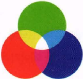

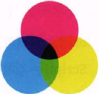

빛의 색료의 3원색

RGB와 핵심 차이 한눈에 보기

|구분| | |
|---|---|---|
|용도|화면용(Screen)|인쇄용(Print)|
|tl0~A-,I|빚을섞는가산혼합|잉크를 섞는감산혼합|
|사용환경|모니터 · 스마트폰 · 웹 · 앱UI ·SNS 이미지|명함 · 전단 · 포스터 · 책 등 인쇄물|
|색특징|밝고 선명, 네온발광 톤 표현 강함|화면보다 톤 다운, 잉크 · 종이 특성의 영향|
|캔바적용|PNG ·JPG · 동영상 등 화면용 다운로드|PDF 인쇄 옵션에서 CMYK 기반 처리|


왜

RGB는 빛, CMYK는 잉크 · 방식입니다. 내기 더 밝게 보이고,

반사해 색을 표현하므로 톤이 낮아집니다. 다소 탁하게 느껴지는 이유가 때문이죠. 그렇기 샘플 출력(시안)을 것이 안전합니다.

캔바는 모니터 RGB 기반 도구이기 캔바에서 CMYK 맞주는

색 영역(색을 수 있는 달라 어렵지만, 사용하면 인쇄색 과 더 수 있습니다.

® 컬러 피커(Picsart, 색상의 CMYK값을 확인하기

입력

® 저장해 유지하기

01 디자인 실전에서 놓지지 말아야 할 원직들 229

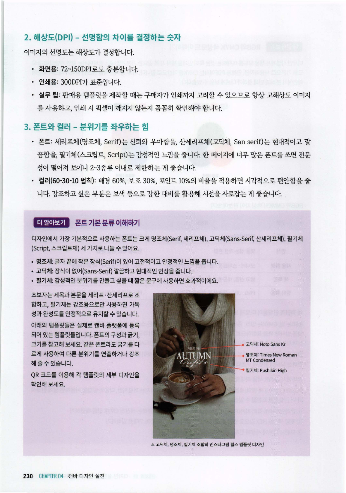

###### 2. - 자이를

이미지의 선명도는 해상도가 결정합니다.

- • 화면용: 72~150DPI로도 충분합니다.
- • 인쇄용: 300DPI가표준입니다.
- • 실무 탑 판매용 템플릿을 제작할 때는 구매자가 인쇄까지 고려할 수 있으므로 항상 고해상도 이미지 룰 사용하고, 인쇄 시 픽셀이 깨지지 않는지 꼼꼼히 확인해야 합니다.


###### 3. - 좌우하는

- • 폰트: 세리프체(명조체, Serif)는 신뢰와 우아함을, San serif)는 현대적이고 깔 끔함을, 필기체(스크립트, Script)는감성적인 느낌을줍니다. 한페이지에 너무 많은폰트를쓰면 전문 성이 떨어져 보이니 2~3종류 이내로 제한하는 게 좋습니다.
- • 컬러(60-30-10 법칙)： 배경 60%, 보조 30%, 포인트 10%의 비율을 적용하면 시각적으로 편안함을 줍 니다. 강조하고 싶은 부분은 보색 등으로 강한 대비를 활용해 시선을 사로잡는 게 좋습니다.


###### 폰트기븐분류이해하기

디자인에서 가장 기본적으로 사용하는 크게

(Script, 스크립트제) 세 가지로 나눌 수 있어요.

- • 글자 끝에 작은 장식 .
- • 고딕체: 장식이 (Sans-Serif) 인상을 줍니다.
- • 필기체: 때 문구에


조보자는 제목과 세리프· 조

합하고, 필기체는 가독

성과 수 있습니다.

캔바

되어 구성과굵기, 크기를 굵기를 다

Noto Kr

Roman MT Condensed

해줄수있습니다.

필기체:

QR 각 세부

~ 고딕체, 필기체 인스타그램 릴스 플릿 디자인

###### 230 04 캔바 디자인 실전

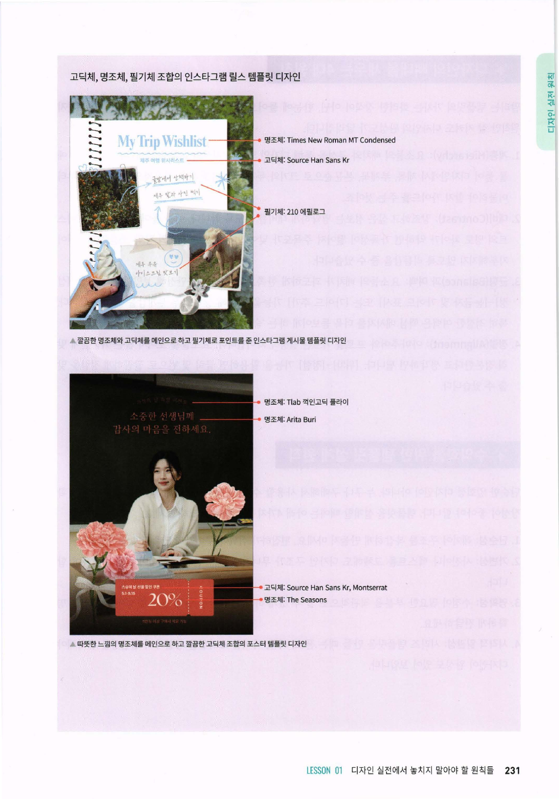

i¥ri5

고딕제, 명조제, 인스타그램 릴스

~:ic

캔-오

X＿니

명조제: Times New Roman MT Condensed

고딕재 Source Han Sans Kr

210

를 인스타그램 디자인

명조제: Tlab 꺽인고딕 Arita Buri

Source Han Sans Kr, Montserrat The Seasons

느 고닥체 디자인

LESSON 01 디자인 실전에서 놓지지 말아야 할 원직들 231

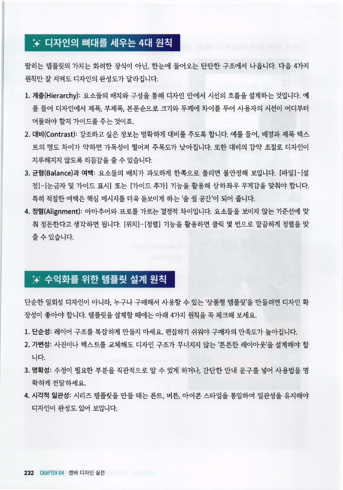

###### | |

팔리는 템플릿의 가치는 화려한 장식이 아닌, 한눈에 들어오는 탄탄한 구조에서 나옵니다. 다음 4가지

원칙만 잘 지켜도 디자인의 완성도가 달라집니다.

- 1. 계증(Hierarchy): 요소들의 배치와 구성을 통해 디자인 안에서 시선의 흐름을 설계하는 것입니다. 예 를 들어 디자인에서 제목, 부제목, 본문순으로 크기와 두께에 차이를 두어 사용자의 시선이 어디부터 머물러야 할지 가이드를 주는 것이죠.
- 2. 대비(Contrast): 강조하고 싶은 정보는 명확하게 대비를 주도록 합니다. 예를 들어, 배경과 제목 텍스 트의 명도 차이가 약하면 가독성이 떨어져 주목도가 낮아집니다. 또한 대비의 강약 조절로 디자인이 지루해지지 않도록 리듬감을 줄 수 있습니다.
- 3. 균형(Balance)과 여백: 요소들의 배치가 과도하게 한쪽으로 쏠리면 불안정해 보입니다. ［파일]-［설 정]-［눈금자 및 가이드 표시] 또는 [가이드 추가] 기능을 활용해 상하좌우 무게감을 맞춰야 합니다. 특히 적절한 여백은 핵심 메시지를 더욱 돋보이게 하는 ‘숨 쉴 공간'이 되어 줍니다.
- 4. 정렬(Alignment): 아마추어와 프로를 가르는 결정적 차이입니다. 요소들을 보이지 않는 기준선에 맞 춰 정돈한다고 생각하면 됩니다. ［위치]-[정렬] 기능을 활용하면 클릭 몇 번으로 깔끔하계 정렬을 맞 출수있습니다.


###### | 를 설 원

###### 단순한 일회성 디자인이 아니라, 누구나 구매해서 사용할 수 있는 ‘상품형 템플릿'을 만들려면 디자인 확

장성이 좋아야 합니다. 템플릿을 설계할 때에는 아래 4가지 원칙을 꼭 체크해 보세요.

- 1. 단순성: 례이어 구조를 복잡하게 만들지 마세요. 편집하기 쉬워야 구매자의 만족도가 높아집니다.
- 2. 가변성: 사진이나 텍스트를 교체해도 디자인 구조가 무너지지 않는 ‘튼튼한 레이아웃’을 설계해야 합 니다.
- 3. 명확성: 수정이 필요한 부분을 직관적으로 알 수 있게 하거나, 간단한 안내 문구를 넣어 사용법을 명 확하게전달하세요.
- 4. 시각적 일관성: 시리즈 템플릿을 만들 때는 폰트, 버튼, 아이콘 스타일을 통일하여 일관성을 유지해야 디자인이 완성도 있어 보입니다.


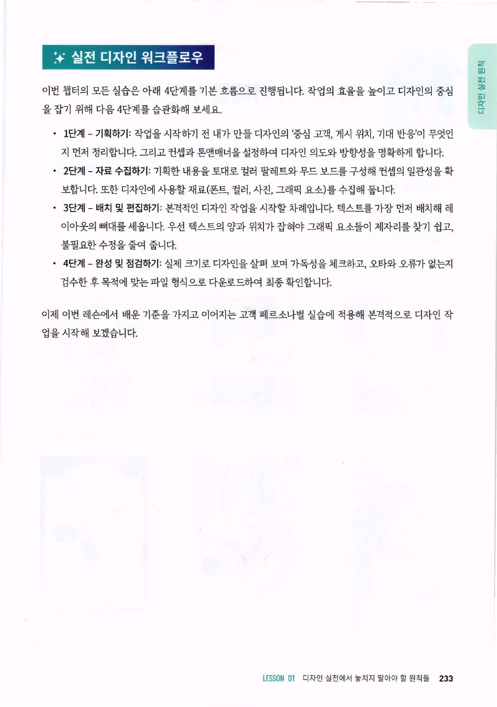

###### | 디 |

汀

BKJ 자

이번 챕터의 모든 실습은 아래 4단계를 기본 흐름으로 진행됩니다. 작업의 효율을 높이고 디자인의 중심 을 잡기 위해 다음 4단계를 습관화해 보세요.

oJ 一x-u

- 1단계 - 기획하기: 작업을 시작하기 전 내가 만들 디자인의 ‘중심 고객, 게시 위치, 기대 반응’이 무엇인 지 먼저 정리합니다. 그리고 컨셉과 톤앤매너을 설정하여 디자인 의도와 방향성을 명확하계 합니다.
- 2단계 - 자료 수집하기: 기획한 내용을 토대로 컬러 팔레트와 무드 보드를 구성해 컨셉의 일관성을 확 보합니다. 또한 디자인에 사용할 재료(폰트, 컬러, 사진, 그래픽 요소)를 수집해 둡니다.


• 3단계 - 배치 및 편집하기: 본격적인 디자인 작업을 시작할 차례입니다. 텍스트를 가장 먼저 배치해 레

이아웃의 뼈대를 세웁니다. 우선 텍스트의 양과 위치가 잡혀야 그래픽 요소들이 제자리를 찾기 쉽고, 불필요한수정을줄여 줍니다.

• 4단계 - 완성 및 점검하기: 실제 크기로 디자인을 살펴 보며 가독성을 체크하고, 오타와 오류가 없는지

검수한후목적에 맞는파일 형식으로다운로드하여 최종확인합니다.

이제 이번 레슨에서 배운 기준을 가지고 이어지는 고객 페르소나별 실습에 적용해 본격적으로 디자인 작

업을시작해보겠습니댜

LESSON 01 디자인 실전에서 놓지지 말아야 할 원칙들 233

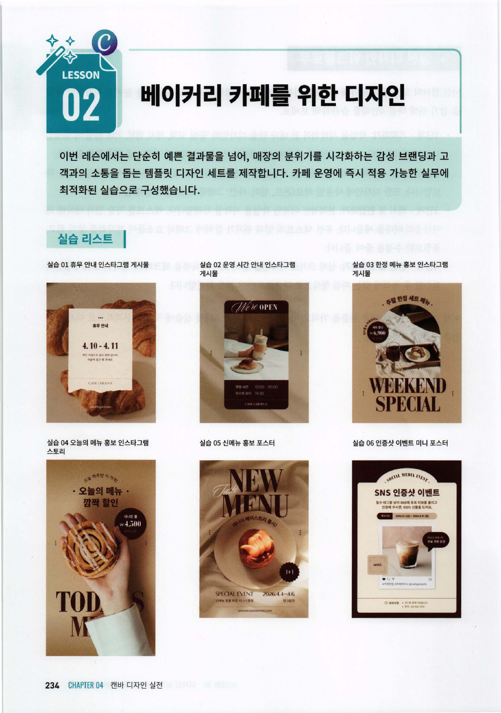

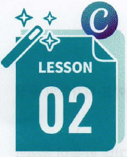

###### 이번 예쁜 넘어, 매장의 시각화하는 고

세 적용

죄적화된 .


###### |

실습 02 운영 시간 안내 게시물

실습 01 휴무 안내 인스타그램 게시물

실습 03 한정 메뉴 홍보 인스타그램 게시물

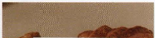

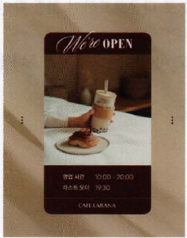

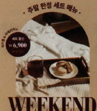

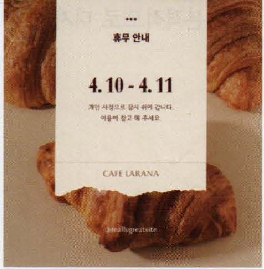

4.10 - 4.11

터...블,．......

저 U 서퀄•••서 ... C이

###### I d~!

실습 04 오늘의 메뉴 흥보 인스타그램

실습 05 신메뉴 흥보 포스터

###### 실습 06 인증샷 이벤트 미니 포스터

스토리

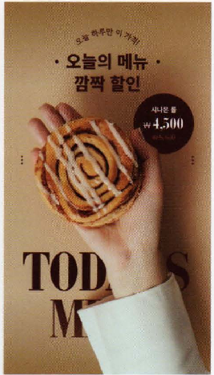

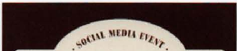

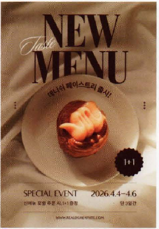

I수 그. 넣어 ....뻬 흐皇 ．리

언.... 시!! moz선 려요•

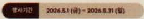

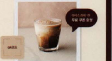

OT 口

###### .H1U·'’`.4· ,•• '’'"

••때 . ....

###### ·••--

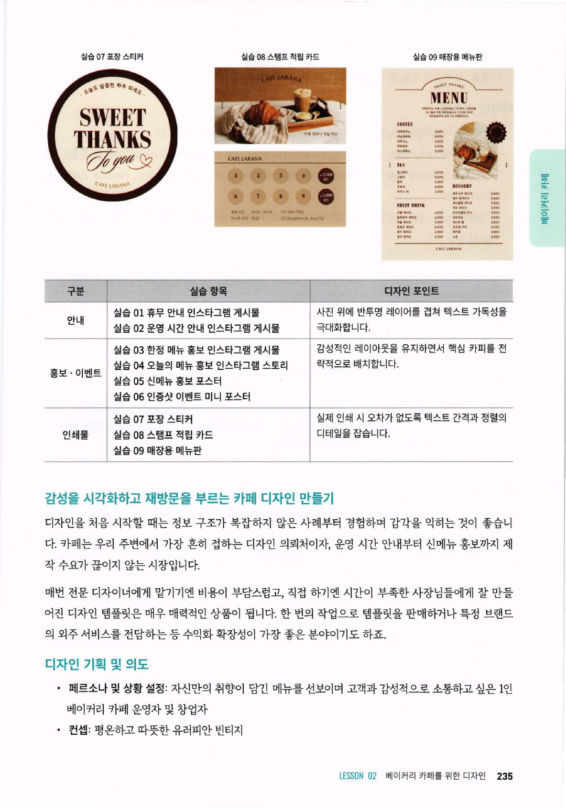

—下 ·

실습 07 포장스티커 실습 08 스탬프 적립 카드 실습 09 매장용매뉴판

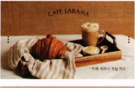

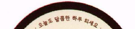

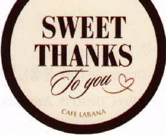

••

..."'""'·-...嶋`..""[ ; T...&.I.

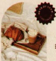

....

4000

###### &·

###### 勿(Jc

###### ..

‘

―古 1E

ggggg

훌

###### ....•

###### ....,........

GrtIARAh,, ‘

4

•

###### g--

’

＿미 k ＿으

‘•

" '```tIT

빼....••.

.f■..I..hll\~

뻬"'

ggggfguoo

###### ••빼..빼

gggggg

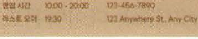

..

••빼".

CAfl 1^....` ^

|I| | |
|---|---|---|
|안내|실습 01 휴무 안내 인스타그램 게시물<br>실습 02 운영 시간 안내 인스타그램 게시물<br>|사진 위에 반투명 레이어를 겹쳐 텍스트 가독성을<br><br>극대화합니다.|
|홍보·이벤트|실습 03 한정 메뉴 홍보 인스타그램 게시물<br>실습 04 오늘의 메뉴 홍보 인스타그램 스토리<br>실습 05 신메뉴 홍보 포스터<br>실습 06 인중샷 이벤트 미니 포스터<br>|감성적인 레이아웃을 유지하면서 핵심 카피를 전<br><br>략적으로배지합니다.|
|인쇄물|실습 07 포장스티커<br>실습 08 스탬프적립 카드<br>실습 09 매장용메뉴판<br>|실제 인쇄 시 오자가 없도록 텍스트 간격과 정렬의<br><br>디테일을잡습니다.|


###### 부르는 카페 디자인 만들기

디자인을 처음 시작할 때는 정보 구조가 복잡하지 않은 사례부터 경험하며 감각을 익히는 것이 좋습니

###### 다. 카페는 우리 주변에서 가장 흔히 접하는 디자인 의뢰처이자, 운영 시간 안내부터 신메뉴 홍보까지 제

작 수요가 끊이지 않는 시장입니다.

매번 전문 디자이너에게 맡기기엔 비용이 부담스럽고, 직접 하기엔 시간이 부족한 사장님들에게 잘 만들

어진 디자인 템플릿은 매우 매력적인 상품이 됩니다. 한 번의 작업으로 템플릿을 판매하거나 특정 브랜드

의 외주 서비스를 전담하는 등 수익화 확장성이 가장 좋은 분야이기도 하죠.

###### 디자인기획및의도

페르소나 및 상황 설정: 자신만의 취향이 담긴 메뉴를 선보이며 고객과 감성적으로 소통하고 싶은 1인 베이커리 카페 운영자 및 창업자

컨셉: 평온하고따뜻한유러피안빈티지

LESSON 02 베이커리 카페를 위한 디자인 235

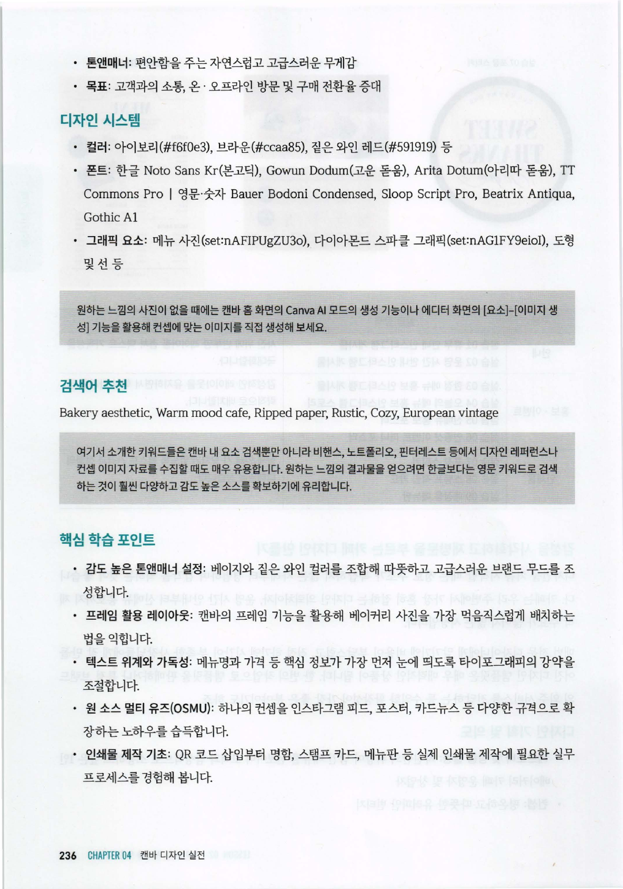

- • 톤앤매너: 편안함을주는자연스럽고고급스러운무게감
- • 목표: 고객과의 소통; 온 · 오프라인 방문 및 구매 전환율 증대


###### 디자인시스템

- • 컬랴 아이보리(#f6f0e3),브라운(#ccaa85)， 짙은 와인 레드(#591919) 등
- • 폰트: 한글 Noto Sans Kr(본고딕), Gowun Dodum(고운 돋움), Arita Dotum(아리따 돋움), TT Commons Pro I 영문·숫자 Bauer Bodoni Condensed, Sloop Script Pro, Beatrix Antiqua, Gothic Al
- • 그래픽 요소: 메뉴 사진(set:nAFIPUgZU3o), 다이아몬드 스파클 그래픽(set:nAG1FY9eiol), 도형 및선등


원하는 느낌의 에디터 생

###### Bakery aesthetic, Warm mood cafe, Ripped paper, Rustic, Cozy, European vintage

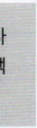

여기서 소개한 키워드들은 캔바 내

이미지 수집할

하는 것이

###### 핵심학습포인트

- • 감도 높은 톤앤매너 설정: 베이지와 짙은 와인 컬러를 조합해 따뜻하고 고급스러운 브랜드 무드를 조 성합니다.
- • 프레임 활용 레이아웃: 캔바의 프레임 기능을 활용해 베이커리 사진을 가장 먹음직스럽게 배치하는 법을익힙니다.
- • 텍스트 위계와 가독성: 메뉴명과 가격 등 핵심 정보가 가장 먼저 눈에 띄도록 타이포그래피의 강약을 조절합니다.
- • 원 소스 멀티 유즈(OSMU)： 하나의 컨셉을 인스타그램 피드, 포스터, 카드뉴스 등 다양한 규격으로 확 장하는 노하우를 습득합니다.
- • 인쇄물 제작 기조: QR 코드 삽입부터 명함, 스탬프 카드, 메뉴판 등 실제 인쇄물 제작에 필요한 실무 프로세스를경험해 봅니다.


236 04 캔바 디자인 실전

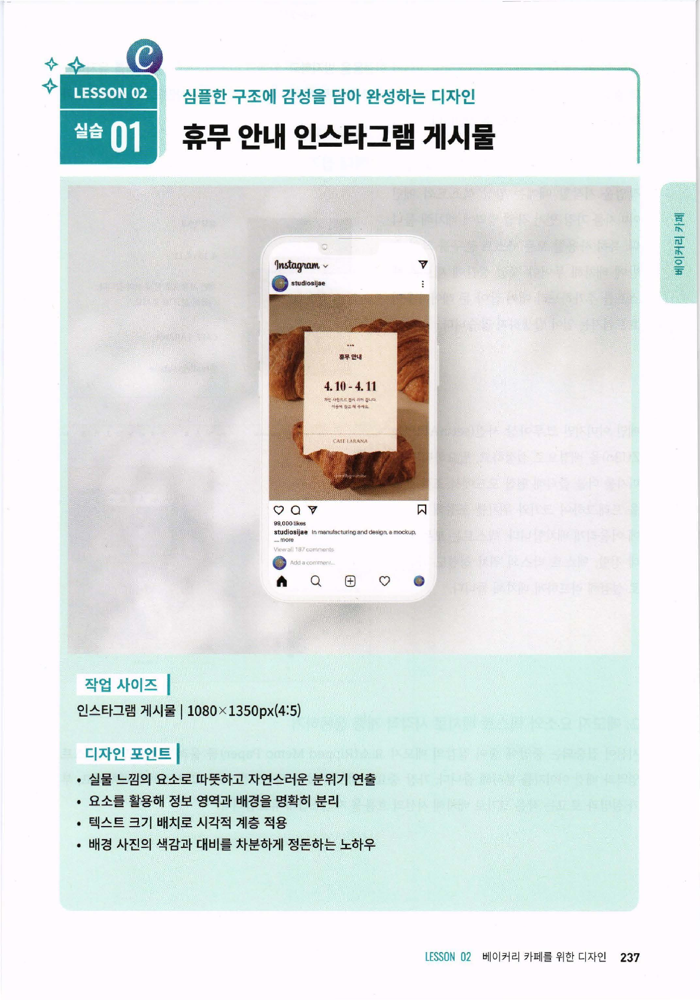

:러:

구조에 담아

###### 휴무 안내 인스타그랩 게Al를

一―n1E

＿으

V'

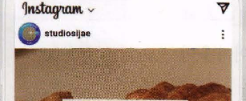

###### ...

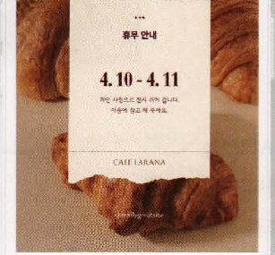

4.10-4.11

...

口

###### OOV

99,000 llkes

studlosljoe In manufacturing anddeslgl\• mockup.


^ Q m)

…-"ue

'Wa, 18i o, w

^ " 'm

。

###### 작업 사이즈 |

###### | x

• •

•

• 배경 대비 는

베이커리 카페를 위한 디자인 237

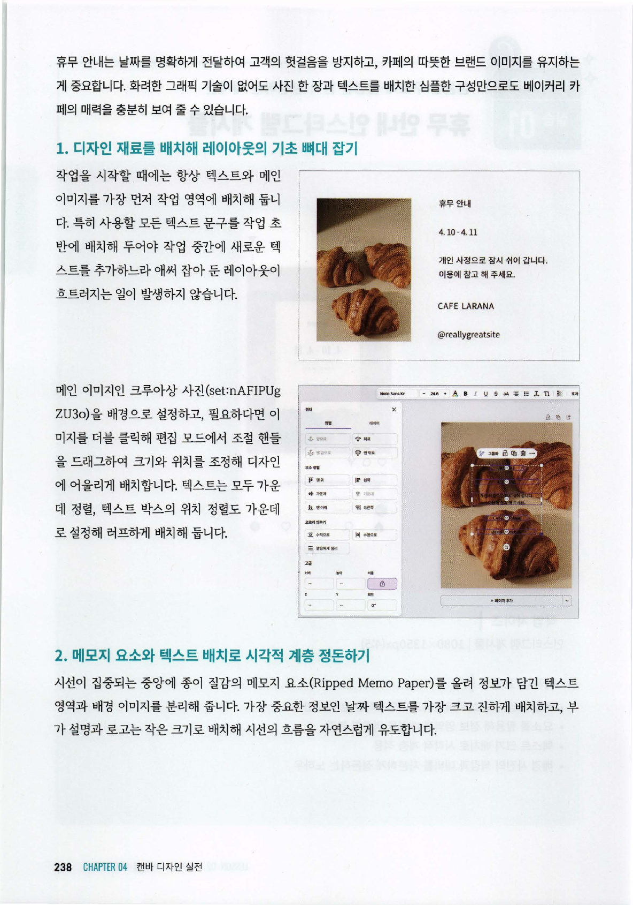

휴무 안내는 날짜를 명확하게 전달하여 고객의 헛걸음을 방지하고, 카페의 따뜻한 브랜드 이미지를

게 중요합니다. 화려한 그래픽 기술이 없어도 사진 한 장과 텍스트를 구성만으로도 베이커리 카 페의 매력을 중분히 보여 줄 수 있습니다.

###### 1. 디자인 배치해 레이아웃의 기조 잡기

작업을 시작할 때에는 항상 텍스트와 메인

이미지를 가장 먼저 작업 영역에 배치해 둡니

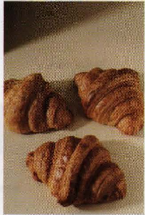

휴무안내

다. 특히 사용할 모든 텍스트 문구를 작업 초 반에 배치해 두어야 작업 중간에 새로운 텍

4.10-4. 11

사정으로 잠시 쉬어 갑니다. 이용에잠고해주세요.

스트를 추가하느라 애써 잡아 둔 레이아웃이

흐트러지는 일이 발생하지 않습니다.

CAFE LARANA

@reallygreatsite

메인 이미지인 크루아상 사진 (set:nAFIPUg

.... ....山 - ..... 소

" -

"`

X

ZU3o)을 배경으로 설정하고, 필요하다면 이

a ®

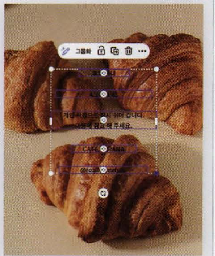

미지를 더블 클릭해 편집 모드에서 조절 핸들

&曾

f' 현

향 뺀""

$ • '"

올 드래그하여 크기와 위치를 조정해 디자인

요••

¥ 뺄”

눕 던틀

에 어울리게 배치합니다. 텍스트는 모두 가운

* ''"

데 정렬, 텍스트 박스의 위치 정렬도 가운데

얼 오른텨

보 뺀아뺄

고 기

로 설정해 러프하게 배치해 둡니다.

H""

흐 수뢸오를

三 률을빼게륄리

... ..

고글

....

빽

亡도그

• ...지후가

###### 2. 텍스트시선이 집중되는 중앙에 종이 질감의 메모지 요소(Ripped Memo Paper)를 올려 정보가 담긴 텍스트영역과 배경 이미지를 분리해 줍니댜 가장 중요한 정보인 날짜 텍스트를 가장 크고 진하게 배치하고, 부

- 가 설명과 로고는 작은 크기로 배치해 시선의 흐름을 자연스럽계 유도합니다.


238 CHAPTER 04 캔바 디자인 실전

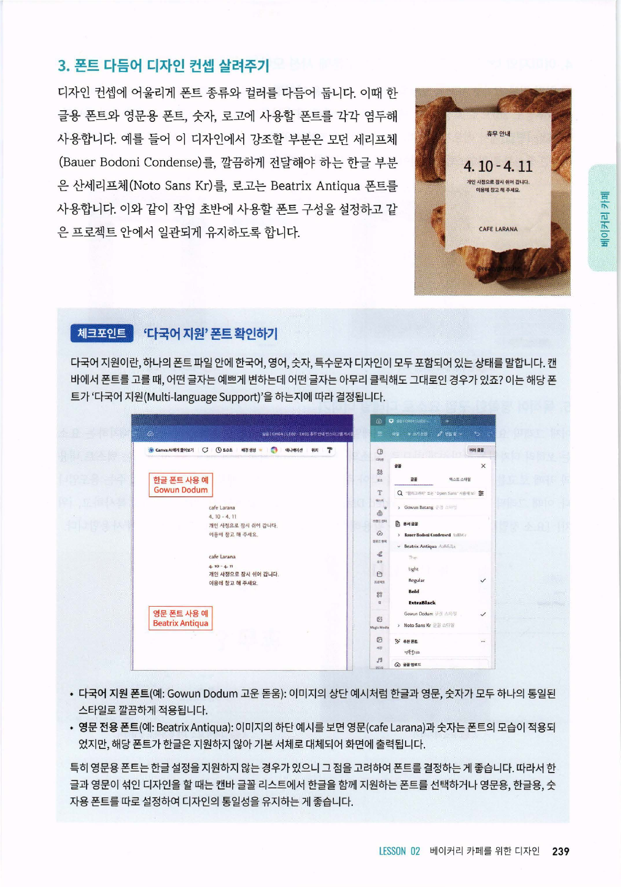

###### 3. 폰트 다듬어 디자인

디자인 컨셉에 어울리게 폰트 종류와 컬러를 다듬어 둡니다. 이때 한

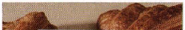

글용 폰트와 영문용 폰트, 숫자, 로고에 사용할 폰트를 각각 염두해

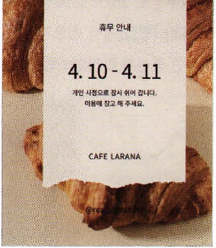

사용합니댜 예를 들어 이 디자인에서 강조할 부분은 모던 세리프체 (Bauer Bodoni Condense)를, 깔끔하계 전달해야 하는 한글 부분 은 산세리프체 (Noto Sans Kr)를, 로고는 Beatrix Antiqua 폰트를 사용합니다. 이와 같이 작업 초반에 사용할 폰트 구성을 설정하고 같

###### 4.10-4.11

게인 사경으量 점시 쉬어 깁니다

눕 E1 모

E＿으玉

###### CAFE

은 프로젝트 안에서 일관되게 유지하도록 합니다.

-다국어지원이란,하나의폰트파일안에탄국어,영어,숫자,특수문자디자인이모두 상태를 .캔

바에서 때, 어떤 글자는 변하는데 어떤 글자는 아무리 그대로인 이는 해당 폰

트가 ‘다국어 지원(Multi-language Support)’을 하는지에 따라

###### ,,.'」

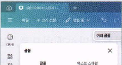

t

c.nw며떠틀모기 C °“호

예니데.,신

위치

T~‘i

트

`스로스다혈

를믈

Q Ti,미티 있는 .o,,.”요心.,

###### 芝

, Gomm 氐따

cafe Larana

4. 10 • 4. II

###### B •서글틀

게인 사정으로 잠시 쉬어 갑니다

G

> ..m·'"＇IIu"`．"'m덴 b.,키, v .."mA liqua A4& l`

·量,••

4

c.fe u-.n•

”

4· `o•.. ..

l꿍ht

e

개인 잠시 쉬어

11,gu,..

m ..

g.?

` /

8old

Lt•`"'m&

Go'"`a

v /

®

> NotoS,n, K, " ,,tt

모...u

’“른量

®

예.

너pc

一

n

° “업·도


- • 다국어 지원 폰트(예: Gowun Dodum 고운 )： 이미지의 상단 예시처럼 과 숫자가 모두 하나의 통일된 스타일로 적용됩니다.
- • BeatrixAntiqua):이미지의 하단예시를 적용되 었지만, 해당 한글은 지원하지 않아 기본 서체로 화면에 쥴력됩 니다.


특히 영문용 폰트는 한글 지원하지 않는 경우가 있으니 그 을 고려하여 폰트를 결정하는 게 좋습니다. 따라서 한 과 영문이 섞인 디자인 할 때는 리스트에서 한글을 함께 는 폰트를 숫

자용 따로 하여 디자인의 유지하는 좋습니다.

LESSON 02 베이커리 카페를 위한 디자인 239

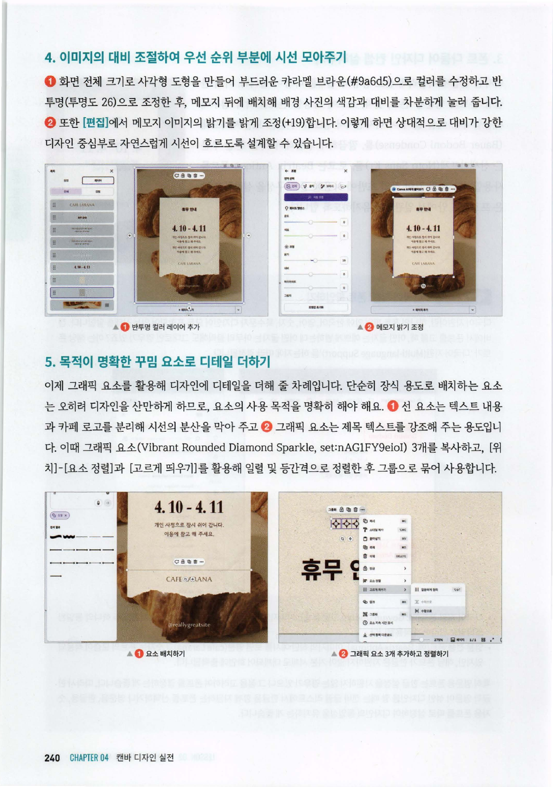

###### 4. 우선O 화면 전체 크기로 사각형 도형을 만들어 부드러운 캬라멜 브라운(#9a6d5)으로 컬러를 수정하고 반

투명(투명도 26)으로 조정한 후, 메모지 뒤에 배치해 배경 사진의 색감과 대비를 차분하게 눌러 줍니다.

O 또한 에서 메모지 이미지의 밝기를 밝게 조정(+19)합니다. 이렇게 하면 상대적으로 대비가 강한

디자인 중심부로 자연스럽게 시선이 흐르도록 설계할 수 있습니다.

......."

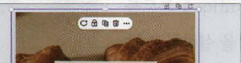

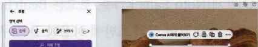

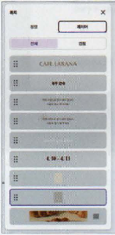

X

I - I

" .. ~- 소'

9--

”

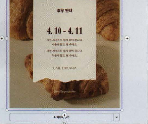

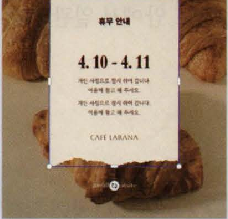

..N

..던

..

•皇

4.104.II

4.10- 4.11

••• s 』

· C나

뻬.... ．暴4 ......S量•예 ....내

....... 빼專

*“

.....,.^

·•뻬•’빼...

.,.......뻬 ...,

""

."표

(NI1^````

~~"

r

그


..o반투명컬러레이어주가 ... 매모지밝기조정


###### 5. 목적이 요소로

이제 그래픽 요소를 활용해 디자인에 디테일을 더해 줄 차례입니다. 단순히 장식 용도로 배치하는 요소

는 오히려 디자인을 산만하게 하므로, 요소의 사용 목적을 명확히 해야 해요. O 선 요소는 텍스트 내용 과 카페 로고를 분리해 시선의 분산을 막아 주고O 그래픽 요소는 제목 텍스트를강조해 주는 용도입니

- 다. 이때 그래픽 요소(Vibrant Rounded Diamond Sparkle, set:nAGlFY9eiol) 3개를 복사하고, [위


치]-［요소 정렬]과 [고르게 띄우기]를 활용해 일럴 및 등간격으로 정렬한 후 그룹으로 묶어 사용합니다.

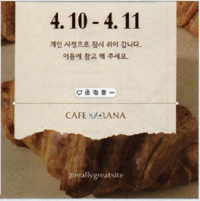

4.10- 4.11

a

9 수

g 9

"0Toe

i

-

G....

5figg

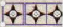

"'

쉬어

5

t"'

###### ..

기

-－―一—

0 +

무

휴

CL

80

o n

###### o a 딸 • •••

ga

•

冒

CAFE ~h"I.ANA

·

g

Ill 雷."...

Ill

i

이》 ..

H ....

11 , ..

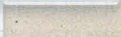

(!) .........

土 .......

""’ 딜- "' II ••

~O 그래픽 요소 3개 주가하고 정렬하기

... 요소배지하기

240 캔바디자인 실전

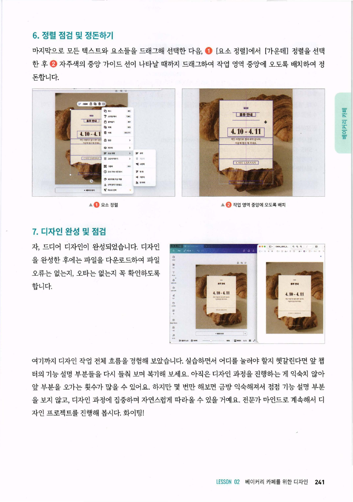

- 6. 점검 마지막으로 모든 텍스트와 요소들을 드래그해 선택한 다음, O [요소 정렬]에서 [가운데] 정렬을 선택 한 후O 자주색의 중앙 가이드 선이 나타날 때까지 드래그하여 작업 영역 중앙에 오도록 배치하여 정

돈합니다.

스"..

가

”

빼빼

”

-..

"

.....m

·-..

> > Ir .. > 言

'Ill •••

軍 ••

..-

.It. ...

•0 요소정렬 ...O 작업 영역 중앙에 오도록 배지

- 7. 디자인완성 및점검 자, 드디어 디자인이 완성되었습니다. 디자인 을 완성한 후에는 파일을 다운로드하여 파일 오류는 없는지, 오타는 없는지 꼭 확인하도록 합니댜


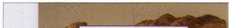

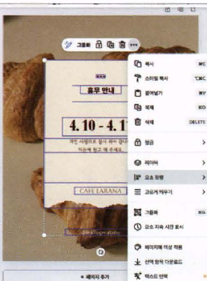

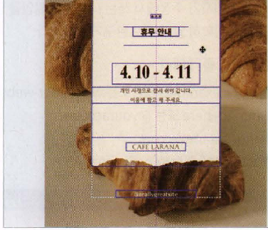

＿―n{E

11D

“ |

＿브小＿으

♦

k-

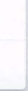

# -

###### • • .,. 0~'...• `" ..

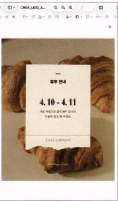

C • ..- • D

IJ-·aT5·iei

•• c

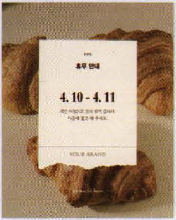

·

4

"e-E.fl~e

” 3 。-

-,._'"...

『

11~

여기까지 디자인 작업 전체 흐름을 경험해 보았습니다. 실습하면서 어디를 눌러야 할지 헷갈린다면 앞 챕

터의 기능 설명 부분들을 다시 들춰 보며 복기해 보세요. 아직은 디자인 과정을 진행하는 게 익숙치 않아 앞 부분을 오가는 횟수가 많을 수 있어요. 하지만 몇 번만 해보면 금방 익숙해져서 점점 기능 설명 부분 올 보지 않고, 디자인 과정에 집중하며 자연스럽게 따라올 수 있을 거예요. 전문가 마인드로 계속해서 디

자인 프로젝트를 진행해 봅시다. 화이팅!

베이커리 카페를 위한 디자인 241

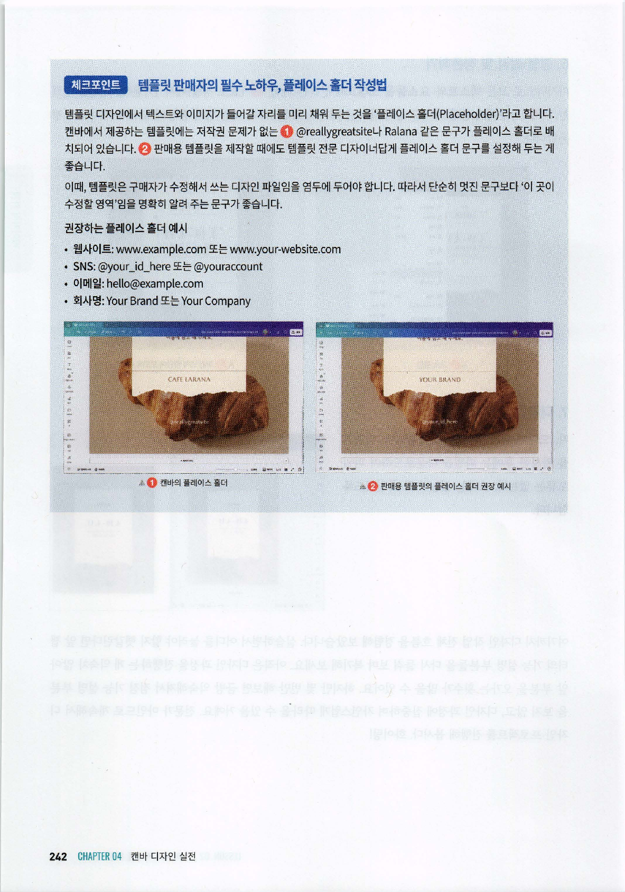

- ‘ ’

저작권 Ralana 배

두는

‘

- • : www. www. .
- • :@your_id_here @youraccount


• •

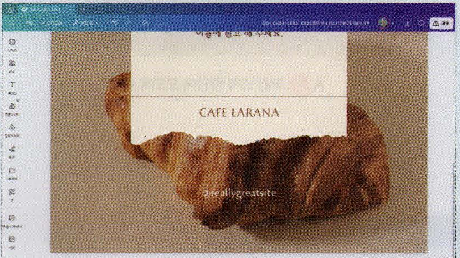

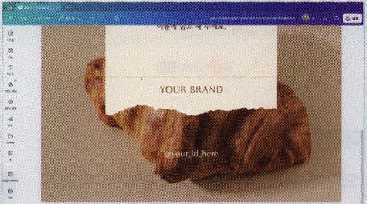

###### -..

··

i0i‘“

오"；수:.

###### -

###### »i •-

·i 고 •

－누

- .,_ .... .. 이

U 0- ·'· • ·• o

·

• 의 ..t..O 폴더 권장예시

242 캔바디자인 실전

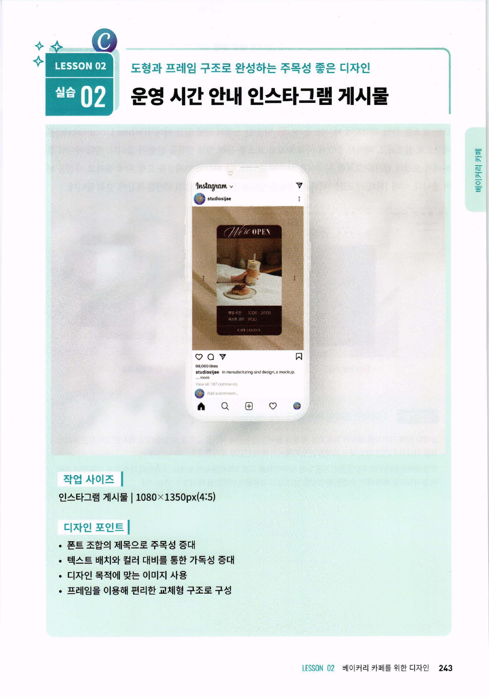

###### @

수수

###### 늠

도형과 프레임 구조로 완성하는 주목성 좋은 디자인

# -m 운영시간안내인스타그랩게시를

＿포 E-nJ

ck)

V'

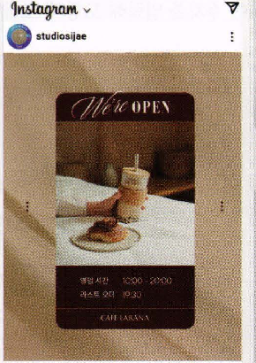

口

###### oov

99,000Uk.. studiosijae In manufactur ng and design.a mockup.

·- IT10(e

'm

'dda m

G)

A Q

。

작업 사이즈 |

| X

###### 디자인 포인트|

- • 제목으로 주목성 증대
- • 배지와 대비 가독성
- • 디자인 목적에 이미지 사용
- • 구조로 구성


02 베이커리 카페를 위한 디자인 243

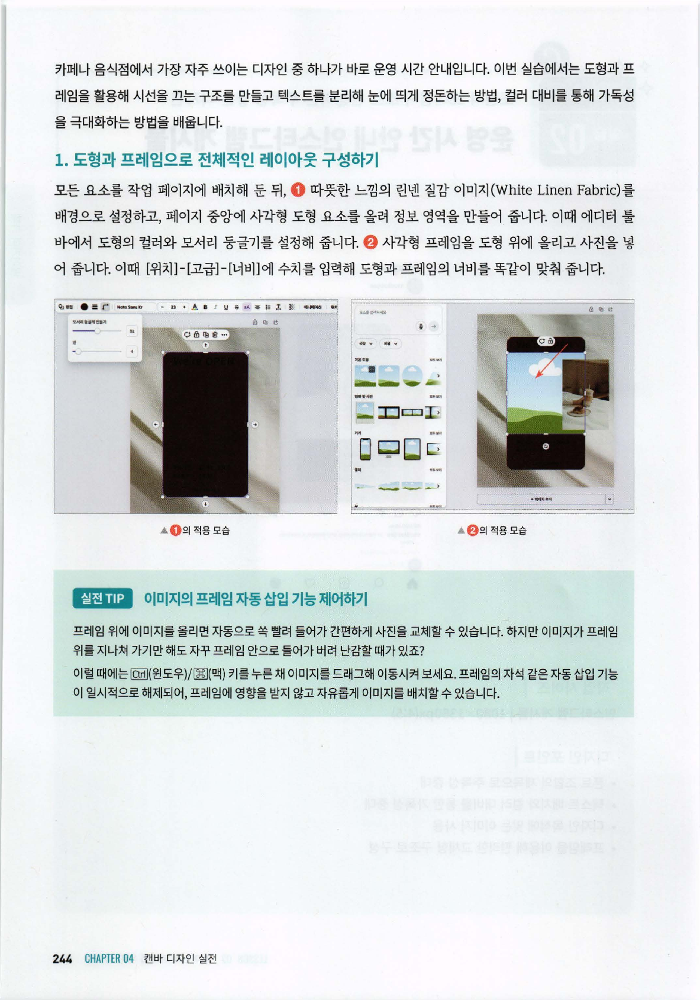

카페나 음식점에서 가장 자주 쓰이는 디자인 중 하나가 바로 운영 시간 안내입니다. 이번 실습에서는 도형과 프 레임을 활용해 시선율 끄는 구조를 만들고 텍스트를 분리해 눈에 띄게 정돈하는 방법, 컬러 대비를 통해 가독성

을 극대화하는 방법을 배웁니다.

###### 1. 도형과 프레임으로 구성하기

모든 요소를 작업 페이지에 배치해 둔 뒤, O 따뜻한 느낌의 린넨 질감 이미지(White Linen Fabric)를

배경으로 설정하고, 페이지 중앙에 사각형 도형 요소를 올려 정보 영역을 만들어 줍니다. 이때 에디터 툴

바에서 도형의 컬러와 모서리 둥글기를 설정해 줍니다. O 사각형 프레임을 도형 위에 올리고 사진을 넣

- 어 줍니다. 이때 [위치]-［고급]-［너비]에 수치를 입력해 도형과 프레임의 너비를 똑같이 맞춰 줍니다.


안" • =• --.. - m *스 8 1 us..暮IE.!. 곳 _ . ”•겁내...

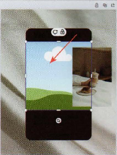

iii @ e

....." " ' a e c 9 ,

###### ` v

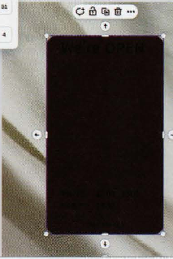

###### .....•

기 도•


###### - :I:그口i

m

...□_ □ 됴

###### - - . ’

###### ’ ’짜으 - 上]

• 의적용모습 ... 의적용 모습

###### 이미지의프레임자동삽입기능재어하기

프레임 위에 이미지 리면 자 쏙 들 사진 교 수 . 하지만 위 지나쳐 가기만 해도 자꾸 프레임 안으로 들어가 버려 때가 있죠?

이 럴 때에는 回겔 도우)/ 〕（맥) 키를누른 재 이동시켜 보 자석 기능

이 일시 프레임에 받지 배지 수

244 캔바 디자인 실전

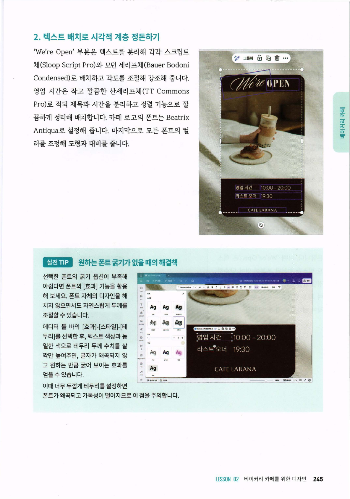

- 2. 시각적 계증 'We're Open' 부분은 텍스트를 분리해 각각 스크립트 체 (Sloop Script Pro)와 모던 세리프체 (Bauer Bodoni Condensed)로 배치하고 각도를 조절해 강조해 줍니댜 영업 시간은 작고 깔끔한 산세리프체 (TT Commons Pro)로 적되 제목과 시간을 분리하고 정렬 기능으로 깔 끔하게 정리해 배치합니다. 카페 로고의 폰트는 Beatrix Antiqua로 설정해 줍니댜 마지막으로 모든 폰트의 컬 러를 조정해 도형과 대비를 줍니댜


――보

E

＿브小-으

R

-선택한 부족해

;:.

아쉽 다면 기능을

해 보세요. 디자인을 해 지지

.:. Ag

--‘ -

오 陵]

"4: ..-·

에디터 툴 바의 두리]를 선택한 후, 색상과 동 일한 색으로 테두리 두께 수지를

·•`... ..

e .

g

###### '--eE

Ag

-

짝만 높여주면, 왜곡되지 고 보이는 효과

-

• Ag

I~”....:... 。－

얻을 수 있습니다.

"" °-" "` • •• o

이때 너무 두껍게 를 폰트가 왜곡되고 가독성이 이 점 주의합니다.

LESSON 02 베이커리 카페를 위한 디자인 245

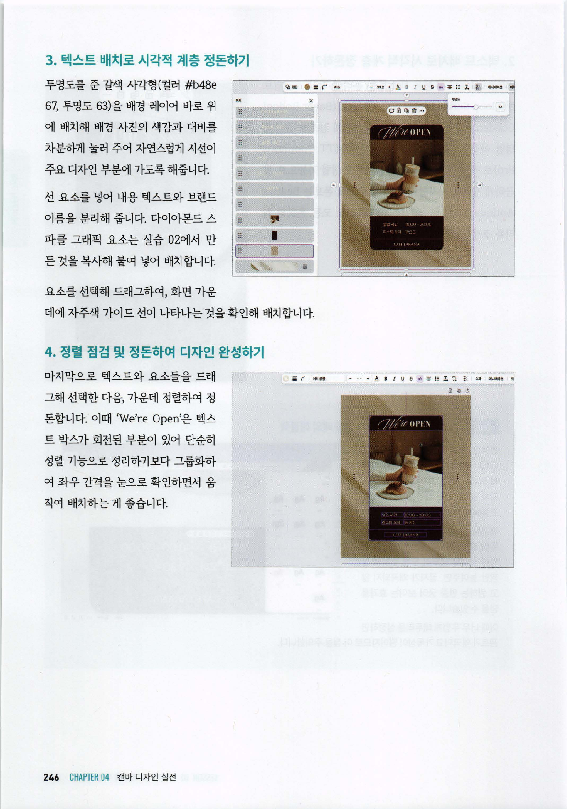

- 3. 텍스트 배치로 시각적 계층 투명도를 준 갈색 사각형(컬러 #b48e 67, 투명도 63)을 배경 레이어 바로 위 에 배치해 배경 사진의 색감과 대비를 차분하게 눌러 주어 자연스럽게 시선이 주요 디자인 부분에 가도록 해줍니다.

선 요소를 넣어 내용 텍스트와 브랜드 이름을 분리해 줍니다. 다이아몬드 스 파클 그래픽 요소는 실습 02에서 만 든것을복사해 붙여 넣어 배치합니다.

•

....

’,

9·” • =r .....

X

-...,. 소 8 / I.I S 마 •i三.!. X

’ ..도

빼••

”

요소를 선택해 드래그하여, 화면 가운

데에 자주색 가이드선이 나타나는것을확인해 배치합니다.

- 4. 정돈하여 디자인


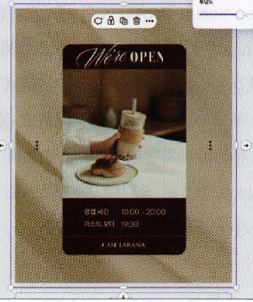

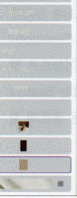

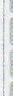

=r 이H - • A / U S 暮 !5 .!. n % "'

마지막으로 텍스트와 요소들을 드래 그해 선택한 다음, 가운데 정렬하여 정

•I

C

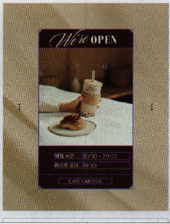

돈합니다. 이때 ‘We're Open’은 텍스

트 박스가 회전된 부분이 있어 단순히

정렬 기능으로 정리하기보다 그룹화하 여 좌우 간격을 눈으로 확인하면서 움

직여 배치하는 게 좋습니다.

246 CHAPTER 04 캔바 디자인 실전

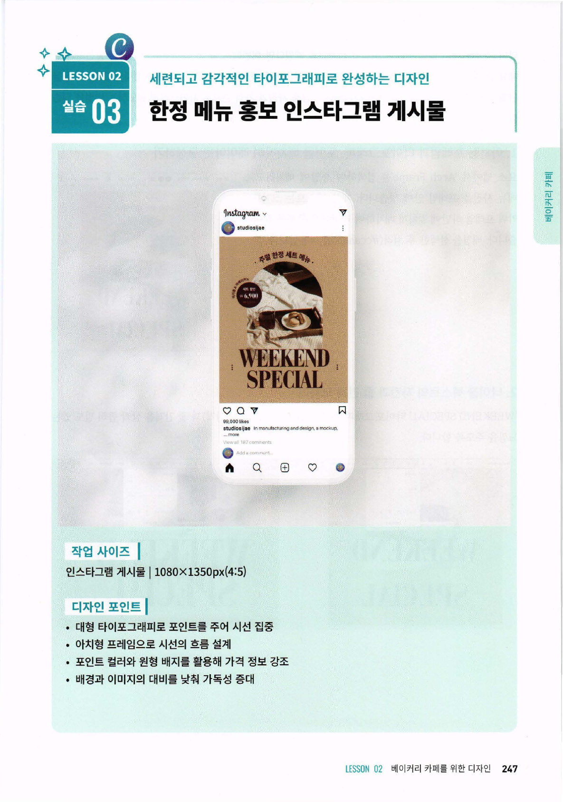

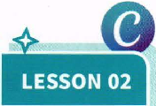

수수


세련되고 감각적인 디자인

코

###### 한정메뉴 흥보 인스타그랩 게Al률

톤

＿모 ．＿으

V'

던UJ'Ul"I, V

studlosljae

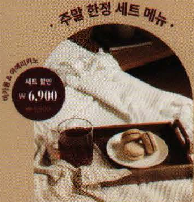

###### I

口

###### oov

_.mo,.

99,000likes studiosljae In manufacluring ond design, • mockup,

~^凡d e

###### ..

" Q`

。

| 1080X1350px(4:5)

###### 디자인 |

- • 주어 시선
- • 아지형 시선의 설계
- • 가격


•

LESSON 02 베이커리 카페를 위한 디자인 247

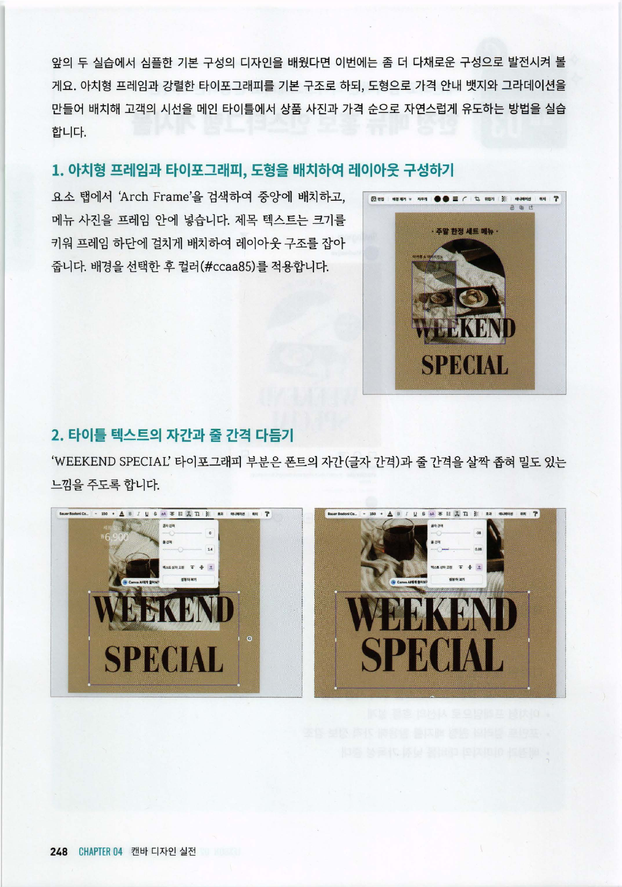

앞의 두 실습에서 심플한 기본 구성의 디자인을 배웠다면 이번에는 좀 더 다채로운 구성으로 발전시켜 볼 게요. 아지형 프레임과 강렬한 타이포그래피를 기본 구조로 하되, 가격 안내 뱃지와 그라데이션을

만들어 배지해 고객의 시선을 메인 타이틀에서 상품 사진과 가격 순으로 자연스럽게 유도하는 실습

합니다.

- 1. 도형을 배지하여 구성하기 요소 탭에서 ‘Arch Frame’을 검색하여 중앙에 배치하고, 메뉴 사진을 프레임 안에 넣습니다. 제목 텍스트는 크기를 키워 프레임 하단에 걸치게 배치하여 레이아웃 구조를 잡아 줍니다. 배경을 선택한 후 컬러 (#ccaa85)를 적용합니다.
- 2. 타이틀 즐


###### @·· "" - ••=r n """ %a`벼 dE •의 ?

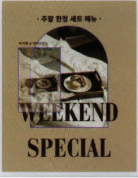

'WEEKEND SPECIAL' 타이포그래피 부분은 폰트의 자간(글자 간격)과 줄 간격을 살짝 좁혀 밀도 있는 느낌을주도록합니다.

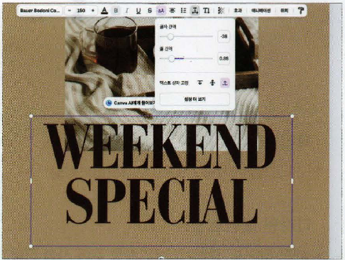

노~"~O- - ... • 소 B I U S "' 零 I: .l n 3' .. • .. "/'

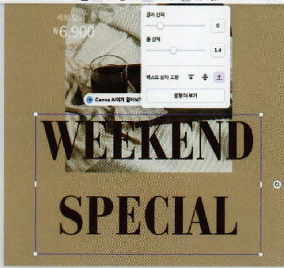

248 CHAPTER 04 캔바 디자인 실전

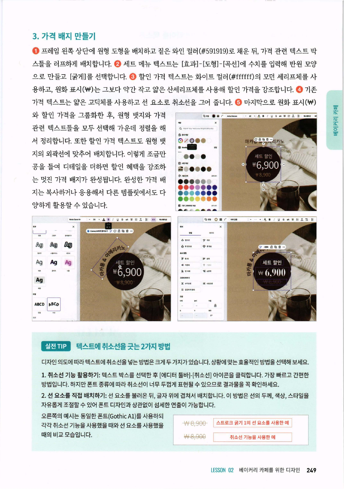

###### 3. 가격 배지

O 프레임 왼쪽 상단에 원형 도형을 배치하고 짙은 와인 컬러(#591919)로 채운 뒤, 가격 관련 텍스트 박

스들을 러프하게 배치합니다. 0 세트 메뉴 텍스트는 [효과]-［도형]-［곡선]에 수치를 입력해 반원 모양

으로 만들고 [굵게]를 선택합니다. O 할인 가격 텍스트는 화이트 컬러(#ffffff)의 모던 세리프체를 사 용하고, 원화 표시(낚)는 그보다 약간 작고 얇은 산세리프체를사용해 할인 가격을강조합니다. O 기존

- 가격 텍스트는 얇은 고딕체를 사용하고 선 요소로 취소선을 그어 줍니다. O 마지막으로 원화 표시(낚)

와 할인 가격을 그룹화한 후, 원형 뱃지와 가격

관련 텍스트들을 모두 선택해 가운데 정렬을 해

- 서 정리합니다. 또한 할인 가격 텍스트도 원형 뱃 지의 외곽선에 맞추어 배치합니다. 이렇게 조금만 공을 들여 디테일을 더하면 할인 혜택을 강조하 는 멋진 가격 배지가 완성됩니다. 완성한 가격 배 지는 복사하거나 응용해서 다른 템플릿에서도 다 양하게 활용할 수 있습니다.


吉 {E

0" • r ..._

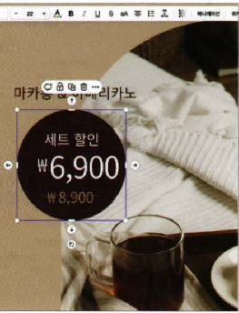

nJk 흐

...

.3..../O••

X

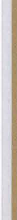

Q

h

.....曺예門

I& .....

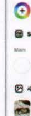

###### ”

e .....•• •

••••

••.••••••••.•••.•

°""m ""

I) ,,.그.~.. ”"'

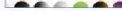

9" °蠶 r .."

###### ..

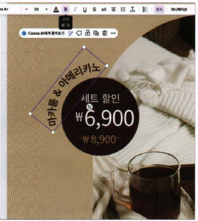

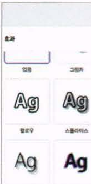

.A I I US .. . !s1.nr

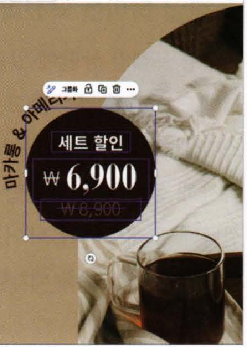

###### " -

X

X

踊

...

&... , ..

###### ....

. .... O I ..

~

Ag "

###### .._

••

會

###### It. ....

` ""

###### ....

......기

Ag

H ....

][솔

三 ...제..

꼬

..

T

@

###### .. ..

ABCO B

....

·던

# - 텍스트에 긋는2가지

디자인 의도에 따라텍스트에 쥐소선율넣는방법은크게두가지가있습니다, 맞는효율적인 방법율선택해보세요.

- 1. 쥐소선 기능 텍스트 박스를 선택한 후 [에디터 툴바]-［쥐소선] 아이콘을 클릭합니다. 가장 빠르고 간편한 하지만 폰트 쥐소선이 너무 수 있으므로 꼭 확인하세요.
- 2. 선 요소를 직접 선 요소를 불러온 뒤, 글자 위에 겹쳐서 배지합니다. 이 방법은 선의 두께, 색상, 스타일을 자유롭게 수


오른쪽의 예시는 폰트(Gothic Al)를 사용하되 각각 주|소선 때와 선 요소 때의비교모습입니다.

〔二--

스트로::：::::::;:용한\

LESSON 02 베이커 리 카페를 위한 디자인 249

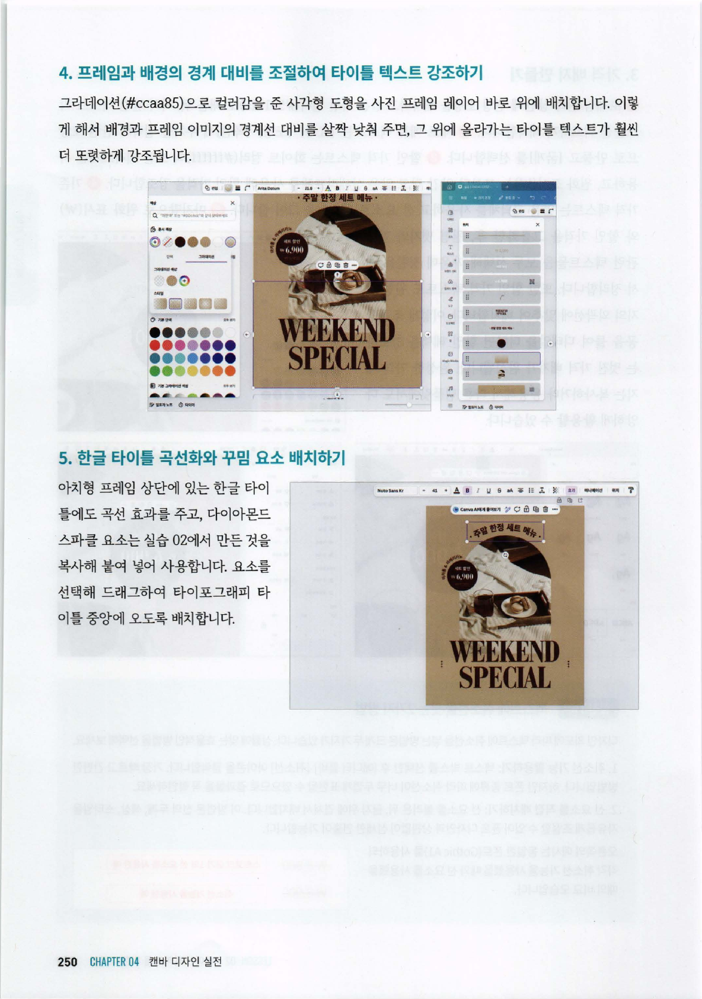

###### 4 프레임과 배경의 경계 타이틀 텍스트 강조하기

그라데이션(#ccaa85)으로 컬러감을 준 사각형 도형을 사진 프레임 레이어 바로 위에 배치합니다. 이렇

게 해서 배경과 프레임 이미지의 경계선 대비를 살짝 낮춰 주면, 그 위에 올라가는 타이틀 텍스트가 훨씬

-

더또렷하게강조됩니댜

广 Qi•• =r - - ' I U S " * 1: 1 K ..

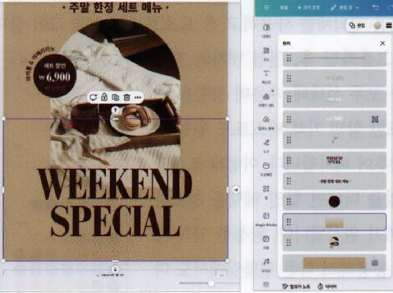

.. x

;.......

'l,H 蠶

Q

0/..•·,· Q

0 ....

"mu ..

7.내 IU..

、

적•

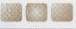

.•.•••••••••••.•••.••

..

e-n g、

-II,,.그-...,,,- - .."'-

,.m ... ~-

E·m꼬 0-

###### 5. 꾸밈 요소

아치형 프레임 상단에 있는 한글 타이

N......‘“ . .1 • 스 B / U S .. 暮 E J. x •• ·“때 때 ,.

###### ~"~/

Ill C

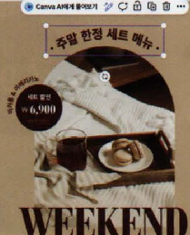

틀에도 곡선 효과를 주고, 다이아몬드 스파클 요소는 실습 02에서 만든 것을 복사해 붙여 넣어 사용합니다. 요소를

선택해 드래그하여 타이포그래피 타

이틀 중앙에 오도록 배치합니다.

###### ! "S ~ f

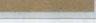

250 CHAPTER 04 캔바 디자인 실전

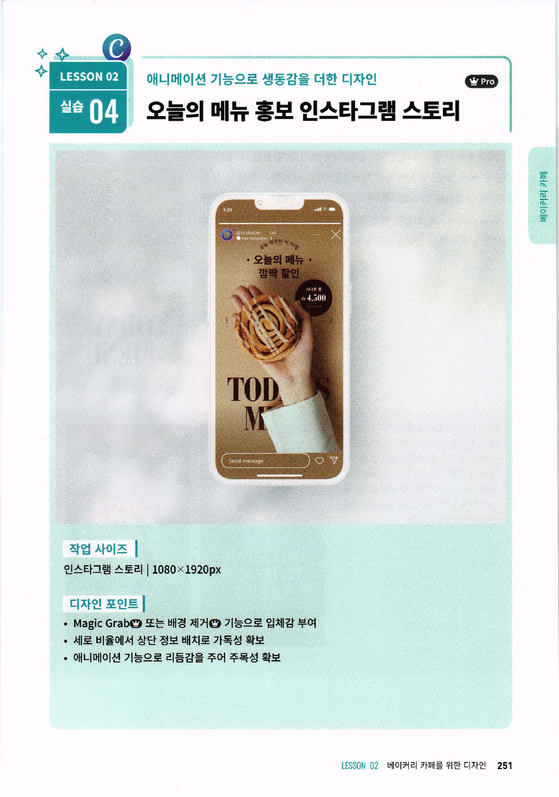

:러 一따」

CEO


애니메이션 기능으로 더한 디자인

스토리

###### 오늘의 매뉴 흥보 인스타그랩

lfn~f

―-으

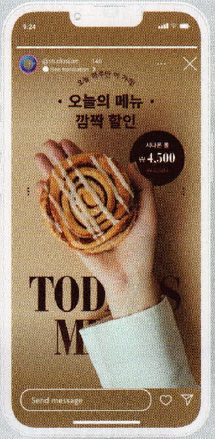

작업 사이즈

X

###### •

•

•

LESSON 02 베이커리 카페를 위한 디자인 251

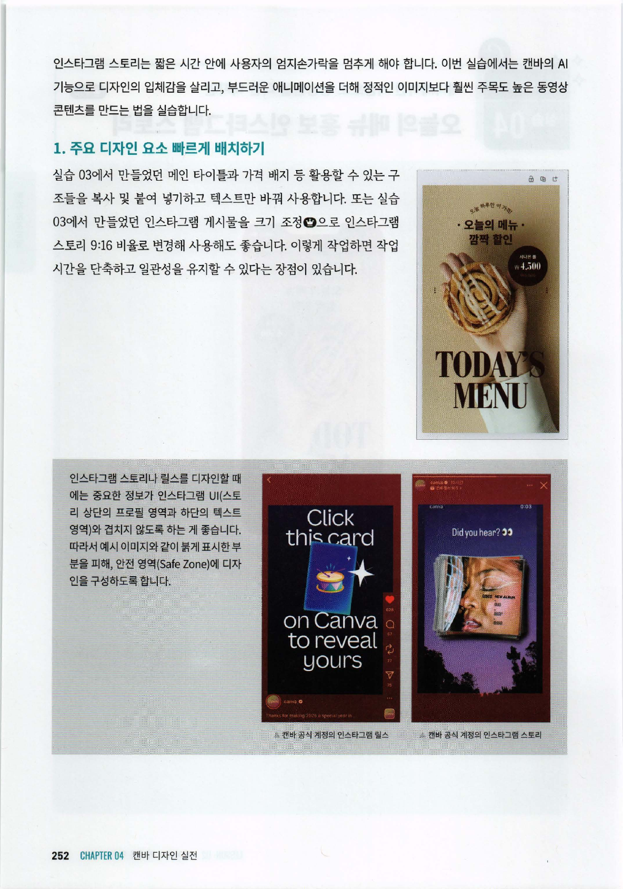

인스타그램 스토리는 짧은 시간 안에 사용자의 엄지손가락을 멈주게 해야 합니다. 이번 실습에서는 캔바의 Al 기능으로 디자인의 입체감을 살리고, 부드러운 애니메이션을 더해 정적인 이미지보다 훨씬 주목도 높은 콘텐츠를 만드는 법을 실습합니다.

###### L 주요 요소 빠르게 배지하기

###### 실습 03에서 만들었던 메인 타이틀과 가격 배지 등 활용할 수 있는 구

###### a @ e

조들을 복사 및 붙여 넣기하고 텍스트만 바꿔 사용합니다. 또는 실습 03에서 만들었던 인스타그램 게시물을 크기 조정0으로 인스타그램 스토리 9:16 비율로 변경해 사용해도 좋습니댜 이렇게 작업하면 작업

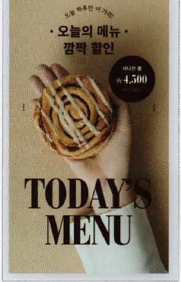

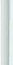

###### 시간을 단축하고 일관성을 유지할 수 있다는 장점이 있습니다.

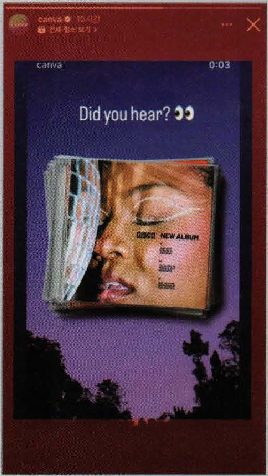

에는 리

게

# ~

인스타그램 릴스

캔바 공식

252 캔바 디자인 실전

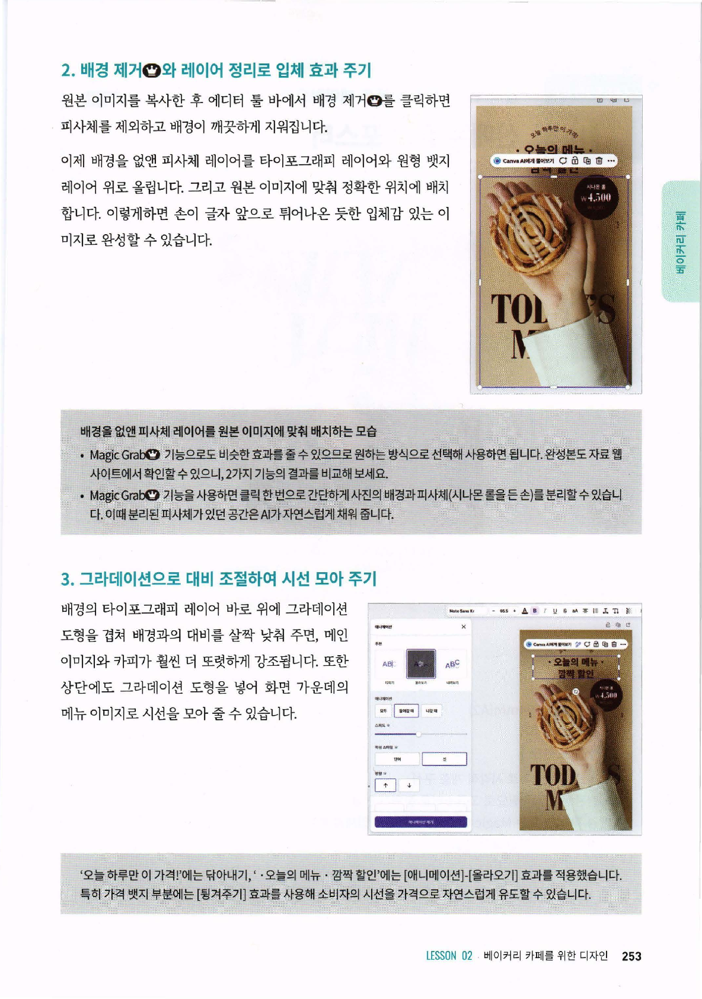

###### 2. 배경 제거O와 레이어 정리로 주기

원본 이미지를 복사한 후 에디터 툴 바에서 배경 제거0틀· 클릭하면

(!J c

피사체를 제외하고 배경이 깨끗하게 지워집니다.

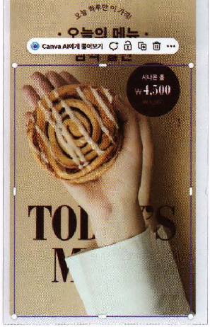

이제 배경을 없앤 피사체 레이어를 타이포그래피 레이어와 원형 뱃지 레이어 위로 올립니다. 그리고 원본 이미지에 맞춰 정확한 위치에 배치

-포 E_ 모 E_ 으玉

합니다. 이렇게하면 손이 글자 앞으로 튀어나온 듯한 입체감 있는 이

미지로 완성할 수 있습니댜

• 웹

•

.


###### 3. 그라데이션으로 시선 주기

###### -...."


배경의 타이포그래피 레이어 바로 위에 그라데이션 도형을 겹쳐 배경과의 대바를 살짝 낮춰 주면, 메인

- ..... 소 · I UG ... ;三 in 終

.,t!

###### ..

a o e

X

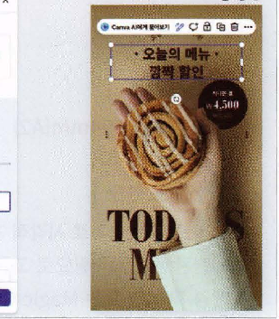

이미지와 카피가 훨씬 더 또렷하게 강조됩니다. 또한 상단에도 그라데이션 도형을 넣어 화면 가운데의 메뉴 이미지로 시선을 모아 줄 수 있습니댜

A려

ABC

.*"

"'rme

•• ~군 ...,.

###### ..,,.,.....

스*

I 산 1


巳” *

L

‘ 늘 루 가 는 ‘ ·오 · 깜짝 '에는 -［ ] 과를 습

히 [ 효 사용 .

LESSON 02 베이커리 카페를 위한 디자인 253

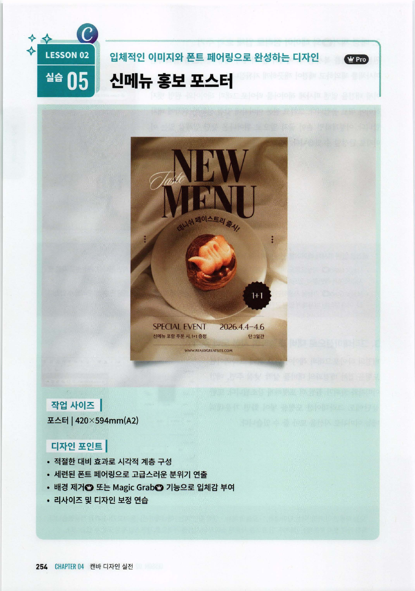

## :러 입체적인 CEO


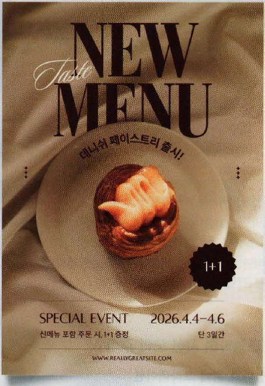

♦ 을*

. - 4.6

단

COM

###### |

###### | X

•

•

- • 또는 Magic Gra바3 부여
- • 리사이즈 및


254 04 캔바 디자인 실전

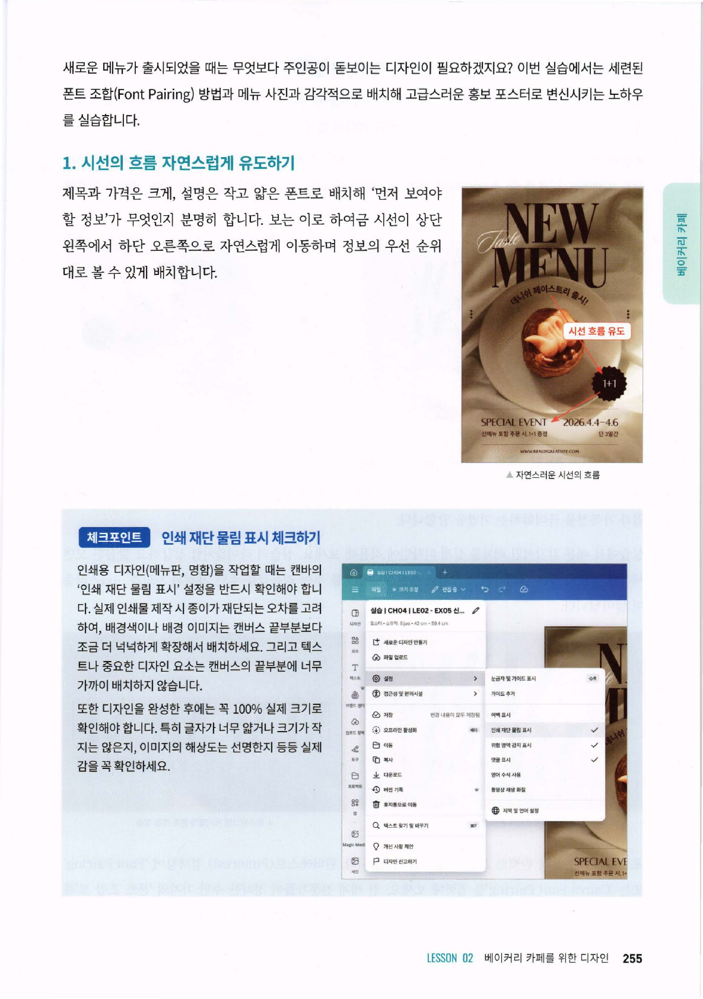

새로운 메뉴가 줄시되었을 때는 무엇보다 주인공이 돋보이는 디자인이 필요하겠지요? 이번 실습에서는 세련된

폰트 조합(Font Pairing) 방법과 메뉴 사진과 감각적으로 배지해 고급스러운 홍보 포스터로 변신시키는 노하우

를실습합니다.

###### L 시선의 유도하기

|제목과 가격은 크게, 설명은 작고 얇은 폰트로 배치해 ‘먼저 보여야|제목과 가격은 크게, 설명은 작고 얇은 폰트로 배치해 ‘먼저 보여야|
|---|---|


＿포

할 정보’가 무엇인지 분명히 합니댜 보는 이로 하여금 시선이 상단 왼쪽에서 하단 오른쪽으로 자연스럽게 이동하며 정보의 우선 순위

C ＿브 E＿으

h

대로볼수있게 배치합니다.

자연스러운시선의흐름

# - 인쇄재단물립표시체크하기

###### ”됴 :" ° I

, 때는

‘인쇄 재단 표시’ 율 반드시 확인해야 합니 댜 실제 제작 시 종이가 고려

실습I CH04I LE02-EX05신... ‘

e t

鳳 . 스·피 ..... . 42C·59‘cn

하여, 배경색이나 배경 이미지는 캔버스

器

巳 섀量힌디'lfll!!I기

조금 더 배지하세요. 그리고 텍스 트나 디자인 요소는 캔버스의 끝부분에 너무

a

。 파'ii 업로드

T

###### ..

..... ® 설칭

는지덫가어드표시

않습니다.

® ® 검여'1l른의시" 靈,,....

가어드후기

후에는 꼭 100% 실제 크기로

o °지장

번경내11이오우지갑딜

아 ll시

-.

###### •

합니댜 글자가 너무 얇거나 크기가 작 지는 않은지, 이미지의 는 한지 제

###### ‘”

豊뚜 .. ,... :., 오프러인.실확

###### •II 표시

e) 어들

”혈영역갑지표시

###### O 印

뎃글 ll시

꼭 확인하세요.

e}

土 다포

영수식사 틀열실재샐..II

....

###### €) 버전기"

*'

8?

@ 尸틀파이틀

@ "'II언어볼필

엽

Q 텍스트!17l'II 硏2기

®

M....M... Q "선사촬峽

@ g

P 따신고빼기

02 베이커리 카페를 위한 디자인 255

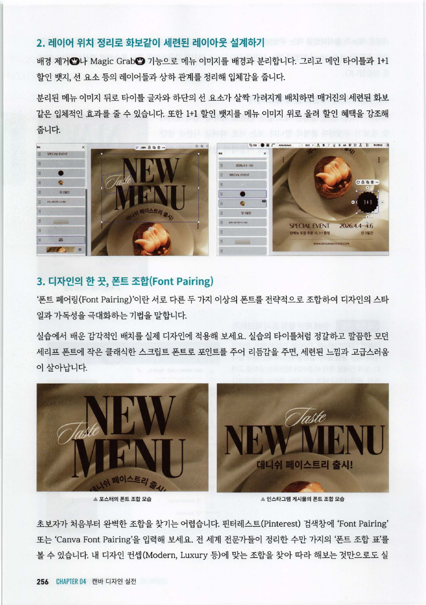

###### 2. 위치배경 제거C'나 Magic GrabO 기능으로 메뉴 이미지를 배경과 분리합니다. 그리고 메인 타이틀과 1+1할인 뱃지, 선 요소 등의 레이어들과 상하 관계를 정리해 입체감을 줍니다.

분리된 메뉴 이미지 뒤로 타이틀 글자와 하단의 선 요소가 살짝 가려지게 배치하면 매거진의 세련된 화보 같은 입체적인 효과를 줄 수 있습니다. 또한 1+1 할인 뱃지를 메뉴 이미지 위로 올려 할인 혜택을 강조해

줍니다.

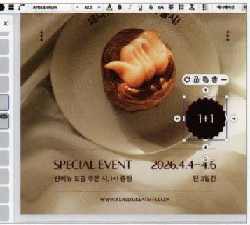

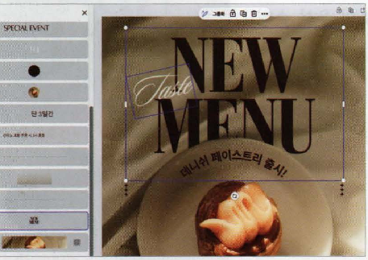

Q ..

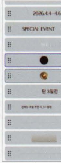

###### 3. 끗, 폰트 Pairing)‘폰트 페어링 (Font Pairing)’이란 서로 다른 두 가지 이상의 폰트를 전략적으로 조합하여 디자인의 스타일과 가독성을 극대화하는 기법을 말합니댜

실습에서 배운 감각적인 배치를 실제 디자인에 적용해 보세요. 실습의 타이틀처럼 정갈하고 깔끔한 모던

###### 세리프 폰트에 작은 클래식한 스크립트 폰트로 포인트를 주어 리듬감을 주면, 세련된 느낌과 고급스러움

###### 이살아납니다.

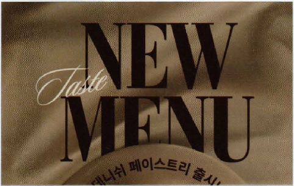

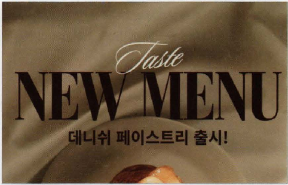

~ 포스터의 폰트 조합 모습 ... 인스타그램 게시물의 폰트 조합 모습

초보자가 처음부터 완벽한 조합을 찾기는 어렵습니댜 핀터레스트(Pinterest) 검색창에 ‘Font Pairing' 또는 ‘Canva Font Pairing'을 입력해 보세요. 전 세계 전문가들이 정리한 수만 가지의 ‘폰트 조합 표'를 볼 수 있습니댜 내 디자인 컨셉 (Modern, Luxury 등)에 맞는 조합을 찾아 따라 해보는 것만으로도 실

256 CHAPTER 04 캔바 디자인 실전

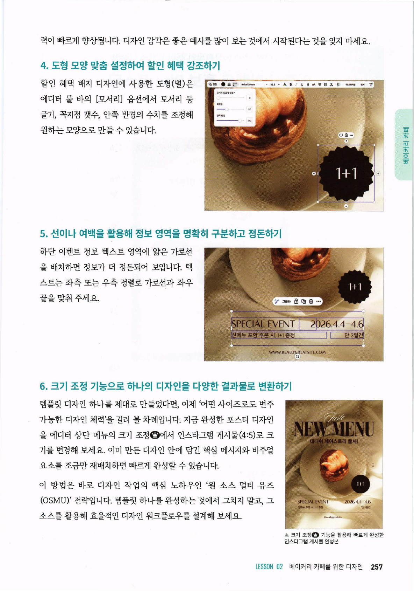

력이 빠르게 향상됩니댜 디자인 감각은 좋은 예시를 많이 보는 것에서 시작된다는 것을 잊지 마세요.

###### 4. 도형 맞춤 설정하여 혜택 강조하기

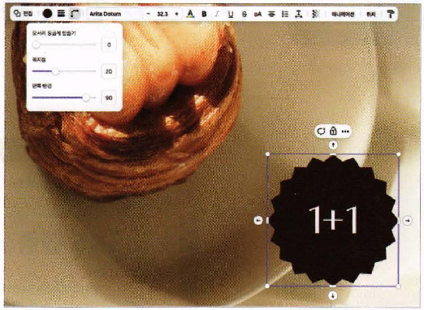

할인 혜택 배지 디자인에 사용한 도형(별)은 에디터 툴 바의 [모서리] 옵션에서 모서리 둥

글기, 꼭지점 갯수, 안쪽 반경의 수치를 조정해 원하는 모양으로 만들 수 있습니다.

＿포

E

＿브 ’E으玉


###### 5. 선이나 여백을 정보 구분하고

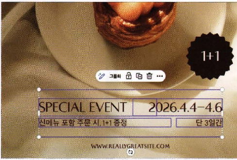

하단 이벤트 정보 텍스트 영역에 얇은 가로선

을 배치하면 정보가 더 정돈되어 보입니다. 텍

스트는 좌측 또는 우측 정렬로 가로선과 좌우

끝을맞춰주세요.

. . .

Q

###### 6. 크기 조정 기능으로 하나의 디자인을 다양한 변환하기

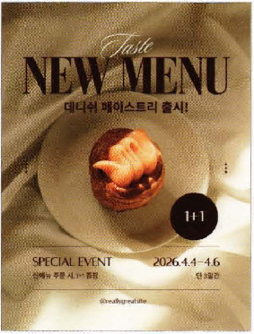

템플릿 디자인 하나를 제대로 만들었다면, 이제 ‘어떤 사이즈로도 변주

가능한 디자인 체력'을 길러 볼 차례입니다. 지금 완성한 포스터 디자인

울 에디터 상단 메뉴의 크기 조정Ck]서 인스타그램 게시물(4:5)로 크

기를 변경해 보세요. 이미 만든 디자인 안에 담긴 핵심 메시지와 비주얼 요소를 조금만 재배치하면 빠르게 완성할 수 있습니다. 이 방법은 바로 디자인 작업의 핵심 노하우인 ‘원 소스 멀티 유즈

(OSMU)' 전략입니다. 템플릿 하나를 완성하는 것에서 그치지 말고, 그

###### 소스를 활용해 효율적인 디자인 워크플로우를 설계해 보세요.

^ 크기 조정C》 기능을 활용해 빠르게 완성한

인스타그램 게시물 완성본

L ON 02 베이커리 카페를 위한 디자인 257

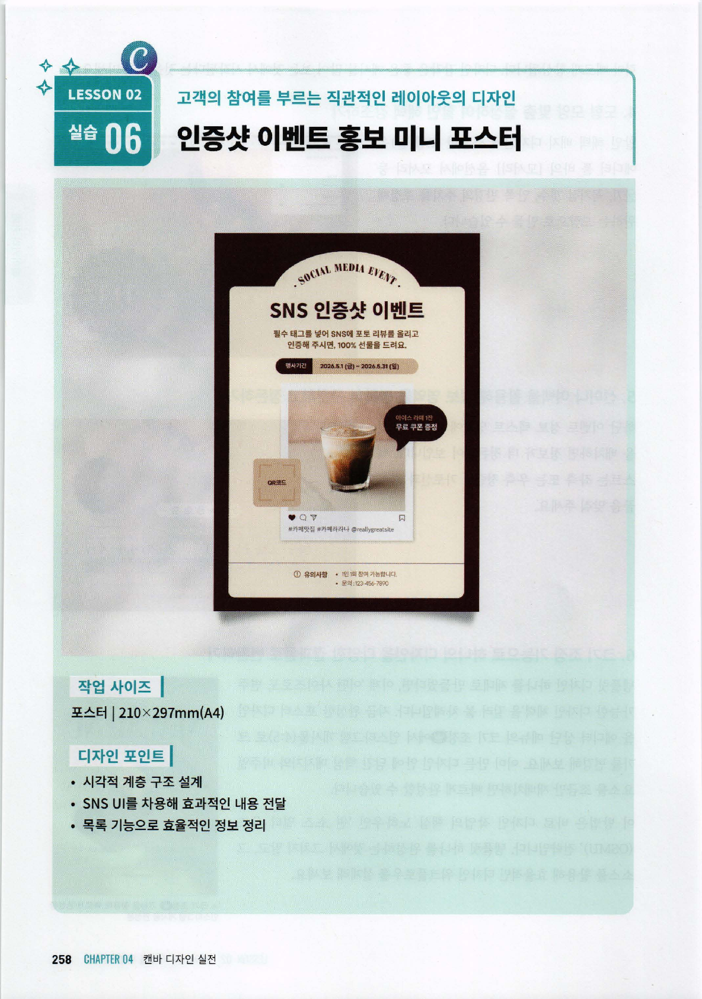

:러 고객의


:

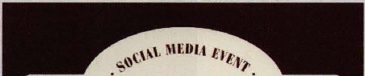

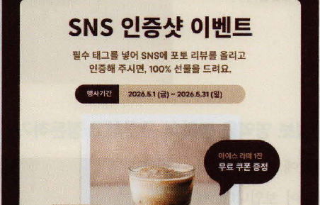

###### SNS

넣어 SNS에 포토

, 100% 드려요.

- . 글)-

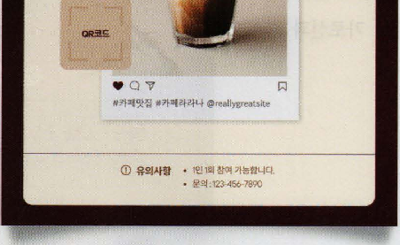

C

###### .( Q V

囚

·카뻬맛집 尊카빼라라나 @reaIInreats,te

© • 떠

•

사이즈 l

| X

•

- • 차용해 효과적인
- • 목록


258 캔바 디자인 실전

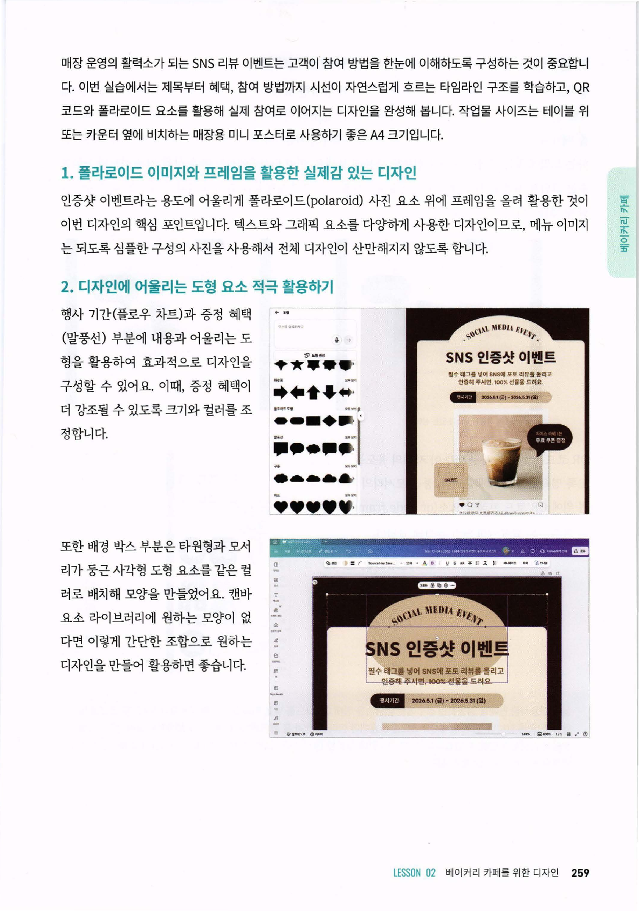

매장 운영의 활력소가 되는 SNS 리뷰 이벤트는 고객이 잠여 방법을 한눈에 이해하도록 구성하는 것이 중요합니

- 다. 이번 실습에서는 제목부터 혜택, 잠여 방법까지 시선이 자연스럽게 흐르는 타임라인 구조를 학습하고, QR 코드와 폴라로이드 요소를 활용해 실제 잠여로 이어지는 디자인을 완성해 봅니다. 작업물 사이즈는 테이블 위 또는 카운터 옆에 비지하는 매장용 미니 포스터로 사용하기 좋은 A4 크기입니다.

- 1. 폴라로이드 이미지와 프레임을 있는 디자인

인증샷 이벤트라는 용도에 어울리게 폴라로이드(polaroid) 사진 요소 위에 프레임을 올려 활용한 것이 이번 디자인의 핵심 포인트입니다. 텍스트와 그래픽 요소를 다양하게 사용한 디자인이므로, 메뉴 이미지 는 되도록 심플한 구성의 사진을 사용해서 전체 디자인이 산만해지지 않도록 합니다.

- 2. 도형 요소 적극 활용하기


행사 기간(플로우 차트)과 증정 혜택

(말풍선) 부분에 내용과 어울리는 도 형을 활용하여 효과적으로 디자인을

구성할 수 있어요. 이때, 증정 혜택이

- 더 강조될 수 있도록 크기와 컬러를 조 정합니다.

또한 배경 박스 부분은 타원형과 모서 리가둥근사각형 도형 요소를같은컬

- 러로 배치해 모양을 만들었어요. 캔바 요소 라이브러리에 원하는 모양이 없 다면 이렇게 간단한 조합으로 원하는 디자인을 만들어 활용하면 좋습니다.


＿토 ＿부 ＿으玉

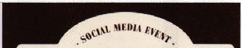

.. 도·

참i`｀`` OlA% .

..섹0崎요

9 ➔

si ....

을* )

... ..”

---·......도.

넣어 포토

빠*會틀岭)

"

...,,'

- - ......

u ... 零 l三 i K ·"" .. 'i':떠

& • C

- - (11)


·廳~•••」

... ...,,

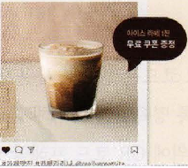

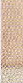

•••••..

•••••

•• ••”

|編甄 • o • • · :.m••1

o.. .. r - -…. A •

Cll-a-Tg*.~0i4"e;

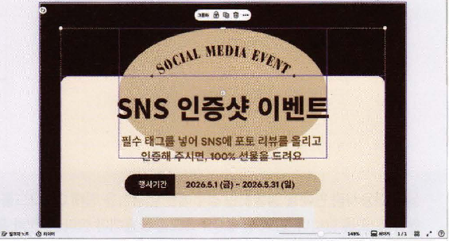

###### ;

l0

###### LESSON 02 베이커리 카페를 위한 디자인 259

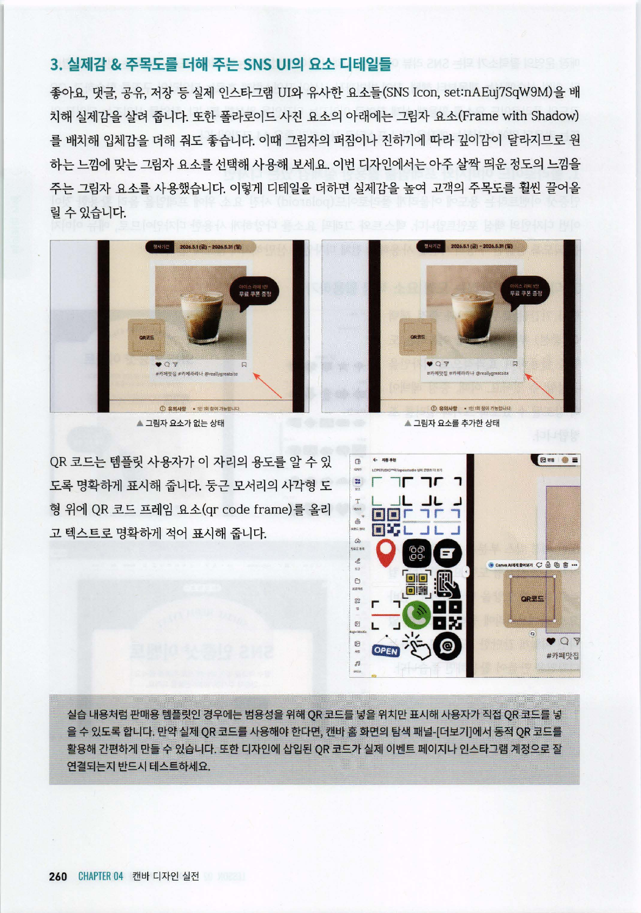

- 3. 실제감 & 주목도를 더해 주는 SNS UI의 요소 좋아요, 댓글, 공유, 저장 등 실제 인스타그램 UI와 유사한 요소들(SNS Icon, set:nAEuj7SqW9M)을 배 치해 실제감을 살려 줍니다. 또한 폴라로이드 사진 요소의 아래에는 그림자 요소(Frame with Shadow) 를 배치해 입체감을 더해 줘도 좋습니다. 이때 그림자의 퍼짐이나 진하기에 따라 깊이감이 달라지므로 원 하는 느낌에 맞는 그림자 요소를 선택해 사용해 보세요. 이번 디자인에서는 아주 살짝 띄운 정도의 느낌을 주는 그림자 요소를 사용했습니다. 이렇게 디테일을 더하면 실제감을 높여 고객의 주목도를 훨씬 끌어올 릴수있습니댜


###### -·1,_."‘11C111

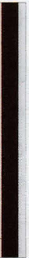

###### ••C111

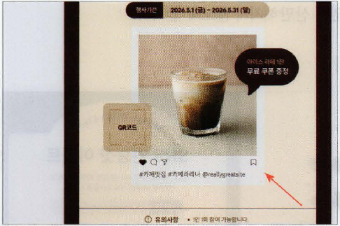

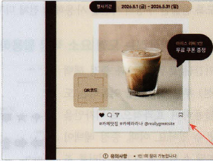

Ii

口

QV 口

.' O v

\

\

..러라나 .,..,,,.,......

C) • 언1"잡이

Q • lt! flOI

~ 그림자 요소가 없는 상태 ~ 그림자 요소를 주가한 상태

###### 。 ..""

〔

口

o" "mn霞*F"＇＂＇'"'......q" r

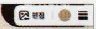

QR 코드는 템플릿 사용자가 이 자리의 용도를 알 수 있 도록 명확하게 표시해 줍니다. 둥근 모서리의 사각형 도 형 위에 QR 코드 프레임 요소(qr code frame)를 올리 고 텍스트로 명확하게 적어 표시해 줍니다.

巨

gg

琴

gT3*

曰

###### _ oo`

98

###### 0

###### 金77"0~

2 Q

흉 •••

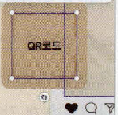

###### ]＿L.

罪 O

8&·Ele2

g

#

율

.

260 04 캔바 디자인 실전

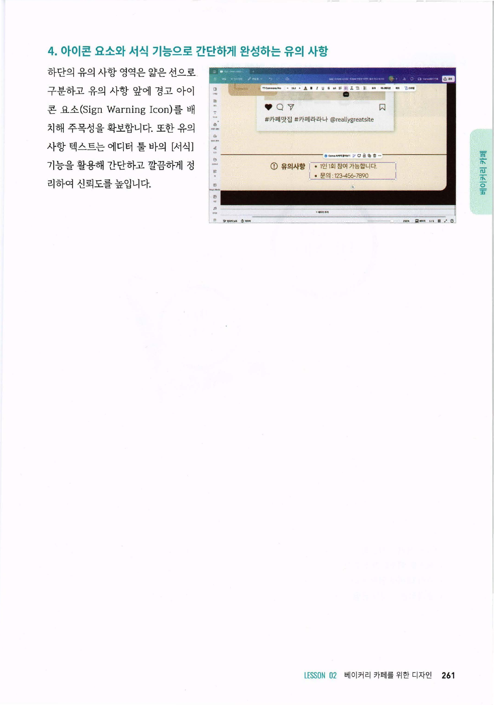

###### 4. 아이콘 서식 기능으로 완성하는 유의 사항

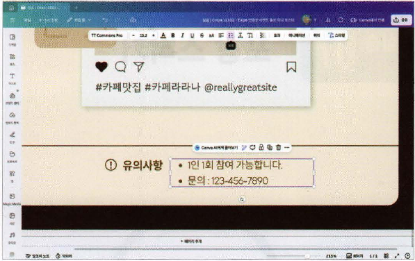

하단의 유의 사항 영역은 얇은 선으로 구분하고 유의 사항 앞에 경고 아이

· = •A I I U & .. 도 1三 i n t " -- .. ? "..

###### • a~ •

口

콘 요소(Sign Warning Icon)를 배

#카페맛집 #카페라라나 @reallygreatsite

치해 주목성을 확보합니다. 또한 유의

사항 텍스트는 에디터 툴 바의 [서식]

＿포 E브，

###### ”""""'/ C8°‘···

® I • 1회 .

###### 기능을 활용해 간단하고 깔끔하게 정

I • :

E＿으

리하여 신뢰도를 높입니댜

L

"-

畵―·”g

mm 딜_ .,,

02 베이커리 카페를 위한 디자인 261

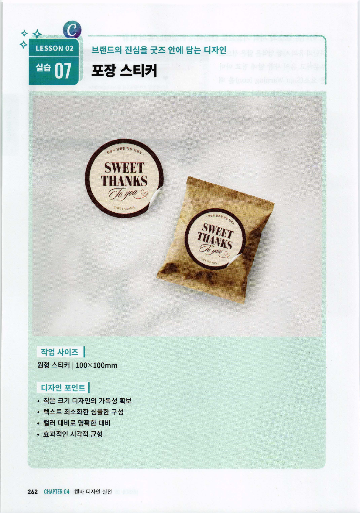

수수

늠" 브랜드의 굿즈안에 디자인

포장스티커


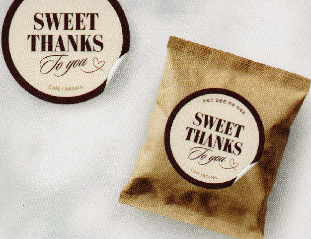

###### /

###### |

###### |1oox1oomm

•

•

•

262 캔바 디자인 실전

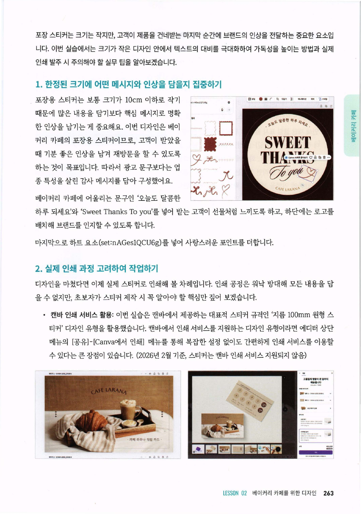

포장 스티커는 크기는 작지만, 고객이 제품을 건네받는 마지막 순간에 브랜드의 인상을 전달하는 중요한 요소입

니다. 이번 실습에서는 크기가 작은 디자인 안에서 텍스트의 대비를 극대화하여 가독성을 높이는 방법과 실제

인쇄 발주 시 주의해야 할 실무 팁율 알아보겠습니다.

###### L 크기에 매시지와 집중하기

포장용 스티커는 보통 크기가 10cm 이하로 작기

0•• • 三 r n ..,, X

0

‘ .

###### 「一

론

때문에 많은 내용을 담기보다 핵심 메시지로 명확 한 인상을 남기는 게 중요해요. 이번 디자인은 베이 커리 카페의 포장용 스티커이므로, 고객이 받았을

..

＿

E1 으

###### SWEET T

R

때 기분 좋은 인상을 남겨 재방문을 할 수 있도록

###### 하는 것이 목표입니댜 따라서 광고 문구보다는 업

종 특성을 살린 감사 메시지를 담아 구성했어요.

屯凡 ?

베이커리 카페에 어울리는 문구인 ‘오늘도 달콤한

하루 되세요’와 ‘Sweet Thanks To you'를 넣어 받는 고객이 선물처럼 느끼도록 하고, 하단에는 로고를

배치해 브랜드를 인지할 수 있도록 합니다.

마지막으로 하트 요소(set:nAGeslQCU6g)를 넣어 사랑스러운 포인트를 더합니다.

###### 2. 고려하여

###### 디자인을 마쳤다면 이제 실제 스티커로 인쇄해 볼 차례입니다. 인쇄 공정은 워낙 방대해 모든 내용을 담

을 수 없지만, 초보자가 스티커 제작 시 꼭 알아야 할 핵심만 짚어 보겠습니다.

캔바 인쇄 서비스 활용: 이번 실습은 캔바에서 제공하는 대표적 스티커 규격인 ‘지름 100mm 원형 스 티커' 디자인 유형을 활용했습니다. 캔바에서 인쇄 서비스를 지원하는 디자인 유형이라면 에디터 상단 메뉴의 [공유] - ［Canva에서 인쇄] 메뉴를 통해 복잡한 설정 없이도 간편하게 인쇄 서비스를 이용할 수 있다는 큰 장점이 있습니댜 (2026년 2월 기준, 스티커는 캔바 인쇄 서비스 지원되지 않음)

_,.G ...., ---

v a • • C

x

I촬어툰혈튀xl

••빼...••.`"

###### --·

###### OU~'

• ,;::: `.

門

“ 국수

-•·- ..... c__•_@IOa_e

一

LESSON 02 베이커리 카페를 위한 디자인 263

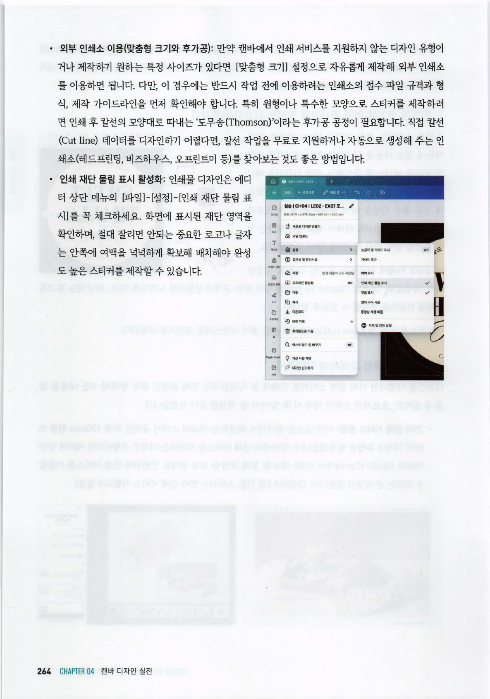

- • 외부 인쇄소 이용(맞즘형 크기와 후가공): 만약 캔바에서 인쇄 서비스를 지원하지 않는 디자인 유형이 거나 제작하기 원하는 특정 사이즈가 있다면 [맞춤형 크기] 설정으로 자유롭게 제작해 외부 인쇄소 를 이용하면 됩니다. 다만; 이 경우에는 반드시 작업 전에 이용하려는 인쇄소의 접수 파일 규격과 형 식, 제작 가이드라인을 먼저 확인해야 합니다. 특히 원형이나 특수한 모양으로 스티커를 제작하려 면 인쇄 후 칼선의 모양대로 따내는 ‘도무송(Thomson)’이라는 후가공 공정이 필요합니다. 직접 칼선 (Cut line) 데이터를 디자인하기 어렵다면, 칼선 작업을 무료로 지원하거나 자동으로 생성해 주는 인 쇄소(레드프린팅, 비즈하우스, 오프린트미 등)를 찾아보는 것도 좋은 방법입니다.
- • 인쇄 재단 물림 표시 활성화: 인쇄물 디자인은 에디 터 상단 메뉴의 [파일]-［설정]-［인쇄 재단 물림 표


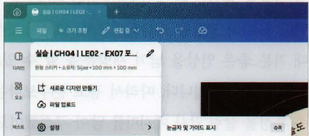

u II.....,•••지 .....100.....IOOmm

시]를 꼭 체크하세요. 화면에 표시된 재단 영역을

`

鷄 g 세"따m"＇I

” °“1:1"

###### 확인하며, 절대 잘리면 안되는 중요한 로고나 글자

T

-..

... ® "

는 안쪽에 여백을 넉넉하계 확보해 배치해야 완성

®* ® 0러""的`’

>

도 높은 스티커를 제작할 수 있습니다.

###### ..G,." ((....-•1 ..

0 꽤촬 던．네.이모루피’뢸 """

JJ

###### ‘” 甲

e 때 뺏it"

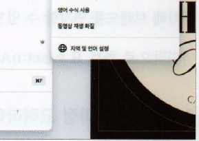

....e 土먀또

€ 버딘기.

###### 8?• @"""l·

g Q 빽색11기'II…기

_ .... Q 기선서할畑

Ii:! P t1~신고"'’

때

264 CHAPTER 04 캔바 디자인 실전

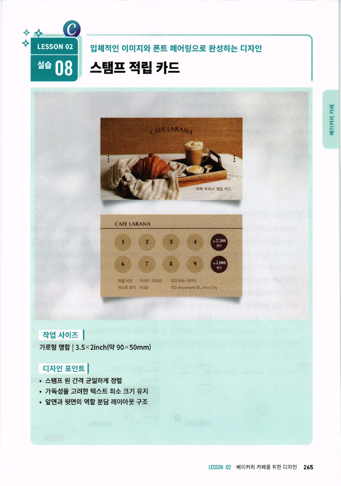

:러:


입체적인 이미지와 페어링으로 완성하는 디자인

###### 스텝프적립카드

-프

－미 k ＿으

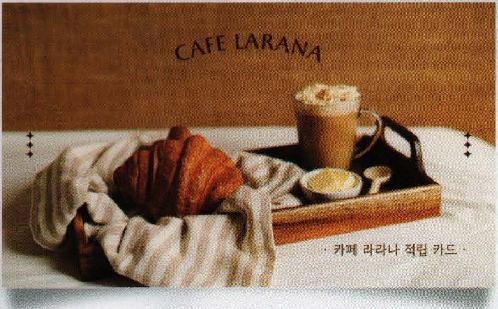

h

# ••

###### ’

7

-


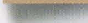

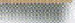

작업 사이즈 |

3.Sx 90X50mm)

###### 디자인 포인트|

- • 간격 정렬
- • 크기 유지


•

LESSON 02 베이커리 카페를 위한 디자인 265

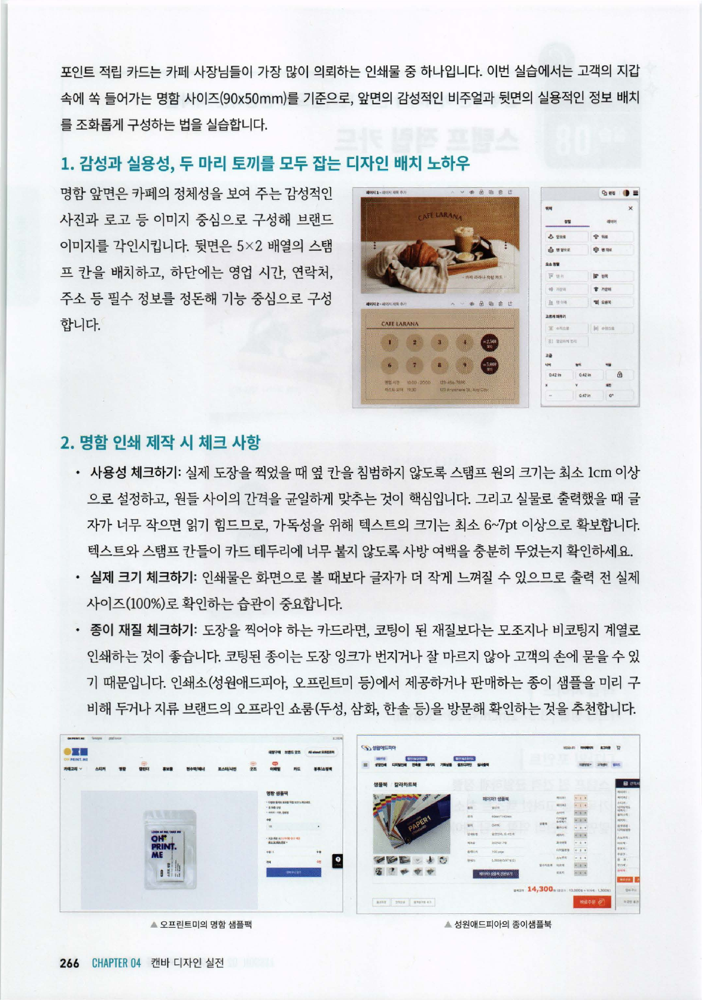

포인트 적립 카드는 카페 사장님들이 가장 많이 의뢰하는 인쇄물 중 하나입니다. 이번 실습에서는 고객의 지갑

속에 쏙 들어가는 명함 사이즈(90x50mm)를 기준으로, 앞면의 감성적인 비주얼과 뒷면의 실용적인 정보 배지

를 조화롭게 구성하는 법을 실습합니다.

###### 1. 두 모두 잡는 노하우

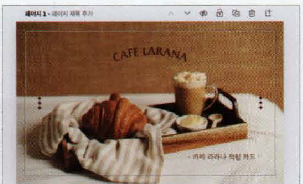

명함앞면은카페의 정체성을 보여 주는감성적인 사진과 로고 등 이미지 중심으로 구성해 브랜드

0 蠶

” -

•• X

<!,.... ....

&曺.. ' ..

이미지를 각인시킵니다. 뒷면은 5X2 배열의 스탬 프 칸을 배치하고, 하단에는 영업 시간, 연락처,

" "

.....

冒 ..

빼 ""

嶋J.• 1 ••, ^ • a 11t c 열 •••

주소 등 필수 정보를 정돈해 기능 중심으로 구성 합니다.

...."

H 어

• I

..

1 ' • ‘

’ ’ • • ... ..

..

O..m o.." a

o.,들 ..

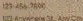

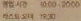

` -I

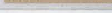

###### 2. 시

- • 사용성 제크하기: 실제 도장을 찍었을 때 옆 칸을 침범하지 않도록 스탬프 원의 크기는 최소 1cm 이상 으로 설정하고, 원들 사이의 간격을 균일하게 맞추는 것이 핵심입니다. 그리고 실물로 출력했을 때 글 자가 너무 작으면 읽기 힘드므로, 가독성을 위해 텍스트의 크기는 최소 6~7pt 이상으로 확보합니다. 텍스트와스탬프칸들이 카드테두리에 너무붙지 않도록사방여백을충분히 두었는지 확인하세요.
- • 실제 크기 체크하기: 인쇄물은 화면으로 볼 때보다 글자가 더 작게 느껴질 수 있으므로 출력 전 실제 사이즈(100%）로 확인하는 습관이 중요합니다.
- • 종이 재질 체크하기: 도장을 찍어야 하는 카드라면, 코팅이 된 재질보다는 모조지나 비코팅지 계열로 인쇄하는 것이 좋습니다. 코팅된 종이는 도장 잉크가 번지거나 잘 마르지 않아 고객의 손에 묻을 수 있 기 때문입니다. 인쇄소(성원애드피아, 오프린트미 등)에서 제공하거나 판매하는 종이 샘플을 미리 구 비해 두거나 지류 브랜드의 오프라인 쇼룸(두성, 삼화, 한솔 등)을 방문해 확인하는 것을 추천합니댜
- ••


___,,

·-~ag·-ffllg

_

|一_••_"'.대'"'.,J,,••',' I- -I···1’,1'1''’,u볼

.뺄어 .” "'"'.1 凰픽.. ”

샐" llztll&II

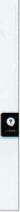

.""‘

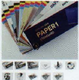

id"-

' -

..:: E_!_ •

-

-

i~~~~~

'...

###### • ’

...' `·

.

‘" ""

i

•••• 14, , ,” " '.""' I ..N

| .m·

.... 오프린트미의 영함 샘플팩 .... 성원애드피아의 종이샘플북

266 캔바 디자인 실전

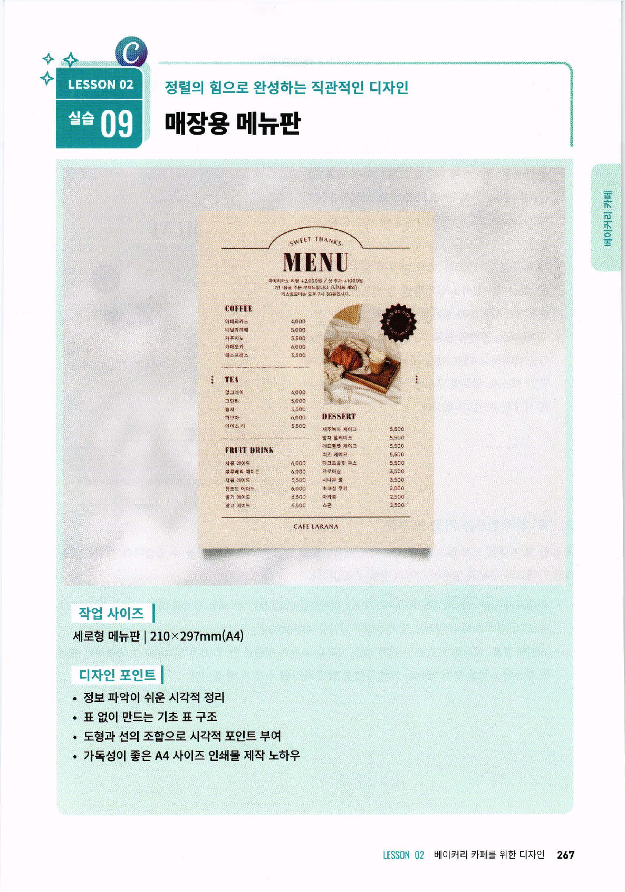

:러


정렬의 힘으로 직관적인 디자인

코


###### 매장용매뉴판

_― ＿미훈으


, 원 / 섯 원

1인 주룬 .

오후

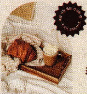

OI 4, 5,

- 5,
- 6,


- 4,
- 5


흥자

5,

-· ····· ••• • ••• ·- • ···斷••

5, 5

6,

3, 2,

- 5,500
- 6,


딸기

2,

6, 스콘

LAR

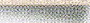

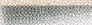

###### 작업 사이즈

###### 디자인 포인트 |

• •

###### •

•

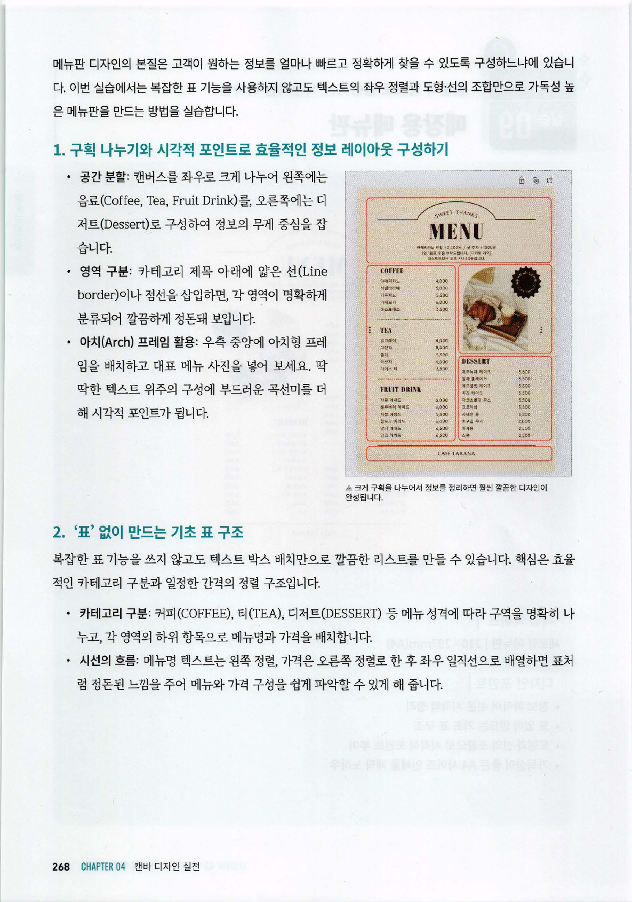

메뉴판 디자인의 본질은 고객이 원하는 정보를 얼마나 빠르고 정확하게 잦을 수 있도록 구성하느냐에 있습니 다. 이번 실습에서는 복잡한 표 기능을 사용하지 않고도 텍스트의 좌우 조합만으로 가독성 높

은 메뉴판을 만드는 방법을 실습합니다.

###### L 구획 나누기와 시각적 포인트로 정보 구성하기

###### a ® 巳

- • 공간 분할: 캔버스를 좌우로 크계 나누어 왼쪽에는 음료(Coffee, Tea, Fruit Drink)를, 오른쪽에는 디 저트(Dessert)로 구성하여 정보의 무게 중심을 잡 습니다.
- • 영역 구분: 카테고리 제목 아래에 얇은 선 (Line border)이나 점선을 삽입하면, 각 영역이 명확하게 분류되어 깔끔하게 정돈돼 보입니다.
- • 아치(Arch) 프레임 활용: 우측 중앙에 아치형 프레 임을 배치하고 대표 메뉴 사진을 넣어 보세요. 딱 딱한 텍스트 위주의 구성에 부드러운 곡선미를 더 해 시각적 포인트가 됩니다.


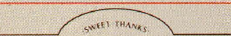

냐 000현 / 싯 •• +1000!

1인 l홑 . ( .

는 7시 ,o 니다

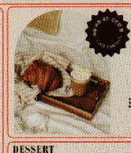

###### C " ;:

, ,ooo

5,

카..모카 ’ ,000

,,soo

멸그레01

5

허브자 6, 어이스 티 3,

케어크

."`..-,••...•. .••• ••• ••••••• ••• . •••

•께어.3.

5

###### ' T ,'

무스 ·擧1111리 어아드 6,000 크로아상

시나른 I 집포도 예이드 00O

2,000

이커틀 스론

CAFE l

.... 크게 구획을 나누어서 정보를 정리하면 끔한 디자인이 완성됩니댜

- 2. ‘표' 없이 만드는 기조 표 구조


복잡한 표 기능을 쓰지 않고도 텍스트 박스 배치만으로 깔끔한 리스트를 만들 수 있습니다. 핵심은 효율 적인 카테고리 구분과 일정한 간격의 정렬 구조입니다.

- • 카테고리 구분: 커피 (COFFEE), 티(TEA), 디저트(DESSERT) 등 메뉴 성격에 따라 구역을 명확히 나 누고, 각 영역의 하위 항목으로 메뉴명과 가격을 배치합니다.
- • 시선의 흐름: 메뉴명 텍스트는 왼쪽 정렬, 가격은 오른쪽 정렬로 한 후 좌우 일직선으로 배열하면 표처 럼 정돈된 느낌을 주어 메뉴와 가격 구성을 쉽게 파악할 수 있게 해 줍니다.


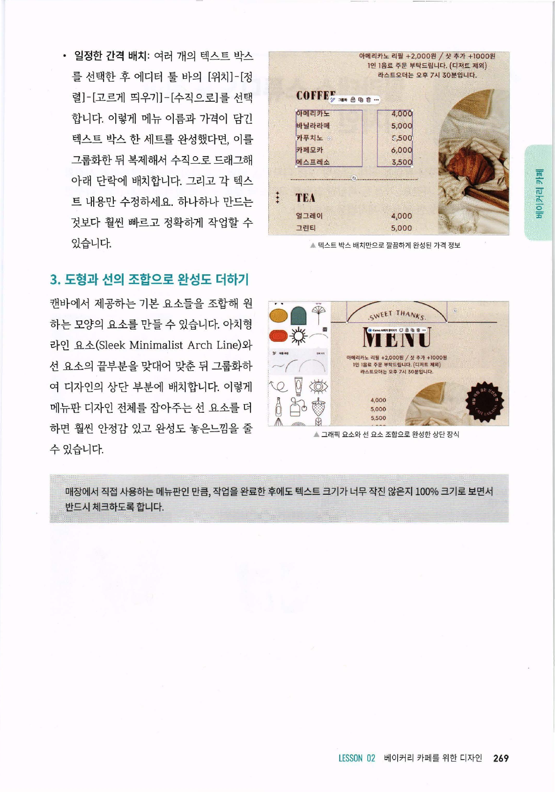

일정한 간격 배지: 여러 개의 텍스트 박스

/

1

룰 선택한 후 에디터 툴 바의 [위치]-［정 렬]-［고르게 띄우기]-［수직으로]를 선택 합니다. 이렇게 메뉴 이름과 가격이 담긴

오후 7시 니 다.

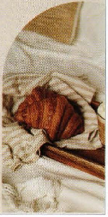

###### C

# 끄嶋 lil !a ® •••

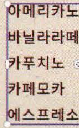

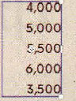

텍스트 박스 한 세트를 완성했다면, 이를

S

그룹화한 뒤 복제해서 수직으로 드래그해 아래 단락에 배치합니다. 그리고 각 텍스

＿토

E ＿모 E＿으玉

············".....•......

令令

令

###### 트 내용만 수정하세요. 하나하나 만드는

이

것보다 훨씬 빠르고 정확하게 작업할 수

,

있습니댜

.... 텍스트 박스 배지만으로 깔끔하게 완성된 가격 정보

###### 3. 도형과 선의 조합으로 완성도 더하기

캔바에서 제공하는 기본 요소들을 조합해 원

一·잤.:宁―

.s

하는 모양의 요소를 만들 수 있습니다. 아치형

라인 요소(Sleek Minimalist Arch Line)와

`..... om ~ / /\

/

선 요소의 끝부분을 맞대어 맞춘 뒤 그룹화하

1 인 1을로

7시 .

###### :'當

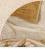

여 디자인의 상단 부분에 배치합니다. 이렇게

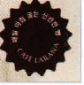

- 4,
- 5,


伯麟喜

메뉴판 디자인 전체를 잡아주는 선 요소를 더 하면 훨씬 안정감 있고 완성도 놓은느낌을 줄

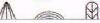

... 그래픽 요소와 선 요소 조합으로 완성한 상단 장식

수있습니다.


크기로 합니다.

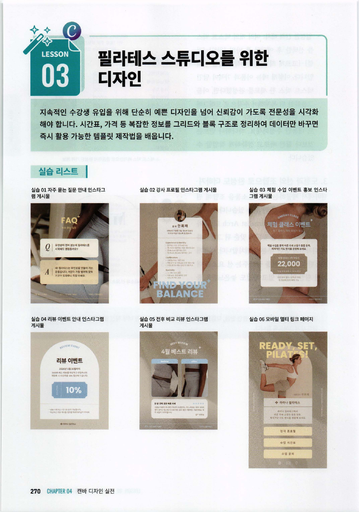

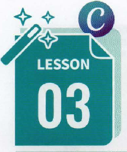

지속적인 수강생 위해 단순히 넘어 시각화

###### 가격 록 구조로

즉시 활용

###### |

실습 02 강사 프로필 인스타그램 게시물

실습 01 자주 묻는 질문 안내 인스타그

실 03 체험 수업 이벤트 홍보 인스타 그램게시물

램게시물

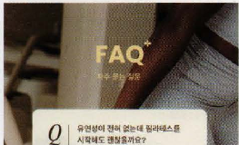

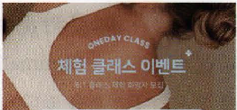

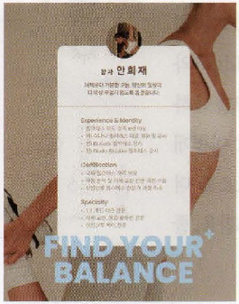


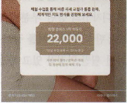

-

세밀 수업 교정지 .흡 은의, 꽤제여인 밀식톨 업빼 뽀세요

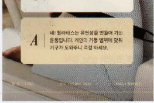

네I 8연싱톨 만ID\

eIi입니다. 맞취

더정 DI세요

실습 05 전후 비교 리뷰 인스타그랭 게시물

실습 04 리뷰 이벤트 내 인스타그램

실습 06 모바일 멀티 링크 페이지

게시물

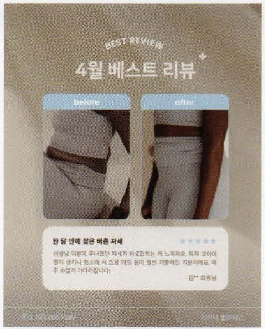

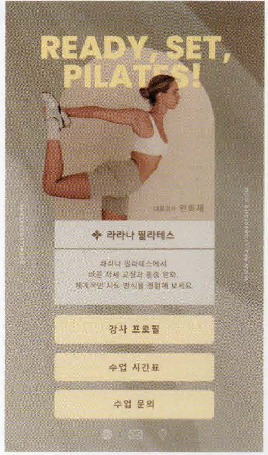


리뷰이벤트

•

' ... 51 X밑특지

· 1 리볼학고어..사현

......曺언..e.니q

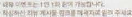

*대 •m`-

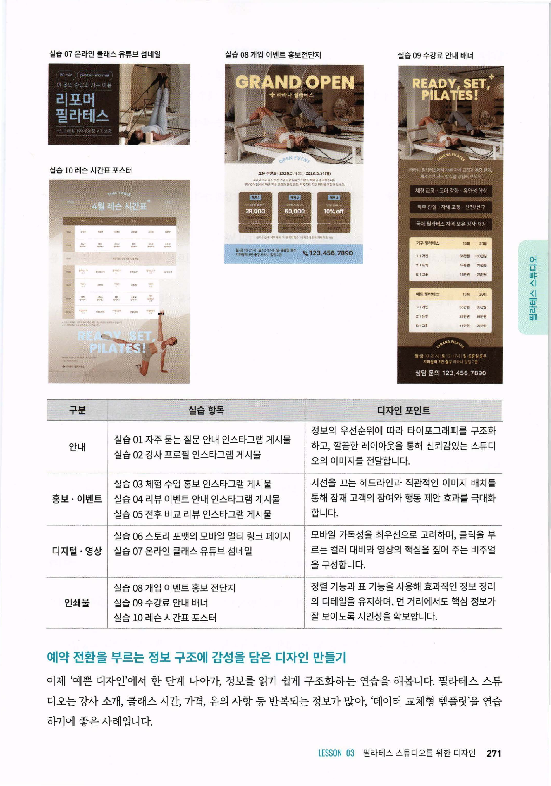

실습 07 온라인 클래스 유튜브 섬네일

실습 08 개업 이벤트 홍보전단지

실습 09 수강료 안내 배너

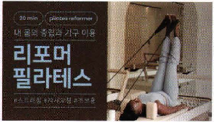

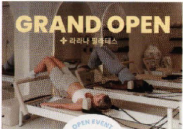

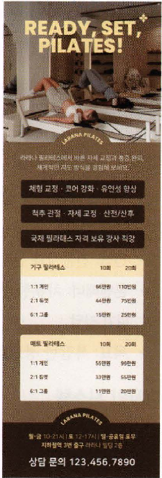

실습 10 레슨 시간표 포스터

어변皇 12026.5.1(급)- 2026.5.31(11)

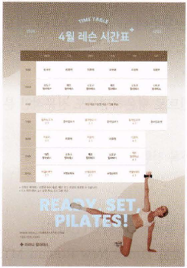

•뺀수 야여홑 죤터 며

·담C이 자필2S··g은.폐지끗안지,.`.,••V嶋a

—,:,--·

###### 歷-틀

I글 ..2”" 틀 1 "

어

... --~ .456.

_UWF 시시＿프브曲

I 구분

l

정보의 우선순위에 따라 타이포그래피를 구조화 안내 하고, 깔끔한 레이아웃을 통해 신뢰감있는 스튜디

실습 01 자주 묻는 질문 안내 인스타그램 게시물

- 실습 02 강사 프로필 인스타그램 게시물 오의 이미지를 전달합니다.
- 실습 03 체험 수업 홍보 인스타그램 게시물 시선을 끄는 헤드라인과 직관적인 이미지 배지를


홍보·이벤트 실습 04 리뷰 이벤트 안내 인스타그램 게시물 통해 잠재 고객의 잠여와 행동 제안 효과를 극대화

- 실습 05 전후 비교 리뷰 인스타그램 게시물 합니다.
- 실습 06 스토리 포맷의 모바일 멀티 링크 페이지 모바일 가독성을 죄우선으로 고려하며, 클릭을 부


디지털·영상 실습 07 온라인 클래스 유튜브 섬네일 르는 컬러 대비와 영상의 핵심을 짚어 주는 비주얼

욜구성합니다.

실습 08 개업 이벤트홍보전단지 정렬 기능과표기능을사용해 효과적인 정보정리 인쇄물 실습 09 수강료 안내 배너 의 디테일을 유지하며, 먼 거리에서도 핵심 정보가

실습 10 레슨 시간표 포스터 잘 보이도록 시인성을 확보합니다.

###### 예약 부르는 정보 디자인 만틀기

이제 ‘예쁜 디자인’에서 한 단계 나아가, 정보를 읽기 쉽게 구조화하는 연습을 해봅니다. 필라테스 스튜 디오는 강사 소개, 클래스 시간, 가격, 유의 사항 등 반복되는 정보가 많아, ‘데이터 교체형 템플릿'올 연습 하기에 좋은 사례입니다.

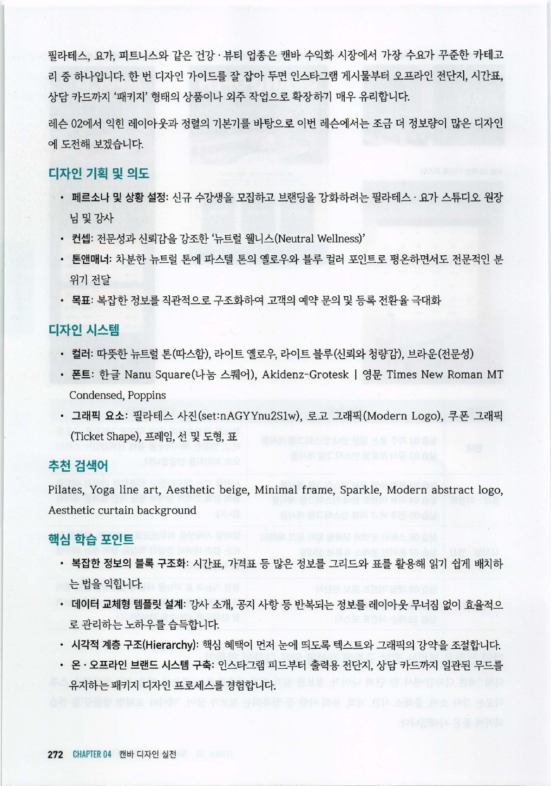

필라테스, 요가, 피트니스와 같은 건강 · 뷰티 업종은 캔바 수익화 시장에서 가장 수요가 꾸준한 카테고

리 중 하나입니다. 한 번 디자인 가이드를 잘 잡아 두면 인스타그램 게시물부터 오프라인 전단지, 시간표, 상담 카드까지 ‘패키지’ 형태의 상품이나 외주 작업으로 확장하기 매우 유리합니다.

레슨 02에서 익힌 레이아웃과 정렬의 기본기를 바탕으로 이번 레슨에서는 조금 더 정보량이 많은 디자인

에도전해보겠습니다.

- • 페르소나 상황 설정: 신규 수강생을 모집하고 브랜딩을 강화하려는 필라테스 · 요가 스튜디오 원장 님및강사
- • 컨셉: 전문성과 신뢰감을 강조한 ‘뉴트럴 웰니스(Neutral Wellness)'
- • 톤앤매너: 차분한 뉴트럴 톤에 파스텔 톤의 옐로우와 블루 컬러 포인트로 평온하면서도 전문적인 분 위기전달
- • 목표: 복잡한 정보를 직관적으로 구조화하여 고객의 예약 문의 및 등록 전환율 극대화
- • 컬러: 따뜻한 뉴트럴 톤(따스함)， 라이트 옐로우, 라이트 블루(신뢰와 청량감), 브라운(전문성)
- • 폰트: 한글 Nanu Square(나눔 스퀘어), Akidenz-Grotesk I 영문 Times New Roman MT Condensed, Poppins
- • 그래픽 요소: 필라테스 사진(set:nAGYYnuZSlw), 로고 그래픽 (Modern Logo), 쿠폰 그래픽 (Ticket Shape), 프레임, 선 및 도형, 표


###### Pilates, Yoga line art, Aesthetic beige, Minimal frame, Sparkle, Modern abstract logo, Aesthetic curtain background

- • 복잡한 정보의 블록 구조화: 시간표, 가격표 등 많은 정보를 그리드와 표를 활용해 읽기 쉽게 배치하 는법을익힙니다.
- • 데이터 교체형 템플릿 설계: 강사 소개 공지 사하。 드 l:I냐복되는 정보를 레이아웃 무너짐 없이 효율적으 로관리하는노하우를습득합니다.
- • 시각적 계층 구조(Hierarchy)： 핵심 혜택이 먼저 눈에 띄도록 텍스트와 그래픽의 강약을 조절합니다.
- • 온 · 오프라인 브랜드 시스템 구측: 인스타그램 피드부터 출력용 전단지, 상담 카드까지 일관된 무드를 유지하는 패키지 디자인 프로세스를 경험합니다.


272 CHAPTER 04 캔바 디자인 실전

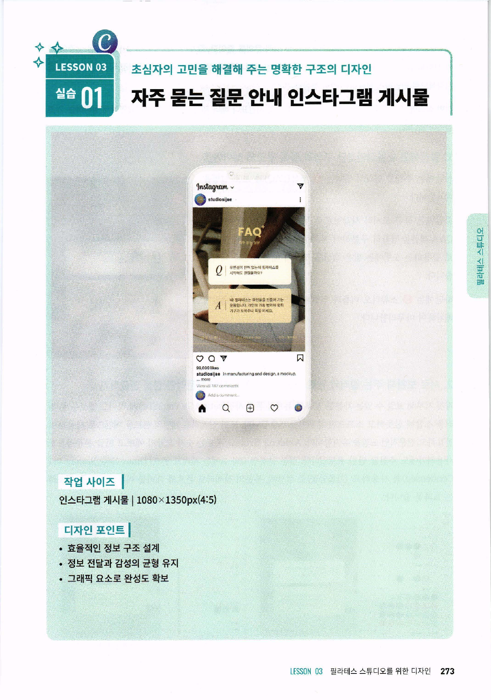

:러:


조심자의 고민을 해결해 주는 명확한 구조의 디자인

###### 자주 묻는 안내 인스타그랩 게Al를

###### 1磁예血` V V'

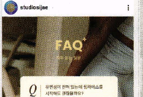

어＿니빠서시＿―

nJaru

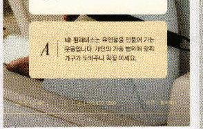

네’ 가는 , 가들 잊줘

口

OOV

99,000likes studiosljae In manufactu『Ing anddesign. • mockup, __, more Viewall187comments

Add a comment

###### ^ Q e o

###### 작업 사이즈

x

###### 디자인 포인트|

• •

•

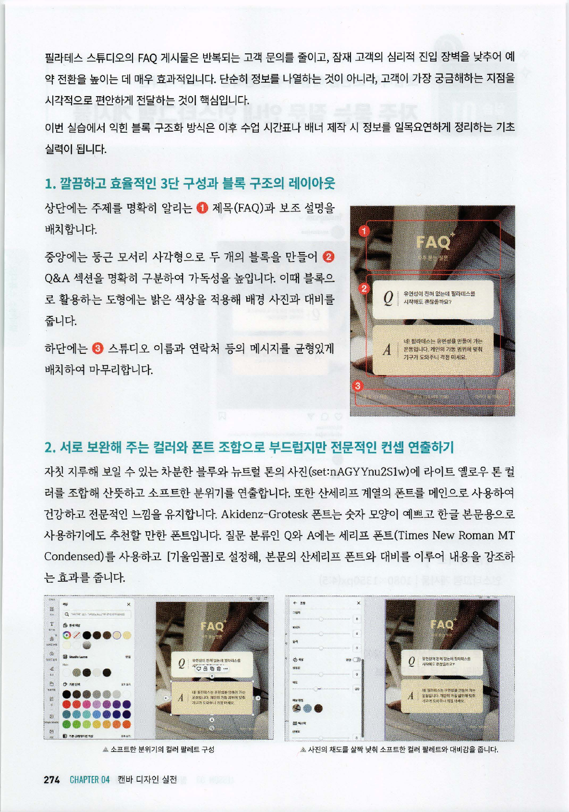

###### 필라테스 스튜디오의 FAQ 게시물은 반복되는 고객 문의를 줄이고, 잠재 고객의 심리적 진입 장벽을 낮추어 예

약 전환을 높이는 데 매우 효과적입니다. 정보를 나열하는 것이 아니라, 고객이 가장 궁금해하는 지점율

시각적으로 편안하게 전달하는 것이 핵심입니다.

이번 실습에서 익힌 블록 구조화 방식은 이후 수업 시간표나 배너 제작 시 정보를 일목요연하게 정리하는 기조

실력이 됩니다.

###### 1. 효율적인 구성과 블록 구조의 레이아웃상단에는 주제를 명확히 알리는 O 제목(FAQ)과 보조 설명을

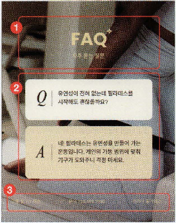

배치합니다.

중앙에는 둥근 모서리 사각형으로 두 개의 블록을 만들어 O

Q&A 섹션을 명확히 구분하여 가독성을 높입니다. 이때 블록으

로 활용하는 도형에는 밝은 색상을 적용해 배경 사진과 대비를

줍니다.

하단에는 O 스튜디오 이름과 연락처 등의 메시지를 균형있게

배치하여 마무리합니다.

###### 2. 서로 주는 컬러와

자칫 지루해 보일 수 있는 차분한 블루와 뉴트럴 톤의 사진 (set:nAGYYnuZSlw) 에 라이트 옐로우 톤 컬

러를 조합해 산뜻하고 소프트한 분위기를 연출합니다. 또한 산세리프 계열의 폰트를 메인으로 사용하여

건강하고 전문적인 느낌을 유지합니다. Akidenz-Grotesk 폰트는 숫자 모양이 예쁘고 한글 본문용으로 사용하기에도 추천할 만한 폰트입니다. 질문 분류인 Q와 A에는 세리프 폰트(Times New Roman MT Condensed)를 사용하고 [기울임꼴]로 설정해, 본문의 산세리프 폰트와 대비를 이루어 내용을 강조하 는효과를 줍니다.

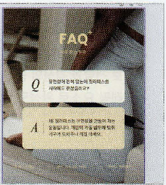

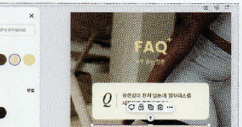

.. 로·

。

X

誌 뻬상 X

... ...0..

' m

b Q -.,,..~ --,....~--...

1~:....T.0~i1, ...... _/..•••o

..

;..••.•.•• 1··-.•€~-·:· ..:.:

###### ••C>,

” • • •

e, O ,，．떠

....••

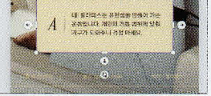

｀촬

내' 던．어 가는

게인외 ?1등 업위에

巳

기구기

효 `스처

I) 기.고"아쉽빡살 "~

..도

..t.. 사진의 재도를 살짝 낮줘 소프트한 컬러 팔레트와 대비감을 줍니다.

~ 소프트한 분위기의 컬러 팔레트 구성

274 CHAPTER 04 캔바디자인 실전

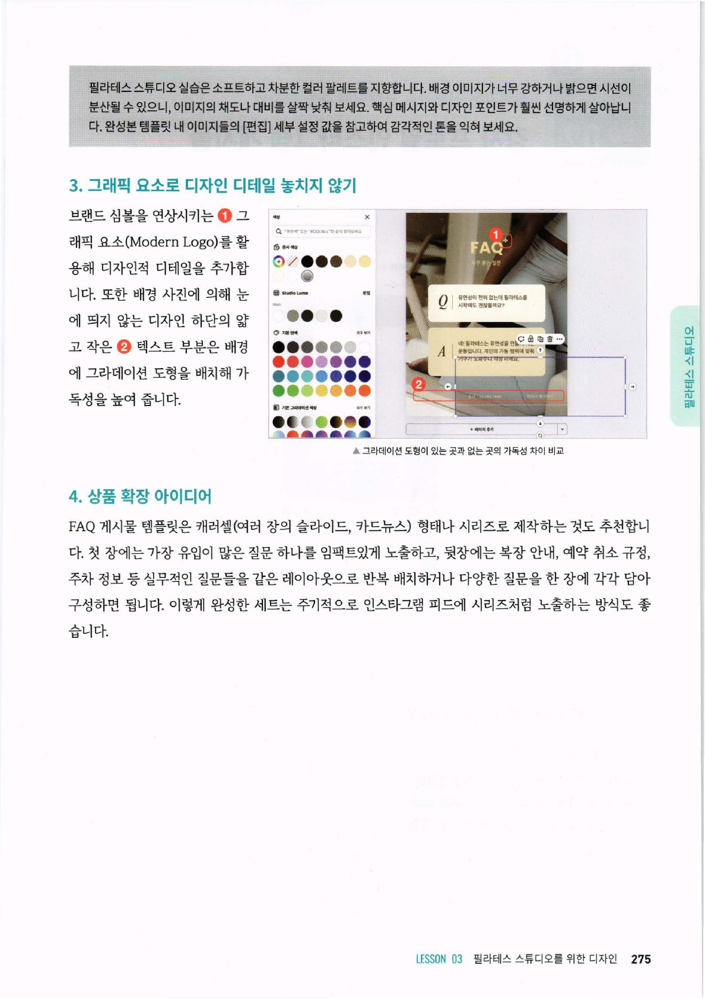

필라테스 소프트하고 컬러 시선이

분산될 수 , . 핵심 훨씬 댜 세부 값을 .

###### 3. 그래픽 요소로 디자인 디테일 놓치지브랜드 심볼을 연상시키는O 그 ... X

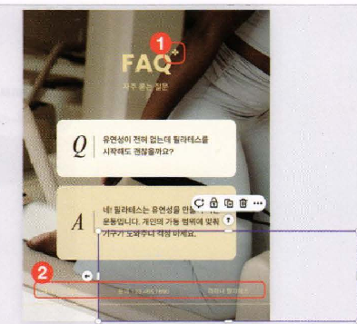

+)/··@ ·

Q •• ~•• ·•JO<'«..E,

래픽 요소(Modern Logo)를 활

OE...

용해 디자인적 디테일을 추가합

니다. 또한 배경 사진에 의해 눈 에 띄지 않는 디자인 하단의 얇

Iii ....~..- ••

O,壇""•• • ""'

어-니叫시사＿

.•.•••••••••..•••

고 작은 O 텍스트 부분은 배경

에 그라데이션 도형을 배치해 가

iir1a 詞

독성을높여 줍니다.

I) 가e고m어선.... .."'

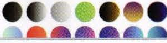

• •어지•기

... 그라데이션 도형이 있는 곳과 없는 곳의 가독성 자이 비교

###### 4. 상품확장아이디어FAQ 게시물 템플릿은 캐러셀(여러 장의 슬라이드, 카드뉴스) 형태나 시리즈로 제작하는 것도 추천합니댜 첫 장에는 가장 유입이 많은 질문 하나를 임팩트있게 노출하고, 뒷장에는 복장 안내, 예약 취소 규정,주차 정보 등 실무적인 질문들을 같은 레이아웃으로 반복 배치하거나 다양한 질문을 한 장에 각각 담아구성하면 됩니다. 이렇게 완성한 세트는 주기적으로 인스타그램 피드에 시리즈처럼 노출하는 방식도 좋습니다.

03 필라테스 스튜디오를 위한 디자인 275

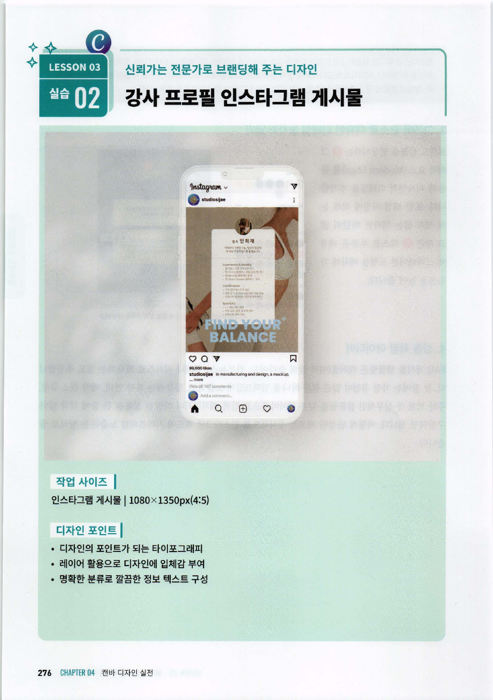

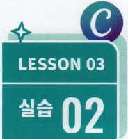

수수

:

신뢰가는 주는 디자인

###### 강사 인스타그랩 게시를

1叫뻑떠` v V'

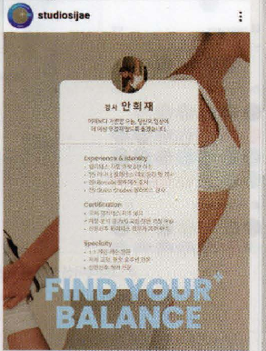

口

oo v

###### "'·000-

_.moro l Inmanutactu"ng onddesign.o mockup,


‘'나W ' commonl:.

Add o comn-,nl

^ Q e o

###### l

###### 인스타그램 | x :s)

- • 디자인의
- • 레이어 부여
- • 텍스트 구성


276 캔바 디자인 실전

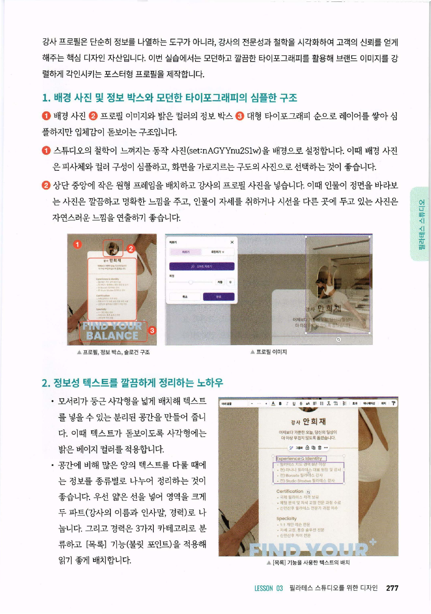

강사 프로필은 단순히 정보를 나열하는 도구가 아니라, 강사의 전문성과 철학을 시각화하여 고객의 신뢰를 얻게

해주는 핵십 디자인 자산입니다. 이번 실습에서는 모던하고 깔끔한 타이포그래피를 활용해 브랜드 이미지를 강

렬하게 각인시키는 포스터형 프로필을 제작합니다.

###### 1. 배경 사진 및 정보 박스와 모던한 구조O 배경 사진 O 프로필 이미지와 밝은 컬러의 정보 박스O 대형 타이포그래피 순으로 레이어를 쌓아 심

플하지만입체감이 돋보이는구조입니다.

O 스튜디오의 철학이 느껴지는 동작 사진(set:nAGYYnu2Slw)을 배경으로 설정합니다. 이때 배경 사진

은 피사체와 컬러 구성이 심플하고, 화면을 가로지르는 구도의 사진으로 선택하는 것이 좋습니다.

O 상단 중앙에 작은 원형 프레임을 배치하고강사의 프로필 사진을 넣습니다. 이때 인물이 정면을 바라보

어＿나빠서시-프모印

는 사진은 깔끔하고 명확한 느낌을 주고, 인물이 자세를 취하거나 시선을 다른 곳에 두고 있는 사진은

자연스러운 느낌을 연출하기 좋습니다.

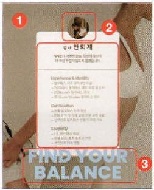

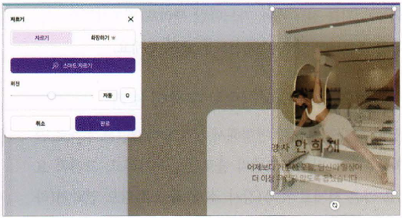

~ 프로필, 정보 박스, 슬로건 구조 ^ 프로필이미지

###### 2. 텍스트를 깔끔하게 정리하는 노하우

- • 모서리가 둥근 사각형을 넓게 배치해 텍스트 를 넣을 수 있는 분리된 공간을 만들어 줍니 댜 이때 텍스트가 돋보이도록 사각형에는 밝은 베이지 컬러를 적용합니다.
- • 공간에 비해 많은 양의 텍스트를 다룰 때에 는 정보를 종류별로 나누어 좋습니다. 우선 얇은 선을 넣어 영역을 크게


구-

아서•• * 스 B I U S IA != :三 i n §

m 메'"md 硏

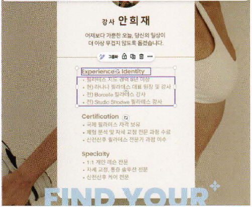


강At

오•.

더 않도를

/ 그... a® 펩 ...

·요 I

. 幻Ai노 G UI'I

- • 라q, ., • le •. 다 d 선)Bco::c: t><_., 사 , • Shrlo SI아:Iv 감사 Certification ,>
- • 국자밀근1: ` ’'~

· 재협문시 4소

- • 기수 Specialty
- • 11 갸인대손진
- • 사세


I

정리하는 것이

두 파트(강사의 이 름과 인사말, 경력)로 나

눕니다. 그리고 경력은 3가지 카테고리로 분 류하고 [목록] 기능(불릿 포인트)을 적용해

•

읽기 좋게배치합니다.

... ［목록] 기능을 사용한 텍스트의 배지

필라테스 스튜디오를 위한 디자인 277

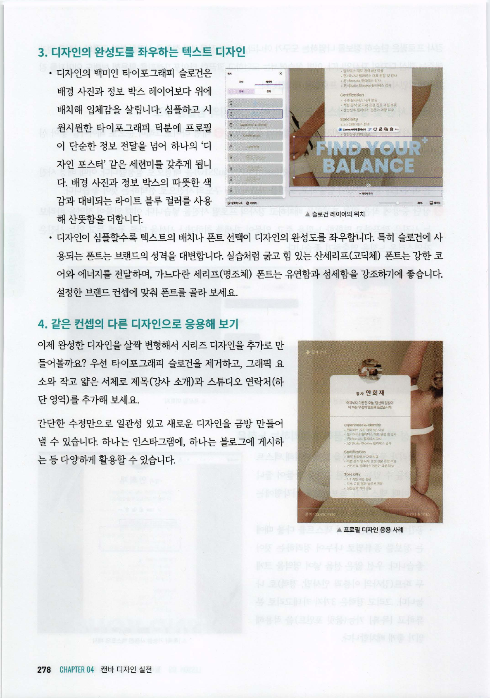

###### 3.

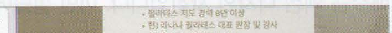

- • 디자인의 백미인 타이포그래피 슬로건은 .. X

”

배경 사진과 정보 박스 레이어보다 위에

배치해 입체감을 살립니다. 심플하고 시 원시원한 타이포그래피 덕분에 프로필 이 단순한 정보 전달을 넘어 하나의 ‘디

자인 포스터’ 같은 세련미를 갖추게 됩니

다. 배경 사진과 정보 박스의 따뜻한 색 감과 대비되는 라이트 블루 컬러를 사용

해산뜻함을더합니다.

t. .

E

'II

--~/C 8®e···

" ..... - a-

~ 술로건레이어의위지

- • 디자인이 심플할수록 텍스트의 배치나 폰트 선택이 디자인의 완성도를 좌우합니다. 특히 슬로건에 사 용되는 폰트는 브랜드의 성격을 대변합니다. 실습처럼 굵고 힘 있는 산세리프(고딕체) 폰트는 강한 코 어와 에너지를 전달하며, 가느다란 세리프(명조체) 폰트는 유연함과 섬세함을 강조하기에 좋습니다. 설정한 브랜드 컨셉에 맞춰 폰트를 골라 보세요.


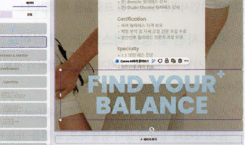

###### 4. 같은 컨셉의 보기

이제 완성한디자인을살짝변형해서 시리즈디자인을추가로만


들어볼까요? 우선 타이포그래피 슬로건을 제거하고, 그래픽 요

소와 작고 얇은 서체로 제목(강사 소개)과 스튜디오 연락처 (하

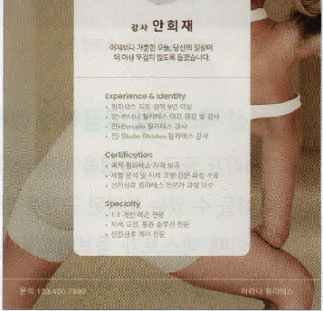

깅시

단 영역)를 추가해 보세요.

..

더

간단한 수정만으로 일관성 있고 새로운 디자인을 금방 만들어

낼 수 있습니다. 하나는 인스타그램에, 하나는 블로그에 게시하

는 등 다양하게 활용할 수 있습니다.

... 프로필 디자인 사례

278 캔바 디자인 실전

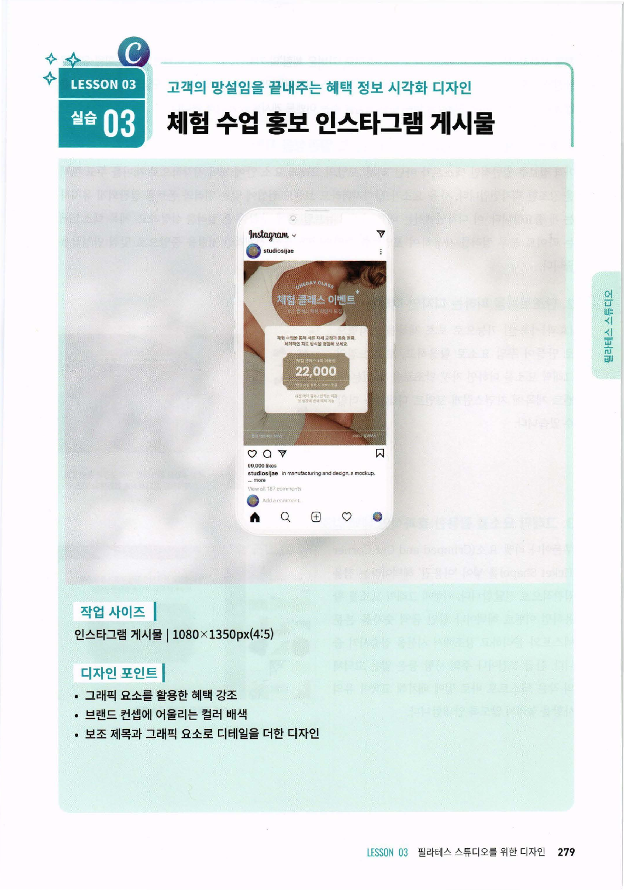


수수

고객의 끝내주는 혜택 정보 시각화 디자인

:四」

###### 체험 수업 흥보 인스타그랩 게Al를


###### 1叫빡血t v V'

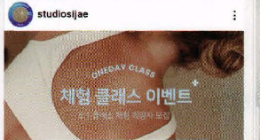

어一나빠사시＿포브畑

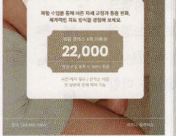

수업을 률빼 지세 교정적 틀률

-

..재직언 지도

###### oov 口

99,000l!kes studlosijae <n manufacturing and design.• mockup.

###### -·”KH.

T"'f`

###### ^ Q e o

###### 작업 사이즈 |

인스타그램 게시물 | 1osox

•

•

• 요소로 더한

LESSON 03 필라테스 스튜디오를 위한 디자인 279

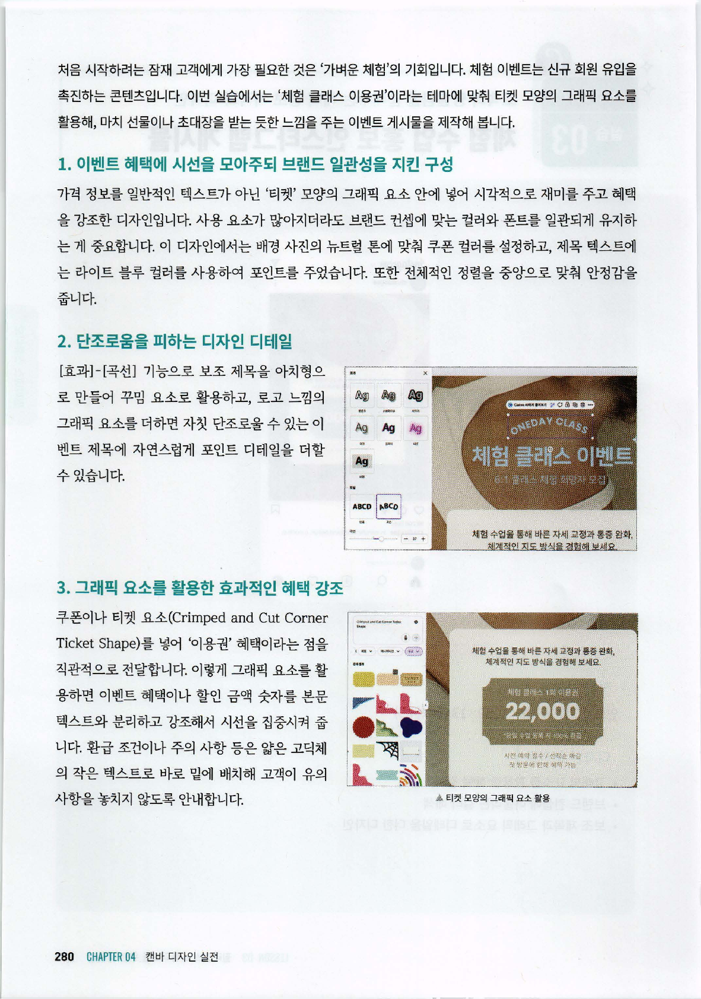

시작하려는 잠재 고객에게 가장 필요한 것은 ‘가벼운 체험’의 기회입니다. 체험 이벤트는 신규 회원 유입을 촉진하는 콘텐츠입니다. 이번 실습에서는 ‘체험 이용권’이라는 테마에 티켓 그래픽 요소를

활용해, 마지 선물이나 조대장을 받는 듯한 느낌을 주는 이벤트 게시물을 제작해 봅니다.

###### 1. 이벤트 혜택에 시선을 모아주되 브랜드 지킨 구성

가격 정보를 일반적인 텍스트가 아닌 ‘티켓' 모양의 그래픽 요소 안에 넣어 시각적으로 재미를 주고 혜택

을 강조한 디자인입니다. 사용 요소가 많아지더라도 브랜드 컨셉에 맞는 컬러와 폰트를 일관되게 유지하

는 게 중요합니다. 이 디자인에서는 배경 사진의 뉴트럴 톤에 맞춰 쿠폰 컬러를 설정하고, 제목 텍스트에 는 라이트 블루 컬러를 사용하여 포인트를 주었습니다. 또한 전체적인 정렬을 중앙으로 맞춰 안정감을

줍니다.

###### 2.

[효과]-［곡선] 기능으로 보조 제목을 아치형으

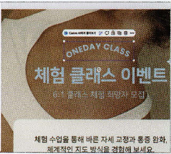

m

隣 錢

로 만들어 꾸밈 요소로 활용하고, 로고 느낌의 그래픽 요소를더하면 자칫 단조로울수있는이 벤트 제목에 자연스럽게 포인트 디테일을 더할 수있습니다.

... 'rn ."

A..g "' Ag

###### ABCD.. B..

- » +

###### 3. 그래픽 요소를 활용한 효과적인 혜택 강조쿠폰이나 티켓 요소(Crimped and Cut CornerTicket Shape)를 넣어 ‘이용권’ 혜택이라는 점을직관적으로 전달합니다. 이렇게 그래픽 요소를 활용하면 이벤트 혜택이나 할인 금액 숫자를 본문텍스트와 분리하고 강조해서 시선을 집중시켜 줍니다. 환급 조건이나 주의 사항 등은 얇은 고딕체의 작은 텍스트로 바로 밑에 배치해 고객이 유의사항을 놓치지 않도록 안내합니다.

-「'j,"d0·C-- •

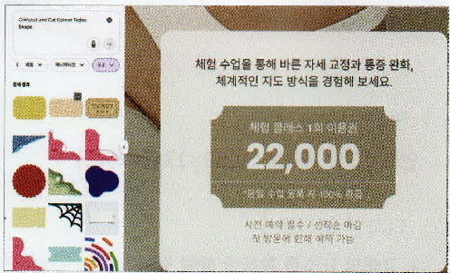

보

###### ~ 티켓 모양의 그래픽 요소 활

280 04 캔바 디자인 실전

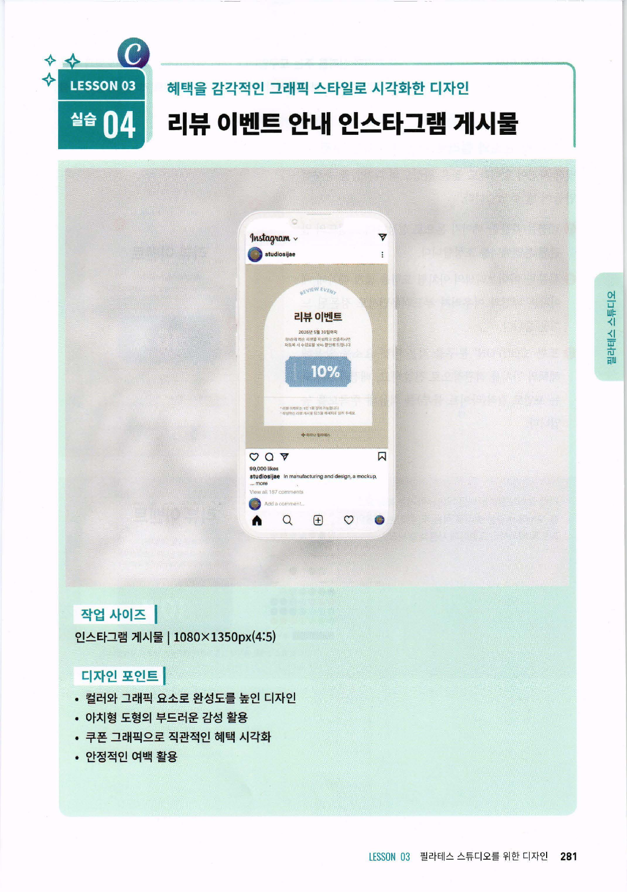

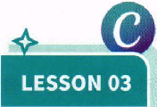

수수

혜택을 감각적인 그래픽 스타일로 시각화한 디자인

:"\\

###### 리뷰 이벤트 안내 인스타그랩 게Al롤

1磁액ltQ.II\. V V'

.tudlo.ij••


언니毗시직포브叫

.z

寧예

지6· 사수갑도 D 촬언빼드립나디

•• "'·• 가••내

•••신리"＂시••，.”嶋며...鼻

♦ 스

因

###### oov

99,000llkH studlo1IJ1e In manufac:1u1lng and design. a mockup,

###### .-mo••


Vl ,W•” '8; comm,,nIS

Addacomm nI

###### ^ Q e o

###### 작업 사이즈 |

1080X1350px(4:5)

###### 디자인 포인트

- • 완성도 디자인
- • 아치형
- • 쿠폰 혜택 시각화


•

LESSON 03 필라테스 스튜디오를 위한 디자인 281

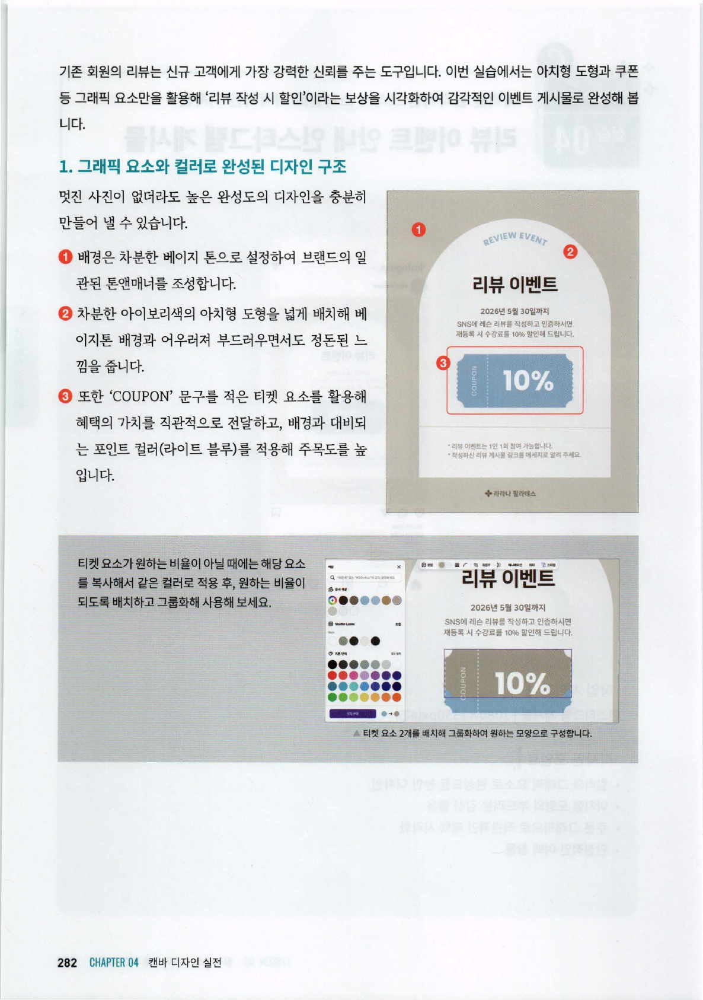

기존 회원의 리뷰는 신규 고객에게 가장 강력한 신뢰를 주는 도구입니다. 이번 실습에서는 아지형 도형과 쿠폰

등 그래픽 요소만을 활용해 ‘리뷰 작성 시 할인’이라는 보상을 시각화하여 감각적인 이벤트 게시물로 완성해 봅

니댜

###### 1. 그래픽 요소와 컬러로 디자인 구조

멋진 사진이 없더라도 높은 완성도의 디자인을 충분히

만들어 낼수있습니다.

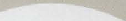

쟌t니\EWEVE아

O 배경은 차분한 베이지 톤으로 설정하여 브랜드의 일

###### 리뷰이벤트

관된 톤앤매너를 조성합니댜

O 차분한 아이보리색의 아치형 도형을 넓게 배치해 베

레슨 리뷰룔 인중하시연 재등혹 시 수강료 10% 할인해 드립니다

O(

이지톤 배경과 어우러져 부드러우면서도 정돈된 느 낌을줍니다.

j「

O 또한 ‘COUPON' 문구를 적은 티켓 요소를 활용해

혜택의 가치를 직관적으로 전달하고, 배경과 대비되 는 포인트 컬러(라이트 블루)를 적용해 주목도를 높

- •리뷰 0l던드는 1언 1회 잡여 가능합니다
- • 칙성하신 리뷰 개사를 메세지르 주세요


입니다.

+ 라라나릴라테스

e.. • r n "" ; ."" "' T...

###### 리뷰이벤트

Q

·。:+l--..••날••••o••

°”..

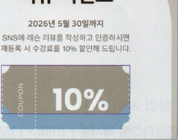

###### 2026년 5월

SNS에 레슨 작성하고

시 수강료를 10'lb 할인해 드립니다.

•••••••••••• - •••~••

요소 2개를 는 .

###### 282 CHAPTER 04 캔바 디자인 실전

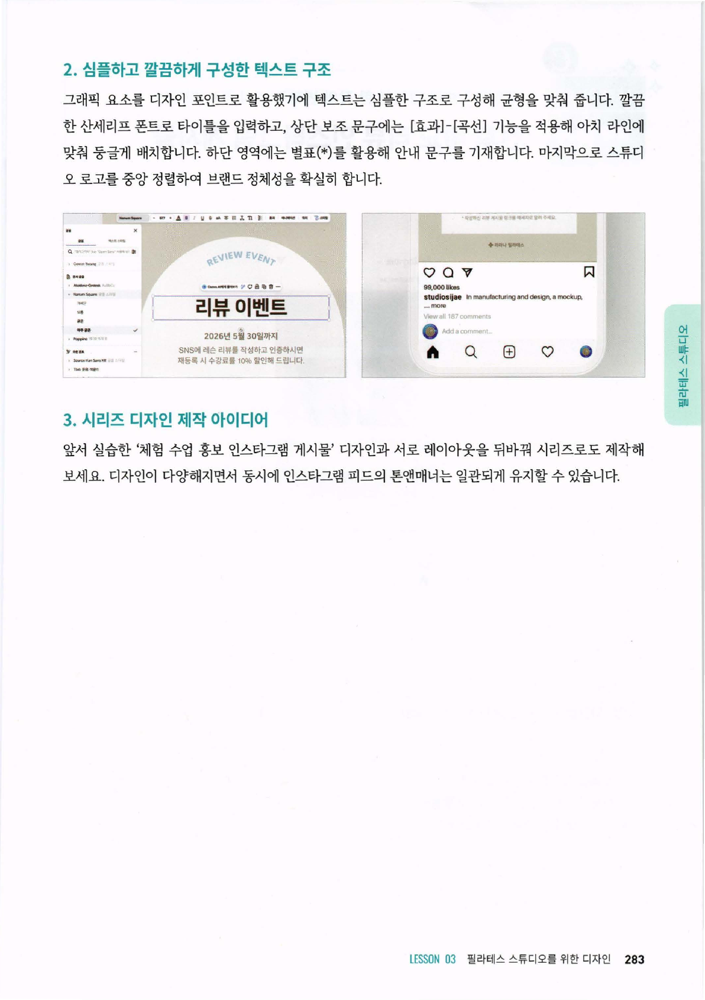


###### 2. 구성한 텍스트 구조

그래픽 요소를 디자인 포인트로 활용했기에 텍스트는 심플한 구조로 구성해 균형을 맞춰 줍니다. 깔끔

한 산세리프 폰트로 타이틀을 입력하고, 상단 보조 문구에는 [효과]-［곡선] 기능을 적용해 아치 라인에

맞춰 둥글게 배치합니댜 하단 영역에는 별표(*）를 활용해 안내 문구를 기재합니댜 마지막으로 스튜디

오 로고를 중앙 정렬하여 브랜드 정체성을 확실히 합니다.

I -=- E }~.

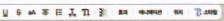

’뢸촬혁신... .....”틀.혀를보

" X

" `....

·Q一--···--~- '' •• \l~',1\EW EV£~,-

♦ 이러니`러대..

口

oov

‘"..

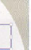

尸다크- • --- ~ oe111 a -

99,000tikes

........ 리뷰이벤트

· '" 『요

studios jae In manutacrunng end函lgnamockun


_ roore

v,

어＿니叫서서＿―보브叫

A

。

^ Q e o

’ ’'ll’’,

`.."

NS에 레슨 작성하고 인증하시면 재등록 시 10% 할인해 .

·n."

###### 3. 시리즈 디자인 제작 아이디어

###### 앞서 실습한 ‘체험 수업 홍보 인스타그램 계시물’ 디자인과 서로 레이아웃을 뒤바꿔 시리즈로도 제작해 보세요. 디자인이 다양해지면서 동시에 인스타그램 피드의 톤앤매너는 일관되게 유지할 수 있습니다.

03 필라테스 스튜디오를 위한 디자인 283

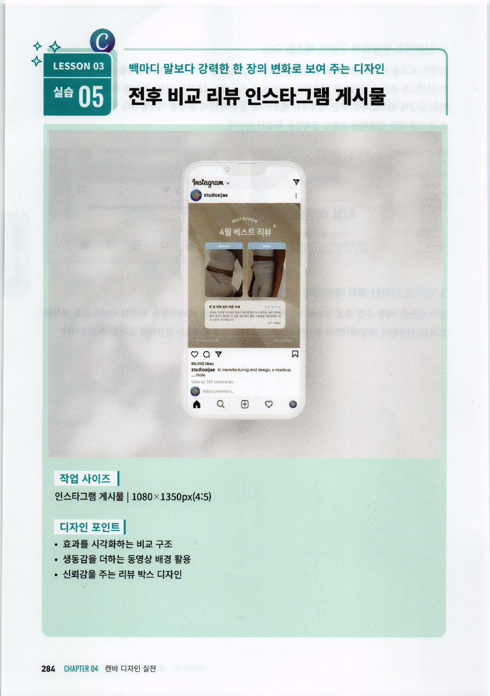

:러:

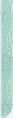

주는

###### 전후 비교 인스타그랩

1Mt땡'lllnl. v V'

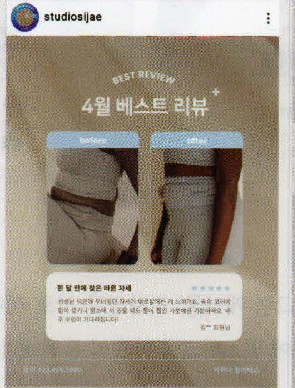

口

###### oov

99,000Ilk..

s lj1e In a mockup.

.-·moro VCW II l8:'comm'nIs

'dda ” m'"

###### ^ Q e o

###### 사이즈 |

인스타그램 | x

###### l

###### • 비교 구조

•

###### • 신뢰감을 주는

284 캔바 디자인 실전

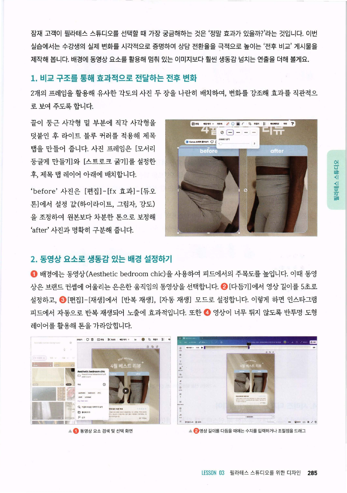

잠재 고객이 필라테스 스튜디오를 선택할 때 가장 궁금해하는 것은 ‘정말 효과가 있을까?’라는 것입니다. 이번 실습에서는 수강생의 실제 변화를 시각적으로 증명하여 상담 전환율을 극적으로 높이는 ‘전후 비교’ 게시물을

제작해 봅니다. 배경에 동영상 요소를 활용해 멈줘 있는 이미지보다 훨씬 생동감 넘지는 연줄을 더해 볼게요.

###### 1. 비교 구조를 전후

2개의 프레임을 활용해 유사한 각도의 사진 두 장을 나란히 배치하여, 변화를 강조해 효과를 직관적으

로보여 주도록합니댜

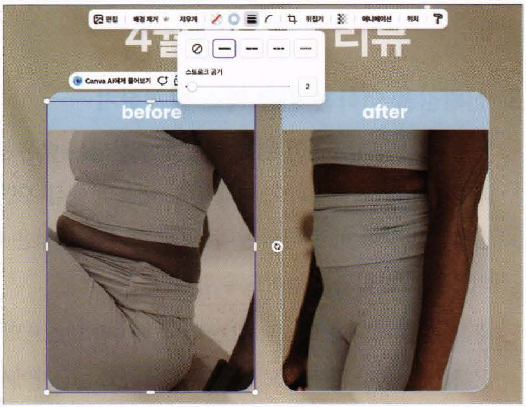

끝이 둥근 사각형 밑 부분에 직각 사각형을

· 띠 / ii r4•11>1l:

- 0 E〕 一－ ＿

덧붙인 후 라이트 불루 커러를 적용해 제목

^..’굽기

o t .

[모서리

탭을 만들어 줍니다. 사진 프레임은 둥글게 만들기]와 [스트로크 굵기]를 설정한 후, 제목 탭 레이어 아래에 배치합니댜

어＿니叫서시―

H1a 訓

'before' 사진은 [편집]-［fx 효과]-［듀오

톤]에서 설정 값(하이라이트, 그림자, 강도)

을 조정하여 원본보다 차분한 톤으로 보정해 'after' 사진과 명확히 구분해 줍니다.

###### 2.O 배경에는 동영상(Aesthetic bedroom chic)을 사용하여 피드에서의 주목도를 높입니댜 이때 동영상은 브랜드 컨셉에 어울리는 은은한 움직임의 동영상을 선택합니댜 O [다듬기]에서 영상 길이를 5초로

설정하고, [편집] - ［재생]에서 [반복 재생], ［자동 재생] 모드로 설정합니다. 이렇게 하면 인스타그램

피드에서 자동으로 반복 재생되어 노출에 효과적입니다. 또한O 영상이 너무 튀지 않도록 반투명 도형

# |E...=g.· .. `. 며

레이어를 활용해 톤을 가라앉힙니댜

曰", O O O .. * ...

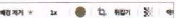

e-·-T-

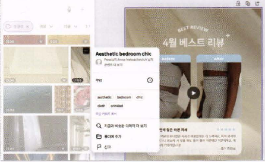

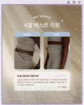

· i

.i‘ "0t"·00"n-'

###### ..

###### --`,.

’’’ ’ L」_L ~

Q ‘........미""

,m······.•.•

·

0 擊"'

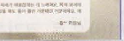

p .고


- - .,_ .,, ■ .• .,

~ 0영상 길이를 E頃율 때에는 수지를 입력하거나 조절점율 드래그

• 동영상요소검색잊선택화면

ON 03 필라테스 스튜디오를 위한 디자인 285

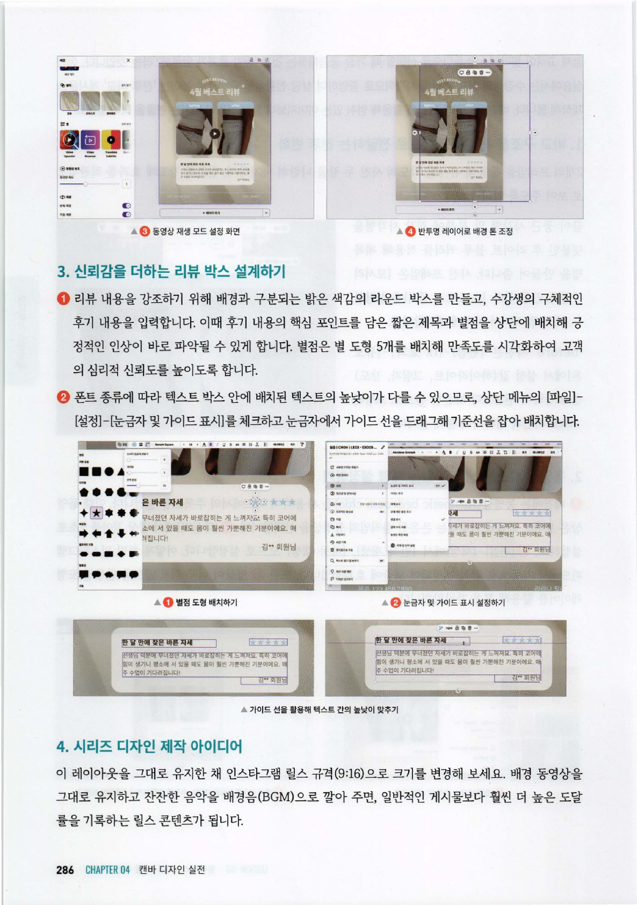

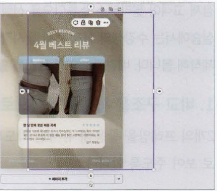

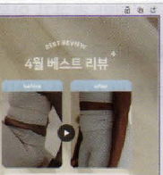

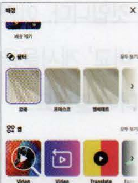

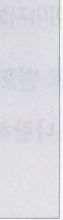

0-•· .,··-..

cc

0 ..

###### •-" .

두


^ 동영상재생모드설정화면 • O 반투명 레이어로 배경 톤조정

###### 3. 박스O 리뷰 내용을 강조하기 위해 배경과 구분되는 밝은 색감의 라운드 박스를 만들고, 수강생의 구체적인


후기 내용을 입력합니다. 이때 후기 내용의 핵심 포인트를 담은 짧은 제목과 별점을 상단에 배치해 긍

정적인 인상이 바로 파악될 수 있게 합니다. 별점은 별 도형 5개를 배치해 만족도를 시각화하여 고객 의 심리적 신뢰도를 높이도록 합니댜

O 폰트 종류에 따라 텍스트 박스 안에 배치된 텍스트의 높낮이가 다를수 있으므로, 상단 메뉴의 [파일]­

.....:-

[설정]-［눈금자및가이드표시]를체크하고눈금자에서가이드선을드래그해기준선을잡아배치합니다.

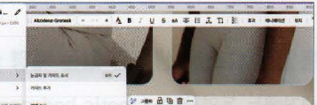

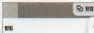

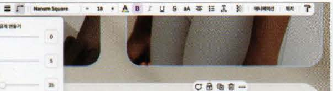

.. ... llCOC)I _ ,

····-

C ...

·•~···은바른자세

a'“.”

。....-

."

O ..

(i)•-~

... 무너졌던자세가 게

✓ | | 론' " '’ • I

e, ..

o ..

8| 는 게 느써서뵤 潟 때도 를이 훨씬 가뿐혜진 기분이에요

서 때도 몸이 훨씬

··會를 ...

쇼 ....

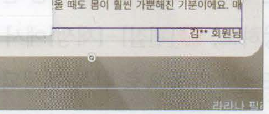

·m....”

려집니다’

’""

...." 김••

· """..

-

•••••

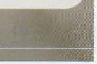

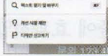

....O 눈금자잊 가이드표시 설정하기

~ 별점도형배지하기

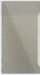

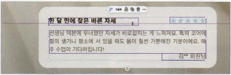

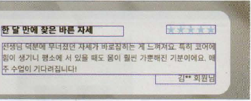

, ..

01 기다려집니다’

~ 가이드 선율 팔용해 텍스트 간의 높낮이 맞주기

###### 4. 시리즈 아이디어

이 레이아웃을 그대로 유지한 채 인스타그램 릴스 규격 (9:16)으로 크기를 변경해 보세요. 배경 동영상을

그대로 유지하고 잔잔한 음악을 배경음(BGM)으로 깔아 주면, 일반적인 계시물보다 훨씬 더 높은 도달 률을 기록하는 릴스 콘텐츠가 됩니다.

###### 286 CHAPTER 04 캔바 디자인 실전

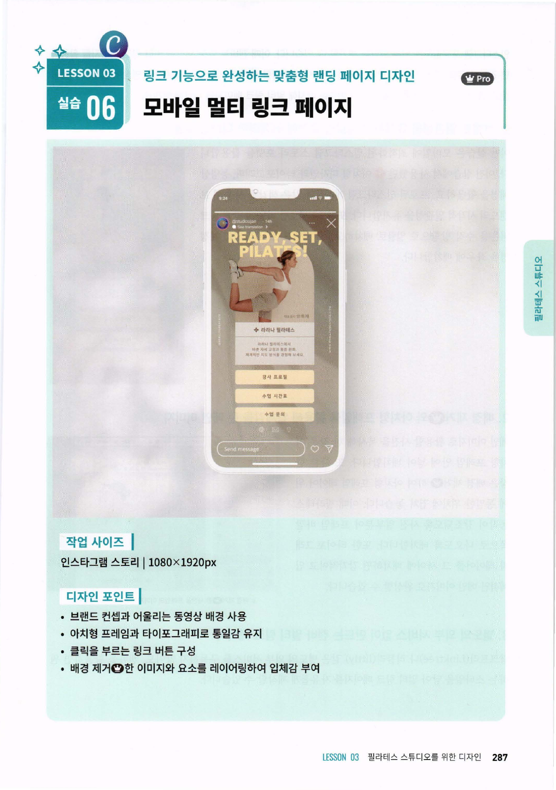

수수

###### CEO

링크 기능으로 완성하는 페이지 디자인

一

###### 모바일멀티링크패이지

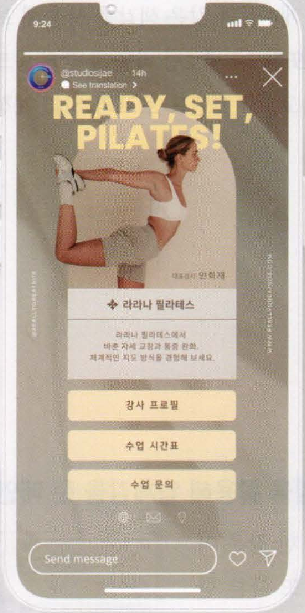

어＿니빠서시＿

H1 므印

###### 사이즈 |

스토리 | 1080X1920px

###### 디자인 포인트|

- • 브랜드 어울리는 배경 사용
- • 아지형 프레임과 타이포그래피로 유지
- • 버튼 구성
- • 부여


LESSON 03 필라테스 스튜디오를 위한 디자인 287

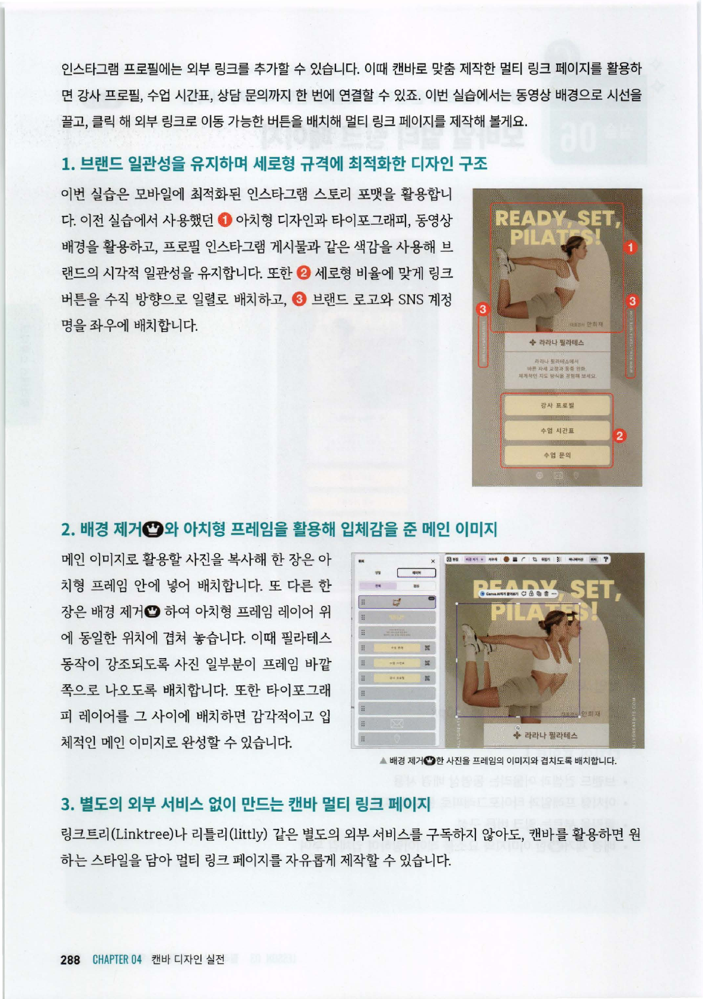


인스타그램 프로필에는 외부 링크를 주가할 수 있습니다. 이때 캔바로 맞춤 제작한 멀티 링크 페이지를 활용하

면 강사 프로필, 수업 시간표, 상담 한 번에 연결할 수 있죠. 이번 배경으로 시선을 끌고, 클릭 해 외부 링크로 이동 가능한 버튼을 배지해 멀티 링크 페이지를 제작해 볼게요.


###### 1. 규격에 구조

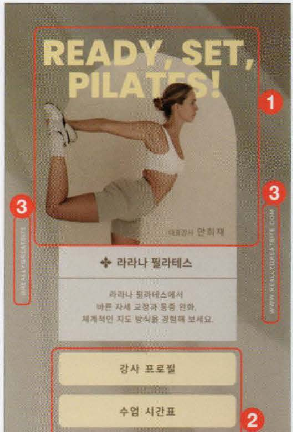

이번 실습은 모바일에 최적화된 인스타그램 스토리 포맷을 활용합니

다. 이전 실습에서 사용했던 O 아치형 디자인과 타이포그래피, 동영상

배경을 활용하고, 프로필 인스타그램 게시물과 같은 색감을 사용해 브

랜드의 시각적 일관성을유지합니다. 또한e 세로형 비율에 맞게 링크

버튼을 수직 방향으로 일렬로 배치하고, O 브랜드 로고와 SNS 계정

명을 좌우에 배치합니다.

..라나말..;걱스데서

버른사세&덩 llH'l•

꽤看빼; 曺식을 릅험 모세요

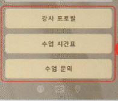

강사 프로릴

수업 사간표

수업

###### 2. 제거 이미지

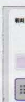

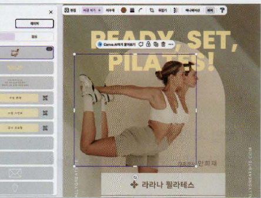

메인 이미지로 활용할 사진을 복사해 한 장은 아 치형 프레임 안에 넣어 배치합니댜 또 다른 한 장은 배경 제거O 하여 아치형 프레임 레이어 위

.. i - l

에 동일한 위치에 겹쳐 놓습니다. 이때 필라테스 동작이 강조되도록 사진 일부분이 프레임 바깥

쪽으로 나오도록 배치합니댜 또한 타이포그래 피 레이어를 그 사이에 배치하면 감각적이고 입

체적인 메인 이미지로 완성할 수 있습니다.

^ 배경 제거 한사진을프레임의 이미지와겁지도록배지합니댜

###### 3. 별도의 외부 캔바 멀티링크트리 (Linktree)나 리틀리 (littly) 같은 별도의 외부 서비스를 구독하지 않아도, 캔바를 활용하면 원하는 스타일을 담아 멀티 링크 페이지를 자유롭게 제작할 수 있습니다.

288 CHAPTER 04 캔바 디자인 실전

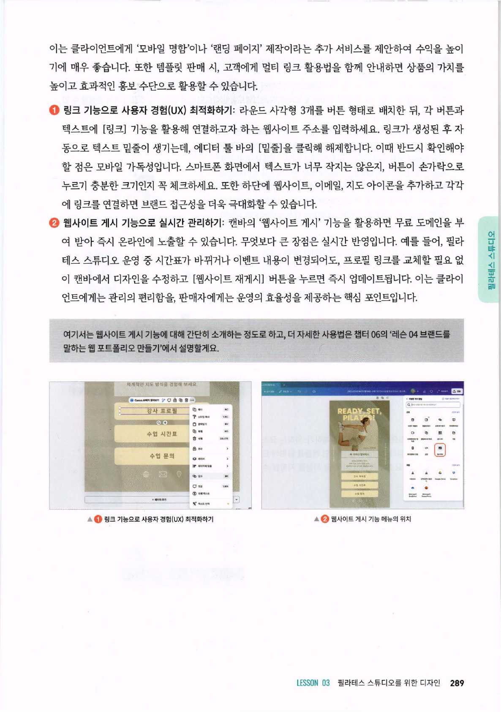

이는 클라이언트에게 ‘모바일 명함'이나 텐딩 페이지’ 제작이라는 추가 서비스를 제안하여 수익을 높이 기에 매우 좋습니다. 또한 템플릿 판매 시, 고객에게 멀티 링크 활용법을 함께 안내하면 상품의 가치를

높이고 효과적인 홍보 수단으로 활용할 수 있습니다.

O 링크 기능으로 사용자 경험(UX) 죄적화하기: 라운드 사각형 3개를 버튼 형태로 배치한 뒤, 각 버튼과

텍스트에 [링크] 기능을 활용해 연결하고자 하는 웹사이트 주소를 입력하세요. 링크가 생성된 후 자 동으로 텍스트 밑줄이 생기는데, 에디터 툴 바의 [밑줄]을 클릭해 해제합니다. 이때 반드시 확인해야 할 점은 모바일 가독성입니다. 스마트폰 화면에서 텍스트가 너무 작지는 않은지, 버튼이 손가락으로

누르기 충분한 크기인지 꼭 체크하세요. 또한 하단에 웹사이트, 이메일, 지도 아이콘을 추가하고 각각 에 링크를 연결하면 브랜드 접근성을 더욱 극대화할 수 있습니댜

O 웹사이트 게시 기능으로 실시간 관리하기: 캔바의 ‘웹사이트 게시’ 기능을 활용하면 무료 도메인을 부

언넓시길보의叫

여 받아 즉시 온라인에 노출할 수 있습니다. 무엇보다 큰 장점은 실시간 반영입니다. 예를 들어, 필라 테스 스튜디오 운영 중 시간표가 바뀌거나 이벤트 내용이 변경되어도, 프로필 링크롤 교체할 필요 없 이 캔바에서 디자인을 수정하고 [웹사이트 재게시] 버튼을 누르면 즉시 업데이트됩니다. 이는 클라이 언트에게는 관리의 편리함을, 판매자에게는 운영의 효율성을 제공하는 핵심 포인트입니다.


웹사이트 더 챕터 06의 ‘레슨 04

웹 포트폴리오

###### | ,_’ 스 •• .기 . • . mI

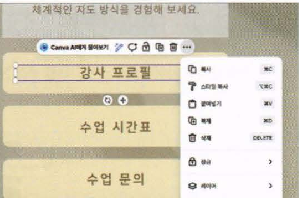

--~.,。ci\111•-.. --

###### : :

•• <

«Q,•••""

.. . .'

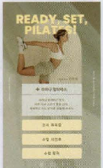

0

'I' - ...

0 ....,

O O .. 0

- -o- -·o· ·-'- '
- -=-·.-.,.

,.. .

& *

- - mT".


g

Ill ..

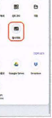

수업

e ...

i

###### ..Ill.._

수업 문의

###### ,.,..

ir - ..


• •

###### °"

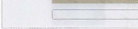

O 때…·

-- .. ``"...

L"

· •아이

C

~O 웹사이트계시 기능 메뉴의 위치

• O 링크 기능으로사용자경험(UX) 최적화하기

필라테스 스튜디오를 위한 디 자인 289

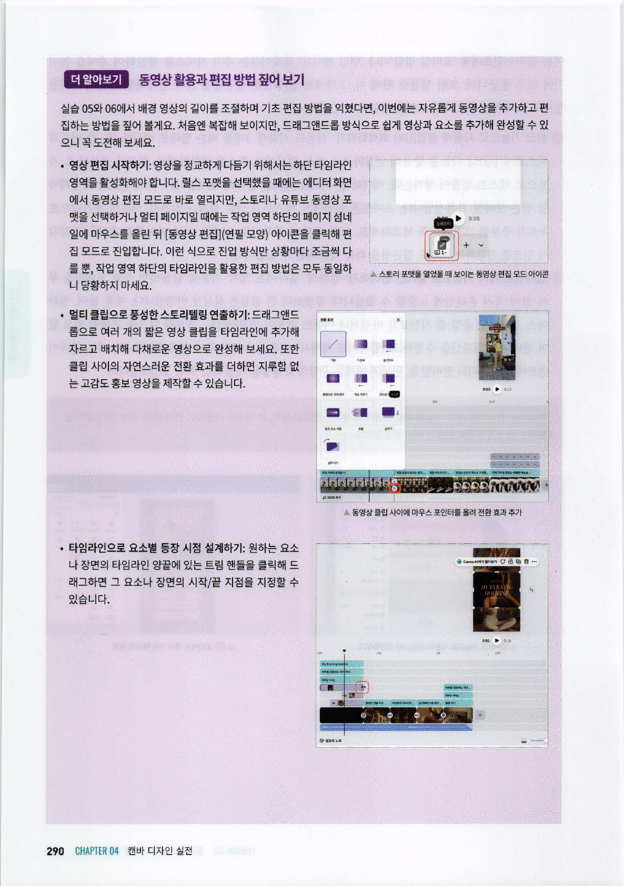

###### 보기

05와 06에서 배경 길이를 조절하며 주가하고 방법을 짚어 볼게요. 쉽게 영상과 주가해 완성할 수 있

• :

’ 。05

스토리나 유튜브 포

때에는 섬네

일에 클릭해 편 모드로 이런 식으로 다

작업 모두

스토리 때

던•·과曰

.... -"'.. -...■-.l

•

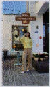

X

여러 개의 타임라인에

자르고 배치해 다재로운 완성해 보세요.

없

는 고감도 제작할 수 있습니다.

.” ► •l’

11C1 측. .,

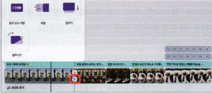

...... .. ‘

1

-

• 요소

~ ' Ilai!!J •••

나 드 그 요소나 수

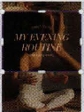

'>

###### ••, 010

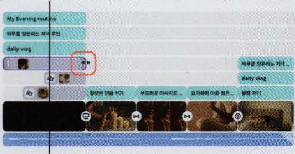

+

으..,..

###### 290 캔바 디자인 실전

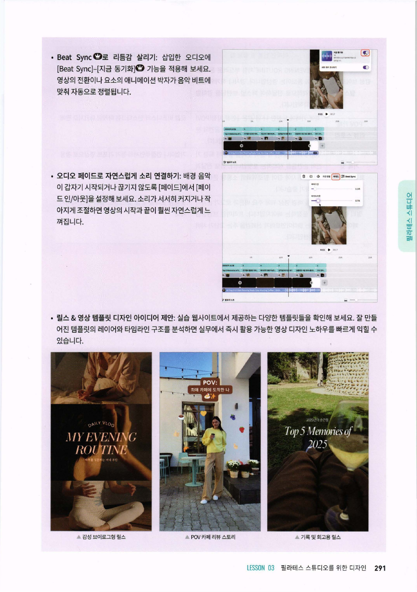

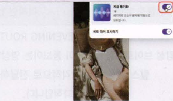

###### • Beat SyncO로 살리기: 삽입한 오디오에[Beat Sync]-［지금 동기화]O 기능을 적용해 보세요.

요소의 애니메이션 음악

.

"' ► 이’

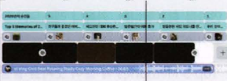

.....“ --

o m 0 ,.. "-....

###### • 자연스럽게 소리 연결하기: 음악이 갑자기 시작되거나끊기지 [페이드]에서 [페이드 설정해 보세요. 소리가 서서히 커지거나 작

..‘•

어-나빠서시＿프므劇

• 기EnI

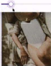

시작과 느

껴집니댜

.n ► °’’

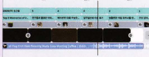

+

P•..”

###### • & 디자인 아이디어 제안: 다양한 확인해 보세요. 잘분석하면 실무에서 즉시 가능한 영상 노하우를 익힐 수

圈

있습니다

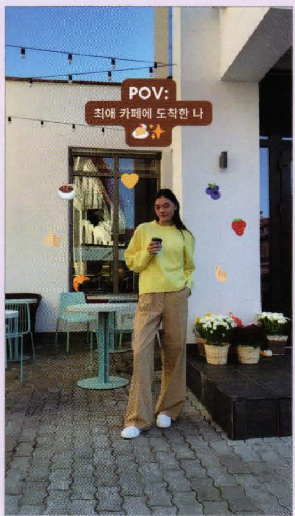

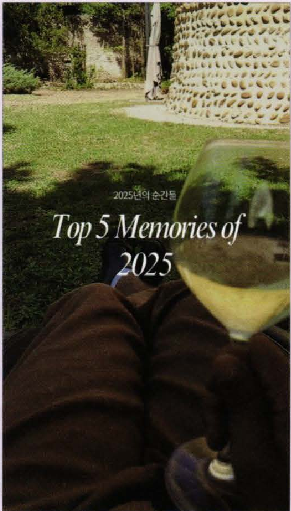

•

.\ I).I; ·I; / ( ' It()l N

'

‘감성브이로그형릴스Z A.POV카페리뷰스토리 ^기록잊회고용릴스

03 필라테스 스튜디오를 위한 디자인 291

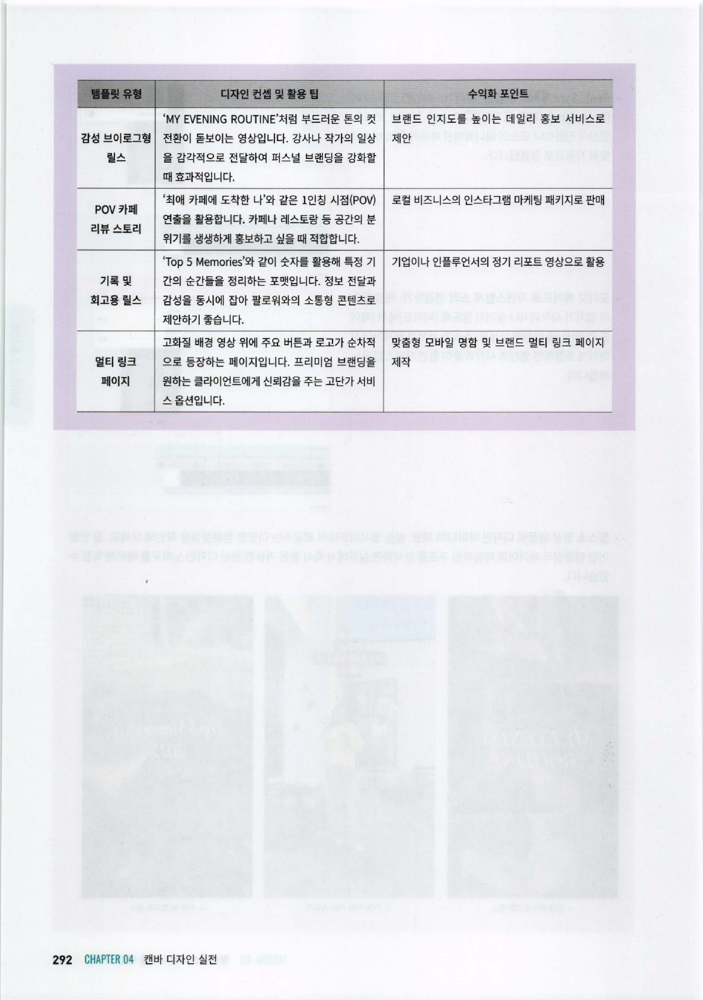

|”뢸유혈| | |
|---|---|---|
|감성브이로그형<br><br>릴스|'MY EVENING ROUTINE'처럼 부드러운 톤의 컷<br><br>전환이 돋보이는 영상입니다. 강사나 작가의 일상<br><br>을 감각적으로 전달하여 퍼스널 브랜딩을 강화할<br><br>때효과적입니다.|브랜드 인지도를 높이는 데일리 홍보 서비스로<br><br>제안|
|POV 카페 리뷰스토리|‘최애 카페에 도착한 나’와 같은 1인정 시점(POV)<br><br>연출을 활용합니다. 카페나 레스토랑 등 공간의 분 위기를 생생하게 홍보하고 싶을 때 적합합니다.|로컬 비즈니스의 인스타그램 마케팅 패키지로 판매|
|기록및<br><br>회고용릴스|'Top 5 Memories’와 같이 숫자를 활용해 특정 기<br><br>간의 순간둘을 정리하는 포맷입니다. 정보 전달과<br><br>감성을 동시에 잡아 팔로워와의 소통형 콘텐츠로 제안하기좋습니다.|기업이나 인플루언서의 정기 리포트 영상으로 활용|
|멀티링크 페01 지|고화질 배경 영상 위에 주요 버튼과 로고가 순자적 으로 등장하는 페이지입니다. 프리미엄 브랜딩을 원하는 클라이언트에게 신뢰감을 주는 고단가 서비 스옵션입니다.|맞증형 모바일 명함 및 브랜드 멀티 링크 페이지 제작|


###### 292 캔바 디자인 실전

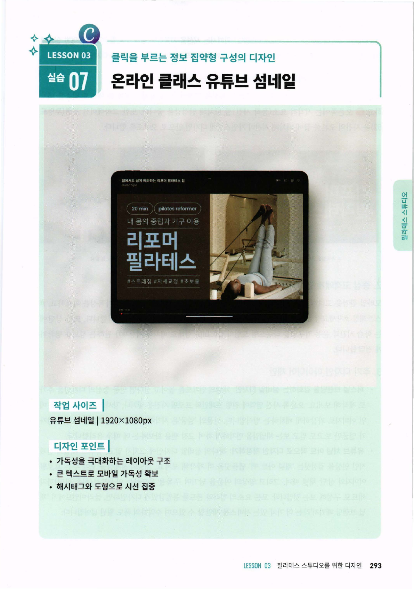

###### 수수

# : 온라인률래스유튜브

부르는 집약형 구성의 디자인


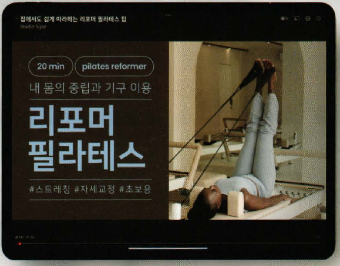

어―니叫시작

H{nJ 訓

###### 작업 사이즈 l

유튜브 |1920X1080px

###### 디자인 포인트 |

- • 가독성을 극대화하는 레이아웃 구조
- • 텍스트로 가독성


•

LESSON 03 필라테스 스튜디오를 위한 디자인 293

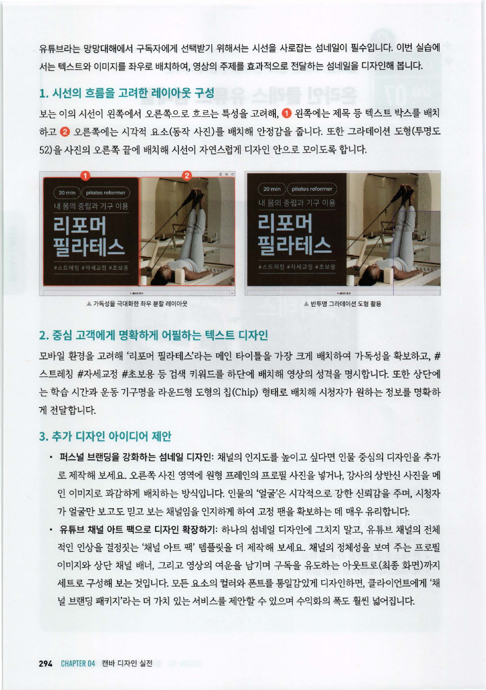

유튜브라는 망망대해에서 구독자에게 선택받기 위해서는 시선을 사로잡는 섬네일이 필수입니다. 이번

서는 텍스트와 이미지를 좌우로 배지하여, 영상의 주제를 효과적으로 전달하는 디자인해 봅니다.

- 1. 시선의 레이아웃 구성 보는 이의 시선이 왼쪽에서 오른쪽으로 흐르는 특성을 고려해, O 왼쪽에는 제목 등 텍스트 박스를 배치 하고 O 오른쪽에는 시각적 요소(동작 사진)를 배치해 안정감을 줍니댜 또한 그라데이션 도형(투명도

52)을 사진의 오른쪽 끝에 배치해 시선이 자연스럽계 디자인 안으로 모이도록 합니다.

~가독성을극대화한좌우분할레이아웃 ^반투명 그라데이션 도형 활용

- 2. 증심 고객에게 텍스트 모바일 환경을 고려해 ‘리포머 필라테스’라는 메인 타이틀을 가장 크게 배치하여 가독성을 확보하고, # 스트레청 #자세교정 #초보용 등 검색 키워드를 하단에 배치해 영상의 성격을 명시합니다. 또한 상단에 는 학습 시간과 운동 기구명을 라운드형 도형의 칩 (Chip) 형태로 배치해 시청자가 원하는 정보를 명확하 게전달합니댜
- 3.


- • 퍼스널 브랜딩을 강화하는 섬네일 디자인: 채널의 인지도를 높이고 싶다면 인물 중심의 디자인을 추가 로 제작해 보세요. 오른쪽 사진 영역에 원형 프레인의 프로필 사진을 넣거냐 강사의 상반신 사진을 메 인 이미지로 과감하게 배치하는 방식입니다. 인물의 얼굴'은 시각적으로 강한 신뢰감을 주며, 시청자 가 얼굴만 보고도 믿고 보는 채널임을 인지하게 하여 고정 팬을 확보하는 데 매우 유리합니다.
- • 유튜브 채널 아트 팩으로 디자인 확장하기: 하나의 섬네일 디자인에 그치지 말고, 유튜브 채널의 전체 적인 인상을 결정짓는 ‘채널 아트 팩’ 템플릿을 더 제작해 보세요. 채널의 정체성을 보여 주는 프로필 이미지와 상단 채널 배너, 그리고 영상의 여운을 남기며 구독을 유도하는 아웃트로(최종 화면)까지 세트로 구성해 보는 것입니다. 모든 요소의 컬러와 폰트를 통일감있게 디자인하면, 클라이언트에게 재 널 브랜딩 패키지’라는 더 가치 있는 서비스를 제안할 수 있으며 수익화의 폭도 훨씬 넓어집니다.


294 CHAPTER 04 캔바 디자인 실전

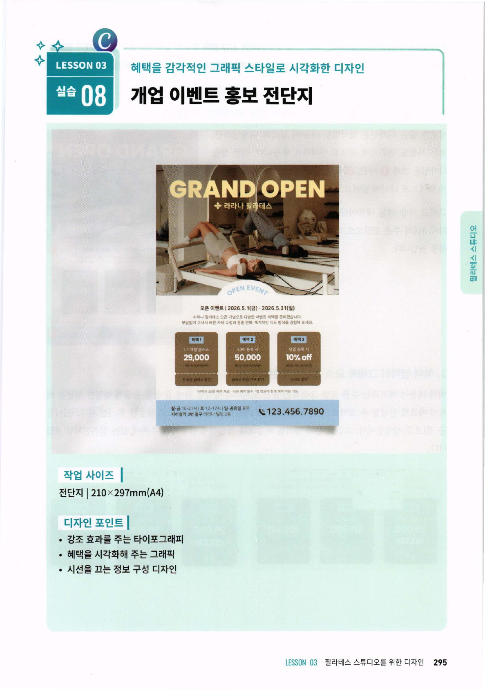

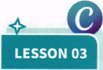

수수


감각적인 그래픽 디자인

코

###### 개업이벤트흥보전단지

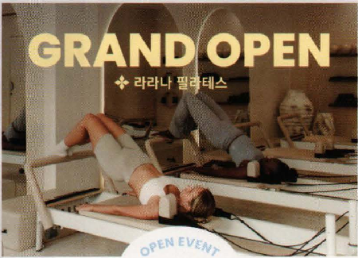


어＿니빠서시

-R{nJ 訓

오픈 01뺀트 I .5. - 2 .5. 일

라라니 오른 기념으홋 다앙힌 뺀르 죤

·답없이 오셔서 바른 X1세 교정괴 틀륭 현11, 지도 발식을 보세요

###### E

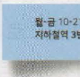

월·w l0-21 시 1 토 . 일 공휴일 휴무

123

라라니 2 증

###### 작업 사이즈 |

|210x 297mm(A4)

- • 주는 타이포그래피
- • 주는
- • 끄는 구성


LESSON 03 필라테스 스튜디오를 위한 디자인 295

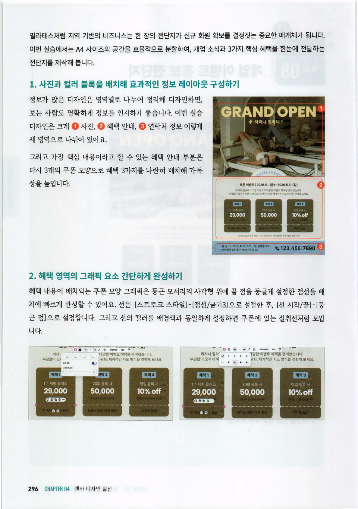

필라테스처럼 지역 기반의 비즈니스는 한 장의 전단지가 신규 회원 확보를 결정짓는 중요한 매개제가 됩니다. 이번 실습에서는 A4 사이즈의 공간을 분할하여, 개업 소식과 3가지 혜택을 한눈에 전달하는

전단지를 제작해 봅니다.

###### 1. 사진과 컬러 배치해 효과적인 정보 레이아웃 구성하기

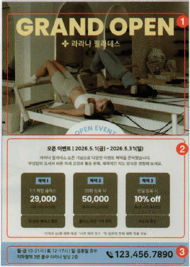

정보가 많은 디자인은 영역별로 나누어 정리해 디자인하면,

보는 사람도 명확하게 정보를 인지하기 좋습니다. 이번 실습

디자인은크게 사진, 혜택 안내, 연락처 정보이렇게

세 영역으로 나뉘어 있어요.

그리고 가장 핵심 내용이라고 할 수 있는 혜택 안내 부분은 다시 3개의 쿠폰 모양으로 혜택 3가지를 나란히 배치해 가독

성을높입니다.

오른 I .5.1(급) - .5 31(일)

..,흑."....겨'"••,....

1& 11 ••••

지"" ’'I! ·구라라니'1일

###### 2. 혜택 영역의 그래픽 요소 완성하기

혜택 내용이 배치되는 쿠폰 모양 그래픽은 둥근 모서리의 사각형 위에 끝 점을 둥글게 설정한 점선을 배

치에 빠르게 완성할 수 있어요. 선은 [스트로크 스타일] - [점선/굵기 3]으로 설정한 후, [선 시작/끝]－［둥

###### 근 점]으로 설정합니댜 그리고 선의 컬러를 배경색과 동일하게 설정하면 쿠폰에 있는 절취선처럼 보입

니댜

###### 0 ll! - -,,~- .. ,. --·

###### -`-. -,. · ·-~----~/r- ··_..~ --..--·-..

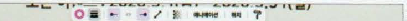

'I'

라라나밀라r o .. e e e 준비했습나다.

라라L - • 준비했습니다,

- i 지도

부담없이 오셔서 바 지도 경험해 .

.." «

노- .. . ..

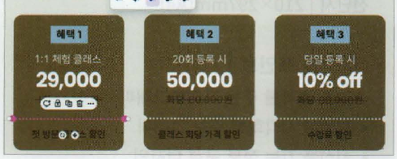

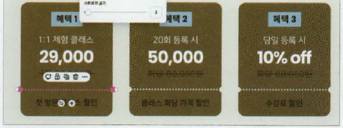

###### 296 CHAPTER 04 캔바디자인 실전

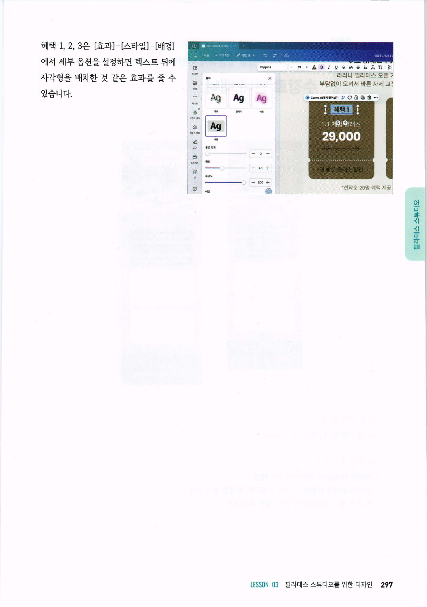

I: m ~' 一··三

혜택 1, 2, 3은 [효과]—[스타일]—[배경]

에서 세부 옵션을 설정하면 텍스트 뒤에 사각형을 배치한 것 같은 효과를 줄 수

• 스 I !.I S .... 루!三 J.TI 3:::

G} ” - u

""" m X

바른 교

”

있습니다.

###### Ag Ag Ag

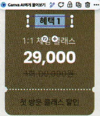

* 빼• ••• 넬

###### ........o..-

###### ...

4

됴구 틀근

e - 0 +

" .. . 신

- 40 +

8?

·뺄도

- 100 +

색‘

언읊신길

읊

LESSON 03 필라데스 스튜디오를 위한 디자인 297

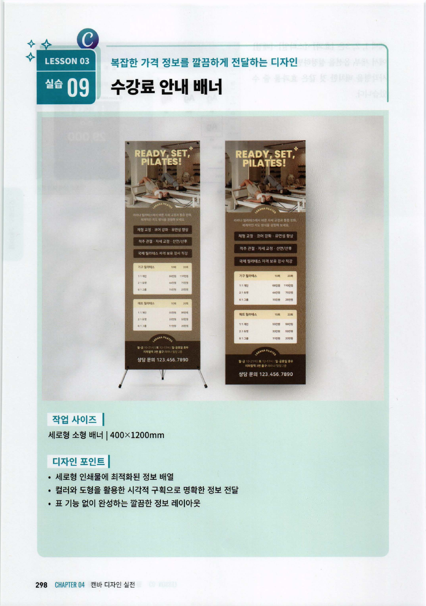

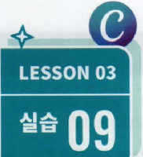

###### 수수

가격 디자인

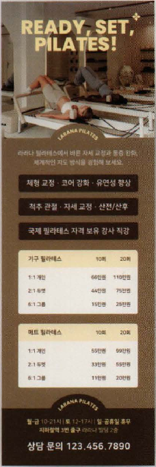

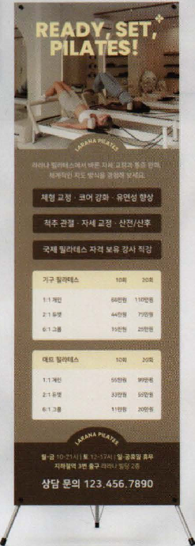

###### |

배너 |400X1200mm

###### 포인트|

- • 정보
- • 컬러와 도형을 시각적 구획으로
- • 표 기능 없이 정보 레이아웃


298 캔바 디자인 실전

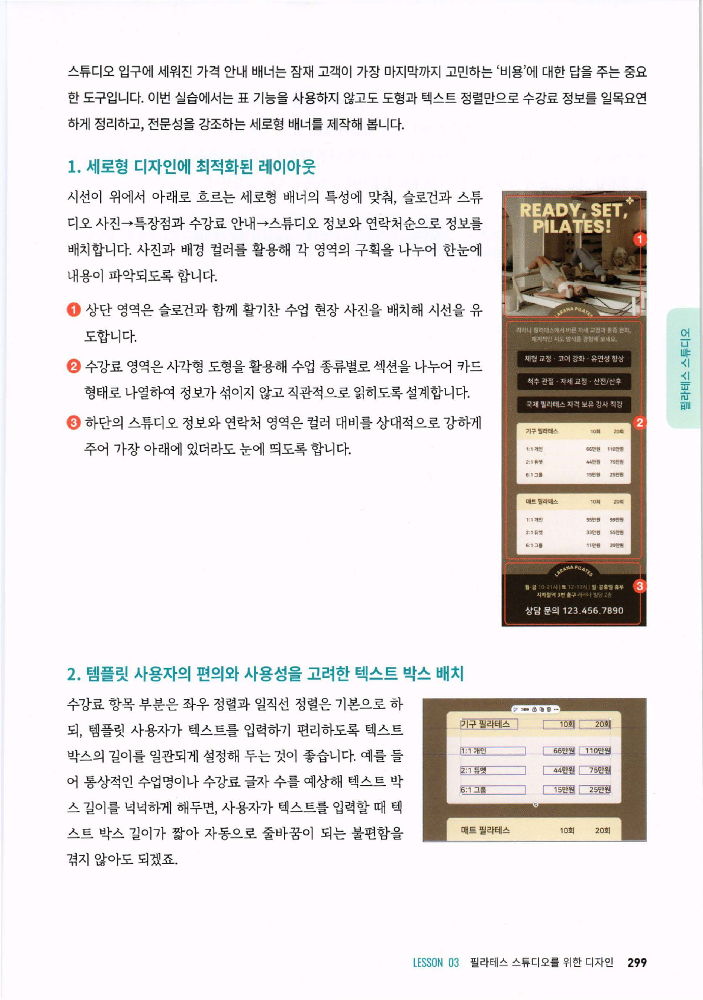

스튜디오 입구에 세워진 가격 안내 배너는 잠재 고객이 가장 마지막까지 고민하는 ‘비용’에 대한 답을 주는 중요

한 도구입니다. 이번 실습에서는 표 기능을 사용하지 않고도 도형과 텍스트 정렬만으로 수강료 정보를 일목요연 하게 정리하고, 전문성을 강조하는 세로형 배너를 제작해 봅니다.

###### 1. 세로형 디자인에 최적화된

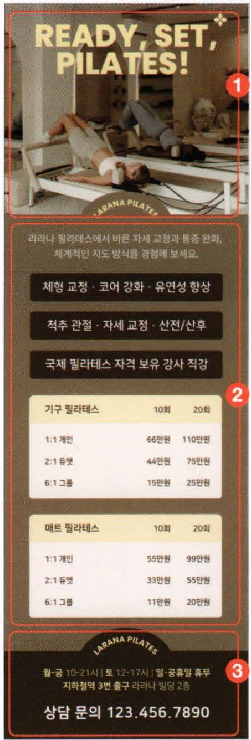

시선이 위에서 아래로 흐르는 세로형 배너의 특성에 맞춰, 슬로건과 스튜

디오 사진一특장점과 수강료 안내一스튜디오 정보와 연락처순으로 정보를

배치합니댜 사진과 배경 컬러를 활용해 각 영역의 구획을 나누어 한눈에

내용이 파악되도록 합니다.

O 상단 영역은 슬로건과 함께 활기찬 수업 현장 사진을 배치해 시선을 유

어＿니빠서시＿

도합니다.

O 수강료 영역은 사각형 도형을 활용해 수업 종류별로 섹션을 나누어 카드

B1a 訓

형태로 나열하여 정보가 섞이지 않고 직관적으로 읽히도록 설계합니다.

O 하단의 스튜디오 정보와 연락처 영역은 컬러 대비를 상대적으로강하게

주어 가장 아래에 있더라도 눈에 띄도록 합니다.

###### 2. 사용자의 사용성을 고려한 텍스트 박스 배치

수강료 항목 부분은 좌우 정렬과 일직선 정렬은 기본으로 하

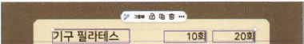

되, 템플릿 사용자가 텍스트를 입력하기 편리하도록 텍스트

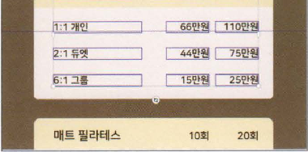

h:1개입 l h:1듀엇 | 원

박스의 길이를 일관되게 설정해 두는 것이 좋습니댜 예를 들 어 통상적인 수업명이나 수강료 글자 수를 예상해 텍스트 박 스 길이를 넉넉하계 해두면, 사용자가 텍스트를 입력할 때 텍

매 2

스트 박스 길이가 짧아 자동으로 줄바꿈이 되는 불편함을 겪지 않아도 되겠죠.

필라테스 스튜디오를 위한 디자인 299

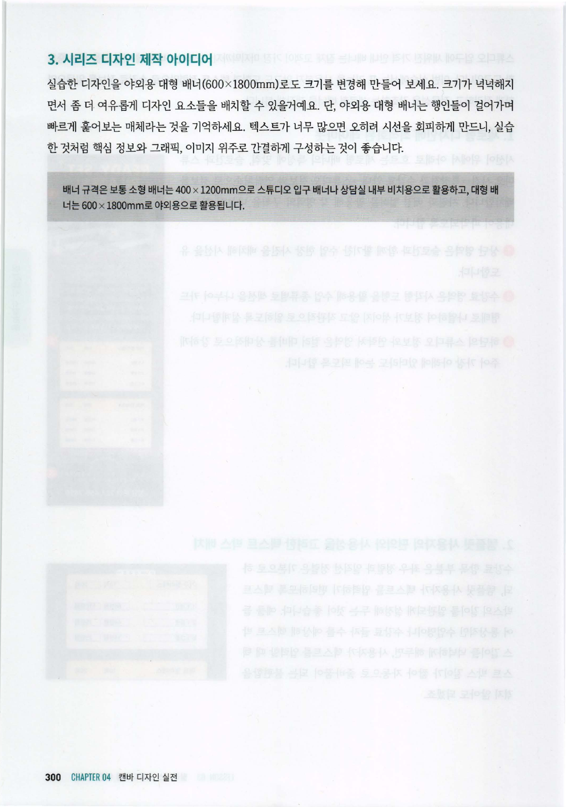

###### 3. 시리즈 디자인 제작

실습한 디자인을 야외용 대형 배너 (600x 1800mm)로도 크기를 변경해 만들어 보세요. 크기가 넉넉해지

면서 좀 더 여유롭게 디자인 요소들을 배치할 수 있을거예요. 단, 야외용 대형 배너는 행인들이 걸어가며

###### 빠르게 훑어보는 매체라는 것울 기억하세요. 텍스트가 너무 많으면 오히려 시선을 회피하게 만드니, 실습

한 것처럼 핵심 정보와 그래픽, 이미지 위주로 간결하게 구성하는 것이 좋습니다.


배너 규격은 x 입구 활용하고, 대형 배 너는 600 x 1800mm로

300 CHAPTER 04 캔바 디자인 실전

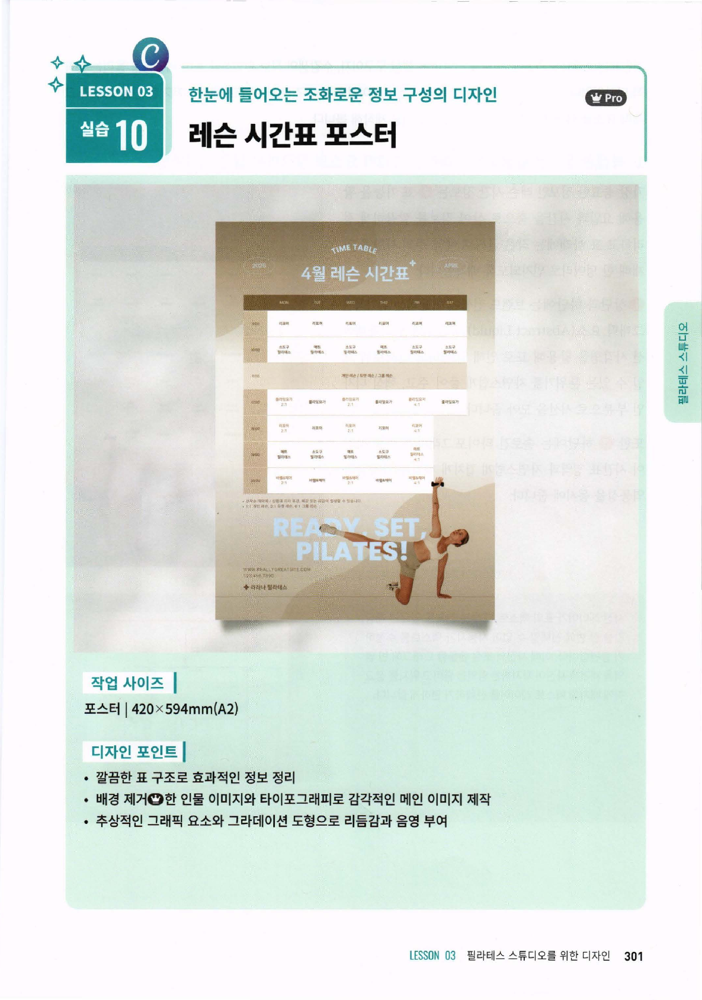

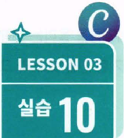

수수

CEO

조화로운 구성의 디자인

- :파


레슨시간표포스터


—

리量°' "어 ....

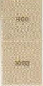

보"

.., .. *됴구 .. "구 "구 口

...u '"＂스 ·- I ... I-

망「

###### -<I

###### I ..... ......

I l 嶋손

': ,, .

....

“`요「

틀칵`"

###### lt00 m”0l ••뻬 ... ... .... .. 포구 ..~` .

###### ..

###### ’ ·- .틀

.ZI스..

"'

'*”스

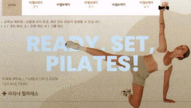

- 대."m

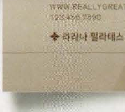

작업 사이즈 |

포스터 |42Qx 594mm(A2)

- • 표 정리
- • 배경 이미지와 이미지
- • 그래픽 요소와 부여


LESSON 03 필라테스 스튜디오를 위한 디자인 301

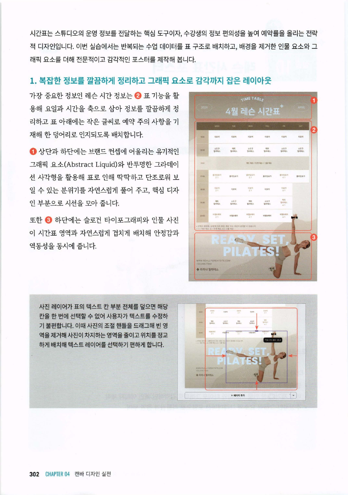

시간표는 스튜디오의 운영 정보를 전달하는 핵심 도구이자, 수강생의 정보 편의성을 높여 예약률을 을리는 전략 적 디자인입니다. 이번 실습에서는 반복되는 수업 데이터를 표 구조로 배지하고, 배경을 제거한 인물 요소와 그

래픽 요소를 더해 전문적이고 감각적인 포스터를 제작해 봅니다.

###### 1. 정보를 깔끔하게 요소로 감각까지 레이아웃

- 가장 중요한 정보인 레슨시간 정보는e 표기능을활


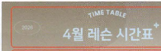

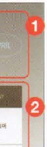

용해 요일과 시간을 축으로 삼아 정보를 깔끔하게 정

—


리하고 표 아래에는 작은 글씨로 예약 주의 사항을 기

###### ... ...

###### "‘’ ....

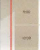

재해 한 덩어리로 인지되도록 배치합니댜

###### “°'

리鳳뻬

###### ....."구 ... ......“’ ..네스*’

"' ....

O 상단과 하단에는 브랜드 컨셉에 어울리는 유기적인

소

그래픽 요소(Abstract Liquid)와 반투명한 그라데이

看언嶋~,.뺑빼t-1. I 따

.... .....,, ...

###### ...’ .... “”., ..."

lftWliil'I •.,,.기

션 사각형을 활용해 표로 인해 딱딱하고 단조로워 보 일 수 있는 분위기를 자연스럽게 풀어 주고, 핵심 디자

’

.OO l m...Cit ...

... "' .

^'

tto I 11빼~量 포’

인부분으로시선을모아줍니댜

·리 I"＂소 `"'嶋,

IO

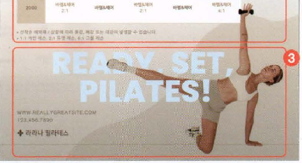

또한 O 하단에는 슬로건 타이포그래피와 인물 사진

이 시간표 영역과 자연스럽게 겹치게 배치해 안정감과

역동성을 동시에 줍니다.

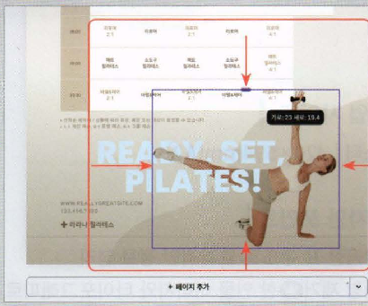

사진 칸 칸을 한 수 기 빈 영

역율 제거해

하게

4

302 CHAPTER 04 캔바 디자인 실전

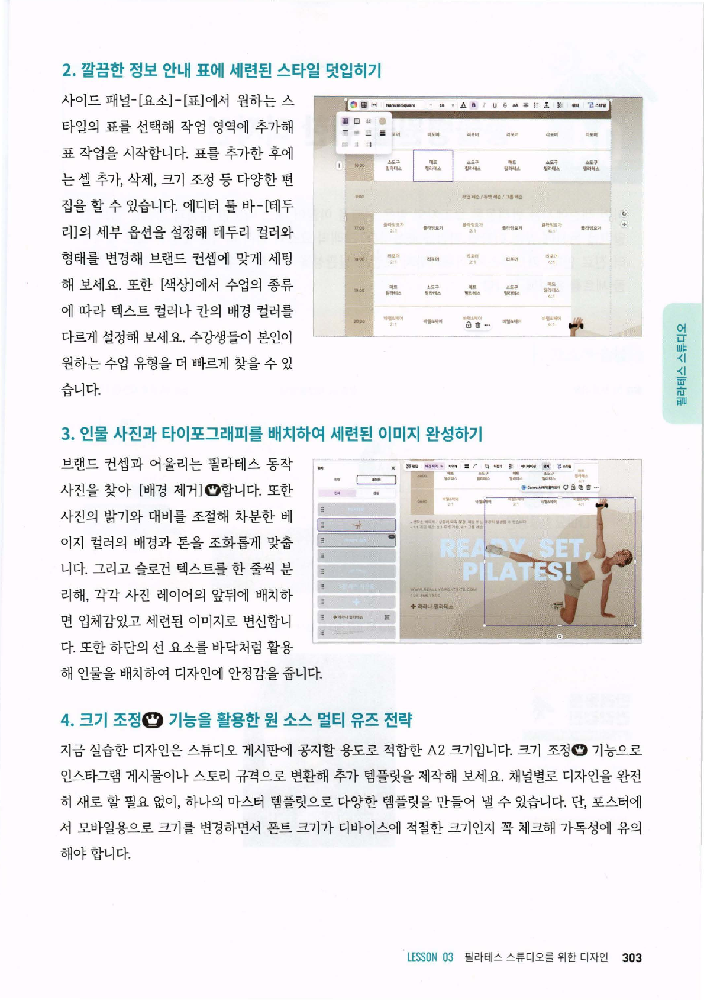

###### 2. 정보 표에 세련된 스타일

사이드 패널-［요소]-［표]에서 원하는 스

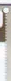

- ,.. _ A 8 u e .. 暮 ;: i X ... T쩌

III H ._.....

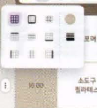

타일의 표를 선택해 작업 영역에 추가해

리표어

리포머

꼬0l

라며

표구 E

표 작업을 시작합니다. 표를 추가한 후에

",.

소도구

소도구 틸러

소도구

혈리"

는 셀 추가, 삭제, 크기 조정 등 다양한 편 집을 할 수 있습니다. 에디터 툴 바-[테두 리]의 세부 옵션을 설정해 테두리 컬러와 형태를 변경해 브랜드 컨셉에 맞게 세팅

“언..SI 름뺏빼CI,. 뻬e

0

틀라일요가., ·라요기

+

률.,,

‘요기

,'

’`

갑뺄요기

'...,

히皇머

긴표어

리모더

리모어

‘'

2 1

....

해 보세요. 또한 [색상]에서 수업의 종류

••

..,

빼

소도구

표구

릴라스

`리"스

·라

릴라”스

... l·

에 따라 텍스트 컬러나 칸의 배경 컬러를 다르게 설정해 보세요. 수강생들이 본인이

어＿나叫시사-포브叫

....

빼빼기

iil 9 ...

빽뺄島

’

蠶XX}

‘

원하는수업 유형을더 빠르게 찾을수있

습니다.

###### 3. 사진과 배치하여 이미지

[..

Ill.. ••떠 • "" .. r b .." X _ .. T따

브랜드 컨셉과 어울리는 필라테스 동작

x

... ", •. 포구

-－-～oa멀‘···

..

.”.

I - l

·- ••빼소 를."쇼 ·마

사진을 찾아 [배경 제거]O합니다. 또한

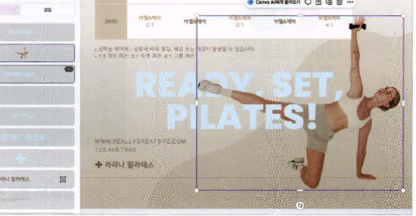

사진의 밝기와 대비를 조절해 차분한 베 이지 컬러의 배경과 톤을 조화롭게 맞춥

EE

"~

니댜 그리고 슬로건 텍스트를 한 줄씩 분

~~

리해, 각각 사진 레이어의 앞뒤에 배치하

♦ 라러니릴라테스

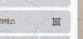

:: ♦

’`"

면 입체감있고 세련된 이미지로 변신합니 댜 또한 하단의 선 요소를 바닥처럼 활용

해 인물을 배치하여 디자인에 안정감을 줍니다.

###### 4 O 전략지금 실습한 디자인은 스튜디오 계시판에 공지할 용도로 적합한 A2 크기입니다. 크기 조정O 기능으로인스타그램 게시물이나 스토리 규격으로 변환해 추가 템플릿을 제작해 보세요. 채널별로 디자인을 완전히 새로 할 필요 없이, 하나의 마스터 템플릿으로 다양한 템플릿을 만들어 낼 수 있습니다. 단, 포스터에

###### 서 모바일용으로 크기를 변경하면서 폰트 크기가 디바이스에 적절한 크기인지 꼭 체크해 가독성에 유의해야합니다.

LESSON 03 필라테스 스튜디오를 위한 디자인 303

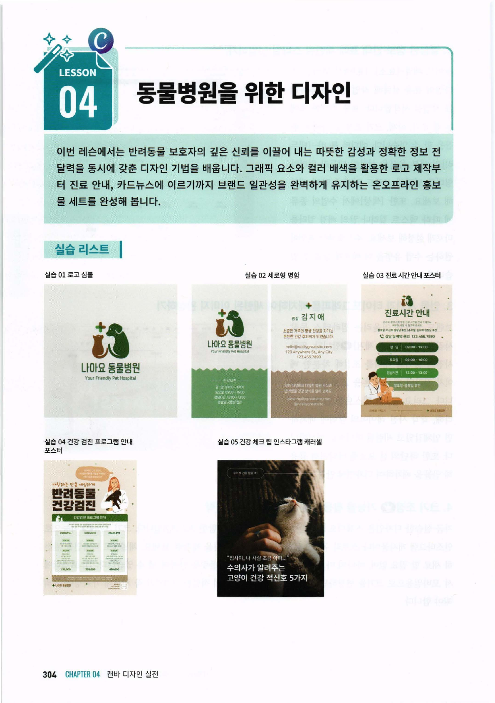

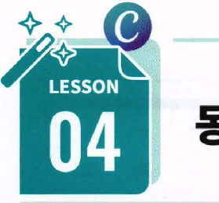

###### 둥롤병원을위한디자인


###### 레슨에서는 보호자의 이끌어 내는 따뜻한 전

동시에 갖준 디자인 배웁니다. 그래픽 컬러 배색을 로고 제작부

터 완벽하게 유지하는

롤 봅니다.


###### 실습리스트 |

실습 03 진료 시간안내 포스터

실습 01 로고심볼

실습 02 세로형 명함

###### a .

_·.

+

You,i`，，

민감

###### ...........．론,........"”

i`

11는

e 상일빼먹툰 .456 7890 •

건강

com

,23AnwW`『． St,AnyC,tv

\\

二

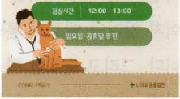

Your Fn•ndly Pet Hospital

실 04 건강 검진 프로그램 안내

실습 05 건강 제크 팁 인스타그램 캐러셀

포스터

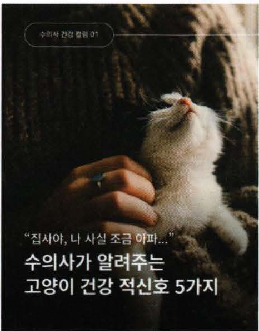

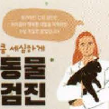

###### . Z

..

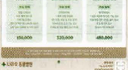

304 CHAPTER 04 캔바 디자인 실전

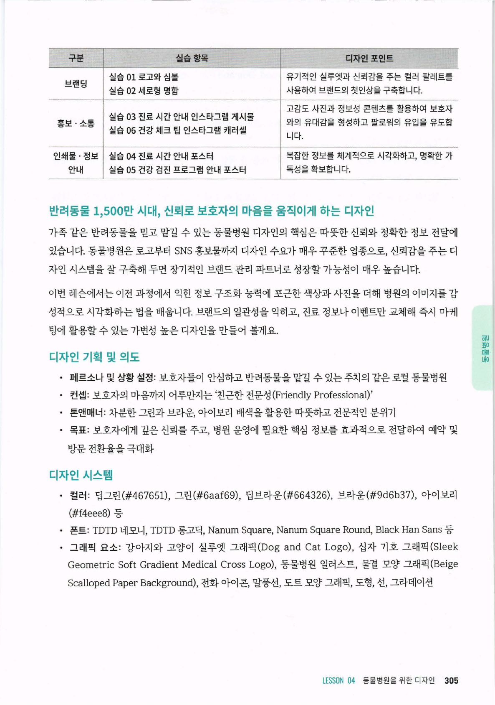

###### I

|I 구분| |디자인포인트 I|
|---|---|---|
|_l:::I 래L..디O|실습 01 로고와심볼<br>실습 02 세로형 명함<br>|유기적인 실루엣과 신뢰감을 주는 컬러 팔레트를 사용하여 브랜드의 첫인상을 구축합니다.|
|홍보 · 소통|실습 03 진료 시간 안내 인스타그램 게시물 실습 06 건강 체크 팁 인스타그램 캐러셀|고감도 사진과 정보성 콘텐츠를 활용하여 보호자 와의 유대감을 형성하고 팔로워의 유입을 유도합<br><br>니댜|
|인쇄물·정보<br><br>안내|실습 04 진료 시간 안내 포스터<br>실습 05 건강 검진 프로그램 안내 포스터<br>|복잡한 정보를 제계적으로 시각화하고, 명확한 가<br><br>독성을확보합니다.|


###### 반려동물 1,500만 시대, 신뢰로 보호자의 마음을 움직이게 하는 디자인

가족 같은 반려동물을 믿고 맡길 수 있는 동물병원 디자인의 핵심은 따뜻한 신뢰와 정확한 정보 전달에 있습니다. 동물병원은 로고부터 SNS 홍보물까지 디자인 수요가 매우 꾸준한 업종으로, 신뢰감을 주는 디 자인 시스템을 잘 구축해 두면 장기적인 브랜드 관리 파트너로 성장할 가능성이 매우 높습니다.

이번 레슨에서는 이전 과정에서 익힌 정보 구조화 능력에 포근한 색상과 사진을 더해 병원의 이미지를 감 성적으로 시각화하는 법을 배웁니다. 브랜드의 일관성을 익히고, 진료 정보나 이벤트만 교체해 즉시 마케

팅에 활용할 수 있는 가변성 높은 디자인을 만들어 볼게요.

Bio

幽 UIO

###### 디자인기획 및의도

- • 페르소나 및 상황 설정: 보호자들이 안심하고 반려동물을 맡길 수 있는 주치의 같은 로컬 동물병원
- • 컨셉: 보호자의 마음까지 어루만지는 ‘친근한 전문성 (Friendly Professional)'
- • 톤앤매너: 차분한 그린과 브라운, 아이보리 배색을 활용한 따뜻하고 전문적인 분위기
- • 목표: 보호자에게 깊은 신뢰를 주고, 병원 운영에 필요한 핵심 정보를 효과적으로 전달하여 예약 및 방문전환율을극대화


###### 디자인시스템

- • 컬러: 딥그린(#467651), 그린(#6aaf69), 딥브라운(#664326), 브라운(#9d6b37), 아이보리 (#f4eee8) 등
- • 폰트: TDTD 네모니, TDTD 롱고딕, Nanum Square, Nanum Square Round, Black Han Sans 등
- • 그래픽 요소: 강아지와 고양이 실루엣 그래픽 (Dog and Cat Logo), 십자 기호 그래픽 (Sleek Geometric Soft Gradient Medical Cross Logo), 동물병원 일러스트, 물결 모양 그래픽 (Beige Scalloped Paper Background), 전화 아이콘, 말풍선, 도트 모양 그래픽, 도형, 선, 그라데이션


LESSON 04 동물병원을 위한 디자인 305

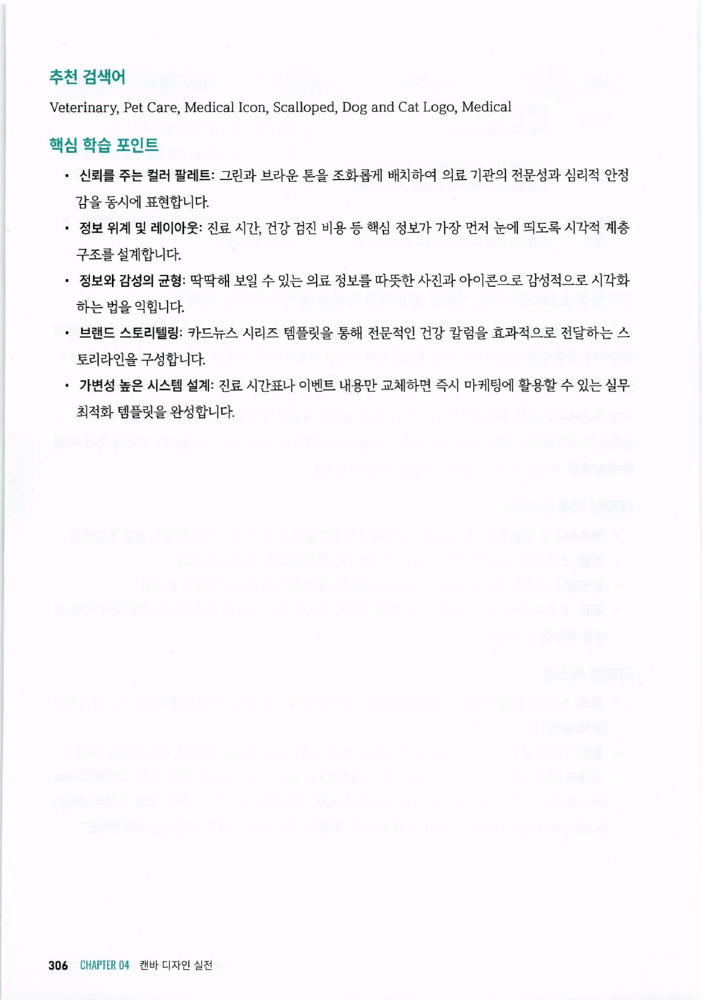

주천검색어

###### Veterinary, Pet Care, Medical Icon, Scalloped, Dog and Cat Logo, Medical

###### 핵심학습포인트

신뢰를 주는 컬러 팔레트: 그린과 브라운 톤을 조화롭게 배치하여 의료 기관의 전문성과 심리적 안정

감을 동시에 표현합니다.

정보 위계 및 레이아웃: 진료 시간, 건강 검진 비용 등 핵심 정보가 가장 먼저 눈에 띄도록 시각적 계층 구조를설계합니다.

###### 정보와 감성의 균형: 딱딱해 보일 수 있는 의료 정보를 따뜻한사진과 아이콘으로감성적으로 시각화

하는법을익힙니다. 브랜드 스토리텔링: 카드뉴스 시리즈 템플릿을 통해 전문적인 건강 칼럼을 효과적으로 전달하는 스

토리라인을 구성합니다.

가변성 높은 시스템 설계: 진료 시간표나 이벤트 내용만 교체하면 즉시 마케팅에 활용할 수 있는 실무 최적화 템플릿을 완성합니다.

CHAPTER 04 캔바 디자인 실전

306

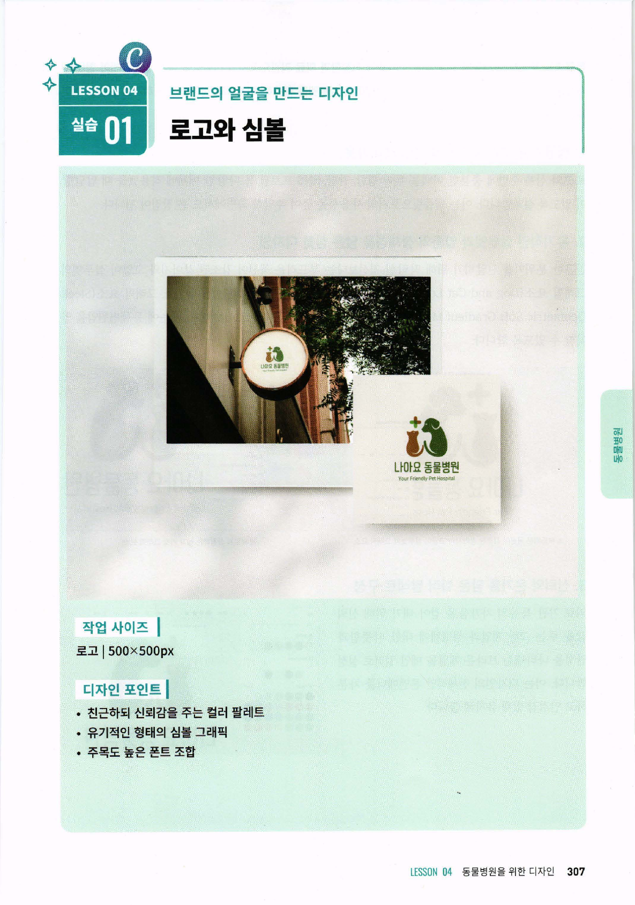

- :러


브랜드의 만드는 디자인

-

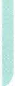

로고와심볼

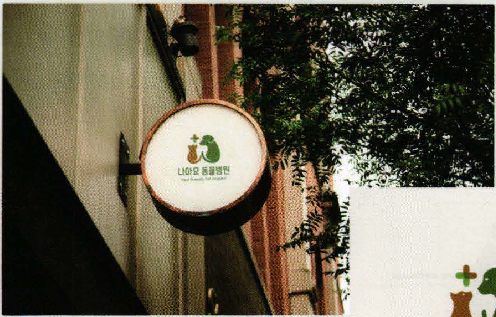

찌

i`

iO卿

UjO

You『

작업 사이즈 l

###### | xsoopx

디자인

•

• 그래픽

•

LESSON 04 동물병원을 위한 디자인 307

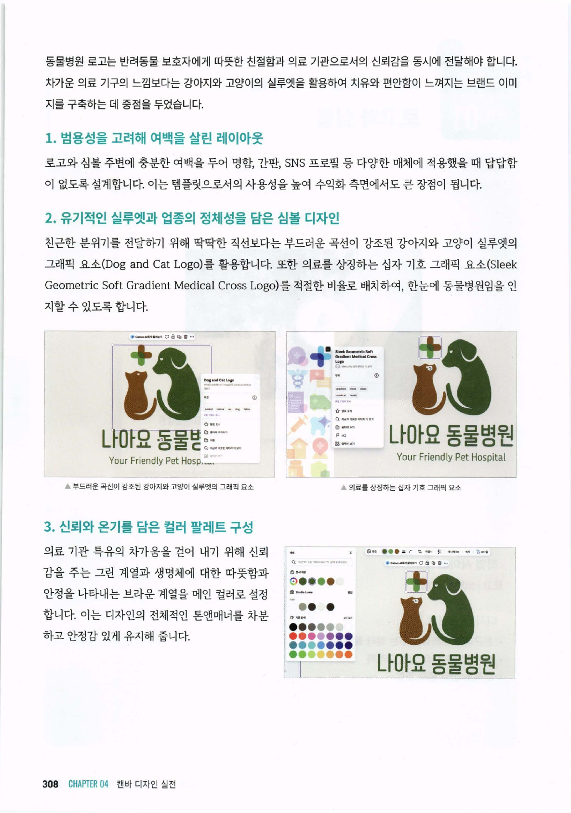

동물병원 로고는 반려동물 보호자에게 따뜻한 진절함과 의료 기관으로서의 신뢰감을 동시에 전달해야 합니다.

자가운 의료 기구의 느낌보다는 강아지와 고양이의 실루엣을 활용하여 지유와 편안함이 느껴지는 브랜드 이미

지를 구측하는 데 중점을 두었습니다.

###### L 범용성을 고려해 여백을 살린 레이아웃

로고와 심볼 주변에 충분한 여백을 두어 명함, 간판, SNS 프로필 등 다양한 매체에 적용했을 때 답답함 이 없도록 설계합니다. 이는 템플릿으로서의 사용성을 높여 수익화 측면에서도 큰 장점이 됩니다.

###### 2. 실루엣과

친근한 분위기를 전달하기 위해 딱딱한 직선보다는 부드러운 곡선이 강조된 강아지와 고양이 실루엣의 그래픽 요소(Dog and Cat Logo)를 활용합니다. 또한 의료를 상징하는 십자 기호 그래픽 요소(Sleek Geometric Soft Gradient Medical Cross Logo)를 적절한 비율로 배치하여, 한눈에 동물병원임을 인 지할수있도록합니댜

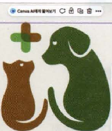

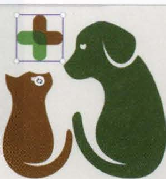

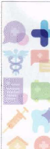

• =..-:is:..

”- ,.

- o ...cu
- o··m


•• 0

。

*.....

oQ ...-.,,`."'"m"＂며

誌·cm 나마요동물병원

나마묘동물방노二

p 선

Your Friendly Pet Hospital

Your Friendly Pet Hosp.....

... 부드러운 곡선이 강조된 강아지와 고양이 실루엣의 그래픽 요소

~ 의료를 상징하는 십자 기호 그래픽 요소

###### 3. 신뢰와 담은 컬러 팔레트 구성

x @•• ••• 三r a ..,. ,

의료 기관 특유의 차가움을 걷어 내기 위해 신뢰 감을 주는 그린 계열과 생명체에 대한 따뜻함과

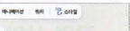

Q

--....,,。 ill ra a ···

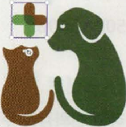

0•뻬..

·--

-i• • •

###### 안정을 나타내는 브라운 계열을 메인 컬러로 설정 합니다. 이는 디자인의 전체적인 톤앤매너를 차분

O기•..• •

##### 尹••l•H••H••:

하고 안정감 있게 유지해 줍니다.

308 CHAPTER 캔바 디자인 실전

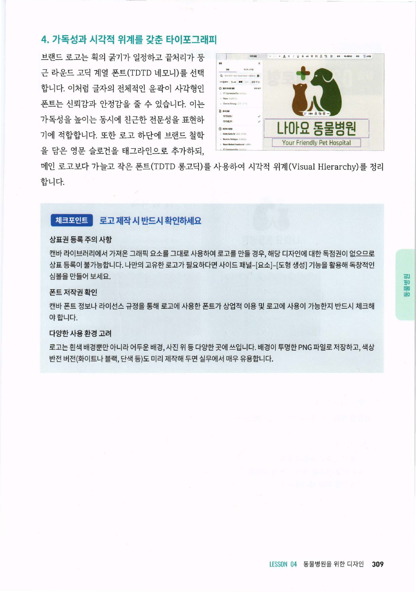

###### 4. 가독성과 시각적 위계를 타이포그래피

• A • u ‘ ... “ 프 n [ " • ... i:-

브랜드 로고는 획의 굵기가 일정하고 끝처리가 둥 근 라운드 고딕 계열 폰트(TDTD 네모니)를 선택 합니다. 이처럼 글자의 전체적인 윤곽이 사각형인

”

Q •

•••- 입'"＇ .. ..

.....H

폰트는신뢰감과 안정감을줄수 있습니댜 이는 '.....-

###### 。....

###### 가독성을 높이는 동시에 친근한 전문성을 표현하

###### JI

###### -"

0-....

기에 적합합니댜 또한 로고 하단에 브랜드 철학

|L三"n「' 尸

I I

一| tal | ―」

을 담은 영문 슬로건을 태그라인으로 추가하되,

메인 로고보다 가늘고 작은 폰트(TDTD 롱고딕)를 사용하여 시각적 위계 (Visual Hierarchy)를 정리

합니댜

로고제작시 반드시 확인하세요

상표권등록주의사항

캔바 라이브러리에서 가져온 그래픽 요소를 그대로 사용하여 로고를 만들 경우, 해당 디자인에 독점권이 없으므로 상표 등록이 나만의 고유한 로고가 사이드 패널-[요소]-［도형 기능을 독창적인

###### B10

심볼율만들어보세요.

卿 UIO

폰트저작권확인

폰트 라이선스 통해 사용한 이용 잊 사용이 가능한지 반드시 제크해

야합니다.

로고는 배경뿐만 아니라 어두운 배경, 사진 위 등 다양한 곳에 쓰입니다. 배경이 PNG 저장하고, 색상

블랙, 단색 등)도 미리 제작해 두면 실무에서 매우 유용합니다.

LESSON 04 동물병원을 위한 디자인 309

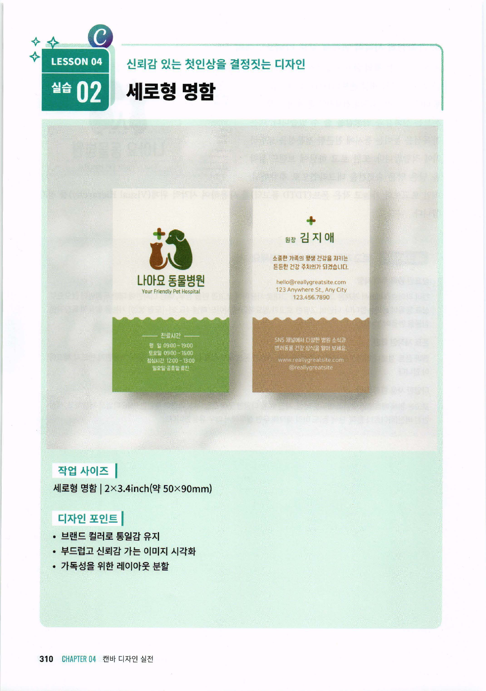

###### Q

수수

늠- 신뢰감 결정짓는디자인

세로형명합

+

원장 김지애

i`

l는 든 건

hello@reallygreatsite.com


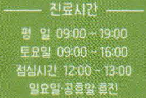


작업 사이즈 |

|2X X90mm)

###### 포인트|

- • 브랜드 컬러로 통 유지
- • 부드 가는 이미지


•

310 04 캔바 디자인 실전

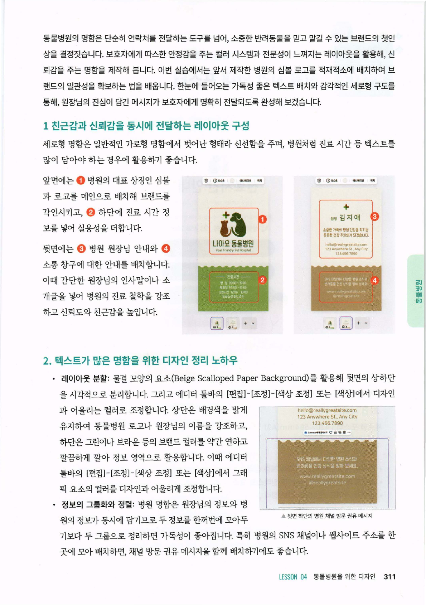

동물병원의 명함은 단순히 연락처를 전달하는 도구를 넘어, 소중한 반려동물을 믿고 맡길 수 있는 브랜드의 첫인

상을 결정짓습니다. 보호자에게 따스한 안정감을 주는 컬러 시스템과 전문성이 느껴지는 레이아웃을 활용해, 신

뢰감을 주는 명함을 제작해 봅니다. 이번 실습에서는 앞서 제작한 병원의 심볼 로고를 적재적소에 배지하여 브 랜드의 일관성을 확보하는 법을 배웁니다. 한눈에 들어오는 가독성 좋은 텍스트 배지와 감각적인 세로형 구도를

통해, 원장님의 진심이 담긴 메시지가 보호자에게 명확히 전달되도록 완성해 보겠습니다.

###### 1 레이아웃 구성

세로형 명함은 일반적인 가로형 명함에서 벗어난 형태라 신선함을 주며, 병원처럼 진료 시간 등 텍스트를 많이 담아야하는경우에 활용하기 좋습니다.

앞면에는 O 병원의 대표 상징인 심볼

El (l)..... ."" ...,

g (!)”皇 *• ".

과 로고를 메인으로 배치해 브랜드를

+

각인시키고, O 하단에 진료 시간 정

i`

휩잡

보를 넣어 실용성을 더합니다.

소O탄 )1골인 '1l생 )J11는

건강

mb@r••h9'..!'n com

뒷면에는 O 병원 원장님 안내와 O

• .t.nvC,ty

Yo,, Fr«널~Ptt

소통 창구에 대한 안내를 배치합니다.

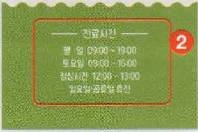

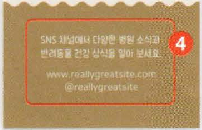

Bg

이때 간단한 원장님의 인사말이나 소

卿

개글을 넣어 병원의 진료 철학을 강조

하고 신뢰도와 친근감을 높입니다.

0? +

0l +

###### 2. 텍스트가 많은 정리 노하우

###### • 레이아웃 분할 물결 모양의 요소(Beige Scalloped Paper Background)를 활용해 뒷면의 상하단을 시각적으로 분리합니다. 그리고 에디터 툴바의 [편집] - ［조정] _ [색상 조정] 또는 [색상]에서 디자인

과 어울리는 컬러로 조정합니댜 상단은 배경색을 밝게 I .

123

유지하여 동물병원 로고나 원장님의 이름을 강조하고, .

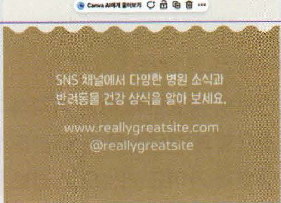

하단은 그린이나 브라운 등의 브랜드 컬러를 약간 연하고 깔끔하계 깔아 정보 영역으로 활용합니다. 이때 에디터

툴바의 [편집] - ［조정]-［색상 조정] 또는 [색상]에서 그래 픽 요소의 컬러를 디자인과 어울리계 조정합니다.

원의정보가동시에담기므로두정보를한꺼번에모아두 ’^뒷면하단의병원채널방문권유메시지

###### • 정보의 그룹화와 정렬: 병원 명함은 원장님의 정보와 병

###### 기보다 두 그룹으로 정리하면 가독성이 좋아집니다. 특히 병원의 SNS 채널이나 웹사이트 주소를 한

###### 곳에 모아 배치하면, 채널 방문 권유 메시지울 함께 배치하기에도 좋습니다.

04 동물병원을 위한 디자인 311

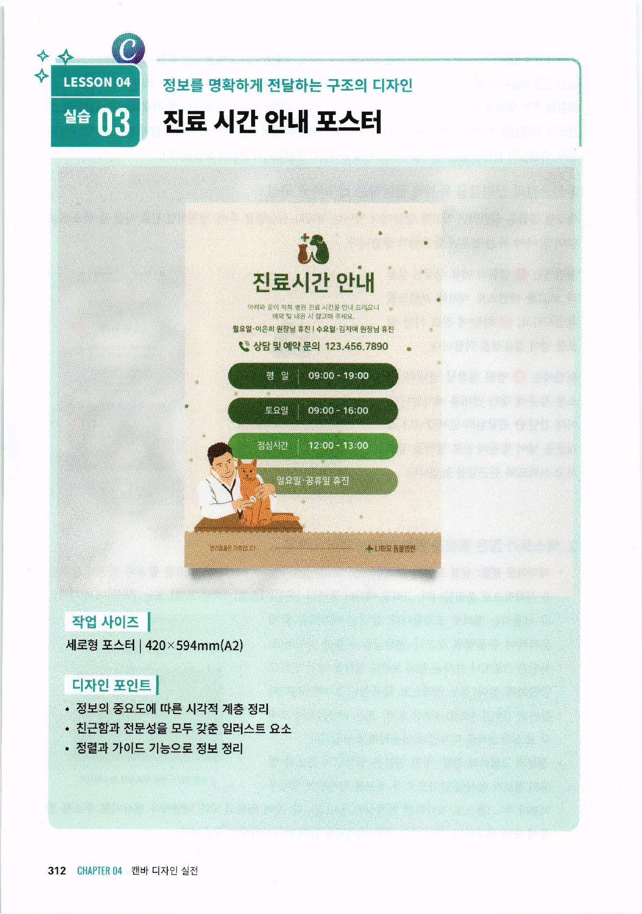

쳅

수수

###### 늠鴨

정보를 명확하게 전달하는 구조의 디자인

코

진료시간안내포스터

•

•

•

• • •

###### •

시

닝 ·

•

###### • ( • ]

• (

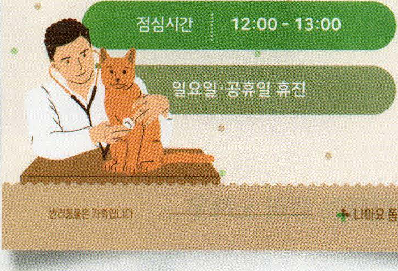

###### •

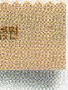

작업 사이즈 |

|

• • •

312 캔바 디 자인 실전

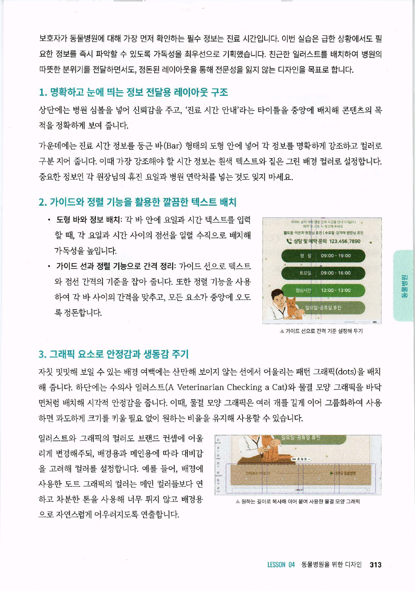

보호자가 동물병원에 대해 가장 먼저 확인하는 필수 정보는 진료 시간입니다. 이번 실습은 급한 상황에서도 필

요한 정보를 즉시 파악할 수 있도록 가독성을 죄우선으로 기획했습니다. 친근한 일러스트를 배지하여 병원의

따뜻한 분위기를 전달하면서도, 정돈된 레이아웃을 통해 전문성을 잃지 않는 디자인을 목표로 합니다.

###### 1. 명확하고 눈에 띄는 정보 레이아웃 구조상단에는 병원 심볼을 넣어 신뢰감을 주고, ‘진료 시간 안내'라는 타이틀을 중앙에 배치해 콘텐츠의 목적을 정확하계 보여 줍니다.

가운데에는 진료 시간 정보를 둥근 바(Bar) 형태의 도형 안에 넣어 각 정보를 명확하게 강조하고 컬러로

구분 지어 줍니다. 이때 가장 강조해야 할 시간 정보는 흰색 텍스트와 짙은 그린 배경 컬러로 설정합니다. 중요한 정보인 각 원장님의 휴진 요일과 병원 연락처를 넣는 것도 잊지 마세요.

###### 2. 가이드와 기능을 텍스트 배치

서t 4료 언내

• 도형 바와 정보 배치: 각 바 안에 요일과 시간 텍스트를 입력

’

할 때, 각 요일과 시간 사이의 점선을 일렬 수직으로 배치해

의 .7 •

가독성을높입니다.

• 가이드 선과 정렬 기능으로 간격 정리: 가이드 선으로 텍스트

Bg

와 점선 간격의 기준을 잡아 줍니다. 또한 정렬 기능을 사용

하여 각 바 사이의 간격을 맞추고, 모든 요소가 중앙에 오도

록정돈합니다.

g -

~ 가이드 선으로 간격 기준 설정해 두기

###### 3. 그래픽 요소로 안정감과 주기

자칫 밋밋해 보일 수 있는 배경 여백에는 산만해 보이지 않는 선에서 어울리는 패턴 그래픽 (dots)을 배치 해 줍니다. 하단에는 수의사 일러스트(A Veterinarian Checking a Cat)와 물결 모양 그래픽을 바닥

면처럼 배치해 시각적 안정감을 줍니다. 이때, 물결 모양 그래픽은 여러 개를 길게 이어 그룹화하여 사용 하면 과도하게 크기를 키울 필요 없이 원하는 비율을 유지해 사용할 수 있습니다.

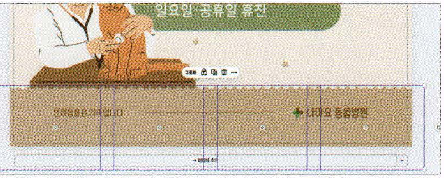

일러스트와 그래픽의 컬러도 브랜드 컨셉에 어울 리게 변경해주되, 배경용과 메인용에 따라 대비감

오

E.o

-

을 고려해 컬러를 설정합니다. 예를 들어, 배경에

.e · n

사용한 도트 그래픽의 컬러는 메인 컬러들보다 연

-

^ 원하는길이로복사해 이어 붙여 사용한물결 모양그래픽

하고 차분한 톤을 사용해 너무 튀지 않고 배경용

으로 자연스럽게 어우러지도록 연출합니다.

###### LESSON 04 동물병원을 위한 디자인 313

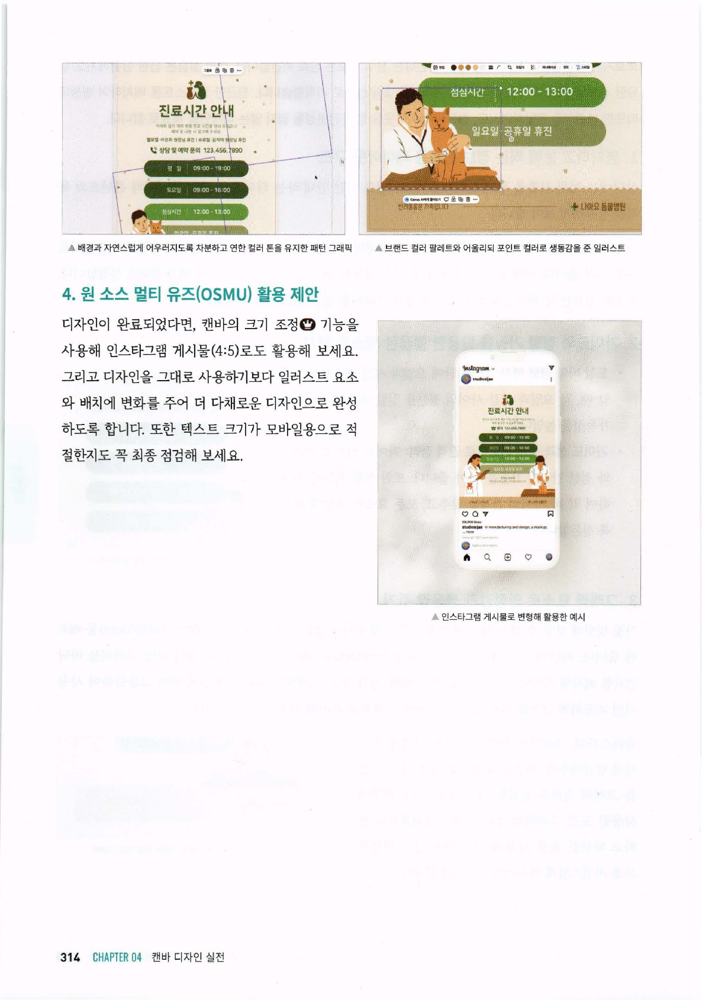

'" r " ..,, 요 `"" .. T떠

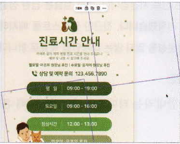

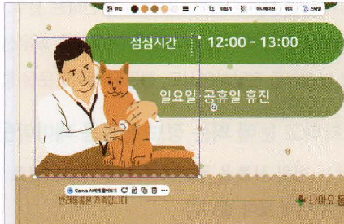

b

###### •

...배경과자연스럽게 어우러지도록자분하고 연한컬러 톤을 유지한패턴 그래픽 ^브랜드 컬러 팔레트와어울리도1 포인트 컬러로 생동감을준 일러스트

- 4. 소스 유즈(OSMU) 제안 디자인이 완료되었다면, 캔바의 크기 조정O 기능을 사용해 인스타그램 게시물(4:5)로도 활용해 보세요. 그리고 디자인을 그대로 사용하기보다 일러스트 요소 와 배치에 변화를 주어 더 다채로운 디자인으로 완성 하도록 합니다. 또한 텍스트 크기가 모바일용으로 적 절한지도 꼭 최종 점검해 보세요.


.,,

노v

###### D

-

•

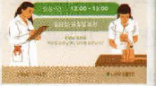

###### .^

0 0 ,, 口

".._

."-''IJ.,••．_＿=上t소같--＇門占며1

Q e 。 •

... 인스타그램 게시울로 변형해 활용한 예시

314 04 캔바 디자인 실전

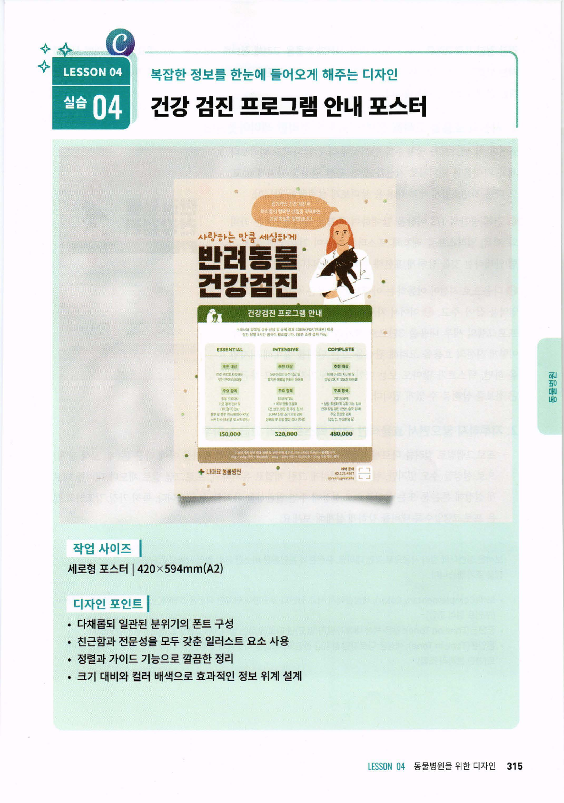

수수

됴 복잡한정보를한눈에들어오게해주는디자인

-

건강 겁진 프로그랩 안내 포스터

• •

###### •

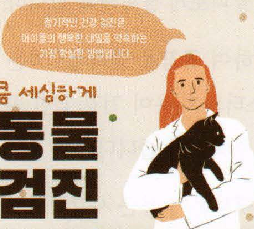

•

o .....oR 서1^＇키FHI

•

###### •

r 건강검진 l

수 김신 e시 it~삼날렬 살*1 ..”皇皇(POf섭위I뻬튼가.,- I •

###### INTENS E

學던대실

"'·-""· `'lt'성.‘"k"'

###### ‘

"'！성5 `

- • | 투요 투요•틀

`Txgw

•••nu»

선모"말

파

g` 면., ,'살

, 320,

- • -


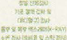

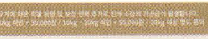

###### • r' _

L. .J

...

###### 작업 사이즈 |

포스터 |4 X

###### 디자인

- • 폰트
- • 일러스트
- • 드 정리
- • 위계


LESSON 04 동물병원을 위한 디자인 315

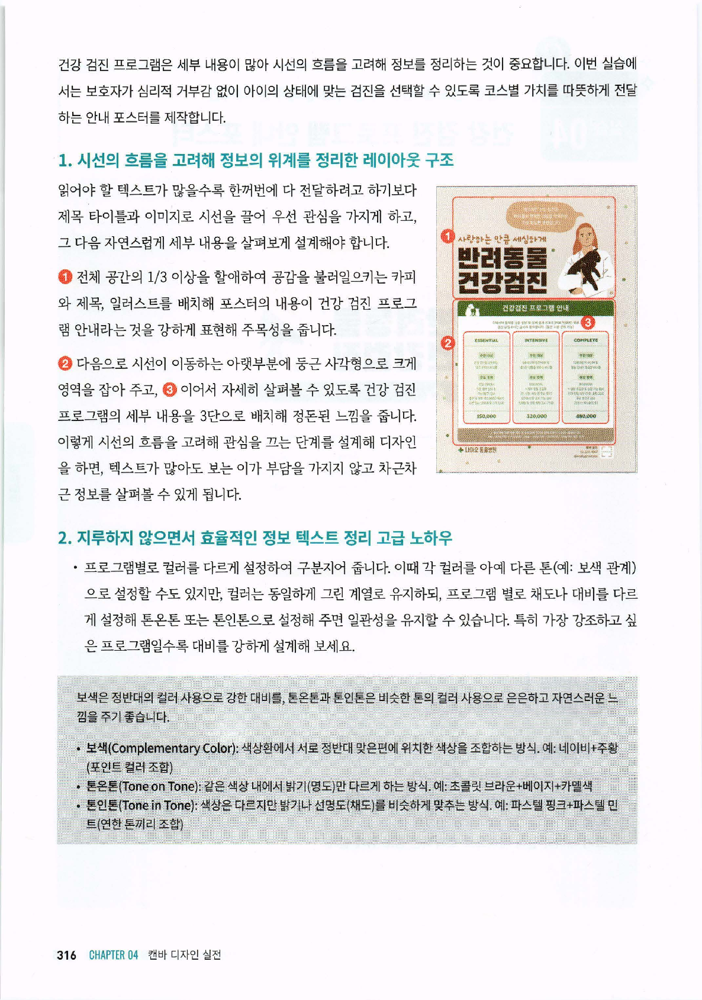

건강 검진 프로그램은 세부 내용이 많아 시선의 흐름을 고려해 정보를 정리하는 것이 중요합니다. 이번 실습에

###### 서는 보호자가 심리적 거부감 없이 아이의 상태에 맞는 검진을 선택할 수 있도록 코스별 가지를 따뜻하게 전달

하는 안내 포스터를 제작합니다.

###### 1. 시선의 흐름을 고려해 정보의 위계를 정리한 레이아웃 구조

읽어야 할 텍스트가 많을수록 한꺼번에 다 전달하려고 하기보다

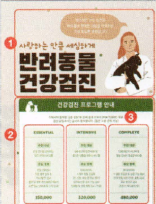

|제목 타이틀과 이미지로 시선을 끌어 우선 관심을 가지게 하고,|제목 타이틀과 이미지로 시선을 끌어 우선 관심을 가지게 하고,|
|---|---|


사마..fL 。

###### .

그 다음 자연스럽게 세부 내용을 살펴보게 설계해야 합니다.

•• : 느

O 전체 공간의 1/3 이상을 할애하여 공감을 불러일으키는 카피

와 제목, 일러스트를 배치해 포스터의 내용이 건강 검진 프로그 램 안내라는것을강하게 표현해 주목성을줍니다.

O 다움으로 시선이 이동하는 아랫부분에 둥근 사각형으로 크게 영역을 잡아 주고, O 이어서 자세히 살펴볼 수 있도록 건강 검진

프로그램의 세부 내용을 3단으로 배치해 정돈된 느낌을 줍니댜

It ,

이렇게 시선의 흐름을 고려해 관심을 끄는 단계를 설계해 디자인

+ i

' ' L J

을 하면, 텍스트가 많아도 보는 이가 부담을 가지지 않고 차근차

근 정보를 살펴볼 수 있게 됩니다.

###### 2. 지루하지 효율적인 정보 텍스트 정리 고급 노하우

• 프로그램별로 컬러를 다르게 설정하여 구분지어 줍니다. 이때 각 컬러를 아예 다른 톤(예: 보색 관계) 으로 설정할 수도 있지만, 컬러는 동일하게 그린 계열로 유지하되, 프로그램 별로 채도나 대비를 다르

게 설정해 톤온톤 또는 톤인톤으로 설정해 주면 일관성을 유지할 수 있습니다. 특히 가장 강조하고 싶

은 프로그램일수록 대비를 강하게 설계해 보세요.


:

• •

CHAPTER 04 캔바디자인 실전

316

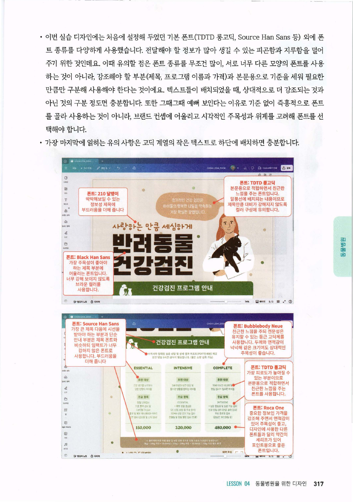

- • 이번 실습 디자인에는 처음에 설정해 두었던 기본 폰트(TDTD 롱고딕, Source Han Sans 등) 외에 폰 트 종류를 다양하게 사용했습니다. 전달해야 할 정보가 많아 생길 수 있는 피곤함과 지루함을 덜어 주기 위한 것인데요. 이때 유의할 점은 폰트 종류를 무조건 많이, 서로 너무 다른 모양의 폰트를 사용 하는 것이 아니라, 강조해야 할 부분(제목, 프로그램 이름과 가격)과 본문용으로 기준을 세워 필요한 만큼만 구분해 사용해야 한다는 것이에요. 텍스트들이 배치되었을 때, 상대적으로 더 강조되는 것과 아닌 것의 구분 정도면 충분합니댜 또한 그때그때 예뻐 보인다는 이유로 기준 없이 즉흥적으로 폰트 를 골라 사용하는 것이 아니라, 브랜드 컨셉에 어울리고 시각적인 주목성과 위계를 고려해 폰트를 선 택해야합니다.
- • 가장 마지막에 읽히는 유의 사항은 고딕 계열의 작은 텍스트로 하단에 배치하면 충분합니다.


###### I:T:: 5 "어 •• 나 m|

et

: TDTD

•

誌

면

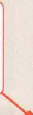

"

폰트:210 달

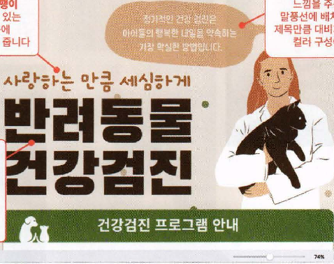

T

三"`‘..

。..

###### •

A卜a -'-L °... ^기lAI:."＇

#### •

4

OfJIO

‘’

e!

卿

"`

UIO

Black Han Sans

###### 칼걸딘

###### •

•

떤__ 111 誌 •• o|

F 7·""로 O.....

t

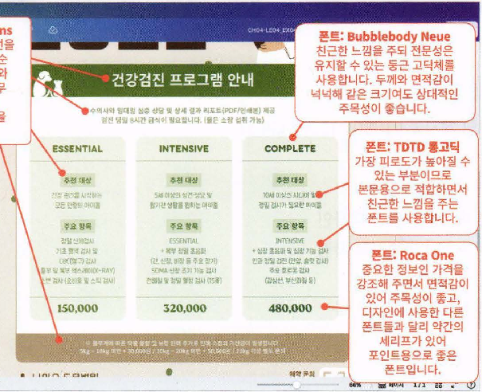

-

urc

###### 수

.

{

: TDTD

- d 2
- e : : 匡


추천대싱

10,.。수 AIU어`

`？1만셀를틀은’'논 0!011

꿉깁"'t 밑요만 Olotl

m •

EN

요 “걸k

• • _1을"`·살상’, aAt

RocaOne

쇼曺격 ‘r

*

C3궁밑겁진 ‘덧 ‘UI

`간.e:,,,;김 릅•길거

~" -...···-

츠.

;·딘므 - RAW

잇hU신2 ’'불 겁"

###### 7

320,000 480,

尸

###### •

I

子曺m포 O"

LESSON 04 동물병원을위한디자인 317

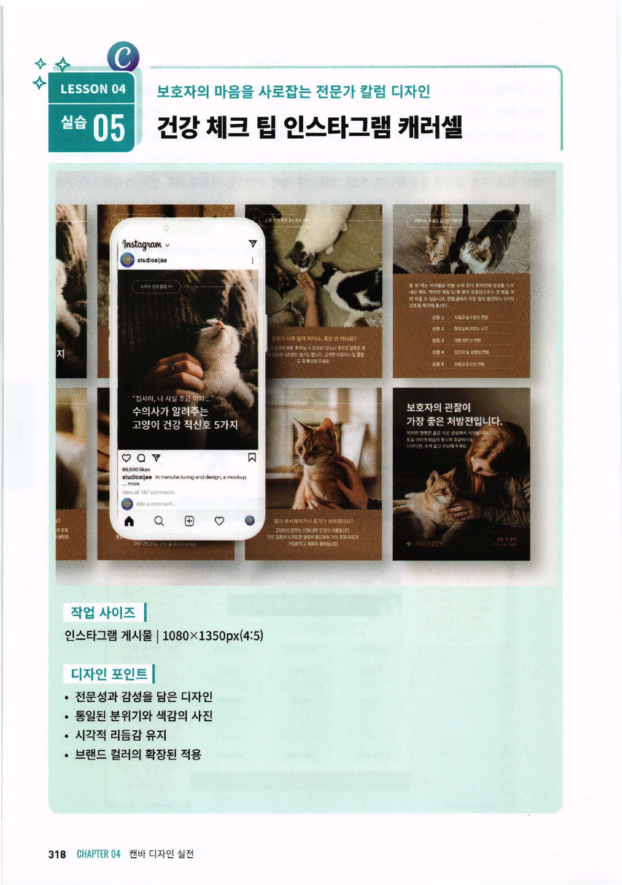

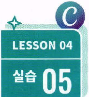

수수

보호자의 사로잡는 디자인

玉

###### 체크 인스타그랩

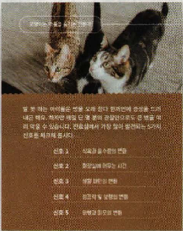

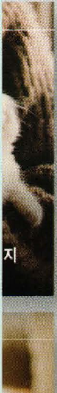

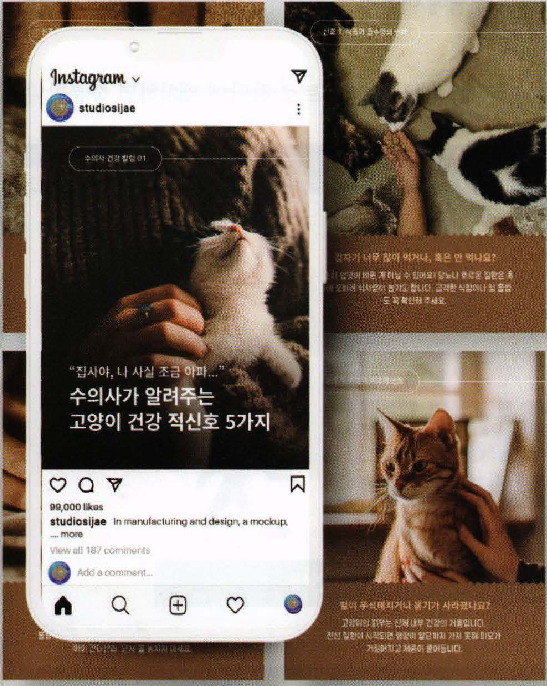

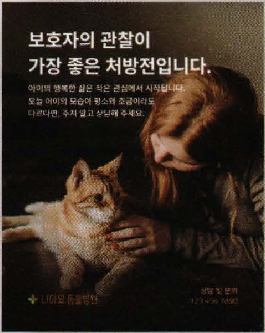

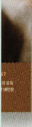

###### 작업 사이즈

인스타그램 게시물 1080x 1350px(4:s)

###### 디자인 포인트|

- • 디자인
- • 색감의 사진


•

•

318 CHAPTER 04 캔바 디자인 실전

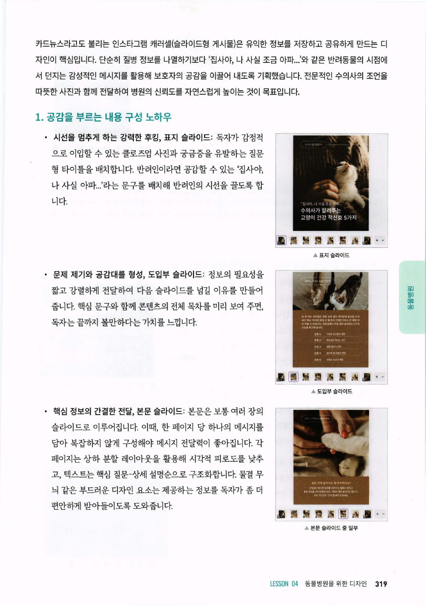

카드뉴스라고도 불리는 인스타그램 캐러셀(슬라이드형 게시물)은 유익한 정보를 저장하고 공유하게 만드는 디 자인이 핵심입니다. 단순히 질병 정보를 나열하기보다 ‘집사야, 나 사실 조금 아파…’와 같은 반려동물의 시점에

서 던지는 감성적인 메시지를 활용해 보호자의 공감을 이끌어 내도록 기획했습니다. 전문적인 수의사의 조언을

따뜻한 사진과 함께 전달하여 병원의 신뢰도를 자연스럽게 높이는 것이 목표입니다.

###### 1. 부르는 내용 구성 노하우

- • 시선을 멈주게 하는 강력한 후킹, 표지 슬라이드: 독자가 감정적 으로 이입할 수 있는 클로즈업 사진과 궁금증을 유발하는 질문 형 타이틀을 배치합니다. 반려인이라면 공감할 수 있는 ‘집사야, 나 사실 아파..’라는 문구를 배치해 반려인의 시선을 끌도록 합 니다.
- • 문제 제기와 공감대를 형성, 도입부 슬라이드: 정보의 필요성을 짧고 강렬하게 전달하여 다음 슬라이드를 넘길 이유를 만들어 줍니다. 핵심 문구와 함께 콘텐츠의 전체 목차를 미리 보여 주면, 독자는 끝까지 볼만하다는 가치를 느낍니다.
- • 핵심 정보의 간결한 전달, 본문 슬라이드: 본문은 보통 여러 장의 슬라이드로 이루어집니다. 이때, 한 페이지 당 하나의 메시지를 담아 복잡하지 않게 구성해야 메시지 전달력이 좋아집니다. 각 폐이지는 상하 분할 레이아웃을 활용해 시각적 피로도를 낮추 고, 텍스트는 핵심 질문-상세 설명순으로 구조화합니다. 물결 무 늬 같은 부드러운 디자인 요소는 제공하는 정보를 독자가 좀 더 편안하게 받아들이도록 도와줍니다.


... 표지 슬라이드

###### 巳릅-

###### B10

###### ............．t

卿

UIO

,’’`.e ,~．널꽤..".S,．'"누'"'

않Q ••한빼 •일1 ia

』4·닐 ."-·*, 론딸-오·노 " ••어

신. , ·8 여 ,.

신., •‘납여어달=.,L

산, , ,. ..., 0,

인.. ,

언 .S

. 面흥터 ”

• + •

... 도입부슬라이드

### •

...

•

+ •

~ 본문 슬라이드 중일부

###### LESSON 04 동물병원을 위한 디자인 319

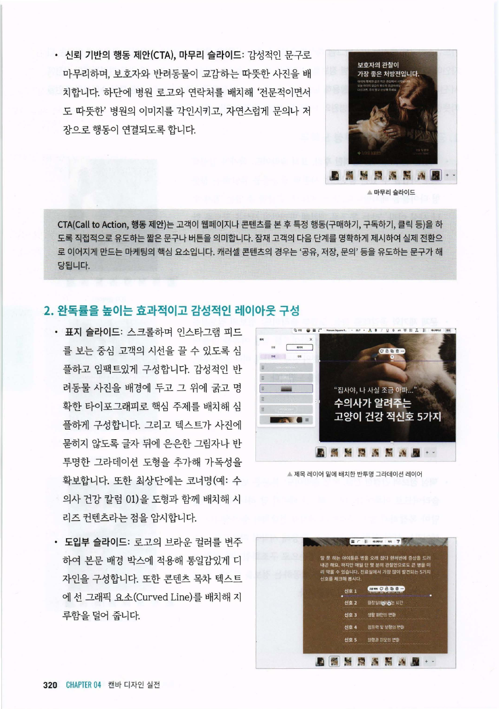

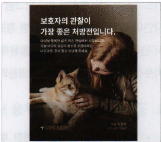

신뢰 기반의 행동 제안(CTA), 마무리 슬라이드: 감성적인 문구로 마무리하며, 보호자와 반려동물이 교감하는 따뜻한 사진을 배 치합니다. 하단에 병원 로고와 연락처를 배치해 ‘전문적이면서

도 따뜻한' 병원의 이미지를 각인시키고, 자연스럽게 문의나 저

장으로 행동이 연결되도록 합니다.

‘

i] + •

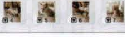

... 마무리슬라이드

CTA{Call to Action, 고객이 본 후 특정 구독하기, 도록 직접적으로 유도하는 다음 단계를 명확하게 제시하여

로 이어지게 핵심 , 문의’ 등을 해

당됩니다.

” —

###### 2. 높이는 효과적이고 레이아웃 구성

###### •r --L -고•A•

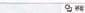

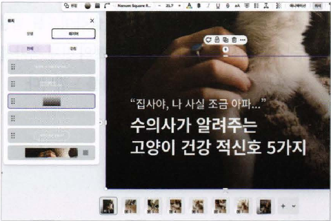

표지 슬라이드: 스크롤하며 인스타그램 피드 를 보는 중심 고객의 시선을 끌 수 있도록 심

x

I - l

플하고 임팩트있게 구성합니댜 감성적인 반

려동물 사진을 배경에 두고 그 위에 굵고 명 확한 타이포그래피로 핵심 주제를 배치해 심 플하게 구성합니다. 그리고 텍스트가 사진에 묻히지 않도록 글자 뒤에 은은한 그림자나 반 투명한 그라데이션 도형을 추가해 가독성을 확보합니다. 또한 최상단에는 코너명(예: 수 의사 건강 칼럼 01)을 도형과 함께 배치해 시

... 제목 레이어 밀에 배지한 반투명 그라데이션 레이어

리즈 컨텐츠라는 점을 암시합니다.

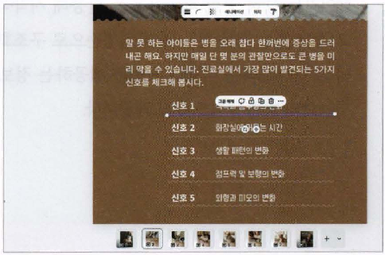

도입부 슬라이드: 로고의 브라운 컬러를 변주 하여 본문 배경 박스에 적용해 통일감있게 디 자인을 구성합니다. 또한 콘텐츠 목차 텍스트

에 선 그래픽 요소(Curved Line)를 배치해 지

루함을덜어 줍니다.

CHAPTER 04 캔바 디자인 실전

320

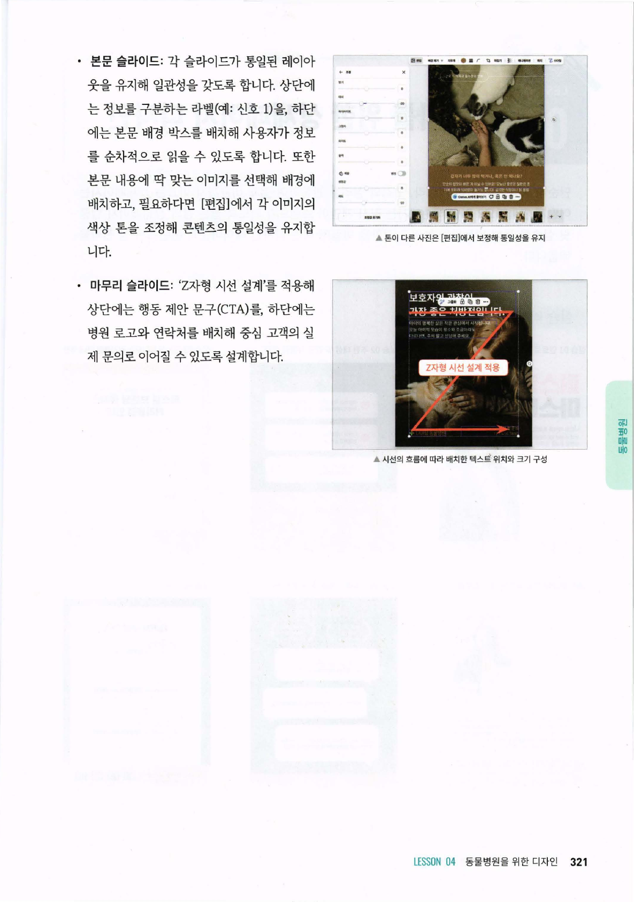

-

- • 본문 슬라이드: 각 슬라이드가 통일된 레이아 웃을 유지해 일관성을 갖도록 합니다. 상단에 는 정보를 구분하는 라벨(예: 신호 1)을, 하단 에는 본문 배경 박스를 배치해 사용자가 정보 를 순차적으로 읽을 수 있도록 합니다. 또한 본문 내용에 딱 맞는 이미지를 선택해 배경에 배치하고, 필요하다면 [편집]에서 각 이미지의 색상 톤을 조정해 콘텐츠의 통일성을 유지합 니다.
- • 마무리 슬라이드: ‘Z자형 시선 설계’를 적용해 상단에는 행동 제안 문구(CTA)를, 하단에는 병원 로고와 연락처를 배치해 중심 고객의 실 제 문의로 이어질 수 있도록 설계합니다.


令"”

###### --

g

.... 톤이 다른 사진은 [편집]에서 보정해 통일성을 유지

###### B10

卿 UlO

~ 시선의 흐름에 따라 배치한 텍스트 위치와 크기 구성

LESSON 04 동물병원을 위한 디자인 321

