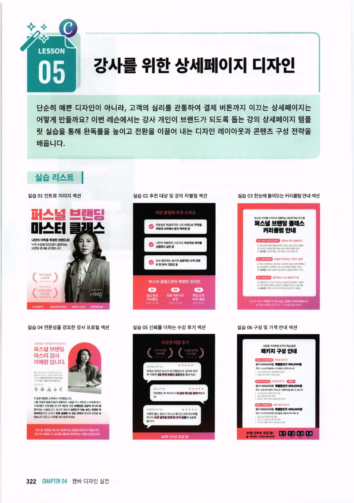

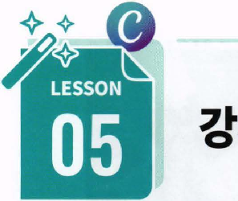

###### 위한 상세페이지

단순히 고객의 이끄는

이번 강사 개인이 상세페이지

실습을 높이고 내는 디자인 구성

###### 실습리스트 |

###### 실습 01 인트로 이미지 섹션

실습 02 주전 대상 잊 강의 자별점 섹션

###### 실습 03 한눈에 들어오는 커리큘럼 안내 섹션

###### 답신열 가치틀 수덕으量 전할齡는여3제 빽신 量드'I

###### E=:다?”엇을 、

------- - - --- -~

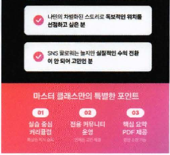

。 屯의 선륄11고실은툰

누적

01•던瓚'1대Ci'"' 단'현사집성었논간.. ，,．법

G2uu혈께'"실리'"＇’,••선

브뺀딩

O3혈꼴． 키"‘e!

O嶋드2'"G讐아널튼•업.,,．《"·•뺀•.,

0 른십.사라‘"E 翼넬빼畢볼무~가야드

” °*． 므 ··건열SS"‘”닥· 가아S

###### -01뺄’露는』9·-여富"석따”冒튼:,...

따갑열... ......．업시,.,.,,

OJlat • 현2일 j ♦....＂""언.｀

실습 05 신뢰를 더하는 수강 후기 섹션

실습 04 전문성율 강조한 강사 프로필 섹션

실습 06 구성 및 가격 안내 색션

c.. ～‘ 'u

###### .

U기 .000인 업가-어쩌

..., 소스••••L 스......서는툴

###### `

###### - '" «=

U,1 ·00.OOO인

"＇던를,,.••가시오1*어고실•

###### 令 ~I&.{

. ..-＇데 •“

· -3 일·열』••.

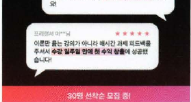

서 또한 시때습니다. 0I혈게 11리 시볼을지나 지단의 노획우.떨고.

• ,,.,,., 0&｀．” 에

`

댜당을 던나어 브론당은 모팔어 아니리 曺

n.기 , ••볼UA....어

님 -**

. 1던가F........""어....

사실입니Q. 보론도가 따는 순간. 阜

다 •• 令 있는 딩신"' 들

갑기아니리떼시긴괴체 I

. ::t 시라· 지"'" .. “세요

~ ,.,

•• ' ..，느 ,,..、"""'

###### | I

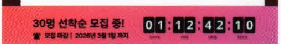

322 CHAPTER 04 캔바 디자인 실전

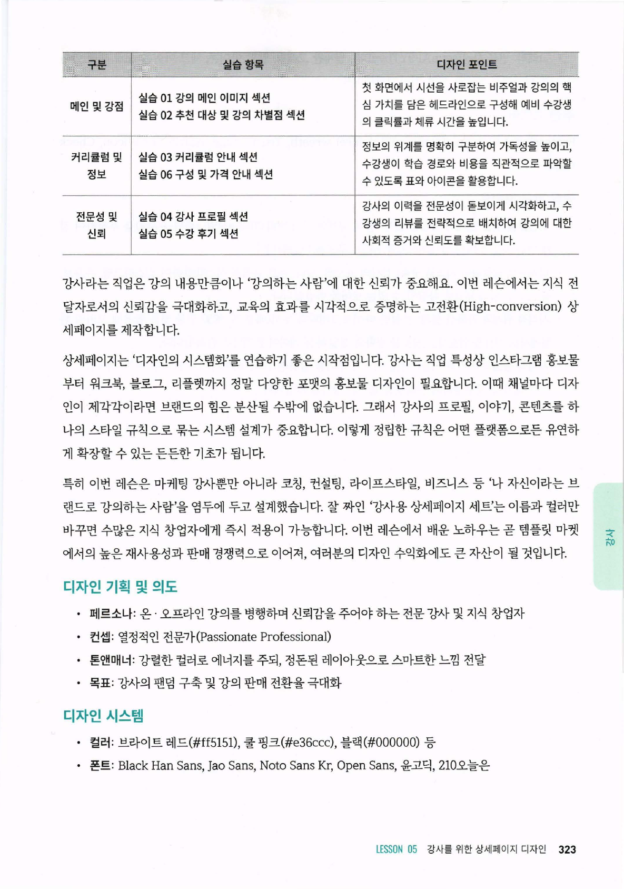

I 구분 실습항목 I

첫 화면에서 시선을 사로잡는 비주얼과 강의의 핵

- 실습 01 강의 메인 이미지 섹션 심 가지를 담은 헤드라인으로 구성해 예비 수강생
- 실습 02 추천 대상 및 강의 자별점 섹션 의 클릭률과제류시간을높입니다.

메인및강점

정보의 위계를 명확히 구분하여 가독성을 높이고, 커리큘럼및 실습 03 커리큘럼 안내 섹션

수강생이 학습 경로와 비용을 직관적으로 파악할 정보 실습 06 구성 및 가격 안내 섹션

수 있도록 표와 아이콘을 활용합니다.

강사의 이력을 전문성이 돋보이게 시각화하고, 수 저 e서 미 실습 04 강사 프로필 섹션

L-:irO * 강생의 리뷰를 전략적으로 배지하여 강의에 대한

신뢰 실습 05 수강후기 섹션

사회적 증거와신뢰도를확보합니다.

강사라는 직업은 강의 내용만큼이나 ‘강의하는 사람’에 대한 신뢰가 중요해요. 이번 레슨에서는 지식 전

달자로서의 신뢰감을 극대화하고, 교육의 효과를 시각적으로 증명하는 고전환(High-conversion) 상 세페이지를제작합니댜

###### 상세페이지는 ‘디자인의 시스템화'를 연습하기 좋은 시작점입니다. 강사는 직업 특성상 인스타그램 홍보물

###### 부터 워크북, 블로그, 리플렛까지 정말 다양한 포맷의 홍보물 디자인이 필요합니다. 이때 채널마다 디자

인이 제각각이라면 브랜드의 힘은 분산될 수밖에 없습니다. 그래서 강사의 프로필, 이야기, 콘텐츠를 하

나의 스타일 규칙으로 묶는 시스템 설계가 중요합니다. 이렇게 정립한 규칙은 어떤 플랫폼으로든 유연하 게 확장할 수 있는 든든한 기초가 됩니다.

###### 특히 이번 레슨은 마케팅 강사뿐만 아니라 코칭, 컨설팅, 라이프스타일, 비즈니스 등 ‘나 자신이라는 브

렌드로 강의하는 사람’을 염두에 두고 설계했습니댜 잘 짜인 ‘강사용 상세페이지 세트’는 이름과 컬러만

###### 바꾸면 수많은 지식 창업자에게 즉시 적용이 가능합니댜 이번 레슨에서 배운 노하우는 곧 템플릿 마켓 才

에서의 높은 재사용성과 판매 경쟁력으로 이어져, 여러분의 디자인 수익화에도 큰 자산이 될 것입니다.

###### 디자인기획 및의도

- • 페르소나: 온 ·오프라인 강의를 병행하며 신뢰감을 주어야 하는 전문 강사 및 지식 창업자
- • 컨셉: 열정적인 전문가(Passionate Professional)
- • 톤앤매너: 강렬한 컬러로 에너지를 주되, 정돈된 레이아웃으로 스마트한 느낌 전달
- • 목표: 강사의 팬덤 구축 및 강의 판매 전환율 극대화

###### 디자인시스템

- • 컬러 : 브라이트 레드(#ff5151)， 쿨 핑크(#e36ccc)， 블랙 (#000000) 등
- • 폰트: Black Han Sans, Jao Sans, Noto Sans Kr, Open Sans, 윤고딕, 210오늘은

LESSON 05 강사를 위한 상세페이지 디자인 323

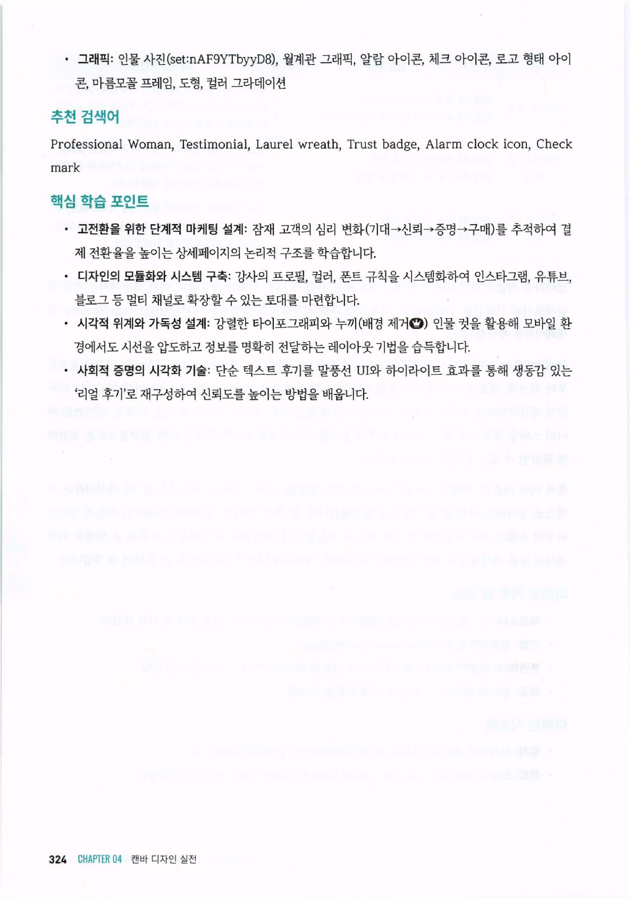

- • 그래픽: 인물 사진(set:nAF9YTbyyD8), 월계관 그래픽, 알람 아이콘, 체크 아이콘, 로고 형태 아이 콘, 마름모꼴 프레임, 도형, 컬러 그라데이션

주천검색어

###### Professional Woman, Testimonial, Laurel wreath, Trust badge, Alarm clock icon, Check mark

- • 고전환을 위한 단계적 마케팅 설계: 잠재 고객의 심리 변화(기대一신뢰?증명一구매)를 추적하여 결 제 전환율을높이는상세페이지의 논리적 구조를학습합니다.
- • 디자인의 모듈화와 시스템 구측: 강사의 프로필, 컬러, 폰트 규칙을 시스템화하여 인스타그램, 유튜브, 블로그등멀티 채널로확장할수있는토대를마련합니다.
- • 시각적 위계와 가독성 설계: 강렬한 타이포그래피와 누끼(배경 제거0) 인물 컷을 활용해 모바일 환 경에서도 시선을 압도하고 정보를 명확히 전달하는 레이아웃 기법을 습득합니다.
- • 사회적 증명의 시각화 기술: 단순 텍스트 후기를 말풍선 UI와 하이라이트 효과를 통해 생동감 있는 ‘리얼 후기’로 재구성하여 신뢰도를 높이는 방법을 배웁니다.

324 CHAPTER 04 캔바 디자인 실전

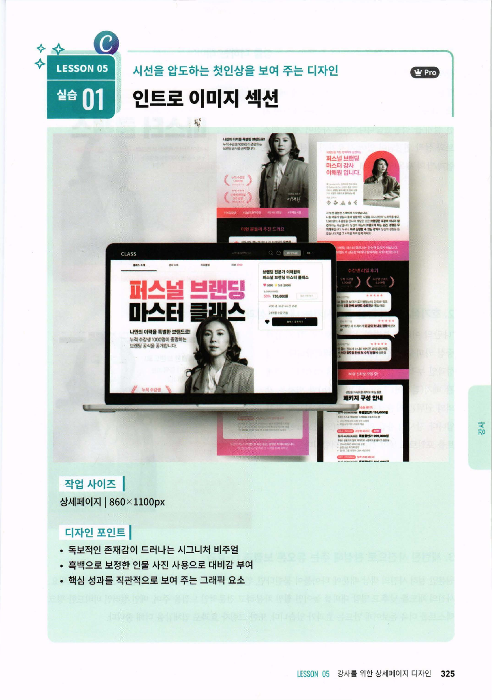

수수

시선을 압도하는 보여 주는 CEO

尸

###### 인트로이미지색션

###### 'S_

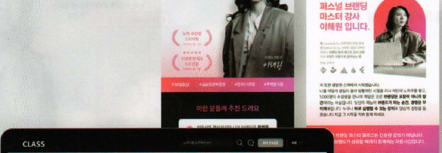

.

을 &^ 龜 <

###### 0야瓚’솔•••" m-·".....

.....,......獻

" `孔 ♦ .

............._`....4

휩••’”을>•...........

"'

·터스널-....스더•뻬스

·--

”섭目

-.......I......

Y1 g~

사이즈 |

|860X

###### 디자인 포인트|

- • 시그니저 비주얼
- • 사진 부여
- • 보여 주는

LESSON 05 강사를 위한 상세페이지 디자인 325

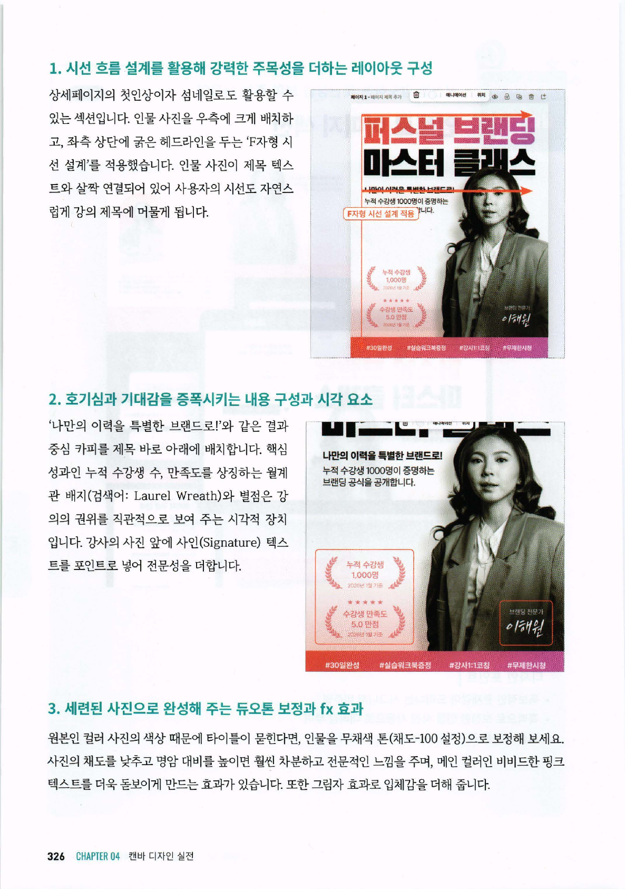

###### 1. 시선 흐름 활용해 강력한 더하는 레이아웃 구성

상세페이지의 첫인상이자 섬네일로도 활용할 수

1101지1·"°'""'1 @ 뻬니印|신 튀외 oa©0 巳

있는섹션입니댜 인물사진을우측에 크게 배치하

퍼스

고, 좌측 상단에 굵은 헤드라인을 두는 ‘F자형 시

선 설계’를 적용했습니다. 인물 사진이 제목 텍스

트와 살짝 연결되어 있어 사용자의 시선도 자연스 럽계 강의 제목에 머물게 됩니다.

(＼雪)

###### 2. 기대감을 증폭시키는 내용 구성과

‘나만의 이력을 특별한 브렌드로!’와 같은 결과 중심 카피를 제목 바로 아래에 배치합니다. 핵심 성과인 누적 수강생 수, 만족도를 상징하는 월계

누적 브랜딩 공식을

관 배지 (검색어 : Laurel Wreath)와 별점은 강

의의 권위를 직관적으로 보여 주는 시각적 장치

`)

입니다. 강사의 사진 앞에 사안(Signature) 텍스

·효"' 먼

강명

^F0

생

트를 포인트로 넣어 전문성을 더합니다.

0

년

벨

F

』

###### 3. 세련된 사진으로 완성해 주는 듀오톤 fx 효과

###### 원본인 컬러 사진의 색상 때문에 타이틀이 묻힌다면, 인물을 무채색 톤(채도-100 설정)으로 보정해 보세요.

사진의 채도를 낮추고 명암 대비를 높이면 훨씬 차분하고 전문적인 느낌을 주며, 메인 컬러인 비비드한 핑크 텍스트를 더욱 돋보이게 만드는 효과가 있습니다. 또한 그림자 효과로 입체감을 더해 줍니다.

326 CHAPTER 04 캔바 디자인 실전

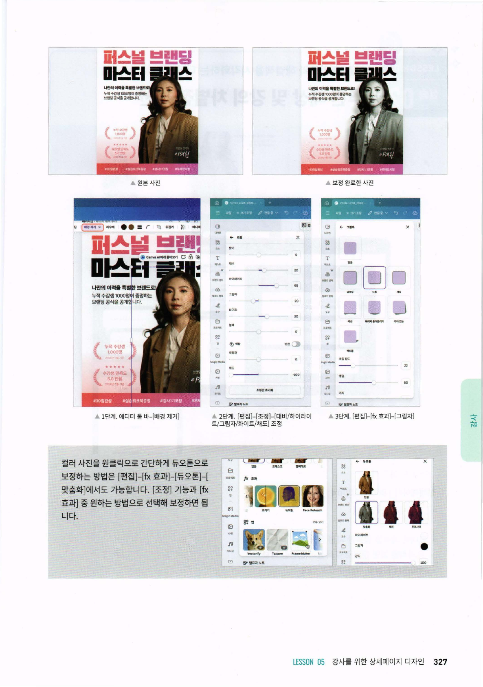

###### i뜹봅

::.~llllle

###### ’\..... ".._

###### (급

L__

.... 보정완료한사진

... 원본사진

###### It;:7.: .... |

멀[ ..,i.,. •• =r ~"깁기 꽃. ~

@ CB .. 그다 X

Gi

q"

X

..

”

"기

。

T

###### 1`T.[ -' 己

` ""'

".. -·

m

###### ...

蟲*

I° "• " m

###### :言；；；£;T

。

`"..

.".. 그를자

-20

4 .,『 1·_j

“ 노-- `

4•, 아..

JO

###### .....

e 王' "IOII~ ' 현할는

e!

.를

"`

....

F'

• tt}~tl

던el

--

셸틀같

Ci

...

22

嶋

... 'i

®

·100

쇠e

###### ...

.,..n ,.. oo

훈•"＇디 —

fl

조a

m 才•m...

• 2단계. ［편집]-［조정]-［대비/하이라이 • 3단계. [편집]-［fx 효과]-[그림자]

1단계. 에디터 틀 바-［배경 제거]

## 一Y./z

트/그림자/화이트/재도] 조정

-.,.--- -- -]- 『 - - + 를오른

.m·

". .빼

X

사진을

”IE"""꾼엽 •요.~......""" "。".[1J‘‘

E!

는 방법은 -［fx - -[

ll.. k m

론 <jff)~ fl 1;~

T

중 원하는

### n 。~ ) e 그릴지

°때 .尸- 기 '.“ 曲磁•- —

또 一 T9lltl" 『 ,. ... ... 걸됴

。 노重 怨 100

LESSON 05 강사를 위한 상세페이지 디자인 327

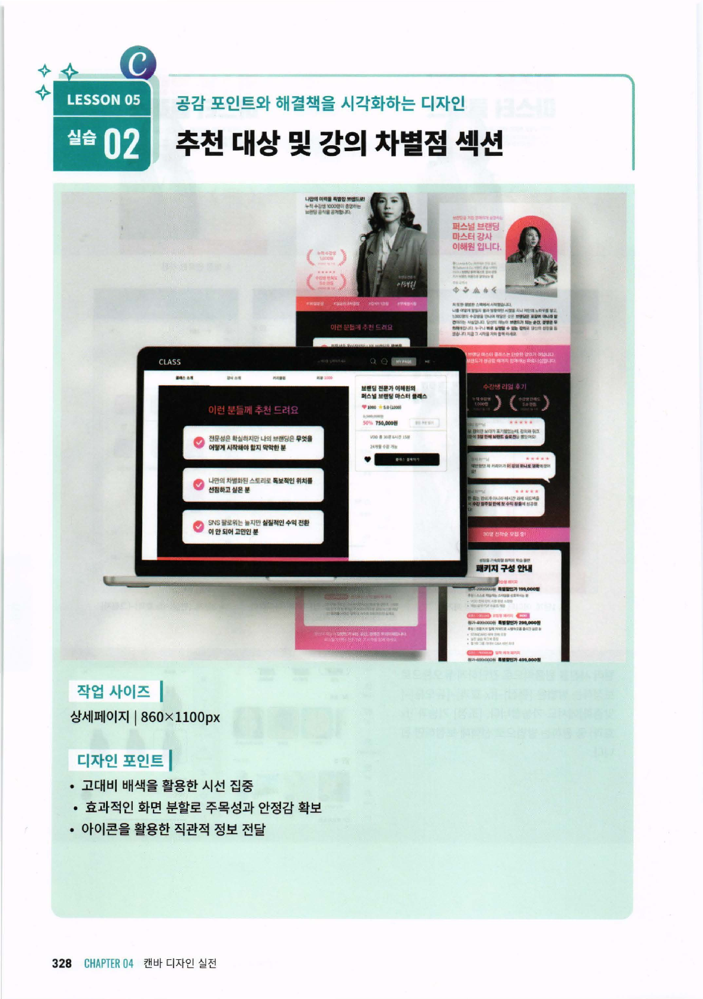

수수

노

一

주천 대상 강의 차별점

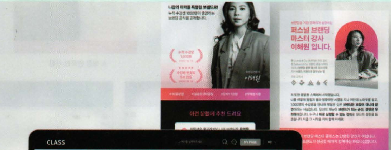

###### ’令•••，내틀.............m .....,.. •••~,·4

•••."'....때••-"’

’ .. .

♦•••... ..

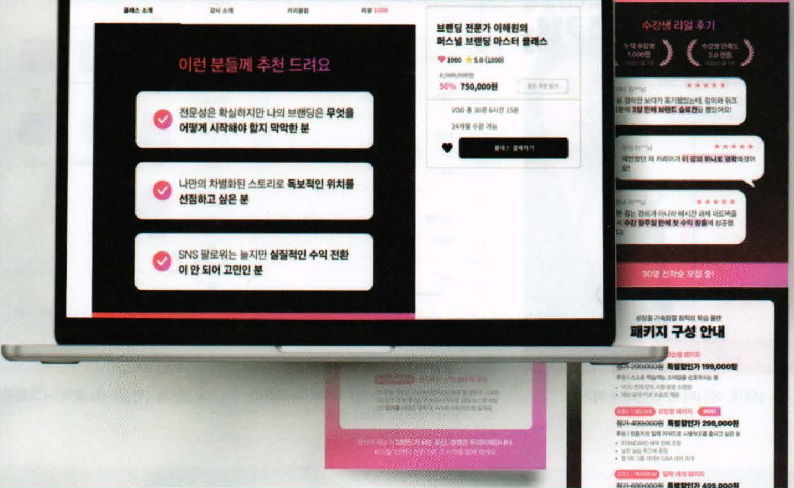

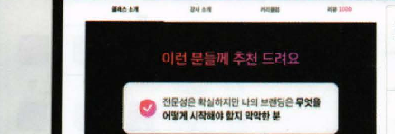

의스널 스터 •

•- ·'u".

o휼때화된색리모톨If.Iii입튀치. ·--

###### '..,".

""....

- · ...어 l

· -·•••머누·

###### 작업 사이즈 l

|86QX1100px

###### 디자인 포인트|

- • 고대비
- • 화면 안정감 확보
- • 정보

328 CHAPTER 04 캔바 디자인 실전

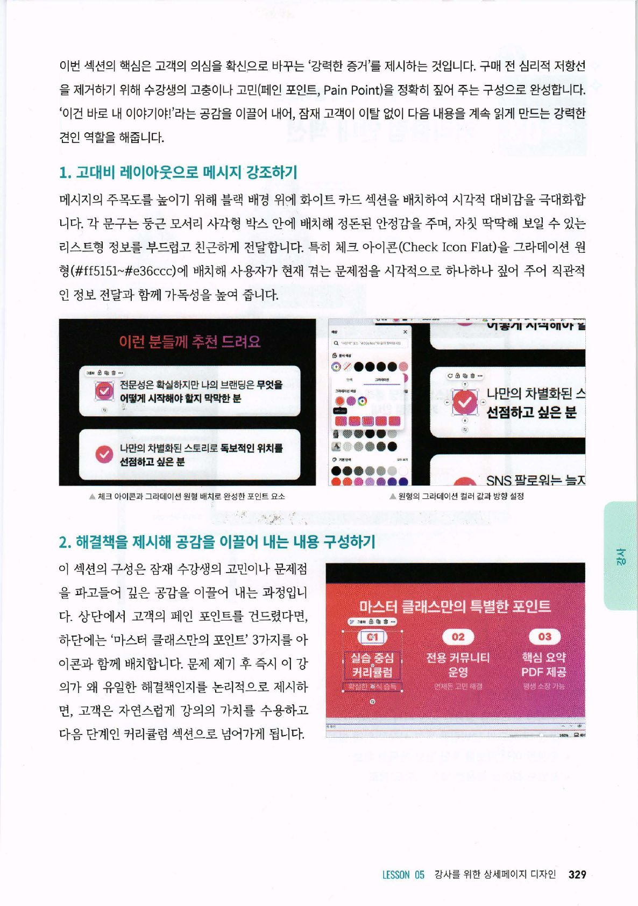

이번 섹션의 핵심은 고객의 의심을 확신으로 바꾸는 ‘강력한 증거’를 제시하는 것입니다. 구매 전 심리적 저항선 을 제거하기 위해 수강생의 고충이나 고민(페인 포인트, Pain Point)을 정확히 짚어 주는 구성으로 완성합니다. ‘이건 바로 내 이야기야!’라는 공감을 이꿀어 내어, 잠재 고객이 이탈 없이 다음 내용을 계속 읽게 만드는 강력한

견인역할을해줍니다.

###### L 고대비 레이아웃으로 매시지

메시지의 주목도를 높이기 위해 블랙 배경 위에 화이트 카드 섹션을 배치하여 시각적 대비감을 극대화합

니다. 각 문구는 둥근 모서리 사각형 박스 안에 배치해 정돈된 안정감을 주며, 자칫 딱딱해 보일 수 있는

리스트형 정보를 부드럽고 친근하게 전달합니다. 특히 체크 아이콘(Check Icon Flat)을 그라데이션 원 형 (#ff5151~#e36ccc)에 배치해 사용자가 현재 겪는 문제점을 시각적으로 하나하나 짚어 주어 직관적

인 정보 전달과 함께 가독성을 높여 줍니다.

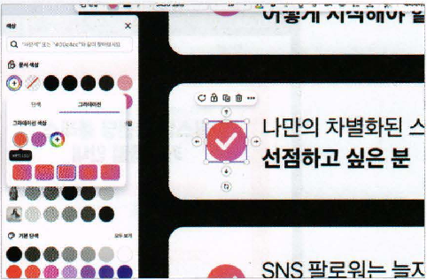

.••.•••

###### [～"겁;：&없다:딩은무엇을

###### F

·•C•

-\'...

###### · 빽나만의 차별화된스

"'”’ID..

득보적인

。,,...

^원형의 그라데이션 컬러 값과 방향설정

~ 제크 아이콘과 그라데이션 원형 배지로 완성한 포인트 요소

,.,'J.

###### 2. 해결책을 재시해 이끌어 내는 내용 구성하기

一y.(2

이 섹션의 구성은 잠재 수강생의 고민이나 문제점

###### 을 파고들어 깊은 공감을 이끌어 내는 과정입니

댜 상단에서 고객의 페인 포인트를 건드렸다면, 하단에는 ‘마스터 클래스만의 포인트’ 3가지를 아 이콘과 함께 배치합니댜 문제 제기 후 즉시 이 강

###### E

!

의가 왜 유일한 해결책인지를 논리적으로 제시하 면, 고객은 자연스럽게 강의의 가치를 수용하고 다음 단계인 커리큘럼 섹션으로 넘어가게 됩니다. ... o

。

###### 05 강사를 위한 상세페이지 디자인 329

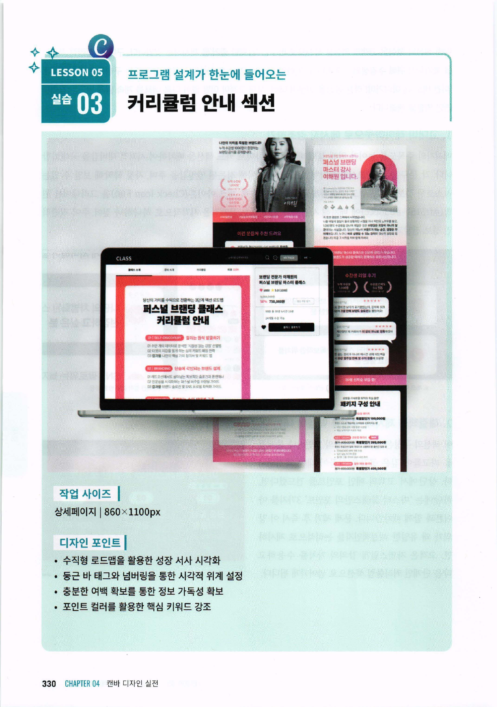

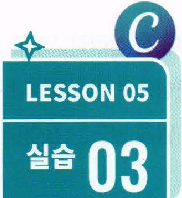

수수

설계가 한눈에 들어오는

코

###### 커리률럽안내색션

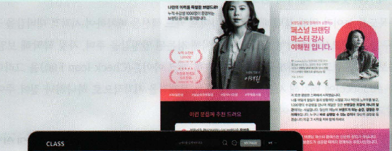

.

###### 지,..,..,. ... _노••,...,, ..._m-...뇨a-·2

“모•• ••om

...

’서"......

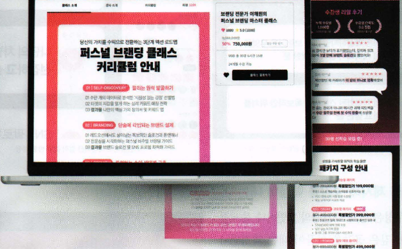

..

빼스널 아스더

.---

. ""' ”u"

.........-·.~,....

,.,. 1...OOOI!

###### ·--· ., -·-·I......

·•

.’'IOO떠 • 이`"m

작업

| X1100px

###### 포인트|

•

- • 바 태그와 위계
- • 여백 확보를 가독성 확보

•

330 CHAPTER 04 캔바 디자인 실전

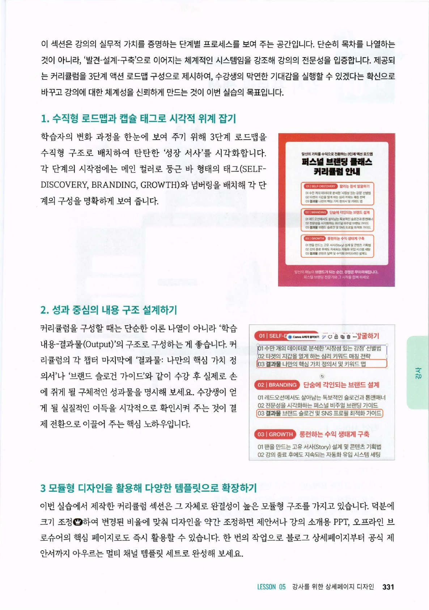

이 섹션은 강의의 실무적 가지를 증명하는 단계별 프로세스를 보여 주는 공간입니다. 단순히 목자를 나열하는

것이 아니라, ‘발견-설계-구축’으로 이어지는 제계적인 시스템임을 강조해 강의의 전문성을 입증합니다. 제공되

는 커리큘럼을 3단계 액션 로드맵 구성으로 제시하여, 수강생의 막연한 기대감을 실행할 수 있겠다는 확신으로 바꾸고 강의에 대한 제계성을 신뢰하게 만드는 것이 이번 실습의 목표입니다.

###### 1. 수직형 시각적 잡기

학습자의 변화 과정을 한눈에 보여 주기 위해 3단계 로드맵을

수직형 구조로 배치하여 탄탄한 ‘성장 서사’를 시각화합니다.

전환하는하3개 "'선

각 단계의 시작점에는 메인 컬러로 둥근 바 형태의 태그(SELF­

DISCOVERY, BRANDING, GROWTH)와 넘버링을 배치해 각 단

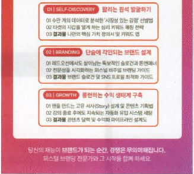

계의 구성을 명확하게 보여 줍니다.

###### 2. 성과 내용 구조

커리큘럼을 구성할 때는 단순한 이론 나열이 아니라 ‘학습

·/ C.Oot.g."

내용결과물(Output)’의 구조로 구성하는 게 좋습니다. 커 리큘럼의 각 챕터 마지막에 멸과물: 나만의 핵심 가치 정

수만 로 '시장성 있는 강점 선별법

- ’’

{Yg

13 나 의 가치 및 맵

의서'나 ‘브랜드 슬로건 가이드’와 같이 수강 후 실제로 손

-

에 쥐게 될 구체적인 성과물을 명시해 보세요. 수강생이 얻

- 01 독보적인 술로건과 톤앤매너
- 02 시각화하는

게 될 실질적인 이득을 시각적으로 확인시켜 주는 것이 결

(03 및 ]

제 전환으로이끌어 주는핵심 노하우입니다.

- 롱런하는수익 생태계 구축

01 만드는 고유 및

종료 후

###### 3

이번 실습에서 제작한 커리큘럼 섹션은 그 자체로 완결성이 높은 모듈형 구조를 가지고 있습니다. 덕분에 크기 조정C'하여 변경된 비율에 맞춰 디자인을 약간 조정하면 제안서나 강의 소개용 PPT, 오프라인 브 로슈어의 핵심 페이지로도 즉시 활용할 수 있습니다. 한 번의 작업으로 블로그 상세페이지부터 공식 제

안서까지 아우르는 멀티 채널 템플릿 세트로 완성해 보세요.

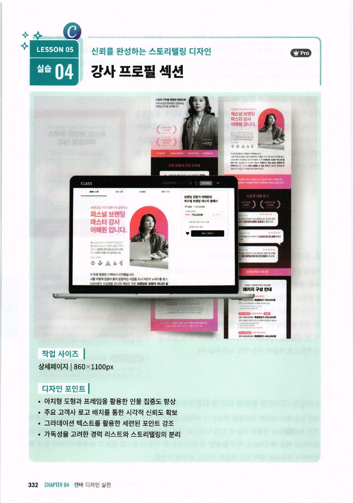

:러 신뢰를완성하는스토리텔링디자인

CEO

一따〕

###### 강사프로필색션

令 ~A•<(

,, ••• ....고

###### 0 · ···

』

♦ 山量 .. .

.... . ”•날•블,

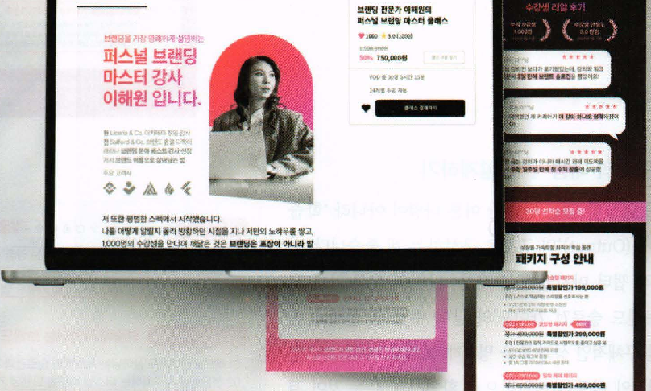

브뺀딜전툰가어빼민외

브먼gg,印S쾌다”‘

. ,"' "'-

·--

w`,.......I

’..,"

,.......

.

###### ·~·~A•~

지 스·대시

톨리 시 지나 지안외 노터우1 딜

' " .

• • - ,, ,"'.

·,,,,••·,_I

- ·...,"--

작업

| X

포인트 |

- • 아치형 프레임을
- • 고객사 시각적 확보

•

- • 경력

332 CHAPTER 04 캔바 디자인 실전

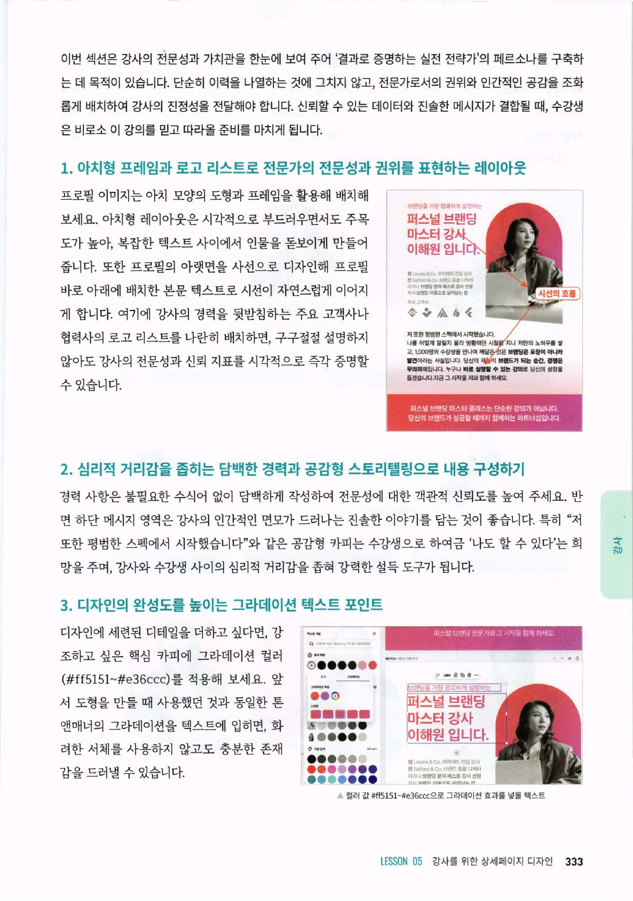

###### 이번 섹션은 강사의 전문성과 가지관을 한눈에 보여 주어 결과로 증명하는 실전 전략가’의 페르소나를 구축하

는 데 목적이 있습니다. 단순히 이력을 나열하는 것에 그지지 않고, 전문가로서의 권위와 인간적인 공감을 조화 롭게 배지하여 강사의 진정성을 전달해야 합니다. 신뢰할 수 있는 데이터와 진솔한 메시지가 결합될 때, 수강생

은 비로소 이 강의를 믿고 따라올 준비를 마지게 됩니다.

###### 1. 아지형 프레임과 로고 리스트로 전문가의 전문성과 표현하는 레이아웃

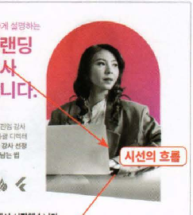

프로필 이미지는 아치 모양의 도형과 프레임을 활용해 배치해

1I'

보세요. 아치형 레이아웃은 시각적으로 부드러우면서도 주목

도가 높아, 복잡한 텍스트 사이에서 인물을 돋보이게 만들어

입니다

줍니다. 또한 프로필의 아랫면을 사선으로 디자인해 프로필

"'"""&Co 아카데며 전일11사

던 O터

타라 ” '

- 바로 아래에 배치한 본문 텍스트로 시선이 자연스럽게 이어지 게 합니다. 여기에 강사의 경력을 뒷받침하는 주요 고객사나 협력사의 로고 리스트를 나란히 배치하면, 구구절절 설명하지 않아도 강사의 전문성과 신뢰 지표를 시각적으로 즉각 증명할 수있습니댜

I |

-------

2. 심리적 담백한 경력과 내용 구성하기

경력 사항은 불필요한 수식어 없이 담백하게 작성하여 전문성에 대한 객관적 신뢰도를 높여 주세요. 반

면 하단 메시지 영역은 강사의 인간적인 면모가 드러나는 진솔한 이야기를 담는 것이 좋습니다. 특히 "저 또한 평범한 스펙에서 시작했습니다"와 같은 공감형 카피는 수강생으로 하여금 ‘나도 할 수 있다’는 희

망을 주며, 강사와 수강생 사이의 심리적 거리감을 좁혀 강력한 설득 도구가 됩니다.

3. 디자인의 높이는 그라데이션 텍스트 포인트

디자인에 세련된 디테일을 더하고 싶다면, 강 조하고 싶은 핵심 카피에 그라데이션 컬러

(#ff5151~#e36ccc) 를 적용해 보세요. 앞

- 서 도형을 만들 때 사용했던 것과 동일한 톤 앤매너의 그라데이션을 텍스트에 입히면, 화 려한 서체를 사용하지 않고도 충분한 존재 감을 드러낼 수 있습니다.

###### . `A

###### 令 .:,I&61

저 .

###### 고1.여의 민백 !!頓은포約101L1라

나틀 어떻게 을리 시절 지니 지먼의 쌓

. 당신의 l ,

무의이해집니다. 누구나 수 있는 강의로 딩신의 싱징을 니다.지궁 그 작을 저와 합께 하세요-

一YE

###### 尸一

.'"'’'"... "'

e••••.. ,,,,.,. •

•• • a

0 터..

/ 그. aIll••~

을 가장 좌하거i 선'

••••••••

떠

###### 사

‘•••••

•••••••••••••••••••

°”..

현 l0ma &Co. 아카데미 전입 갑시

Salfo,d& Co. 브겐드 디"'1 "' ＇니 브텐딩툰야뻬스므갑사신철

'u' "..c nl.0己식1四노번

###### 컬러 값 #ff5151-#e36ccc으로 그라데이션 효과를 넣율 텍스트

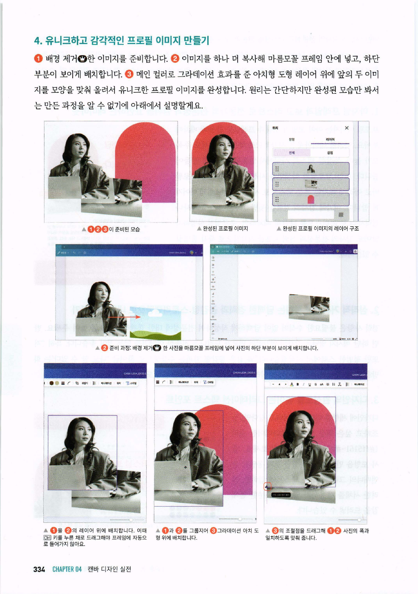

- 4 유니크하고 감각적인 프로필 이미지 만들기 O 배경 제거0~ 이미지를 준비합니다. O 이미지를 하나 더 복사해 마름모꼴 프레임 안에 넣고, 하단 부분이 보이게 배치합니댜 O 메인 컬러로 그라데이션 효과를 준 아치형 도형 레이어 위에 앞의 두 이미

지를 모양을 맞춰 올려서 유니크한 프로필 이미지를 완성합니다. 원리는 간단하지만 완성된 모습만 봐서 는 만든 과정을 알 수 없기에 아래에서 설명할게요.

위치 X

###### 정렬

진꽤 겁힘

###### I::

:: :－

[.. •

... 이준비된 모습 ...완성된 프로필 이미지

... 완성된 프로필 이미지의 레이어 구조

!—

^

O-

###### T-·

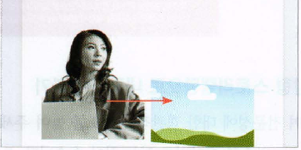

·

。

°F

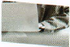

hE

巳

-

- S-·,..

...O 준비 과장 배경 제거 한사진을 마름모꼴프레임에 넣어 사진의 하단부분이 보이게 배지합니다.

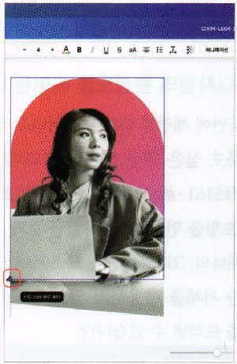

... 을@의 례이어 위에 배지합니다. 이때 ...‘’과e》를그룹지어G》그라데이션 아지도 ...O의 조절점을드래그해OO사진의폭과

固 키를 누른 재로 드래그해야 프레임에 자등으 형 위에 배치합니다. 일지하도록 맞줘 줍니다.

로들어가지 않아요.

###### 334 CHAPTER 04 캔바 디자인 실전

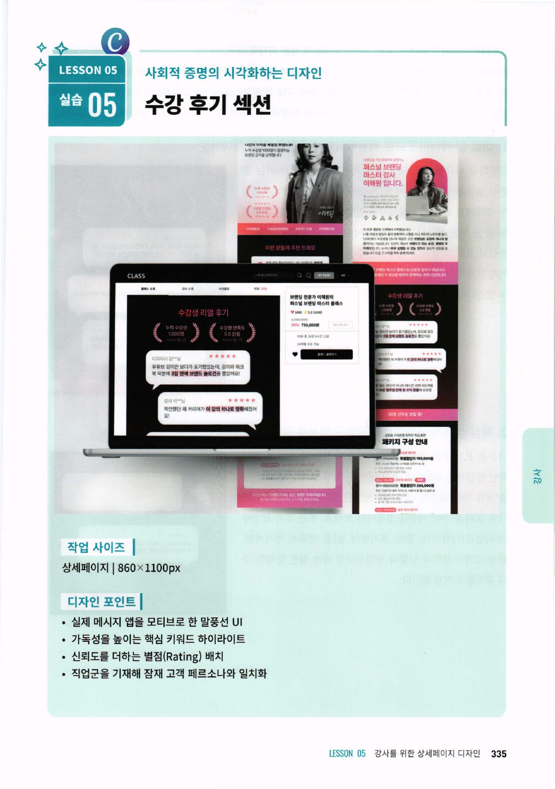

수수

사회적 시각화하는 디자인

一

###### 수강후기색션

엽건 노.,

쩡%

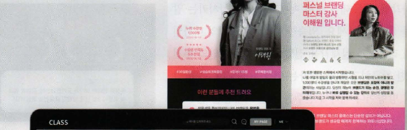

이 .

~~··~

`""一』 - ·나••

續를서 사나-뇨.....

~.••,,•..,.......-."" ."‘

달.._ • 훗기 ••

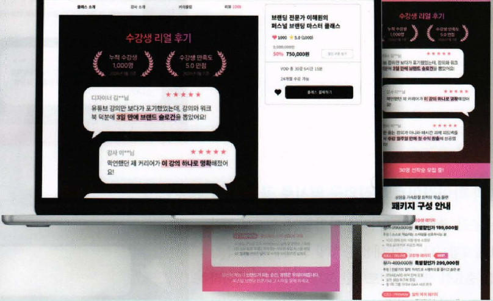

티스널 브뺀딜 미스터 •뻬스

. '" "-

·--

T..'"틀

,.......

.... 를..,,,.

1Yg ~

«Z

-'’’ ....-

###### 작업 사이즈 l

| X1100px

###### 디자인 포인트|

- • 실제 메시지 UI
- • 하이라이트
- • (Rating) 배치

•

LESSON 05 강사를 위한 상세페이지 디자인 335

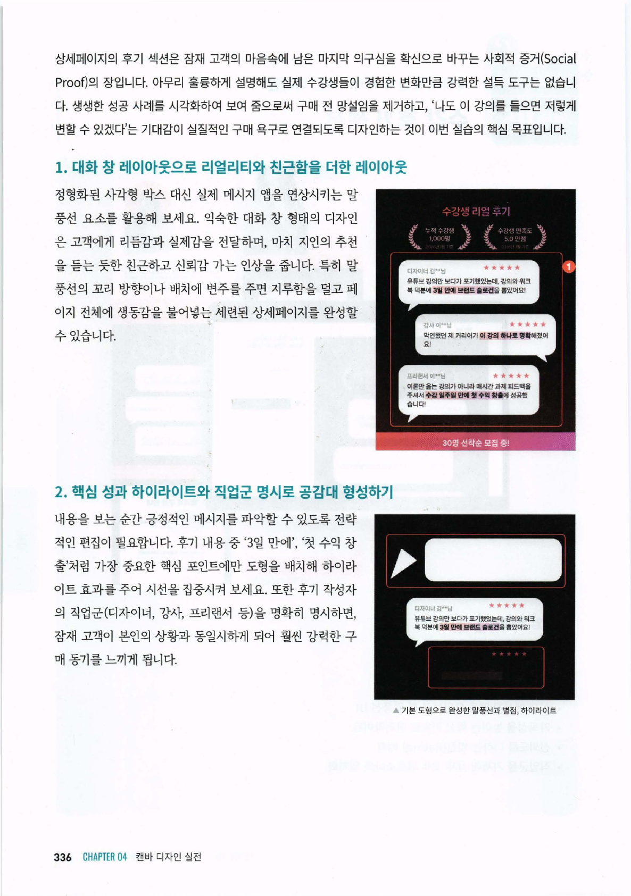

###### 상세페이지의 후기 섹션은 잠재 고객의 마음속에 남은 마지막 의구심을 확신으로 바꾸는 사회적 증거(Social

Proof)의 장입니댜 아무리 훌륭하게 설명해도 실제 수강생들이 경험한 변화만큼 강력한 도구는 없습니 다. 생생한 성공 사례를 시각화하여 보여 줌으로써 구매 전 망설임을 제거하고, ‘나도 이 강의를 들으면 저렇게

변할 수 있겠다’는 기대감이 실질적인 구매 욕구로 연결되도록 디자인하는 것이 이번 실습의 핵심 목표입니다.

- 1. 대화 창 레이아웃으로 리얼리티와 더한 레이아웃 정형화된 사각형 박스 대신 실제 메시지 앱을 연상시키는 말 풍선 요소를 활용해 보세요. 익숙한 대화 창 형태의 디자인 은 고객에게 리듬감과 실제감을 전달하며, 마치 지인의 추천 울 듣는 듯한 친근하고 신뢰감 가는 인상을 줍니다. 특히 말 풍선의 꼬리 방향이나 배치에 변주를 주면 지루함을 덜고 폐 이지 전체에 생동감을 불어넣는 세련된 상세페이지를 완성할 수있습니다.

~

4’

D

&>>>

J

J》》》)』』

n

』

』- 4J`~

)'>>

J

‘,

`‘

T) 》)』

5J

'

디자이너깁"*님 *****

유尋브 보다가 워크

톡 덕본에 율 !

" !

강사이••님 ** * * *

막연했던 재 커리어가 이

요!

프리년Al01•·'a * * * * *

이른안 읊는 아니라 과제

주셔서 횟 참.에

` .

- 2. 핵심

내용을 보는 순간 긍정적인 메시지를 파악할 수 있도록 전략 적인 편집이 필요합니댜 후기 내용 중 ‘3일 만에', ‘첫 수익 창

###### 출'처럼 가장 중요한 핵심 포인트에만 도형을 배치해 하이라

이트 효과를 주어 시선을 집중시켜 보세요. 또한 후기 작성자

의 직업군(디자이너, 강사, 프리랜서 등)을 명확히 명시하면,

잠재 고객이 본인의 상황과 동일시하게 되어 훨씬 강력한 구

매동기를느끼게됩니댜

~ 기븐 도형으로 완성한 말풍선과 하이라이트

336 CHAPTER 04 캔바 디자인 실전

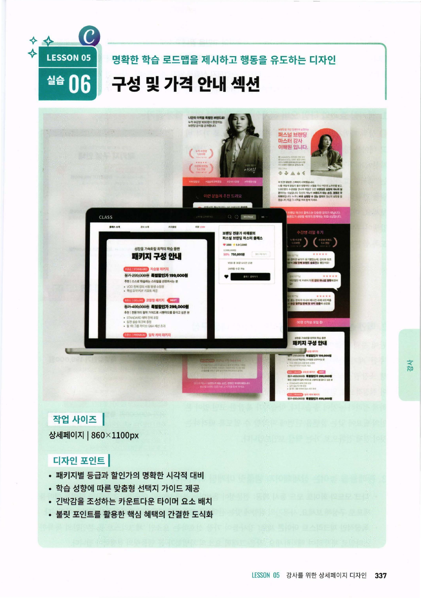

:러

학습 로드맵을 제시하고 행동을 유도하는 디자인

-

###### 구성및가격안내색션

.

$. &^·<

••".” "'••.,

마... .......＿三····고 -· .. 嵐....量.a......

...., ••

튤지. 3 훑

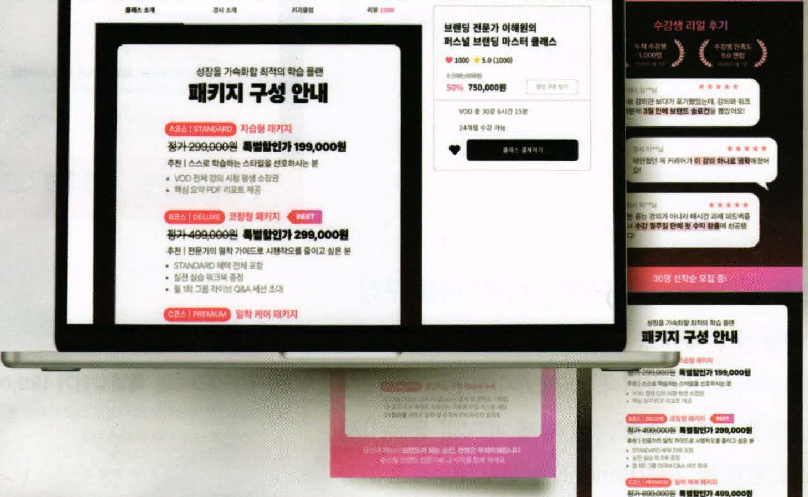

·빼스널-..,_ •뻬스

7,.,

·-

실1 " ‘뺀

- . ". 111.000II

빼'"＇구성인내

.......,01M

"看•

.촐...스..._스"‘""1!

· “오~

U’’ － ＇

‘00.000인 ... 000II

'..

”’

一Yg

..,".._.~'........

.• ...훗•.. .__

사이즈 |

| X1100px

###### 디자인 포인트|

- • 시각적
- • 학습
- • 요소 배지
- • 도식화

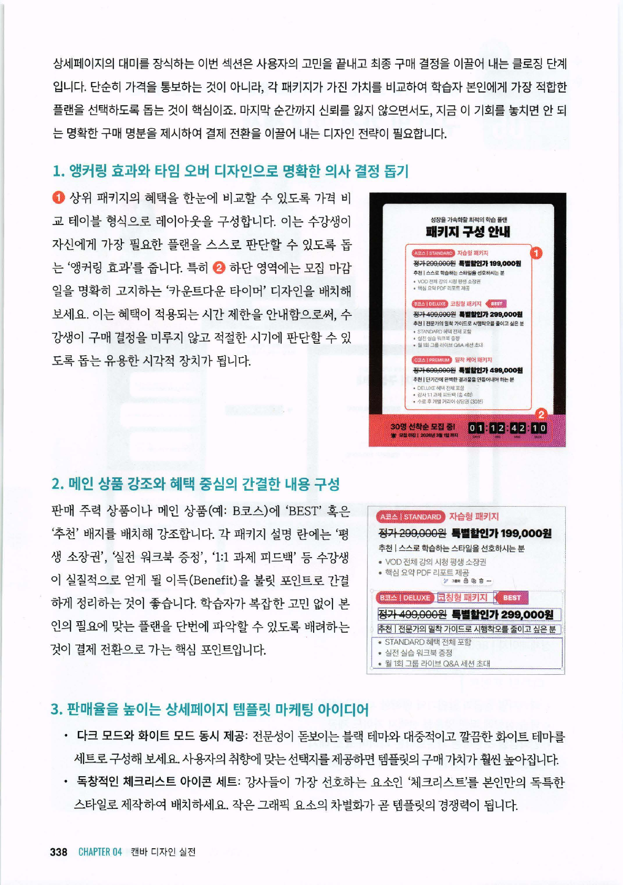

상세페이지의 대미를 장식하는 이번 섹션은 사용자의 고민을 끝내고 죄종 구매 결정을 이끌어 내는 클로징 단계

입니댜 단순히 가격을 통보하는 것이 아니라, 각 패키지가 가진 가지를 비교하여 학습자 본인에게 가장 적합한

플랜을 선택하도록 돕는 것이 핵심이죠. 마지막 순간까지 신뢰를 잃지 않으면서도, 지금 이 기회를 놓지면 안 되 는 명확한 구매 명분을 제시하여 결제 전환을 이끌어 내는 디자인 전략이 필요합니다.

- 1. 앵커링 효과와 타임 오버 디자인으로 명확한 의사 돕기 O 상위 패키지의 혜택을 한눈에 비교할 수 있도록 가격 비

교 테이블 형식으로 레이아웃을 구성합니다. 이는 수강생이 자신에게 가장 필요한 플랜을 스스로 판단할 수 있도록 돕

는 앵커링 효과’를 줍니다. 특히 O 하단 영역에는 모집 마감

일을 명확히 고지하는 ‘카운트다운 타이머' 디자인을 배치해

보세요. 이는 혜택이 적용되는 시간 제한을 안내함으로써, 수

강생이 구매 결정을 미루지 않고 적절한 시기에 판단할 수 있

도록 돕는 유용한 시각적 장치가 됩니다.

- 2. 중심의 내용 구성 판매 주력 상품이나 메인 상품(예: B코스)에 ‘BEST' 혹은 ‘추천' 배지를 배치해 강조합니댜 각 패키지 설명 란에는 ‘평 생 소장권', ‘실전 워크북 증정’, ‘1:1 과제 피드백' 등 수강생 이 실질적으로 얻게 될 이득(Benefit)을 불릿 포인트로 간결 하계 정리하는 것이 좋습니다. 학습자가 복잡한 고민 없이 본 인의 필요에 맞는 플랜을 단번에 파악할 수 있도록 배려하는 것이 결제 전환으로가는핵심 포인트입니다.
- 3. 높이는 상세페이지 템플릿 마케팅 아이디어

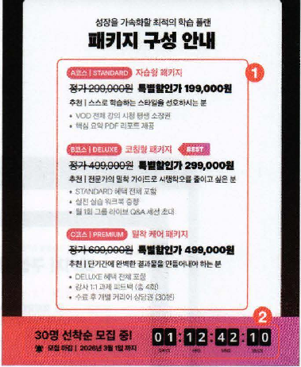

싱장을 적의 학습 플랜

빼키지구성안내

泊급형때커지

000인 199,000II

후 1스스로 스타일을신호하시는툰

• VOO선체강의시청밍생스장권 저심 요익POF리모트 재공

G 코칭형패키지 «Z3'

. ••

추천 l 입착가이드로 폴이고싶은 툰

- • STANOARO 혜택 전세 포힐
- • 실전실白워크畵줄징
- • 월頂그.라이브 0&A세션츠대

u ?| 600.000인

추천 1단기간에 완벽한 하는른

- • DELUXE대진세포할
- • 김사 11 괴세피드백(훌 4회)
- • 수료후 커리어 상당권 (301!1

-200,000원

추천 | 스스로 학습하는 스타일을 선호하시는 분

- • VOD 전체 강의 시청 소장권
- • 핵심 요악PDF 리포트/ ,.. a o o ···

###### 님

###### , I

츄천 | 착 가이드로 분 1

- • STANDARD혜택 전체
- • 실전실습워크북증정
- • 월 1회그룹라이브 Q&A 세션 초대

다크 모드와 화이트 모드 동시 제공: 전문성이 돋보이는 블랙 테마와 대중적이고 깔끔한 화이트 테마를

###### 세트로구성해 보세요. 사용자의 취향에 맞는 선택지를 제공하면 템플릿의 구매 가치가 훨씬 높아집니다.

독창적인 체크리스트 아이콘 세트: 강사들이 가장 선호하는 요소인 ‘체크리스트’를 본인만의 독특한 스타일로 제작하여 배치하세요. 작은 그래픽 요소의 차별화가 곧 템플릿의 경쟁력이 됩니다.

338 CHAPTER 04 캔바디자인 실전

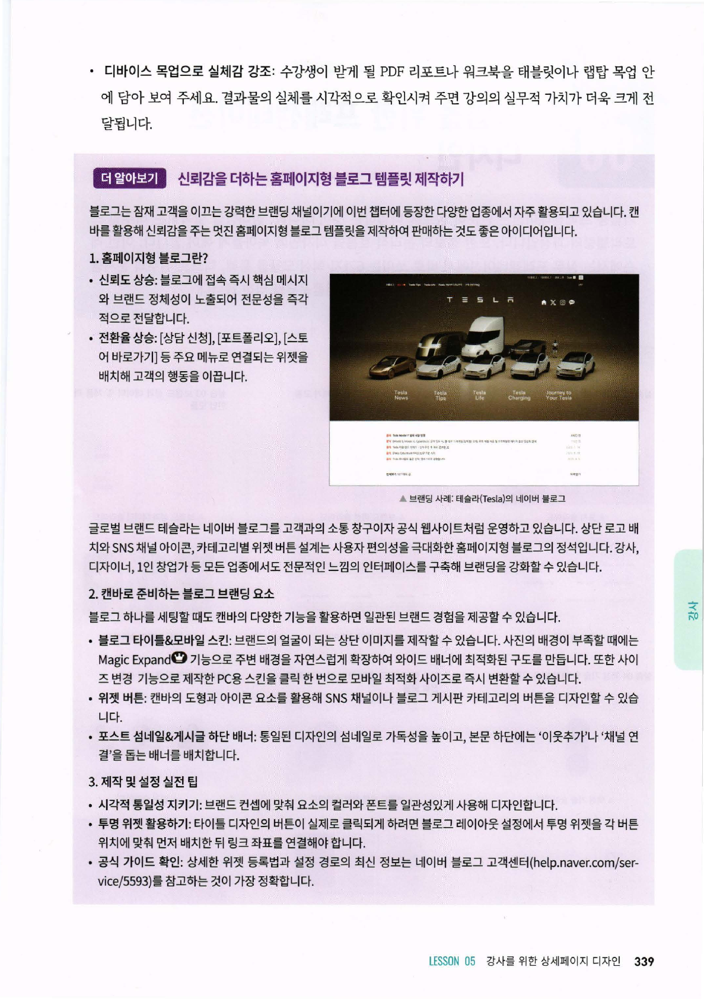

• 디바이스 목업으로 실체감 강조: 수강생이 받게 될 PDF 리포트나 워크북을 태블릿이나 랩탑 목업 안

###### 에 담아 보여 주세요. 결과물의 실체를 시각적으로 확인시켜 주면 강의의 실무적 가치가 더욱 크게 전

달됩니다.

###### 신뢰감을 더하는홀패이지형 블로그 템플릿 재작하기

블로그는 잠재 고객을 강력한 채널이기에 이번 챕터에 업종에서 자주 캔 H壇 활용해 주는 것도 좋은

###### 1.

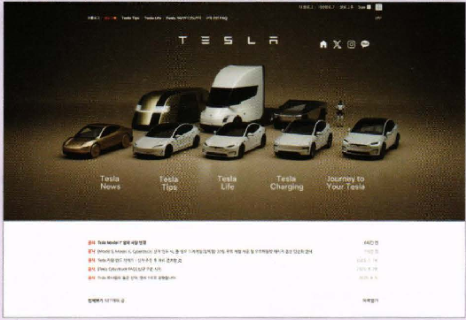

- • 상승: 접속 즉시 핵심 메시지 와 정제성이 노출되어 즉각
- • 상승: 신청], ［스토 어 바로가기] 등 주요 메뉴로 연결되는 위젯을 배지해 고객의 이꿉니다.

.빼臼".,_'＇-""＇．`_...."••••,.-·"'•••e.m•`""..."`,......."'........

^브랜딩 사례: 테슬라(Tesla)의 네이버 불로그

네이버 블로그를 고객과의 소통 장구이자 공식 웹사이트처럼 운영하고 있습니다. 상단 로고 배

지와 SNS

디자이너, 등 모든 느낌의 구축해 브랜딩을 수 있습니다.

###### 2. 요소하나를 세팅할 때도 기능을 브랜드 수 있습니다.

一Yg

- • 스킨: 얼굴이 되는 이미지를 제작할 수 있습니다. 사진의 배경이 때에는 Magic ExpandO 기능으로 주변 배경을 자연스럽게 확장하여 와이드 배너에 죄적화된 구도를 만듭니댜 또한 사이

PC용 스킨율 한 모바일 즉시 수 있습니다.

- • 버튼: 도형과 아이콘 SNS 채널이나 카테고리의 디자인 수 니댜
- • 포스트 하단 배너: 높이고, 본문 하단에는 ‘ '나 ‘재 연 결'을 돕는 배너 배지합니다.

###### 3.

- • 시각적 : 브랜드 컨셉에 요소의 컬러와 를 사용해 디자인합니다.
- • 투명 위젯 활용하기: 타이틀 디자인의 버튼이 실제로 클릭되게 하려면 블로그 레이아웃 설정에서 투명 위젯을 각 버튼 맞줘 먼저 배지한뒤 니다.
- • 공식 가이드 확인: 상세한 위젯 등록법과 설정 정보는 네이버 블로그 고객센터{help.naver.com/service/5593)를 잠고하는 것이 가장 정확합니다.

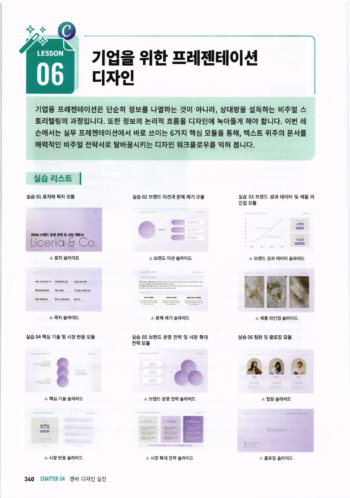

###### 기업을 위한 프래젠테이션

###### 디자인

아니라, 스

녹 레 슨에서는 바로 6가지 , 텍스트 문서를

전략서로 익혀

###### |

실습 01 표지와 목차 모듈 실습 02 브랜드 미션과 문 제기 모듈

실습 03 브랜드 성과 데이터 및 제품 라 인업모듈

- -+35X
- -+32X

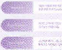

/

· 및

###### 「|a o.

###### ^브랜드성과데이터슬라이드

###### ... 표지슬라이드

.... 브랜드미션 슬라이드

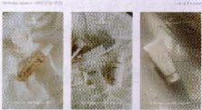

.".....때 .......,,. -~..

••••• U••E••• 니 "~`.·-~-·

.．뻬鬱-~---.........,_

.::::-.:::.:::.::.:뇨.＿~－－……e"

.. 玲..... ..••• ..

###### •"-.. ,......." ""

###### : 三 =루=； ::-국꾹끈;

... 목자 슐라이드

.... 제풍라인업슬라이드

~ 문제제기 슬라이드

###### 실습 05 브랜드 운영 전략 잊 시장 확대 전략모듈

###### 실습 06 팀원 및 클로징 모듈

실습 04 핵심 기술및시장반응모듈

... 핵심기술슬라이드

... 브랜드 운영 전략 슐라이드

###### ~ 팀원 슬라이드

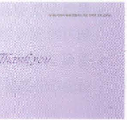

g

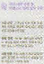

... 시장반웅술라이드 ... 시장 확대 전략 술라이드 ~ 클로징 슬라이드

###### 340 CHAPTER 04 캔바 디자인 실전

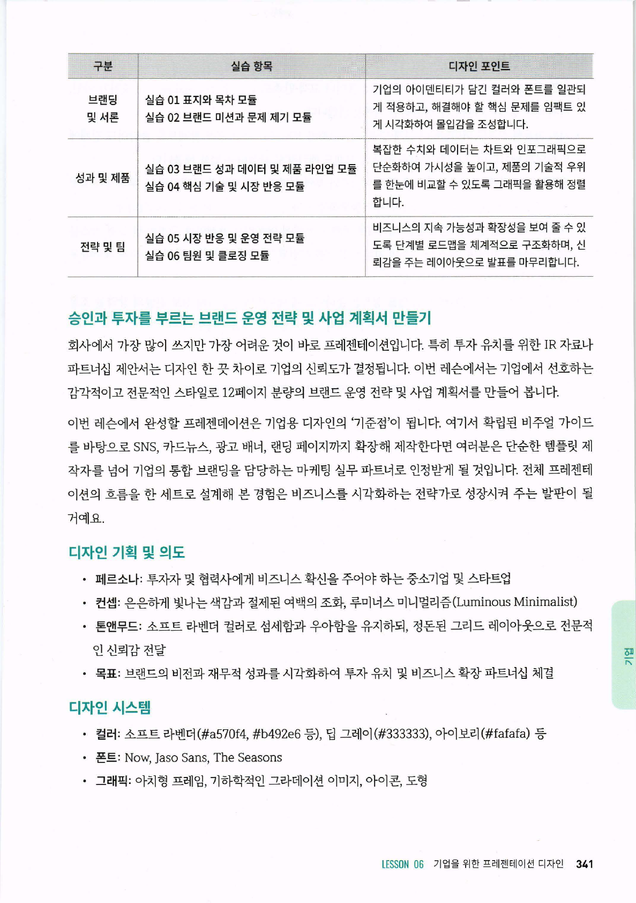

|I| |I|
|---|---|---|
|브랜딩  및서론|실습 01 표지와 목자 모듈 실습 02 브랜드 미션과 문제 제기 모듈 |기업의 아이덴티티가 담긴 컬러와 폰트를 일관되  게 적용하고, 해결해야 할 핵십 문제를 임팩트 있  게 시각화하여 몰입감을 조성합니다.|
|성과및제품|실습 03 브랜드 성과 데이터 및 제품 라인업 모듈 실습 04 핵심 기술 및 시장 반응 모듈 |복잡한 수지와 데이터는 차트와 인포그래픽으로  단순화하여 가시성을 높이고, 제품의 기술적 우위  한눈에 비교할 수 있도록 그래픽을 활용해 정렬  합니다.|
|전략및팀|실습 05 시장반응 및 운영 전략모듈 실습 06 팀원 및 클로징 모듈 |비즈니스의 지속 가능성과 확장성을 보여 즐 수 있  도록 단계별 로드맵을 체계적으로 구조화하며, 신  뢰감을 주는 레이아웃으로 발표를 마무리합니다.|

I

###### 승인과 투자를 부르는 및 사업 계획서 만들기

회사에서 가장 많이 쓰지만 가장 어려운 것이 바로 프레젠테이션입니다. 특히 투자 유치를 위한 IR 자료나 파트너십 제안서는 디자인 한 끗 차이로 기업의 신뢰도가 결정됩니다. 이번 레슨에서는 기업에서 선호하는 감각적이고 전문적인 스타일로 12페이지 분량의 브랜드 운영 전략 및 사업 계획서를 만들어 봅니다.

이번 레슨에서 완성할 프레젠데이션은 기업용 디자인의 ‘기준점'이 됩니다. 여기서 확립된 비주얼 가이드

를 바탕으로 SNS, 카드뉴스, 광고 배너, 랜딩 페이지까지 확장해 제작한다면 여러분은 단순한 템플릿 제

작자를 넘어 기업의 통합 브랜딩을 담당하는 마케팅 실무 파트너로 인정받게 될 것입니다. 전체 프레젠테 이션의 흐름을 한 세트로 설계해 본 경험은 비즈니스를 시각화하는 전략가로 성장시켜 주는 발판이 될

거예요.

###### 디자인기획및의도

- • 페르소나: 투자자 및 협력사예계 비즈니스 확신을 주어야 하는 중소기업 및 스타트업
- • 컨셉: 은은하게 빛나는 색감과 절제된 여백의 조화, 루미너스 미니멀리즘(Luminous Minimalist)
- • 톤앤무드: 소프트 라벤더 컬러로 섬세함과 우아함을 유지하되, 정돈된 그리드 레이아웃으로 전문적 인신뢰감전달 영
- • 목표: 브랜드의 비전과 재무적 성과를 시각화하여 투자 유치 및 비즈니스 확장 파트너십 체결

###### 디자인시스템

- • 컬러: 소프트 라벤더 (#a570f4, #b492e6 등)， 딥 그레이 (#333333)， 아이보리 (#fafafa) 등
- • 폰트: Now, Jaso Sans, The Seasons
- • 그래픽: 아치형 프레임, 거하학적인 그라데이션 이미지, 아이콘, 도형

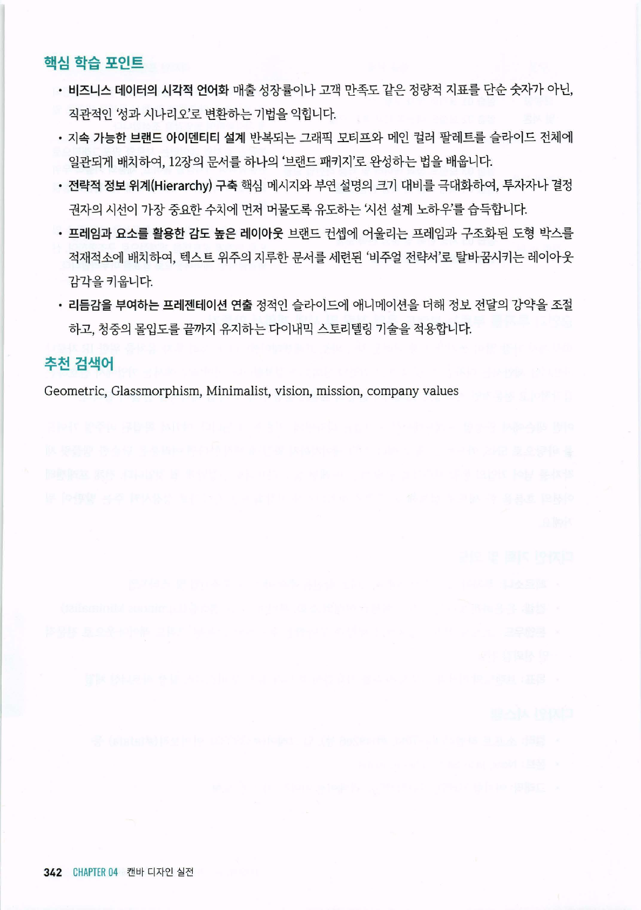

###### 핵심학습포인트

- • 비즈니스 데이터의 시각적 언어화 매출 성장률이나 고객 만족도 같은 정량적 지표를 단순 숫자가 아닌, 직관적인 ‘성과 시나리오’로 변환하는 기법을 익힙니다.
- • 지속 가능한 브랜드 아이덴티티 설계 반복되는 그래픽 모티프와 메인 컬러 팔레트를 슬라이드 전체에 일관되게 배치하여, 12장의 문서를 하나의 ‘브랜드 패키지’로 완성하는 법을 배웁니다.
- • 전략적 정보 위계(Hierarchy) 구축 핵심 메시지와 부연 설명의 크기 대비를 극대화하여, 투자자나 결정 권자의 시선이 가장 중요한 수치에 먼저 머물도록 유도하는 ‘시선 설계 노하우’를 습득합니다.
- • 프레임과 요소를 활용한 감도 높은 레이아웃 브랜드 컨셉에 어울리는 프레임과 구조화된 도형 박스를 적재적소에 배치하여, 텍스트 위주의 지루한 문서를 세련된 ‘비주얼 전략서’로 탈바꿈시키는 레이아웃 감각을키웁니다.
- • 리듬감을 부여하는 프레젠테이션 연줄 정적인 슬라이드에 애니메이션을 더해 정보 전달의 강약을 조절 하고, 청중의 몰입도를 끝까지 유지하는 다이내믹 스토리텔링 기술을 적용합니다.

주천검색어

###### Geometric, Glassmorphism, Minimalist, vision, mission, company values

342 CHAPTER 04 캔바 디자인 실전

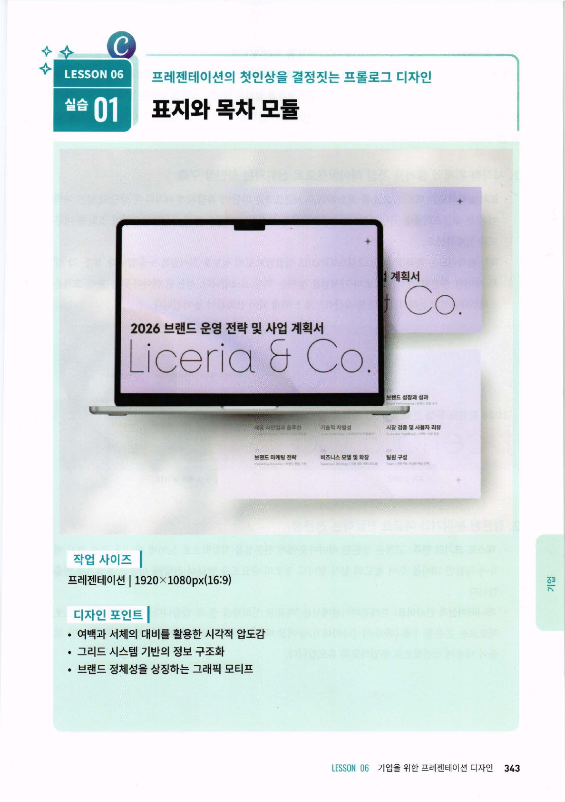

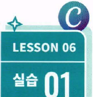

수수

프롤로그 디자인

一

표지와특차모톨

令

Co.

계획서

Lice「ia 8 Co.

전락 및 구성

작업 사이즈 |

쿈

| X

c

###### 포인트 |

- • 서체의 대비롤 시각적
- • 그리 기반의 구조화

•

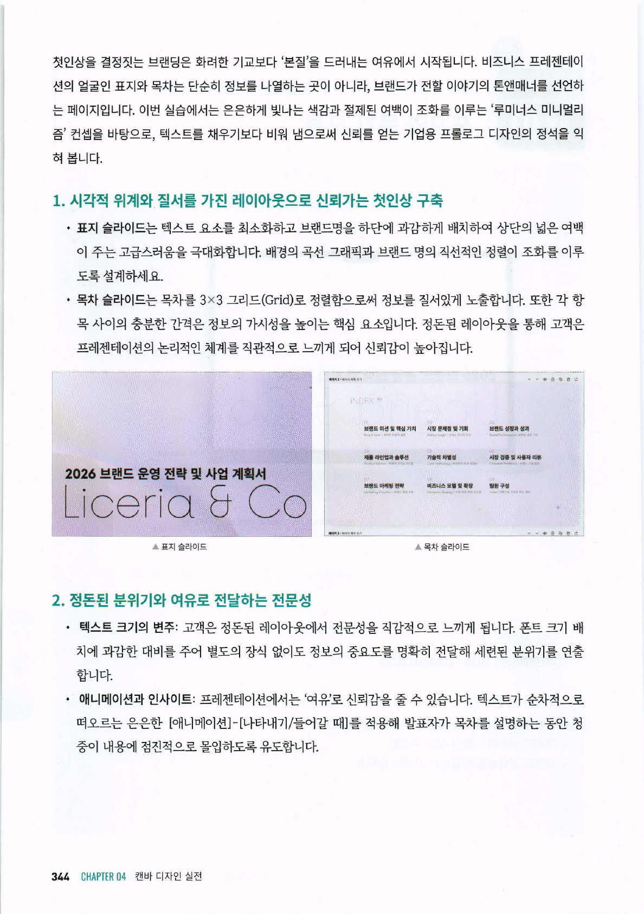

첫인상을 결정짓는 브랜딩은 화려한 기교보다 ‘본질’을 드러내는 여유에서 시작됩니다. 비즈니스 프레젠테이 션의 얼굴인 표지와 목자는 단순히 정보를 나열하는 곳이 아니라, 브랜드가 전할 이야기의 톤앤매너를 선언하

는 페이지입니다. 이번 실습에서는 은은하게 빚나는 색감과 절제된 여백이 조화를 이루는 ‘루미너스 미니멀리

즘’ 컨셉을 바탕으로, 텍스트를 채우기보다 비워 냄으로써 신뢰를 얻는 기업용 프롤로그 디자인의 정석을 익

혀봅니다.

###### 1. 시각적 위계와 가진 신뢰가는 구축

- • 표지 슬라이드는 텍스트 요소를 최소화하고 브랜드명을 하단에 과감하게 배치하여 상단의 넓은 여백 이 주는 고급스러움을 극대화합니다. 배경의 곡선 그래픽과 브랜드 명의 직선적인 정렬이 조화를 이루 도록설계하세요.
- • 목자 슬라이드는 목차를 3X3 그리드(Grid)로 정렬함으로써 정보를 질서있게 노출합니다. 또한 각 항 목 사이의 충분한 간격은 정보의 가시성을 높이는 핵심 요소입니다. 정돈된 레이아웃을 통해 고객은 프레젠테이션의 논리적인 체계를 직관적으로 느끼게 되어 신뢰감이 높아집니다.

•”이,．솔 0 ·· •~-·"

Dl신 밀 "실 71치

2026

Lice

" • _•_ii_.____.__,,_

-_.

... 표지술라이드 ... 목자슬라이드

###### 2. 분위기와 여유로 전달하는

텍스트 크기의 변주: 고객은 정돈된 레이아웃에서 전문성을 직감적으로 느끼게 됩니다. 폰트 크기 배

###### 치에 과감한 대비를 주어 별도의 장식 없이도 정보의 중요도를 명확히 전달해 세련된 분위기를 연출

합니다. 애니메이션과 인사이트: 프레젠테이션에서는 ‘여유’로 신뢰감을 줄 수 있습니다. 텍스트가 순차적으로

떠오르는 은은한 [애니메이션] - ［나타내기/들어갈 때]를 적용해 발표자가 목차를 설명하는 동안 청

중이 내용에 점진적으로몰입하도록유도합니다.

CHAPTER 04 캔바디자인 실전

344

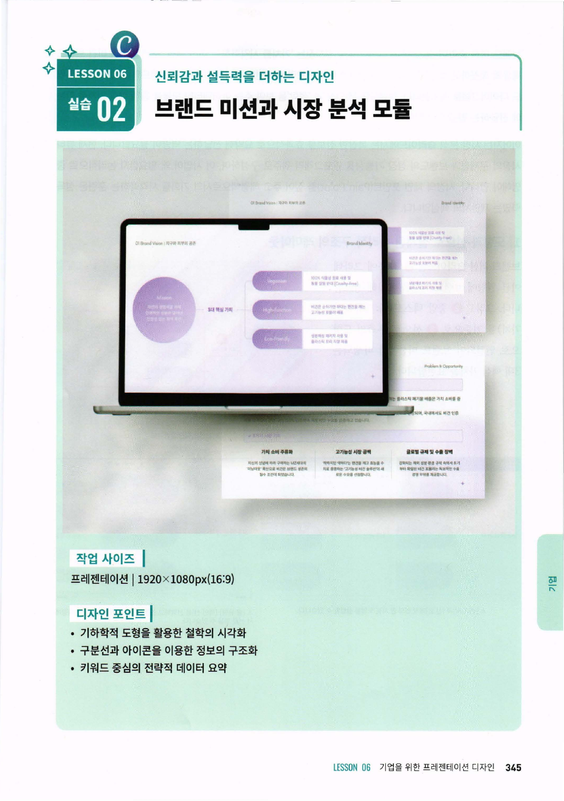

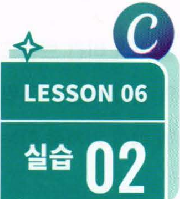

수수

신뢰감과 설득력을 더하는 디자인

:m」

###### 브렌드 미션과 시장 분석 모톨

를V`" ”..... •

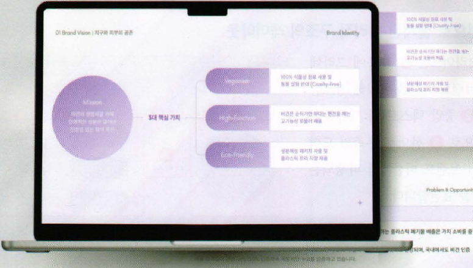

###### '．빼`

###### ........ 어庄u』I

'멀버. •1건 인.

클

”" 단 ,,t M2*"' 서員티'"' ....을 겁 ’I

획"' . ·`‘‘e` 치•••• 고기 빼e··d.... ．어...단바8••서E ••

" 틀R....니리 틀s+Q.H.....q •• ".專a1냐

작업 사이즈 |

쯔(

| X

###### 디자인포인트|

- • 기하학적 철학의 시각화
- • 구분선과
- • 키워드 전략적 요약

LESSON 06 기업을 위한 프레젠테이션 디자인 345

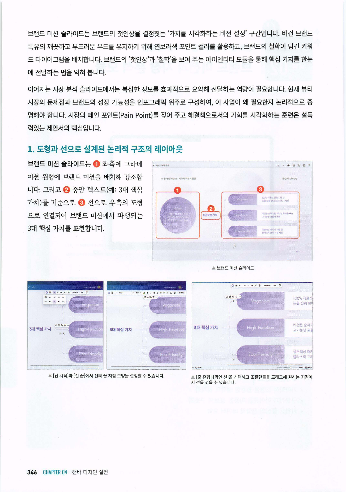

브랜드 미션 슬라이드는 브랜드의 첫인상을 결정짓는 ‘가지를 시각화하는 비전 설정’ 구간입니다. 비건 브랜드

특유의 깨끗하고 부드러운 무드를 유지하기 위해 연보라색 포인트 컬러를 활용하고, 브랜드의 절학이 담긴 키워 드 다이어그램을 배지합니다. 브랜드의 ‘첫인상’과 ‘절학’을 보여 주는 아이덴티티 모듈을 통해 핵심 가지를 한눈

에 전달하는 법을 익혀 봅니댜

이어지는 시장 분석 슬라이드에서는 복잡한 정보를 효과적으로 요약해 전달하는 역량이 필요합니다. 현재 뷰티

시장의 문제점과 브랜드의 성장 가능성을 인포그래픽 위주로 구성하여, 이 사업이 왜 필요한지 논리적으로 증

명해야 합니다. 시장의 페인 포인트(Pain Point)를 짚어 주고 해결책으로서의 기회를 시각화하는 훈련은 설득

력있는 제안서의 핵심입니다.

###### 1. 도형과 선으로 논리적 구조의 레이아웃

브랜드 미션 슬라이드는O 좌측에 그라데 ,.•n"" ^ v .. a 떨 o e

이션 원형에 브랜드 미션을 배치해 강조합

0111,더,dv.a,1저구역•1무어따 &onl·...-...,

니다. 그리고O 중앙 텍스트(예: 3대 핵심 가치)를 기준으로 O 선으로 우측의 도형

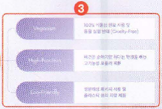

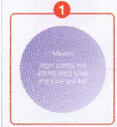

###### 훈

으로 연결되어 브랜드 미션에서 파생되는 3대 핵심 가치를 표현합니다.

—

###### ... 브랜드미션슬라이드

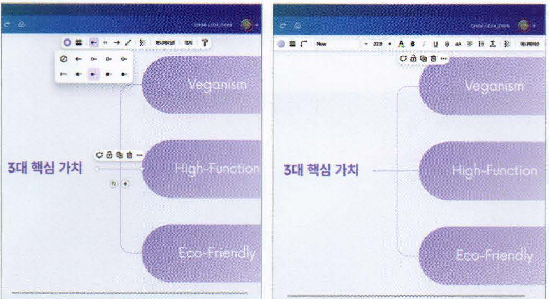

O 쥴 r ~ 一，， t ．~"＇,.

100% 식물성 등을실함반

비건은순하’

고기능싱 포目

생분해성패키

풀라스탁프리

###### ·-

0-

... ［선 시작)과 [선 끝]에서 선의 끝 지점 모양을 설정할 수 있습니다.

~ [줄 유형]-［꺽인 선]을 선택하고 조절핸들을 드래그해 원하는 지점에

서 선을 꺾을 수 있습니 다.

346 캔바디자인 실전

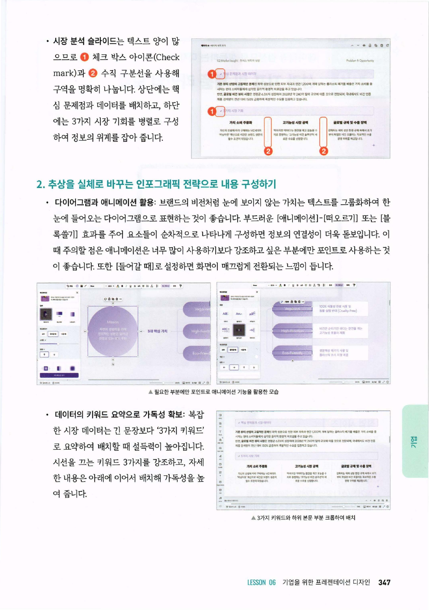

###### -··-··•“

• 시장 분석 슬라이드는 텍스트 양이 많

^ a 鬱 0 CI

으므로 O 체크 박스 아이콘(Check mark)과 O 수직 구분선을 사용해

CM이阜노#4 언..,.""""'

, ....』 &' U

Gl1티선일뻬고릴룬” 따阜자국적 U아처""달빠.,.러스릴 빼．은가지스섹••

구역을 명확히 나눕니다. 상단에는 핵 심 문제점과 데이터를 배치하고, 하단

사 던대소비자”게 싫현 을혀 툴볼빼 Il豊III 주고 었•LIQ

던 글•• .... 은연룹근 202硏' ""여달려규20I 이1 것Q豊

·틀 현년 ""' ISOX 룔曺灣언 令요. 었습따

t _~

###### ( O

###### G그

( O

U ggg"g

###### 곡 i

~}gi~

油 소빼

g g~i

g

g it

에는 3가지 시장 기회를 병렬로 구성

~

g Ollti

"t·예

ggi

tggt"

g5gf}}

壘•기.

하여 정보의 위계를 잡아 줍니다.

###### 2. 주상을 실체로 바꾸는 인포그래픽 전략으로 구성하기

다이어그램과 애니메이션 활용: 브랜드의 비전처럼 눈에 보이지 않는 가치는 텍스트를 그룹화하여 한

눈에 들어오는 다이어그램으로 표현하는 것이 좋습니다. 부드러운 [애니메이션]-［떠오르기] 또는 [블 록쓸기] 효과를 주어 요소들이 순차적으로 나타나게 구성하면 정보의 연결성이 더욱 돋보입니다. 이

때 주의할 점은 애니메이션은 너무 많이 사용하기보다 강조하고 싶은 부분에만 포인트로 사용하는 것 이 좋습니다. 또한 [들어갈 때]로 설정하면 화면이 매끄럽게 전환되는 느낌이 듭니다.

###### `.. .r -

•.::.

•••• A • 』 U • - • U i i ~~ M T

- •-·A • •• • •nJ.ntw - •T

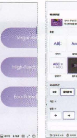

기, x

::::.-:-.:.--

TnT, x

:::::-":r-

oa •• _

”

100% 식.성 언를 사용 힛

"미jm(0다’...

###### - -

" "t "C

TT

- - 8 ..
- -·

ff•

巨 &

- -O1Il•

MC•, .. -ec

’

” E 백•

T 『m

......

###### , .

場룬빼설때?I지서웅

1라II .,.J.l헐횃툴

—-나글-......;_

· E ,

。

"m s- ·"' • •• o

.~고 O-

~ 필요한 부분에만 포인트로 애 니메이션 기능을 활용한 모습

2·-T_

데이터의 키워드 요약으로 가독성 확보: 복잡

###### ..

한 시장 데이터는 긴 문장보다 ‘3가지 키워드’

가른＂리선일혁고를혀연룬빼언" ••른으皇연e빼•자국적연au짜,,., ...스리빼'.....e가리소"'II

gl(

시 ...소백자를몌瓚 홑리" " ••••" ..고 었숄니q.

던eII·· 른 ... 것..JU c..a~•

t0i

로 요약하여 배치할 때 설득력이 높아집니다.

嶋I 겉악曺어 른년..., 5C‘ 글 ~.빼연 수•• ..고 었會니。

4 "e-

시선을 끄는 키워드 3가지를 강조하고, 자세

..............빼··-······

기지소배주"

?

"e·신"........L,n....

... ......글•*빼서.,,

....자단핵빡댜•간....... .

•• "가" 어

한 내용은 아래에 이어서 배치해 가독성을 높

미널 오量빼꼬 -론드."

°{0:

••••• 선

###### -

여줍니다.

-

··-iiF

’

###### ::.....!_-:북

.& 3가지 키워드와 하위 본문 부분 크롭하여 배지

LESSON 06 기업을 위한 프레젠테이션 디자인 347

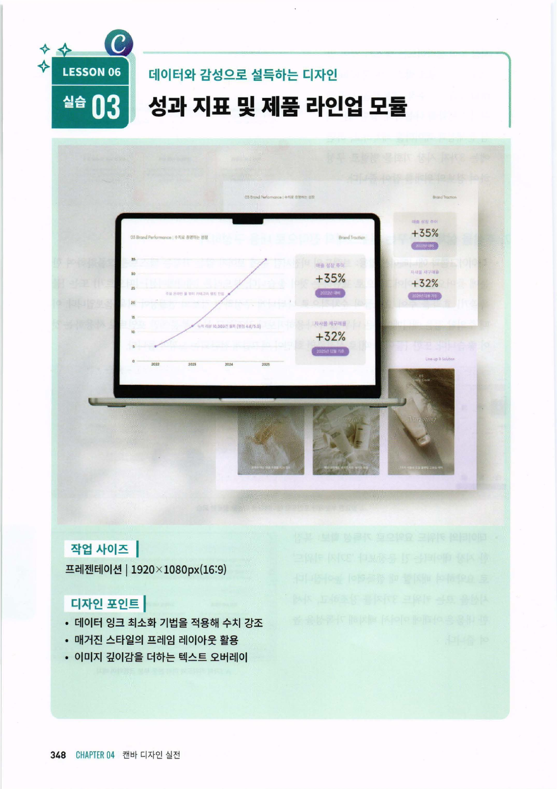

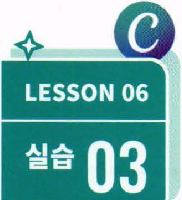

수수

설득하는 디자인

코

###### 성과지표및재폴라인업모툴

~

"`od"4川,,.." 후Lt.롭더는 Bland•-- +35%

###### ..

.. /'

+35%

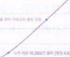

2, ■

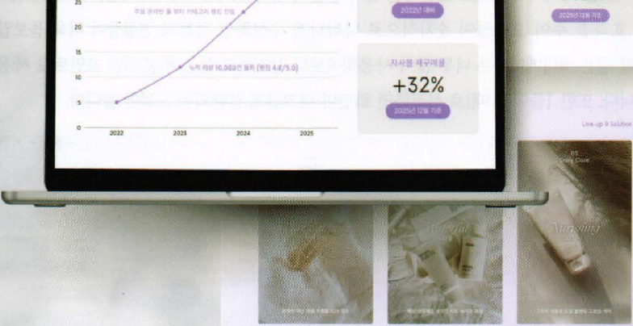

”

,.

.. / +32%

###### c:

흙,u 머 m· ,.z

작업 사이즈 |

프레젠테이션 | 192QX1Q8Qpx(16:9)

###### 디자인 포인트

- • 데이터 죄소화 기법을 적용해 수지
- • 매거진 스타일의

•

348 CHAPTER 04 캔바 디자인 실전

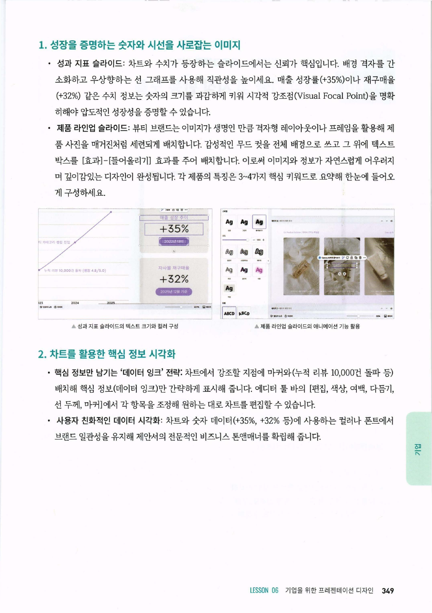

- 1. 증명하는 슷자와 시선을 사로잡는 이미지

- • 성과 지표 슬라이드: 차트와 수치가 등장하는 슬라이드에서는 신뢰가 핵심입니다. 배경 격자를 간 소화하고 우상향하는 선 그래프를 사용해 직관성을 높이세요. 매출 성장률(+35%）이나 재구매율 (+32%) 같은 수치 정보는 숫자의 크기를 과감하게 키워 시각적 강조점 (Visual Focal Point)을 명확 히해야 압도적인 성장성을 증명할 수 있습니다.
- • 제품 라인업 슬라이드: 뷰티 브랜드는 이미지가 생명인 만큼 격자형 레이아웃이나 프레임을 활용해 제 품 사진을 매거진처럼 세련되게 배치합니다. 감성적인 무드 컷을 전체 배경으로 쓰고 그 위에 텍스트 박스를 [효과]-［들어올리기] 효과를 주어 배치합니다. 이로써 이미지와 정보가 자연스럽계 어우러지 며 깊이감있는 디자인이 완성됩니다. 각 제품의 특징은 3~4가지 핵심 키워드로 요약해 한눈에 들어오 게구성하세요.

7 ... 。기•• -"

+35%

10.000건 들라 (휠집 • ·/5Ol

+32%

\23..."".,_

202,

~ 성과 지표 슬라이드의 텍스트 크기와 컬러 구성

- 2. 차트롤 핵심 정보 시각화

###### ..Ag- Ag- G] -•-

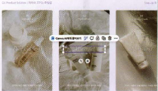

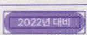

-- +

###### - - -

領 領) 腕

杖) "' Ag

뻬

Ag

L已,..8Co

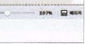

“` o-

,.....“ °""

~ 제품 라인업 슬라이드의 애니메이션 기능 활용

- • 핵심 정보만 남기는 ‘데이터 잉크’ 전략: 차트에서 강조할 지점에 마커와(누적 리뷰 10,000건 돌파 등) 배치해 핵심 정보(데이터 잉크)만 간략하게 표시해 줍니다. 에디터 툴 바의 [편집, 색상, 여백, 다듬기, 선 두께, 마커]에서 각 항목을 조정해 원하는 대로 차트를 편집할 수 있습니다.
- • 사용자 친화적인 데이터 시각화: 차트와 숫자 데이터 (+35%, +32% 등)에 사용하는 컬러나 폰트에서

브랜드 일관성을 유지해 제안서의 전문적인 비즈니스 톤앤매너를 확립해 줍니다. 꼰

c

LESSON 06 기업을 위한 프레젠테이션 디자인 349

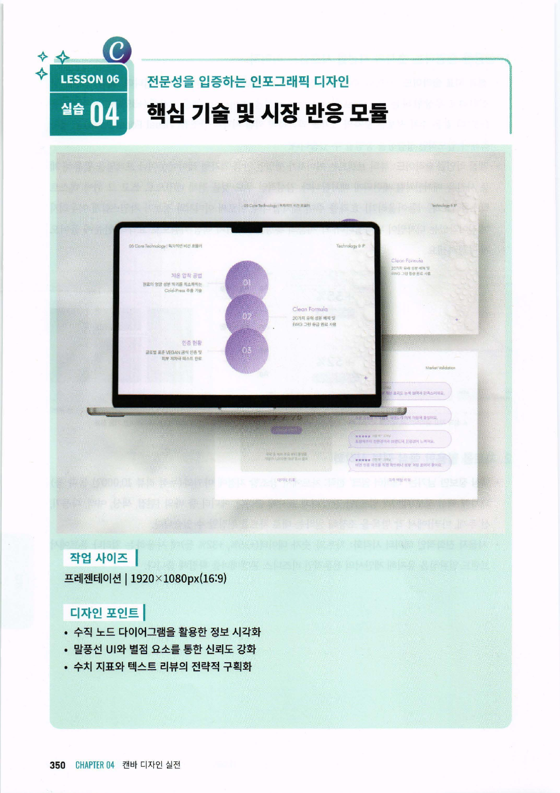

###### 수수

전문성을 입증하는 인포그래픽 디자인

###### 헥십 기숱 시장 모툴

05 kJ,4성,,".t ·i' " TLi止버,.~

..lf'll'l•I건J!lf,lt '～心R""'

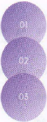

1!..의“

:1

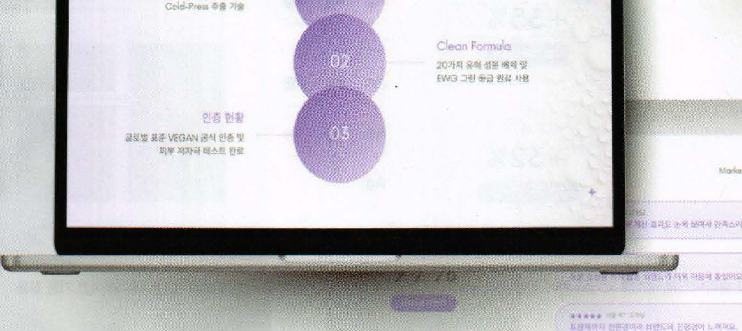

C썩우""乙•가

OonF,

X)기시 S 설讓 빼빼 힛

!WG 그틴 들a 6효 AItl

111• 자 ..소!.!!量

u"노 W.,,.

+

###### 사이즈 |

| 1920X1Q8Qpx(16:9)

###### 디자인 포인트|

- • 노드
- • UI와
- • 수치 지표와 텍스트 전략적 구획화

350 CHAPTER 04 캔바 디자인 실전

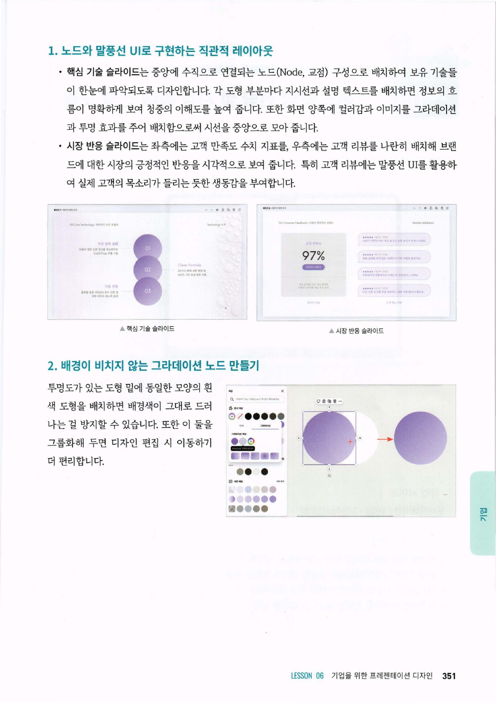

###### L 노드와 UI로 구현하는 직관적 레이아웃

- • 핵심 기술 슬라이드는 중앙에 수직으로 연결되는 노드(Node, 교점) 구성으로 배치하여 보유 기술들 이 한눈에 파악되도록 디자인합니다. 각 도형 부분마다 지시선과 설명 텍스트를 배치하면 정보의 흐 름이 명확하게 보여 청중의 이해도를 높여 줍니다. 또한 화면 양쪽에 컬러감과 이미지를 그라데이션 과투명 효과를주어 배치함으로써 시선울중앙으로모아줍니다.
- • 시장 반응 슬라이드는 좌측에는 고객 만족도 수치 지표를, 우측에는 고객 리뷰를 나란히 배치해 브랜 드에 대한시장의 긍정적인 반응을시각적으로보여 줍니다. 특히 고객 리뷰에는말풍선 UI를활용하 여 실제 고객의 목소리가 들리는 듯한 생동감을 부여합니다.

^ ..0··C ^V · a •• c

r,, ,.’'l崎 던...... U-U'"'’'"'

-’’’',u,,.-···... -··

露

###### -

lll{J'II

••＂m···적c,"L••••소...n.

###### ..,,.........

그론 셔

먼

••• .....

•••자......

... 핵심기술슬라이드 ~ 시장반응슬라이드

###### 2. 배경이 비치지 않는 그라데이션 노드

투명도가 있는 도형 밑에 동일한 모양의 흰 색 도형을 배치하면 배경색이 그대로 드러

X

@/"··-때···,

Q ,X... 크

Omll!J 8 ···

6 .....

-•oi~

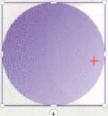

나는걸 방지할수있습니댜또한이 둘을 그룹화해 두면 디자인 편집 시 이동하기 더 편리합니댜

###### ,.

•• •

###### 。.....

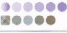

쿈

c

LESSON 기업을 위한 프레젠테이션 디자인 351

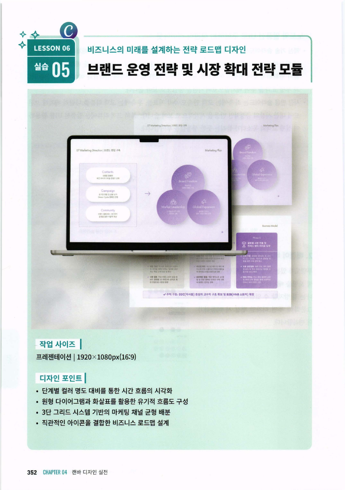

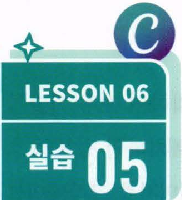

수수

비즈니스의 미래를 설계하는 전략 로드맵 디자인

코

###### 시장

"~r9".. grF~』구 UUmu

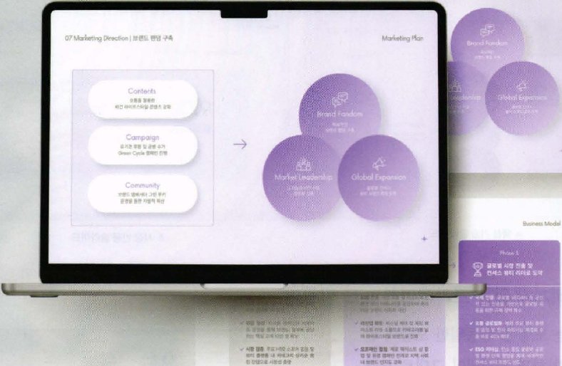

W"""""""v- •l!li-~산 km*“”*'

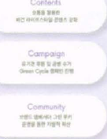

➔

###### ............

###### *

J 수억 구;£, ‘일뻬 고수뻬 구포 11보 혈 121{H..

###### 작업 사이즈 |

| X108Qpx(16:9)

###### 디자인 포인트|

•

- • 화살표를 유기적 구성
- • 3단 그리드 시스템 기반의 마케팅
- • 비즈니스

352 CHAPTER 04 캔바 디자인 실전

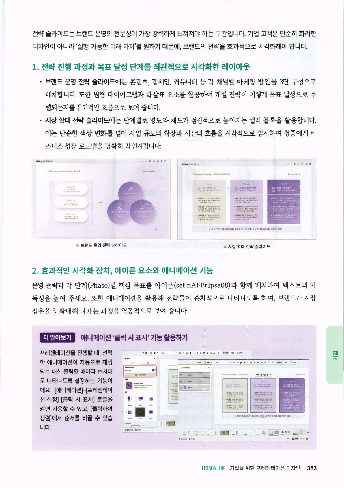

전략 슬라이드는 브랜드 운영의 전문성이 가장 강력하게 느껴져야 하는 구간입니다. 기업 고객은 단순히 화려한

디자인이 아니라 '실행 가능한 미래 가지’를 원하기 때문에, 브랜드의 전략을 효과적으로 시각화해야 합니다.

###### 1. 목표

- • 브랜드 운영 전략 슬라이드에는 콘텐츠, 캠페인, 커뮤니티 등 각 채널별 마케팅 방안을 3단 구성으로 배치합니다. 또한 원형 다이어그램과 화살표 요소를 활용하여 개별 전략이 어떻게 목표 달성으로 수 렴되는지를 유기적인 흐름으로 보여 줍니다.
- • 시장 확대 전략 슬라이드에는 단계별로 명도와 채도가 점진적으로 높아지는 컬러 블록을 활용합니다. 이는 단순한 색상 변화를 넘어 사업 규모의 확장과 시간의 흐름을 시각적으로 암시하여 청중에게 비 즈니스 성장 로드맵을 명확히 각인시킵니다.

·

“ 5 3

[-,-..."

i i

#### -......

A • • ii •• C

’·•s”길·

^v.a •• C

...

’(E, 또一겁‘,서••• mmI

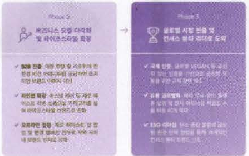

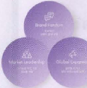

......뺄-···*·B"'.. ..

.... ......

➔

‘ .... ..........

.•,.......내·•···.,.,T....

길 .

J..혁구로, ....)•설·고.."구포.뽀`&ll{H.. ••

~ 브 드 운영 전략 슬라이드

시장 확대 전략 슬라이드

###### 2. 효과적인 시각화 장치, 아이콘 요소와 애니메이션 기능

운영 전략과 각 단계 (Phase)별 핵심 목표를 아이콘(set:nAFBrlpsa08)과 함께 배치하여 텍스트의 가

독성을 높여 주세요. 또한 애니메이션을 활용해 전략들이 순차적으로 나타나도록 하여, 브랜드가 시장 점유율을 확대해 나가는 과정을 역동적으로 보여 줍니다.

# - ‘클릭시표시'기능

쯔

°“ • • r - · ~. 소 • U • 터 • " .r. k -- " ,,- |

때,

c

.••. ^' U • " • II 上 .~ "T-

X

한 애니메이션이 자동으로 되는 대신 클릭할 때마다 순서대

곡( ­

###### 已...

|7=~.I! ~ 1

"--,.-~, -e••-

로 나타나도록 는 기능이 에요. ［애니메이션]-［프레젠테이

」,••0~":...,•••고솔b,....”""'..

·녹:.:.:---

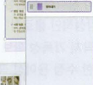

###### |만 ; -

설정]-［ 릭 시 표시]

사용할 수 있고, ［클릭하여 순서를 바꿀 수 있습

-o' • ?

5^`..

T 「'

니다.

S-·"`

••"" o-

."“·-

•• •• ••

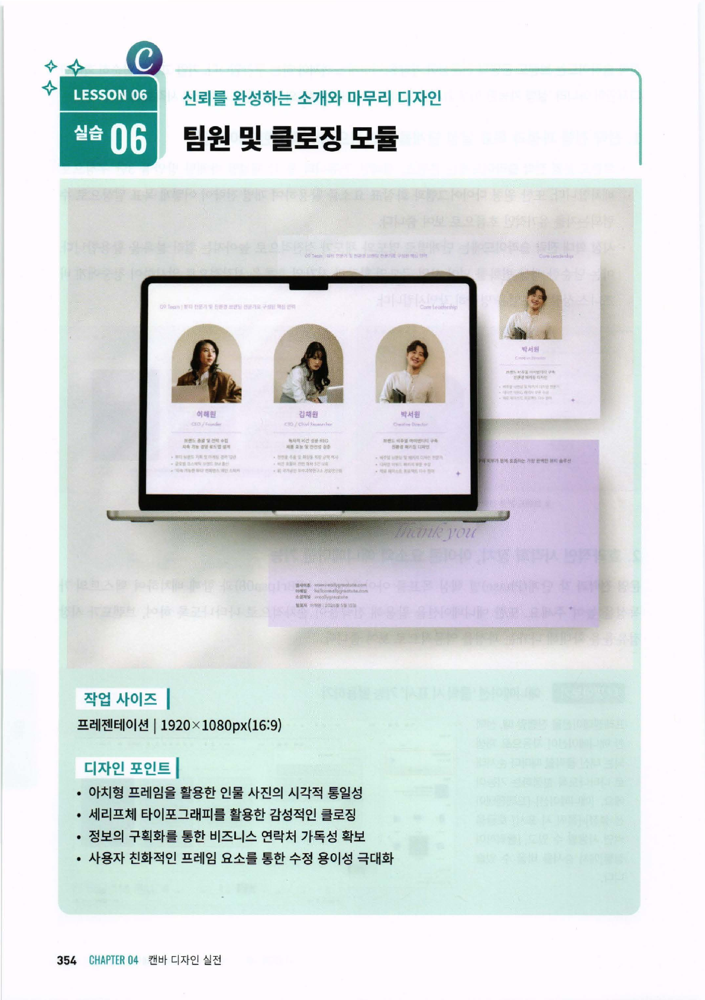

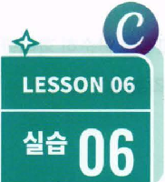

수수

:

신뢰를 소개와 마무리 디자인

###### 팀원및클로징모톨

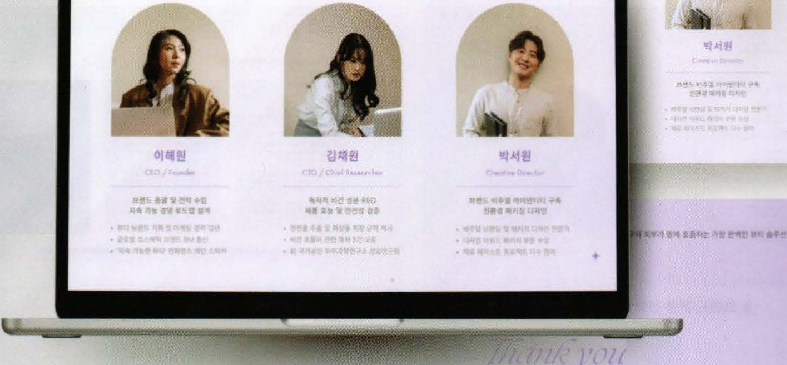

라시현

••...

••넬

###### 사이즈

프레젠테이션 | 192QX1Q8Qpx(16:9)

###### 포 |

###### •

•

- • 정보의 비즈니스 확보
- • 사용자 친화적인 프레임 수정 극대화

354 04 캔바 디자인 실전

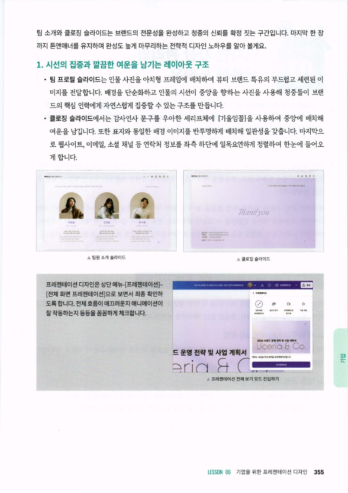

팀 소개와 클로징 슬라이드는 브랜드의 전문성을 완성하고 정중의 신뢰를 확정 짓는 구간입니다. 마지막 한 장

까지 톤앤매너를 유지하며 완성도 높게 마무리하는 전략적 디자인 노하우를 알아 볼게요.

###### 1. 시선의 집중과 여운을 남기는 구조

- • 팀 프로필 슬라이드는 인물 사진을 아치형 프레임에 배치하여 뷰티 브랜드 특유의 부드럽고 세련된 이 미지를 전달합니다. 배경을 단순화하고 인물의 시선이 중앙을 향하는 사진을 사용해 청중들이 브랜 드의 핵심 인력에게 자연스럽게 집중할 수 있는 구조를 만듭니다.
- • 클로징 슬라이드에서는 감사인사 문구를 우아한 세리프체에 [기울임꼴]을 사용하여 중앙에 배치해 여운을 남깁니다. 또한 표지와 동일한 배경 이미지를 반투명하게 배치해 일관성을 갖춥니다. 마지막으 로 웹사이트, 이메일, 소설 채널 등 연락처 정보를 좌측 하단에 일목요연하게 정렬하여 한눈에 들어오 게합니다.

^ * a •• c

• • • @ •• "

...................

flh.Il1/'J.Ul(

.......,..

... 팀원소개 슬라이드 ~ 클로징슬라이드

]

###### O o o C>

###### .... •....." ."........ ••••

. II 때 계.서

io Co.

OD-c

"학•도를던빼•현." ...어선업나다

킥 rin 白 〈七

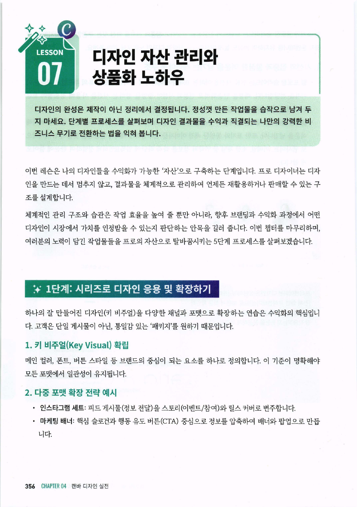

###### 디자인자산관리와 상플화노하우

지

###### 이번 레슨은 나의 디자인들을 수익화가 가능한 ‘자산’으로 구축하는 단계입니다. 프로 디자이너는 디자

인을 만드는 데서 멈추지 않고, 결과물을 체계적으로 관리하여 언제든 재활용하거나 판매할 수 있는 구

조를설계합니다.

체계적인 관리 구조와 습관은 작업 효율을 높여 줄 뿐만 아니라, 향후 브랜딩과 수익화 과정에서 어떤 디자인이 시장에서 가치를 인정받을 수 있는지 판단하는 안목을 길러 줍니댜 이번 챕터를 마무리하며,

여러분의 노력이 담긴 작업물들울 프로의 자산으로 탈바꿈시키는 5단계 프로세스를 살펴보겠습니다.

###### | 확 |

하나의 잘 만들어진 디자인(키 비주얼)을 다양한 채널과 포맷으로 확장하는 연습은 수익화의 핵심입니

- 다. 고객은 단일 게시물이 아닌, 통일감 있는 ‘패키지’를 원하기 때문입니다.

- 1. 키 비주얼(Key Visual) 확립 메인 컬러, 폰트, 버튼 스타일 등 브랜드의 중심이 되는 요소를 하나로 정의합니다. 이 기준이 명확해야 모든 포맷에서 일관성이 유지됩니댜
- 2. 다증 예시

- • 인스타그램 세트: 피드 게시물(정보 전달)을 스토리 (이벤트/참여)와 릴스 커버로 변주합니다.
- • 마케팅 배너: 핵심 슬로건과 행동 유도 버튼(CTA) 중심으로 정보를 압축하여 배너와 팝업으로 만듭

니다.

###### 356 CHAPTER 04 캔바 디자인 실전

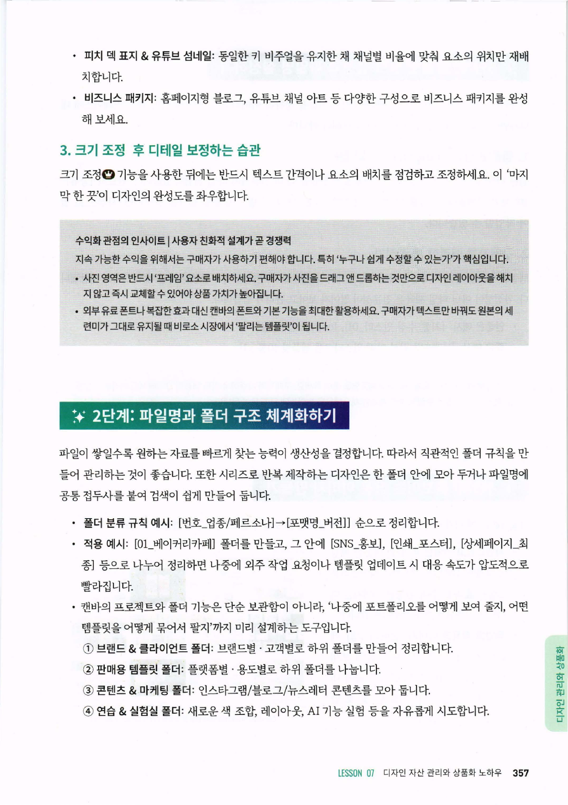

###### • 피지 덱 표지 & 유튜브 섬네일: 동일한 키 비주얼을 유지한 채 채널별 비율에 맞춰 요소의 위치만 재배

치합니다.

###### 비즈니스 패키지: 홈페이지형 블로그, 유튜브 채널 아트 등 다양한 구성으로 비즈니스 패키지를 완성

해보세요.

###### 3. 크기 조정 후디테일보정하는습관

크기 조정0 기능을 사용한 뒤에는 반드시 텍스트 간격이나 요소의 배치를 점검하고 조정하세요. 이 ‘마지

###### 막한끗’이 디자인의완성도를좌우합니다.

곧

‘ 수

- • 반드시
- • 바꿔도 세

###### |

파일이 쌓일수록 원하는 자료를 빠르게 찾는 능력이 생산성을 결정합니다. 따라서 직관적인 폴더 규칙을 만

###### 들어 관리하는 것이 좋습니다. 또한 시리즈로 반복 제작하는 디자인은 한 폴더 안에 모아 두거나 파일명에

공통 접두사를 붙여 검색이 쉽게 만들어 둡니다.

폴더 분류 규칙 예시: ［번호_업종/페르소나]一[포맷명_버전]］ 순으로 정리합니다.

적용 예시: [01_베이커리카페] 폴더를 만들고, 그 안에 [SNS_홍보], ［인쇄-포스터], ［상세페이지:j 종] 등으로 나누어 정리하면 나중에 외주 작업 요청이나 템플릿 업데이트 시 대웅 속도가 압도적으로

빨라집니다.

• 캔바의 프로젝트와 폴더 기능은 단순 보관함이 아니라, ‘나중에 포트폴리오를 어떻게 보여 줄지, 어떤

템플릿을 어떻게 묶어서 팔지'까지 미리 설계하는 도구입니다. ® 브랜드 & 클라이언트 폴더: 브랜드별 ·고객별로 하위 폴더를 만들어 정리합니댜 ® 판매용 템플릿 폴더: 플랫폼별 · 용도별로 하위 폴더를 나눕니다. ® 콘텐츠 & 마케팅 폴더: 인스타그램/불로그/뉴스레터 콘텐츠를 모아 둡니댜 ® 연습 & 실험실 폴더: 새로운 색 조합, 레이아웃, AI 기능 실험 등을 자유롭게 시도합니다.

一뽀뽀신혼모인런

＿니

디자인 자산 관리와 상품화 노하우 357

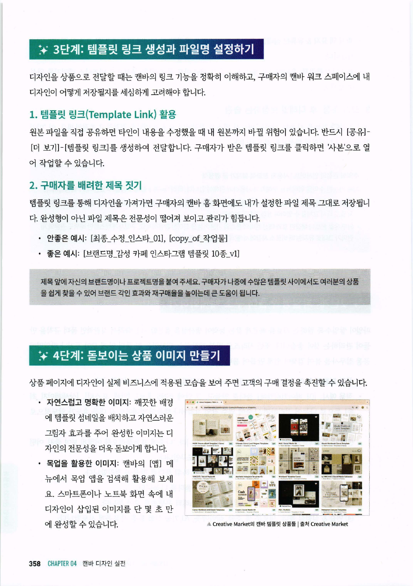

###### | |

###### 디자인을 상품으로 전달할 때는 캔바의 링크 기능을 정확히 이해하고, 구매자의 캔바 워크 스페이스에 내

디자인이 어떻게 저장될지를 세심하게 고려해야 합니댜

###### 1. 링크(Template Link) 활용

원본파일을직접 공유하면타인이 내용을수정했을때내 원본까지 바뀔위험이 있습니다.반드시 [공유][더 보기]-[템플릿 링크]를 생성하여 전달합니다. 구매자가 받은 템플릿 링크를 클릭하면 '사본’으로 열

어 작업할수있습니댜

###### 2. 구매자를 제목 짓기

템플릿 링크를 통해 디자인을 가져가면 구매자의 캔바 홈 화면에도 내가 설정한 파일 제목 그대로 저장됩니

- 다. 완성형이 아닌 파일 제목은 전문성이 떨어져 보이고 관리가 힘듭니다.

안좋은 예시: ［최종_수정_인스타_01], [copy_of_작업물]

좋은 예시: ［브랜드명_감성 카페 인스타그램 템플릿 10종_vl]

###### | |

모;

상품 페이지에 디자인이 실제 비즈니스에 적용된 모습을 보여 주면 고객의 구매 결정을 촉진할 수 있습니다.

.•.。·--Z ·-·.. ...

• 자연스럽고 명확한 이미지: 깨끗한 배경

##### ·

###### --t프

###### •\l- v

###### 」o

＿5. —

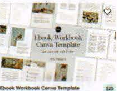

에 템플릿 섬네일을 배치하고 자연스러운

\

그림자 효과를 주어 완성한 이미지는 디

###### i

###### 』一론―

l ?Al

l-

•

l -

-

F

g

IiJ

l

- -

자인의 전문성을 더욱 돋보이게 합니다.

.

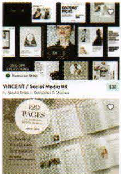

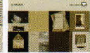

만t

_―ii

목업을 활용한 이미지 : 캔바의 [앱] 메

－－-

###### l ―갑냐

년.

一一一

###### Jg

：

뉴에서 목업 앱을 검색해 활용해 보세 요. 스마트폰이나 노트북 화면 속에 내 디자인이 삽입된 이미지를 단 몇 초 만 에완성할 수있습니다.

브

뽑

o

뜩li_

-ll

i

} _

L

­ll

-

―•

l ll

i

．

i

A Creative Market의 캔바 템플릿 상품들 | 출처 Creative Market

###### 358 CHAPTER 04 캔바 디자인 실전

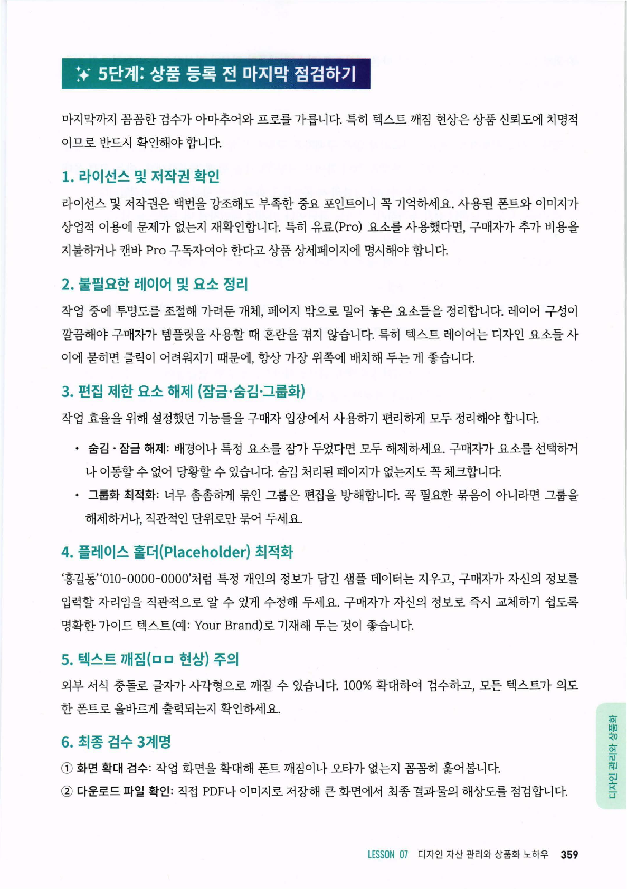

###### | 상품등록 점검 |

마지막까지 꼼꼼한 검수가 아마추어와 프로를 가릅니다. 특히 텍스트 깨짐 현상은 상품 신뢰도에 치명적

이므로 반드시 확인해야 합니다.

- 1. 라이선스 저작권 확인

라이선스 및 저작권은 백번을 강조해도 부족한 중요 포인트이니 꼭 기억하세요. 사용된 폰트와 이미지가

상업적 이용에 문제가 없는지 재확인합니다. 특히 유료(Pro) 요소를 사용했다면, 구매자가 추가 비용을

지불하거나 캔바 Pro 구독자여야 한다고 상품 상세페이지에 명시해야 합니다.

- 2. 레이어 요소 정리

작업 중에 투명도를 조절해 가려둔 개체, 페이지 밖으로 밀어 놓은 요소들을 정리합니다. 레이어 구성이 깔끔해야 구매자가 템플릿을 사용할 때 혼란을 겪지 않습니다. 특히 텍스트 레이어는 디자인 요소들 사 이에 묻히면 클릭이 어려워지기 때문에, 항상 가장 위쪽에 배치해 두는 게 좋습니다.

- 3. 제한 요소 해제

작업 효율을 위해 설정했던 기능들을 구매자 입장에서 사용하기 편리하게 모두 정리해야 합니다.

- • 숨김 · 잠금 해제: 배경이나 특정 요소를 잠가 두었다면 모두 해제하세요. 구매자가 요소를 선택하거 나 이동할 수 없어 당황할 수 있습니다. 숨김 처리된 페이지가 없는지도 꼭 체크합니다.
- • 그룹화 죄적화: 너무 촘촘하게 묶인 그룹은 편집을 방해합니댜 꼭 필요한 묶음이 아니라면 그룹을 해제하거나, 직관적인 단위로만 묶어 두세요.

- 4. 플레이스 홀더(Placeholder)

‘홍길동’‘010-0000-0000'처럼 특정 개인의 정보가 담긴 샘플 데이터는 지우고, 구매자가 자신의 정보를

입력할 자리임을 직관적으로 알 수 있게 수정해 두세요. 구매자가 자신의 정보로 즉시 교체하기 쉽도록 명확한 가이드 텍스트(예: Your Brand)로 기재해 두는 것이 좋습니다.

- 5. 텍스트 깨짐(口 口 주의 외부 서식 충돌로 글자가 사각형으로 깨질 수 있습니다. 100% 확대하여 검수하고, 모든 텍스트가 의도 한 폰트로 올바르게 출력되는지 확인하세요.
- 6. 최종검수 ® 화면 확대 검수: 작업 화면을 확대해 폰트 깨짐이나 오타가 없는지 꼼꼼히 훑어봅니댜 ® 다운로드 파일 확인: 직접 PDF나 이미지로 저장해 큰 화면에서 최종 결과물의 해상도를 점검합니다.

一뽀

R. 혀

_nJ5F5{xku

07 디자인 자산 관리와 상품화 노하우 359

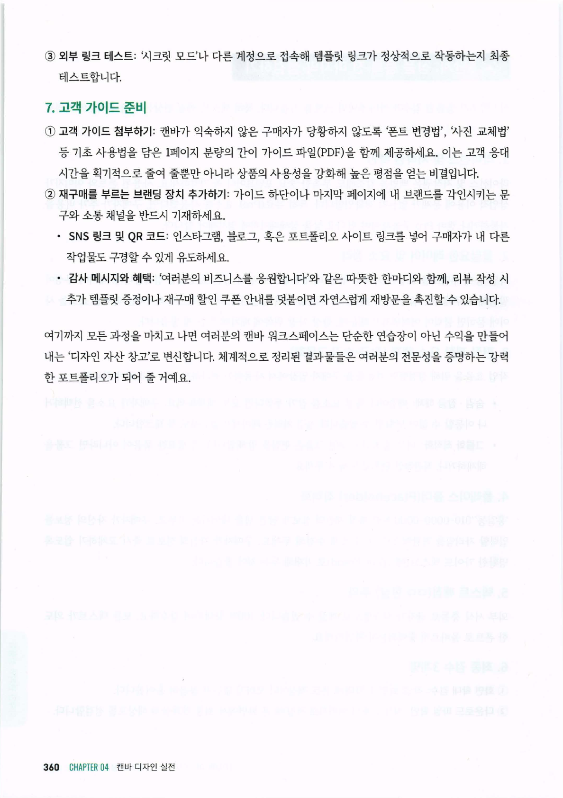

® 외부 링크 테스트: ‘시크릿 모드'나 다른 계정으로 접속해 템플릿 링크가 정상적으로 작동하는지 최종

테스트합니댜

- 7. 고객가이드준비 ® 고객 가이드 점부하기: 캔바가 익숙하지 않은 구매자가 당황하지 않도록 ‘폰트 변경법’, ‘사진 교체법’

등 기초 사용법을 담은 1페이지 분량의 간이 가이드 파일 (PDF)을 함께 제공하세요. 이는 고객 옹대

시간을 획기적으로 줄여 줄뿐만 아니라 상품의 사용성을 강화해 높은 평점을 얻는 비결입니다.

® 재구매를 부르는 브랜딩 장지 주가하기: 가이드 굼}단이나 마지막 페이지에 내 브랜드를 각인시키는 문

구와 소통 채널을 반드시 기재하세요.

SNS 링크 및 QR 코드: 인스타그램, 블로그, 혹은 포트폴리오 사이트 링크를 넣어 구매자가 내 다른 작업물도 구경할 수 있게 유도하세요.

감사 메시지와 혜택: ‘여러분의 비즈니스를 웅원합니다’와 같은 따뜻한 한마디와 함께, 리뷰 작성 시

###### 추가 템플릿 증정이나 재구매 할인 쿠폰 안내를 덧붙이면 자연스럽계 재방문을 촉진할 수 있습니다.

여기까지 모든 과정을 마치고 나면 여러분의 캔바 워크스페이스는 단순한 연습장이 아닌 수익을 만들어 내는 ‘디자인 자산 창고’로 변신합니다. 체계적으로 정리된 결과물들은 여러분의 전문성을 증명하는 강력

한포트폴리오가되어 줄거예요.

360 CHAPTER 04 캔바 디자인 실전

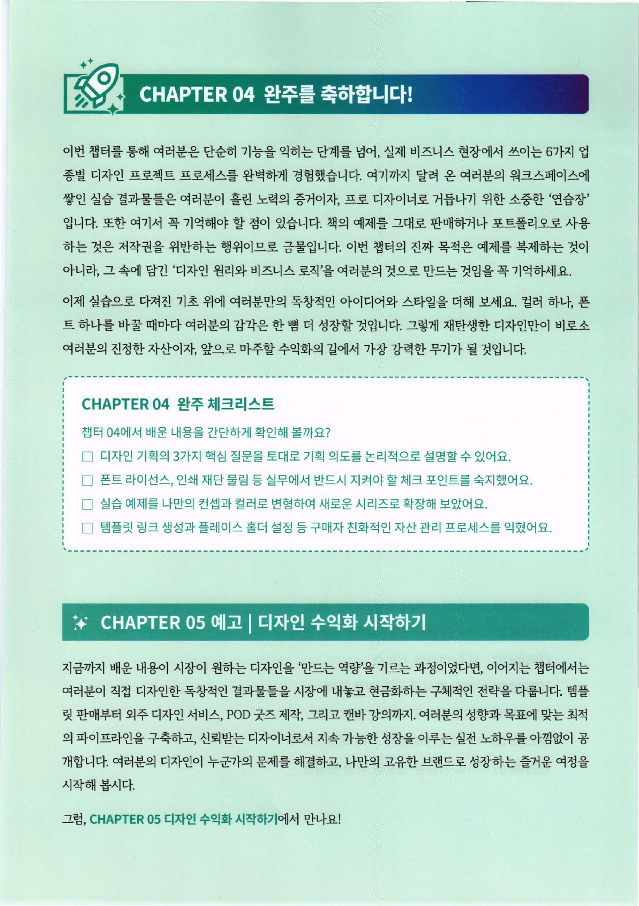

虛j

이번 통해 여러분은 단순히 기능을 익히는 실제 비즈니스 현장에서 쓰이는 6가지 업 프로젝트 프로세스를 완벽하게 경험했습니다. 여기까지 달려 온 여러분의 워크스페이스에

###### 쌓인 실습 여러분이 노력의 증거이자, 프로 거듭나기 소중한 ‘연습장'

입니다. 또한 여기서 꼭 기억해야 할 점이 있습니다. 책의 예제를 그대로 판매하거나 사용

###### 하는 것은 저작권을 행위이므로 금물입니다. 이번 챕터의 진짜 목적은 예제를 복제하는 것이

아니라, 그 속에 담긴 ‘디자인 원리와 비즈니스 로직’을 여러분의 것으로 만드는 꼭 기억하세요.

이제 다져진 기초 위에 여러분만의 보세요. 하나, 폰

트 바꿀 때마다 여러분의 감각은 한 더 것입니다. 그렇게 비로소 여러분의 자산이자, 앞으로 마주할 길에서 가장 무기가 것입니다.

###### ------------------------------------------------------------------------------------

,

`

###### CHAPTER 04

챕터 04에서 曰 디자인 기획의 3가지 핵심 토대로 기획 논리적으로 수 있어요. 曰 폰트 라이선스, 등 실무에서 반드시 지켜야 할 체크 숙지했어요. 口 컬러로 시리즈로

曰 링크 생성과 플레이스 홀더 구매자 자산 익혔어요.

------------------------------------------------------------------------------------

`

지금까지 배운 내용이 시장이 원하는 디자인을 ‘만드는 역량’을 기르는 과정이었다면, 이어지는

여러분이 직접 디자인한 독창적인 결과물들을 시장에 내놓고 현금화하는 구체적인 다룹니다.

릿 판매부터 외주 디자인 서비스, POD 굿즈 제작, 강의까지. 여러분의 최적

###### 의 파이프라인을 구축하고, 신뢰받는 디자이너로서 지속 가능한 을 이루는 노하우를 아낌없이 공

###### 개합니다. 여러분의 디자인이 누군가의 해결하고, 나만의 고유한 브랜드로 는 여정을 시작해봅시다.

그럼, CHAPTER OS 수익화 시작하기에서 만나요!

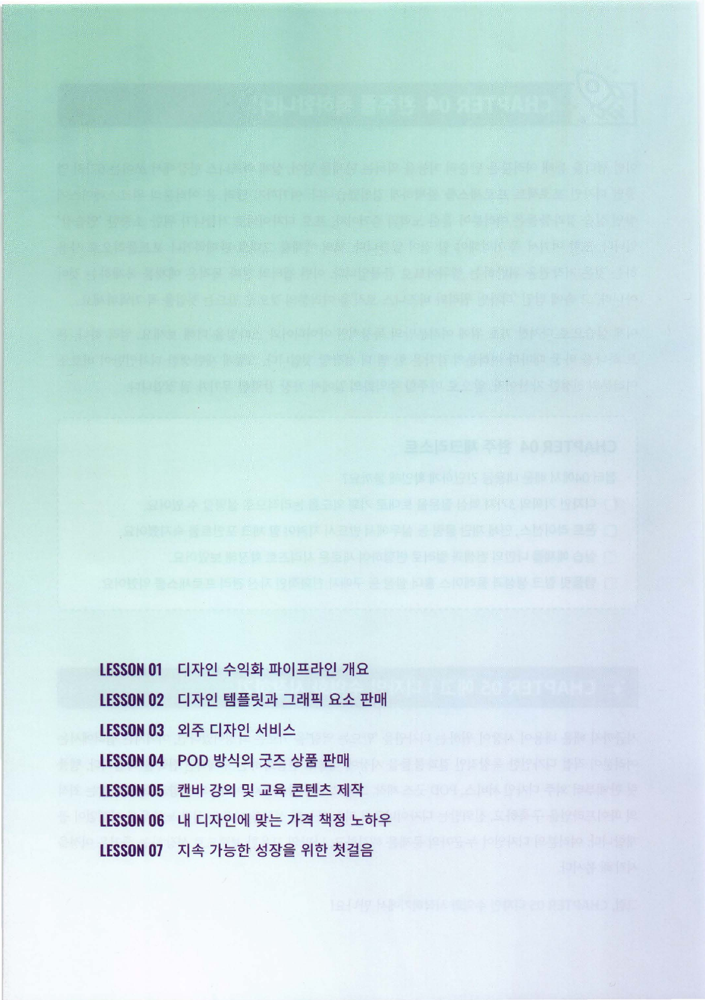

- LESSON 01 수익화
- LESSON 02 디자인 서비스

- LESSON 04 POD
- LESSON 05 강의 및 교육 06 내 가격 책정 노하우

LESSON 07 지속 가능한 성장을

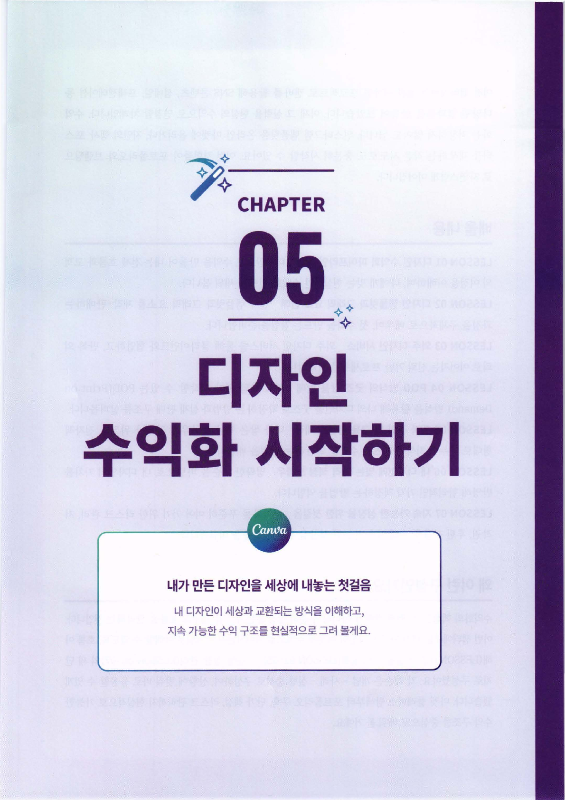

一、수

/ ;-

CHAPTER

디자인

수익화시작하기

내가 디자인을 세상에 내놓는

내 디자인이 세상과 교환되는 방식을 이해하고,

지속 가능한 수익 구조를 현실적으로 그려 볼게요.

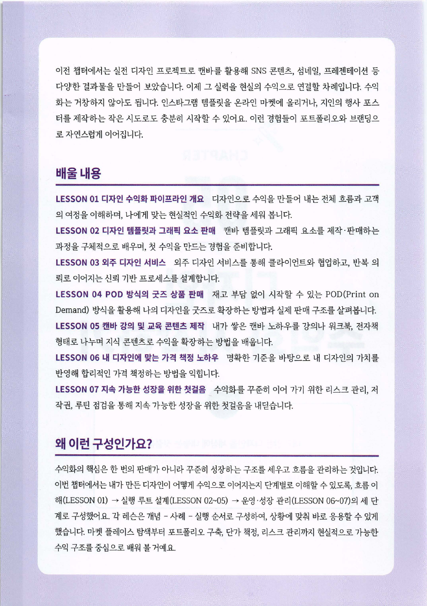

###### 이전 챕터에서는 실전 디자인 프로젝트로 캔바를 활용해 SNS 콘텐츠, 섬네일, 프레젠테이션 등

다양한 결과물을 만들어 보았습니다. 이제 그 실력을 현실의 수익으로 연결할 차례입니다. 수익 화는 거창하지 않아도 됩니댜 인스타그램 템플릿을 온라인 마켓에 올리거나, 지인의 행사 포스

###### 터를 제작하는 작은 시도로도 충분히 시작할 수 있어요. 이런 경험들이 포트폴리오와 브랜딩으

로 자연스럽게 이어집니댜

###### 배울내용

- LESSON 01 수익화 디자인으로 수익을 만들어 내는 전체 흐름과 고객 의 여정을 이해하며, 나에게 맞는 현실적인 수익화 전략을 세워 봅니다.
- LESSON 02 요소 캔바 템플릿과 그래픽 요소를 제작·판매하는 과정을 구체적으로 배우며, 첫 수익을 만드는 경험을 준비합니댜

03 외주 외주 디자인 서비스를 통해 클라이언트와 협업하고, 반복 의 뢰로 이어지는 신뢰 기반 프로세스를 설계합니다.

- LESSON 04 POD 재고 부담 없이 시작할 수 있는 POD(Print on Demand) 방식을 활용해 나의 디자인을 굿즈로 확장하는 방법과 실제 판매 구조를 살펴봅니다.
- LESSON 05 내가 쌓은 캔바 노하우를 강의나 워크북, 전자책 형태로 나누며 지식 콘텐츠로 수익을 확장하는 방법을 배웁니다.
- LESSON 06 내 가격 노하우 반영해 합리적인 가격 책정하는 방법을 익힙니다.

명확한 기준을 바탕으로 내 디자인의 가치를

- LESSON 07 지속 가능한 성장을 위한 첫걸음 수익화를 꾸준히 이어 가기 위한 리스크 관리, 저 작권, 루틴 점검을 통해 지속 가능한 성장을 위한 첫걸음을 내딛습니다.

###### 왜이런구성인가요?

###### 수익화의 핵심은 한 번의 판매가 아니라 꾸준히 성장하는 구조를 세우고 흐름을 관리하는 것입니다.

###### 이번 챕터에서는 내가 만든 디자인이 어떻게 수익으로 이어지는지 단계별로 이해할 수 있도록, 흐름 이

해(LESSON 01) - 실행 루트 설계(LESSON 02~05) - 운영 ·성장 관리(LESSON 06~07)의 세 단 계로 구성했어요. 각 레슨은 개넘 - 사례 - 실행 순서로 구성하여, 상황에 맞춰 바로 응용할 수 있게 했습니다. 마켓 플레이스 탐색부터 포트폴리오 구축, 단가 책정, 리스크 관리까지 현실적으로 가능한

수익 구조를 중심으로 배워 볼 거예요.

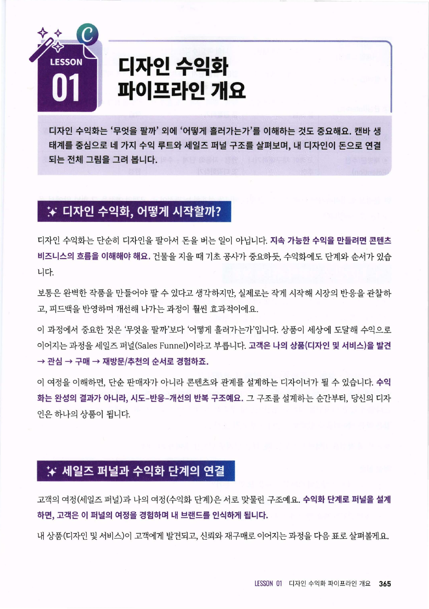

디자인수익화

###### 파이프라인개요

수익화는 ‘무엇을 팔까' 외에 ‘어떻게 흘러가는가’를 이해하는 것도 중요해요. 캔바 생

태계를 네 가지 수익 루트와 세일즈 퍼널 구조를 살펴보며, 내 디자인이 돈으로 연결 되는 그려 봅니다.

###### | I

디자인 수익화는 단순히 디자인을 팔아서 돈을 버는 일이 아닙니다. 지속 가능한 수익을 만들려면 콘텐츠

비즈니스의 흐름을 이해해야 해요. 건물을 지을 때 기초 공사가 중요하듯, 수익화에도 단계와 순서가 있습

니다.

###### 보통은 완벽한 작품을 만들어야 팔 수 있다고 생각하지만, 실제로는 작게 시작해 시장의 반응을 관찰하

고, 피드백을 반영하며 개선해 나가는 과정이 훨씬 효과적이에요.

이 과정에서 중요한 것은 ‘무엇을 팔까'보다 ‘어떻게 흘러가는가'입니다. 상품이 세상에 도달해 수익으로 이어지는 과정을 세일즈 퍼널(Sales Funnel)이라고 부릅니댜 고객은 나의 상품(디자인 및 서비스)을 발견

➔ 관심 ➔ 구매 ➔ 재방문/주천의 순서로 경험하죠.

이 여정을 이해하면, 단순 판매자가 아니라 콘텐츠와 관계를 설계하는 디자이너가 될 수 있습니다. 수익

화는 결과가 아니라, 시도-반응-개선의 반복 구조예요. 그 구조를 설계하는 순간부터, 당신의 디자

인은 하나의 상품이 됩니다.

###### I :+

###### 고객의 여정 (세일즈 퍼널)과 나의 여정 (수익화 단계)은 서로 맞물린 구조예요. 수익화 단계로 퍼널을 설계

하면, 고객은 이 퍼널의 여정을 경험하며 내 브랜드를 인식하게 됩니다.

내 상품(디자인 및 서비스)이 고객에게 발견되고, 신뢰와 재구매로 이어지는 과정을 다음 표로 살펴볼게요.

LESSON 01 디자인 수익화 파이프라인 개요 365

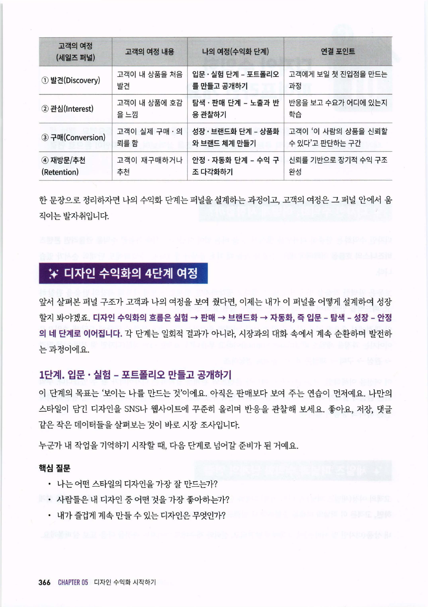

| | |나의 여정(수익화| |
|---|---|---|---|
|® 발견(Discovery)|고객이 내 상품을저음  발견|입문 · 실험 단계 - 포트폴리오  를만들고공개하기|고객에게 보일 첫 진입점을 만드는  과정|
|® 관심(Interest)|고객이 내 상품에 호감 을느낌|탐색 · 판매 단계 - 노줄과 반  응관찰하기|반응을 보고 수요가 어디에 있는지  학습|
|® 구매(Conversion)|고객이 실제 구매 · 의  뢰를함|성장 · 브랜드화 단계 - 상품화  와브랜드제계만들기|고객이 ‘이 사람의 상품을 신뢰할 수 있다’고 판단하는 구간|
|® 재방문/주천  (Retention)|고객이 재구애하거나 주전|안정 · 자동화 단계 - 수익 구  조다각화하기|신뢰를 기반으로 장기적 수익 구조 완성|

한 문장으로 정리하자면 나의 수익화 단계는 퍼널을 설계하는 과정이고, 고객의 여정은 그 퍼널 안에서 움

직이는발자취입니다.

###### 계 I

앞서 살펴본 퍼널 구조가 고객과 나의 여정을 보여 줬다면, 이제는 내가 이 퍼널을 어떻게 설계하여 성장

할지 봐야겠죠. 디자인 수익화의 흐름은 실험 ➔ 판매 ➔ 브랜드화 ➔ 자동화, 즉 - 탐색 - 성장 - 안정 각 단계는 일회적 결과가 아니라, 시장과의 대화 속에서 계속 순환하며 발전하

는과정이에요.

###### 1단계. • - 만들고

###### 이 단계의 목표는 ‘보이는 나를 만드는 것'이에요. 아직은 판매보다 보여 주는 연습이 먼저예요. 나만의

스타일이 담긴 디자인을 SNS나 웹사이트에 꾸준히 올리며 반응을 관찰해 보세요. 좋아요, 저장, 댓글 같은 작은 데이터들을 살펴보는 것이 바로 시장 조사입니다.

누군가 내 작업을 기억하기 시작할 때, 다음 단계로 넘어갈 준비가 된 거예요.

핵심질문

- • 나는 어떤 스타일의 디자인을 가장 잘 만드는가?
- • 사람들은 내 디자인 중 어떤 것을 가장 좋아하는가?
- • 내가 즐겁게 계속 만들 수 있는 디자인은 무엇인가?

366 05 디자인 수익화 시작하기

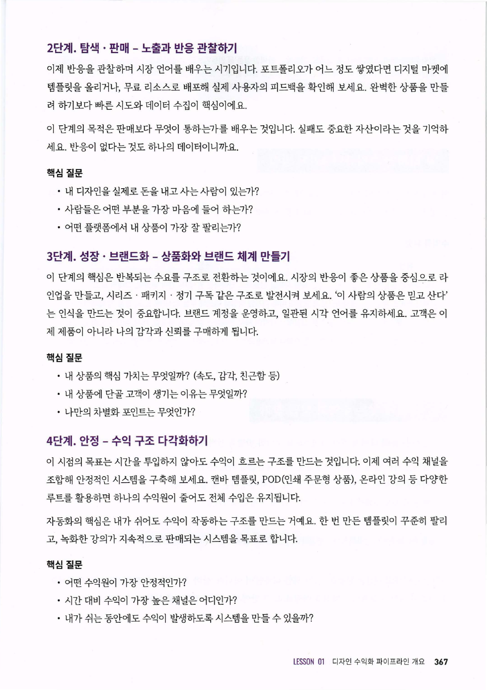

- 2단계. 탐색 • 판매 - 노즐과 관찰하기 이제 반응을 관찰하며 시장 언어를 배우는 시기입니다. 포트폴리오가 어느 정도 쌓였다면 디지털 마켓에 템플릿을 올리거나, 무료 리소스로 배포해 실제 사용자의 피드백을 확인해 보세요. 완벽한 상품을 만들 려 하기보다 빠른 시도와 데이터 수집이 핵심이에요.

이 단계의 목적은 판매보다 무엇이 통하는가를 배우는 것입니다. 실패도 중요한 자산이라는 것을 기억하

세요. 반응이 없다는 것도 하나의 데이터이니까요.

핵심질문

- • 내 디자인을실제로돈을내고사는사람이 있는가?
- • 사람들은 어떤 부분을 가장 마음에 들어 하는가?
- • 어떤 플랫폼에서 내 상품이 가장 잘 팔리는가?

- 3단계. • 브랜드화 - 상품화와 체계 이 단계의 핵심은 반복되는 수요를 구조로 전환하는 것이에요. 시장의 반웅이 좋은 상품을 중심으로 라 인업을 만들고, 시리즈 · 패키지 · 정가 구독 같은 구조로 발전시켜 보세요. ‘이 사람의 상품은 믿고 산다' 는 인식을 만드는 것이 중요합니다. 브랜드 계정을 운영하고, 일관된 시각 언어를 유지하세요. 고객은 이 제 제품이 아니라 나의 감각과 신뢰를 구매하게 됩니다.

핵심질문

- • 내 상품의 핵심 가치는무엇일까? （속도,감각, 친근함등)
- • 내 상품에 단골 고객이 생기는 이유는 무엇일까?
- • 나만의 차별화 포인트는 무엇인가?

- 4단계. 안정 - 수익 구조 다각화하기 이 시점의 목표는 시간을 투입하지 않아도 수익이 흐르는 구조를 만드는 것입니다. 이제 여러 수익 채널을 조합해 안정적인 시스템을 구축해 보세요. 캔바 템플릿, POD(인쇄 주문형 상품)， 온라인 강의 등 다양한 루트를 활용하면 하나의 수익원이 줄어도 전체 수입은 유지됩니다.

###### 자동화의 핵심은 내가 쉬어도 수익이 작동하는 구조를 만드는 거예요. 한 번 만든 템플릿이 꾸준히 팔리

###### 고, 녹화한 강의가 지속적으로 판매되는 시스템을 목표로 합니다.

핵심질문

- • 어떤 수익원이 가장 안정적인가?
- • 시간 대비 수익이 가장 높은 채널은 어디인가?
- • 내가 쉬는 동안에도 수익이 발생하도록 시스템을 만들 수 있을까?

LESSON 01 디자인 수익화 파이프라인 개요 367

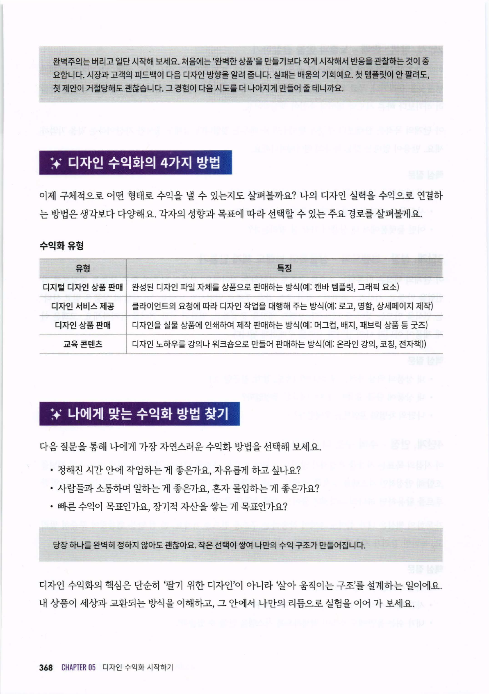

버리고 일단 시작해 보세요. 저음에는 작게 시작해서 반응율 관찰하는 중

고객의 피드백이 알려 줍니다. 실패는 첫 안

괜찮습니다. 그 다음 더

###### | |

###### 이제 구체적으로 어떤 형태로 수익을 낼 수 있는지도 살펴볼까요? 나의 디자인 실력을 수익으로 연결하 는 방법은 생각보다 다양해요. 각자의 성향과 목표에 따라 선택할 수 있는 주요 경로를 살펴볼게요.

수익화유형

_

유형

디지털 디자인 상품 판매 | 완성된 디자인 파일 자제를 상품으로 판매하는 방식(예: 캔바 템플릿, 그래픽 요소)

디자인 서비스 제공 | 클라이언트의 요정에 따라 디자인 작업을 대행해 주는 방식(예: 로고, 명함, 상세페이지 제작) 디자인 상품 판매 | 디자인을 실물 상품에 인쇄하여 제작 판매하는 방식(예: 머그컵, 배지』서브릭 상품 등 굿즈)

교육 콘텐츠 | 디자인 노하우를 강의나 워크숍으로 만들어 판매하는 방식(예: 온라인 강의, 코징, 전자책))

###### | |

다음 질문을 통해 나에게 가장 자연스러운 수익화 방법을 선택해 보세요.

- • 정해진 시간 안에 작업하는 게 좋은가요, 자유롭게 하고 싶나요?
- • 사람들과 소통하며 일하는 게 좋은가요, 혼자 물입하는 게 좋은가요?
- • 빠른수익이 목표인가요, 장기적 자산을 쌓는게 목표인가요?

###### 디자인 수익화의 핵심은 단순히 ‘팔기 위한 디자인’이 아니라 ‘살아 움직이는 구조’를 설계하는 일이에요.

###### 내 상품이 세상과 교환되는 방식을 이해하고, 그 안에서 나만의 리듬으로 실험을 이어 가 보세요.

368 CHAPTER 05 디자인 수익화 시작하기

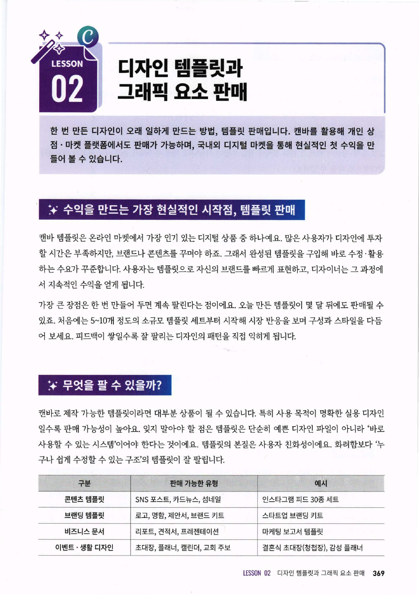

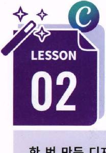

###### 그래픽요소판매

한 번 오래 판매입니다. 상

점 · 가능하며, 디지털 수익을 만

###### I 가장 판매 |

캔바 템플릿은 온라인 마켓에서 가장 인기 있는 디지털 상품 중 하나예요. 많은 사용자가 디자인에 투자

###### 할 시간은 부족하지만, 브랜드나 콘텐츠를 꾸며야 하죠. 그래서 완성된 템플릿을 구입해 바로 수정 ·활용

- 하는 수요가 꾸준합니댜 사용자는 템플릿으로 자신의 브랜드를 빠르게 표현하고, 디자이너는 그 과정에
- 서 지속적인 수익을 얻게 됩니다.

- 가장 큰 장점은 한 번 만들어 두면 계속 팔린다는 점이에요. 오늘 만든 템플릿이 몇 달 뒤에도 판매될 수 있죠 처음에는 5~10개 정도의 소규모 템플릿 세트부터 시작해 시장 반응을 보며 구성과 스타일을 다듬
- 어 보세요. 피드백이 쌓일수록 잘 팔리는 디자인의 패턴을 직접 익히게 됩니다.

###### |

캔바로 제작 가능한 템플릿이라면 대부분 상품이 될 수 있습니다. 특히 사용 목적이 명확한 실용 디자인

일수록 판매 가능성이 높아요. 잊지 말아야 할 점은 템플릿은 단순히 예쁜 디자안 파일이 아니라 ‘바로

사용할 수 있는 시스템'이어야 한다는 것이에요. 템플릿의 본질은 사용자 친화성이에요. 화려함보다 ‘누

구나 쉽게 수정할 수 있는 구조’의 템플릿이 잘 팔립니댜

###### I

|I| |I|
|---|---|---|
|콘텐츠템플릿|SNS 포스트, 카드뉴스, 섬네일|인스타그램 피드 30종 세트|
|브랜딩템플릿|로고, 명함, 제안서, 브랜드 키트|스타트업브랜딩키트|
|비즈니스문서|리포트, 견적서, 프레젠테이션|마케팅보고서 템플릿|
|이벤트·생활디자인|조대장, 플래너, 캘린더, 교회 주보|결혼식 조대장(정접장), 감성 플래너|

LESSON 02 디자인 템플릿과 그래픽 요소 판매 369

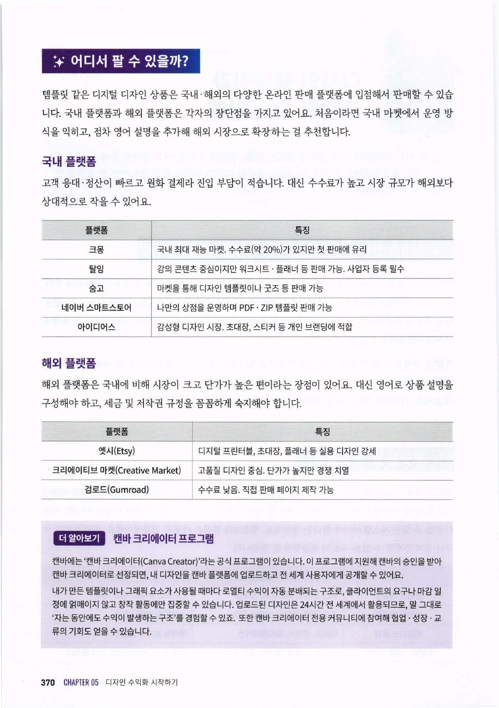

###### | |

###### 템플릿 같은 디지털 디자인 상품은 국내 ·해외의 다양한 온라인 판매 플랫폼에 입점해서 판매할 수 있습 니다. 국내 플랫폼과 해외 플랫폼은 각자의 장단점을 가지고 있어요. 처음이라면 국내 마켓에서 운영 방

식을 익히고, 점차 영어 설명을 추가해 해외 시장으로 확장하는 걸 추천합니댜

###### 국내플랫폼

고객 응대 정산이 빠르고 원화 결제라 진입 부담이 적습니댜 대신 수수료가 높고 시장 규모가 해외보다 상대적으로 작을 수 있어요.

국내 최대 재능 마켓 수수료(약 20%）가 있지만 첫 판매에 유리

크몽

강의 콘텐츠 중심이지만 워크시트 · 플래너 등 판매 가능. 사업자 등록 필수

###### 탈잉

마켓을 통해 디자인 템플릿이나 굿즈 등 판매 가능 나만의 상점을 운영하며 PDF · ZIP 템플릿 판매 가능

숨고

네이버스마트스토어

감성형 디자인 시장. 조대장, 스티커 등 개인 브랜딩에 적합

아이디어스

해외 플랫폼은 국내에 비해 시장이 크고 단가가 높은 편이라는 장점이 있어요. 대신 영어로 상품 설명을

###### 구성해야 하고, 세금 및 저작권 규정을 꼼꼼하게 숙지해야 합니댜

플랫폼 |

엣시{Etsy) | 디지털 프린터블 조대장, 플래너 등 실용 디자인 강세 크리에이티브 마켓{Creative Market) | 고품질 디자인 중십 단가가 높지만 경쟁 지열

검로드(Gumroad) | 수수료 낮음 직접 판매 페이지 제작 가능

- 켄바크리에이터(CanvaCreator)’라는공식프로그램이있습니다.이프로그램에지원해캔바의승인을받아 캔바 크리에이터로 선정되면, 내 디자인을 캔바 전 세계 사용자에게 공개할 수 있어요. 내가 만든 요소가 때마다 수익이 분배되는 구조로, 마감 일

얽매이지 않고 장작 활동에만 집중할 수 있습니다. 전 세계에서 말 그대로 ‘자는동안에도수익이 발생하는구조’를 경험할수 있죠. 또한캔바크리에이터 전용커뮤니티에 참여해 · · 교

기회도 수 있습니다.

370 CHAPTER 05 디자인 수익화 시작하기

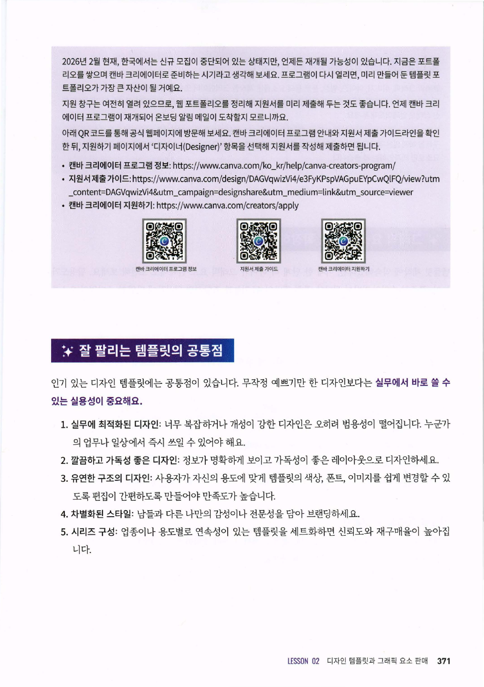

현재, 한국에서는 신규 모집이 중단되어 있는 상태지만, 언제든 재개될 가능성이 있습니다. 지금은 리오를쌓으며 캔바크리에이터로준비하는시기라고생각해보세요.프로그램이 다시 열리면,미리

가장 큰 될 거예요.

장구는 여전히 열려 웹 지원서를 미리 두는 것도 좋습니다. 크리

에이터 아래 QR 코드를통해 공식 웹페이지에 보세요. 캔바크리에이터 프로그램 안내와지원서 제출 가이드라인을확인

한 뒤, 지원하기 페이지에서 ‘디자이너(Designer)' 선택해 됩니다.

- • 캔바 크리에이터 프로그램 정보: https://www.canva.com/ko_kr/help/canva-creators-program/
- • 지원서 https://www.canva.com/design/DAGVqwizVi4/e3FyKPspVAGpuEYpCwQIFQjview?utm _content=DAGVqwizVi4&utm_campaign=designshare&utm_medium=link&utm_source=viewer
- • 캔바 크리에이터 지원하기: https://www.canva.com/creators/apply

캔바 프로그램 정보

###### I

인기 있는 디자인 템플릿에는 공통점이 있습니다. 무작정 예쁘기만 한 디자인보다는 실무에서 바로 쓸 수 있는 실용성이 중요해요.

- 1. 실무에 죄적화된 디자인: 너무 복잡하거나 개성이 강한 디자인은 오히려 범용성이 떨어집니다. 누군가 의 업무나 일상에서 즉시 쓰일 수 있어야 해요.
- 2. 깔끔하고 가독성 좋은 디자인: 정보가 명확하게 보이고 가독성이 좋은 레이아웃으로 디자인하세요.
- 3. 유연한 구조의 디자인: 사용자가 자신의 용도에 맞게 템플릿의 색상, 폰트, 이미지를 쉽게 변경할 수 있 도록 편집이 간편하도록 만들어야 만족도가 높습니다.
- 4. 차별화된 스타일: 남들과 다른 나만의 감성이나 전문성을 담아 브랜딩하세요.
- 5. 시리즈 구성: 업종이나 용도별로 연속성이 있는 템플릿을 세트화하면 신뢰도와 재구매율이 높아집 니댜

LESSON 02 디자인 템플릿과 그래픽 요소 판매 371

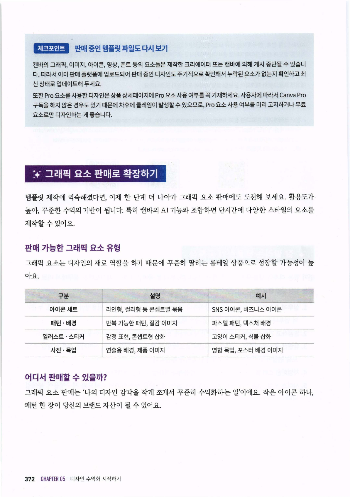

###### - 판매중인 템플릿파일도다시보기

캔바의 그래픽, 이미지, 아이콘, 영상, 폰트 등의 요소들은 제작한 크리에이터 또는 캔바에 의해 게시 중단될 수 있습니 다. 이미 판매 판매 중인 주기적으로 누락된 요소가 죄

신 상태로 업데이트해 두세요.

또한 Pro요소를 사용한 디자인은 상품 상세페이지에 Pro 요소 사용 여부를 꼭 사용자에 따라서 Canva Pro 구독을 하지 않은 경우도 있기 때문에 자후에 수 Pro요소 사용 여부를 미리 고지하거나 무료

요소로만 디자인하는 게 좋습니다.

###### | |

###### 템플릿 제작에 익숙해졌다면, 이제 한 단계 더 나아가 그래픽 요소 판매에도 도전해 보세요. 활용도가

###### 높아, 꾸준한 수익의 기반이 됩니댜 특히 캔바의 AI 기능과 조합하면 단시간에 다양한 스타일의 요소를

제작할수있어요.

###### 판매 가능한 그래픽 요소 유형

###### 그래픽 요소는 디자인의 재료 역할을 하기 때문에 꾸준히 팔리는 롱테일 상품으로 성장할 가능성이 높

- 아요.

|I| |예Al|
|---|---|---|
|아이콘세트|라인형, 컬러형 등 콘셉트별 묶음|SNS 아이콘, 비즈니스 아이콘|
|패턴·배경|반복 가능한 패턴, 질감 이미지|파스텔 패턴, 텍스처 배경|
|일러스트·스티커|감정 표현, 콘셉트형 삽화|고양이 스티커, 식물 삽화|
|사진·목업|연줄용 배경, 제품 이미지|명함 목업, 포스터 배경 이미지|

###### I I

###### 어디서 수 있을까?

그래픽 요소 판매는 ‘나의 디자인 감각을 작게 쪼개서 꾸준히 수익화하는 일’이에요. 작은 아이콘 하나,

패턴 한 장이 당신의 브랜드 자산이 될 수 있어요.

372 CHAPTER 05 디자인 수익화 시작하기

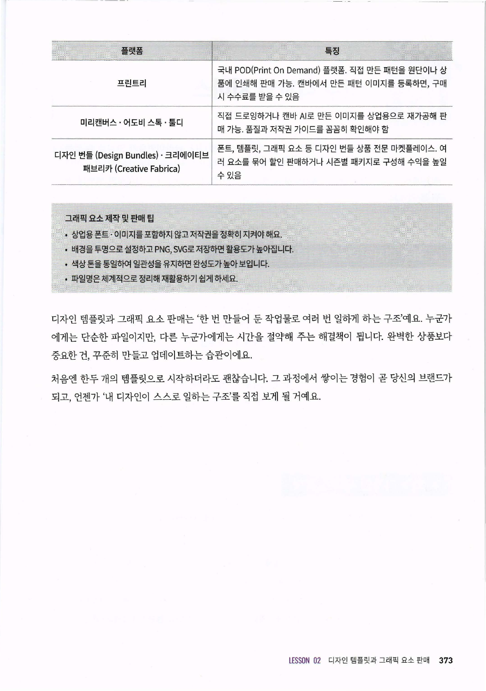

###### I

-,0

국내 POD(Print On Demand) 플랫폼 직접 만든 패턴을 원단이나 상

프린트리

품에 인쇄해 판매 가능 캔바에서 만든 패턴 이미지를 등록하면, 구매

시수수료를받을수있음

직접 드로잉하거나 캔바 Al로 만든 이미지를 상업용으로 재가공해 판 매 가능 품질과 저작권 가이드를 꼼꼼히 확인해야 함

미리캔버스 · 어도비 스톡 · 툴디

디자인 번들(Design Bundles) ·크리에이티브|

폰트, 템플릿, 그래픽 요소 등 디자인 번들 상품 전문 마켓플레이스. 여 러 요소를 묶어 할인 판매하거나 시즌별 패키지로 구성해 수익을 높일

패브리카 (Creative Fabrica)

수있음

- • ·
- • • •

디자인 템플릿과 그래픽 요소 판매는 ‘한 번 만들어 둔 작업물로 여러 번 일하게 하는 구조'예요. 누군가

###### 에게는 단순한 파일이지만, 다른 누군가에게는 시간을 절약해 주는 해결책이 됩니다. 완벽한 상품보다

중요한 건, 꾸준히 만들고 업데이트하는 습관이에요.

###### 처음엔 한두 개의 템플릿으로 시작하더라도 괜찮습니다. 그 과정에서 쌓이는 경험이 곧 당신의 브랜드가

###### 되고, 언젠가 ‘내 디자인이 스스로 일하는 구조’를 직접 보게 될 거예요.

LESSON 02 디자인 템플릿과 그래픽 요소 판매 373

