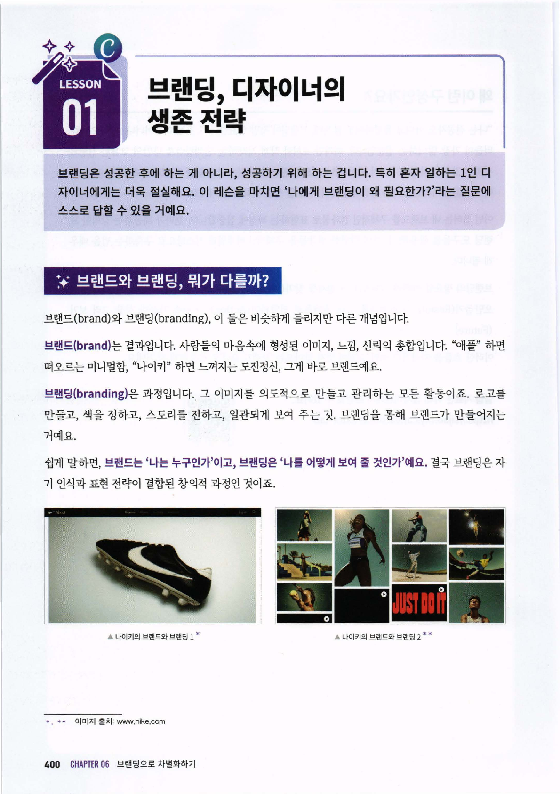

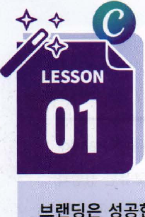

###### 브렌딩,디자이너의


후에 하는 아니라, 성공하기 위해 하는 겁니다. 특히 혼자 일하는 1인 디

###### 자이너에게는 더욱 이 마치면 ‘나에게 브랜딩이 왜 필요한가?’라는 질문에

수 거예요.

###### |

브랜드(brand)와 브랜딩(branding), 이 둘은 비슷하게 들리지만 다른 개념입니다.

브랜드(brand)는 결과입니다. 사람들의 마음속에 형성된 이미지, 느낌, 신뢰의 총합입니다. "애플'’ 하면

떠오르는 미니멀함, “나이키" 하면 느껴지는 도전정신, 그게 바로 브랜드예요.

###### (branding)은 과정입니댜 그 이미지를 의도적으로 만들고 관리하는 모든 활동이죠. 로고를

만들고, 색을 정하고, 스토리를 전하고, 일관되게 보여 주는 것. 브랜딩을 통해 브랜드가 만들어지는

거예요.

###### 쉽게 말하면, 브랜드는 ‘나는 누구인가’이고, ‘나를 어떻게 보여 줄 것인가'예요. 결국 브랜딩은 자

기 인식과 표현 전략이 결합된 창의적 과정인 것이죠.

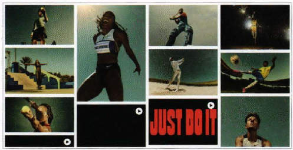

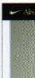


```

•• •

^나이키의 브랜드와브랜딩 1* ....나이키의브랜드와브랜딩2**

*. ** 이미지 출처: www.nike.com

400 CHAPTER 06 브랜딩으로 자별화하기

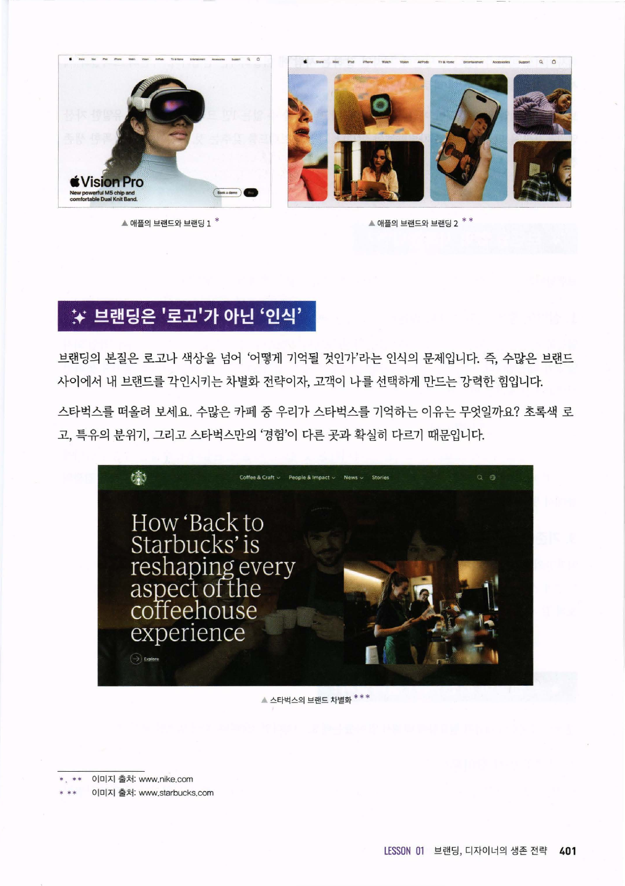

###### • - - ~ -- - - - ..,._ .서-나

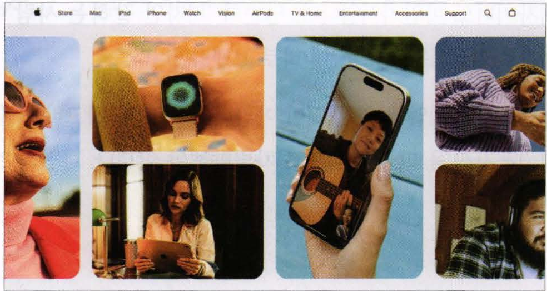

• - - - - - - - · ·- - - - Q 0

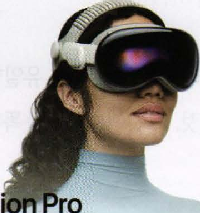

t1Vis

###### com-NmM Dull Bond.

###### 루 -

~ 애플의 브랜드와브랜딩 1 *

... 애플의 브랜드와브랜딩 2 **

###### | |

브랜딩의 본질은 로고나 색상을 넘어 ‘어떻게 기억될 것인가’라는 인식의 문제입니다. 즉, 수많은 브랜드 사이에서 내 브랜드를 각인시키는 차별화 전략이자, 고객이 나를 선택하게 만드는 강력한 힘입니다.

스타벅스를 떠올려 보세요. 수많은 카페 중 우리가 스타벅스를 기억하는 이유는 무엇일까요? 초록색 로 고, 특유의 분위기, 그리고 스타벅스만의 ‘경험'이 다른 곳과 확실히 다르기 때문입니다.

& l"'’ 누 µPopP b News , 'm·'C`

## .r

` '

, -

『

###### .1

.`‘

‘

펠 use e

• ‘

{7 <' r

F .-

다 '’

''''""

스타벅스의 브랜드 자별화 ***

- *. ** 이미지 출처: www.nike.com
- * ** 이미지 출처: www.starbucks.com


LESSON 01 브랜딩, 디자이너의 생존 전략 401

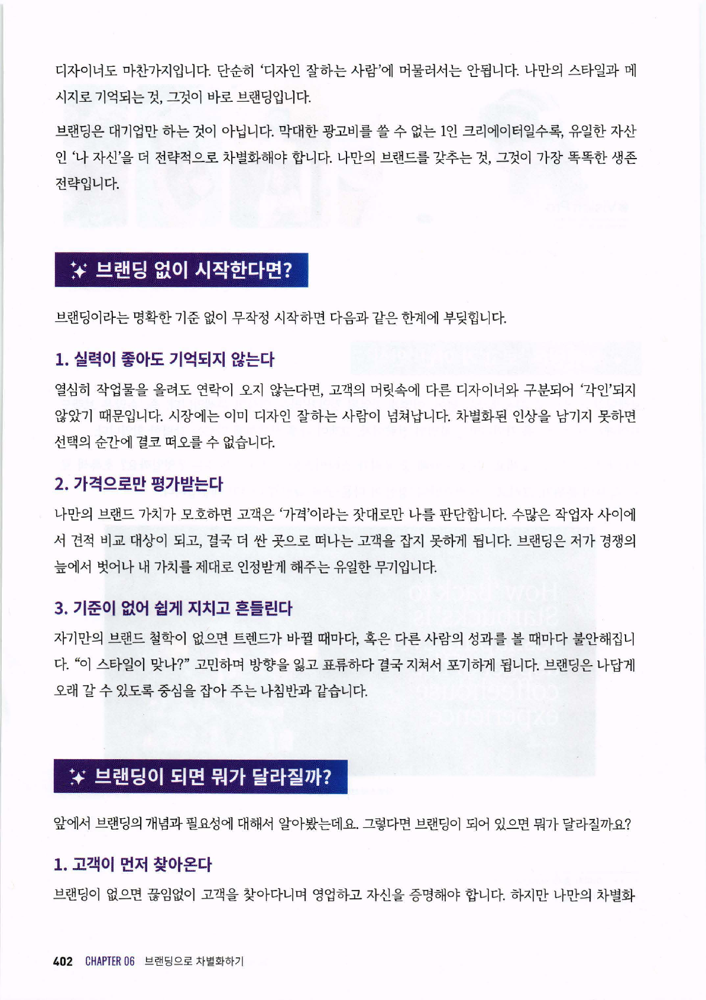

###### 디자이너도 마찬가지입니다. 단순히 ‘디자인 잘하는 사람’에 머물러서는 안됩니다. 나만의 스타일과 메

시지로 기억되는 것, 그것이 바로 브랜딩입니다.

브랜딩은 대기업만 하는 것이 아닙니댜 막대한 광고비를 쓸 수 없는 1인 크리에이터일수록, 유일한 자산 인 ‘나 자신’을 더 전략적으로 차별화해야 합니다. 나만의 브랜드를 갖추는 것, 그것이 가장 똑똑한 생존

전략입니다.

###### | I

브렌딩이라는 명확한 기준 없이 무작정 시작하면 다움과 같은 한계에 부딪힙니다.

###### 1. 실력이 좋아도 기억되지 않는다

열심히 작업물을 올려도 연락이 오지 않는다면, 고객의 머릿속에 다른 디자이너와 구분되어 ‘각인'되지

않았기 때문입니다. 시장에는 이미 디자인 잘하는 사람이 넘쳐납니다. 차별화된 인상을 남기지 못하면

선택의 순간에 결코 떠오를 수 없습니댜

###### 2. 가격으로만

- 나만의 브랜드 가치가 모호하면 고객은 ‘가격'이라는 잣대로만 나를 판단합니댜 수많은 작업자 사이에 서 견적 비교 대상이 되고, 결국 더 싼 곳으로 떠나는 고객을 잡지 못하게 됩니다. 브랜딩은 저가 경쟁의 늪에서 벗어나 내 가치를 제대로 인정받게 해주는 유일한 무기입니다.

3. 기준이 없어 쉽게 지지고

- 자기만의 브랜드 철학이 없으면 트렌드가 바뀔 때마다, 혹은 다른 사람의 성과를 볼 때마다 불안해집니


###### 다. “이 스타일이 맞나?” 고민하며 방향을 잃고 표류하다 결국 지쳐서 포기하게 됩니댜 브랜딩은 나답게

오래 갈 수 있도록 중심을 잡아 주는 나침반과 같습니다.

###### |

앞에서 브랜딩의 개념과 필요성에 대해서 알아봤는데요. 그렇다면 브랜딩이 되어 있으면 뭐가 달라질까요?

###### 1. 고객이 먼저 잦아온다

###### 브랜딩이 없으면 끊임없이 고객을 찾아다니며 영업하고 자신을 증명해야 합니다. 하지만 나만의 차별화

402 브랜딩으로 자별화하기

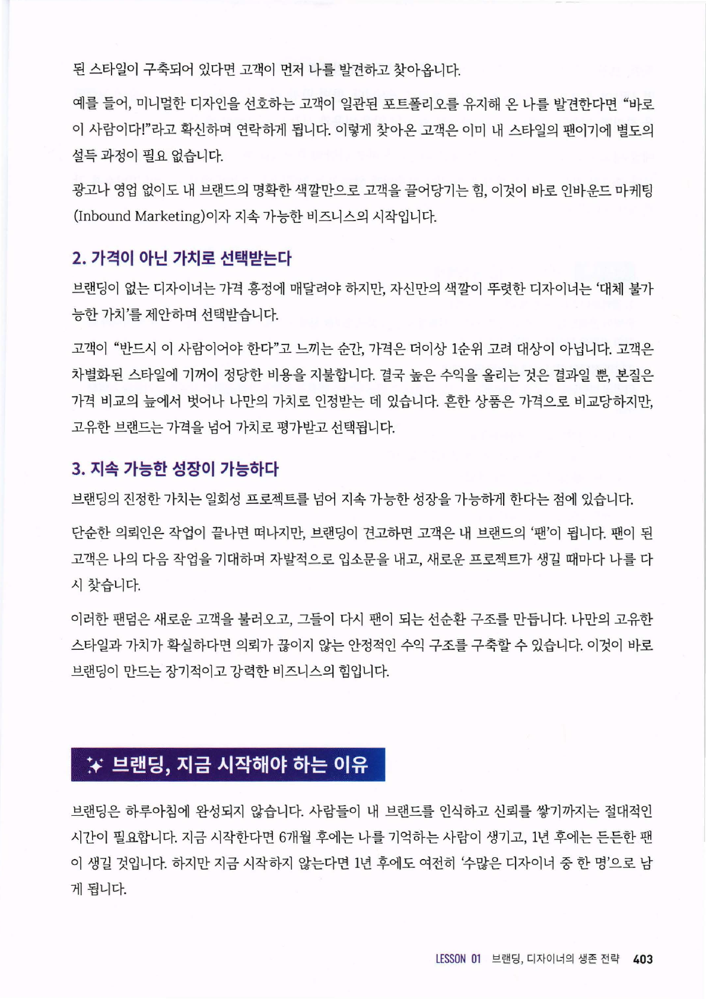

된 스타일이 구축되어 있다면 고객이 먼저 나를 발견하고 찾아옵니다.

예를 들어, 미니멀한 디자인을 선호하는 고객이 일관된 포트폴리오를 유지해 온 나를 발견한다면 "바로

이 사람이다!”라고 확신하며 연락하게 됩니다. 이렇게 찾아온 고객은 이미 내 스타일의 팬이기에 별도의

설득 과정이 필요 없습니다.

광고나 영업 없이도 내 브랜드의 명확한 색깔만으로 고객을 끌어당기는 힘, 이것이 바로 인바운드 마케팅

(Inbound Marketing)이자 지속 가능한 비즈니스의 시작입니다.

###### 2. 가격이 아닌 가치로 선택받는다

브랜딩이 없는 디자이너는 가격 홍정에 매달려야 하지만, 자신만의 색깔이 뚜렷한 디자이너는 ‘대체 불가

능한가치’를제안하며 선택받습니다.

고객이 ‘‘반드시 이 사람이어야 한다"고 느끼는 순간, 가격은 더이상 1순위 고려 대상이 아닙니다. 고객은 차별화된 스타일에 기꺼이 정당한 비용을 지불합니다. 결국 높은 수익을 올리는 것은 결과일 뿐, 본질은 가격 비교의 늪에서 벗어나 나만의 가치로 인정받는 데 있습니댜 흔한 상품은 가격으로 비교당하지만,

고유한 브랜드는 가격을 넘어 가치로 평가받고 선택됩니다.

###### 3. 지속 가능한 성장이 가능하다

브랜딩의 진정한 가치는 일회성 프로젝트를 넘어 지속 가능한 성장을 가능하게 한다는 점에 있습니다.

단순한 의뢰인은 작업이 끝나면 떠나지만, 브랜딩이 견고하면 고객은 내 브랜드의 ‘팬'이 됩니다. 팬이 된

고객은 나의 다음 작업을 기대하며 자발적으로 입소문을 내고, 새로운 프로젝트가 생길 때마다 나를 다

시찾습니댜

이러한 팬덤은 새로운 고객을 불러오고, 그들이 다시 팬이 되는 선순환 구조를 만듭니다. 나만의 고유한 스타일과 가치가 확실하다면 의뢰가 끊이지 않는 안정적인 수익 구조를 구축할 수 있습니다. 이것이 바로

브렌딩이 만드는 장기적이고 강력한 비즈니스의 힘입니다.

###### | |

브랜딩은 하루아침에 완성되지 않습니댜 사람들이 내 브랜드를 인식하고 신뢰를 쌓기까지는 절대적인

시간이 필요합니다. 지금 시작한다면 6개월 후에는 나를 기억하는 사람이 생기고, 1년 후에는 든든한 팬 이 생길 것입니다. 하지만 지금 시작하지 않는다면 1년 후에도 여전히 ‘수많은 디자이너 중 한 명’으로 남

게됩니댜

01 브랜딩, 디자이너의 생존 전략 403

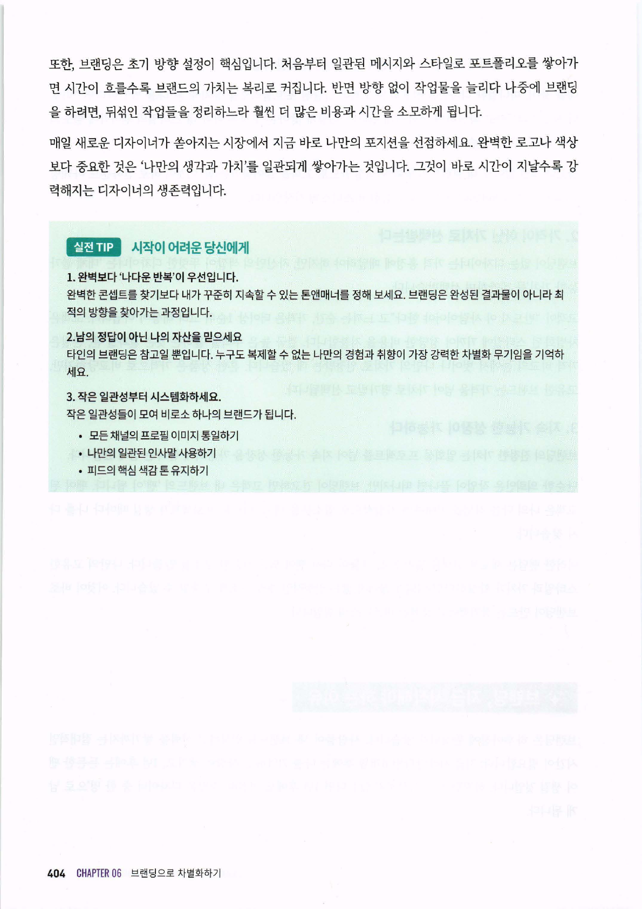

또한, 브랜딩은 초기 방향 설정이 핵심입니댜 처음부터 일관된 메시지와 스타일로 포트폴리오를 쌓아가

###### 면 시간이 흐를수록 브랜드의 가치는 복리로 커집니다. 반면 방향 없이 작업물을 늘리다 나중에 브랜딩

을 하려면, 뒤섞인 작업들을 정리하느라 훨씬 더 많은 비용과 시간을 소모하게 됩니다.

매일 새로운 디자이너가 쏟아지는 시장에서 지금 바로 나만의 포지션을 선점하세요. 완벽한 로고나 색상 보다 중요한 것은 ‘나만의 생각과 가치’를 일관되게 쌓아가는 것입니다. 그것이 바로 시간이 지날수록 강 력해지는 디자이너의 생존력입니다.

###### 시작이 어려운당신에게

1. '이 우선입니다.

내가 꾸준히 지속할 수 정해 . 아니라

.

수 없는 나만의

3. 작은

비로소

• • • 핵심 톤유지하기

404 CHAPTER 06 브랜딩으로 자별화하기

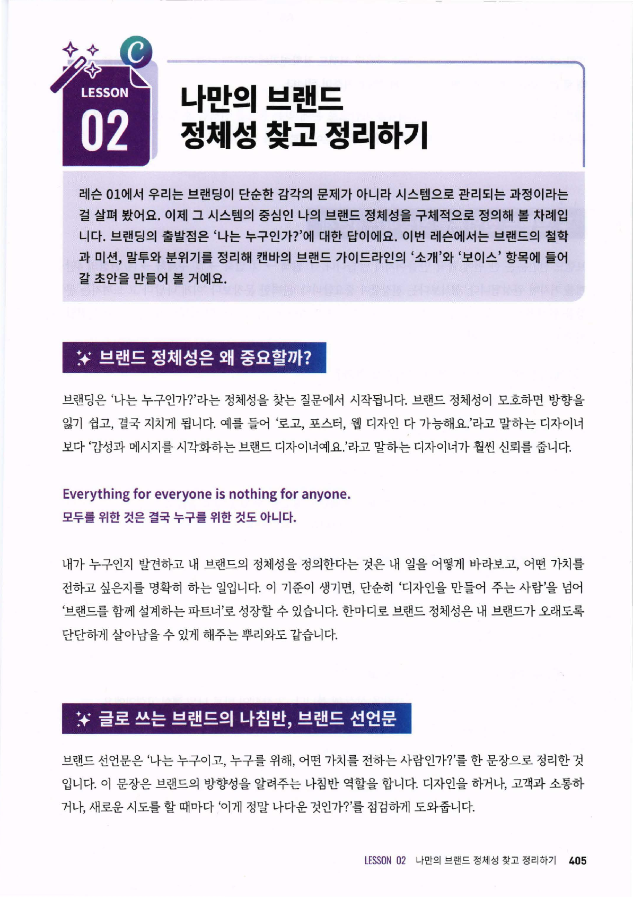

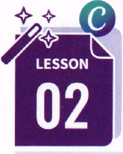

###### 나만의브랜드 정체성찾고정리하기

01에서 우리는 문제가 아니라

살펴 봤어요. 이제 그 시스템의 증심인 나의 브랜드 구체적으로 정의해 볼 차례입

니다. 브랜딩의 ‘나는 '에 . 이번 과 미션, 말투와 분위기를 브랜드 ‘소개' ‘보이스’

볼 거예요.

###### | :-f 브랜드 왜 |

###### 브랜딩은 ‘나는 누구인가?'라는 정체성을 찾는 질문에서 시작됩니다. 브랜드 정체성이 모호하면 방향을

잃기 쉽고, 결국 지치게 됩니다. 예를 들어 ‘로고, 포스터, 웹 디자인 다 가능해요.’라고 말하는 디자이너

보다 ‘감성과 메시지를 시각화하는 브랜드 디자이너예요.’라고 말하는 디자이너가 훨씬 신뢰를 줍니다.

###### Everything for everyone is nothing for anyone.

모두를 위한 것은 결국 누구를 위한 것도 아니다.

내가 누구인지 발견하고 내 브랜드의 정체성을 정의한다는 것은 내 일을 어떻게 바라보고, 어떤 가치를

###### 전하고 싶은지를 명확히 하는 일입니다. 이 기준이 생기면, 단순히 ‘디자인을 만들어 주는 사람’을 넘어

‘브랜드를 함께 설계하는 파트너'로 성장할 수 있습니다. 한마디로 브랜드 정체성은 내 브랜드가 오래도록

단단하게 살아남을 수 있게 해주는 뿌리와도 같습니다.

###### | :~ 쓰는 브랜드의 |

브랜드 선언문은 ‘나는 누구이고, 누구를 위해, 어떤 가치를 전하는 사람인가?'를 한 문장으로 정리한 것 입니다. 이 문장은 브랜드의 방향성을 알려주는 나침반 역할을 합니다. 디자인을 하거나, 고객과 소통하

거나, 새로운 시도를 할 때마다 ‘이계 정말 나다운 것인가?'를 점검하게 도와줍니다.

LESSON 02 나만의 브랜드 정제성 잦고 정리하기 405

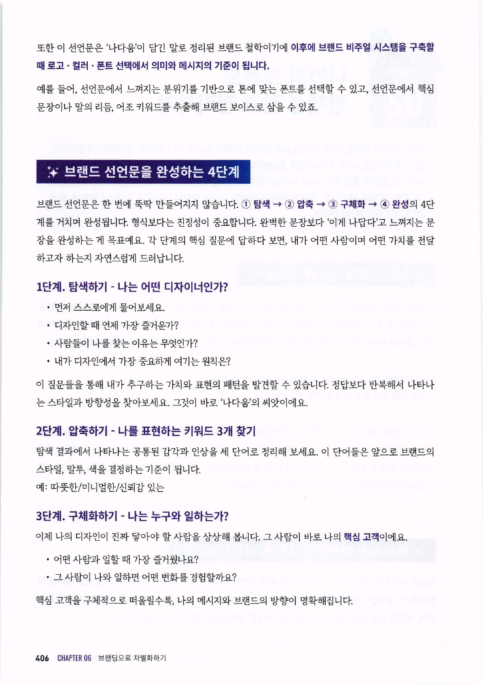

###### 또한 이 선언문은 ‘나다움’이 담긴 말로 정리된 브랜드 철학이기에 이후에 브랜드 비주얼 구축할

때 로고 • 컬러 • 폰트 선택에서 의미와 메시지의 기준이 됩니다.

예를 들어, 선언문에서 느껴지는 분위기를 기반으로 톤에 맞는 폰트를 선택할 수 있고, 선언문에서 핵심

문장이나 말의 리듬, 어조 키워드를 추출해 브랜드 보이스로 삼을 수 있죠.

###### | 브랜드 ]

브랜드 선언문은 한 번에 뚝딱 만들어지지 않습니다. ® ➔ ® ➔ ® 구체화 ➔ ® 완성의 4단

계를 거치며 완성됩니다. 형식보다는 진정성이 중요합니다. 완벽한 문장보다 ‘이계 나답다'고 느껴지는 문 장을 완성하는 게 목표예요. 각 단계의 핵심 질문에 답하다 보면, 내가 어떤 사람이며 어떤 가치를 전달 하고자 하는지 자연스럽게 드러납니다.

- 1단계. 탐색하기 - 나는 어떤 디자이너인가?

- • 먼저 스스로에게 물어보세요.
- • 디자인할때언제가장즐거운가?
- • 사람들이 나를 찾는 이유는 무엇인가?
- • 내가디자인에서가장중요하게여기는원칙은?


이 질문들을 통해 내가 추구하는 가치와 표현의 패턴을 발견할 수 있습니다. 정답보다 반복해서 나타나

는 스타일과 방향성을 찾아보세요. 그것이 바로 ‘나다움’의 씨앗이에요.

- 2단계. 압축하기 - 나를 표현하는 키워드 3개 찾기 탐색 결과에서 나타나는 공통된 감각과 인상을 세 단어로 정리해 보세요. 이 단어들은 앞으로 브렌드의 스타일, 말투, 색을 결정하는 기 준이 됩니다. 예: 따뜻한/미니멀한/신뢰감 있는
- 3단계. 구체화하기 - 나는 누구와 일하는가? 이제 나의 디자인이 진짜 닿아야 할 사람을 상상해 봅니다. 그 사람이 바로 나의 핵심 고객이에요.


- • 어떤사람과일할때가장 즐거웠나요?
- • 그 사람이 나와일하면 어떤 변화를 경험할까요?


###### 핵심 고객을 구체적으로 떠올릴수록, 나의 메시지와 브렌드의 방향이 명확해집니댜

406 CHAPTER 06 브랜딩으로 자별화하기

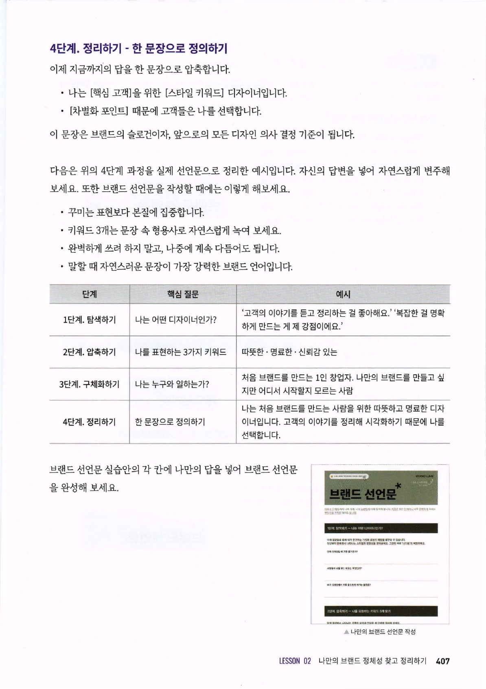

###### 4단계. 정리하기 - 한 문장으로

###### 이제 지금까지의 답을 한 문장으로 압축합니다.

- • 나는 [핵심 고객]을 위한 [스타일 키워드] 디자이너입니다.
- • [차별화 포인트] 때문에 고객들은 나를 선택합니다.


이 문장은 브랜드의 슬로건이자, 앞으로의 모든 디자인 의사 결정 기준이 됩니다.

다음은 위의 4단계 과정을 실제 선언문으로 정리한 예시입니다. 자신의 답변을 넣어 자연스럽게 변주해

###### 보세요. 또한 브랜드 선언문을 작성할 때에는 이렇게 해보세요.

- • 꾸미는표현보다본질에 집중합니다.
- • 키워드 3개는 문장 속 형용사로 자연스럽게 녹여 보세요.
- • 완벽하게 쓰려 하지 말고, 나중에 계속 다듬어도 됩니다.
- • 말할때자연스러운문장이가장강력한브랜드언어입니다.


###### I

| | | |
|---|---|---|
|1단계.탐색하기|나는 어떤 디자이너인가?|‘고객의 이야기를 듣고 정리하는 걸 좋아해요.' ‘복잡한 걸 명확 하게 만드는 게 제 강점이에요.'|
|2단계.압측하기|나를 표현하는 3가지 키워드|따뜻한 · 명료한 · 신뢰감 있는|
|3단계.구제화하기|나는누구와일하는가?|저음 브랜드를 만드는 1인 창업자. 나만의 브랜드를 만들고 싶<br><br>지만어디서 시작할지 모르는사람|
|4단계.정리하기|한문장으로정의하기|나는 저음 브랜드를 만드는 사람을 위한 따뜻하고 명료한 디자 이너입니다 고객의 이야기를 정리해 시각화하기 때문에 나를 선택합니다.|


##### 브랜드선언문실습안의각칸에나만의답을넣어브렌드선언문 |

·

울완성해보세요.

—........""＇1"t가와 . 었

.. t뻔..나...,.••탄""....냐헬•••r.-u••빽’`""

·•m지R연아드.냐

.......어’mIt스-............,.....기여...- ..

###### ...............

서"“u...........

...."“가....."*·um

—^나만의브랜드선언문작성

LESSON 02 나만의 브랜드 정제성 찾고 정리하기 407

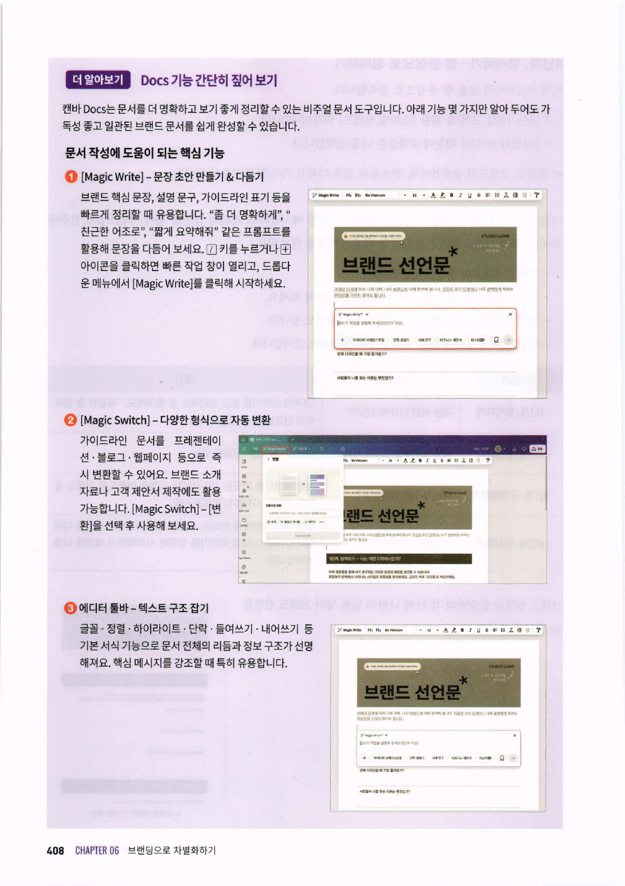

# - Docs 짚어

캔바 Docs는 문서를 더 보기 좋게 수 있는 문서 도구입니다. 아래 기능 몇 두어도 가

독성 좋고 문서를 쉽게 수

문서 작성에 도음이 되는 헥십 기능

0 [Magic Write] -문장조안만들기 & 다듬기

-

구·

/ 白*"" H,H, ..- - u -스으 B I U 6 『 I三 i 머 ·

핵심 문장, 문구, 가이드라인 표기

빠르게 때 유용합니다 "좀 더 명확하게'’, ”

"짧게 요약해줘'’ 같은

다듬어 보세요. 띠 키를 누르거나 아이콘을 클릭하면 빠른 작업 장이 열리고,

운 메뉴에서 [Magic Write]를 클릭해 시작하세요.

어대혈단"＇이피""~나.e..이..랍댈빼"'U 시Be츠’Ig첫OI니L1.E.,빼게빼려는

###### •~11,,1시’

I

y ......ho• V


....., 뗀연, 리스.II)

k머 01:ll l •W••빼a,··..,,

g

###### +

”"'"0l쁘빼면^••

S 다자인•• "".기‘기1

가?

8 [Magic Switch] - 다양한형식으로자동변환

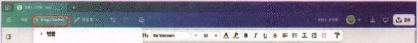

문서를 프레젠테이

2·_

션 · 블로그·웹페이지 즉

시 수 . 소개 자료나 고객 제안서 제작에도 가능합니다. [MagicSwitch] - ［변

E.•

三' ....

'e:U .

###### .....

••• o . ..... M •••

# —

.........땔• U서守U•....기...


露떠S 警띠

L"Ill-o.x

###### ..기 ."....'

,-

•• _ .. 그릇••• .•

.,,__H,H,..- •u.스으IIU6鬱1,l,11•

###### - 텍스트구조잡기

###### -’

글꼴 · 정렬 · · 단락 · 들여쓰기 · 내어쓰기 등

기본서식 리 과정보구조가선명

q

..• ... · ·

해져요. 핵심 메시지를 때 특히

!!亭om ...며 ”t근단에때를....'"' 만t.2 畫언t

,.e`·데•흙,

•1tll'." •“ 다

l

*-~v

`

k’ m· 節"'•

뻔•’ 게"',,..빼 ..... g

e때•;．,

+ 빡*＊”UE...

단촬 ..기

..a•·...,,."'

t

###### 408 브랜딩으로 자별화하기

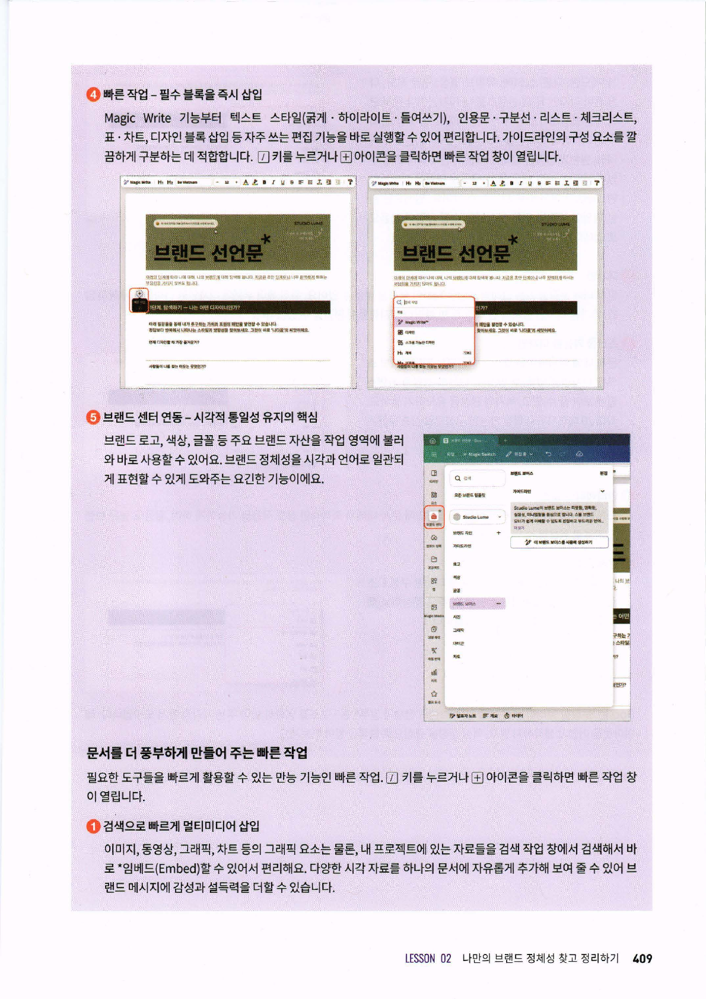

O - 블록을측시

· · · 구분선 · · 표 · 블록 등 수 .

Ul E .

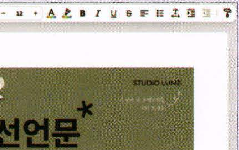

~ -- H, H, ..*- - " • 스 으 I J u s 『 E i 끄 소 'I'

~ -- H, H, ..-


,. ' "‘ 빼`, 一

--- -----

어때u...라O냐.....u.T료단'........ua 건8은•언U개.나’,...뺀．게••k

Q핵헬 q. 냐 .... 凰현도멕 대嶋 •빼빼 ....q e看아니 터게

.님•• 촬니다

서사시엄0됴 탈냐

###### 낱IIIil-|

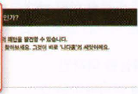

Gh..


내가". ••

’ "**"

던...

Ill o"

었 ...mq"'

...나• ••

—_

H, ..


서 나..먀•贊em


O - 시각적 핵심

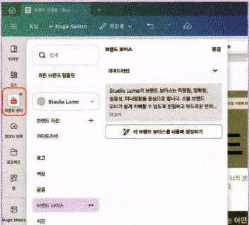

로고, 색상, 수

게 수 Q ”

·---

기이드

모튼

볼 ,뺄 ,

실••'"..."""｀따 ~.

게 야... 할• 드 _

이"'

+

가이됴"연

###### ...

틀

글

###### 스

###### 鬪l

0t

사면

ftg

구岭논

!

었

g

###### ”

을

"

0i


7

더

수 키를 E] 클릭하면 빠른 장

삽입

내 있는

하나의 줄 있어

LESSON 02 나만의 브랜드 정제성 찾고 정리하기 409

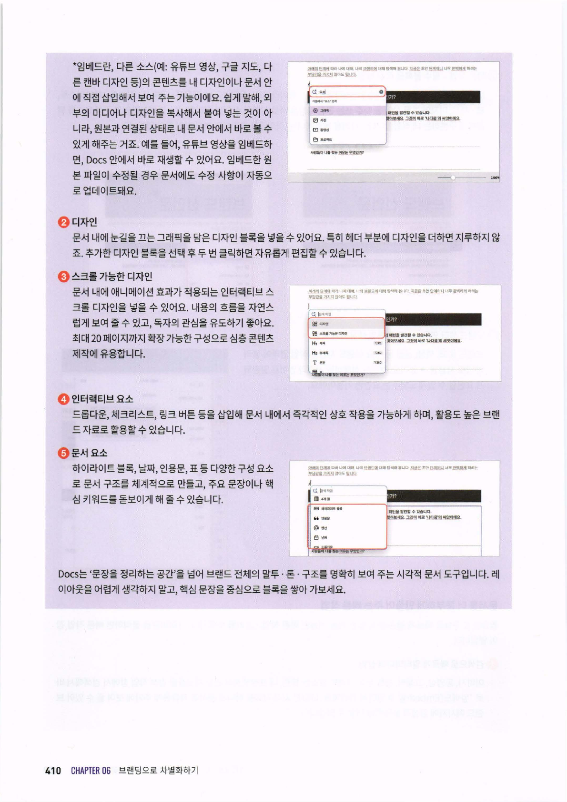

*임베드란, 다른 소스(예: 유튜브 영상, 지도, 다 른 내 문서 안

어때괴e제다나내.나 2드여대 !1색II•LjC/ 진급2 ....E

.iiU昌 S아노 입니던

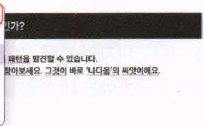

C. ~ 0

주는기능이에요.쉽게말해,외

電기......

® 그

미디어나 붙여 넣는 것이 아 니라, 내 안에서 수

...

E3 ...

e ..”

있게 해주는 거죠. 들어,

때‘이때II는아흙는 """"'

면, Docs 바로 재생할 수 있어요. 임베드한 원 븐 사항이

100"

디자인

문서 내에 끄는 디자인 수 있어요. 특히 헤더 부분에 더하면 지루하지 않

죠. 디자인 후 두 번 수 .

내에 애니메이션 효과가 스

어머엇단계에 따라나에 대"- 니어 보현드에 <11111" 릅니다 지ae 초안 단게이니 히미는

가’Fl U아도 틸"I


크롤 수 있어요. 내용의 흐름을 자연스

###### Q h."

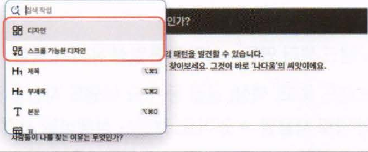

수 있고, 독자의 관심을

-

소•처따

죄대 20 페이지까지 구성으로

H, ... H2 ....

T • • mm

인터랙티브요소

드롭다운, 내에서 즉각적인 가능하게 하며, 브랜

드 자료로 수 있습니다.

문서요소

하이라이트 블록, 날짜, 인용문, 표 등 다양한 구성 요소

아e"따러나.... 나되므던으기대."...aut1 산..인I.!.륀언니너무브빽하게..리는

###### A 1

•'1a홑 . 않아도 털나Q

로 문서 만들고, 주요 문장이나 심 돋보이게 해 줄 수 .

q "

g

E 5

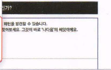

.

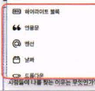

정리하는 공간’을 넘어 전제의 · 톤 · 구조를 보여 주는 시각적 문서 도구입니다. 레

말고, 핵심 쌓아 가보세요.

410 CHAPTER 06 브랜딩으로 자별화하기

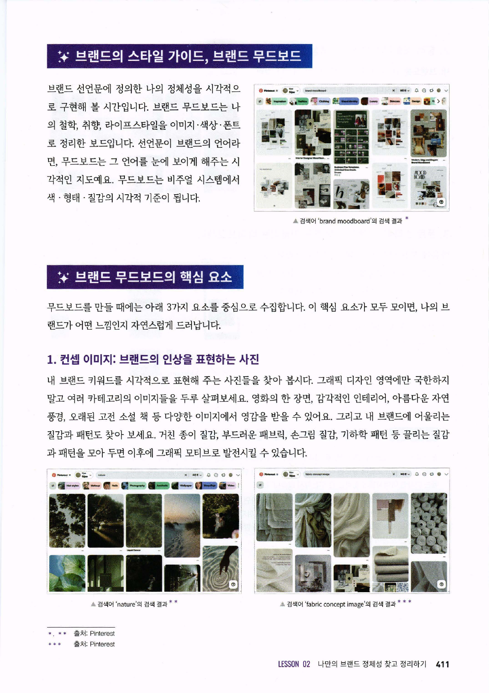

###### |

"`

@- ••=-·---i. 틀-­


브랜드 선언문에 정의한 나의 정체성을 시각적으

X -·달 e e O • v

#### -m._"

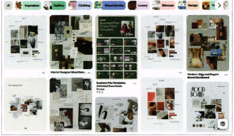

已"

로 구현해 볼 시간입니다 브랜드 무드보드는 나 의 철학, 취향, 라이프스타일을이미지·색상 · 폰트 로 정리한 보드입니다. 선언문이 브랜드의 언어라

J_

i

면, 무드보드는 그 언어를 눈에 보이계 해주는 시 각적인 지도예요. 무드보드는 비주얼 시스템에서 색 · 형태 · 질감의 시각적 기준이 됩니다.

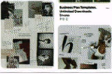

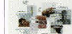

^검색어 ‘brand moodboard’의 검색 결과 *

| |

무드보드를 만들 때에는 아래 3가지 요소를 중심으로 수집합니다. 이 핵심 요소가 모두 모이면, 나의 브 랜드가 어떤 느낌인지 자연스럽게 드러납니다.

- 1. 컨셉 이미지: 브랜드의 인상을 표현하는 사진 내 브랜드 키워드를 시각적으로 표현해 주는 사진들을 찾아 봅시다. 그래픽 디자인 영역에만 국한하지 말고 여러 카테고리의 이미지들을 두루 살펴보세요. 영화의 한 장면, 감각적인 인테리어, 아름다운 자연 풍경, 오래된 고전 소설 책 등 다양한 이미지에서 영감을 받을 수 있어요. 그리고 내 브랜드에 어울리는 질감과 패턴도 찾아 보세요. 거친 종이 질감, 부드러운 패브릭, 손그림 질감, 기하학 패턴 등 끌리는 질감 과 패턴을 모아 두면 이후에 그래픽 모티브로 발전시킬 수 있습니다.


@- • •=-· - x "•• ee()•v 0 •z.v--- x ...v e e O • v

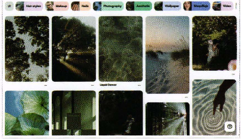

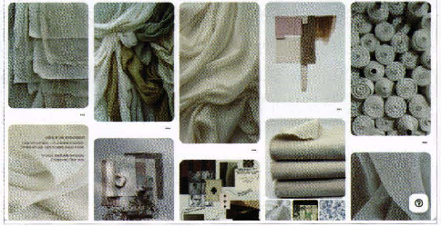

~ 검색어 ‘nature’의 검색 결과** ....검색어 ‘fabricconceptimage’의 검색 결과***

* ' ** 출챠 Pinterest * * * 출처: Pinterest

LESSON 02 나만의 브랜드 정제성 잦고 정리하기 411

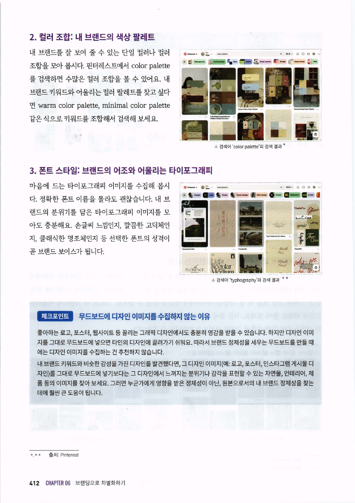

###### 2. 컬러 조합: 내 브랜드의 색상

내 브랜드를 잘 보여 줄 수 있는 단일 컬러나 컬러

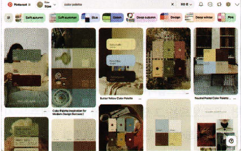

조합을 모아 봅시다. 핀터레스트에서 color palette

룰 검색하면 수많은 컬러 조합을 볼 수 있어요. 내

브랜드 키워드와 어울리는 컬러 팔레트를 찾고 싶다

면 warm color palette, minimal color palette

같은 식으로 키워드를 조합해서 검색해 보세요.

■

~ 검색어 'color palette’의 검색 결과 *

###### 3. 폰트 스타일: 브랜드의 어조와 어울리는 타이포그래피

###### ―

`U’’-._4h,__ ll-

：。

”

0- · • :.v

O

마음에 드는 타이포그래피 이미지를 수집해 봅시 다. 정확한 폰트 이름을 몰라도 괜찮습니다. 내 브 렌드의 분위기를 담은 타이포그래피 이미지를 모

‘

###### I=`-

l

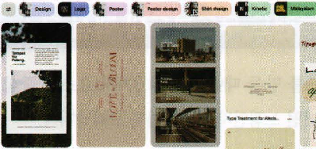

###### 二

"

니

I

. h

14t

.

아도 충분해요. 손글씨 느낌인지, 깔끔한 고딕체인

I

지, 클래식한 명조체인지 등 선택한 폰트의 성격이 곧 브렌드 보이스가 됩니다.

기

~"

I__ -

I쩝

홀

_ nr11

麟麟

###### 트

a

/£

p。graphy 〉

고 ~

I1.

t

W

어

곁

-

- 않는

좋아하는 로고, 포스터, 웹사이트 등 끌리는 영감을 수 디자인 이미

지를 넣으면 디자인에 쉬워요. 따라서 세우는

에는 디자인 이미지를 수집하는 건 주전하지 않습니다.

내 가진 그 이미지(예: 로고, 포스터, 디

그대로 무드보드에 그 디자인에서 느껴지는 분위기나 감각율 수 있는 자연물, 인테리어, 품 등의 이미지를 보세요. 정제성이 아닌, 내 브랜드 찾는

.

출처: Pinterest

###### * * *’

CHAPTER 06 브랜딩으로 자별화하기

412

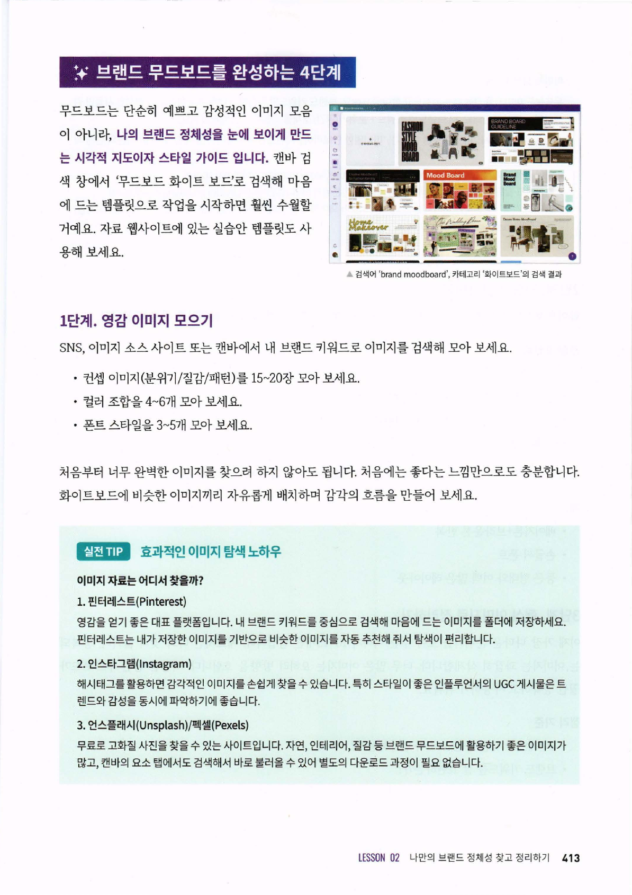

###### | 무드보드를 |

- =_-t

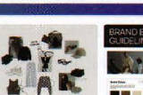

무드보드는 단순히 예쁘고 감성적인 이미지 모음 이 아니라, 나의 브랜드 눈에 보이게

###### ., .

G

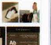

. 2

I 고

,.

♦

###### E 0 •l ·발튠".

·

는 시각적 지도이자 스타일 가이드 입니다. 캔바 검 색 창에서 ‘무드보드 화이트 보드’로 검색해 마음

-t

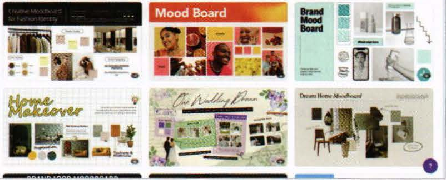

에 드는 템플릿으로 작업을 시작하면 훨씬 수월할

거예요. 자료 웹사이트에 있는 실습안 템플릿도 사

; 1

용해보세요.

검색어 ‘brand moodboard', 카테고리 ‘화이트보드’의 검색 결과

- 1단계. 영감 이미지 모으기 SNS, 이미지 소스 사이트 또는 캔바에서 내 브랜드 키워드로 이미지를 검색해 모아 보세요.


- • 컨셉 이미지(분위기/질감/패턴)를 15~20장 모아 보세요.
- • 컬러 조합을 4~6개 모아 보세요.
- • 폰트 스타일을 3~5개 모아 보세요.


처음부터 너무 완벽한 이미지를 찾으려 하지 않아도 됩니댜 처음에는 좋다는 느낌만으로도 충분합니다. 화이트보드에 비슷한 이미지끼리 자유롭게 배치하며 감각의 흐름을 만들어 보세요.

###### 효과적인이미지탐색노하우

###### 자료는 어디서

- 1. 핀터레스트(Pinterest) 얻기 대표 플랫폼입니다. 내 브랜드 키워드를 중심으로 검색해 마음에 드는 이미지를 폴더에 저장하세요.

핀터레스트는 내가 저장한 이미지를 자동

- 2. 인스타그램(lnstagram) 해시태그를 감각적인 이미지를 손쉽게 수 있습니다. 특히 스타일이 좋은 인플루언서의 UGC 트 렌드와 감성을 동시에 파악하기에 좋습니다.
- 3. 언스플래시(Unsplash)／펙셀(Pexels) 무료로 사진을 찾을 수 있는 사이트입니다. 자연, 등 브랜드 이미지가 많고, 캔바의 요소 탭에서도 바로 불러올 수 있어 별도의 다운로드 과정이 필요 없습니다.


LESSON 02 나만의 브랜드 정제성 잦고 정리하기 413

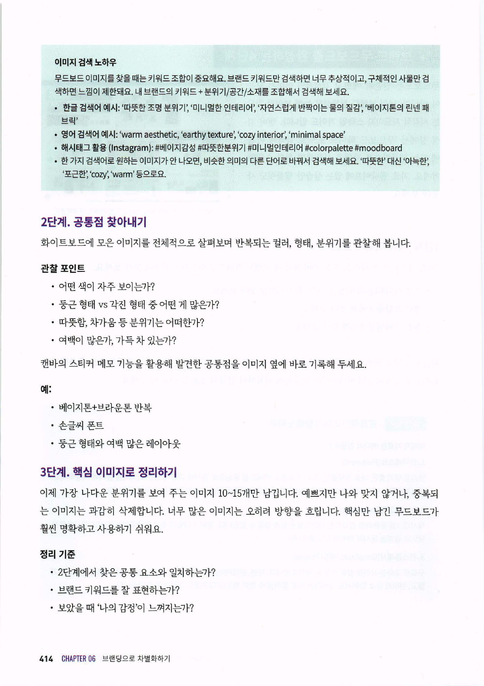

너무 ,

느낌이 . 내 + .

- • 한글 ', ‘ ', ‘ 반짝이는 ’, ‘ 패 브릭'
- • 영어 검색어 예시: ‘warm aesthetic, 'earthy texture', 'co작 interior','minimal space'
- • 해시태그 활용 (lnstagram): #colorpalette #moodboard
- • 한 가지 나오면, . ‘따 ' ', ‘포근한', ‘C0적’, ‘Warm'


- 2단계. 공통점 찾아내기 화이트보드에 모은 이미지를 전체적으로 살펴보며 반복되는 컬러, 형태, 분위기를 관찰해 봅니다.


관찰포인트

- • 어떤 색이 자주 보이는가?
- • 둥근형태 vs 각진 형태 중어떤게 많은가?
- • 따뜻함, 차가움 등 분위기는 어떠한가?
- • 여백이 많은가,가득차있는가?


###### 캔바의 스티커 메모 기능을 활용해 발견한 공통점을 이미지 옆에 바로 기록해 두세요.

예:

- • 베이지톤+브라운톤 반복
- • 손글씨 폰트
- • 둥근형태와여백 많은레이아웃


###### 이미지로 정리하기

이제 가장 나다운 분위기를 보여 주는 이미지 10~15개만 남깁니다. 예쁘지만 나와 맞지 않거나, 중복되 는 이미지는 과감히 삭제합니댜 너무 많은 이미지는 오히려 방향을 흐립니댜 핵심만 남긴 무드보드가

훨씬 명확하고사용하기 쉬워요.

정리기준

- • 2단계에서 찾은공통요소와일치하는가?
- • 브랜드키워드를잘표현하는가?
- • 보았을 때 ‘나의 감정’이 느껴지는가?


414 CHAPTER 06 브랜딩으로 자별화하기

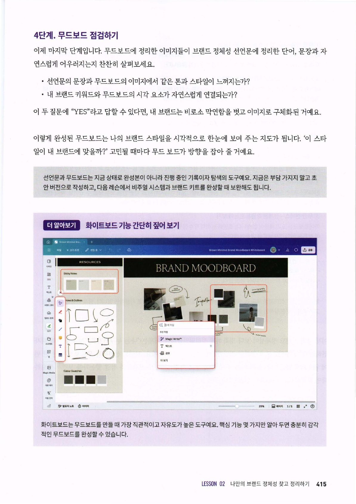

###### 4단계. 무드보드 점검하기

###### 이제 마지막 단계입니댜 무드보드에 정리한 이미지들이 브랜드 정체성 선언문에 정리한 단어, 문장과 자

연스럽게 어우러지는지 찬찬히 살펴보세요.

- • 선언문의 문장과 무드보드의 이미지에서 같은 톤과 스타일이 느껴지는가?
- • 내 브랜드 키워드와 무드보드의 시각 요소가 자연스럽게 연결되는가?


이 두 질문에 "YES"라고 답할 수 있다면, 내 브랜드는 비로소 막연함을 벗고 이미지로 구체화된 거예요.

이렇게 완성된 무드보드는 나의 브랜드 스타일을 시각적으로 한눈에 보여 주는 지도가 됩니다. ‘이 스타

일이 내 브렌드에 맞을까?' 고민될 때마다 무드 보드가 방향을 잡아 줄 거예요.

완성본이 아니라 . 때

# I-:

T:::~ ,imw, iT\'"';'"'’’’'"''\ m|

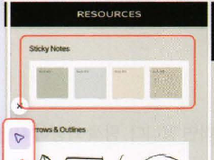

디

###### H .

.`‘:C""三」

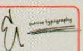

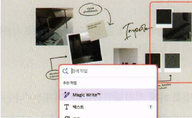

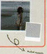

a, I '- '\' I I ( <

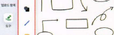

###### Qo

###### l> 三

###### ""

요怨·

###### F토

]

·

'"'

T

T “스

體

.ll.l 먀


더보기

尔

rm,Tl •L'..

""

###### .... ■■■

컸’


?탈m’고 O 印 . .... {iil lfOl'I 1 / 1 ••

화이트보드는 무드보드를 때 가장 고 자유도가 높은 도구예요. 핵심 기능 몇 가지만 아 두면 중분히 감각

적 인 무드보드를 완성할 수 있습니다.

LESSON 02 나만의 브랜드 정제성 잦고 정리하기 415

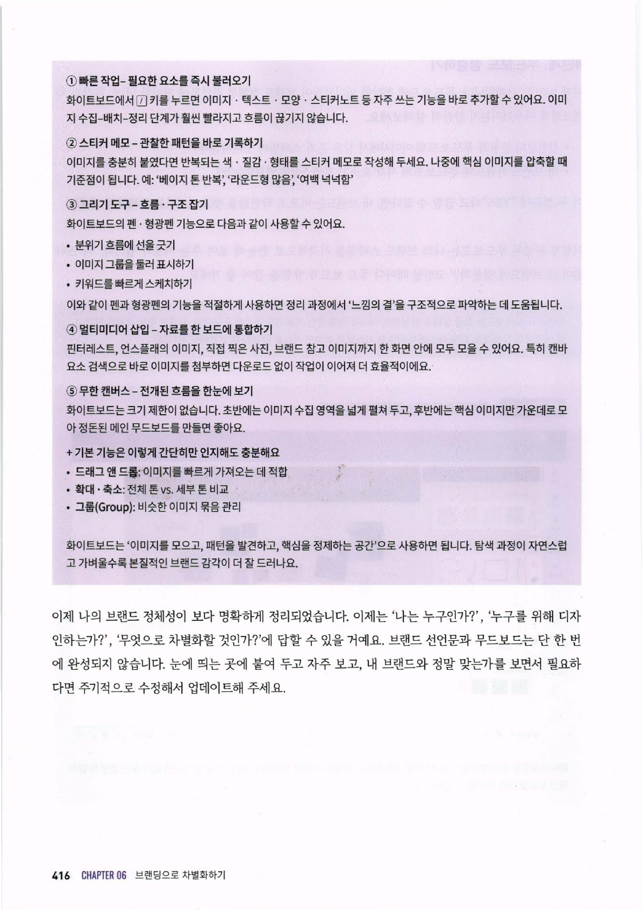

® 빠른작업- 필요한요소를즉시 블러오기

1Il키를누르연 이미지 · · 모양 · 스티커노트 등 자주 쓰는 기능을 바로 주가할 수 있어요. 이미

지 수집-배지-정리

® 스티커 이미지를 중분히 붙였다면 반복되는 색 · 질감 · 형태를 스티커 메모로 작성해 두세요. 나중에 핵심 이미지를 때

됩니다. 예: ‘베이지 톤 ‘라운드형 ', ‘여백 넉넉함' ® 그리기 도구-흐름 • 화이트보드의 펜 · 기능으로 다음과 같이 사용할 수 있어요.

• • • 스케치하기

이와 펜과 ‘느낌의 결'을 데

® 멀티미디어 - 자료를한 보드에

핀터레스트, 언스플래의 이미지, 직접 찍은 사진, 브랜드 잠고 이미지까지 화면 안에 모두 모을 수 있어요. 특히 캔바 요소 검색으로 바로 더 효율적이에요.

무한 - 보기

. 메인 좋아요.

+ 기능은 이렇게

- • 앤 :
- • ·측소: vs. 세부톤비교
- • 비슷한 이미지 관리


화이트보드는 ‘이미지를 모으고, 발견하고, 핵심을 사용하면 . 탐색 과정이 고 감각이 더 잘 드러나요.

이제 나의 브랜드 정체성이 보다 명확하게 정리되었습니다. 이제는 ‘나는 누구인가?'， ‘누구를 위해 디자

인하는가?' ， ‘무엇으로 차별화할 것인가?’에 답할 수 있을 거예요. 브랜드 선언문과 무드보드는 단 한 번

###### 에 완성되지 않습니댜 눈에 띄는 곳에 붙여 두고 자주 보고, 내 브랜드와 정말 맞는가를 보면서 필요하

###### 다면 주기적으로 수정해서 업데이트해 주세요.

416 CHAPTER 06 브랜딩으로 자별화하기

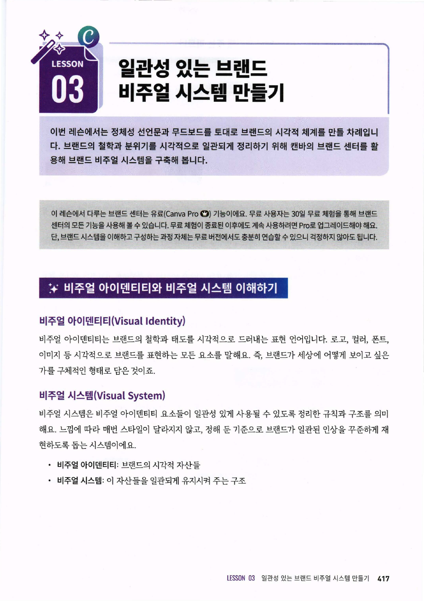

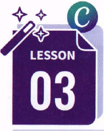

###### 일관성있는브렌드

###### 비주얼시스텝만틀기

###### 이번 정체성 시각적 차례입니

###### 다. 용해 봅니다.


.

볼 수 이후에도 . 단, 수

###### | 비주얼 I

###### 비주얼 아이덴티티(Visual Identity)

비주얼 아이덴티티는 브랜드의 철학과 태도를 시각적으로 드러내는 표현 언어입니다. 로고, 컬러, 폰트,

###### 이미지 등 시각적으로 브랜드를 표현하는 모든 요소를 말해요. 즉, 브랜드가 세상에 어떻게 보이고 싶은

가를 구체적인 형태로 담은 것이죠.

###### 비주얼 시스템(Visual System)

비주얼 시스템은 비주얼 아이 덴티티 요소들이 일관성 있게 사용될 수 있도록 정리한 규칙과 구조를 의미

###### 해요. 느낌에 따라 매번 스타일이 달라지지 않고, 정해 둔 기준으로 브랜드가 일관된 인상을 꾸준하게 재

###### 현하도록 돕는 시스템이에요.

- • 비주얼 아이덴티티: 브랜드의 시각적 자산들
- • 비주얼 시스템: 이 자산들을 일관되게 유지시켜 주는 구조


LESSON 03 일관성 있는 브랜드 비주얼 시스템 만들기 417

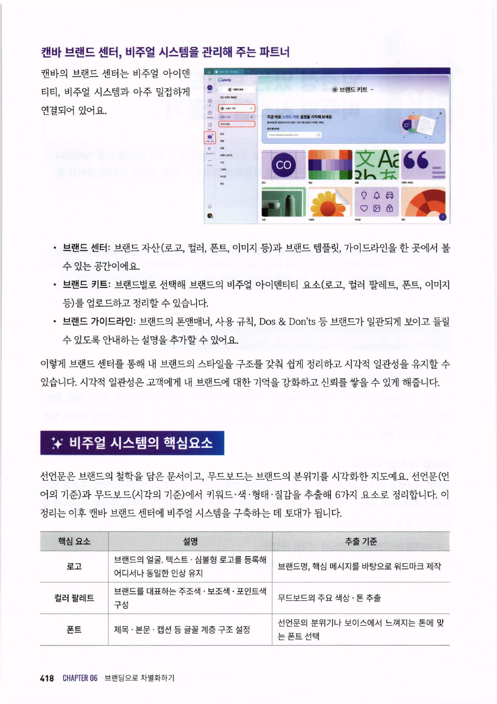

###### 센터, 시스템을 관리해 주는 파트너

--.. .브랜드키트-·

캔바의 브랜드 센터는 비주얼 아이덴 티티, 비주얼 시스템과 아주 밀접하게

국

o "

®

e' l· -... vl

연결되어 있어요.

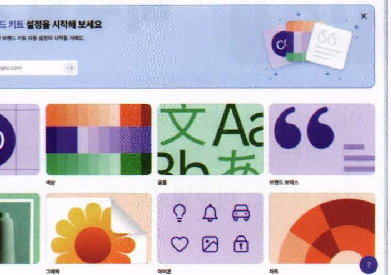

0 l- .. ) ..

+ 면t!드키트


###### ..°

###### C ..

k 士

Q .0. 0@e

。

- • 브랜드 센탸 브랜드 자산(로고, 컬러, 폰트, 이미지 등)과 브랜드 템플릿, 가이드라인울 한 곳에서 볼 수있는공간이에요.
- • 브랜드 키트: 브렌드별로 선택해 브랜드의 비주얼 아이덴티티 요소(로고, 컬러 팔레트, 폰트, 이미지 등)를 업로드하고 정리할 수 있습니다.
- • 브랜드 가이드라인: 브랜드의 톤앤매너, 사용 규칙, Dos & Don'ts 등 브렌드가 일관되게 보이고 들릴 수 있도록 안내하는 설명을 추가할 수 있어요.


이렇게 브랜드 센터를 통해 내 브랜드의 스타일을 구조를 갖춰 쉽게 정리하고 시각적 일관성을 유지할 수

있습니댜 시각적 일관성은 고객에게 내 브렌드에 대한 기억울 강화하고 신뢰를 쌓을 수 있게 해줍니다.

###### | ：나1주얼 |

선언문은 브랜드의 철학을 담은 문서이고, 무드보드는 브렌드의 분위기를 시각화한 지도예요. 선언문(언 어의 기준)과 무드보드(시각의 기준)에서 키워드·색 ·형태 ·질감을 추출해 6가지 요소로 정리합니다. 이 정리는 이후 캔바 브랜드 센터에 비주얼 시스템을 구축하는 데 토대가 됩니다.

###### I I

브랜드의 얼굴. 텍스트 · 심볼형 로고를 등록해

로고 브랜드명, 핵심 메시지를 바탕으로 워드마크 제작 어디서나 동일한 인상 유지

브랜드를 대표하는 주조색 · 보조AH-, • 포이L..:-EAH-,

###### —-- T -,0 L... T

무亡보亡이 大요 재사 · 토 大쥴

컬러팔레트

구성

선언문의 분위기나 보이스에서 느껴지는 톤에 맞

폰 제목 · 본문 · 캡션 드 그꼬 계츠 구大 서처

o 三드 O _L. 三20

는폰 E 선택

418 CHAPTER 06 브랜딩으로 자별화하기

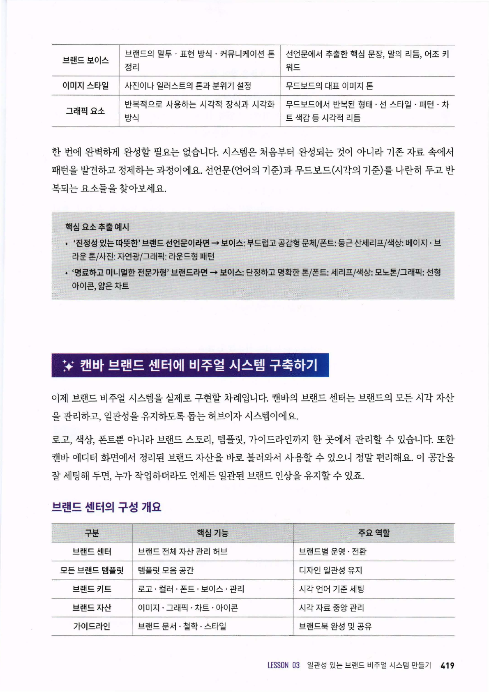

|브랜드보이스|브랜드의 말투 · 표현 방식 · 커뮤니케이션 톤 정리|선언문에서 추출한 핵심 문장, 말의 리듬, 어조 키<br><br>워드|
|---|---|---|
|이미지스타일|사진이나 일러스트의 톤과 분위기 설정|무드보드의 대표 이미지 톤|
|그래픽요소|반복적으로 사용하는 시각적 장식과 시각화<br><br>닌o卜人-,l|무드보드에서 반복된 형태 · 선 스타일 · 패턴 · 차<br><br>트색감등시각적 리듬|


한 번에 완벽하게 완성할 필요는 없습니댜 시스템은 처음부터 완성되는 것이 아니라 기존 자료 속에서 패턴을 발견하고 정제하는 과정이에요. 선언문(언어의 기준)과 무드보드(시각의 기준)를 나란히 두고 반

복되는 요소들을 찾아보세요.

- • ➔ · 브
- • 미니멀한 ➔ : /그래픽: 선형


###### | I

이제 브랜드 비주얼 시스템을 실제로 구현할 차례입니댜 캔바의 브랜드 센터는 브랜드의 모든 시각 자산 을 관리하고, 일관성을 유지하도록 돕는 허브이자 시스템이에요.

로고, 색상, 폰트뿐 아니라 브렌드 스토리, 템플릿, 가이드라인까지 한 곳에서 관리할 수 있습니다. 또한

캔바 에디터 화면에서 정리된 브랜드 자산을 바로 불러와서 사용할 수 있으니 정말 편리해요. 이 공간을 잘 세팅해 두면, 누가 작업하더라도 언제든 일관된 브랜드 인상을 유지할 수 있죠.

브랜드센터의구성개요

|I| |i|
|---|---|---|
|브랜드센터|브랜드 전제 자산 관리 허브|브랜드별운영 · 전환|
|모든브랜드템플릿|템플릿모음공간|디자인일관성유지|
|브랜드키트|로고·컬러 · 폰트·보이스·관리|시각언어 기준세팅|
|브랜드자산|이미지·그래픽·자트 · 아이콘|시각자료중앙관리|
|가이드라인|브랜드문서 ·철학·스타일|브랜드북완성 밋공유|


###### I

LESSON 03 일관성 있는 브랜드 비주얼 시스템 만둘기 419

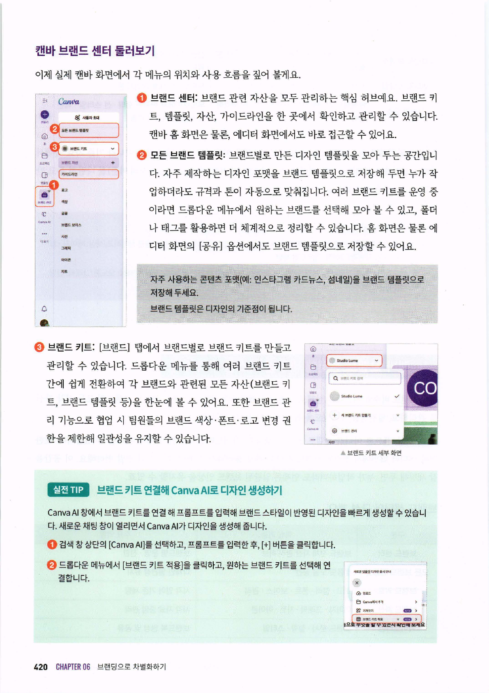

###### 캔바 브랜드 센터 둘러보기

이제 실제 캔바 화면에서 각 메뉴의 위치와 사용 흐름을 짚어 볼게요.

O 브랜드 센터: 브랜드 관련 자산을 모두 관리하는 핵심 허브예요. 브렌드 키

###### G

트, 템플릿, 자산, 가이드라인을 한 곳에서 확인하고 관리할 수 있습니다. 캔바 홈 화면은 물론, 에디터 화면에서도 바로 접근할 수 있어요.

청 선자효

@ 모른...현도혈m l

· ·.,,른"

O 모든 브랜드 템플릿: 브랜드별로 만든 디자인 템플릿을 모아 두는 공간입니

V

###### @

重도 브뺀드자산 +

댜 자주 제작하는 디자인 포맷을 브랜드 템플릿으로 저장해 두면 누가 작 업하더라도 규격과 돈이 자동으로 맞춰집니댜 여러 브랜드 키트를 운영 중

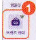

료고

색싱 ·C 글

이라면 드롭다운 메뉴에서 원하는 브렌드를 선택해 모아 볼 수 있고, 폴더

c ..

나 태그를 활용하면 더 체계적으로 정리할 수 있습니다. 홈 화면은 물론 에 디터 화면의 [공유] 옵션에서도 브랜드 템플릿으로 저장할 수 있어요.

###### ’'"

그때를

치.

:

。

® _…__

O 브랜드 키트: ［브랜드] 탭에서 브랜드별로 브랜드 키트룰 만들고

1〔"; 三

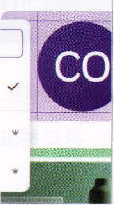

관리할 수 있습니다. 드롭다운 메뉴를 통해 여러 브랜드 키트

... 드

###### 간에 쉽게 전환하여 각 브랜드와 관련된 모든 자산(브랜드 키

s..-LWM

트, 브랜드 템플릿 등)을 한눈에 볼 수 있어요. 또한 브랜드 관 리 기능으로 협업 시 팀원들의 브렌드 색상 · 폰트·로고 변경 권

龜..

###### ."2 +

r

새..론도 n.던.기

® !!年먀

한을 제한해 일관성을 유지할 수 있습니댜

~ 브랜드키트 세부화면

###### 브랜드키트연결해 CanvaAI로 디자인 생성하기

Canva AI 연결 해 수

다. 장이 열리면서 Canva AI가 디자인율 줍니다.

7

O 검색 장 [Canva 후, [+] .

O드롭다운 메뉴에서 [브랜드 키트적용]율클릭하고, 원하는브랜드 선택해

g gif •시 g

.

x0

e c--＇．기 ) ;

志곤노

420 CHAPTER 06 브랜딩으로 자별화하기

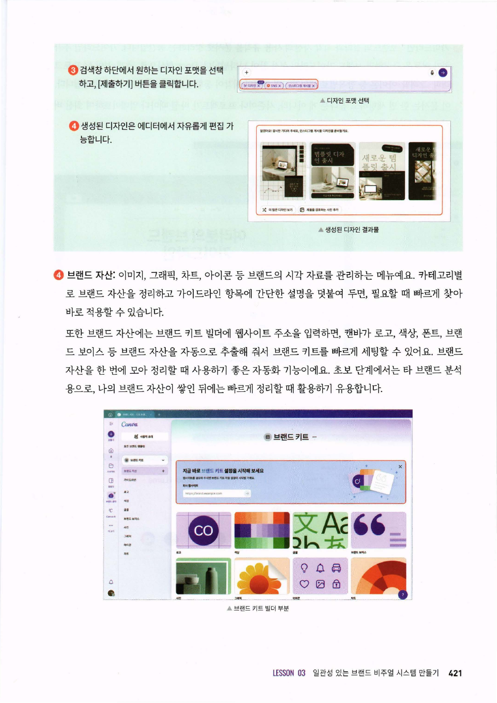

r.. d업,5군( - Q•J

검색창하단에서 원하는 디자인 포맷율 선택

+

하고, ［제줄하기] 버튼을 클릭합니다.

L

디자인 포맷 선택

O생성된 디자인은 에디터에서 자유롭게 편집 가 「一

###### | •~‘~.,...,.짜·-~..

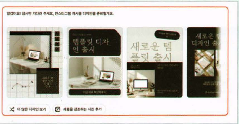

###### 능합니다.

###### 已 q••여.,, e 빼 ...硏지권"'

생성된디자인 결과

O 브랜드 자산: 이미지, 그래픽, 차트, 아이콘 등 브랜드의 시각 자료를 관리하는 메뉴예요. 카테고리별

로 브랜드 자산을 정리하고 가이드라인 항목에 간단한 설명을 덧붙여 두면, 필요할 때 ll바르게 찾아

바로 적용할 수 있습니다.

또한 브랜드 자산에는 브랜드 키트 빌더에 웹사이트 주소울 입력하면, 캔바가 로고, 색상, 폰트, 브랜

###### 드 보이스 등 브랜드 자산을 자동으로 추출해 줘서 브랜드 키트를 빠르게 세팅할 수 있어요. 브랜드

자산을 한 번에 모아 정리할 때 사용하기 좋은 자동화 기능이에요. 초보 단계에서는 타 브랜드 분석

용으로, 나의 브랜드 자산이 쌓인 뒤에는 빠르게 정리할 때 활용하기 유용합니댜

_ m"

I

• ...

터 써데... " 、

###### . ·-,,.

묘틀.”블"

..e 輪« J

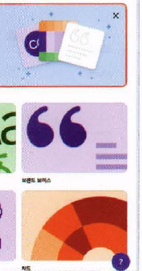


### 'C .. ....-· ‘

+ I 지글 빼 브뺀드 보세요

......•• ......

_ .........鍵...지 사,,.._

(ll 油


<-• ."....

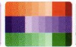

...... lb文A;~ "＇­

"' 서

터 •’

』龜•

•• ” ..,._


###### p0

Q Q

0@®

아아른

꼬`

사면

###### 쇼 브랜드 키트 빌더부분

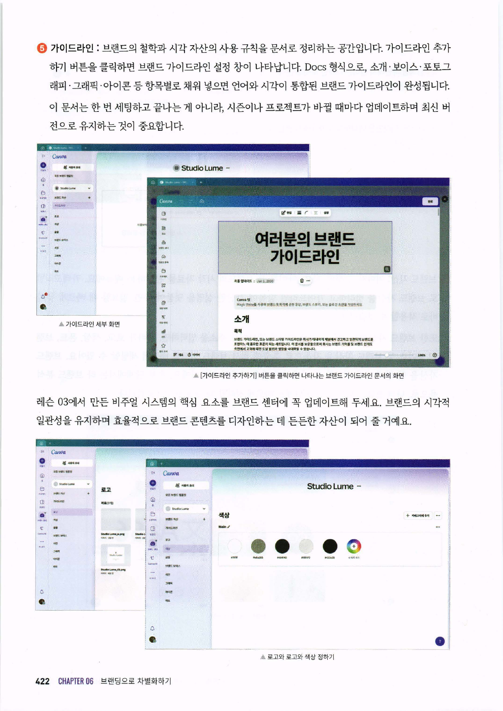

O 가이드라인 :브랜드의 철학과 시각 자산의 사용 규칙을 문서로 정리하는 공간입니다. 가이드라인 추가

하기 버튼을클릭하면브렌드가이드라인설정 창이 나타납니다.Docs 형식으로, 소개 · 보이스 · 포토그

래피 ·그래픽 ·아이콘 등 항목별로 채워 넣으면 언어와 시각이 통합된 브랜드 가이드라인이 완성됩니다.

이 문서는 한 번 세팅하고 끝나는 게 아니라, 시즌이나 프로젝트가 바뀔 때마다 업데이트하며 최신 버

전으로 유지하는 것이 중요합니다.

_ Gm"

###### • Lume ···

일뺀"...

@ ..覽···

###### e ·--

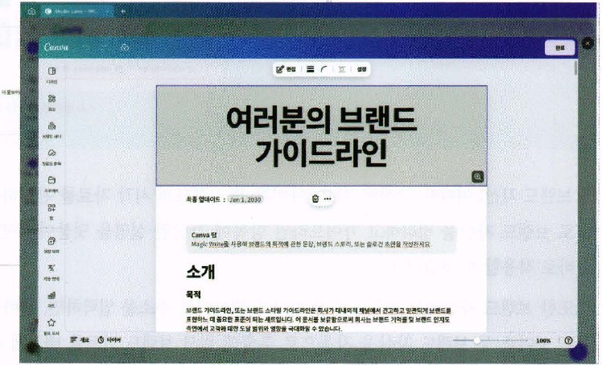

凰•`. .툰드璋던

.CB 갸

.그

헥

{: H

-g

빼틀업다어트 ' e ···

###### o•

###### . "m’입

혹적에 간현 스·리.또는...건 축던1

소개

... 가이드라인세부 화면

###### ”.. ,

·현灣느 릎얼냐. ` 니q.

###### ...

... ［가이드라인 주가하기] 버튼을 클릭하면 나타나는 브랜드 가이드라인 문서의 화면

###### 레슨 03에서 만든 비주얼 시스템의 핵심 요소를 브렌드 센터에 꼭 업데이트해 두세요. 브랜드의 시각적 일관성을유지하며 효율적으로브랜드콘텐츠를 디자인하는데 든든한자산이 되어 줄거예요.

###### 드' wa


청 .....

―

"'

.......틀’

®

‘ • ,'"- 、

StudioLume ···

e, 원때자"'

處.. 오 •열

...@ 국 자ll(1,II

###### - ..

•• ...자 +

도1, ， U""

+ ...

색상

••

•’

M,

###### ... - J ...G)

###### • • m

어입

###### 1,L-

€ 널·

_,_,,_ ••• 멀어소

j

서신

..어아른

적·

o. •

.... 로고와 로고와 색상 정하기

422 CHAPTER 06 브랜딩으로 자별화하기

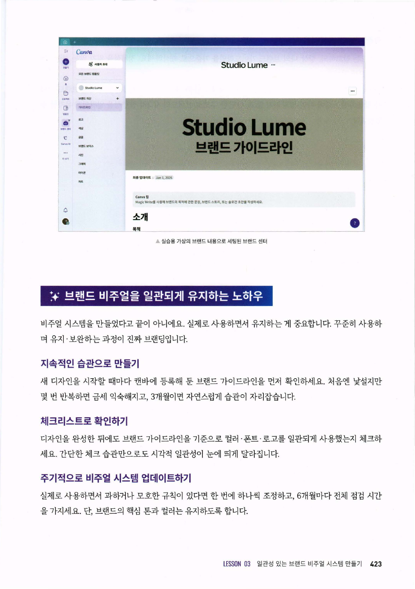

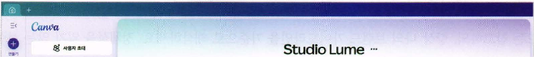

Studio Lume ···

###### 연땔지"

모 鍾뺀드 뺄"

@

’'"dUn

###### e

###### ..ti~자신 +

때 가어드리언

H•

o* •

鍵률도 .. 살

###### "

'C

###### 드

###### ... 사건

嵐뺀됴뵤어스

###### 그·

...

아이튼

: J•n 1,2026

C1nvo 팁

Writ.. 사율" ”론드의 록적에 판던 문하브뺀드 스町리, 또는 .ll!건 칙성학세요

•

。

###### 소개

록적

실습용 가상의 브랜드 내용으로 세팅된 브랜드 센터

###### | :-f 브랜드 비주얼을 일관되게 유지하는 |

비주얼 시스템을 만들었다고 끝이 아니에요. 실제로 사용하면서 유지하는 게 중요합니다. 꾸준히 사용하

며 유지 ·보완하는 과정이 진짜 브랜딩입니다.

###### 지속적인 습관으로 만들기

새 디자인을 시작할 때마다 캔바에 등록해 둔 브랜드 가이드라인을 먼저 확인하세요. 처음엔 낯설지만 몇 번 반복하면 금세 익숙해지고, 3개월이면 자연스럽게 습관이 자리잡습니다.

###### 체크리스트로확인하기

디자인을 완성한 뒤에도 브랜드 가이드라인을 기준으로 컬러 ·폰트·로고를 일관되게 사용했는지 체크하

세요. 간단한 체크 습관만으로도 시각적 일관성이 눈에 띄게 달라집니다.

###### 주기적으로 비주얼 시스템 업데이트하기

실제로 사용하면서 과하거나 모호한 규칙이 있다면 한 번에 하나씩 조정하고, 6개월마다 전체 점검 시간

###### 을 가지세요. 단, 브랜드의 핵심 톤과 컬러는 유지하도록 합니다.

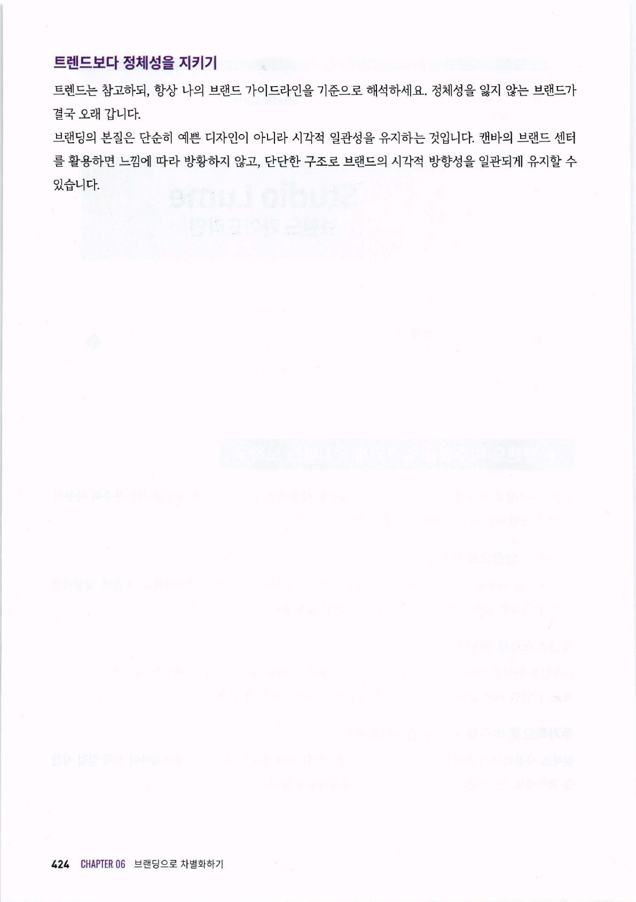

트렌드는 참고하되, 항상 나의 브렌드 가이드라인을 기준으로 해석하세요. 정체성을 잃지 않는 브랜드가 결국오래갑니다.

브랜딩의 본질은 단순히 예쁜 디자인이 아니라 시각적 일관성을 유지하는 것입니다. 캔바의 브랜드 센터

###### 를 활용하면 느낌에 따라 방황하지 않고, 단단한 구조로 브랜드의 시각적 방향성을 일관되게 유지할 수

###### 있습니다.

424 브랜딩으로 자별화하기

