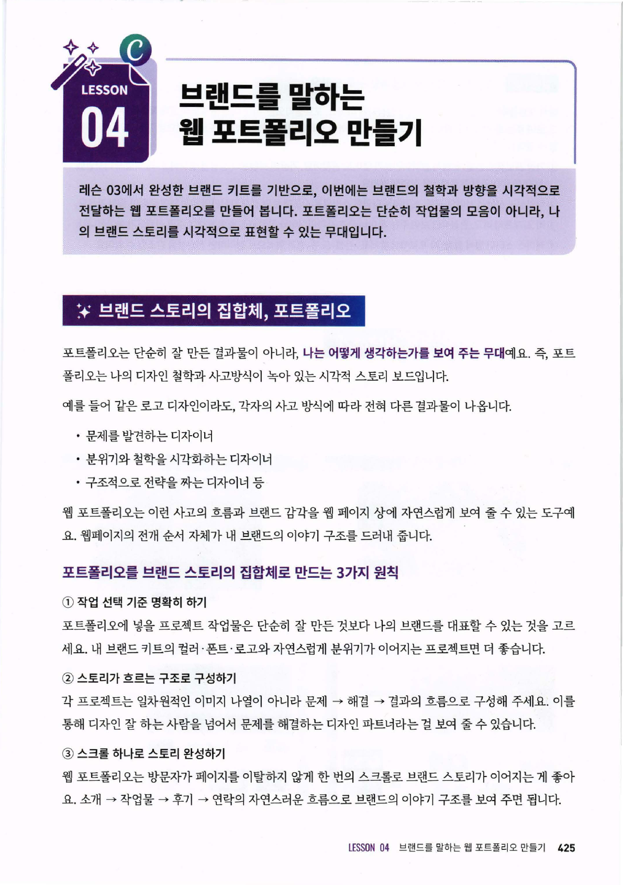

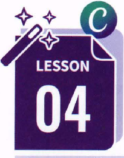

###### 웹포트폴리오만틀기

레슨

웹 봅니다. 포트폴리오는 아니라, 나 의 시각적으로 수

###### | I

포트폴리오는 단순히 잘 만든 결과물이 아니라, 나는 보여 주는 무대예요. 즉, 포트 폴리오는 나의 디자인 철학과 사고방식이 녹아 있는 시각적 스토리 보드입니다.

###### 예를 들어 같은 로고 디자인이라도, 각자의 사고 방식에 따라 전혀 다른 결과물이 나옵니다.

- • 문제를 발견하는 디자이너
- • 분위기와 철학을 시각화하는 디자이너
- • 구조적으로 전략을 짜는 디자이너 등

웹 포트폴리오는 이런 사고의 흐름과 브랜드 감각을 웹 페이지 상에 자연스럽게 보여 줄 수 있는 도구예

요. 웹페이지의 전개 순서 자체가 내 브랜드의 이야기 구조를 드러내 줍니다.

###### 브랜드 스토리의 만드는 3가지 원칙

® 작업 선택 기준 명확히 하기

포트폴리오에 넣을 프로젝트 작업물은 단순히 잘 만든 것보다 나의 브랜드를 대표할 수 있는 것을 고르

세요. 내 브랜드 키트의 컬러 · 폰트 · 로고와 자연스럽게 분위기가 이어지는 프로젝트면 더 좋습니다.

® 스토리가 흐르는 구조로 구성하기

###### 각 프로젝트는 일차원적인 이미지 나열이 아니라 문제 一 해결 一 결과의 흐름으로 구성해 주세요. 이를

###### 통해 디자인 잘 하는 사람을 넘어서 문제를 해결하는 디자인 파트너라는 걸 보여 줄 수 있습니다.

® 스크롤 하나로 스토리 완성하기

웹 포트폴리오는 방문자가 페이지를 이탈하지 않게 한 번의 스크롤로 브랜드 스토리가 이어지는 게 좋아

###### 요. 소개 一 작업물 一 후기 一 연락의 자연스러운 흐름으로 브랜드의 이야기 구조를 보여 주면 됩니다.

LESSON 04 브랜드를 말하는 웹 포트폴리오 만들기 425

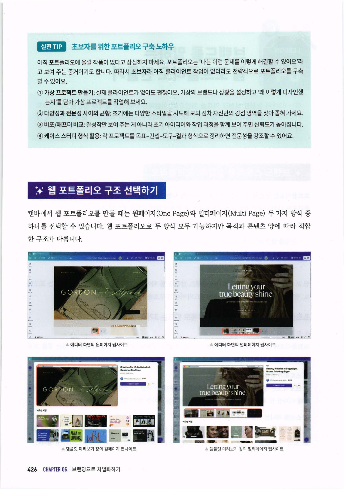

-아직 작품이없다고상심하지마세요. ‘ 이런 이렇게 수있어요'라

고 보여 주는 증거이기도 합니다. 따라서 조보자라 아직 클라이언트 작업이 전략적으로 포트폴리오를 구축

할수있어요.

G) 실제 없어도 괜찮아요. 가상의 브랜드나 설정하고 ‘왜 이렇게

가상 보세요.

®다양성과 사이의 보되 점자자신만의 잦아좁혀 가세요.

® 비교: 게 주면

®케이스 스터디 형식 각 프로젝트를 형식으로 정리하면 강조할수 있어요.

##### I 웹 |

캔바에서 웹 포트폴리오를 만들 때는 원페이지 (One Page)와 멀티폐이지 (Multi Page) 두 가지 방식 중

하나를 선택할 수 있습니댜 웹 포트폴리오로 두 방식 모두 가능하지만 목적과 콘텐츠 양에 따라 적합

# |:7:::O-·“T_,=

한구조가다릅니다.

#### |;o=: ” ".•_ ,-· ·9 ‘ - m|

IJ-·

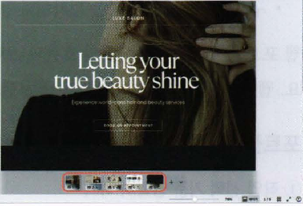

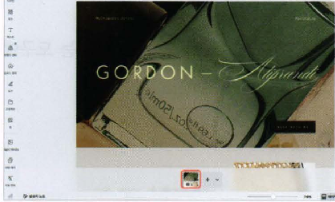

a Tg.50~

••

{0t‘"e

4 "erIf·5io~Ti

’ i 2

- - o-'-"' •• .,

OUl).•,`UUUW”'..,h

0m."O*U

·-

- -(j---•-

에디 터 화면의 원페이 지 웹사이트

에디터 화면의 멀티페이지 웹사이트

- -"mn""“’..-u.鷹

··나마’----

- -O,---•-

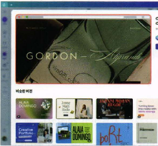

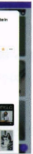

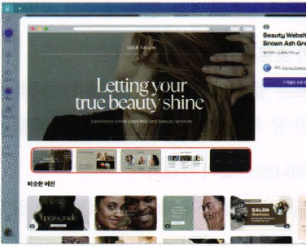

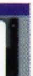

g 三­

‘-

。

###### —

###### -

＿

．

템플릿 미리보기 장의 원페이 지 웹사이트

템플릿 미리보기 장의 얼티페이지 웹사이트

###### 426 CHAPTER 06 브랜딩으로자별화하기

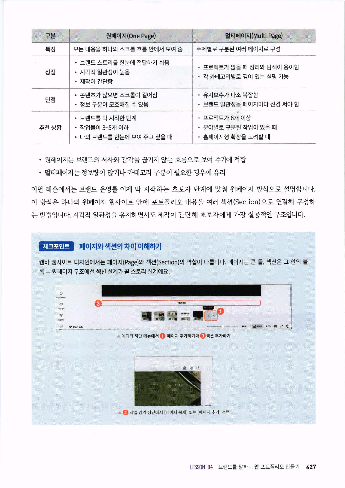

|I| | |
|---|---|---|
|특징|모든 내용을 하나의 스크롤 흐름 안에서 보여 줌|주제별로 구분된 여러 페이지로 구성|
|XO卜X<=4|• 브랜드 스토리를 한눈에 전달하기 쉬움 • 시각적일관성이높음 • 제작이 간단함 |• 프로젝트가 많을 때 정리와 탐색이 용이함 • 각 카테고리별로 깊이 있는 설명 가능 |
|단점|• 콘텐츠가 많으면 스크롤이 길어짐 • 정보 구분이 모호해질 수 있음 |• 유지보수가다소복잡함 • 브랜드 일관성을 페이지마다 신경 써야 함   .|
|주전상황|• 브랜드를 막 시작한 단계 • 작업물이 3~5개 이하 • 나의 브랜드를 한눈에 보여 주고 싶을 때 |• 프로젝트가 6개 이상 • 분야별로 구분된 작업이 있을 때 • 홈페이지형 확장을 고려할 때 |

###### I I

- • 원페이지는브랜드의 서사와감각을 끊기지 않는흐름으로보여 주기에 적합
- • 멀티페이지는 정보량이 많거나 카테고리 구분이 필요한 경우에 유리

###### 이번 레슨에서는 브랜드 운영률 이제 막 시작하는 초보자 단계에 맞춰 원페이지 방식으로 설명합니다.

이 방식은 하나의 원페이지 웹사이트 안에 포트폴리오 내용을 여러 섹션(Section)으로 연결해 구성하

는 방법입니다. 시각적 일관성을 유지하면서도 제작이 간단해 초보자에게 가장 실용적인 구조입니다.

###### 페이지와색션의자이이해하기

)의 다릅니다. 페이지는 , 섹션은 그 안의

###### — 곧

-s--

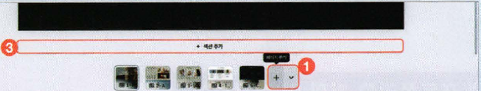

。

g g

....

었

L 7·모프 . - 11S ,• 。

에디터 하단 메뉴에서0 페이지 주가하기와 주가하기

| _I_

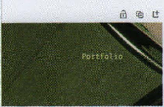

|

###### IJ

''

O 영역 상단에서 [페이지 주가] 선택

###### LESSON 04 브랜드를 말하는 웹 포트폴리오 만들기 427

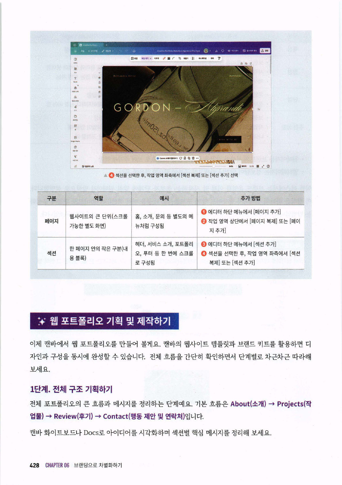

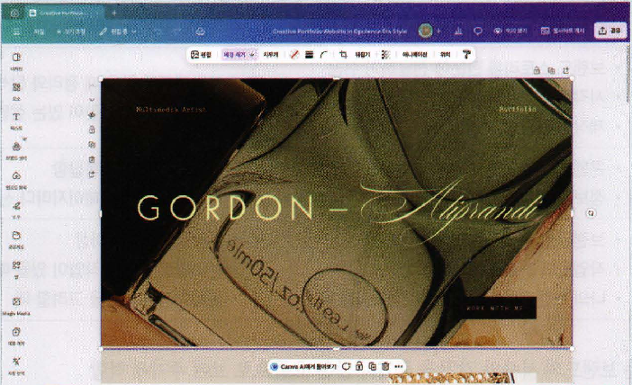

###### CB:aTg‘7i4"

vea

떨畵

C

<'

으론

###### --

g

....。

###### ..`'-

,\

"' " ‘.

“

O 후, 작업 좌측에서 [섹션 또는 [섹션 주가] 선택

| | | | |
|---|---|---|---|
|페이지|웹사이트의 큰 단위(스크롤  가능한별도화면)|홈, 소개, 문의 등 별도의 메  뉴저럼구성됨|O 에디터 하단 메뉴에서 [페이지 주가] O 작업 영역 상단에서 [페이지 복제] 또는 [페이  지주가]|
|섹션|한 페이지 안의 작은 구분(내 용블록)|헤더, 서비스 소개, 포트폴리 오, 푸터 등 한 번에 스크롤 로구성됨|O 에디터 하단 메뉴에서 [섹션 추가] O 섹션을 선택한 후, 작업 영역 좌측에서 [섹션  복제] 또는 [섹션 주가]|

###### | 웹 제 |

이제 캔바에서 웹 포트폴리오를 만들어 볼게요. 캔바의 웹사이트 템플릿과 브랜드 키트를 활용하면 디

###### 자인과 구성을 동시에 완성할 수 있습니다. 전체 흐름을 간단히 확인하면서 단계별로 차근차근 따라해

보세요.

###### 1단계. 전체 구조 기획하기

전체 포트폴리오의 큰 흐름과 메시지를 정리하는 단계예요. 기본 흐름은 About(소개) ➔ Projects(작

###### ➔ Review(후기) ➔ Contact(행동 재안 및 연락처)입니다.

캔바 화이트보드나 Docs로 아이디어를 시각화하며 섹션별 핵심 메시지를 정리해 보세요.

428 CHAPTER 06 브랜딩으로자별화하기

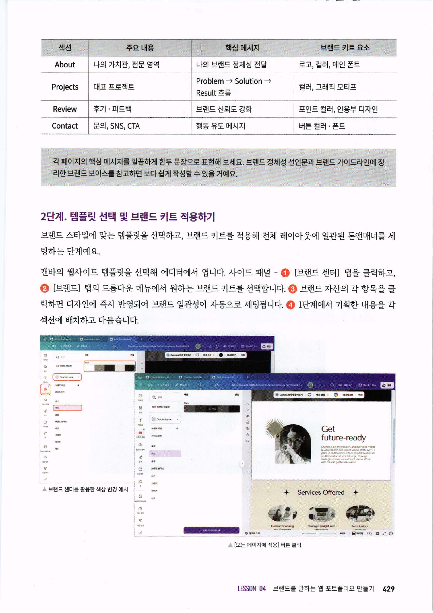

###### I

|I| | | |
|---|---|---|---|
|About|나의가지관,전문영역|나의브랜드정제성전달|로고,컬러,메인폰트|
|Projects|대표프로젝트|Problem ➔ Solution ➔  Result 흐름|컬러,그래픽모티프|
|Review|후기 · 피드백|브랜드신뢰도강화|포인트 컬러, 인용부 디자인|
|Contact|문의, SNS, CTA|행동유도메시지|버튼컬러 · 폰트|

!

###### I

- 2단계. 선택 및 브랜드 키트 적용하기 브렌드 스타일에 맞는 템플릿을 선택하고, 브랜드 키트를 적용해 전체 례이아웃에 일관된 톤앤매너를 세 팅하는단계예요.

캔바의 웹사이트 템플릿을 선택해 에디터에서 엽니다. 사이드 패널 - O [브랜드 센터] 탭을 클릭하고, O [브렌드] 탭의 드롭다운 메뉴에서 원하는 브랜드 키트를 선택합니댜 O 브랜드 자산의 각 항목을 클

릭하면 디자인에 즉시 반영되어 브랜드 일관성이 자동으로 세팅됩니다. 0 1단계에서 기획한 내용을 각

섹션에 배치하고 다듬습니다.

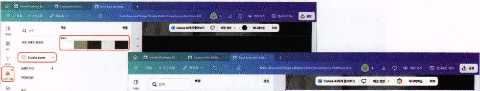

###### - -

Cl! Q

뻬.

? .....… 「

T -- ·)

꾼~

2

###### ........

0. ••

《》솔

腐

( "s

a

4

`. ..

T

·e,- ""..

aeec

###### 'UIOuu""

_

g. -..고`

Get future-ready

Ui0i4"e.

.

...

E

기도..

###### --

C、、••e,* ~”'"Cr.따포......

###### ·고

、""＇、,、S”드.""e"피^'"""..~,. ,.......K .....W...2니石1$ 이리 Lmm·`dd‘r.u.”립·

###### ...ff...,

뻬섭

E W~

"빠 TmC..

"빼

..`뻔.

~

때

院,

그

--。 ·른

###### +

~ 브랜드 센터를 활용한 색상 변경 예시

..른

e

###### --='

...뻬

`,

I.- 브一때··~ ._

..C

...

... S - 蠶 •• o

『 ·

한' 포

... ［모든 페이지에 적용] 버튼 클릭

###### LESSON 04 브랜드를 말하는 웹 포트폴리오 만들기 429

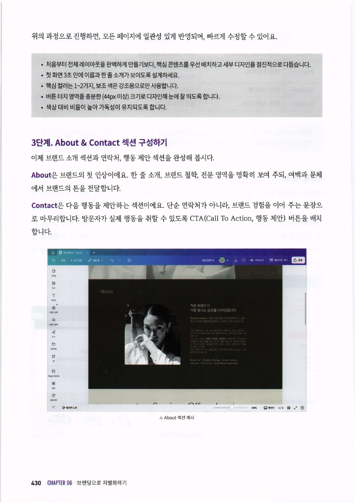

###### 위의 과정으로 진행하면, 모든 페이지에 일관성 있게 반영되며, 빠르게 수정할 수 있어요.

- • 전제 세부 디자인을 점진적으로

• •

- • 버튼 합니다.
- • 대비

###### 3단계. About & Contact 색션 구성하기

이제 브랜드 소개 섹션과 연락처, 행동 제안 섹션을 완성해 봅시다.

###### About은 브랜드의 첫 인상이에요. 한 줄 소개, 브랜드 철학, 전문 영역을 명확히 보여 주되, 여백과 문체

에서 브랜드의 톤을 전달합니다.

###### Contact은 다음 행동을 제안하는 섹션이에요. 단순 연락처가 아니라, 브랜드 경험을 이어 주는 문장으

로 마무리합니댜 방문자가 실제 행동을 취할 수 있도록 CTA(Call To Action, 행동 제안) 버튼을 배치

합니다.

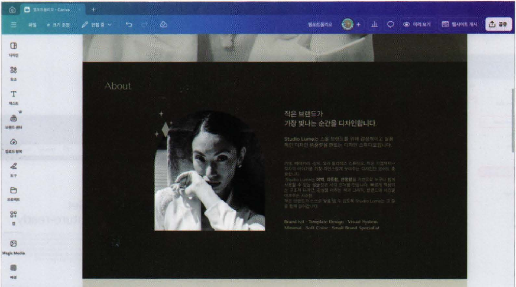

。

때...

^ ^‘.r

,. 7·m,._. “` liil亭 1/1 •• ®

About 섹션 예시

430 브랜딩으로 자별화하기

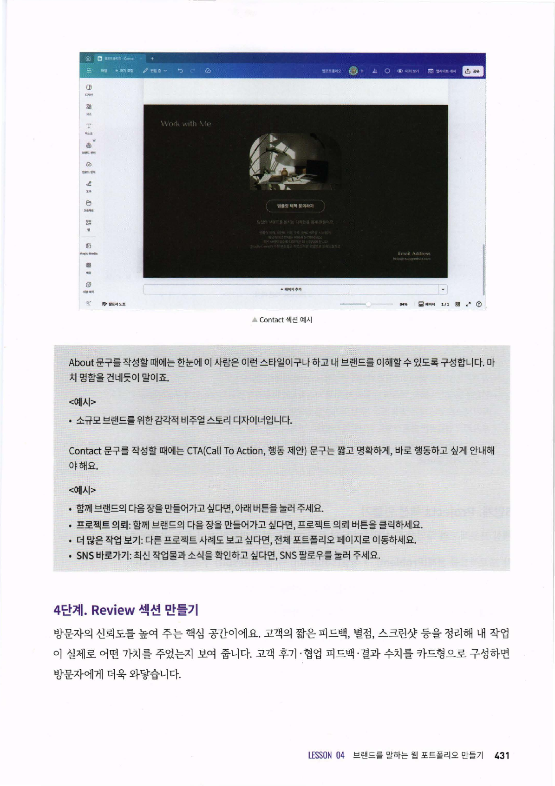

」Cl'"'e =

g

‘.

T

。

4"

###### e

m..

怨

--@.”

。

+빼

구· 量 "` 묘- 1/1 88 •• ©

Contact 섹션 예시

작성할 이 내 수 마 알이죠.

.

문구를 작성할 바로 싶게 안내해

.

- • 드의 다음
- • 함께 다음 장을 버튼을
- • 다른 프로젝트 보고 이동하세요.
- • 작업물과

- 4단계. Review 색션 방문자의 신뢰도를 높여 주는 핵심 공간이에요. 고객의 짧은 피드백, 별점, 스크린샷 등을 정리해 내 작업 이 실제로 어 떤 가치 를 주었는지 보여 줍니댜 고객 후기 ·협업 피드백 · 결과 수치를 카드형으로 구성하면 방문자에게 더욱 와닿습니다.

LESSON 04 브랜드를 말하는 웹 포트폴리오 만들기 431

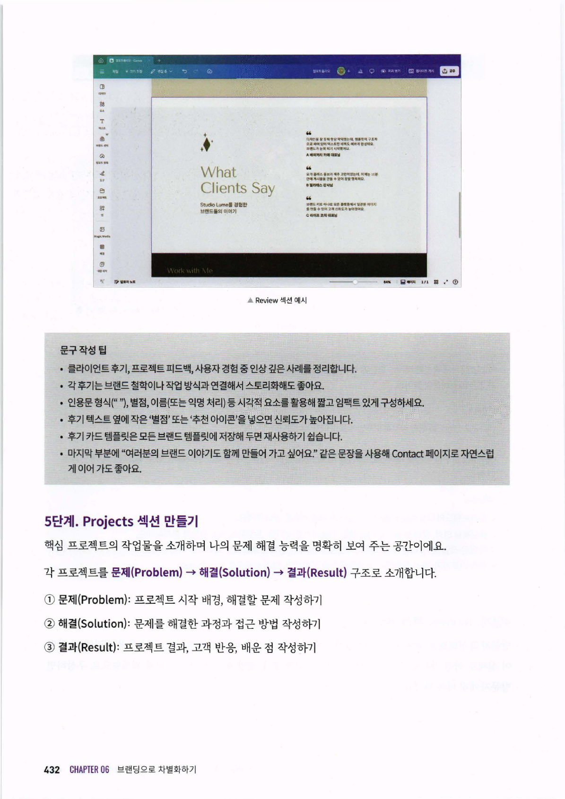

|- ~_。 , ~一•` -"a|

CJl-

,.

誌

"

T

###### ..‘‘.터

"q.q헌 .....｀뺄른, 구모.

........."••ll

어g

^..

。

What

4 "

,.,, 아빼는 를

e제시•• ♦ s ·•가빼0사

Clients Say

###### "..

e,

”... 피

Lund

終

1 연•••이 그． 신.도~

Ii

###### C

。

."0t

7 •5 끄

"

-

.& Review 섹션 예시

문구작성팁

• •

- • 형식(" "),
- • 후기 텍스트 옆에 .
- • 후기 카드 모든
- • 마지막 "여러분의

- 5단계. Projects 색션 핵심 프로젝트의 작업물을 소개하며 나의 문제 해결 능력을 명확히 보여 주는 공간이에요.

각 프로젝트를 문재(Problem) ➔ (Solution) ➔ 결과(Result) 구조로 소개합니댜

® 문제(Problem): 프로젝트 시작 배경, 해결할 문제 작성하기 ® 해결(Solution): 문제를 해결한 과정과 접근 방법 작성하기 ® 결과(Result): 프로젝트 결과, 고객 반응, 배운 점 작성하기

432 CHAPTER 06 브랜딩으로 자별화하기

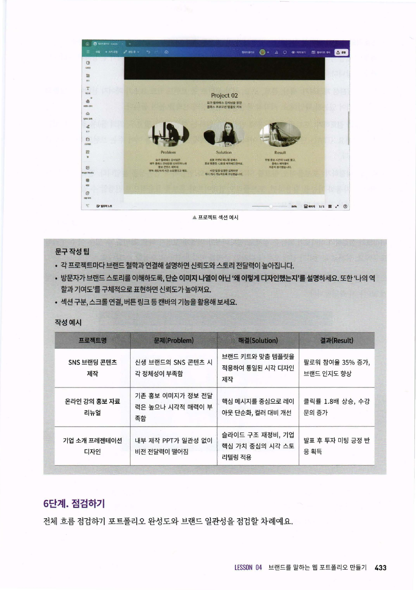

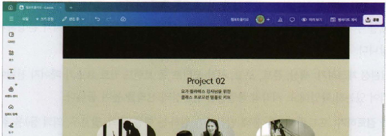

誌

T

ec

###### ‘。

요기 위한

키토

院 H

4

0g

Result

•••

t11 기던열이..., 스

e~· ......

1211빼확빼드륄어요

“스 역..

....에

•

뺀• 서P .....

.."

틀A 가"도· 구살..L'다

###### ....。

•• 힙•m'" ” 1/1 露 •• ®

~ 프로젝트섹션예시

• •

할과 기여도’를

• 섹션

작성예시

틀 :

껴圖崎

;.L.

-

|SNS 브랜딩콘텐츠  I  제작|신생 브랜드의 SNS 콘텐츠 시  각정제성이부족함|브랜드 키트와 맞춤 템플릿을 적용하여 통일된 시각 디자인 제작|팔로워 잠여율 35% 증가, 브랜드인지도향상|
|---|---|---|---|
|온라인강의홍보자료  |  리뉴얼|기존 홍보 이미지가 정보 전달  력은 높으나 시각적 매력이 부 족함|핵심 메시지를 중심으로 레이 아웃 단순화, 컬러 대비 개선|클릭 률 1.8배 상승, 수강  문의증가|
|기업소개프레젠테이션  I  디자인|내부 제작 PPT가 일관성 없이  비전전달력이떨어짐|슬라이드 구조 재정비, 기업 핵심 가지 중심의 시각 스토 리텔링적용|발표후투자 미팅 긍정 반 응획득|

|

###### I I

|

###### I I

###### . 점검하기

###### 전체 흐름 점검하기 포트폴리오 완성도와 브랜드 일관성을 점검할 차례예요.

04 브랜드를 말하는 웹 포트폴리오 만들기 433

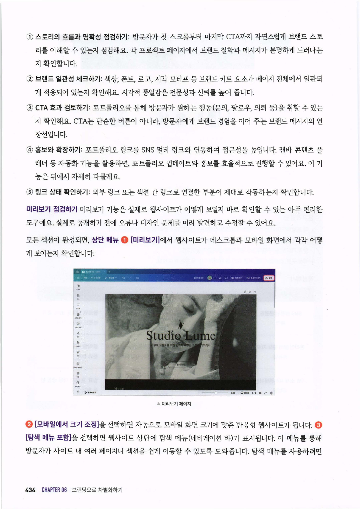

® 스토리의 흐름과 명확성 점검하기: 방문자가 첫 스크롤부터 마지막 CTA까지 자연스럽게 브랜드 스토

###### 리를 이해할 수 있는지 점검해요. 각 프로젝트 페이지에서 브랜드 철학과 메시지가 분명하게 드러나는

지확인합니다.

® 브랜드 일관성 제크하기: 색상, 폰트, 로고, 시각 모티프 등 브랜드 키트 요소가 페이지 전체에서 일관되

게 적용되어 있는지 확인해요. 시각적 통일감은 전문성과 신뢰를 높여 줍니다.

###### ® CTA 효과 검토하기: 포트폴리오를 통해 방문자가 원하는 행동(문의, 팔로우, 의뢰 등)을 취할 수 있는

지 확인해요. CTA는 단순한 버튼이 아니라, 방문자에게 브랜드 경험을 이어 주는 브랜드 메시지의 연

장선입니다.

###### ® 홍보와 확장하기: 포트폴리오 링크를 SNS 멀티 링크와 연동하여 접근성을 높입니댜 캔바 콘텐츠 플

래너 등 자동화 기능을 활용하면, 포트폴리오 업데이트와 홍보를 효율적으로 진행할 수 있어요. 이 기

능은 뒤에서 자세히 다룰게요.

###### ® 링크 상태 확인하기: 외부 링크 또는 섹션 간 링크로 연결한 부분이 제대로 작동하는지 확인합니다.

미리보기 기능은 실제로 웹사이트가 어떻게 보일지 바로 확인할 수 있는 아주 편리한

도구예요. 실제로 공개하기 전에 오류나 디자인 문제를 미리 발견하고 수정할 수 있어요.

###### 모든 섹션이 완성되면, 메뉴 O [미리보기]에서 웹사이트가 데스크톱과 모바일 화면에서 각각 어떻

계보이는지확인합니댜

…·:": ... :. · 언 ` p 러

###### e:gTf·i0i4"ef

a "' e

院·

###### 1--.

###### ...··

###### `. ... ......

~ 미 리보기페이지

###### O [모바일에서 크기 조정]을 선택하면 자동으로 모바일 화면 크기에 맞춘 반응형 웹사이트가 됩니댜 O

###### [탐색 메뉴 포함]을 선택하면 웹사이트 상단에 탐색 메뉴(네비게이션 바)가 표시됩니다. 이 메뉴를 통해

###### 방문자가 사이트 내 여러 페이지나 섹션을 쉽게 이동할 수 있도록 도와줍니다. 탐색 메뉴를 사용하려면

434 CHAPTER 06 브랜딩으로 자별화하기

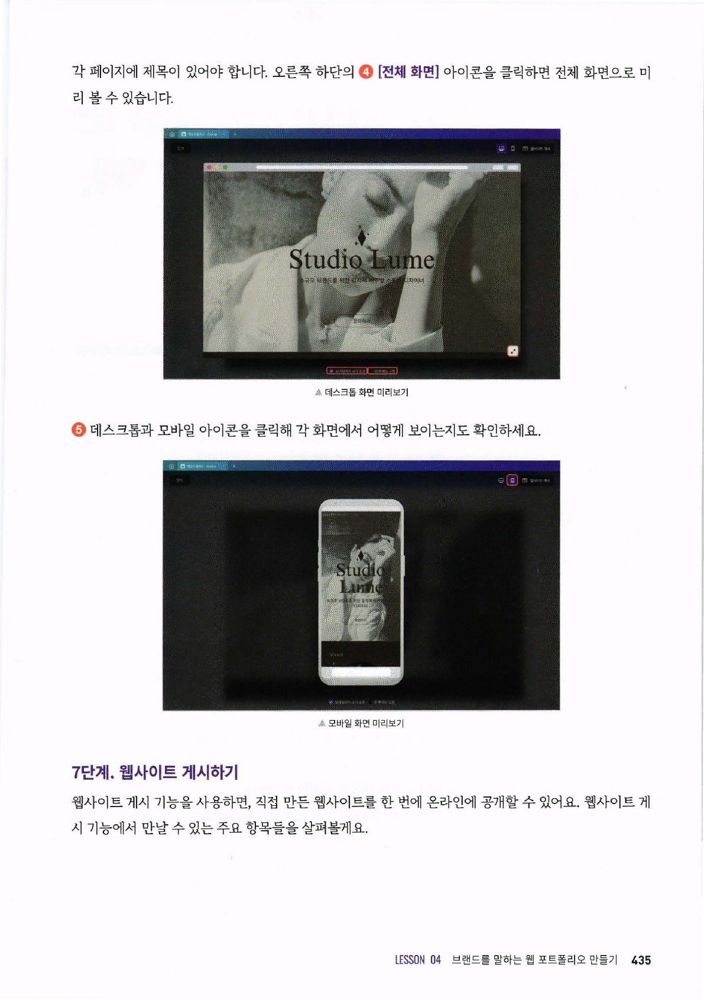

각 페이지에 제목이 있어야 합니댜 오른쪽 하단의 O [전체 화면] 아이콘을 콜릭하면 전체 화면으로 미

리 볼수있습니다.

^ 데스크톱화면 미리보가

###### O 데스크톱과 모바일 아이콘을 클릭해 각 화면에서 어떻게 보이는지도 확인하세요.

~ 모바일화면미리보기

###### 7단계• 웹사이트 게시하기

웹사이트 게시 기능을 사용하면, 직접 만든 웹사이트를 한 번에 온라인에 공개할 수 있어요. 웹사이트 게

###### 시 기능에서 만날 수있는주요항목들을살펴볼게요.

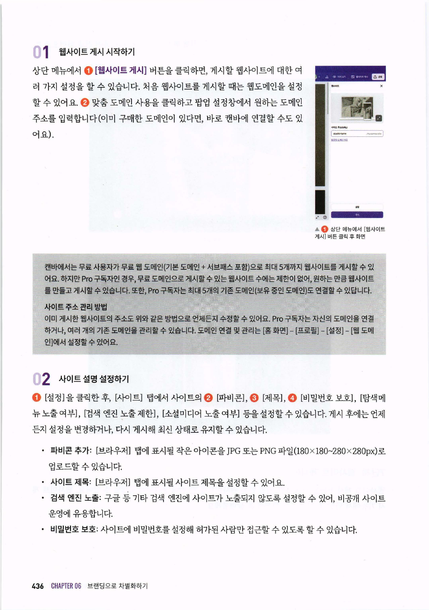

###### 1

•"""

웹사이트게시시작하기

상단 메뉴에서 O [웹사이트게시] 버튼을 클릭하면, 게시할 웹사이트에 대한 여

러 가지 설정을 할 수 있습니다. 처음 웹사이트를 게시할 때는 웹도메인을 설정

X

###### 할수있어요. 맞춤도메인사용을클릭하고팝업 설정창에서 원하는도메인

國

주소를 입력합니다(이미 구매한 도메인이 있다면, 바로 캔바에 연결할 수도 있

....令n"m

트

二

어요).

·더"'게언서q

....'。f상단메뉴에서..[웹사이트

게시] 버튼클릭후화면

무료 + 수

수

수 - - ［웹

###### 2

사이트설명설정하기

0 [설정]을클릭한후, ［사이트] 탭에서 사이트의 O [파비콘], [제목], 0 [비밀번호보호], ［탐색메

뉴노출여부], ［검색 엔진 노출제한], ［소셜미디어 노출여부] 등을설정할수있습니다.계시 후에는 언제

든지 설정을 변경하거나, 다시 게시해 최신 상태로 유지할 수 있습니다.

파비콘 추가: [브라우저] 탭에 표시될 작은아이콘을 JPG 또는 PNG 파일(180X 180~280X280px)로

업로드할수있습니다.

사이트 제목: ［브라우저] 탭에 표시될 사이트 제목을 설정할 수 있어요.

###### 검색 엔진 노출 구글 등 기타 검색 엔진에 사이트가 노출되지 않도록 설정할 수 있어, 비공개 사이트

###### 운영에유용합니다. 비밀번호 보호: 사이트에 비밀번호를 설정해 허가된 사람만 접근할 수 있도록 할 수 있습니다.

436 CHAPTER 06 브랜딩으로자별화하기

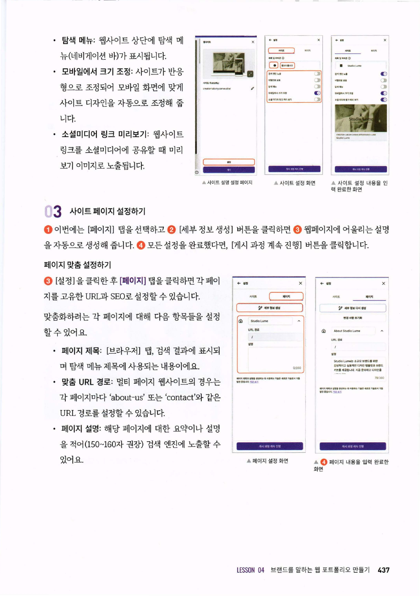

x +- ..

x

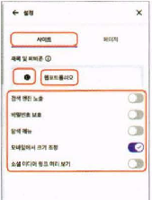

탐색 메뉴: 웹사이트 상단에 탐색 메

x

###### ....

’k

### •

뉴(네비게이션 바)가 표시됩니댜 모바일에서 크기 조정: 사이트가 반응

......(I)

• " L""

###### «

·데....

.-ffi!.l...꼬

’

....오""J

형으로 조정되어 모바일 화면에 맞게

¢""....,

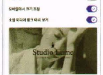

며•빠걱"••

빼 ,

사이트 디자인을 자동으로 조정해 줍 니다.

소셜미디어 링크 미리보기: 웹사이트

f·시다^ 서 며f·-""' nF 1U"'

`＇며

###### ‘’ ' ,

링크를 소셜미디어에 공유할 때 미리

###### ..

보기 이미지로노출됩니다.

o

~ 사이트 설영 설정 페이지 ~ 사이트설정화면 ^ 사이트 설정 내용율 인

력완료한화면

###### 3

사이트페이지설정하기

O 이번에는 [페이지] 탭을선택하고 [세부정보생성] 버튼을클릭하면 O 웹페이지에 어울리는설명 을자동으로생성해줍니댜 모든설정을완료했다면, [계시 과정 계속진행] 버튼을클릭합니다.

페이지맞춤설정하기

O [설정]을클릭한후 [페이지] 탭을클릭하면각페이

x

e 볼볼 X e 볼를

지를 고유한 URI고} SEO로 설정할 수 있습니다.

110l지 )

사어.

사1" 빼어지

###### · J

###### .…....필보다시11실

맞춤화하려는 각 페이지에 대해 다음 항목들을 설정 할수있어요

###### 단결서.皇'"'

{i) Sludlowme

(i) 心아요다0 나m

###### ’

U•l I•

I

- • 페이지 제목: ［브라우저] 탭, 검색 결과에 표시되 며 탐색 메뉴 제목에 사용되는 내용이에요.

맞춤 URL 경로: 멀티 페이지 웹사이트의 경우는

각 페이지마다 ‘about-us' 또는 ‘contact’와 같은

URL 경로를설정할수있습니다.

- • 페이지 설명: 해당 페이지에 대한 요약이나 설명 을 적어 (150~160자 권장) 검색 엔진에 노출할 수 있어요.

볼뺄

St"'loUm뱌 소규모.t!드."l!t

q자인 ..t!드

0/160

•••·빠지•.""끄｀른"•••"`.』.........."""

뻬글압니다 룬의..고 디지인.

,

,.n60

- .........L때 11•tn" ...가.""'

..."므“””

_

_

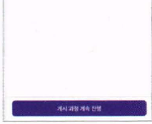

l•0페이지내용율입력완료한

~ 페이지설정화면

화면

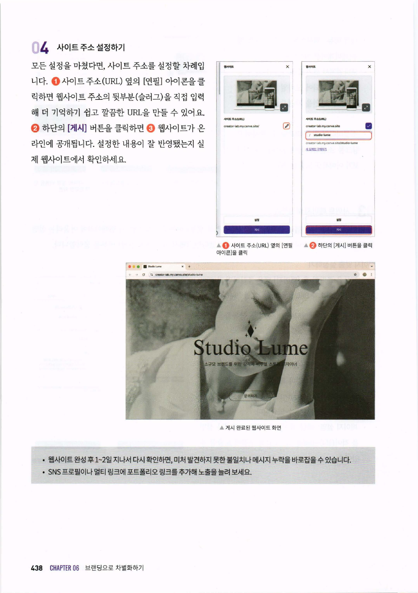

###### 4 사이트주소설정하기

모든 설정을 마쳤다면, 사이트 주소를 설정할 차례입 니댜 사이트주소(URL) 옆의 [연필] 아이콘을클 릭하면 웹사이트 주소의 뒷부분(슬러그)을 직접 입력 해 더 기억하기 쉽고 깔끔한 URL을 만들 수 있어요.

I ,門 X l , X

적. 적.

c""c.my도"w•."‘ @ (c""c"bm"다”/...-........... •)

서를 투

O 하단의 버튼을 클릭하면 O 웹사이트가 온

라인에 공개됩니다. 설정한 내용이 잘 반영됐는지 실

a"",r-ub"'YCMWasit타m"'0

제 웹사이트에서 확인하세요`

볼혈

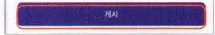

###### L

• 0 사이트 주소{URL) 옆의 [연필 ^0 하단의 [게시] 버튼율클릭

아이콘]을클릭

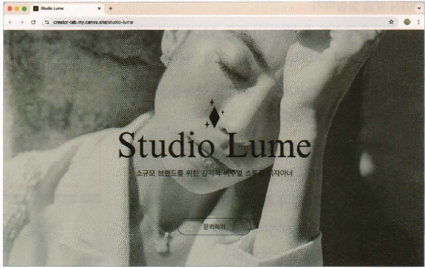

~ 게시 완료된 웹사이트 화면

- • 완성 후 지나서 다시 수
- • SNS .

438 브랜딩으로 자별화하기

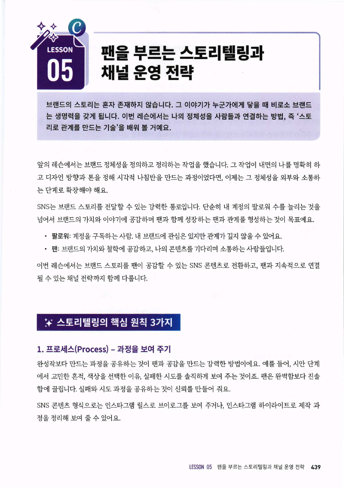

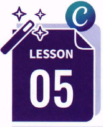

###### 팬채을널

###### T-E 스토리델링과

고:0 느-,

스토리는 혼자 않습니다. 그 이야기가 누군가에게 비로소 브랜드

는 됩니다. 나의 즉 ‘스토

###### 리로 는 기술’을

앞의 레슨에서는 브랜드 정체성을 정의하고 정리하는 작업을 했습니댜 그 작업이 내면의 나를 명확히 하

고 디자인 방향과 톤을 정해 시각적 나침반을 만드는 과정이었다면, 이제는 그 정체성을 외부와 소통하

는 단계로 확장해야 해요.

SNS는 브랜드 스토리를 전달할 수 있는 강력한 통로입니다. 단순히 내 계정의 팔로워 수를 늘리는 것을

넘어서 브랜드의 가치와 이야기에 공감하며 팬과 함께 성장하는 팬과 관계를 형성하는 것이 목표예요.

팔로워: 계정을구독하는사람. 내 브랜드에 관심은있지만관계가깊지 않을수있어요.

펜 브랜드의 가치와 철학에 공감하고, 나의 콘텐츠를 기다리며 소통하는 사람들입니댜

이번 레슨에서는 브랜드 스토리를 팬이 공감할 수 있는 SNS 콘텐츠로 전환하고, 팬과 지속적으로 연결

될 수 있는 채널 전략까지 함께 다룹니댜

###### | :-f 스토리텔링의 핵심

###### 1. 프로세스(Process) - 과정을 보여 주기

완성작보다 만드는 과정을 공유하는 것이 팬과 공감을 만드는 강력한 방법이에요. 예를 들어, 시안 단계 에서 고민한 흔적, 색상을 선택한 이유, 실패한 시 도를 솔직 하게 보여 주는 것이죠. 팬은 완벽함보다 진솔

함에 끌립니다. 실패와 시도 과정을 공유하는 것이 신뢰를 만들어 줘요.

SNS 콘텐츠 형식으로는 인스타그램 릴스로 브이로그를 보여 주거나, 인스타그램 하이라이트로 제작 과

정을 정리해 보여 줄 수 있어요.

LESSON 05 팬을 부르는 스토리텔링과 재널 운영 전략 439

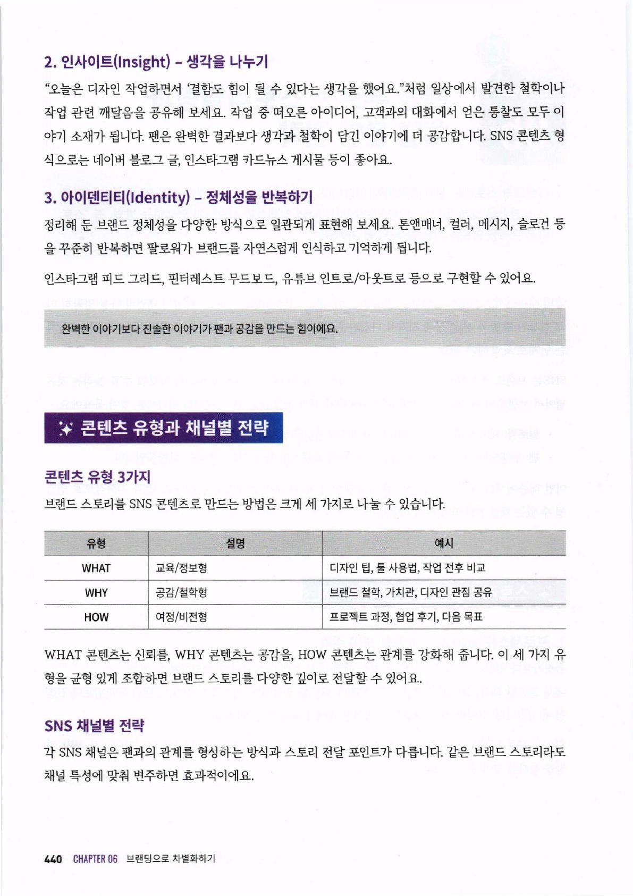

###### 2. 인사이트(Insight) - 생각을 나누기

“오늘은 디자인 작업하면서 ‘결함도 힘이 될 수 있다는 생각을 했어요."처럼 일상에서 발견한 철학이나 작업 관련 깨달음을 공유해 보세요. 작업 중 떠오른 아이디어, 고객과의 대화에서 얻은 통찰도 모두 이 야기 소재가 됩니다. 팬은 완벽한 결과보다 생각과 철학이 담긴 이야기에 더 공감합니다. SNS 콘텐츠 형 식으로는 네이버 불로그 글, 인스타그램 카드뉴스 계시물 등이 좋아요.

###### 3. (Identity) -

###### 정리해 둔 브랜드 정체성을 다양한 방식으로 일관되게 표현해 보세요. 톤앤매너, 컬러, 메시지, 슬로건 등

울 꾸준히 반복하면 팔로워가 브렌드를 자연스럽게 인식하고 기억하게 됩니다.

###### 인스타그램 피드 그리드, 핀터레스트 무드보드, 유튜브 인트로/아웃트로 등으로 구현할 수 있어요.

이야기보다 공감을

###### | |

###### 3가지

브랜드 스토리를 SNS 콘텐츠로 만드는 방법은 크게 세 가지로 나눌 수 있습니다.

###### I

|I 유형| |예시|
|---|---|---|
|WHAT|교육/정보형|디자인 탈 툴 사용법, 작업 전후 비교|
|WHY|공감1절학형|브랜드 철학, 가지관, 디자인 관점 공유|
|HOW|여정/비전형|프로젝트 과정, 협업 후기, 다음 목표|

WHAT 콘텐츠는 신뢰를, WHY 콘텐츠는 공감을, HOW 콘텐츠는 관계를 강화해 줍니댜 이 세 가지 유

형을 균형 있게 조합하면 브랜드 스토리를 다양한 깊이로 전달할 수 있어요.

###### SNS

각 SNS 채널은 팬과의 관계를 형성하는 방식과 스토리 전달 포인트가 다릅니다. 같은 브랜드 스토리라도

채널 특성에 맞춰 변주하면 효과적이에요.

440 CHAPTER 06 브랜딩으로 자별화하기

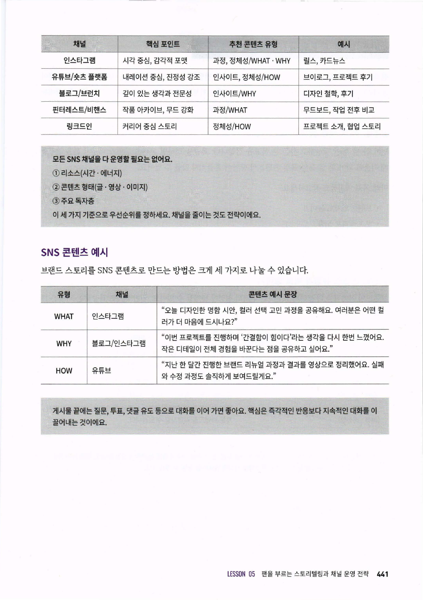

###### I

|I 채널| | | |
|---|---|---|---|
|인스타그램|시각중심,감각적포맷|과정, 정제성/WHAT · WHY|릴스,카드뉴스|
|유튜브/숏츠플랫폼|내레이션 중심, 진정성 강조|인사이트, 정제성/HOW|브이로그, 프로젝트 후기|
|블로그/브런지|깊이있는생각과전문성|인A~OI트/WHY|디자인철학,후기|
|핀터레스트/비핸스|작품 아카이브, 무드 강화|과정/WHAT|무드보드, 작업 전후 비교|
|링크드인|커리어중심스토리|정제성/HOW|프로젝트 소개, 협업 스토리|

###### I|

® · ® 콘텐츠 · ·

###### SNS 콘텐츠예시

브랜드 스토리를 SNS 콘텐츠로 만드는 방법은 크게 세 가지로 나눌 수 있습니다.

| | | |
|---|---|---|
|WHAT|인스타그램|“오늘 디자인한 명함 시안, 컬러 선택 고민 과정을 공유해요. 여러분은 어떤 컬 러가 더 마음에 드시 나요?"|
|WHY|블로그/인스타그램|”이번 프로젝트를 진행하며 ‘간결함이 힘이다’라는 생각을 다시 한번 느꼈어요.  작은 디테일이 전제 경험을 바꾼다는 점을 공유하고 싶어요.”|
|HOW|유튜브|“지난 한 달간 진행한 브랜드 리뉴얼 과정과 결과를 영상으로 정리했어요. 실패  와 수정 과정도 솔직하게 보여드릴게요.”|

I

이어 좋아요. 를 이

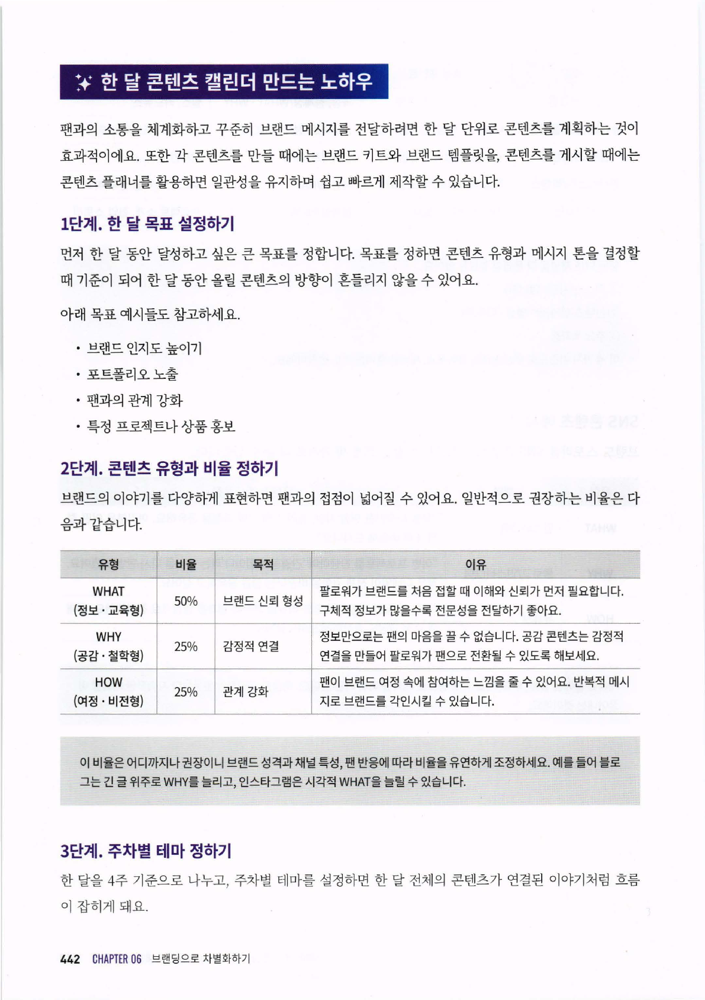

##### :.f 한 달 |

팬과의 소통을 체계화하고 꾸준히 브랜드 메시지를 전달하려면 한 달 단위로 콘텐츠를 계획하는 것이

###### 효과적이에요. 또한 각 콘텐츠를 만들 때에는 브렌드 키트와 브랜드 템플릿을, 콘텐츠를 게시할 때에는

콘텐츠 플래너를 활용하면 일관성을 유지하며 쉽고 빠르게 제작할 수 있습니댜

- 1단계. 한 목표 설정하기 먼저 한 달 동안 달성하고 싶은 큰 목표를 정합니다. 목표를 정하면 콘텐츠 유형과 메시지 톤을 결정할 때 기준이 되어 한 달 동안 올릴 콘텐츠의 방향이 흔들리지 않을 수 있어요.

아래 목표 예시들도 참고하세요.

- • 브랜드인지도높이기
- • 포트폴리오노출
- • 팬과의관계강화
- • 특정 프로젝트나상품홍보

- 2단계. 유형과 비율 정하기 브랜드의 이야기를 다양하게 표현하면 팬과의 접점이 넓어질 수 있어요. 일반적으로 권장하는 비율은 다 움과같습니다.

긴 , 수 .

- 3단계. 주차별 테마 정하기

###### |

| | |목적| |
|---|---|---|---|
|WHAT  (정보 ·교육형)|50%|브랜드신뢰형성|팔로워가 브랜드를 자음 접할 때 이해와 신뢰가 먼저 필요합니다.  구제적 정보가 많을수록 전문성을 전달하기 좋아요.|
|WHY  (공감· 철학형)|25%|감정적연결|정보만으로는 팬의 마음을 꿀 수 없습니다. 공감 콘텐츠는 감정적 연결을 만들어 팔로워가 팬으로 전환될 수 있도록 해보세요.|
|HOW  (여정 · 비전형)|25%|관계강화|팬이 브랜드 여정 속에 잠여하는 느낌을 줄 수 있어요. 반복적 메시  지로 브랜드를 각인시킬 수 있습니다.|

한 달을 4주 기준으로 나누고) 주차별 테마를 설정하면 한 달 전체의 콘텐츠가 연결된 이야기처럼 흐름

이 잡히게 돼요.

442 CHAPTER 06 브랜딩으로 자별화하기

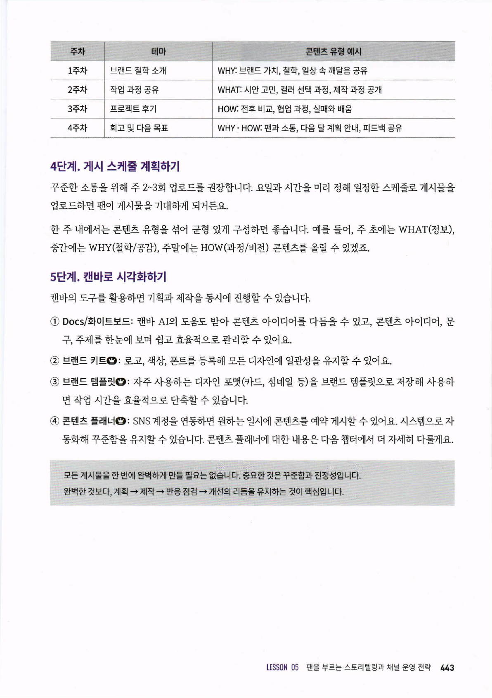

|주차|테Ot| |
|---|---|---|
|1주자|브랜드철학소개|WHY: 브랜드 가지, 절학, 일상 속 깨달음 공유|
|2주자|작업과정공유|WHAT: 시안 고민, 컬러 선택 과정, 제작 과정 공개|
|3주자|프로젝트후기|HOW: 전후 비교, 협업 과정, 실패와 배움|
|4주자|회고잊 다음목표|WHY · How: 팬과 소통, 다음 달 계획 안내, 피드백 공유|

###### I

- 4단계• 게시 스케줄 계획하기 꾸준한 소통을 위해 주 2~3회 업로드를 권장합니다. 요일과 시간을 미리 정해 일정한 스케줄로 게시물을 업로드하면 팬이 게시물을 기대하게 되거든요.

한 주 내에서는 콘텐츠 유형을 섞어 균형 있게 구성하면 좋습니다. 예를 들어, 주 초에는 WHAT(정보),

중간에는 WHY(철학/공감)， 주말에는 HOW(과정/비전) 콘텐츠를 올릴 수 있겠죠.

- 5단계. 캔바로 시각화하기 캔바의 도구를 활용하면 기획과 제작을 동시에 진행할 수 있습니다.

CD Docs/화이트보드: 캔바 AI의 도움도 받아 콘텐츠 아이디어를 다듬을 수 있고, 콘텐츠 아이디어, 문

구, 주제를 한눈에 보며 쉽고 효율적으로 관리할 수 있어요.

® 브랜드 키트O: 로고, 색상, 폰트를 등록해 모든 디자인에 일관성을 유지할 수 있어요. ® 브랜드 템플릿O: 자주 사용하는 디자인 포맷(카드, 섬네일 등)을 브랜드 템플릿으로 저장해 사용하

면 작업 시간을효율적으로단축할수있습니다.

® 콘텐츠 플래너O: SNS 계정을연동하면 원하는일시에 콘텐츠를예약게시할수있어요. 시스템으로자 동화해 꾸준함을 유지할 수 있습니다. 콘텐츠 플래너에 대한 내용은 다음 챕터에서 더 자세히 다룰게요.

한

계획 ➔ ➔ ➔

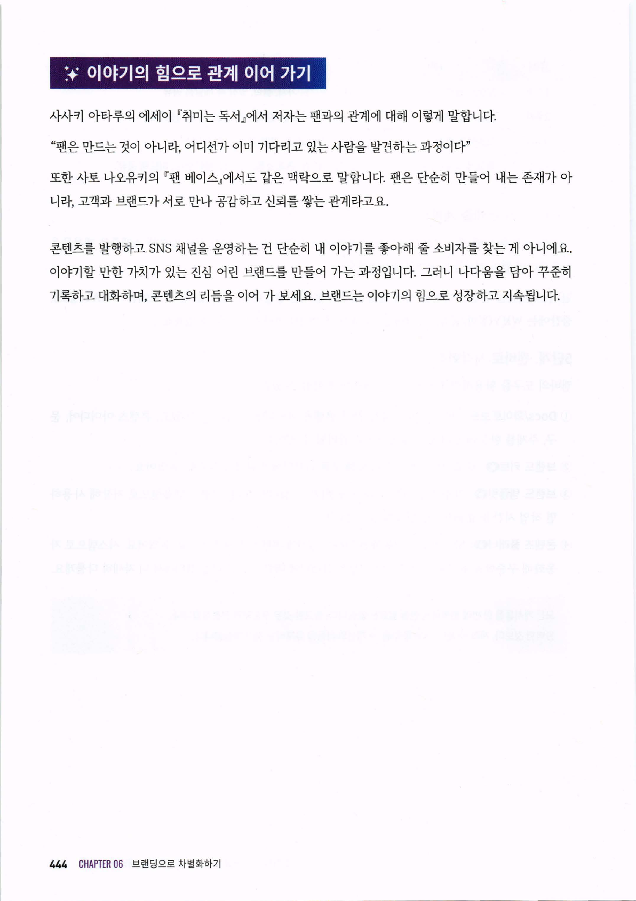

###### | 힘으로관계 ―기 1

사사키 아타루의 에세이 『취미는 독서』에서 저자는 팬과의 관계에 대해 이렇게 말합니다.

"팬은 만드는 것이 아니라, 어디선가 이미 기다리고 있는 사람을 발견하는 과정이다'’

또한 사토 나오유키의 『팬 베이스』에서도 같은 맥락으로 말합니댜 팬은 단순히 만들어 내는 존재가 아

니라, 고객과 브랜드가 서로 만나 공감하고 신뢰를 쌓는 관계라고요.

콘텐츠를 발행하고 SNS 채널을 운영하는 건 단순히 내 이야기를 좋아해 줄 소비자를 찾는 게 아니에요. 이야기할 만한 가치가 있는 진심 어린 브랜드를 만들어 가는 과정입니다. 그러니 나다움을 담아 꾸준히

기록하고 대화하며, 콘텐츠의 리듬을 이어 가 보세요. 브렌드는 이야기의 힘으로 성장하고 지속됩니다.

444 CHAPTER 06 브랜딩으로 자별화하기

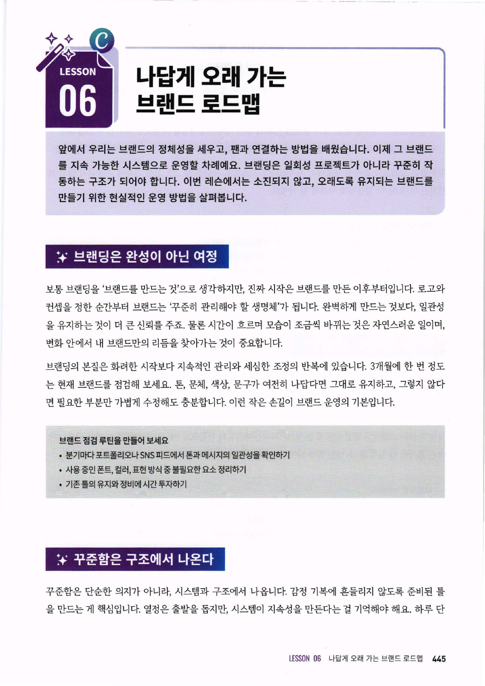

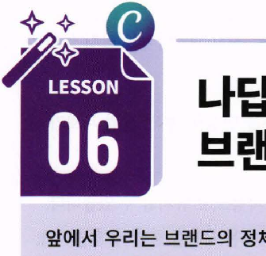

나답게오래가는

###### 브랜드로드맵

이제 그

가능한 시스템으로 프로젝트가 아니라 작 동하는 구조가 되어야 합니다. 이번 레슨에서는 않고, 오래도록 유지되는

현실적인 운영 살펴봅니다.

###### | |

보통 브랜딩을 ‘브랜드를 만드는 것’으로 생각하지만, 진짜 시작은 브랜드를 만든 이후부터입니다. 로고와 컨셉을 정한 순간부터 브랜드는 ‘꾸준히 관리해야 할 생명체’가 됩니다. 완벽하게 만드는 것보다, 일관성 을 유지하는 것이 더 큰 신뢰를 주죠. 물론 시간이 흐르며 모습이 조금씩 바뀌는 것은 자연스러운 일이며,

변화안에서 내 브랜드만의 리듬을찾아가는것이 중요합니댜

브랜딩의 본질은 화려한 시작보다 지속적인 관리와 세심한 조정의 반복에 있습니다. 3개월에 한 번 정도 는 현재 브랜드를 점검해 보세요. 톤, 문체, 색상, 문구가 여전히 나답다면 그대로 유지하고, 그렇지 않다

###### 면 필요한 부분만 가볍게 수정해도 충분합니댜 이런 작은 손길이 브랜드 운영의 기본입니다.

•

• 사용중인폰트,컬

###### | I

꾸준함은 단순한 의지가 아니라, 시스템과 구조에서 나옵니댜 감정 기복에 혼들리지 않도록 준비된 틀

을 만드는 게 핵심입니다. 열정은 출발을 돕지만, 시스템이 지속성을 만든다는 걸 기억해야 해요. 하루 단

LESSON 06 나답게 오래 가는 브랜드 로드맵 445

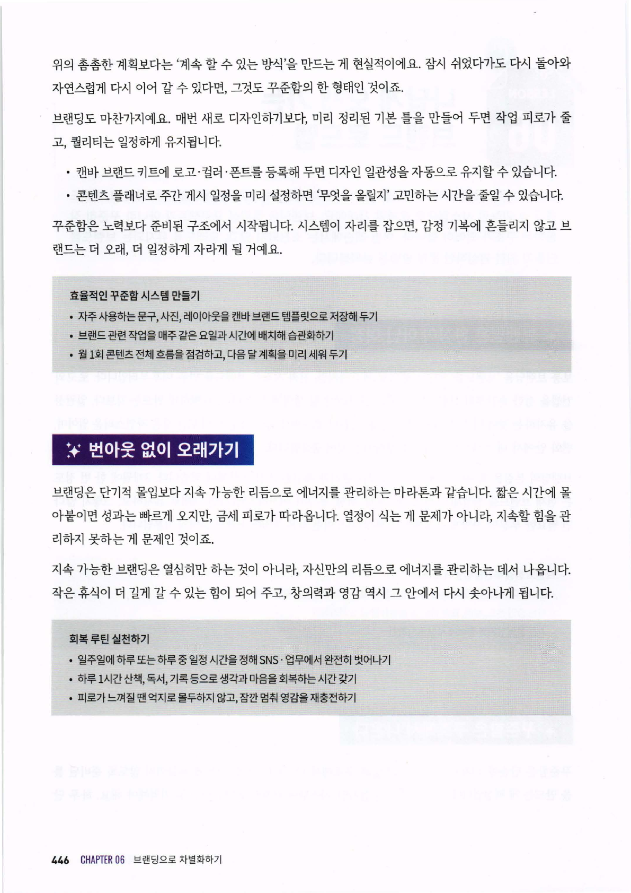

###### 위의 촘촘한 계획보다는 ‘계속 할 수 있는 방식’을 만드는 게 현실적이에요. 잠시 쉬었다가도 다시 돌아와

자연스럽게 다시 이어 갈 수 있다면, 그것도 꾸준함의 한 형태인 것이죠.

###### 브렌딩도 마찬가지예요. 매번 새로 디자인하기보다, 미리 정리된 기본 틀을 만들어 두면 작업 피로가 줄

고, 퀄리티는 일정하게 유지됩니댜

- • 캔바브랜드키트에 로고·컬러 ·폰트를등록해 두면 디자인 일관성을자동으로유지할수있습니다.
- • 콘텐츠 플래너로 주간 계시 일정을 미리 설정하면 ‘무엇을 올릴지’ 고민하는 시간을 줄일 수 있습니다.

###### 꾸준함은 노력보다 준비된 구조에서 시작됩니다. 시스템이 자리를 잡으면, 감정 기복에 흔들리지 않고 브 랜드는 더 오래, 더 일정하게 자라게 될 거예요.

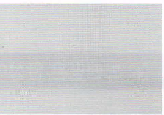

시스템 만들기

•

배치해

• 다음 달 두기

##### | |

###### 브랜딩은 단기적 몰입보다 지속 가능한 리듬으로 에너지를 관리하는 마라톤과 같습니다. 짧은 시간에 몰

아붙이면 성과는 빠르게 오지만, 금세 피로가 따라옵니다. 열정이 식는 게 문제가 아니라, 지속할 힘을 관

리하지 못하는 게 문제인 것이죠.

지속 가능한 브랜딩은 열심히만 하는 것이 아니라, 자신만의 리듬으로 에너지를 관리하는 데서 나옵니다. 작은 휴식이 더 길게 갈 수 있는 힘이 되어 주고, 창의력과 영감 역시 그 안에서 다시 솟아나계 됩니다.

- • 일주일에 하루
- • 하루 1시간 산책,독서, 기록등으로

•

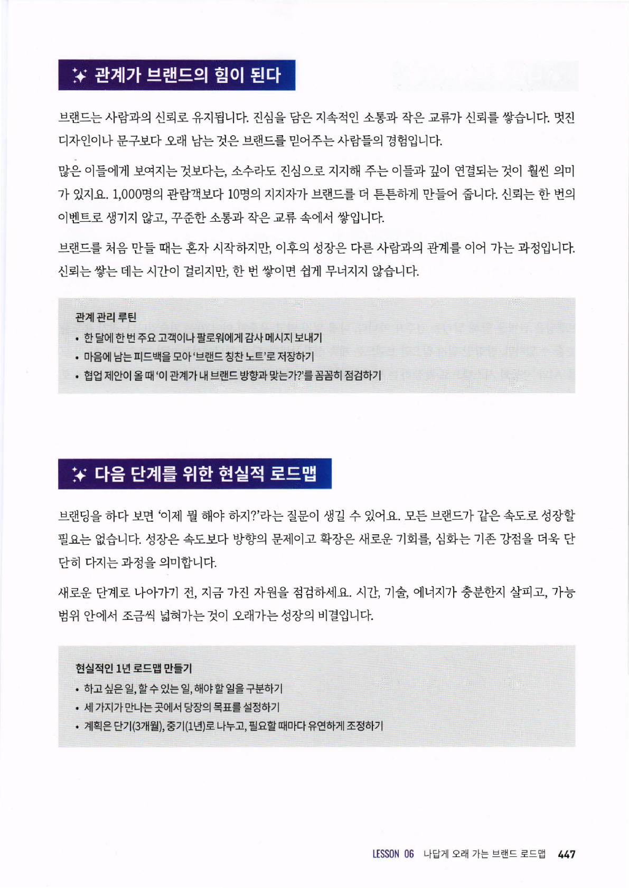

##### | |

브랜드는 사람과의 신뢰로 유지됩니다. 진심을 담은 지속적인 소통과 작은 교류가 신뢰를 쌓습니다. 멋진 디자인이나 문구보다 오래 남는 것은 브랜드를 믿어주는 사람들의 경험입니다.

###### 많은 이들에게 보여지는 것보다는, 소수라도 진심으로 지지해 주는 이들과 깊이 연결되는 것이 훨씬 의미

가 있지요. 1,000명의 관람객보다 10명의 지지자가 브랜드를 더 튼튼하게 만들어 줍니다. 신뢰는 한 번의

이벤트로 생기지 않고, 꾸준한 소통과 작은 교류 속에서 쌓입니댜

브랜드를 처음 만들 때는 혼자 시작하지만, 이후의 성장은 다른 사람과의 관계를 이어 가는 과정입니다. 신뢰는 쌓는 데는 시간이 걸리지만, 한 번 쌓이면 쉽게 무너지지 않습니다.

- • •
- • 협업 제안이 올 때 ‘이 관계가 내 점검하기

###### |

브랜딩을 하다 보면 ‘이제 뭘 해야 하지?'라는 질문이 생길 수 있어요. 모든 브랜드가 같은 속도로 성장할

###### 필요는 없습니댜 성장은 속도보다 방향의 문제이고 확장은 새로운 기회를, 심화는 기존 강점을 더욱 단

단히 다지는 과정을 의미합니댜

###### 새로운 단계로 나아가기 전, 지금 가진 자원을 점검하세요. 시간, 기술, 에너지가 충분한지 살피고, 가능

범위 안에서 조금씩 넓혀가는 것이 오래가는 성 장의 비결입니 다.

- • 구분하기
- • 목표를
- • 은 월 기 나누고, 필 할 조

LESSON 06 나답게 오래 가는 브랜드 로드맵 447

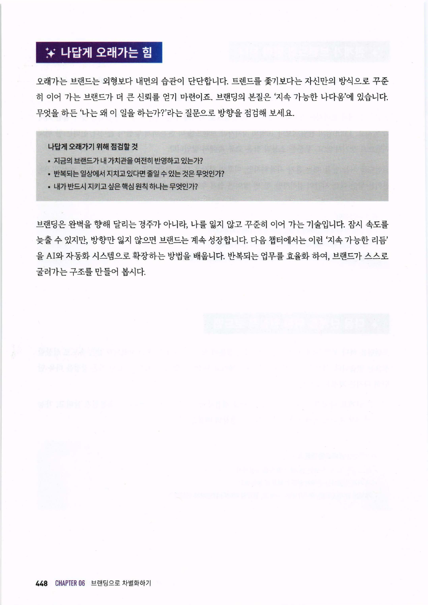

오래가는 브랜드는 외형보다 내면의 습관이 단단합니다. 트렌드를 좇기보다는 자신만의 방식으로 꾸준

히 이어 가는 브랜드가 더 큰 신뢰를 얻기 마련이죠. 브랜딩의 본질은 ‘지속 가능한 나다움'에 있습니다.

무엇을 하든 ‘나는 왜 이 일을 하는가?'라는 질문으로 방향을 점검해 보세요.

- • 내
- • 수 것은
- • 내가 반드시

브랜딩은 완벽을 향해 달리는 경주가 아니라, 나를 잃지 않고 꾸준히 이어 가는 기술입니다. 잠시 속도를

###### 늦출 수 있지만, 방향만 잃지 않으면 브랜드는 계속 성장합니다. 다음 챕터에서는 이런 ‘지속 가능한 리듬’

을 AI와 자동화 시스템으로 확장하는 방법을 배웁니다. 반복되는 업무를 효율화 하여, 브랜드가 스스로 굴러가는 구조를 만들어 봅시댜

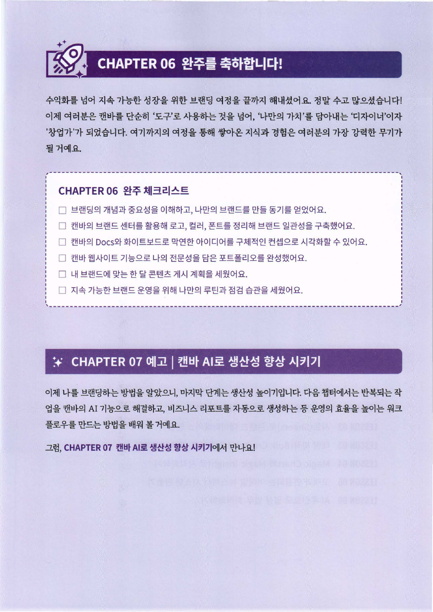

虛j 를

수익화를넘어 여정을끝까지

이제 여러분은 ‘도구’로 사용하는 넘어, ‘나만의 가치’를 담아내는 ‘디자이너'이자 창업가’가 되었습니댜 여기까지의 여정을 쌓아온 지식과 가장 강력한 무기가

될거예요.

###### , 、

###### CHAPTEROG 완주 체크리스트

口 개념과 이해하고, 나만의 얻었어요. 口 캔바의 브랜드 활용해 로고, 컬러, 구축했어요. 口 캔바의 Docs와 화이트보드로 막연한 아이디어를 구제적인 시각화할 수 있어요.

口 웹사이트 나의 담은 완성했어요.

口 내 맞는 달 콘텐츠 게시 세웠어요.

口 지속 가능한 위해 루틴과 세웠어요.

'---------------------------------------- ----------------------- - -- -- - - ----- - - - -- - - - - - ---- - -- ----------------------- - - - - - - - - - - - - - - - - - - - - - ,

## |

이제 나를 브랜딩하는 방법을 , 마지막 단계는 생산성 높이기입니다. 다음 챕터에서는 반복되는 작

캔바의 AI 기능으로 해결하고, 비즈니스 등 높이는 워크 플로우를 만드는 배워 볼 거예요.

###### 그럼, CHAPTER 07 에서

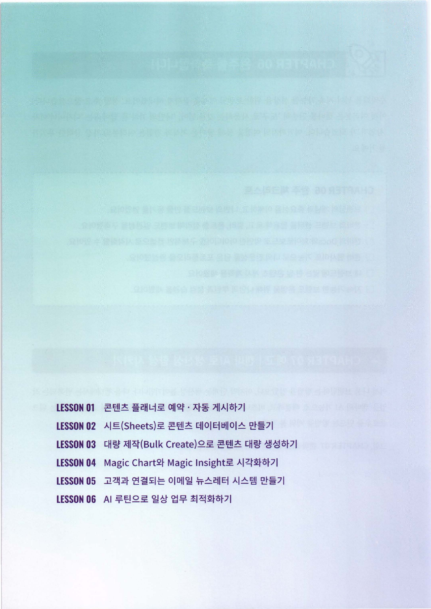

LESSON 01 예약 · 게시하기

###### 시트{Sheets)로 만들기

###### 대량 제작{Bulk Create)으로 대량

LESSON 04 Magic Chart와 Magic Insight로 시각화하기 LESSON 05 고객과 연결되는

Al 업무 죄적화하기

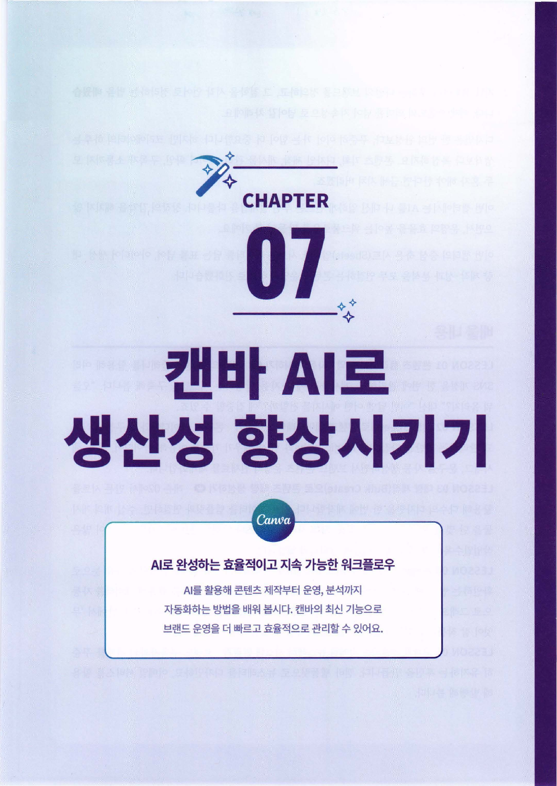

/ 2-

z 수

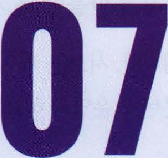

캔바 Al

생산성향상시키기

Al로 완성하는 효율적이고 지속 워크플로우

Al를 콘텐츠 제작부터 운영, 분석까지 배워 캔바의 최신 기능으로

브랜드 운영을 더 빠르고 효율적으로 관리할 수 있어요.

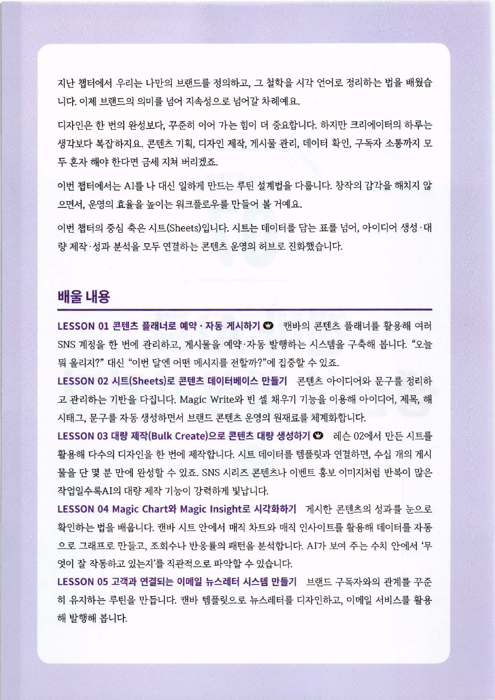

###### 지난 챕터에서 우리는 나만의 브랜드를 정의하고, 그 철학을 시각 언어로 정리하는 법을 배웠습

니댜 이제 브랜드의 의미를 넘어 지속성으로 넘어갈 차례예요.

###### 디자인은 한 번의 완성보다, 꾸준히 이어 가는 힘이 더 중요합니댜 하지만 크리에이터의 하루는

생각보다 복잡하지요. 콘텐츠 기획 디자인 제작, 게시물 관리, 데이터 확인, 구독자 소통까지 모

두 혼자 해야 한다면 금세 지쳐 버리겠죠.

###### 이번 챕터에서는 AI를 나 대신 일하게 만드는 루틴 설계법을 다룹니댜 창작의 감각을 해치지 않

으면서, 운영의 효율을 높이는 워크플로우를 만들어 볼 거예요.

이번 챕터의 중심 축은 시트(Sheets)입니다. 시트는 데이터를 담는 표를 넘어, 아이디어 생성 ·대

량 제작·성과 분석을 모두 연결하는 콘텐츠 운영의 허브로 진화했습니댜

###### 배울내용

• O 캔바의 콘텐츠 플래너를 활용해 여러

###### SNS 계정을 한 번에 관리하고, 계시물을 예약·자동 발행하는 시스템을 구축해 봅니다. “오늘

뭐 올리지?” 대신 “이번 달엔 어떤 메시지를 전할까?”에 집중할 수 있죠.

###### 콘텐츠 아이디어와 문구를 정리하

고 관리하는 기반을 다집니댜 Magic Write와 빈 셀 채우기 기능을 이용해 아이디어, 제목, 해 시태그, 문구를 자동 생성하면서 브랜드 콘텐츠 운영의 원재료를 체계화합니다.

- LESSON 03 Create)으로 O 레슨 02에서 만든 시트를 활용해 다수의 디자인을 한 번에 제작합니다. 시트 데이터를 템플릿과 연결하면, 수십 개의 게시 물을 단 몇 분 만에 완성할 수 있죠. SNS 시리즈 콘텐츠나 이벤트 홍보 이미지처럼 반복이 많은 작업일수록AI의 대량 제작 기능이 강력하게 빛납니다.
- LESSON 04 Magic Chart와 Magic 시각화하기 게시한 콘텐츠의 성과를 눈으로 확인하는 법을 배웁니다. 캔바 시트 안에서 매직 차트와 매직 인사이트를 활용해 데이터를 자동 으로 그래프로 만들고, 조회수나 반응률의 패턴을 분석합니댜 AI가 보여 주는 수치 안에서 ‘무 엇이 잘 작동하고 있는지’를 직관적으로 파악할 수 있습니다.
- LESSON 05 고객과 연결되는 뉴스레터 브렌드 구독자와의 관계를 꾸준 히 유지하는 루틴을 만듭니다. 캔바 템플릿으로 뉴스레터를 디자인하고, 이메일 서비스를 활용 해발행해봅니다.

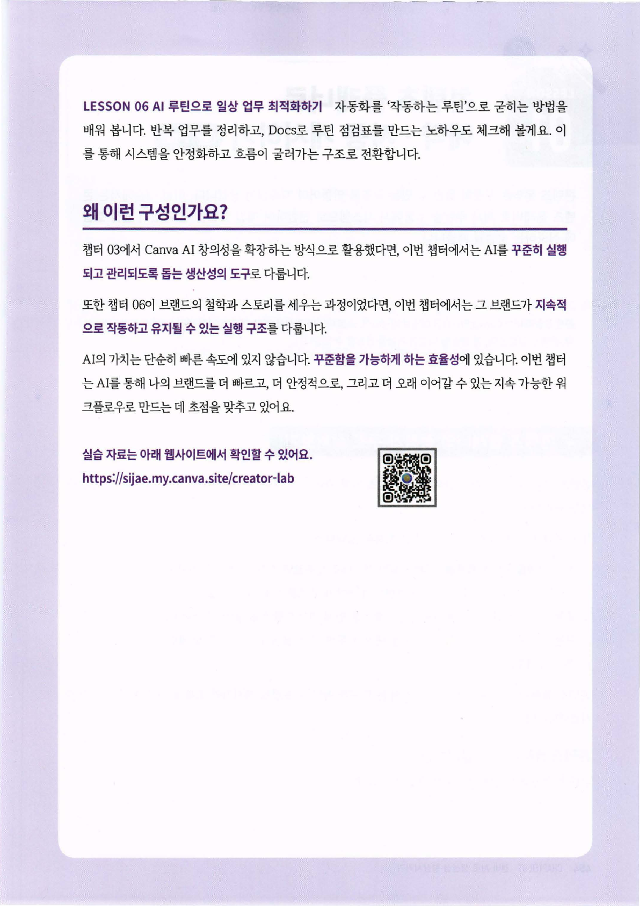

- LESSON 06 Al 루틴으로 일상 업무 자동화를 ‘작동하는 루틴'으로 굳히는 방법을 배워 봅니다. 반복 업무를 정리하고, Docs로 루틴 점검표를 만드는 노하우도 체크해 볼게요. 이 를 통해 시스템을 안정화하고 흐름이 굴러가는 구조로 전환합니다.

###### 왜이런구성인가요?

###### 챕터 03에서 Canva AI 창의성을 확장하는 방식으로 활용했다면, 이번 챕터에서는 AI를 꾸준히

되고 관리되도록 듭는 생산성의 도구로 다룹니다.

###### 또한 챕터 06이 브랜드의 철학과 스토리를 세우는 과정이었다면, 이번 챕터에서는 그 브랜드가 지속적

으로 작동하고 유지될 수 구조를 다룹니다.

AI의 가치는 단순히 빠른 속도에 있지 않습니댜 꾸준함을 가능하게 하는 에 있습니다. 이번 챕터 는 AI를 통해 나의 브랜드를더 빠르고, 더 안정적으로, 그리고더 오래 이어갈수있는지속가능한워

크플로우로 만드는 데 초점을 맞추고 있어요.

수 있어요.

###### https://sijae.my.canva.site/creator-lab

