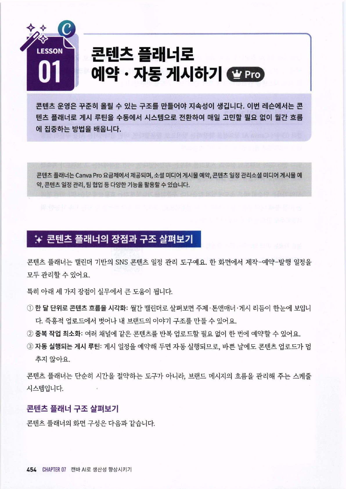

###### 콘텐츠플래너로

###### 예약•자등게시하기 CEO

수 구조롤 지속성이 생깁니다.

###### 게시 수등에서 매일 흐름

에 집중하는 배웁니다.

일정 약, 등 기능을 수

###### | |

콘텐츠 플래너는 캘린더 기반의 SNS 콘텐츠 일정 관리 도구예요. 한 화면에서 제작-예약-발행 일정을

모두관리할수있어요.

특히 아래 세 가지 장점이 실무에서 큰 도움이 됩니다.

® 한 달 단위로 콘텐츠 흐름을 시각화: 월간 캘린더로 살펴보면 주제 ·톤앤매너 ·게시 리듬이 한눈에 보입니

다. 즉흥적 업로드에서 벗어나 내 브랜드의 이야기 구조를 만들 수 있어요.

@ 중복 작업 죄소화: 여러 채널에 같은 콘텐츠를 반복 업로드할 필요 없이 한 번에 예약할 수 있어요.

® 자동 실행되는 게시 루탄 게시 일정을 예약해 두면 자동 실행되므로, 바쁜 날에도 콘텐츠 업로드가 멈

추지않아요.

###### 콘텐츠 플래너는 단순히 시간을 절약하는 도구가 아니라, 브랜드 메시지의 흐름을 관리해 주는 스케줄

시스템입니댜

###### 플래너 구조 살펴보기

###### 콘텐츠 플래너의 화면 구성은 다움과 같습니댜

454 07 캔바 Al로 생산성 향상시키기

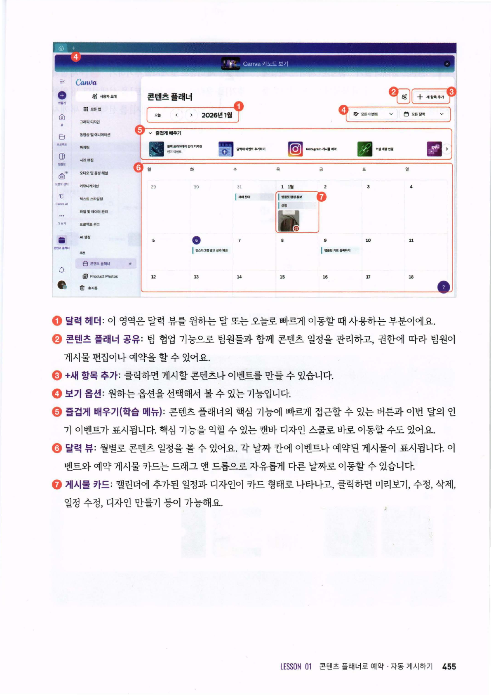

r-\ _ Cdi1V\ \ __ .j

三<O m山 i

###### 힐巳

흰땔지초대

###### q尹모든01뺀트

###### 2026년1월,

###### v ]

王 모든업

###### 오tt

@·

e 모든"

....e)

테"여

·빼..괴O1대OI...,다

###### ...CB

며께업

달어事가빼기

,.....,...,.시.빼

언기어딘

시진턴깁

화

특

급

일

수

토

낱

®

널....,

4

29

30

31

###### l....8어

,C

###### 빼스皇스타

c^'

###### ...

c,.기

###### 프量U!t리

###### ••

Al 샐실

10

9

11

l 펙그••고"心

I """"기

###### “

*

른민스톨례너

。

ProductPhotos

14

15

16

17

18

12

13

® ll-"11

- 0 달력 헤더: 이 영역은 달력 뷰를 원하는 달 또는 오늘로 빠르게 이동할 때 사용하는 부분이에요. O 콘텐츠 플래너 공유: 팀 협업 기능으로 팀원들과 함께 콘텐츠 일정을 관리하고, 권한에 따라 팀원이

게시물 편집이나 예약을 할 수 있어요.

O +새 주가: 클릭하면 게시할 콘텐츠나 이벤트를 만들 수 있습니다. O 보기 옵션: 원하는 옵션을 선택해서 볼수 있는 기능입니다. O 즐겁게 배우기(학습 메뉴)： 콘텐츠 플래너의 핵심 기능에 빠르게 접근할 수 있는 버튼과 이번 달의 인

71 이벤트가 표시됩니댜 핵심 기능을 익힐 수 있는 캔바 디자인 스쿨로 바로 이동할 수도 있어요.

O 달력 뷰 월별로 콘텐츠 일정을 볼 수 있어요. 각 날짜 칸에 이벤트나 예약된 게시물이 표시됩니댜 이

벤트와 예약 계시물 카드는 드래그 앤 드롭으로 자유롭게 다른 날짜로 이동할 수 있습니다.

O 게시물 카드: 캘린더에 추가된 일정과 디자인이 카드 형태로 나타나고, 클릭하면 미리보기, 수정, 삭제,

일정 수정, 디자인 만들기 등이 가능해요.

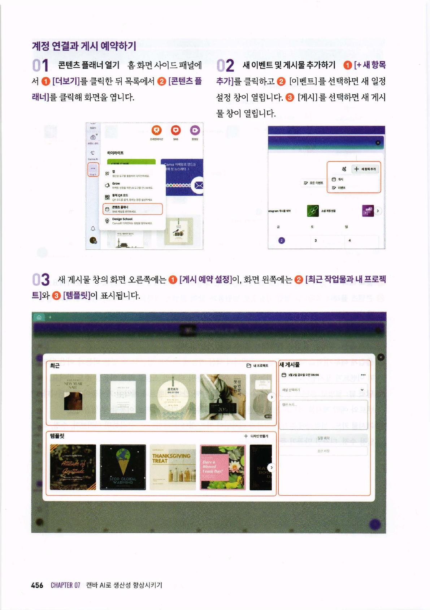

게시

- 1 콘텐츠플래너열기 홈화면사이드패널에 n2 새이벤트및게시물주가하기 O[＋새항목

서 O 를클릭한 뒤 목록에서 O [콘텐츠플 주가]를 클릭하고 [이벤트]를선택하면 새 일정

를클릭해화면을엽니댜 설정 창이 열립니다. [게시]를선택하면새게시

물창이 열립니다.

###### o0广

###### •••

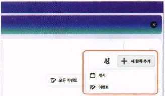

..... ....UUJ15 "s t뺄싫

@..

·C l\01라이트

###### 디

참 엽

*살 도구...... qq업＂기요

이....실1...”도구1뻔냐.嶋

0 요

o. "I' 一..... ’토,."" 더)

程 " QR뚜

야....．개.•확·••·••1세•

###### 巳@~'InSchoo1

C· 디자...........鼠

얼

。

뇨

###### 3 새 게시물창의 화면오른쪽에는O[게시예약설정]이, 화면 왼쪽에는O [최근작업물과내프로젝

###### 트]와 이 표시됩니다.

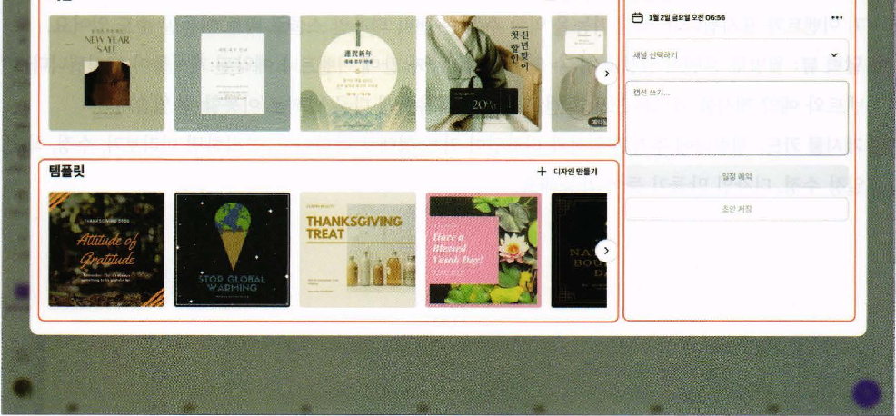

###### 든j l를 저글요혈오면"

새넬신q리기

###### 456 CHAPTER 07 캔바 Al로 생산성 향상시키기

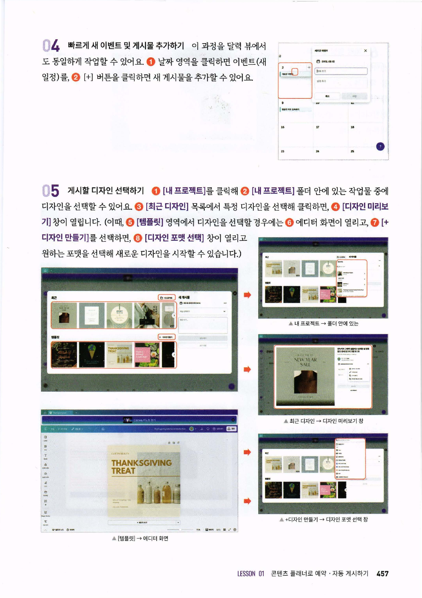

###### 04 빠르게새 이벤트및게시물주가하기 이 과정을달력 뷰에서

###### ......., X

도동일하게 작업할수있어요. 날짜영역을클릭하면 이벤트(새

e m""

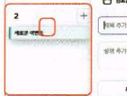

일정)를, [+] 버튼을클릭하면새게시물을추가할수있어요.

###### ..”

•• 서‘

l......"m

•

###### 1· ” ”

”

2S

23

- 5 게시할디자인선택하기 O [내프로젝트]를클릭해O [내프로젝트]폴더 안에 있는작업물중에

디자인을선택할 수 있어요. O [최근 디자인] 목록에서 특정 디자인을 선택해 클릭하면, O 미리보

기] 창이 열립니댜 (이때, 영역에서 디자인을선택할경우에는 에디터 화면이 열리고, [+

디자인 만들기]를 선택하면, O [디자인 포맷 선택] 창이 열리고

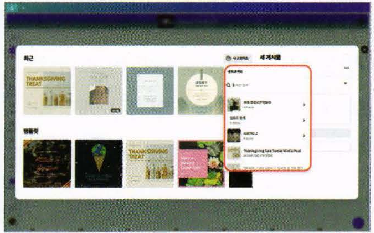

원하는포맷을선택해 새로운디자인을시작할수있습니다.)

•

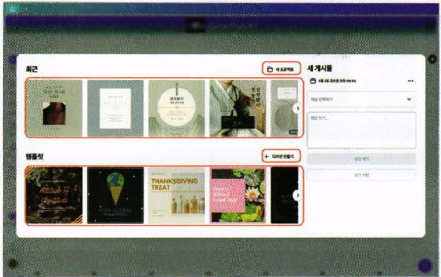

.t. 내 프로젝트 ➔ 폴더 안에 있는

•

~ 최근 디자인 --+ 디자인 미 리보기 장

e-

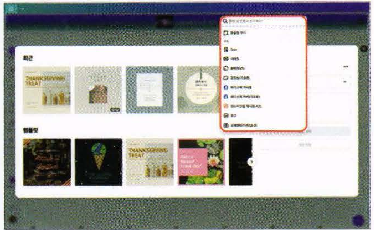

•

a .. c

蠶

T

。

4 " or"

ei •

~ +디자인 만들기 ---+ 디자인 포맷 선택 장

; ,,...모 0- ". s-" "` ••• o

.. ［템플릿] ➔ 에디터 화면

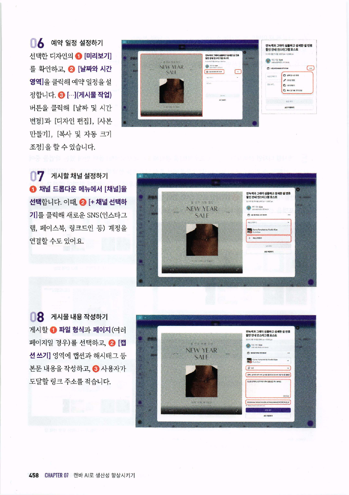

- 06 예약 일정 설정하기

선택한 디자인의 O 를 확인하고, O 시간

영역]을클릭해예약일정을설

정합니댜 O […］（게시물 작업)

버튼을 클릭해 [날짜 및 시간 변경]과 [디자인 편집] , ［사본

만들기] , [복사 및 자동크기 조정]을할수있습니댜

- 07 게시할채널설정하기

O 채널 드롭다운 매뉴에서 [채널]을

선택합니댜 이때, 0 [＋채널 선택하

를 클릭해 새로운 SNS(인스타그

램, 페이스북, 링크드인 등) 계정을 연결할수도있어요.

- 08 게시물내용작성하기

연녹색과 그레이 십플하고 싱세한실 연휴 포스트

혈연안내연스티그I... 표

던^""서시를 U嶋00 ·'0"’

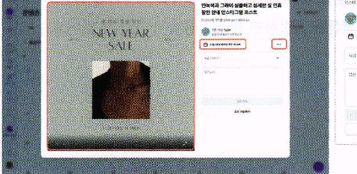

안그실...고실嶋던촬먼鼻

안든덴 ...

'"'"`...20일

###### C3

• ::·군7戶

###### .,,,..

e'”"""오""

I o一·-"~ I

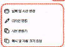

연녹색과그데이 싱를하고 섭세한설 연휴

할인 언스티그11 포스트

론시,,.게서. '"드 · “戶

•土::：：：""麟

글―.... :

e ··""."'""

” `""`

게시할 파일 과 페이지 (여러

연득색과 그데이 설 연휴 할언 안내 인스타그뺄 포스트

페이지일 경우)를 선택하고, O

...,a.｀u, "“•U潟O.

• z::::::'..-

:I 나 .'I'

e ,.""`··-

션쓰기] 영역에 캡션과해시태그등

f

###### ,.'""'--.,…"...

본문내용을작성하고,e사용자가

묘 ”

(O" v l

###### (1..,~~· - ..면"＇）

......고•n..,........,嵐

도달할링크주소를적습니댜

458 CHAPTER 07 캔바 Al로 생산성 향상시키기

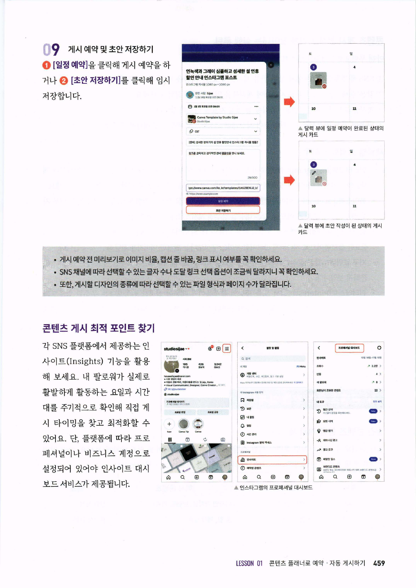

###### 09 게시예약및조안저장하기

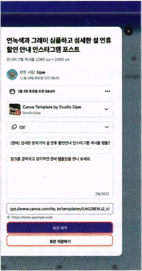

얼

토

。

O [일정 예약]을클릭해 게시 예약을하 거나 O [조안 저장하기]를 클릭해 임시

‘`

###### i

섬세한

포스트

®

언스q그뺄 게•I■1080P' • 1080p,

저장합니다.

!!른사 의

ll· 며 -•0O'

已 1.........”

10 11

=:.-·.,.St一一q,「f-’'＂

.... 달력 뷰에 일정 예약이 완료된 상태의

© GIF

게시카드

# .I~

llMI 불 ""가터 볼 연홑曺던던내언-...그• 쩌-

얼

••릭하고 론벼뺄量밋.l!!4 보세오.

,.1500

ll

~ 달력 뷰에 조안작성이 된 상태의 게시 ?f드

•

•

###### 콘텐츠 게시 최적 포인트 찾기

~ V· ®러크

###### l 드 °1

###### ”`··

각 SNS 플랫폼에서 제공하는 인

###### 연사" " '...,,....

- 덥.. &: 뇨업’

사이트 (Insights) 기능을 활용

겁세

.Er'..."'_＇"＂..I,』．山£

조 ' 적 >

###### 내게. 이""°

® ..”터던,．현....．’'분불멸

>

해 보세요. 내 팔로워가 실제로

먼를

• > 섀•量嶋 ' s >

·빠""......대.,,...,.._

_.,............볼`.,‘’._.. .....

°..도구1Rt가난달m외촬‘1111!!빼雙뻬R -...”)

· -F]·T ,「km.o,,U ,">O-니타

+.....•ie

0m 넘～도급다

###### 활발하게 활동하는 요일과 시간

22 >

내 -n 땐•낙

.',,,”'’’' '

口 唄,.

###### ......

, ••

» .츠따, D22t.

대를 주기적으로 확인해 직접 게

O 꼬

###### ©오뺑뻔 ‘’)

@ ...를

###### 시 타이밍을 찾고 최적화할 수

O n

###### 9 뺄11연기

I

O 떠간러 g m다m1헐리`

m

있어요. 단, 플랫폼에 따라 프로

®

###### 4\ 빡 백물고

, .고도구

’mm릴스 )

페셔널이나 비즈니스 계정으로 설정되어 있어야 인사이트 대시 보드 서비스가 제공됩니다.

를...

안떠量

El 드llf!....뺀L도Cl5.-![壘k.른rJ!1다러嶋亭"灣llL’가：셔터Ki 튼뺀a. )

0 """론"" >

Q Q o e o

G Q G e

~ 인스타그램의 프로페셔널 대시보드

LESSON 01 콘텐츠 플래너로 예약 · 자동 게시하기 459

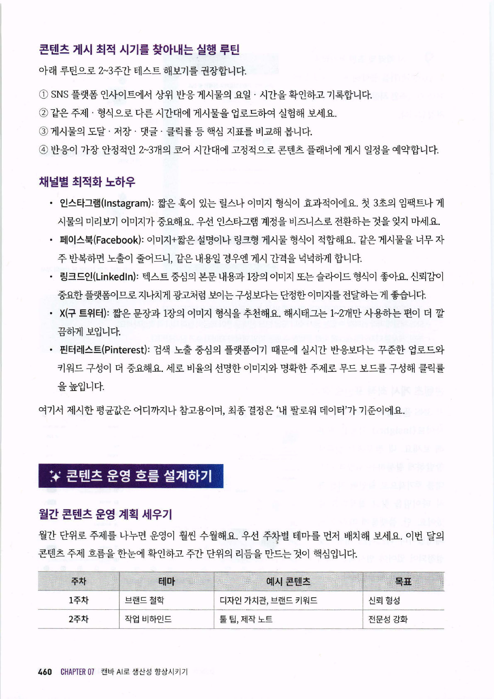

###### 콘텐츠 게시 최적 시기를 찾아내는 실행 루틴

아래 루틴으로 2~3주간 테스트 해보기를 권장합니다. @ SNS 플랫폼 인사이트에서 상위 반응 게시물의 요일 · 시간을 확인하고 기록합니다. @ 같은 주제 · 형식으로 다른 시간대에 게시물을 업로드하여 실험해 보세요. ® 게시물의 도달 · 저장 · 댓글 · 클릭률 등 핵심 지표를 비교해 봅니다. ® 반응이 가장 안정적인 2~3개의 코어 시간대에 고정적으로 콘텐츠 플래너에 게시 일정을 예약합니다.

###### 채널별최적화노하우

- • 인스타그램(lnstagram): 짧은 혹이 있는 릴스나 이미지 형식이 효과적이에요. 첫 3초의 임팩트나 게 시물의 미리보기 이미지가 중요해요. 우선 인스타그램 계정을 비즈니스로 전환하는 것을 잊지 마세요.
- • 페이스북(Facebook)： 이미지+짧은 설명이나 링크형 게시물 형식이 적합해요. 같은 게시물을 너무 자 주 반복하면 노출이 줄어드니, 같은 내용일 경우엔 게시 간격을 넉넉하게 합니다.
- • 링크드인(LinkedIn)： 텍스트 중심의 본문 내용과 1장의 이미지 또는 슬라이드 형식이 좋아요. 신뢰감이 중요한 플랫폼이므로 지나치게 광고처럼 보이는 구성보다는 단정한 이미지를 전달하는게 좋습니다.
- • X(구 트위터)： 짧은 문장과 1장의 이미지 형식을 추천해요. 해시태그는 1~2개만 사용하는 편이 더 깔 끔하게보입니다.
- • 핀터레스트(Pinterest): 검색 노출 중심의 플랫폼이기 때문에 실시간 반응보다는 꾸준한 업로드와 키워드 구성이 더 중요해요. 세로 비율의 선명한 이미지와 명확한 주제로 무드 보드를 구성해 클릭률 을높입니다.

여기서 제시한 평균값은 어디까지나 참고용이며, 최종 결정은 ‘내 팔로워 데이터’가 기준이에요.

###### | 운영 흐름설계하기 |

###### 콘텐츠 계획 세우기

###### 월간 단위로 주제를 나누면 운영이 훨씬 수월해요. 우선 주각별 테마를 먼저 배치해 보세요. 이번 달의

콘텐츠 주제 흐름을 한눈에 확인하고 주간 단위의 리듬을 만드는 것이 핵심입니다.

###### I I

|I| | | |
|---|---|---|---|
|1주자|브랜드절학|디자인 가지관, 브랜드 키워드|신뢰형성|
|2주자|작업 비하인드|툴답제작노트|전문성강화|

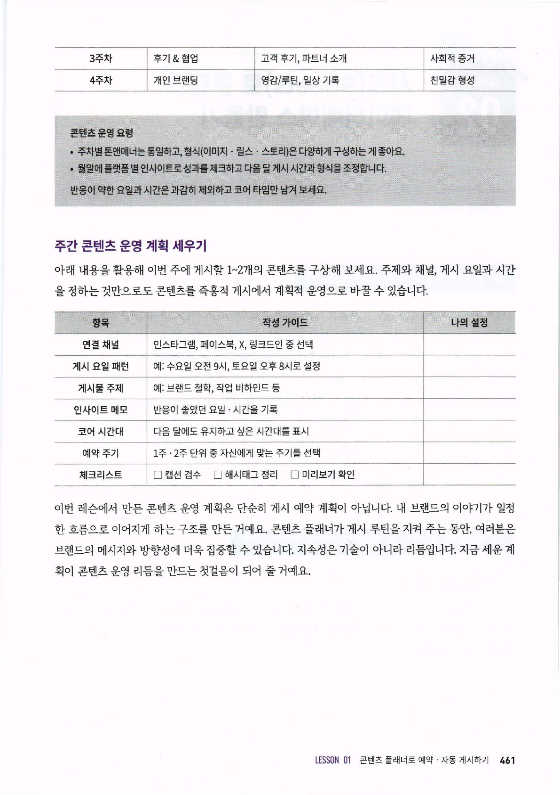

후기&협업

고객후기, 파트너소개

사회적증거

- 3주자
- 4주자

영감/루틴, 일상기록

진밀감형성

개인브랜딩

- • · ·
- • 별

시간은 보세요.

주간 콘텐츠 계획 세우기

아래 내용을 활용해 이번 주에 게시할 1~2개의 콘텐츠를 구상해 보세요. 주제와 채널, 게시 요일과 시간 을정하는것만으로도콘텐츠를즉흥적 게시에서 계획적 운영으로바꿀수있습니다.

###### I I

연결채널 인스타그램, 페이스북, X, 링크드인 중 선택

게시요일패턴 예: 수요일 오전 9시 , 토요일 오후 8시로 설정

게시물주제 예: 브랜드 절학, 작업 비하인드 등

인사이트메모 반응이 좋았던 요일 · 시간을 기록

코어시간대 다음 달에도 유지하고 싶은 시간대를 표시

예약주기 1주 · 2주 단위 중 자신에게 맞는 주기를 선택

제크리스트 口 캡션검수 口 해시태그 정리 曰 미리보기확인

이번 레슨에서 만든 콘텐츠 운영 계획은 단순히 게시 예약 계획이 아닙니다. 내 브랜드의 이야기가 일정

###### 한 흐름으로 이어지게 하는 구조를 만든 거예요. 콘텐츠 플래너가 계시 루틴을 지켜 주는 동안, 여러분은

브랜드의 메시지와 방향성에 더욱 집중할 수 있습니다. 지속성은 기술이 아니라 리듬입니다. 지금 세운 계

###### 획이 콘텐츠 운영 리듬을만드는첫걸음이 되어 줄 거예요.

LESSON 01 콘텐츠 플래너로 예약 · 자동 계시하기 461

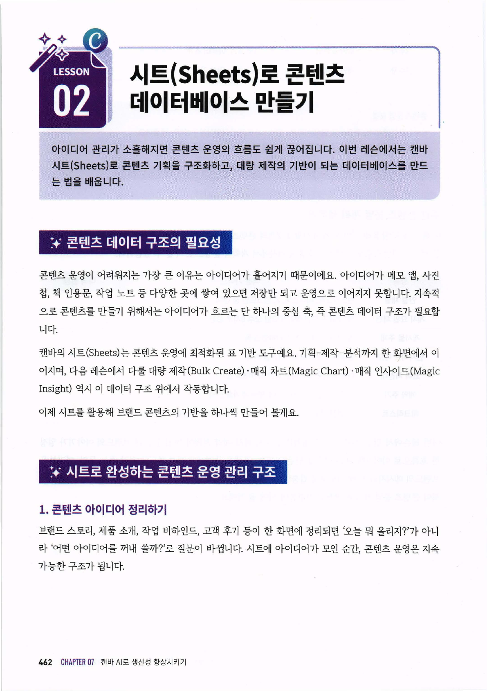

###### 시트(Sheets)로 콘텐츠

###### 데이터베이스만틀기

아이디어 소홀해지면

시트(Sheets)로 기획을 구조화하고, 기반이 되는

###### I

콘텐츠 운영이 어려워지는 가장 큰 이유는 아이디어가 흩어지기 때문이에요. 아이디어가 메모 앱, 사진

첩, 책 인용문, 작업 노트 등 다양한 곳에 쌓여 있으면 저장만 되고 운영으로 이어지지 못합니다. 지속적

###### 으로 콘텐츠를 만들기 위해서는 아이디어가 흐르는 단 하나의 중심 축, 즉 콘텐츠 데이터 구조가 필요합

니다.

캔바의 시트(Sheets)는 콘텐츠 운영에 최적화된 표 기반 도구예요. 기획-제작-분석까지 한 화면에서 이 어지며, 다움 레슨에서 다룰 대량 제작(Bulk Create) ·매직 차트(Magic Chart) ·매직 인사이트(Magic Insight) 역시 이 데이터 구조위에서 작동합니다.

이제 시트를 활용해 브렌드 콘텐츠의 기반을 하나씩 만들어 볼게요.

###### | I

###### 1. 아이디어 정리하기

###### 브랜드 스토리, 제품 소개, 작업 비하인드, 고객 후기 등이 한 화면에 정리되면 ‘오늘 뭐 올리지?'가 아니

라 ‘어떤 아이디어를 꺼내 쓸까?'로 질문이 바뀝니다. 시트에 아이디어가 모인 순간, 콘텐츠 운영은 지속 가능한 구조가 됩니다.

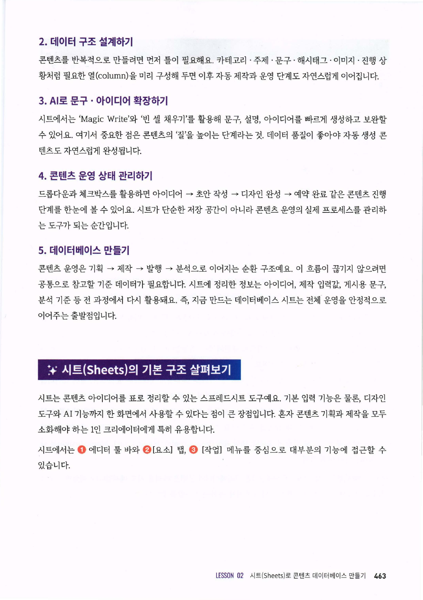

- 2. 데이터 구조 설계하기 콘텐츠를 반복적으로 만들려면 먼저 툴이 필요해요. 카테고리 · 주제 · 문구 · 해시태그 · 이미지 · 진행 상 황처럼 필요한 열(column)을 미리 구성해 두면 이후 자동 제작과 운영 단계도 자연스럽게 이어집니다.
- 3. Al로 문구 • 아이디어 확장하기 시트에서는 ‘Magic Write'와 ‘빈 셀 채우기’를 활용해 문구, 설명, 아이디어를 빠르게 생성하고 보완할 수 있어요. 여기서 중요한 점은 콘텐츠의 떨'올 높이는 단계라는 것. 데이터 품질이 좋아야 자동 생성 콘 텐츠도 자연스럽게 완성됩니다.
- 4 상태 관리하기

드롭다운과 체크박스를 활용하면 아이디어 一 초안 작성 一 디자인 완성 一 예약 완료 같은 콘텐츠 진행

단계를 한눈에 볼 수 있어요. 시트가 단순한 저장 공간이 아니라 콘텐츠 운영의 실제 프로세스를 관리하 는 도구가 되는 순간입니댜

- 5. 데이터베이스 만톨기

###### 콘텐츠 운영은 기획 一 제작 一 발행 一 분석으로 이어지는 순환 구조예요. 이 흐름이 끊기지 않으려면

공통으로 참고할 기준 데이터가 필요합니댜 시트에 정리한 정보는 아이디어, 제작 입력값, 게시용 문구,

분석 기준 등 전 과정에서 다시 활용돼요. 즉, 지금 만드는 데어터베이스 시트는 전체 운영을 안정적으로

이어주는출발점입니댜

###### - 기븐 j

시트는 콘텐츠 아이디어를 표로 정리할 수 있는 스프레드시트 도구예요. 기본 입력 기능은 물론, 디자인 도구와 AI 기능까지 한 화면에서 사용할 수 있다는 점이 큰 장점입니다. 혼자 콘텐츠 기획과 제작을 모두 소화해야 하는 1인 크리에이터에게 특히 유용합니댜

시트에서는 O 에디터 툴 바와 [요소] 탭, O [작업] 메뉴를 중심으로 대부분의 기능에 접근할 수

있습니다.

LESSON 02 시트(Sheets)로 콘텐츠 데이 터 베이스 만들기 463

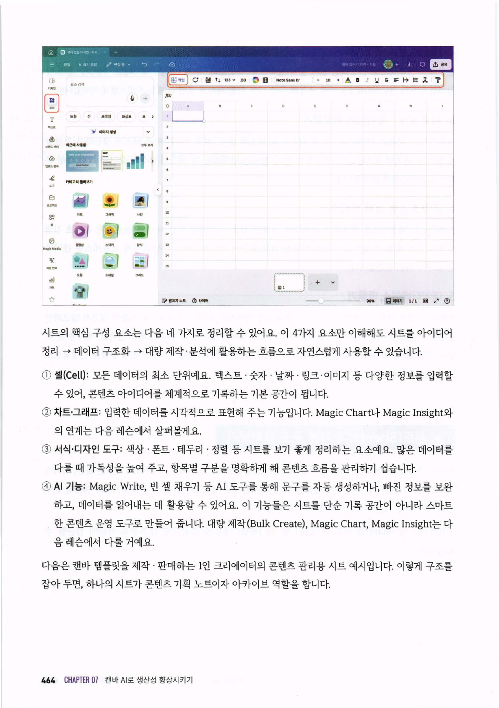

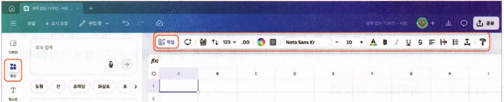

###### ^

###### R

0 ^

###### `L_I

"...

선

II. >

도혈

묘혜일

’이아지쉘설

’

@

으• .,,

•• o

- • •

고

w

g

- ••• •

### .-

###### I

。

###### ."”&g

I-

。

###### "...

f

사민 l0

8?

###### •

”>

###### e n

###### -w-

,

I

###### ·‘

소이머

###### "

\.

###### 또 l

###### "...

i t

:....... ....－＿겨

실"

+

됴“

객S

i111............i

!

合 컵’曺11>1노 0印l어 ""'지 .· 。j

I~

•

시트의 핵심 구성 요소는 다음 네 가지로 정리할 수 있어요. 이 4가지 요소만 이해해도 시트를 아이디어

###### 정리 一 데이터 구조화 一 대량 제작 ·분석에 활용하는 흐름으로 자연스럽게 사용할 수 있습니다.

###### ® 셀(Cell): 모든 데이터의 최소 단위예요. 텍스트 · 숫자 · 날짜 · 링크·이미지 등 다양한 정보를 입력할

수 있어 , 콘텐츠 아이디어를 체계적으로 기록하는 기본 공간이 됩니댜

© 자트·그래프: 입력한 데이터를 시각적으로 표현해 주는 기능입니댜 Magic Chart나 Magic Insight와

의 연계는 다음 레슨에서 살펴볼게요.

® 서식·디자인 도구: 색상 ·폰트 · 테두리 · 정렬 등 시트를 보기 좋게 정리하는 요소예요. 많은 데이터를

다룰 때 가독성을 높여 주고, 항목별 구분을 명확하계 해 콘텐츠 흐름을 관리하기 쉽습니다.

@ Al 기능: Magic Write, 빈 셀 채우기 등 AI 도구를 통해 문구를 자동 생성하거나, 빠진 정보를 보완 하고, 데이터를 읽어내는 데 활용할 수 있어요. 이 기능들은 시트를 단순 기록 공간이 아니라 스마트

한 콘텐츠 운영 도구로 만들어 줍니다. 대량 제작(Bulk Create), Magic Chart, Magic Insight는 다

움 레슨에서 다룰 거예요.

다음은 캔바 템플릿을 제작 · 판매하는 1인 크리에이터의 콘텐츠 관리용 시트 예시입니다. 이렇게 구조를

잡아 두면, 하나의 시트가 콘텐츠 기획 노트이자 아카이브 역할을 합니다.

464 CHAPTER 07 캔바 Al로 생산성 향상시키가

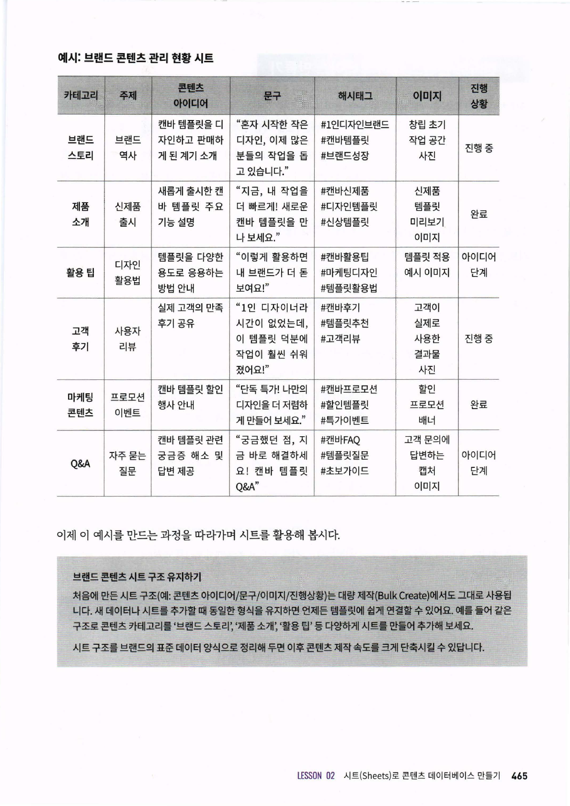

예시: 브랜드 콘텐츠 관리 현황 시트

###### ’圈고리

캔바템플릿을디 ‘‘혼자시작한작은 #1인디자인브랜드 창립조기 브랜드 브랜드 자인하고 판매하 디자인, 이제 많은 #캔바템플릿 작업공간

진행중

스토리 역사 게된계기소개 분들의 작업을 돕 #브랜드성장 사진

고있습니댜’’

새롭게출시한캔 “지금, 내 작업을 #캔바신제품 신제품 제품 신제품 바 템플릿 주요 더 빠르게! 새로운 #디자인템플릿 템플릿

완료 소개 출시 기능설명 캔바 템플릿을 만 #신상템플릿 미리보기

나보세요.” 이미지

템플릿을 다양한 “이렇게 활용하면 #캔1::1~활용팁 템플릿적용 아01 디어 활용팁 용도로 응용하는 내 브랜드가 더 돋 #□周팅디자인 예시이미지 단계

디자인

활용법

방법안내 보여요!” #템플릿활용법 실제고객의 만족 "1 인 디자이너라 #캔바후71 고객이

후기공유 시간이 없었는데, #템플릿주전 실제로

고객 사용자

이 템플릿 덕분에 #고객리뷰 사용한 진행중 후기 리뷰

작업이 훨씬 쉬워 결과물

졌어요!" 사진

캔바템플릿할인 "단독특가! 나만의 #캔바프로모션 할인 행사안내 디자인을더저렴하 #할인템플릿 프로모션 완료

마케팅 프로모션

콘텐츠 이벤트

게만들어보세요.” #특가이벤트 배너

캔바템플릿관련 "궁금했던 점, 지 #캔l:l~FAQ 고객문의에 자주묻는 궁금증 해소 및 금 바로 해결하세 #템플릿질문 답변하는 아이디어

Q&A

질문 답변제공 요! 캔바 템플릿 #조보가이드 캡처 단겨1

Q&A" 이미지

이제 이 예시를만드는과정을따라가며 시트를활용해 봅시다.

구조

만든 시트 구조(예:

새 수

팁’

수

LESSON 02 시트(Sheets)로 콘텐츠 데이터베이스 만둘기 465

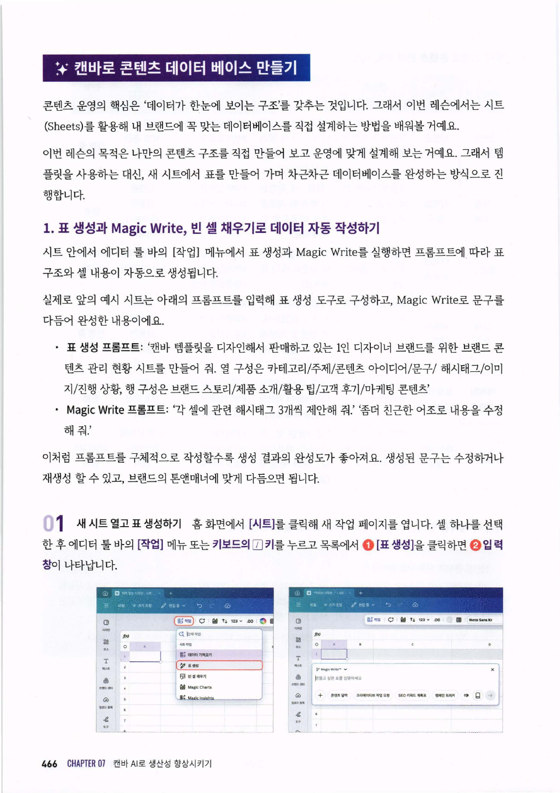

###### | :+ 캔바로콘텐츠 베이 |

###### 콘텐츠 운영의 핵심은 ‘데이터가 한눈에 보이는 구조’를 갖추는 것입니다. 그래서 이번 레슨에서는 시트

(Sheets)를 활용해 내 브렌드에 꼭 맞는 데이터베이스를 직접 설계하는 방법을 배워볼 거예요.

이번 레슨의 목적은 나만의 콘텐츠 구조를 직접 만들어 보고 운영에 맞게 설계해 보는 거예요. 그래서 템

###### 플릿을 사용하는 대신, 새 시트에서 표를 만들어 가며 차근차근 데이터베이스를 완성하는 방식으로 진

행합니댜

###### L 표 Magic Write, 빈 셀 재우기로 데이터 자동 작성하기

시트 안에서 에디터 툴 바의 [작업] 메뉴에서 표 생성과 Magic Write를 실행하면 프롬프트에 따라 표

구조와 셀 내용이 자동으로 생성됩니다.

실제로 앞의 예시 시트는 아래의 프롬프트를 입력해 표 생성 도구로 구성하고, Magic Write로 문구를

다듬어 완성한 내용이에요.

- • 표 생성 프롬프트: ‘캔바 템플릿을 디자인해서 판매하고 있는 1인 디자이너 브랜드를 위한 브랜드 콘 텐츠 관리 현황 시트를 만들어 줘. 열 구성은 카테고리/주제/콘텐츠 아이디어/문구/ 해시태그/이미 지/진행 상황 행 구성은브랜드스토리/제품소개/활용 팁/고객 후기/마케팅 콘텐츠’
- • Magic Write 프롬프트: 깍 셀에 관련 해시태그 3개씩 제안해 줘.’ ‘좀더 친근한 어조로 내용을 수정 해줘.'

###### 이처럼 프롬프트를 구체적으로 작성할수록 생성 결과의 완성도가 좋아져요. 생성된 문구는 수정하거나

재생성 할 수 있고, 브랜드의 톤앤매너에 맞게 다듬으면 됩니다.

###### 1 새시트열고표생성하기 홈화면에서 [시트]를클릭해 새 작업 페이지를엽니댜 셀 하나를선택

###### 한후에디터 툴바의 [작업] 메뉴또는 키보드의 [I] 키를누르고목록에서 [표생성]을클릭하면 입력 창이나타납니댜

I 口 ~ I

CB g

話m: 0 일 " '"" .00 Ill 磁""～＂

###### 0 · 'm

###### 입.. 0 •

器 a

n지

시..

###### T 亡

,

巨中티가卍

T

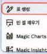

•

.,, .....m .. V

.....龜 ~I"""영•1세요

® '

.u..

###### .....o, I + 튼"" 크뻔如•...,．혈 S[0""" "",.,. .. g ➔

###### .

G) •

•”..

4 , ~

466 CHAPTER 07 캔바 Al로 생산성 향상시키기

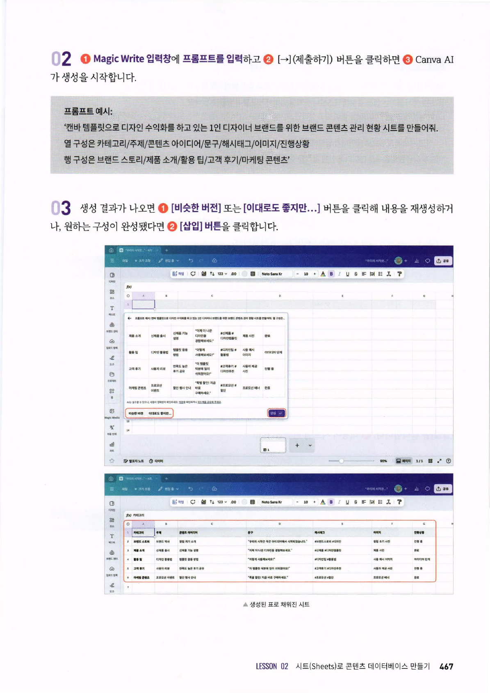

###### 2

0 Magic Write 입력장에 입력하고O [기 (제출하기) 버튼을 클릭하면 E) Canva AI

가생성을시작합니다.

하고

열

###### 3

생성 결과가 나오면 O 버전] 또는 [이대로도좋지만…] 버튼을 클릭해 내용을 재생성하거 나, 원하는구성이 완성됐다면 O 버튼을클릭합니다.

###### ’

認 a

。

###### 亡

T i

q.안uu기나

###### .L'....

.. • . ....... 皇요. q....." ..＂'rn"＂＂드I ”현嵐""........서.........구.._

총

..‘’빼

###### ...。 ""

기

“사진

###### 환量

신빼틀•^

”

다UII릿

률••量峰요•

디•‘` ··밋••

..,．게

· •

서를 빼시 아

4 "

·롤

아에미어단계

"

떄......,,.

..법

..,"'

·고젝"' .

던．드"

사""

열...

”를

땐지려"

고젝.,,

e

專기 골롭

디지연專현

사띤

서"JIOlar

-

m ..

••• 曺1 지a

프.모신 어뺀•

怨·

묘．모신 1 환로

曾인 ·사안내

###### .......`'4내.....빼. u."'"'曾·f`••.••..

구빼혀세요•• 촬언

g_ ( 玉 一·코

X

g

····•~_..•••..•..,

i. :.

실"

+

`II, ..J:

{

."‘ Iii- 1/1 蠶 ••

규•"". 。印

·

|:□ 一 m

e g g8

距m 。 낼 tL 123 V .00 1111 NotoS壘""' - 10 + .A, B I !.1 61" 떠 三 i

" '디고려

‘

a

0 •

###### ,'-......... ....도 ~-••폐기"

”

###### T ~

빠떠

때..

·서빼기

•••

•• 홑기서•

••• • •""' 락톤 야마대니 시••••니••

."．도쇼鳳" ”끄지언

••

....."""'...

...0lOI 인폐

· .........

- • ...소제 신•••시 ••• 기•••

.... ...........""

- • 고• .,, ...도••.,,..
- • ........... .,,......

•• 서•

춥

.”"_••,,.

###### .....

量"..

"u""'’•••

......

.........

·고...,,¢"＂'..

·여.......讐”*＂• .,.

。

시·지"...,

•••．인•• ..

••

홑던

' 4" ’

~ 생성된 표로 채워진 시트

###### LESSON 02 시트(Sheets)로 콘텐츠 데이터베이스 만들기 467

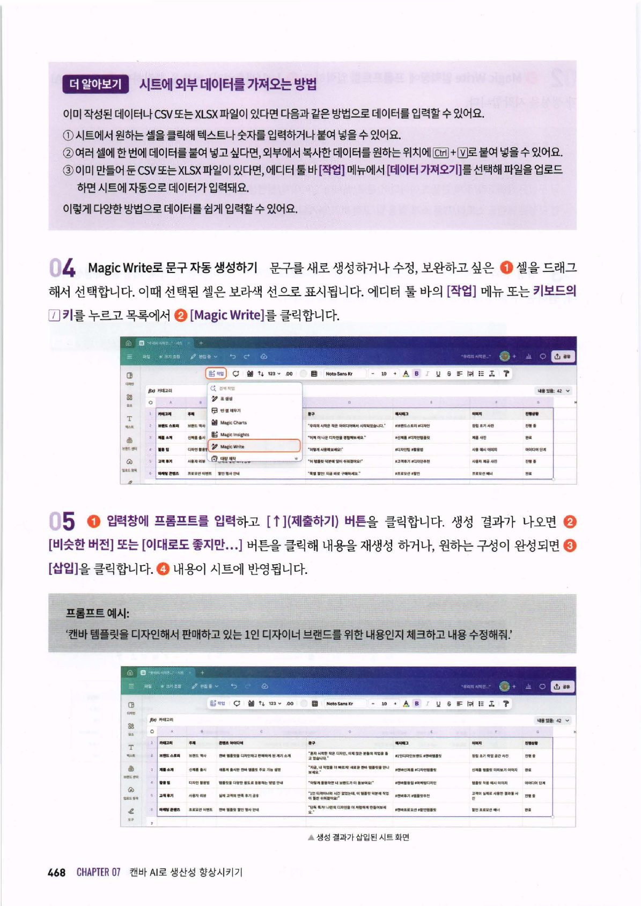

- 시트에외부 가져오는

이미작성된데이터나 CN또는 XLSX 파일이있다면다음과같은방법으로데이터를입력할수있어요.

G) 시트에서 원하는 수 있어요.

@ 여러 셀에 한번에 복사한데이터를원하는위지에 민+묘토붙여 넣을수있어요. ® GN또는 XLSX 메뉴에서

시트에

이렇게 쉽게 입력할수 있어요.

- 4 MagicWrite로문구자동생성하기 문구를새로생성하거나수정,보완하고싶은 O셀을드래그

해서 선택합니댜 이때 선택된 셀은 보라색 선으로 표시됩니다. 에디터 툴 바의 [작업] 메뉴 또는 키보드의

# r:：：:스:~ 一 -

띠 키를누르고목록에서 @ [MagicWrite]를클릭합니댜

###### ...

Gi 。 딜 t‘ '"“ .00 Ill 陶노"' -10• 소 u s ;,;:: 떠 :三 i ,.

q ‘·m;;

' .....리 백따 Q 」

誌..

.”빼뻔흔빼튼악타다야嶋서서뢸말알．나2.. ""'"...” "".., ... 蟲.. ) ．”꽤…~~n.ua.· "u""러IJII~다던'...뺄" ”서사1 . 릅• ..... * ·11..費딕"”*률이sr ·고."眞U다"연 사·지"사S 판••

...., ..... u•••

T ·구

`"

•....만!지a빼•구셰a.. ·ma6•“ ......... •

###### 5 0 입력장에 프롬프트를 입력하고 [f]（재줄하기) 버튼을 클릭합니댜 생성 결과가 나오면 O

[비슷한 버전] 또는 [이대로도 좋지만…] 버튼을 클릭해 내용을 재생성 하거나, 원하는 구성이 완성되면 O

을 클릭합니댜 O 내용이 시트에 반영됩니댜

있는

尸三二...Gl =뜹m o 일" '"v.OO 1111 Noto노"' - l0 • A e us干벼!zi "l'오

###### - ....

입.. 0 •

K 카러

내.었•: q v

..,

` ,l...... ..s.서 .......qn8··........기*꽤

T ' ,~嶋떠 .. ...."""

###### ..................

”

.......른다파언••••• •••.,,..

•• " ....0 사 .. .

.•

.....내.,,．.................1!4

® '1...... 신...시 嶋•꽤•시 .S기.“

신•• 빼•• 서... ..

"...

###### 빼 •I... q자•••• " ••q

..내 L'•• 디......

###### ...

.””"..네••g ••..,.,. •......'미"．디파업 ·1안"...'"＇시간"...."•••빼....,,

###### .........,. 기

............. ＿間••

...。.. •I••.,, ...지·· ·빼그••""•• ~ -튼 ............."..,．서...

”.me.. ..

고..,....사·····시

•

... 마""요•시IUII•

-·"'나 여 • ••게 론·어"

.,

, '

~ 생성 결과가 삽입된 시트 화면

468 CHAPTER07 캔바 Al로 생산성 향상시키기

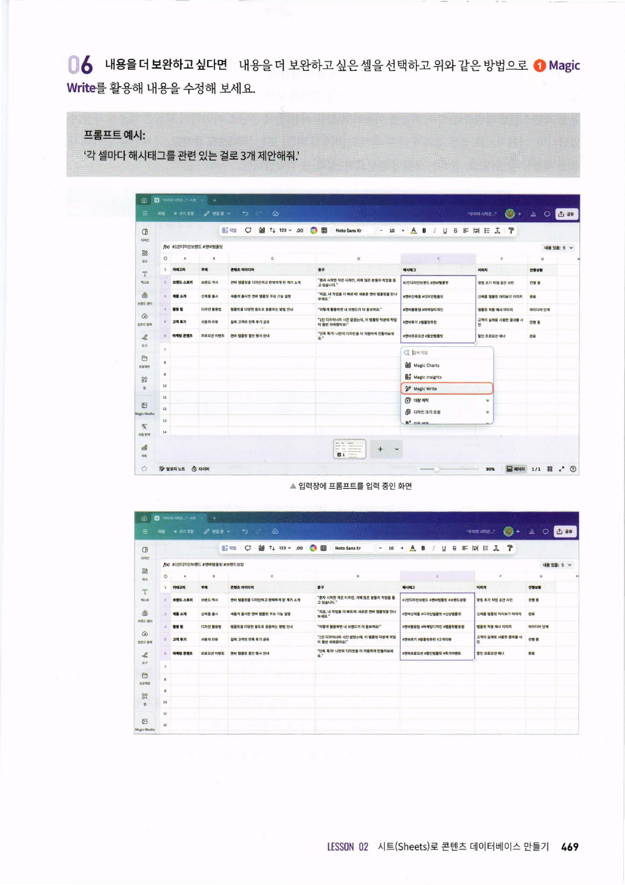

###### 6 내용을더보완하고싶다면 내용을더보완하고싶은셀을선택하고위와같은방법으로 0 Magic

Writ릅활용해 내용을 수정해 보세요.

해시태그롤 관련 3개

/I,, ·1인a자언皇땐도"`"'"

###### ... ....

: s v

800

••지시•••• ..........

0 •

’ 캬嶋고. ... ."'"""'

.T

畫

....스.. ••••서 던빼•••• ....꽤던투기.,,

고힐．따• ."'q...,.”. ...시•••

###### •••"....간사민 신

###### 꾸년"'"""...."":1:...d••따••••

###### .....굶

..” 신•••시 빼.저•서..... ...가...

신••••• 여.嵐기어어지 ••

###### 8 ...

•""제II..,o••기•••••1· I••백•••"'".q"'

• ••• q..,... ....다11!■도•••••••"

.....빼시어어지 아어다어단제

....．기나·-·q...＂폐.......

..

고•• 서.... ..그빼빼e•.,,..

。

고......서 서

어.S""'.,. I•....,,...."

·,인 q자어너. 시건 헐얼""· 어 ．뻬 확업

혈""

###### ...

4 "

연....S빼니

균""••••』1UII’

.".... .................연．서"

G h세 m;l

eg

델 M..m어ms

舒

~ -'~마”

###### *

g

r--

###### ....\’

·-,•··············. - ··•,'

걷죠드I

+ V

: ■,

`

-··-=······

.... 1/1 腐 •• o

^ 7·""· 0印

~ 입력장에 프롬프트를 입력 증인 화면

###### |; ' G 一 "m|

e

記m 0 달 tL 123v .oo 0 11D Not0또"' - 10 + A , ' I.I S 조 더 !三 :r. T

-

내.였‘’v

'지 •nK口블롬드 미'"""！ .嵐른도설잘

###### .......

0 •

T ' "빼.. ...

빼서빼]

툰·효"' ＂＇"＇

·구

.......다지언•2....제민폐기•“

.””"

••지 시•• 틱e q사단 어嶋 훨

•lti다자 ...... ...됴••

.色S 뻬시

촬혈•기탁•간서단

고 ••••

...蟲..

......••••내mI어."...........한나 |.......～뢸•""뺄 l........."'•••••

• Ill 여... ....이........”는"...

###### ...

"" 선...시 ............... 기•••

###### ...。..

- •""폐 ••..,내．따기여를•어요!• I•...... ”""F0n..."" 1.......시어빼지 아이다아인빼

."'qn이너빼시a m는• .........

- • •던......,. l·""....표......

###### a•.,, •..........

•

a.어 ••• 서.e.” 시

...•던•... •며瓚•• ....嶋

-•u “오션........ . ltJ•서

###### .....오d뻬나 ••

4 "

·론빼••••""'•••••-·

요

舒

e u

###### I- —

LESSON 02 시트(Sheets)로 콘텐츠 데이터베이스 만들기 469

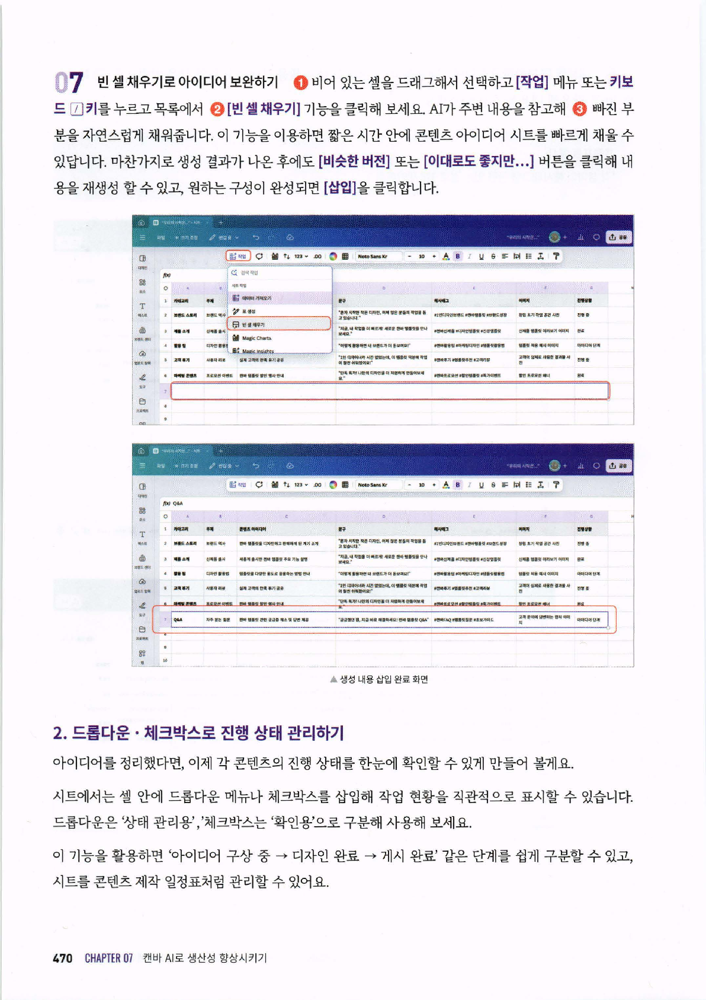

###### 7 빈셀재우기로아이디어보완하기 O비어 있는셀을드래그해서 선택하고[작업] 메뉴또는키보

드 II]키를누르고목록에서 [빈셀채우기] 기능을클릭해 보세요. AI가주변 내용을참고해 O 빠진 부

분을 자연스럽게 채워줍니다. 이 기능을 이용하면 짧은 시간 안에 콘텐츠 아이디어 시트를 빠르게 채울 수 있답니댜 마찬가지로 생성 결과가 나온 후에도 [비슷한 버전] 또는 [이대로도 좋지만…] 버튼을 클릭해 내

| ~5 ?. -

용을재생성 할수있고, 원하는구성이 완성되면 [삽입]을클릭합니다.

CBt o 넬 n ,23~ " O Ill ” - 10 • 소 B U S ;.:: 벼 ;三 i ?

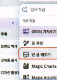

###### K

。

###### •...,

, ” "

###### u"

Tg

"여

·구

....서.,,픽e디자언,....른틀 "‘‘

.. ""L내·-...u...뗄 삼嶋....이리어 ...

'＂또"＂'.따’......""＇도••

, ."".

•• 표기.,,．간사린

린.플

.•

..... , " " ........

....•• 확업

###### •'"'... 브혀.,. -·럴..........,........ .............지

‘ ••• ••

.....。 • •••기 ••••• ...a...던··기

• .......너져 헐.는• ··첫......

a.., ．嶋量 사 서 8 핀••

....♦.......

어.,.

..... 더빼••

....••0선""'•••••가

4 • ~"톤m m모션血 ..... . ""...m

던•

e!

# I:□:：：'：：~ 一|m

m..

eg

距m C t‘ '" v .00 1111 ......,,.., - 10 + e - u s .: ;三 도 ,.

###### -

n지 아4

•• q.언 .

...

”"m•건서던 ...

•

, ....... •...서 .....것.q자언＂고".”·•·가소개

T ' ＂빼끄 ...

·서

""""'"'틀•.........,.••

###### ® ·""

.•

.....사 嶋•제·인릅••뢸•a기

....， 내畵업. " 贊I""

m... •......._,,••••신실••틀 십•••"-- .量

蠶"...

·어 ..,내 기다틀...,. •...... ..雙••빼시 e·

• ••• q ••엽 릿1야eI도皇II嶋는．일안내

###### 1언 S·E• ··훨.......

••던위 오r ....기 ....

###### • e··

。

••

• ~빼.,, 사·지러" ‘빼고젝뻬 ．가를흡

업量••

4

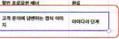

됴구 I ' I- 따틀는릴른 홉빼••훨 글글••소贊달e

.......~.빼••••""'......-· ....""".......鼠가어드

....

e!

###### |

~ 생성 내용삽입 완료화면

###### 2. 드롭다운 • 체크박스로 진행 상태 관리하기

아이디어를 정리했다면, 이제 각 콘텐츠의 진행 상태를 한눈에 확인할 수 있게 만들어 볼게요.

시트에서는 셀 안에 드롭다운 메뉴나 체크박스를 삽입해 작업 현황을 직관적으로 표시할 수 있습니다. 드롭다운은 ‘상태 관리용’,'체크박스는 ‘확인용’으로 구분해 사용해 보세요.

###### 이 기능을 활용하면 ‘아이디어 구상 중 一 디자인 완료 一 게시 완료’ 같은 단계를 쉽게 구분할 수 있고,

###### 시트를 콘텐츠 제작 일정표처럼 관리할 수 있어요.

470 CHAPTER 07 캔바 Al로 생산성 향상시키기

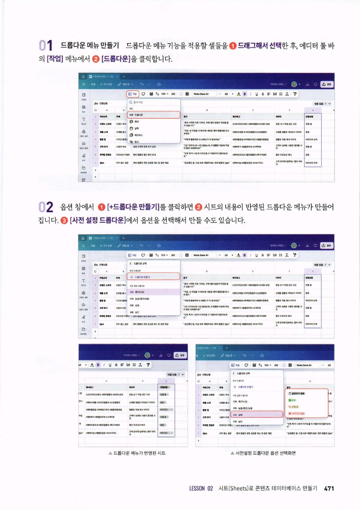

###### 1 드롭다운메뉴만들기 드롭다운메뉴기능을적용할셀들을O드래그해서선택한후,에디터툴바

|:0"" v Q ? -I

의 [작업] 메뉴에서 O 을클릭합니다.

... Qh느색"' 딜 t4 123• .00

Ill ._.....山 - m • 소 B U 6 I= 벼 ;三 .r. ,.

(]

誌 。 ..

던．일.

때 ti.:7 V

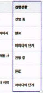

m ·서’

T ”

"m

· ··도스鳳. ."`

曹．크빼

•• ..짜, ......

”“.....사·

고••나미•• """"'"瓚··-·틀•量•s••

@ ""

....u .... 다II O嶋빼스

”... ....u••"U"'..`""'•••

십 ••.,,,

@ " " e 'II鵬

신••.A

·자글,...... 론

........턴내廳틀드어••아.,． ._...."-...`...

•n••~-

.........,. ...뺑••．고.빼•

고•.,, 땐.... tf빼고"曰··n••

a.., ...서 ,..서

。 오》모

."' 시.tl1I는때.빼...빽툴"..

•

`""

,,....."'냐OI””.패e·이" ............,..,..

4 • ....... -·.,.. ..." .........

.. JUL11••

"..,.. ....H터를··소...."

고.............,...

•

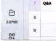

••• 면 지·빼••••嶋...."-· - .. ... ........

###### 2 옵션창에서 O[＋드롭다운만들기]를클릭하면0시트의내용이반영된드롭다운메뉴가만들어

집니댜 에서 옵션을선택해서 만들수도있습니다.

二。 =話m 0 열U123y.00 1111 ............. -10•스BI U6I"벼i三J. T一므I

- q ’지

。

< 됴 선뻬

認

..."' v

• 를서도壓

T

`훑, .”".

.... ""

• •••

G

혈" ..

S 고111.

....빼 M I + 드壓璋"'l

e

."` 서튼..도

신 ．시 C> 예-·

따••

j C> 印""

서•••• ==· 상‘’*언

~ . ...'" ......라 ......"UEU틀

... ....... ...••틀..,......말뻔嶋글

.•......................... ....,

고 2.......

."rmu.". .............

·젝글 내 ... q.”뢸 ...

"... """"•-··".....

·어••••..,내•틀도가디를•••,. ·-··...""""'"•••

."＂1자여니.시Oll1I는데,,••••••”

이•g ..,..,. •....,,.....턴•,•••

....... •"'나현•q자안••빼•••`..... -··모S"'u••••가

•••..,..지.빼••••••"'•••틀-· ·-..- ......,,.빼됴

"＂瓚

”“.,,..서.

십···"""""­

.....빼시

•••서••.

•

.,,.........

......

지

「·~.·."•떠냐「 며"'v

••"' ...翼

,. .n*u"""""............ ..".......

濬 "msI”µn"'...u.... ...••" .." ...... ...... ..........具

- r.....기미"'••••a....

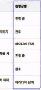

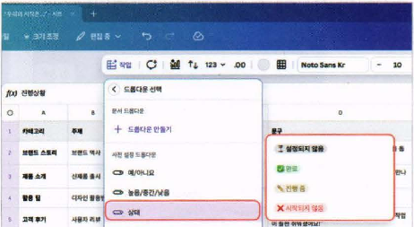

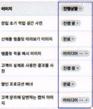

' ...꼬 ... + 드·다룬"'’

, ."". ."" 바""E.""

""圭

... I

###### .`고."_....

..-·"'나. .........께··어"

•..,,,......... ...JUUi....

' ... 지..... ...•••..,．글.....,,••

........,“°서...

•

따. "'빼"Q"＇．촬•••••가어됴

.를• ..,....빼••••뻬.,...... 아4•

... 드롭다운 메뉴가 반영된 시트 ~ 사전설정 드롭다운 옵션 선택화면

LESSON 02 시트(Sheets)로 콘텐츠 데이터베이스 만들기 471

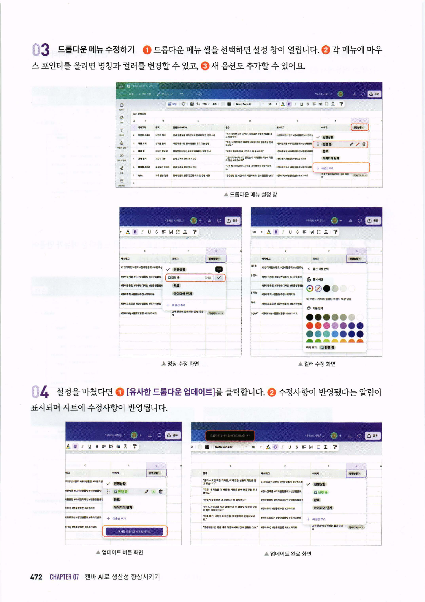

###### 3

###### 드롭다운메뉴셀을선택하면설정 창이 열립니다. e 각메뉴에 마우

드롭다운메뉴수정하7

###### 스포인터를올리면 명칭과 컬러를 변경할수 있고, 0 새 옵션도추가할수 있어요술

....

(]

..

貞찬•

·

0 •

.. .나

’ 가·'

###### ·

빠轉빼

”•"'"''“

T

, ."...

교...... ."rrnEE m··r·오...

... . .... ....아 .

.... ..다·교던빼빼빼• 嶋기"

모셴드...

..·.......”.,,

###### .....읊

V'

###### ....... ...................

, /

·조......,........" .. .~"_...”"巳프

....서 ••뻬·서.......,,...

. 때니..”".....,. '타...빼빼誓짜""." ".

.-...

.＂'“마아l1·시긴.....혀......“

....""...고... 여q이던제

：：···저맥•-·······"""" ,........인.........c

###### ....`

###### 서.파.. ".,........

。

어1던......r

누 ]

4

" ' ...

....이........언 .사안내

.......,...*.g..

###### E, .

......uu.L....

. 자급빼•••...,... •••.... 기"‘

...어 -·

“'

I ....

###### ... 드롭다운메뉴설정 창

###### ~. ! m|

A B I ”) s H_ E ...---

###### T

T I

10 + -

###### G」

###### .E

-

,.. .1인q각인 드볼

....。

：

·나’

.

###### ,...,.._,,.......... ~

"안지연嵐튤. ........툴드. J

( ‘崎상선빽

던나 ...신••••

0 틀"ti

"""'••뼈뺀릴디자언어,••••,

I`" ...."...."".... 0 @•

릴 ' ".

••••기미""＇..,．고•••

어•률도키·데셜륄던•률S빼"‘

•""'···선•IUII•··가이...

”

+ ...신후기

••••~•••••••••••••••

翼 ••가....

O 기틀민

...차“"＇•••••＊．쩌S

아^. ..먀AQ ""도

~-·...111]•l•뻬어이

아디 .•• •

지

며려 ,.,k

^ 명칭수정화면 ... 컬러 수정화면

###### 4

###### - 설정을마쳤다면 O [유사한드롭다운업데이트]를클릭합니댜 O 수정사항이 반영됐다는알림이

표시되며 시트에 수정사항이 반영됩니다.

##### | ~ m|

| ~ m

1111 - 10 + 스 8 I U S ii= 떠 ;三 ;r. ?

###### 『

소 B • U 6 I= r.>i ;三 i

###### E

###### E

c

###### ... .

터"'미

어

고••나• .nK""""'...............

·흡지시라••• 디자인, 어 ..

1자언•른S •던......뺄‘.

!•• :: o

J 진."

J 련."

저글,..... . ..,..... 단 던

...... • 심••더서인....신 랄 0 진뺄 졸

/ ^ @

`,."••..,네••”"....... '.....틸리"디자언"'1릴••' ".

,.일.."."""......, 혈•

."'qn""서O•힐는모혀•••..뻬•

,.,,....우던•a.

.....,,.......,... OfOt디이

어를던 •••어.,．

IU으••.,,.....,..,... + 새配후가

요. •......d이R""＂'••가어m

+ 세흡선후기

下,. ．기1 나巴빼 디자언. •••게 던..,"

·ianu.저••••••崎•"""＇••이u· ""'")•••••••盧．가어.

고•••빼답변빠는•시어이

F따 ,.,,...

떠미어 ••••

지

^ 업데이트버튼화면 .. 업데이트완료화면

CHAPTER 07

472

캔바 Al 로 생산성 향상시키기

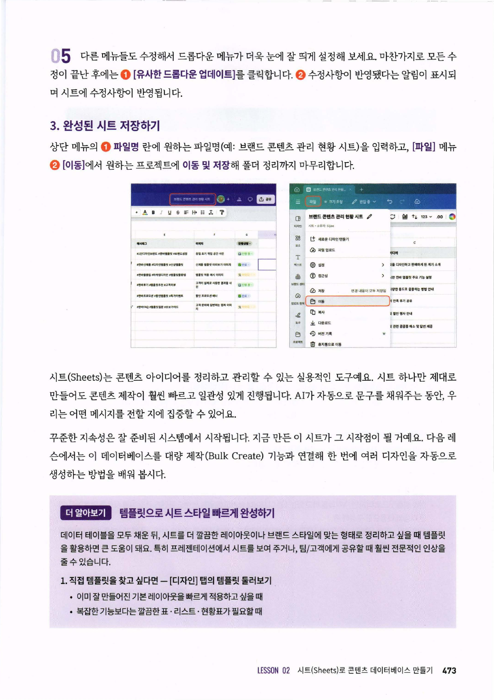

###### 5 다른메뉴들도수정해서 드롭다운메뉴가더욱눈에 잘띄계 설정해 보세요마찬가지로모든수

정이 끝난후에는O [유사한드롭다운 를클릭합니다.e수정사항이 반영됐다는알림이 표시되

며 시트에 수정사항이 반영됩니다.

###### 3. 시트 저장하기

상단메뉴의 파일명 란에 원하는파일명(예: 브랜드콘텐츠관리 현황시트)을입력하고, [파일] 메뉴

# |: ~ I

O [이동]에서 원하는 프로젝트에 이동 및 저장해 폴더 정리까지 마무리합니댜

| \!~

♦ A B I US;;:: 沖!三.!. ?

CB 브뺀드론뺀츠관리 현활시트 " ::; ill f+ 123 V .00

q 시• · 소뮤지위••

器 g 세.Ii!디자인인.?l

###### ...

빼서., 이... ...

。 파얼업료드

###### .＂드UR""＇됴•"9•"••u•• ••.,." ,a서현 。

”가어

T

·긴빼신••타1m언••뺑配닌실뺄틀훨 신"••"＂"이 II,. 二

¢量 ® "

> 길.디자인빼고 던계기소개

@ ® 접근실

마Ill ""＇탈자 ...를." ••볼...嶋시이미지 父

"'민빼 II릿 주2 기놀 볼혈

""....모U··안••뺑•‘가아뺀 .언··오딘빼며 ....

고던틀어‘嶋量서Hllltt 서 。

브뺀도뗀터

.e빼＇기 ...뢸♦el •고.려"

I!!경내을이모두지강딜 "".......어는 "N

O 짜9

。

###### .뜨··

〕＇단••기골뮤

어지 어."'틀 •鼻쩌됴 교지續 I·뻬 "" S의야뻬 父

쓰 0 ·서

` ·언 •시안내

도구 土 다을또

길간

e 0 버전기.

###### *

" " 回 虹馮으로어틀

시트(Sheets)는 콘텐츠 아이디어를 정리하고 관리할 수 있는 실용적인 도구예요. 시트 하나만 제대로 만들어도 콘텐츠 제작이 훨씬 빠르고 일관성 있게 진행됩니다. AI가 자동으로 문구를 채워주는 동안, 우

리는 어떤 메시지를 전할 지에 집중할 수 있어요.

꾸준한 지속성은 잘 준비된 시스템에서 시작됩니댜 지금 만든 이 시트가 그 시작점이 될 거예요. 다음 레

슨에서는 이 데이터베이스를 대량 제작(Bulk Create) 기능과 연결해 한 번에 여러 디자인을 자동으로

생성하는 방법을 배워 봅시댜

###### 템플릿으로시트스타일 빠르게 완성하기

모두 뒤, 더 레이아웃이나 때

을 큰 도움이 돼요. 특히 프레젠테이션에서 보여 팀/고객에게 때

.

###### 1. — 탭의

•

- • 기능보다는 · · 때

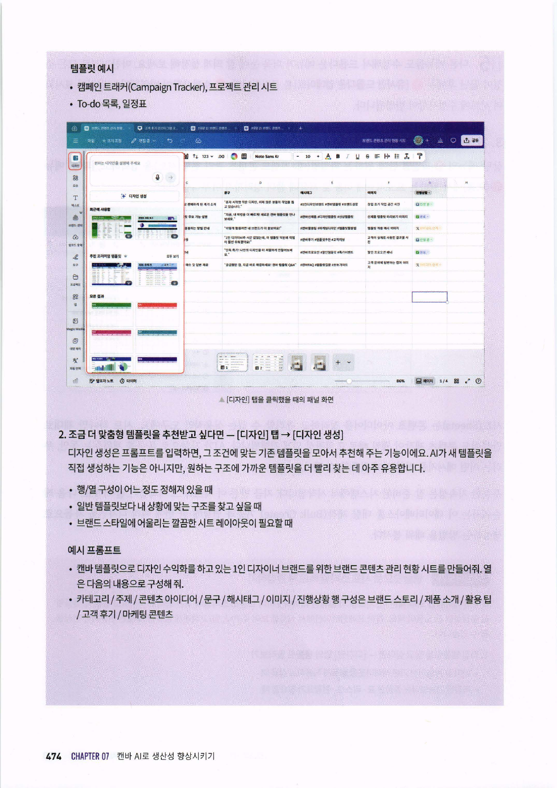

- • Tracker),
- • To-do목록,

| \ . • 、 ? · m|

『

10 + A B l.l s ;;:: 沖 ;三 2

123 V J)O

88a

현빠 <µtfll 혈떨뻬

n

G

###### •••

###### .T

m ·'"]

" . .

. q자인생성

"'" --- --~’ , , "'’, II曲me

••••디사언·야 ”뻬.....

。

m빼께던제기소

a 사신

고..냐•• "던qnG-.드 “-·룻 •므.....

...‘

編땐•

신 ••賓""""....

###### O••

..... 내 .. ...를 뺄I 뺀니

보嶋요. 마.. ·· mI뺑

•• 가•••

.....제••...,내 •••..,.,· _ ..• '.......

###### *

• 튈 •• 뺄 빼지

汀 BE e 「己 멸

고．어....量서......서

。

•" ' q마어L1. 시a 할혔E때. 어 II뺄 빽．빼....

어 1싼 ••• r .....기 미""＂t! •고....

-'르 _.

던

·e•... ."'나먼翼디.,,••••••던．어" •..........IL,•••••가어.皇

·量드••

•••

4 "

.S 로．오션 빼나

• • 릿 ..

u•..,...

.". ......量......,...." .... ．0마......I ••흘.,,어드

,. .... ..흑E 터 ... 翼l

el

틱, , ‘’

三

。

m ...

,_ "_

i"':1췌|——

###### | I

8?

모른률국

•

.•··-········-·-.

....; i 냐h·- !,_ '.. +

~ •..•

###### -::.===-:..=-_ !!

·IIl..............=

= 노 :

II z c:..

..` iiil 1/ 認 "" ®

디 탭 널 화

一

디자인 그 기존 주전해 기능이에요. Al가 새

기능은 , 데

- • 때
- • 잦고 때

•

- • 1인 디자이너

.

•

474 CHAPTER 07 캔바 Al로 생산성 향상시키기

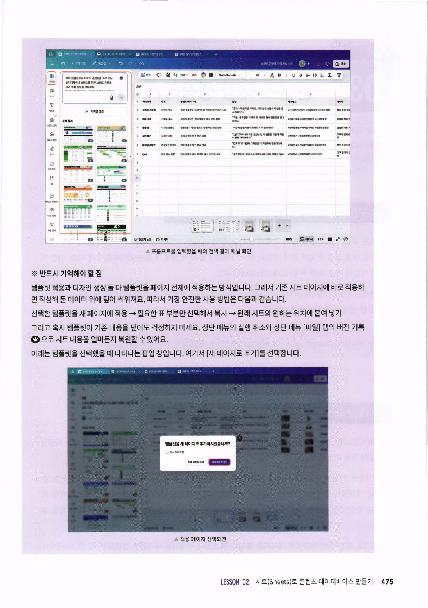

###### : . . . & ,. " 'I

m • 스 ’

###### 園 "0"..."'

予

###### ?

쉘 n m· m

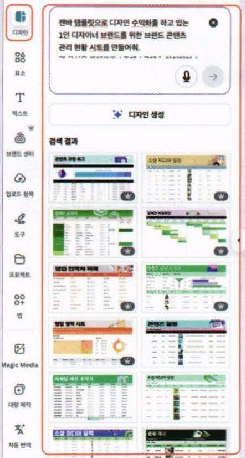

m

US 手比 l드.!.

....."..다지연유 . ．고였는 1연『In1 ""...

###### ... .

###### .. ....,

¢

-

--··-----·- ·--· --···

0 •

.•~-··-.....· ”.....

###### ~··""

9

###### .T

' "

. .•".............. "mu..떠UIII.u....

.,UUU••E

.....IUUmcm`.""

........""~

안_""...

###### ....

:., q"

廳電도 ...

,

••••‘"

··페"""...""....

’ 빼”

····-·도...........

..........내••”특 ． 터-"-.,,g••貢···

###### .....。

......._ ......

... ..9 ..기를•

가·기...夏......

서..

- • ~••기

C

- • -툰

e

뻬"""""".,.

- .....""J.....가

.... "'나단．다 ＂瓚e..... 벌,a.`빼글•••m""' ..." .... mF"""．""···가

###### ··-

- 4 "

' ...

llt!UO

•••" ..." ...서론내

야.............글....""

꽤

###### E5

..

院

·

e

###### t

:..

###### .•·--···터굳답 근,중 :s ....'!.호....J •' ~' E

었

###### t

+ V

###### - 딜- 1/4 尸

o :;‘=· o

심

.... 。”

·

롤 때의 검색 결과 패널

※

둘 다 페이지 적용하는 그래서 기존 시트

면 작성해 둔 덮어 사용 같습니다.

새 적용 ➔ 표 부분만 복사 ➔ 시트의 원하는 위지에 붙여 그리고 혹시 내용을 마세요. 메뉴의 쥐소와 메뉴 버전 기록

- 0 으로 시트 수 아래는 때 장입니다. [새 선택합니다.

□ 。 - ' • ' " • 0 ,. 0 '

#### 二

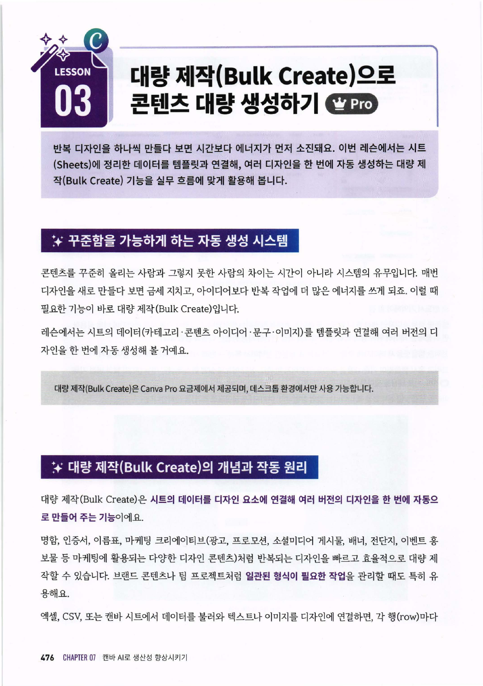

###### 재작(Bulk Create)으로

###### 콘텐츠대량생성하기 CEO

하나씩 이번 시트

(Sheets)에 여러 디자인을 번에 대량 제 작(Bulk Create) 실무 맞게

###### :~ 꾸준함을 가능하게 |

콘텐츠를 꾸준히 올리는 사람과 그렇지 못한 사람의 차이는 시간이 아니라 시스템의 유무입니다. 매번 디자인을 새로 만들다 보면 금세 지치고, 아이디어보다 반복 작업에 더 많은 에너지를 쓰게 되죠. 이럴 때

필요한 기능이 바로 대량 제작 (Bulk Create)입니댜

레슨에서는 시트의 데이터(카테고리 ·콘텐츠 아이디어 ·문구·이미지)를 템플릿과 연결해 여러 버전의 디 자인을한번에자동생성해볼거예요.

대량 가능합니다.

###### I 갖 대량 제작(Bulk Create)의

대량 제작(Bulk Create) 은 시트의 데이터를 요소에 한 로 주는 기능이에요.

명함, 인증서, 이름표, 마케팅 크리에이티브(광고, 프로모션, 소셜미디어 게시물, 배너, 전단지, 이벤트 홍

보물 등 마케팅에 활용되는 다양한 디자인 콘텐츠)처럼 반복되는 디자인을 빠르고 효율적으로 대량 제 작할 수 있습니다. 브랜드 콘텐츠나 팀 프로젝트처럼 형식이 필요한 작업을 관리할 때도 특히 유

용해요. 엑셀, CSV, 또는 캔바 시트에서 데이터를 불러와 텍스트나 이미지를 디자인에 연결하면, 각 행 (row)마다

476 CHAPTER 07 캔바 Al로 생산성 향상시키기

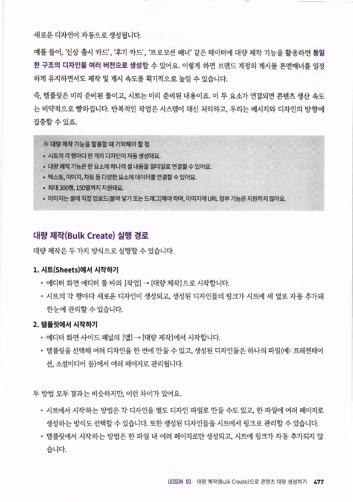

새로운 디자인이 자동으로 생성됩니다.

예를들어, ‘신상출시 카드’, ‘후기 카드’, ‘프로모션 배너'같은데이터에 대량제작기능을활용하면

###### 한 구조의 디자인을 여러 버전으로 생성할 수 있어요. 이렇게 하면 브렌드 계정의 게시물 톤앤매너를 일정

하계 유지하면서도 제작 및 게시 속도를 획기적으로 높일 수 있습니댜

###### 즉, 템플릿은 미리 준비된 틀이고, 시트는 미리 준비된 내용이죠. 이 두 요소가 연결되면 콘텐츠 생산 속도

는 비약적으로 빨라집니다. 반복적인 작업은 시스템이 대신 처리하고, 우리는 메시지와 디자인의 방향에

집중할수있죠.

•

- • 셀
- • •

이미지는 않아요.

###### 제작(Bulk Create) 실행 경로

대량제작은두가지 방식으로실행할수있습니다.

- 1. 시트(Sheets)에서 시작하기

- • 에디터 화면 에디터 툴 바의 [작업] 一 [대량 제작]으로 시작합니다.
- • 시트의 각 행마다 새로운 디자인이 생성되고, 생성된 디자인들의 링크가 시트에 새 열로 자동 추가돼 한눈에 관리할수 있습니다.

- 2. 템플릿에서 시작하기

- • 에디터 화면 사이드 패널의 [앱] 一 [대량 제작]에서 시작합니다.
- • 템플릿을선택해 여러 디자인을한번에 만들수있고, 생성된 디자인들은하나의 파일(예: 프레젠테이 션, 소셜미디어 등)에서 여러 페이지로 관리됩니다.

두 방법 모두 결과는 비슷하지만, 이런 차이가 있어요.

- • 시트에서 시작하는 방법은 각 디자인을 별도 디자인 파일로 만들 수도 있고, 한 파일에 여러 페이지로 생성하는 방식도 선택할 수 있습니다. 또한 생성된 디자인들을 시트에서 링크로 관리할 수 있습니다.
- • 템플릿에서 시작하는 방법은 한 파일 내 여러 폐이지로만 생성되고, 시트에 링크가 자동 추가되지 않 습니다.

03 대량 제작(Bulk Create)으로 콘텐츠 대량 생성하기 477

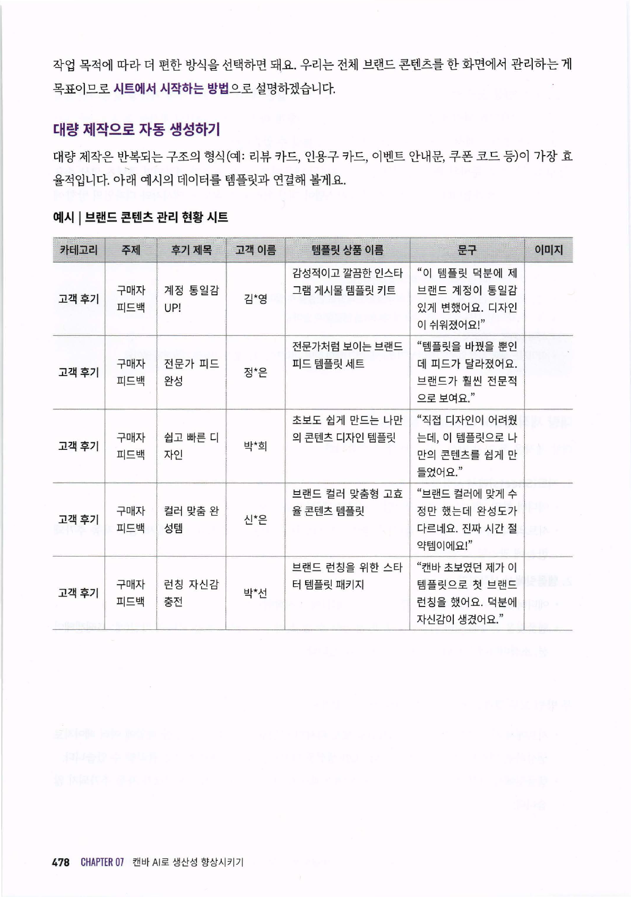

작업 목적에 따라 더 편한 방식을 선택하면 돼요. 우리는 전체 브랜드 콘텐츠를 한 화면에서 관리하는 게

목표이므로 시트에서 시작하는 으로 설명하겠습니다.

###### 대량 재작으로 자동 생성하기

대량 제작은 반복되는 구조의 형식(예: 리뷰 카드, 인용구 카드, 이벤트 안내문, 쿠폰 코드 등)이 가장 효

율적입니다. 아래 예시의 데이터를 템플릿과 연결해 볼게요.

예시 | 브랜드 콘텐츠 관리 현황 시트

문구

감성적이고 깔끔한 인스타 ” 이 템플릿 덕분에 제

구매자 계정 통일감

그램게시물템플릿키트 브랜드 계정이 통일감 피드백 UP! 있게 변했어요. 디자인

고객후기

김*영

이 쉬워졌어요!"

전문가처럼 보이는브랜드 “템플릿을 바꿨을 뿐인

구매자 전문가 피드

피드템플릿세트 데 피드가 달라졌어요. 피드백 완성 브랜드가 훨씬 전문적

X04*tO

고객후기

으로보여요.”

조보도 쉽게 만드는 나만 ‘'직접 디자인이 어려웠

구매자 쉽고빠른디

의콘텐츠디자인템플릿 는데, 이 템플릿으로 나

박*희

고객후기

피드백 자인 만의 콘텐츠를 쉽게 만

들었어요.” 브랜드 컬러 맞춤형 고효 ‘‘브랜드 컬러에 맞게 수

구애자 컬러 맞춤완

율콘텐츠템플릿 정만 했는데 완성도가 피드백 人°1 터CJl 다르네요. 진짜시간절

고객후기

신*은

약템이에요!"

브랜드 런징을 위한 스타 '‘캔바 조보였던 제가 이

구매자 런징 자신감

터 템플릿패키지 템플릿으로 첫 브랜드 피드백 중전 런징을 했어요. 덕분에

고객후기

닌-,卜* 서느

자신감이 생겼어요.”

478 CHAPTER 07 캔바 Al로 생산성 향상시 키기

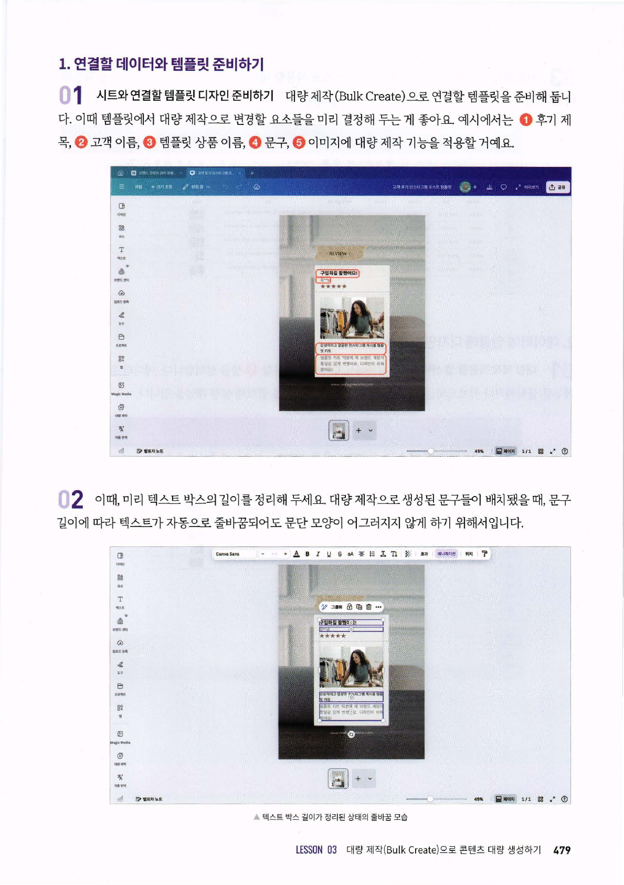

- 1. 데이터와 준비하기

###### 1

시트와연결할템플릿디자인준비하기 대량 제작(Bulk Create)으로 연결할 템플릿을 준비해 둡니

댜이때 템플릿에서 대량제작으로변경할요소들을미리 결정해 두는게 좋아요. 예시에서는 후기 제

목, O고객 이름, O 템플릿 상품 이름, O문구,O 이미지에 대량 제작 기능을 적용할거예요을

|\ I|||:;1 ., , 一 .!mI

CB g

認

a

T

므뺀드‘..

`

룬

*****

。

II

.量••

쓰

"

###### .....e

8?

•

--....e。

,.,...

..e + v

1 / 1 gg •• (!}

II표자노.

- 2

이때, 미리 텍스트박스의길이를정리해두세요.대량제작으로생성된문구들이 배치됐을때,문구 길이에 따라텍스트가자동으로줄바꿈되어도문단모양이 어그러지지 않게하기 위해서입니다.

Ff

i

『‘

Canv.Sans + 스 B I U S aA :;;: :三 J. Tl

皇 위외

認 a

T~‘i0i‘”

E-';; 모 '

c c•l \

*****

euu

훈

e

....f''“''

###### ....1’ +

컵얼표지노.

^텍스트박스길이가정리된상태의 줄바꿈모습

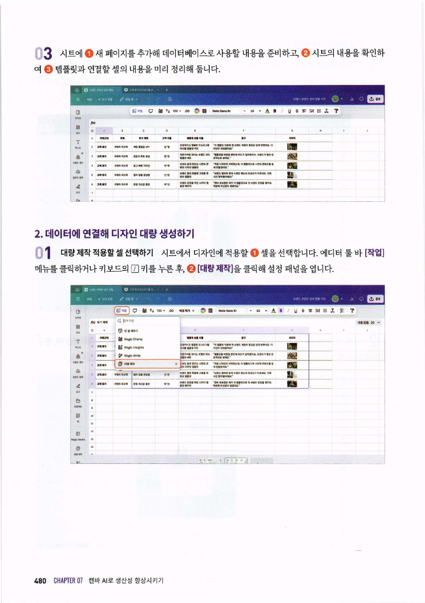

- 03 시후]O새페이지를추가해데이터베이스로사용할내용을준비하고,0시트의내용을확인하

## I: :7: ~ -I

여 템플릿과연결할셀의 내용을미리 정리해둡니다.

24

話아 O 딜 n ," v .OO 園 邸o노·W - 10 + 소 II U S I= r.>I I三 ;r. .,.

CB g

n

誌

3

^

” ....... 그빼어 2 적이 구嶋자빼‘" "••"‘Ufll

。

` 가.，빼

......뻬·

...

.. ..................” ..

혀

###### T

••• 자안아 ,•

###### s a••기 ._ 파 ..•

더

..기••"......•• ..,대•‘".............

......‘

嶋소.

###### ．고... ...

...나던빼e ... ....혁..... ....

• • 이..

.....。

• 고.”

.... "...........도가다.대負•••

' ~••기 구빼Ii` "••를••

• 2 •.,, 구빼‘빼 """ti흘•툴 ...

• •틀

. 가혁 ..혀量

...키지 자 . ..,...

- 2. 디자인 생성하기

1 대량제작적용할셀선택하기 시트에서 디자인에 적용할O셀을선택합니댜에디터 툴바

메뉴를클릭하거나키보드의 띠 키를누른후, 을클릭해 설정 패널을 엽니다.

I: • I ~ - I

c 델 t~ "' • .oo 뻬결C 낱 Ill - l0 • A B l u 6 事 벼 I三 요 곳 'i' Q 硏 ....

CB

따

###### ..誌

후가 빼.

내.었‘ 30 V

.....

曰 mi"'

어 ..,.

。

.... I 2 •.,,

·구

딜 M..kdms

T

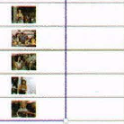

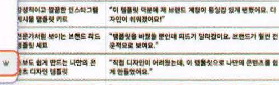

M..k ImI‘ht•

###### ......

~

./ M..kw,It•

畵 •

‘ 고뻬•기

O 대"나

‘.., 고..• •... .핵••" q.내....

###### .....。

...... ............."" 가어••.•요 s••••어..

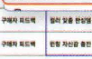

###### ..•

###### • ~••기 4 • 고”"

.... .미 r

신'•

됴구

e!

m". ..

g

,”"" U

0 "

.....,

###### :.:. =-—:{z.:.z :-!

.........

480 CHAPTER 07 캔바 Al로 생산성 향상시키기

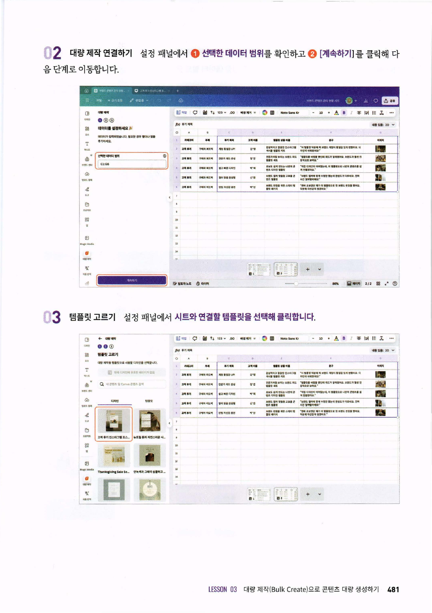

###### 2 대량재작연결하기 설정 패널에서 0 선택한데이터범위를확인하고O [계속하기] 를클릭해 다

음단계로이동합니다.

Cl54

여 0 @® 認 »

。 . .

n저 후기꽤” 내. tll 30 v

' -· .,. ,.,," 고... 빼. ·구 •••

’ 고 , 꽤 IIaun ... 1II ｀미• 밋리틀빼빼 Iii.JIii를어1혈팔혔께턴靈어요q

입.. 讐어나 T 후기뻬세요.

' ...,, ...자빼•• 던If가획드릅촬 ... 련를가서블皇아논鷹뺀S획‘·•H.빼륄••한떼鬪S가탈빼틀어요뺄“볼드가11던건

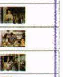

....,, .....됴뻬 ••빠U차입 c·빼 重量도 ••훨흘．나던＂튼뺄흡1ti

油I 뺄I틸 ＂률 자언어

"?...*[＼군"위 (I)j]

• • 훨 세. 를灣요••ota.·

뺄蟲 디자입 • 費 폐

”

。

• 2 • .,, ”`.". 십•• I뻬” • • 꼬1 톤 •• t!!i 혈허뻬 贊께 솔.O 다量네요- 던빼

m ··혈 서C

도 ••

• ••기 tltl 따선홑•던 ...선 !I.t!됴1!!.. ”릅 뻑 ·0”효볼렸던 .1i1가 이• • 틀묘量 뢸 .”됴 륀횔I 뺑

t! 역틀데 자신같어 볼릅아요•

0 0+ 0

-e.....

....

울

••...........•....,

....찼

-·-죠三三-·i:-건T ·

+ V

l =• !. ..........- 라•.

.... '" 認 •• ®

7 혈",.. '어

###### 03 템플릿고르기 설정 패널에서 시트와연결할템플릿을선택해클릭합니다.

o e

O tL 123v .00 뻬볼C * O 1111 忘0~"＇ -10* 소 B :;;: 떠 i三 J. ...

따 OO O

###### 。 .

m .,,.. .... .”어 ·구 •••

/(></ .,,,.. 내 30 V

뺄틀릿고르기

” ｀라올뗄•밋오量사을혈다지인1신빼11니다.

' 2•.,, 구••S뻬 꽤1I`IIUH ... II블嶋혀..allt! ·어볼I딧빽툴빼빼.II됴쾌．어1tiI있게"ltO\M.디

T 급

- ·

게서•••혈 키· 자던 .

••‘`..,

.어는 .뺄됴 획5i. -..릴· I!언 "5i.거릴嶋틀어9 ·뺄됴가 던

Q 내민＇으`"""면츠겉색

고• .,, 도합쉘 ••른

嶋• 皇롤요 ota.·

고••가 구....빼•• .고·릅이차 .... 龜"ti..＂도E나단빼른 기"""＂"＂＂"t는때,,••""41!·톤""．ti

###### .....。

뺄4q~ ··뺑 재 현1엽아요••

”

###### • 고 가 •.. ··‘ "1!11:,,이미• .."墨.” 어• 뺄g.첫Jl튈됴현‘I!tot.Iii.

“자언 "1잇

III 른 ••t!'- 寶제 솔"e 현·됴가 q.때liL 던.

###### • 고." .... 되도뻬 ·러曺

• 촬

쓰"

I릿 빼키지 자신같어 셀"어SI •

e,

m..

·r

舒

I .

g

###### -- -Thanl<ql. .vl.대 . . So. ~ 연-· ·..뻬리·- 그빼--··어· ··-··심률＂고- -· u

야”..

□

. ,-~--:-·::···::··c

....\·

::!.--II-_2--- :•`.;;;

###### + V

Il l :::.

•••• ... 조·

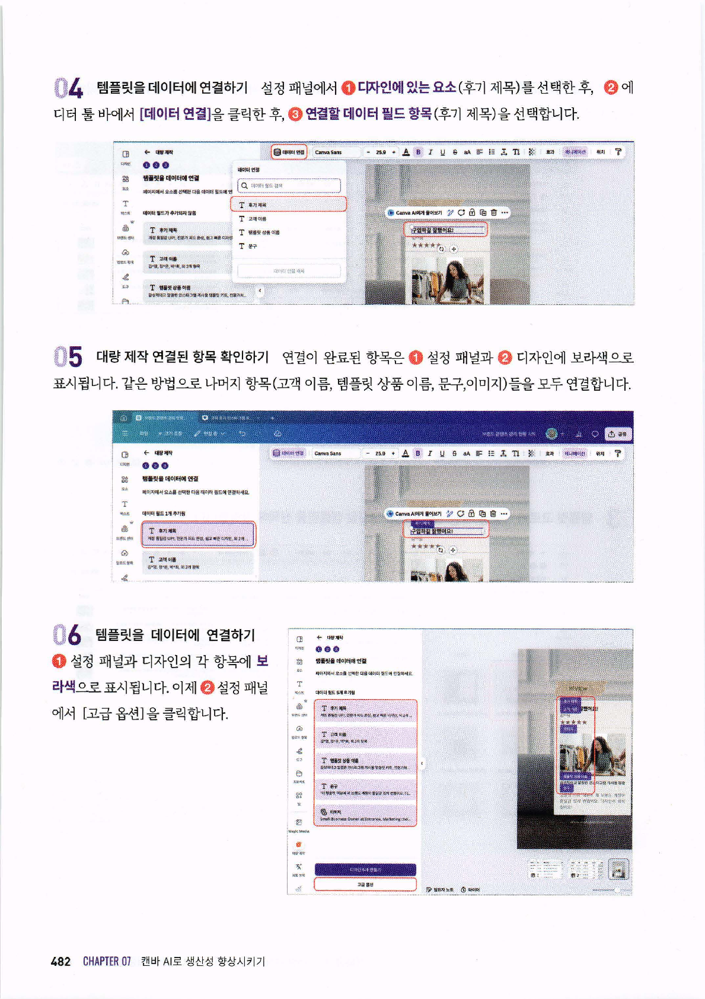

- 01+ 템플릿을데이터에연결하7 설정패널에서OEEt인에있는요소(후기 제목)를선택한후,

###### O 에

디터 툴바에서 [데이터연결]을클릭한후, 0 연결할데이터필드항목 (후기 제목)을선택합니다.

- e
- f

8

『

m ..

e

-고．＋스 B Iu6aA 르 Ein

###### ooo

8DO

『다

R굶더11£겁색

a

요소. 데O!Ei 혈드에 연

` '

###### 노T고대어.

T

2

釣mI •/ 0a 따而 •••

데OIEI 틸드기

`스

###### ......‘。

T T ""를OI•

• .핀．겨翼환날•고빼

T 문구

.또••

，롤•• ， 빼 2제 ••

연걸빼꽤

.. •

어고 •”'I`

- 05 대량제작연결된 항목확인하기 연결이 완료된 항목은O설정 패널과O 디자인에 보라색으로

표시됩니댜 같은 방법으로 나머지 항목(고객 이름, 템플릿 상품 이름, 문구,이미지)들을 모두 연결합니다.

800

a

e

ooo

빼어자에서 오1 신텍민 다 떼아더 ,

대아’1

•印 U언 던틀가 • @다자입,혁 2·-

고디 OI.

같대,•••• •

- 06

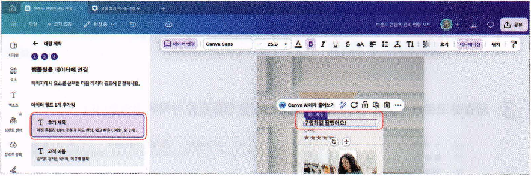

템플릿을 데이터에 연결하기 CBg

..

000

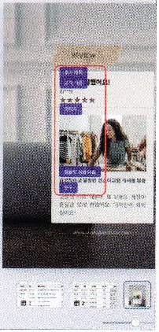

O 설정 패널과 디자인의 각 항목에 보

캠

이더

a

선던떼대o;＇I .

T

라색으로표시됩니다.이제 설정 패널

`스量

翼뺀오‘...

T 事가

에서 [고급옵션]을클릭합니다.

선.게.• 도.. 다서언,·간’ .

..。...

T 고 •

.... ...타 •2지 ..

4

S

###### T

###### "..

••..,m重,

e

###### T

8?

도 서툴어 았기 다

`’

~ ,,,,지

###### .....""

e

·

..‘”

###### ....'I,;·

###### 言굴 ;：三남

고••신

s

비 0 印

482 CHAPTER 07 캔바 A|로 생산성 향상시키기

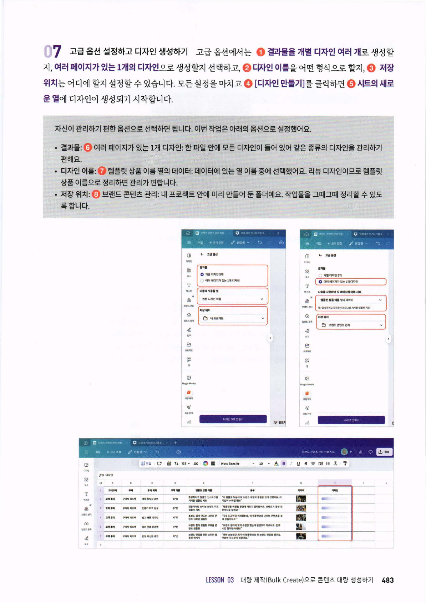

7 고급옵션설정하고 디자인생성하기 고급옵션에서는 O결과물을개별 디자인여러개로생성할

지, 여러페이지가 디자인으로생성할지 선택하고, 0 EER인 이름을어떤 형식으로할지, O

위치는어디에 할지 설정할수있습니댜 모든설정을마치고 O [디자인 만들기]를클릭하면 O 사트의새로

에 디자인이 생성되기 시작합니다.

자신이

- • 결과물: 여러 1개 안에 들어 디자인을 편해요.
- • 디자인 열 디자인이므로 템플릿

.

- • 둔 수

.

###### : ° : I

@ e 고글"'

a

따

°“다자언"'

않 I"

' 필과.

3게

T

r IJICI자인

O 1개아

###### •

###### ••?；E ....키·

T

3

g g

g f

`t`¢

어

`

`스' 땐

w

·

®g ei 쓰 "

.g

어

>>

硏

립

###### ....0.

[ e,."""러 vl

e

m

내

4

皇구

"..

###### ....

e

e,

怨

•

###### --G

e

”"*"""

###### .... .혀

‘`

옳

###### .... 었

###### .....

\ ,

###### 。 .

U奭`'

認..

' -· ... .,,.. 고.터· ••

K지 다자연

혁... I 리요

”

`색 l :lil:11111•기 구嶋서11S· 가볼1멀깁마 ....

T

® ’ 고 ， 구嶋차피드빽 던를가획도현볼 ..• S 묘이는.1S씨S ..,．훨I빼".I'합데리S"＂.＂어a•■ ,．던던

II협 업스.그• ·어••탈 ··빼 빼 •뺄S 처불어 1·갈헐폐 ".츨. q

••릴 이. 처안어 r·

*'

‘ 고•.,, 얼고．른다자언 .. ....폐••"‘틀費나단" .어II는여II훨오·나단"I!1a1쉘

훨 세. .뻬요.•ota.·

"단« ..

그•.,, 구嶋빼빼됴 ...曾·l!f" ... ·론됴혈빼'I··고1톤 * ......"♦• •는텍릅."q.넥a.e·

.....

탈a••뢸

• ~빼擧기 구翼` “자신걸•근 ••선 ”톱스· .•••• 賓 • ••어a

.." `틀빼와십팔터.1tOt...

4

重•

###### LESSON 03 대량 제작(Bulk Create)으로 콘텐츠 대량 생성하기 483

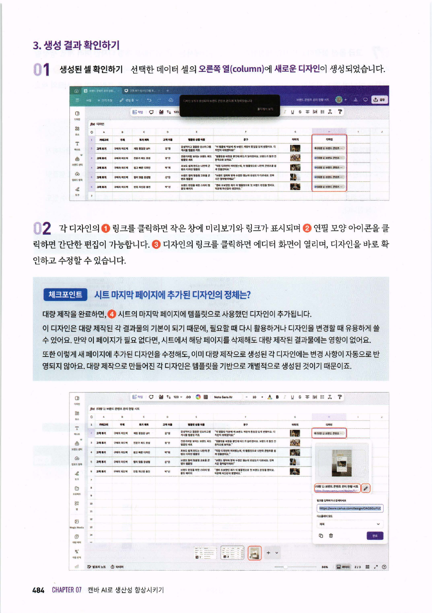

###### 3. 생성결과확인하기

- 01 생성된셀확인하기 선택한데이터 셀의오른쪽열(column)에새로운디자인이 생성되었습니다.

誌

a

T

`스.

.....‘

0 •

·' "".,, ...

’ 그m

.'"'.,,

구....`

구빼`

-·드뻬

C

m-

專••"“

른．가....

m.-

"...

률,

...

......", "...’ ...

... ..,. . . 력틀빼 빼 量·도 폐 혈看 ..q

" ...,... ,.

••던．기체"... 아는 빼도 ... .臺연떼翼됴•••를어a.IWIt·•

나단.. 지"＂,.........따•• •••llJI나단.......

讐 께 ••

......”..... 、""‘ ♦•던.""도기야.......

사간

·른촬••• 스따 . •..."""'...혁 •••꼬•重른드.........

"．”지 멸...자·-·

.

뻬빼지

"

—

g

...

...

고••기 구빼` .."ffl 선.e

. ... -

•mo.. -·

4 "

그m 구"""' 론•峰.., ...선 . ...u...됴른연료

’

- 2

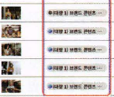

각디자인의O 링크를클릭하면 작은창에 미리보기와 링크가표시되며 0 연필 모양아이콘을클 릭하면 간단한편집이 가능합니댜O 디자인의 링크를클릭하면 에디터 화면이 열리며, 디자인을바로 확

인하고수정할수있습니다.

대량제작을완료하면,- 마지막페이지에 디자인이주가됩니다.

각 되기 때 수 만약 이 없다면, 시트에서 대량 제작된 영향이

또한 이렇게 새 수정해도, 이미 대량 생성된 각 디자인에는 변경 사항이

각 디자인은 것이기 때문이죠.

e t

T

師

No 10 • A B !.I S 주 벼 ;근 i

탑 m 。 t4 123 v .00

###### .....

###### .

Jf,/

認

###### . g

. i

a

c

。

...T

###### •" " " "

q

고• •

l

m 嶋•

###### ..•.... ..•

###### I- I

릅 ...••• 빼 ．틀도 " ...... " ....

구重•

고."

꽤 •,.U"＇

..던．가.......뺀드빼드 ............연 드기.격nCI...｀드"'연던

..,.,... :·

###### ..........‘。.

’ 고••

###### .~.,,

른•기 빼. ..

구획빼

- •""도는나..• • 어이灣 요量나던빼른뺄•••

··-... 꽤 ...

- •" ...雷..꼬.• . ..曺•r..,뺀．는때•••기다.내a..

·2"".....

.......

###### ...,,

• •뻬"

구• •

신••

톨빼•• 를••

..••••.••,.•••스... ...혜자신겁이블•어가....요" ....린드... ....

4 "

자 • • •

빼.t!

###### (n?1모쿠:r?二:?@

e,

m ..

###### ••••••,..•빼"...

防· IOu

+ @ -

###### [ ]

g0

다스‘·이오도

-『

u

嶋•

igt

" "

님

。

###### .- 늑 _==-

=i Zi-_,t

..

,..

r u.

~ _ -

K

”

11 ~

II

1

-t

###### .... liil 2/3 器 •• ®j

‘4’

_7 冒 5 5 。 g 101

＿

484 CHAPTER 07 캔바 Al로 생산성 향상시키기

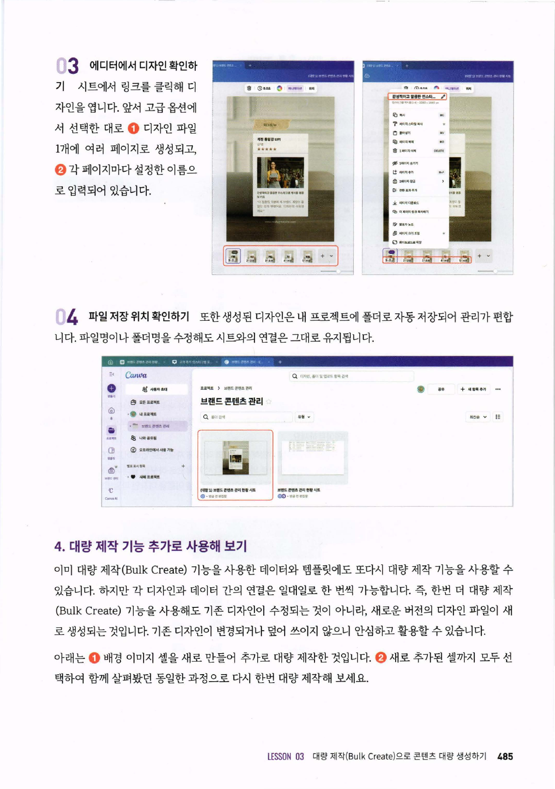

###### 3

|l;" : 令 " " " • I

|'""" ,4 •요 "' |

에디터에서 디자인 확인하

·신 ..

’ o r.^ -...A、"me

...

기 시트에서 링크를 클릭해 디

s o....

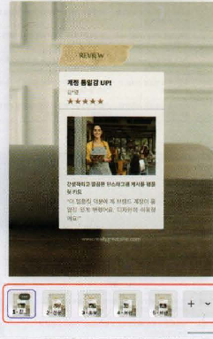

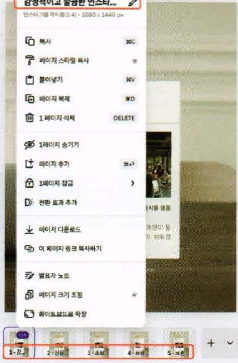

E .... ..,•• ......

자인을엽니댜 앞서 고급옵션에

0 ..

"c

.,

서 선택한 대로 O 디자인 파일

? ”식...

..

~-··

0 ~

翼V

1개에 여러 페이지로 생성되고,

oum·

e ,-뻬빼

·

¢ -·"'

각페이지마다설정한이름으

1il-··

a

e -口"＇

)

로입력되어 있습니다.

0 ···괴"

土 *가시q."

O 어빼야지•• 사어기

+ V

+ -

/

파일저장위지확인하기

또한생성된디자인은내 프로젝트에폴더로자동저장되어 관리가편합

니댜 파일명이나폴더명을수정해도 시트와의 연결은그대로유지됩니다.

- -t O H

@·

- -i

Q m, ．여T업률뜨촬톨겁색

Gm山

• 꼴휴 +세•••기

꼬뻬· > 皇륀도 른뺀츠 관리

청떼지"'

브랜드콘텐츠관리

色 모른 mm·

‘..--

·• 내끄"

휴. v

Q t<"며

잃신e V

• .뺀도른뺀초간리

츠 屯며"'

..CB.

® 익따언때때껴

..홑••

+

,. *

• 때 ll"

c

0·••····

mfl)브튼른a 론리현틀서皇

C`^'

€8

###### 4. 대량 제작 기능 주가로 사용해 보기이미 대량 제작(Bulk Create) 기능을 사용한 데이터와 템플릿에도 또다시 대량 제작 기능을 사용할 수있습니댜 하지만 각 디자인과 데이터 간의 연결은 일대일로 한 번씩 가능합니댜 즉, 한번 더 대량 제작(Bulk Create) 기능을 사용해도 기촌 디자인이 수정되는 것이 아니라, 새로운 버전의 디자인 파일이 새로생성되는 것입니다.기존디자인이 변경되거나덮어 쓰이지 않으니 안심하고활용할수있습니다.

아래는 O 배경 이미지 셀을 새로 만들어 추가로 대량 제작한 것입니댜 O 새로 추가된 셀까지 모두 선

택하여 함께 살펴봤던 동일한 과정으로 다시 한번 대량 제작해 보세요.

LESSON 03 대량 제작(Bulk Create)으로 콘텐츠 대량 생성하기 485

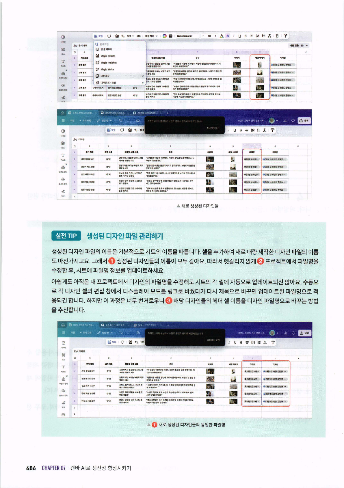

i.

###### 론

머 話효 O 결 f4 123~ .00 빼경4>I .. 0 1111 Noto...." - 10 • 스 B \,I S ¥ 떠 도 요 8 T

###### t

###### 三

q

###### a

曰·결距夕

36 V

###### 二

###### ..._

認

。

###### .......... ”

:}

###### ,

q

###### T

빼빼꽤

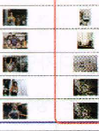

..,."....嶋•른S- •••·專&·뽀q ＂1· 지안 11••utar "岭"＂"i" ”""“미지nI...twll연•

... -

i

t

날

蟲

O

...U•&•.. _

嶋． 를 .

"- a

*'

a

·계던도는냐론.• •••q .....는`빼··l1ll나론·•

므묘 틀 ........

###### ...。..

... -

고• .,,

려曺......• .."......충·e• ".mq네.....

-§ 여～조를

o ... -

".,, •~

`··賓 서E I··네.ar

• • ... ...

• ~•.,, 간"玉· I••마"" 빼건

重뺑도 "론스............ ..

. ...U -

###### ..

nU 디지언

###### "... ....

。 c

”

.. 꽤 결UR .`

뻬 ~••"" I "石

.... 이1

짜

T

..........연스Q그. 、,.......빼•론드제 ..”"....디

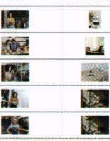

•....,...... 1•-u•u,e-

e·기빼도" ...

`

###### ...뻬. .`...역...

타 . ,,量

.""".,...I$""".타.m모-

‘그.I!q ..•

•• ••도 ... 빼 데 달•董어 .

···~업이....는.........나"......

·電도..

.....。 ......"

....U 聲뺀- I •-•)불t!!i 른年 -·

... .. 看 e·합어... 브론••빼 ....... 른 ••땐드 .....께...... 는떼 ••도가다........

. 던 ..t

....o..... I "...

신••

....• 틀. .., ．"．야`요r

1를..,. •...지'U리.......

현....스· 표•던專가이 ••를요畫 •••드먼 뾰

..... - I • ... -－

쓰

.,

~ 새로생성된디자인들

###### 생성된 디자인 파일 관리하기

디자인 파일의 . 새로 이름

마찬가지고요.그래서0 같아요.

후, 시트에 파일명

각 셀에 않아요.

각 디자인 셀의 장에서 다시 바꾸면 적

용되긴 합니다. 하지만 이 과정은 번거로우니 해당 디자인들의 헤더 셀 이름을 디자인 파일명으로 바꾸는 방법

“지 다자언

認

。

` . 꽤,••겁UPI ....

量소

""

."..여1 틀구 어빼 “어따• II 짜 q

고틀어.

T

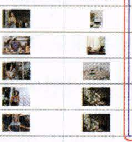

. ....I ..,.. Io....u.""츠’-

휩.,,또“볼 ..•

••단 인스미그• ·어 ••립 ....꽤 • • 꽤릴어 ••• • 게 면..... 디 께서•••• 키· 챠안아 ...,•

•••嶋. ..오......

빼 ·고••U차인 ...

낳

••기••• 브론도 리도 .... ......인이 획.,, .라렸어....도가 1던 던

....u••-· I •따鬱Um’....._ ·口1)••.- Ia'미tUmE튼1!4··

읊 ’

###### ."。..

· ..드는나안" 른 . ....자만어 . ....나 ..... 뺀조q...,... ... -· ·뺄도.러•••고••튼 기""어' 도가다.네..민특

....터

. t!II자신밑1건 ..•

- •""'u..... 1~(야대••드H4•·
- •""'U···· 1· (q.u••li

·혀費‘ 톱볼讐 신••

.. 시C 를......,.

·른도현•••• • ....m였••"••" .....틀........

4

I밋 빼키지 .....신... ..어요·

도구

el

• O새로 디자인들의 파일명

486 CHAPTER 07 캔바 A 로 생산성 향상시키기

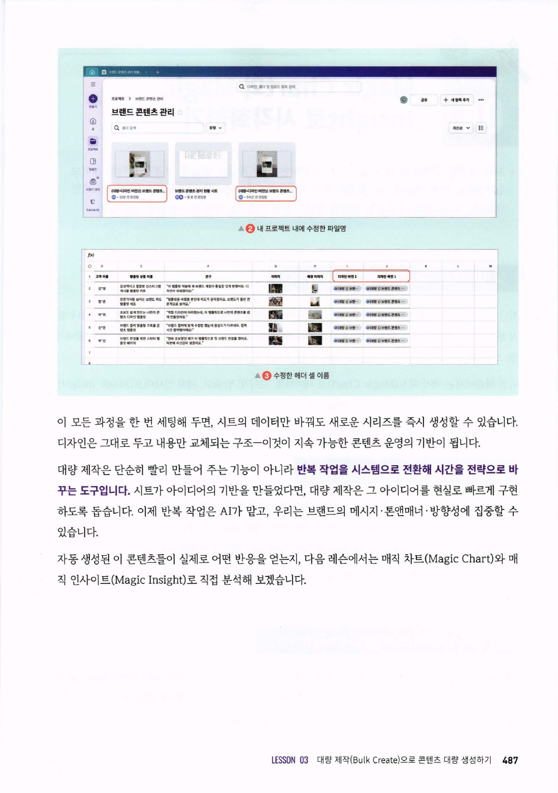

!!..I빼를>브롤드른년츠간리 • 를書 +세•••가 ...

Q <l"",ll<l'I"""빼

..가

브랜드콘텐츠관리

®

Q •c"" 흙. V v i

###### ....

•••@., .-'-·;

CB

I••'C'.. _一~브tlEYL9.,,,,..... ] 탸타硏현e;a.........꼬 _0·요”_…-

c.-"

O 내 프로젝트 내에 수정한파일명

/(지

###### 0 D

틀 아빼직 ”빼빼지 q瓚언빼협1

l 고빼어1

.”‘.터·

, ..` 걸셜빼......언스이,. ..,...｀틀빼 ••도재빨이 ••제단..,..q

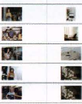

처서 " 자던어 때륄어요!. ·口 1).한·· •""＂J 嵐헨드튼뺀츠 ••

단.가리••아e·른도빼도 .....•..........雙언떼빼도달........ .던던 • （대.1).룹·· •k""""＇드튼뺀쵸

’ 를•튼

..• .....,••인드는나단뻬른 •••Q자안어어"'닌｀이••뺄오·나"......

뺄•<Pit!... 제0IUCI으· • 1ttell•t!·· •(tff lJ.튼튼튼츠•••

- • 신.른 •• •

꼬.. .•••타··~를`.""mq.넬ae·

“스"費 시C···n,`요!.

• 皇릅 •仁,'U브롤드튼뺀츠_

- • ··선 童톨드던훨

•• 스• ..........빼기혁."오•••틀드휩••讐어요

· «"'U皇틀- •仁 U.뺄됴 튼퀄프-

"...... • ...자신 곁어요.

~ O 수정한헤더셀이름

이 모든 과정을 한 번 세팅해 두면, 시트의 데이터만 바꿔도 새로운 시리즈를 즉시 생성할 수 있습니다. 디자인은 그대로 두고 내용만 교체되는 구조-이것이 지속 가능한 콘텐츠 운영의 기반이 됩니다.

대량 제작은 단순히 빨리 만들어 주는 기능이 아니라 시간을 바

꾸는 도구입니다. 시트가 아이디어의 기반을 만들었다면, 대량 제작은 그 아이디어를 현실로 빠르게 구현

하도록 돕습니댜 이제 반복 작업은 AI가 맡고, 우리는 브랜드의 메시지 ·톤앤매너 · 방향성에 집중할 수

있습니댜

자동 생성된 이 콘텐츠들이 실제로 어떤 반응을 얻는지, 다음 레슨에서는 매직 차트(Magic Chart)와 매

직 인사이트(Magic Insight)로 직접 분석해 보겠습니다.

LESSON 03 대량 제작(Bulk Create)으로 콘텐츠 대량 생성하기 487

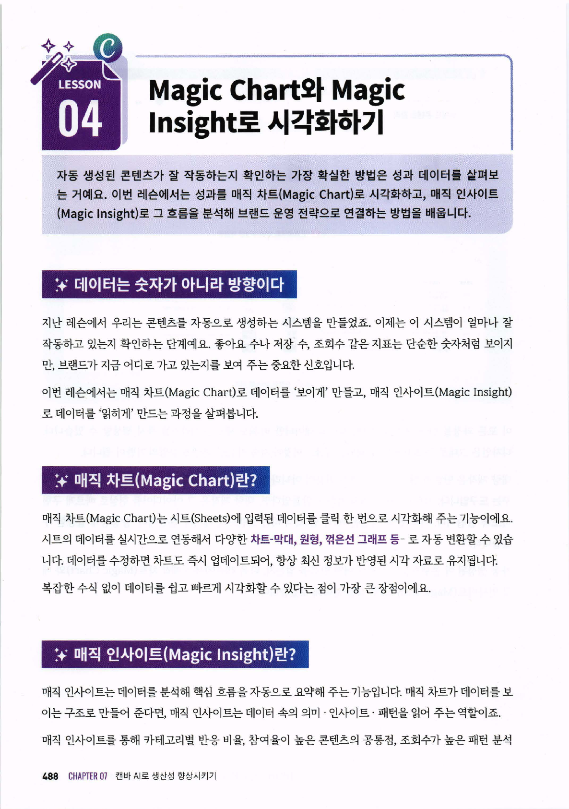

###### Magic Chart와 Magic

###### Insight로 시각화하기

자동 잘 데이터를

는 매직

(Magic 그 배웁니다.

l

지난 레슨에서 우리는 콘텐츠를 자동으로 생성하는 시스템을 만들었죠. 이제는 이 시스템이 얼마나 잘

작동하고 있는지 확인하는 단계예요. 좋아요 수나 저장 수, 조회수 같은 지표는 단순한 숫자처럼 보이지

만, 브랜드가 지금 어디로 가고 있는지를 보여 주는 중요한 신호입니다.

이번 레슨에서는 매직 차트(Magic Chart)로 데이터를 ‘보이게' 만들고, 매직 인사이트(Magic Insight) 로 데이터를 ‘읽히게' 만드는 과정을 살펴봅니다.

###### | |

매직 차트(Magic Chart)는 시트(Sheets)에 입력된 데이터를 클릭 한 번으로 시각화해 주는 기능이에요.

시트의 데이터를 실시간으로 연동해서 다양한 차트-막대, 원형, 꺾은선 그래프 등- 로 자동 변환할 수 있습 니다. 데이터를 수정하면 차트도 즉시 업데이트되어, 항상 최신 정보가 반영된 시각 자료로 유지됩니다.

복잡한 수식 없이 데이터를 쉽고 빠르게 시각화할 수 있다는 점이 가장 큰 장점이에요.

###### |

매직 인사이트는 데이터를 분석해 핵심 흐름을 자동으로 요약해 주는 기능입니다. 매직 차트가 데이터를 보 이는 구조로 만들어 준다면, 매직 인사이트는 데이터 속의 의미 · 인사이트 · 패턴을 읽어 주는 역할이죠.

매직 인사이트를 통해 카테고리별 반응 비율, 참여율이 높은 콘텐츠의 공통점, 조회수가 높은 패턴 분석

488 CHAPTER 07 캔바 Al로 생산성 향상시키기

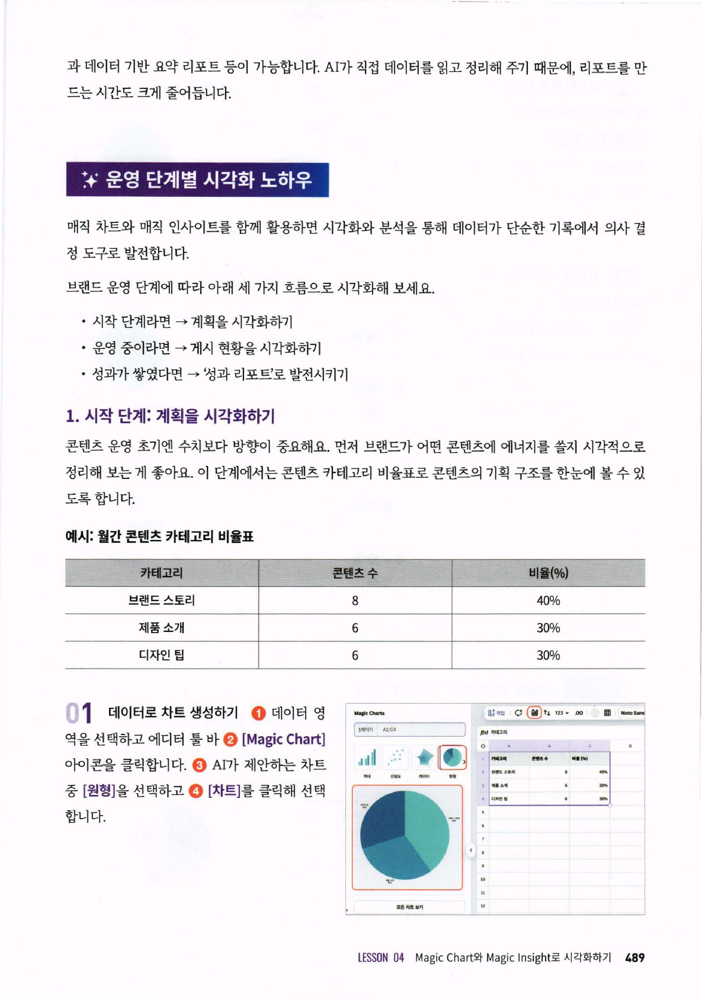

###### 과 데이터 기반 요약 리포트 등이 가능합니댜 AI가 직접 데이터를 읽고 정리해 주기 때문에, 리포트를 만

드는 시간도 크게 줄어듭니다.

###### |

###### 매직 차트와 매직 인사이트를 함께 활용하면 시각화와 분석을 통해 데이터가 단순한 기록에서 의사 결

정도구로발전합니다.

브랜드 운영 단계에 따라 아래 세 가지 흐름으로 시각화해 보세요.

- • 시작단계라면 一 계획을시각화하기
- • 운영 중이라면 一 계시 현황을 시각화하기
- • 성과가 쌓였다면 一 ‘성과 리포트’로 발전시키기

###### L 시작 단계: 계획을 시각화하기

콘텐츠 운영 초기엔 수치보다 방향이 중요해요. 먼저 브랜드가 어떤 콘텐츠에 에너지를 쓸지 시각적으로

정리해 보는 게 좋아요. 이 단계에서는 콘텐츠 카테고리 비율표로 콘텐츠의 기획 구조를 한눈에 볼 수 있

도록합니다.

예시: 월간 콘텐츠 카테고리 비율표

| | | |
|---|---|---|
|브랜드스토리|8|40%|
|제품소개|6|30%|
|디자인팁|6|30%|

1

- 1 데이터로 자트생성하기 O 데이터 영

###### 距업 0 n t23니 .00

1111 .....

"嶋ko

R 캬떼고려

역을 선택하고 에디터 툴 바 f) [Magic Chart] 아이콘을 클릭합니댜 O AI가 제안하는 차트 중 [원형]을 선택하고 O [차트]를 클릭해 선택

-[IJ"

..... ...H

###### I1::d~---

###### ."". ---

... 산

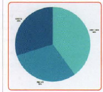

합니댜

모른 치틀보기 U

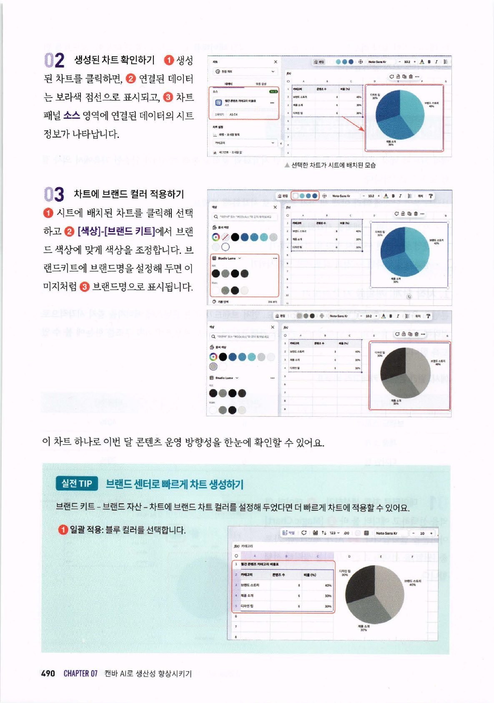

###### 02 생성된자트확인하기 O생성

###### I...~....

x

• • I!' 묘o...”

· m· 스 B I 8

Ciil~. a···

된 차트를 클릭하면, O 연결된 데이터

'리

먀, •• "

0 • • '

나i"- -- "-~·---7

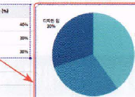

나!......- • -l 나·.’~.."일 — ‘• 七 --!.1

###### ...-...

I

는보라색 점선으로표시되고, O 차트

T....~ " "

”«" ^LC4

패널 소스 영역에 연결된 데이터의 시트

###### .....

-:....

정보가나타납니댜

... － 훑서• ••

....크"

• 세'..- 墨시를•

선택한 차트가 시트에 배지된 모습

###### 03 차트에브랜드컬러 적용하기

###### ..

土... ';, _ ....,. _ l0.2 • 스 B I 죠 .. ,.

###### ·

O 시트에 배치된 차트를 클릭해 선택 하고O [색상]-［브랜드 키트]에서 브랜

X _,,

:~1/。····

Q ...、....' ~Gk..”""~

Oiil ~ @ •••

0 • ' '

• .... .... ..,.. I

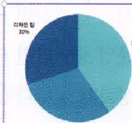

:.ii!.....”,... ‘' --!i

6 .......

###### . _,

###### ·.... !

“쇼"'

E ·___..-·· _._.- ·4

드 색상에 맞게 색상을 조정합니다. 브 랜드키트에 브랜드명을 설정해 두면 이 미지처럼 O 브랜드명으로표시됩니다.

’

- •..물和나••V•
- ••

###### ....

'O員

###### o,,.'"' .."' "

;-:).....

쓰•• ] • ';, _""' - m • 소 • I 誌 ... ?

X /W

뻬촬

0 ^ • ,

Q -.,,..._.""..같이·어

Cm ~ 8 ···

###### ' ...... . - !;

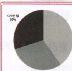

' ＊·끄 .... ..... !

0 •서...

###### ...-...

' .." ' 더!

. .... ‘ “미

『노.-···-- · I

- •`•••
- ••

읍 ”-- v

입

이 차트 하나로 이번 달 콘텐츠 운영 방향성을 한눈에 확인할 수 있어요.

###### - 자트생성하기

- 랜 - 자 에 자트 컬러를 자 수

탑m c t4 123 V .00 器 Not"""' - 10 +

too "태고리

。

1 틀간 츠 고티빼••

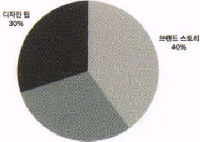

’브론도스토러 -

l 카빼고러 튼츠 .. 뻬. (이

###### . ••” ,.,.

s 언 릴 꼬

###### I.

빼,.,..”

###### 490 07 캔바 Al로 생산성 향상시키기

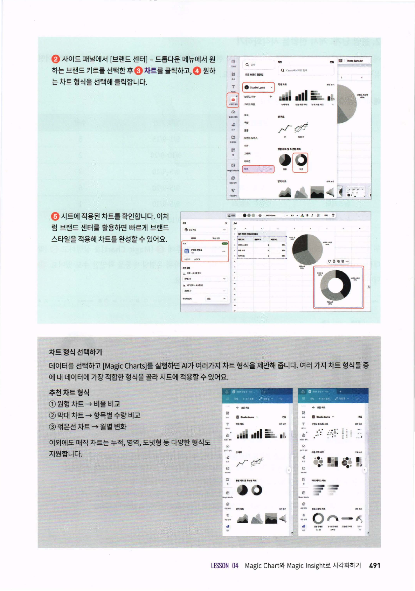

....-....,

O사이드 패널에서 센터] - 원

###### ....

Q •• ”

(B

하는 브랜드 키트를 선택한 후 차트를 클릭하고, 원하

Q " ...서""＇뻬

·

誌

따 도...

옳T`E.•‘자선 + ...”

J

는 자트 클릭합니다.

###### -嶋...

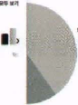

###### 1111 =. IL,

- .. ”

###### .....n ...." ..

o ..

””. wo

`-4·· ...

십..

/

" "

[\

m`e, --

.....

###### l'·3!‘;-

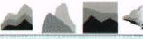

""

:已＇― --·

시트에적용된자트를확인합니댜이저

• • ,,. -- - u - A ' l - 'P

스"

·

”°”..

X

빠르게

....-

###### ' -

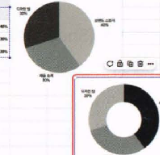

적용해 수 .

”

自 _".

###### ....

""" ^

###### -........_..－·潭.......

-스"＇

o

흡...

차트형식선택하기 선택하고 를 차트 줍니다. 여러

- -......

"蠶 ·-노V

T - • ....

뻬

- -··....•...•..•...:：구;.:iI!!

.....。 ...... ..m

:‘2"‘"

e, ".- •• 탸.

`駐.

e

- --

에 데이터에 가장 수

➔ ➔

###### ..

"•-느~.. ｀．

###### ...••

”

###### .T

###### ..

“어

➔

··‘‘•.

IIII

I>

’

." ...

。

.,4

/?겼

###### "..

e,

"........

m.

###### .e.

###### •...。 "..

。

"""

... 언 ..

###### ..`",

###### ..... ............ ^..

T

".

"'

벼

.사. ,,

**

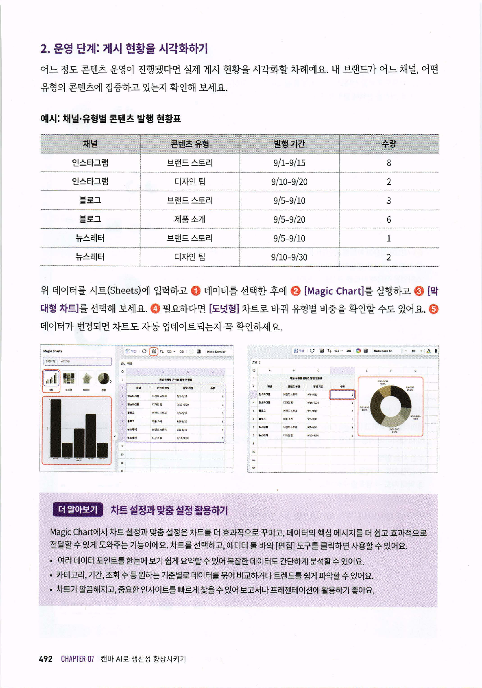

###### 2. 운영 단계: 게시 현황을 시각화하기

어느 정도 콘텐츠 운영이 진행됐다면 실제 게시 현황을 시각화할 차례예요. 내 브랜드가 어느 채널, 어떤

유형의 콘텐츠에 집중하고 있는지 확인해 보세요.

예시: 채널·유형별 콘텐츠 발행 현황표

###### I j

|I| | | |
|---|---|---|---|
|인스타그램|브랜드스토리|9/1-9/15|8|
|인스타그램|디자인팁|9/10-9/20|2|
|블로그|브랜드스토리|9/5-9/10|3|
|블로그|제품소개|9/5-9/20|6|
|뉴스레터|브랜드스토리|9/5-9/10|1|
|뉴스레터|디자인팁|9/10-9/30|2|

위 데이터를 시트(Sheets)에 입력하고 O 데이터를 선택한 후에 f.) [Magic Chart]를 실행하고 O 대형 차트]를 선택해 보세요. O 필요하다면 [도넛형] 차트로 바꿔 유형별 비중을 확인할 수도 있어요. O 데이터가 변경되면 차트도 자동 업데이트되는지 꼭 확인하세요.

M냐Q"m 距업 0 ®ft 123• .00 Ill! N야0""'" m C h 123V OO O 1111 Noto...." • 10 • A I

ET모야 '"

",, 5

###### 떨!., - ..

.. •..... | &-4”&:c

。

0 ^

..... ..曺....

흩•• 른뺄죠..

###### “"E ••

|·넬 ”기건  ”  언..,. ...... 힉l·'J5  ’  언．,. 디자던밑  "0-"" ’  t m 므턴으스•• ·입Li',0  .., ’  `‘” ”.,,. ’  ••빼빼 ·면드스••  "~" ’  ·스•• 더자연입 학10-'n  ’|
|---|

.,..m •••스러 ,'..,,' .,~

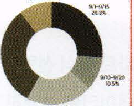

' 언스騎,. ••드스’’ 읽''n5

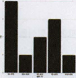

언스.,． "입 "}'" 2

###### ••빼빼 ...... 읽'’ .I

., ＊저 “조

###### ..... 1 일'",,. 엇

###### -

더

. ,

- • 보기 수 .

•

- • 수

492 CHAPTER 07 캔바 Al로 생산성 향상시키기

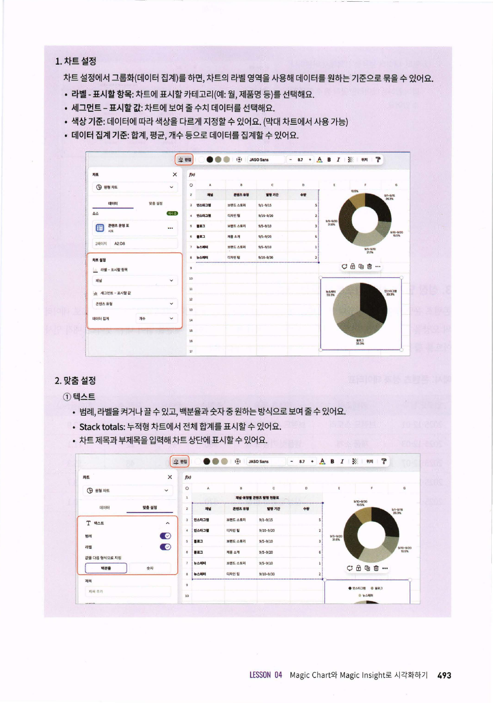

- 1. 자트 그룹화(데이터 하면, 원하는 수

- • 라벨 - 표시할 항목: 차트에 표시할 카테고리(예: 월, 등)를 선택해요.
- • - 수지 .
- • 색상 : 데이터에 따라 색상을 수 （막대 자트에서 사용 가능)
- • 데이터 집계 합계, 개수 수 있어요.

치ll

®""

• • '!' JASOSans

X ffeJ

。

뻬 른.. ” 기a

os`

데Of터 ' 언스嶋그.

소

‘ • 인스타:,.

© :r" II • ••

ig

,......

,.,...... .,'.,, ..............

1·,

.•

s'

,

‘ l'

~

·

~

♦

10g

i

4 ~

g"일

i

빼

~

u- 포인

언

"

"n

~

• . q ~

gg

i

스

스

..

" .

11

디자인 릴

·땔

‘ .m 꽤.소’,

2빼0114 A2:08

일1-""

'l/l.../20

이따•

- ..7 ♦ A B I » 曲 T

"""'`

치.!l 촬혈

려'I -ll•I촬맡톨

쐐널

o iil Ce ® •••

'" 세그먼. - 표시촬 깁

은민츠유혈

u n

개수

tS

“ ”

- 2. 맞춤설정 ® 텍스트

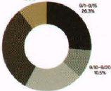

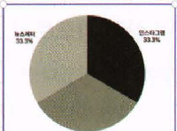

•

• Stack totals: 누적형 자트에서 전제 합계를 표시할 수 있어요.

•

-a.1•A B I ~ 曲 T

• l JASOSans

X /(사

처.!!

® 틴혈서!l

···---·-··-··--...* ••••••빼'11_••••·…,·._I!뺄Z•••_一”•••`•..••••••••,...._•••~····_.__..•

。

2 , .... I!11S". 1l 수. .

,."

나!인스터그. Ill!드프리 이내15 5!!

데01터 맞‘쉘뮐 T 텍스트

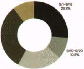

###### « «

‘ !I'언스라그. 디지인11 ·/1...n i

###### 1 석

법례

앙

s 1• •

:I ·I!도 색리 파’IIO 야

###### 11 ::다흡혈식으료자정

‘ .I•m 빼•소" '/S-아,. . :

I

; ::

###### c a ® @ ...

1 !묘스..터 ,.텐도 스" ' ~9/IO I :

###### i i

빼ff ] 숫지

다표..더 q지"II 9/I...m

..........._..----·_••••••__.. ..--••-------___....---··-------···--·-----··‘

꽤록

• 안소,. 틀,.,

.스••

재디 •가

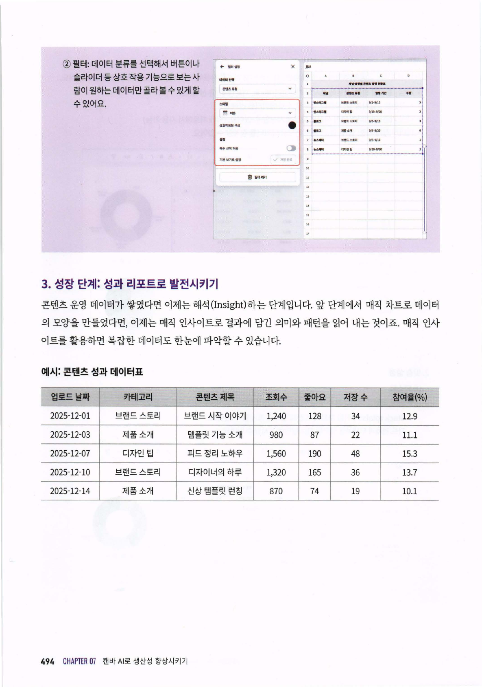

®필터: 데이터 선택해서 버튼이나

X

JWo

e 촬터

###### 토

보는 사

Ha 一

······ 一“

,

f i

. " "

I :른웹S::틀.

···

i i m. g"

i g

•

.

9

2~igg

••

"

3.”

二三

s23

·획빼

수있어요.

'aa{tI

• • •

- .,e

•• •• .

•

,

••

’ .

1

一

—

I ,

포

0

.

一

.

·

i

·

빼

기른 嵐기 볼 '/ 서3 EI

l0

@ 뢸티>Vt u

IS

I•

- 3. 발전시키기

콘텐츠 운영 데이터가 쌓였다면 이제는 해석 (Insight)하는 단계입니다. 앞 단계에서 매직 차트로 데이터

의 모양을 만들었다면, 이제는 매직 인사이트로 결과에 담긴 의미와 패턴을 읽어 내는 것이죠. 매직 인사 이트를 활용하면 복잡한 데이터도 한눈에 파악할 수 있습니다.

예시: 콘텐츠 성과 데이터표

|업로드날짜|'困l고리| | | |저장수|참여율(%)|
|---|---|---|---|---|---|---|
|2025-12-01|브랜드스토리|브랜드시작이야기|1,240|128|34|12.9|
|2025-12-03|제품소개|템플릿기능소개|980|87|22|11.1|
|2025-12-07|디자인팁|피드정리노하우|1,560|190|48|15.3|
|2025-12-10|브랜드스토리|디자이너의하루|1,320|165|36|13.7|
|2025-12-14|제품소개|신상템플릿런징|870|74|19|10.1|

494 CHAPTER 07 캔바 Al로 생산성 향상시키기

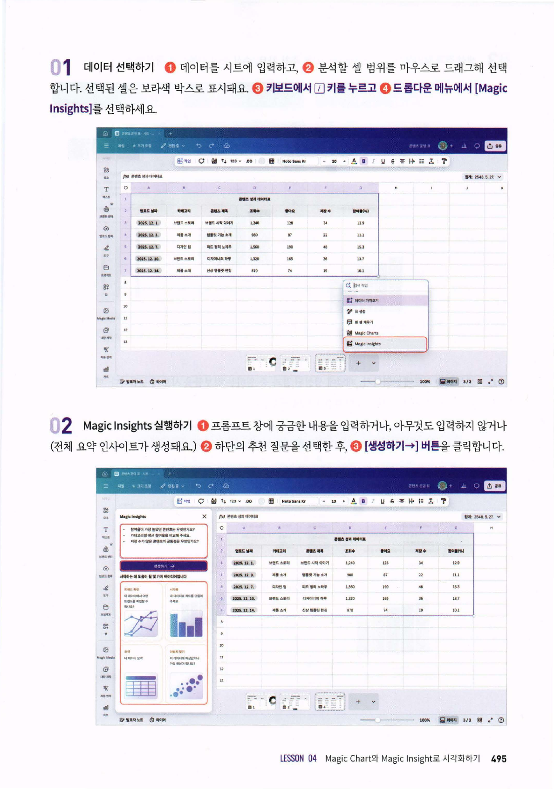

###### 1 데이터 선택하기 O 데이터를 시트에 입력하고, 0 분석할 셀 범위를 마우스로 드래그해 선택

합니댜 선택된 셀은 보라색 박스로 표시돼요. 띠 [Magic

를 선택하세요.

=

話여 O 딜 " '" v .00 ll!I Noto..,,.., - 1o • ~ II I U 6 ¥ 沖 I: J. 'i'

器

.. /00 마.. It자 ',27 v T o

"a

......군 :1 :::

보른S색리빼 嵐뺀됴서죠리이빼.어기 畵2••" •l2· "34. ~ll.t`

빼.” ••t!기블소개 ... ” 22 lLl

,.,. .. 따

‘

2025. 12.J. 4 • U.T •• • 저w.11.10. ....E3 ? ,.ll.12.14.

디자연 릴 노 멕

,.

드스量텨 G자어니~-· 1"

`i1

꽤• 신실•• ‘TI) ”

19 10.l

묘

舒

•

Ei 10

·l? ...

曰 번..."'

”뻬·- 11

.... n

M따CIWu

....\’

·1 ..- I;t,.·=•....•...-......._...... -....i + `‘

13

M clnsl&hts

빼

| ..

Ill 諱 ." (i)

###### 2 MagicInsights실행하기 O프롬프트창에궁금한내용을입력하거나,아무것도입력하지 않거나

(전체 요약인사이트가생성돼요.) 하단의 추천 질문을 선택한후, 0 [생성하기➔] 버튼을 클릭합니 다.

二·v c' @ 一一-

話" ° 덜 n ,'’" .00 • - 10 • 소 U S =!= l+ i三 i ?

않

.. MacJc lnsl&hU ti` 5,27 V

x mn'""－皇

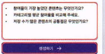

。

T • IIOII이 가．았던른텐초는 무엇언~Q?

• ＂ 電 •글 벼교.. ...

터量

• ..푈 ♦"se 틀

*

###### ......

2 엽．됴낱빼 ”혀 튼"... 꼬• ·어요 빼.拳 ...."U

®

’ ,.2S.n.,. 뵤륄도색뼈 S시리이어기 l2.. UI

,..

. 2025 l• 제틀 ••릴기1t소 ... ” 22 "II·'I

。

• ........,. 연탈 획됴•리"'"· 1.,.. "D .. li3

혈" " 시때는 대 도.이 • 冒 가지

4 ...." 시헨

. 2015.lL10. ·뺀드스러 디지어너뤽If. l.llO "

###### S구 .이.“”..""....＇기"". ....s tt■e•아

”

ll.1

###### 舒 ? 1111

###### | 요

혈.,

’

·70

2025. 12. 1,. 빼I 신실• • 틸 e밑

14 l IO.I

•

”""" ~-... ~-..아.....

Ei ... 續 기

lO

###### ....。

혁 휩실어

l2

###### •••••

.... ••••••

###### ·t-·~-

(l'1-

었

-..

’

~ l

i

..-

###### ..,II

..

+

.

.

霞 1 畵 . -

~

a IIOI의 313 認 ,• ®

1'";•I>I 디 止뻔

LESSON 4 Magic Chart와 Magic Insight로 시각화하기 495

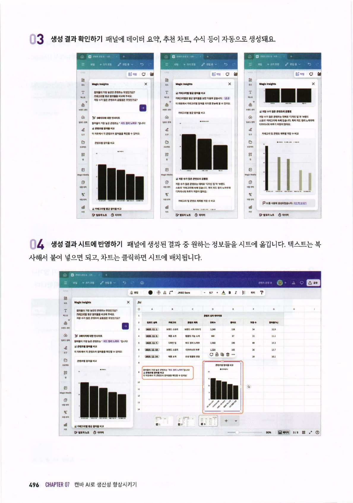

###### 03 생성결과확인하기 패널에 데이터 요약,추천 차트,수식 등이 자동으로생성돼요.

|:□ |I □ , |I:O |

m O 話m o O

M嶋kU마.. X ” Ma&lc- X ” "`km"om X

않 器

”

.. 뻬a빼루세요. ·스. 글 •I!!다과같.따lU .

지릴♦가露e""를••e무엇언가2? ‘"..”떼고""I'IOII합""~

T 튼혈쵸논 T .. T

....®‘’ ■ -.. ""고라••ii.....바교 ·틀뺀® 일鴻‘후가랄은른뺀요빼를"

`

..,

..... 헐"" 스.리. 빼｀빼 .·터또·러노.

’"m편마'언짠 。 。 괴릴 "`l! ......

헐"" .,.,．여져'•e•'텔"'· ~도 ·리노甲, 일따

．

4 ..e뺄요 I버크

‘

., •• : 도구 4 “러혈른언a빼빼.저fl♦바교 e 촬여1 e e!

m.. .... ....

院. 終• 察•

""""."티져랍솔가협e --

...._

g 。

-------_L

.....

。 。 Ut

0 ... 며'"＇ 스티. ·혀鵬드

....

..... .....

\. | \’ ··기파‘아 \·

카빼고혀`른텐츠빼••"Ill ..뻬교

.. .. · ·-·솥嶋 빼.

tll .. • 실 广서. 강\혈鳳.,자．노액.빼一一

7 틸"". 。印'어 노. 。 止

###### 4 생성결과시트에반영하기 패널에생성된결과중원하는정보들을시트에옮깁니다.텍스트는복

사해서 붙여 넣으면 되고, 차트는클릭하면 시트에 배치됩니다.

|:° @ lm

土印 • ';, " r .JAS0....

- ..7. 스 8 I ;£. ＂치 ,.

않

.. "m

•

###### X /f1J

T

###### ...,..

。

촬IOf 가 던 튼만S는 9혈연기1t? 量 뻬교빼

###### ....

`포

..춥.."'

지촬令가1111!

낱

, """m

..+

l.,.. l.,..'"

###### .• -_....U.1,.

Ill

, -U.L

••됴스"

기

n"

”

。 솔수•' •

11-1

••• " ••뺄기."

”·" 저＂고른uae·티 밀따

디지· ····뇨••

1"

I..

1.,,. ,..

"

4 ..

- • - .u.... ' -.u.1` 빼I스제 ••• 雙

빼•+

..

I"I n

IU

•••OI 가. .....e ·•s ••느···일나다’

- • ,뻬mn 뻬•

Il鬱'

皇구 어의.. II 마!. ♦

0@~ 9 ...

"..

It MU

e mE• ....어교

·-

틀....."

즈'"''’f’ll(

어시 서빼"......... ．언• ♦ ""a:

t:11111

.. ••글 비교

r.i'•vtil ~1101이 .... 딜_ ，1며」

(i=•7•······--. :.:::\-•.

=- - =

\ ..'!.....-·· j

..

+ V

國, 2

496 CHAPTER 07 캔바 Al로 생산성 향상시키기

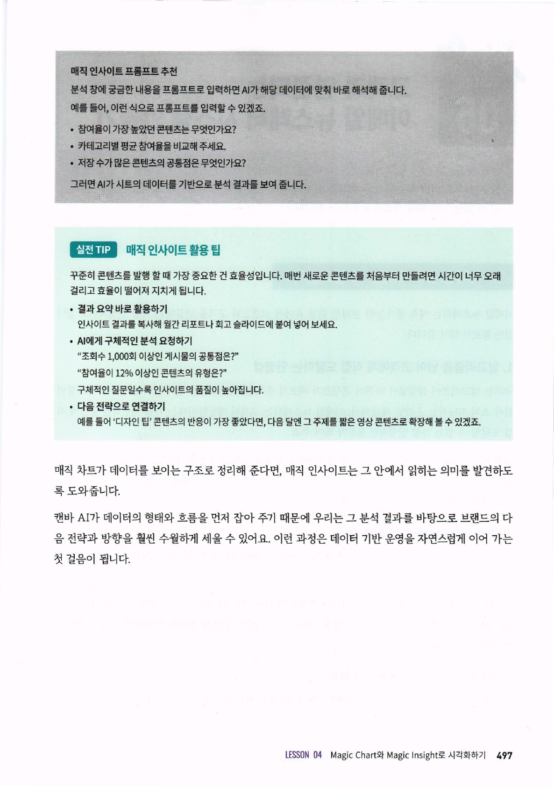

해당

예틀 들어, 이런 수

• • •

시트의 데이터틀 보여

###### 매직인사이트활용팁

꾸준히 할 때 가장 중요한 건 효율성입니다. 매번 시간이 너무 오래

됩니다.

- • 결과 요약 회고 붙여 넣어 보세요.
- • Al “조회수 공통점은?" " 12% 유형은?" 구제적인 .
- • 다음 예를 들어 ‘디자인 팁' 가장 다음 그 볼 수

매직 차트가 데이터를 보이는 구조로 정리해 준다면, 매직 인사이트는 그 안에서 읽히는 의미를 발견하도

록도와줍니댜

캔바 AI가 데이터의 형태와 흐름을 먼저 잡아 주기 때문에 우리는 그 분석 결과를 바탕으로 브랜드의 다 음 전략과 방향을 훨씬 수월하게 세울 수 있어요. 이런 과정은 데이터 기반 운영을 자연스럽게 이어 가는

첫걸음이 됩니다.

LESSON 04 Magic Chart와 Magic Insight로 시각화하기 497

