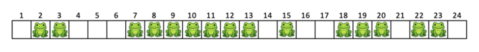
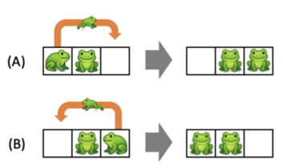
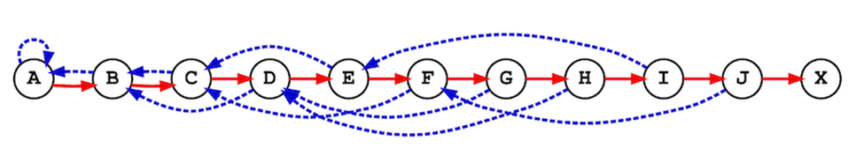

# 📚 2026년 5차 고등 수업 해설지

**<사고력상>**

### 📝 1. 정다각형 쌍을 모두 만들 수 있는 최소 성냥 수
**문제:** 같은 길이의 성냥이 담긴 박스가 있다. 정삼각형, 정사각형, 정오각형, 정육각형의 각 쌍을 박스에 담긴 성냥을 모두 사용해서 만들고 싶다. 예를 들어 박스에 11개의 성냥이 있다면 정삼각형과 정사각형은 각각 성냥 3개, 8개로 만들면 되고, 정삼각형과 정오각형도 각각 6개, 5개로 만들 수 있다. 그러나 정삼각형과 정육각형은 11개의 성냥으로 만들 수 없다. 네 가지 정다각형의 모든 쌍을 만들 수 있는 최소 개수의 성냥은 몇 개인가? (중등 2019년도 11번)

**선택지:** 없음

**✅ 정답: 36**

**💡 선생님을 위한 풀이 가이드:**
* **출제 의도:** 서로 다른 두 도형의 변 개수를 보고, 같은 수를 두 가지 방식으로 나누어 표현할 수 있는지 확인하는 문제입니다.
* **상세 풀이:**
  1. 이 문제는 "정삼각형 1개와 정사각형 1개"처럼 각 도형을 한 개 이상씩 만들어서 성냥을 모두 쓰는 경우를 찾는 문제입니다.
  2. 따라서 어떤 수 $N$이 모든 쌍에 대해
     $$N=3a+4b,\; N=3c+5d,\; N=3e+6f,\; N=4g+5h,\; N=4i+6j,\; N=5k+6\ell$$
     꼴로 표현되어야 합니다. 여기서 모든 문자는 $1$ 이상의 정수입니다.
  3. 작은 수부터 검사해 보면 36보다 작은 수는 여섯 쌍을 모두 만족시키지 못합니다.
  4. 그런데 36은 실제로 모든 쌍에 대해 만들 수 있습니다.
     $$36=3\times 4+4\times 6$$
     $$36=3\times 2+5\times 6$$
     $$36=3\times 2+6\times 5$$
     $$36=4\times 4+5\times 4$$
     $$36=4\times 3+6\times 4$$
     $$36=5\times 6+6\times 1$$
  5. 따라서 네 가지 정다각형의 모든 쌍을 만들 수 있는 최소 성냥 수는 36개입니다.
  * *(Tip! 학생들이 "두 개씩 만든다"로 오해하기 쉽습니다. 문제의 핵심은 "두 종류의 정다각형을 한 개 이상씩"이라는 점을 먼저 분명히 잡아 주세요.)*

---

### 📝 2. 이어 쓴 자연수의 백만 번째 자리
**문제:** 자연수를 아래처럼 빈칸 없이 왼쪽부터 오른쪽 방향으로 차례대로 1부터 나열한다고 하자. 가장 왼쪽 자리가 첫 번째 자리라면, 백만 번째 자리에 오는 숫자는 0부터 9까지 중 무엇인가? (중등 2019년도 12번)

**선택지:** 없음

**✅ 정답: 1**

**💡 선생님을 위한 풀이 가이드:**
* **출제 의도:** 무작정 쓰지 않고, 자릿수별로 끊어서 몇 자리까지 왔는지 계산하는 능력을 확인하는 문제입니다.
* **상세 풀이:**
  1. 한 자리 수는 1부터 9까지이므로 모두
     $$9\times 1=9 \text{자리}$$
     입니다.
  2. 두 자리 수는 10부터 99까지 90개이므로
     $$90\times 2=180 \text{자리}$$
     입니다.
  3. 같은 식으로 계산하면
     $$900\times 3=2700$$
     $$9000\times 4=36000$$
     $$90000\times 5=450000$$
     자리입니다.
  4. 따라서 5자리 수까지 쓴 자릿수의 합은
     $$9+180+2700+36000+450000=488889$$
     자리입니다.
  5. 백만 번째 자리까지 가려면 6자리 수 구간에서
     $$1000000-488889=511111$$
     자리를 더 가야 합니다.
  6. 6자리 수 하나는 6자리씩 차지하므로
     $$511111=6\times 85185+1$$
     입니다.
  7. 즉 100000부터 시작하는 6자리 수를 85185개 다 지나고, 그다음 수의 첫 번째 자리를 보는 상황입니다.
  8. 그 수는
     $$100000+85185=185185$$
     이므로 첫 번째 자리는 1입니다.
  * *(Tip! "몇 번째 수인지"보다 먼저 "몇 자리 수 구간인지"를 찾게 하면 계산 실수가 확 줄어듭니다.)*

---

### 📝 3. 공을 옮긴 뒤 남는 빨간 공과 파란 공
**문제:** 컵 A에는 빨간 공이 $n$개 들어 있고, 컵 B에는 파란 공이 $m$개 들어 있다. 컵 A에서 빨간 공 $k$개를 컵 B로 옮겼다. 컵 B의 공들을 잘 섞은 다음 임의의 $k$개를 꺼내서 컵 A로 옮겼다. 이때, 컵 A에 있는 파란 공의 개수 $x$와 컵 B에 있는 빨간 공의 개수 $y$의 관계에 대한 다음 설명 중 항상 옳은 것은? (초등 2020년도 10번)

**선택지:** ① $x>y$   ② $x<y$   ③ $x>y$인 경우도 반드시 있고 $x<y$인 경우도 반드시 있다   ④ $x=y$   ⑤ $x>y$인 경우, $x<y$인 경우, $x=y$인 경우 모두 반드시 있다

**✅ 정답: ④ $x=y$**

**💡 선생님을 위한 풀이 가이드:**
* **출제 의도:** 확률처럼 보이지만 사실은 개수 보존만으로 해결되는 문제임을 알아보게 하는 문제입니다.
* **상세 풀이:**
  1. 처음에 컵 A에는 빨간 공만 있고, 컵 B에는 파란 공만 있습니다.
  2. 컵 A에서 빨간 공 $k$개를 컵 B로 옮기면, 컵 B 안에는 빨간 공 $k$개가 생깁니다.
  3. 이제 컵 B에서 공 $k$개를 꺼내 컵 A로 옮깁니다.
  4. 이때 컵 A로 옮겨진 파란 공의 개수를 $x$라고 하면, 컵 B에서 빠져나간 파란 공이 정확히 $x$개라는 뜻입니다.
  5. 컵 B에서 꺼낸 공이 모두 $k$개이므로, 나머지 $k-x$개는 빨간 공입니다.
  6. 원래 컵 B에 들어 있던 빨간 공은 $k$개였고, 그중 $k-x$개가 다시 A로 돌아갔으므로 컵 B에 남은 빨간 공은
     $$k-(k-x)=x$$
     개입니다.
  7. 따라서 컵 A에 있는 파란 공의 개수와 컵 B에 있는 빨간 공의 개수는 항상 같습니다.
  * *(Tip! 학생들이 섞는 과정에 집중하다가 겁먹기 쉽습니다. "옮겨 간 빨간 공이 몇 개 남았는가"만 추적하면 끝난다고 알려 주세요.)*

---

### 📝 4. 8을 1, 2, 3의 합으로 나타내는 방법
**문제:** 모든 자연수는 1, 2, 3의 합으로 표현할 수 있으며, 그 방법의 수도 여러 가지이다. 예를 들어 5는 총 13가지 방법이 있다. 그렇다면 8을 1, 2, 3의 합으로 표현하는 방법의 수는 총 몇 가지일까? 참고로 1은 1가지, 2는 2가지, 3은 4가지 방법이 있다. (중등 2020년도 11번)

**선택지:** ① 44   ② 64   ③ 71   ④ 81   ⑤ 149

**✅ 정답: ④ 81**

**💡 선생님을 위한 풀이 가이드:**
* **출제 의도:** 마지막에 붙는 수를 기준으로 경우를 나누는 점화식 사고를 할 수 있는지 확인하는 문제입니다.
* **상세 풀이:**
  1. 8을 만드는 방법은 마지막 수가 1로 끝나는 경우, 2로 끝나는 경우, 3으로 끝나는 경우로 나눌 수 있습니다.
  2. 마지막이 1이면 앞부분은 7을 만드는 방법이고, 마지막이 2이면 앞부분은 6을 만드는 방법, 마지막이 3이면 앞부분은 5를 만드는 방법입니다.
  3. 따라서 방법의 수를 $f(n)$이라 하면
     $$f(n)=f(n-1)+f(n-2)+f(n-3)$$
     입니다.
  4. 문제에서
     $$f(1)=1,\quad f(2)=2,\quad f(3)=4$$
     를 알고 있습니다.
  5. 차례대로 계산하면
     $$f(4)=4+2+1=7$$
     $$f(5)=7+4+2=13$$
     $$f(6)=13+7+4=24$$
     $$f(7)=24+13+7=44$$
     $$f(8)=44+24+13=81$$
     입니다.
  6. 따라서 8을 1, 2, 3의 합으로 나타내는 방법은 81가지입니다.
  * *(Tip! "맨 끝에 무엇을 붙였는가?"로 나누면 점화식 문제가 아주 자연스럽게 시작됩니다.)*

---

### 📝 5. $2\times 10$ 복도 타일 채우기
**문제:** 폭 2m, 길이 10m인 복도 바닥을 1m × 2m 크기의 직사각형 타일로 채우려고 한다. 타일을 쪼개거나, 서로 겹칠 수 없다. 이때 복도 바닥을 주어진 타일들로 빈틈 없이 채울 수 있는 가지수는 모두 몇 가지인가? 아래 그림은 가능한 2가지 방법의 예이다. (중등 2020년도 12번)

**선택지:** ① 54   ② 55   ③ 67   ④ 88   ⑤ 89

**✅ 정답: ⑤ 89**

**💡 선생님을 위한 풀이 가이드:**
* **출제 의도:** 긴 판을 채우는 문제를 앞부분 모양에 따라 점화식으로 세는 능력을 확인하는 문제입니다.
* **상세 풀이:**
  1. 길이가 $n$인 복도를 채우는 방법의 수를 $f(n)$이라고 하겠습니다.
  2. 맨 왼쪽을 어떻게 채우느냐에 따라 두 경우로 나뉩니다.
  3. 세로 타일 1개를 세우면 나머지는 길이 $n-1$인 복도를 채우는 경우이므로 $f(n-1)$가지입니다.
  4. 가로 타일 2개를 위아래로 눕혀 놓으면 맨 왼쪽 2칸이 한 번에 채워지고, 나머지는 길이 $n-2$인 복도를 채우는 경우이므로 $f(n-2)$가지입니다.
  5. 따라서
     $$f(n)=f(n-1)+f(n-2)$$
     입니다.
  6. 처음값은
     $$f(1)=1,\quad f(2)=2$$
     입니다.
  7. 차례대로 계산하면
     $$f(3)=3,\; f(4)=5,\; f(5)=8,\; f(6)=13,\; f(7)=21,\; f(8)=34,\; f(9)=55,\; f(10)=89$$
     입니다.
  8. 따라서 답은 89입니다.
  * *(Tip! 이 문제는 피보나치 수열과 완전히 같은 구조라는 점을 뒤에서 연결해 주면 학생들이 좋아합니다.)*

---

### 📝 6. 합을 아는 사람과 곱을 아는 사람의 대화
**문제:** 정사면체의 각 면에는 숫자 1, 2, 3, 4가 한 면에 하나씩 적혀 있다. 가윤이는 정사면체를 두 번 던진 후, 바닥에 닿은 면의 두 수 $a$와 $b$($a\le b$)를 구한 다음, 나온에게는 두 수의 합 $a+b$를, 다래에게는 두 수의 곱 $a\times b$를 알려 주었다. 두 사람은 모두 자신이 아는 한 진실만을 말했고, 다음과 같이 대화했다.  
나은: 넌 두 수가 뭔지 알겠니?  
다래: 모르겠어. 너 두 수가 뭔지 알겠니?  
나은: 처음엔 몰랐는데 이젠 알겠어.  
다래: 난 여전히 모르겠는걸.  
나은: 가윤이가 말하길, 네가 들은 수와 내가 들은 수가 다르다고 했어.  
다래: 오! 나도 이젠 알겠어.  
이때 $a^2+b^2$의 값은? (중등 2021년도 10번)

**선택지:** ① 2   ② 5   ③ 8   ④ 10   ⑤ 17

**✅ 정답: ⑤ 17**

**💡 선생님을 위한 풀이 가이드:**
* **출제 의도:** 가능한 경우를 모두 써 놓고, 대화 한 줄 한 줄이 어떤 경우를 지워 주는지 논리적으로 추려 내는 힘을 확인하는 문제입니다.
* **상세 풀이:**
  1. 가능한 $(a,b)$는
     $$(1,1),(1,2),(1,3),(1,4),(2,2),(2,3),(2,4),(3,3),(3,4),(4,4)$$
     입니다.
  2. 다래가 처음에 모른다고 했으므로, 곱이 하나로 정해지는 경우는 제외됩니다. 곱이 겹치는 경우는
     $$4=(1\times 4,\;2\times 2)$$
     뿐이므로, 가능한 경우는 $(1,4)$ 또는 $(2,2)$로 줄어듭니다.
  3. 나온은 처음엔 몰랐지만 다래의 말을 듣고 알게 되었다고 했습니다. 두 경우의 합은
     $$(1,4)\to 5,\quad (2,2)\to 4$$
     입니다.
  4. 합이 4라면 가능한 쌍은 원래부터 $(1,3),(2,2)$ 두 가지였고, 다래의 말 이후에는 $(2,2)$만 남으므로 나온이 알 수 있습니다.
  5. 합이 5라면 원래는 $(1,4),(2,3)$ 두 가지였는데, 다래의 말 이후에는 $(1,4)$만 남으므로 역시 나온이 알 수 있습니다.
  6. 여기까지는 둘 다 남아 있습니다. 그런데 다래는 여전히 모르겠다고 했으므로, 자기 곱이 4일 때는 아직 $(1,4)$와 $(2,2)$를 구분할 수 없다는 뜻입니다.
  7. 마지막으로 나온이 "네가 들은 수와 내가 들은 수가 다르다"고 알려 주었습니다. 즉
     $$a+b\ne ab$$
     입니다.
  8. $(2,2)$는 합과 곱이 모두 4로 같으므로 탈락하고, $(1,4)$만 남습니다.
  9. 따라서
     $$a^2+b^2=1^2+4^2=17$$
     입니다.
  * *(Tip! 이런 문제는 표를 그려서 "대화 한 줄당 후보 삭제"를 보여 주면 학생들이 논리의 흐름을 쉽게 따라옵니다.)*

---

### 📝 7. 검은 점을 2개 이상 지나는 격자 경로
**문제:** 아래 그림과 같이 생긴 격자의 출발점에서 도착점까지 가기 위해서는 오른쪽 또는 아래로 이동하는 것만 허용된다. 또한, x로 표시된 곳은 지나갈 수 없다. ●로 표시된 곳을 2군데 이상 지나가는 서로 다른 경로의 개수는 몇 개인가? (중등 2021년도 12번)

**선택지:** ① 42   ② 51   ③ 53   ④ 63   ⑤ 108

**✅ 정답: ③ 53**

**💡 선생님을 위한 풀이 가이드:**
* **출제 의도:** 장애물이 있는 격자에서 단순 경로 수를 세는 것을 넘어, "검은 점을 몇 개 지났는가"라는 상태까지 함께 관리할 수 있는지 확인하는 문제입니다.
* **상세 풀이:**
  1. 이 문제는 단순히 경로 수만 세면 안 되고, 각 경로가 검은 점을 0개 지났는지, 1개 지났는지, 2개 이상 지났는지까지 같이 기록해야 합니다.
  2. 각 격자점에 대해 다음 세 상태의 경로 수를 적습니다.  
     `0개 지남 / 1개 지남 / 2개 이상 지남`
  3. 오른쪽이나 아래로 한 칸 이동할 때, 도착한 점이 검은 점이면 상태가 하나 올라가고, 아니면 상태를 그대로 유지합니다.
  4. x 표시된 점은 아예 표에서 제외하고 계산합니다.
  5. 이렇게 출발점부터 차례대로 표를 채우면, 도착점에 도달하는 경로 수 가운데 "검은 점을 2개 이상 지난" 경로 수가 53개가 됩니다.
  6. 따라서 정답은 53입니다.
  * *(Tip! 이 문제는 한 번에 머릿속으로 세기 어렵습니다. 상태를 3개로 나눠 작은 표를 만들어 채우는 방식으로 수업하시면 훨씬 안정적입니다.)*

---

### 📝 8. 세 수의 곱의 최댓값
**문제:** 길이가 12인 수열 $A=[3,2,4,-6,2,6,5,-3,-2,1,-7,1]$이 있다. $A[i]$를 수열 $A$의 $i$번째 원소라고 하자. 서로 다른 세 정수 $i,j,k$ $(1\le i<j<k\le 12)$에 대해, $A[i]\times A[j]\times A[k]$의 최댓값은? (중등 2022년도 10번)

**선택지:** 없음

**✅ 정답: 252**

**💡 선생님을 위한 풀이 가이드:**
* **출제 의도:** 가장 큰 수 세 개만 고르는 것이 아니라, 음수 두 개를 곱하면 양수가 된다는 점까지 함께 고려할 수 있는지 묻는 문제입니다.
* **상세 풀이:**
  1. 양수가 최대가 되려면 보통 두 가지를 비교하면 됩니다.
     `큰 양수 3개를 고르는 경우`와 `절댓값이 큰 음수 2개와 큰 양수 1개를 고르는 경우`입니다.
  2. 양수 3개만 고르면 가장 큰 세 수는
     $$6,\;5,\;4$$
     이므로 곱은
     $$6\times 5\times 4=120$$
     입니다.
  3. 음수 중 절댓값이 큰 두 수는
     $$-7,\;-6$$
     이고, 가장 큰 양수는 6입니다.
  4. 이때 곱은
     $$(-7)\times(-6)\times 6=42\times 6=252$$
     입니다.
  5. 252가 120보다 크므로 최댓값은 252입니다.
  * *(Tip! "양수 세 개"만 보고 끝내는 학생이 많습니다. 음수 두 개가 오히려 더 큰 양수를 만든다는 점을 꼭 짚어 주세요.)*

---

### 📝 9. 2310을 세 양의 정수의 곱으로 나타내기
**문제:** 세 양의 정수 $a,b,c$ $(1\le a<b<c)$에 대해서, $a\times b\times c=2310$을 만족하는 순서쌍 $(a,b,c)$는 모두 몇 개인가? (중등 2022년도 11번)

**선택지:** 없음

**✅ 정답: 40**

**💡 선생님을 위한 풀이 가이드:**
* **출제 의도:** 큰 수를 직접 나누기보다 소인수분해로 구조를 파악하고, 경우를 체계적으로 세는 능력을 확인하는 문제입니다.
* **상세 풀이:**
  1. 먼저
     $$2310=2\times 3\times 5\times 7\times 11$$
     로 소인수분해됩니다.
  2. 서로 다른 소수 5개를 세 수 $a,b,c$에 나누어 주는 문제로 생각할 수 있습니다.
  3. 먼저 $a,b,c$가 모두 1보다 큰 경우를 세겠습니다.  
     즉 5개의 소수를 세 개의 빈 상자에 모두 하나 이상 들어가게 나누는 경우입니다.
  4. 서로 다른 5개를 3개의 묶음으로 나누는 경우의 수는
     $$S(5,3)=25$$
     가지입니다.
  5. 다음으로 $a=1$인 경우를 셉니다.  
     이때 남은 5개의 소수를 두 묶음으로 나누면 되고, 두 묶음의 순서는 최종적으로 작은 쪽이 $b$, 큰 쪽이 $c$가 됩니다.
  6. 5개의 소수를 두 개의 서로 다른 묶음으로 나누는 경우는
     $$\frac{2^5-2}{2}=15$$
     가지입니다.
  7. 따라서 전체 경우의 수는
     $$25+15=40$$
     가지입니다.
  * *(Tip! 이 문제는 약수를 하나씩 세기 시작하면 금방 복잡해집니다. 소인수 5개를 "상자에 나눈다"는 그림으로 바꿔 설명해 주세요.)*

---

### 📝 10. 어떤 경로로 가도 정확히 한 개만 먹는 아이템 배치
**문제:** 아래와 같은 7 × 8 크기의 격자판이 있다. 철수는 현재 $(1,1)$칸에 있으며, $(7,8)$칸에 도착하려고 한다. 철수는 현재 칸 $(r,c)$에 있다면 $(r+1,c)$ 또는 $(r,c+1)$로만 이동할 수 있고, x로 표시된 칸 $(2,5),(2,6),(3,6),(3,7),(5,3),(5,4),(6,2),(6,3)$으로는 이동할 수 없다. 시작, 끝, x 칸을 제외한 빈 칸은 46개이고, 각 빈 칸에는 아이템을 넣거나 넣지 않을 수 있다. 철수가 규칙을 지키며 어떻게 이동하더라도 항상 정확히 한 개의 아이템만 수령하도록 하는 아이템 배치 방법의 수를 구하여라. (중등 2025년도 10번)

**선택지:** 없음

**✅ 정답: 222**

**💡 선생님을 위한 풀이 가이드:**
* **출제 의도:** 장애물이 있는 격자에서 모든 가능한 경로를 동시에 통제해야 하므로, 단순 경우의 수가 아니라 경로 상태를 관리하는 사고가 필요한 문제입니다.
* **상세 풀이:**
  1. 어떤 배치가 조건을 만족하려면, 모든 가능한 경로가 "아이템을 0개 먹은 상태"에서 출발해서 "아이템을 정확히 1개 먹은 상태"로 끝나야 합니다.
  2. 따라서 각 칸을 지날 때마다 경로 상태를  
     `아직 0개 먹음`, `이미 1개 먹음`, `2개 이상 먹어 실패`  
     의 세 가지로 나누어 관리하는 방식으로 검사할 수 있습니다.
  3. 시작점에서부터 오른쪽, 아래쪽으로 차례대로 진행하며, 각 빈 칸에 아이템을 둘지 말지를 결정할 때마다 모든 경로 상태가 조건을 유지하는지 확인합니다.
  4. 이 과정을 끝까지 수행하면, 도착점에 도달하는 모든 경로가 정확히 1개만 수령하는 배치는 총 222가지입니다.
  5. 따라서 정답은 222입니다.
  6. 다만 문항 이미지에는 붉은 글씨로 888이 표시되어 있었는데, 조건을 그대로 두고 전 경로를 재검산하면 222가 나옵니다. 수업 전에 원문 정답표를 한 번 더 확인하는 것이 좋습니다.
  * *(Tip! 이 문제는 손계산보다는 "경로 상태를 같이 들고 가는 동적 계획법" 아이디어를 소개하는 쪽이 수업 흐름상 더 자연스럽습니다.)*

---

### 📝 11. 팀 나누기 (15점)
**문제:** 1번부터 12번까지의 번호가 붙은 총 12명의 선수가 있다. 이 선수들을 6명씩 두 팀(A팀, B팀)으로 정확히 나누려 한다.  
두 팀은 미리 정해진 다음과 같은 순서로 선수를 한 명씩 선발한다: A $\rightarrow$ B $\rightarrow$ B $\rightarrow$ A $\rightarrow$ A $\rightarrow$ B $\rightarrow$ B $\rightarrow$ A $\rightarrow$ A $\rightarrow$ B $\rightarrow$ B $\rightarrow$ A  
각 팀은 자신의 차례가 왔을 때, 아직 선발되지 않은 선수들 가운데 가장 선호하는 선수를 선발한다. 각 팀의 선수 선호 기준은 아래와 같다.
- A팀: 번호가 더 작은 선수를 선호한다.
- B팀: 선수들에 대한 선호 순위를 나타내는 $\{1, 2, \dots, 12\}$의 순열 $p$를 가지고 있다. 각 $i$에 대해, $i$번 선수는 전체에서 $p_i$번째로 선호하는 선수이다. 즉, $p_i$의 값이 더 작은 선수 $i$를 선호한다.

가능한 모든 $12!$가지의 순열 $p$에 대해 위의 선발 규칙을 수행하여 두 팀(A, B팀)의 최종 구성을 결정할 때, 나올 수 있는 서로 다른 팀 구성 결과는 모두 몇 가지인가?  
두 팀의 구성 결과가 서로 다르다는 것은, 소속팀이 다른 선수가 적어도 한 명 이상 존재한다는 것을 의미한다. (고등 2025 년도 11 번)

**선택지:** 없음

**✅ 정답: 211**

**💡 선생님을 위한 풀이 가이드:**
* **출제 의도:** 상대방(A팀)이 항상 최선의 선택(가장 작은 번호)을 하는 상황에서, 내가 원하는 요소를 선점하기 위한 방어적 스케줄링 조건을 수식으로 도출해 내는 사고력을 묻는 문제입니다.
* **상세 풀이:**
  1. A팀은 항상 "현재 남은 선수 중 번호가 가장 작은 선수"를 골라갑니다. 따라서 A팀이 최종적으로 가져가는 선수들을 작은 번호부터 $a_1, a_2, a_3, a_4, a_5, a_6$이라고 해봅시다. ($a_1 < a_2 < a_3 < a_4 < a_5 < a_6$)
  2. B팀의 목표는 나머지 6명의 선수들을 모두 선발하는 것입니다. 이를 위해선, B팀이 선호하는 선수들이 A팀에게 뺏기기 전에 미리 선발해야 합니다.
  3. A팀은 총 6번의 선발을 1번째, 4번째, 5번째, 8번째, 9번째, 12번째 턴에 진행합니다. B팀이 어떤 선발 순열 $p$를 잘 구성해서 원하는 팀을 가져가려면, A팀이 해당 선수들을 고르기 '전에' 먼저 챙길 수 있는 충분한 턴(기회)이 있어야 합니다.
  4. A팀이 $k$번째로 선수를 고를 때 그 선수 번호를 $a_k$라고 하면, B팀은 A팀이 고르기 전에 $a_k$보다 작은 번호의 선수들을 모두 가져가야만 A팀이 $a_k$를 고르게 만들 수 있습니다. $a_k$보다 작은 선수는 총 $a_k - 1$명입니다. 그 중 $k-1$명은 이미 앞선 턴에서 A팀이 골랐으니, 남은 $(a_k - 1) - (k - 1) = a_k - k$명은 온전히 B팀이 골라두었어야 합니다.
  5. B팀이 A팀의 $k$번째 턴 전에 가질 수 있는 턴의 수를 누적해서 확인해 봅시다.
     - $k=1$ (1번째 턴 전): B팀 턴 0번 $\rightarrow a_1 - 1 \le 0 \implies a_1 \le 1$ 이므로 무조건 $a_1 = 1$.
     - $k=2$ (4번째 턴 전): B팀 턴 2번 $\rightarrow a_2 - 2 \le 2 \implies a_2 \le 4$.
     - $k=3$ (5번째 턴 전): B팀 턴 2번 $\rightarrow a_3 - 3 \le 2 \implies a_3 \le 5$.
     - $k=4$ (8번째 턴 전): B팀 턴 4번 $\rightarrow a_4 - 4 \le 4 \implies a_4 \le 8$.
     - $k=5$ (9번째 턴 전): B팀 턴 4번 $\rightarrow a_5 - 5 \le 4 \implies a_5 \le 9$.
     - $k=6$ (12번째 턴 전): B팀 턴 6번 $\rightarrow a_6 - 6 \le 6 \implies a_6 \le 12$.
  6. 위 조건과 크기 순서($1 < a_2 < a_3 < a_4 < a_5 < a_6 \le 12$)를 모두 만족하는 조합의 수를 구하면 됩니다.
  7. 각 단계별로 조건을 만족하는 경로의 수를 누적(격자 경로 찾기 혹은 동적 계획법)하여 $a_6$까지 전부 더해보면 정확히 211가지가 나옵니다.
  8. 따라서 나올 수 있는 서로 다른 팀 구성 결과는 총 211가지입니다.
  * *(Tip! A팀이 어차피 제일 작은 걸 가져가니까, B팀 입장에서는 "내가 원하는 번호들을 A팀보다 먼저 챙기려면 최소한 몇 번의 기회가 미리 필요할까?"라는 방어적 관점으로 조건을 직관적으로 보여주시면 좋습니다.)*

---

### 📝 12. 4원과 7원 동전으로 만들 수 있는 금액의 개수
**문제:** KOI 나라에는 4원, 7원 두 가지 종류의 동전이 있다. 이 동전으로 물건값을 내려고 하는데, 이 과정에서 거스름돈을 쓸 수 있다. 예를 들어 10원짜리 물건값을 내기 위해서 7원 동전 2개를 내고 4원 동전 1개를 거슬러 받을 수 있다. 다만, 이 과정에서 사용할 수 있는 동전의 개수는 처음 내는 동전과 거슬러 받는 동전을 포함해서 최대 6개로 제한된다. 1 이상 42 이하의 자연수 $n$ 가운데, 위의 방식대로 $n$원을 낼 수 있는 경우는 몇 개인가? (중등 2024년도 11번)

**선택지:** 없음

**✅ 정답: 37**

**💡 선생님을 위한 풀이 가이드:**
* **출제 의도:** 거스름돈을 받는 상황을 "음수 동전을 쓰는 것"으로 바꾸어 생각할 수 있는지 확인하는 문제입니다.
* **상세 풀이:**
  1. 4원 동전을 순수하게 낸 개수와 받은 개수의 차를 $u$, 7원 동전의 차를 $v$라고 하겠습니다.
  2. 그러면 실제로 낸 금액은
     $$4u+7v$$
     꼴로 나타낼 수 있습니다.  
     여기서 거슬러 받는 것은 음수 개수로 생각한 것과 같습니다.
  3. 처음 내는 동전 수와 거슬러 받는 동전 수를 합쳐 최대 6개이므로,
     $$|u|+|v|\le 6$$
     이라고 생각해도 됩니다.
  4. 이제 $4u+7v$를 만들면서 $1\le n\le 42$인 값을 전부 조사하면, 만들 수 없는 수는
     $$34,\ 37,\ 38,\ 40,\ 41$$
     뿐입니다.
  5. 1부터 42까지는 모두 42개이므로, 가능한 경우의 수는
     $$42-5=37$$
     입니다.
  * *(Tip! 학생들에게는 "거슬러 받기 = 음수 동전 사용"이라고 바꿔 주면 문제 구조가 훨씬 간단해집니다.)*

---

### 📝 13. 개구리 점프 (빈 칸 이동과 중복조합)
**문제:** 아래와 같이 일렬로 배열된 24 개의 칸이 있고, 각 칸은 비어 있거나 개구리 한 마리가 들어 있다. 처음에 15 개의 칸에만 개구리가 한 마리씩 놓여 있고 나머지 9 개의 칸은 비어 있다. (초기 빈 칸 위치: 1, 4, 5, 6, 14, 16, 17, 21, 24번) 각각의 개구리는 다음의 규칙에 의해 점프할 수 있다.  



(A) 어느 개구리의 바로 오른쪽 칸에 다른 개구리가 있고, 오른쪽으로 두 칸 떨어진 칸이 비어 있으면, 이 개구리는 오른쪽으로 두 칸 떨어진 칸으로 점프할 수 있다.  
(B) 어느 개구리의 바로 왼쪽 칸에 다른 개구리가 있고, 왼쪽으로 두 칸 떨어진 칸이 비어 있으면, 이 개구리는 왼쪽으로 두 칸 떨어진 칸으로 점프할 수 있다.  



개구리는 빈 칸으로만 점프할 수 있으며, 칸들 외의 영역으로는 이동할 수 없다. 위의 점프를 임의의 순서로 수행하여 얻을 수 있는 모든 배치를 고려할 때, 개구리들이 놓이게 되는 서로 다른 배치의 가짓수는 모두 몇 가지인가? (단, 개구리는 서로 구별하지 않는다.) (고등 2025 년도 10 번)

**선택지:** 없음

**✅ 정답: 5005**


**💡 선생님을 위한 풀이 가이드:**

- **출제 의도:** 무수히 많은 개구리의 복잡한 움직임을 추적하는 대신, **"빈 칸의 역(逆)이동"**이라는 고차원적 발상으로 전환하여, 절대 변하지 않는 성질(불변량)을 찾아 중복조합으로 모델링하는 사고력을 묻는 문제입니다.
- **상세 풀이 (핵심 전략: "개구리 대신 빈 칸을 보라!"):**

  **1. 발상의 전환: 개구리의 점프 = 빈 칸의 이동**
  개구리 15마리가 어디로 튈지 계산하면 머리가 터집니다. 갯수가 더 적은 **9개의 빈 칸(🔲)**에 집중해 봅시다. 문제에 주어진 규칙 (A)와 (B)를 그림으로 보면 놀라운 사실을 발견할 수 있습니다.

  ```text
  [ 규칙 (A)의 재해석: 개구리가 오른쪽으로 점프할 때 ]
  
  이동 전:  [ 🐸1 ] [ 🐸2 ] [  🔲  ]
               ╰───────점프───────^
  
  이동 후:  [  🔲  ] [ 🐸2 ] [ 🐸1 ]
               ^──────이동───────╯
  ```
  👉 **핵심 발견:** 개구리가 오른쪽으로 2칸 점프했다는 것은, 반대로 **빈 칸이 왼쪽으로 2칸 점프했다**는 것과 완벽히 똑같은 말입니다! (규칙 B도 마찬가지로 빈 칸이 오른쪽으로 2칸 점프하는 것과 같습니다.)

  **2. 절대 변하지 않는 마법의 규칙 2가지 (불변량)**
  이제 이 문제는 "빈 칸 9개가 2칸씩 널뛰기하는 문제"로 바뀌었습니다. 여기서 아주 강력한 두 가지 제약이 생깁니다.
  * **① 홀짝성 보존:** 빈 칸은 무조건 2칸씩만 움직입니다. 따라서 처음 1번(홀수) 칸에 있던 빈 칸은 영원히 1, 3, 5... 등 **홀수 칸**에만 존재하고, 4번(짝수) 칸에 있던 빈 칸은 영원히 2, 4, 6... 등 **짝수 칸**에만 존재합니다.
  * **② 순서 보존:** 빈 칸끼리는 서로 뛰어넘거나 자리를 바꿀 수 없습니다. 

  **3. 초기 상태 분석과 순서 릴레이**
  처음 주어지는 24칸의 상태를 아스키 아트로 그려봅시다. (O: 홀수 빈 칸, E: 짝수 빈 칸)
  
  ```text
  [ 초기 24칸의 상태 및 빈 칸의 홀짝성(Parity) ]
  좌표: 1  2  3  4  5  6  7  8  9 10 11 12 13 14 15 16 17 18 19 20 21 22 23 24
  상태: 🔲 🐸 🐸 🔲 🔲 🔲 🐸 🐸 🐸 🐸 🐸 🐸 🐸 🔲 🐸 🔲 🔲 🐸 🐸 🐸 🔲 🐸 🐸 🔲
  홀짝: O        E  O  E                       E     E  O           O        E
  ```
  * 전체 홀수 좌표는 12개, 짝수 좌표도 12개입니다.
  * 빈 칸들의 순서는 영원히 **[ O, E, O, E, E, E, O, O, E ]** 로 고정됩니다!

  **4. 부등식 세우기 (홀수 차선 vs 짝수 차선)**
  홀수 빈 칸(O) 4개가 홀수 차선 1~12번 중 차지하는 위치를 $u_1, u_2, u_3, u_4$라 하고,
  짝수 빈 칸(E) 5개가 짝수 차선 1~12번 중 차지하는 위치를 $v_1, v_2, v_3, v_4, v_5$라 합시다.
  이들의 원래 순서 [O, E, O, E, E, E, O, O, E]가 지켜져야 하므로 다음과 같은 조건이 붙습니다.
  
  * O가 E보다 앞에 있을 때: 홀수좌표 < 짝수좌표 $\implies 2u-1 < 2v \implies u \le v$
  * E가 O보다 앞에 있을 때: 짝수좌표 < 홀수좌표 $\implies 2v < 2u-1 \implies v < u$

  이 규칙에 따라 9개 변수의 순서를 엮어주면 거대한 릴레이 부등식이 완성됩니다.
  $$u_1 \le v_1 < u_2 \le v_2 < v_3 < v_4 < u_3 < u_4 \le v_5 \le 12$$

  **5. 결론 도출 (중복조합으로 마무리)**
  위 부등식에는 9개의 변수가 있고, 중간에 엄격한 부등호($<$)가 정확히 **5개** 있습니다.
  이를 모두 등호가 포함된($\le$) 형태로 통일하기 위해, 뒤에 있는 변수일수록 앞의 $<$ 개수만큼 숫자를 빼줍니다. (예: $z_1 = u_1$, $z_3 = u_2 - 1$, ..., $z_9 = v_5 - 5$)
  
  그러면 아주 깔끔한 형태가 됩니다. (우변의 최댓값 12에서도 5를 빼주어야 합니다.)
  $$1 \le z_1 \le z_2 \le z_3 \le z_4 \le z_5 \le z_6 \le z_7 \le z_8 \le z_9 \le 7$$

  이것은 1부터 7까지의 7개 숫자 중, 중복을 허락하여 9개를 뽑는 경우의 수와 같습니다.
  $${}_7\mathrm{H}_9 = {}_{7+9-1}\mathrm{C}_9 = {}_{15}\mathrm{C}_9 = {}_{15}\mathrm{C}_6 = 5005$$

  - *(Tip! 수업하실 때 1단계의 "개구리가 오른쪽으로 뛰면, 빈 칸은 왼쪽으로 순간이동한다!" 부분을 손가락이나 분필 지우개 3개를 이용해 직접 눈앞에서 스왑(Swap)하며 보여주세요. 학생들의 이해 속도가 200% 빨라집니다.)*


---

### 📝 14. 로봇과 그래프 (점화식 누적합)



**문제:** 위와 같은 방향 그래프가 있다. 어떤 로봇이 정점 A에 놓여 있으며, 정점 X에 도착하는 것이 목표이다.
빨간색 간선들은 왼쪽에서 오른쪽으로 향하며, 실선 형태($\rightarrow$)로 표시되어 있다.
파란색 간선들은 A$\rightarrow$A 간선을 제외하고는 오른쪽에서 왼쪽으로 향하며, 점선 형태($\rightarrow$)로 표시되어 있다.
X를 제외한 모든 정점에는 해당 정점에서 출발하는 빨간색 간선과 파란색 간선이 정확히 하나씩 있다.
이때, 로봇은 아래와 같은 방식으로 그래프를 돌아다닐 것이다.
- 현재 있는 정점의 홀수 번째 방문이면 파란색 간선을, 짝수 번째 방문이면 빨간색 간선을 통해 이동한다.

예를 들어 처음 몇 번의 이동 과정에서 방문하는 정점들을 정점(방문 횟수) 형태로 순서대로 표현하면 다음과 같다:
A(1) A(2) $\rightarrow$ B(1) A(3) A(4) $\rightarrow$ B(2) $\rightarrow$ C(1) B(3) $\dots$
로봇은 정점 X에 도착할 때까지 총 몇 번 이동하는가? (이동 횟수는 간선을 지난 총 횟수임에 유의하라.) (고등 2025 년도 12 번)

**선택지:** 없음

**✅ 정답: 1138**

**💡 선생님을 위한 풀이 가이드:**

- **출제 의도:** 그래프 상의 복잡한 왕복 운동이 결국 '기존 전체 구간을 처음부터 다시 돌파하는 것'과 같다는 구조적 특징을 발견하여, 최적화된 누적합(DP) 점화식을 세우는 문제입니다.
- **상세 풀이 (핵심 전략: "게임의 세이브 포인트와 몹 리젠"):**

  **1. 그래프의 '함정' 지도 시각화 (아스키 아트)**
  먼저 복잡하게 얽힌 파란색 점선(후퇴 간선)이 도대체 어디로 떨어지는지 깔끔하게 정리해 봅시다.
  ```text
  [ 🔵 파란색 후퇴 간선(함정) 목적지 지도 ]
  (현재 위치) :  A   B   C   D   E   F   G   H   I   J
                 ↓   ↓   ↓   ↓   ↓   ↓   ↓   ↓   ↓   ↓
  (떨어지는 곳):  A   A   B   B   C   C   D   D   E   F
  ```
  이 지도를 보면 로봇이 각 정점에 처음 도착했을 때(1번째 방문 = 홀수) 무조건 아래 적힌 곳으로 미끄러져 내려간다는 것을 알 수 있습니다.

  **2. 게임으로 이해하는 이동 원리 (몹 리젠)**
  로봇이 어떤 정점 $n$에 처음 도달하면 무조건 함정에 빠져 $b(n)$으로 후퇴합니다. 
  짝수 번째 방문이 되어 무사히 다음 단계($n+1$)로 넘어가려면, **후퇴한 $b(n)$ 지점부터 현재 위치 $n$까지 다시 걸어와야 합니다.**
  * **핵심 포인트:** 뒤로 돌아가서 다시 걸어올 때, 이전에 지나왔던 정점들의 방문 횟수는 어떻게 될까요? 놀랍게도 짝수 번 방문해서 전진했던 곳을 다시 밟으면 **'새로운 홀수 번째 방문'**이 되어 처음 지날 때와 완벽하게 똑같이 함정이 작동합니다. (게임으로 치면 몬스터가 완전히 새롭게 리젠되어 처음 깰 때와 똑같은 시간이 걸리는 것과 같습니다.)

  **3. 동적 계획법(DP) 점화식 세우기**
  출발점 A(0번)에서 정점 $n$을 무사히 돌파하여 **$n+1$번 정점에 처음 도착할 때까지 걸린 누적 총 이동 횟수**를 **$S_n$**이라고 합시다.
  
  정점 $n$을 돌파하는 과정($S_n$)은 다음 4단계로 나뉩니다.
  ① 출발점 A에서 $n$까지 살아서 도착한다. $\rightarrow$ 비용: **$S_{n-1}$**
  ② 처음 왔으니 얄짤없이 $b(n)$으로 후퇴 당한다. $\rightarrow$ 비용: **$1$**
  ③ 후퇴한 $b(n)$에서 다시 악착같이 $n$까지 돌아온다. $\rightarrow$ 비용: **$S_{n-1} - S_{b(n)-1}$** *(전체 $n$까지 오는 비용에서, $b(n)$까지 오는데 썼던 비용을 빼면 순수 재도전 비용이 나옵니다.)*
  ④ $n$에 두 번째(짝수) 도착했으니 드디어 $n+1$로 전진한다! $\rightarrow$ 비용: **$1$**

  위 4가지를 모두 더하면 마법의 점화식이 탄생합니다.
  $$S_n = S_{n-1} + 1 + (S_{n-1} - S_{b_n - 1}) + 1$$
  $$\mathbf{S_n = 2S_{n-1} - S_{b_n - 1} + 2}$$

  **4. 차근차근 계산하기**
  $S_n$은 $n$을 돌파해 $n+1$로 가는 비용입니다. (초기값 $S_{-1} = 0$, $S_0(A돌파) = 2$)
  * **A(0) 돌파:** $S_0 = 2$ (A $\rightarrow$ A $\rightarrow$ B)
  * **B(1) 돌파:** $S_1 = 2S_0 - S_{-1} + 2 = 4 - 0 + 2 = \mathbf{6}$ (함정: $b_1=0$)
  * **C(2) 돌파:** $S_2 = 2S_1 - S_0 + 2 = 12 - 2 + 2 = \mathbf{12}$ (함정: $b_2=1$)
  * **D(3) 돌파:** $S_3 = 2S_2 - S_0 + 2 = 24 - 2 + 2 = \mathbf{24}$ (함정: $b_3=1$)
  * **E(4) 돌파:** $S_4 = 2S_3 - S_1 + 2 = 48 - 6 + 2 = \mathbf{44}$ (함정: $b_4=2$)
  * **F(5) 돌파:** $S_5 = 2S_4 - S_1 + 2 = 88 - 6 + 2 = \mathbf{84}$ (함정: $b_5=2$)
  * **G(6) 돌파:** $S_6 = 2S_5 - S_2 + 2 = 168 - 12 + 2 = \mathbf{158}$ (함정: $b_6=3$)
  * **H(7) 돌파:** $S_7 = 2S_6 - S_2 + 2 = 316 - 12 + 2 = \mathbf{306}$ (함정: $b_7=3$)
  * **I(8) 돌파:** $S_8 = 2S_7 - S_3 + 2 = 612 - 24 + 2 = \mathbf{590}$ (함정: $b_8=4$)
  * **J(9) 돌파:** $S_9 = 2S_8 - S_4 + 2 = 1180 - 44 + 2 = \mathbf{1138}$ (함정: $b_9=5$)

  J를 돌파하면 드디어 X에 도착합니다. 따라서 총 이동 횟수는 **1138번**입니다.

  - *(Tip! "짝수 번 방문해서 나갔던 곳을 다시 들어오면 리셋되어 처음 깰 때랑 똑같아진다"는 점을 강조해 주세요. 아이들이 '아! 그래서 예전에 구해둔 $S$ 값을 그대로 재활용(DP) 할 수 있구나!' 하고 무릎을 칠 것입니다.)*


---
