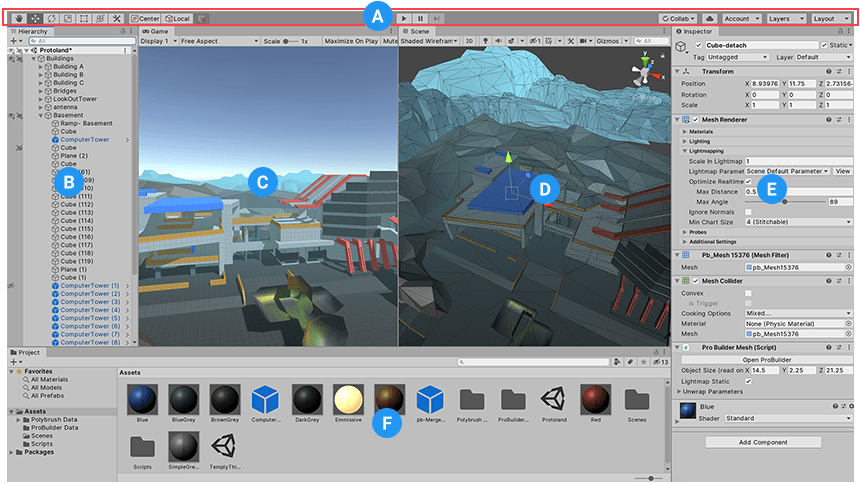
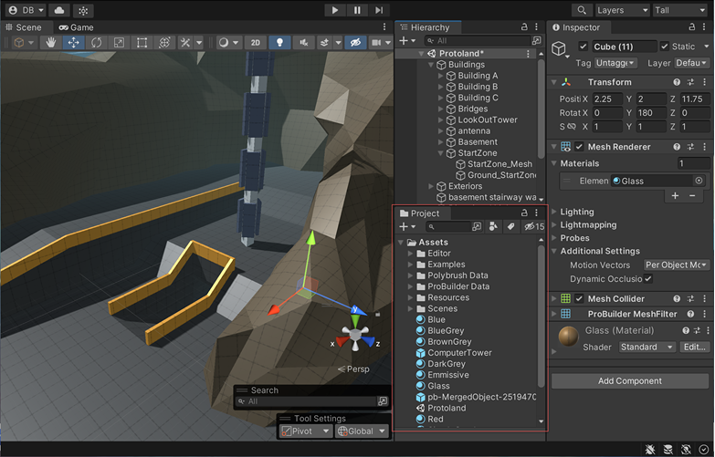
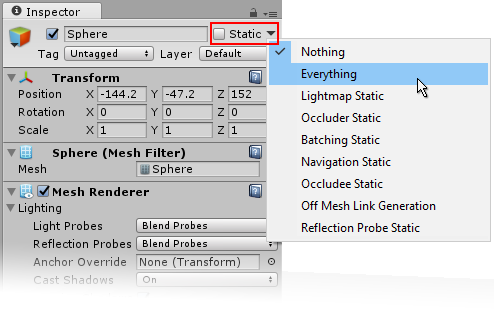
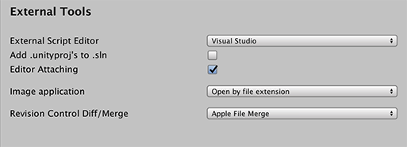
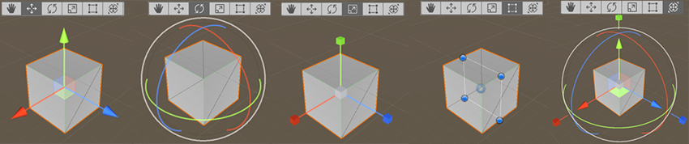

# Unity U01 인스펙터 기초

## 학습 목표

- Unity 편집기 4대 창(Hierarchy/Scene/Project/Inspector)의 역할을 정확히 구분합니다.
- Inspector의 핵심 기능(Static, Tag, Prefab 수정, 필드 노출)을 이해합니다.
- Scene 배치 관련 개념(Local/Global, Transform Tool, Snapping)을 실제 문항 수준으로 설명할 수 있습니다.

## 범위

- 키워드: Hierarchy, Scene, Project, Inspector, Static, Tag, Prefab, SerializeField, External Script Editor

## 먼저 큰 그림

Unity 편집 화면은 크게 4개로 생각하면 쉽습니다.

- `Hierarchy`: 지금 씬에 있는 오브젝트 목록(트리)
- `Scene`: 오브젝트를 눈으로 보고 직접 배치/이동/회전하는 작업 공간
- `Project`: 프로젝트 에셋(스크립트, 프리팹, 머티리얼, 이미지 등) 보관함
- `Inspector`: 지금 선택한 대상의 상세 설정 편집창

왜 이걸 먼저 보나?

- Unity 문제는 "어느 창에서 무엇을 하느냐"를 섞어 헷갈리게 묻는 경우가 많습니다.
- 그래서 4대 창 구분을 먼저 잡아야 합니다.


*캡션: Unity 에디터의 기본 4대 창 배치를 한 화면에서 확인합니다. 출처: [Unity Manual - Using the Unity Interface](https://docs.unity3d.com/es/2019.4/uploads/Main/Editor-Breakdown.png)*

## 창 역할을 표로 정리

| 창        | 한 줄 요약            | 자주 하는 작업                          |
| --------- | --------------------- | --------------------------------------- |
| Hierarchy | 현재 씬 오브젝트 목록 | 오브젝트 선택, 부모-자식 구조 확인      |
| Scene     | 씬을 직접 만지는 뷰   | 이동/회전/스케일, 배치, 스냅            |
| Project   | 에셋 관리 창          | 스크립트/프리팹/이미지 찾기             |
| Inspector | 선택 대상 상세 설정   | 컴포넌트 값 수정, Tag/Layer/Static 설정 |


*캡션: Project 창 중심 UI 예시로 4대 창 역할 매칭을 연습합니다. 출처: [Unity Manual - Project Window](https://docs.unity.cn/uploads/Main/project-window-context.png)*

### 자주 헷갈리는 비교

| 비교                     | 이렇게 구별                                                                   |
| ------------------------ | ----------------------------------------------------------------------------- |
| `Hierarchy` vs `Project` | `Hierarchy`는 지금 씬에 올라온 것, `Project`는 프로젝트 폴더에 저장된 것      |
| `Scene` vs `Inspector`   | `Scene`은 직접 만지는 화면, `Inspector`는 선택한 대상의 수치와 옵션을 보는 곳 |

### 10초 점검

지금 보이는 것이 프리팹 파일, 스크립트 파일, 머티리얼 파일 목록이라면 그 창은 `Hierarchy`일까 `Project`일까?

- 정답 판단: `Project`

## 핵심 패턴

```csharp
[SerializeField] private int moveSpeed = 5;

void Start()
{
    var enemies = GameObject.FindGameObjectsWithTag("Enemy");
    Debug.Log(enemies.Length);
}
```

### 패턴 해설

- `[SerializeField] private int moveSpeed = 5;`
  - `private`라서 코드 외부에서는 직접 접근을 막습니다.
  - 대신 `[SerializeField]`로 Inspector에 보이게 해서 값 조정은 가능하게 만듭니다.
  - 즉, "캡슐화 + Inspector 편집"을 같이 잡는 패턴입니다.
  - 원리: Unity는 직렬화 가능한 필드를 Inspector에 표시합니다. `[SerializeField]`는 `private` 필드도 표시 대상이 되게 돕습니다.
  - 화면 변화: 이 속성을 붙인 뒤 저장하면, 이전에는 안 보이던 필드가 Inspector에 나타납니다.
- `GameObject.FindGameObjectsWithTag("Enemy")`
  - 같은 Tag의 오브젝트를 한 번에 배열로 가져옵니다.
  - 반환 타입은 `GameObject[]`(배열)입니다.
  - 명시적으로 쓰면 다음과 같다.
    ```csharp
    GameObject[] enemies = GameObject.FindGameObjectsWithTag("Enemy");
    ```
  - `var`를 쓰면 컴파일러가 타입을 추론해 주지만, 시험에서는 명시적 타입 선언이 요구될 수 있습니다.
- `Debug.Log(enemies.Length)`
  - 검색 결과를 콘솔에서 바로 확인하는 디버깅 습관입니다.
  - 실무 팁: Tag 검색이 맞는지 헷갈리면 `Length`를 출력해 찾은 개수부터 확인합니다.

### 생각 질문

왜 `Enemy`를 하나만 찾는 방식보다, 배열로 한 번에 가져오는 방식이 더 안전한 장면이 있을까?

## 문항 핵심 포인트

### 1) Inspector 기본 기능

이 개념을 알면 무엇이 쉬워지나?

- Inspector 속성 참/거짓, 기능 설명 판별, Prefab 관련 함정 선지를 훨씬 빨리 걸러낼 수 있습니다.

- 개념:
  - `Static`: 이 오브젝트를 정적 오브젝트로 표시해 정적 배칭, 라이트맵, 오클루전 같은 최적화·베이크 작업에 활용합니다.
  - `Tag`: 스크립트에서 같은 분류의 오브젝트를 찾거나, 충돌/접촉 상황에서 대상 종류를 식별하기 위한 라벨입니다.
  - `Prefab`: 미리 만들어 둔 오브젝트 틀입니다. 씬에 배치한 인스턴스는 Inspector에서 값을 바꿀 수 있습니다.
- 왜 헷갈리나?
  - `Static`을 "움직이지 못하게 잠그는 버튼"으로 오해하기 쉽습니다.
  - `Tag`를 사람만 보는 이름표로 생각하고, 코드 검색이나 충돌 판별과 연결하지 못하는 경우가 많습니다.
  - `Prefab` 인스턴스는 배치 후 수정이 안 된다고 착각하기 쉽습니다.
- 어떻게 구별하나?
  - `Static`은 이동 금지 스위치가 아니라 "정적으로 다룬다"는 최적화 힌트입니다.
  - `Tag`는 코드가 같은 분류를 찾거나, 충돌한 대상이 어떤 종류인지 빠르게 판별하게 해 주는 기준입니다.
  - `Prefab`은 배치한 뒤에도 Inspector에서 수정할 수 있으며, 변경 내용을 원본에 반영할지 `Apply`로 결정할 수 있습니다.
- 짧은 유사 예시:
  - `GameObject.FindGameObjectsWithTag("Player")`
  - 플레이어가 닿은 오브젝트가 `Enemy`인지 `Item`인지 구분할 때도 Tag를 활용할 수 있습니다.
  - 건물처럼 거의 움직이지 않는 오브젝트는 `Static` 설정 후보가 됩니다.
  - 프리팹으로 만든 적 오브젝트의 체력 값을 Inspector에서 바꾸고 Overrides를 확인할 수 있습니다.


*캡션: Inspector의 Static, Tag, Prefab 관련 UI 위치를 확인합니다. 출처: [Unity Manual - Static GameObjects](https://docs.unity.cn/2017.4/Documentation/uploads/Main/GameObjectStaticDropDownMenu.png)*

### 10초 점검

오브젝트를 `Static`으로 체크했다고 해서, 장면에서 드래그 자체가 완전히 막히는 것은 아니다. 참일까 거짓일까?

- 정답 판단: 거짓

### 2) 창 매칭

이 개념을 알면 무엇이 쉬워지나?

- 길게 서술된 창 기능 문제도 핵심 단어만 보고 바로 연결할 수 있습니다.

- 개념:
  - 현재 열려 있는 씬 내 오브젝트 목록 = `Hierarchy`
  - 오브젝트를 배치하고 조작하는 실제 작업 공간 = `Scene`
  - 에셋을 보관하고 탐색하는 공간 = `Project`
  - 선택 대상의 세부 설정을 보는 창 = `Inspector`
- 왜 헷갈리나?
  - `Hierarchy`와 `Project`는 둘 다 목록처럼 보여서 섞이기 쉽습니다.
  - `Scene`과 `Inspector`는 둘 다 오브젝트를 다루지만, 하나는 직접 조작이고 하나는 상세 설정입니다.
- 어떻게 구별하나?
  - "지금 씬 안에 있는가?"를 묻는 말이면 `Hierarchy`
  - "폴더, 스크립트, 머티리얼 같은 자산인가?"를 묻는 말이면 `Project`
  - "마우스로 위치를 움직이는가?"면 `Scene`
  - "수치와 체크박스를 바꾸는가?"면 `Inspector`
- 짧은 유사 예시:
  - 적 오브젝트를 클릭해 Position 값을 바꾼다면 `Inspector`
  - 적 오브젝트를 드래그해 장면 속 위치를 바꾼다면 `Scene`
  - 씬 안에 배치된 적 목록을 본다면 `Hierarchy`
  - 에셋 폴더에서 프리팹 파일을 찾는다면 `Project`

### 생각 질문

현재 씬에 없는 프리팹 파일도 보인다면, 그 창은 왜 `Hierarchy`가 아닐까?

### 3) IDE 선택

이 개념을 알면 무엇이 쉬워지나?

- 메뉴 경로 문제와 정확한 옵션 이름을 묻는 단답 문제를 동시에 대비할 수 있습니다.

- 개념:
  - Unity에서 C# 편집기(IDE) 선택 위치는 `Edit > Preferences > External Tools > External Script Editor`입니다.
  - macOS/버전에 따라 `Unity > Settings(Preferences) > External Tools`로 보일 수 있습니다.
- 왜 헷갈리나?
  - 메뉴 경로는 기억하지만, 실제 드롭다운 이름을 `External Tools`와 섞어 쓰는 경우가 많습니다.
- 어떻게 구별하나?
  - 탭 이름은 `External Tools`
  - 실제 옵션 이름은 `External Script Editor`
- 짧은 유사 예시:
  - "IDE 선택 옵션의 정확한 이름"을 묻는다면 정답 포인트는 `External Script Editor`다.
  - "어느 탭 아래에 있나?"를 묻는다면 `External Tools`다.


*캡션: External Tools 탭 안에서 External Script Editor 옵션 위치를 확인합니다. 출처: [Unity Manual - Preferences (External Tools)](https://docs.unity3d.com/es/2018.4/uploads/Main/PrefsExtTools.png)*

### 10초 점검

`External Tools`와 `External Script Editor` 중, 실제 정답으로 더 자주 요구되는 것은 어느 쪽일까?

- 정답 판단: 옵션 이름을 물으면 `External Script Editor`

### 4) Scene 배치 T/F

이 개념을 알면 무엇이 쉬워지나?

- Scene 조작 문제에서 그럴듯하지만 틀린 설명을 골라내기 쉬워집니다.

- 개념:
  - Local / Global 전환: 가능
  - Transform(또는 Universal) Tool: 이동, 회전, 스케일 결합
  - Vertex Snapping: 꼭지점 기준으로 정밀하게 맞추는 기능입니다.
  - Transform 조작: Scene 뷰뿐 아니라 Inspector 수치 입력으로도 가능합니다.
- 왜 헷갈리나?
  - Vertex Snapping을 Grid Snapping과 같은 뜻으로 착각하기 쉽습니다.
  - 오브젝트 조작은 Scene 뷰 마우스 드래그로만 한다고 생각하기 쉽습니다.
- 어떻게 구별하나?
  - `Vertex`라는 단어가 나오면 꼭지점을 떠올리면 됩니다. 그래서 그리드 전용이라고 단정하면 위험합니다.
  - 위치, 회전, 스케일은 Inspector의 Transform 컴포넌트 숫자 입력으로도 바꿀 수 있습니다.
  - Vertex Snapping은 다른 오브젝트의 꼭지점이나 표면에 정밀하게 맞출 때도 씁니다.
- 짧은 유사 예시:
  - 건물 모서리를 다른 오브젝트 모서리에 딱 맞추고 싶다면 Vertex Snapping을 떠올리면 됩니다.
  - X 좌표를 정확히 `3`으로 맞추고 싶다면 Scene 드래그보다 Inspector 수치 입력이 더 정확합니다.


*캡션: Scene 뷰에서 Local/Global, Transform Tool, Vertex Snapping 관련 조작 UI를 확인합니다. 출처: [Unity Manual - Positioning GameObjects](https://docs.unity.cn/uploads/Main/game-objects-transform-modes.png)*

### 실무 팁

- Scene에서 대충 위치를 옮긴 뒤, Inspector에서 좌표 숫자를 다듬으면 빠르면서도 정확합니다.

### 생각 질문

같은 "스냅"이라는 말이 들어가도, 왜 Vertex Snapping과 Grid Snapping은 완전히 같은 기능이 아닐까?

### 5) Inspector에 변수 안 보임

이 개념을 알면 무엇이 쉬워지나?

- 코드 한 줄 수정 문제와 객관식 함정 문제를 둘 다 안정적으로 풀 수 있습니다.

- 개념:
  - Inspector는 기본적으로 직렬화 가능한 필드를 표시합니다.
  - `private string playerName;`만 쓰면 기본 상태에서는 Inspector에 안 보입니다.
  - `static` / `readonly` 필드이거나, Unity가 직렬화하지 않는 타입이면 표시되지 않을 수 있습니다.
- 왜 헷갈리나?
  - `private`라는 단어만 보고 무조건 안 보임으로 외우기 쉽습니다.
  - 반대로 Inspector에 보이게 하려면 무조건 `public`이어야 한다고 단정하기 쉽습니다.
- 어떻게 구별하나?
  - 외부 접근 허용이 목적이면 `public`
  - 외부 접근은 막고 Inspector에서만 보이게 하려면 `[SerializeField] private`
- 짧은 유사 예시:
  - `public string playerName;`
  - `[SerializeField] private string playerName;`
  - `private int score;`는 기본 상태 그대로는 보이지 않습니다.

![Inspector 변수 노출 비교 예시 (public 필드 vs [SerializeField] private 필드)](../images/unity_u01_inspector_serializefield_compare.png)
*캡션: Inspector에서 public 필드와 `[SerializeField] private` 필드의 노출 차이를 확인합니다. 출처: [Unity Manual - Inspector Example](https://docs.unity3d.com/es/2019.4/uploads/Main/InspectorExampleObjWithScripts.png)*

### 자주 헷갈리는 비교

| 선언                               | Inspector 기본 표시 |
| ---------------------------------- | ------------------- |
| `public int hp;`                   | 보임                |
| `[SerializeField] private int hp;` | 보임                |
| `private int hp;`                  | 안 보임             |

### 10초 점검

캡슐화는 유지하고, Inspector에서는 값을 바꾸고 싶다. 이때 더 어울리는 것은 `public`일까 `[SerializeField] private`일까?

- 정답 판단: `[SerializeField] private`

## 자주 하는 실수

- Hierarchy와 Project를 바꿔 생각함
- `Scene`과 `Inspector`를 둘 다 "오브젝트를 다루는 곳"으로만 기억해 구분을 놓침
- `private` 필드는 Inspector에서 절대 못 본다고 단정함
- `External Tools`와 `External Script Editor`를 섞어 씀
- Vertex Snapping과 Grid Snapping을 같은 기능으로 단정함
- `Static`을 절대 이동 불가 옵션으로 이해함

## 빠른 체크리스트

- 창 이름만 보고 역할을 1초 안에 말할 수 있는가?
- Static / Tag / Prefab 기능을 각각 한 문장으로 설명할 수 있는가?
- `External Script Editor` 경로와 이름을 구분해 기억하는가?
- `private` + `[SerializeField]` 조합의 의미를 설명할 수 있는가?
- `Hierarchy vs Project`, `public vs [SerializeField] private`를 비교해서 설명할 수 있는가?

## 미니 체크

### Q1

현재 씬의 GameObject 목록이 보이는 창은?

- 정답: Hierarchy

### Q2

Inspector에 private 필드를 노출하려면 무엇을 붙이나?

- 정답: `[SerializeField]`

### Q3

Unity에서 IDE 선택 옵션 이름은?

- 정답: External Script Editor

### Q4

Vertex Snapping은 오직 그리드에만 맞추는 기능일까?

- 정답: 아니다

### Q5

캡슐화를 유지하면서 Inspector에서 값을 바꾸고 싶을 때 알맞은 선언은?

- 정답: `[SerializeField] private ...`

## 연결 세트

- 기초: unity_u01_inspector_b01
- 챌린지: unity_u01_inspector_c01
