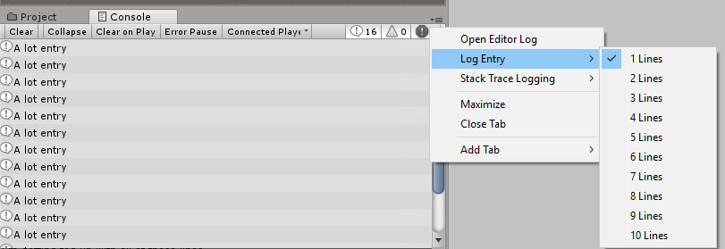

# Unity U02 로그/연산자 기초
## 학습 목표
- `Debug.Log`를 정확히 사용한다.
- 대입/비교/논리/나머지 연산자를 구분한다.
## 범위
- 키워드: Debug.Log, =, ==, !=, ||, %, ++, +, PascalCase, camelCase, OnTriggerEnter, CompareTag
## 핵심 패턴
~~~csharp
int n = 7;
bool isEven = (n % 2) == 0;
Debug.Log("isEven=" + isEven);
~~~

*`Debug.Log` 메시지가 Unity Console에 출력되는 위치를 확인한다. 출처: [Unity Manual - Console](https://docs.unity.cn/2018.2/Documentation/uploads/Main/Console.png)*

### 패턴 해설
- `n % 2`는 짝수/홀수 판단의 표준 패턴이다. 결과가 `0`이면 짝수, `1` 또는 `-1`이면 홀수 쪽으로 해석한다.
- `(n % 2) == 0`처럼 비교 연산(`==`)까지 포함해야 `bool` 값이 만들어진다. `=`는 대입이므로 조건식 용도가 다르다.
- 홀수 판별은 `==`를 `!=`로 바꾸면 된다: `(n % 2) != 0`이면 홀수다.
- `"isEven=" + isEven`는 문자열 결합 패턴으로, 디버깅 시 변수 상태를 빠르게 읽는 데 유용하다.
- `Debug.Log(...)`는 Unity 콘솔 출력 API이고, `Console.Log(...)`는 Unity 스크립트 표준 패턴이 아니다.
- 연산자 단원에서는 "값 계산(%) -> 비교(==) -> 출력(Debug.Log)" 순서를 끊지 않고 읽는 습관이 중요하다.

## 문항 핵심 포인트
### 1) 연산자 매칭/로그 출력
- `=`는 할당, `==`는 같음 비교, `!=`는 같지 않음 비교다.
- `||`는 OR(또는) 연산자로, 두 조건 중 하나만 참이어도 전체 조건이 참이다.
- `%`는 나머지 연산자다. `i % 2 == 0`은 짝수, `i % 2 != 0`은 홀수 판별 표준식이다.
- `++`는 변수를 1 증가시키는 증감 연산자다. `i++`는 `i = i + 1`과 같다.
- `+`는 숫자끼리 쓰면 덧셈, 문자열과 함께 쓰면 문자열 연결(결합) 연산자다.
  - 예: `"Score: " + score`는 숫자를 문자열로 이어붙인다.
- Unity 콘솔 출력은 `Debug.Log("...");`를 사용한다.

*Console에서 로그를 선택해 상세 정보(스택 트레이스)를 확인하는 예시다. 출처: [Unity Manual - Console](https://docs.unity.cn/2018.2/Documentation/uploads/Main/ConsoleStackTrace.png)*

*Console 메시지 가독성을 높이기 위한 줄 수 표시 조절 UI 예시다. 출처: [Unity Manual - Console](https://docs.unity.cn/2018.2/Documentation/uploads/Main/AdjustLineCount.png)*

### 2) Unity/C# 명명 규칙
- 클래스명/메서드명은 보통 `PascalCase`를 사용한다.
  - 예: `PlayerScript`, `PlayerFunction`, `OnTriggerEnter`
- 필드/지역변수/매개변수는 보통 `camelCase`를 사용한다.
  - 예: `playerLight`, `enteringSound`, `other`
- C# 키워드는 소문자로 쓴다.
  - 예: `public`, `class`, `void`, `private`
- Unity API 식별자는 대소문자까지 정확히 맞아야 한다.
  - `MonoBehaviour` (O) / `Monobehaviour` (X)
  - `OnTriggerEnter` (O) / `ontriggerenter` (X)
  - `CompareTag` (O) / `compareTag` (X)
  - `enabled` (O) / `Enabled` (X)

*MonoBehaviour 이벤트 함수의 실행 맥락을 보여주는 흐름도다. `OnTriggerEnter` 같은 메시지 함수명은 정확히 써야 호출된다. 출처: [Unity Manual - Order of Execution for Event Functions](https://docs.unity3d.com/es/2019.4/uploads/Main/monobehaviour_flowchart.svg)*

### 3) 빠른 판별 규칙
- 타입/클래스 이름이 소문자로 시작하면 먼저 의심한다. (`light`, `playerScript` 등)
- Unity 이벤트 함수명은 철자와 대소문자가 틀리면 호출되지 않는다.
- 선언한 변수명과 사용하는 변수명의 대소문자가 다르면 다른 식별자로 취급된다.
  - `playerLight` 선언 후 `playerlight` 사용은 오류 원인이다.

## 자주 하는 실수
- 조건식에서 `=`와 `==`를 혼동함
- Unity에서 `Console.Log` 같은 잘못된 API를 사용함
- `%`의 의미를 정확히 이해하지 못해 오답을 냄
- `OnTriggerEnter`, `CompareTag`, `MonoBehaviour`의 대소문자를 틀림
- `public/class/void` 같은 C# 키워드를 `Public/Class/Void`로 잘못 씀

## 빠른 체크리스트
- `Debug.Log("...");`를 정확히 쓸 수 있는가?
- `=` / `==` / `!=` / `||` / `%`의 용도를 구분할 수 있는가?
- `i % 2 == 0`이 짝수 판별식임을 설명할 수 있는가?
- `OnTriggerEnter`, `CompareTag`, `MonoBehaviour`, `enabled` 대소문자를 정확히 기억하는가?

## 미니 체크
### Q1
Unity 콘솔 출력 한 줄을 쓰세요.
- 정답 예시: `Debug.Log("hello");`
### Q2
"같지 않다" 연산자는?
- 정답: `!=`
### Q3
Unity 트리거 이벤트 함수명으로 올바른 것은?
- 정답: `OnTriggerEnter`
### Q4
`other`가 Player인지 검사하는 올바른 호출은?
- 정답: `other.CompareTag("Player")`
## 연결 세트
- 기초: unity_u02_log_operator_b01
- 챌린지: unity_u02_log_operator_c01
