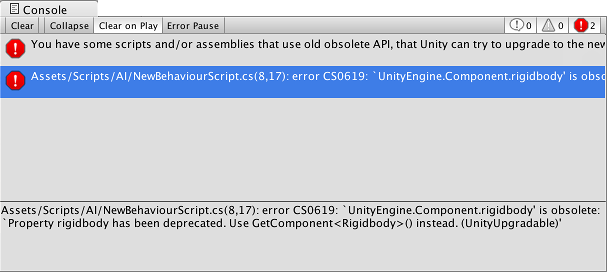
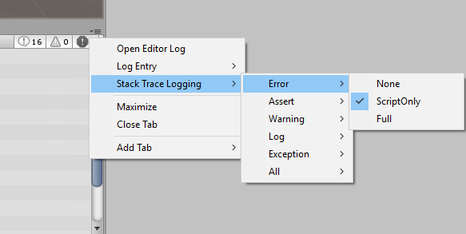

# Unity U02 로그/연산자 기초

## 학습 목표
- `Debug.Log`를 정확히 사용합니다.
- 대입, 비교, 논리, 나머지, 증감 연산자를 구분합니다.
- Unity/C# 식별자의 대소문자 규칙과 이벤트 함수명 규칙을 설명할 수 있습니다.

## 범위
- 키워드: Debug.Log, `=`, `==`, `!=`, `||`, `%`, `++`, `+`, PascalCase, camelCase, MonoBehaviour, OnTriggerEnter, CompareTag, enabled

## 먼저 큰 그림
이 단원은 크게 두 덩어리로 보면 쉽습니다.
- 첫째, 값을 계산하고 비교해서 콘솔에 출력하는 흐름입니다.
- 둘째, Unity와 C#에서 이름을 정확히 쓰는 규칙입니다.

왜 이걸 먼저 보나?
- W02 문제는 겉보기에는 종류가 달라도, 실제로는 `연산자 구분`과 `대소문자 정확도`를 반복해서 묻습니다.
- 그래서 "계산 -> 비교 -> 출력"과 "이름을 한 글자도 틀리지 않게 쓴다"를 먼저 잡아야 합니다.

## 핵심 패턴
```csharp
int n = 7;
bool isEven = (n % 2) == 0;
Debug.Log("isEven=" + isEven);
```


*캡션: `Debug.Log` 메시지가 Unity Console에 출력되는 위치를 확인합니다. 출처: [Unity Manual - Console](https://docs.unity.cn/2018.2/Documentation/uploads/Main/Console.png)*

### 패턴 해설
- `int n = 7;`
  - `=`는 값을 넣는 대입 연산자입니다.
  - 수학에서의 "같다"와 헷갈리기 쉽지만, 코드에서는 비교가 아니라 저장에 가깝습니다.
- `(n % 2) == 0`
  - `%`는 나머지 연산자입니다.
  - `n % 2`의 결과가 `0`이면 짝수입니다.
  - 여기서 `== 0`까지 붙어야 참/거짓을 만드는 비교식이 됩니다.
  - 즉, `%`는 계산, `==`는 판정 역할입니다.
- `Debug.Log("isEven=" + isEven);`
  - `Debug.Log`는 Unity 콘솔에 메시지를 출력하는 표준 API입니다.
  - `+`는 문자열과 값을 이어 붙일 때도 사용됩니다.
  - 화면 변화: 스크립트를 실행하면 Console 창에 `isEven=True` 또는 `isEven=False` 같은 로그가 나타납니다.
- 실무 팁:
  - 값이 이상하면 먼저 `Debug.Log`로 중간 결과를 찍어 보는 습관이 좋습니다.
  - 예를 들어 `n % 2` 자체를 먼저 출력해 보면 짝수/홀수 판별이 왜 틀렸는지 빨리 찾을 수 있습니다.

### 생각 질문
왜 `n % 2`만으로는 아직 "짝수인가?"라는 질문에 완전히 답한 것이 아닐까요?

## 문항 핵심 포인트
### 1) 로그 출력과 기본 연산자 구분
<!-- conceptId: u02_c1 -->
<!-- conceptId: u02_c2 -->
이 개념을 알면 무엇이 쉬워지나?
- 콘솔 출력 API 문제, 연산자 매칭 문제, 문자열 결합 문제를 한 번에 정리할 수 있습니다.

- 개념:
  - `Debug.Log("Hello");`는 Unity 콘솔 출력 기본형입니다.
  - `=`는 값 할당, `==`는 같음 비교, `!=`는 같지 않음 비교입니다.
  - `++`는 값을 1 증가시키는 증감 연산자입니다.
  - `+`는 숫자끼리는 덧셈, 문자열과 함께 쓰면 문자열 결합입니다.
- 왜 헷갈리나?
  - 수학에서 `=`를 자주 쓰다 보니 조건식에서도 `=`를 넣기 쉽습니다.
  - `+`를 항상 덧셈으로만 생각해서 문자열 결합을 놓치기 쉽습니다.
  - 순수 C# 콘솔 프로그램의 `Console` 계열과 Unity의 `Debug.Log`를 섞어 쓰기 쉽습니다.
- 어떻게 구별하나?
  - "값을 넣는다"면 `=`
  - "같은지 검사한다"면 `==`
  - "다른지 검사한다"면 `!=`
  - "하나 증가"면 `++`
  - "문자열을 이어 붙인다"면 `+`
  - "Unity 콘솔에 출력한다"면 `Debug.Log`
- 짧은 유사 예시:
  - `score = 10;`
  - `if (hp == 0) { }`
  - `lives++;`
  - `Debug.Log("Score=" + score);`

### 자주 헷갈리는 비교
| 기호/API | 역할 |
|---|---|
| `=` | 값 할당 |
| `==` | 같은지 비교 |
| `!=` | 다른지 비교 |
| `++` | 1 증가 |
| `+` | 덧셈 또는 문자열 결합 |
| `Debug.Log` | Unity 콘솔 출력 |

### 10초 점검
`if (hp = 0)`은 "hp가 0인지 비교"하는 식일까요?
- 정답 판단: 아닙니다. 비교라면 `==`가 필요합니다.

### 2) OR 조건식과 짝수/홀수 판별
<!-- conceptId: u02_c3 -->
이 개념을 알면 무엇이 쉬워지나?
- OR 조건식 문제, `%`를 이용한 짝수 판별 문제, 확장 문항의 로그 조립 문제를 함께 풀기 쉬워집니다.

- 개념:
  - `||`는 OR 연산자입니다. 둘 중 하나만 참이어도 전체가 참입니다.
  - `%`는 나머지 연산자입니다.
  - `i % 2 == 0`은 짝수 판별식이고, `i % 2 != 0`은 홀수 판별식입니다.
- 왜 헷갈리나?
  - 문제에서 "또는"을 봐도 습관적으로 `&&`를 넣기 쉽습니다.
  - `% 2`까지만 쓰고, 마지막 비교식 `== 0` 또는 `!= 0`을 빼먹기 쉽습니다.
  - `%`와 `==`를 섞어 써야 하는데, 둘을 따로 외워 연결하지 못하는 경우가 많습니다.
- 어떻게 구별하나?
  - 문장에 "또는", "...이거나 ..."가 나오면 먼저 `||`를 떠올립니다.
  - 짝수는 2로 나눴을 때 나머지가 0입니다.
  - 홀수는 2로 나눴을 때 나머지가 0이 아닙니다.
  - 즉, `%`로 계산한 뒤 `==` 또는 `!=`로 판정합니다.
- 짧은 유사 예시:
  - `if (hp <= 0 || timeOver == true)`
  - `bool isEven = (i % 2) == 0;`
  - `bool isOdd = (i % 2) != 0;`

### 자주 헷갈리는 비교
| 표현 | 의미 |
|---|---|
| `a && b` | 둘 다 참이어야 참 |
| `a || b` | 하나만 참이어도 참 |
| `i % 2 == 0` | 짝수 |
| `i % 2 != 0` | 홀수 |

### 실무 팁
- 조건이 길어지면, 먼저 말로 읽어 보고 기호로 옮기면 실수가 줄어듭니다.
- 예: "hp가 0 이하이거나 timeOver가 true" -> `hp <= 0 || timeOver == true`

### 생각 질문
왜 `i % 2`만 쓰면 숫자 계산일 뿐이고, `i % 2 == 0`까지 써야 조건식이 될까요?


*캡션: Console에서 로그를 선택해 상세 정보와 호출 위치를 더 자세히 확인하는 예시입니다. 출처: [Unity Manual - Console](https://docs.unity.cn/2018.2/Documentation/uploads/Main/ConsoleStackTrace.png)*

### 3) Unity/C# 명명 규칙과 대소문자
<!-- conceptId: u02_c4 -->
이 개념을 알면 무엇이 쉬워지나?
- `MonoBehaviour`, `OnTriggerEnter`, `CompareTag`, `enabled`, `public`처럼 대소문자를 정확히 고르는 문제를 빠르게 해결할 수 있습니다.

- 개념:
  - 클래스명과 메서드명은 보통 `PascalCase`를 사용합니다.
  - 필드, 지역 변수, 매개변수는 보통 `camelCase`를 사용합니다.
  - C# 키워드는 소문자로 씁니다.
  - Unity API와 이벤트 함수명은 대소문자까지 정확해야 합니다.
- 왜 헷갈리나?
  - 보기 중에서 한두 글자만 바꿔 놓으면 얼핏 맞아 보입니다.
  - `OnTriggerEnter`처럼 컴파일은 되더라도 자동 호출이 안 되는 "조용한 실패"를 놓치기 쉽습니다.
  - `public` 같은 키워드와 `CompareTag` 같은 API를 같은 규칙으로 외워 섞기 쉽습니다.
- 어떻게 구별하나?
  - 클래스/메서드 이름은 보통 앞글자가 대문자인 `PascalCase`입니다.
  - 변수 이름은 보통 앞글자가 소문자인 `camelCase`입니다.
  - C# 키워드는 `public`, `class`, `void`처럼 소문자입니다.
  - `CompareTag`는 메서드 이름이므로 앞글자가 대문자인 `PascalCase`로 씁니다.
  - Unity 이벤트 함수는 공식 이름과 대소문자가 하나라도 틀리면 엔진이 자동 호출하지 않습니다.
- 짧은 유사 예시:
  - `MonoBehaviour`는 맞고 `Monobehaviour`는 틀립니다.
  - `OnTriggerEnter`는 맞고 `onTriggerEnter`는 틀립니다.
  - `CompareTag`는 맞고 `compareTag`는 틀립니다.
  - `enabled`, `public`은 소문자입니다.


*캡션: `OnTriggerEnter` 같은 메시지 함수는 Unity가 정해 둔 이름과 대소문자를 정확히 지켜야 자동 호출됩니다. 출처: [Unity Manual - Order of Execution for Event Functions](https://docs.unity3d.com/es/2019.4/uploads/Main/monobehaviour_flowchart.svg)*

### 자주 헷갈리는 비교
| 항목 | 올바른 표기 | 헷갈리는 오답 |
|---|---|---|
| 기본 클래스 | `MonoBehaviour` | `Monobehaviour` |
| 트리거 이벤트 함수 | `OnTriggerEnter` | `onTriggerEnter` |
| 태그 비교 API | `CompareTag` | `compareTag` |
| 프로퍼티/키워드 | `enabled`, `public` | `Enabled`, `Public` |

### 10초 점검
`void onTriggerEnter(Collider other)`는 겉보기엔 비슷합니다. 그런데 왜 위험할까요?
- 정답 판단: 이름이 정확하지 않아 Unity가 이벤트 함수로 자동 호출하지 않습니다.

### 4) 빠른 판별 규칙
이 개념을 알면 무엇이 쉬워지나?
- 보기형 문제에서 길게 계산하지 않고도 오답을 빠르게 제거할 수 있습니다.

- 개념:
  - 타입/클래스 이름이 소문자로 시작하면 먼저 의심합니다.
  - Unity 이벤트 함수명은 철자와 대소문자가 틀리면 호출되지 않습니다.
  - 선언한 변수명과 사용하는 변수명의 대소문자가 다르면 다른 이름으로 취급됩니다.
- 왜 헷갈리나?
  - 눈으로 빨리 읽으면 `playerLight`와 `playerlight` 차이를 놓치기 쉽습니다.
  - `CompareTag`처럼 익숙한 이름은 대충 읽고 넘어가기 쉽습니다.
- 어떻게 구별하나?
  - 한 글자씩이 아니라 "대문자가 와야 할 자리"를 먼저 봅니다.
  - 특히 `MonoBehaviour`, `OnTriggerEnter`, `CompareTag`는 통째로 외우는 편이 안전합니다.
- 짧은 유사 예시:
  - `playerLight`를 선언하고 `playerlight`를 쓰면 다른 이름입니다.
  - `Public`은 키워드가 아니라 오답입니다.

## 자주 하는 실수
- 조건식에서 `=`와 `==`를 혼동합니다.
- `% 2`까지만 쓰고 `== 0` 또는 `!= 0`을 빼먹습니다.
- "또는" 문제인데 `&&`를 넣습니다.
- Unity에서 `Console.Log` 같은 잘못된 API를 사용합니다.
- `OnTriggerEnter`, `CompareTag`, `MonoBehaviour`의 대소문자를 틀립니다.
- `public`, `class`, `void` 같은 C# 키워드를 대문자로 적습니다.
- 선언한 변수명과 사용하는 변수명의 대소문자를 다르게 씁니다.

## 빠른 체크리스트
- `Debug.Log("...");`를 정확히 쓸 수 있는가?
- `=` / `==` / `!=` / `||` / `%` / `++` / `+`의 역할을 설명할 수 있는가?
- `i % 2 == 0`이 짝수 판별식인 이유를 말할 수 있는가?
- "또는"이라는 문장을 `||`로 옮길 수 있는가?
- `MonoBehaviour`, `OnTriggerEnter`, `CompareTag`, `enabled`, `public` 대소문자를 정확히 기억하는가?

## 미니 체크
### Q1
Unity 콘솔 출력 한 줄을 쓰세요.
- 정답 예시: `Debug.Log("hello");`

### Q2
"같지 않다" 연산자는?
- 정답: `!=`

### Q3
`hp <= 0`이거나 `timeOver == true`일 때를 뜻하는 논리 연산자는?
- 정답: `||`

### Q4
짝수 판별식으로 올바른 것은?
- 정답: `i % 2 == 0`

### Q5
Unity 트리거 이벤트 함수명으로 올바른 것은?
- 정답: `OnTriggerEnter`

### Q6
`other`가 Player인지 검사하는 올바른 호출은?
- 정답: `other.CompareTag("Player")`

## 연결 세트
- 기초: unity_u02_log_operator_b01
- 챌린지: unity_u02_log_operator_c01
