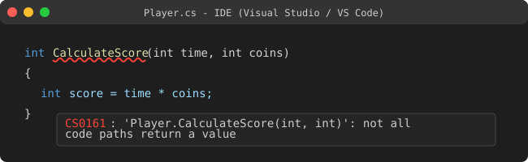
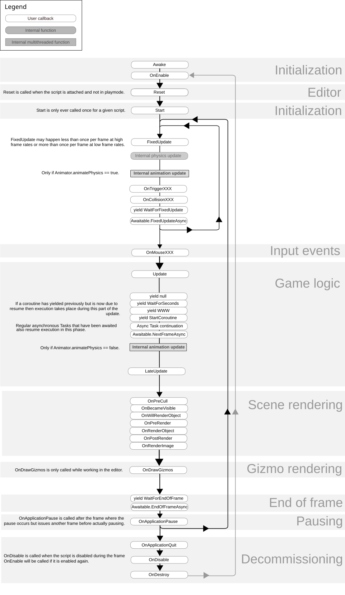
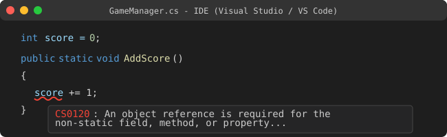

# Unity U03 함수/static 기초

## 학습 목표
- 올바른 함수 선언 형식을 작성한다.
- static 멤버의 사용 규칙을 이해한다.

## 범위
- 키워드: 반환형, 매개변수, static 메서드, static 필드

## 핵심 패턴
```csharp
public class Example
{
    int x = 3;

    // 예시 (기본): static 함수
    private static int Add(int a, int b)
    {
        return a + b;
    }

    // 예시 (함정): static 함수에서 인스턴스 변수 접근 (오류 발생)
    private static void WrongAccess()
    {
        // x += 1; // 오류: static 메서드에서 인스턴스 변수 x에 접근할 수 없음
    }

    // 예시 (기본): 인스턴스 함수
    private void ShowMessage(string msg)
    {
        Debug.Log(msg);
    }
}
```

### 메서드 시그니처 순서 규칙
C# 메서드를 선언할 때는 아래 순서를 반드시 지켜야 한다:

> **접근제어자** → **지정자(static 등)** → **반환형** → **메서드명** → **(매개변수 목록)**

위 코드의 `private static int Add(int a, int b)`를 분해하면:
| 순서 | 역할 | 코드 |
|---|---|---|
| 1 | 접근제어자 | `private` |
| 2 | 지정자 | `static` |
| 3 | 반환형 | `int` |
| 4 | 메서드명 | `Add` |
| 5 | 매개변수 | `(int a, int b)` |

시험에서 시그니처를 직접 작성하라는 문항이 나오면, 이 5단계 순서를 기억하고 조립한다.

## 문항 핵심 포인트
### 1) 함수의 반환형과 매개변수
- 개념: 함수는 반환형과 매개변수를 가진다. 반환형은 `return`하는 값의 자료형과 일치해야 하며, 매개변수는 함수 호출 시 전달하는 값의 자료형과 일치해야 한다. 반환형이 `void`라면 `return`하는 값이 없음을 의미한다.
- **`void`와 `null`의 차이**: `void`는 "돌려줄 값 자체가 존재하지 않는 상태"를 뜻하고, `null`은 "참조형 변수에 대입 가능한 '비어 있음' 값"이다. 이 둘은 완전히 다른 개념이므로, `void`가 `null`을 반환한다고 해석하면 안 된다.
- **서로 다른 타입의 매개변수**: 하나의 함수 괄호 안에 `int`, `string`, `bool` 등 서로 다른 자료형의 매개변수를 쉼표로 구분하여 여러 개 선언할 수 있다.
  - 예: `void SetPlayer(string name, int hp, bool isAlive)`
- 오답 포인트: 반환형이 명시된 함수(예: `int`, `float`)에서 `return`을 누락하거나, 반환형과 다른 자료형을 반환하는 경우이다. 
- 정답 판별: 함수의 선언부(반환형, 매개변수)와 내부의 `return` 문, 그리고 호출부의 인자가 모두 일치하는지 확인한다.


*캡션: 반환형이나 매개변수가 일치하지 않을 때 IDE에서 발생하는 컴파일 오류 화면 예시. 출처: [Microsoft C# 문서 - Compiler Errors](https://learn.microsoft.com/ko-kr/dotnet/csharp/language-reference/compiler-messages/)*

### 2) 유니티의 특별한 함수 (이벤트 함수)
- 개념: 일반적인 함수는 직접 호출해야 실행되지만, `Start()`, `Update()` 등의 이벤트 함수는 유니티 엔진이 상황에 맞춰 자동으로 실행한다.
- 오답 포인트: 유니티 이벤트 함수를 임의로 직접 호출하려고 하거나, 발생 조건을 잘못 인지하는 경우이다.
- 정답 판별: 해당 함수가 어떤 조건(예: 시작 시 1회, 매 프레임 등)에서 유니티에 의해 자동 호출되는지 판단한다.
```csharp
using UnityEngine;

public class Player : MonoBehaviour
{
    // 스크립트가 활성화될 때 1회 자동 호출
    void Start()
    {
        Debug.Log("Game Start!");
    }

    // 매 프레임마다 자동 호출
    void Update()
    {
        // 이동 로직 등
    }
}
```


*캡션: MonoBehaviour 스크립트의 Start 및 Update 함수 자동 실행 흐름도 다이어그램. 출처: [Unity Manual - Order of execution for event functions](https://docs.unity3d.com/Manual/ExecutionOrder.html)*

### 3) static 필드와 메서드
- 개념: `static` 키워드가 붙은 멤버(필드, 메서드)는 클래스의 인스턴스(객체)를 생성하지 않아도 클래스 이름을 통해 바로 접근할 수 있다. 반면 `static`이 없는 멤버는 반드시 객체를 생성해야 사용할 수 있다.
- 오답 포인트: `static` 메서드 내부에서 `static`이 아닌 인스턴스 필드나 메서드에 직접 접근하려고 시도하는 경우이다.
- 정답 판별: 접근하려는 대상이 `static`인지 인스턴스인지 확인하고, 현재 속한 메서드가 `static`인지 여부를 통해 접근 가능성을 판단한다.


*캡션: static 메서드 내부에서 객체 생성 없이 인스턴스 변수에 접근하려 할 때 발생하는 C# 에러 구문. 출처: [Microsoft C# 문서 - Static Classes](https://learn.microsoft.com/ko-kr/dotnet/csharp/programming-guide/classes-and-structs/static-classes-and-static-class-members)*

## 자주 하는 실수
- 반환형이 명시된 함수에서 `return`을 누락하는 경우
- `static` 문맥(메서드) 내에서 인스턴스 멤버를 객체 생성 없이 직접 접근하는 경우
- 매개변수의 타입이나 개수에 맞지 않게 함수를 호출하는 경우

## 빠른 체크리스트
- 반환형이 `void`가 아니라면 `return` 문이 존재하는지 확인했는가?
- `static` 메서드 안에서 인스턴스 변수를 사용하고 있지 않은지 점검했는가?
- 유니티 이벤트 함수(Start, Update 등)의 자동 호출 시점을 정확히 이해하고 있는가?

## 미니 체크
### Q1
반환값이 없는 함수의 반환형은 무엇인가?
- 정답: `void`

### Q2
`static` 메서드가 인스턴스 필드를 바로 접근할 수 있는가?
- 정답: 아니오. 인스턴스 필드는 객체를 생성한 후에만 접근 가능하므로 `static` 메서드에서 직접 접근할 수 없다.

### Q3
유니티 스크립트에서 매 프레임마다 유니티 엔진에 의해 자동으로 호출되는 함수는 무엇인가?
- 정답: `Update` 함수

## 연결 세트
- 기초: unity_u03_function_syntax_b01
- 챌린지: unity_u03_function_syntax_c01
