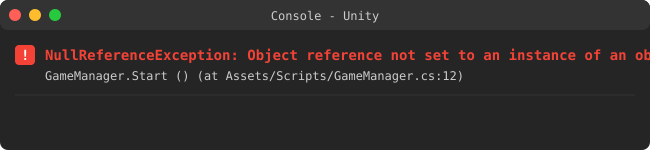
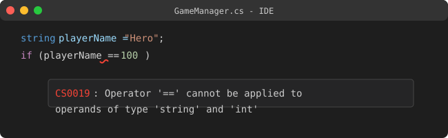
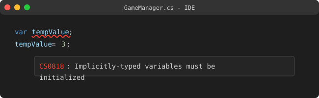

# Unity U04 Null/예외 기초

## 학습 목표
- `NullReferenceException`이 왜 발생하는지 원인을 추적할 수 있습니다.
- 어떤 타입이 `null` 비교가 가능한지 구분할 수 있습니다.
- `Dictionary` 초기화, `foreach`, `var`의 기본 규칙을 연결해서 설명할 수 있습니다.

## 범위
- 키워드: `null`, `NullReferenceException`, 참조 타입, 값 타입, `Dictionary`, 타입 불일치 비교, `var`, `foreach`, 삼항 연산자

## 먼저 큰 그림
이 단원은 크게 세 가지 질문으로 정리하면 쉽습니다.
- 지금 접근하려는 대상이 정말 존재하는가?
- 지금 비교하려는 두 값은 애초에 서로 비교 가능한가?
- 컬렉션은 사용하기 전에 제대로 만들어졌는가?

왜 이걸 먼저 보나?
- W04 문제는 모두 겉모습은 다르지만, 실제로는 `비어 있는 참조를 건드렸는가`, `비교 가능한 타입인가`, `초기화 순서가 맞는가`를 반복해서 묻습니다.
- 그래서 `null 추적`, `타입 구별`, `new 후 사용` 세 가지를 먼저 잡아야 합니다.

## 핵심 패턴
```csharp
public class GameManager : MonoBehaviour
{
    private Dictionary<string, int> scoreDictionary;
    public Transform target;

    void Start()
    {
        scoreDictionary = new Dictionary<string, int>();
        scoreDictionary.Add("Player1", 100);

        if (target != null)
        {
            Debug.Log(target.position);
        }
    }
}
```

### 패턴 해설
- `private Dictionary<string, int> scoreDictionary;`
  - 선언만 했을 뿐, 아직 실제 딕셔너리 객체는 만들어지지 않았습니다.
  - 이 상태에서 바로 `Add`를 하면 `NullReferenceException`이 날 수 있습니다.
- `scoreDictionary = new Dictionary<string, int>();`
  - `new`는 실제 사용할 객체를 메모리에 만드는 단계입니다.
  - 컬렉션은 선언만으로는 부족하고, 사용 전에 `new`가 필요합니다.
- `if (target != null)`
  - `target` 같은 참조 타입은 `null` 비교가 가능합니다.
  - Inspector에서 연결하지 않았거나, 런타임에 사라졌다면 `null`일 수 있습니다.
- `Debug.Log(target.position);`
  - `null`이 아닌 것이 확인된 뒤에만 내부 멤버(`position`)에 접근하는 것이 안전합니다.

### 생각 질문
왜 `target.position`에서 오류가 났다고 해서, 항상 `position` 자체가 문제라고 보면 안 될까요?

## 문항 핵심 포인트
### 1) NullReferenceException과 객체 생성(`new`)
이 개념을 알면 무엇이 쉬워지나?
- NullReferenceException 원인 찾기 문제와 Dictionary 초기화 문제를 빠르게 풀 수 있습니다.

- 개념:
  - `NullReferenceException`은 존재하지 않는 객체(`null`)의 내부에 접근하려 할 때 발생합니다.
  - 선언만 한 변수는 아직 실제 객체가 아닐 수 있습니다.
  - 객체를 실제로 사용하려면 `new`로 만들어 주거나, Inspector 등에서 참조가 할당되어 있어야 합니다.
- 왜 헷갈리나?
  - 바깥 객체는 `new`로 만들었는데, 그 안쪽 멤버 객체까지 자동으로 다 생성된다고 생각하기 쉽습니다.
  - 오류 줄을 보면 마지막에 적힌 속성 이름만 보고, 진짜 `null`인 대상을 놓치기 쉽습니다.
- 어떻게 구별하나?
  - 점(`.`)을 따라가며 어느 단계가 비어 있는지 추적합니다.
  - `book.Author.Age`가 터졌다면, `book`이 아니라 `book.Author`가 `null`일 수 있습니다.
  - 컬렉션도 객체이므로, `new` 없이 사용하면 마찬가지로 예외가 날 수 있습니다.
- 짧은 유사 예시:
  - `Book book = new Book();`
  - `book.Author`가 생성되지 않았다면 `book.Author.Age`에서 예외가 납니다.
  - `dictionary = new Dictionary<string, GameObject>();`를 하기 전 `dictionary.Add(...)`는 위험합니다.


*캡션: 존재하지 않는 참조 객체의 멤버에 접근할 때 Unity Console에 표시되는 대표적인 `NullReferenceException` 예시입니다. 출처: [Unity Manual - Console](https://docs.unity3d.com/Manual/Console.html)*

### 자주 헷갈리는 비교
| 상황 | 실제 문제 |
|---|---|
| `new Book()`은 했다 | `book`은 생성됐지만 `book.Author`는 아직 없을 수 있음 |
| Inspector 필드는 선언돼 있다 | 선언만으로 연결된 것은 아니므로 여전히 `null`일 수 있음 |
| Dictionary 변수가 있다 | `new Dictionary<...>()` 전까지는 실제 객체가 아닐 수 있음 |

### 10초 점검
`Book book = new Book();` 뒤에 바로 `book.Author.Age`를 읽으면, 가장 먼저 의심해야 할 대상은 무엇일까요?
- 정답 판단: `book.Author`

### 2) 값 타입 vs 참조 타입, null 비교 가능 여부
이 개념을 알면 무엇이 쉬워지나?
- 어떤 변수 선언이 `== null` 비교에 들어갈 수 있는지 바로 판단할 수 있습니다.

- 개념:
  - 참조 타입은 객체의 위치를 가리키므로 `null` 상태가 될 수 있습니다.
  - 값 타입은 값을 직접 담으므로 기본적으로 `null`과 직접 비교할 수 없습니다.
  - Unity에서 `GameObject`, `Transform`, 클래스 인스턴스, `string` 등은 참조 타입입니다.
  - `int`, `float`, `bool` 등은 값 타입입니다.
- 왜 헷갈리나?
  - 변수라면 전부 `null`과 비교할 수 있다고 생각하기 쉽습니다.
  - `string`은 글자처럼 보여도 실제로는 참조 타입이라는 점을 놓치기 쉽습니다.
- 어떻게 구별하나?
  - "객체를 가리키는가?"를 먼저 생각합니다.
  - 객체를 가리키는 타입이면 `== null` 비교가 가능합니다.
  - 숫자나 불리언처럼 값 자체를 담는 타입이면 기본적으로 `== null` 비교는 불가능합니다.
- 짧은 유사 예시:
  - `GameObject projectile` -> `projectile == null` 가능
  - `int score` -> `score == null` 불가
  - `bool hasTurned` -> `hasTurned == null` 불가

### 자주 헷갈리는 비교
| 타입 | `== null` 비교 |
|---|---|
| `GameObject` | 가능 |
| `Transform` | 가능 |
| `string` | 가능 |
| `int` | 불가 |
| `float` | 불가 |
| `bool` | 불가 |

### 생각 질문
왜 `GameObject projectile`은 `null` 비교가 가능한데, `int score`는 같은 방식으로 비교할 수 없을까요?

### 3) 데이터 타입 비교와 타입 불일치
이 개념을 알면 무엇이 쉬워지나?
- 컴파일 자체가 막히는 비교식과 정상적으로 비교 가능한 식을 구별할 수 있습니다.

- 개념:
  - 비교 연산자는 기본적으로 서로 비교 가능한 타입끼리 써야 합니다.
  - 숫자형끼리는 어느 정도 자동 변환이 가능해서 비교가 되는 경우가 있습니다.
  - 하지만 `Dictionary`, `List`, `string`, `int`처럼 구조가 전혀 다른 타입끼리는 비교식 자체가 성립하지 않을 수 있습니다.
- 왜 헷갈리나?
  - 둘 다 변수니까 `==`를 붙이면 된다고 생각하기 쉽습니다.
  - 런타임 null 오류와 컴파일 단계 타입 오류를 같은 종류로 섞어 생각하기 쉽습니다.
- 어떻게 구별하나?
  - 먼저 좌우 타입이 같은 계열인지 봅니다.
  - `float`와 `int`처럼 숫자형끼리는 대소 비교가 가능합니다.
  - `dictionary == myInt`, `myString == list`, `dictionary == list`처럼 구조가 다른 타입끼리는 비교 자체가 막힙니다.
- 짧은 유사 예시:
  - `myFloat > myInt`는 가능
  - `dictionary == myInt`는 불가
  - `myString == list`는 불가


*캡션: 서로 호환되지 않는 타입끼리 비교하려 할 때 IDE에서 어떤 컴파일 오류가 나는지 보여주는 예시입니다. 출처: [Microsoft C# 문서 - Compiler Errors](https://learn.microsoft.com/ko-kr/dotnet/csharp/language-reference/compiler-messages/)*

### 10초 점검
`myFloat > myInt`와 `dictionary == myInt` 중, 정상적으로 컴파일될 가능성이 더 높은 것은 어느 쪽일까요?
- 정답 판단: `myFloat > myInt`

### 4) Dictionary 초기화와 채우는 순서
이 개념을 알면 무엇이 쉬워지나?
- Dictionary 초기화 순서 문제를 그대로 풀 수 있습니다.

- 개념:
  - Dictionary는 키와 값을 짝지어 저장하는 컬렉션입니다.
  - 사용 전에는 반드시 `new Dictionary<키타입, 값타입>()`로 초기화해야 합니다.
  - 요소를 채울 때는 보통 `new -> foreach -> Add` 흐름으로 갑니다.
- 왜 헷갈리나?
  - 선언만 해도 바로 쓸 수 있다고 착각하기 쉽습니다.
  - `foreach` 대상을 `dictionary`로 잘못 두거나, `gameObjects` 대신 엉뚱한 대상을 순회하는 실수가 납니다.
- 어떻게 구별하나?
  - 먼저 빈 딕셔너리를 만듭니다.
  - 다음에 원본 컬렉션(`gameObjects`)을 순회합니다.
  - 순회하면서 `dictionary.Add(key, value)`로 채웁니다.
- 짧은 유사 예시:
  - `dictionary = new Dictionary<string, GameObject>();`
  - `foreach (var gameObject in gameObjects)`
  - `dictionary.Add(gameObject.name, gameObject);`

```csharp
dictionary = new Dictionary<string, GameObject>();
foreach (var gameObject in gameObjects)
{
    dictionary.Add(gameObject.name, gameObject);
}
```

### 실무 팁
- Dictionary 문제는 "무엇을 저장하나?"보다 "언제 만들고, 무엇을 순회하나?"를 먼저 보면 순서를 놓치지 않게 됩니다.

### 5) 삼항 연산자와 null 안전 처리, var, foreach
이 개념을 알면 무엇이 쉬워지나?
- X01 같은 null 안전 접근 문제와 `var`, `foreach`의 기본 문법 함정을 함께 정리할 수 있습니다.

- 개념:
  - 삼항 연산자는 `조건 ? 참일 때 : 거짓일 때` 형태로 한 줄 분기를 만듭니다.
  - null 체크와 기본값 할당을 한 줄에 묶을 때 유용합니다.
  - `var`는 선언과 동시에 초기값이 있어야 타입 추론이 가능합니다.
  - `foreach`는 컬렉션의 각 요소를 차례대로 꺼내는 반복문입니다.
- 왜 헷갈리나?
  - null 체크 없이 바로 `projectile.transform.position.x`에 접근하기 쉽습니다.
  - `var temp;`처럼 선언만 먼저 해 두고 나중에 값을 넣으려는 실수가 자주 납니다.
  - `foreach`에서 꺼내는 값의 타입과 순회 대상 컬렉션의 요소 타입을 연결하지 못할 수 있습니다.
- 어떻게 구별하나?
  - 참조 대상이 사라질 수 있으면 먼저 `== null`을 생각합니다.
  - 삼항 연산자에서는 null일 때의 안전한 기본값과, null이 아닐 때의 접근 경로가 모두 있어야 합니다.
  - `var`는 선언 줄에서 바로 값을 받아야 합니다.
  - `foreach (var item in collection)`에서 `in` 뒤는 컬렉션이어야 합니다.
- 짧은 유사 예시:
  - `float xPos = projectile == null ? 0f : projectile.transform.position.x;`
  - `var count = 10;`
  - `foreach (var gameObject in gameObjects)`


*캡션: `var`를 선언만 하고 같은 줄에서 초기화하지 않았을 때 발생하는 대표적인 컴파일 오류 예시입니다. 출처: [Microsoft C# 문서 - Implicitly Typed Local Variables](https://learn.microsoft.com/ko-kr/dotnet/csharp/programming-guide/classes-and-structs/implicitly-typed-local-variables)*

### 10초 점검
`float xPos = projectile == null ? 0f : projectile.transform.position.x;`에서 null일 때 넣는 `0f`는 왜 필요한 걸까요?
- 정답 판단: null일 때도 안전하게 대입을 끝내기 위한 기본값이기 때문입니다.

## 자주 하는 실수
- 바깥 객체만 생성됐다고 해서 안쪽 멤버 객체도 자동 생성됐다고 생각합니다.
- `GameObject`와 `int`를 같은 방식으로 `null` 비교하려고 합니다.
- 런타임 null 오류와 컴파일 타입 오류를 같은 종류로 섞어 생각합니다.
- Dictionary를 선언만 하고 `new` 없이 바로 `Add`합니다.
- `foreach` 순회 대상을 잘못 고릅니다.
- `var`를 값 없이 먼저 선언합니다.
- null 체크 없이 바로 하위 멤버에 접근합니다.

## 빠른 체크리스트
- 예외 줄에서 점(`.`)을 따라가며 어느 대상이 실제로 `null`인지 추적할 수 있는가?
- 어떤 타입이 `== null` 비교 가능한지 구분할 수 있는가?
- 비교식 양변이 애초에 비교 가능한 타입인지 판단할 수 있는가?
- Dictionary를 사용할 때 `new -> foreach -> Add` 순서를 기억하는가?
- 삼항 연산자로 null 안전 기본값을 넣을 수 있는가?
- `var`는 선언과 동시에 초기화해야 한다는 점을 기억하는가?

## 미니 체크
### Q1
`Book book = new Book();` 뒤에 `book.Author.Age`가 터졌다면, 가장 먼저 의심할 대상은?
- 정답: `book.Author`

### Q2
`public GameObject projectile;`는 `projectile == null` 비교가 가능한가?
- 정답: 가능하다

### Q3
`int score == null` 비교는 가능한가?
- 정답: 불가능하다

### Q4
`dictionary == myInt`와 `myFloat > myInt` 중 정상적으로 컴파일될 가능성이 더 높은 것은?
- 정답: `myFloat > myInt`

### Q5
Dictionary에 요소를 채울 때 먼저 와야 하는 것은?
- 정답: `new Dictionary<...>()`

### Q6
`var count; count = 10;`은 왜 문제일까?
- 정답: 선언 시점에 타입 추론이 되지 않기 때문입니다.

## 연결 세트
- 기초: unity_u04_null_exception_b01
- 챌린지: unity_u04_null_exception_c01
