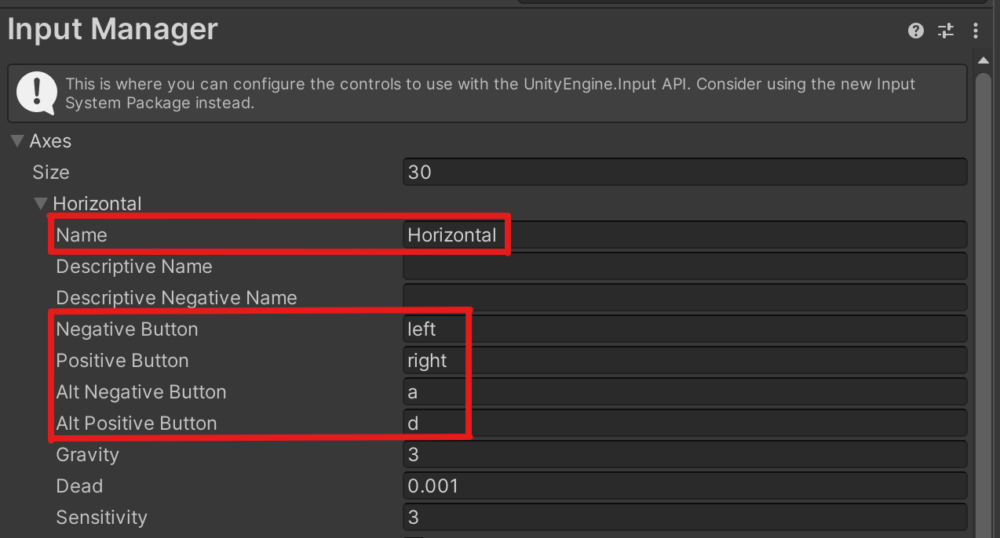
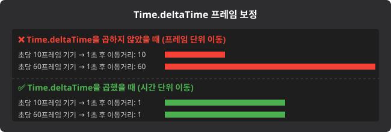
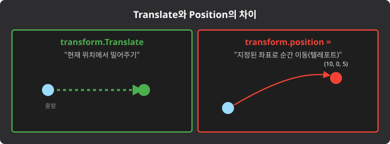

# Unity U06 Input

## 학습 목표
- 키보드 및 마우스 입력 이벤트를 감지하는 기초 함수들의 차이를 이해한다.
- Input Manager를 활용한 축(Axis) 기반 입력과 프레임 독립적인 이동(`Time.deltaTime`)을 구현한다.
- `Translate`와 절대 좌표 `position` 조작의 차이를 구분하여 올바른 이동 코드를 작성한다.

## 범위
- 키워드: Input (GetKeyDown, GetMouseButton), Input Manager (GetAxis, GetButton), Time.deltaTime, Transform.Translate

## 핵심 패턴
```csharp
public class PlayerMovement : MonoBehaviour
{
    public float speed = 5.0f;

    void Update()
    {
        // 1. 단발성 입력 감지 (점프 등 단 한 번 실행)
        if (Input.GetKeyDown(KeyCode.Space))
        {
            Debug.Log("Jump!");
        }

        // 2. 축 기반 지속 입력 감지 (-1.0 ~ 1.0)
        float h = Input.GetAxis("Horizontal");
        float v = Input.GetAxis("Vertical");

        // 3. 초당 이동(Time.deltaTime)을 적용한 위치 이동(Translate)
        Vector3 moveDir = new Vector3(h, 0, v);
        transform.Translate(moveDir * speed * Time.deltaTime);
    }
}
```

## 문항 핵심 포인트

### 1) 키보드 및 마우스 처리 함수 (Input.Get~)
- 개념: `Input.GetKeyDown`은 누른 그 프레임(순간)에 딱 한 번 `true`를 반환하고, `GetKey`는 누르고 있는 매 프레임마다 계속 `true`를 반환하며, `GetKeyUp`은 키를 떼는 순간 딱 한 번 `true`를 반환한다. 마우스 역시 `GetMouseButtonDown(0)` 등으로 좌클릭(0), 우클릭(1), 휠버튼(2)을 감지할 수 있다.
- 오답 포인트: 꾹 누르고 있어야 하는 연사 공격이나 이동 구현에 `GetKeyDown`을 사용하거나, 단 한 번만 반응해야 하는 점프나 UI 클릭에 `GetKey`를 사용하는 경우이다.
- 정답 판별: 해당 기능이 "연속(유지)"인가 "단발성(순간)"인가를 파악하여 `Down/Up`(순간)과 일반 `GetKey/Button`(유지)의 사용이 적절한지 확인한다.

### 2) Input Manager와 GetAxis / GetButton
- 개념: 유니티 `Input Manager`에 정의된 축(Axis) 이름을 기반으로 입력을 받는다. `Input.GetAxis("Horizontal")`는 왼쪽(-1)과 오른쪽(1) 누름에 따라 -1부터 1 사이의 실수를 반환하여 부드러운 이동을, `GetAxisRaw`는 곧바로 -1, 0, 1만을 반환하여 즉각적인 이동을 구현한다.
- 오답 포인트: `GetAxis`에 특정 키보드 키값(`KeyCode.Space`)을 직접 집어넣으려 하거나, `GetButton`의 반환값이 실수형(float)이라고 착각하는 경우이다.
- 정답 판별: 매개변수 괄호 안에 들어간 인자가 "Horizontal", "Jump" 등 Input Manager에 정의된 문자열(String) 이름인지 점검하고, `GetAxis`류는 부드러운 실수(float), `GetButton`류는 논리형(bool)을 반환하는지 판별한다.


*캡션: Edit > Project Settings > Input Manager에서 Horizontal 축에 왼쪽 방향키(Negative)와 오른쪽 방향키(Positive)가 매핑된 구조. 출처: 직접 캡처*

### 3) Time.deltaTime
- 개념: `Time.deltaTime`은 이전 프레임부터 현재 프레임까지 지나간 시간(초)을 의미한다. 컴포넌트의 `Update` 함수는 컴퓨터 성능에 따라 1초당 실행 횟수(FPS)가 계속 변하지만, 이동 수치에 `Time.deltaTime`을 곱하게 되면 프레임 횟수와 무관하게 모든 컴퓨터에서 1초 동안 일정하게 지정한 수치(속도)만큼 이동하도록 보정해준다.
- 오답 포인트: 매 프레임마다 움직임을 갱신하는 `Update` 안에서 초당 이동을 구현할 때 `Time.deltaTime`을 곱해주지 않아, 고성능 컴퓨터일수록 프레임이 많아져 캐릭터가 렉 걸린 듯 엄청나게 빨리 이동해버리는 경우이다.
- 정답 판별: `Update` 함수 내부에서 오브젝트의 위치나 값이 지속적이고 연속적으로 변화할 때, `Time.deltaTime`이 비례 상수로서 끝에 적절히 곱해져 있는지 확인한다.


*캡션: FPS가 달라도 Time.deltaTime을 곱해주면 결국 1초 뒤에 이동하는 최종 거리가 동일해짐을 보여주는 프레임 다이어그램. 출처: 자체 제작*

### 4) Transform.Translate vs Transform.position vs 혼동 함수들
- 개념: `transform.Translate(방향 벡터)`는 오브젝트의 "현재 위치와 회전 상태"를 기준으로 특정 방향으로 연속되게 밀어(이동시켜)주는 함수이다(로컬 상대 좌표계 변환). 반면 `transform.position = 새로운 위치`는 현재 오브젝트의 위치나 회전이 어떠하든 무조건 강제로 지정된 월드 절대 좌표 값으로 텔레포트 시킨다.
- **이름이 비슷하지만 위치를 바꾸지 않는 함수들** (시험 함정 보기 단골):
  - `TransformDirection(Vector3)`: 로컬 방향 벡터를 월드 방향 벡터로 **변환만** 해서 돌려줄 뿐, 오브젝트의 위치는 전혀 이동시키지 않는다.
  - `TransformVector(Vector3)`: 로컬 벡터를 월드 벡터로 **변환만** 해서 돌려줄 뿐, 역시 위치 이동 없음.
  - `SetPositionAndRotation(Vector3, Quaternion)`: 위치와 회전을 **월드 절대값으로 한꺼번에 강제 고정**하는 함수로, `Translate`처럼 상대적으로 밀어주는 기능이 아니다.
- 오답 포인트: 플레이어를 앞(`forward`)으로 매 프레임 지속해서 움직이려 할 때, `Translate`가 아닌 `position` 프로퍼티에 강제 고정값을 대입해 버려서 제자리에서 굳어버리거나 다른 공간으로 날아가는 경우이다.
- 정답 판별: 목적이 "현재 위치로부터의 상대적인 유동적 움직임"이면 `Translate`를, "특정 지점으로의 단번의 순간 이동이나 고정배치"이면 `position = ...` 대입문을 사용했는지 구별한다. `TransformDirection`/`TransformVector`는 **방향 변환 전용**이고, `SetPositionAndRotation`은 **절대 좌표 강제 지정**이므로, "매 프레임 상대 이동"과는 용도가 다르다.


*캡션: 로컬 좌표계 방향으로 나아가는 Translate와 월드 절대 좌표에 점을 찍는 position 대입에 따른 오브젝트 이동 결과 차이 비교표. 출처: 자체 제작*

## 자주 하는 실수
- 점프 연타를 막아야 하는 곳에 `Input.GetKey`를 사용하여 공중부양 버그를 냄
- `Input.GetAxis("Horizontal")` 처럼 쌍따옴표 문자열로 축 이름을 넣어야 하는데, 변수나 KeyCode를 잘못 넣음
- `Update` 안에서 타겟을 향해 지속 이동수치를 더해주면서 실수로 `Time.deltaTime`을 곱하지 않음
- 상대적인 전진, 후진 방향으로 밀어줘야 하는데 `Translate` 대신 `position`을 강제로 대입해 버림

## 빠른 체크리스트
- 입력 감지 목적이 단 한 번의 타격(Down/Up)인지 유지(동작 중)인지 식별했는가?
- Input Manager의 문자열을 넣는 `GetAxis`와 `KeyCode` 상수를 넣는 `GetKey` 계열의 매개변수를 쓰임새에 맞게 구분할 수 있는가?
- `Update` 기반의 지속 변화 로직 수식 끝부분에 `Time.deltaTime`이 잘 포함되었는가?
- 현재 위치 및 회전을 기준으로 움직이는 방식(`Translate`)과 월드 좌표의 특정 위치 찍기(`position`)를 명확히 구분할 수 있는가?

## 미니 체크
### Q1
방향키 조작 시 스무스하게 미끄러지며 가속/감속하지 않고 곧바로 `-1`, `0`, `1`의 값만 즉각 반환하도록 하여 조작감을 경쾌하게 만들고 싶을 때 사용하는 함수는 무엇인가?
- 정답: `Input.GetAxisRaw("Horizontal")`

### Q2
적 객체가 플레이어와 부딪쳐서 동작하는 `OnCollisionEnter` 함수 안에서 깎아내릴 데미지 수치를 계산할 때, 이 수치에 `Time.deltaTime`을 곱해주어야 할까?
- 정답: 아니오. 충돌 판정 함수는 매 프레임마다 연속으로 일어나는 프레임 변화율과 무관하게 충돌 순간 한 번 발생하는 이벤트이므로, `deltaTime`으로 프레임 보정을 할 필요가 없다.

### Q3
특정 큐브 오브젝트에서 `transform.Translate(Vector3.forward)`를 지속 호출하면, 언제 어떤 조건에서나 월드맵의 절대적인 Z축(북쪽) 고정 방향으로만 이동하게 될까?
- 정답: 아니오. `Translate`는 현재 오브젝트 본체가 바라보고 있는 방향(로컬 기준)을 중심으로 이동한다. 따라서 오브젝트가 이미 회전한 상태라면, 절대적인 월드 Z축이 아니라 틀어진 오브젝트 본체의 앞코 방향을 따라가게 된다.

## 연결 세트
- 기초: unity_u06_input_b01
- 챌린지: unity_u06_input_c01
