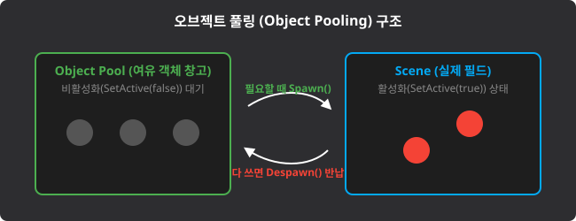
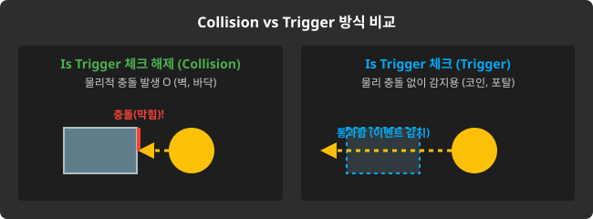

# Unity U07 Spawn and Physics

## 학습 목표
- 프리팹 구조를 활용하여 런타임에 올바르게 객체를 복제(Instantiate)한다.
- 강체(Rigidbody) 기능을 활용하여 물리 기반 이동 및 충돌을 제어한다.
- 충돌 판정 함수(Collider vs Trigger)의 특징을 명확히 구분하고 적용한다.
- 오브젝트 풀링, Init 함수의 개념과 필요성을 이해한다.

## 범위
- 키워드: 프리팹, Instantiate, Rigidbody, velocity, AddForce, TransformDirection, Object Pooling, Collider, Trigger, OnCollisionEnter, OnTriggerEnter

## 핵심 패턴
```csharp
public class Bullet : MonoBehaviour
{
    private Rigidbody rigid;
    public float speed = 10f;

    // 1. 초기화 (게임 오브젝트가 활성화될 때 주로 관례적으로 사용하는 함수)
    public void Init()
    {
        rigid = GetComponent<Rigidbody>();
        // Rigidbody를 이용한 물리 기반 전진 이동
        rigid.velocity = transform.forward * speed; 
    }

    // 2. 물리 충돌 (두 물체 모두 Is Trigger 해제 시)
    private void OnCollisionEnter(Collision collision)
    {
        Debug.Log("물리적 충돌 발생! (벽에 튕기거나 막힘)");
    }

    // 3. 통과형 이벤트 트리거 (하나라도 Is Trigger 체크 시)
    private void OnTriggerEnter(Collider other)
    {
        Debug.Log("겹침 감지! (관통하여 통과함)");
        
        // 총알 객체 파괴 또는 오브젝트 풀로 반납(Despawn)
        gameObject.SetActive(false);
    }
}
```

## 문항 핵심 포인트

### 1) 프리팹(Prefab)과 Instantiate
- 개념: 프리팹은 씬(Scene)에 존재하는 빈번히 생성/삭제되는 오브젝트(예: 몬스터, 총알)를 찍어내기 위해 미리 컴포넌트들을 조립해 둔 '설계도 파일(.prefab)'이다. `Instantiate` 함수를 사용하면 이 프리팹을 게임 도중(런타임)에 복사해서 소환할 수 있다.
- **Instantiate 반환값 활용**: `Instantiate`는 복제된 객체를 반환하므로, 변수에 담아 즉시 조작할 수 있다:
  ```csharp
  // GameObject로 받기
  GameObject clone = Instantiate(prefab, pos, rot);
  // 또는 특정 컴포넌트 타입으로 바로 받기 (프리팩 변수 타입이 Rigidbody일 때)
  Rigidbody clone = Instantiate(rigidbodyPrefab, pos, rot);
  ```
  복제 후 `clone.velocity = ...` 등으로 속도를 줄 수 있다.
- 오답 포인트: Instantiate 할 때 매개변수로 프리팹 원본 참조 대신 알 수 없는 문자열이나 null을 넣으려 하거나, Instantiate의 반환값이 복사된 `GameObject`형임을 알지 못해 변수에 담아 프로퍼티 조작을 하지 못하는 경우이다.
- 정답 판별: `Instantiate(프리팹변수, 위치, 회전)` 꼴의 매개변수가 알맞은 포맷으로 들어갔는지, 복제 후 바로 활용할 때 반환값을 `GameObject` 또는 `GetComponent<T>()`로 제대로 받는지 확인한다.


*캡션: 하이어라키(Scene)에 있던 객체를 Project 창(Asset)으로 끌어내려 .prefab 파일로 만든 모습. 출처: 직접 캡처*

### 2) Rigidbody의 물리 제어 (velocity, AddForce)
- 개념: 이동을 위해 Transform 컴포넌트의 position을 직접 강제 조작하면 물리 연산을 무시하고 그 좌표로 공간 이동을 하지만, `Rigidbody`의 `velocity`나 `AddForce`를 이용하면 중력과 마찰, 질량을 고려한 자연스러운 물리 엔진 기반의 이동이 일어난다. `AddForce`의 ForceMode에는 지속 힘(Force), 순간 힘(Impulse), 질량 무시 가속도(Acceleration), 질량 무시 속도변화(VelocityChange)가 있다.
- **`GetComponent<T>()`의 반환 타입 규칙**: `GetComponent<Rigidbody>()`는 `Rigidbody` 타입을 반환한다. 따라서 대입받는 변수도 반드시 `Rigidbody rb;`로 동일하게 선언해야 한다. `Vector3`나 `Collider` 등 다른 타입으로 선언하면 컴파일 에러가 난다.
- 오답 포인트: 대상 오브젝트에 Rigidbody를 부착(Add Component)하지도 않고 스크립트에서 `GetComponent<Rigidbody>()`를 호출해 NullReferenceException이 터지는 경우이다.
- 정답 판별: 게임오브젝트에 물리력(AddForce 등)을 행사하려 할 때 필수 전제 조건인 `Rigidbody` 컴포넌트가 부착 및 참조되어 있는지 검증한다.

### 3) TransformDirection 및 transform.forward (방향 벡터)
- 개념: 내 캐릭터(오브젝트) 기준의 상대적 방향(예: "내 기준 3시 방향")인 로컬 벡터를, 게임 세상 전체 절대 방위표 기준의 매칭되는 축 방향(월드 벡터) 수치로 변환해 주는 함수이다.
- **`transform.forward`**: 오브젝트가 **현재 바라보고 있는 전방 방향**을 나타내는 단위 벡터(길이 1)이다. `transform.TransformDirection(Vector3.forward)`의 축약형이다.
  - `AddForce` 또는 `velocity`에서 전방 방향으로 힘을 줄 때 자주 사용한다:
    ```csharp
    rigidBody.AddForce(transform.forward * speedForce);
    ```
  - 여기서 `speedForce`는 `public float`으로 선언하면 Inspector에서 조절 가능한 힘 크기 변수가 된다.
- 오답 포인트: 캐릭터가 90도 돌아서 북쪽을 보고 있을 때, `transform.forward`(로컬 기준 앞) 방향이라는 개념과 글로벌 Z축이라는 개념을 혼동하여, 회전된 객체에 절대 월드 벡터를 그대로 쑤셔넣어 엉뚱한 방향으로 날아가게 하는 경우이다.
- 정답 판별: `transform.TransformDirection()`의 목적이 (오브젝트 로컬 방향) -> (월드 절대 방향)으로의 치환기임을 인지하는지 묻는다. `transform.forward`는 이것의 축약형이다.

### 4) 오브젝트 풀링 (Object Pooling) 구조
- 개념: 탄환이나 적병처럼 화면에 수시로 나타나고 사라지는 물체들을 매번 `Instantiate` (생성)하고 `Destroy` (파괴)하면 메모리 할당 관리에 과부하가 생겨 프레임 저하(렉)가 발생한다. 이를 막기 위해 시작할 때 대량으로 만들어둔 채 `SetActive(false)` 시켜 창고(Pool)에 숨겨 두었다가, 필요할 때 `SetActive(true)`(Spawn)로 꺼내 쓰고, 용도가 다 하면 다시 꺼두어(Despawn) 반납하는 기법이다.
- 오답 포인트: 잦은 생성 파괴가 일어나는 상황에서 메모리 최적화를 위해 최선의 방식이 무엇이냐는 맥락에서 여전히 Instantiate/Destroy를 고집하는 경우이다.
- 정답 판별: **재활용**, **메모리 과부하 방지**, **SetActive 제어 기반의 Spawn/Despawn** 키워드가 오브젝트 풀링 개념과 정확히 일치하는지 판별한다.


*캡션: 성능 부하를 일으키는 파괴 대신 객체를 비활성화(Despawn)하여 창고에 반납하고, 필요할 때 재활용(Spawn)하는 메모리 최적화 생태계 다이어그램. 출처: 자체 제작*

### 5) 충돌 판정 3대장 (Collider vs Trigger)
- 개념: 오브젝트들끼리 만났을 때, 두 객체 모두 물리적 통과를 허용하지 않으면 튕기면서 `OnCollisionEnter(Collision 매개변수)`가 발생한다. 반면, 동전이나 포탈처럼 최소 한쪽에 `Is Trigger` 옵션이 체크되어 있다면 물리 충돌은 무시하고 그냥 겹쳐서 자연스럽게 뚫고 통과하되, 이벤트를 발생시키는 `OnTriggerEnter(Collider 매개변수)`가 발생한다. 
- 오답 포인트: `OnCollisionEnter` 함수의 매개변수(Other) 데이터 타입을 적을 때 매개변수 자료형을 `Collider`로 잘못 적거나, `Is Trigger` 체크박스를 켜두고서는 "물리적으로 단단히 부딪힌다, 뚫고 지나가지 않는다"고 착각하는 경우이다.
- 정답 판별: 물리적 튕김(벽, 타격)에는 Collision 계열이, 그냥 통과하며 감지(포탈 진입, 아이템 획득 영역)에는 Trigger 계열이 쓰이며, 매개변수 타입(`Collision` vs `Collider`)이 제대로 매칭되었는지 확인한다.


*캡션: Is Trigger 옵션 활성화 여부에 따른 오브젝트의 물리 충돌 제어와 관통 후 이벤트 발생의 차이 비교표. 출처: 자체 제작*

### 6) Init 함수의 용도와 관례
- 개념: 유니티에서 지원하는 내장 시스템 함수(`Start`, `Awake`)가 아니며, 프로그래머들이 주로 스크립트 작성 시 처음 한 번 설정되어야 할 로직들(캐릭터 체력 리셋, 탄창 채우기, 풀링 객체 활성화 시 초기화 등)을 묶어서 실행해주기 위해 관례적으로 평범하게 만들어 쓰는 사용자 정의 함수 이름이다. 
- 오답 포인트: 풀링에서 Despawn 되었다가 다시 Spawn된 객체의 로직을 무조건 Awake나 Start 함수에만 의존하여 처리하려고 하다가 버그가 터지는 상태(Awake/Start는 일생에 1회만 호출되기 때문).
- 정답 판별: 재활용되는 객체가 새롭게 나타날 때마다 기존 값들을 덮어쓰고 완전히 환생(초기화) 시켜주는 명시적 작업(일반적으로 `Init()` 함수 호출)이 필수적임을 이해하는지 묻는다.

## 자주 하는 실수
- 오브젝트 풀링을 해야 하는 총알 쏘기 구현에서 탄피를 `Destroy` 해버림
- `OnTriggerEnter` 함수의 매개변수 타입에 실수로 `Collision` 클래스를 써넣어 컴파일 에러 유발
- `Instantiate` 할 때 원본 프리팹 에셋이 아닌 빈 씬에 있던 가짜 오브젝트 참조를 넣음
- Trigger 체크를 켜고 몬스터가 길막(물리적 스탠딩)을 해주길 바람

## 빠른 체크리스트
- `Instantiate`로 생성된 반환값을 곧바로 저장하여 재가공할 수 있는가?
- 공간 이동(`Translate`, `position`)과 물리 이동(`AddForce`, `velocity`)의 차이와 부작용을 아는가?
- 메모리 부하 방지를 위해 재활용(활성화/비활성화)하는 디자인 패턴이 **오브젝트 풀링(Object Pooling)**임을 아는가?
- `OnCollision` 계열과 `OnTrigger` 계열의 매개변수 타입(`Collision`/`Collider`)과 통과 허용 범위 차이를 명확하게 대답할 수 있는가?
- 풀링 기법에서 꺼냈을 때마다 변수를 초기값으로 돌려주는 `Init` 사용자 지정 함수의 용도를 파악했는가?

## 미니 체크
### Q1
`void OnTriggerEnter(Collider other)` 함수는 두 물체가 부딪혔을 때 서로 물리적으로 튕겨내도록 차단하는 역할을 하는 스크립트 함수인가?
- 정답: 아니오. Trigger 계열은 물리적 충돌(튕김)이 전혀 발생하지 않고 두 물체가 투명하게 스치며 관통할 때 단지 그 교차 사실(이벤트)만 감지하는 역할을 한다. 단단히 부딪히게 만들고 싶으면 Is Trigger 체크를 해제하고 `OnCollisionEnter`를 사용해야 한다.

### Q2
수백 발의 총알이 발사되고 사라지는 게임이다. `Instantiate` 함수와 `Destroy` 함수만을 무한정 반복하여 구현하면 어떤 치명적인 문제가 생기는지, 그리고 이를 대체할 가장 대중적인 기법의 이름은 무엇인가?
- 정답: 잦은 메모리 할당/해제로 인해 과부하와 렉이 걸린다. 대체할 수 있는 기법은 **오브젝트 풀링(Object Pooling)** 이다.

### Q3
`Rigidbody`가 부착된 물체에 질량(Mass)의 영향을 무시하고 곧바로 오브젝트의 현재 속도를 변경해버리고 싶다면, `AddForce`의 매개변수로 어떤 `ForceMode`를 넘겨주는 것이 적절한가?
- 정답: `ForceMode.VelocityChange`

## 연결 세트
- 기초: unity_u07_spawn_physics_b01
- 챌린지: unity_u07_spawn_physics_c01
