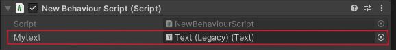
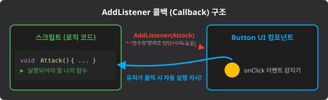

# Unity U08 UI

## 학습 목표
- Text, Image 등 UI 요소의 프로퍼티에 코드로 접근하고 값을 변경할 수 있다.
- 버튼 UI의 OnClick 이벤트를 인스펙터가 아닌 스크립트 코드(`AddListener`)로 연결하는 방법을 익힌다.

## 범위
- 키워드: Text (또는 TextMeshPro), UI 렌더링 파이프라인 기초, Button, onClick.AddListener, UnityEngine.UI

## 핵심 패턴
```csharp
using UnityEngine;
using UnityEngine.UI; // UI를 다루기 위한 필수 네임스페이스

public class UIManager : MonoBehaviour
{
    public Text scoreText;  // TextMeshProUGUI를 더 자주 씁니다.
    public Button startButton;

    void Start()
    {
        // 1. 텍스트 값 변경
        scoreText.text = "Score: 100";

        // 2. 버튼 클릭 이벤트 코드로 연결 (콜백 함수 등록)
        startButton.onClick.AddListener(OnStartButtonClicked);
    }

    // 버튼이 클릭될 때 실행될 함수
    void OnStartButtonClicked()
    {
        Debug.Log("게임 시작 됨!");
    }

    // 3. 외부에서 메시지를 전달받아 UI를 갱신하는 함수 예시 (P02 대비)
    public void SetMessageToDisplay(string stringToDisplay)
    {
        scoreText.text = stringToDisplay;
    }
}
```

## 문항 핵심 포인트

### 1) 텍스트 UI 컴포넌트 접근
- 개념: 화면에 글씨를 띄워주는 `Text` 요소(최신 버전에서는 `TextMeshPro` 권장)의 내용을 코드로 수정하려면, 이 스크립트 상단에 반드시 `using UnityEngine.UI;` (또는 `TMPro`) 네임스페이스를 선언하고, 해당 컴포넌트의 `.text` 프로퍼티에 문자열 `string` 타입 값을 대입해야 한다.
- 오답 포인트: 숫자를 대입할 때 `.text = 100;` 으로 숫자형을 곧바로 넣어버려 형 변환 에러가 나거나, 변수 이름 자체만 적어두는 경우(`scoreText = "Hello";`)이다.
- 정답 판별: 요소의 `.text` 멤버 참조가 정확하고, 값으로 대입되는 우항이 완전한 `string` 타입 구문(예: `.ToString()`, `"문자"`)인지 확인한다.


*캡션: 인스펙터의 Text(Legacy) 컴포넌트에 스크립트의 public Text 변수를 드래그 앤 드롭으로 연결한 모습. 출처: 직접 캡처*

### 2) Button.onClick.AddListener() 활용
- 개념: 버튼이 클릭될 때 어떤 동작을 할지 지정하는 방법에는 '인스펙터의 On Click () 항목에서 직접 객체와 함수를 선택하는 방식(에디터 기반)'과 '코드에서 `AddListener`를 써서 함수를 주입해주는 방식(코드 기반)'이 있다. 후자는 실행 도중에 동적으로 버튼 역할을 바꿔줄 수 있어 강력하다.
- **등록 위치의 중요성** (Start vs Update):
  - `AddListener`는 **호출될 때마다 리스너가 누적 등록**된다. 따라서 반드시 **1회만 실행되는 초기화 메서드**(`Start`, `Awake`, `OnEnable`) 안에서 호출해야 한다.
  - `Update()`나 `LateUpdate()` 안에 넣으면 60fps 기준 **1초에 60개의 동일 리스너가 누적**되어, 버튼 1번 클릭에 콜백이 수백 번 실행되는 치명적 부작용이 생긴다.
  - `OnTriggerEnter2D` 같은 물리 이벤트는 **UI 버튼 클릭과 완전히 무관**하므로 리스너 등록 장소로 적합하지 않다.
  ```csharp
  // ⭕ 올바른 예: Start에서 1회 등록
  void Start() {
      button.onClick.AddListener(OnButtonClicked);
  }
  // ❌ 위험한 예: Update에서 매 프레임 등록 (중복 누적!)
  void Update() {
      button.onClick.AddListener(OnButtonClicked); // 매 프레임 1개씩 쌓임
  }
  ```
- 오답 포인트: `AddListener`의 괄호 안에 들어가야 하는 것은 "실행될 함수 그 자체(메서드 이름)"여야 하는데, 함수의 반환 결과를 넣듯 `()`를 붙여서 `AddListener(function())` 형식으로 넘겨주어 문법 오류를 유발하는 경우이다.
- 정답 판별: 콜백으로 넘겨주는 인자가 함수 호출 구문 `()` 없이 함수의 이름(식별자) 원형 그대로 잘 넘겨졌는지 판별한다.

### 3) 마우스 이벤트 내장 메시지 함수 (OnMouse~ 계열)
- 개념: 유니티 엔진은 3D/2D 오브젝트 위에서 마우스 조작이 발생할 때 특정 이름의 함수를 **자동으로 호출**해 준다. 개발자가 직접 호출하지 않으므로 `private`으로 선언하는 것이 설계 원칙이다.
  - `OnMouseDown()`: 마우스 버튼을 **누르는 순간** 1회 호출
  - `OnMouseUp()`: 마우스 버튼을 누르고 있다가 **떼 순간** 1회 호출
  - `OnMouseEnter()`: 마우스 커서가 오브젝트 위로 **올라온 순간** 1회 호출
- 예시:
  ```csharp
  private void OnMouseUp()
  {
      panelObject.SetActive(!panelObject.activeSelf);
  }
  ```
- 오답 포인트: `OnMouseDown`(누르는 순간)과 `OnMouseUp`(떼 순간)을 혼동하거나, 접근 제한자를 `public`으로 놓아 불필요하게 외부에 노출한다.
- 정답 판별: `private void OnMouseUp()` 형태가 정확한지 확인한다.


*캡션: 버튼 컨트롤러가 클릭 이벤트를 감지하면, AddListener로 등록해둔 사용자 함수들을 차례대로 호출해주는 콜백 시스템의 원리. 출처: 자체 제작*

## 자주 하는 실수
- 스크립트 상단에 `using UnityEngine.UI;`를 적지 않아 `Text` 데이터 타입을 인식하지 못해 컴파일 에러 발생
- `Text.text` 에 점수 변수를 넣으면서 `ToString()` 연산을 까먹어 형변환 에러 발생
- `button.onClick.AddListener( PlayGame() );` 처럼 괄호를 넣어, 클릭할 때 실행되는 게 아니라 그 줄을 읽는 즉시 미리 함수가 실행되어 버림

## 빠른 체크리스트
- 기존 `UnityEngine` 외에 UI 컴포넌트를 사용하기 위한 추가 네임스페이스 선언을 했는가?
- `.text` 프로퍼티에 들어갈 자료형이 문자열이 되도록 안전한 치환 로직을 짰는가?
- `AddListener` 안에 들어가는 인자가 함수 호출이 아닌 함수 이름 자체임을 인지하고 있는가?

## 미니 체크
### Q1
`int score = 50;` 일 때, UI Text의 내용을 수치로 치환하는 올바른 코드는 다음 중 무엇인가?
A) `myText.text = score;`
B) `myText.text = score.ToString();`
- 정답: B (text 필드에는 반드시 string 타입 값만 넣을 수 있다.)

### Q2
스크립트(Script) 내부에서 코드 상으로 버튼 클릭 시 동작을 등록할 때 사용하는 유니티 UI 컴포넌트의 내장 함수 이름은 무엇인가?
- 정답: `onClick.AddListener()`

## 연결 세트
- 기초: unity_u08_ui_b01
- 챌린지: unity_u08_ui_c01
