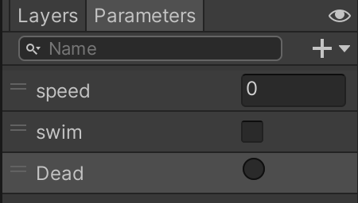

# Unity U09 Animator

## 학습 목표
- 스테이트 머신(State Machine)의 구성 요소(State, Transition, Parameter) 역할을 구별한다.
- 애니메이션 상태 전환 방식을 이해하고, 코드를 통한 파라미터 제어(SetTrigger, SetBool 등) 구문을 작성한다.
- 서브 스테이트 머신, Any State, Exit 등 특수 노드의 역할을 파악하여 복잡한 트리를 읽어낸다.

## 범위
- 키워드: 로코모션(Locomotion), State Machine, Any State, Transition (Has Exit Time), Animator 컴포넌트, SetBool, SetFloat, SetTrigger

## 핵심 패턴
```csharp
public class PlayerAnimController : MonoBehaviour
{
    private Animator anim;

    void Start()
    {
        // 1. 초기화: 같은 오브젝트에 부착된 Animator 참조 확보
        anim = GetComponent<Animator>();
    }

    void Update()
    {
        // 2. 파라미터 제어: 스피드 값에 따라 Idle <-> Walk/Run 전환(Float/Bool 사용)
        float moveSpeed = Input.GetAxisRaw("Vertical");
        anim.SetFloat("Speed", Mathf.Abs(moveSpeed));

        // 3. 트리거 작동: 단발성 이벤트(점프, 공격, 피격)
        if (Input.GetKeyDown(KeyCode.Space))
        {
            anim.SetTrigger("Jump");
        }
    }
}
```

## 문항 핵심 포인트

### 1) State Machine 기초와 특수 State들
- 개념: 애니메이터 창은 캐릭터의 모든 동작(State)을 블록으로 나열하고 화살표(Transition)로 이어 붙여 상태 전이를 관리하는 '스테이트 머신(State Machine)'이다.
- **Entry & Default State**: 
  - `Entry` 노드는 애니메이터의 **시작점**이며, 여기서 나가는 화살표는 게임 실행 시 가장 처음 재생될 **기본 상태(Default State, 주황색)**를 가리킨다.
  - 모든 스테이트 머신은 반드시 하나의 주황색 기본 상태를 포함해야 하며, 임의로 기본 상태를 아예 없앨 수는 없다.
- **Any State**: 현재 동작이 무엇이든 상관없이 특정 조건이 달성되면 최우선으로 선을 무시하고 강제 실행시킬 때 쓴다. (예: 피격, 사망)
- 오답 포인트: 애니메이션 노드들을 전부 `Any State`에 연결해버려 예상치 못한 프레임 겹침 버그를 내게 하거나, `Entry` 노드에서 곧바로 화살표를 여러 개 그으려 하는 경우이다.
- 정답 판별: 상태 전이도의 기본 역할을 이해하고, `Any State`처럼 언제든 인터럽트(끼어들기)를 걸 수 있는 특별한 노드의 사용처를 파악할 수 있는지 묻는다.


*캡션: Entry에서 주황색 선을 타고 시작되어 각 동작들(Walk, Run 등)이 어떻게 연결되는지 보여주는 애니메이터 윈도우. 출처: 직접 캡처*

### 2) 화살표(Transition)의 전환 방식 옵션
- 개념: 동작 간의 전환은 크게 두 가지로 나뉜다. 첫째, 조건 없이 특정 행동이 끝난 직후 넘어가는 '종료 연계' 방식(`Has Exit Time` 체크). 둘째, 진행도와 상관없이 변수(Parameter)의 스위치가 켜졌을 때 즉각 넘어가는 '조건(Condition) 연계' 방식.
- 오답 포인트: 달리기에서 점프 버튼을 누르자마자 즉각 점프 애니메이션이 나와야 하는데, `Has Exit Time` 체크를 풀어주지 않아서 달리기 모션이 1.0(끝)까지 진행될 때까지 허공을 뛰다가 뒤늦게 발동하는 딜레이 버그를 일으키는 경우이다.
- 정답 판별: 동작이 자동으로 이어서 연결되어야 할 때(점프 -> 착지)와 버튼을 누르면 즉각 끊고 바뀌어야 할 때(이동 -> 공격) 어느 옵션 구성을 해제/체크해야 하는지 판별한다.


*캡션: 특정 조건(Parameter) 값이 참일 때만 실행되도록 Conditions를 설정하는 화면. Has Exit Time 설정에 유의해야 한다. 출처: 직접 캡처*

### 3) 코드에서의 Parameter(변수) 종류 4가지 제어
- 개념: 마우스 클릭, 방향키 등 캐릭터의 행동 데이터를 애니메이터에게 넘겨주어 화살표를 열리게 하는 것이 `Set...()` 계열 함수들이다.
  - `SetInteger("변수명", 1)`: 정수형 번호 대입 (예: 무기 번호 1번, 2번)
  - `SetFloat("변수명", 1.5f)`: 수치형 비교가 가능한 밸브 조절 (예: Speed가 0.1 이상이면 걷기)
  - `SetBool("변수명", true/false)`: 계속 켜고 꺼야 하는 토글 스위치 (예: OnWater 수영 중 상태)
  - `SetTrigger("변수명")`: 발사 버튼처럼 한번 누르면(true) 동작 후 자동으로 다시 올라오는(false) 점화 버튼 (예: 점프, 타격)
- 오답 포인트: 트리거 매개변수 항목에 대고 `SetBool("Jump", true)` 처럼 틀린 함수 계열을 부르거나, 코드로 변경해주지도 않았는데 인스펙터 화살표만 만들어놓고 왜 작동이 안 되는지 모르는 경우이다.
- 정답 판별: **Integer, Float, Bool, Trigger** 이 4가지 변수 형식의 특성이 알맞게 매칭된 `Set~` 함수를 작성했는지 확인한다. (특히 `SetInteger` 누락 주의)

### 4) Sub-State Machine 구성
- 개념: 애니메이션 개수가 너무 많아 거미줄처럼 복잡해지면, 폴더(육각형 노드) 장치인 `서브 스테이트 머신`을 만들어 모션들을 구역별로 그룹화할 수 있다. 
- **전환 연결**: 일반 상태(State)에서 서브 머신 안으로 선을 잇거나, 반대로 서브 머신에서 바깥의 일반 상태로 화살표를 잇는 것 모두 **가능**하다.
- 육각형 안에서 모션이 다 끝나고 `Exit` 노드에 도달하면 다시 바깥 본체 메인 애니메이터의 `(Up) Base Layer`로 빠져나오게 된다.
- 오답 포인트: 육각형 모양의 아이콘이 서브 폴더 개념인지 인식하지 못하거나, 서브 머신 내에서 무한루프를 돌아서 밖으로 못 빠져나오는 구조를 짠 경우이다.
- 정답 판별: 애니메이션 노드를 묶어서 정리하는 **서브 스테이트 머신** 계층 구조의 분리와 캡슐화 역할을 설명할 수 있는지 확인한다.

### 5) 팁: 애니메이션 클립 이름과 궤적의 논리적 매칭 (P01 대비)
- 캐릭터의 특정 동작(예: 점프)을 여러 단계로 표현할 때, 클립 이름에 동작의 의미가 담긴다.
  - `Apex`(정점): 도약의 가장 높은 곳.
  - `SlowFall / FastFall`: 천천히 낙하 / 빠르게 낙하.
  - `Land`: 지면에 도달(착지).
- 이러한 논리적 흐름(정점 -> 낙하 -> 착지)에 따라 상태 노드를 배치해야 자연스러운 애니메이션이 구성된다.

## 자주 하는 실수
- 스매싱(단발 공격) 애니메이션의 `Has Exit Time` 설정을 안 꺼서 1초 넘게 딜레이가 걸린 뒤 때림
- 코드로 `animator.SetTrigger("Hit");` 해놓고 애니메이터 파라미터 리스트에는 `Bool` 타입 "Hit"을 똑같은 이름으로 등록해둠
- 피격과 사망 애니메이션을 `Any State`에 연결하지 않고, 백수십 개의 화살표를 일일이 그려서 잇는 고문을 초래함

## 빠른 체크리스트
- 애니메이터 `Parameter` 목록에 선언된 데이터 타입(Float/Bool/Trigger)과 내가 스크립트에서 쓰는 `Set~` 함수 이름이 알맞게 짝지어졌는가?
- 즉각적인 캔슬(반응)이 필요한 화살표에서는 인스펙터 창의 `Has Exit Time` 체크 박스를 껐는가?
- 어느 시점에서든 강제로 끼어들어야 하는 공통 모션(피격 등)을 `Any State`에 효율적으로 연결했는가?

## 미니 체크
### Q1
`Has Exit Time` 체크가 되어있는 트랜지션(화살표)에서는 `Conditions`(파라미터 조건)가 만족된다면 현재 진행 중인 애니메이션을 중간에 끊고 즉각 상태가 바뀔까?
- 정답: 아니오. `Has Exit Time` 조건과 `Conditions`가 함께 묶여있다면, 조건이 아무리 만족되었더라도 현재 애니메이션 사이클 진행도(Exit Time 변수 수치)가 끝나는 퍼센트 구간까지 무조건 다 본 뒤에야 동작이 넘어간다.

### Q2
적군에게 총을 맞았을 때, 적이 점프 중이든 장전 중이든 다 무시하고 곧바로(최우선적으로) "피격 신음" 애니메이션을 틀어주려 할 때, 가장 연결하기 편하고 효율적인 애니메이터 창의 특수 블록 이름은 무엇인가?
- 정답: `Any State`

### Q3
캐릭터의 점프나 스킬처럼, 스크립트 쪽에서 단 한 번만 호출해 주면 애니메이션 연출 후 다시 조건을 `false` 상태로 원상복구 시키는 코드를 생략할 수 있어 단발성 모션에 자주 애용되는 파라미터 타입과 코드 지정 함수명은 무엇인가?
- 정답: `Trigger` 타입 변수, 함수명은 `SetTrigger("파라미터이름")`

## 연결 세트
- Basic: unity_u09_animator_b01
- Challenge: unity_u09_animator_c01
