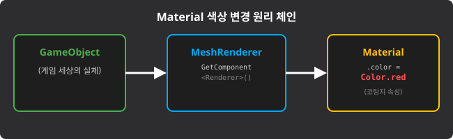

# Unity U10 Material and Color

## 학습 목표
- `Color` 타입 변수와 실제 변수명을 구분하여 디버그 출력할 수 있습니다.
- `Material.SetColor(string, Color)`의 두 인자 구조를 정확히 이해합니다.
- Standard Shader의 메인 색상 프로퍼티명 `"_Color"` 규칙을 기억합니다.
- `Color.red`, `Color.blue` 같은 정적 상수를 활용해 머티리얼 색을 바꾸는 코드를 작성할 수 있습니다.

## 범위
- 키워드: `Color`, `Debug.Log`, `Material`, `SetColor`, `"_Color"`, `Color.red`, `Color.blue`

## 먼저 큰 그림
이번 단원은 "색상 변수 값을 어떻게 출력하는가", "머티리얼 색상을 바꾸는 `SetColor`는 어떤 모양인가"를 묻는 문제를 풀기 위한 단원입니다.

W10에서는 특히 아래 4가지를 바로 연결할 수 있어야 합니다.
- `public Color color;`가 있으면 출력할 때는 `Color`가 아니라 `color`를 써야 합니다.
- `Material.SetColor`의 첫 번째 인자는 문자열입니다.
- Standard Shader의 메인 색상 프로퍼티명은 보통 `"_Color"`입니다.
- 빨간색, 파란색은 `Color.red`, `Color.blue`처럼 정적 상수로 씁니다.


*캡션: 오브젝트의 색상은 Renderer가 사용하는 Material을 통해 바뀐다는 구조를 보여 주는 그림입니다. 출처: 자체 제작*

## 핵심 패턴
```csharp
public class ColorChanger : MonoBehaviour
{
    public Color color;
    public Material mat;

    void Start()
    {
        Debug.Log("Color:" + color);
        mat.SetColor("_Color", Color.red);
    }
}
```

이 패턴 안에는 W10의 핵심 답안 요소가 거의 다 들어 있습니다.
- `Debug.Log("Color:" + color);`
- `mat.SetColor("_Color", Color.red);`

색상만 바꾸면 같은 규칙으로 다른 답도 바로 만들 수 있습니다.

```csharp
mat.SetColor("_Color", Color.blue);
```

## 문항 핵심 포인트

### 1) `Color` 타입과 변수명 `color` 구분
이 개념을 알면 무엇이 쉬워지나?
- P01에서 드롭다운 빈칸을 바로 채울 수 있습니다.

- 개념: `public Color color;`에서 앞의 `Color`는 자료형 이름이고, 뒤의 `color`는 실제 값이 저장되는 변수명입니다. `Debug.Log`에 넣어야 하는 것은 타입명이 아니라 변수명입니다.
- 왜 헷갈리나?: 둘 다 같은 단어라서 대소문자 차이를 놓치기 쉽습니다. `Color`는 타입이고, `color`는 실제 데이터입니다.
- 어떻게 구별하나?: `Debug.Log("Color:" + [빈칸]);`처럼 값을 출력하려면, 실제 값이 들어 있는 소문자 변수명을 찾으면 됩니다.
- 짧은 유사 예시:
  ```csharp
  public int score;
  Debug.Log(score);
  ```
  여기서도 `int`가 아니라 `score`를 출력하는 것과 같습니다.

정답 판단:
- `Debug.Log("Color:" + color);`처럼 `color`를 넣어야 합니다.

10초 점검:
- `Debug.Log("Color:" + Color);`가 왜 틀릴까요?
- 답: `Color`는 타입 이름이지, 현재 값이 들어 있는 변수명이 아니기 때문입니다.

### 2) `Material.SetColor(string, Color)`의 두 인자
이 개념을 알면 무엇이 쉬워지나?
- P02와 X01을 바로 해결할 수 있습니다.

- 개념: `SetColor`는 첫 번째 인자로 셰이더 프로퍼티 이름을 문자열로 받고, 두 번째 인자로 적용할 색상을 `Color` 값으로 받습니다.
- 왜 헷갈리나?: 둘 다 "색 관련 값"처럼 보여서 첫 번째 인자도 색을 넣는 자리라고 착각하기 쉽습니다.
- 어떻게 구별하나?: 첫 번째 자리는 "어느 칸을 바꿀지", 두 번째 자리는 "무슨 색으로 바꿀지"라고 생각하면 쉽습니다.
- 짧은 유사 예시:
  ```csharp
  mat.SetColor("_Color", Color.red);
  ```
  메인 색상 칸을 빨간색으로 바꾸는 예시입니다.

정답 판단:
- ① `"_Color"`
- ② `Color.red`

생각 질문:
- 두 번째 인자에 `"red"`처럼 문자열을 넣으면 왜 안 될까요?

### 3) `"_Color"`는 왜 문자열이어야 할까?
이 개념을 알면 무엇이 쉬워지나?
- X02의 함정 보기를 바로 걸러낼 수 있습니다.

- 개념: 셰이더 프로퍼티명은 C# 코드에서 문자열 리터럴로 전달해야 합니다. 그래서 `_Color`가 아니라 `"_Color"`처럼 따옴표로 감싸야 합니다.
- 왜 헷갈리나?: `_Color`가 이름처럼 보여서 변수명처럼 적고 싶어집니다. 또 `"Color"`라고만 쓰면 비슷해 보여서 맞아 보일 수 있습니다.
- 어떻게 구별하나?: W10에서는 두 조건을 동시에 봐야 합니다. `쌍따옴표가 있는가?` 그리고 `언더스코어로 시작하는가?`
- 짧은 유사 예시:
  - `_Color` -> 변수명처럼 보이므로 틀리기 쉽습니다.
  - `"_Color"` -> 문자열 리터럴이라서 맞습니다.
  - `"Color"` -> 문자열이긴 하지만 Standard Shader의 관례적 메인 프로퍼티명과 다릅니다.

정답 판단:
- 올바른 형식은 `"_Color"`입니다.
- `_Color`는 따옴표가 없어서 C# 코드에서 변수처럼 해석됩니다.
- `"Color"`는 언더스코어가 없어 의도한 프로퍼티와 맞지 않을 수 있습니다.

### 4) 색상 상수 바꿔 쓰기
이 개념을 알면 무엇이 쉬워지나?
- X01에서 빨간색 패턴을 파란색으로 자연스럽게 바꿀 수 있습니다.

- 개념: `Color.red`, `Color.blue`, `Color.green`처럼 유니티는 자주 쓰는 색을 정적 상수로 제공합니다.
- 왜 헷갈리나?: 색이 바뀌면 첫 번째 인자도 같이 바꿔야 한다고 생각하기 쉽습니다. 하지만 메인 색상 프로퍼티명은 그대로 두고, 두 번째 인자만 바꾸면 됩니다.
- 어떻게 구별하나?: `SetColor("_Color", Color.red)`를 알고 있으면, 다른 색 문제에서는 `Color.red` 자리만 바꾸면 됩니다.
- 짧은 유사 예시:
  ```csharp
  mat.SetColor("_Color", Color.blue);
  ```
  파란색으로 바꾸는 완전한 코드입니다.

실무 팁:
- 색 이름이 바뀌어도 첫 번째 인자 `"_Color"`는 그대로인 경우가 많습니다. 셰이더의 "메인 색상 슬롯"을 가리키는 이름이기 때문입니다.

## 자주 하는 실수
- `Debug.Log("Color:" + Color);`처럼 타입명을 출력하려고 합니다.
- `mat.SetColor(_Color, Color.red);`처럼 첫 번째 인자에 따옴표를 빼먹습니다.
- `mat.SetColor("Color", Color.red);`처럼 언더스코어를 빼먹습니다.
- `mat.SetColor("_Color", "red");`처럼 두 번째 인자에 문자열을 넣습니다.
- 파란색 문제인데 첫 번째 인자까지 다른 이름으로 바꾸려 합니다.

## 빠른 체크리스트
- `Color` 타입명과 `color` 변수명을 구분할 수 있는가?
- `Debug.Log`에 실제 값을 가진 변수명을 넣을 수 있는가?
- `SetColor` 첫 번째 인자가 문자열이라는 점을 설명할 수 있는가?
- `"_Color"`가 쌍따옴표와 언더스코어를 모두 가져야 함을 기억하는가?
- `Color.red`와 `Color.blue`를 상황에 맞게 바꿔 쓸 수 있는가?

## 미니 체크
### Q1
`public Color color;`가 있을 때, 콘솔에 현재 색상 값을 출력하려면 무엇을 넣어야 할까요?

- 정답: `color`입니다.

### Q2
머티리얼 메인 색상을 빨간색으로 바꾸는 핵심 한 줄은 무엇일까요?

- 정답: `mat.SetColor("_Color", Color.red);`

### Q3
파란색으로 바꾸는 문제에서는 무엇만 바꾸면 될까요?

- 정답: 두 번째 인자의 색상 상수를 `Color.blue`로 바꾸면 됩니다.

## 연결 세트
- 기초: `unity_u10_material_color_b01`
- 챌린지: `unity_u10_material_color_c01`
