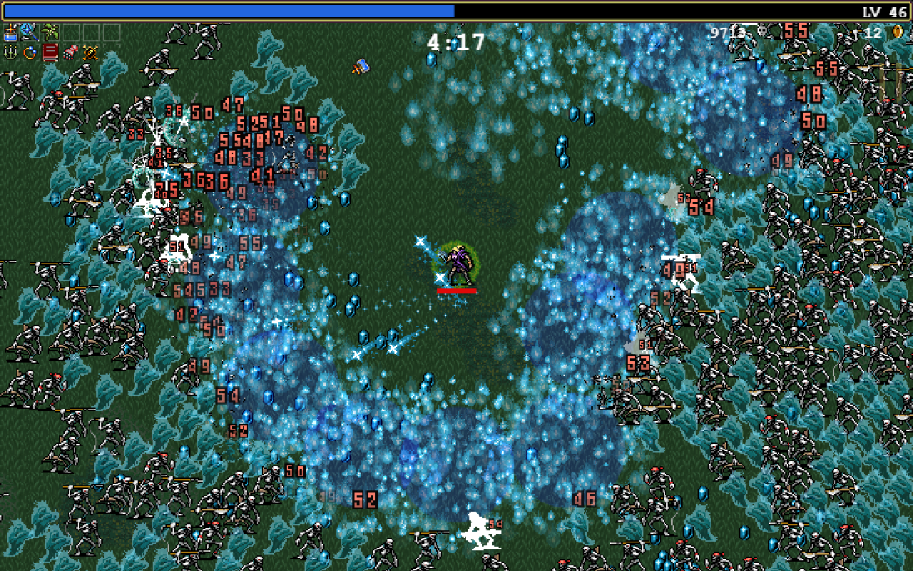

# Unity U11 ECS

## 학습 목표
- ECS(Entity Component System) 아키텍처의 개념을 이해하고 도입 목적을 파악한다.
- 기존 객체 지향(MonoBehaviour) 방식 코드와 순수 데이터 중심(ECS) 코드를 키워드로 구별한다.

## 범위
- 키워드: ECS, Entity, ComponentData, SystemBase, MonoBehaviour와의 차이점

## 핵심 패턴
```csharp
// ECS 환경에서 System을 구현하는 예시 (구조 파악용)
using Unity.Entities;
using Unity.Transforms;

public partial class MovementSystem : SystemBase
{
    protected override void OnUpdate()
    {
        float deltaTime = SystemAPI.Time.DeltaTime;

        // 시스템은 데이터 조각(Component)들만 쭉 훑으면서 로직을 한 번에 처리한다.
        Entities.ForEach((ref LocalTransform transform, in MoveSpeedData speed) =>
        {
            transform.Position.y += speed.Value * deltaTime;
        }).ScheduleParallel();
    }
}

// MonoBehaviour에서는 불가능한 수만 개의 객체 병렬 처리 최적화 코드이다.
```

## 문항 핵심 포인트

### 1) ECS의 도입 목적 (대규모 성능 최적화)
- 개념: 기존의 `MonoBehaviour` 방식은 좀비 1만 마리가 있다면 좀비마다 `Update` 함수를 1만 번 따로 불러야 해서 오버헤드(비효율)가 크다. ECS(Entity Component System)는 눈에 보이는 껍데기(Entity), 순수 데이터들의 조합(Component), 그리고 이 데이터들을 한꺼번에 묶어서 병렬로 일괄 처리하는 공장장(System)으로 역할을 철저히 분리하여 메모리 효율과 대규모 연산(디펜스 게임, 군집 시뮬레이션 등) 성능을 극대화시킨 차세대 구조이다.
- 오답 포인트: 몬스터 10만 마리가 등장하는 게임을 제작하는데, ECS 대신 기존 `Instantiate`와 `MonoBehaviour`의 `Update`만을 활용해도 거뜬하다고 섣불리 오판하는 경우이다.
- 정답 판별: **수만 개 이상의 엄청난 수의 객체 배치, CPU 멀티코어 병렬 연산, 극강의 성능 최적화** 라는 요구 목적 키워드가 나왔을 때, 이를 해결할 기술로 **ECS(Entities)** 를 올바로 매칭시킬 수 있는지 확인한다.


*캡션: MonoBehaviour로는 프레임 저하가 일어나는 엄청난 수의 비행체(Entity)들을 ECS로 60프레임에 무리 없이 그려내는 기술 데모. 출처: 자체 촬영*

### 2) 상속 클래스(키워드) 패턴으로 ECS 사용 여부 판별하기 (P01, P02, X02 대비)
- 개념: 현재 작성된 C# 스크립트가 구식 방식인지 신식 ECS 방식인지 구분하려면 상속받는 클래스와 사용하는 핵심 구조체의 이름을 살펴야 한다.
- **실사용 판별 황금률**: 
  - 스크립트 최상단에 **`using Unity.Entities;` 네임스페이스가 선언되어 있다고 해서 무조건 'ECS를 사용한다'고 판정하지 않는다.**
  - `using`은 단지 라이브러리를 불러오는 '준비'일 뿐이며, 반드시 코드 본문에서 ECS 전용 타입을 **상속받거나 호출**해야만 실제 사용으로 인정한다.
- 패러다임별 주요 키워드:
  - **MonoBehaviour 방식 (전통적)**: `MonoBehaviour` 상속, `Start()`, `Update()`, `GameObject`, `GetComponent<T>()`, `OnCollisionEnter()`
  - **ECS 방식 (데이터 지향)**: `SystemBase`, `ISystem`, `ComponentSystem` 상속, `IComponentData`, `EntityManager`, `IJobEntity`, `OnUpdate()`, `Entities.ForEach`
- 오답 포인트: 코드 상단에 `using Unity.Entities;`가 적혀 있다는 이유만으로, 본문이 `MonoBehaviour` 기반인데도 ECS 코드로 오해하는 경우이다.
- 정답 판별: 
  - (1) `using Unity.Entities;` 문장이 있는지 확인한다.
  - (2) 클래스 선언부나 본문에 `SystemBase`, `IComponentData`, `EntityManager` 등 ECS 고유 키워드가 **실제로 등장**하는지 확인한다. 
  - 두 조건이 모두 만족되어야 "ECS 실사용 코드"로 판정한다.

## 자주 하는 실수
- 소규모 퍼즐이나 방탈출 게임 같은 간단한 프로젝트에도 무조건 최신 기술이라며 굳이 어렵고 낯선 ECS 문법을 억지로 도입하여 개발 속도를 망침
- ECS 시스템 코드(`SystemBase`) 안에다가 `GameObject.Find` 같이 기존 MonoBehaviour 전용 무거운 함수를 호출해서 에디터가 다운됨

## 빠른 체크리스트
- 기존 `MonoBehaviour`의 한계를 극복하고 수만 개의 유닛을 그리기 위해 필요한 유니티의 차세대 아키텍처 3글자 약자가 무엇인지 아는가?
- 주어진 코드에서 `SystemBase`나 `IComponentData`라는 키워드가 보일 때, 이것이 ECS 기반 코드라는 것을 눈치챌 수 있는가?

## 미니 체크
### Q1
뱀파이어 서바이버처럼 화면을 가득 채우는 10만 마리의 몬스터를 가장 렉 없이 최적화하여 구현하기에 적합한 유니티 기술 아키텍처는 다음 중 무엇인가?
A) 모든 개체에 MonoBehaviour의 Update 달아주기
B) ECS (Entity Component System) 도입
- 정답: B (대규모 물리/렌더링 처리에는 데이터 지향 설계인 ECS가 압도적으로 유리하다.)

### Q2
현재 열려 있는 C# 스크립트의 클래스가 `public class MoveSystem : SystemBase` 와 같이 선언되어 있다. 이 코드는 게임오브젝트에 직접 드래그해서 컴포넌트로 부착(Add Component)할 수 있는가?
- 정답: 아니오. `SystemBase`를 상속받은 클래스는 ECS의 시스템 역할을 담당하므로, 기존 방식처럼 특정 `GameObject`의 인스펙터에 컴포넌트로 끌어다 붙일 수 없다.

## 연결 세트
- Basic: unity_u11_ecs_b01
- Challenge: unity_u11_ecs_c01
