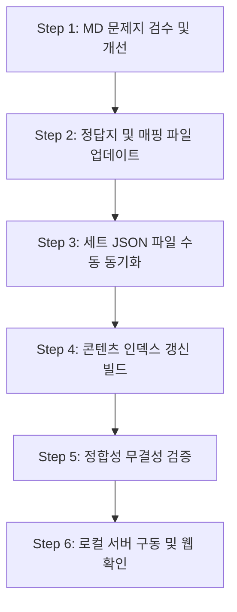

# Unity 콘텐츠 검수 및 JSON 세트 반영 워크플로우 가이드

본 문서는 유니티(Unity) 트랙의 문제지(MD) 검수 내용이 실제 웹 연습장 플랫폼(JSON 세트)에 채점 에러나 모순 없이 완벽하게 노출되고 연동되도록 하는 표준 작업 지침입니다.

> [!IMPORTANT]
> **유니티 트랙의 특이사항**
> Pygame이나 C/Python 언어 트랙과 달리, 유니티 트랙은 마크다운(.md) 문제지를 JSON 세트로 자동 변환해 주는 스크립트가 없습니다. 따라서 **마크다운 수정 시 반드시 대응되는 JSON 세트 파일도 함께 수동으로 업데이트**해 주어야 웹 앱에 정상 반영됩니다.

---

## 1. 대상 파일 및 경로 규칙
*   **문제지 원본 (MD)**: `practice/data/theory/unity/weeks/problem_unity_w[주차].md`
*   **정답지 원본 (MD)**: `practice/data/theory/unity/weeks/answer_unity_w[주차].md`
*   **매핑 문서 (MD)**: `practice/data/theory/unity/weeks/problem_unity_w[주차]_map.md`
*   **웹 앱 세트 (JSON)**: `practice/data/sets/unity/unity_u[유닛]_[주제].json`

---

## 2. 세부 작업 단계 (Workflow)



### Step 1: MD 문제지 검수 및 개선
*   초심자(입문자)가 풀기에 비정상적으로 어렵거나, 불필요한 스펠링 암기를 요하는 단순 서술/단답형 문항을 개선합니다.
*   **개선 방향**: 
    *   메뉴 경로/옵션명 쓰기 ➔ **객관식(A~D)**으로 변경
    *   복잡한 C# 코드 한 줄 타이핑 ➔ **객관식** 혹은 **빈칸 채우기 단답형(대괄호 제외)**으로 변경
    *   참/거짓 다중 판단 ➔ `(1) 참, (2) 참, (3) 거짓`처럼 **답안 제출 형식을 지문에 엄격히 고정**

### Step 2: 정답지 및 매핑 파일 업데이트
*   문제지 수정에 맞춰 정답지의 정답 기호, 키워드 및 해설을 수정합니다.
*   `*_map.md` 파일에서 변경된 문제의 유형(예: `단답` ➔ `객관식`)을 동기화합니다.

### Step 3: 세트 JSON 파일 수동 동기화 (`practice/data/sets/unity/*.json`)
*   웹 앱이 직접 렌더링하는 JSON 내 `problems` 배열을 MD와 일치시킵니다.
*   **객관식(mcq)으로 변경 시**:
    ```json
    {
      "id": "p03",
      "type": "mcq",
      "title": "문제 제목",
      "description": "객관식으로 바뀐 문제 설명",
      "options": ["보기A", "보기B", "보기C", "보기D"],
      "optionLabels": ["A", "B", "C", "D"],
      "correctIndex": 1
    }
    ```
*   **빈칸 단답형(short)으로 변경 시**:
    ```json
    {
      "id": "p05",
      "type": "short",
      "title": "문제 제목",
      "description": "빈칸 [①]이 포함된 문제 설명",
      "expectedAnyOf": ["SerializeField"]
    }
    ```

### Step 4: 콘텐츠 인덱스 갱신 빌드
*   이론 경로 및 변경된 인덱스 구조를 반영하기 위해 갱신 스크립트를 실행합니다.
    ```powershell
    python scripts/generate_content_indexes.py
    ```

### Step 5: 정합성 무결성 검증
*   문제 수, 매핑 ID 중복, JSON 구문 오류 등을 종합 점검하는 정합성 스크립트를 실행합니다.
    ```powershell
    powershell -ExecutionPolicy Bypass -File scripts/check_sets_index.ps1
    ```
    *   `OK: sets.index.json is consistent` 메시지가 출력되어야 정상입니다.

### Step 6: 로컬 서버 구동 및 웹 확인
*   로컬 호스트에서 실제 문제를 테스트하기 위해 웹 서버를 구동합니다.
    ```powershell
    # practice 디렉토리를 루트로 구동 (cd 대신 Cwd 지정 활용)
    python -m http.server 8000
    ```
*   브라우저에서 `http://localhost:8000/practice.html?set=unity_uNN_[주제]`에 접속하여 UI가 깨지지 않는지, 객관식 및 단답 채점이 원활히 동작하는지 확인합니다.

---

## 3. 유형 변환 체크리스트
- [ ] 문항의 `type`이 `mcq`일 경우 `options` 배열과 0-indexed 기반 `correctIndex`가 일치하는가?
- [ ] `type`이 `short`일 경우 채점의 걸림돌을 줄이기 위해 `expectedAnyOf` 배열 내에 허용 정답을 정밀하게 기술했는가?
- [ ] 문제지 MD 지문에 작성된 보기(A~D) 텍스트와 JSON의 `options` 배열 순서가 일치하는가?
- [ ] 참/거짓 판단 문제의 경우, 채점 형식 예외를 최소화할 수 있도록 명확한 템플릿과 경고 문구가 MD와 JSON에 동일하게 박혀있는가?
