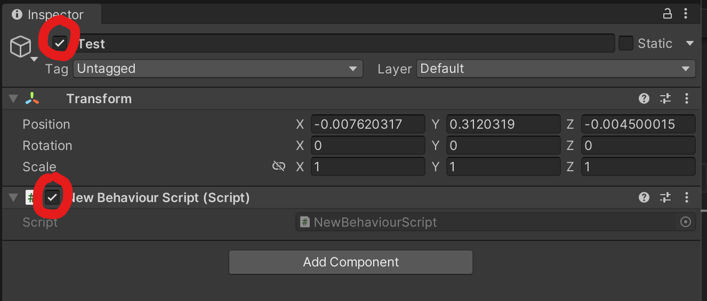
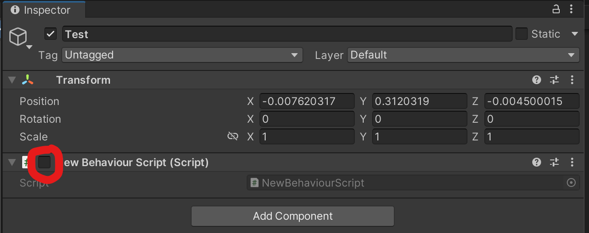
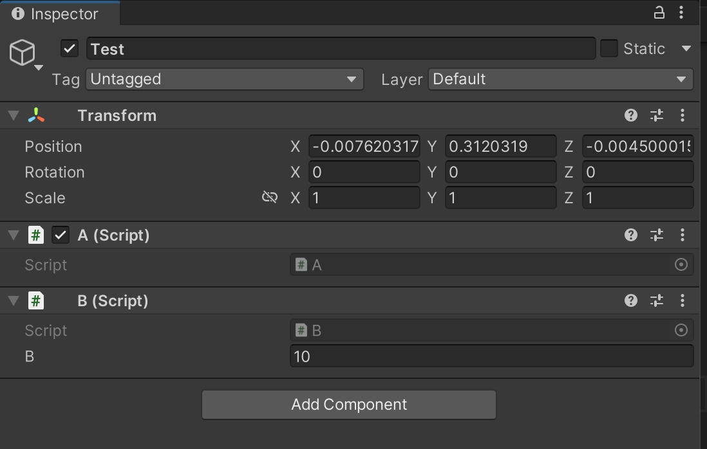
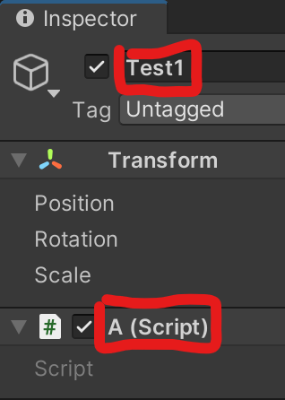
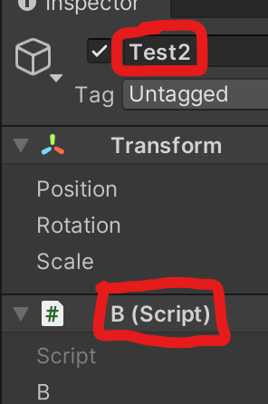
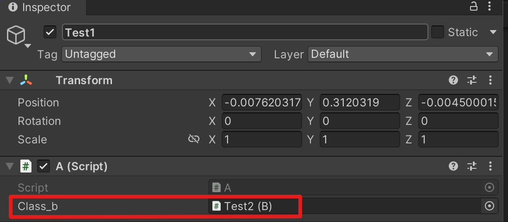

# Unity U05 Transform and Lifecycle
## Goal
- Understand the core idea of this unit before solving problems.
- Review common mistakes first.
## Scope
- Topic: Transform hierarchy, Awake/OnEnable
- Source map: from practice/temp/유니티 목차.md

## 문항 핵심 포인트
### 1) 함수의 반환형 실수하기 쉬운 부분
- [ ] 를 빼먹지 않게 주의하자.<br><br>
    ```csharp
    int[] func(){ //int의 배열을 반환할때 반환형을 int[]라고 써줘야 한다.
        int[] a = new int[5];
        return a;
    }
    ```    
 
### 2) OnEnable 함수 
- 오브젝트가 활성화 될 때마다 실행되는 함수이다.<br>
반대로 비활성화 될 때마다 실행되는 OnDisable 함수도 있다.<br>
유니티에서 아래와 같이 스크립트를 작성하고 아무 오브젝트나 하나 만들어서 스크립트를 추가한 뒤 테스트를 해보자.
    ```csharp
    public class NewBehaviourScript : MonoBehaviour
    {
        private void OnEnable() 
        {
            Debug.Log("활성화!");
        }
        private void OnDisable()
        {
            Debug.Log("비활성화!");
        }
    }
    ```
    (오브젝트를 비활성화 상태로 둔 게 아니라면)게임을 시작 할 때 OnEnable 함수가 한 번 실행된다.<br>
    그리고 게임이 실행되고 있는 상태에서 아래 사진에서 빨간색으로 표시된 부분의 체크를 껐다 켰다 해보자<br>
    끄면 OnDisable 함수가 실행되고 켜면 OnEnable 함수가 실행되는걸 확인할 수 있다.<br>

    

    <br>
    추가) 스크립트에서 코드를 이용해 오브젝트를 활성화/비활성화 하기 위해선 아래와 같이 코드를 작성하면 된다.<br><br>

    ```csharp
    gameObject.SetActive(false); // 비활성화
    gameObject.SetActive(true); // 활성화
    ```
    <br>

### 3) Awake 함수
- 대부분의 경우 Start함수와 거의 비슷하다. 게임 시작 버튼을 누르면 Start함수처럼 한 번 실행된다. <br>
하지만, 몇 가지 차이점이 있다.
1) Start 함수보다 먼저 실행된다.
2) 스크립트 파일이 비활성화 되어있어도 실행된다. Start 함수는 비활성화 되면 실행되지 않는다.<br> 아래 사진과 같이 스크립트를 비활성화해도 Awake는 실행된다. 오브젝트가 비활성화 되어있으면 실행되지 않는다.<br><br>
<br><br>
3) 위 내용을 기억하기 힘들다면 Start랑 비슷하다는 건 꼭 기억하자<br><br>
---    

### 4) 다른 스크립트에 접근하기
- 게임을 만들다보면 스크립트가 여러 개 생긴다. 이 때, 서로 다른 스크립트에 있는 변수나 함수 등에 접근이 가능하다.
1) 동일한 오브젝트에 여러 개의 스크립트가 적용되어 있을 때<br><br>
<br><br>
Test라는 하나의 오브젝트에 A,B 두 개의 스크립트가 적용되어 있다. 이 때, A에서 B에 있는 변수에 접근하는 예시 코드는 아래와 같다.
    ```csharp
    public class A : MonoBehaviour
    {   
        void Start()
        {
            B class_b = GetComponent<B>(); // B라는 클래스의 객체를 만들면
            Debug.Log(class_b.b); // B에 있는 b라는 변수에 접근이 가능.
        }
    }
    ```

2) 서로 다른 오브젝트에 스크립트가 적용되어 있을 때

    
    <br><br>
    이번에는 Test1에는 A 스크립트가 적용되어 있고 Test2에는 B스크립트가 적용되어 있다.<br>
    이 때, A에서 B에 있는 변수에 접근하려면 아래와 같이하면 된다.

    (1) 스크립트 A에 코드를 아래와 같이 작성한다.
    ```csharp
    public class A : MonoBehaviour
    {
        public B class_b;
        void Start()
        {
            Debug.Log(class_b.b);
        }
    }
    ```
    <br>
    (2) 코드를 작성하면 아래 사진과 같이 class_b에 해당하는 객체를 집어넣을 수 있는 공간이 생긴다.<br> Hierarchy창에서 Test2를 드래그 해서 넣어주면 스크립트A에서 B에 접근이 가능해진다.
    <br>(정확히는 클래스B의 객체인 Test2에 접근이 가능해진다.)
    <br><br>

    <br><br>

    결론) 다른 스크립트에도 접근이 가능하다. 주어진 코드를 읽고 이 코드는 다른 스크립트에 접근하려고 하는거구나 라는 것만 알아챌 수 있으면 된다.

## Core Pattern
~~~csharp
// TODO: add 2-4 representative code snippets for this unit
~~~
## Common Mistakes
- TODO: add at least 3 mistakes learners make
## Mini Check
### Q1
- TODO
### Q2
- TODO
## Linked Sets
- Basic: unity_u05_transform_lifecycle_b01
- Challenge: unity_u05_transform_lifecycle_c01

