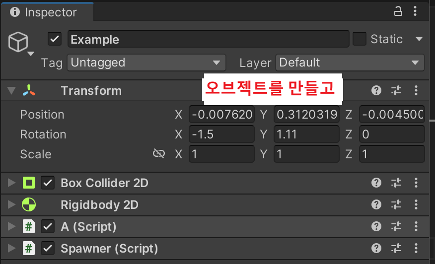
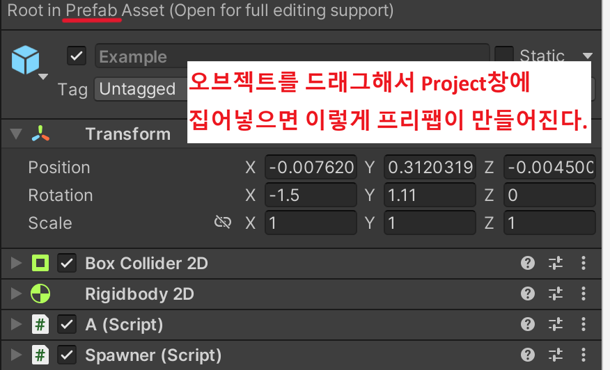
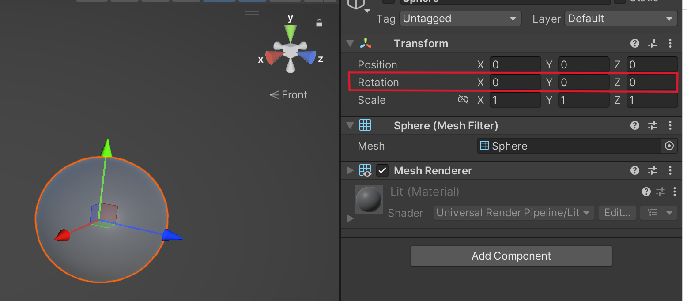
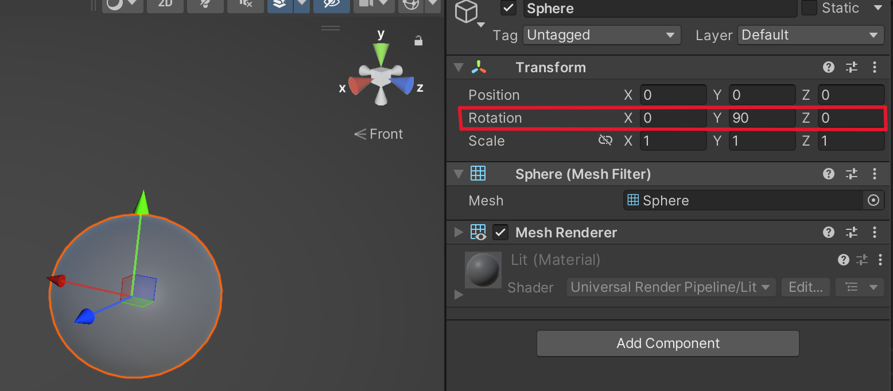

# Unity U07 Spawn and Physics
## Goal
- Understand the core idea of this unit before solving problems.
- Review common mistakes first.
## Scope
- Topic: Instantiate, Rigidbody, AddForce, Trigger
- Source map: from practice/temp/유니티 목차.md
## 문항 핵심 포인트
### 1) 프리팹
- Scene에 존재하는 오브젝트를 만들기 위한 템플릿, 설계도이다.

    <br><br>
    이렇게 만들어진 프리팹은 언제든지 Scene에 추가해서 사용이 가능하다.
### 2) Instantiate
- 오브젝트 또는 프리팹을 생성(복제)하는 함수이다. 
    ```csharp
    // Example이라는 오브젝트 또는 프리팹을 생성하는 코드.
    // 생성위치와 회전 상태, 적용해놓은 컴포넌트 모두 그대로 복사된다.
    Instantiate(Example);


    // Example을 이 스크립트가 적용된 오브젝트의 위치와 회전과 동일하게 생성하는 코드.
    // transform.position과 rotation은 스크립트가 적용된 오브젝트의 위치와 회전 상태이다.
    Instantiate(Example, transform.position, transform.rotation);


    // Instantiate의 반환형은 GameObject이다.
    // 아래와 같이 코드를 작성해서 추가적으로 설정을 바꿔줄 수도 있다.
    GameObject obj = Instantiate(Example);
    obj.name = "monster"; // 생성된 오브젝트의 이름을 monster로 바꾼다.


    // Rigidbody로 받아서 Rigidbody 관련 설정을 바꿀 수도 있따.
    // GameObject로 받았을 때에도 Rigidbody 관련 설정을 바꿀 수 있지만
    // 그럼 Rigidbody rigid = obj.GetComponent<Rigidbody>() 라고 한 줄을 더 적어야한다.
    Rigidbody rigid = Instantiate(Example);
    
    ```

### 3) Rigidbody.velocity, Rigidbody.addforce
- Rigidbody를 이용해서 이동시킬 때 사용하는 함수들이다.

    ```csharp
    float speed = 5.0f;
    float power = 10.0f;

    // 오브젝트에 Rigidbody 컴포넌트를 적용해놨어야 정상적으로 실행된다는 걸 기억하자.
    Rigidbody r = GetComponent<Rigidbody>();

    // 방향은 forward(앞), 속도는 speed로 설정하는 코드이다.
    // 오브젝트의 회전이 0,0,0일 때, transform.forward는 new Vector3(0,0,1)과 같다.
    r.velocity = transform.forward * speed;


    // forward 방향으로 power의 힘으로 민다는 뜻이다. 
    // 단순히 이동시킨다, 속도를 몇으로 설정하겠다가 아닌 물리적으로 미는 방식이라
    // 오브젝트의 질량을 무겁게 설정할수록 속도가 느리다.
    r.addForce(transform.forward * power, ForceMode.Force);
    ```
    
    ForceMode에는 Force, Impulse, Acceleration, VelocityChange가 있다. 이런게 있다고 알아만 두자
    <br><br>

    | Force | Impulse | Acceleration | VelocityChange | 
    |:------:|:------:|:------:|:------:|
    | 지속적으로 계속 밈 | 한 번 팍 하고 미는 힘 | 가속도를 직접 바꿈 | 속도를 직접바꿈 |
    | 질량 영향 O | 질량 영향 O  | 질량 영향 X |  질량 영향 X | 

### 4) FixedUpdate

### 5) TransformDirection
- 축은 월드 기준 축이 있고 오브젝트 기준 축이 있다. <br><br>
<br>
<br><br>
회전이 0,0,0인 경우에는 월드축과 오브젝트의 축이 동일하지만 오브젝트에 회전이 있으면 달라진다.<br>
transform.TransformDirection은 매개변수로 Vector값을 넣어주면 그 방향이 월드축 기준으로 어느 방향인지를 반환한다.<br>
예를 들어, 위 2번째 사진을 보면 오브젝트가 y축 기준 90도 회전되어있고 월드기준 X축과 오브젝트기준 Z축이 일치하는걸 볼 수 있다.<br>
이 때 transform.TransformDirection(new Vector3(0,0,1))은 Vector3(1,0,0)을 반환할 것이다.<br>

    결론) transform.TransformDirection은 매개변수를 오브젝트 기준 축으로 해석하고 그것을 월드 기준 벡터로 바꿔서 반환한다.


### 6) 오브젝트 풀링
- 오브젝트 풀링은 오브젝트가 생겼다 사라졌다를 반복할 때 사용하는 방식입니다. 단순히 오브젝트를 만들고 삭제하고 만들고 삭제하고.. 해도 되지만 이러면 컴퓨터 내부적으로 메모리에 공간을 할당했다가 지웠다 할당했다가 지웠다.. 하면서 렉이 걸리게 됩니다. 그럼 어떻게 해야하느냐? 오브젝트를 미리 필요한 만큼 만들어놓고 비활성화 상태로 대기시킵니다. 그리고 필요할 때 활성화 시키고 필요없어지면 다시 비활성화 상태로 바꿉니다. 이런 방식을 오브젝트 풀링이라고 부릅니다. 
마치 오브젝트를 풀(pool = 수영장)에 잠수시켜놨다가 필요하면 위로 꺼내고 필요없어지면 다시 집어넣는 겁니다.
<br><br>
오브젝트를 활성화/비활성화 시킬 때는 SetActive(true), SetActive(false)로 할 수 있습니다.<br>
그런데 단순히 활성화/비활성화만 하는게 아니라 추가로 해줘야하는 작업이 있을 수 있습니다.<br>
때문에 사람들은 활성화/비활성화할 때 같이 해줘야 하는 작업을 묶어서 편하게 하기 위해 Spawn(),Despawn()이라는 함수로 만들어 사용합니다. Spawn에는 SetActive(true)가 포함될거고 Despawn에는 SetActive(false)가 포함되겠죠. Spawn과 Despawn은 유니티 함수가 아니라 그냥 사람들이 만들어서 사용하는 평범한 함수인데 시험문제에 풀링을 할 때 Spawn, Despawn이 당연히 활성화/비활성화 기능이라는 듯이 나오곤 합니다.

### 7) OnCollisionEnter, OnTriggerEnter
- collision과 trigger

    collision(=collider)는 물리적인 충돌이 일어납니다. 부딪치면 튕겨나가거나, 뚫고 지나갈 수 없습니다.
    반면, trigger는 물리적인 충돌이 없습니다. 그냥 뚫고 지나갑니다. 다만 다른 오브젝트가 지나갔는지(겹쳤는지)는 감지합니다.
    충돌을 해도 그냥 뚫고 지나가는 마리오의 동전 같은걸 만들 떄 trigger를 쓸 수 있겠네요.

<br>

- OnCollisionEnter은 충돌이 일어났을 때 실행되는 함수입니다.
<br>
    ```csharp
    void OnCollisionEnter(Collision other){
        Debug.Log("충돌함");
    }
    ```
    충돌시 자동으로 실행되고, 매개변수 other에는 충돌한 상대 오브젝트가 자동으로 들어옵니다.<br>
    그리고 충돌 했을 때, 충돌 중, 충돌이 끝난 후 실행되는 함수가 나뉘어져 있습니다.
    <br><br>
    | OnCollisionEnter | OnCollisionStay | OnCollisionExit | 
    |:------:|:------:|:------:|
    | 처음 충돌했을 때 한 번 실행 | 충돌 중 계속 실행 | 충돌이 끝날 때 한 번 실행 |
    ---
    <br>

- OnTriggerEnter는 Trigger가 충돌했을 때 실행되는 함수입니다. <br>
둘 중에 하나 이상이 trigger이면 OnTriggerEnter가 실행되고 둘 다 trigger가 아닐 때 OnCollisionEnter가 실행됩니다.
마찬가지로 OnTriggerEnter, OnTriggerStay, OnTriggerExit가 있습니다.
<br>


### 8) Init함수
- 결론부터 말하자면 Init은 오브젝트가 활성화 될 때 초기화해줘야 하는 내용들을 담고 있는 함수입니다. 

    Init함수는 위에서 나온 Spawn, Despawn과 비슷한 취급을 받는 함수입니다.<br>
    유니티의 특별한 함수가 아닌 우리가 C,C++에서 만들어 사용하는 함수처럼 아주 평범한 함수입니다. <br>
    그런데 관례적으로 Init이라는 이름의 함수를 많이 사용하고, 이게 시험 문제로도 나오곤 합니다.<br>


## Core Pattern
~~~csharp
// TODO: add 2-4 representative code snippets for this unit
~~~
## Common Mistakes
- TODO: add at least 3 mistakes learners make
## Mini Check
### Q1
- TODO
### Q2
- TODO
## Linked Sets
- Basic: unity_u07_spawn_physics_b01
- Challenge: unity_u07_spawn_physics_c01

