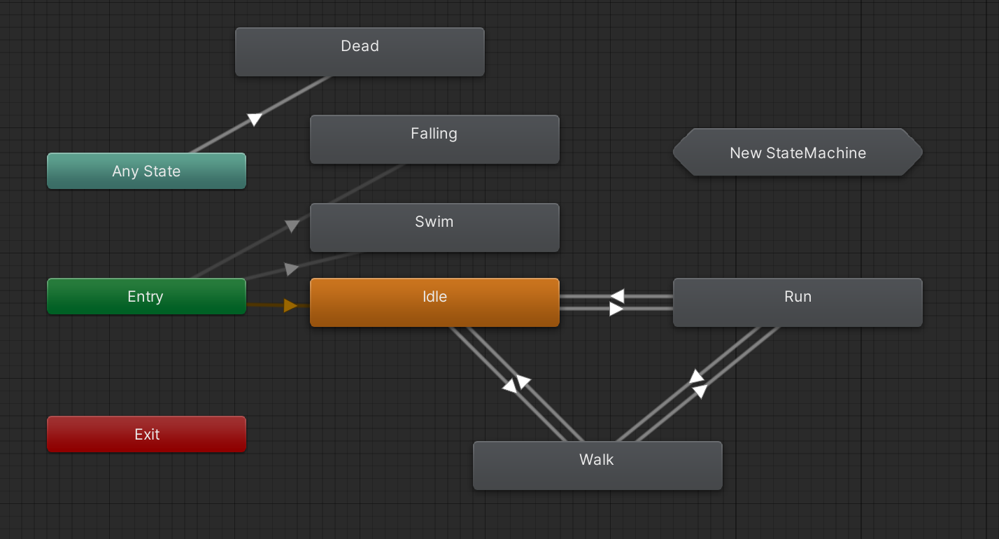
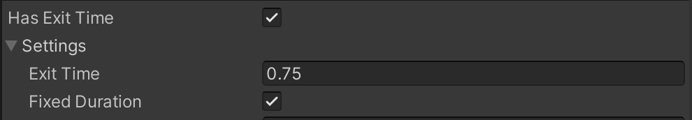
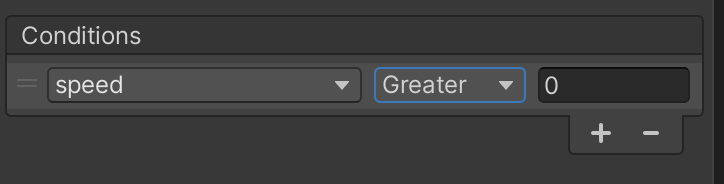

# Unity U09 Animator
## Goal
- Understand the core idea of this unit before solving problems.
- Review common mistakes first.
## Scope
- Topic: state machine, parameters, SetBool/SetTrigger
- Source map: from practice/temp/유니티 목차.md

## 문항 핵심 포인트
### 1) 애니메이션
- 여기서는 애니메이션에 대해 전반적으로 훑어봅시다. 양이 많을 수도 있는데 크게 어려운 내용은 없으니 천천히 읽어봅시다.<br>
캐릭터가 걸을 때는 걷는 모션, 뛸 때는 뛰는 모션, 죽으면 죽는 모션, 가만히 있을 때는 가만히 있는 모션을 표현해줘야 합니다. 이런 모션들을 애니메이션이라 부르고 유니티에서는 아래 사진과 같은 방식으로 애니메이션을 구성합니다.
<br><br>
하나씩 살펴봅시다.
    - state: 사진에 있는 네모난 블럭들을 state라 부릅니다. Any State, Entry, Exit는 조금 특수한 state이고 나머지는 개발자가 직접 만든 state입니다. 특수한 state를 제외하고 나머지 state들은 전부 하나의 모션(애니메이션)입니다. Dead는 죽었을 때 실행되는 모션으로 캐릭터가 쓰러지는 모션을 넣어주면 되겠네요. Idle은 유휴상태라는 의미인데 캐릭터가 아무것도 안하고 있음을 의미하는 단어로 많이 씁니다. 아무것도 안 하고 캐릭터를 가만히 세워두면 건들거리는 모습을 게임에서 본 적 있을 겁니다. 그런 모션을 생각하시면 됩니다. Walk와 Run은 말 그대로 걷고, 달리는 모션이겠네요. state와 모션, 애니메이션 세 단어는 거의 동일한 의미로 사용됩니다.<br><br>
    - state machine: 간단하게 말해 state들이 모여있는 것을 state machine이라 합니다. 위 사진이 사실 state machine의 모습입니다.<br><br>
    - transition: 사진에서 화살표로 표시된 것이 transition입니다(화살표와 transition, 같은 의미이니 혼용해서 사용하겠습니다) 화살표는 이 state에서 저 state로 변경될 수 있음을 의미합니다. 사진에서 Idle -> Walk 방향으로 화살표가 있고 Walk -> Idle 방향으로도 화살표가 있습니다. 캐릭터가 걷다가 멈출 수도 있고 반대로 멈춰있다가 걸을 수도 있습니다. 그러면 그에 맞게 가만히 있는 모션 -> 걷는 모션 으로 바뀌어야하고 반대로 걷는 모션 -> 가만히 있는 모션으로도 바뀔수 있어야 합니다. 화살표는 이렇게 state가 전환되도록 하는 역할입니다. 나머지 화살표도 다 동일한 의미입니다. 만약 화살표가 없다면 모션이 전환되지 않습니다. 화살표를 만드는 방법은 state에 우클릭을 해서 make transition이라는 옵션을 선택하면 됩니다.<br><br>
    - 주황색 state: 사진을 보면 Idle만 주황색으로 되어있습니다. 주황색은 Default State입니다. 게임이 시작되면 제일 기본적으로 실행되는 모션은 Idle 모션이라는 의미입니다. 우클릭을 해서 무엇을 Default State로 설정할지 고를 수 있습니다. Default State는 하나만 존재할 수 있습니다.<br><br>
    - Entry: 애니메이션이 시작될 때 제일 처음 거쳐가는 state입니다. Default State에서 시작하면 되는데 이게 왜 필요하지? 라고 생각할 수도 있지만 위 사진을 보면 Entry에서 출발하는 transition이 여러개 있습니다. transition은 조건이 만족되는 화살표를 따라 이동해서 그곳에 있는 state의 모션이 실행되도록합니다.하늘에서 떨어지며 시작하는 맵이라면 떨어지는 모션(Falling)으로 시작해야할 겁니다. 물 속에서 시작하는 맵이라면 수영하는 모션(Swim)으로 시작해야 할 겁니다. 연결되어 있는 모든 transition의 조건이 만족되지 않았다? 그러면 Default State로 이어지는 주황색 화살표를 따라 갈겁니다.<br><br>
    - Any State: 지금 현재 어떤 State든지 상관없이 조건이 만족되면 Any State와 화살표로 연결된 State가 실행됩니다. 위 사진을 보면 Any State와 화살표로 연결된 Dead가 있습니다. 지금 현재 걷고 있든, 뛰고 있든, 가만히 있든 체력이 다 깎여서 죽었으면 바로 Dead가 실행되는겁니다. 다른 모든 모션을 무시하고 바로 실행되어야 하는 모션이 있을 때 사용하기에 적합합니다.<br><br>
    - Exit: 가장 상위 스테이트 머신(main layer 또는 base layer라고도 부릅니다)에서 이 state에 도달하면 그냥 다시 Entry부터 시작됩니다. 하위 스테이트 머신에서 Exit에 도달할 경우 상위 스테이트 머신으로 이동합니다.
    상위 스테이트 머신은 뭐고 하위 스테이트 머신은 뭐냐? 는 아래에서 배워봅시다. 사진에 있는 육각형으로 된 New StateMachine에 대해서도 아래에서 배워봅시다.

### 2) state machine
- 위에서 짧게 설명했듯이 state가 모여있는게 state machine입니다. 그런데 state machine 안에 또다른 state machine을 만드는게 가능합니다. 위에 있는 사진에서 New StateMahchine이라고 적혀있는 육각형이 바로 state machine안에서 만들어진 state machine입니다. 이 때 New StateMachine이 하위(sub) state machine이 되는거고 사진에 있는 state machien은 상위 state machine이 됩니다. 이제 위에서 Exit에 대해 설명했던게 이해가 될겁니다. 그런데 이걸 어디에 쓸까요? 여러분이 게임을 아주 멋지게 만들기 위해서 캐릭터의 모션을 디테일하게 만들다 보면 수많은 state와 수많은 transition이 만들어질겁니다. 수영하는 모션, 빠르게 수영하는 모션, 수영하다가 죽는 모션, 칼을 휘두르는 모션, 총을 쏘는 모션, 물 속에서 칼을 휘두르는 모션, 점프하면서 칼을 휘두르는 모션... 수십개의 화살표가 서로 겹쳐서 어디서 어디로 가는건지 제대로 보이지도 않을겁니다. 이 때, state machine을 만들어서 구분을 해줄 수 있습니다. 칼을 들고 있을 때의 모션만 모아놓은 state machine, 물 속에 있을 때의 모션만 모아놓은 state machine. 이런식으로 정리를 해놓으면 한결 보기 편해집니다.
<br><br>
하위 state machine에 가면 (Up) Base Layer라는게 있습니다. Exit와 동일하게 상위 state machine으로 갈 수 있는데 일단은 Exit와 비슷하다 정도로만 알아둡시다. 

### 3) state 전환 방식
- state를 전환하는 법 즉, 화살표를 따라 이동하게 만드는 방법은 크게 2가지가 있습니다.<br>
1. 하나의 모션이 끝나면 자동으로 화살표를 따라 이동하기<br>
<br><br>
화살표를 눌러보면 이런 화면이 나옵니다. Has Exit Time을 체크하면 모션이 끝날 때 자동으로 화살표를 따라 이동하도록 하겠다는 뜻입니다. 그 아래에 Exit Time 0.75는 모션이 75%까지 진행됐을때 화살표를 따라 이동하도록 하는 것입니다. 1.0으로 설정하면 모션이 완전히 끝난 후 화살표를 따라 이동하겠네요. 또 그 아래에 Fixed Duration에 체크를 하면 0.75를 %가 아닌 초로 쓰겠다는 뜻입니다. 즉 모션이 시작되고 0.75초가 지나면 화살표를 따라 이동하도록 하겠다는 뜻이 됩니다.
---
<br>
2. 특정 조건이 만족되면 화살표를 따라 이동하기<br>

<br><br>
애니메이션을 설정하는 state machine 화면을 보면 위 사진처럼 parameters라는 탭이 있습니다. 여기에서 parameter를 만든 뒤 화살표를 눌러보면 parameter를 이용해 조건을 추가할 수 있습니다. speed greater 0은 speed라는 parameter가 0보다 크면 화살표를 따라 이동하겠다 라는 뜻입니다. Idle -> Walk로 갈때 이 조건을 넣어주면 되겠네요. parameter의 값은 애니메이션 설정창에서 직접 설정해줄 수도 있지만 코드를 이용해서도 설정이 가능합니다. 
```csharp
Animator anim;

void Start() {
    anim = GetComponent<Animator>(); // 캐릭터의 애니메이터 가져오기
}

void Update() {
    if (Input.GetKeyDown(KeyCode.Space)) {
        // 1. 트리거는 Bool과 비슷한데 한 번 작동시켜주면 애니메이션이 종료된 뒤 알아서 false로 바뀐다.
        // Bool은 직접 false로 바꿔줘야 함.
        anim.SetTrigger("Dead"); 
        
        // 2. Water의 값을 true로 설정.
        anim.SetBool("Water", true); 
        
        // 3. speed의 값을 5.0으로 설정
        anim.SetFloat("Speed", 5.0f);
    }
}
``` 
이 코드는 예시코드로 스페이스바를 누르면 parameter의 값을 위와 같이 설정하게 됩니다. 한 줄만 남겨놓고 주석처리를 한 뒤 실행을 해보며 parameter의 값이 잘 바뀌는지 확인해 봅시다.

## Core Pattern
~~~csharp
// TODO: add 2-4 representative code snippets for this unit
~~~
## Common Mistakes
- TODO: add at least 3 mistakes learners make
## Mini Check
### Q1
- TODO
### Q2
- TODO
## Linked Sets
- Basic: unity_u09_animator_b01
- Challenge: unity_u09_animator_c01

