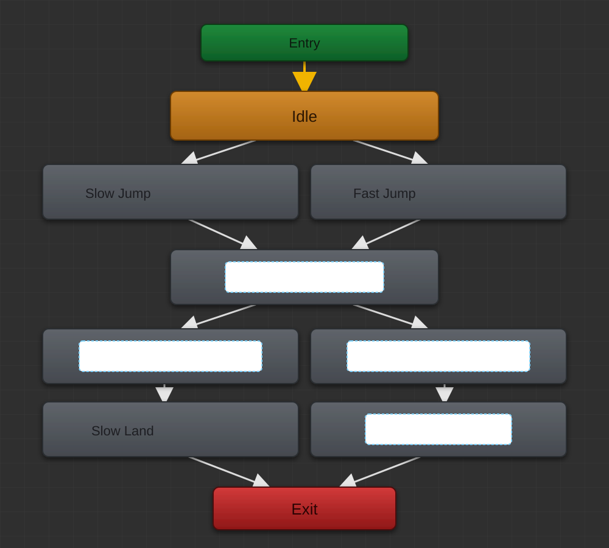
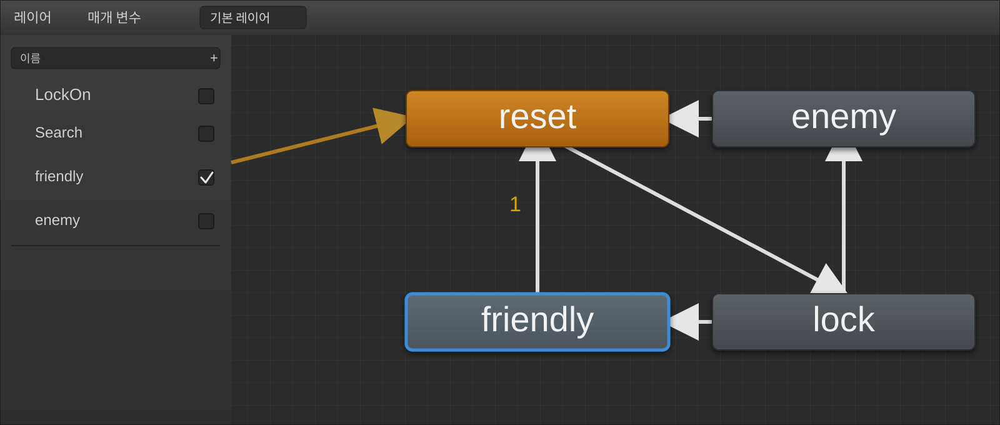

<style>
  @media print {
    .question-block { page-break-inside: avoid; break-inside: avoid; }
    pre, code { page-break-inside: avoid; font-size: 11px; }
    h2, h3 { page-break-after: avoid; }
  }
  body { font-family: 'Malgun Gothic', '맑은 고딕', sans-serif; line-height: 1.6; color: #1a1a1a; }
  pre, code {
    font-family: 'D2Coding', 'Consolas', 'Courier New', monospace;
    background-color: #f4f6f8;
    border-left: 4px solid #4a90e2;
    padding: 8px 12px;
    border-radius: 4px;
    font-size: 11.5px;
  }
  .answer-box {
    background-color: #f8f9fa;
    border: 1.5px solid #2b2b2b;
    padding: 10px 16px;
    margin-top: 12px;
    margin-bottom: 12px;
    border-radius: 6px;
  }
  .answer-box ul {
    margin: 4px 0 0 0;
    padding-left: 20px;
  }
  .answer-box li {
    margin-bottom: 6px;
  }
</style>

# 📝 Unity C# 프로그래밍 1차 평가 문제지

| 성명 | ____________________ | 학번/소속 | ____________________ |
|:---:|:--------------------|:---:|:--------------------|
| **제출일** | **2026년    월    일** | **점수** | **__________ / 100점** |

---

<div class="question-block">

## [1번] NullReferenceException (Author가 null)

**[유형: 객관식]**


### 지문

아래 C# 코드에서 `Start()`가 실행될 때 **`NullReferenceException`이 발생하는 원인**으로 가장 알맞은 것을 고르시오.

### 자료(코드)

```csharp
public class Person { public int Age { get; set; } }
public class Book { public Person Author { get; set; } }

public class PublishBook
{
    private string publisher;
    private Genre genre;

    public void Start()
    {
        Book book = new Book();
        int authorAge = book.Author.Age; // ❌ 예외 발생 지점
        Debug.Log(publisher);
        Debug.Log(genre);
    }
}
```

### 보기

A. `book`이 null이다.
B. `Age`가 null이다.
C. `publisher`가 null이라서 예외가 난다.
D. `Author`가 null이다.


<div class="answer-box">
✍️ <b>[ 답안 작성란 ]</b> &nbsp;&nbsp;➡️&nbsp;&nbsp; <b>답: [ &nbsp;&nbsp;&nbsp;&nbsp;&nbsp;&nbsp;&nbsp;&nbsp;&nbsp;&nbsp;&nbsp;&nbsp;&nbsp;&nbsp;&nbsp;&nbsp;&nbsp;&nbsp;&nbsp;&nbsp; ]</b>
</div>


</div>

---

<div class="question-block">

## [2번] Inspector 창 기본 기능 (Static / Tag / Prefab)

**[유형: 참/거짓(부분 점수)]**


### 지문

아래는 **Inspector(검사기) 창**에 대한 설명이다.

각 문장이 **참/거짓**인지 판정하시오. (문항 특성상 **각 문장별 부분 점수**가 적용될 수 있음)

### 보기(문장)

1. 정적 확인란은 개체가 정적으로 유지된다고 Unity Engine에 알리는 데 사용됩니다.
2. tag 속성은 MonoBehaviour 스크립트를 사용하여 한 번에 여러 개체를 찾는 데 사용할 수 있습니다.
3. 검사기 창은 prefab를 수정할 수 있는 기능을 제공합니다.


<div class="answer-box">
✍️ <b>[ 답안 작성란 ]</b>
<ul>
<li><b>1번 :</b> &nbsp;&nbsp;( &nbsp;&nbsp;<b>참</b> &nbsp;&nbsp;/ &nbsp;&nbsp;<b>거짓</b> &nbsp;&nbsp;)</li>
<li><b>2번 :</b> &nbsp;&nbsp;( &nbsp;&nbsp;<b>참</b> &nbsp;&nbsp;/ &nbsp;&nbsp;<b>거짓</b> &nbsp;&nbsp;)</li>
<li><b>3번 :</b> &nbsp;&nbsp;( &nbsp;&nbsp;<b>참</b> &nbsp;&nbsp;/ &nbsp;&nbsp;<b>거짓</b> &nbsp;&nbsp;)</li>
</ul>
</div>


</div>

---

<div class="question-block">

## [3번] C# 연산자 의미 매칭 (=, ==, !=, ++, +)

**[유형: 매칭(연결)]**


### 지문

아래 연산자를 알맞은 의미에 **연결**하시오.

### 자료

- [문제에 나온 연산자]  
  `=`, `==`, `!=`, `++`, `+`

- [의미 후보]  
  할당 / 같음(비교) / 같지 않음 / 증분(1 증가) / 문자열 연결


<div class="answer-box">
✍️ <b>[ 답안 작성란 ]</b>
<ul>
<li><b>`!=`</b> &nbsp;→&nbsp; [ &nbsp;&nbsp;&nbsp;&nbsp;&nbsp;&nbsp;&nbsp;&nbsp;&nbsp;&nbsp;&nbsp;&nbsp;&nbsp;&nbsp;&nbsp;&nbsp;&nbsp;&nbsp;&nbsp;&nbsp;&nbsp;&nbsp;&nbsp;&nbsp;&nbsp;&nbsp;&nbsp;&nbsp;&nbsp;&nbsp;&nbsp;&nbsp;&nbsp;&nbsp;&nbsp;&nbsp;&nbsp;&nbsp;&nbsp;&nbsp; ]</li>
<li><b>`++`</b> &nbsp;→&nbsp; [ &nbsp;&nbsp;&nbsp;&nbsp;&nbsp;&nbsp;&nbsp;&nbsp;&nbsp;&nbsp;&nbsp;&nbsp;&nbsp;&nbsp;&nbsp;&nbsp;&nbsp;&nbsp;&nbsp;&nbsp;&nbsp;&nbsp;&nbsp;&nbsp;&nbsp;&nbsp;&nbsp;&nbsp;&nbsp;&nbsp;&nbsp;&nbsp;&nbsp;&nbsp;&nbsp;&nbsp;&nbsp;&nbsp;&nbsp;&nbsp; ]</li>
<li><b>`==`</b> &nbsp;→&nbsp; [ &nbsp;&nbsp;&nbsp;&nbsp;&nbsp;&nbsp;&nbsp;&nbsp;&nbsp;&nbsp;&nbsp;&nbsp;&nbsp;&nbsp;&nbsp;&nbsp;&nbsp;&nbsp;&nbsp;&nbsp;&nbsp;&nbsp;&nbsp;&nbsp;&nbsp;&nbsp;&nbsp;&nbsp;&nbsp;&nbsp;&nbsp;&nbsp;&nbsp;&nbsp;&nbsp;&nbsp;&nbsp;&nbsp;&nbsp;&nbsp; ]</li>
<li><b>`+`</b> &nbsp;→&nbsp; [ &nbsp;&nbsp;&nbsp;&nbsp;&nbsp;&nbsp;&nbsp;&nbsp;&nbsp;&nbsp;&nbsp;&nbsp;&nbsp;&nbsp;&nbsp;&nbsp;&nbsp;&nbsp;&nbsp;&nbsp;&nbsp;&nbsp;&nbsp;&nbsp;&nbsp;&nbsp;&nbsp;&nbsp;&nbsp;&nbsp;&nbsp;&nbsp;&nbsp;&nbsp;&nbsp;&nbsp;&nbsp;&nbsp;&nbsp;&nbsp; ]</li>
<li><b>`=`</b> &nbsp;→&nbsp; [ &nbsp;&nbsp;&nbsp;&nbsp;&nbsp;&nbsp;&nbsp;&nbsp;&nbsp;&nbsp;&nbsp;&nbsp;&nbsp;&nbsp;&nbsp;&nbsp;&nbsp;&nbsp;&nbsp;&nbsp;&nbsp;&nbsp;&nbsp;&nbsp;&nbsp;&nbsp;&nbsp;&nbsp;&nbsp;&nbsp;&nbsp;&nbsp;&nbsp;&nbsp;&nbsp;&nbsp;&nbsp;&nbsp;&nbsp;&nbsp; ]</li>
</ul>
</div>


</div>

---

<div class="question-block">

## [4번] `Transform`에 없는 멤버 오류 수정하기

**[유형: 코드 빈칸 채우기(드롭다운 2단계)]**


### 지문

샘플 코드의 22~23행에서 아래 컴파일 에러가 발생합니다.

> `'Transform' does not contain a definition for 'turretMount' ...`

드롭다운에서 올바른 옵션을 선택해 **오류가 나지 않도록 배열 타입과 생성 타입을 수정**하세요.

### 자료(코드)

```csharp
using UnityEngine;

public class WeaponControl : MonoBehaviour
{
    [System.Serializable]
    public class Mount
    {
        public Transform turretMount;
        public Transform turretCache;
    }

    public ①[] tMounts = new ②[2];

    public void Start()
    {
        tMounts[0].turretMount = null;
        tMounts[1].turretMount = null;
    }
}
```

### 보기(드롭다운 후보)

- `Transform`
- `Mount`
- `GameObject`
- `WeaponControl`


<div class="answer-box">
✍️ <b>[ 답안 작성란 ]</b>
<ul>
<li><b>① :</b> &nbsp;[ &nbsp;&nbsp;&nbsp;&nbsp;&nbsp;&nbsp;&nbsp;&nbsp;&nbsp;&nbsp;&nbsp;&nbsp;&nbsp;&nbsp;&nbsp;&nbsp;&nbsp;&nbsp;&nbsp;&nbsp;&nbsp;&nbsp;&nbsp;&nbsp;&nbsp;&nbsp;&nbsp;&nbsp;&nbsp;&nbsp;&nbsp;&nbsp;&nbsp;&nbsp;&nbsp;&nbsp;&nbsp;&nbsp;&nbsp;&nbsp; ]</li>
<li><b>② :</b> &nbsp;[ &nbsp;&nbsp;&nbsp;&nbsp;&nbsp;&nbsp;&nbsp;&nbsp;&nbsp;&nbsp;&nbsp;&nbsp;&nbsp;&nbsp;&nbsp;&nbsp;&nbsp;&nbsp;&nbsp;&nbsp;&nbsp;&nbsp;&nbsp;&nbsp;&nbsp;&nbsp;&nbsp;&nbsp;&nbsp;&nbsp;&nbsp;&nbsp;&nbsp;&nbsp;&nbsp;&nbsp;&nbsp;&nbsp;&nbsp;&nbsp; ]</li>
</ul>
</div>


</div>

---

<div class="question-block">

## [5번] 코드 조각이 ECS(Entities) 라이브러리를 사용하는가?

**[유형: 참/거짓(부분 점수)]**


### 지문

아래 코드 조각이 **ECS libraries**(예: `Unity.Entities`)를 실질적으로 사용하는지 평가하시오.  
ECS를 사용하는 코드 조각은 **참**, 사용하지 않는 코드 조각은 **거짓**을 선택하시오.  
(각 문항별 **부분 점수** 가능)

### 보기(코드 조각)

#### [코드 1]

```csharp
using UnityEngine;
using System.Collections;

public class Fireball : MonoBehaviour
{
    public Rigidbody fireballPrefab;
    public Transform firePosition;
    public float fireballSpeed;
}

```

#### [코드 2]

```csharp
using Unity.Entities;
using UnityEngine;

public class ShieldComponent : MonoBehaviour
{
    public float Protection;
    public float Size;
}

```

#### [코드 3]

```csharp
using Unity.Entities;
using UnityEngine;

public class EnemyMovementSystem : ComponentSystem
{
    public Rigidbody Rigidbody;
    public InputComponent Inputcomponent;
}

```


<div class="answer-box">
✍️ <b>[ 답안 작성란 ]</b>
<ul>
<li><b>코드 1 :</b> &nbsp;&nbsp;( &nbsp;&nbsp;<b>참</b> &nbsp;&nbsp;/ &nbsp;&nbsp;<b>거짓</b> &nbsp;&nbsp;)</li>
<li><b>코드 2 :</b> &nbsp;&nbsp;( &nbsp;&nbsp;<b>참</b> &nbsp;&nbsp;/ &nbsp;&nbsp;<b>거짓</b> &nbsp;&nbsp;)</li>
<li><b>코드 3 :</b> &nbsp;&nbsp;( &nbsp;&nbsp;<b>참</b> &nbsp;&nbsp;/ &nbsp;&nbsp;<b>거짓</b> &nbsp;&nbsp;)</li>
</ul>
</div>


</div>

---

<div class="question-block">

## [6번] UI Text에 점수 표시 코드 완성하기

**[유형: 드래그&드롭(코드 조각 배치)]**


### 지문

코드 조각을 사용하여 **점수(score)를 UI 텍스트로 올바르게 표시**하세요.
올바른 코드 조각을 선택해 아래 코드의 빈칸(3곳)에 배치하여 코드를 완성하십시오.

### 자료(미완성 코드)

```csharp
using System.Collections;
using System.Collections.Generic;
using UnityEngine;

[ ① ]

public class ScoreManager : MonoBehaviour
{
    public int score = 0;

    [ ② ]

    public void Score(int points)
    {
        Debug.Log("Scored points");
        score += points;

        [ ③ ]
    }
}
```

### 드래그 토큰(선택지)

- `using UnityEngine.Text;`
- `using UnityEngine.UI;`
- `public text myText;`
- `public Text myText;`
- `myText.settext = ("Score: " + score.ToString());`
- `myText.text = ("Score: " + score.ToString());`

### 드롭존(배치 위치)

- **Z1(①)**: using 구문 추가 위치
- **Z2(②)**: UI Text 변수 선언 위치
- **Z3(③)**: 점수 갱신 후 UI 텍스트 업데이트 위치


<div class="answer-box">
✍️ <b>[ 답안 작성란 ]</b>
<ul>
<li><b>Z1(①) :</b> &nbsp;[ &nbsp;&nbsp;&nbsp;&nbsp;&nbsp;&nbsp;&nbsp;&nbsp;&nbsp;&nbsp;&nbsp;&nbsp;&nbsp;&nbsp;&nbsp;&nbsp;&nbsp;&nbsp;&nbsp;&nbsp;&nbsp;&nbsp;&nbsp;&nbsp;&nbsp;&nbsp;&nbsp;&nbsp;&nbsp;&nbsp;&nbsp;&nbsp;&nbsp;&nbsp;&nbsp;&nbsp;&nbsp;&nbsp;&nbsp;&nbsp; ]</li>
<li><b>Z2(②) :</b> &nbsp;[ &nbsp;&nbsp;&nbsp;&nbsp;&nbsp;&nbsp;&nbsp;&nbsp;&nbsp;&nbsp;&nbsp;&nbsp;&nbsp;&nbsp;&nbsp;&nbsp;&nbsp;&nbsp;&nbsp;&nbsp;&nbsp;&nbsp;&nbsp;&nbsp;&nbsp;&nbsp;&nbsp;&nbsp;&nbsp;&nbsp;&nbsp;&nbsp;&nbsp;&nbsp;&nbsp;&nbsp;&nbsp;&nbsp;&nbsp;&nbsp; ]</li>
<li><b>Z3(③) :</b> &nbsp;[ &nbsp;&nbsp;&nbsp;&nbsp;&nbsp;&nbsp;&nbsp;&nbsp;&nbsp;&nbsp;&nbsp;&nbsp;&nbsp;&nbsp;&nbsp;&nbsp;&nbsp;&nbsp;&nbsp;&nbsp;&nbsp;&nbsp;&nbsp;&nbsp;&nbsp;&nbsp;&nbsp;&nbsp;&nbsp;&nbsp;&nbsp;&nbsp;&nbsp;&nbsp;&nbsp;&nbsp;&nbsp;&nbsp;&nbsp;&nbsp; ]</li>
</ul>
</div>


</div>

---

<div class="question-block">

## [7번] 문자열 인수를 받아 UI Text를 갱신하는 메서드 선언

**[유형: 코드 빈칸 채우기(드롭다운 3단계: 반환형/메서드명/매개변수)]**


### 지문

아래 클래스에서 `OnTriggerEnter(Collider other)` 안에서 `SetMessageToDisplay("...")`를 호출하고 있습니다.
이 호출에서 전달된 **문자열 인수**를 받아 `Text` 컴포넌트의 텍스트를 설정하는 **올바른 메서드 선언**을 완성하세요.

드롭다운 목록에서 알맞은 옵션을 선택해 코드를 완성하십시오.

### 자료(코드)

```csharp
using UnityEngine;
using UnityEngine.UI;

public class UnlockGate : MonoBehaviour
{
    public Text textToDisplay;

    private void OnTriggerEnter(Collider other)
    {
        if (other.gameObject.CompareTag("Gate"))
        {
            other.gameObject.SetActive(false);
            SetMessageToDisplay("Congratulations! You have unlocked the gate!");
        }
        else
        {
            gameObject.SetActive(false);
            SetMessageToDisplay("Unfortunately, you have broken your key. You tried to unlock something other than a gate.");
        }
    }

    private [①] [②] [③]
    {
        textToDisplay.text = stringToDisplay;
    }
}
```

### 보기(드롭다운 후보 예)

- **① 반환형**: `bool`, `float`, `GameObject`, `int`, `void`
- **② 메서드명**: `setMessageToDisplay`, `SetMessageToDisplay`, `SetMessageTODisplay`, `setmessagetodisplay`
- **③ 매개변수**: `()`, `(string message)`, `(string "message")`, `(string stringToDisplay)`, `(string stringtodisplay)`, `(string messageToDisplay)`


<div class="answer-box">
✍️ <b>[ 답안 작성란 ]</b>
<ul>
<li><b>① :</b> &nbsp;[ &nbsp;&nbsp;&nbsp;&nbsp;&nbsp;&nbsp;&nbsp;&nbsp;&nbsp;&nbsp;&nbsp;&nbsp;&nbsp;&nbsp;&nbsp;&nbsp;&nbsp;&nbsp;&nbsp;&nbsp;&nbsp;&nbsp;&nbsp;&nbsp;&nbsp;&nbsp;&nbsp;&nbsp;&nbsp;&nbsp;&nbsp;&nbsp;&nbsp;&nbsp;&nbsp;&nbsp;&nbsp;&nbsp;&nbsp;&nbsp; ]</li>
<li><b>② :</b> &nbsp;[ &nbsp;&nbsp;&nbsp;&nbsp;&nbsp;&nbsp;&nbsp;&nbsp;&nbsp;&nbsp;&nbsp;&nbsp;&nbsp;&nbsp;&nbsp;&nbsp;&nbsp;&nbsp;&nbsp;&nbsp;&nbsp;&nbsp;&nbsp;&nbsp;&nbsp;&nbsp;&nbsp;&nbsp;&nbsp;&nbsp;&nbsp;&nbsp;&nbsp;&nbsp;&nbsp;&nbsp;&nbsp;&nbsp;&nbsp;&nbsp; ]</li>
<li><b>③ :</b> &nbsp;[ &nbsp;&nbsp;&nbsp;&nbsp;&nbsp;&nbsp;&nbsp;&nbsp;&nbsp;&nbsp;&nbsp;&nbsp;&nbsp;&nbsp;&nbsp;&nbsp;&nbsp;&nbsp;&nbsp;&nbsp;&nbsp;&nbsp;&nbsp;&nbsp;&nbsp;&nbsp;&nbsp;&nbsp;&nbsp;&nbsp;&nbsp;&nbsp;&nbsp;&nbsp;&nbsp;&nbsp;&nbsp;&nbsp;&nbsp;&nbsp; ]</li>
</ul>
</div>


</div>

---

<div class="question-block">

## [8번] "Hello World!"를 콘솔에 출력하는 문장

**[유형: 객관식]**


### 지문

다음 중 `"Hello World!"` 메시지를 콘솔 창에 기록하는 문장은 무엇입니까?

### 보기

A. `Debug = "Hello World!";`  
B. `Console.Log("Hello World!");`  
C. `Debug.Log("Hello World!");`  
D. `Debug.Log = "Hello World!";`


<div class="answer-box">
✍️ <b>[ 답안 작성란 ]</b> &nbsp;&nbsp;➡️&nbsp;&nbsp; <b>답: [ &nbsp;&nbsp;&nbsp;&nbsp;&nbsp;&nbsp;&nbsp;&nbsp;&nbsp;&nbsp;&nbsp;&nbsp;&nbsp;&nbsp;&nbsp;&nbsp;&nbsp;&nbsp;&nbsp;&nbsp; ]</b>
</div>


</div>

---

<div class="question-block">

## [9번] Unity 편집기 창 종류 매칭 (Hierarchy / Scene / Project / Inspector)

**[유형: 매칭(연결) / 드래그&드롭]**


### 지문

각 창의 유형을 정의와 연결하시오. (Unity 편집기 기본 UI)

### 자료(창 유형)

- 검사기 창
- 계층 구조 창
- 프로젝트 창
- 장면 창

### 자료(정의: 드롭존)

- Z1: 이 창에는 현재 장면에 있는 모든 GameObject의 목록이 포함되어 있습니다.
- Z2: 이 창은 생성 중인 세계에 대한 대화형 보기입니다.
- Z3: 이 창에서 프로젝트에 속한 자산에 액세스하고 관리할 수 있습니다.
- Z4: 이 창에는 연결된 모든 구성 요소와 해당 속성을 포함하여 현재 선택한 GameObject에 대한 세부 정보가 표시되며, 이 창에서 장면에 있는 GameObjects의 기능을 수정할 수 있습니다.


<div class="answer-box">
✍️ <b>[ 답안 작성란 ]</b>
<ul>
<li><b>Z1</b> &nbsp;→&nbsp; [ &nbsp;&nbsp;&nbsp;&nbsp;&nbsp;&nbsp;&nbsp;&nbsp;&nbsp;&nbsp;&nbsp;&nbsp;&nbsp;&nbsp;&nbsp;&nbsp;&nbsp;&nbsp;&nbsp;&nbsp;&nbsp;&nbsp;&nbsp;&nbsp;&nbsp;&nbsp;&nbsp;&nbsp;&nbsp;&nbsp;&nbsp;&nbsp;&nbsp;&nbsp;&nbsp;&nbsp;&nbsp;&nbsp;&nbsp;&nbsp; ]</li>
<li><b>Z2</b> &nbsp;→&nbsp; [ &nbsp;&nbsp;&nbsp;&nbsp;&nbsp;&nbsp;&nbsp;&nbsp;&nbsp;&nbsp;&nbsp;&nbsp;&nbsp;&nbsp;&nbsp;&nbsp;&nbsp;&nbsp;&nbsp;&nbsp;&nbsp;&nbsp;&nbsp;&nbsp;&nbsp;&nbsp;&nbsp;&nbsp;&nbsp;&nbsp;&nbsp;&nbsp;&nbsp;&nbsp;&nbsp;&nbsp;&nbsp;&nbsp;&nbsp;&nbsp; ]</li>
<li><b>Z3</b> &nbsp;→&nbsp; [ &nbsp;&nbsp;&nbsp;&nbsp;&nbsp;&nbsp;&nbsp;&nbsp;&nbsp;&nbsp;&nbsp;&nbsp;&nbsp;&nbsp;&nbsp;&nbsp;&nbsp;&nbsp;&nbsp;&nbsp;&nbsp;&nbsp;&nbsp;&nbsp;&nbsp;&nbsp;&nbsp;&nbsp;&nbsp;&nbsp;&nbsp;&nbsp;&nbsp;&nbsp;&nbsp;&nbsp;&nbsp;&nbsp;&nbsp;&nbsp; ]</li>
<li><b>Z4</b> &nbsp;→&nbsp; [ &nbsp;&nbsp;&nbsp;&nbsp;&nbsp;&nbsp;&nbsp;&nbsp;&nbsp;&nbsp;&nbsp;&nbsp;&nbsp;&nbsp;&nbsp;&nbsp;&nbsp;&nbsp;&nbsp;&nbsp;&nbsp;&nbsp;&nbsp;&nbsp;&nbsp;&nbsp;&nbsp;&nbsp;&nbsp;&nbsp;&nbsp;&nbsp;&nbsp;&nbsp;&nbsp;&nbsp;&nbsp;&nbsp;&nbsp;&nbsp; ]</li>
</ul>
</div>


</div>

---

<div class="question-block">

## [10번] null 비교가 가능한 변수 선택하기

**[유형: 드롭다운 2단계(선언 + 조건식)]**


### 지문

아래 코드에서 `null` 값을 반환(가질) 수 있는 **올바른 데이터 타입/변수 선언**을 선택해 코드를 완성한 뒤,
드롭다운 목록에서 콘솔에 `"Object is null"` 메시지를 기록하게 만드는 **올바른 변수 이름**을 선택하세요.

### 자료(코드)

```csharp
[드롭다운 ①: 변수 선언]

void Start()
{
    if ([드롭다운 ②])
    {
        Debug.Log("Object is null");
    }
    else
    {
        projectile = GameObject.FindWithTag("Projectile");
    }
}
```

### 보기

**드롭다운 ① (변수 선언)**

- `public bool hasTurned;`
- `public GameObject projectile;`
- `public int score;`

**드롭다운 ② (조건식)**

- `(projectile == null)`
- `(hasTurned == null)`
- `(score == null)`


<div class="answer-box">
✍️ <b>[ 답안 작성란 ]</b>
<ul>
<li><b>드롭다운 ① :</b> &nbsp;[ &nbsp;&nbsp;&nbsp;&nbsp;&nbsp;&nbsp;&nbsp;&nbsp;&nbsp;&nbsp;&nbsp;&nbsp;&nbsp;&nbsp;&nbsp;&nbsp;&nbsp;&nbsp;&nbsp;&nbsp;&nbsp;&nbsp;&nbsp;&nbsp;&nbsp;&nbsp;&nbsp;&nbsp;&nbsp;&nbsp;&nbsp;&nbsp;&nbsp;&nbsp;&nbsp;&nbsp;&nbsp;&nbsp;&nbsp;&nbsp; ]</li>
<li><b>드롭다운 ② :</b> &nbsp;[ &nbsp;&nbsp;&nbsp;&nbsp;&nbsp;&nbsp;&nbsp;&nbsp;&nbsp;&nbsp;&nbsp;&nbsp;&nbsp;&nbsp;&nbsp;&nbsp;&nbsp;&nbsp;&nbsp;&nbsp;&nbsp;&nbsp;&nbsp;&nbsp;&nbsp;&nbsp;&nbsp;&nbsp;&nbsp;&nbsp;&nbsp;&nbsp;&nbsp;&nbsp;&nbsp;&nbsp;&nbsp;&nbsp;&nbsp;&nbsp; ]</li>
</ul>
</div>


</div>

---

<div class="question-block">

## [11번] rb 변수의 올바른 타입 선택하기

**[유형: 코드 빈칸 채우기(드롭다운)]**


### 지문

다음 코드 예제에서 `"Cannot implicitly convert type"` 오류를 방지하기 위해 `rb` 변수를 선언할 **적절한 데이터 형식**을 고르세요.
드롭다운 목록에서 정답을 선택하여 코드를 완성하세요.

### 자료(코드)

```csharp
using UnityEngine;
using System.Collections;

public class ExampleClass : MonoBehaviour
{
    public Vector3 teleportPoint;
    public [데이터 타입] rb;

    void Start()
    {
        rb = GetComponent<Rigidbody>();
    }

    void FixedUpdate()
    {
        rb.MovePosition(transform.position + transform.forward * Time.deltaTime);
    }
}
```

### 보기(드롭다운 후보)

- `Vector3`
- `Collider`
- `RigidBody`
- `CharacterController`


<div class="answer-box">
✍️ <b>[ 답안 작성란 ]</b>
<ul>
<li><b>데이터 타입 :</b> &nbsp;[ &nbsp;&nbsp;&nbsp;&nbsp;&nbsp;&nbsp;&nbsp;&nbsp;&nbsp;&nbsp;&nbsp;&nbsp;&nbsp;&nbsp;&nbsp;&nbsp;&nbsp;&nbsp;&nbsp;&nbsp;&nbsp;&nbsp;&nbsp;&nbsp;&nbsp;&nbsp;&nbsp;&nbsp;&nbsp;&nbsp;&nbsp;&nbsp;&nbsp;&nbsp;&nbsp;&nbsp;&nbsp;&nbsp;&nbsp;&nbsp; ]</li>
</ul>
</div>


</div>

---

<div class="question-block">

## [12번] OR 조건으로 보너스 처리

**[유형: 코드 빈칸 채우기(텍스트 입력)]**


### 지문

코인이 `extralife`와 같거나 `bonus`와 같으면 `lives`가 1 증가하고 `score`가 1000 증가하도록 코드를 완성하세요.
빈칸(텍스트 상자)에 들어갈 **필요한 문자**를 입력해 조건식을 완성하면 됩니다.

### 자료(코드)

```csharp
if (coins [ ① ] extralife [ ② ] coins [ ③ ] bonus)
{
    lives += 1;
    score += 1000;
}
```


<div class="answer-box">
✍️ <b>[ 답안 작성란 ]</b>
<ul>
<li><b>① :</b> &nbsp;[ &nbsp;&nbsp;&nbsp;&nbsp;&nbsp;&nbsp;&nbsp;&nbsp;&nbsp;&nbsp;&nbsp;&nbsp;&nbsp;&nbsp;&nbsp;&nbsp;&nbsp;&nbsp;&nbsp;&nbsp;&nbsp;&nbsp;&nbsp;&nbsp;&nbsp;&nbsp;&nbsp;&nbsp;&nbsp;&nbsp;&nbsp;&nbsp;&nbsp;&nbsp;&nbsp;&nbsp;&nbsp;&nbsp;&nbsp;&nbsp; ]</li>
<li><b>② :</b> &nbsp;[ &nbsp;&nbsp;&nbsp;&nbsp;&nbsp;&nbsp;&nbsp;&nbsp;&nbsp;&nbsp;&nbsp;&nbsp;&nbsp;&nbsp;&nbsp;&nbsp;&nbsp;&nbsp;&nbsp;&nbsp;&nbsp;&nbsp;&nbsp;&nbsp;&nbsp;&nbsp;&nbsp;&nbsp;&nbsp;&nbsp;&nbsp;&nbsp;&nbsp;&nbsp;&nbsp;&nbsp;&nbsp;&nbsp;&nbsp;&nbsp; ]</li>
<li><b>③ :</b> &nbsp;[ &nbsp;&nbsp;&nbsp;&nbsp;&nbsp;&nbsp;&nbsp;&nbsp;&nbsp;&nbsp;&nbsp;&nbsp;&nbsp;&nbsp;&nbsp;&nbsp;&nbsp;&nbsp;&nbsp;&nbsp;&nbsp;&nbsp;&nbsp;&nbsp;&nbsp;&nbsp;&nbsp;&nbsp;&nbsp;&nbsp;&nbsp;&nbsp;&nbsp;&nbsp;&nbsp;&nbsp;&nbsp;&nbsp;&nbsp;&nbsp; ]</li>
</ul>
</div>


</div>

---

<div class="question-block">

## [13번] Inspector에서 변수 안 보이는 이유

**[유형: 객관식]**


### 지문

스크립트를 생성했고 검사기(Inspector)에서 `playerName` 값을 편집하려고 했지만 항목이 보이지 않습니다.
아래 코드 상황에서 **Inspector에 `playerName`이 표시되지 않는 이유**를 가장 잘 설명하는 옵션을 고르세요.

### 자료(코드)

```csharp
using UnityEngine;
using System.Collections;

private class PlayerOne : MonoBehaviour
{
    private string playerName;

    void Start()
    {
        Debug.Log("This world will be saved by " + playerName);
    }
}
```

### 보기

- A. 검사기에서 스크립트 옵션을 토글 방식으로 켜야 합니다.
- B. `playerName`을 `public` 변수로 선언해야 합니다.
- C. 검사기에서 객체를 보려면 먼저 객체에 대한 스크립트를 성공적으로 실행해야 합니다.
- D. 검사기에서 변수를 편집할 수 없습니다.


<div class="answer-box">
✍️ <b>[ 답안 작성란 ]</b> &nbsp;&nbsp;➡️&nbsp;&nbsp; <b>답: [ &nbsp;&nbsp;&nbsp;&nbsp;&nbsp;&nbsp;&nbsp;&nbsp;&nbsp;&nbsp;&nbsp;&nbsp;&nbsp;&nbsp;&nbsp;&nbsp;&nbsp;&nbsp;&nbsp;&nbsp; ]</b>
</div>


</div>

---

<div class="question-block">

## [14번] 자식 Transform들을 배열로 반환하기

**[유형: 코드 빈칸 채우기(드롭다운)]**


### 지문

아래 코드 조각을 확인한 뒤, 메서드 `GetChildren(Transform tr)`가 **어떤 타입을 반환해야 하는지** 결정하세요.
드롭다운 목록에서 올바른 반환 타입을 선택해 코드를 완성하십시오.

### 자료(코드)

```csharp
public [반환 타입] GetChildren(Transform tr)
{
    int childCount = tr.childCount;
    Transform[] result = new Transform[childCount];

    for (int i = 0; i < childCount; ++i)
    {
        result[i] = tr.GetChild(i);
    }

    return result;
}
```

### 보기(드롭다운 후보)

- `Transform`
- `List<Transform>`
- `Transform[]`
- `void`


<div class="answer-box">
✍️ <b>[ 답안 작성란 ]</b>
<ul>
<li><b>반환 타입 :</b> &nbsp;[ &nbsp;&nbsp;&nbsp;&nbsp;&nbsp;&nbsp;&nbsp;&nbsp;&nbsp;&nbsp;&nbsp;&nbsp;&nbsp;&nbsp;&nbsp;&nbsp;&nbsp;&nbsp;&nbsp;&nbsp;&nbsp;&nbsp;&nbsp;&nbsp;&nbsp;&nbsp;&nbsp;&nbsp;&nbsp;&nbsp;&nbsp;&nbsp;&nbsp;&nbsp;&nbsp;&nbsp;&nbsp;&nbsp;&nbsp;&nbsp; ]</li>
</ul>
</div>


</div>

---

<div class="question-block">

## [15번] Animator 점프 상태에 클립 배치하기

**[유형: 드래그&드롭(그래픽 매칭)]**


### 지문

캐릭터의 점프 애니메이션 컨트롤러를 구성하려고 합니다.

- 점프는 **Slow Jump** / **Fast Jump** 두 종류가 있습니다.
- 점프 전에는 **Idle** 애니메이션 1개만 사용합니다.
- 점프 정점(최고점) 구간은 **JumpApex** 애니메이션 1개만 사용합니다.
- 제공된 애니메이션 클립을 선택하여, 그래프의 알맞은 상태(State)에 배치해 상태 시스템을 완성하세요.



### 드래그 토큰(제공 클립)

- `JumpApex`
- `SlowFall`
- `FastFall`
- `FastLand`

### 드롭존(배치 위치)

- **Z1: JumpApex 상태(가운데, Slow Jump / Fast Jump 아래에 공통으로 연결되는 정점 상태)**
- **Z2: SlowFall 상태(왼쪽 낙하 상태, JumpApex 이후 왼쪽 가지)**
- **Z3: FastFall 상태(오른쪽 낙하 상태, JumpApex 이후 오른쪽 가지)**
- **Z4: FastLand 상태(오른쪽 착지 상태, FastFall 아래)**


<div class="answer-box">
✍️ <b>[ 답안 작성란 ]</b>
<ul>
<li><b>Z1 :</b> &nbsp;[ &nbsp;&nbsp;&nbsp;&nbsp;&nbsp;&nbsp;&nbsp;&nbsp;&nbsp;&nbsp;&nbsp;&nbsp;&nbsp;&nbsp;&nbsp;&nbsp;&nbsp;&nbsp;&nbsp;&nbsp;&nbsp;&nbsp;&nbsp;&nbsp;&nbsp;&nbsp;&nbsp;&nbsp;&nbsp;&nbsp;&nbsp;&nbsp;&nbsp;&nbsp;&nbsp;&nbsp;&nbsp;&nbsp;&nbsp;&nbsp; ]</li>
<li><b>Z2 :</b> &nbsp;[ &nbsp;&nbsp;&nbsp;&nbsp;&nbsp;&nbsp;&nbsp;&nbsp;&nbsp;&nbsp;&nbsp;&nbsp;&nbsp;&nbsp;&nbsp;&nbsp;&nbsp;&nbsp;&nbsp;&nbsp;&nbsp;&nbsp;&nbsp;&nbsp;&nbsp;&nbsp;&nbsp;&nbsp;&nbsp;&nbsp;&nbsp;&nbsp;&nbsp;&nbsp;&nbsp;&nbsp;&nbsp;&nbsp;&nbsp;&nbsp; ]</li>
<li><b>Z3 :</b> &nbsp;[ &nbsp;&nbsp;&nbsp;&nbsp;&nbsp;&nbsp;&nbsp;&nbsp;&nbsp;&nbsp;&nbsp;&nbsp;&nbsp;&nbsp;&nbsp;&nbsp;&nbsp;&nbsp;&nbsp;&nbsp;&nbsp;&nbsp;&nbsp;&nbsp;&nbsp;&nbsp;&nbsp;&nbsp;&nbsp;&nbsp;&nbsp;&nbsp;&nbsp;&nbsp;&nbsp;&nbsp;&nbsp;&nbsp;&nbsp;&nbsp; ]</li>
<li><b>Z4 :</b> &nbsp;[ &nbsp;&nbsp;&nbsp;&nbsp;&nbsp;&nbsp;&nbsp;&nbsp;&nbsp;&nbsp;&nbsp;&nbsp;&nbsp;&nbsp;&nbsp;&nbsp;&nbsp;&nbsp;&nbsp;&nbsp;&nbsp;&nbsp;&nbsp;&nbsp;&nbsp;&nbsp;&nbsp;&nbsp;&nbsp;&nbsp;&nbsp;&nbsp;&nbsp;&nbsp;&nbsp;&nbsp;&nbsp;&nbsp;&nbsp;&nbsp; ]</li>
</ul>
</div>


</div>

---

<div class="question-block">

## [16번] OnMouseUp으로 UI 패널 토글 함수 만들기

**[유형: 드래그&드롭(코드 조각 배치)]**


### 지문

게임 오브젝트(패널)를 **켜거나/끄는 함수(이 스크립트에서만 사용 가능)**를 만들어 달라는 요청을 받았습니다.
이 오브젝트는 장면에 있는 3D 오브젝트를 **마우스로 클릭**했을 때 토글 방식으로 제어됩니다.

아래 코드에서 메서드 선언부의 빈칸 3개에 들어갈 **올바른 코드 조각**을 선택해 배치하세요.

### 자료(코드)

```csharp
using UnityEngine;

public class TurnOnDisplay : MonoBehaviour
{
    public GameObject displayPane;

    private void Start()
    {
        displayPane.SetActive(false);
    }

    [ ① ] [ ② ] [ ③ ]
    {
        if (displayPane.activeInHierarchy == false)
        {
            displayPane.SetActive(true);
        }
        else
        {
            displayPane.SetActive(false);
        }
    }
}
```

### 드래그 토큰(선택지)

- `public`
- `private`
- `void`
- `MouseInfo`
- `OnMouseEnter()`
- `OnMouseUp()`

### 드롭존(배치 위치)

- Z1(①): 접근 제한자
- Z2(②): 반환형
- Z3(③): 메서드 이름


<div class="answer-box">
✍️ <b>[ 답안 작성란 ]</b>
<ul>
<li><b>Z1(①) :</b> &nbsp;[ &nbsp;&nbsp;&nbsp;&nbsp;&nbsp;&nbsp;&nbsp;&nbsp;&nbsp;&nbsp;&nbsp;&nbsp;&nbsp;&nbsp;&nbsp;&nbsp;&nbsp;&nbsp;&nbsp;&nbsp;&nbsp;&nbsp;&nbsp;&nbsp;&nbsp;&nbsp;&nbsp;&nbsp;&nbsp;&nbsp;&nbsp;&nbsp;&nbsp;&nbsp;&nbsp;&nbsp;&nbsp;&nbsp;&nbsp;&nbsp; ]</li>
<li><b>Z2(②) :</b> &nbsp;[ &nbsp;&nbsp;&nbsp;&nbsp;&nbsp;&nbsp;&nbsp;&nbsp;&nbsp;&nbsp;&nbsp;&nbsp;&nbsp;&nbsp;&nbsp;&nbsp;&nbsp;&nbsp;&nbsp;&nbsp;&nbsp;&nbsp;&nbsp;&nbsp;&nbsp;&nbsp;&nbsp;&nbsp;&nbsp;&nbsp;&nbsp;&nbsp;&nbsp;&nbsp;&nbsp;&nbsp;&nbsp;&nbsp;&nbsp;&nbsp; ]</li>
<li><b>Z3(③) :</b> &nbsp;[ &nbsp;&nbsp;&nbsp;&nbsp;&nbsp;&nbsp;&nbsp;&nbsp;&nbsp;&nbsp;&nbsp;&nbsp;&nbsp;&nbsp;&nbsp;&nbsp;&nbsp;&nbsp;&nbsp;&nbsp;&nbsp;&nbsp;&nbsp;&nbsp;&nbsp;&nbsp;&nbsp;&nbsp;&nbsp;&nbsp;&nbsp;&nbsp;&nbsp;&nbsp;&nbsp;&nbsp;&nbsp;&nbsp;&nbsp;&nbsp; ]</li>
</ul>
</div>


</div>

---

<div class="question-block">

## [17번] Unity/C# 명명 규칙 판별하기

**[유형: 참/거짓(T/F) — 문항별 선택]**


### 지문

아래 코드 조각(1~3) 각각을 보고, **Unity/C# 명명 규칙을 잘 지킨 코드면 ‘참’**, 그렇지 않으면 **‘거짓’**을 선택하세요.

### 자료(코드 조각 1)

```csharp
public class playerScript : Monobehaviour {
    public light playerLight;

    void playerfunction () {
        playerlight.Enabled = !playerlight.Enabled;
    }
}
```

### 자료(코드 조각 2)

```csharp
Public Class playerScript : MonoBehaviour {
    Public Light PlayerLight;

    Void PlayerFunction () {
        PlayerLight.Enabled = !PlayerLight.Enabled;
    }
}
```

### 자료(코드 조각 3)

```csharp
public class PlayerScript : MonoBehaviour {
    public Light playerLight;

    void PlayerFunction () {
        playerLight.enabled = !playerLight.enabled;
    }
}
```


<div class="answer-box">
✍️ <b>[ 답안 작성란 ]</b>
<ul>
<li><b>코드 조각 1 :</b> &nbsp;&nbsp;( &nbsp;&nbsp;<b>참</b> &nbsp;&nbsp;/ &nbsp;&nbsp;<b>거짓</b> &nbsp;&nbsp;)</li>
<li><b>코드 조각 2 :</b> &nbsp;&nbsp;( &nbsp;&nbsp;<b>참</b> &nbsp;&nbsp;/ &nbsp;&nbsp;<b>거짓</b> &nbsp;&nbsp;)</li>
<li><b>코드 조각 3 :</b> &nbsp;&nbsp;( &nbsp;&nbsp;<b>참</b> &nbsp;&nbsp;/ &nbsp;&nbsp;<b>거짓</b> &nbsp;&nbsp;)</li>
</ul>
</div>


</div>

---

<div class="question-block">

## [18번] Unity에서 사용할 IDE 선택하기

**[유형: 객관식]**


### 지문

다음 중 **Unity와 함께 사용할 IDE(스크립트 편집기)** 를 선택할 수 있는 옵션은 무엇입니까?
(Unity 설정 화면에서 스크립트 편집기를 지정하는 항목을 고르세요.)

### 보기

- A. **External Script Editor**
- B. Image application
- C. Revision Control Diff/Merge
- D. Editor Attaching


<div class="answer-box">
✍️ <b>[ 답안 작성란 ]</b> &nbsp;&nbsp;➡️&nbsp;&nbsp; <b>답: [ &nbsp;&nbsp;&nbsp;&nbsp;&nbsp;&nbsp;&nbsp;&nbsp;&nbsp;&nbsp;&nbsp;&nbsp;&nbsp;&nbsp;&nbsp;&nbsp;&nbsp;&nbsp;&nbsp;&nbsp; ]</b>
</div>


</div>

---

<div class="question-block">

## [19번] Random.Range 범위 주석 고르기

**[유형: 객관식]**


### 지문

아래 코드 조각에 대한 **올바른 주석**을 고르세요.

### 자료(코드)

```csharp
// int day = Random.Range(1, 31);
```

### 보기

- A. `// 1부터 32까지 범위의 숫자를 생성`
- B. `// 날짜 정수를 받올림 수로 변경`
- C. `// 최대 32에 도달할 때까지 날짜를 1씩 증가`
- D. `// 1부터 30까지 범위의 숫자를 생성`


<div class="answer-box">
✍️ <b>[ 답안 작성란 ]</b> &nbsp;&nbsp;➡️&nbsp;&nbsp; <b>답: [ &nbsp;&nbsp;&nbsp;&nbsp;&nbsp;&nbsp;&nbsp;&nbsp;&nbsp;&nbsp;&nbsp;&nbsp;&nbsp;&nbsp;&nbsp;&nbsp;&nbsp;&nbsp;&nbsp;&nbsp; ]</b>
</div>


</div>

---

<div class="question-block">

## [20번] Color 변수 값을 Debug.Log로 출력하기

**[유형: 코드 빈칸 채우기(드롭다운)]**


### 지문

아래 `Player` 클래스의 `color` 변수 값을 콘솔에 다음과 같이 출력하려고 합니다.

- 출력 예: `Color: (0.258,0.525,0.956,1)`

드롭다운 목록에서 올바른 옵션을 선택해 `Debug.Log` 코드를 완성하세요.

### 자료(코드)

```csharp
using UnityEngine;

public class Player : MonoBehaviour
{
    public Color color;

    public void Start()
    {
        // 로그가 여기에 표시됩니다.
    }
}
```


<div class="answer-box">
✍️ <b>[ 답안 작성란 ]</b>
<ul>
<li><b>```csharp :</b> &nbsp;[ &nbsp;&nbsp;&nbsp;&nbsp;&nbsp;&nbsp;&nbsp;&nbsp;&nbsp;&nbsp;&nbsp;&nbsp;&nbsp;&nbsp;&nbsp;&nbsp;&nbsp;&nbsp;&nbsp;&nbsp;&nbsp;&nbsp;&nbsp;&nbsp;&nbsp;&nbsp;&nbsp;&nbsp;&nbsp;&nbsp;&nbsp;&nbsp; ]</li>
<li><b>Debug.Log("Color :</b> &nbsp;[ &nbsp;&nbsp;&nbsp;&nbsp;&nbsp;&nbsp;&nbsp;&nbsp;&nbsp;&nbsp;&nbsp;&nbsp;&nbsp;&nbsp;&nbsp;&nbsp;&nbsp;&nbsp;&nbsp;&nbsp;&nbsp;&nbsp;&nbsp;&nbsp;&nbsp;&nbsp;&nbsp;&nbsp;&nbsp;&nbsp;&nbsp;&nbsp;&nbsp;&nbsp;&nbsp;&nbsp;&nbsp;&nbsp;&nbsp;&nbsp; ]</li>
<li><b>``` :</b> &nbsp;[ &nbsp;&nbsp;&nbsp;&nbsp;&nbsp;&nbsp;&nbsp;&nbsp;&nbsp;&nbsp;&nbsp;&nbsp;&nbsp;&nbsp;&nbsp;&nbsp;&nbsp;&nbsp;&nbsp;&nbsp;&nbsp;&nbsp;&nbsp;&nbsp;&nbsp;&nbsp;&nbsp;&nbsp;&nbsp;&nbsp;&nbsp;&nbsp; ]</li>
</ul>
</div>


### 보기(드롭다운 후보)

- `color`
- `Color`
- `new Color(Color.Red)`
- `(0.258,0.525,0.956,1)`


<div class="answer-box">
✍️ <b>[ 답안 작성란 ]</b>
<ul>
<li><b>드롭다운 :</b> &nbsp;[ &nbsp;&nbsp;&nbsp;&nbsp;&nbsp;&nbsp;&nbsp;&nbsp;&nbsp;&nbsp;&nbsp;&nbsp;&nbsp;&nbsp;&nbsp;&nbsp;&nbsp;&nbsp;&nbsp;&nbsp;&nbsp;&nbsp;&nbsp;&nbsp;&nbsp;&nbsp;&nbsp;&nbsp;&nbsp;&nbsp;&nbsp;&nbsp;&nbsp;&nbsp;&nbsp;&nbsp;&nbsp;&nbsp;&nbsp;&nbsp; ]</li>
</ul>
</div>


</div>

---

<div class="question-block">

## [21번] Unity 명명 규칙 판별하기 2

**[유형: 참/거짓(T/F) — 코드 조각별 선택]**


### 지문

아래 코드 조각(1~3) 각각을 보고, **Unity/C# 명명 규칙(대소문자 포함)을 잘 지킨 코드면 ‘참’**, 그렇지 않으면 **‘거짓’**을 선택하세요.

### 자료(코드 조각 1)

```csharp
public class PlaySoundEffect : MonoBehaviour {

    public AudioSource enteringSound;
    public AudioSource leavingSound;

}
```

### 자료(코드 조각 2)

```csharp
private void ontriggerenter(Collider Other)
{
    if (Other.compareTag("Player"))
    {
        PlaySound(enteringSound);
    }
}
```

### 자료(코드 조각 3)

```csharp
private void OnTriggerExit(Collider other)
{
    if (other.CompareTag("Player"))
    {
        PlaySound(leavingSound);
    }
}
```


<div class="answer-box">
✍️ <b>[ 답안 작성란 ]</b>
<ul>
<li><b>코드 조각 1 :</b> &nbsp;&nbsp;( &nbsp;&nbsp;<b>참</b> &nbsp;&nbsp;/ &nbsp;&nbsp;<b>거짓</b> &nbsp;&nbsp;)</li>
<li><b>코드 조각 2 :</b> &nbsp;&nbsp;( &nbsp;&nbsp;<b>참</b> &nbsp;&nbsp;/ &nbsp;&nbsp;<b>거짓</b> &nbsp;&nbsp;)</li>
<li><b>코드 조각 3 :</b> &nbsp;&nbsp;( &nbsp;&nbsp;<b>참</b> &nbsp;&nbsp;/ &nbsp;&nbsp;<b>거짓</b> &nbsp;&nbsp;)</li>
</ul>
</div>


</div>

---

<div class="question-block">

## [22번] Unity Transform로 간단 이동 구현하기

**[유형: 코드 빈칸 채우기(드롭다운)]**


### 지문

GameObject의 `transform` 구성 요소를 사용해 **간단한 이동 스크립트**를 완성하려고 합니다.
아래 API 정의를 참고하여, 코드의 빈칸(`transform.____( … );`)에 들어갈 **올바른 메서드**를 드롭다운에서 선택하세요.

### 자료(API 정의)

- `public void SetPositionAndRotation(Vector3 position, Quaternion rotation);`
- `public Vector3 TransformDirection(Vector3 direction);`
- `public Vector3 TransformVector(Vector3 vector);`
- `public void Translate(Vector3 translation);`

### 자료(코드)

```csharp
using UnityEngine;

public class ExampleScript : MonoBehaviour
{
    public float speed = 20f;
    private Vector3 move;

    private void Update()
    {
        move = new Vector3(Input.GetAxis("Horizontal"), 0f, Input.GetAxis("Vertical"));

        transform.[드롭다운] (move * Time.deltaTime * speed);
    }
}
```

### 보기(드롭다운 후보)

- `TransformVector`
- `SetPositionAndRotation`
- `Translate`
- `TransformDirection`


<div class="answer-box">
✍️ <b>[ 답안 작성란 ]</b>
<ul>
<li><b>드롭다운 :</b> &nbsp;[ &nbsp;&nbsp;&nbsp;&nbsp;&nbsp;&nbsp;&nbsp;&nbsp;&nbsp;&nbsp;&nbsp;&nbsp;&nbsp;&nbsp;&nbsp;&nbsp;&nbsp;&nbsp;&nbsp;&nbsp;&nbsp;&nbsp;&nbsp;&nbsp;&nbsp;&nbsp;&nbsp;&nbsp;&nbsp;&nbsp;&nbsp;&nbsp;&nbsp;&nbsp;&nbsp;&nbsp;&nbsp;&nbsp;&nbsp;&nbsp; ]</li>
</ul>
</div>


</div>

---

<div class="question-block">

## [23번] 풀링된 발사체 초기화와 Trigger 충돌 이벤트 선택

**[유형: 드래그&드롭(이벤트 함수 배치)]**


### 지문

프로젝트 장르는 탑다운 아케이드입니다. 플레이어가 발사하는 **발사체 프리팹**에는 `IsTrigger = true`로 설정된 `Collider`가 있습니다.

이 발사체는 `Instantiate`로 생성되지 않고 **장면에 Pool**되어 있다가 사용됩니다.
따라서 **풀에서 꺼낼 때 필요한 초기화**가 필요하며, 충돌 처리도 Trigger 방식으로 동작해야 합니다.

아래 코드에서 빈칸 2곳에 들어갈 **올바른 이벤트/함수 이름**을 선택해 배치하세요.
(코드는 발사체 프리팹에 붙어 있으며, 플레이어 오브젝트에 붙어 있지 않습니다.)

### 자료(코드)

```csharp
using UnityEngine;

public class Projectile : MonoBehaviour
{
    private PowerUpManagement PUManage;
    private MeshRenderer meshRenderer;
    private Material instancedMaterial;
    public Color initialColor;

    private bool isAlive = true;
    public int penetration = 1;

    private void [ ① ] ()
    {
        PUManage = GameObject.Find("PowerUp_Manager").GetComponent<PowerUpManagement>();
        meshRenderer = GetComponentInChildren<MeshRenderer>();
        instancedMaterial = meshRenderer.material;
        instancedMaterial.SetColor("_TintColor", initialColor);
    }

    private void [ ② ] (Collider other)
    {
        if (isAlive && other.tag != "Player" && other.tag != "CULL")
        {
            isAlive = false;
            PoolManager.Pool["Projectile"].Despawn(transform, penetration);
        }
    }
}
```

### 드래그 토큰(선택지)

- `Init`
- `Start`
- `Update`
- `FixedUpdate`
- `OnTriggerEnter`
- `OnCollisionEnter`

### 드롭존(배치 위치)

- **Z1(①): 초기화 함수 이름(매개변수 없음)**
- **Z2(②): 충돌 이벤트 함수 이름(`Collider other`)**


<div class="answer-box">
✍️ <b>[ 답안 작성란 ]</b>
<ul>
<li><b>Z1(①) :</b> &nbsp;[ &nbsp;&nbsp;&nbsp;&nbsp;&nbsp;&nbsp;&nbsp;&nbsp;&nbsp;&nbsp;&nbsp;&nbsp;&nbsp;&nbsp;&nbsp;&nbsp;&nbsp;&nbsp;&nbsp;&nbsp;&nbsp;&nbsp;&nbsp;&nbsp;&nbsp;&nbsp;&nbsp;&nbsp;&nbsp;&nbsp;&nbsp;&nbsp;&nbsp;&nbsp;&nbsp;&nbsp;&nbsp;&nbsp;&nbsp;&nbsp; ]</li>
<li><b>Z2(②) :</b> &nbsp;[ &nbsp;&nbsp;&nbsp;&nbsp;&nbsp;&nbsp;&nbsp;&nbsp;&nbsp;&nbsp;&nbsp;&nbsp;&nbsp;&nbsp;&nbsp;&nbsp;&nbsp;&nbsp;&nbsp;&nbsp;&nbsp;&nbsp;&nbsp;&nbsp;&nbsp;&nbsp;&nbsp;&nbsp;&nbsp;&nbsp;&nbsp;&nbsp;&nbsp;&nbsp;&nbsp;&nbsp;&nbsp;&nbsp;&nbsp;&nbsp; ]</li>
</ul>
</div>


</div>

---

<div class="question-block">

## [24번] Unity Rigidbody.AddForce로 바라보는 방향 이동

**[유형: 코드 빈칸 채우기(드롭다운 2개)]**


### 지문

이 문제를 해결하려면 **벡터 값과 숫자 값을 곱해 `AddForce`에 전달**해야 합니다.

- GameObject에 연결된 `Rigidbody`에 **힘을 가해 이동**해야 합니다.
- 개체가 **현재 바라보는 방향**으로 이동해야 합니다.
- 힘의 크기는 **Inspector에서 설정할 수 있는 값**을 사용해야 합니다.

드롭다운 목록에서 올바른 옵션을 선택해 코드를 완성하세요.

### 자료(코드)

```csharp
using UnityEngine;

public class MovingThings : MonoBehaviour
{
    private float speedOfMotion;
    public float speedForce;
    private static float forceSpeed = 10f;
    private Rigidbody rigidBody;

    void Start()
    {
        speedOfMotion = 10f;
        rigidBody = gameObject.GetComponent<Rigidbody>();
    }

    void FixedUpdate()
    {
        rigidBody.AddForce( [①] * [②] );
    }
}
```

### 보기(드롭다운 후보)

- **① (방향/벡터)**
  - `Vector2.facing`
  - `120`
  - `transform.forward`

- **② (힘의 크기/숫자)**
  - `speedOfMotion`
  - `speedForce`
  - `forceSpeed`


<div class="answer-box">
✍️ <b>[ 답안 작성란 ]</b>
<ul>
<li><b>① :</b> &nbsp;[ &nbsp;&nbsp;&nbsp;&nbsp;&nbsp;&nbsp;&nbsp;&nbsp;&nbsp;&nbsp;&nbsp;&nbsp;&nbsp;&nbsp;&nbsp;&nbsp;&nbsp;&nbsp;&nbsp;&nbsp;&nbsp;&nbsp;&nbsp;&nbsp;&nbsp;&nbsp;&nbsp;&nbsp;&nbsp;&nbsp;&nbsp;&nbsp;&nbsp;&nbsp;&nbsp;&nbsp;&nbsp;&nbsp;&nbsp;&nbsp; ]</li>
<li><b>② :</b> &nbsp;[ &nbsp;&nbsp;&nbsp;&nbsp;&nbsp;&nbsp;&nbsp;&nbsp;&nbsp;&nbsp;&nbsp;&nbsp;&nbsp;&nbsp;&nbsp;&nbsp;&nbsp;&nbsp;&nbsp;&nbsp;&nbsp;&nbsp;&nbsp;&nbsp;&nbsp;&nbsp;&nbsp;&nbsp;&nbsp;&nbsp;&nbsp;&nbsp;&nbsp;&nbsp;&nbsp;&nbsp;&nbsp;&nbsp;&nbsp;&nbsp; ]</li>
</ul>
</div>


</div>

---

<div class="question-block">

## [25번] 함수 설명의 참/거짓 판별

**[유형: 참/거짓(T/F) — 문장별 선택]**


### 지문

다음은 **함수(메서드)**에 대한 설명입니다. 각 문장이 **참인지 거짓인지** 선택하세요.
(참고: 각 정답에 대해 부분 크레딧이 적립될 수 있습니다.)

### 문항

1. `void` 키워드는 함수가 **null 값을 반환**한다는 것을 나타냅니다.
2. 두 개 이상 **다른 유형**의 매개변수를 함수에 전달할 수 있습니다.
3. 먼저 함수를 호출하지 않으면 함수가 실행되지 않습니다.
4. 값을 반환하는 함수는 `return` 키워드를 사용해야 합니다.


<div class="answer-box">
✍️ <b>[ 답안 작성란 ]</b>
<ul>
<li><b>1. :</b> &nbsp;&nbsp;( &nbsp;&nbsp;<b>참</b> &nbsp;&nbsp;/ &nbsp;&nbsp;<b>거짓</b> &nbsp;&nbsp;)</li>
<li><b>2. :</b> &nbsp;&nbsp;( &nbsp;&nbsp;<b>참</b> &nbsp;&nbsp;/ &nbsp;&nbsp;<b>거짓</b> &nbsp;&nbsp;)</li>
<li><b>3. :</b> &nbsp;&nbsp;( &nbsp;&nbsp;<b>참</b> &nbsp;&nbsp;/ &nbsp;&nbsp;<b>거짓</b> &nbsp;&nbsp;)</li>
<li><b>4. :</b> &nbsp;&nbsp;( &nbsp;&nbsp;<b>참</b> &nbsp;&nbsp;/ &nbsp;&nbsp;<b>거짓</b> &nbsp;&nbsp;)</li>
</ul>
</div>


</div>

---

<div class="question-block">

## [26번] 소품(Prop) 데이터 읽기 + 손(Transform)에 장착하기

**[유형: 드래그&드롭(코드 블록 **순서 배치**)]**


### 지문


### 코드 블록(섞여 있음)

**블록 A**

```csharp
private void OnEnable() {
```

**블록 B**

```csharp
public class AttachProp : MonoBehaviour {

    public Transform prop;

    private PropSpecs propSpecs;

    private float damage;
    private float durability;

    private void Awake () {
```

**블록 C**

```csharp
        propSpecs = prop.GetComponent<PropSpecs>();

        this.damage = propSpecs.damage;
        this.durability = propSpecs.durability;
    }
```

**블록 D**

```csharp
        prop.parent = transform;
        prop.position = transform.localPosition;
        prop.rotation = transform.localRotation;
    }
}
```


<div class="answer-box">
✍️ <b>[ 답안 작성란 ]</b>
<ul>
<li><b>1번 :</b> &nbsp;[ &nbsp;&nbsp;&nbsp;&nbsp;&nbsp;&nbsp;&nbsp;&nbsp;&nbsp;&nbsp;&nbsp;&nbsp;&nbsp;&nbsp;&nbsp;&nbsp;&nbsp;&nbsp;&nbsp;&nbsp;&nbsp;&nbsp;&nbsp;&nbsp;&nbsp;&nbsp;&nbsp;&nbsp;&nbsp;&nbsp;&nbsp;&nbsp;&nbsp;&nbsp;&nbsp;&nbsp;&nbsp;&nbsp;&nbsp;&nbsp; ]</li>
<li><b>2번 :</b> &nbsp;[ &nbsp;&nbsp;&nbsp;&nbsp;&nbsp;&nbsp;&nbsp;&nbsp;&nbsp;&nbsp;&nbsp;&nbsp;&nbsp;&nbsp;&nbsp;&nbsp;&nbsp;&nbsp;&nbsp;&nbsp;&nbsp;&nbsp;&nbsp;&nbsp;&nbsp;&nbsp;&nbsp;&nbsp;&nbsp;&nbsp;&nbsp;&nbsp;&nbsp;&nbsp;&nbsp;&nbsp;&nbsp;&nbsp;&nbsp;&nbsp; ]</li>
<li><b>3번 :</b> &nbsp;[ &nbsp;&nbsp;&nbsp;&nbsp;&nbsp;&nbsp;&nbsp;&nbsp;&nbsp;&nbsp;&nbsp;&nbsp;&nbsp;&nbsp;&nbsp;&nbsp;&nbsp;&nbsp;&nbsp;&nbsp;&nbsp;&nbsp;&nbsp;&nbsp;&nbsp;&nbsp;&nbsp;&nbsp;&nbsp;&nbsp;&nbsp;&nbsp;&nbsp;&nbsp;&nbsp;&nbsp;&nbsp;&nbsp;&nbsp;&nbsp; ]</li>
<li><b>4번 :</b> &nbsp;[ &nbsp;&nbsp;&nbsp;&nbsp;&nbsp;&nbsp;&nbsp;&nbsp;&nbsp;&nbsp;&nbsp;&nbsp;&nbsp;&nbsp;&nbsp;&nbsp;&nbsp;&nbsp;&nbsp;&nbsp;&nbsp;&nbsp;&nbsp;&nbsp;&nbsp;&nbsp;&nbsp;&nbsp;&nbsp;&nbsp;&nbsp;&nbsp;&nbsp;&nbsp;&nbsp;&nbsp;&nbsp;&nbsp;&nbsp;&nbsp; ]</li>
</ul>
</div>


</div>

---

<div class="question-block">

## [27번] `%` 연산으로 짝수 판별 주석 고르기

**[유형: 객관식]**


### 지문

아래 코드 한 줄이 수행하는 기능을 **가장 정확하게 설명**하는 주석을 선택하세요.

### 자료(코드)

```csharp
if (i % 2 == 0) {
```

### 보기

- A. `// i 정수 변수의 2%가 0과 같은지 확인`
- B. `// i 변수 정수에서 숫자 2인 숫자의 백분율을 확인`
- C. `// 정수 변수를 2로 나눌 수 있고 나머지는 0인지 확인`
- D. `// i 정수 변수 안에 0이 있는지 확인`


<div class="answer-box">
✍️ <b>[ 답안 작성란 ]</b> &nbsp;&nbsp;➡️&nbsp;&nbsp; <b>답: [ &nbsp;&nbsp;&nbsp;&nbsp;&nbsp;&nbsp;&nbsp;&nbsp;&nbsp;&nbsp;&nbsp;&nbsp;&nbsp;&nbsp;&nbsp;&nbsp;&nbsp;&nbsp;&nbsp;&nbsp; ]</b>
</div>


</div>

---

<div class="question-block">

## [28번] static 메서드에서 필드 접근 오류 수정하기

**[유형: 드래그&드롭(접근 제한자/키워드 선택)]**


### 지문

샘플 코드의 9행에서 `statFloat` 변수에 오류가 발생합니다.
이는 5행에서 `statFloat` 변수가 **잘못 선언**되었기 때문입니다.

드롭다운(또는 토큰)에서 올바른 키워드를 선택해 5행의 빈칸을 채워 오류를 수정하세요.

### 자료(코드)

```csharp
public class Example : MonoBehaviour
{
    [ ① ] float statFloat = 0;

    private static void ThisStat()
    {
        statFloat = 1;
    }
}
```

### 드래그 토큰(선택지)

- `public`
- `private`
- `protected`
- `readonly`
- `const`
- `static`


<div class="answer-box">
✍️ <b>[ 답안 작성란 ]</b>
<ul>
<li><b>① :</b> &nbsp;[ &nbsp;&nbsp;&nbsp;&nbsp;&nbsp;&nbsp;&nbsp;&nbsp;&nbsp;&nbsp;&nbsp;&nbsp;&nbsp;&nbsp;&nbsp;&nbsp;&nbsp;&nbsp;&nbsp;&nbsp;&nbsp;&nbsp;&nbsp;&nbsp;&nbsp;&nbsp;&nbsp;&nbsp;&nbsp;&nbsp;&nbsp;&nbsp;&nbsp;&nbsp;&nbsp;&nbsp;&nbsp;&nbsp;&nbsp;&nbsp; ]</li>
</ul>
</div>


</div>

---

<div class="question-block">

## [29번] Scene 뷰에서 개체 배치 관련 설명 참/거짓

**[유형: 참/거짓(T/F) — 문장별 선택]**


### 지문

장면 보기(Scene View)에서 개체를 배치하는 작업에 대한 설명입니다.
각 문장이 **참인지 거짓인지** 선택하세요. _(부분 크레딧이 있을 수 있습니다.)_

### 문항

1. 개체의 로컬 또는 글로벌 방향을 표시하도록 이동 도구를 구성할 수 있습니다.
2. 변환 도구는 이동, 회전 및 배율 도구를 결합합니다.
3. 꼭지점 맞추기는 선택한 메시의 꼭지점을 장면 그리드에 맞추는 데 사용됩니다.
4. 3D 보기에서 작동하는 경우에만 개체를 이동, 회전 및 배율 조정할 수 있습니다.


<div class="answer-box">
✍️ <b>[ 답안 작성란 ]</b>
<ul>
<li><b>1. :</b> &nbsp;&nbsp;( &nbsp;&nbsp;<b>참</b> &nbsp;&nbsp;/ &nbsp;&nbsp;<b>거짓</b> &nbsp;&nbsp;)</li>
<li><b>2. :</b> &nbsp;&nbsp;( &nbsp;&nbsp;<b>참</b> &nbsp;&nbsp;/ &nbsp;&nbsp;<b>거짓</b> &nbsp;&nbsp;)</li>
<li><b>3. :</b> &nbsp;&nbsp;( &nbsp;&nbsp;<b>참</b> &nbsp;&nbsp;/ &nbsp;&nbsp;<b>거짓</b> &nbsp;&nbsp;)</li>
<li><b>4. :</b> &nbsp;&nbsp;( &nbsp;&nbsp;<b>참</b> &nbsp;&nbsp;/ &nbsp;&nbsp;<b>거짓</b> &nbsp;&nbsp;)</li>
</ul>
</div>


</div>

---

<div class="question-block">

## [30번] UI 버튼 이벤트 등록 위치에 따른 동작 판단

**[유형: 참/거짓(T/F) — 문장별 선택]**


### 지문

아래 샘플 코드를 검토하세요. 그리고 아래 설명(1~3)이 **참인지 거짓인지** 선택하세요.
_(참고: 각 정답에 대해 부분 크레딧이 적립될 수 있습니다.)_

### 자료(코드)

```csharp
public class UILightOn : MonoBehaviour
{
    public Image lightAsset;
    public Button button1;
    public Button button2;
    public Button button3;

    void Start()
    {
        button1.onClick.AddListener(LightBulbOn);
    }

    void Update()
    {
        button2.onClick.AddListener(LightBulbOn);
    }

    void OnTriggerEnter2D(Collider2D collision)
    {
        button3.onClick.AddListener(LightBulbOn);
    }

    void LightBulbOn()
    {
        lightAsset.color = Color.green;
    }
}
```

### 문항

1. `onClick.AddListener`는 `Start` 함수 내부에서 호출되므로 `button1`은 `lightAsset`의 `color`를 녹색으로 바꿉니다.
2. `OnTriggerEnter2D` 함수는 버튼 누름을 감지하는 데 사용해야 하므로 `button3`만 `lightAsset`의 `color`를 녹색으로 바꿉니다.
3. `onClick.AddListener`는 `Update` 함수 내부에서 호출할 수 있으므로 `button2`는 `lightAsset`의 `color`를 녹색으로 바꿉니다.


<div class="answer-box">
✍️ <b>[ 답안 작성란 ]</b>
<ul>
<li><b>1. :</b> &nbsp;&nbsp;( &nbsp;&nbsp;<b>참</b> &nbsp;&nbsp;/ &nbsp;&nbsp;<b>거짓</b> &nbsp;&nbsp;)</li>
<li><b>2. :</b> &nbsp;&nbsp;( &nbsp;&nbsp;<b>참</b> &nbsp;&nbsp;/ &nbsp;&nbsp;<b>거짓</b> &nbsp;&nbsp;)</li>
<li><b>3. :</b> &nbsp;&nbsp;( &nbsp;&nbsp;<b>참</b> &nbsp;&nbsp;/ &nbsp;&nbsp;<b>거짓</b> &nbsp;&nbsp;)</li>
</ul>
</div>


</div>

---

<div class="question-block">

## [31번] Unity Animator 상태 시스템 전환: 참/거짓

**[유형: 참/거짓(T/F) — 문장별 선택]**


### 지문

아래는 상태 시스템(State Machine) 전환에 대한 설명입니다. 각 문장이 **참인지 거짓인지** 선택하세요.
_(참고: 각 정답에 대해 부분 크레딧이 적립될 수 있습니다.)_

### 문항

1. Entry 노드에서 다른 상태로 전환을 추가하여 어떤 상태에서 상태 시스템이 시작되는지를 제어할 수 있습니다.
2. 기본 상태를 포함하거나 제외하고 상태 시스템을 생성할 수 있습니다.
3. 상태 시스템 내의 각 하위 상태는 별도의 완전한 상태 시스템으로 간주됩니다.
4. 상태 시스템에서 상태 시스템으로 전환할 수 있지만, 상태에서 상태 시스템으로 전환할 수 없습니다.


<div class="answer-box">
✍️ <b>[ 답안 작성란 ]</b>
<ul>
<li><b>1. :</b> &nbsp;&nbsp;( &nbsp;&nbsp;<b>참</b> &nbsp;&nbsp;/ &nbsp;&nbsp;<b>거짓</b> &nbsp;&nbsp;)</li>
<li><b>2. :</b> &nbsp;&nbsp;( &nbsp;&nbsp;<b>참</b> &nbsp;&nbsp;/ &nbsp;&nbsp;<b>거짓</b> &nbsp;&nbsp;)</li>
<li><b>3. :</b> &nbsp;&nbsp;( &nbsp;&nbsp;<b>참</b> &nbsp;&nbsp;/ &nbsp;&nbsp;<b>거짓</b> &nbsp;&nbsp;)</li>
<li><b>4. :</b> &nbsp;&nbsp;( &nbsp;&nbsp;<b>참</b> &nbsp;&nbsp;/ &nbsp;&nbsp;<b>거짓</b> &nbsp;&nbsp;)</li>
</ul>
</div>


</div>

---

<div class="question-block">

## [32번] Unity Animator 파라미터 타입에 맞는 Set 함수 연결

**[유형: 드래그&드롭(함수 매칭)]**


### 지문

각 Animator 함수(토큰)를 **올바른 매개변수 형태**와 연결하세요.
_(참고: 각 정답에 대해 부분 크레딧이 적립될 수 있습니다.)_

### 드래그 토큰(선택지)

- `SetFloat`
- `SetInt`
- `SetTrigger`
- `SetBool`


<div class="answer-box">
✍️ <b>[ 답안 작성란 ]</b>
<ul>
<li><b>1번 :</b> &nbsp;[ &nbsp;&nbsp;&nbsp;&nbsp;&nbsp;&nbsp;&nbsp;&nbsp;&nbsp;&nbsp;&nbsp;&nbsp;&nbsp;&nbsp;&nbsp;&nbsp;&nbsp;&nbsp;&nbsp;&nbsp;&nbsp;&nbsp;&nbsp;&nbsp;&nbsp;&nbsp;&nbsp;&nbsp;&nbsp;&nbsp;&nbsp;&nbsp;&nbsp;&nbsp;&nbsp;&nbsp;&nbsp;&nbsp;&nbsp;&nbsp; ]</li>
</ul>
</div>


```csharp
[ ① ] ("Animation", 1);
```

2.

```csharp
[ ② ] ("Animation", .5f);
```

3.

```csharp
[ ③ ] ("Animation", false);
```

4.

```csharp
[ ④ ] ("Animation");
```

---


<div class="answer-box">
✍️ <b>[ 답안 작성란 ]</b>
<ul>
<li><b>① :</b> &nbsp;[ &nbsp;&nbsp;&nbsp;&nbsp;&nbsp;&nbsp;&nbsp;&nbsp;&nbsp;&nbsp;&nbsp;&nbsp;&nbsp;&nbsp;&nbsp;&nbsp;&nbsp;&nbsp;&nbsp;&nbsp;&nbsp;&nbsp;&nbsp;&nbsp;&nbsp;&nbsp;&nbsp;&nbsp;&nbsp;&nbsp;&nbsp;&nbsp;&nbsp;&nbsp;&nbsp;&nbsp;&nbsp;&nbsp;&nbsp;&nbsp; ]</li>
<li><b>② :</b> &nbsp;[ &nbsp;&nbsp;&nbsp;&nbsp;&nbsp;&nbsp;&nbsp;&nbsp;&nbsp;&nbsp;&nbsp;&nbsp;&nbsp;&nbsp;&nbsp;&nbsp;&nbsp;&nbsp;&nbsp;&nbsp;&nbsp;&nbsp;&nbsp;&nbsp;&nbsp;&nbsp;&nbsp;&nbsp;&nbsp;&nbsp;&nbsp;&nbsp;&nbsp;&nbsp;&nbsp;&nbsp;&nbsp;&nbsp;&nbsp;&nbsp; ]</li>
<li><b>③ :</b> &nbsp;[ &nbsp;&nbsp;&nbsp;&nbsp;&nbsp;&nbsp;&nbsp;&nbsp;&nbsp;&nbsp;&nbsp;&nbsp;&nbsp;&nbsp;&nbsp;&nbsp;&nbsp;&nbsp;&nbsp;&nbsp;&nbsp;&nbsp;&nbsp;&nbsp;&nbsp;&nbsp;&nbsp;&nbsp;&nbsp;&nbsp;&nbsp;&nbsp;&nbsp;&nbsp;&nbsp;&nbsp;&nbsp;&nbsp;&nbsp;&nbsp; ]</li>
<li><b>④ :</b> &nbsp;[ &nbsp;&nbsp;&nbsp;&nbsp;&nbsp;&nbsp;&nbsp;&nbsp;&nbsp;&nbsp;&nbsp;&nbsp;&nbsp;&nbsp;&nbsp;&nbsp;&nbsp;&nbsp;&nbsp;&nbsp;&nbsp;&nbsp;&nbsp;&nbsp;&nbsp;&nbsp;&nbsp;&nbsp;&nbsp;&nbsp;&nbsp;&nbsp;&nbsp;&nbsp;&nbsp;&nbsp;&nbsp;&nbsp;&nbsp;&nbsp; ]</li>
</ul>
</div>


</div>

---

<div class="question-block">

## [33번] Unity Animator.SetBool로 `"Attacking"`을 false로 설정

**[유형: 코드 빈칸 채우기(드롭다운 2개)]**


### 지문

`Animator` 참조 변수에 대해, 드롭다운을 사용하여 Boolean 매개 변수 `"Attacking"`을 **false**로 설정하세요.
드롭다운 목록에서 올바른 옵션을 선택하여 코드를 완성하십시오.

### 자료(코드)

```csharp
Animator animator;

void OnTriggerEnter2D(Collider2D collider)
{
    GameObject obj = collider.gameObject;

    if (obj.GetComponent<Player>())
    {
        [드롭다운 ①].SetBool [드롭다운 ②]
    }
}
```

### 보기(드롭다운 후보)

**드롭다운 ① (호출 주체)**

- `Animator`
- `animator`

**드롭다운 ② (인수 형태)**

- `(Attacking, false);`
- `("Attacking", "false");`
- `("Attacking", false);`
- `(Attacking, "false");`


<div class="answer-box">
✍️ <b>[ 답안 작성란 ]</b>
<ul>
<li><b>① :</b> &nbsp;[ &nbsp;&nbsp;&nbsp;&nbsp;&nbsp;&nbsp;&nbsp;&nbsp;&nbsp;&nbsp;&nbsp;&nbsp;&nbsp;&nbsp;&nbsp;&nbsp;&nbsp;&nbsp;&nbsp;&nbsp;&nbsp;&nbsp;&nbsp;&nbsp;&nbsp;&nbsp;&nbsp;&nbsp;&nbsp;&nbsp;&nbsp;&nbsp;&nbsp;&nbsp;&nbsp;&nbsp;&nbsp;&nbsp;&nbsp;&nbsp; ]</li>
<li><b>② :</b> &nbsp;[ &nbsp;&nbsp;&nbsp;&nbsp;&nbsp;&nbsp;&nbsp;&nbsp;&nbsp;&nbsp;&nbsp;&nbsp;&nbsp;&nbsp;&nbsp;&nbsp;&nbsp;&nbsp;&nbsp;&nbsp;&nbsp;&nbsp;&nbsp;&nbsp;&nbsp;&nbsp;&nbsp;&nbsp;&nbsp;&nbsp;&nbsp;&nbsp;&nbsp;&nbsp;&nbsp;&nbsp;&nbsp;&nbsp;&nbsp;&nbsp; ]</li>
</ul>
</div>


</div>

---

<div class="question-block">

## [34번] Unity ECS 사용 여부 참/거짓 판별

**[유형: 참/거짓(T/F) — 코드 조각별 선택]**


### 지문

참/거짓을 선택하여 각 코드 조각이 **ECS를 사용하는지 여부**를 판단하세요.

### 코드 조각 1

```csharp
using Unity.Entities;
using UnityEngine;

public class KeyboardComponent : MonoBehavior
{
    public float Horizontal;
    public float Vertical;
}
```

### 코드 조각 2

```csharp
using UnityEngine;
using System.Collections;

public class KeyboardScript : MonoBehaviour
{
    public class Wizard
    {
        public int fireballs;
        public int shields;
        public int missiles;
    }
}
```

### 코드 조각 3

```csharp
using UnityEngine;
using System.Collections;

public class Movement : MonoBehaviour
{
    public float speed;
    public float turnSpeed;

    void Update()
    {
        Movement();
    }
}
```


<div class="answer-box">
✍️ <b>[ 답안 작성란 ]</b>
<ul>
<li><b>코드 조각 1 :</b> &nbsp;&nbsp;( &nbsp;&nbsp;<b>참</b> &nbsp;&nbsp;/ &nbsp;&nbsp;<b>거짓</b> &nbsp;&nbsp;)</li>
<li><b>코드 조각 2 :</b> &nbsp;&nbsp;( &nbsp;&nbsp;<b>참</b> &nbsp;&nbsp;/ &nbsp;&nbsp;<b>거짓</b> &nbsp;&nbsp;)</li>
<li><b>코드 조각 3 :</b> &nbsp;&nbsp;( &nbsp;&nbsp;<b>참</b> &nbsp;&nbsp;/ &nbsp;&nbsp;<b>거짓</b> &nbsp;&nbsp;)</li>
</ul>
</div>


</div>

---

<div class="question-block">

## [35번] Unity Animator 파라미터 선택: reset으로 돌아가기

**[유형: 문장 완성(드롭다운 2개)]**


### 지문

다음 조건을 만족하도록 문장을 완성해야 합니다.

- 장면은 **재생(Play) 모드**입니다.
- 현재 Animator의 상태는 **`friendly`** 입니다.
- **`Search` 매개변수(Trigger)** 는 **`reset`** 상태로 전환하는 데 사용됩니다.

그래픽(Animator 그래프/파라미터 목록)을 참고하여, 드롭다운에서 올바른 옵션을 선택해 문장을 완성하세요.



---

### 답안 문장(빈칸)

> 트리거 **[ ① ]** 및 Bool을 **[ ② ]** `false`로 설정하십시오.

### 보기(드롭다운 후보)

- `LockOn`
- `Search`
- `Friendly`
- `Enemy`


<div class="answer-box">
✍️ <b>[ 답안 작성란 ]</b>
<ul>
<li><b>① :</b> &nbsp;[ &nbsp;&nbsp;&nbsp;&nbsp;&nbsp;&nbsp;&nbsp;&nbsp;&nbsp;&nbsp;&nbsp;&nbsp;&nbsp;&nbsp;&nbsp;&nbsp;&nbsp;&nbsp;&nbsp;&nbsp;&nbsp;&nbsp;&nbsp;&nbsp;&nbsp;&nbsp;&nbsp;&nbsp;&nbsp;&nbsp;&nbsp;&nbsp;&nbsp;&nbsp;&nbsp;&nbsp;&nbsp;&nbsp;&nbsp;&nbsp; ]</li>
<li><b>② :</b> &nbsp;[ &nbsp;&nbsp;&nbsp;&nbsp;&nbsp;&nbsp;&nbsp;&nbsp;&nbsp;&nbsp;&nbsp;&nbsp;&nbsp;&nbsp;&nbsp;&nbsp;&nbsp;&nbsp;&nbsp;&nbsp;&nbsp;&nbsp;&nbsp;&nbsp;&nbsp;&nbsp;&nbsp;&nbsp;&nbsp;&nbsp;&nbsp;&nbsp;&nbsp;&nbsp;&nbsp;&nbsp;&nbsp;&nbsp;&nbsp;&nbsp; ]</li>
</ul>
</div>


</div>

---

<div class="question-block">

## [36번] 발사체 생성 + 전방 속도 부여를 설명하는 주석 2개 고르기

**[유형: 다중 선택(2개)]**


### 지문

아래 코드에 대한 주석을 추가하려고 합니다.
코드가 수행하는 기능을 **정확하게 설명하는 주석 2개**를 선택하세요. _(2개 선택)_

### 자료(코드)

```csharp
if (Input.GetButtonDown("Fire1")) {
    Rigidbody clone;
    clone = Instantiate(projectile, transform.position, transform.rotation);
    clone.velocity = transform.TransformDirection(Vector3.forward * 10);
}
```

### 보기

- A. `// 원래 개체를 폐기하고 복제본으로 대체합니다.`
- B. `// <위치>에서 복제본을 인스턴스합니다. 발사체가 적에게 발사되도록 합니다.`
- C. `// 이 변환의 위치와 회전에서 발사체를 인스턴스화`
- D. `// 복제된 개체에 현재 개체의 Z 축을 따라 초기 속도를 제공합니다.`


<div class="answer-box">
✍️ <b>[ 답안 작성란 ]</b>
<ul>
<li><b>정답 1 :</b> &nbsp;[ &nbsp;&nbsp;&nbsp;&nbsp;&nbsp;&nbsp;&nbsp;&nbsp;&nbsp;&nbsp;&nbsp;&nbsp;&nbsp;&nbsp;&nbsp;&nbsp;&nbsp;&nbsp;&nbsp;&nbsp;&nbsp;&nbsp;&nbsp;&nbsp;&nbsp;&nbsp;&nbsp;&nbsp;&nbsp;&nbsp;&nbsp;&nbsp;&nbsp;&nbsp;&nbsp;&nbsp;&nbsp;&nbsp;&nbsp;&nbsp; ]</li>
<li><b>정답 2 :</b> &nbsp;[ &nbsp;&nbsp;&nbsp;&nbsp;&nbsp;&nbsp;&nbsp;&nbsp;&nbsp;&nbsp;&nbsp;&nbsp;&nbsp;&nbsp;&nbsp;&nbsp;&nbsp;&nbsp;&nbsp;&nbsp;&nbsp;&nbsp;&nbsp;&nbsp;&nbsp;&nbsp;&nbsp;&nbsp;&nbsp;&nbsp;&nbsp;&nbsp;&nbsp;&nbsp;&nbsp;&nbsp;&nbsp;&nbsp;&nbsp;&nbsp; ]</li>
</ul>
</div>


</div>

---

<div class="question-block">

## [37번] Unity C#에서 컴파일을 막는 비교식 3개 찾기

**[유형: 드래그&드롭(오류 비교식 3개 선택)]**


### 지문

아래 코드에는 **변수 비교(Comparison)** 때문에 컴파일이 실패하는 부분이 있습니다.
보기 중에서 **컴파일 오류를 발생시키는 비교식 3개**를 골라 답안 영역에 배치하세요.

---

### 자료(코드)

```csharp
public class MyClass : MonoBehaviour
{
    [SerializeField]
    List<GameObject> gameObjects;

    Dictionary<string, GameObject> dictionary;
    int myInt;
    string myString;
    List<GameObject> list;
    float myFloat;

    private void Start()
    {
        if (/* [드롭영역 1] */)
        {
            // 작업을 수행합니다.
        }

        if (/* [드롭영역 2] */)
        {
            // 작업을 수행합니다.
        }
    }
}
```

---

### 보기(드래그 후보)

- `dictionary == myInt`
- `myFloat > myInt`
- `myString == list`
- `dictionary == list`
- `myFloat <= 100`

---


<div class="answer-box">
✍️ <b>[ 답안 작성란 ]</b>
<ul>
<li><b>1번 :</b> &nbsp;[ &nbsp;&nbsp;&nbsp;&nbsp;&nbsp;&nbsp;&nbsp;&nbsp;&nbsp;&nbsp;&nbsp;&nbsp;&nbsp;&nbsp;&nbsp;&nbsp;&nbsp;&nbsp;&nbsp;&nbsp;&nbsp;&nbsp;&nbsp;&nbsp;&nbsp;&nbsp;&nbsp;&nbsp;&nbsp;&nbsp;&nbsp;&nbsp;&nbsp;&nbsp;&nbsp;&nbsp;&nbsp;&nbsp;&nbsp;&nbsp; ]</li>
<li><b>2번 :</b> &nbsp;[ &nbsp;&nbsp;&nbsp;&nbsp;&nbsp;&nbsp;&nbsp;&nbsp;&nbsp;&nbsp;&nbsp;&nbsp;&nbsp;&nbsp;&nbsp;&nbsp;&nbsp;&nbsp;&nbsp;&nbsp;&nbsp;&nbsp;&nbsp;&nbsp;&nbsp;&nbsp;&nbsp;&nbsp;&nbsp;&nbsp;&nbsp;&nbsp;&nbsp;&nbsp;&nbsp;&nbsp;&nbsp;&nbsp;&nbsp;&nbsp; ]</li>
<li><b>3번 :</b> &nbsp;[ &nbsp;&nbsp;&nbsp;&nbsp;&nbsp;&nbsp;&nbsp;&nbsp;&nbsp;&nbsp;&nbsp;&nbsp;&nbsp;&nbsp;&nbsp;&nbsp;&nbsp;&nbsp;&nbsp;&nbsp;&nbsp;&nbsp;&nbsp;&nbsp;&nbsp;&nbsp;&nbsp;&nbsp;&nbsp;&nbsp;&nbsp;&nbsp;&nbsp;&nbsp;&nbsp;&nbsp;&nbsp;&nbsp;&nbsp;&nbsp; ]</li>
</ul>
</div>


</div>

---

<div class="question-block">

## [38번] Unity 입력 함수 선택: 누르는 중 / 한 번 눌림 / 떼는 순간

**[유형: 드롭다운 선택(3개)]**


### 문제

아래 `Update()` 코드의 3개 `if`문은 각각 **(1) 누르고 있는 동안**, **(2) 한 번 눌린 순간**, **(3) 떼는 순간**에 맞춰 로그를 출력해야 합니다.
각 `if (Input.[빈칸])`에 들어갈 **올바른 입력 메서드**를 드롭다운에서 선택해 코드를 완성하세요. _(부분 점수 있음)_

> 참고: 드롭다운 옵션은 모두 `KeyCode.LeftArrow`로 고정되어 있으며, 이 문제는 **키 종류가 아니라 입력 메서드(GetKey/Down/Up) 선택**이 핵심입니다.

---

### 자료(코드)

```csharp
void Update()
{
    if (Input.[드롭다운 ①])
    {
        Debug.Log("Left Arrow key is being held down");
    }

    if (Input.[드롭다운 ②])
    {
        Debug.Log("Up Arrow key was pressed once");
    }

    if (Input.[드롭다운 ③])
    {
        Debug.Log("Down Arrow key was released");
    }
}
```

### 보기(각 드롭다운 후보)

- `GetKey(KeyCode.LeftArrow)`
- `GetKeyDown(KeyCode.LeftArrow)`
- `GetKeyUp(KeyCode.LeftArrow)`

---


<div class="answer-box">
✍️ <b>[ 답안 작성란 ]</b>
<ul>
<li><b>① :</b> &nbsp;[ &nbsp;&nbsp;&nbsp;&nbsp;&nbsp;&nbsp;&nbsp;&nbsp;&nbsp;&nbsp;&nbsp;&nbsp;&nbsp;&nbsp;&nbsp;&nbsp;&nbsp;&nbsp;&nbsp;&nbsp;&nbsp;&nbsp;&nbsp;&nbsp;&nbsp;&nbsp;&nbsp;&nbsp;&nbsp;&nbsp;&nbsp;&nbsp;&nbsp;&nbsp;&nbsp;&nbsp;&nbsp;&nbsp;&nbsp;&nbsp; ]</li>
<li><b>② :</b> &nbsp;[ &nbsp;&nbsp;&nbsp;&nbsp;&nbsp;&nbsp;&nbsp;&nbsp;&nbsp;&nbsp;&nbsp;&nbsp;&nbsp;&nbsp;&nbsp;&nbsp;&nbsp;&nbsp;&nbsp;&nbsp;&nbsp;&nbsp;&nbsp;&nbsp;&nbsp;&nbsp;&nbsp;&nbsp;&nbsp;&nbsp;&nbsp;&nbsp;&nbsp;&nbsp;&nbsp;&nbsp;&nbsp;&nbsp;&nbsp;&nbsp; ]</li>
<li><b>③ :</b> &nbsp;[ &nbsp;&nbsp;&nbsp;&nbsp;&nbsp;&nbsp;&nbsp;&nbsp;&nbsp;&nbsp;&nbsp;&nbsp;&nbsp;&nbsp;&nbsp;&nbsp;&nbsp;&nbsp;&nbsp;&nbsp;&nbsp;&nbsp;&nbsp;&nbsp;&nbsp;&nbsp;&nbsp;&nbsp;&nbsp;&nbsp;&nbsp;&nbsp;&nbsp;&nbsp;&nbsp;&nbsp;&nbsp;&nbsp;&nbsp;&nbsp; ]</li>
</ul>
</div>


</div>

---

<div class="question-block">

## [39번] `gameObjects` 목록으로 `Dictionary` 초기화

### 지문

다음 Unity 스크립트에서 `gameObjects` 목록을 사용해 `dictionary` 변수를 초기화하세요.

- **키(key)** 는 각 `GameObject`의 **이름(`gameObject.name`)** 이어야 합니다.

아래 코드의 `Start()` 내부 `// your code will go here.` 위치에 들어갈 **올바른 코드 조각 4개를 골라**, **올바른 순서로** 배치하세요.

---

### 자료(코드)

```csharp
using System.Collections.Generic;
using UnityEngine;

public class MyClass : MonoBehaviour
{
    [SerializeField]
    List<GameObject> gameObjects;

    private Dictionary<string, GameObject> dictionary;

    private void Start()
    {
        // your code will go here.
    }
}
```

### 보기(코드 조각)

A.

```csharp
foreach (var gameObject in dictionary) {
```

B.

```csharp
gameObjects.Add(gameObject);
```

C.

```csharp
dictionary.Add(gameObject.name, gameObject);
```

D.

```csharp
dictionary = new Dictionary<string, GameObject>();
```

E.

```csharp
foreach (var gameObject in gameObjects) {
```

F.

```csharp
}
```

<div class="answer-box">
✍️ <b>[ 답안 작성란 ]</b> &nbsp;&nbsp;➡️&nbsp;&nbsp; <b>순서 작성: [ &nbsp;&nbsp;&nbsp;&nbsp; ] → [ &nbsp;&nbsp;&nbsp;&nbsp; ] → [ &nbsp;&nbsp;&nbsp;&nbsp; ] → [ &nbsp;&nbsp;&nbsp;&nbsp; ]</b>
</div>


</div>

---

<div class="question-block">

## [40번] Material.SetColor로 기본 셰이더 색상 설정: "\_Color" 와 Color.red

다음 API를 사용해 **Unity 기본 제공 셰이더에서 공통으로 사용하는 color 속성 이름**과, **빨간색(Color.red)** 값을 설정하는 코드를 완성하세요.

- API: `Material.SetColor(string name, Color value)`
  - `name` : 셰이더의 **색상 속성 이름**(예: `"_Color"`)
  - `value` : 설정할 **Color 값**

아래 `material.SetColor( ___ , ___ );`의 **두 빈칸**에 들어갈 올바른 옵션을 각각 선택하세요.

---

### 자료(코드)

```csharp
material.SetColor( ___ , ___ );
```

---

### 보기

#### (1) name 자리

- A. `_Color`
- B. `"_Color"`
- C. `"Color"`
- D. `Color`

#### (2) value 자리

- A. `Red`
- B. `Color.red`
- C. `new Color(red)`
- D. `(0,1,0)`

<div class="answer-box">
✍️ <b>[ 답안 작성란 ]</b>
<ul>
  <li><b>(1) name 자리 :</b> &nbsp;[ &nbsp;&nbsp;&nbsp;&nbsp;&nbsp;&nbsp;&nbsp;&nbsp;&nbsp;&nbsp;&nbsp;&nbsp;&nbsp;&nbsp;&nbsp;&nbsp;&nbsp;&nbsp;&nbsp;&nbsp;&nbsp;&nbsp;&nbsp;&nbsp;&nbsp;&nbsp;&nbsp;&nbsp;&nbsp;&nbsp;&nbsp;&nbsp;&nbsp;&nbsp;&nbsp;&nbsp;&nbsp;&nbsp;&nbsp;&nbsp; ]</li>
  <li><b>(2) value 자리 :</b> &nbsp;[ &nbsp;&nbsp;&nbsp;&nbsp;&nbsp;&nbsp;&nbsp;&nbsp;&nbsp;&nbsp;&nbsp;&nbsp;&nbsp;&nbsp;&nbsp;&nbsp;&nbsp;&nbsp;&nbsp;&nbsp;&nbsp;&nbsp;&nbsp;&nbsp;&nbsp;&nbsp;&nbsp;&nbsp;&nbsp;&nbsp;&nbsp;&nbsp;&nbsp;&nbsp;&nbsp;&nbsp;&nbsp;&nbsp;&nbsp;&nbsp; ]</li>
</ul>
</div>


</div>
